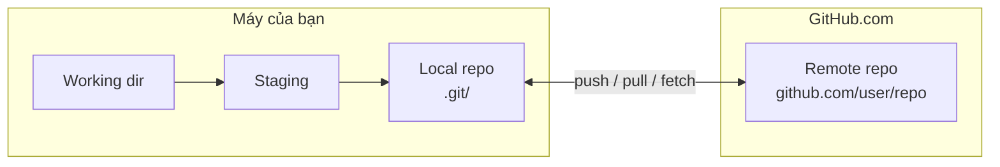
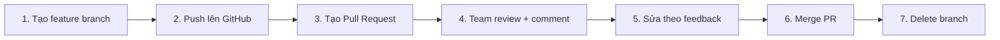

# 🎓 Đồng nghiệp vào team — push / pull / Pull Request

> **Tác giả:** Mr.Rom\
> **Phiên bản:** v2.2.0\
> **Tạo lúc:** 16/05/2026\
> **Cập nhật:** 24/05/2026\
> **Level:** Basic\
> **Tags:** [MUST-KNOW]\
> **Yêu cầu trước:** [00_branching-and-merging.md](./00_branching-and-merging.md), đã có account [GitHub](https://github.com)

> 🎯 *Nối tiếp bài trước: project chạy ngon, sếp gửi thêm 1 đồng nghiệp junior vào team. Bạn phải share code với họ. Bài này dạy push/clone/pull/Pull Request — cách 2 người (hoặc 200) code chung 1 project.*

## 🎯 Sau bài này bạn sẽ

- [ ] Hiểu **remote** là gì, **origin** là gì
- [ ] Push code local lên GitHub (`git push`)
- [ ] Clone repo về máy khác (`git clone`)
- [ ] Pull thay đổi từ remote về local (`git pull`)
- [ ] Tạo Pull Request trên GitHub (basic workflow)

---

## Tình huống — Có đồng nghiệp mới vào team, làm sao share code?

Bạn đã code project `myapp` được 2 tuần (qua bài 01-02). Sáng nay sếp dắt 1 đồng nghiệp junior qua bàn bạn:

> *"Share project myapp cho bạn này nhé. Hai bạn cùng làm — junior phụ trách Frontend, bạn tiếp Backend. Tuần sau demo."*

Bạn bí. Có 4 cách bạn từng thấy:
1. **Email file ZIP?** — mỗi lần sửa lại zip → cuối ngày 20 file zip, đồng nghiệp không biết bản nào mới 😩
2. **USB?** — 2020 rồi mà còn USB? 😅
3. **Google Drive folder?** — sync tự động, nhưng không có commit history, conflict ghi đè 🤔
4. **GitHub?** — sếp nhắc *"đẩy lên GitHub đi, đồng nghiệp clone về là xong"* — đúng ✅

Bạn mới hiểu: GitHub không phải "Dropbox cho dev" — nó là **remote Git repo**. Cả bạn và đồng nghiệp đều có repo local riêng, đồng bộ qua remote GitHub. Mỗi commit có message rõ ràng, conflict resolve được, history đầy đủ.

> 💡 Bài 01-02 mọi thứ bạn làm đều **local** — chỉ ở máy bạn. Hôm nay là lần đầu bạn đẩy code "lên mây".

---

## 1️⃣ Vậy remote và origin là gì?

**Định nghĩa**: **Remote** là repo Git đặt ở 1 vị trí khác (thường là server cloud như GitHub). Local repo của bạn có thể "kết nối" với 1 hoặc nhiều remote.

**🪞 Ẩn dụ**: *Remote giống như **Dropbox cho code**, nhưng có chủ ý. Bạn quyết định khi nào sync (`git push`/`git pull`), commit có message rõ ràng, có thể quay lại version cũ.*

### Mô hình mental — Local vs Remote



| | Local | Remote |
|---|---|---|
| Vị trí | Máy bạn | Server cloud |
| Truy cập | Mọi lúc, kể cả offline | Cần internet |
| Tốc độ | Tức thì | Phụ thuộc network |
| Backup | Không (1 máy) | Có (server) |

### Origin là gì

**`origin`** = **tên mặc định** của remote chính. Khi `git clone <url>`, Git tự đặt remote đó là `origin`.

→ `git push origin main` = "đẩy branch `main` lên remote tên `origin`".

Bạn có thể đặt tên khác (vd `upstream`, `production`) nhưng `origin` là convention.

---

## 2️⃣ Đẩy code lên GitHub lần đầu

### Setup: tạo repo trên GitHub

1. Vào [github.com](https://github.com) → đăng nhập
2. Click nút **"+"** (top right) → **"New repository"**
3. Điền:
   - **Repository name**: `my-first-git-project` (giống folder local)
   - **Description**: optional
   - **Visibility**: **Public** (cho beginner — portfolio) hoặc **Private**
   - **❌ KHÔNG tích** "Initialize this repository with..." (vì local đã có sẵn)
4. Click **"Create repository"**

GitHub show 1 trang với hướng dẫn. Phần "**...or push an existing repository from the command line**" là cái mình cần:

```bash
git remote add origin https://github.com/<your-username>/my-first-git-project.git
git branch -M main
git push -u origin main
```

### 🛠️ 3.1 Add remote — `git remote add`

Trong folder local (đã có commits từ bài 01):

```bash
cd ~/Desktop/my-first-git-project
git remote add origin https://github.com/<your-username>/my-first-git-project.git
```

Verify:

```bash
git remote -v
```

```
origin  https://github.com/your-username/my-first-git-project.git (fetch)
origin  https://github.com/your-username/my-first-git-project.git (push)
```

→ Remote `origin` đã được link.

### 🛠️ 3.2 Push lần đầu — `git push -u origin main`

```bash
git push -u origin main
```

| Phần lệnh | Ý nghĩa |
|---|---|
| `git push` | Đẩy commit local lên remote |
| `-u` (--set-upstream) | Set tracking — lần sau `git push` không cần ghi `origin main` |
| `origin` | Remote nào |
| `main` | Branch nào |

Output:

```
Enumerating objects: 6, done.
Counting objects: 100% (6/6), done.
Delta compression using up to 8 threads
Compressing objects: 100% (3/3), done.
Writing objects: 100% (6/6), 460 bytes | 460.00 KiB/s, done.
Total 6 (delta 0), reused 0 (delta 0)
To https://github.com/your-username/my-first-git-project.git
 * [new branch]      main -> main
branch 'main' set up to track 'origin/main'.
```

→ Mở [github.com/your-username/my-first-git-project](https://github.com) trên browser — thấy code rồi! 🎉

### 🛠️ 3.3 Push tiếp theo

Sửa file:

```bash
echo "print('Pushed to GitHub')" >> hello.py
git add hello.py
git commit -m "Add GitHub push message"
git push
```

→ Lần này không cần `-u origin main` nữa (đã set tracking). Just `git push`.

### Authentication — Vấn đề khi push lần đầu

Từ 2021 GitHub bỏ password — phải dùng 1 trong 3:

#### Option A: Personal Access Token (PAT) — đơn giản

1. GitHub → **Settings** → **Developer settings** → **Personal access tokens** → **Tokens (classic)** → **Generate new token (classic)**
2. Tích scope **`repo`** (đủ cho push/pull)
3. Generate → copy token (chỉ hiện 1 lần)
4. Khi `git push` hỏi password → paste token vào

#### Option B: SSH key — tốt nhất long-term

```bash
# Tạo key
ssh-keygen -t ed25519 -C "you@example.com"

# Copy public key
cat ~/.ssh/id_ed25519.pub
```

Vào GitHub → **Settings** → **SSH and GPG keys** → **New SSH key** → paste vào.

Đổi remote sang SSH:

```bash
git remote set-url origin git@github.com:your-username/my-first-git-project.git
```

→ Sau đó push không cần nhập password.

#### Option C: GitHub CLI — modern

```bash
gh auth login
```

→ Authenticate qua browser. Sau đó `git push` tự dùng credential này.

> 💡 **Khuyên beginner**: Option C (GitHub CLI) đơn giản nhất. Power user: Option B (SSH key).

---

## 3️⃣ Đồng nghiệp làm sao có code của bạn? — `git clone`

### Clone repo có sẵn

```bash
cd ~/Desktop
git clone https://github.com/torvalds/linux.git
```

```
Cloning into 'linux'...
remote: Enumerating objects: ...
Receiving objects: 100% ...
Resolving deltas: 100% ...
```

→ Tạo folder `linux/` với toàn bộ code + lịch sử git.

`cd linux && git log --oneline | head -3` để xem:

```
abc1234 (HEAD -> master, origin/master) Latest commit
def5678 Previous commit
...
```

→ Toàn bộ lịch sử commit của Linux kernel đã có trên máy bạn!

### Clone vào tên khác

```bash
git clone https://github.com/torvalds/linux.git my-linux-fork
```

→ Folder `my-linux-fork/` thay vì `linux/`.

### Shallow clone — nhanh, chỉ lịch sử gần

```bash
git clone --depth 1 https://github.com/torvalds/linux.git
```

→ Chỉ tải commit mới nhất, không phải toàn bộ history. Repo nặng → nhanh hơn nhiều.

---

## 4️⃣ Khi đồng nghiệp push xong, bạn làm sao update? — `git pull`

Khi đồng nghiệp push code mới, hoặc bạn sửa từ máy khác → cần `pull`:

```bash
git pull
```

→ Tương đương `git fetch` + `git merge origin/<branch>`.

### Demo: sửa file trên GitHub web → pull về

1. Vào GitHub repo → click file `README.md` → click bút chì (Edit) → sửa nội dung → Commit
2. Về máy local:

```bash
git pull
```

```
remote: Enumerating objects: 5, done.
Receiving objects: 100% (3/3), done.
Updating a1b2c3d..d4e5f6g
Fast-forward
 README.md | 1 +
 1 file changed, 1 insertion(+)
```

→ File local đã update theo GitHub.

### Pull conflict

Nếu cả local và remote đều có thay đổi → conflict tương tự bài 02. Resolve bằng cách edit file + `git add` + `git commit`.

### Fetch — Pull thông minh hơn

```bash
git fetch origin
```

→ Tải thay đổi từ remote nhưng **KHÔNG merge ngay**. An toàn hơn `pull` — bạn xem trước rồi merge thủ công:

```bash
git log HEAD..origin/main    # xem commit mới có gì
git merge origin/main         # merge nếu OK
```

> 💡 **Best practice**: Power user dùng `fetch` + `merge` riêng thay vì `pull`. Beginner dùng `pull` cho đơn giản.

---

## 5️⃣ Khi cả team cùng sửa — Workflow Pull Request

Đây là workflow chuẩn khi làm việc nhóm:



### Workflow thực tế

```bash
# 1. Tạo feature branch
git checkout -b feature/add-greeting

# 2. Code + commit
echo "print('Hello world!')" > greeting.py
git add greeting.py
git commit -m "feat: add greeting feature"

# 3. Push lên GitHub
git push -u origin feature/add-greeting
```

GitHub trả về link:

```
remote: Create a pull request for 'feature/add-greeting' on GitHub by visiting:
remote:      https://github.com/your-username/repo/pull/new/feature/add-greeting
```

4. Click link → trang GitHub mở → **"Create pull request"** → điền title + description → **"Create pull request"**

5. **Team review**:
   - Đồng nghiệp comment "đổi tên function này"
   - Bạn sửa local + commit + push tiếp → PR tự update
6. Khi PR được approve → click **"Merge pull request"** → code merge vào `main`
7. Click **"Delete branch"** trên GitHub. Local cũng xóa:
   ```bash
   git checkout main
   git pull
   git branch -d feature/add-greeting
   ```

### Pull Request — Tại sao quan trọng

- 👀 **Code review** — team check trước khi vào `main`
- 💬 **Discussion** — comment trên từng dòng code
- 🔍 **Diff visual** — GitHub hiển thị thay đổi đẹp
- 🤖 **CI/CD** — tự run test khi có PR
- 📊 **History** — record ai đã review, approve, merge

→ Mọi team chuyên nghiệp dùng PR workflow. Không bao giờ commit thẳng `main`.

### GitHub CLI cho PR

Thay vì click web, dùng `gh`:

```bash
gh pr create --title "feat: add greeting" --body "Adds hello function"
gh pr list
gh pr review 123 --approve
gh pr merge 123 --squash
```

---

## 💡 Cạm bẫy thường gặp & Best practice

### ❌ Cạm bẫy: `git push --force` xóa nhầm commit của team

```bash
git push --force    # ⚠️ OVERWRITE remote history
```

- **Triệu chứng**: đồng nghiệp push commit X, bạn `--force` → X biến mất khỏi remote
- **Cách tránh**:
  - KHÔNG BAO GIỜ `--force` lên branch shared (vd `main`)
  - Nếu cần overwrite, dùng `--force-with-lease` (an toàn hơn — fail nếu remote có thay đổi mới)
  - Setup branch protection trên GitHub → cấm force push

### ❌ Cạm bẫy: Push code có credentials

- **Triệu chứng**: `.env` chứa API key → `git add .` → push lên public repo → leak
- **Cách tránh**:
  - `.gitignore` ngay từ `git init` (xem bài 01 §3)
  - Pre-commit hook check file nhạy cảm
  - Nếu lỡ leak: **rotate key NGAY** + force-remove khỏi history (`git filter-repo`)

### ❌ Cạm bẫy: Pull khi đang có thay đổi local chưa commit

- **Triệu chứng**: `git pull` báo lỗi `Your local changes would be overwritten`
- **Fix**: 
  - Cách 1: commit local trước → pull
  - Cách 2: `git stash` (lưu tạm thay đổi) → `git pull` → `git stash pop`

### ❌ Cạm bẫy: Push wrong branch

```bash
git push origin local-branch:wrong-branch
```

- Hậu quả: tạo branch `wrong-branch` trên remote khác ý
- **Cách tránh**: luôn explicit `git push origin <correct-name>`, double-check `git status`

### ✅ Best practice: PR Description chuẩn

```markdown
## Summary
Thêm tính năng authentication qua OAuth Google.

## Changes
- Thêm `auth/oauth.py` xử lý OAuth flow
- Thêm endpoint `/login/google`
- Update settings.py với GOOGLE_CLIENT_ID

## Test plan
- [x] Login với Google account
- [x] Logout
- [x] Error handling khi reject permission

## Screenshot


Closes #42
```

→ PR description tốt giúp reviewer hiểu nhanh + approve nhanh.

### ✅ Best practice: Commit nhỏ, push thường xuyên

→ Push tối thiểu 1 lần/ngày, dù chưa xong feature. Backup an toàn + reviewer thấy progress.

### ✅ Best practice: Branch protection trên GitHub

GitHub repo → Settings → Branches → Add rule cho `main`:
- ✅ Require PR before merging
- ✅ Require approvals (≥1)
- ✅ Require status checks (CI) pass
- ✅ Disallow force push

→ Đảm bảo `main` luôn xanh + có review.

---

## 🧠 Tự kiểm tra (Self-check)

**Q1.** Sự khác nhau giữa `git fetch` và `git pull`?

<details>
<summary>💡 Đáp án</summary>

- `git fetch`: **chỉ tải** commit mới từ remote về, KHÔNG merge vào branch local. Bạn có thể xem trước (`git log HEAD..origin/main`) rồi tự `merge` khi sẵn sàng.

- `git pull`: tải + merge ngay vào branch hiện tại (tương đương `fetch` + `merge` cùng lúc).

→ `pull` tiện hơn cho beginner. Power user dùng `fetch` để control kỹ.

</details>

**Q2.** Khi `git clone <url>`, Git tự đặt tên remote là gì?

<details>
<summary>💡 Đáp án</summary>

**`origin`**. Đây là convention mặc định. Tất cả `git push` sau đó (nếu không specify) đều push lên `origin`.

Bạn có thể đổi tên (`git remote rename origin upstream`) nhưng `origin` được khuyến cáo cho remote chính.

</details>

**Q3.** Hậu quả của `git push --force` lên branch shared?

<details>
<summary>💡 Đáp án</summary>

**Cực kỳ nguy hiểm**. `--force` **overwrite** lịch sử remote với local. Nếu đồng nghiệp đã push commit lên remote, commits đó **biến mất**. Họ sẽ thấy `git pull` báo conflict bất thường + có thể mất công sức của họ.

**An toàn hơn**: `git push --force-with-lease` — chỉ force nếu remote KHÔNG có thay đổi mà bạn chưa fetch.

**Tốt nhất**: setup branch protection trên GitHub → cấm force push lên `main`.

</details>

---

## ⚡ Tra cứu nhanh (Cheatsheet)

| Lệnh | Mục đích |
|---|---|
| `git remote -v` | List remotes |
| `git remote add origin <url>` | Add remote `origin` |
| `git remote set-url origin <url>` | Đổi URL remote |
| `git remote remove origin` | Xóa remote |
| `git push -u origin main` | Push branch `main` + set tracking |
| `git push` | Push (sau khi đã set tracking) |
| `git push origin :branch-name` | Xóa branch trên remote |
| `git push --force-with-lease` | Force push an toàn |
| `git clone <url>` | Clone repo về |
| `git clone <url> <dir>` | Clone vào folder cụ thể |
| `git clone --depth 1 <url>` | Shallow clone (nhanh) |
| `git fetch origin` | Tải mới về, không merge |
| `git pull` | Fetch + merge |
| `git pull --rebase` | Pull bằng rebase thay merge |
| `git stash` | Lưu tạm thay đổi local |
| `git stash pop` | Áp dụng lại stash |

### GitHub CLI

| Lệnh | Mục đích |
|---|---|
| `gh auth login` | Login |
| `gh repo create` | Tạo repo mới |
| `gh repo clone <repo>` | Clone |
| `gh pr create` | Tạo PR |
| `gh pr list` | List PR |
| `gh pr checkout <number>` | Checkout PR về local |
| `gh pr merge <number>` | Merge PR |

---

## 📚 Từ Điển Thuật Ngữ (Glossary)

| EN | VN | Giải thích |
|---|---|---|
| Remote | Kho từ xa | Repo Git ở server (vd GitHub) |
| Origin | (giữ nguyên) | Tên mặc định của remote chính |
| Upstream | (giữ nguyên) | Tên thường dùng cho remote gốc khi fork |
| Push | Đẩy | Upload commits từ local lên remote |
| Pull | Kéo | Tải commits từ remote về local + merge |
| Fetch | Tải | Tải commits từ remote, KHÔNG merge |
| Clone | Sao chép | Tải toàn bộ repo (code + history) từ remote |
| Fork | (giữ nguyên) | Copy 1 repo lên account của bạn (GitHub feature) |
| Pull Request (PR) | Yêu cầu kéo | Đề xuất merge từ branch X vào branch Y, có review |
| Merge conflict | Xung đột merge | Khi 2 phía sửa cùng dòng → cần resolve thủ công |
| Stash | (giữ nguyên) | Lưu tạm thay đổi local |
| SSH key | Khóa SSH | Cặp public/private key để xác thực không cần password |
| PAT | Personal Access Token | Token thay password để auth với GitHub |

---

## 🔗 Liên kết & Tài nguyên

### Bài liên quan

| Hướng | Bài |
|---|---|
| ⬅️ Bài trước | [01_resolving-conflicts.md](./01_resolving-conflicts.md) — Giải quyết xung đột gộp code |
| ➡️ Bài tiếp | [../03_advanced/00_undo-and-recovery.md](../03_advanced/00_undo-and-recovery.md) — Bạn lỡ tay 2h sáng (Undo & Recovery) |
| 🧪 Thực hành | [lab_team-pull-request.md](../../exercises/02_intermediate/lab_team-pull-request.md) — Thực hành làm việc nhóm PR |
| 🗺️ Sitemap Git | [Lộ trình chinh phục Git (README)](../../README.md) |

### 🌐 Tài nguyên tham khảo khác

- [GitHub Docs](https://docs.github.com/en) — official
- [GitHub Skills](https://skills.github.com/) — interactive courses (PR, fork, ...)
- [Pro Git Ch.5 — Distributed Git](https://git-scm.com/book/vi/v2/Phân-tán-trong-Git-Quy-trình-Phân-tán-Trong-Git)
- [GitHub CLI manual](https://cli.github.com/manual/)

---

## 📌 Nhật ký thay đổi (Changelog)

- **v2.2.0 (24/05/2026)** — Thay tên riêng tự bịa bằng vai trò chung ("đồng nghiệp"). Tiêu đề đổi thành "Đồng nghiệp vào team". Tiêu đề mục và phần dẫn dắt đều dùng cách gọi chung. Nội dung kỹ thuật giữ nguyên 100%.

- **v2.1.0 (24/05/2026)** — Chuẩn hóa cách xưng hô về người đọc (dùng "bạn" generic), bỏ tên riêng tự bịa. Nội dung kỹ thuật giữ nguyên.

- **v2.0.0 (19/05/2026)** — Viết lại bố cục:
  - Tiêu đề gắn vào tình huống thực
  - Mở bằng **tình huống sếp gửi đồng nghiệp mới vào team**, bạn phải share code — so sánh 4 cách (ZIP / USB / Drive / GitHub)
  - Đổi tiêu đề mục sang câu hỏi tự nhiên
  - Thống nhất giữ Git ở `02_tools/git/`
  - Sửa lại độ sâu đường dẫn tương đối
- **v1.0.0 (16/05/2026)** — Bản đầu tiên — push/clone/pull/PR workflow + authentication (PAT/SSH/CLI) + 6 pitfall/best-practice.
