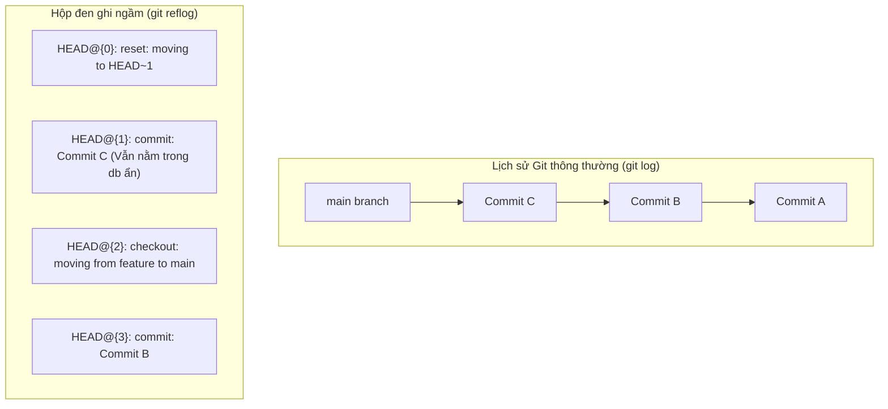

# 🎓 Cứu hộ thảm họa mã nguồn với Git Reflog

> **Tác giả:** Mr.Rom\
> **Phiên bản:** v2.0.1\
> **Tạo lúc:** 26/05/2026\
> **Cập nhật:** 10/06/2026\
> **Level:** Advanced\
> **Tags:** [MUST-KNOW]\
> **Yêu cầu trước:** [Quy tắc undo và sửa sai](./00_undo-and-recovery.md) ✅

> 🎯 *Bài học "hồi sinh" tối thượng — Khám phá sức mạnh của chiếc hộp đen ghi lại mọi vết tích hoạt động của HEAD trong Git. Sau bài học này, bạn sẽ nắm giữ trong tay tấm bùa hộ mệnh tối cao để cứu vãn mọi thảm họa mất code tồi tệ nhất, ngay cả khi bạn nghĩ rằng dữ liệu đã bị xóa vĩnh viễn khỏi ổ cứng!*

---

## 🎯 Sau bài này bạn sẽ
- [ ] Hiểu rõ bản chất khác biệt giữa `git log` và `git reflog`
- [ ] Hiểu cơ chế hoạt động ngầm của **Garbage Collector** và **Dangling Commits** trong Git
- [ ] Thành thạo cách đọc hiểu tọa độ thời gian dạng `HEAD@{N}`
- [ ] Tự tay hồi sinh thành công các commit bị xóa mất bởi lệnh `git reset --hard`
- [ ] Phục hồi nguyên vẹn cả một nhánh tính năng (Branch) lỡ tay bị xóa nhầm

---

## Tình huống — Giây phút cận kề thảm họa lúc 2 giờ sáng

Lại là câu chuyện 2 giờ sáng. Bạn vừa hoàn thành xuất sắc 3 ngày code tính năng Giỏ hàng. Mệt mỏi và mắt đã nhòe đi vì thiếu ngủ, bạn dọn dẹp các nhánh phụ cũ bằng lệnh:

```bash
git branch -D feature/shopping-cart
```
*Nhấn Enter.* Terminal hiển thị dòng chữ lạnh lùng:
```
Deleted branch feature/shopping-cart (was a1b2c3d).
```

Chợt bạn giật mình, tỉnh cả ngủ. Bạn lạnh toát sống lưng khi nhận ra: **Bạn vừa xóa nhầm chính cái nhánh tính năng Giỏ hàng cực kỳ quan trọng mà bạn chưa kịp push lên GitHub!**

Bạn gõ cuống cuồng lệnh `git log` để tìm lại. Trống trơn. Nhánh `main` hiện tại chỉ chứa code của tuần trước. Toàn bộ 3 ngày code cật lực của bạn đã biến mất không một dấu vết. Bạn tự trách bản thân, muốn đập đầu vào bàn phím và nghĩ đến cảnh sáng mai phải cúi đầu xin sếp viết lại từ đầu.

```
[Xóa nhánh local chưa push] ───x───> [git log không thấy] ───> [Tuyệt vọng]
```

Lúc này, hãy nhớ một nguyên tắc cốt lõi: **"Trong Git, dữ liệu đã từng được commit hầu như không bao giờ biến mất thật sự. Hãy dùng Reflog!"**

---

## 1️⃣ Bản chất của Git Reflog — Chiếc Hộp Đen Máy Bay

Để hiểu vì sao Git lại có khả năng "siêu nhiên" này, bạn cần hiểu bản chất của hệ thống lưu trữ bên dưới của nó.



#### `git log` hiển thị những gì?
`git log` chỉ đơn giản là đi theo con trỏ nhánh hiện tại (ví dụ `main`) và duyệt ngược về quá khứ qua các commit cha. Nếu bạn xóa nhánh hoặc dùng `git reset --hard` để dịch chuyển con trỏ nhánh lùi lại, `git log` sẽ hoàn toàn bị mù và không hiển thị các commit bị bỏ rơi đó nữa.

#### `git reflog` (Reference Log) hiển thị những gì?
Reflog là một **hệ thống ghi nhật ký độc lập, chạy ngầm** của Git. Nó không quan tâm lịch sử nhánh của bạn ra sao. Nó chỉ có một nhiệm vụ duy nhất: **Ghi lại chính xác mọi hành động di chuyển của con trỏ HEAD trên máy local của bạn.**
-   Bạn checkout sang nhánh khác? → Reflog ghi lại.
-   Bạn tạo commit mới? → Reflog ghi lại.
-   Bạn chạy lệnh reset nguy hiểm? → Reflog ghi lại tọa độ trước và sau khi reset.
-   Bạn lỡ tay xóa nhánh? → Reflog vẫn lưu giữ mã SHA-1 của commit cuối cùng trên nhánh đó trước khi bị xóa!

---

## 2️⃣ Cơ chế Garbage Collection — Bí mật lưu giữ dữ liệu ẩn

Khi bạn xóa một nhánh, Git thực chất chỉ xóa đi **tấm nhãn (tag / pointer)** mang tên nhánh đó, chứ **không hề xóa dữ liệu vật lý** của các commit bên trong ổ cứng.

Các commit này rơi vào trạng thái gọi là **Dangling Commits (Commit mồ côi / lơ lửng)**. Chúng vẫn nằm im lặng, an toàn bên trong database ẩn của thư mục `.git/`.

Git sở hữu một bộ dọn rác tự động chạy ngầm gọi là **Garbage Collector (`git gc`)**. 
-   Các commit mồ côi này sẽ được Git bảo vệ nghiêm ngặt trong vòng **90 ngày** mặc định.
-   Trong suốt 90 ngày đó, chỉ cần bạn tìm lại được mã SHA-1 của chúng (thông qua Reflog), bạn có thể lôi chúng sống dậy chỉ trong 1 giây.
-   Sau 90 ngày, nếu hoàn toàn không có hoạt động nào chạm tới, Git mới chính thức dọn dẹp vật lý để giải phóng bộ nhớ.

---

## 3️⃣ Bắt tay vào cứu hộ thảm họa thực tế

### Kịch bản 1: Hồi sinh Commit bị xóa mất do `git reset --hard`

Tình huống: Bạn lỡ tay reset cứng làm biến mất commit `c7d8e9f` chứa code quan trọng. `git log` mất dấu vết.

#### Bước 3.1: Gọi chiếc hộp đen cứu hộ
Gõ lệnh:
```bash
git reflog
```
Output thực tế hiển thị:
```
a2b3c4d (HEAD -> main) HEAD@{0}: reset: moving to HEAD~1
c7d8e9f HEAD@{1}: commit: feat: complete shopping cart checkout flow   <-- ĐÂY RỒI!
a2b3c4d (HEAD -> main) HEAD@{2}: commit: feat: add checkout UI
```
-   **Giải thích output:**
    -   `HEAD@{0}`: Thao tác gần đây nhất chính là cú reset tai hại quay về commit `a2b3c4d`.
    -   `HEAD@{1}`: Thao tác ngay trước đó chính là lúc bạn tạo ra commit `c7d8e9f` với tin nhắn `"feat: complete shopping cart checkout flow"`. Đây chính là báu vật đã mất tích!

#### Bước 3.2: Dịch chuyển dòng thời gian quay lại
Chỉ cần dùng lệnh reset cứng thẳng tới tọa độ mã SHA-1 vừa tìm được:
```bash
git reset --hard c7d8e9f
```
Output thực tế:
```
HEAD is now at c7d8e9f feat: complete shopping cart checkout flow
```
Gõ `git log --oneline` để kiểm chứng → Commit đã quay trở lại kiêu hãnh như chưa từng có cuộc chia ly! 🎉

---

### Kịch bản 2: Hồi sinh Nhánh (Branch) lỡ tay bị xóa nhầm

Tình huống: Bạn lỡ gõ `git branch -D feature/shopping-cart` và làm mất cả nhánh phụ khi chưa kịp push.

#### Bước 3.1: Tìm kiếm vết tích commit cuối cùng của nhánh
Gõ lệnh:
```bash
git reflog
```
Quét mắt tìm dòng nhật ký ghi nhận hành vi commit hoặc checkout cuối cùng của nhánh đó trước khi bị xóa:
```
a2b3c4d (HEAD -> main) HEAD@{0}: checkout: moving from feature/shopping-cart to main
f9e8d7c HEAD@{1}: commit: feat: add payment validation inside cart     <-- ĐÂY RỒI!
```
-   **Giải thích output:** Dòng `HEAD@{1}` ghi nhận commit cuối cùng bạn thực hiện trên nhánh shopping-cart trước khi switch sang main chính là mã SHA-1 `f9e8d7c`.

#### Bước 3.2: Hồi sinh nhánh bằng cách dựng lại con trỏ
Bạn không cần reset nhánh `main` về đó. Hãy tạo một nhánh mới tinh ngay tại tọa độ commit đã mất tích đó:
```bash
git branch feature/shopping-cart f9e8d7c
```

Hãy gõ `git branch` để kiểm tra danh sách nhánh:
```bash
git branch
```
Output thực tế:
```
  feature/shopping-cart   <-- ĐÃ HỒI SINH THÀNH CÔNG!
* main
```
-   **Giải thích:** Nhánh `feature/shopping-cart` đã được dựng lại con trỏ trỏ đúng vào commit `f9e8d7c`. Bạn chỉ cần `git switch feature/shopping-cart` và tiếp tục làm việc bình thường!

---

## 💡 Lời khuyên vàng về Reflog

-   ⚠️ **Reflog chỉ tồn tại ở máy local của bạn.** GitHub hoàn toàn không lưu trữ reflog của bạn. Do đó, nếu bạn làm mất code và làm hỏng cả máy tính vật lý trước khi dùng reflog, dữ liệu sẽ mất thật sự.
-   **Reflog có tính hữu hạn:** Hãy cứu hộ càng sớm càng tốt. Đừng để quá 90 ngày.
-   **Giữ cái đầu lạnh:** Khi gặp tai nạn mã nguồn, hành vi tệ nhất là gõ loạn xạ các lệnh reset, xóa file trên ổ cứng. Hãy dừng tay gõ phím, gọi `git reflog` và bình tĩnh phân tích dòng thời gian.

---

## 🧠 Tự kiểm tra (Self-check)

**Q1: Nếu tôi sửa code ở Working Directory (chưa git add và chưa commit lần nào) rồi lỡ tay gõ `git reset --hard HEAD` thì `git reflog` có cứu được tôi không?**
<details>
<summary>💡 Xem giải thích</summary>

**Rất tiếc là KHÔNG.** Reflog và Garbage Collector của Git chỉ có thể bảo vệ và ghi dấu những dữ liệu **đã từng được commit ít nhất một lần** (hoặc tối thiểu đã được `git add` đưa vào Staging Area để Git tạo file blob tạm). Nếu bạn viết code mà chưa từng lưu vết vào Git database, rồi chạy reset hard → toàn bộ code đó sẽ bị xóa vật lý trên ổ cứng và không công cụ Git nào có thể phục hồi được. 

**Quy tắc vàng:** Hãy commit nhỏ và commit thường xuyên!

</details>

**Q2: Tọa độ `HEAD@{2}` trong kết quả reflog nghĩa là gì?**
<details>
<summary>💡 Xem giải thích</summary>

`HEAD@{2}` nghĩa là **"vị trí của con trỏ HEAD cách đây 2 bước thao tác"**. Mỗi khi bạn chạy một lệnh làm thay đổi vị trí của HEAD (checkout, commit, reset...), Git sẽ đẩy chỉ số index lên: `HEAD@{0}` là hiện tại, `HEAD@{1}` là cách 1 bước, `HEAD@{2}` là cách 2 bước.

</details>

---

## 📚 Từ Điển Thuật Ngữ (Glossary)

| Thuật ngữ | Ý nghĩa kỹ thuật | Ẩn dụ thực tế |
|---|---|---|
| **Reflog** | Nhật ký tham chiếu ghi lại mọi hành động di chuyển của HEAD cục bộ. | Chiếc hộp đen của máy bay. |
| **Dangling Commit** | Commit mồ côi không có bất kỳ con trỏ nhánh nào quản lý. | Mảnh hành lý thất lạc trong kho sân bay. |
| **Garbage Collector** | Bộ dọn rác ngầm dọn dẹp các commit mồ côi sau 90 ngày. | Nhân viên vệ sinh định kỳ dọn kho đồ thất lạc. |
| **`HEAD@{N}`** | Ký hiệu biểu thị vị trí của HEAD cách đây N bước thao tác. | Tọa độ lịch sử du hành thời gian. |

---

## 🔗 Liên kết & Tài nguyên

### Bài học & Bài tập liên quan

| Hướng đi | Bài học / Thử thách |
|---|---|
| ⬅️ Bài trước | [00_undo-and-recovery.md](./00_undo-and-recovery.md) — Quy tắc undo và sửa sai cơ bản |
| ➡️ Bài tiếp | [02_rebase-and-cherry-pick.md](./02_rebase-and-cherry-pick.md) — Làm sạch lịch sử với Rebase & Cherry-Pick |
| 🧪 Thử thách Labs | [lab_emergency-reflog-rescue.md](../../exercises/03_advanced/lab_emergency-reflog-rescue.md) — Thực chiến cứu hộ thảm họa Reflog |

---

## 📌 Nhật ký thay đổi (Changelog)

- **v2.0.0 (26/05/2026)** — Bài học nâng cao về Reflog: cơ chế Garbage Collection ngầm, commit mồ côi (dangling), và 2 kịch bản hồi sinh dữ liệu (commit bị reset, nhánh bị xoá).
- **v2.0.1 (10/06/2026)** — Chuẩn hoá xưng hô: gỡ tên tác giả khỏi thân bài và heading; đổi field metadata `Prerequisites` → `Yêu cầu trước`, link text theo tiêu đề bài.
