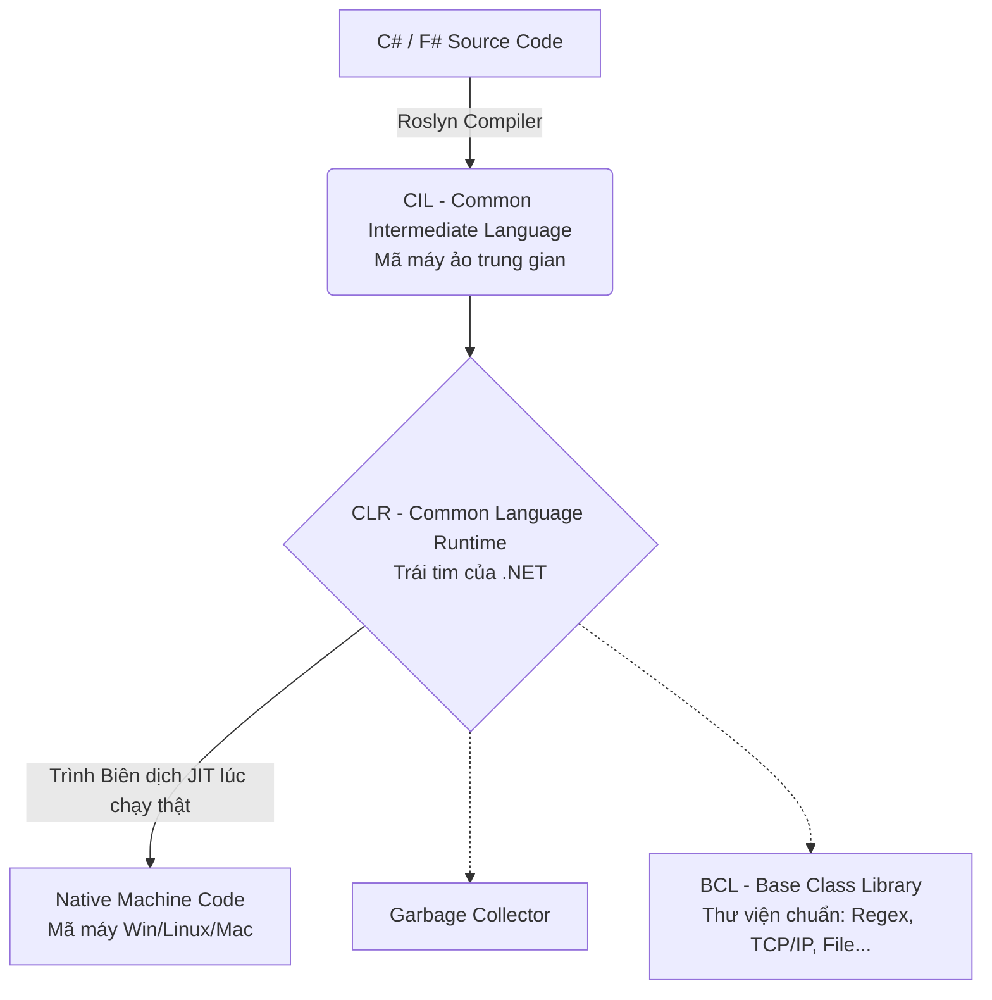

# 🌐 Bức tranh toàn cảnh Hệ sinh thái .NET

> `[INTERMEDIATE]` — Lịch sử, kiến trúc và các Framework lõi cấu thành nên khối công nghệ phần mềm đứng đầu Enterprise của Microsoft.

---

## 1. Sự tiến hoá Runtime (Sự thật về các phiên bản .NET)

Hệ sinh thái Microsoft nổi tiếng với việc đổi tên liên tục khiến người mới "loạn não". Dưới đây là lược sử bạn BẮT BUỘC phải phân biệt được.

| Nền tảng | Dấu mốc | Bản chất & Ý nghĩa | Trạng thái hiện tại |
|---|---|---|---|
| **.NET Framework** | 2002 - 2019 (v1.0 - 4.8) | Chạy độc quyền trên Windows. Sinh ra để đánh bật Java. Quá già cỗi và cồng kềnh. | Chết lâm sàng / Chỉ Maintain dự án cũ. |
| **.NET Core** | 2016 - 2019 (v1.0 - 3.1) | Cuộc cách mạng đập đi xây lại. Mã nguồn mở, siêu nhẹ, chạy chéo Linux / macOS. | Tiền đề của kỷ nguyên mới. |
| **.NET 5, 6, 7, 8+** | 2020 - Hiện tại | Microsoft quyết định nối từ ".NET Core", hợp nhất mọi thứ và xóa bỏ chữ "Core" cho gọi tắt. | **Tương lai**. Từ nay về sau chỉ gọi 1 chữ là .NET. Bản chẵn (6, 8) là LTS (Hỗ trợ lâu dài 3 năm). |
| **.NET Standard** | Concept ảo (Giao thư viện) | Một bản cam kết (API contract). Thư viện nào build ra chuẩn này sẽ chạy được cho CẢ .NET Framework lận .NET Core. | Không còn cần thiết từ .NET 5 trở đi. |

---

## 2. Kiến trúc Lõi bên dưới nền đất

Bất kể bạn viết bằng C#, F# hay VB.NET, mọi code đều đi qua các tầng giống nhau:



- **CIL (IL):** Code trung gian giống hệt Java Bytecode. Giúp bạn nén thành `file.dll` chạy được mọi Hệ điều hành.
- **CLR:** Vận hành phần mềm, quản lý luồng tĩnh và dọn dọn rác (Garbage Collector).
- **Roslyn:** Trình biên dịch cực mạnh của C# (Nền tảng giúp IDE nhắc code đỉnh cao).

---

## 3. Các Mô hình Xây dựng (App Models)

Gần như mọi loại hình lập trình trên thế giới đều có khung Framework của Microsoft đáp ứng.

### 🕸️ A. Web & Cloud (ASP.NET Core)
Là "cỗ máy in tiền" chính của Microsoft. Rất nhanh vững trên TechEmpower Benchmark.
- **Web API (REST):** Sinh JSON dành cho Frontend (React/Vue/Mobile) tiêu thụ. Ngắn gọn, hiệu năng chói sáng với tính năng *Minimal APIs*.
- **MVC (Model-View-Controller):** Code C# trộn thẳng vào HTML (.cshtml) để render phía máy chủ Server-Side (Razor Pages).
- **SignalR:** Thư viện thần thánh của .NET để đánh realtime hai chiều bằng WebSockets siêu dễ dàng (Làm Web Chat, Game, Chứng khoán).
- **Blazor:** Cuộc cách mạng Frontend của C#. Biên dịch C# sang WebAssembly chạy trực tiếp trên Trình Duyệt Bẻ Gãy độc quyền Javascript.

### 📱💻 B. Mobile, Desktop & Đa nền tảng (MAUI / Xamarin)
- **Windows Forms / WPF:** Khung làm phần mềm bán hàng/kế toán doanh nghiệp độc quyền Windows mượt mà có từ hàng thập kỷ.
- **.NET MAUI (Multi-platform App UI):** Cú thay máu của Xamarin. Code UI 1 lần xuất ra 4 nền tảng (Android, iOS, macOS, Windows). Đối thủ cạnh tranh trực tiếp Flutter và React Native.

### 🎮 C. Game Development
C# phủ bóng toàn thị trường game Indie và 3D.
- **Unity:** Game engine đình đám chi phối 50% game Mobile thế giới (Chạy ngôn ngữ dính liền là C# Mono Script). 
- **Godot (Bản .NET):** Engine Open Source đang nổi cực mạnh thay thế Unity. Có bản bám C# thuần 100%. Đỉnh cao hiệu năng.

---

## 4. Entity Framework Core (EF Core) — Kẻ Cai Trị Database

ORMs (Object-Relational Mappers) sinh ra để lập trình viên khỏi gõ câu Query SQL thô cực khổ. EF Core là siêu Tool chuẩn xác do chính Microsoft tạo ra.

**Phương châm: "Biến Class tĩnh thành Bảng (Tables)"**. 
- Tự động Migration (Dò code thay đổi và Gen ra File lệnh tự xây lại cột Data trên CSDL).
- Tích hợp chuẩn LINQ để Truy Ra Chắn SQL siêu đẹp mắt.

```csharp
// Thay vì viết SQL "SELECT * FROM Users WHERE Age > 18"
var x = _context.Users.Where(u => u.Age > 18).ToList();
```

---

## 5. Quản lý Gói Bánh Răng Sinh Thái: NuGet

**NuGet** (đọc là nu-get) là chợ kho ứng dụng dành riêng cho .NET (Tương đương `npm` của Node.js, hay `pip` của Python).
Bạn gõ `dotnet add package <TênGói>` CLI thì nó tự động kéo File xuống giải cài trực tiêp vào file Cấu Trình Dự Án `.csproj`. Không cần phải chép thủ công.

---

## Gotchas — Hiểu Lầm Trầm Trọng Xa Lạc Ngành NET

| # | ❌ Tránh (Hiểu Hoặc Nhận Thức Sai Nhầm) | ✅ Đúng (Cập Nhật 2024+) | Hậu quả của Việc Gán Lệch |
|---|--------|---------|------------|
| 1 | Sánh Nghĩ Rằng .NET Đóng Tiền Chặn Source Chạy Đúng Thấy File Đuôi `.exe` Không Viền Bản Quyền Nhá. | Core Code Chuyển Gốc Thành Open Source Chứa Github Giới Cộng Hoàn Triệt Trên Rễ Linux Bất Chấp Máy Mac. | Vượt Mất Cơ Hội Vào Quỹ Enterprise Gốc Lũ Cloud Giá Rẻ Thắng Node Về Tính Viết Trạng Cấp Nghề Backend Xịn Trả Sức Chịu Cao Nhất Thế Kì . |
| 2 | Nhầm Đọc Kêu ".NET Core" Suốt Cho Những Nền Mới Đang Release 8 Gần Đây Khó Xếp Phân Chuẩn Nốt Tên Thẻ. | Quên Mất Hãng Bỏ Chữ Core Được 4 Năm Rồi. Giờ App Cứ Gọi "Tôi Làm .NET" (Bản Đầu Thập 5, 8 Số Chẵn Là Sống Yên 3 Năm Quá Dài Lưỡi). | Tưởng Nhầm Đang Sửa Framework Mã Cũ Bới Ram Dự Án Vứt Hỏng Code Từ Chục Năm Cấp Build Lỗi Phiên Báo Không Thuận Runtime DLL Nhầm Bối Thùng Tích . |
| 3 | Chóp Nặn Nhanh Build App Rỗng (Vd Thử Entity Framework) Tưởng Code Quá Nhiều Chết Boilerplate XML Trầm Lắng. | Mọi Nết Tool Sinh Boiler Giờ Áp "Global Usings Tân Dụng Ngắn" Kèm Kiêu Trình Minimal API Viết 4 Dòng Có Con Server Cháy Web Ngay Đỉnh Giống Nốt JS. | Chê Ngây App Thư Cũ Bỏ Sang Môn Rỗng Khác Xóa Thời Gian Dò Nhảy Công Thẩm Viết API Nghĩ Sai Hiệu Xuất Code Nhanh Mạch Phát Ngành Xây Framework Hiện Đạt Trạng Thái Hiện Đỉnh. |

---

## Tài nguyên Đọc Sâu Tìm Khám Bức Tổng Thể

- [Kiến Trúc Tầng Trình Bày Thẳng Web Tự Hướng .NET Documentation Platform Lõi](https://learn.microsoft.com/en-us/dotnet/fundamentals/) - Mọi thứ gốc cắm tài liệu tổng rễ Hãng Sinh Dựng Dày Dặn Số 1 IT Giới. Đóng Từ Khung Sợi Mạng Nhỏ Tới Code Dịch Bự CIL .
- [Cuốn Thiết Kế Giao Thư API Cực Cụ Thể (Framework Design Guidelines)](https://www.amazon.com/Framework-Design-Guidelines-Conventions-Libraries/dp/0321545613) - Tầm Nghĩ Thấm Khung Luật Giữ Ổn Thiết Code Lâu Dài (Cuốn Mẹ Đẻ Áp Vào .NET Gốc) Phải Đọc Nếu Muốn Đạt Senior Cấp Trình Trọng Điểm Tại Trụ MS Hệ.
