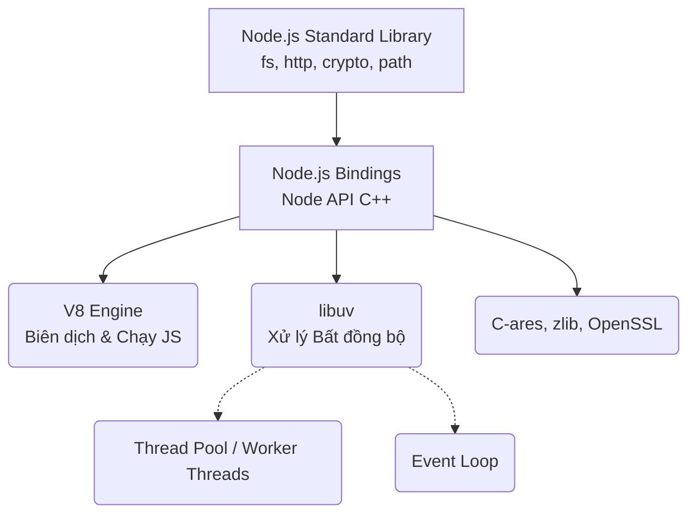
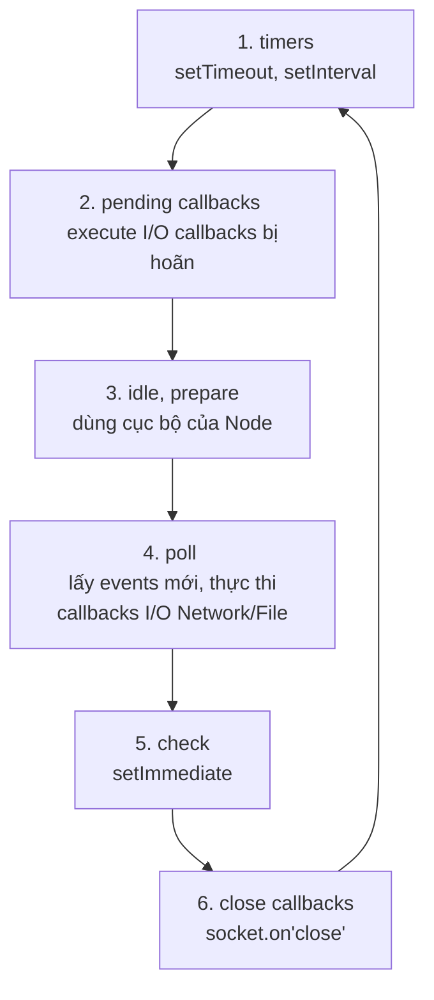

# 🚀 Node.js Deep Dive — Архіtecture & Internals

> `[ADVANCED]` — Prerequisite: `01-js-basics.md`, `03-js-modules-fundamentals.md`
> Mổ xẻ kiến trúc bên trong của Node.js: Event Loop, libuv, V8, Vấn đề Blocking.

---

## 1. Architecture Diagram — Kiến trúc lõi

Node.js không đơn thuần chỉ là JavaScript. Nó là sự kết hợp (Binding) của JavaScript (chạy qua V8) với các thư viện C/C++ để xử lý I/O (qua libuv).



Node.js hoạt động dựa trên 2 nền tảng cực kỳ mạnh mẽ:
1.  **V8 JS Engine (do Google phát triển bằng C++)**: Đóng vai trò thực thi (execution) JavaScript code siêu nhanh. Cung cấp API để Node tiêm (inject) các biến như `console`, `process` hoặc cấp quyền gọi C++ functions.
2.  **libuv (thư viện C)**: Đảm nhiệm trọng trách **Event Loop** (Vòng lặp sự kiện) và **Thread Pool** (Đội thợ thi công). Đây là trái tim của cơ chế I/O bất đồng bộ (Async I/O) không bị nghẽn (non-blocking).

---

## 2. Event Loop Phase Internals (Mổ xẻ Event Loop)

Nhiều người lầm tưởng "JavaScript đơn luồng (Single-thread)" nghĩa là Node.js chỉ có đúng 1 thread chạy mọi thứ. **Sự thật**: JS code của bạn chạy trên Main Thread, nhưng khi có I/O (File, Network), Node giao việc cho **libuv** (nơi có nhiều Thread làm việc ở background).

Event Loop trong `libuv` liên tục lặp qua **6 Phase** theo thứ tự:



- **Phase 1 (Timers)**: Kiểm tra các callback của `setTimeout()` và `setInterval()`. Nếu hết thời gian chờ, callback được đưa vào lưới xử lý.
- **Phase 4 (Poll)**: Phase quan trọng nhất. Đây là lúc Node tính toán xem nó cần đợi các kết nối TCP mới, đợi đọc file xong. Nếu Poll queue trống, Node sẽ *dừng lại chờ* ở đây cho đến khi có event mới tới hoặc khi Timer hết hạn mới nhảy qua bước 5.
- **Phase 5 (Check)**: Nơi các callback của `setImmediate()` được gọi. Rất hữu ích khi bạn muốn gọi callback *ngay lập tức sau bước Poll*.

**Microtasks Queue:**
Node còn quản lý 2 hàng đợi ưu tiên cao, xen giữa các Phase:
1. `process.nextTick()` queue (Ưu tiên SỐ 1)
2. `Promise` queue (Dành cho `.then()`)

```javascript
// Dự đoán thứ tự in ra của đoạn sau?
Promise.resolve().then(() => console.log('1. Promise'));
process.nextTick(() => console.log('2. nextTick'));
setTimeout(() => console.log('3. setTimeout'), 0);
setImmediate(() => console.log('4. setImmediate'));
console.log('5. Sync Code');

// KẾT QUẢ ĐÚNG:
// Thêm vào hàng đợi đồng bộ.
// 5. Sync Code
// 2. nextTick (nextTick Queue, chạy TRƯỚC microtask khác)
// 1. Promise (Promise Queue)
// 3. setTimeout (Event Loop: Timers phase)
// 4. setImmediate (Event Loop: Check phase)
```

---

## 3. The Thread Pool & CPU Intensive Tasks

Mặc định, libuv cấp phát một `Thread Pool` gồm **4 luồng (threads)** dùng để xử lý các tác vụ nặng vô hình sau lưng Main Thread:
- File system (`fs.readFile`)
- Cryptography (Hàm băm mật khẩu `crypto.pbkdf2`)
- DNS lookups (`dns.lookup`)

**Bài toán Blocking:**
Nếu bạn ném 1 tác vụ tính toán khổng lồ vào JS code (Main Thread) như phân tích mảng 1 tỷ phần tử, **toàn bộ Event Loop sẽ bị chặn**! Kể cả những người dùng khác đang chờ request nhỏ nhẹ cũng sẽ bị "treo".

```javascript
// ❌ DEV ÁC MỘNG (Chặn Event Loop)
app.get('/hash', (req, res) => {
    // Thuật toán mã hóa băm chặn đứng Main Thread trong 2 giây
    const pwd = crypto.pbkdf2Sync('password', 'salt', 100000, 512, 'sha512');
    res.send(pwd); 
    // TRONG TÚC 2 GIÂY NÀY, NODE.JS KHÔNG TRẢ LỜI ĐƯỢC BẤT KỲ REQUEST NÀO KHÁC!!!
});
```

**✅ Giải pháp 1: Chia nhỏ (Partitioning / setImmediate)**
Chia vòng lặp thành nhiều cụm nhỏ, đan xen bằng `setImmediate()` để Event Loop có khoảng trống rảnh thở giúp phục vụ các Event khác.

**✅ Giải pháp 2: Sử dụng Worker Threads (Offloading)**
Chính thức giới thiệu từ Node V10. Node tạo ra một V8 Isolate (Instance Node.js riêng lẻ, có cả bộ nhớ riêng) để tính toán, sau đó trả Object cho Main Thread qua IPC (Inter-Process Communication).

```javascript
// worker.js
const { parentPort } = require('worker_threads');
let result = heavyComputation();
parentPort.postMessage(result);

// main.js
const { Worker } = require('worker_threads');
const worker = new Worker('./worker.js');
worker.on('message', code => console.log("Xong!", code));
```

---

## 4. Performance Tuning / Production

1.  **Chỉnh kích thước Thread Pool (`UV_THREADPOOL_SIZE`)**
    Biến môi trường này mở rộng số thợ làm việc (default là 4). Nếu server 8 cores x 2 threads, nâng lên `UV_THREADPOOL_SIZE=16` sẽ làm tăng tốc độ File System / Crypto lên đánh kể.
2.  **Memory Management (CGC)**
    Node.js khi chạy mặc định sẽ dùng bộ nhớ ram đến tối đa 1.4GB trên máy 64bit để Garbage Collector dọn. Bạn có thể nới lỏng nếu RAM Server tới 16GB.
    ```bash
    node --max-old-space-size=4096 app.js # Nhường 4GB RAM cho tiến trình 
    ```
3.  **Tối ưu với Cluster module (PaaS)**
    Node giới hạn ở 1 CPU Core. Nếu dùng pm2 hoặc `cluster` module, bạn có thể spawn Node.js Processes bằng đúng số lượng Core có trong CPU để server đạt băng thông tuyệt đối.

---

## Gotchas — Những lỗi thường gặp (Internals)

| # | ❌ Sai lầm phổ biến | ✅ Xử lý chuẩn | Hậu quả của Sai lầm |
|---|--------|---------|------------|
| 1 | Dùng hàm có chữ `*Sync` (Ví dụ: `fs.readFileSync`) trong route API. | Chỉ được dùng module bất đồng bộ `fs.readFile()` / `fs/promises`. | Đồng bộ hóa chặn đứng Event Loop ngay tức khắc trên toàn process. Cứ gọi là tắc API. |
| 2 | Gọi hàm gọi lại (Callback) lặp đệ quy qua `process.nextTick()`. | Dùng `setImmediate()` thay thế để tránh lỗi *I/O Starvation*. | Gọi đệ quy `nextTick` khóa Node.js ở giai đoạn Microtask, chặn Event Loop nhảy vào Timers/Poll (Dừng server). |
| 3 | Mở liên kết Redis/MongoDB chập chờn mà bỏ quên gắn `.on("error")`. | Dùng `eventEmitter.on("error")` nếu dùng streams/sockets. | Chương trình lập tức sập (`uncaughtException`) ngay cả khi mới có 1 client disconnect đột ngột. |

---

## Bài tập / Thực hành khám phá Internals

- [ ] **Bài 1:** Chạy đoạn mã ví dụ thứ tự in của `nextTick/Promise/setImmediate` lên terminal. Theo dõi cẩn thận.
- [ ] **Bài 2:** Thiết lập script tính số Fibonacci đến F(50). Gửi 100 requests liên tục. Thử viết một nhánh dùng `Worker Threads` và đo thời gian khác biệt so với việc chỉ xử lý tính toán trên main thread. (Sử dụng Apache Bench / Wk).
- [ ] **Bài 3:** Chạy `node --inspect` và mổ xẻ phần Core Memory Dump thông qua trình Devtool của Google Chrome (Chrome://inspect).

---

## Tài nguyên thêm
- [Phần tài liệu Cốt lõi của Node: Cấu trúc Event Loop Của Node](https://nodejs.org/en/docs/guides/event-loop-timers-and-nexttick/) (Node.js Official Docs)
- [Video: "What the heck is the event loop anyway?" (Philip Roberts - JSConf EU)](https://www.youtube.com/watch?v=8aGhPhVfaqM) - Cách giải thích tốt nhất thế giới về Javascript Call stack & Event queues.
- [Libuv Design Overview](http://docs.libuv.org/en/v1.x/design.html) - Sách trắng thiết kế Libuv.
