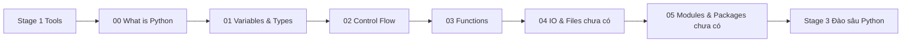

# 🎓 Python là gì? — Ngôn ngữ "dễ nhất để học, đủ mạnh để làm tất cả"

> **Tác giả:** Mr.Nguyen Van A\
> **Phiên bản:** v2.1.0\
> **Tạo lúc:** 16/05/2026\
> **Cập nhật:** 21/05/2026\
> **Level:** Basic\
> **Tags:** [MUST-KNOW]\
> **Thời lượng đọc:** ~15 phút\
> **Prerequisites:** Đã [cài Python](../../setup/install-python.md) ✅

> 🎯 *Bài INTRO — Python là gì, vì sao 80% beginner 2026 được khuyên Python trước, có thể làm gì, cách chạy thử. KHÔNG dạy syntax chi tiết (sẽ học ở bài 01 trở đi).*

## 🎯 Sau bài này bạn sẽ

- [ ] Hiểu Python là gì + lịch sử ngắn
- [ ] Biết Python dùng để làm gì (5 ứng dụng phổ biến)
- [ ] Phân biệt **Python** (ngôn ngữ) vs **CPython** (interpreter)
- [ ] Chạy được Python qua 3 cách: REPL, file `.py`, Jupyter notebook
- [ ] Biết lộ trình học tiếp theo

---

## Tình huống — bạn vừa cài Python xong, mở terminal lần đầu

Sau khi xong [Stage 1 zero-to-coder](../../../../00_Roadmaps/career/zero-to-coder_career-roadmap.md) (tools tối thiểu), bạn cài Python theo [setup guide](../../setup/install-python.md). Mở terminal:

```bash
python3 --version
# Python 3.11.7
```

OK Python đã có. Bây giờ... **gõ gì tiếp**? Tại sao 9/10 blog tutorial VN đều nói *"học Python trước"*? Python khác gì JavaScript, Java, C++ — và đặc biệt khác gì cho **bạn năm 2026**?

Bài này trả lời 3 câu đó + show bạn 3 cách chạy Python để **viết được 1 dòng code thật sự** trong vòng 5 phút.

---

## 1️⃣ Vì sao Python là default cho 80% beginner 2026?

Năm 2026, Python là **ngôn ngữ #1** theo các index TIOBE / PYPL. Vì sao mọi beginner đều khuyên Python?

| Tiêu chí | Python | Java | JS | C++ |
|---|---|---|---|---|
| **Dễ học** | ⭐⭐⭐⭐⭐ Cực dễ | ⭐⭐⭐ Verbose | ⭐⭐⭐⭐ OK | ⭐ Khó |
| **Đọc giống tiếng Anh** | ✅ | ❌ | ❌ | ❌ |
| **Hệ sinh thái thư viện** | ⭐⭐⭐⭐⭐ | ⭐⭐⭐⭐ | ⭐⭐⭐⭐⭐ | ⭐⭐⭐ |
| **Đa dụng** | Web, data, AI, automation, embedded, game | Backend, Android | Web | System, game |
| **Tốc độ chạy** | Chậm | Trung | Trung | Cực nhanh |
| **Việc làm** | Rất nhiều | Nhiều (Java đang giảm) | Rất nhiều | Vừa |

→ Beginner 2026: **Python đầu tiên** vì:
1. Syntax như tiếng Anh → giảm cognitive load học
2. Đa dụng nhất → 1 ngôn ngữ làm được hầu hết
3. Đặc biệt mạnh ở 2 lĩnh vực hot: **AI/ML** và **data science**

### Ví dụ syntax: in "Hello World"

Câu nói nổi tiếng nhất khi học lập trình: in chữ "Hello, World!" ra màn hình. Cùng 1 việc đơn giản, mỗi ngôn ngữ cần lượng code khác nhau — Python ngắn nhất:

| Ngôn ngữ | Code |
|---|---|
| **Python** | `print("Hello, World!")` |
| Java | `public class Main { public static void main(String[] args) { System.out.println("Hello, World!"); } }` |
| C++ | `#include <iostream>\nint main() { std::cout << "Hello, World!" << std::endl; return 0; }` |
| JavaScript | `console.log("Hello, World!");` |

→ Python 1 dòng. Java cần 5 dòng. Cùng ý nghĩa.

---

## 2️⃣ Vậy Python thực sự là gì?

**Định nghĩa**: Python là **ngôn ngữ lập trình thông dịch** (interpreted), bậc cao (high-level), có **dynamic typing**, tạo bởi **Guido van Rossum** năm 1991.

**🪞 Ẩn dụ**: *Python giống như **người phiên dịch giỏi** — bạn viết câu tiếng Anh tự nhiên, "phiên dịch" (interpreter) chạy ngay từng câu. Khác với compiled languages (Java, C++) như **xây nhà** — phải hoàn thành cả bản thiết kế (compile) trước khi vào ở.*

### Đặc trưng chính

6 điểm nổi bật làm Python "dễ học hơn ngôn ngữ khác" + đa dụng cho mọi domain:

| Đặc điểm | Ý nghĩa |
|---|---|
| **Interpreted** | Chạy từng dòng, không cần compile trước → nhanh prototype |
| **Dynamic typing** | Không khai báo type — Python tự detect |
| **High-level** | Trừu tượng cao — không cần quản lý memory, pointer |
| **Cross-platform** | 1 file `.py` chạy trên Mac/Win/Linux |
| **General-purpose** | Đa dụng — không bó hẹp 1 lĩnh vực |
| **"Batteries included"** | Standard library rất lớn — đa số task có sẵn |

### Python vs CPython — phân biệt

Nhiều người mới hay nhầm 2 từ này. Phân biệt giúp đọc tài liệu chính thức + chọn đúng interpreter cho task đặc biệt:

| | **Python** | **CPython** |
|---|---|---|
| Là gì | Ngôn ngữ + spec | Implementation cụ thể (interpreter) |
| Tác giả | Python Software Foundation | Guido van Rossum + community |
| Có alternative? | Không (chỉ 1 ngôn ngữ) | Có: PyPy, Jython, IronPython, MicroPython |
| Khi nào dùng | Mọi nơi | Hầu hết dùng CPython (mặc định) |

→ Khi bạn cài "Python" từ python.org, thực ra đang cài **CPython**. Đó là implementation mặc định 99% người dùng.

---

## 3️⃣ Python dùng để làm gì

🪞 **Ẩn dụ tiếp**: *Nếu Python là "người phiên dịch giỏi" thì ngày nay phiên dịch này được mời vào 5 ngành công nghiệp lớn nhất — mỗi ngành có "bộ sách giáo khoa" (thư viện) riêng.*

5 lĩnh vực Python thống trị 2026:

### 🤖 AI / Machine Learning

Đây là **mảng số 1** Python dominate. Gần như 100% AI research + production dùng Python:

- **PyTorch**, **TensorFlow** — *Deep Learning* (mạng neural sâu)
- **scikit-learn** — ML classic (hồi quy, phân loại)
- **LangChain**, **OpenAI SDK** — LLM / GenAI (ChatGPT/Claude apps)
- **Hugging Face** — Pre-trained models (download model có sẵn)

### 📊 Data Science

Phân tích dữ liệu — Python là chuẩn vàng (thay R cũ):

- **Pandas** — Bảng dữ liệu (DataFrame) — như Excel programmatic
- **NumPy** — Tính toán số học mảng nhanh
- **Matplotlib**, **Seaborn**, **Plotly** — Vẽ biểu đồ
- **Jupyter Notebook** — Sổ tay tương tác để phân tích

### 🌐 Web Backend

Viết API/server cho web/mobile app:

- **FastAPI** — *Modern* API (hỗ trợ *async* — chạy song song hiệu quả)
- **Django** — Full-stack framework (cả frontend + backend)
- **Flask** — Microframework — nhẹ, đơn giản

### 🤖 Automation / Scripting

Tự động hoá việc lặp đi lặp lại:

- **System admin** — thay shell script bằng Python (mạnh hơn)
- **Web scraping** — lấy dữ liệu từ web (BeautifulSoup, Scrapy, Playwright)
- **Task automation** — đổi tên hàng loạt file, gửi email tự động, cào dữ liệu

### 🛠️ DevOps tools
- **Ansible** (config management) viết bằng Python
- **Saltstack**, **Fabric** — automation
- **Custom CI/CD scripts**

### Ngoài ra
- **Game dev** (Pygame — đơn giản)
- **Embedded** (MicroPython trên Raspberry Pi)
- **Education** (Python là ngôn ngữ #1 trong giảng dạy)

---

## 4️⃣ Làm sao chạy Python? — 3 cách phổ biến

### 🅰️ Cách 1: REPL (Read-Eval-Print Loop) — Test nhanh

Mở terminal:

```bash
python
```

```
Python 3.12.0 (main, Oct  2 2023, ...)
Type "help", "copyright", "credits" or "license" for more information.
>>>
```

`>>>` = prompt REPL — gõ Python rồi Enter, chạy ngay:

```python
>>> print("Hello, Python!")
Hello, Python!
>>> 2 + 3
5
>>> name = "Nguyen Van A"
>>> f"Hello, {name}!"
'Hello, Nguyen Van A!'
>>> exit()
```

→ REPL hữu ích để test nhanh 1 đoạn code, không cần tạo file.

> 💡 **ipython** (`pip install ipython`) là REPL đẹp hơn — có autocomplete, magic commands.

### 🅱️ Cách 2: File `.py` — Cách chính làm project

Tạo file `hello.py`:

```python
# hello.py
name = input("Tên bạn là gì? ")
print(f"Xin chào, {name}!")
print(f"Tên bạn có {len(name)} ký tự.")
```

Chạy:

```bash
python hello.py
```

```
Tên bạn là gì? Nguyen Van A
Xin chào, Nguyen Van A!
Tên bạn có 3 ký tự.
```

→ Đây là cách bạn sẽ làm 90% thời gian khi viết app/script.

### 🅲 Cách 3: Jupyter Notebook — Interactive cho data/ML

Notebook = file `.ipynb` chứa **xen kẽ code + text + output + biểu đồ**. Phổ biến cho data science.

Cài:

```bash
pip install jupyter
```

Mở:

```bash
jupyter notebook
```

→ Browser mở → tạo new notebook → mỗi cell chạy độc lập, output (kể cả biểu đồ matplotlib) hiện ngay dưới cell.

> 💡 VS Code có hỗ trợ `.ipynb` tích hợp — không cần `jupyter notebook` riêng. Cài [Jupyter extension](../../../02_Tools/ide/vs-code.md#6️⃣-extensions-phổ-biến).

### Chạy Python từ VS Code

1. Mở VS Code → mở folder project
2. Cài extension `ms-python.python`
3. Tạo file `.py` → click ▶️ ở góc trên phải để run
4. Output hiện ở "Terminal" panel

---

## 5️⃣ Triết lý Python — "Zen of Python"

Python có 1 nguyên tắc thiết kế nổi tiếng. Trong REPL gõ:

```python
>>> import this
```

```
The Zen of Python, by Tim Peters

Beautiful is better than ugly.
Explicit is better than implicit.
Simple is better than complex.
Complex is better than complicated.
Flat is better than nested.
Sparse is better than dense.
Readability counts.
Special cases aren't special enough to break the rules.
...
```

5 nguyên tắc quan trọng cho beginner:

| Nguyên tắc | Áp dụng |
|---|---|
| **Readability counts** | Code dễ đọc > code "tinh vi" |
| **Explicit > Implicit** | Khai báo rõ ràng > magic ẩn |
| **Simple > Complex** | Code đơn giản trước, optimize sau |
| **There should be one obvious way** | Có 1 cách đúng — không Perl-style 10 cách |
| **Errors should never pass silently** | Lỗi phải raise, không nuốt im lặng |

→ Pythonic code = code follow Zen. Sau khi học vài tháng bạn sẽ "nhận ra" code Pythonic vs code "ép Java vào Python".

---

## 6️⃣ Lộ trình học Python — Stage 2 zero-to-coder



| # | Bài | Học gì |
|---|---|---|
| 01 | [Variables & Types](./01_variables-and-types.md) | int, str, bool, float, list, dict, tuple, set |
| 02 | [Control Flow](./02_control-flow.md) | if/elif/else, for, while, break, continue |
| 03 | [Functions](./03_functions.md) | def, return, args, *args, **kwargs |
| 04 | IO & Files (chưa có) | input/print, open, read, write, with statement |
| 05 | Modules & Packages (chưa có) | import, pip, venv recap |

→ Học xong 5 bài (~8 tuần part-time) là đủ Stage 2 zero-to-coder.

---

## 💡 Câu hỏi beginner hay hỏi

### "Python chậm — vậy có dùng được production không?"

✅ **CÓ**. Instagram, Netflix, Spotify, Dropbox đều dùng Python production. Python chậm nhưng:
- 90% bottleneck là I/O (DB, network) — không phải CPU
- Hot path có thể viết bằng C/Rust (vd NumPy underneath là C)
- Hiệu suất developer >> hiệu suất runtime cho hầu hết app

### "Python 2 hay Python 3?"

✅ **Python 3** — 2 đã EOL 2020. KHÔNG học Python 2.

### "Nên dùng Python 3.x version nào?"

✅ **3.11 hoặc 3.12** (2026). Tránh quá mới (3.13 vừa ra — có thể lib chưa support) hoặc quá cũ (3.8 sắp EOL 2024).

### "Có nên học cùng lúc Python + JavaScript?"

❌ **Không**. Học 1 ngôn ngữ vững trước. Python xong → có nền → học JS dễ hơn nhiều.

### "Khác gì giữa script và program?"

🟡 Mơ hồ. Convention:
- **Script** — file `.py` ngắn, làm 1 task cụ thể, chạy 1 lần (vd: rename file batch)
- **Program / Application** — codebase lớn, nhiều file, có UI/API, chạy thường xuyên

Python làm được cả 2. Không có boundary cứng.

---

## 📚 Glossary

| EN | VN | Giải thích |
|---|---|---|
| Interpreted language | Ngôn ngữ thông dịch | Chạy từng dòng qua interpreter, không compile trước |
| Compiled language | Ngôn ngữ biên dịch | Compile thành binary trước khi chạy (Java, C++) |
| Dynamic typing | Type động | Không khai báo type — runtime tự detect |
| Static typing | Type tĩnh | Khai báo type trước, compiler check |
| High-level | Bậc cao | Trừu tượng cao, gần ngôn ngữ tự nhiên |
| Low-level | Bậc thấp | Gần phần cứng (C, assembly) |
| REPL | Read-Eval-Print Loop | Interactive shell — gõ code chạy ngay |
| Interpreter | Bộ thông dịch | Phần mềm chạy code Python (CPython, PyPy) |
| Pythonic | (giữ nguyên) | Code đúng "phong cách" Python — tuân Zen |
| Jupyter Notebook | (giữ nguyên) | File `.ipynb` mix code + text + output |
| Standard library | Thư viện chuẩn | Module có sẵn khi cài Python (os, json, datetime, ...) |
| Third-party package | Package bên thứ 3 | Thư viện cài qua `pip` (requests, pandas, ...) |
| Virtual environment | Môi trường ảo | `venv` — cô lập dependency từng project |

---

## 🔗 Liên kết & Tài nguyên

### Bài liên quan

| Hướng | Bài |
|---|---|
| ⬅️ Bài trước | [Setup Python](../../setup/install-python.md) |
| ➡️ Bài tiếp | [01_variables-and-types.md](./01_variables-and-types.md) |
| 🧭 Roadmap | [Zero to Coder — Stage 2](../../../../00_Roadmaps/career/zero-to-coder_career-roadmap.md#stage-2--python-từ-đầu-6-8-tuần) |

### Tài nguyên ngoài

- [Python Official Tutorial](https://docs.python.org/3/tutorial/) — official
- [Real Python](https://realpython.com/) — tutorial sâu, có free + paid
- [Python.org Beginner Guide](https://www.python.org/about/gettingstarted/)
- [Automate the Boring Stuff (free book)](https://automatetheboringstuff.com/) — practical Python

---

## 📌 Changelog

- **v2.1.0 (24/05/2026)** — Apply Blueprint v0.5.4. Thêm 3 lead-in trước bảng (Hello World, đặc trưng chính, Python vs CPython), mở rộng ẩn dụ "người phiên dịch" sang section 3 (5 lĩnh vực), Việt hoá + thuật ngữ EN có giải thích (interpreter, async, DataFrame, ...).


- **v2.0.0 (21/05/2026)** — Restructure theo writing-style v0.5.1:
  - Mở bằng **tình huống beginner vừa cài Python**, mở terminal, không biết gõ gì tiếp
  - Headers đổi: `1️⃣ Vì sao chọn Python (WHY)` / `2️⃣ Python là gì (WHAT)` / `4️⃣ Cách chạy Python (HOW)` → câu hỏi tự nhiên ("Vì sao Python là default cho 80% beginner?", "Vậy Python thực sự là gì?", "Làm sao chạy Python?")
  - Content kỹ thuật KHÔNG đổi
- **v1.0.0 (16/05/2026)** — Bản đầu tiên — intro Python: WHY, WHAT, 5 ứng dụng, 3 cách chạy (REPL/file/Jupyter), Zen of Python, lộ trình Stage 2.
