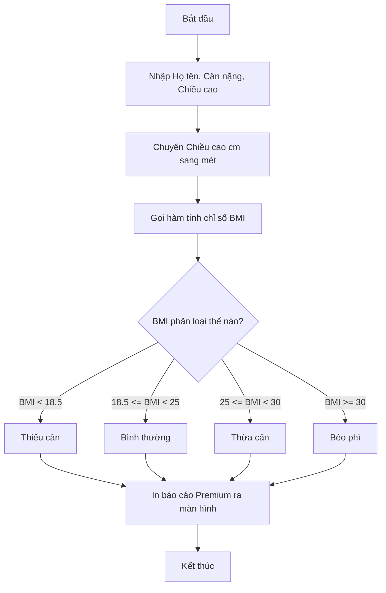

# 🧪 Bài Tập Thực Hành Python Cơ Bản: Khởi Đầu Thực Chiến

> **Tác giả:** Mr.Rom  
> **Phiên bản:** v1.0.0  
> **Tạo lúc:** 26/05/2026  
> **Cập nhật:** 26/05/2026  
> **Level:** Basic  
> **Tags:** [PRACTICAL]  
> **Thời lượng thực hành:** ~60 - 90 phút  
> **Yêu cầu trước:** Đã đọc xong 4 bài học lý thuyết cơ bản từ [Bài 00](./../../lessons/01_basic/00_what-is-python.md) đến [Bài 03](./../../lessons/01_basic/03_functions.md) và có môi trường Python chạy được.

> [!IMPORTANT]
> **Lời khuyên từ Mr.Rom:**  
> Lập trình không phải là việc ghi nhớ lý thuyết suông bằng mắt, lập trình là nghệ thuật giải quyết vấn đề bằng đôi bàn tay. Hãy tự mình mở trình soạn thảo code lên, tự gõ từng dòng lệnh cho các thử thách bên dưới. Đừng ngần ngại gặp lỗi, vì mỗi lần sửa lỗi (debug) thành công là một lần tư duy lập trình của bạn được nâng lên một tầm cao mới!

---

## 🎯 Mục Tiêu Của Bộ Bài Tập:
*   Củng cố vững chắc kiến thức về Biến, Ép kiểu dữ liệu và 7 kiểu dữ liệu cốt lõi.
*   Rèn luyện tư duy logic rẽ nhánh (`if/elif/else`) và tư duy lặp lặp (`for`, `while`).
*   Thực hành đóng gói logic và thiết kế các hàm tái sử dụng chuẩn mực.
*   Xây dựng hoàn chỉnh các ứng dụng dòng lệnh (CLI) thực tế từ con số 0.

---

## 🧠 Phần 1: Trắc Nghiệm Tư Duy Củng Cố Kiến Thức

Hãy đọc kỹ các đoạn code bên dưới và tự suy luận kết quả trước khi nhấn vào xem lời giải thích chi tiết của mình nhé!

### ❓ Câu hỏi 1: Bộ nhớ lưu trữ biến mutable
Đoạn code sau đây sẽ in ra màn hình kết quả là gì?
```python
list_a = ["HTML", "CSS"]
list_b = list_a
list_b.append("Python")

print(len(list_a))
```
<details>
<summary>💡 Xem đáp án và giải thích chi tiết từ Mr.Rom</summary>

*   **Kết quả in ra:** `3`
*   **Giải thích:** Vì `list` là kiểu dữ liệu khả biến (Mutable), phép gán `list_b = list_a` không tạo ra một danh sách mới độc lập trong bộ nhớ RAM, mà cả hai biến `list_a` và `list_b` đều đang trỏ chung vào cùng một địa chỉ vùng nhớ. Khi bạn gọi `list_b.append()`, danh sách chung này được thêm phần tử mới, do đó `list_a` cũng bị thay đổi theo. Độ dài danh sách lúc này là 3.
</details>

---

### ❓ Câu hỏi 2: Lỗi thiết kế hàm mặc định
Đoạn code sau đây sẽ in ra màn hình kết quả là gì ở lần gọi hàm thứ hai?
```python
def active_user(username, active_list=[]):
    active_list.append(username)
    return active_list

print(active_user("rom_dev"))
print(active_user("nam_coder"))
```
<details>
<summary>💡 Xem đáp án và giải thích chi tiết từ Mr.Rom</summary>

*   **Kết quả in ra ở dòng thứ hai:** `['rom_dev', 'nam_coder']`
*   **Giải thích:** Đây là cạm bẫy "Mutable Default Parameter" kinh điển trong Python. Danh sách mặc định `[]` chỉ được khởi tạo một lần duy nhất khi hàm được nạp vào bộ nhớ. Lần gọi hàm thứ hai không truyền danh sách mới vào nên nó tiếp tục tái sử dụng danh sách của lần gọi đầu tiên và thêm tiếp phần tử vào đó.
*   *Cách sửa đúng:* Đặt giá trị mặc định là `None` và khởi tạo danh sách mới bên trong thân hàm.
</details>

---

### ❓ Câu hỏi 3: Phép so sánh Float trong Python
Đoạn code sau đây sẽ in ra màn hình kết quả là gì?
```python
x = 0.1 + 0.1 + 0.1
print(x == 0.3)
```
<details>
<summary>💡 Xem đáp án và giải thích chi tiết từ Mr.Rom</summary>

*   **Kết quả in ra:** `False`
*   **Giải thích:** Do số thực được lưu trữ dưới dạng nhị phân theo chuẩn IEEE 754, phép cộng `0.1 + 0.1 + 0.1` thực tế sẽ trả về kết quả là `0.30000000000000004` chứ không bằng `0.3` tròn trịa. Phép so sánh bằng `==` sẽ trả về `False`.
*   *Cách so sánh đúng:* Sử dụng hàm `math.isclose(x, 0.3)` để kiểm tra.
</details>

---

## 🛠️ Phần 2: Các Bài Tập Lab Thực Chiến Hấp Dẫn

---

### 🧪 Bài Lab 1: Máy Tính Chỉ Số Sức Khỏe BMI Thông Minh

#### 1. Đề bài:
Hãy viết một script tương tác dòng lệnh (CLI) cho phép người dùng nhập vào **Họ tên**, **Cân nặng (kg)** và **Chiều cao (cm)** từ bàn phím.
*   Chuyển đổi chiều cao từ centimet sang mét.
*   Viết một hàm `tinh_bmi(can_nang, chieu_cao)` nhận vào cân nặng và chiều cao (mét) để tính và trả về chỉ số BMI (Công thức: $BMI = \frac{can\_nang}{chieu\_cao^2}$).
*   Dựa trên chỉ số BMI tính được, hãy rẽ nhánh phân loại sức khỏe của người đó theo chuẩn y tế:
    *   $BMI < 18.5$: Thiếu cân.
    *   $18.5 \le BMI < 25$: Cân nặng bình thường.
    *   $25 \le BMI < 30$: Thừa cân.
    *   $BMI \ge 30$: Béo phì nguy hiểm.
*   In ra màn hình báo cáo sức khỏe chi tiết, định dạng đẹp mắt.

#### 2. Phân tích tư duy (Thuật toán):


#### 3. Mã nguồn gợi ý (Premium Code mẫu):
Hãy tạo file `tinh_bmi.py` và triển khai như sau:

```python
# tinh_bmi.py - Máy tính chỉ số BMI thông minh
# Tác giả: Mr.Rom

def tinh_bmi(can_nang: float, chieu_cao_met: float) -> float:
    """Calculates BMI and returns it as float."""
    if chieu_cao_met <= 0 or can_nang <= 0:
        return 0.0
    return can_nang / (chieu_cao_met ** 2)

# Nhập dữ liệu từ người dùng và ép kiểu thích hợp
print("========================================")
print("     MÁY TÍNH CHỈ SỐ SỨC KHỎE BMI       ")
print("========================================")

ten = input("Nhập họ và tên của bạn: ")
can_nang = float(input("Nhập cân nặng của bạn (kg): "))
chieu_cao_cm = float(input("Nhập chiều cao của bạn (cm): "))

# Xử lý logic
chieu_cao_met = chieu_cao_cm / 100
bmi = tinh_bmi(can_nang, chieu_cao_met)

# Rẽ nhánh phân loại sức khỏe và đưa ra khuyến nghị
if bmi < 18.5:
    phan_loai = "THIẾU CÂN"
    loi_khuyen = "Bạn nên bổ sung thêm chất dinh dưỡng và tập thể thao điều độ."
elif bmi < 25:
    phan_loai = "BÌNH THƯỜNG"
    loi_khuyen = "Tuyệt vời! Chỉ số cơ thể của bạn rất cân đối. Hãy duy trì nhé."
elif bmi < 30:
    phan_loai = "THỪA CÂN"
    loi_khuyen = "Bạn nên điều chỉnh giảm bớt lượng tinh bột và tăng cường vận động."
else:
    phan_loai = "BÉO PHÌ"
    loi_khuyen = "Cảnh báo nguy hiểm! Bạn cần tham khảo ý kiến bác sĩ dinh dưỡng."

# In kết quả Premium
print("\n========================================")
print("         BÁO CÁO CHỈ SỐ SỨC KHỎE        ")
print("========================================")
print(f"Học viên    : {ten.upper()}")
print(f"Chỉ số BMI  : {bmi:.2f}")
print(f"Trạng thái  : {phan_loai}")
print(f"Khuyến nghị : {loi_khuyen}")
print("========================================")
```

---

### 🧪 Bài Lab 2: Trò Chơi Đoán Số Huyền Bí (Secret Number Game)

#### 1. Đề bài:
Hãy viết một trò chơi dòng lệnh tương tác sử dụng vòng lặp `while` và rẽ nhánh `if/else`.
*   Thiết lập một con số bí ẩn có sẵn trong hệ thống (ví dụ: `42`).
*   Cho phép người chơi đoán tối đa **5 lần**.
*   Mỗi lần đoán, người dùng nhập số từ bàn phím.
*   Nếu đoán đúng: In câu chúc mừng chiến thắng và dừng trò chơi lập tức (`break`).
*   Nếu đoán sai:
    *   Báo cho người chơi biết số họ đoán đang "quá cao" hay "quá thấp" so với số bí ẩn để họ định hướng lần sau.
    *   Báo số lượt đoán còn lại.
*   Nếu hết 5 lượt vẫn không đoán trúng: Báo Game Over và tiết lộ con số bí ẩn.

#### 2. Phân tích tư duy (Thuật toán):
*   Sử dụng một biến đếm `luot_doan = 1`.
*   Vòng lặp `while luot_doan <= 5:` dùng để khống chế số lần chơi.
*   Bên trong vòng lặp nhận số đoán, dùng `if` kiểm tra xem đúng hay sai, nếu sai gợi ý bằng so sánh lớn hơn/nhỏ hơn.
*   Cập nhật `luot_doan += 1` sau mỗi lần đoán sai.

#### 3. Mã nguồn gợi ý (Premium Code mẫu):
Hãy tạo file `doan_so.py` và triển khai như sau:

```python
# doan_so.py - Trò chơi đoán số huyền bí
# Tác giả: Mr.Rom

SO_BI_AN = 42
SO_LUOT_TOI_DA = 5

print("========================================")
print("     TRÒ CHƠI ĐOÁN SỐ HUYỀN BÍ          ")
print("========================================")
print(f"Mình đang giữ một con số bí ẩn từ 1 đến 100.")
print(f"Bạn có tối đa {SO_LUOT_TOI_DA} lượt để đoán trúng con số này. Chúc may mắn!")
print("----------------------------------------")

luot = 1
while luot <= SO_LUOT_TOI_DA:
    # Nhận dữ liệu đoán từ người dùng
    so_doan = int(input(f"Lượt {luot}/{SO_LUOT_TOI_DA} - Nhập số đoán của bạn: "))
    
    # Kiểm tra điều kiện thắng
    if so_doan == SO_BI_AN:
        print(f"\n🎉 CHÚC MỪNG CHIẾN THẮNG!")
        print(f"Bạn đã đoán trúng con số bí ẩn {SO_BI_AN} ở lượt thứ {luot}!")
        break  # Thoát ngay khỏi vòng lặp kết thúc game
        
    # Đưa ra gợi ý thông minh nếu đoán sai
    if so_doan < SO_BI_AN:
        print("💡 Gợi ý: Con số bạn đoán đang QUÁ THẤP rồi.")
    else:
        print("💡 Gợi ý: Con số bạn đoán đang QUÁ CAO rồi.")
        
    luot += 1
else:
    # Khối else của while chỉ chạy khi vòng lặp kết thúc mà không gặp break (hết lượt)
    print("\n💀 GAME OVER!")
    print(f"Rất tiếc, bạn đã dùng hết cả {SO_LUOT_TOI_DA} lượt chơi.")
    print(f"Con số bí ẩn thực sự là: {SO_BI_AN}")

print("========================================")
```

---

### 🧪 Bài Lab 3: Hệ Thống Báo Cáo Doanh Thu Doanh Nghiệp (Bài Tập Tổng Hợp)

#### 1. Đề bài:
Đây là bài tập tổng hợp cao cấp kiểm tra toàn bộ kỹ năng thiết lập biến, kiểu dữ liệu phức tạp (List of Dicts), cấu trúc điều khiển rẽ nhánh, vòng lặp và thiết kế hàm của bạn.

Hãy viết một script quản lý danh sách các đơn hàng của cửa hàng.
*   Mỗi đơn hàng lưu dưới dạng một Dictionary gồm các thông tin: `ma_dh` (Mã đơn hàng), `ten_sp` (Tên sản phẩm), `so_luong` (Số lượng), `don_gia` (Đơn giá), và `trang_thai` (Trạng thái đơn hàng: `"completed"` hoặc `"pending"`).
*   Hãy xây dựng các hàm độc lập sau:
    1.  `tinh_tong_doanh_thu(danh_sach_dh)`: Tính và trả về tổng giá trị của tất cả các đơn hàng có trạng thái `"completed"` (Công thức: $Giá\_trị = so\_luong \times don\_gia$).
    2.  `tim_don_hang_lon_nhat(danh_sach_dh)`: Tìm và trả về Dictionary của đơn hàng có giá trị lớn nhất trong danh sách.
    3.  `loc_don_hang(danh_sach_dh, trang_thai_can_loc)`: Lọc và trả về một List mới chứa các đơn hàng khớp với trạng thái cần lọc.

#### 2. Phân tích tư duy (Thuật toán):
*   **Hàm tính doanh thu:** Dùng một biến tích lũy `tong = 0`. Dùng vòng lặp `for` duyệt qua các đơn hàng, kiểm tra `if dh["trang_thai"] == "completed"`, cộng dồn vào `tong`.
*   **Hàm tìm đơn hàng lớn nhất:** Dùng một biến `max_dh = danh_sach_dh[0]`. Lặp qua danh sách đơn hàng, nếu đơn hàng hiện tại có giá trị ($so\_luong \times don\_gia$) lớn hơn giá trị của `max_dh`, cập nhật `max_dh` thành đơn hàng hiện tại.
*   **Hàm lọc đơn hàng:** Áp dụng kỹ thuật List Comprehension cực nhanh để tạo list mới theo trạng thái lọc.

#### 3. Mã nguồn gợi ý (Premium Code mẫu):
Hãy tạo file `bao_cao_doanh_thu.py` và triển khai như sau:

```python
# bao_cao_doanh_thu.py - Hệ thống báo cáo doanh thu cửa hàng
# Tác giả: Mr.Rom

def tinh_tong_doanh_thu(danh_sach_dh: list[dict]) -> float:
    """Tính tổng doanh thu từ các đơn hàng đã hoàn thành (completed)."""
    tong = 0.0
    for dh in danh_sach_dh:
        if dh["trang_thai"] == "completed":
            tong += dh["so_luong"] * dh["don_gia"]
    return tong

def tim_don_hang_lon_nhat(danh_sach_dh: list[dict]) -> dict | None:
    """Tìm đơn hàng có giá trị tổng lớn nhất trong danh sách."""
    if not danh_sach_dh:
        return None
        
    max_dh = danh_sach_dh[0]
    max_val = max_dh["so_luong"] * max_dh["don_gia"]
    
    for dh in danh_sach_dh[1:]:
        val = dh["so_luong"] * dh["don_gia"]
        if val > max_val:
            max_val = val
            max_dh = dh
            
    return max_dh

def loc_don_hang(danh_sach_dh: list[dict], trang_thai: str) -> list[dict]:
    """Lọc các đơn hàng theo trạng thái chỉ định sử dụng List Comprehension."""
    return [dh for dh in danh_sach_dh if dh["trang_thai"] == trang_thai]

# --- SỬ DỤNG HỆ THỐNG TRONG THỰC TẾ ---

# Danh sách dữ liệu mẫu đơn hàng của cửa hàng
cua_hang_orders = [
    {"ma_dh": "DH001", "ten_sp": "Bàn phím cơ", "so_luong": 2, "don_gia": 1200000, "trang_thai": "completed"},
    {"ma_dh": "DH002", "ten_sp": "Chuột Gaming", "so_luong": 1, "don_gia": 800000, "trang_thai": "completed"},
    {"ma_dh": "DH003", "ten_sp": "Ghế công thái học", "so_luong": 1, "don_gia": 4500000, "trang_thai": "pending"},
    {"ma_dh": "DH004", "ten_sp": "Tai nghe không dây", "so_luong": 3, "don_gia": 1500000, "trang_thai": "completed"},
]

print("=========================================================================")
print("                     BÁO CÁO HOẠT ĐỘNG CỬA HÀNG                          ")
print("=========================================================================")

# 1. Tính tổng doanh thu thực tế nhận được
doanh_thu = tinh_tong_doanh_thu(cua_hang_orders)
print(f"💵 TỔNG DOANH THU ĐÃ THU     : {doanh_thu:,.0f} VND")

# 2. Tìm đơn hàng giá trị khủng nhất
order_max = tim_don_hang_lon_nhat(cua_hang_orders)
if order_max:
    val_max = order_max["so_luong"] * order_max["don_gia"]
    print(f"🏆 ĐƠN HÀNG GIÁ TRỊ LỚN NHẤT : {order_max['ma_dh']} - {order_max['ten_sp']} ({val_max:,.0f} VND)")

# 3. Lọc danh sách các đơn hàng còn đang treo chờ xử lý
dh_treo = loc_don_hang(cua_hang_orders, "pending")
print(f"⏳ CÁC ĐƠN HÀNG CHỜ XỬ LÝ    :")
for i, dh in enumerate(dh_treo, start=1):
    val = dh["so_luong"] * dh["don_gia"]
    print(f"   {i}. Mã: {dh['ma_dh']} | Sản phẩm: {dh['ten_sp']} | Trị giá: {val:,.0f} VND")

print("=========================================================================")
```

Hãy chạy file này: `python3 bao_cao_doanh_thu.py` để kiểm tra kết quả tính toán chính xác tuyệt đối. Bạn đã chính thức làm chủ được các kiến thức cốt lõi của lập trình Python rồi đó!

---

## 🔗 Liên kết & Định hướng tiếp theo

*   ⬅️ **Bài lý thuyết trước:** [Bài 03: Thiết kế Hàm và nghệ thuật tái sử dụng mã nguồn](./../../lessons/01_basic/03_functions.md)
*   🧭 **Tấm bản đồ tổng quan:** [Zero to Coder Career Roadmap](../../../../00_roadmaps/career/zero-to-coder_career-roadmap.md)
