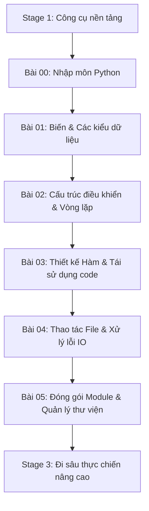

# 🎓 Nhập Môn Python: Ngôn Ngữ Dễ Học Nhất, Đủ Mạnh Để Làm Tất Cả

> **Tác giả:** Mr.Rom  
> **Phiên bản:** v3.0.1  
> **Tạo lúc:** 16/05/2026  
> **Cập nhật:** 10/06/2026  
> **Level:** Basic  
> **Tags:** [MUST-KNOW]  
> **Yêu cầu trước:** Đã [Cài đặt Python](../../setup/install-python.md) ✅

> [!NOTE]
> **Mục tiêu bài học:**  
> Giúp bạn hiểu bản chất Python là gì, tại sao hơn 80% người mới bắt đầu lập trình vào năm 2026 chọn Python làm ngôn ngữ đầu tay, những ứng dụng thực tế khổng lồ của nó và cách chạy dòng code đầu tiên. Bài học này tập trung vào tư duy nền tảng, hoàn toàn không yêu cầu bạn phải ghi nhớ cú pháp phức tạp ngay lập tức.

---

## 🎯 Sau Bài Học Này Bạn Sẽ:

- [x] Thấu hiểu bản chất của Python và câu chuyện lịch sử thú vị đằng sau nó.
- [x] Biết rõ 5 lĩnh vực thực tế mà Python đang thống trị hoàn toàn.
- [x] Phân biệt rõ ràng giữa **Ngôn ngữ Python** và **Trình thông dịch CPython**.
- [x] Thành thạo 3 cách chạy code Python thực tế: REPL, chạy file `.py` và Jupyter Notebook.
- [x] Nắm chắc lộ trình chinh phục Python tại Stage 2 để không bao giờ bị lạc lối.

---

## 💡 Bạn Vừa Cài Python Xong: Mở Terminal Lên Và... Làm Gì Tiếp Theo?

Chúc mừng bạn đã hoàn thành [Stage 1: Công cụ nền tảng](../../../../00_roadmaps/career/zero-to-coder_career-roadmap.md) và cài đặt thành công Python theo [Hướng dẫn chuẩn hóa](../../setup/install-python.md). Khi bạn mở Terminal lên và gõ:

```bash
python3 --version
# Kết quả: Python 3.12.0
```

Một cảm giác hào hứng xuất hiện, nhưng ngay sau đó là sự bối rối: **"Giờ mình gõ cái gì tiếp theo đây?"**. Tại sao hầu như mọi lập trình viên đi trước đều khuyên người mới bắt đầu bằng Python? Python có điểm gì khác biệt so với JavaScript, Java hay C++ — và đặc biệt, sự khác biệt đó mang lại lợi thế gì cho **hành trình của bạn vào năm 2026**?

Bài viết này sẽ giải đáp trọn vẹn những câu hỏi đó, đồng thời hướng dẫn bạn 3 cách chạy Python để tự tay viết và thực thi dòng code đầu tiên trong vòng chưa đầy 5 phút!

---

## 1️⃣ Vì Sao Python Là Sự Lựa Chọn Mặc Định Cho 80% Người Mới Bắt Đầu?

Vào năm 2026, Python vững vàng ở vị trí **ngôn ngữ lập trình phổ biến số #1 thế giới** (theo các bảng xếp hạng uy tín TIOBE và PYPL). Dưới đây là bảng so sánh trực quan giúp bạn hiểu lý do:

| Tiêu chí | Python | Java | JavaScript | C++ |
| :--- | :--- | :--- | :--- | :--- |
| **Độ dễ học** | ⭐⭐⭐⭐⭐ Cực kỳ dễ | ⭐⭐⭐ Dài dòng | ⭐⭐⭐⭐ Trung bình | ⭐ Cực kỳ khó |
| **Cú pháp giống tiếng Anh** | ✅ Rất gần gũi | ❌ Rườm rà | ❌ Nhiều ký tự lạ | ❌ Phức tạp |
| **Hệ sinh thái thư viện** | ⭐⭐⭐⭐⭐ Khổng lồ | ⭐⭐⭐⭐ Lớn | ⭐⭐⭐⭐⭐ Khổng lồ | ⭐⭐⭐ Vừa phải |
| **Tính đa dụng** | Web, Dữ liệu, AI, Tự động hóa, Embedded, Game | Backend doanh nghiệp, Android | Web Frontend & Backend | Hệ thống, Game 3D |
| **Tốc độ thực thi** | Chậm (nhưng đủ dùng) | Trung bình - Nhanh | Trung bình | Cực kỳ nhanh |
| **Cơ hội việc làm** | 💼 Rất nhiều | 💼 Nhiều | 💼 Rất nhiều | 💼 Vừa phải |

### So sánh trực quan: Viết dòng chữ "Hello World" ra màn hình

Để in dòng chữ huyền thoại `"Hello, World!"` ra màn hình, hãy xem sự khác biệt về lượng code giữa các ngôn ngữ:

*   **Với Python (Chỉ đúng 1 dòng sạch sẽ):**
    ```python
    print("Hello, World!")
    ```
*   **Với JavaScript (Cần viết qua console):**
    ```javascript
    console.log("Hello, World!");
    ```
*   **Với Java (Bạn phải tạo class và hàm main phức tạp):**
    ```java
    public class Main {
        public static void main(String[] args) {
            System.out.println("Hello, World!");
        }
    }
    ```
*   **Với C++ (Yêu cầu khai báo thư viện hệ thống và quản lý đầu ra):**
    ```cpp
    #include <iostream>
    int main() {
        std::cout << "Hello, World!" << std::endl;
        return 0;
    }
    ```

> [!TIP]
> **Nhận xét:**  
> Python giúp bạn loại bỏ hoàn toàn các rào cản về mặt cú pháp phức tạp (các dấu ngoặc nhọn `{}`, dấu chấm phẩy `;` dễ gõ thiếu). Nhờ đó, bộ não của bạn có thể tập trung 100% vào việc rèn luyện **tư duy logic giải quyết vấn đề** — thứ cốt lõi nhất của một lập trình viên giỏi.

---

## 2️⃣ Vậy Python Thực Sự Bản Chất Là Gì?

**Định nghĩa học thuật:** Python là một ngôn ngữ lập trình **thông dịch** (*interpreted*), bậc cao (*high-level*), có kiểu dữ liệu động (*dynamic typing*), được phát minh bởi **Guido van Rossum** vào năm 1991.

### 🎭 Ẩn dụ sư phạm: Người phiên dịch trực tiếp và Bản thiết kế xây nhà

*   **Ngôn ngữ thông dịch (Interpreted - Như Python):** Giống như bạn đang đi du lịch với một **người phiên dịch giỏi**. Bạn nói câu tiếng Việt nào, người đó dịch ngay sang tiếng bản địa câu đó để chạy lập tức. Bạn sai ở câu nào, người dịch báo ngay ở câu đó.
*   **Ngôn ngữ biên dịch (Compiled - Như C++, Java):** Giống như việc **xây một ngôi nhà**. Bạn bắt buộc phải hoàn thành toàn bộ bản vẽ thiết kế chi tiết (quá trình compile), nộp cho nhà chức trách phê duyệt không có lỗi nào, rồi mới được phép tiến hành xây dựng và dọn vào ở.

### 6 đặc trưng làm nên thương hiệu của Python:

| Đặc trưng | Ý nghĩa thực tế đối với bạn |
| :--- | :--- |
| **Thông dịch (Interpreted)** | Code chạy từng dòng một. Sai dòng nào dừng ngay dòng đó, giúp bạn debug (sửa lỗi) cực nhanh và dễ dàng thử nghiệm. |
| **Kiểu động (Dynamic typing)** | Bạn không cần khai báo biến này là số hay chữ. Python đủ thông minh để tự nhận biết khi chạy chương trình. |
| **Bậc cao (High-level)** | Trừu tượng hóa tối đa. Bạn không cần bận tâm đến việc máy tính phân bổ bộ nhớ vật lý ra sao, quản lý con trỏ thế nào. |
| **Đa nền tảng (Cross-platform)** | Bạn viết code trên MacBook, file `.py` đó mang sang máy chạy Windows hay Linux vẫn hoạt động hoàn hảo không cần sửa đổi. |
| **Đa năng (General-purpose)** | Không bị giới hạn trong một lĩnh vực. Học một ngôn ngữ, bạn có thể làm từ web, AI cho đến viết tool tự động hóa. |
| **"Batteries Included"** | Triết lý "kèm sẵn pin". Python cung cấp sẵn một lượng thư viện tiêu chuẩn cực kỳ khổng lồ để bạn dùng ngay mà không cần tải thêm. |

### Phân biệt rõ ràng: Python vs CPython

Khi bước vào thế giới chuyên nghiệp, bạn sẽ nghe thấy thuật ngữ CPython. Hãy phân biệt chúng để không bị bối rối:

*   **Python:** Là tên của **ngôn ngữ lập trình** và bộ quy chuẩn cú pháp (định nghĩa từ khóa, cách thụt lề, v.v.).
*   **CPython:** Là **trình thông dịch mặc định** được viết bằng ngôn ngữ C. Nó có nhiệm vụ đọc code Python của bạn và chuyển dịch nó thành mã máy để CPU thực thi. Đây chính là bộ cài đặt mặc định bạn tải về từ trang chủ `python.org`.
*   *Lưu ý:* Ngoài CPython, cộng đồng còn phát triển các trình thông dịch khác như *PyPy* (chạy siêu nhanh), *Jython* (chạy trên máy ảo Java), *MicroPython* (dành cho các mạch điện tử nhỏ).

---

## 3️⃣ Sức Mạnh Vô Hạn: Python Đang Thống Trị Những Lĩnh Vực Nào?

> [!NOTE]
> **Ẩn dụ:** Nếu Python là "người phiên dịch tài ba", thì ngày nay người phiên dịch này đang làm việc ở những tập đoàn công nghệ lớn nhất thế giới nhờ sở hữu những "bộ từ điển chuyên ngành" (thư viện bên thứ ba) vô cùng mạnh mẽ.

Dưới đây là 5 lĩnh vực hàng đầu mà Python đang nắm giữ vị thế độc tôn:

### 1. Trí tuệ nhân tạo & Học máy (AI / Machine Learning)
Gần như 100% các công trình nghiên cứu và ứng dụng AI hiện đại đều chọn Python làm ngôn ngữ giao tiếp:
*   **PyTorch / TensorFlow:** Xây dựng và huấn luyện các mạng neural nhân tạo siêu lớn (được dùng để phát triển các mô hình như ChatGPT, Claude).
*   **LangChain / OpenAI SDK:** Giúp các lập trình viên dễ dàng kết nối và xây dựng các ứng dụng thông minh tận dụng sức mạnh của các mô hình ngôn ngữ lớn (LLM).

### 2. Khoa học dữ liệu (Data Science)
Python đã thay thế hoàn toàn các công cụ phân tích cũ kỹ nhờ bộ công cụ trực quan hóa dữ liệu đỉnh cao:
*   **Pandas:** Thư viện xử lý bảng dữ liệu cực mạnh — được ví như một "Microsoft Excel chạy bằng code" có khả năng xử lý hàng triệu dòng dữ liệu trong tích tắc.
*   **NumPy:** Tính toán các phép toán ma trận phức tạp với tốc độ cực nhanh.
*   **Matplotlib / Seaborn:** Vẽ các biểu đồ phân tích dữ liệu trực quan sinh động.

### 3. Phát triển ứng dụng Web (Web Backend)
Cung cấp giải pháp xây dựng máy chủ ổn định, bảo mật và tốc độ phát triển cực kỳ nhanh:
*   **FastAPI:** Khung phát triển web hiện đại nhất hiện nay, hỗ trợ xử lý bất đồng bộ (*async*) giúp hệ thống chịu tải cực tốt.
*   **Django:** Bộ khung full-stack mạnh mẽ, đầy đủ mọi tính năng tích hợp sẵn (Authentication, Database ORM, Admin Panel) phù hợp cho các dự án lớn.

### 4. Tự động hóa công việc (Automation & Scripting)
Giải phóng sức lao động bằng cách tự động hóa các tác vụ lặp đi lặp lại hàng ngày:
*   **BeautifulSoup / Scrapy:** Cào dữ liệu từ bất kỳ trang web nào về máy.
*   **Scripting:** Tự động gửi email báo cáo hàng tuần, đổi tên hàng loạt file ảnh theo định dạng, tự động click chuột làm tác vụ văn phòng.

### 5. Công cụ quản trị hệ thống (DevOps & Cloud)
*   Các công cụ quản lý cấu hình hệ thống nổi tiếng như **Ansible** đều được viết bằng Python. Python là trợ thủ đắc lực của các kỹ sư Cloud/DevOps khi cần viết script tự động triển khai hạ tầng trên AWS, Azure hay Google Cloud.

---

## 4️⃣ Làm Sao Để Chạy Python? 3 Cách Phổ Biến Nhất Thực Tế

### 🅰️ Cách 1: Sử dụng REPL — Kiểm tra code siêu tốc

REPL (Read-Eval-Print Loop) là môi trường tương tác trực tiếp giúp bạn thử nghiệm nhanh các câu lệnh mà không cần tạo file phức tạp.

Để bắt đầu, hãy mở Terminal (hoặc PowerShell trên Windows) và gõ:
```bash
python3     # Hoặc "python"
```

Dấu nhắc lệnh `>>>` xuất hiện. Hãy gõ trực tiếp các câu lệnh sau và nhấn Enter để xem kết quả chạy ngay lập tức:

```python
>>> 10 + 20
30
>>> ten = "trợ lý Python"
>>> f"Chào mừng bạn, mình là {ten}!"
'Chào mừng bạn, mình là trợ lý Python!'
>>> exit()  # Gõ lệnh này để thoát khỏi REPL
```

> [!TIP]
> Bạn có thể cài đặt thêm công cụ **IPython** (`pip install ipython`) để có một môi trường REPL Premium hơn với tính năng tự động gợi ý code bằng phím Tab và tô màu cú pháp cực kỳ dễ nhìn.

---

### 🅱️ Cách 2: Chạy file `.py` — Phương pháp làm việc chính thức

Đây là cách bạn sẽ sử dụng 90% thời gian khi làm các dự án thực tế. Bạn sẽ viết toàn bộ code vào một file văn bản và yêu cầu Python thực thi toàn bộ file đó.

#### Bước 1: Tạo một file tên là `hello.py` và viết nội dung sau:
```python
# hello.py - Chương trình tương tác đầu tiên của bạn
ten_nguoi_dung = input("Chào bạn, bạn tên là gì thế? ")
print(f"Rất vui được gặp bạn, {ten_nguoi_dung}!")
print(f"Tên của bạn có tổng cộng {len(ten_nguoi_dung)} ký tự nhé.")
```

#### Bước 2: Lưu file lại và mở Terminal tại thư mục chứa file, gõ lệnh chạy:
```bash
python3 hello.py
```

Màn hình sẽ tương tác trực tiếp với bạn:
```text
Chào bạn, bạn tên là gì thế? Nguyen Van A
Rất vui được gặp bạn, Nguyen Van A!
Tên của bạn có tổng cộng 12 ký tự nhé.
```

---

### 🅲 Cách 3: Sử dụng Jupyter Notebook — Môi trường tương tác cho Data Science

Jupyter Notebook là một công cụ tuyệt vời cho phép bạn viết code xen kẽ giữa các đoạn ghi chú văn bản định dạng Markdown, biểu đồ trực quan và kết quả chạy code. Định dạng file này có đuôi là `.ipynb`.

#### Cách sử dụng trên VS Code cực kỳ đơn giản:
1. Mở VS Code -> Vào mục Extensions tìm cài **Jupyter** (`ms-toolsai.jupyter`).
2. Nhấn tổ hợp phím `Cmd + Shift + P` (Mac) hoặc `Ctrl + Shift + P` (Windows) -> Chọn **Create: New Jupyter Notebook**.
3. Bạn có thể viết code vào từng khối (Cell) riêng biệt và nhấn nút Run ngay bên cạnh để xem kết quả tức thì.

---

## 5️⃣ "Zen Of Python": Triết Lý Thiết Kế Giúp Bạn Viết Code Đẹp Như Thơ

Python sở hữu một triết lý thiết kế vô cùng độc đáo gọi là **Zen of Python**. Để khám phá triết lý này, bạn hãy mở REPL và gõ câu lệnh bí ẩn sau:

```python
>>> import this
```

Màn hình sẽ hiển thị 19 dòng triết lý được viết bởi kỹ sư Tim Peters:
```text
The Zen of Python, by Tim Peters

Beautiful is better than ugly. (Đẹp đẽ tốt hơn xấu xí)
Explicit is better than implicit. (Rõ ràng tốt hơn ẩn ý)
Simple is better than complex. (Đơn giản tốt hơn phức tạp)
Readability counts. (Khả năng đọc hiểu là trên hết)
...
```

### 5 nguyên tắc cốt lõi bạn cần ghi nhớ khi bắt đầu:
1. **Khả năng đọc hiểu là trên hết (Readability counts):** Hãy viết code sao cho 6 tháng sau bạn hoặc đồng nghiệp đọc lại vẫn hiểu ngay lập tức. Code dễ đọc quan trọng hơn code viết "ngắn gọn nhưng tỏ ra nguy hiểm".
2. **Rõ ràng tốt hơn ẩn ý (Explicit > Implicit):** Mọi thứ nên được khai báo tường minh, tránh các trò "ma thuật ngầm" khiến code khó debug.
3. **Đơn giản tốt hơn phức tạp (Simple > Complex):** Luôn tìm giải pháp đơn giản nhất để giải quyết vấn đề trước, tránh phức tạp hóa hệ thống quá sớm.
4. **Chỉ nên có một cách rõ ràng nhất để thực hiện (One obvious way):** Tránh việc viết một tính năng theo 10 cách khác nhau gây hỗn loạn khi làm việc nhóm.
5. **Lỗi không bao giờ được phép trôi qua im lặng (Errors should never pass silently):** Khi code lỗi, chương trình phải báo rõ ràng để sửa, không được phép "nuốt" lỗi che giấu.

---

## 6️⃣ Bản Đồ Hành Trình: Lộ Trình Chinh Phục Python Tại Stage 2

Dưới đây là tấm bản đồ từng bước giúp bạn làm chủ Python từ con số 0 trong vòng 6 - 8 tuần tại Stage 2 của Lộ trình học tập:



### Lộ trình chi tiết 5 bài học nền tảng:

| Mã bài | Tên bài học | Bạn sẽ làm chủ được những gì? |
| :--- | :--- | :--- |
| **Bài 01** | [Biến & Các kiểu dữ liệu](./01_variables-and-types.md) | Cách lưu trữ dữ liệu với số (`int`, `float`), chữ (`str`), danh sách (`list`, `tuple`, `dict`, `set`). |
| **Bài 02** | [Cấu trúc điều khiển & Vòng lặp](./02_control-flow.md) | Dạy máy tính cách đưa ra quyết định (`if/elif/else`) và thực hiện công việc lặp đi lặp lại (`for`, `while`). |
| **Bài 03** | [Hàm và Tái sử dụng code](./03_functions.md) | Đóng gói các đoạn code logic thành các hàm (`def`, `return`) để tái sử dụng nhiều lần chuyên nghiệp. |
| **Bài 04** | Thao tác File & Xử lý lỗi (Sắp ra mắt) | Đọc và ghi dữ liệu từ các file text/JSON trên ổ cứng, xử lý các lỗi phát sinh mượt mà (`try/except`). |
| **Bài 05** | Module & Quản lý thư viện (Sắp ra mắt) | Cách chia nhỏ dự án thành nhiều file module ngăn nắp và liên kết chúng lại với nhau. |

---

## ❓ Giải Đáp Thắc Mắc Kinh Điển Của Người Mới Bắt Đầu

### 1. "Nghe nói Python chạy chậm lắm, vậy có dùng làm dự án lớn được không?"
**HOÀN TOÀN ĐƯỢC.** Các ông lớn công nghệ như *Instagram, Spotify, Netflix, Dropbox* đều vận hành hệ thống khổng lồ của họ bằng Python.
Thực tế, 90% sự chậm trễ của một ứng dụng nằm ở tốc độ truy xuất cơ sở dữ liệu (Database) hoặc đường truyền mạng (I/O Bottleneck), chứ không phải do tốc độ tính toán của CPU. Thêm vào đó, các thư viện tính toán nặng của Python như NumPy hay PyTorch đều được viết phần lõi bằng ngôn ngữ C/Rust siêu tốc bên dưới. Hiệu năng làm việc của lập trình viên (viết code nhanh, ít lỗi) quan trọng hơn rất nhiều so với tốc độ chạy của máy tính trong đa số ứng dụng.

### 2. "Mình nên học song song cả Python và JavaScript một lúc không?"
**TUYỆT ĐỐI KHÔNG.** Việc học hai ngôn ngữ lập trình cùng một lúc khi mới bắt đầu sẽ khiến bạn bị loạn về mặt cú pháp và tư duy cấu trúc. Hãy tập trung học thật vững vàng tư duy lập trình với Python trước. Khi bạn đã nắm chắc cách tư duy logic, việc học thêm ngôn ngữ thứ hai như JavaScript sẽ cực kỳ dễ dàng và chỉ mất khoảng 2 tuần để làm quen cú pháp mới.

### 3. "Khác biệt giữa một file Script và một chương trình (Program/Application)?"
Không có một ranh giới tuyệt đối nào cả, tuy nhiên trong giới lập trình thường ngầm quy ước:
*   **Script:** Là một file đơn lẻ (ví dụ `auto_send_email.py`) viết ngắn gọn nhằm tự động hóa nhanh một tác vụ cụ thể nào đó.
*   **Program / Application:** Là một bộ mã nguồn lớn gồm rất nhiều file liên kết chặt chẽ với nhau, có cơ sở dữ liệu đi kèm, có giao diện người dùng (UI) hoặc hệ thống API chạy liên tục 24/7.

---

## 📚 Từ Điển Thuật Ngữ (Glossary)

*   **Thông dịch (Interpreted):** Cơ chế chạy code đến đâu dịch đến đó thời gian thực.
*   **Biên dịch (Compiled):** Cơ chế dịch toàn bộ mã nguồn thành file binary (`.exe`, `.dmg`) trước rồi mới chạy.
*   **Dynamic Typing:** Cơ chế tự động nhận biết kiểu dữ liệu của biến khi chương trình chạy mà không cần khai báo trước.
*   **REPL (Read-Eval-Print Loop):** Giao diện dòng lệnh tương tác gõ code chạy ngay của Python.
*   **Batteries Included:** Triết lý thiết kế cung cấp sẵn bộ thư viện tiêu chuẩn đầy đủ tính năng đi kèm khi cài đặt.
*   **Pythonic:** Cách viết code đúng chuẩn, tinh tế, tuân thủ đúng triết lý thiết kế của Python.

---

## 🔗 Liên kết & Tài nguyên

### 🧭 Định hướng lộ trình học:
*   ⬅️ **Bài thực hành chuẩn bị:** [Hướng dẫn cài đặt môi trường Python v2.0.0](../../setup/install-python.md)
*   ➡️ **Bài học tiếp theo:** [Bài 01: Làm chủ Biến và Các kiểu dữ liệu cơ bản](./01_variables-and-types.md)
*   🧭 **Tấm bản đồ tổng quan:** [Zero to Coder Career Roadmap](../../../../00_roadmaps/career/zero-to-coder_career-roadmap.md)

### 🌐 Tài nguyên học tập chất lượng bên ngoài:
*   [Python Official Tutorial](https://docs.python.org/3/tutorial/) — Tài liệu hướng dẫn chính thức từ tổ chức Python (tiếng Anh).
*   [Real Python](https://realpython.com/) — Trang web học Python thực chiến chất lượng cao nhất hiện nay.
*   [Automate the Boring Stuff with Python](https://automatetheboringstuff.com/) — Cuốn sách gối đầu giường cực kỳ thực tế dành cho người mới bắt đầu tự động hóa công việc.

---

## 📌 Nhật ký thay đổi (Changelog)

*   **v1.0.0 (16/05/2026)** — Bản đầu tiên giới thiệu khái niệm Python, 5 ứng dụng và cách chạy code cơ bản.
*   **v2.1.0 (24/05/2026)** — Tinh chỉnh văn phong.
*   **v3.0.0 (26/05/2026)** — Chuẩn hóa định dạng cảnh báo (Alerts); chuyển các tiêu đề H2 thành câu hỏi mở; tinh chỉnh văn phong cho dễ tiếp thu hơn.
*   **v3.0.1 (10/06/2026)** — Gỡ tên tác giả khỏi thân bài, callout và code mẫu (chỉ giữ ở metadata); dùng "mình"/placeholder trung tính.
