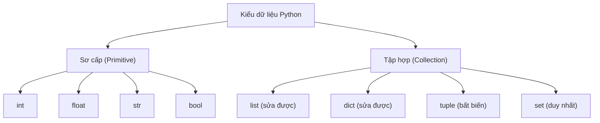

# 🎓 Làm Chủ Biến Và 7 Kiểu Dữ Liệu Cốt Lõi Trong Python

> **Tác giả:** Mr.Rom  
> **Phiên bản:** v3.0.3  
> **Tạo lúc:** 16/05/2026  
> **Cập nhật:** 11/06/2026  
> **Level:** Basic  
> **Tags:** [MUST-KNOW]  
> **Yêu cầu trước:** [Bài 00: Nhập môn Python](./00_what-is-python.md), đã cấu hình Python REPL chạy được.

> [!NOTE]
> **Mục tiêu bài học:**  
> Dữ liệu là huyết mạch của mọi chương trình máy tính. Bài học này sẽ giúp bạn hiểu sâu sắc về khái niệm **biến** (Variable) để lưu trữ thông tin, làm chủ **7 kiểu dữ liệu cốt lõi** trong Python (4 kiểu sơ cấp, 4 kiểu tập hợp) và nắm vững cách vận hành của bộ nhớ thông qua cơ chế *Mutable vs Immutable*. Đây là nền móng vững chãi để bạn viết mọi ứng dụng thực tế.

---

## 🎯 Sau Bài Học Này Bạn Sẽ:

- [x] Hiểu bản chất và tạo lập thành thạo **biến** trong bộ nhớ.
- [x] Nắm rõ cơ chế **kiểu dữ liệu động** (Dynamic Typing) và quy tắc đặt tên chuẩn PEP 8.
- [x] Làm chủ 4 kiểu dữ liệu sơ cấp (Primitive): `int`, `float`, `str`, `bool`.
- [x] Thành thạo 4 kiểu dữ liệu tập hợp (Collection): `list`, `dict`, `tuple`, `set`.
- [x] Hiểu và tự tin áp dụng chuyển đổi kiểu dữ liệu (Type Casting).
- [x] Phân biệt rõ ràng bản chất giữa *Mutable* (có thể thay đổi) và *Immutable* (bất biến) để tránh các lỗi logic ngầm.

---

## 💡 Bài Toán Tính Lương: Khi Dòng Code Đầu Tiên Bị Crash!

Hãy tưởng tượng bạn nhận thử thách lập trình đầu tiên:  
*"Viết một script tính lương cho nhân viên. Cho biết tên, mức lương theo giờ và số giờ làm việc trong tháng. Hãy tính tổng lương trước thuế, tiền thuế thu nhập (10%) và số tiền thực nhận cuối cùng."*

Bạn mở Python REPL lên và tự tin gõ:
```python
>>> "Nguyễn Văn Nam" + 150000 * 160
TypeError: can only concatenate str (not "int") to str
```

**Bùm!** Một thông báo lỗi đỏ xuất hiện. Hệ thống từ chối chạy vì bạn đang cố gắng "cộng" một chuỗi chữ (`"Nguyễn Văn Nam"`) với một con số kết quả tính toán (`150000 * 160`). Để giải quyết bài toán này, máy tính cần phải biết phân biệt và lưu trữ các loại thông tin khác nhau vào các ngăn nhớ riêng biệt. Đó chính là lý do bạn cần làm chủ **Biến** và **Kiểu dữ liệu**.

Ở cuối bài học này, chúng ta sẽ quay lại và tự tay hoàn thiện script tính lương này một cách cực kỳ chuyên nghiệp và trơn tru!

---

## 1️⃣ Tại Sao Biến Và Kiểu Dữ Liệu Là Những Viên Gạch Đầu Tiên?

Mọi phần mềm trên thế giới, từ ứng dụng Todo đơn giản cho đến hệ thống AI tự lái siêu phức tạp, về bản chất đều được tạo nên từ hai yếu tố: **Dữ liệu** (Data) và **Logic điều khiển** (Logic). Trước khi học cách viết logic (như ra quyết định hay lặp việc), bạn bắt buộc phải biết cách tổ chức và lưu trữ dữ liệu.

Dưới đây là cách Python phân loại và lưu trữ các dạng dữ liệu thực tế:

| Dữ liệu bạn muốn lưu trữ | Ví dụ thực tế | Kiểu dữ liệu tương ứng |
| :--- | :--- | :--- |
| **Số nguyên** (Không có phần thập phân) | Tuổi của bạn (28), năm hiện tại (2026) | `int` (Integer) |
| **Số thực** (Có phần thập phân) | Điểm số trung bình (8.5), tỷ giá USD (25.4) | `float` (Floating-point) |
| **Chuỗi chữ** (Văn bản nằm trong ngoặc) | Tên nhân viên ("Nguyễn Văn Nam"), địa chỉ | `str` (String) |
| **Trạng thái Đúng/Sai** (Chỉ nhận 2 giá trị) | Đã đăng nhập chưa? (True/False) | `bool` (Boolean) |
| **Danh sách có thứ tự** (Thêm bớt được) | Danh sách 5 người bạn thân | `list` |
| **Bản ghi thông tin** (Dạng Key - Value) | Hồ sơ nhân viên (Tên, Tuổi, Chức vụ) | `dict` (Dictionary) |
| **Nhóm thông tin bất biến** (Không cho sửa) | Tọa độ GPS (Vĩ độ, Kinh độ), ngày tháng năm sinh | `tuple` |
| **Tập hợp giá trị duy nhất** (Loại trùng lặp) | Các từ khóa tìm kiếm độc nhất của một bài viết | `set` |

Sơ đồ dưới minh hoạ cây phân loại 8 kiểu dữ liệu cốt lõi này, chia thành hai nhánh lớn mà bạn sẽ gặp xuyên suốt bài học:



Nhìn vào sơ đồ, bạn chỉ cần nhớ hai nhánh gốc: nhánh Sơ cấp chứa các giá trị đơn lẻ, còn nhánh Tập hợp chứa nhiều giá trị cùng lúc — và ngay trong nhánh Tập hợp đã hé lộ sự khác biệt Mutable/Immutable mà mục 6️⃣ sẽ đào sâu.

---

## 2️⃣ Bản Chất Của Biến: Chiếc Hộp Dán Nhãn Trong Bộ Nhớ

**Định nghĩa thực tế:** Biến (Variable) không phải là nơi chứa dữ liệu, mà nó là một **tên gọi (nhãn dán)** trỏ tới một vùng không gian lưu trữ giá trị cụ thể trong bộ nhớ RAM của máy tính.

> [!NOTE]
> **Ẩn dụ:**  
> Hãy nghĩ về biến giống như **nhãn dán trên các hộp lưu trữ đồ đạc**.  
> Câu lệnh `ten = "Nguyễn Văn Nam"` có nghĩa là bạn tạo ra một chiếc hộp chứa chuỗi chữ `"Nguyễn Văn Nam"` trong bộ nhớ, sau đó dán cái nhãn mang tên `ten` lên chiếc hộp đó. Mỗi khi bạn gọi đến nhãn `ten`, Python sẽ tìm đến chiếc hộp này và lấy giá trị bên trong ra sử dụng.

### Cú pháp khởi tạo biến
Để dán nhãn lên một giá trị, Python sử dụng ký tự `=`. Trong lập trình, ký tự này được gọi là **phép gán** (Assignment), tuyệt đối không đọc là "bằng" (phép so sánh bằng trong Python là hai dấu bằng `==`).

```python
<tên_biến> = <giá_trị>
```

Ví dụ:
```python
tuoi = 28                  # Gán số nguyên 28 cho biến tuoi
luong = 150000.0           # Gán số thực cho biến luong
da_duyet = True            # Gán trạng thái True cho biến da_duyet
```

### Cơ chế kiểu dữ liệu động (Dynamic Typing)
Trong các ngôn ngữ như Java hay C++, bạn bắt buộc phải khai báo kiểu dữ liệu trước khi tạo biến (ví dụ: `int tuoi = 28;`). Python thì khác, nó tự động nhận biết kiểu dữ liệu của giá trị ở thời điểm chạy chương trình (Runtime):

```python
>>> tuoi = 28
>>> type(tuoi)
<class 'int'>

>>> tuoi = "Hai mươi tám"   # Tự do đổi sang kiểu chuỗi chữ
>>> type(tuoi)
<class 'str'>
```

> [!WARNING]
> **Tiêu chuẩn viết code sạch (Best Practice):**  
> Mặc dù Python cho phép bạn tự do thay đổi kiểu dữ liệu của một biến như ví dụ trên, nhưng việc này sẽ khiến code của bạn cực kỳ khó bảo trì và dễ sinh lỗi ngầm. Hãy luôn giữ cho một biến nhất quán một kiểu dữ liệu duy nhất xuyên suốt chương trình. Nếu cần đổi kiểu, hãy tạo một biến mới với tên gọi rõ ràng:  
> `tuoi_chuoi = str(tuoi)`

### Quy tắc đặt tên biến chuẩn công nghiệp

Tên biến trong Python không được đặt tùy tiện mà phải tuân thủ nghiêm ngặt 5 quy tắc của hệ thống và chuẩn thẩm mỹ:

| Tên biến đúng | Tên biến sai | Lý do sai |
| :--- | :--- | :--- |
| `tuoi_nhan_vien` | `TuoiNhanVien` | Quy tắc snake_case yêu cầu viết chữ thường, ngăn cách bằng dấu gạch dưới `_`. |
| `luong_thang_1` | `1_luong_thang` | Tên biến tuyệt đối không được bắt đầu bằng chữ số. |
| `is_active` | `is-active` | Tên biến không được phép chứa dấu gạch ngang `-`. |
| `email_ca_nhan` | `email ca nhan` | Tên biến tuyệt đối không được chứa khoảng trắng (space). |
| `so_luong` | `class` | Tên biến không được trùng với các từ khóa hệ thống của Python (`class`, `def`, `if`, `for`...). |

### Quy chuẩn đặt tên theo phong cách PEP 8
[PEP 8](https://peps.python.org/pep-0008/) là tài liệu tiêu chuẩn chính thức của cộng đồng Python. Nó quy định phong cách đặt tên cho từng đối tượng cụ thể:

-   **Biến và Hàm:** Sử dụng kiểu `snake_case` (chữ viết thường, các từ cách nhau bởi dấu gạch dưới): `tong_luong`, `tinh_thue()`.
-   **Lớp (Class):** Sử dụng kiểu `PascalCase` (viết hoa chữ cái đầu của mỗi từ, không gạch dưới): `NhanVien`, `AccountManager`.
-   **Hằng số (Constant - Giá trị không bao giờ đổi):** Sử dụng kiểu `UPPER_CASE` (tất cả viết hoa, cách nhau bởi gạch dưới): `THUE_VAT`, `MAX_USERS`.
-   **Biến ẩn / Nội bộ (Private):** Bắt đầu bằng một dấu gạch dưới để báo hiệu biến này chỉ dùng nội bộ: `_cau_hinh_he_thong`.

---

## 3️⃣ Bốn Kiểu Dữ Liệu Sơ Cấp (Primitive): Nền Tảng Của Mọi Giá Trị

### 🛠️ 3.1 `int` (Integer) — Số nguyên

Lưu trữ các số không có phần thập phân (có thể là số âm hoặc dương):

```python
tuoi = 28
nam_nay = 2026
nhiet_do_am = -5
so_tien_lon = 1_000_000   # Python cho phép dùng dấu gạch dưới _ để phân tách chữ số cho dễ đọc
```

Các phép toán cơ bản trên số nguyên:
```python
>>> 10 + 3
13
>>> 10 - 3
7
>>> 10 * 3
30
>>> 10 / 3      # Chia thường: Luôn luôn trả về kiểu số thực float
3.3333333333333335
>>> 10 // 3     # Chia nguyên: Chỉ lấy phần nguyên, bỏ phần thập phân
3
>>> 10 % 3      # Phép chia lấy phần dư (Modulo)
1
>>> 2 ** 3      # Phép tính lũy thừa (2 mũ 3)
8
```

> [!NOTE]
> **Điểm ưu việt của Python:**  
> Trong các ngôn ngữ như C hay Java, số nguyên có một giới hạn kích thước vật lý nhất định (nếu vượt quá sẽ bị lỗi tràn số - Overflow). Python tự động cấp phát bộ nhớ động thông minh, cho phép bạn tính toán các số nguyên siêu lớn mà không bao giờ sợ bị lỗi tràn số:  
> `>>> 2 ** 100` -> `1267650600228229401496703205376`

---

### 🛠️ 3.2 `float` (Floating-point) — Số thực

Lưu trữ các số có chứa phần thập phân:

```python
diem_so = 8.5
ty_gia = 25400.15
so_khoa_hoc = 1.5e3    # Tương đương 1.5 * 10^3 = 1500.0
```

> [!WARNING]
> **Cạm bẫy về độ chính xác của số thực (Float Precision Pitfall):**  
> Do máy tính lưu trữ số thực dưới dạng nhị phân, một số số thập phân vô hạn tuần hoàn trong nhị phân sẽ không thể biểu diễn chính xác tuyệt đối:  
> `>>> 0.1 + 0.2`  
> Kết quả nhận về sẽ là: `0.30000000000000004` (Không bằng `0.3` tròn trịa!).  
> **Giải pháp:** Khi làm việc với các dữ liệu đòi hỏi độ chính xác tuyệt đối như tiền tệ hoặc số liệu tài chính, hãy sử dụng thư viện `Decimal` thay vì dùng kiểu `float` mặc định.

---

### 🛠️ 3.3 `str` (String) — Chuỗi văn bản

Lưu trữ văn bản, được bao bọc bởi dấu nháy đơn `'...'` hoặc nháy kép `"..."` hoặc ba dấu nháy kép `"""..."""` (cho chuỗi nhiều dòng):

```python
ten_nguoi = "Nguyễn Văn Nam"
chao_mung = 'Chào bạn!'
thu_gui = """
Gửi ban quản trị,
Tôi muốn báo cáo một lỗi hệ thống...
"""
```

Các thao tác kinh điển trên chuỗi văn bản:
```python
>>> ho = "Nguyễn"
>>> ten = "Nam"
>>> ho + " " + ten          # Phép cộng chuỗi (Concatenation)
'Nguyễn Nam'

>>> "Hi!" * 3               # Phép nhân chuỗi (Lặp lại chuỗi)
'Hi!Hi!Hi!'

>>> chuoi = "Python"
>>> len(chuoi)              # Lấy độ dài chuỗi
6
>>> chuoi[0]                # Lấy ký tự đầu tiên (Chỉ mục Index bắt đầu từ 0)
'P'
>>> chuoi[-1]               # Lấy ký tự cuối cùng từ phải sang
'n'
>>> chuoi[0:3]              # Cắt chuỗi (Slice) từ vị trí 0 đến trước vị trí 3
'Pyt'

>>> chuoi.upper()           # Chuyển thành chữ in hoa
'PYTHON'
>>> "A-B-C".split("-")      # Tách chuỗi thành một danh sách (List)
['A', 'B', 'C']
```

#### Định dạng chuỗi hiện đại bằng f-string (Khuyên dùng)
Từ Python 3.6 trở đi, **f-string** là tiêu chuẩn vàng để chèn giá trị của biến trực tiếp vào chuỗi một cách cực kỳ trực quan và gọn gàng:

```python
ten = "Nam"
tuoi = 28
# Sử dụng ký tự f ở đầu chuỗi và bọc biến trong dấu ngoặc nhọn {}
print(f"Học viên {ten} năm nay {tuoi} tuổi.")
# Kết quả: Học viên Nam năm nay 28 tuổi.
```

Bạn cũng có thể định dạng nhanh số tiền ngay trong f-string:
```python
luong = 15000000
print(f"Lương: {luong:,} VND")   # Thêm dấu phẩy phân tách hàng nghìn tự động
# Kết quả: Lương: 15,000,000 VND
```

---

### 🛠️ 3.4 `bool` (Boolean) — Trạng thái Đúng / Sai

Chỉ nhận một trong hai giá trị duy nhất: `True` hoặc `False` (lưu ý bắt buộc phải viết hoa chữ cái đầu):

```python
da_thanh_toan = True
la_admin = False
```

Các phép toán logic cơ bản:
```python
>>> True and False
False
>>> True or False
True
>>> not True
False
```

#### Khái niệm Truthy và Falsy trong Python
Trong Python, tất cả các giá trị khi đưa vào câu lệnh điều kiện `if` đều có thể tự động chuyển đổi sang Boolean. Những giá trị sau đây được coi là **Falsy** (đại diện cho sự trống rỗng, tương đương `False`):
-   Số không: `0`, `0.0`
-   Chuỗi rỗng: `""`
-   Danh sách/Tập hợp rỗng: `[]`, `{}`, `set()`
-   Giá trị đặc biệt báo hiệu không có gì: `None`

Tất cả các giá trị khác ngoài danh sách Falsy trên đều được tính là **Truthy** (tương đương `True`).

```python
ten = ""
if ten:                     # Vì "" là Falsy nên điều kiện này không thỏa mãn
    print(f"Chào {ten}")
else:
    print("Vui lòng nhập tên!")   # Hệ thống sẽ chạy vào đây
```

---

## 4️⃣ Bốn Kiểu Dữ Liệu Tập Hợp (Collection): Sức Mạnh Tổ Chức Dữ Liệu

### 🛠️ 4.1 `list` — Danh sách có thứ tự và có thể thay đổi

List cho phép lưu trữ nhiều phần tử (có thể khác kiểu dữ liệu) trong một dãy ngăn nắp, bọc trong dấu ngoặc vuông `[...]`:

```python
trai_cay = ["táo", "chuối", "cam"]
so_thich = ["Đọc sách", 5, True]    # List chứa nhiều kiểu dữ liệu thoải mái
```

Các thao tác cơ bản với List:
```python
>>> trai_cay[0]                 # Lấy phần tử đầu tiên
'táo'
>>> trai_cay.append("xoài")     # Thêm phần tử vào cuối danh sách
>>> trai_cay
['táo', 'chuối', 'cam', 'xoài']

>>> trai_cay.insert(1, "lê")    # Chèn phần tử vào vị trí chỉ định
>>> trai_cay
['táo', 'lê', 'chuối', 'cam', 'xoài']

>>> trai_cay.remove("chuối")    # Xóa phần tử theo giá trị cụ thể
>>> trai_cay[0] = "táo đỏ"      # Thay đổi trực tiếp giá trị của phần tử
>>> trai_cay
['táo đỏ', 'lê', 'cam', 'xoài']
```

#### List Comprehension — Phong cách viết code Pythonic đỉnh cao
List Comprehension giúp bạn tạo ra một list mới từ một list cũ chỉ với 1 dòng code cực kỳ ngắn gọn và nhanh chóng:

```python
# Tạo danh sách các bình phương của các số từ 1 đến 5
danh_sach_so = [1, 2, 3, 4, 5]
binh_phuong = [x ** 2 for x in danh_sach_so]
print(binh_phuong)
# Kết quả: [1, 4, 9, 16, 25]
```

---

### 🛠️ 4.2 `dict` (Dictionary) — Bản ghi thông tin dạng Key - Value

Dict lưu trữ dữ liệu dưới dạng các cặp **khóa (key)** và **giá trị (value)** giống như một cuốn từ điển thực tế, được bọc trong dấu ngoặc nhọn `{...}`:

```python
thong_tin_user = {
    "username": "rom_dev",
    "email": "rom@example.com",
    "age": 28,
    "is_active": True
}
```

Các thao tác cơ bản với Dict:
```python
>>> thong_tin_user["username"]                  # Truy cập bằng Key
'rom_dev'

>>> thong_tin_user.get("phone", "Không có")     # Truy cập an toàn: Không bị crash nếu Key không tồn tại
'Không có'

>>> thong_tin_user["age"] = 29                  # Thay đổi giá trị của Key
>>> thong_tin_user["role"] = "Admin"            # Thêm một cặp Key - Value mới tinh
```

Duyệt qua các phần tử của Dict:
```python
>>> for key, value in thong_tin_user.items():
...     print(f"{key} mang giá trị là {value}")
username mang giá trị là rom_dev
email mang giá trị là rom@example.com
age mang giá trị là 29
```

---

### 🛠️ 4.3 `tuple` — Danh sách có thứ tự nhưng KHÔNG THỂ THAY ĐỔI (Immutable)

Tuple giống hệt như List nhưng có một đặc tính cực kỳ quan trọng: **Không cho phép thêm, bớt hoặc sửa đổi bất kỳ phần tử nào sau khi đã tạo lập**. Được bọc trong dấu ngoặc đơn `(...)`:

```python
toa_do_gps = (10.8231, 106.6297)    # Tọa độ cố định của một địa điểm
ngay_sinh = (1996, 5, 20)           # Năm, tháng, ngày sinh cố định
tuple_mot_phan_tu = (5,)            # BẮT BUỘC phải có dấu phẩy ở cuối nếu chỉ có 1 phần tử
```

Nếu cố tình thay đổi giá trị của Tuple, hệ thống sẽ chặn đứng và báo lỗi ngay:
```python
>>> toa_do_gps[0] = 11.5
TypeError: 'tuple' object does not support item assignment
```

#### Kỹ thuật Unpacking (Mở gói dữ liệu) cực mạnh với Tuple:
```python
>>> ngay_sinh = (1996, 5, 20)
>>> nam, thang, ngay = ngay_sinh    # Phân rã tuple gán trực tiếp cho 3 biến
>>> nam
1996
>>> ngay
20
```

#### Khi nào bạn nên chọn Tuple thay vì List?
1. **Bảo vệ dữ liệu:** Khi dữ liệu là cố định xuyên suốt chương trình (cấu hình hệ thống, hằng số toán học) và bạn không muốn bất kỳ dòng code nào vô tình sửa đổi nó.
2. **Làm Key của Dict:** Tuple có thể dùng làm Key cho Dictionary, còn List thì hoàn toàn không thể (vì List là Mutable).

---

### 🛠️ 4.4 `set` — Tập hợp các phần tử không trùng lặp và không có thứ tự

Set tự động loại bỏ tất cả các phần tử trùng lặp, bọc trong dấu ngoặc nhọn `{...}` (nhưng không có các cặp key-value):

```python
danh_sach_trung = {1, 2, 3, 2, 1, 3}
print(danh_sach_trung)
# Kết quả tự động loại trùng: {1, 2, 3}

set_rong = set()   # LƯU Ý: Cú pháp {} sẽ tạo ra một dict rỗng, muốn tạo set rỗng phải dùng set()
```

Các phép toán tập hợp đỉnh cao của Set:
```python
>>> tap_hop_a = {1, 2, 3}
>>> tap_hop_b = {3, 4, 5}

>>> tap_hop_a | tap_hop_b       # Phép Hợp (Union) - Lấy tất cả phần tử
{1, 2, 3, 4, 5}

>>> tap_hop_a & tap_hop_b       # Phép Giao (Intersection) - Lấy phần tử chung
{3}

>>> tap_hop_a - tap_hop_b       # Phép Hiệu (Difference) - Lấy phần tử chỉ có ở A
{1, 2}
```

---

## 5️⃣ Chuyển Đổi Kiểu Dữ Liệu (Type Casting): Khi Nước Hóa Thành Đá

Trong quá trình lập trình thực tế, việc nhận dữ liệu sai kiểu (ví dụ người dùng nhập số nhưng hệ thống hiểu là chuỗi chữ) xảy ra liên tục. Bạn cần ép kiểu dữ liệu về đúng định dạng:

```python
# Chuyển đổi từ Chuỗi chữ sang Số nguyên / Số thực
>>> so_nguyen = int("42")
>>> type(so_nguyen)
<class 'int'>

>>> so_thuc = float("3.14")
>>> type(so_thuc)
<class 'float'>

# Chuyển đổi từ Số sang Chuỗi chữ
>>> chuoi_chu = str(100)
'100'

# Chuyển đổi danh sách để loại bỏ phần tử trùng lặp
>>> danh_sach_lap = [1, 2, 2, 3, 3, 3]
>>> danh_sach_sach = list(set(danh_sach_lap))
>>> danh_sach_sach
[1, 2, 3]
```

> [!WARNING]
> **Lỗi chuyển đổi kiểu dữ liệu phổ biến:**  
> Nếu bạn cố tình ép kiểu một chuỗi chữ không chứa số hợp lệ sang số nguyên, Python sẽ báo lỗi lập tức:  
> `int("3.14")` -> `ValueError` (Vì chuỗi chứa ký tự dấu chấm thập phân, không phải số nguyên).  
> **Giải pháp:** Bạn phải ép kiểu qua float trước rồi mới ép về int: `int(float("3.14"))` -> Kết quả là `3`.

---

## 6️⃣ Mutable Vs Immutable: Bí Mật Về Sự Thay Đổi Trong Bộ Nhớ

Đây là kiến thức ranh giới giữa một lập trình viên nghiệp dư và một lập trình viên chuyên nghiệp trong Python.

-   **Immutable (Bất biến - Không cho sửa):** Gồm `int`, `float`, `str`, `bool`, `tuple`. Khi bạn thay đổi giá trị của chúng, Python thực chất sẽ tạo ra một vùng nhớ mới tinh và trỏ biến sang vùng nhớ đó chứ không sửa đổi giá trị cũ.
-   **Mutable (Có thể sửa đổi):** Gồm `list`, `dict`, `set`. Các kiểu dữ liệu này cho phép bạn thêm/bớt/sửa giá trị trực tiếp ngay trên vùng nhớ hiện tại.

### Cạm bẫy cực kỳ nguy hiểm của kiểu dữ liệu Mutable:
Hãy xem xét đoạn code sau và đoán xem giá trị của `danh_sach_a` là bao nhiêu:

```python
>>> danh_sach_a = [1, 2, 3]
>>> danh_sach_b = danh_sach_a   # Bạn nghĩ rằng danh_sach_b copy danh_sach_a?
>>> danh_sach_b.append(99)      # Thêm phần tử vào danh_sach_b
```

Hãy kiểm tra giá trị của `danh_sach_a`:
```python
>>> danh_sach_a
[1, 2, 3, 99]
```

**Bất ngờ chưa!** Bạn chỉ sửa đổi `danh_sach_b` nhưng `danh_sach_a` cũng bị thay đổi theo!  
**Lý do:** Vì `list` là kiểu dữ liệu Mutable, phép gán `danh_sach_b = danh_sach_a` không tạo ra bản sao mới, mà chỉ đơn giản là dán thêm cái nhãn tên là `danh_sach_b` trỏ chung vào cùng một vùng nhớ mà nhãn `danh_sach_a` đang trỏ vào.

> [!TIP]
> **Giải pháp sao chép thực sự:**  
> Nếu bạn muốn tạo ra một bản sao hoàn toàn độc lập trong bộ nhớ, hãy sử dụng phương thức `.copy()`:  
> `danh_sach_b = danh_sach_a.copy()`

---

## 🛠️ Giải Quyết Bài Toán Thực Tế: Script Tính Lương Hoàn Chỉnh

Bây giờ bạn đã nắm giữ toàn bộ vũ khí! Hãy cùng nhau viết script tính lương hoàn hảo để giải quyết bài toán ở đầu bài. Hãy mở trình soạn thảo code, tạo file `tinh_luong.py` và gõ đoạn code cực kỳ chuyên nghiệp sau:

```python
# tinh_luong.py - Script tính lương nhân viên chuẩn Pythonic

# Bước 1: Tiếp nhận thông tin từ người dùng (Hàm input luôn trả về kiểu chuỗi str)
ten_nhan_vien = input("Nhập họ và tên nhân viên: ")

# Bước 2: Ép kiểu dữ liệu sang float để có thể thực hiện tính toán số học
luong_theo_gio = float(input("Nhập mức lương theo giờ (VND): "))
so_gio_lam_viec = float(input("Nhập tổng số giờ làm việc trong tháng: "))

# Bước 3: Thực hiện tính toán logic
THUE_SUAT = 0.10  # Hằng số thuế 10% viết hoa chuẩn PEP 8

tong_luong = luong_theo_gio * so_gio_lam_viec
tien_thue = tong_luong * THUE_SUAT
thuc_nhan = tong_luong - tien_thue

# Bước 4: In kết quả định dạng Premium sử dụng f-string và dấu phẩy phân tách hàng nghìn
print("\n========================================")
print("       BÁO CÁO LƯƠNG NHÂN VIÊN          ")
print("========================================")
print(f"Nhân viên   : {ten_nhan_vien.upper()}")
print(f"Số giờ làm  : {so_gio_lam_viec} giờ")
print(f"Lương/giờ   : {luong_theo_gio:,.0f} VND")
print("----------------------------------------")
print(f"Tổng lương  : {tong_luong:,.0f} VND")
print(f"Thuế (10%)  : {tien_thue:,.0f} VND")
print(f"Thực nhận   : {thuc_nhan:,.0f} VND")
print("========================================")
```

Hãy chạy script này bằng Terminal: `python3 tinh_luong.py` và tận hưởng thành quả ngọt ngào đầu tiên của bạn!

---

## 🧠 Tự kiểm tra (Self-check)

**Câu hỏi 1:** Tại sao phép so sánh `0.1 + 0.2 == 0.3` trong Python lại trả về `False`?
<details>
<summary>💡 Xem lời giải thích</summary>

Vì máy tính lưu trữ số thực dưới dạng nhị phân theo chuẩn IEEE 754. Các số `0.1`, `0.2` không thể biểu diễn chính xác tuyệt đối trong nhị phân, dẫn đến phép cộng thực tế sẽ ra `0.30000000000000004` chứ không phải `0.3`.  
Đây là đặc trưng vật lý của tất cả các ngôn ngữ lập trình hiện đại (Java, JavaScript, C++...) chứ không phải lỗi riêng của Python.
</details>

**Câu hỏi 2:** Khi nào bạn bắt buộc phải dùng `tuple` thay vì dùng `list`?
<details>
<summary>💡 Xem lời giải thích</summary>

Bạn dùng `tuple` khi:
1. Muốn bảo vệ dữ liệu, đảm bảo giá trị cố định không bị thay đổi bất ngờ suốt chương trình.
2. Khi cần trả về nhiều giá trị từ một hàm (`return ten, tuoi, luong`).
3. Khi muốn dùng cấu trúc đó làm Key trong Dictionary (List không thể làm được vì là Mutable).
</details>

---

## ⚡ Tra cứu nhanh (Cheatsheet)

```python
# 1. Khai báo các biến Primitive sơ cấp (kèm Type Hint chuyên nghiệp)
tuoi: int = 28
gia_ca: float = 199.99
ho_ten: str = "Nguyen Van A"
is_active: bool = True

# 2. Khai báo các biến Collection tập hợp
trai_cay: list = ["táo", "cam"]              # Có thứ tự, sửa đổi thoải mái
profile: dict = {"ten": "Rom", "tuoi": 28}  # Bản ghi dạng Key - Value
ngay_sinh: tuple = (1996, 5, 20)            # Cố định, không cho sửa đổi
tags: set = {"python", "dev"}               # Không trùng lặp, không thứ tự

# 3. Ép kiểu dữ liệu (Type Casting)
int("100"), float("1.5"), str(99), list("Rom"), set([1, 2, 2])

# 4. Định dạng chuỗi văn bản đỉnh cao (f-string)
f"Tên tôi là: {ho_ten.upper()} - Lương: {15000000:,} VND"
```

---

## 📚 Từ Điển Thuật Ngữ (Glossary)

-   **Variable (Biến):** Nhãn dán dùng để trỏ vào vùng nhớ lưu trữ giá trị.
-   **Primitive (Sơ cấp):** Các kiểu dữ liệu cơ bản đơn giá trị: `int`, `float`, `str`, `bool`.
-   **Collection (Tập hợp):** Các kiểu dữ liệu có khả năng chứa nhiều giá trị cùng lúc: `list`, `dict`, `tuple`, `set`.
-   **Mutable (Khả biến):** Giá trị có thể chỉnh sửa trực tiếp trên vùng nhớ cũ mà không đổi địa chỉ vùng nhớ.
-   **Immutable (Bất biến):** Giá trị tuyệt đối không thể thay đổi sau khi tạo lập, mọi thay đổi thực chất là tạo vùng nhớ mới.
-   **Type Casting (Ép kiểu):** Hành động chuyển đổi thủ công một giá trị từ kiểu dữ liệu này sang kiểu dữ liệu khác.
-   **Type Hint (Gợi ý kiểu):** Cú pháp chú thích kiểu dữ liệu của biến giúp công cụ VS Code hỗ trợ gợi ý code thông minh hơn.

---

## 🔗 Liên kết & Tài nguyên

### 🧭 Định hướng lộ trình học:
-   ⬅️ **Bài trước:** [Bài 00: Nhập môn Python & 3 cách chạy dòng lệnh đầu tiên](./00_what-is-python.md)
-   ➡️ **Bài tiếp theo:** [Bài 02: Cấu trúc điều khiển (if/else) và Vòng lặp (for/while)](./02_control-flow.md)
-   🧭 **Tấm bản đồ tổng quan:** [Zero to Coder Career Roadmap](../../../../00_roadmaps/career/zero-to-coder_career-roadmap.md)

### 🌐 Tài nguyên học tập chất lượng bên ngoài:
-   [Python Data Structures - Official Docs](https://docs.python.org/3/tutorial/datastructures.html) — Tài liệu chính thức từ trang chủ Python.
-   [Real Python - Variables & Types](https://realpython.com/python-variables/) — Hướng dẫn chuyên sâu trực quan.
-   [PEP 8 Style Guide](https://peps.python.org/pep-0008/) — Bộ quy chuẩn thẩm mỹ viết code của Python.

---

## 📌 Nhật ký thay đổi (Changelog)

- **v3.0.0 (26/05/2026)** — Bản viết lại hoàn chỉnh: biến, phép gán, và 7 kiểu dữ liệu cốt lõi của Python (int, float, str, bool, list, tuple, dict).
- **v3.0.1 (10/06/2026)** — Bổ sung mục Nhật ký thay đổi (trước đây thiếu) để đủ khung 8 phần.
- **v3.0.2 (10/06/2026)** — Gỡ tên tác giả khỏi thân bài, callout và code mẫu (chỉ giữ ở metadata); dùng "mình"/placeholder trung tính.
- **v3.0.3 (11/06/2026)** — Bổ sung sơ đồ cây phân loại kiểu dữ liệu cho trực quan.
