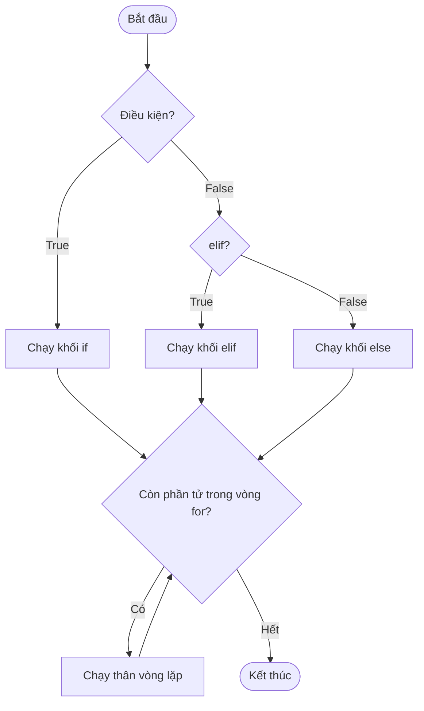

# 🎓 Làm Chủ Cấu Trúc Rẽ Nhánh Và Vòng Lặp Trong Python

> **Tác giả:** Mr.Rom  
> **Phiên bản:** v3.0.3  
> **Tạo lúc:** 16/05/2026  
> **Cập nhật:** 11/06/2026  
> **Level:** Basic  
> **Tags:** [MUST-KNOW]  
> **Yêu cầu trước:** [Bài 01: Làm chủ Biến và Kiểu dữ liệu](./01_variables-and-types.md)

> [!NOTE]
> **Mục tiêu bài học:**  
> Sau khi đã nắm giữ dữ liệu trong các biến, chương trình của bạn cần có **logic thông minh** để tự động ra quyết định và lặp lại công việc. Bài học này sẽ giúp bạn làm chủ 3 trụ cột cấu trúc điều khiển: `if/elif/else` (rẽ nhánh), `for` (vòng lặp đếm) và `while` (vòng lặp điều kiện), cùng với nghệ thuật định dạng code bằng thụt lề (*Indentation*) - linh hồn của ngôn ngữ Python.

---

## 🎯 Sau Bài Học Này Bạn Sẽ:

- [x] Hiểu sâu sắc và viết chuẩn xác cấu trúc thụt lề (*Indentation*) độc đáo của Python.
- [x] Sử dụng thành thạo `if` / `elif` / `else` để rẽ nhánh quyết định cho chương trình.
- [x] Làm chủ vòng lặp `for` để tự động duyệt qua List, Dict, Chuỗi và dãy số `range()`.
- [x] Thành thạo vòng lặp `while` để xử lý các công việc lặp dựa trên điều kiện thực tế.
- [x] Điều khiển hướng chạy của vòng lặp theo ý muốn bằng `break`, `continue` và cú pháp `for/else`.
- [x] Viết code ngắn gọn, tinh tế theo chuẩn Pythonic với kỹ thuật *Comprehension*.

---

## 💡 Bài Toán Thuế Thu Nhập: Làm Sao Để Máy Tính Tự Đưa Ra Quyết Định?

Ở bài học trước, bạn đã viết được một script tính lương cơ bản:
```python
tong_luong = luong_theo_gio * so_gio_lam_viec
tien_thue = tong_luong * 0.10
thuc_nhan = tong_luong - tien_thue
```

Sau khi chạy thử, Sếp của bạn gật đầu nhưng đưa ra thêm yêu cầu mới khó hơn:  
1.  **Thuế bậc thang:** *"Không thể áp mức thuế cào bằng 10% được! Nhân viên có tổng lương dưới 5 triệu đồng thì miễn thuế (0%). Lương từ 5 đến 10 triệu tính thuế 10%. Lương trên 10 đến 20 triệu tính 15%. Còn ai lương khủng trên 20 triệu thì áp mức 20%."*
2.  **Xử lý hàng loạt:** *"Và chúng ta có hàng chục nhân viên trong danh sách. Hãy tính tự động cho tất cả mọi người cùng lúc chứ đừng bắt tôi chạy script nhập tay từng người một!"*

Để giải quyết được yêu cầu này của Sếp, chương trình của bạn bắt buộc phải có khả năng **ra quyết định theo điều kiện** (`if/elif/else`) và **lặp đi lặp lại công việc** (`for/while`). 

Đó chính là khái niệm **Điều khiển luồng (Control Flow)** — cốt lõi tạo nên sự "thông minh" của mọi phần mềm!

---

## 1️⃣ Tại Sao Bộ Điều Hướng Luồng (Control Flow) Là Linh Hồn Của Thuật Toán?

Nếu không có Control Flow, một chương trình máy tính sẽ chạy tuột từ dòng đầu tiên xuống dòng cuối cùng theo một đường thẳng tắp rồi dừng lại. Nó giống như một chiếc xe không có vô lăng, chỉ biết đi thẳng.

Nhờ có Control Flow, chương trình của bạn có thể xử lý linh hoạt mọi tình huống phức tạp:

| Tình huống thực tế cuộc sống | Giải pháp lập trình tương ứng |
| :--- | :--- |
| "Nếu người dùng đã đăng nhập thì mở trang chủ; nếu chưa thì chuyển hướng về trang Login." | Cấu trúc rẽ nhánh `if / else` |
| "Gửi email thông báo tự động cho tất cả 10.000 khách hàng trong hệ thống." | Vòng lặp `for` duyệt qua danh sách |
| "Đọc và xử lý từng dòng một trong file văn bản cho đến khi hết file." | Vòng lặp `for` hoặc `while` |
| "Yêu cầu người dùng nhập mật khẩu liên tục cho đến khi gõ đúng thì thôi." | Vòng lặp điều kiện `while` |
| "Trong danh sách 100 giao dịch, dừng quét ngay lập tức khi phát hiện giao dịch lỗi đầu tiên." | Vòng lặp kết hợp câu lệnh `break` |

---

## 2️⃣ Bản Chất Của Indentation: Nghệ Thuật Sắp Đặt Khối Code Bằng Lề

> [!NOTE]
> **Ẩn dụ:**  
> Hãy nghĩ về Indentation (thụt dòng) giống như **cách viết thụt lề đầu dòng của các đoạn văn** trong một cuốn sách. Các dòng chữ thụt vào cùng một mức lề sẽ cùng thuộc về một phân đoạn logic duy nhất. Python bắt buộc bạn phải viết code thẳng hàng ngay ngắn để giữ trật tự và mỹ quan tối đa.

Không giống như JavaScript, Java hay C++ sử dụng cặp dấu ngoặc nhọn `{}` để bọc khối code, Python sử dụng **thụt dòng vật lý (Indentation)** để định nghĩa cấu trúc khối.

### So sánh trực quan giữa Java và Python:

-   **Với Java (Dùng ngoặc nhọn, lề chỉ để trang trí):**
    ```java
    if (age >= 18) {
        System.out.println("Bạn đã trưởng thành");
        System.out.println("Bạn được phép bỏ phiếu");
    }
    ```
-   **Với Python (Không ngoặc nhọn, thụt lề là bắt buộc):**
    ```python
    if age >= 18:
        print("Bạn đã trưởng thành")
        print("Bạn được phép bỏ phiếu")
    ```

| Yếu tố cấu trúc | Ngôn ngữ khác (Java/JS/C) | Ngôn ngữ Python |
| :--- | :--- | :--- |
| **Bắt đầu khối code** | Dùng dấu mở ngoặc `{` | Dùng dấu hai chấm `:` |
| **Kết thúc khối code** | Dùng dấu đóng ngoặc `}` | Giảm thụt lề về mức cũ (Dedent) |
| **Thụt lề đầu dòng** | Không bắt buộc (chỉ giúp dễ nhìn) | **BẮT BUỘC HỆ THỐNG** |

### 3 quy tắc thụt lề sống còn trong Python:
1.  **4 dấu cách (4 Spaces):** Đây là tiêu chuẩn vàng được PEP 8 quy định. Bạn tuyệt đối không nên dùng 2 dấu cách hay dùng phím Tab hỗn loạn.
2.  **Nhất quán tuyệt đối:** Không được phép trộn lẫn giữa dấu cách và phím Tab trong cùng một file mã nguồn.
3.  **Thụt lề tăng dần theo khối:** Mỗi khi đi sâu vào một khối con (sau dấu `:`), bạn phải thụt thêm 4 dấu cách nữa (4 -> 8 -> 12...).

> [!TIP]
> **Bí quyết với VS Code:**  
> Bạn không cần phải nhấn phím cách 4 lần một cách thủ công. VS Code đã được cấu hình mặc định tự động chuyển đổi phím `Tab` thành 4 dấu cách sạch sẽ. Bạn chỉ cần nhấn `Tab` để thụt lề và `Shift + Tab` để lùi lề cực kỳ nhanh chóng.

### Lỗi kinh điển: `IndentationError`
Đây là lỗi phổ biến nhất của người mới bắt đầu học Python. Chỉ cần viết lệch một dấu cách, Python sẽ từ chối chạy ngay:

```python
if tuoi >= 18:
print("Bạn đã trưởng thành")    # ❌ Lỗi! Thiếu thụt lề 4 dấu cách sau dấu hai chấm
```
Màn hình console sẽ báo lỗi:
`IndentationError: expected an indented block`

---

## 3️⃣ Lệnh Rẽ Nhánh if / elif / else: Dạy Máy Tính Cách Đưa Ra Lựa Chọn

Sơ đồ dưới minh hoạ cách chương trình "rẽ nhánh" qua `if/elif/else` rồi "lặp việc" qua vòng `for` — đúng hai trụ cột Control Flow mà bạn sẽ học trong bài này:



Điểm mấu chốt: với rẽ nhánh, mỗi lần chạy chỉ đi qua đúng MỘT trong các khối if/elif/else, còn vòng lặp thì quay vòng lại liên tục cho đến khi hết phần tử.

### 🛠️ 3.1 Cú pháp `if` đơn giản
Chỉ thực hiện hành động nếu điều kiện thỏa mãn:
```python
nhiet_do = 38

if nhiet_do > 37.5:
    print("Bạn đang bị sốt nhẹ rồi!")
```

### 🛠️ 3.2 Cú pháp `if / else` (Rẽ hai nhánh song song)
```python
tuoi = 16

if tuoi >= 18:
    print("Được phép lái xe phân khối lớn.")
else:
    print("Chỉ được phép đi xe đạp điện hoặc xe dưới 50cc.")
```

### 🛠️ 3.3 Cú pháp `if / elif / else` (Nhiều nhánh điều kiện)
```python
diem = 85

if diem >= 90:
    hoc_luc = "Xuất sắc"
elif diem >= 80:
    hoc_luc = "Giỏi"
elif diem >= 65:
    hoc_luc = "Khá"
elif diem >= 50:
    hoc_luc = "Trung bình"
else:
    hoc_luc = "Yếu"

print(f"Học lực của học viên: {hoc_luc}")
# Kết quả: Học lực của học viên: Giỏi
```
> [!NOTE]
> Từ khóa `elif` là viết tắt ngắn gọn của "else if" trong Python. Bạn có thể sử dụng bao nhiêu từ khóa `elif` tùy thích để bao phủ tất cả các trường hợp điều kiện thực tế.

### 🛠️ 3.4 Bảng tra cứu toán tử logic và so sánh thực chiến:

| Toán tử | Chức năng so sánh | Ví dụ thực tế | Kết quả |
| :--- | :--- | :--- | :--- |
| `==` | So sánh bằng nhau về giá trị | `5 == 5.0` | `True` |
| `!=` | So sánh khác nhau (không bằng) | `5 != 3` | `True` |
| `>`, `<` | Lớn hơn, nhỏ hơn | `10 > 20` | `False` |
| `>=`, `<=` | Lớn hơn hoặc bằng, nhỏ hơn hoặc bằng | `18 >= 18` | `True` |
| `and` | Phép VÀ (Tất cả điều kiện phải đúng) | `(5 > 3) and (2 > 4)` | `False` (vì vế sau sai) |
| `or` | Phép HOẶC (Chỉ cần 1 điều kiện đúng) | `(5 > 3) or (2 > 4)` | `True` (vì vế đầu đúng) |
| `not` | Phép PHỦ ĐỊNH (Đảo ngược trạng thái) | `not True` | `False` |
| `in` | Kiểm tra phần tử có nằm trong tập hợp | `"a" in ["a", "b", "c"]` | `True` |
| `is` | So sánh cùng trỏ vào 1 vùng nhớ (Identity) | `x is None` | Dùng check giá trị rỗng |

> [!WARNING]
> **Phân biệt kỹ giữa phép toán `==` và `is`:**  
> -   `==` dùng để so sánh **giá trị bên trong** của hai biến xem có bằng nhau hay không.  
> -   `is` dùng để kiểm tra xem hai biến đó có **cùng trỏ vào một vùng nhớ vật lý** trong RAM hay không.
> ```python
> >>> list_a = [1, 2, 3]
> >>> list_b = [1, 2, 3]
> >>> list_a == list_b
> True     # Giá trị bằng nhau hoàn toàn
> >>> list_a is list_b
> False    # Nhưng là hai chiếc hộp nằm ở hai vị trí khác nhau trong RAM!
> ```

### 🛠️ 3.5 So sánh chuỗi liên hoàn (Chained Comparison) chuẩn Pythonic
Python hỗ trợ cách viết so sánh dãy số liên tục cực kỳ tự nhiên và đẹp đẽ như toán học thông thường:

```python
x = 5
# Phong cách cồng kềnh kiểu Java/JS:
if x > 0 and x < 10:
    print("X nằm trong khoảng 0-10")

# Phong cách Premium cực đẹp chuẩn Python:
if 0 < x < 10:
    print("X nằm trong khoảng 0-10")
```

### 🛠️ 3.6 Toán tử 3 ngôi rẽ nhánh trên 1 dòng (Ternary Operator)
Giúp bạn gán giá trị theo điều kiện cực kỳ ngắn gọn:
```python
tuoi = 20
trang_thai = "Trưởng thành" if tuoi >= 18 else "Vị thành niên"
print(trang_thai)  # Kết quả: Trưởng thành
```

---

## 4️⃣ Vòng Lặp for: Sức Mạnh Quét Qua Mọi Danh Sách Dữ Liệu

Vòng lặp `for` trong Python được thiết kế để duyệt qua một tập hợp dữ liệu lặp lại được (*Iterable*).

### 🛠️ 4.1 Duyệt qua các phần tử của một List:
```python
danh_sach = ["Táo", "Chuối", "Cam"]
for trai_cay in danh_sach:
    print(f"Mình thích ăn quả: {trai_cay}")
```

### 🛠️ 4.2 Lặp với dãy số đếm bằng hàm `range()`
Hàm `range(start, end, step)` sinh ra một dãy số tự động (lưu ý giá trị `end` không được bao gồm trong kết quả):

```python
# Lặp 5 lần từ 0 đến 4
for i in range(5):
    print(i) # 0, 1, 2, 3, 4

# Lặp từ 1 đến 5 (bắt đầu từ 1, kết thúc trước 6)
for i in range(1, 6):
    print(i) # 1, 2, 3, 4, 5

# Lặp nhảy bước (bước nhảy step = 2): 0, 2, 4, 6, 8
for i in range(0, 10, 2):
    print(i)

# Đếm ngược từ 5 về 1 (step = -1)
for i in range(5, 0, -1):
    print(i) # 5, 4, 3, 2, 1
```

---

### 🛠️ 4.3 Duyệt qua từng chữ cái của một Chuỗi (String):
```python
for chu_cai in "ROM":
    print(chu_cai)
# Kết quả hiển thị: R, O, M trên từng dòng
```

---

### 🛠️ 4.4 Duyệt qua cấu trúc Dictionary:
```python
user = {"ten": "Rom", "tuoi": 28, "role": "Admin"}

# Mặc định lặp qua các Key
for key in user:
    print(key)

# Lặp song song lấy cả Key và Value cùng lúc (Khuyên dùng)
for key, value in user.items():
    print(f"Trường {key} có giá trị là: {value}")
```

---

### 🛠️ 4.5 Sử dụng `enumerate()` để lấy chỉ số index của vòng lặp
Đừng dùng biến đếm thủ công cồng kềnh, Python cung cấp sẵn hàm `enumerate()` cực kỳ chuyên nghiệp:

```python
ds_trai_cay = ["Táo", "Chuối", "Cam"]

# Lặp lấy cả số thứ tự i (bắt đầu từ 0) và giá trị của phần tử
for i, trai_cay in enumerate(ds_trai_cay):
    print(f"Quả số {i+1} là: {trai_cay}")
```

---

### 🛠️ 4.6 Ghép cặp lặp song song nhiều danh sách bằng `zip()`
```python
danh_sach_ten = ["An", "Bình", "Cường"]
danh_sach_tuoi = [28, 25, 30]

for ten, tuoi in zip(danh_sach_ten, danh_sach_tuoi):
    print(f"Bạn {ten} năm nay {tuoi} tuổi.")
```

---

## 5️⃣ Vòng Lặp while: Chạy Liên Tục Cho Đến Khi Đạt Mục Tiêu

Vòng lặp `while` sẽ liên tục thực thi khối code bên trong chừng nào điều kiện kiểm tra còn mang giá trị `True`.

```python
so_lan = 1
while so_lan <= 3:
    print(f"Chạy lần thứ {so_lan}")
    so_lan += 1   # Bắt buộc phải cập nhật điều kiện để tránh vòng lặp vô hạn
```

### So sánh nhanh: Khi nào chọn `for` và khi nào chọn `while`?

| Tiêu chuẩn lựa chọn | Vòng lặp `for` | Vòng lặp `while` |
| :--- | :--- | :--- |
| **Xác định trước số lần lặp** | ✅ Biết rõ sẽ lặp bao nhiêu lần (10 lần, hoặc lặp hết danh sách 100 khách hàng). | ❌ Không biết trước được số lần lặp cụ thể. |
| **Trường hợp sử dụng điển hình** | Duyệt danh sách, vẽ biểu đồ dữ liệu, chạy dãy số đếm cố định. | Đợi một sự kiện xảy ra (Đợi người dùng nhập đúng mật khẩu, chạy game loop liên tục cho đến khi nhấn nút Quit). |

### Ứng dụng thực tế của `while`: Vòng lặp chờ dữ liệu đầu vào đúng chuẩn
```python
mat_khau_nhap = ""
while mat_khau_nhap != "admin123":
    mat_khau_nhap = input("Vui lòng nhập mật khẩu hệ thống: ")

print("Đăng nhập thành công! Chào mừng bạn.")
```

---

## 6️⃣ Bẻ Lái Vòng Lặp: Làm Chủ Các Lệnh break, continue Và Cú Pháp for/else Độc Đáo

### 🛠️ 6.1 Lệnh `break` — Thoát ngay khỏi vòng lặp lập tức
Khi gặp lệnh `break`, vòng lặp sẽ bị kết thúc ngay lập tức, bỏ qua tất cả các lượt lặp còn lại phía sau:

```python
# Tìm số chẵn đầu tiên trong danh sách và dừng lại
danh_sach_so = [1, 3, 5, 8, 9, 10]
for so in danh_sach_so:
    if so % 2 == 0:
        print(f"Đã tìm thấy số chẵn đầu tiên: {so}")
        break  # Thoát khỏi vòng lặp ngay, không quét tiếp số 10 phía sau
```

### 🛠️ 6.2 Lệnh `continue` — Bỏ qua lượt lặp hiện tại, chuyển nhanh sang lượt tiếp theo
Lệnh `continue` chỉ bỏ qua các dòng code phía dưới nó trong *lượt lặp hiện tại* để chuyển ngay sang lượt tiếp theo của vòng lặp:

```python
# Chỉ in ra các số lẻ, bỏ qua các số chẵn
for so in range(5):
    if so % 2 == 0:
        continue  # Bỏ qua dòng print phía dưới, nhảy sang số tiếp theo
    print(f"Số lẻ: {so}")
# Kết quả hiển thị: Số lẻ: 1, Số lẻ: 3
```

### 🛠️ 6.3 Cú pháp `for / else` độc nhất vô nhị của Python
Python hỗ trợ cấu trúc `else` đi kèm trực tiếp với vòng lặp `for` hoặc `while`. Khối code trong `else` sẽ **chỉ chạy** khi vòng lặp đã chạy hết toàn bộ các lượt một cách trọn vẹn mà **không hề gặp lệnh `break` nào**.

```python
# Tìm kiếm xem trong danh sách có tài khoản Admin không
users = ["user1", "user2", "user3"]

for user in users:
    if user == "admin":
        print("Cảnh báo: Phát hiện tài khoản Admin!")
        break
else:
    # Chỉ chạy khi vòng lặp duyệt hết sạch list mà không gặp admin
    print("Hệ thống an toàn, không có tài khoản Admin trong danh sách.")
```

---

## 7️⃣ Comprehension: Nghệ Thuật Rút Gọn Code Siêu Đẳng

Comprehension là "đặc sản" của Python giúp bạn tạo nhanh List, Dict hoặc Set từ một vòng lặp chỉ trên một dòng code duy nhất.

### 1. List Comprehension
```python
# Cách viết dài dòng thông thường:
binh_phuong = []
for x in range(5):
    binh_phuong.append(x ** 2)

# Cách viết Premium Pythonic:
binh_phuong = [x ** 2 for x in range(5)]
# Kết quả: [0, 1, 4, 9, 16]
```

### 2. List Comprehension kết hợp điều kiện lọc (Filter):
```python
# Lấy bình phương nhưng chỉ lấy các số chẵn
so_chan_binh_phuong = [x ** 2 for x in range(10) if x % 2 == 0]
# Kết quả: [0, 4, 16, 36, 64]
```

### 3. Dict Comprehension
```python
# Tạo nhanh một Dict ánh xạ số với bình phương của nó
so_binh_phuong_dict = {x: x ** 2 for x in range(4)}
# Kết quả: {0: 0, 1: 1, 2: 4, 3: 9}
```

> [!TIP]
> **Quy tắc vàng:**  
> Kỹ thuật Comprehension chỉ thực sự đẹp và dễ đọc khi logic của nó đơn giản. Nếu bạn cần viết những vòng lặp lồng nhau phức tạp (Nested loop) hoặc chứa quá nhiều điều kiện rẽ nhánh phức tạp, hãy quay lại sử dụng vòng lặp `for` thông thường viết nhiều dòng để giữ cho code luôn sạch sẽ và dễ hiểu cho người sau đọc lại.

---

## 🛠️ Giải Quyết Bài Toán Thực Tế: Hệ Thống Tính Thuế Bậc Thang Tự Động

Bây giờ, chúng ta sẽ áp dụng toàn bộ kiến thức đỉnh cao về cấu trúc điều khiển `if/elif/else` và vòng lặp `for` để viết hệ thống tự động tính lương và áp thuế bậc thang cho toàn bộ danh sách nhân viên theo đúng yêu cầu thực chiến của Sếp!

Hãy tạo file `tinh_thue_nhan_vien.py` và chạy đoạn code chuyên nghiệp sau:

```python
# tinh_thue_nhan_vien.py - Hệ thống tính lương và áp thuế bậc thang tự động

# Bước 1: Chuẩn bị danh sách hồ sơ nhân viên thực tế dưới dạng List of Dicts
danh_sach_nhan_vien = [
    {"ten": "Nguyễn Văn Nam", "luong_gio": 150000, "gio_lam": 160},
    {"ten": "Trần Thị Bình", "luong_gio": 80000, "gio_lam": 50},      # Lương dưới 5tr (Không thuế)
    {"ten": "Lê Văn Cường", "luong_gio": 200000, "gio_lam": 120},     # Lương trên 20tr (Thuế 20%)
    {"ten": "Phạm Minh Đức", "luong_gio": 120000, "gio_lam": 150},     # Lương từ 10tr - 20tr (Thuế 15%)
]

print("=========================================================================")
print("                   BẢNG LƯƠNG CHI TIẾT NHÂN VIÊN                        ")
print("=========================================================================")

# Bước 2: Dùng vòng lặp for để tự động duyệt qua từng nhân viên
for nv in danh_sach_nhan_vien:
    # Tính tổng lương gốc trước thuế
    luong_goc = nv["luong_gio"] * nv["gio_lam"]
    
    # Bước 3: Áp dụng cấu trúc rẽ nhánh if/elif/else để quyết định thuế suất bậc thang theo luật
    if luong_goc < 5000000:
        thue_suat = 0.0
    elif luong_goc <= 10000000:
        thue_suat = 0.10
    elif luong_goc <= 20000000:
        thue_suat = 0.15
    else:
        thue_suat = 0.20
        
    # Tính toán số tiền thuế và thực nhận thực tế
    tien_thue = luong_goc * thue_suat
    thuc_nhan = luong_goc - tien_thue
    
    # Bước 4: In báo cáo ra màn hình gọn gàng
    print(f"Nhân viên: {nv['ten']:<15} | "
          f"Lương gốc: {luong_goc:>10,.0f} VND | "
          f"Thuế ({thue_suat*100:>2.0f}%): {tien_thue:>9,.0f} VND | "
          f"Thực nhận: {thuc_nhan:>10,.0f} VND")

print("=========================================================================")
```

Hãy mở Terminal lên và chạy thử: `python3 tinh_thue_nhan_vien.py`. Bạn sẽ thấy máy tính tự động tính toán chính xác và in ra bảng lương cực kỳ chuyên nghiệp trong nháy mắt. Sếp của bạn chắc chắn sẽ vô cùng hài lòng!

---

## ⚡ Những "Cạm Bẫy" Vòng Lặp Kinh Điển Và Cách Viết Code Pythonic Sạch Đẹp

### ❌ Cạm bẫy 1: Sửa đổi trực tiếp List khi đang lặp qua chính nó
```python
danh_sach_so = [1, 2, 3, 4, 5]
for so in danh_sach_so:
    if so % 2 == 0:
        danh_sach_so.remove(so)    # ❌ CỰC NGUY HIỂM! Vòng lặp sẽ bị nhảy cóc bỏ sót phần tử
```
-   **Giải pháp an toàn:** Hãy sử dụng kỹ thuật List Comprehension để tạo ra một List mới đã lọc sạch sẽ:
    ```python
    danh_sach_so = [so for so in danh_sach_so if so % 2 != 0]
    ```

### ❌ Cạm bẫy 2: Vòng lặp vô tận (Infinite Loop) làm treo máy
```python
i = 0
while i < 5:
    print(i)
    # ❌ Quên không tăng giá trị i lên (i += 1). Biến i mãi mãi là 0 và vòng lặp chạy vĩnh viễn gây treo máy!
```
-   **Giải pháp:** Hãy luôn kiểm tra kỹ điều kiện dừng của vòng lặp `while` và đảm bảo biến điều kiện được cập nhật liên tục ở cuối khối lệnh. Sử dụng tổ hợp phím `Ctrl + C` để cưỡng bức tắt Terminal nếu lỡ bị kẹt trong vòng lặp vô hạn.

### ✅ Tiêu chuẩn Pythonic: Sử dụng toán tử `in` thay thế cho nhiều phép so sánh `or` rườm rà
```python
# Style rườm rà, dễ viết thiếu:
if vai_tro == "admin" or vai_tro == "owner" or vai_tro == "moderator":
    mo_khoa_he_thong()

# Style Premium cực gọn và chuyên nghiệp chuẩn Python:
if vai_tro in ("admin", "owner", "moderator"):
    mo_khoa_he_thong()
```

---

## 🧠 Tự kiểm tra (Self-check)

**Câu hỏi 1:** Sự khác nhau cơ bản giữa lệnh `break` và `continue` là gì?
<details>
<summary>💡 Xem lời giải thích</summary>

-   `break` sẽ ngay lập tức **kết thúc và nhảy ra khỏi hoàn toàn** vòng lặp hiện tại. Vòng lặp dừng hẳn.
-   `continue` chỉ **bỏ qua các dòng lệnh còn lại của lượt lặp hiện tại** để ngay lập tức chuyển hướng lên đầu vòng lặp bắt đầu lượt lặp tiếp theo. Vòng lặp vẫn tiếp tục chạy.
</details>

**Câu hỏi 2:** Khối lệnh `else` đi kèm với vòng lặp `for` sẽ hoạt động khi nào?
<details>
<summary>💡 Xem lời giải thích</summary>

Khối lệnh `else` của vòng lặp `for` chỉ hoạt động khi và chỉ khi vòng lặp đó hoàn thành toàn bộ lượt chạy từ đầu đến cuối một cách trơn tru mà **không hề bị ngắt quãng bởi bất kỳ lệnh `break` nào**. Nếu trong vòng lặp có lệnh `break` được thực thi, khối `else` sẽ bị bỏ qua hoàn toàn.
</details>

---

## ⚡ Tra cứu nhanh (Cheatsheet)

```python
# 1. Cấu trúc rẽ nhánh if/elif/else tiêu chuẩn
if tuoi < 18:
    phan_loai = "Trẻ em"
elif tuoi <= 60:
    phan_loai = "Lao động"
else:
    phan_loai = "Nghỉ hưu"

# 2. Vòng lặp for và các trợ thủ đắc lực
for i in range(1, 10, 2):     # Lặp dãy số lẻ: 1, 3, 5, 7, 9
for index, gia_tri in enumerate(danh_sach):  # Lấy cả chỉ số và giá trị
for ten, tuoi in zip(ds_ten, ds_tuoi):        # Ghép cặp lặp song song

# 3. Kỹ thuật Comprehension siêu đẳng
binh_phuong_so_le = [x ** 2 for x in range(10) if x % 2 != 0]

# 4. Kiểm tra an toàn giá trị rỗng (Truthy/Falsy)
danh_sach_cho = []
if not danh_sach_cho:
    print("Danh sách đang trống rỗng!")
```

---

## 📚 Từ Điển Thuật Ngữ (Glossary)

-   **Control Flow (Luồng điều khiển):** Hướng chạy logic của code được điều hướng bởi các câu lệnh điều kiện và vòng lặp.
-   **Indentation (Thụt lề):** Khoảng trắng ở đầu dòng code, Python dùng để xác định phạm vi của các khối lệnh logic.
-   **Iterable (Đối tượng lặp):** Bất kỳ cấu trúc dữ liệu nào cho phép vòng lặp đi qua từng phần tử bên trong (như List, Tuple, Dict, Set, String).
-   **Iteration (Lượt lặp):** Một vòng chạy đơn lẻ của vòng lặp.
-   **Ternary Operator (Toán tử 3 ngôi):** Câu lệnh rút gọn gán giá trị theo điều kiện trên một dòng duy nhất.
-   **Chained Comparison (So sánh liên hoàn):** Cú pháp so sánh giá trị nằm trong khoảng cực đẹp của Python: `a < x < b`.

---

## 🔗 Liên kết & Tài nguyên

### 🧭 Định hướng lộ trình học:
-   ⬅️ **Bài trước:** [Bài 01: Làm chủ Biến và Các kiểu dữ liệu cơ bản](./01_variables-and-types.md)
-   ➡️ **Bài tiếp theo:** [Bài 03: Thiết kế Hàm (Function) và nghệ thuật tái sử dụng mã nguồn](./03_functions.md)
-   🧭 **Tấm bản đồ tổng quan:** [Zero to Coder Career Roadmap](../../../../00_roadmaps/career/zero-to-coder_career-roadmap.md)

### 🌐 Tài nguyên học tập chất lượng bên ngoài:
-   [Python Control Flow Tools - Official Docs](https://docs.python.org/3/tutorial/controlflow.html) — Hướng dẫn chuẩn hóa từ trang chủ Python.
-   [Real Python - Conditional Statements](https://realpython.com/python-conditional-statements/) — Phân tích chi tiết rẽ nhánh.
-   [Real Python - `for` Loops in Python](https://realpython.com/python-for-loop/) — Tất tần tật về vòng lặp for.

---

## 📌 Nhật ký thay đổi (Changelog)

- **v3.0.0 (26/05/2026)** — Bản viết lại hoàn chỉnh: cấu trúc rẽ nhánh `if/elif/else` và vòng lặp `for`/`while` trong Python.
- **v3.0.1 (10/06/2026)** — Bổ sung mục Nhật ký thay đổi (trước đây thiếu) để đủ khung 8 phần.
- **v3.0.2 (10/06/2026)** — Gỡ tên tác giả khỏi thân bài, callout và code mẫu (chỉ giữ ở metadata); dùng "mình"/placeholder trung tính.
- **v3.0.3 (11/06/2026)** — Bổ sung sơ đồ luồng điều khiển rẽ nhánh và vòng lặp cho trực quan.
