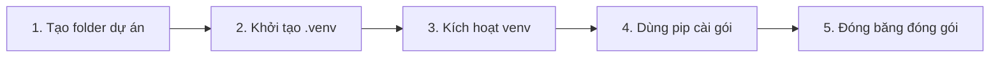

# ⚙️ Cài Đặt Môi Trường Python & Làm Chủ Không Gian Cô Lập (venv)

> **Tác giả:** Mr.Rom  
> **Phiên bản:** v2.0.0  
> **Tạo lúc:** 16/05/2026  
> **Cập nhật:** 26/05/2026  
> **OS hỗ trợ:** macOS / Linux / Windows  
> **Độ khó:** ⭐⭐ Medium (Mức độ tiếp cận thực tế)  
> **Thời lượng:** ~20-30 phút  

> [!IMPORTANT]
> **Mục tiêu cốt lõi:**  
> Sở hữu môi trường Python 3.11+ chuẩn chỉnh trên máy cá nhân, hiểu sâu sắc lý do và cách sử dụng công cụ cô lập môi trường `venv`, cùng trình quản lý thư viện `pip`. Đây là bước đệm vững chắc nhất trước khi bạn đặt những dòng code đầu tiên cho Stage 2 của hành trình *Zero-to-Coder*.

---

## 💡 Câu Chuyện Của Nam: Khi "Nước Sông" Xâm Phạm "Nước Giếng"

Hãy tưởng tượng bạn là Nam, một lập trình viên Python đầy nhiệt huyết. Nam nhận cùng lúc hai dự án hấp dẫn:
*   **Dự án A (Dự án cũ bảo trì):** Sử dụng thư viện `requests` phiên bản cũ `2.28.0` để tương thích với hệ thống legacy của khách hàng.
*   **Dự án B (Dự án AI mới tinh):** Cần thư viện `requests` phiên bản mới nhất `2.31.0` để sử dụng các tính năng bảo mật mới.

Vì chưa biết cách cô lập môi trường, Nam cài đặt thẳng (global install) thư viện của dự án B lên máy. Ngay lập tức, phiên bản cũ phục vụ cho dự án A bị ghi đè. Ngày hôm sau, khi đối tác của dự án A yêu cầu sửa lỗi gấp, Nam chạy code lên và... **CRASH!** Hàng loạt lỗi không tương thích phiên bản nổ ra. Nam rơi vào vòng xoáy cài đặt, gỡ bỏ thư viện xoay vòng trong bất lực và trễ deadline.

Để giải quyết triệt để "nỗi đau" này của Nam, **Không gian cô lập (Virtual Environment - venv)** ra đời.

### 🎭 Ẩn Dụ Sư Phạm: Nguồn Nước Chung Và Chai Nước Lọc Riêng Biệt

Để hiểu rõ bản chất của `venv` và `pip`, hãy nghĩ về chúng qua hình ảnh quen thuộc sau:

*   **Python System (Cài global trên máy):** Giống như **nguồn nước sinh hoạt chung** cấp cho toàn bộ tòa nhà. Bất kỳ ai đổ cái gì vào nguồn nước này (cài thư viện global) thì tất cả các căn hộ (dự án) khác đều phải dùng chung nguồn nước đó. Nếu nguồn nước bị ô nhiễm hoặc thay đổi thành phần, toàn bộ các căn hộ sẽ bị ảnh hưởng.
*   **Thư viện (Packages):** Giống như các **chất điều vị, khoáng chất** hòa vào nước để tạo ra các loại nước uống khác nhau.
*   **Virtual Environment (venv):** Giống như việc mỗi căn hộ tự trang bị cho mình một **bể chứa nước và hệ thống lọc riêng**. Căn hộ A thích pha thêm muối khoáng (`requests 2.28.0`), căn hộ B thích nước cất tinh khiết (`requests 2.31.0`). Họ hoàn toàn tự do và độc lập. Khi dự án kết thúc, bạn chỉ cần đổ bể chứa nước đi (xóa thư mục `.venv`), nguồn nước chung của tòa nhà vẫn hoàn toàn sạch sẽ và nguyên vẹn.

---

## 1️⃣ Python Là Gì Và Khi Nào Bạn Thực Sự Cần Đến Nó?

**Python** là ngôn ngữ lập trình phổ biến bậc nhất thế giới nhờ cú pháp rõ ràng, gần gũi như tiếng Anh tự nhiên. Python thống trị trong nhiều lĩnh vực:
*   **Web Backend:** Xây dựng hệ thống máy chủ mạnh mẽ (FastAPI, Django, Flask).
*   **Khoa học dữ liệu & Máy học (Data Science / ML):** Phân tích dữ liệu lớn và huấn luyện AI (NumPy, Pandas, PyTorch).
*   **Tự động hóa (Automation & Scripting):** Viết script quản trị hệ thống, thu thập dữ liệu web (Web Scraping).
*   **Ứng dụng AI / LLM:** Tích hợp các mô hình ngôn ngữ lớn (LangChain, OpenAI SDK, Gemini API).

### 🎯 Khi nào bạn cần cài?
*   Khi bạn bước vào **Stage 2** của lộ trình học tập, bắt đầu học tư duy lập trình căn bản.
*   Khi bạn muốn viết các công cụ tự động hóa công việc văn phòng hoặc hệ thống.

### ❌ Khi nào bạn chưa cần cài?
*   Nếu bạn chỉ làm thuần giao diện web (Frontend HTML/CSS/JS). Tuy nhiên, sở hữu Python trên máy luôn là một điểm cộng lớn để chạy các công cụ bổ trợ (tooling).

---

## 2️⃣ Cỗ Máy Của Bạn Cần Những Gì Để Sẵn Sàng?

Hãy đảm bảo máy tính của bạn đáp ứng các thông số cơ bản sau:

| Tiêu chí | Cấu hình tối thiểu | Khuyến nghị (Premium) |
| :--- | :--- | :--- |
| **Hệ điều hành (OS)** | macOS 10.13 / Windows 10 / Ubuntu 20+ | macOS 13+ / Windows 11 / Ubuntu 22+ |
| **Dung lượng đĩa trống** | 200 MB | 1 GB trở lên (để chứa các thư viện tải thêm) |
| **Phiên bản Python** | 3.10+ | **3.11 hoặc 3.12** (Phiên bản ổn định cao nhất) |
| **Yêu cầu kiến thức** | Biết mở Terminal cơ bản | Đã cài đặt VS Code và Terminal cơ bản |

> [!WARNING]
> **TUYỆT ĐỐI KHÔNG DÙNG PYTHON 2**  
> Python 2 đã bị khai tử (EOL - End Of Life) từ năm 2020. Mọi hướng dẫn, thư viện và dự án hiện đại ngày nay đều bắt buộc sử dụng Python 3.

---

## 3️⃣ Đâu Là Con Đường Cài Đặt Phù Hợp Nhất Cho Bạn?

### So sánh các phương án cài đặt nhanh

| Hệ điều hành | Phương án | Phù hợp với ai | Độ khó |
| :--- | :--- | :--- | :--- |
| **macOS** | 🅰️ Homebrew | Người đã cài Homebrew, muốn cập nhật dễ dàng | ⭐ |
| **macOS** | 🅱️ Installer chính thức | Người thích click chuột giao diện đơn giản | ⭐ |
| **macOS / Linux** | 🅲 **pyenv** | **KHUYẾN NGHỊ** — Dành cho lập trình viên cần làm việc với nhiều dự án khác phiên bản Python | ⭐⭐ |
| **Linux Ubuntu** | 🅳 apt | Phổ biến trên môi trường máy chủ | ⭐ |
| **Windows** | 🅴 Installer chính thức | Phổ biến và đơn giản nhất cho Windows | ⭐ |
| **Windows** | 🅵 winget | Lập trình viên thích cài qua dòng lệnh Windows | ⭐ |
| **Tất cả OS** | 🅶 **uv** (Astral) | **XU THẾ 2026** — Công cụ siêu tốc thay thế hoàn hảo cho cả pip, venv và pyenv | ⭐⭐ |

---

### 🅰️ macOS — Cài đặt nhanh qua Homebrew

Nếu bạn đã có [Homebrew](https://brew.sh/) trên máy, việc cài đặt vô cùng đơn giản:

```bash
# Bước 1: Cài đặt Python 3.12 qua Homebrew
brew install python@3.12

# Bước 2: Kiểm tra phiên bản sau khi cài
python3 --version
# Kết quả mong đợi: Python 3.12.x
```

> [!NOTE]
> **Lưu ý trên macOS:** Lệnh `python` (không có số 3) đôi khi vẫn trỏ vào phiên bản Python 2 cũ của hệ thống. Bạn nên luôn luôn gõ lệnh `python3` và `pip3` để đảm bảo độ chính xác, hoặc cấu hình `alias` trong file `~/.zshrc`: `alias python=python3`.

---

### 🅱️ macOS — Cài đặt bằng Installer chính thức

1. Truy cập trang tải chính thức: [python.org/downloads](https://www.python.org/downloads/) và tải về bản cài đặt `.pkg` cho macOS (khuyên dùng 3.12.x).
2. Click đúp vào file `.pkg` vừa tải và tiến hành cài đặt (nhấn Next liên tục).
3. Mở Terminal và kiểm tra: `python3 --version` để xác nhận thành công.

---

### 🅲 macOS / Linux — Sử dụng `pyenv` để quản lý nhiều phiên bản (Khuyến nghị cho Dev)

`pyenv` giúp bạn cài đặt và chuyển đổi linh hoạt giữa nhiều phiên bản Python trên cùng một máy cực kỳ chuyên nghiệp.

#### Bước 1: Cài đặt pyenv
```bash
# Đối với macOS (dùng Homebrew)
brew install pyenv

# Đối với Linux (chạy script cài đặt tự động)
curl https://pyenv.run | bash
```

#### Bước 2: Cấu hình biến môi trường
Thêm các dòng sau vào file cấu hình Shell của bạn (thường là `~/.zshrc` trên Mac hoặc `~/.bashrc` trên Linux):
```bash
# Cấu hình đường dẫn cho pyenv
export PYENV_ROOT="$HOME/.pyenv"
export PATH="$PYENV_ROOT/bin:$PATH"
eval "$(pyenv init -)"
```

Sau đó, nạp lại cấu hình:
```bash
source ~/.zshrc
```

#### Bước 3: Cài đặt và kích hoạt Python
```bash
# Xem danh sách các phiên bản có thể cài
pyenv install --list

# Cài đặt phiên bản cụ thể
pyenv install 3.12.0

# Thiết lập phiên bản này làm mặc định cho toàn hệ thống
pyenv global 3.12.0
```

Kiểm tra lại xem hệ thống đã nhận chưa:
```bash
python --version
# Kết quả: Python 3.12.0
```

> [!TIP]
> **Tự động chuyển phiên bản theo từng thư mục dự án:**  
> Nếu dự án cũ của bạn cần Python 3.11.5, chỉ cần di chuyển vào thư mục đó và gõ:  
> `pyenv local 3.11.5`  
> Công cụ sẽ tự động tạo file ẩn `.python-version`. Mỗi lần bạn `cd` vào thư mục này, hệ thống sẽ tự động chuyển sang Python 3.11.5 mà không cần bạn can thiệp thủ công!

---

### 🅳 Linux — Cài đặt qua trình quản lý gói `apt` (Ubuntu/Debian)

```bash
# Bước 1: Cập nhật danh sách gói hệ thống
sudo apt update

# Bước 2: Cài đặt Python 3, trình quản lý thư viện pip và công cụ venv
sudo apt install -y python3 python3-pip python3-venv
```

> [!WARNING]
> Phiên bản Python đi kèm kho ứng dụng mặc định của Ubuntu thường khá cũ. Nếu bạn muốn cài phiên bản mới nhất (ví dụ 3.12), hãy sử dụng kho lưu trữ của đội ngũ deadsnakes:
> ```bash
> sudo add-apt-repository ppa:deadsnakes/ppa
> sudo apt update
> sudo apt install -y python3.12 python3.12-venv python3.12-dev
> ```

---

### 🅴 Windows — Cài đặt bằng Installer chính thức (Khuyến nghị cho Beginner)

1. Tải bản cài đặt từ trang chủ: [python.org/downloads/windows](https://www.python.org/downloads/windows/) (chọn bản *Windows installer 64-bit* của dòng 3.12.x).
2. **QUAN TRỌNG CỰC ĐỘ:** Khi chạy file `.exe`, ở màn hình đầu tiên, bạn **BẮT BUỘC** phải tích chọn ô:
   *   [x] **Add python.exe to PATH** (Nằm ở phía dưới cùng). Nếu quên tích ô này, Windows Terminal sẽ không thể nhận dạng được lệnh `python`.
   *   [x] **Use admin privileges when installing py.exe**.
3. Nhấp chọn **Install Now**.
4. Mở PowerShell hoặc Command Prompt và kiểm tra:
   ```powershell
   python --version
   pip --version
   ```

> [!TIP]
> Nếu lỡ quên tích chọn "Add to PATH" dẫn đến lỗi không nhận lệnh, bạn không cần cài lại từ đầu. Hãy chạy lại file cài đặt `.exe` đã tải -> Chọn **Modify** -> Tích chọn ô **Add Python to environment variables** -> Nhấn **Install**.

---

### 🅵 Windows — Cài đặt qua dòng lệnh `winget`

Nếu bạn thích sử dụng giao diện dòng lệnh trên Windows 11:

```powershell
winget install Python.Python.3.12
```

---

### 🅶 Xu thế hiện đại — Sử dụng `uv` siêu tốc (Astral)

[`uv`](https://github.com/astral-sh/uv) là một công cụ quản lý dự án Python cực kỳ hiện đại được viết bằng Rust. Nó chạy nhanh gấp **10 - 100 lần** so với `pip` truyền thống và tự động quản lý phiên bản Python lẫn môi trường ảo một cách hoàn hảo.

#### Cài đặt uv:
```bash
# Đối với macOS và Linux
curl -LsSf https://astral.sh/uv/install.sh | sh

# Đối với Windows (chạy trên PowerShell)
powershell -ExecutionPolicy ByPass -c "irm https://astral.sh/uv/install.ps1 | iex"
```

#### Cách sử dụng uv siêu tốc:
```bash
# Bước 1: Yêu cầu uv tự động tải và cài đặt Python 3.12
uv python install 3.12

# Bước 2: Tạo môi trường ảo siêu tốc (mất chưa đầy 0.1 giây!)
uv venv

# Bước 3: Cài đặt thư viện cực nhanh
uv pip install requests
```

> [!NOTE]
> Đối với các bạn mới bắt đầu học lập trình, mình khuyên bạn nên làm quen với quy trình sử dụng `pip` và `venv` truyền thống trước để hiểu rõ bản chất vận hành của Python. Khi đã thành thạo, việc chuyển sang sử dụng `uv` sẽ giúp tối ưu hóa hiệu suất làm việc lên gấp nhiều lần.

---

## 4️⃣ Làm Sao Để Đảm Bảo Mọi Thứ Đã Hoạt Động Hoàn Hảo?

Sau khi cài đặt xong, hãy thực hiện quy trình kiểm tra 3 bước sau để chắc chắn môi trường của bạn đã sẵn sàng:

### Bước 1: Kiểm tra trình biên dịch Python
```bash
python3 --version   # Hoặc "python --version" trên Windows/pyenv
# Kết quả chuẩn: Python 3.12.x (hoặc phiên bản bạn đã chọn cài)
```

### Bước 2: Kiểm tra trình quản lý thư viện pip
```bash
pip3 --version      # Hoặc "pip --version" trên Windows/pyenv
# Kết quả chuẩn: pip 24.x.x từ thư mục cài đặt Python
```

### Bước 3: Chạy thử chế độ tương tác REPL (Read-Eval-Print Loop)
Gõ lệnh sau để truy cập vào môi trường thực thi trực tiếp của Python:
```bash
python3             # Hoặc "python"
```

Màn hình sẽ hiển thị ký tự chào mừng và dấu nhắc lệnh `>>>`. Hãy gõ dòng code huyền thoại sau:
```python
>>> print("Chào mừng bạn đến với thế giới Python!")
Chào mừng bạn đến với thế giới Python!
>>> exit()
```

Khi dòng chữ xuất hiện và bạn thoát ra an toàn bằng lệnh `exit()`, xin chúc mừng: **Môi trường Python của bạn đã hoạt động hoàn hảo!**

---

## 5️⃣ Thực Hành: Làm Chủ Không Gian Cô Lập (venv) Và Quản Lý Thư Viện

Đây là kỹ năng thực chiến quan trọng nhất mà bất kỳ lập trình viên Python chuyên nghiệp nào cũng phải nằm lòng. Hãy cùng thực hành tạo lập một dự án cô lập chuẩn chỉnh.

### Quy trình 5 bước thiết lập môi trường ảo chuẩn công nghiệp:



#### Bước 1: Tạo thư mục cho dự án của bạn và di chuyển vào trong
```bash
mkdir my-awesome-project
cd my-awesome-project
```

#### Bước 2: Khởi tạo môi trường ảo `.venv`
Lệnh này sẽ tạo ra một thư mục ẩn tên là `.venv` bên trong dự án của bạn.
```bash
python3 -m venv .venv   # Trên Windows có thể dùng: python -m venv .venv
```

> [!NOTE]
> **Bên trong thư mục `.venv` chứa những gì?**  
> Bản chất của `.venv` rất đơn giản: Nó chứa một bản sao liên kết tượng trưng (Symlink) trỏ tới trình thực thi Python chính trên hệ thống của bạn, kèm theo một thư mục `site-packages` hoàn toàn trống rỗng dùng để chứa riêng các thư viện được cài đặt cho dự án này.

#### Bước 3: Kích hoạt môi trường ảo (Activation)
Để báo cho hệ thống biết bạn muốn chuyển sang sử dụng "bể chứa nước riêng":

```bash
# Dành cho macOS và Linux (chạy trên Terminal Zsh/Bash)
source .venv/bin/activate

# Dành cho Windows (chạy trên PowerShell)
.venv\Scripts\Activate.ps1

# Dành cho Windows (chạy trên Command Prompt cũ)
.venv\Scripts\activate.bat
```

Sau khi kích hoạt thành công, bạn sẽ thấy ký hiệu **`(.venv)`** xuất hiện nổi bật ngay đầu dòng nhắc của Terminal:
```bash
(.venv) user@macbook:~/my-awesome-project$ 
```

#### Bước 4: Cài đặt thử nghiệm thư viện bằng `pip`
Bây giờ, mọi thư viện bạn cài đặt sẽ nằm trọn vẹn trong không gian cô lập của dự án này:
```bash
pip install requests
```

#### Bước 5: "Đóng băng" danh sách thư viện (Freeze dependencies)
Để người khác (hoặc chính bạn trên máy khác) có thể tái dựng lại môi trường này dễ dàng, hãy xuất danh sách thư viện ra file `requirements.txt`:
```bash
pip freeze > requirements.txt
```

Hãy mở file `requirements.txt` vừa tạo, bạn sẽ thấy nội dung tương tự như sau:
```text
certifi==2024.2.2
charset-normalizer==3.3.2
idna==3.7
requests==2.31.0
urllib3==2.2.1
```

#### Cách tái dựng môi trường ở máy khác:
Khi bạn tải code của người khác về, chỉ cần tạo môi trường ảo, kích hoạt lên và chạy lệnh sau để tự động cài đặt tất cả các thư viện cần thiết trong chớp mắt:
```bash
pip install -r requirements.txt
```

#### Tắt môi trường ảo khi dừng làm việc:
Khi bạn muốn quay lại môi trường chung của hệ thống, chỉ cần gõ lệnh:
```bash
deactivate
```

> [!TIP]
> **Quy tắc vàng với Git:**  
> Luôn thêm `.venv/` vào file `.gitignore` của bạn. Chúng ta **tuyệt đối không bao giờ** đẩy cả thư mục môi trường ảo `.venv` lên GitHub vì nó rất nặng và chứa các file thực thi đặc thù riêng cho từng hệ điều hành máy của bạn. Chúng ta chỉ commit file `requirements.txt` siêu nhẹ lên Git.

---

## 6️⃣ Trang Bị Vũ Khí: Những Công Cụ Giúp Bạn Tăng Tốc Lập Trình

### 1. Các tiện ích mở rộng bắt buộc phải cài trên VS Code

Để có trải nghiệm viết code Python mượt mà nhất, hãy cài đặt các Extension chính hãng sau trên VS Code (Xem thêm chi tiết tại [Hướng dẫn VS Code Setup](../../../02_tools/ide/vs-code.md)):

| Tên Extension | Nhà phát triển | Vai trò cốt lõi |
| :--- | :--- | :--- |
| **Python** | Microsoft | Hỗ trợ cú pháp, tự động nhận dạng môi trường ảo `venv` và hỗ trợ gỡ lỗi (debugging). |
| **Pylance** | Microsoft | Công cụ phân tích cú pháp cực mạnh, hỗ trợ tự động gợi ý code (IntelliSense) và kiểm tra lỗi kiểu dữ liệu thời gian thực. |
| **Ruff** | Astral | Công cụ dọn dẹp (Linter) và định dạng code (Formatter) nhanh nhất thế giới. Tự động căn chỉnh chuẩn PEP 8 ngay khi bạn nhấn Save. |
| **autoDocstring** | NJP Werner | Tự động sinh ra cấu trúc tài liệu hướng dẫn (docstring) chuẩn hóa cho hàm chỉ bằng việc gõ `"""`. |

---

### 2. Các thư viện dòng lệnh khuyên dùng cho lập trình viên chuyên nghiệp

Khi đã quen thuộc với Python, hãy cài đặt thêm các công cụ sau để nâng cao năng suất:

*   ** Ruff (`pip install ruff`):** Thay thế hoàn hảo cho cả Black, Flake8 và isort. Giúp code của bạn luôn sạch đẹp, nhất quán.
*   ** Pytest (`pip install pytest`):** Thư viện viết bài kiểm tra tự động (Unit Test) chuẩn công nghiệp, cực kỳ trực quan và mạnh mẽ.
*   ** IPython (`pip install ipython`):** Trình tương tác REPL nâng cao, hỗ trợ tô màu cú pháp, tự động hoàn thành tab và hiển thị lịch sử lệnh đẹp mắt hơn REPL mặc định.

---

## 7️⃣ "Giải Cứu": Các Lỗi Cài Đặt Kinh Điển Và Cách Vượt Qua

### ❌ Lỗi 1: `python: command not found` (macOS / Linux)
*   **Triệu chứng:** Bạn gõ `python` trên Terminal và nhận về thông báo lỗi command không tồn tại.
*   **Nguyên nhân:** Hệ thống macOS/Linux hiện đại không còn tích hợp sẵn liên kết từ chữ `python` trỏ vào Python 3 nữa.
*   **Cách giải quyết:** Hãy luôn gõ `python3` thay thế. Hoặc tạo liên kết alias vĩnh viễn bằng cách thêm dòng sau vào cuối file `~/.zshrc`:
    ```bash
    alias python=python3
    alias pip=pip3
    ```

### ❌ Lỗi 2: `'python' is not recognized as an internal or external command` (Windows)
*   **Triệu chứng:** Bạn gõ lệnh trên PowerShell và Windows báo lỗi không nhận diện được.
*   **Nguyên nhân:** Bạn đã quên không tích chọn ô "Add python.exe to PATH" lúc cài đặt.
*   **Cách giải quyết:** Chạy lại file cài đặt `.exe` đã tải -> Chọn **Modify** -> Tích chọn ô **Add Python to environment variables** -> Nhấn **Install** để hệ thống tự cấu hình lại đường dẫn.

### ❌ Lỗi 3: Lỗi phân quyền `Permission Denied` khi dùng `pip install`
*   **Triệu chứng:** Xuất hiện lỗi `OSError: [Errno 13] Permission denied` màu đỏ rực.
*   **Nguyên nhân:** Bạn đang cố gắng cài đặt thư viện vào thư mục Python hệ thống (global) mà không có quyền quản trị tối cao.
*   **Cách giải quyết:** **TUYỆT ĐỐI KHÔNG** dùng lệnh `sudo pip install` vì nó sẽ phá hỏng sự ổn định của hệ điều hành. Hãy thực hiện đúng quy trình: Khởi tạo `venv` -> Kích hoạt `venv` -> Tiến hành `pip install` an toàn trong không gian cô lập.

### ❌ Lỗi 4: Không kích hoạt được venv trên Windows PowerShell
*   **Triệu chứng:** Khi chạy file `.ps1` để activate venv, PowerShell báo lỗi bảo mật ngăn chặn chạy script.
*   **Nguyên nhân:** Windows thiết lập chính sách bảo mật mặc định chặn các script chưa được xác thực bên ngoài.
*   **Cách giải quyết:** Mở một cửa sổ PowerShell dưới quyền Administrator và chạy lệnh duy nhất sau để cấp quyền chạy script an toàn cho tài khoản của bạn:
    ```powershell
    Set-ExecutionPolicy -Scope CurrentUser -ExecutionPolicy RemoteSigned
    ```

---

## 8️⃣ Quản Lý Vòng Đời: Nâng Cấp Và Gỡ Bỏ Khi Cần Thiết

### 1. Phương án nâng cấp phiên bản Python

| Cách bạn đã cài | Lệnh thực hiện nâng cấp |
| :--- | :--- |
| **Homebrew** | `brew upgrade python@3.12` |
| **Installer chính thức** | Chỉ cần tải bản cài đặt `.pkg` / `.exe` mới hơn từ trang chủ và chạy cài đè lên bản cũ. |
| **pyenv** | Cài đặt bản mới và thiết lập toàn cục: `pyenv install 3.12.5 && pyenv global 3.12.5` |
| **uv** | Cực kỳ đơn giản: `uv python install 3.12.5` |

---

### 2. Cách gỡ bỏ hoàn toàn Python khỏi máy sạch sẽ

*   **Trên Windows:** Truy cập vào **Settings** -> **Apps** -> **Installed Apps** -> Tìm tất cả các mục có tên "Python" và nhấn **Uninstall**.
*   **Trên macOS (nếu cài bằng Brew):** Chạy lệnh: `brew uninstall python@3.12`.
*   **Trên macOS (nếu cài bằng Installer):** Xóa thủ công thư mục framework và liên kết:
    ```bash
    sudo rm -rf /Library/Frameworks/Python.framework
    sudo rm -rf "/Applications/Python 3.12"
    ```

> [!CAUTION]
> **CẢNH BÁO NGUY HIỂM CỰC ĐỘ:**  
> Tuyệt đối không được tìm cách xóa các phiên bản Python mặc định đi kèm của hệ thống điều hành (đặc biệt là trên các bản phân phối Linux như Ubuntu/CentOS). Hệ điều hành của bạn sử dụng phiên bản Python mặc định này để chạy các tác vụ ngầm cốt lõi. Việc xóa nó đi sẽ trực tiếp dẫn đến lỗi sập và hỏng hệ điều hành ngay lập tức!

---

## 9️⃣ Python Trong Bức Tranh Toàn Cảnh: So Với Các Ngôn Ngữ Khác Thì Sao?

Để giúp bạn có cái nhìn tổng quan trước khi quyết định gắn bó lâu dài:

| Ngôn ngữ | Thế mạnh vượt trội | Phù hợp nhất với mục tiêu nào |
| :--- | :--- | :--- |
| **Python** | Dễ học số #1, cộng đồng lớn nhất thế giới, thống trị mảng AI, dữ liệu và tự động hóa. | **Beginner bắt đầu học lập trình**, các kỹ sư AI, Data Analyst, SysAdmin. |
| **JavaScript / Node.js** | Ngôn ngữ duy nhất chạy được trên trình duyệt web, cực kỳ tối ưu cho các tác vụ thời gian thực (Real-time). | Lập trình viên định hướng trở thành Web Developer (Fullstack). |
| **Go (Golang)** | Biên dịch siêu nhanh, xử lý song song (Concurrency) cực mạnh, tốn rất ít tài nguyên phần cứng. | Kỹ sư xây dựng hệ thống Microservices cỡ lớn, kỹ sư DevOps. |
| **Rust** | An toàn bộ nhớ tuyệt đối, hiệu năng tiệm cận ngôn ngữ máy, tốc độ thực thi siêu tốc. | Kỹ sư hệ thống cấp thấp, lập trình nhân hệ điều hành, công nghệ Blockchain. |

---

## 🔗 Liên kết bài học tiếp theo

Bây giờ khi môi trường lập trình của bạn đã hoàn toàn sẵn sàng, hãy tự tin bước vào những trang kiến thức đầu tiên:

*   📖 [Bài 01: Tổng quan và triết lý thiết kế của Python](../lessons/01_basic/00_what-is-python.md)
*   📖 [Bài 02: Biến và các kiểu dữ liệu nền tảng](../lessons/01_basic/01_variables-and-types.md)
*   ⚙️ [Hướng dẫn thiết kế Workspace VS Code Premium](../../../02_tools/ide/vs-code.md)

---

## 📌 Nhật ký thay đổi (Changelog)

*   **v1.0.0 (16/05/2026)** — Phiên bản đầu tiên của Mr.Rom giới thiệu các tùy chọn cài đặt Python, venv, pip cơ bản.
*   **v2.0.0 (26/05/2026)** — **Bản nâng cấp Premium bởi Mr.Rom** — Bổ sung câu chuyện dẫn dắt Nam và ẩn dụ sư phạm nguồn nước cho `venv` sinh động; chuyển đổi các tiêu đề H2 thành câu hỏi mở kích thích tư duy; chuẩn hóa 100% Alerts sang định dạng GitHub Alerts; Việt hóa toàn diện comment trong các code block và đánh số thứ tự các bước hướng dẫn rõ ràng.
