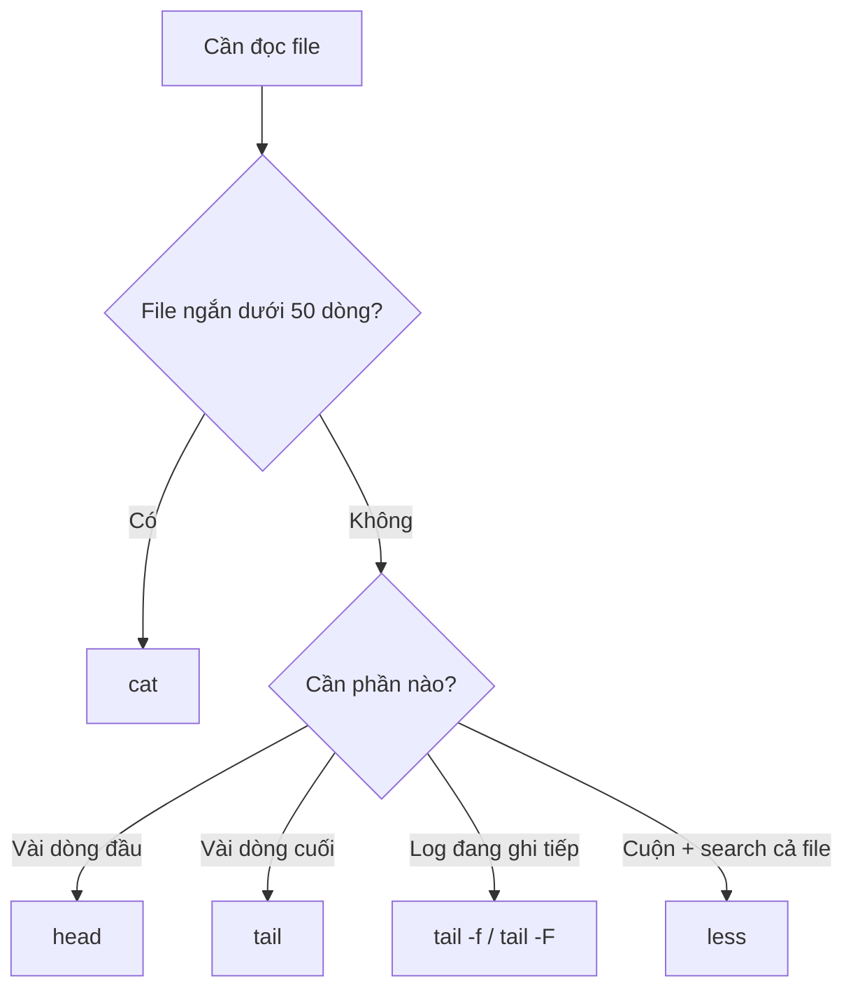

# 🎓 Linux View File Content — `cat`, `less`, `head`, `tail`

> **Tác giả:** Mr.Rom\
> **Phiên bản:** v2.1.1\
> **Tạo lúc:** 16/05/2026\
> **Cập nhật:** 11/06/2026\
> **Level:** Basic\
> **Tags:** [MUST-KNOW]\
> **Yêu cầu trước:** [01_navigation.md](./01_navigation.md), [02_file-operations.md](./02_file-operations.md)\
> **Áp dụng cho:** Linux • macOS • WSL • Git Bash

> 🎯 *Học 4 lệnh đọc file trong terminal: `cat` (in cả file), `less` (xem từng trang), `head`/`tail` (đầu/cuối file). Cực kỳ hữu ích khi follow tutorial, debug log, kiểm tra config.*

## 🎯 Sau bài này bạn sẽ

- [ ] Dùng `cat` in nội dung file ngắn
- [ ] Dùng `less` xem file dài theo trang (kèm search)
- [ ] Dùng `head` / `tail` xem đầu / cuối file
- [ ] Dùng `tail -f` theo dõi log realtime
- [ ] Chọn được lệnh phù hợp theo độ dài file

---

## Tình huống — app sập, log file dài 50,000 dòng

App production vừa sập. Bạn SSH vào server, vào `/var/log/myapp/` thấy file `error.log` dài **50,000 dòng**. 3 câu hỏi:
1. **Lỗi mới nhất là gì?** — chỉ cần 20 dòng cuối
2. **File log bắt đầu từ khi nào?** — chỉ cần 10 dòng đầu
3. **Theo dõi log realtime** khi restart app — log mới ra sao?

`cat error.log` → terminal scroll 50,000 dòng, không đọc kịp. Bạn cần **4 lệnh khác nhau** cho **4 tình huống đọc file**: `cat`, `less`, `head`, `tail`.

Bài này dạy 4 lệnh đó — đặc biệt `tail -f` (theo dõi log realtime) là kỹ năng cứu mạng khi debug production.

---

## 1️⃣ Vì sao 1 lệnh đọc file không đủ?

Cùng đọc file, sao cần 4 lệnh? Vì **mỗi tình huống có cách đọc tối ưu**:

| Tình huống | Lệnh phù hợp | Lý do |
|---|---|---|
| File ngắn (<50 dòng), muốn xem hết | `cat` | In thẳng ra terminal |
| File dài, muốn cuộn xem | `less` | Phân trang + search bằng `/` |
| Chỉ cần check 10 dòng đầu | `head` | Nhanh, không load cả file |
| Muốn xem log mới nhất | `tail` | 10 dòng cuối |
| Theo dõi log đang ghi liên tục | `tail -f` | Update realtime |

→ Beginner dùng nhiều **`cat`**, junior trở lên dùng nhiều **`tail -f`** + **`less`** khi debug.

Sơ đồ dưới minh hoạ **cây quyết định chọn lệnh** theo nhu cầu đọc — đi từ câu hỏi "file thế nào, cần xem gì" tới đúng công cụ:



→ Trả lời 2 câu hỏi (file dài không? cần phần nào?) là chọn đúng lệnh — không bao giờ phải `cat` cả file 50,000 dòng nữa.

---

## 2️⃣ Mô hình tinh thần — 4 cách đọc 1 cuốn sách

**🪞 Ẩn dụ**: *4 lệnh này như **4 cách đọc 1 cuốn sách***:
- `cat` = **đập ra mặt bàn**, đọc cả lúc (chỉ với sách mỏng)
- `less` = **lật từng trang**, có index, search
- `head` = **đọc lời tựa** (chỉ vài trang đầu)
- `tail` = **đọc kết luận** (chỉ vài trang cuối)
- `tail -f` = **đọc khi tác giả vẫn đang viết** (theo dõi update)

> 💡 Lý thuyết đủ rồi, vào hands-on.

---

## 3️⃣ Bắt tay làm — 4 lệnh đọc file

### Setup test file

Tạo 1 file mẫu để thử:

```bash
cd ~/Desktop
cat > sample.txt << 'EOF'
Dòng 1: Đây là dòng đầu
Dòng 2: Học terminal vui
Dòng 3: cat in cả file
Dòng 4: less xem từng trang
Dòng 5: head đọc đầu
Dòng 6: tail đọc cuối
Dòng 7: tail -f theo dõi log
Dòng 8: Một số nội dung mẫu
Dòng 9: Để test 4 lệnh
Dòng 10: Dòng cuối cùng
EOF
```

> 💡 *`cat > file << 'EOF' ... EOF` là cách ghi nhiều dòng vào file — sẽ học kỹ ở bài "Pipes & Redirect" (sắp có).*

### 🛠️ 3.1 `cat` — Concatenate / In nội dung

`cat` viết tắt **concatenate** (nối) — gốc dùng để nối nhiều file. Nhưng dùng phổ biến nhất là in 1 file.

#### Cơ bản

Gõ `cat <file>` → in toàn bộ nội dung file ra terminal. Phù hợp cho file ngắn (< 30 dòng):

```bash
cat sample.txt
```

```
Dòng 1: Đây là dòng đầu
Dòng 2: Học terminal vui
Dòng 3: cat in cả file
...
Dòng 10: Dòng cuối cùng
```

#### Hiển thị số dòng — `-n`

Thêm `-n` để in kèm số thứ tự dòng — rất hữu ích khi debug (vd trình lỗi báo "lỗi ở dòng 47" thì biết tìm chỗ nào):

```bash
cat -n sample.txt
```

```
     1	Dòng 1: Đây là dòng đầu
     2	Dòng 2: Học terminal vui
     3	Dòng 3: cat in cả file
     ...
    10	Dòng 10: Dòng cuối cùng
```

→ Hữu ích khi debug — muốn biết lỗi ở dòng số mấy.

#### Hiển thị ký tự ẩn — `-A` (Linux) / `-e` (Mac)

```bash
cat -A sample.txt    # Linux
cat -e sample.txt    # Mac
```

→ `$` cuối mỗi dòng = newline. `^I` = Tab. Hữu ích khi debug whitespace.

#### Nối nhiều file

Đây là tên gốc của `cat` (concatenate = nối). Truyền nhiều file → in liên tiếp, nối lại thành 1 output:

```bash
cat file1.txt file2.txt
```

→ In nội dung file1 rồi file2 liên tục.

#### ⚠️ Pitfall: `cat` file dài → spam terminal

`cat` in **toàn bộ** file. Với file 10000 dòng → terminal scroll vô hạn, không đọc được.

→ Dùng `less` thay khi file >50 dòng.

### 🛠️ 3.2 `less` — Xem từng trang

```bash
less sample.txt
```

Bạn vào chế độ pager — màn hình hiển thị 1 trang. **Điều khiển bằng phím**:

| Phím | Hành động |
|---|---|
| `Space` / `PgDn` | Xuống 1 trang |
| `b` / `PgUp` | Lên 1 trang |
| `j` / `↓` | Xuống 1 dòng |
| `k` / `↑` | Lên 1 dòng |
| `g` | Về đầu file |
| `G` | Đến cuối file |
| `/<keyword>` | Search xuôi (tìm "error") |
| `?<keyword>` | Search ngược |
| `n` | Next match |
| `N` | Previous match |
| `q` | **THOÁT** |
| `h` | Help (xem hết phím tắt) |

> 💡 *Nhớ phím `q` để thoát — beginner hay kẹt trong `less` không biết ra*.

#### Khi nào dùng `less`

- File >50 dòng
- Muốn search trong file
- Đọc log lớn
- Đọc man page (`man ls` mở `ls` doc trong `less`)

### 🛠️ 3.3 `head` — Đọc đầu file

#### Mặc định: 10 dòng đầu

```bash
head sample.txt
```

```
Dòng 1: ...
Dòng 2: ...
...
Dòng 10: ...
```

#### Chỉ định số dòng — `-n`

```bash
head -n 3 sample.txt
```

```
Dòng 1: Đây là dòng đầu
Dòng 2: Học terminal vui
Dòng 3: cat in cả file
```

#### Use case: kiểm tra format CSV

```bash
head -n 5 data.csv    # xem header + 4 dòng đầu để biết cấu trúc
```

### 🛠️ 3.4 `tail` — Đọc cuối file

#### Mặc định: 10 dòng cuối

```bash
tail sample.txt
```

#### Chỉ định số dòng

```bash
tail -n 3 sample.txt
```

```
Dòng 8: Một số nội dung mẫu
Dòng 9: Để test 4 lệnh
Dòng 10: Dòng cuối cùng
```

#### `tail -f` — Theo dõi log realtime ⭐

```bash
tail -f /var/log/app.log
```

→ In 10 dòng cuối, sau đó **giữ kết nối** — mỗi khi file có dòng mới, in ra. **Lệnh debug log số 1**.

Thoát: `Ctrl + C`.

#### `tail -F` — Như `-f` nhưng follow theo tên file

```bash
tail -F /var/log/app.log
```

→ Nếu file bị rotate (đổi tên + tạo file mới), `-F` vẫn follow file mới. `-f` thì không.

→ Khi xem log production thường dùng `tail -F`.

#### `tail -n +5` — Từ dòng 5 đến cuối

```bash
tail -n +5 sample.txt
```

→ Skip 4 dòng đầu, in từ dòng 5 đến cuối. Hữu ích khi muốn bỏ header.

---

## 💡 Cạm bẫy thường gặp & Best practice

### ❌ Cạm bẫy: Dùng `cat` cho file 100MB → terminal đứng hình

```bash
cat huge.log    # 100 MB → terminal stall
```

- **Cách tránh**: dùng `less huge.log` hoặc `head huge.log` để xem nhanh.

### ❌ Cạm bẫy: Kẹt trong `less` không biết thoát

- **Triệu chứng**: vào `less`, không thoát ra terminal bình thường được
- **Cách thoát**: nhấn `q`. Đừng nhấn `Ctrl + C` (lệnh khác — `less` không bị kill bằng `Ctrl+C` thường).

### ❌ Cạm bẫy: `tail -f` không thấy dòng mới

- **Nguyên nhân thường**: log file bị rotate (đổi tên), `-f` đang giữ file cũ
- **Cách fix**: dùng `tail -F` thay vì `-f`

### ✅ Best practice: `cat <<EOF >> file` để append nhiều dòng

```bash
cat <<EOF >> my-file.txt
Dòng mới 1
Dòng mới 2
Dòng mới 3
EOF
```

→ Append nhiều dòng vào file 1 lúc, không cần mở editor.

### ✅ Best practice: Pipe `cat` qua tools khác

```bash
cat large.log | grep "ERROR"        # tìm lỗi
cat data.csv | wc -l                # đếm số dòng
cat config.yaml | grep -v "^#"      # bỏ comment
```

→ Sẽ học chi tiết ở bài "Pipes" (sắp có).

### ✅ Best practice: `less +F` thay `tail -f`

```bash
less +F /var/log/app.log
```

→ Vào `less` ở chế độ follow (giống `tail -f`). Khác biệt: nhấn `Ctrl+C` thoát chế độ follow nhưng vẫn ở trong `less` — có thể scroll lại đọc dòng cũ. Tiện hơn `tail -f` nhiều.

---

## 🧠 Tự kiểm tra (Self-check)

**Q1.** Khi nào dùng `cat` thay `less`?

<details>
<summary>💡 Đáp án</summary>

- **`cat`**: file ngắn (<50 dòng), hoặc khi muốn pipe sang lệnh khác (vd `cat file | grep ERROR`).
- **`less`**: file dài, muốn scroll, search trong file.

Rule of thumb: file >50 dòng → `less`. File <50 dòng → `cat`. Nếu pipe → luôn `cat`.

</details>

**Q2.** Trong `less`, làm sao tìm chuỗi "error" và đi đến match thứ 3?

<details>
<summary>💡 Đáp án</summary>

1. Mở: `less file.log`
2. Gõ `/error` rồi Enter — đến match đầu tiên
3. Nhấn `n` 2 lần — đến match thứ 3

(`n` = next, `N` = previous)

</details>

**Q3.** `tail -f` và `tail -F` khác nhau thế nào? Khi nào nên dùng `-F`?

<details>
<summary>💡 Đáp án</summary>

- `tail -f` — follow file descriptor. Nếu file bị **rotate** (đổi tên), `-f` vẫn giữ file cũ (đã đổi tên), không thấy log mới.
- `tail -F` — follow theo **tên file**. Nếu file bị rotate, `-F` tự attach file mới.

Production log thường bị rotate hàng ngày (logrotate). Khi xem production log → luôn `tail -F`.

</details>

---

## ⚡ Tra cứu nhanh (Cheatsheet)

| Lệnh | Mục đích |
|---|---|
| `cat <file>` | In cả file |
| `cat -n <file>` | In + số dòng |
| `cat <f1> <f2>` | Nối 2 file |
| `less <file>` | Xem từng trang (q để thoát) |
| `less +F <file>` | Như `tail -f` nhưng trong less |
| `head <file>` | 10 dòng đầu |
| `head -n 5 <file>` | 5 dòng đầu |
| `tail <file>` | 10 dòng cuối |
| `tail -n 20 <file>` | 20 dòng cuối |
| `tail -f <file>` | Theo dõi realtime |
| `tail -F <file>` | Theo dõi + handle rotate |
| `tail -n +5 <file>` | Từ dòng 5 đến cuối |

### Phím tắt trong `less`

| Phím | Hành động |
|---|---|
| `Space` | Xuống trang |
| `b` | Lên trang |
| `g` / `G` | Đầu / cuối file |
| `/keyword` | Search xuôi |
| `n` / `N` | Next / previous match |
| `q` | Thoát |

---

## 📚 Từ Điển Thuật Ngữ (Glossary)

| EN | VN | Giải thích |
|---|---|---|
| Pager | Bộ phân trang | Chương trình hiển thị text theo trang (`less`, `more`) |
| Follow | Theo dõi | Tiếp tục đọc file khi có dòng mới (`tail -f`) |
| Log rotation | Xoay log | Đổi tên log cũ + tạo file mới (vd `app.log` → `app.log.1`) |
| Stdout | Output chuẩn | Luồng dữ liệu in ra terminal mặc định |
| Pipe (\|) | Ống | Chuyển output lệnh này thành input lệnh khác |

---

## 🔗 Liên kết & Tài nguyên

### Bài liên quan

| Hướng | Bài |
|---|---|
| ⬅️ Bài trước | [02_file-operations.md](./02_file-operations.md) |
| ➡️ Bài tiếp | [Text Processing Advanced](../02_intermediate/04_text-processing-advanced.md) — `grep`, `sed`, `awk`, pipe |
| 🧭 Roadmap | [Zero to Coder — Stage 1](../../../../00_roadmaps/career/zero-to-coder_career-roadmap.md#stage-1--tools-tối-thiểu-2-3-tuần) |

### 🌐 Tài nguyên tham khảo khác

- [`less` man page](https://man7.org/linux/man-pages/man1/less.1.html) — đầy đủ phím tắt
- [Linux Logs Tutorial](https://www.loggly.com/ultimate-guide/managing-linux-logs/) — production log management

---

## 📌 Nhật ký thay đổi (Changelog)

- **v1.0.0 (16/05/2026)** — Bản đầu tiên — lesson `cat`/`less`/`head`/`tail` với hands-on + setup test file + 5 pitfall/best-practice.
- **v1.1.0 (16/05/2026)** — Đặt vào `04_os/linux/`.
- **v2.0.0 (21/05/2026)** — Mở bài bằng tình huống debug production log 50,000 dòng — 3 câu hỏi (lỗi mới nhất / bắt đầu khi nào / realtime). Đặt lại tiêu đề các phần cho tự nhiên hơn. Nội dung kỹ thuật không đổi.
- **v2.1.0 (24/05/2026)** — Thêm 3 lời dẫn trước ví dụ (cat cơ bản, -n đánh số dòng, nối file).
- **v2.1.1 (11/06/2026)** — Bổ sung sơ đồ cây quyết định chọn lệnh đọc file cho trực quan.
