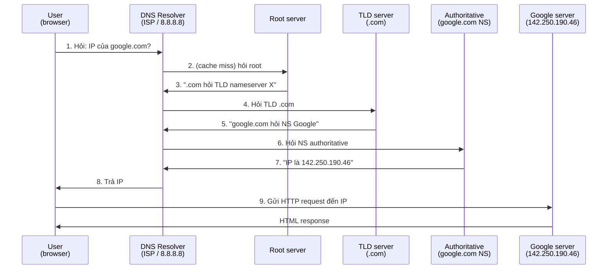

# 🎓 DNS là gì? — Danh bạ điện thoại của Internet

> **Tác giả:** Mr.Rom\
> **Phiên bản:** v1.1.0\
> **Tạo lúc:** 23/05/2026\
> **Cập nhật:** 25/05/2026\
> **Level:** Basic\
> **Tags:** [MUST-KNOW]\
> **Thời lượng đọc:** ~15 phút\
> **Prerequisites:** [HTTP là gì](../../../http-https/lessons/01_basic/00_what-is-http.md) (nên hiểu sơ HTTP để biết DNS là bước đầu của 1 request)

> 🎯 *Bài INTRO. Hiểu **DNS là gì**, **vì sao cần**, **flow domain → IP**, **3 thành phần chính**. KHÔNG đi sâu records hay resolution chi tiết (sẽ học từ bài 01 trở đi). Sau bài này bạn biết khi gõ `google.com` máy tính làm gì trước khi gửi HTTP request.*

## 🎯 Sau bài này bạn sẽ

- [ ] Hiểu **DNS là gì** và **vì sao cần** (vs gõ IP trực tiếp)
- [ ] Vẽ được flow **domain → IP → HTTP request**
- [ ] Phân biệt được **domain name** vs **URL** vs **IP**
- [ ] Đọc được anatomy 1 domain (subdomain.root.tld)
- [ ] Biết 3 thành phần: **resolver** / **root + TLD + authoritative** / **cache**
- [ ] Hiểu vì sao "đổi DNS không thấy ngay" (TTL + cache)
- [ ] Biết 3 cách check DNS nhanh (`dig`, `nslookup`, online tool)

---

## Tình huống — bạn đổi máy chủ, user kêu "site không vào được"

Bạn deploy site `acmeshop.vn` trên VPS có IP `203.0.113.10`. User vào được bình thường. 6 tháng sau bạn **đổi server** sang VPS mới mạnh hơn, IP mới `198.51.100.42`.

Bạn báo team: "đổi server xong, IP `198.51.100.42` nhé."

Hôm sau user **vẫn vào được site cũ** (do bạn quên tắt server cũ). Bạn tắt server cũ. Lúc này:

- 30% user → "site die" 😱
- 50% user → "site bình thường" 😊
- 20% user → "site hiện trang lạ" (server CDN cũ cache) 🤔

Bạn ngơ:
- **DNS** là gì mà ảnh hưởng vậy?
- Sao đổi IP server xong **không phải ai cũng thấy ngay**?
- **TTL** là gì? Vì sao có người vào nhanh, có người chờ 24h?
- Anh kỹ thuật bảo "đợi DNS propagate" — propagate là gì?

→ Đây là **DNS** — danh bạ Internet. Mỗi domain `acmeshop.vn` map tới 1 IP. Khi đổi IP, **không phải DNS server nào cũng cập nhật ngay** vì có cache. Bài này dạy bạn (và bạn) **DNS là gì**, **flow query**, và vì sao **cache + TTL** quan trọng.

---

## 1️⃣ Vậy DNS là gì?

**DNS** = **Domain Name System** — hệ thống dịch **domain name** (`google.com`) thành **IP address** (`142.250.190.46`). Ra đời **1983**, thay thế file `HOSTS.TXT` quản lý thủ công.

> 🧠 **Ẩn dụ — Danh bạ điện thoại:**
> - **Domain** = tên người (`"Mẹ"`, `"bạn"`).
> - **IP** = số điện thoại (`090123-4567`).
> - **DNS** = danh bạ — bạn nhớ tên, máy tra số.
> - **Không có DNS** = phải nhớ `203.0.113.10` thay vì `acmeshop.vn` cho **mọi site bạn truy cập**.

### Vì sao cần DNS?

Tưởng DNS chỉ là "tiện cho người dùng nhớ tên" thì là chỉ 1 phần — nó giải quyết **4 vấn đề khác** mà nếu thiếu, internet sẽ vận hành rất khó khăn. Bảng so sánh trực tiếp "có vs không":

| Thiếu DNS | Có DNS |
|---|---|
| Phải nhớ `142.250.190.46` để vào Google | Gõ `google.com` |
| Đổi server = đổi URL = đập mọi link cũ | Đổi IP server, domain vẫn nguyên |
| Không scale (1 site = nhiều IP) | DNS round-robin / Geo DNS chia traffic |
| Không tin được (số có thể fake) | DNSSEC ký số chống fake (bài sau) |

---

## 2️⃣ Anatomy 1 domain — đọc từ phải sang trái

DNS là **hierarchical** (cây phân cấp) — vì vậy domain cũng đọc theo cấp bậc, **từ phải sang trái** (gốc → ngọn), ngược với cách đọc văn bản thông thường. Sơ đồ tách 1 domain `www.acmeshop.vn.` thành 4 thành phần:

```
www.acmeshop.vn.
└─┬─┘ └──┬───┘ └┬┘ └ root (gốc, ẩn)
  │      │     │
  │      │     └─ TLD (Top Level Domain): .vn
  │      └─────── Root domain (đăng ký): acmeshop
  └────────────── Subdomain: www
```

→ Đọc **từ phải sang trái**: gốc trước, gần ngọn sau.

### Các thành phần

Mỗi cấp trong domain có **chủ thể quản lý khác nhau** — root do ICANN quản, TLD do registry (Verisign, VNNIC...), root domain do bạn đăng ký, subdomain bạn tự tạo. Bảng dưới chi tiết:

| Thành phần | Ví dụ | Ai quản lý |
|---|---|---|
| **Root** (dấu `.` cuối) | `.` | ICANN — 13 root server cluster (A-M) |
| **TLD** (Top Level Domain) | `.com`, `.vn`, `.io`, `.org` | Mỗi TLD có 1 registry (.com = Verisign, .vn = VNNIC) |
| **Root domain** | `acmeshop.vn` | Bạn đăng ký qua registrar (Namecheap, Cloudflare, GoDaddy...) |
| **Subdomain** | `www.`, `api.`, `mail.` | **Bạn tự tạo**, không cần đăng ký lại |

### Phân loại TLD

TLD (đuôi domain) có ~1500 loại tính đến 2026, chia thành **4 nhóm chính**. Mỗi nhóm có rule đăng ký + giá khác nhau — chọn TLD phù hợp khi mua domain mới:

| Loại TLD | Ví dụ | Ý nghĩa |
|---|---|---|
| **gTLD** (generic) | `.com`, `.org`, `.net`, `.info` | Dùng chung toàn cầu |
| **ccTLD** (country code) | `.vn`, `.us`, `.jp`, `.uk` | Theo quốc gia (2 ký tự) |
| **new gTLD** | `.io`, `.dev`, `.app`, `.xyz` | Mới (sau 2014) — startup hay xài |
| **sTLD** (sponsored) | `.gov`, `.edu`, `.mil` | Có cơ quan bảo trợ, giới hạn ai đăng ký |

→ **`.io`** giá đắt (gấp 5 `.com`) vì startup tranh nhau. **`.com`** vẫn là vua (~150 triệu domain).

---

## 3️⃣ Domain vs URL vs IP — đừng nhầm

3 thuật ngữ này hay bị nhầm lẫn ngay cả với dev có kinh nghiệm. **IP** chỉ server, **domain** là tên gợi nhớ map về IP, **URL** là địa chỉ đầy đủ tới resource cụ thể. Tách 1 URL minh hoạ vị trí domain trong đó:

```
https://www.acmeshop.vn/products?id=42
└─┬─┘   └──────┬───────┘ └───┬───┘ └─┬─┘
  │            │              │      │
Protocol    Domain          Path    Query
```

| Khái niệm | Ví dụ |
|---|---|
| **IP** (định danh server) | `198.51.100.42` |
| **Domain** (tên gợi nhớ) | `acmeshop.vn` |
| **URL** (địa chỉ đầy đủ tới resource) | `https://www.acmeshop.vn/products?id=42` |
| **URI** (siêu tập của URL) | bất kỳ định danh: `https://...`, `mailto:...`, `tel:...` |

→ **DNS** chỉ dịch **domain → IP**. Protocol/path/query là việc của HTTP (xem [bài http](../../../http-https/lessons/01_basic/00_what-is-http.md)).

---

## 4️⃣ Flow khi bạn gõ `google.com` — 9 bước



### Giải thích từng vai trò

| # | Vai trò | Ai chạy | Lưu gì |
|---|---|---|---|
| 1 | **Stub resolver** (browser/OS) | Máy bạn | Cache nhỏ trong OS |
| 2 | **Recursive resolver** | ISP (`Viettel`, `VNPT`) hoặc public (`8.8.8.8`, `1.1.1.1`) | Cache lớn, sống TTL |
| 3 | **Root server** | ICANN — 13 cluster A-M toàn cầu | Chỉ biết "đi đâu hỏi `.com`, `.vn`..." |
| 4 | **TLD server** | Registry (`.com` = Verisign) | Biết "đi đâu hỏi `google.com`" |
| 5 | **Authoritative NS** | Owner của domain (Google chạy `ns1.google.com`) | **Biết câu trả lời cuối cùng** (IP) |

> 🧠 **Ẩn dụ — Hỏi đường đến nhà bạn ở phố lạ:**
> - Root server = bảng đồ tổng thành phố (chỉ ra quận).
> - TLD = bảng đồ quận (chỉ ra phường).
> - Authoritative = người dân phường (biết chính xác số nhà).
> - Resolver = anh chở taxi đi hỏi giúp bạn, **nhớ đường** để lần sau khỏi hỏi lại.

---

## 5️⃣ Cache + TTL — vì sao đổi DNS không thấy ngay

DNS có **rất nhiều layer cache**:

```
Browser cache  →  OS cache  →  Router cache  →  ISP resolver cache  →  Root/TLD/Auth
   (1-5 phút)   (5-30 phút)    (TTL theo domain)    (TTL ghi rõ)
```

### TTL là gì?

**TTL** (Time To Live) = số **giây** record được cache. Domain owner set TTL khi config DNS:

| TTL | Use case |
|---|---|
| `300` (5 phút) | Đang test, đổi IP thường xuyên |
| `3600` (1 giờ) | Production thông thường |
| `86400` (24 giờ) | Site stable, ít đổi IP |
| `604800` (7 ngày) | Subdomain hiếm đổi (CDN, MX) |

### Vì sao user của bạn có 3 trạng thái?

Khi bạn đổi IP `203.0.113.10` → `198.51.100.42`:

| User | Cache họ đang giữ | Trải nghiệm |
|---|---|---|
| ISP cache đã TTL expire | IP mới `198.51.100.42` | ✅ Vào bình thường |
| ISP cache CHƯA expire | IP cũ `203.0.113.10` | ❌ "Site die" (vì server cũ tắt) |
| CDN còn cache trang cũ | Phục vụ HTML cũ | 🤔 "Hiện trang lạ" |

→ **"Đợi DNS propagate"** = đợi các ISP cache expire và tự fetch IP mới. Thông thường **đợi TTL cũ** (bạn set 24h = 1 ngày tệ nhất).

### Best practice khi sắp đổi IP

```
T-24h: Hạ TTL từ 86400 → 300 (5 phút)
T-0:   Đợi 24h cho TTL cũ expire ở mọi nơi
T+0:   Đổi IP record (lúc này TTL đã 5 phút)
T+5p:  Mọi nơi update
T+1h:  Tăng TTL lại 3600 (đỡ hỏi auth quá nhiều)
```

→ Bạn nếu biết trick này đã không gây 30% "site die".

---

## 6️⃣ 3 thành phần lớn của hệ DNS

| Thành phần | Ai chạy | Vai trò |
|---|---|---|
| **Recursive resolver** (DNS Server) | ISP, `8.8.8.8` (Google), `1.1.1.1` (Cloudflare), `9.9.9.9` (Quad9) | Đi hỏi giùm user, cache kết quả |
| **Authoritative server** | Owner domain (qua Cloudflare/Route53/GoDaddy/...) | Biết câu trả lời cuối cùng |
| **Cache layer** (mọi nơi) | Browser, OS, router, resolver | Tăng tốc, giảm tải |

### Public resolver phổ biến

| Resolver | IP v4 | IP v6 | Đặc điểm |
|---|---|---|---|
| **Google** | `8.8.8.8`, `8.8.4.4` | `2001:4860:4860::8888` | Nhanh, ổn định, log query |
| **Cloudflare** | `1.1.1.1`, `1.0.0.1` | `2606:4700:4700::1111` | **Riêng tư nhất** (không log), nhanh nhất |
| **Quad9** | `9.9.9.9` | `2620:fe::fe` | Block malware site tự động |
| **OpenDNS** | `208.67.222.222` | — | Filter content (gia đình) |

→ Khi ISP DNS chậm/bị chặn, bạn có thể đổi DNS sang Cloudflare/Google trong cài đặt Wi-Fi.

---

## 7️⃣ 3 cách check DNS nhanh

### Cách 1 — `dig` (Linux/Mac)

```bash
$ dig google.com

;; ANSWER SECTION:
google.com.   300   IN   A   142.250.190.46
```

→ `300` là **TTL còn lại**, `A` là loại record (IPv4).

### Cách 2 — `nslookup` (Windows/Mac/Linux)

```bash
$ nslookup google.com

Server:    8.8.8.8
Address:   8.8.8.8#53

Non-authoritative answer:
Name:    google.com
Address: 142.250.190.46
```

→ "Non-authoritative" nghĩa là **từ cache resolver**, không phải hỏi trực tiếp Google.

### Cách 3 — Web tool

- [dnschecker.org](https://dnschecker.org) — check 30+ resolver toàn cầu cùng lúc (rất hữu ích khi propagate)
- [mxtoolbox.com](https://mxtoolbox.com) — check MX, blacklist
- [whois.com](https://whois.com) — check owner + registrar

→ 3 tool chi tiết học ở [bài 03 dns-tools](03_dns-tools.md).

---

## ⚠️ 5 pitfall hay vướng

1. **Tưởng đổi DNS thấy ngay** → DNS có **nhiều layer cache**. Phải đợi TTL expire. Worst case 24h-48h tùy TTL cũ.
2. **Set TTL quá cao khi đang test** → Phát hiện sai IP, đổi xong vẫn chờ 24h. Test = TTL `300`.
3. **Tưởng DNS = mật khẩu site** → DNS chỉ map domain → IP. **Không** liên quan login, không liên quan SSL cert (xem [bài HTTPS](../../../http-https/lessons/01_basic/04_https-tls.md)).
4. **Nhầm registrar và DNS provider** → Registrar = nơi đăng ký domain (Namecheap). DNS provider = nơi host record (Cloudflare). Có thể khác nhau — nhiều người mua domain Namecheap nhưng dùng Cloudflare DNS (miễn phí, nhanh, có DDoS protection).
5. **Quên dấu `.` cuối domain trong file zone** → DNS technical config dùng FQDN có dấu `.` ở cuối (`google.com.`). Quên = relative domain, sai cú pháp.

---

## ✅ Self-check

1. Khi gõ `youtube.com` vào browser, **bước đầu tiên** máy tính làm là gì?
2. TTL `3600` nghĩa là gì? Khi nào nên hạ xuống `300`?
3. Phân biệt **registrar** và **DNS provider**.
4. `1.1.1.1` là gì? Có gì khác `8.8.8.8`?
5. Vì sao user của bạn có 3 trạng thái khác nhau khi đổi IP?

<details>
<summary>Gợi ý đáp án</summary>

1. **DNS lookup** — hỏi resolver "IP của youtube.com là gì?" trước khi gửi HTTP request. Nếu cache có sẵn → 1ms. Cache miss → 50-200ms.
2. `3600` = record được cache 3600 giây (1 giờ). Nên hạ xuống `300` (5 phút) **24h trước khi đổi IP** để mọi cache expire nhanh, đổi ít disruptive.
3. **Registrar** = công ty bán quyền dùng domain (Namecheap, GoDaddy). **DNS provider** = nơi host record A/CNAME/MX/... (Cloudflare, Route53). Có thể dùng 2 công ty khác nhau (mua domain Namecheap, trỏ nameserver về Cloudflare).
4. `1.1.1.1` = **Cloudflare DNS resolver**, miễn phí, **không log query** (privacy). `8.8.8.8` = Google DNS, cũng miễn phí nhưng log. Cả 2 đều nhanh hơn DNS ISP Việt Nam thường (đỡ bị chặn site).
5. Vì DNS có **cache layer**. User ở ISP đã expire cache → vào bình thường (IP mới). User ở ISP chưa expire → vẫn dùng IP cũ → site die khi server cũ tắt. User dùng CDN → CDN còn cache HTML cũ → hiện trang outdated.
</details>

---

## ⚡ Cheatsheet

| Thuật ngữ | Ý nghĩa |
|---|---|
| **Domain** | Tên gợi nhớ thay cho IP (`google.com`) |
| **TLD** | Đuôi domain (`.com`, `.vn`, `.io`) |
| **Subdomain** | Phần trước root domain (`www.`, `api.`) |
| **A record** | Domain → IPv4 (`google.com` → `142.250.190.46`) |
| **AAAA record** | Domain → IPv6 |
| **TTL** | Giây cache được giữ trước khi resolver hỏi lại |
| **Resolver** | DNS server đi hỏi giùm bạn (ISP/`8.8.8.8`/`1.1.1.1`) |
| **Authoritative NS** | Server giữ câu trả lời gốc của domain |
| **Propagation** | Quá trình cache mọi nơi update sau khi đổi DNS |
| **FQDN** | Fully Qualified Domain Name — có dấu `.` cuối (`google.com.`) |

### 3 lệnh check DNS

```bash
dig google.com               # Linux/Mac — chi tiết nhất
dig google.com +short        # Chỉ trả IP
nslookup google.com          # Mọi OS
host google.com              # Linux — gọn nhất
```

### Đổi DNS resolver máy bạn

| OS | Cách |
|---|---|
| macOS | System Settings → Network → Advanced → DNS → thêm `1.1.1.1` |
| Windows | Network → Change adapter options → IPv4 → DNS: `1.1.1.1` |
| Router (toàn bộ nhà) | Admin panel → WAN/DHCP → DNS: `1.1.1.1`, `1.0.0.1` |

---

## 📘 Glossary

| Thuật ngữ | Ý nghĩa |
|---|---|
| **DNS** | Domain Name System — hệ dịch domain → IP |
| **gTLD / ccTLD** | Generic TLD (`.com`, `.org`) / Country code TLD (`.vn`, `.us`) |
| **ICANN** | Internet Corporation for Assigned Names and Numbers — tổ chức quản lý root + TLD policy |
| **Registry** | Bên giữ database của 1 TLD (Verisign giữ `.com`) |
| **Registrar** | Bên bán domain cho user (Namecheap, GoDaddy, Cloudflare) |
| **Recursive resolver** | DNS server đi hỏi chuỗi root → TLD → auth giùm user |
| **Authoritative server** | DNS server có quyền trả lời cuối cùng cho 1 zone |
| **Zone file** | File config 1 zone DNS (chứa A/AAAA/MX/CNAME records) |
| **DNSSEC** | DNS Security Extensions — ký số chống fake response (học [bài 04](04_dns-setup-and-security.md)) |

---

## 🔗 Links

### Trong cluster
- → Tiếp: [DNS Records (A, CNAME, MX, TXT, NS)](01_dns-records.md)
- ↑ Cluster: [dns README](../../README.md)

### Cross-reference
- [HTTP là gì](../../../http-https/lessons/01_basic/00_what-is-http.md) — DNS là bước đầu của 1 HTTP request
- [HTTPS & TLS](../../../http-https/lessons/01_basic/04_https-tls.md) — TLS cert verify thông qua domain (DNS)

### External
- 📖 [Cloudflare Learning: DNS](https://www.cloudflare.com/learning/dns/what-is-dns/) — series free explainer chất lượng cao
- 📖 [How DNS Works (cartoon)](https://howdns.works/) — illustrated tutorial
- 📖 [DNS for Developers (MDN)](https://developer.mozilla.org/en-US/docs/Glossary/DNS)
- 📖 [Public DNS comparison — Cloudflare blog](https://blog.cloudflare.com/announcing-1111/)

---

> 🎯 *Sau bài này bạn hiểu DNS là **danh bạ Internet**, mỗi HTTP request đều bắt đầu bằng 1 DNS lookup, và **cache + TTL** quyết định trải nghiệm khi đổi IP. Bài kế tiếp sẽ dạy **DNS records** — A/AAAA/CNAME/MX/TXT/NS/SOA — để bạn config được zone file cho domain của mình.*

---

## 📌 Changelog

- **v1.1.0 (25/05/2026)** — Apply Blueprint v0.5.4+ §3.6: thêm lead-in 2-3 câu trước §1 "Vì sao cần DNS" bảng + §2 Anatomy domain diagram + bảng "Các thành phần" + bảng "Phân loại TLD" + §3 "Domain vs URL vs IP" diagram. Thêm Changelog section.

- **v1.0.0 (23/05/2026)** — Bản đầu tiên. Cluster `dns/` lesson 1/5. Cover: DNS = danh bạ + 4 vấn đề DNS giải quyết → anatomy domain (root/TLD/root domain/subdomain) → 4 loại TLD → domain vs URL vs IP → 9-step DNS resolution mermaid → recursive vs iterative + 4 nameserver type → cache layer + TTL + propagation → public resolver compare.
