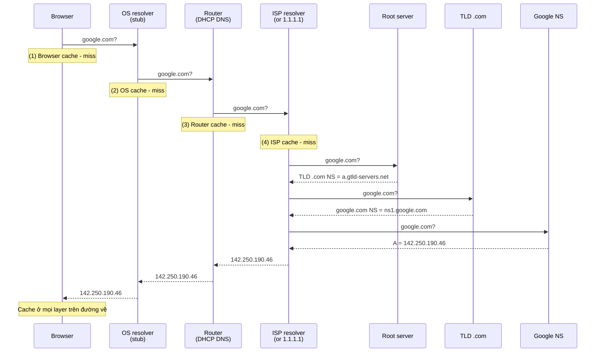

# 🎓 DNS Resolution — Hành trình từ `google.com` đến IP

> **Tác giả:** Mr.Rom\
> **Phiên bản:** v1.1.0\
> **Tạo lúc:** 23/05/2026\
> **Cập nhật:** 25/05/2026\
> **Level:** Basic\
> **Tags:** [MUST-KNOW]\
> **Thời lượng đọc:** ~15 phút\
> **Prerequisites:** [DNS là gì](00_what-is-dns.md), [DNS Records](01_dns-records.md)

> 🎯 *Đi sâu vào **flow query**: từng layer cache, recursive vs iterative, root → TLD → authoritative, negative caching, TTL propagation. Sau bài này bạn debug được "vì sao site vẫn vào IP cũ" khi đã đổi DNS.*

## 🎯 Sau bài này bạn sẽ

- [ ] Phân biệt **recursive** vs **iterative** query
- [ ] Vẽ được flow đầy đủ qua **5 layer cache**
- [ ] Hiểu **negative caching** (cache "không có record này")
- [ ] Tính được **thời gian tối đa** chờ propagate
- [ ] Biết cách **flush DNS cache** (browser/OS/router)
- [ ] Hiểu vì sao `localhost` không cần DNS query
- [ ] Đo được **latency** từng layer bằng `dig +trace`

---

## Tình huống — bạn đổi IP, đợi 24h vẫn có 5% user vào IP cũ

Bạn làm theo best practice bài [00](00_what-is-dns.md):
- T-24h: hạ TTL `86400` → `300`
- T-0: đợi 24h
- T+0: đổi IP
- T+30 phút: kiểm tra → 95% user vào IP mới

Nhưng **5% user vẫn vào IP cũ**. Bạn check:
- Đa số là user **đang dùng VPN** hoặc **app cũ chưa update**.
- Có user dùng Windows 7, browser cũ — cache OS tới **7 ngày**.
- 1 user dùng router tự cài DNS forwarder, cache không tôn trọng TTL.

Bạn ngơ:
- Sao có cache **lâu hơn TTL** mình set?
- DNS query đi qua **những đâu** thực sự?
- Làm sao **flush cache** mọi nơi?
- Có cách nào **bypass cache** test ngay không?

→ Bài này dạy bạn (và bạn) **mọi layer cache**, **2 kiểu query** (recursive vs iterative), và **cách flush** + **cách dùng `+trace` để xem đường đi thật**.

---

## 1️⃣ Recursive vs Iterative Query

Đây là 2 chế độ query DNS — quan trọng để hiểu **ai làm việc nặng**.

### Recursive query

User hỏi resolver: *"IP của `google.com` là gì? **Trả tao đáp án cuối cùng**."*

→ Resolver phải **đi hỏi giùm**: root → TLD → auth — rồi trả về 1 IP final.

```
Browser  ──(recursive)──→  Resolver (8.8.8.8)
                              │ làm hết
                              ↓
                          Root, TLD, Auth (iterative)
                              │
Browser  ←──(IP cuối cùng)──  Resolver
```

→ **User chỉ hỏi 1 câu, nhận 1 câu trả lời.**

### Iterative query

Resolver hỏi root: *"`google.com` ở đâu?"* — Root trả *"không biết IP, nhưng `.com` hỏi NS Verisign."*

→ Resolver tự đi hỏi NS tiếp theo, **lặp lại** đến khi có câu trả lời.

```
Resolver ──(iterative)──→ Root        → "đi hỏi .com TLD"
Resolver ──(iterative)──→ TLD .com    → "đi hỏi google NS"
Resolver ──(iterative)──→ Google NS   → "IP là 142.250.190.46"
```

### Tổng kết

Recursive vs Iterative là 2 chiến lược khác nhau — và DNS dùng **cả 2** trong cùng 1 lookup. Hiểu được sẽ giải thích vì sao Root/TLD/Auth có thể chịu tải hàng tỷ query/giây mà không sập:

| Tiêu chí | Recursive | Iterative |
|---|---|---|
| Ai dùng | Client → Resolver | Resolver → Root/TLD/Auth |
| Server làm gì | Toàn bộ chuỗi giùm | Trả "đi hỏi server tiếp theo" |
| Lý do split | Root/TLD/Auth phải serve **hàng tỷ query/giây** — không thể recursive cho mọi người |

→ Nếu Root cho recursive thì 13 root server cluster gãy ngay. Iterative cho phép Root chỉ trả 1 reference rồi out — nhẹ tải.

---

## 2️⃣ Flow đầy đủ — qua 5 layer cache

Trên thực tế, query DNS **rất ít khi** đi đến auth server — vì đường đi qua **5 layer cache** xếp chồng. Browser hỏi OS, OS hỏi router, router hỏi ISP, ISP hỏi root/TLD/auth. Mỗi layer hit cache là dừng:

```
Browser cache (1) → OS cache (2) → Router cache (3) → ISP resolver (4) → Root/TLD/Auth (5)
   ↑ chỉ check (1) trước                            ↑ recursive nặng tại đây
```



### Layer 1 — Browser cache

Browser tự maintain DNS cache riêng — TTL ngắn (60s) để cân bằng giữa "tránh stale data" và "đỡ query OS lặp đi lặp lại". Khi test DNS đổi mà chưa thấy ngay, đây là layer cần flush đầu tiên:

| Browser | TTL cache |
|---|---|
| Chrome | 1 phút (default), respect server TTL nếu < 1 phút |
| Firefox | 60 giây |
| Safari | Trên macOS, dùng OS cache (mDNSResponder) |

→ **Flush Chrome DNS**: `chrome://net-internals/#dns` → "Clear host cache".

### Layer 2 — OS cache

Mỗi OS có **DNS resolver service riêng** (mDNSResponder trên Mac, systemd-resolved trên Linux, DNS Client trên Windows) — flush command khác nhau. Học thuộc 1 dòng cho OS bạn dùng — đây là command sẽ gõ rất thường xuyên khi debug DNS:

| OS | Cache | Flush command |
|---|---|---|
| **macOS** | mDNSResponder | `sudo dscacheutil -flushcache; sudo killall -HUP mDNSResponder` |
| **Linux** (systemd-resolved) | `systemd-resolved` | `sudo resolvectl flush-caches` |
| **Linux** (nscd) | `nscd` | `sudo systemctl restart nscd` |
| **Windows** | DNS Client service | `ipconfig /flushdns` |

### Layer 3 — Router cache

Nhiều router (TP-Link, Asus, Tenda) có **DNS forwarder + cache**. TTL tùy firmware:
- Khá tốt: tôn trọng TTL server
- Cũ/buggy: cache cố định 1h hoặc 24h, bỏ qua TTL

→ Flush: vào admin panel (`192.168.1.1`) → restart router (hoặc bật/tắt Wi-Fi).

### Layer 4 — ISP resolver

Đây là **layer cache lớn nhất** — phục vụ hàng triệu user. Tôn trọng TTL của zone.

→ Bạn không flush được. Đợi TTL expire.

### Layer 5 — Root/TLD/Auth

Không có "cache" theo nghĩa thông thường. Đây là **source of truth**. Trả lời theo zone file owner config.

---

## 3️⃣ Negative caching — cache "không có record"

Khi resolver query `nonexistent.acmeshop.vn` → auth trả `NXDOMAIN` (Non-Existent Domain).

→ Resolver **cache cả NXDOMAIN** trong **`SOA minimum TTL`** (xem [bài 01 §8](01_dns-records.md#8️⃣-soa--metadata-zone-auto-ít-khi-đụng)).

### Vì sao negative cache quan trọng?

Không chỉ cache "có IP gì" — DNS còn cache **"không có record"** (NXDOMAIN). Lý do: nếu không cache cái không tồn tại, mỗi typo user gõ sai (typo.domain.com) sẽ đập thẳng vào auth → spam. So sánh:

- ❌ Without: mỗi lần user vào `typo.domain.com` → query đập auth → spam.
- ✅ With: cache "không có" trong vài phút → đỡ tải.

### Pitfall

Bạn vừa **tạo subdomain mới** (`new.acmeshop.vn`) → vào không thấy. Hỏi: "đổi DNS chưa propagate?"

→ Thực ra là **negative cache** từ lần query trước (lúc subdomain chưa tồn tại). Đợi `SOA minimum TTL` (default 1h-24h) hoặc flush cache local.

---

## 4️⃣ TTL propagation — vì sao đợi lâu?

### Câu chuyện đầy đủ khi bạn đổi IP

```
T-0:    bạn đổi A record @acmeshop.vn từ 203.0.113.10 → 198.51.100.42
        TTL cũ = 86400 (24h)

T+0 ─── 1 user truy cập lần đầu (cache lạnh):
            → Resolver query → trả IP MỚI → cache 24h
        99 user khác đã có cache IP cũ:
            → Resolver trả IP CŨ từ cache → user vào server cũ
            → Cache còn sống đến T+x giờ (x = thời gian còn lại của TTL cũ)

T+6h ── Khoảng 50% cache đã hết. Resolver query lại auth → IP MỚI.
T+24h ── Hầu hết cache hết, chỉ còn vài user (router buggy / OS cache lâu).
T+48h ── 99%+ user vào IP mới.
T+1tuần ── 100% (kể cả device cache lỗi spec).
```

### Vì sao "best practice 24h trước" giảm tránh?

```
T-25h: bạn hạ TTL 86400 → 300
T-24h: Resolver query (cache cũ hết do TTL 24h trước) → cache với TTL mới 300
T-0:   ĐỔI IP. TTL trên mọi cache giờ là 5 phút.
T+5p:  Cache hết, query lại → IP MỚI.
T+10p: ~99% user vào IP mới.
```

→ Thời gian disruption từ **24-48h** giảm còn **5-10 phút**.

---

## 5️⃣ `dig +trace` — xem đường đi thật

```bash
$ dig +trace google.com

;; ROOT QUERY
.    518400  IN   NS   a.root-servers.net.
...
;; TLD QUERY
com.    172800  IN   NS   a.gtld-servers.net.
...
;; AUTHORITATIVE QUERY
google.com.   172800  IN   NS   ns1.google.com.
...
;; ANSWER
google.com.   300  IN   A   142.250.190.46
```

→ Cho thấy **từng bước iterative** mà resolver thực sự đi qua. Hữu ích khi debug "tại sao DNS sai".

### `dig` cho từng layer

```bash
# Hỏi authoritative trực tiếp (bypass resolver cache)
dig @ns1.google.com google.com

# Hỏi public resolver
dig @8.8.8.8 google.com
dig @1.1.1.1 google.com

# Hỏi resolver ISP của bạn (default)
dig google.com
```

→ Khác kết quả = có nơi cache stale. Authoritative là **source of truth**.

→ Chi tiết `dig` ở [bài 03](03_dns-tools.md).

---

## 6️⃣ `hosts` file — bypass DNS hoàn toàn

Trước khi DNS query, OS check file `hosts`:

| OS | Path |
|---|---|
| macOS / Linux | `/etc/hosts` |
| Windows | `C:\Windows\System32\drivers\etc\hosts` |

### Use case

```
# Test local dev
127.0.0.1   acmeshop.vn

# Test domain trước khi đổi DNS
198.51.100.42   acmeshop.vn
198.51.100.42   www.acmeshop.vn

# Block site (cho con cái, tự kỷ luật)
0.0.0.0   facebook.com
0.0.0.0   instagram.com
```

→ Sau khi edit, **OS cache cần flush** (xem §2). `hosts` ưu tiên cao nhất, bypass mọi DNS.

### Pitfall

- ❌ Quên xóa entry sau khi test → ngày sau "site die" trên máy bạn.
- ❌ Sai cú pháp (thiếu tab, dùng comma) → entry bị skip.
- ⚠️ Một số app (Chrome network stack) **cache riêng** — phải restart browser.

---

## 7️⃣ Browser DoH (DNS over HTTPS) — DNS qua HTTPS

Chrome/Firefox từ 2020 có **DoH built-in**: thay vì query DNS qua port 53 cleartext, browser query qua HTTPS đến `1.1.1.1` / `8.8.8.8`.

### Hệ quả

| Khía cạnh | Truyền thống | DoH |
|---|---|---|
| **Privacy** | ISP thấy bạn query domain nào | ISP chỉ thấy HTTPS đến `1.1.1.1` |
| **Speed** | UDP port 53, fast | HTTPS overhead nhẹ |
| **Bypass ISP** | ISP có thể chặn DNS query (CSAM, gov) | Khó chặn — encrypted |
| **OS hosts** | ✅ Vẫn hoạt động | ✅ Vẫn hoạt động (browser check `hosts` trước) |
| **Corporate DNS** | ✅ Hoạt động | ❌ Bypass corporate filter! → IT lo |

→ Chrome: `chrome://settings/security` → "Use secure DNS" → ON.

→ Học DoH/DoT đầy đủ ở [bài 04](04_dns-setup-and-security.md).

---

## 8️⃣ Vì sao `localhost` không cần DNS?

```
$ ping localhost
PING localhost (127.0.0.1)
```

→ `localhost` không qua DNS resolver! Nó được hardcode:

1. **OS hosts file**: `127.0.0.1 localhost` (entry mặc định).
2. **Loopback interface** (`lo`): mọi traffic về `127.0.0.1` không ra mạng — xử lý in-kernel.

→ Tương tự `127.0.0.1`, `0.0.0.0`, `::1` (IPv6 loopback) — không qua DNS.

---

## ⚠️ 5 pitfall hay vướng

1. **Đợi propagate quá lâu** → 90% case do TTL cũ cao (không hạ trước). Hạ TTL trước 24h luôn cứu.
2. **Browser cache không hết** → Chrome `chrome://net-internals/#dns` clear thủ công. Hoặc `Ctrl+Shift+R` (hard reload).
3. **Quên flush `/etc/hosts`** → cache OS bám entry cũ sau khi xóa. `dscacheutil -flushcache` (Mac) hoặc `ipconfig /flushdns` (Win).
4. **Test trên 1 máy không đại diện** → máy bạn có thể cache stale. Test trên [dnschecker.org](https://dnschecker.org) thấy 30+ resolver toàn cầu cùng lúc.
5. **`dig` không bypass cache thực sự** → `dig google.com` vẫn dùng resolver ISP (cache). `dig @1.1.1.1 google.com` bypass ISP. `dig +trace google.com` bypass mọi cache (đi từ root).

---

## ✅ Self-check

1. Khi bạn query `google.com` lần thứ 2 trong 10 phút, request có đến `8.8.8.8` không?
2. Phân biệt **recursive** và **iterative** query.
3. NXDOMAIN cached bao lâu? Cấu hình ở đâu?
4. Lệnh flush DNS cache trên 3 OS?
5. Tại sao `dig @1.1.1.1 acmeshop.vn` trả IP khác `dig @8.8.8.8 acmeshop.vn`?

<details>
<summary>Gợi ý đáp án</summary>

1. **Không** — browser cache + OS cache giữ kết quả lần 1, không cần ra đến resolver. Trừ khi browser TTL hết (1 phút Chrome) → mới ra OS. OS hết → mới ra resolver.

2. **Recursive**: client/resolver hỏi 1 server, **yêu cầu đáp án cuối cùng**. Server phải làm hết. **Iterative**: server trả "đi hỏi server tiếp theo", caller lặp lại đến khi có đáp án. Client thường recursive với resolver, resolver iterative với root/TLD/auth.

3. NXDOMAIN cached theo **SOA minimum TTL** (mặc định 1h-24h tùy provider). Configured trong SOA record của zone.

4. Mac: `sudo dscacheutil -flushcache; sudo killall -HUP mDNSResponder`. Linux: `sudo resolvectl flush-caches`. Windows: `ipconfig /flushdns`.

5. Vì **2 resolver cache độc lập**. `1.1.1.1` (Cloudflare) có thể đã expire cache → query lại auth → IP mới. `8.8.8.8` (Google) cache cũ vẫn còn → trả IP cũ. Auth là source of truth.
</details>

---

## ⚡ Cheatsheet

### Flush cache theo layer

| Layer | Cách flush |
|---|---|
| Browser Chrome | `chrome://net-internals/#dns` → Clear |
| OS macOS | `sudo dscacheutil -flushcache; sudo killall -HUP mDNSResponder` |
| OS Linux (systemd) | `sudo resolvectl flush-caches` |
| OS Windows | `ipconfig /flushdns` |
| Router | restart router (hoặc tắt-bật) |
| Public resolver | ❌ không flush được, đợi TTL |

### `dig` quick

```bash
dig google.com                # Default resolver, cache có thể stale
dig @1.1.1.1 google.com       # Bypass ISP, hỏi Cloudflare
dig @ns1.google.com google.com # Hỏi auth trực tiếp (source of truth)
dig +trace google.com         # Toàn bộ đường đi root → TLD → auth
dig +short google.com         # Chỉ IP, không metadata
dig MX acmeshop.vn            # Hỏi loại record cụ thể
```

### Best practice đổi IP

```
T-25h: hạ TTL 86400 → 300
T-24h: confirm TTL đã propagate (dig)
T-0:   đổi A record
T+10p: 99% propagate
T+1h:  nâng TTL lại 3600 (giảm tải auth)
```

---

## 📘 Glossary

| Thuật ngữ | Ý nghĩa |
|---|---|
| **Recursive query** | Client yêu cầu resolver trả đáp án cuối cùng |
| **Iterative query** | Server trả "đi hỏi server tiếp theo", không trả final |
| **Stub resolver** | DNS client trong OS, gửi recursive query đến resolver |
| **Recursive resolver** | DNS server làm iterative cho client (ISP / 1.1.1.1) |
| **NXDOMAIN** | Domain không tồn tại |
| **Negative cache** | Cache "không có record này" để tránh hỏi lại liên tục |
| **Propagation** | Quá trình cache mọi nơi update sau khi config DNS đổi |
| **DoH** | DNS over HTTPS — query DNS qua HTTPS encrypted |
| **DoT** | DNS over TLS — query DNS qua TLS port 853 |
| **hosts file** | File OS hardcode mapping `domain → IP`, ưu tiên trước DNS |
| **Loopback** | `127.0.0.1` / `::1` — không qua DNS, in-kernel handling |

---

## 🔗 Links

### Trong cluster
- ← Trước: [DNS Records](01_dns-records.md)
- → Tiếp: [DNS Tools (`dig`, `nslookup`)](03_dns-tools.md)
- ↑ Cluster: [dns README](../../README.md)

### External
- 📖 [Cloudflare: What is recursive DNS?](https://www.cloudflare.com/learning/dns/what-is-recursive-dns/)
- 📖 [DNS Resolution Process — Verisign](https://www.verisign.com/en_US/website-presence/online/how-dns-works/index.xhtml)
- 📖 [DNSchecker.org](https://dnschecker.org) — propagation test 30+ resolver
- 📖 [How DoH works — Mozilla](https://blog.mozilla.org/en/products/firefox/firefox-news/firefox-continues-push-to-bring-dns-over-https-by-default-for-us-users/)

---

> 🎯 *Sau bài này bạn hiểu **cache propagation** + **cách flush từng layer** + **iterative vs recursive**. Bài kế tiếp dạy `dig`, `nslookup`, `host`, `whois` — tools để debug DNS issue thật.*

---

## 📌 Changelog

- **v1.1.0 (25/05/2026)** — Apply Blueprint v0.5.4+ §3.6: thêm lead-in 2-3 câu trước §1 "Tổng kết" recursive vs iterative + §2 Flow 5-layer cache diagram + §2 Layer 1 browser cache + Layer 2 OS cache table + §3 negative cache importance. Thêm Changelog section.

- **v1.0.0 (23/05/2026)** — Bản đầu tiên. Cluster `dns/` lesson 3/5. Cover: recursive vs iterative + flow đầy đủ qua 5 layer cache + flush per layer + negative cache (NXDOMAIN) + DNS propagation (TTL-based, không phải global sync) + best practice giảm TTL trước migrate.
