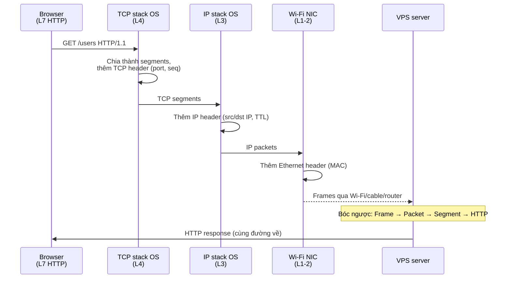

# 🎓 TCP/IP là gì? — Bộ giao thức nền của Internet

> **Tác giả:** Mr.Rom\
> **Phiên bản:** v1.1.0\
> **Tạo lúc:** 23/05/2026\
> **Cập nhật:** 25/05/2026\
> **Level:** Basic\
> **Tags:** [MUST-KNOW]\
> **Thời lượng đọc:** ~15 phút\
> **Prerequisites:** Đã đọc [HTTP là gì](../../../http-https/lessons/01_basic/00_what-is-http.md) (để biết Internet làm gì ở layer 7)

> 🎯 *Bài INTRO. Hiểu **TCP/IP là gì**, **4 layer model**, **OSI 7 layer** so sánh, **encapsulation** (gói bên trong gói), tại sao 1 HTTP request thực sự đi qua nhiều layer mới đến server. KHÔNG dạy IP addressing chi tiết hay TCP handshake (sẽ học bài 01/02).*

## 🎯 Sau bài này bạn sẽ

- [ ] Hiểu **TCP/IP là gì** + lịch sử ngắn (1970s ARPANET → 2026 Internet)
- [ ] Vẽ được **4 layer TCP/IP** + 7 layer OSI + mapping giữa 2 mô hình
- [ ] Đọc được **encapsulation** — HTTP đi qua TCP đi qua IP đi qua Ethernet
- [ ] Phân biệt **mỗi layer làm gì** (network, transport, internet, application)
- [ ] Hiểu **vì sao split layer** thay vì 1 protocol khổng lồ
- [ ] Biết 3 hành vi nhiệm vụ chính của Layer 4 (TCP) và Layer 3 (IP)

---

## Tình huống — Bạn debug "Connection refused"

Bạn deploy backend FastAPI lên VPS:
- Domain `api.acmeshop.vn` đã trỏ về VPS (DNS OK ✓)
- HTTPS cert OK ✓
- Code chạy local OK ✓

Curl từ máy ngoài:
```bash
$ curl https://api.acmeshop.vn/users
curl: (7) Failed to connect to api.acmeshop.vn port 443:
Connection refused
```

Bạn ngơ:
- DNS đúng (browser thấy IP)
- Cert đúng (https://)
- Code chạy được local — sao server không nhận?
- **"Connection refused"** là lỗi ở **layer nào**?
- Có phải firewall? port? TCP? IP?

→ Khi gặp lỗi mạng, biết **layer nào báo lỗi** = giải được 50% bài toán. HTTP debug ở [bài 02 status codes](../../../http-https/lessons/01_basic/02_http-status-codes.md). Connection layer thấp hơn debug ở đâu? Bài này dạy bạn (và bạn) **mô hình TCP/IP** — bản đồ giúp biết "đi đâu mà tìm".

---

## 1️⃣ Vậy TCP/IP là gì?

**TCP/IP** = **Transmission Control Protocol / Internet Protocol** — bộ giao thức truyền dữ liệu trên mạng máy tính, là **nền tảng của Internet**.

Lịch sử nhanh:
- **1969** — ARPANET (DoD Mỹ) — mạng đầu tiên, dùng NCP.
- **1974** — Vint Cerf + Le Van B Kahn công bố TCP (paper "A Protocol for Packet Network Intercommunication").
- **1983** — ARPANET chuyển sang TCP/IP — coi là "ngày Internet ra đời".
- **2026** — Mọi thiết bị Internet (kể cả điện thoại) đều nói TCP/IP.

> 🧠 **Ẩn dụ — TCP/IP như hệ thống bưu điện:**
> - **IP** = bì thư — có địa chỉ gửi/nhận (IP address), nhỏ nhất 1 trang giấy.
> - **TCP** = dịch vụ EMS — chia bưu kiện lớn thành nhiều thư nhỏ, đánh số, đảm bảo đến đủ và đúng thứ tự.
> - **HTTP/SMTP/SSH** = ngôn ngữ nội dung trong thư (request hỏi gì, response trả gì).

### Bản chất: bộ **protocol suite**

"TCP/IP" thực ra là tên chung cho **bộ hàng chục giao thức**, không chỉ TCP + IP:

| Layer | Giao thức ví dụ |
|---|---|
| Application | HTTP, HTTPS, FTP, SMTP, DNS, SSH, WebSocket |
| Transport | **TCP**, UDP, QUIC |
| Internet | **IP** (v4/v6), ICMP, ARP |
| Link | Ethernet, Wi-Fi, PPP |

---

## 2️⃣ Mô hình 4-layer TCP/IP

TCP/IP chia network stack thành **4 tầng** (layer) — mỗi tầng có 1 trách nhiệm rõ ràng và **không cần biết** tầng dưới làm việc thế nào. Đây là kiến trúc cốt lõi của internet — học 1 lần dùng cả đời:

```
┌────────────────────────────────────────┐
│ Layer 4: APPLICATION                   │   HTTP, DNS, SSH, FTP, SMTP
│ "Ngôn ngữ ứng dụng — request/response" │
├────────────────────────────────────────┤
│ Layer 3: TRANSPORT                     │   TCP, UDP, QUIC
│ "Cuộc hội thoại — đảm bảo đến đủ"      │
├────────────────────────────────────────┤
│ Layer 2: INTERNET                      │   IP, ICMP, ARP
│ "Định tuyến — gửi từ A đến B"          │
├────────────────────────────────────────┤
│ Layer 1: LINK / NETWORK ACCESS         │   Ethernet, Wi-Fi
│ "Cable + signal vật lý"                │
└────────────────────────────────────────┘
```

### Nhiệm vụ từng layer

Mỗi layer có **đơn vị data riêng** (message/segment/packet/frame) và **mục tiêu cụ thể**. Hiểu rõ giúp debug đúng layer khi network có vấn đề — "ping được nhưng curl timeout" = layer 3 OK, layer 4 sai:

| Layer | Đơn vị data | Giao thức | Nhiệm vụ |
|---|---|---|---|
| 4. **Application** | Message | HTTP, DNS, SSH | "Tôi muốn lấy `/users` từ server" |
| 3. **Transport** | Segment (TCP) / Datagram (UDP) | TCP, UDP, QUIC | "Đảm bảo data đến đủ + đúng thứ tự" |
| 2. **Internet** | Packet | IP, ICMP | "Route packet từ Hà Nội đến Singapore" |
| 1. **Link** | Frame | Ethernet, Wi-Fi | "Đặt bits lên dây cable / sóng Wi-Fi" |

> 💡 **Quy tắc**: layer trên dùng dịch vụ layer dưới, **không cần biết layer dưới hoạt động ra sao**. App dev viết HTTP — không cần lo TCP cài đặt thế nào, IP route ra sao.

---

## 3️⃣ OSI 7-layer — học thuật, ít dùng thực tế

**OSI** = Open Systems Interconnection — mô hình **7 layer** từ ISO 1984.

```
TCP/IP (4)              OSI (7)
─────────────           ──────────────────
                        7. Application       ← HTTP, FTP, SSH
Application             6. Presentation      ← TLS, encryption, compression
                        5. Session           ← SSL session, RPC session
─────────────           ──────────────────
Transport               4. Transport         ← TCP, UDP
─────────────           ──────────────────
Internet                3. Network           ← IP, ICMP
─────────────           ──────────────────
Link                    2. Data Link         ← Ethernet, MAC
                        1. Physical          ← Cable, radio wave
```

### Khi nào nói "Layer X"?

Trong giao tiếp với devops/network engineer, **gọi layer bằng số** (L2, L3, L4, L7) là phổ biến hơn gọi tên. Đặc biệt khi bàn về **load balancer** ("L4 LB" vs "L7 LB" khác nhau căn bản về cách routing). Bảng mapping nhanh:

| "Layer 2" | Switch, MAC address, VLAN |
|---|---|
| **"Layer 3"** | Router, IP address, subnet, ACL |
| **"Layer 4"** | TCP/UDP, load balancer L4 (NAT-based) |
| **"Layer 7"** | HTTP, application, **load balancer L7** (content-aware), WAF |

> 💡 **Trong công nghiệp**, "L4" và "L7" rất hay dùng (đặc biệt với **load balancer**, **firewall**). Hiểu mapping với OSI để giao tiếp với devops/network team.

### TCP/IP vs OSI — thực tế

Cả 2 mô hình đều **đang được dạy** trong sách giáo khoa, nhưng vai trò khác nhau: TCP/IP là **mô hình đang chạy**, OSI là **reference để giao tiếp**. Bảng so sánh 4 trục:

| Aspect | TCP/IP | OSI |
|---|---|---|
| Layer | 4 | 7 |
| Năm | 1974 (Cerf/Kahn) | 1984 (ISO) |
| Thực dụng | ✅ Internet đang chạy | ❌ Chưa bao giờ deploy đầy đủ |
| Dùng để học | Practical | Theoretical/reference |

→ **2026 reality**: kể OSI 7-layer là **văn hóa chung**, nhưng implementation thực = TCP/IP 4-layer. Học cả 2.

---

## 4️⃣ Encapsulation — gói bên trong gói

Khi browser gửi 1 HTTP request, data được **bọc liên tiếp** xuống từng layer:

```
┌─────────────────────────────────────────────────────────────────┐
│ Ethernet Frame                                                  │
│ ┌─────────────────────────────────────────────────────────────┐ │
│ │ IP Packet                                                   │ │
│ │ ┌─────────────────────────────────────────────────────────┐ │ │
│ │ │ TCP Segment                                             │ │ │
│ │ │ ┌─────────────────────────────────────────────────────┐ │ │ │
│ │ │ │ HTTP Message (GET /users HTTP/1.1\r\nHost: ...)     │ │ │ │
│ │ │ └─────────────────────────────────────────────────────┘ │ │ │
│ │ │ + TCP header (src port, dst port, seq, ack, flags)      │ │ │
│ │ └─────────────────────────────────────────────────────────┘ │ │
│ │ + IP header (src IP, dst IP, TTL, protocol)                 │ │
│ └─────────────────────────────────────────────────────────────┘ │
│ + Ethernet header (src MAC, dst MAC, EtherType)                 │
└─────────────────────────────────────────────────────────────────┘
```

### Mỗi layer thêm header (và cuối cùng có thể trailer)

Khi data đi xuống stack, **mỗi layer thêm metadata** (header + đôi khi trailer) phục vụ riêng cho layer đó. Khi receiver bóc ngược, từng layer đọc header của mình rồi remove. Bảng chi tiết những gì mỗi layer add:

| Layer | Thêm gì |
|---|---|
| Application | HTTP request raw (text) |
| Transport (TCP) | Header: src port, dst port, seq #, ack #, flags (SYN/ACK/FIN), checksum |
| Internet (IP) | Header: src IP, dst IP, TTL, protocol (=6 cho TCP), checksum |
| Link (Ethernet) | Header: src MAC, dst MAC + Trailer: FCS (frame check) |

### Khi nhận: bóc ngược

Server nhận Ethernet frame → bóc header → IP packet → bóc → TCP segment → bóc → HTTP message → app xử lý.

> 🧠 **Ẩn dụ — Bưu phẩm**:
> - HTTP message = **letter** bạn viết.
> - TCP segment = **envelope phụ** (số thứ tự, "kiểm tra đủ chưa").
> - IP packet = **envelope chính** ghi địa chỉ.
> - Ethernet frame = **bao bì vận chuyển** từng chặng (từ Hà Nội qua xe → đến sân bay → qua máy bay → đến Sing).

---

## 5️⃣ Tại sao SPLIT layer? — design quan trọng

**Có thể** thiết kế 1 protocol khổng lồ làm hết mọi việc. Tại sao chia layer?

### Lợi ích

| Lợi ích | Ví dụ |
|---|---|
| **Modularity** | Thay TCP bằng QUIC (Google 2012, HTTP/3) — chỉ đổi layer 4, app + IP + Ethernet không cần biết |
| **Reusability** | HTTP/FTP/SSH cùng dùng TCP — không cần mỗi protocol tự reimplement |
| **Innovation độc lập** | Wi-Fi 6 / 5G / fiber tốt hơn — layer 1 đổi, layer trên không cần biết |
| **Debug dễ** | "Layer 3 fail" = chỉ check IP/routing; "Layer 7 fail" = chỉ check app code |
| **Team chia việc** | Network engineer làm L1-3, backend dev làm L7, frontend dev nhúng tay vào L7 thôi |

### Ví dụ thực tế thành công

- **TLS** sống ở "layer 5-6" (OSI) → mọi HTTP, SMTP, IMAP, FTP đều có version TLS.
- **HTTP/3** thay TCP bằng QUIC nhanh hơn — app không cần đổi.
- **IPv4 → IPv6** đổi layer 3 — app không cần đổi (nếu coding chuẩn).

---

## 6️⃣ Layer 4 vs Layer 3 — 2 vai trò lớn nhất

### Layer 3 (IP) — định tuyến

| Nhiệm vụ | Cách làm |
|---|---|
| **Định danh máy** | IP address (v4: `203.0.113.10`, v6: `2001:db8::1`) |
| **Route packet** | Router xem `dst IP`, lookup routing table, forward tới hop tiếp theo |
| **TTL** | Giảm 1 mỗi router; = 0 → drop (chống loop) |
| **Best effort** | KHÔNG đảm bảo đến — có thể mất, lệch thứ tự, lặp |

→ Chi tiết IP address ở [bài 01](01_ip-addressing.md).

### Layer 4 (TCP) — đảm bảo đến đủ

| Nhiệm vụ | Cách làm |
|---|---|
| **Định danh app** | Port (HTTP=80, HTTPS=443, SSH=22) |
| **Đảm bảo đến đủ** | Sequence number + ACK + retransmit |
| **Đúng thứ tự** | Sequence number → re-order ở receiver |
| **Flow control** | Window size — không gửi quá khả năng receiver |
| **Congestion control** | Slow start, AIMD → giảm tốc khi mạng tắc |

→ Chi tiết TCP vs UDP ở [bài 02](02_tcp-vs-udp.md).

### Hiểu khác biệt qua ví dụ

| Tình huống | Layer nào? |
|---|---|
| "Tôi không kết nối được tới `192.168.1.10`" — `ping` fail | Layer 3 (IP) |
| "Ping được nhưng kết nối port 80 fail" | Layer 4 (TCP) / firewall |
| "Kết nối OK nhưng request 404" | Layer 7 (HTTP) |
| "Trang load chậm 5s" | Có thể bất kỳ — đo từng layer |

→ Bạn bị "Connection refused" cho HTTPS — đây là **layer 4** (TCP)! Server nhận packet IP, nhưng không có process listen port 443. Fix: start backend service hoặc mở firewall port 443.

---

## 7️⃣ Mô hình thực tế — Bạn gửi GET /users



→ Encapsulation + de-encapsulation diễn ra **mỗi packet**, mỗi lần. Vì TCP/IP design hiệu quả, all-in 1-2ms.

---

## ⚠️ 5 pitfall hay vướng

1. **"TCP/IP" tưởng = "TCP và IP"** → Đúng 2 giao thức gốc, nhưng tên gọi cả **bộ ~30 giao thức** (HTTP, DNS, ICMP, ARP, ...).
2. **Nhầm Layer 7 với Layer 4** → L7 = HTTP/app. L4 = TCP/port. Load balancer L4 chỉ thấy port, L7 thấy URL path. Khi giao tiếp devops, dùng đúng số.
3. **Tin "data đi cùng đường"** → Không. Mỗi packet có thể đi khác route. TCP re-order ở receiver. Không có "kết nối vật lý" — chỉ là logical.
4. **Tưởng OSI là chuẩn dùng** → Internet chạy **TCP/IP** thực sự. OSI chỉ là academic reference.
5. **`ping` thấy đáp = "kết nối OK"** → `ping` test L3 (IP/ICMP), KHÔNG test L4-L7. Server có thể ping được nhưng port 80 đóng.

---

## ✅ Self-check

1. TCP/IP có mấy layer? Liệt kê + 1 giao thức ví dụ mỗi layer.
2. OSI có mấy layer? Mapping `Application` của TCP/IP với layer nào trong OSI?
3. **Encapsulation** là gì? Browser gửi `GET /users`, data được bọc qua mấy layer header trước khi vào dây?
4. "Connection refused" thường ở layer nào? Cách debug?
5. Sao split layer thay vì 1 protocol khổng lồ?

<details>
<summary>Gợi ý đáp án</summary>

1. **4 layer**: Application (HTTP/DNS/SSH), Transport (TCP/UDP), Internet (IP/ICMP), Link (Ethernet/Wi-Fi).

2. **7 layer** OSI: Physical, Data Link, Network, Transport, Session, Presentation, Application. TCP/IP `Application` (1 layer) ≈ OSI `Application + Presentation + Session` (3 layer).

3. Encapsulation = mỗi layer thêm header bọc data lớp trên. HTTP message → +TCP header → +IP header → +Ethernet header (+trailer) → bits trên dây. 3 header được thêm.

4. **Layer 4 (TCP)** — server nhận được IP packet (L3 OK) nhưng **không có process listen port** đó → reject. Debug: `ss -tlnp | grep :443` (process listen chưa?), `iptables -L` / `ufw status` (firewall chặn?), restart service.

5. **Modularity** (đổi 1 layer không ảnh hưởng layer khác — VD HTTP/3 thay TCP bằng QUIC). **Reusability** (HTTP/FTP/SSH cùng dùng TCP). **Innovation độc lập** (Wi-Fi 6, IPv6 tự nâng cấp). **Debug dễ** (biết layer nào fail). **Team chia việc** (network/backend/frontend).
</details>

---

## ⚡ Cheatsheet

### 4 layer + giao thức

| Layer | Giao thức | "Đơn vị" |
|---|---|---|
| Application | HTTP, DNS, SSH, FTP | Message |
| Transport | TCP, UDP, QUIC | Segment / Datagram |
| Internet | IP, ICMP, ARP | Packet |
| Link | Ethernet, Wi-Fi | Frame |

### OSI ↔ TCP/IP

| OSI 7 | TCP/IP 4 |
|---|---|
| 7. Application | Application |
| 6. Presentation | Application |
| 5. Session | Application |
| 4. Transport | Transport |
| 3. Network | Internet |
| 2. Data Link | Link |
| 1. Physical | Link |

### Khi gặp lỗi mạng — bắt đầu từ đâu

```
1. DNS resolve được không?      → dig domain
2. IP reachable không?           → ping IP
3. Port mở không?                → telnet IP port  /  nc -zv IP port
4. App phản hồi không?           → curl http://...
5. Logs server gì?               → tail -f /var/log/...
```

---

## 📘 Glossary

| Thuật ngữ | Ý nghĩa |
|---|---|
| **TCP/IP** | Bộ giao thức truyền data Internet (TCP + IP + nhiều cái khác) |
| **TCP** | Transmission Control Protocol — reliable, ordered, connection-oriented (Layer 4) |
| **UDP** | User Datagram Protocol — fast, no guarantee (Layer 4) |
| **IP** | Internet Protocol — định tuyến packet (Layer 3) |
| **OSI model** | Open Systems Interconnection — mô hình 7-layer academic |
| **Encapsulation** | Mỗi layer bọc data với header riêng |
| **Packet / Segment / Frame** | Đơn vị data ở layer 3 / 4 / 1-2 |
| **L4 / L7 load balancer** | LB hoạt động ở Layer 4 (TCP port) / Layer 7 (HTTP path) |
| **ARP** | Address Resolution Protocol — map IP ↔ MAC |
| **ICMP** | Internet Control Message Protocol — `ping`, error reporting |

---

## 🔗 Links

### Trong cluster
- → Tiếp: [IP Addressing](01_ip-addressing.md)
- ↑ Cluster: [tcp-ip-fundamentals README](../../README.md)

### Cross-reference
- [HTTP là gì](../../../http-https/lessons/01_basic/00_what-is-http.md) — L7 application, ngồi trên TCP/IP
- [DNS là gì](../../../dns/lessons/01_basic/00_what-is-dns.md) — L7 application, dịch domain trước khi TCP connect

### External
- 📖 [Cloudflare Learning: What is TCP/IP?](https://www.cloudflare.com/learning/ddos/glossary/tcp-ip/)
- 📖 [How the Internet Works in 5 Minutes — Aaron Titus](https://www.youtube.com/watch?v=7_LPdttKXPc)
- 📖 [RFC 793 — TCP](https://datatracker.ietf.org/doc/html/rfc793) (specification gốc, đọc khó)
- 📖 [Beej's Guide to Network Programming](https://beej.us/guide/bgnet/) — best free book về socket
- 📖 [TCP/IP Illustrated Vol 1 — W. Richard Stevens](https://www.amazon.com/dp/0321336313) — sách bible (đắt nhưng giá trị)

---

> 🎯 *Sau bài này bạn có **bản đồ** để debug mọi lỗi mạng — biết "đi đâu mà tìm". Bài kế tiếp dạy **IP addressing** chi tiết: IPv4/IPv6, subnet, CIDR, public/private/NAT.*

---

## 📌 Changelog

- **v1.1.0 (25/05/2026)** — Apply Blueprint v0.5.4+ §3.6 (Header→Code anti-pattern fix): thêm lead-in 2-3 câu trước §2 Mô hình 4-layer diagram + bảng "Nhiệm vụ từng layer" + §3 "Khi nào nói Layer X" + bảng TCP/IP vs OSI + §4 "Mỗi layer thêm header" bảng. Nội dung kỹ thuật giữ nguyên 100%.

- **v1.0.0 (23/05/2026)** — Bản đầu tiên. Cluster `tcp-ip-fundamentals/` lesson 1/5. Cover: tình huống Connection refused → §1 TCP/IP là gì → §2 mô hình 4-layer + nhiệm vụ → §3 OSI 7-layer compare → §4 Encapsulation (frame trong packet trong segment) → §5 vì sao split layer (decoupling, debug, reuse) → §6 hiểu khác biệt qua ví dụ → §7 mô hình thực tế trace GET request từ Hà Nội đến Sing. 5 pitfall + 4 self-check.
