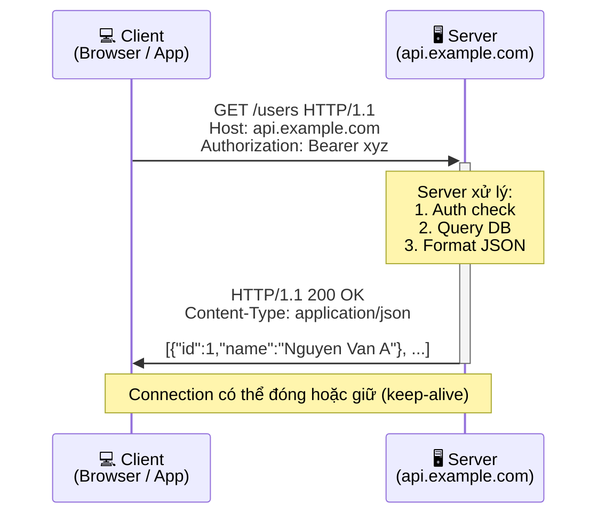
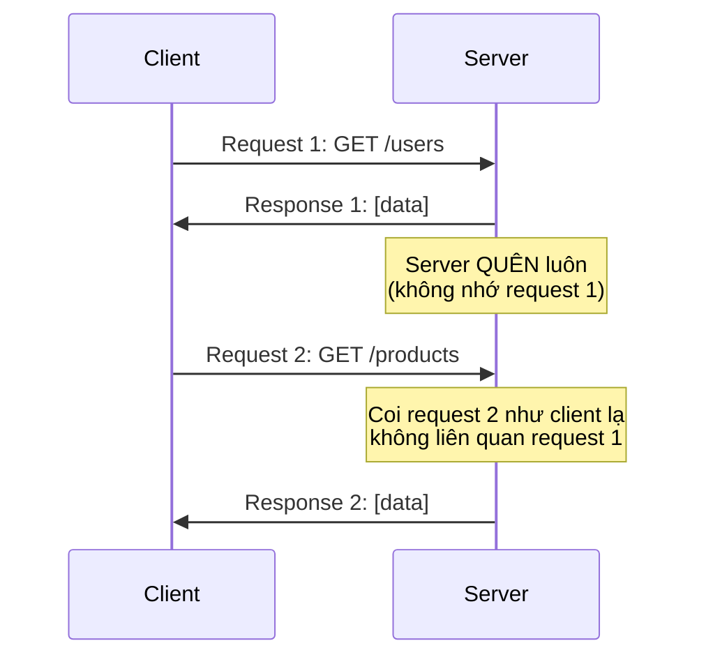
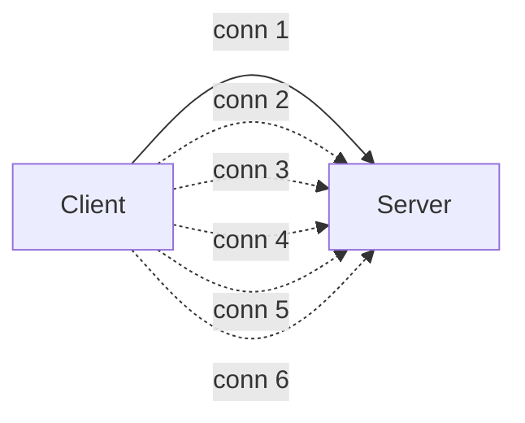

# 🎓 HTTP là gì? — Ngôn ngữ chung của Web

> **Tác giả:** Mr.Rom\
> **Phiên bản:** v1.1.0\
> **Tạo lúc:** 23/05/2026\
> **Cập nhật:** 25/05/2026\
> **Level:** Basic\
> **Tags:** [MUST-KNOW]\
> **Prerequisites:** Đã biết terminal cơ bản ([what-is-terminal](../../../../01_foundations/computing-environment/lessons/01_basic/00_what-is-terminal.md))

> 🎯 *Bài INTRO — hiểu **HTTP là gì**, **mô hình request/response**, **stateless** protocol, các version (1.0/1.1/2/3). KHÔNG dạy methods/status/headers chi tiết (sẽ học từ bài 01 trở đi). Sau bài này bạn đọc được Network tab của Chrome DevTools.*

## 🎯 Sau bài này bạn sẽ

- [ ] Hiểu HTTP là gì + lịch sử ngắn
- [ ] Vẽ được mô hình **client-server request/response**
- [ ] Đọc được anatomy 1 request (method + URL + headers + body)
- [ ] Đọc được anatomy 1 response (status + headers + body)
- [ ] Hiểu **stateless** — vì sao mỗi request "không nhớ" cái trước
- [ ] So sánh được HTTP/1.1 vs HTTP/2 vs HTTP/3
- [ ] Biết 3 tool xem HTTP: browser DevTools / curl / Postman

---

## Tình huống — Bạn debug "tại sao API không chạy"

Bạn đang build app web đầu tiên. Frontend React gọi API backend. **Lỗi**:

```javascript
fetch('https://api.example.com/users')
  .then(r => r.json())
  .then(users => console.log(users))
// Console: Failed to fetch ❌
```

Mở **Chrome DevTools → Network tab**. Bạn thấy:

```
Status: 401
Headers: Authorization (missing)
Response: {"error": "Unauthorized"}
```

Bạn ngơ:
- **401** là gì? Sao không phải "Lỗi 1"?
- **Headers** là gì? Sao backend yêu cầu `Authorization`?
- **GET** vs **POST** dùng khác nhau ra sao?
- Sao Frontend ở `localhost:3000` mà gọi API `api.example.com:443` lại có **CORS error**?

→ Tất cả là **HTTP** — giao thức cốt lõi mọi web app. Khi không hiểu HTTP, mỗi bug network feel như magic. Khi hiểu, bug self-explain trong 30 giây.

Bài này dạy bạn **mô hình HTTP** + **anatomy request/response** + **statelessness** + **versions**. Sau bài này bạn đọc Network tab như đọc sách.

---

## 1️⃣ Vậy HTTP là gì?

**HTTP** = **HyperText Transfer Protocol** — giao thức (protocol) cho client (browser/app) **giao tiếp với server** qua mạng. Ra đời 1991 cùng World Wide Web, design bởi Tim Berners-Lee tại CERN.

🪞 **Ẩn dụ**: HTTP giống **ngôn ngữ chung giữa khách + nhân viên nhà hàng**. Khách yêu cầu *"cho tôi 1 phở bò"* (request). Nhân viên đem ra phở + hoá đơn (response). Bất kể khách Việt/Nhật/Mỹ, nhân viên Hàn/Trung — đều dùng ngôn ngữ menu chung. HTTP cũng vậy — browser Chrome/Firefox/Safari nói chung với server Apache/Nginx/Node bằng HTTP.

### Bản chất

Đằng sau "browser load page" là 5 đặc điểm kỹ thuật cốt lõi của HTTP — nắm được sẽ giải thích được vì sao HTTP đơn giản mà mạnh (text-based dễ debug), nhưng cũng hạn chế (stateless cần workaround cho session):

- **Text-based** — request/response là **text plain** đọc được (đến HTTP/2 mới binary)
- **Request-Response** — luôn 1 client hỏi → 1 server trả
- **Stateless** — server không "nhớ" client (mỗi request độc lập)
- **Layer 7** (Application) trong OSI model — chạy trên TCP (Layer 4)
- **Port**: HTTP = 80, HTTPS = 443 (default)

### Vì sao HTTP "thống trị" Web?

Suốt 35 năm HTTP **chưa bao giờ bị soán ngôi**, mặc dù có nhiều protocol thay thế (WebSocket, gRPC, MQTT, GraphQL). Lý do: HTTP tiến hoá liên tục — mỗi version giải quyết 1 nhược điểm lớn của version trước. Timeline 5 cột mốc quan trọng nhất:

| Năm | Sự kiện |
|---|---|
| 1991 | HTTP/0.9 — chỉ 1 method `GET`, trả HTML thuần |
| 1996 | HTTP/1.0 — thêm headers, methods, status codes |
| 1997 | HTTP/1.1 — persistent connection, chunked encoding ⭐ |
| 2015 | HTTP/2 — multiplexing, binary, header compression |
| 2022 | HTTP/3 — QUIC (UDP-based), faster handshake |

→ HTTP/1.1 vẫn dominant (90%+ web). HTTP/2 phổ biến cho CDN. HTTP/3 đang lên (~25% top sites 2026).

### Use cases — không chỉ "web browser"

Người mới hay nghĩ "HTTP = browser load trang web". Thực tế HTTP là **giao thức nền tảng** cho gần như mọi giao tiếp internet hiện đại — từ app mobile, microservice, IoT đến AI API. 6 use case dưới đây minh hoạ độ phổ biến:

| Use case | Ai dùng HTTP |
|---|---|
| Browser load page | Chrome/Firefox → web server |
| Mobile app gọi API | iOS/Android → REST API |
| Microservice giao tiếp | Service A → Service B |
| Webhook (Slack/GitHub notify) | GitHub → Slack URL |
| IoT device send data | Sensor → cloud endpoint |
| AI inference | Frontend → OpenAI API |

→ **HTTP không chỉ là "web"** — là **giao thức chung** cho mọi giao tiếp client-server hiện đại.

---

## 2️⃣ Mô hình Request-Response

HTTP **luôn là 1 cặp**: client request, server response.



### Luôn theo cặp

Mỗi giao tiếp HTTP gồm **2 vế** đối xứng — client gửi request, server trả response. Bảng dưới so sánh 3 trục chính: tên gọi, dòng đầu, có body hay không:

| | Client → Server | Server → Client |
|---|---|---|
| Tên | **Request** | **Response** |
| Bắt đầu bằng | **Method** + **URL** (`GET /users`) | **Status code** (`200 OK`) |
| Có body không? | Tuỳ (GET không, POST có) | Tuỳ (200 có, 204 không) |

🪞 **Ẩn dụ lại**: client = **người gọi điện thoại** (chủ động), server = **người trả lời** (bị động chờ). Server **không gọi trước** cho client (1 request luôn từ client phát ra). Đây là lý do **WebSocket** ra đời sau — cho phép server push xuống client.

### Tại sao "luôn theo cặp"?

Mỗi request **PHẢI** có response (trừ khi network fail). Nếu server không trả → client treo → timeout. Mỗi request là 1 transaction "hỏi-đáp" độc lập.

---

## 3️⃣ Anatomy 1 Request

Mọi HTTP request — dù từ `curl`, browser hay mobile app — đều có **cấu trúc 4 phần** giống nhau. Mở DevTools → tab Network → click 1 request → view raw, bạn sẽ thấy đúng format dưới đây. Đây là "ngôn ngữ" mà mọi client phải nói:

```
GET /api/users?role=admin HTTP/1.1                 ← Request line (method + path + version)
Host: api.example.com                              ← Headers
Authorization: Bearer abc123xyz                    │
User-Agent: Mozilla/5.0 ...                        │
Accept: application/json                           │
Content-Type: application/json                     │
                                                   ← Blank line (separator)
{"key": "value"}                                   ← Body (optional, không có cho GET)
```

### 4 phần

| Phần | Bắt buộc | Ví dụ | Mục đích |
|---|---|---|---|
| **Request line** | ✅ | `GET /users HTTP/1.1` | Method + Path + Version |
| **Headers** | ✅ ít nhất `Host:` | `Authorization: Bearer ...` | Metadata (auth, content type, cache, ...) |
| **Blank line** | ✅ | (empty line) | Phân tách headers/body |
| **Body** | Tuỳ method | `{"name": "Nguyen Van A"}` | Data gửi server (POST/PUT/PATCH) |

### Request line phân rã

```
GET    /api/users?role=admin    HTTP/1.1
│      │                        │
│      │                        └── Version HTTP
│      └── Path + query string
└── Method (GET / POST / PUT / DELETE / PATCH / ...)
```

| Method | Có body? | Idempotent? | Mục đích |
|---|---|---|---|
| `GET` | ❌ | ✅ | Đọc resource |
| `POST` | ✅ | ❌ | Tạo mới |
| `PUT` | ✅ | ✅ | Update toàn bộ |
| `PATCH` | ✅ | ❌ | Update 1 phần |
| `DELETE` | Tuỳ | ✅ | Xoá |

> 💡 Chi tiết methods → [01_http-methods.md](./01_http-methods.md)

### Common request headers

| Header | Ví dụ | Mục đích |
|---|---|---|
| `Host` | `api.example.com` | Tên domain (bắt buộc HTTP/1.1) |
| `Authorization` | `Bearer abc123xyz` | Auth credentials |
| `Content-Type` | `application/json` | Body format |
| `Accept` | `application/json` | Format response mong muốn |
| `User-Agent` | `Mozilla/5.0...` | Client identify |
| `Cookie` | `session=xyz` | Session cookie |

> 💡 Chi tiết headers → [03_http-headers.md](./03_http-headers.md)

---

## 4️⃣ Anatomy 1 Response

```
HTTP/1.1 200 OK                                    ← Status line (version + code + reason)
Content-Type: application/json                     ← Headers
Content-Length: 142                                │
Date: Thu, 23 May 2026 10:30:00 GMT                │
Server: nginx/1.24                                 │
                                                   ← Blank line
[                                                  ← Body
  {"id": 1, "name": "Nguyen Van A"},                     │
  {"id": 2, "name": "Le Van B"}                         │
]                                                  │
```

### 4 phần

| Phần | Bắt buộc | Ví dụ |
|---|---|---|
| **Status line** | ✅ | `HTTP/1.1 200 OK` |
| **Headers** | ✅ | `Content-Type: application/json` |
| **Blank line** | ✅ | (empty) |
| **Body** | Tuỳ status | JSON / HTML / binary / empty |

### Status code — 5 nhóm chính

| Range | Loại | Ví dụ |
|---|---|---|
| **1xx** | Informational | `100 Continue` |
| **2xx** | Success | `200 OK`, `201 Created`, `204 No Content` |
| **3xx** | Redirect | `301 Moved`, `302 Found`, `304 Not Modified` |
| **4xx** | Client error | `400 Bad Request`, `401 Unauthorized`, `404 Not Found`, `429 Too Many Requests` |
| **5xx** | Server error | `500 Internal Server Error`, `502 Bad Gateway`, `503 Service Unavailable` |

🪞 **Cách nhớ**:
- **2xx** = "OK rồi" ✅
- **3xx** = "Đi chỗ khác" 🔀
- **4xx** = "Lỗi của bạn (client)" ⚠️
- **5xx** = "Lỗi của tôi (server)" 🔥

> 💡 Chi tiết → [02_http-status-codes.md](./02_http-status-codes.md)

### Trả lời tình huống ở đầu bài

```
Status: 401      ← 4xx = lỗi CLIENT
Headers: WWW-Authenticate: Bearer
Response: {"error": "Unauthorized"}
```

→ **Bạn gửi request thiếu `Authorization` header**. Backend yêu cầu auth → trả 401. Fix:

```javascript
fetch('https://api.example.com/users', {
  headers: {
    'Authorization': 'Bearer ' + token,
  }
})
```

→ Lý do "magic" lúc đầu giờ rõ ràng. Hiểu HTTP = debug trong 30 giây.

---

## 5️⃣ Stateless — Mỗi request "không nhớ" cái trước

**Stateless** = server **KHÔNG lưu trạng thái** giữa các request. Mỗi request là 1 transaction độc lập.



### Vấn đề + Giải pháp

**Vấn đề**: nếu server quên, làm sao biết "Bạn đã đăng nhập"?

**3 giải pháp** "fake state" trên stateless protocol:

| Mechanism | Cách | Use case |
|---|---|---|
| **Cookie** | Server set cookie → browser tự đính kèm mỗi request | Session web traditional |
| **JWT Token** | Client lưu token → đính `Authorization` header mỗi request | API modern (REST/GraphQL) |
| **Session ID** | Server lưu session map ID → client gửi ID qua cookie/header | Web app có DB session |

→ **Server vẫn stateless về HTTP** — nhưng app layer "tự tạo state" qua identifier client gửi mỗi request.

🪞 **Ẩn dụ**: nhân viên nhà hàng không nhớ bạn từ hôm qua. Để "nhớ", bạn cần thẻ thành viên (cookie/token) — show mỗi lần đến → quản lý lookup database → biết bạn là ai + đã ăn gì.

### Vì sao stateless?

- **Scale dễ**: server không lưu memory → request đi server nào cũng OK → load balancer round-robin được
- **Reliable**: server crash → restart không mất "session" (nếu state ở DB/cache)
- **Simple**: protocol đơn giản, độc lập

→ Đây là **lý do HTTP scale tới hàng tỷ user** (Google, Facebook, ...). State stateful protocol (vd FTP) khó scale hơn nhiều.

---

## 6️⃣ HTTP Versions — 1.1 vs 2 vs 3

| Version | Năm | Đặc trưng chính | Status 2026 |
|---|---|---|---|
| **HTTP/0.9** | 1991 | Chỉ `GET`, trả HTML | Deprecated |
| **HTTP/1.0** | 1996 | Headers, status, methods | Deprecated |
| **HTTP/1.1** ⭐ | 1997 | Persistent connection, chunked encoding | **Dominant** (~70% traffic) |
| **HTTP/2** | 2015 | Multiplexing, binary, header compression | Phổ biến (~70% top sites support) |
| **HTTP/3** | 2022 | QUIC (UDP), faster handshake | Đang lên (~25% top sites) |

### HTTP/1.1 — Cơ bản

**Vấn đề chính**: **head-of-line blocking**. 1 request chậm → mọi request sau bị chờ trên cùng connection. Workaround: browser mở ~6 connection song song mỗi domain.



### HTTP/2 — Multiplexing

**Cải tiến**: nhiều stream trong 1 connection. Request không chờ nhau.

- **Multiplexing**: gửi/nhận song song trong 1 connection
- **Binary protocol**: nhanh hơn text parse
- **Header compression**: HPACK — giảm overhead
- **Server push**: server đẩy resource client chưa hỏi (đã bị deprecated 2022 vì ít dùng)

→ Page load **~50% nhanh hơn HTTP/1.1** (tuỳ workload).

### HTTP/3 — QUIC

**Vấn đề HTTP/2**: vẫn dùng TCP → vẫn head-of-line blocking ở layer transport.

**Giải pháp**: HTTP/3 dùng **QUIC** (Google) — UDP-based, multiplexing thực sự ở transport layer.

- **Handshake nhanh hơn**: 0-RTT hoặc 1-RTT (HTTP/2 trên TLS cần 2-3 RTT)
- **Migration connection**: WiFi → 4G không mất connection
- **Built-in encryption** (TLS 1.3 mandatory)

→ Mobile network kém: HTTP/3 cải thiện ~30% latency.

### Bạn dùng version nào?

→ **Tự động** — browser/server tự negotiate. Bạn không chọn manual.

Check version trong Chrome DevTools:
- Network tab → click 1 request → **Headers** → trên cùng có `:status`, `:method`, `:path` (= HTTP/2+) hoặc `HTTP/1.1`

---

## 7️⃣ 3 tool xem + test HTTP

### 7.1 Browser DevTools (default, miễn phí)

Chrome / Firefox / Safari có **Network tab** built-in:

```
Cmd/Ctrl + Shift + I → Network tab
```

Hiển thị:
- Mọi HTTP request browser gửi (load page, AJAX, fetch)
- Status + size + time
- Click 1 request → xem Headers + Payload + Response + Timing

→ **Use case**: debug app web đang chạy.

### 7.2 `curl` — CLI HTTP client

```bash
# GET request đơn giản
curl https://api.github.com/users/octocat

# GET với headers
curl -H "Authorization: Bearer xyz" https://api.example.com/users

# POST với JSON body
curl -X POST https://api.example.com/users \
  -H "Content-Type: application/json" \
  -d '{"name": "Nguyen Van A", "email": "nguyenvana@example.com"}'

# Hiển thị verbose (headers full)
curl -v https://api.example.com

# Chỉ hiển thị status code
curl -o /dev/null -s -w "%{http_code}\n" https://api.example.com
```

→ **Use case**: script automation, CI/CD health check, debug nhanh trong terminal.

### 7.3 Postman / Insomnia / Bruno — GUI

GUI để build + save + share request collection:

| Tool | Free? | Đặc trưng |
|---|---|---|
| **Postman** | Free + paid | Phổ biến nhất, có cloud sync |
| **Insomnia** | Free + paid | Nhẹ hơn Postman, OSS root |
| **Bruno** | ✅ Free OSS | Local-first, file-based collection (git-friendly) |

→ **Use case**: team API testing, collection share, environment switching (dev/staging/prod).

> 💡 Chi tiết tool guide → `02_tools/api-clients/` (chưa có).

---

## 💡 Cạm bẫy thường gặp & Best practice

### ❌ Cạm bẫy: "API không chạy" mà không mở DevTools

```javascript
fetch('/api/users').then(r => r.json())
// "Sao không hoạt động?" — KHÔNG mở Network tab
```

**Cách tránh**:
- **MỌI khi** debug network: mở DevTools → Network tab trước
- Xem status code → biết lỗi client (4xx) hay server (5xx)
- Xem response body → biết error message backend trả

### ❌ Cạm bẫy: Nhầm `301` vs `302`

```
301 Moved Permanently  → browser CACHE redirect, lần sau không hỏi server cũ
302 Found              → temporary, mỗi lần vẫn hỏi server cũ
```

**Hậu quả**: dùng 301 nhầm → browser cache 1 năm → user truy cập domain cũ vẫn redirect sai sau khi đã unfix.

**Cách tránh**: default dùng **302** trừ khi chắc chắn redirect vĩnh viễn.

### ❌ Cạm bẫy: GET có body

```bash
curl -X GET https://api.example.com/users -d '{"filter": "active"}'
```

**Tại sao sai**: HTTP spec cho phép GET có body nhưng **nhiều proxy/CDN ignore body của GET**. Backend có thể không nhận. Dùng POST hoặc query string thay.

```bash
# ✓ Đúng
curl https://api.example.com/users?filter=active

# ✓ Hoặc POST nếu data phức tạp
curl -X POST https://api.example.com/users/search -d '{"filter": "..."}'
```

### ❌ Cạm bẫy: Bỏ qua HTTPS

```javascript
fetch('http://api.example.com/login', {body: password})    // ❌ Plain text
```

**Hậu quả**: ai trên cùng WiFi capture được password.

**Cách tránh**: **MỌI** API production dùng HTTPS. Browser modern block HTTP cho cookie/credentials.

### ❌ Cạm bẫy: CORS error tưởng là backend bug

```
Access to fetch at 'https://api.example.com' from origin 'http://localhost:3000'
has been blocked by CORS policy.
```

**Lý do**: trình duyệt block cross-origin request mặc định. KHÔNG phải backend "bug" — backend cần config `Access-Control-Allow-Origin` header.

**Cách tránh**: đọc CORS chi tiết ở [03_http-headers.md](./03_http-headers.md) §5 CORS.

---

## 🧠 Tự kiểm tra (Self-check)

**Q1.** HTTP có phải chỉ dùng cho browser load web page?

<details>
<summary>💡 Đáp án</summary>

**Không**. HTTP là **giao thức chung cho client-server giao tiếp**:

- Browser load page ✓
- Mobile app gọi REST API
- Microservice ↔ Microservice
- Webhook (GitHub → Slack)
- IoT sensor → cloud
- AI inference (Frontend → OpenAI API)

→ HTTP là "ngôn ngữ chung" của Internet hiện đại, không chỉ Web. Đây là lý do mọi dev (FE/BE/Mobile/DevOps/AI) đều phải biết HTTP.

</details>

**Q2.** Stateless protocol nghĩa là sao? Vậy làm sao server biết "Bạn đã đăng nhập"?

<details>
<summary>💡 Đáp án</summary>

**Stateless** = server KHÔNG nhớ trạng thái giữa requests. Mỗi request độc lập.

**Để biết "Bạn đã login"**, app dùng 3 cách "fake state":

1. **Cookie**: server set cookie sau login → browser tự đính kèm mỗi request
2. **JWT Token**: client lưu token → đính `Authorization: Bearer <token>` header mỗi request
3. **Session ID**: server lưu session map ID → client gửi ID qua cookie/header

→ Server vẫn stateless về HTTP, nhưng app layer "tự tạo state" qua identifier client gửi mỗi request. Đó là lý do **JWT/session là requirement của mọi API có authentication**.

</details>

**Q3.** Status code `4xx` và `5xx` khác nhau ra sao?

<details>
<summary>💡 Đáp án</summary>

- **4xx** = **lỗi của CLIENT** — request sai
   - `400 Bad Request` — body format sai
   - `401 Unauthorized` — thiếu auth
   - `403 Forbidden` — có auth nhưng không quyền
   - `404 Not Found` — resource không tồn tại
   - `429 Too Many Requests` — rate limit

- **5xx** = **lỗi của SERVER** — backend bị
   - `500 Internal Server Error` — exception trong code
   - `502 Bad Gateway` — proxy/load balancer không reach backend
   - `503 Service Unavailable` — backend tạm down/quá tải

**Cách debug**:
- 4xx → check request mình gửi (headers, body, URL)
- 5xx → check log server (không phải lỗi mình)

</details>

**Q4.** Vì sao HTTP/2 nhanh hơn HTTP/1.1?

<details>
<summary>💡 Đáp án</summary>

**HTTP/1.1 vấn đề**: **head-of-line blocking** — 1 request chậm → mọi request sau bị chờ trên cùng connection. Workaround: 6 connection song song mỗi domain → tốn TCP handshake.

**HTTP/2 fix**:
1. **Multiplexing** — nhiều stream trong 1 connection, không chờ nhau
2. **Binary** — parse nhanh hơn text
3. **Header compression (HPACK)** — giảm overhead repeat header
4. **Server push** (deprecated 2022) — server preload resource

→ Page load **~50% nhanh hơn**, đặc biệt page có nhiều resource (CSS/JS/image).

**HTTP/3** đi xa hơn: dùng QUIC (UDP) → fix head-of-line blocking ở transport layer + handshake nhanh hơn TCP.

</details>

---

## ⚡ Tra cứu nhanh (Cheatsheet)

### HTTP request structure

```
<METHOD> <PATH> HTTP/<VERSION>
<Header1>: <value1>
<Header2>: <value2>

<body>
```

### HTTP response structure

```
HTTP/<VERSION> <STATUS_CODE> <REASON>
<Header1>: <value1>
<Header2>: <value2>

<body>
```

### Common status codes

| Code | Meaning | When |
|---|---|---|
| 200 | OK | Success |
| 201 | Created | POST created resource |
| 204 | No Content | Success, no body |
| 301 | Moved Permanently | Permanent redirect |
| 302 | Found | Temporary redirect |
| 304 | Not Modified | Cache valid |
| 400 | Bad Request | Body/params sai |
| 401 | Unauthorized | Thiếu auth |
| 403 | Forbidden | Có auth nhưng không quyền |
| 404 | Not Found | Resource không tồn tại |
| 429 | Too Many Requests | Rate limit |
| 500 | Internal Server Error | Exception |
| 502 | Bad Gateway | Proxy không reach backend |
| 503 | Service Unavailable | Backend quá tải |

### `curl` essentials

```bash
curl <URL>                          # GET
curl -X POST <URL>                  # POST
curl -H "Key: Value" <URL>          # Custom header
curl -d '{"k":"v"}' <URL>           # Body (POST default)
curl -v <URL>                       # Verbose (show headers)
curl -I <URL>                       # HEAD (chỉ headers)
curl -L <URL>                       # Follow redirect (3xx)
curl -o file.html <URL>             # Save to file
curl -w "%{http_code}" -o /dev/null <URL>    # Chỉ status code
```

---

## 📚 Từ Điển Thuật Ngữ (Glossary)

| EN | VN | Giải thích |
|---|---|---|
| HTTP | (giữ EN) | HyperText Transfer Protocol |
| HTTPS | (giữ EN) | HTTP + TLS encryption |
| Protocol | Giao thức | Quy tắc giao tiếp giữa 2 hệ thống |
| Client | (giữ EN) | Bên khởi tạo request (browser, app, ...) |
| Server | (giữ EN) | Bên nhận + trả response |
| Request | Yêu cầu | Message client gửi server |
| Response | Phản hồi | Message server trả client |
| Method | (giữ EN) | GET/POST/PUT/DELETE/PATCH |
| Status code | Mã trạng thái | Số 3-digit thể hiện kết quả (200, 404, 500, ...) |
| Header | (giữ EN) | Metadata key-value (auth, content type, cache, ...) |
| Body | (giữ EN) | Data payload (JSON, HTML, binary) |
| Stateless | (giữ EN) | Server không nhớ giữa requests |
| Multiplexing | (giữ EN) | Nhiều stream song song trong 1 connection (HTTP/2) |
| QUIC | (giữ EN) | UDP-based transport của HTTP/3 |
| TLS | (giữ EN) | Transport Layer Security (encryption cho HTTPS) |
| CORS | (giữ EN) | Cross-Origin Resource Sharing (browser security) |
| `curl` | (giữ EN) | CLI tool gửi HTTP request |
| DevTools | (giữ EN) | Browser developer tools (Network tab) |

---

## 🔗 Liên kết & Tài nguyên

### Bài tiếp theo trong cluster

| Bài | Nội dung |
|---|---|
| [01_http-methods.md](./01_http-methods.md) | GET/POST/PUT/PATCH/DELETE + idempotent + safe |
| [02_http-status-codes.md](./02_http-status-codes.md) | 5 nhóm + 15 mã phổ biến + use case |
| [03_http-headers.md](./03_http-headers.md) | Content-Type / Auth / Cache / CORS chi tiết |
| [04_https-tls.md](./04_https-tls.md) | HTTPS, certificates, handshake |
| [05_rest-api-concepts.md](./05_rest-api-concepts.md) | REST principles, resource design |

### Trong kho

- 🧭 [Backend Developer Roadmap](../../../../00_roadmaps/career/backend-developer_career-roadmap.md) — link tới HTTP basics
- 🧭 [Frontend Developer Roadmap](../../../../00_roadmaps/career/frontend-developer_career-roadmap.md) — link
- 🛠️ `02_tools/api-clients/` (chưa có) — Postman/Insomnia/Bruno detail
- 🎓 [Terminal/Shell basics](../../../../01_foundations/computing-environment/lessons/01_basic/) — để dùng curl

### 🌐 Tài nguyên tham khảo khác

- [MDN HTTP](https://developer.mozilla.org/en-US/docs/Web/HTTP) — chính thức, đầy đủ nhất (tiếng Anh)
- [HTTP RFC 9110](https://www.rfc-editor.org/rfc/rfc9110) — spec chính thức HTTP/1.1
- [HTTP/2 explained](https://http2-explained.haxx.se/) — book free
- [HTTP/3 explained](https://http3-explained.haxx.se/) — book free
- [REST API Tutorial](https://restfulapi.net/) — REST design
- [HTTPie](https://httpie.io/) — alternative curl, human-friendly
- [Wireshark](https://www.wireshark.org/) — packet capture, xem HTTP traffic raw

---

## 📌 Nhật ký thay đổi (Changelog)

- **v1.0.0 (23/05/2026)** — Bản đầu tiên. Mở cluster `05_networking/http-https/`. Cover: tình huống Bạn debug API 401 → §1 HTTP là gì + 5 lịch sử versions + 6 use cases → §2 Request-response mermaid + ẩn dụ "gọi điện thoại" → §3 Anatomy request 4 phần + bảng 5 methods + 6 common headers → §4 Anatomy response + status code 5 groups + trả lời tình huống bạn → §5 Stateless + 3 fake-state mechanisms → §6 HTTP/1.1 vs 2 vs 3 + diagram → §7 3 tool (DevTools/curl/Postman). 5 pitfall + 4 self-check + cheatsheet curl + status table + glossary 18 thuật ngữ.
- **v1.1.0 (25/05/2026)** — Bổ sung lead-in trước các bảng/bullet ở §1 ("Bản chất", "Vì sao thống trị" bảng versions, "Use cases"), §2 ("Luôn theo cặp"), §3 (Anatomy request structure). Chuẩn hoá ví dụ placeholder `"name": "Nguyen Van A"`. Nội dung kỹ thuật giữ nguyên.
