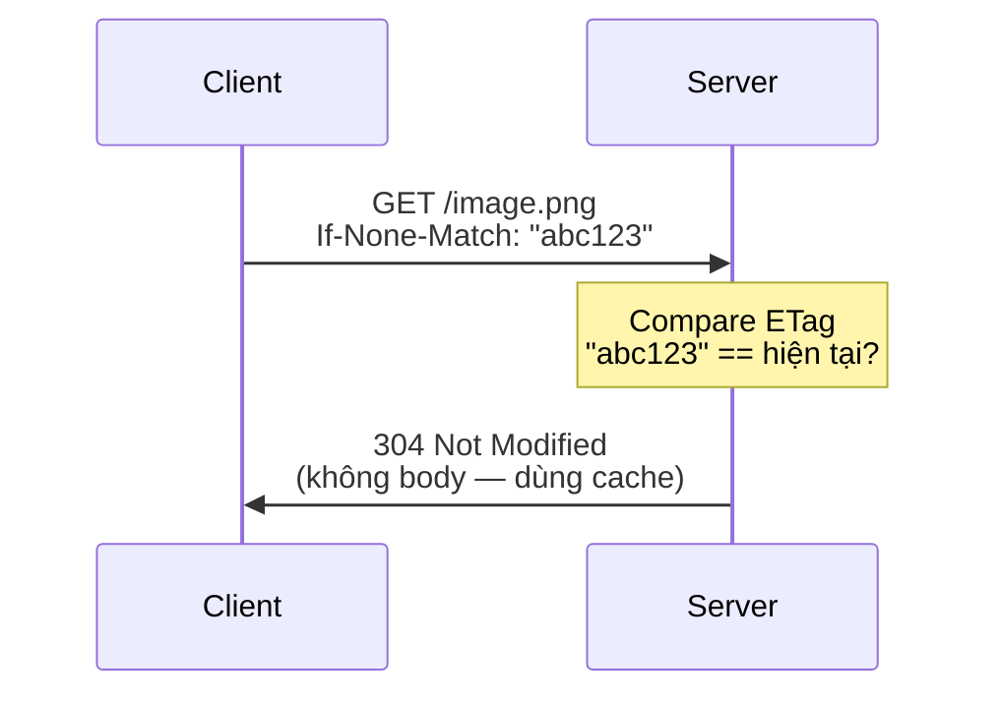
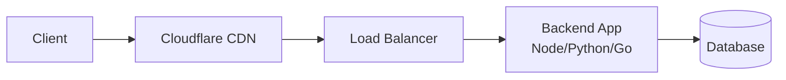

# 🎓 HTTP Status Codes — 5 nhóm + 20 mã quan trọng

> **Tác giả:** Mr.Rom\
> **Phiên bản:** v1.1.0\
> **Tạo lúc:** 23/05/2026\
> **Cập nhật:** 25/05/2026\
> **Level:** Basic\
> **Tags:** [MUST-KNOW]\
> **Yêu cầu trước:** [00_what-is-http.md](./00_what-is-http.md)

> 🎯 *Hiểu **5 nhóm status code** (1xx-5xx) + **20 mã phổ biến** nhất + **khi nào dùng cái nào**. Sau bài này bạn đọc HTTP error nhìn 1 phát biết lỗi ai, fix ở đâu — không phải google "401 nghĩa là gì".*

## 🎯 Sau bài này bạn sẽ

- [ ] Nhớ ý nghĩa 5 nhóm 1xx/2xx/3xx/4xx/5xx (chỉ qua **chữ đầu**)
- [ ] Phân biệt **401 vs 403** — câu hỏi interview kinh điển
- [ ] Phân biệt **301 vs 302** — chọn sai = browser cache vĩnh viễn
- [ ] Hiểu **502 vs 503 vs 504** — debug production
- [ ] Biết status code phù hợp cho mỗi response API mình design

---

## Tình huống — Bạn debug 5 lỗi khác nhau trong 1 ngày

Bạn làm full-stack app. Trong 1 ngày dev:

| Time | Lỗi DevTools | bạn ngơ |
|---|---|---|
| 9h | `401 Unauthorized` khi gọi `/api/users` | "Sao lúc local OK?" |
| 10h | `403 Forbidden` khi xoá user | "401 với 403 khác gì?" |
| 11h | `404 Not Found` khi GET `/api/user/123` | "Đang có user 123 mà" |
| 14h | `502 Bad Gateway` from CDN | "Là lỗi backend hay tôi?" |
| 16h | `429 Too Many Requests` khi test | "Tôi mới gọi 10 lần thôi" |

Mỗi lỗi Bạn phải Google "X status code meaning" — mất 30 phút mỗi cái. Sau bài này, bạn nhìn status code 1 phát biết:
- **Lỗi ai** (client 4xx vs server 5xx)
- **Fix ở đâu** (request mình vs backend)
- **Action gì** (retry / fix request / wait / check server)

→ Bài này là **bảng tra cứu** + **giải thích sâu** 20 mã hay gặp nhất.

---

## 1️⃣ Status code là gì? — Cấu trúc 3 chữ số

Status code = **số 3 chữ số** server trả trong response line, kèm **reason phrase** (text giải thích).

```http
HTTP/1.1 404 Not Found
         │   │
         │   └── Reason phrase (human-readable, không bắt buộc match code)
         └── Status code (3 digits, machine-readable)
```

### 5 nhóm — Chữ đầu quyết định

HTTP có ~60 status code chính thức, nhưng **chỉ cần nhớ chữ đầu** (1-5) là biết loại nào. RFC 9110 chia 5 nhóm theo digit đầu — mỗi nhóm có vai trò riêng và **xác định trách nhiệm fix**:

| Nhóm | Range | Ý nghĩa | Ai có lỗi? |
|---|---|---|---|
| **1xx** | 100-199 | **Informational** — "Đang xử lý" | (không lỗi) |
| **2xx** | 200-299 | **Success** ✅ — "Thành công" | (không lỗi) |
| **3xx** | 300-399 | **Redirect** 🔀 — "Đi chỗ khác" | (không lỗi) |
| **4xx** | 400-499 | **Client error** ⚠️ — "Bạn sai" | **CLIENT** |
| **5xx** | 500-599 | **Server error** 🔥 — "Server sai" | **SERVER** |

🪞 **Cách nhớ siêu nhanh**:
- **2xx** = "OK rồi" ✅
- **3xx** = "Đi chỗ khác" 🔀
- **4xx** = **F**our = **F**ault of client ("Bạn lỗi")
- **5xx** = **F**ive = **F**ault of server ("Tôi lỗi")

→ Nhìn chữ đầu (4 hay 5) → biết NGAY lỗi ai → biết fix ở đâu.

---

## 2️⃣ 2xx Success — "Thành công"

Nhóm 2xx báo "**request OK**", nhưng có 5 code cụ thể với *ý nghĩa khác nhau*. Đa số dev quen dùng `200 OK` cho mọi case — đó là anti-pattern. Mỗi code dưới đây signal cho client biết *chính xác chuyện gì đã xảy ra*:

| Code | Reason | Khi nào dùng |
|---|---|---|
| **200** | OK | GET success, PATCH success, generic success có body |
| **201** | Created | POST tạo resource mới (kèm `Location` header) |
| **202** | Accepted | Request nhận, xử lý async (chưa xong) |
| **204** | No Content | DELETE / PUT success không có body |
| **206** | Partial Content | Range request (vd resume download) |

### 200 vs 201 vs 204 — Phân biệt

3 code này hay bị nhầm vì cùng nghĩa "thành công". Phân biệt bằng quy tắc đơn giản: **200 = trả body có data; 201 = vừa tạo mới (có Location); 204 = xong nhưng không có gì để trả**. 4 ví dụ tiêu biểu khi gắn từng method với status code phù hợp:

```
GET /users          → 200 OK (kèm list users body)
POST /users         → 201 Created (kèm user mới + Location: /users/124)
DELETE /users/123   → 204 No Content (không body, xoá xong)
PATCH /users/123    → 200 OK (kèm user updated body)
```

→ **Đừng dùng 200 cho mọi success**. Dùng đúng:
- **201** nếu vừa tạo resource → giúp client biết "đã có thêm record"
- **204** nếu success không cần body → tiết kiệm bandwidth

### 202 Accepted — Async pattern

Code đặc biệt cho job xử lý lâu (export Excel 1 triệu rows, generate PDF, train ML model). Server không thể trả kết quả trong 30s timeout HTTP → trả 202 "Đã nhận, đang chạy" + URL để client poll status. Pattern phổ biến cho mọi API có background job:

```http
POST /api/reports/generate
→ 202 Accepted
Location: /api/jobs/abc123
```

Client phải poll `/api/jobs/abc123` để xem report xong chưa. Pattern cho:
- Generate file lớn (export Excel/PDF)
- Train ML model
- Send batch email

---

## 3️⃣ 3xx Redirect — "Đi chỗ khác"

Server bảo "**resource đã chuyển sang URL khác — đi theo đó**". 6 code dưới đây khác nhau ở 2 trục: *vĩnh viễn vs tạm thời* (ảnh hưởng cache + SEO) và *có giữ method không* (POST có bị đổi thành GET không). Đây là chi tiết quyết định bug rất khó debug nếu nhầm:

| Code | Reason | Đặc trưng |
|---|---|---|
| **301** | Moved Permanently | **Vĩnh viễn** — browser **cache** redirect, lần sau không hỏi URL cũ |
| **302** | Found (tạm thời) | **Tạm thời** — mỗi lần vẫn hỏi URL cũ |
| **303** | See Other | Sau POST → redirect GET (PRG pattern) |
| **304** | Not Modified | Cache valid — client dùng cache, không tải lại |
| **307** | Temporary Redirect | Như 302 nhưng giữ nguyên method (302 có thể đổi POST→GET) |
| **308** | Permanent Redirect | Như 301 nhưng giữ nguyên method |

### 301 vs 302 — Khác biệt CỰC quan trọng

| | **301 Moved Permanently** | **302 Found** |
|---|---|---|
| Browser cache redirect? | ✅ **Có** (cache vĩnh viễn) | ❌ Không (mỗi lần hỏi lại) |
| SEO impact | Page rank chuyển sang URL mới | Không chuyển |
| Khi dùng | Đổi domain vĩnh viễn (vd `example.com` → `example.io`) | A/B test, maintenance redirect |

> ⚠️ **Pitfall kinh điển**: dùng 301 nhầm → browser cache **1 năm** → user vào URL cũ vẫn redirect sai sau khi đã sửa. **Default dùng 302** trừ khi chắc chắn vĩnh viễn.

### 304 Not Modified — Cache mechanism



Server không gửi body → tiết kiệm bandwidth. Client load image từ cache local.

→ Đây là **mechanism cache HTTP cơ bản**. Mỗi request resource (CSS/JS/image), browser auto gửi `If-None-Match` (ETag) → server check chưa đổi → trả 304.

---

## 4️⃣ 4xx Client error — "Bạn lỗi"

| Code | Reason | Khi nào |
|---|---|---|
| **400** | Bad Request | Body/params format sai (vd JSON malformed) |
| **401** | Unauthorized | Chưa auth (thiếu token / token sai) |
| **403** | Forbidden | Có auth nhưng KHÔNG quyền |
| **404** | Not Found | Resource không tồn tại |
| **405** | Method Not Allowed | URL đúng nhưng method sai (vd POST `/users/123`) |
| **409** | Conflict | Conflict state (vd email đã tồn tại) |
| **422** | Unprocessable Entity | Body đúng format nhưng validation fail |
| **429** | Too Many Requests | Rate limit |

### 401 vs 403 — Câu hỏi interview kinh điển

| | **401 Unauthorized** | **403 Forbidden** |
|---|---|---|
| Ý nghĩa | "**Chưa biết** bạn là ai" | "**Biết** bạn là ai, **NHƯNG** không cho phép" |
| Có auth không? | Chưa có (hoặc token sai) | Có auth, đã verify identity |
| Fix client | Login / gửi token đúng | Liên hệ admin xin quyền (không tự fix được) |
| Ví dụ | API call thiếu `Authorization` header | User thường gọi `/admin/users` |

🪞 **Ẩn dụ**:
- **401** = bảo vệ chặn ở cửa: "Anh là ai? Show ID đi"
- **403** = bảo vệ đã thấy ID nhưng: "Anh không có pass vào tầng VIP"

→ **Bug naming chính**: spec đặt tên hơi nhầm. **401 = chưa Authenticated**, **403 = chưa Authorized**. Spec quy ước thế, không sửa được.

### 404 — Phân biệt resource không tồn tại vs route sai

```
GET /users/9999           → 404 (user 9999 không có trong DB)
GET /usersss              → 404 (route typo, không endpoint)
```

Cùng 404 nhưng:
- Case 1: route OK, data không có → backend trả 404 explicit
- Case 2: route không tồn tại → framework auto trả 404

→ Cả 2 đều 404. Distinguish bằng response body hoặc log.

### 405 Method Not Allowed

```
GET /users/123     → 200 OK
POST /users/123    → 405 Method Not Allowed (endpoint chỉ accept GET/PUT/PATCH/DELETE)
```

Response phải kèm `Allow` header liệt kê methods OK:

```http
HTTP/1.1 405 Method Not Allowed
Allow: GET, PUT, PATCH, DELETE
```

### 422 vs 400 — Tinh tế

```bash
# 400: format sai
curl -X POST /users -d 'name=Nguyen+Van+A&email=...'    # backend expect JSON, đây là form
→ 400 Bad Request

# 422: format đúng nhưng validation sai
curl -X POST /users -d '{"name":"L","email":"not-an-email"}'    # JSON OK, nhưng email invalid
→ 422 Unprocessable Entity
```

→ Modern REST API dùng **422** cho validation error. Cũ chỉ có **400** cho mọi case → kém precise.

### 429 Too Many Requests — Rate limit

```http
HTTP/1.1 429 Too Many Requests
Retry-After: 60                       ← Wait 60s rồi retry
X-RateLimit-Limit: 100
X-RateLimit-Remaining: 0
X-RateLimit-Reset: 1684839600
```

→ Client retry sau `Retry-After` seconds. Hoặc xem `X-RateLimit-Reset` (Unix timestamp).

---

## 5️⃣ 5xx Server error — "Server lỗi"

| Code | Reason | Khi nào |
|---|---|---|
| **500** | Internal Server Error | Exception trong code (uncaught) |
| **501** | Not Implemented | Endpoint chưa làm xong |
| **502** | Bad Gateway | Proxy/LB không reach được backend |
| **503** | Service Unavailable | Backend tạm down (maintenance / quá tải) |
| **504** | Gateway Timeout | Proxy chờ backend response timeout |

### 500 — Generic exception

```python
# Backend code:
def get_user(id):
    user = db.query(User).filter(id=id).first()
    return user.email.upper()    # ❌ user = None → AttributeError
```

→ Backend crash → web server trả **500**. **Đây là bug**, không phải feature. Action: check log server, fix code.

### 502 vs 503 vs 504 — Production debug

Đây là **3 lỗi gateway/proxy** phổ biến nhất khi production app dùng reverse proxy (Nginx) hoặc CDN (Cloudflare).



| Status | Tình huống | Bạn fix ở đâu |
|---|---|---|
| **502 Bad Gateway** | LB không **reach** được backend (backend chết, port sai) | Restart backend, check port + firewall |
| **503 Service Unavailable** | Backend **đang chạy** nhưng từ chối (quá tải, maintenance mode) | Scale up, hoặc đợi |
| **504 Gateway Timeout** | LB đợi backend response **quá lâu** (slow DB query, deadlock) | Optimize DB, tăng timeout LB |

🪞 **Ẩn dụ**:
- **502** = ngân hàng trung ương không gọi được chi nhánh (chi nhánh sập)
- **503** = chi nhánh đông quá, nhân viên báo "tạm dừng nhận khách"
- **504** = chi nhánh nhận khách nhưng nhân viên xử lý lâu quá, trung ương timeout

### 500 vs 5xx khác — Action mapping

| Status | Hành động |
|---|---|
| 500 | Báo dev fix code (đọc log exception) |
| 501 | Đợi backend implement (chưa làm) |
| 502 | Restart backend / check port |
| 503 | Scale up backend / đợi maintenance xong |
| 504 | Optimize backend speed / tăng timeout proxy |

→ Mỗi mã có **action khác** — không thể "5xx generic". Đọc đúng → fix nhanh.

---

## 6️⃣ Bảng tra cứu nhanh — 20 mã quan trọng nhất

| Code | Reason | Group | Frequency |
|---|---|---|---|
| 200 | OK | ✅ 2xx | Rất phổ biến |
| 201 | Created | ✅ 2xx | Sau POST |
| 204 | No Content | ✅ 2xx | Sau DELETE |
| 301 | Moved Permanently | 🔀 3xx | Domain change |
| 302 | Found | 🔀 3xx | Temp redirect |
| 304 | Not Modified | 🔀 3xx | Cache mechanism |
| 307 | Temporary Redirect | 🔀 3xx | Như 302 giữ method |
| 308 | Permanent Redirect | 🔀 3xx | Như 301 giữ method |
| **400** | Bad Request | ⚠️ 4xx | Common |
| **401** | Unauthorized | ⚠️ 4xx | Common (missing auth) |
| **403** | Forbidden | ⚠️ 4xx | Common (no permission) |
| **404** | Not Found | ⚠️ 4xx | Common |
| 405 | Method Not Allowed | ⚠️ 4xx | API mismatch |
| 409 | Conflict | ⚠️ 4xx | Duplicate / state conflict |
| 422 | Unprocessable Entity | ⚠️ 4xx | Validation fail |
| **429** | Too Many Requests | ⚠️ 4xx | Rate limit |
| **500** | Internal Server Error | 🔥 5xx | Backend crash |
| **502** | Bad Gateway | 🔥 5xx | LB không reach backend |
| **503** | Service Unavailable | 🔥 5xx | Maintenance / overload |
| **504** | Gateway Timeout | 🔥 5xx | Backend slow |

→ **Bold** = MUST-KNOW. 11 cái này chiếm 90% case bạn gặp.

---

## 7️⃣ Best practice khi design API

### Status code phù hợp cho mỗi response

| Action API | Success | Error phổ biến |
|---|---|---|
| List | 200 | 401, 403 |
| Get one | 200 / 404 | 401, 403 |
| Create | 201 + Location | 400, 401, 409, 422 |
| Update full (PUT) | 200 / 204 | 400, 401, 404, 409, 422 |
| Update partial (PATCH) | 200 | 400, 401, 404, 422 |
| Delete | 204 / 200 | 401, 403, 404 |
| Auth fail | (always 401) | — |
| Rate limit | (always 429) | + Retry-After header |
| Validation fail | (always 422) | + body chi tiết field nào |

### Response body cho error

```json
{
  "error": "validation_failed",
  "message": "Email format invalid",
  "details": {
    "field": "email",
    "value": "not-an-email",
    "constraint": "must be valid email"
  },
  "request_id": "req_abc123"
}
```

→ **Đừng** chỉ trả `{"error": "Bad request"}`. Body phải:
- Code error machine-readable (`validation_failed`)
- Message human-readable
- Details để client biết fix gì
- `request_id` để debug log

### Anti-patterns

```
❌ 200 OK với body {"error": "..."} → status code SAI, client confuse
❌ 500 cho mọi error → mất thông tin (validation vs auth vs not found)
❌ 404 cho unauthorized (security obscurity) → user không biết phải login
❌ Custom code (799, 666) → standard tool không hiểu
```

---

## 💡 Cạm bẫy thường gặp & Best practice

### ❌ Cạm bẫy: Dùng 200 OK với error body

```http
HTTP/1.1 200 OK
{"error": "User not found"}
```

- **Hậu quả**: client code `if response.status === 200` → tưởng success → bug
- **Cách fix**: dùng đúng status (404) + body chi tiết

### ❌ Cạm bẫy: Cache 301 nhầm

Đổi domain `example.com → example.io` với 301:
- 6 tháng sau quyết định **quay lại** `example.com`
- User cũ browser cache 301 → vẫn redirect sang `.io` → 😱

**Cách tránh**: dùng **302** cho hầu hết redirect. Chỉ dùng 301 khi **chắc chắn** không quay lại + đã chạy stable 30+ ngày.

### ❌ Cạm bẫy: 404 cho mọi "không thấy"

```
GET /api/users/123    → 404 (user không tồn tại — OK)
GET /api/users/123    → 404 (token sai, user 123 thực ra có)    ❌ Sai
```

Backend trả 404 cho cả case user **không có quyền** xem → confuse. Nên:
- **401**: chưa login
- **403**: login nhưng không quyền
- **404**: thực sự không tồn tại

(Trừ security obscurity intentional — vd Stripe trả 404 cho resource bạn không own, không 403, để hide existence.)

### ❌ Cạm bẫy: 500 cho validation error

```python
def create_user(data):
    if not is_valid_email(data['email']):
        raise Exception('Invalid email')    # → 500 vì uncaught
```

- **Hậu quả**: client thấy 500, tưởng server bug, contact support, thực ra là input lỗi
- **Cách fix**: catch validation → trả **422** với details:

```python
def create_user(data):
    if not is_valid_email(data['email']):
        return jsonify({
            'error': 'validation_failed',
            'field': 'email'
        }), 422
```

### ❌ Cạm bẫy: Backend crash trả 200

Backend Python catch exception nhưng vẫn trả 200:

```python
try:
    user = db.get_user(id)
    return user.email
except Exception as e:
    return f"Error: {e}", 200    # ❌ 200 nhưng là error
```

- **Cách fix**: log exception + trả 500:

```python
try:
    ...
except Exception as e:
    log.error(e)
    return jsonify({'error': 'internal_error'}), 500
```

### ✅ Best practice: 503 + Retry-After cho maintenance

```http
HTTP/1.1 503 Service Unavailable
Retry-After: 300                          ← Đợi 5 phút retry

{"message": "Scheduled maintenance until 14:00"}
```

→ Client/CDN biết "đợi 5 phút rồi thử lại" thay vì retry liên tục. Nginx có `error_page 503` để tự handle.

---

## 🧠 Tự kiểm tra (Self-check)

**Q1.** 401 vs 403 khác nhau ra sao? Cho ví dụ.

<details>
<summary>💡 Đáp án</summary>

- **401 Unauthorized** = chưa biết bạn là ai. **Chưa authenticated**.
  - Ví dụ: API call thiếu `Authorization` header
  - Fix: login / gửi token đúng
- **403 Forbidden** = biết bạn là ai, nhưng KHÔNG cho phép. **Chưa authorized**.
  - Ví dụ: User thường (đã login) gọi endpoint admin-only
  - Fix: liên hệ admin xin quyền (không tự fix được)

**Nhớ**: 401 = no ID. 403 = có ID nhưng không pass.

Note: spec đặt tên hơi confusing — "401 Unauthorized" thực ra là "Unauthenticated". "Forbidden" mới là "Unauthorized" theo nghĩa hằng ngày.

</details>

**Q2.** Khi nào dùng 301 vs 302?

<details>
<summary>💡 Đáp án</summary>

- **301 Moved Permanently**: vĩnh viễn. Browser **cache redirect** → lần sau không hỏi URL cũ → tiết kiệm 1 round-trip. SEO: page rank chuyển sang URL mới.
- **302 Found**: tạm thời. Browser **không cache** → mỗi lần vẫn hỏi URL cũ.

**Pick 301 khi**:
- Đổi domain vĩnh viễn (`example.com` → `example.io`)
- URL structure rename (`/blog/old-slug` → `/blog/new-slug`)
- Đã chắc chắn không quay lại

**Pick 302 khi (default)**:
- Maintenance redirect
- A/B test
- Conditional redirect (login required → redirect login page)
- KHÔNG chắc 100% vĩnh viễn

**Pitfall**: 301 sai = browser cache 1 năm → user kẹt mãi. Default dùng 302, chỉ 301 khi chắc.

</details>

**Q3.** 502 vs 503 vs 504 — debug khác nhau ra sao?

<details>
<summary>💡 Đáp án</summary>

3 mã ở **proxy/LB layer**:

- **502 Bad Gateway** — LB **không reach** được backend. Backend chết hoặc port sai.
  - Debug: check backend đang chạy không (`ps`, `docker ps`, K8s pod status). Check port + firewall.
- **503 Service Unavailable** — Backend chạy nhưng **từ chối** (quá tải / maintenance mode).
  - Debug: check load (CPU/memory), connection pool, queue. Scale up.
- **504 Gateway Timeout** — LB chờ backend **quá lâu**.
  - Debug: optimize slow DB query, deadlock, hoặc tăng timeout proxy.

**Ẩn dụ**:
- 502: chi nhánh chết
- 503: chi nhánh đông, từ chối khách mới
- 504: chi nhánh xử lý lâu, trung ương timeout

→ Mỗi mã hint vào action cụ thể. Không "5xx generic".

</details>

**Q4.** Backend của bạn validation email fail. Trả status code nào? Tại sao không 500?

<details>
<summary>💡 Đáp án</summary>

**Trả 422 Unprocessable Entity**.

**Vì sao không 500**:
- **500 = lỗi SERVER** (uncaught exception, bug code). Validation fail KHÔNG phải bug code — là input client sai.
- Trả 500 → client tưởng "server bug", contact support, thực ra do email format.

**Vì sao không 400**:
- **400 = body format sai** (vd JSON malformed). Validation logic là cấp cao hơn.
- **422 = body đúng format nhưng validation fail** — precise hơn.

**Response chuẩn**:

```http
HTTP/1.1 422 Unprocessable Entity
Content-Type: application/json

{
  "error": "validation_failed",
  "field": "email",
  "message": "Invalid email format",
  "value": "not-an-email"
}
```

→ Client biết: input lỗi, field nào, value gì. Tự fix UI hiển thị error cho user.

</details>

---

## ⚡ Tra cứu nhanh (Cheatsheet)

| Code | Group | Action |
|---|---|---|
| **200** | OK | Default success |
| **201** | Created | POST success → kèm `Location` |
| **204** | No Content | DELETE success |
| **400** | Client | Format sai (JSON malformed) |
| **401** | Client | Chưa auth → login |
| **403** | Client | Không quyền → contact admin |
| **404** | Client | Resource không tồn tại |
| **422** | Client | Validation fail → fix field |
| **429** | Client | Rate limit → đợi `Retry-After` |
| **500** | Server | Backend crash → check log |
| **502/503/504** | Server | Gateway issues → check infra |

### Quick reference — Group → Action

- **2xx** → success, đọc body
- **3xx** → đi URL mới (header `Location`)
- **4xx** → fix request (client side)
- **5xx** → đợi / báo dev (server side)

---

## 📚 Từ Điển Thuật Ngữ (Glossary)

| EN | VN | Giải thích |
|---|---|---|
| Status code | Mã trạng thái | Số 3 chữ số trong response |
| Reason phrase | Cụm giải thích | Text sau status code (vd "OK", "Not Found") |
| Authenticated | Đã xác thực | Server biết bạn là ai (qua token/session) |
| Authorized | Có quyền | Authenticated + có quyền truy cập |
| ETag | (giữ EN) | Hash content, dùng cho cache 304 |
| Rate limit | Giới hạn tốc độ | Max N request / time window |
| Idempotency | (giữ EN) | Gọi N lần kết quả same |
| Gateway | (giữ EN) | Proxy/LB giữa client + backend |
| Reverse proxy | Proxy ngược | Server đứng trước backend (Nginx, HAProxy) |
| Maintenance mode | Chế độ bảo trì | Backend từ chối request tạm |

---

## 🔗 Liên kết & Tài nguyên

### Trong kho

| Hướng | Bài |
|---|---|
| ⬅️ Bài trước | [01_http-methods.md](./01_http-methods.md) — Methods |
| ➡️ Bài tiếp | [03_http-headers.md](./03_http-headers.md) — Headers |
| 📚 REST design | [05_rest-api-concepts.md](./05_rest-api-concepts.md) |

### 🌐 Tài nguyên tham khảo khác

- [MDN HTTP Status Codes](https://developer.mozilla.org/en-US/docs/Web/HTTP/Status) — chính thức, đầy đủ
- [HTTP Cats](https://http.cat/) — meme status code (mỗi mã có 1 ảnh mèo, hilarious + dễ nhớ)
- [HTTP Dogs](https://http.dog/) — alternative version
- [REST API Status Codes Cheat Sheet](https://restfulapi.net/http-status-codes/)
- [RFC 9110 §15 Status Codes](https://www.rfc-editor.org/rfc/rfc9110#section-15) — spec chính thức
- [httpbin.org](https://httpbin.org/) — test status codes (vd `httpbin.org/status/404` trả 404)

---

## 📌 Nhật ký thay đổi (Changelog)

- **v1.0.0 (23/05/2026)** — Bản đầu tiên. Cluster `http-https/` lesson 3/6. Cover: tình huống Bạn debug 5 lỗi → §1 cấu trúc + 5 nhóm + cách nhớ "4 = Fault client, 5 = Fault server" → §2 2xx (200/201/204/202 async) → §3 3xx (301 vs 302 cảnh báo cache, 304 cache mechanism với mermaid) → §4 4xx chi tiết 401 vs 403 (interview classic) + 422 vs 400 + 429 + 405 → §5 5xx production debug 502/503/504 với mermaid LB diagram → §6 bảng tra cứu 20 mã + 11 MUST-KNOW bold → §7 best practice API design. 5 pitfall + 4 self-check.
- **v1.1.0 (25/05/2026)** — Bổ sung lead-in trước các bảng ở §1 (5 nhóm), §2 (2xx, "200 vs 201 vs 204", "202 Accepted async"), §3 (3xx redirect). Nội dung kỹ thuật giữ nguyên.
