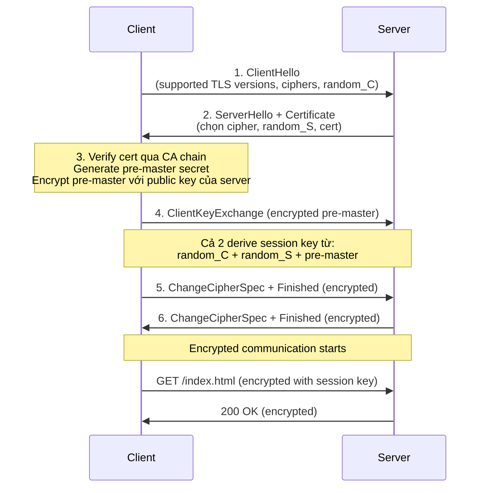
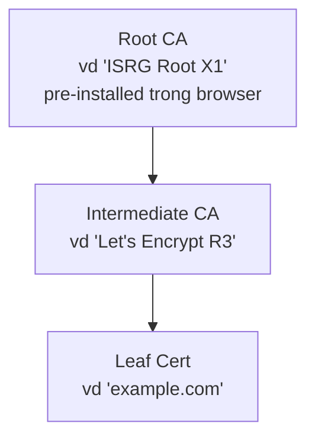
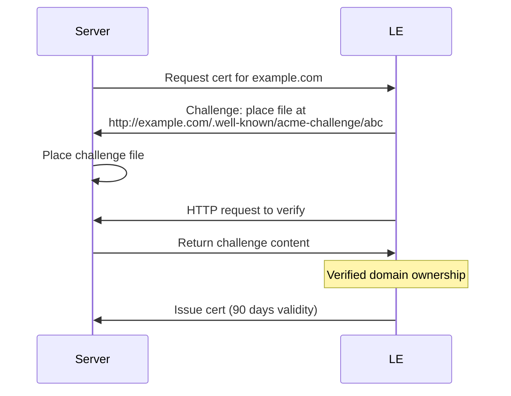

# 🎓 HTTPS + TLS — Cert, Handshake, Let's Encrypt

> **Tác giả:** Mr.Rom\
> **Phiên bản:** v1.2.1\
> **Tạo lúc:** 23/05/2026\
> **Cập nhật:** 10/06/2026\
> **Level:** Basic\
> **Tags:** [MUST-KNOW]\
> **Yêu cầu trước:** [00_what-is-http.md](./00_what-is-http.md)

> 🎯 *Bài CONCEPT — HTTPS = HTTP + TLS encryption. Hiểu **TLS handshake**, **Certificate Authority** (CA) chain, **Let's Encrypt** free cert + auto renewal, common cert errors. Sau bài này bạn debug được "NET::ERR_CERT_DATE_INVALID" trong 1 phút.*

## 🎯 Sau bài này bạn sẽ

- [ ] Hiểu HTTPS khác HTTP ra sao + vì sao **mọi site 2026 phải HTTPS**
- [ ] Vẽ được **TLS handshake** 4 bước (cao tầm khái niệm)
- [ ] Hiểu **Certificate** + **CA chain** + cách browser verify
- [ ] Cài Let's Encrypt + cert renewal tự động (Certbot, Caddy)
- [ ] Debug 5 lỗi cert thường gặp (`ERR_CERT_DATE_INVALID`, `ERR_CERT_AUTHORITY_INVALID`, ...)
- [ ] Phân biệt **TLS 1.2 vs 1.3** + vì sao 1.3 nhanh hơn

---

## Tình huống — Bạn deploy site, cert đỏ

Bạn deploy site đầu tiên lên VPS. Mở browser:

```
example.com → 🔓 Not Secure (HTTP)
```

Bạn Google → "phải dùng HTTPS". Cài cert tự sign:

```bash
openssl req -x509 -newkey rsa:4096 -nodes -keyout key.pem -out cert.pem -days 365
```

Server config xong. Mở browser:

```
https://example.com → ⚠️ Your connection is not private
NET::ERR_CERT_AUTHORITY_INVALID
```

Bạn ngơ. Cert có rồi, sao browser warn?

Đáp: **self-signed cert** không trust được. Browser chỉ trust cert từ **Certificate Authority** (CA) public. Phải dùng **Let's Encrypt** (free) hoặc paid CA.

→ Bài này giải thích HTTPS + TLS + Certificate đầy đủ. Sau bài này Bạn fix cert đỏ trong 5 phút.

---

## 1️⃣ HTTPS là gì?

**HTTPS** = **HTTP + TLS** (Transport Layer Security). Cùng HTTP protocol nhưng **encrypted** trong transit.

```
HTTP:  Client ────[plain text]──── Server  (sniffer đọc được)
HTTPS: Client ──[encrypted ciphertext]── Server (chỉ 2 đầu giải mã)
```

🪞 **Ẩn dụ**: HTTP = thư **postcard** (ai bưu tá cũng đọc được). HTTPS = thư **niêm phong** (chỉ người nhận có chìa khoá mới mở được).

### Port mặc định

HTTP và HTTPS dùng **2 port khác nhau** từ ngày đầu — đây là quy ước cố định 30+ năm trong RFC. Khi gõ URL không kèm port, browser tự pick đúng:

| Protocol | Port |
|---|---|
| HTTP | 80 |
| HTTPS | 443 |

### TLS là gì? — Cái khác giữa HTTP và HTTPS

**TLS** (Transport Layer Security) = giao thức encryption + authentication ở layer transport (giữa TCP và HTTP).

```
┌─────────────┐
│ HTTP        │ ← Application
├─────────────┤
│ TLS         │ ← MỚI: encryption layer
├─────────────┤
│ TCP         │ ← Transport
├─────────────┤
│ IP          │ ← Network
└─────────────┘
```

TLS làm 3 việc:
1. **Encryption** — data encrypt, sniffer không đọc được
2. **Authentication** — verify server đúng là `example.com` (không phải attacker giả)
3. **Integrity** — data không bị modify trên đường (vd MITM attack)

### Vì sao 2026 mọi site PHẢI HTTPS?

Trước 2018 HTTPS còn là "tuỳ chọn", giờ thì **bắt buộc** với mọi public domain — kể cả blog cá nhân không nhập dữ liệu nhạy cảm. 6 lý do dưới đây giải thích vì sao không HTTPS = website chết về mặt UX + SEO + tính năng:

| Lý do | Chi tiết |
|---|---|
| **Browser trừng phạt HTTP** | Chrome/Firefox hiện "Not Secure" cảnh báo. Form HTTP bị block. |
| **SEO** | Google rank HTTPS cao hơn HTTP. HTTP có thể bị deindex. |
| **Cookie modern** | `Secure` + `SameSite` flags require HTTPS. Không HTTPS → 0 cookie. |
| **API modern** | HTTP/2 + HTTP/3 yêu cầu TLS. |
| **HTTPS-only features** | Service Worker, Geolocation API, Push Notification, ... cần HTTPS. |
| **Free cert** | Let's Encrypt free → không lý do dùng HTTP. |

→ HTTP chỉ dùng cho `localhost` dev. Mọi public domain → HTTPS.

### TLS versions

TLS có 4 thế hệ qua 30 năm, mỗi version vá lỗ hổng + tăng tốc của version trước. Năm 2026 chỉ còn **2 version còn an toàn dùng được** (1.2 + 1.3) — còn lại browser đã chặn từ 2020:

| Version | Năm | Status 2026 |
|---|---|---|
| SSL 2.0/3.0 | 1995-1996 | ⛔ Deprecated, KHÔNG dùng |
| TLS 1.0/1.1 | 1999-2006 | ⛔ Browser block từ 2020 |
| **TLS 1.2** ⭐ | 2008 | Phổ biến nhất (~95% traffic, *tính đến 2026*) |
| **TLS 1.3** ⭐ | 2018 | Modern, nhanh hơn, ~60% top sites (*tính đến 2026*) |

→ Production phải minimum **TLS 1.2**. TLS 1.3 recommended (nhanh + an toàn hơn).

---

## 2️⃣ TLS Handshake — 4 bước (TLS 1.2)

**Handshake** = quy trình thiết lập kết nối encrypted **trước khi** gửi data thật. Client và server cần "thoả thuận" version TLS dùng, cipher nào, và **trao đổi key** để encrypt. Sequence diagram dưới mô tả đầy đủ 6 message TLS 1.2:



### Tóm tắt 4 bước

Để dễ nhớ, gom 6 message handshake thành **4 logical step**. Mỗi bước có vai trò rõ ràng — đây là nội dung sẽ hỏi trong interview networking/security:

| Bước | Việc |
|---|---|
| 1. **ClientHello** | Client gửi supported TLS versions + ciphers + random number |
| 2. **ServerHello + Cert** | Server chọn cipher, gửi certificate (chứa public key) + random number |
| 3. **Verify + Key Exchange** | Client verify cert (qua CA chain), tạo pre-master secret, encrypt + gửi server |
| 4. **Finished** | Cả 2 derive session key, switch sang encrypted communication |

Sau handshake, **session key** dùng để encrypt mọi HTTP data. Handshake nặng (~100-300ms tuỳ network) — chỉ làm 1 lần đầu connection. Session resumed nhanh hơn nhiều.

### TLS 1.3 — Nhanh hơn (1-RTT thay 2-RTT)

TLS 1.3 gộp Steps 1+2 vào 1 round-trip. Nhanh hơn ~30%. Mặc định 2026.

```
TLS 1.2 handshake: 2 round-trips
TLS 1.3 handshake: 1 round-trip (hoặc 0-RTT nếu resumed)
```

→ Mobile network kém: HTTPS 1.3 cải thiện latency đáng kể.

### Perfect Forward Secrecy (PFS) — Bí mật cả khi key sau bị lộ

Câu hỏi đáng giá: *"Nếu private key server bị lộ NĂM SAU, attacker có giải mã được traffic GIÁ SAO LƯU 1 năm trước không?"*

- **Với RSA key exchange cổ** (TLS 1.2 cũ): **CÓ** — cùng 1 private key dùng cả ký cert và derive session key → lộ key = decrypt mọi session quá khứ.
- **Với ECDHE** (Elliptic Curve Diffie-Hellman Ephemeral, TLS 1.2+ và **bắt buộc TLS 1.3**): **KHÔNG** — mỗi session sinh **ephemeral key** riêng, vứt sau session. Private key server chỉ để **ký** xác minh — không tham gia derive session key.

→ **PFS** (Perfect Forward Secrecy) = đặc tính "lộ key tương lai không decrypt quá khứ". TLS 1.3 **enforce PFS** — RSA static key exchange đã bị **loại bỏ hoàn toàn**.

→ Khi audit: kiểm tra server có support **ECDHE-RSA-...** hoặc **ECDHE-ECDSA-...** ciphers (không phải `AES_256_GCM_SHA384` đơn). [ssllabs.com/ssltest](https://www.ssllabs.com/ssltest/) check tự động.

---

## 3️⃣ Certificate — Chứng minh server là "thật"

**Certificate** = file chứa:
- **Public key** của server
- **Subject** (domain name vd `example.com`)
- **Issuer** (CA cấp cert)
- **Validity period** (vd 90 ngày Let's Encrypt)
- **Signature** của CA (để verify cert hợp lệ)

### Certificate Authority (CA) — Tin nhau qua "bên thứ 3"

**Problem**: làm sao browser biết `example.com` thực sự là server "example.com" mà không phải attacker giả?

**Solution**: **CA** — tổ chức thứ 3 đáng tin, ký cert cho server. Browser **pre-install** danh sách CA root tin tưởng (~100-200 CA).

### CA chain — Trust by Transitivity



Browser verify cert `example.com`:
1. Check signature → signed by `Let's Encrypt R3`
2. Check `Let's Encrypt R3` signature → signed by `ISRG Root X1`
3. Check `ISRG Root X1` → có trong **trusted root** của browser ✅
4. Tất cả expiration dates OK ✅
5. Hostname match `example.com` ✅

→ Browser trust. Hiện 🔒 lock icon.

Nếu **bất kỳ** bước fail → browser warn `NET::ERR_CERT_AUTHORITY_INVALID` hoặc tương tự.

### Self-signed cert vs CA cert

| | **Self-signed** | **CA-signed** |
|---|---|---|
| Ai ký? | Bạn ký với chính bạn | CA (Let's Encrypt, DigiCert, ...) ký |
| Browser trust? | ❌ Browser warn | ✅ Auto trust |
| Free? | ✅ | ✅ (Let's Encrypt) hoặc $$ (paid CA) |
| Use case | Dev/internal/test | Production public |

→ Bạn trong tình huống đầu bài bị **self-signed cert** → browser warn. Cần Let's Encrypt cho production.

### Cert types — DV / OV / EV

| Type | Validation level | Use case |
|---|---|---|
| **DV** (Domain Validation) | Verify ownership domain | Personal site, SaaS đa số |
| **OV** (Organization Validation) | Verify legal entity | Corporate site |
| **EV** (Extended Validation) | Verify deeply + legal | Banking (cũ — modern browser bỏ EV badge 2019+) |

→ Đa số 2026 dùng **DV** (Let's Encrypt). EV không còn green bar trong Chrome/Firefox.

---

## 4️⃣ Let's Encrypt — Free cert + auto renew

**Let's Encrypt** = NPO cấp cert **MIỄN PHÍ** + tự động. Operated by ISRG (Internet Security Research Group).

- **Validity**: 90 ngày (ngắn để encourage automation)
- **Issued cert**: ~5 triệu mỗi ngày *(tính đến 2026)*
- **Coverage**: ~60% web traffic dùng cert Let's Encrypt *(tính đến 2026)*

### Cách hoạt động — ACME protocol



→ Tự động hoá qua **Certbot** hoặc **acme.sh**.

### Setup Certbot (Ubuntu)

```bash
# 1. Cài Certbot
sudo apt install certbot python3-certbot-nginx

# 2. Lấy cert + auto config Nginx
sudo certbot --nginx -d example.com -d www.example.com

# Certbot tự:
# - Tạo private key + cert request
# - Verify domain qua HTTP challenge
# - Tải cert về /etc/letsencrypt/live/example.com/
# - Config Nginx HTTPS + redirect 80 → 443
# - Setup auto-renewal (cron)

# 3. Test auto-renew
sudo certbot renew --dry-run
```

→ Done. Site `https://example.com` lock 🔒 xanh.

### Auto-renewal — KEY của Let's Encrypt

```bash
# Cron job tự thêm (kiểm tra)
sudo systemctl status certbot.timer

# Hoặc cron entry
0 0,12 * * * certbot renew --quiet
```

→ Mỗi 12h check expire trong 30 ngày tới → renew. **Không bao giờ expire** nếu setup đúng.

### Caddy — Automatic HTTPS built-in

Caddy = web server modern, **auto HTTPS** built-in (không cần Certbot riêng):

```caddyfile
# Caddyfile
example.com {
    reverse_proxy localhost:3000
}
```

→ Caddy tự:
- Get Let's Encrypt cert
- Renew khi gần expire
- HTTP→HTTPS redirect
- HTTP/2 + HTTP/3 enabled

→ Đơn giản nhất cho dev không quen Nginx.

---

## 5️⃣ Cài cert thủ công (advanced)

### Tạo CSR (Certificate Signing Request)

```bash
# 1. Tạo private key
openssl genrsa -out private.key 2048

# 2. Tạo CSR
openssl req -new -key private.key -out request.csr \
  -subj "/C=VN/ST=HCM/O=MyCompany/CN=example.com"
```

### Submit CSR tới CA (paid)

- DigiCert, Sectigo, GlobalSign, ...
- Submit CSR + payment + verify ownership
- CA gửi `.crt` file + intermediate cert

### Config Nginx

```nginx
server {
    listen 443 ssl http2;
    server_name example.com;

    ssl_certificate     /etc/ssl/example.com.crt;
    ssl_certificate_key /etc/ssl/private.key;

    # Modern TLS config
    ssl_protocols TLSv1.2 TLSv1.3;
    ssl_ciphers HIGH:!aNULL:!MD5;
    ssl_prefer_server_ciphers on;

    # HSTS
    add_header Strict-Transport-Security "max-age=31536000; includeSubDomains" always;

    location / {
        proxy_pass http://localhost:3000;
    }
}

# HTTP → HTTPS redirect
server {
    listen 80;
    server_name example.com;
    return 301 https://$host$request_uri;
}
```

→ Test: [SSL Labs](https://www.ssllabs.com/ssltest/) — grade A trở lên.

---

## 6️⃣ Common cert errors + Fix

### `NET::ERR_CERT_DATE_INVALID`

**Cause**: cert expired hoặc system clock sai.

**Fix**:
- Renew cert (`certbot renew`)
- Check system clock (`date` command)

### `NET::ERR_CERT_AUTHORITY_INVALID`

**Cause**: self-signed cert hoặc CA không trust được.

**Fix**:
- Dùng Let's Encrypt thay self-signed
- Hoặc add CA root vào trusted store (cho internal CA)

### `NET::ERR_CERT_COMMON_NAME_INVALID`

**Cause**: cert issued cho domain khác (vd cert `example.com` nhưng dùng cho `api.example.com`).

**Fix**:
- Get cert đúng domain (hoặc wildcard `*.example.com`)
- Hoặc SAN (Subject Alternative Names) chứa multi domains

### `ERR_SSL_PROTOCOL_ERROR`

**Cause**: TLS version mismatch (client/server không cùng support version).

**Fix**:
- Update Nginx config support TLS 1.2 + 1.3
- Check curl/client version

### `Mixed Content` warning

**Cause**: HTTPS page load HTTP resource (image, JS, CSS).

```html
<!-- https://example.com/page.html chứa: -->
    ← ❌ Mixed
```

**Fix**:
- Đổi mọi resource sang HTTPS
- Hoặc protocol-relative URL: ``

---

## 7️⃣ HSTS — Force HTTPS

**HSTS** (HTTP Strict Transport Security) = header báo browser "đừng bao giờ thử HTTP cho site này".

```http
Strict-Transport-Security: max-age=31536000; includeSubDomains; preload
```

- `max-age=31536000` = 1 năm
- `includeSubDomains` = áp dụng cả subdomain
- `preload` = thêm vào browser preload list (built-in)

→ User gõ `http://example.com` → browser tự đổi sang `https://example.com` **trước khi gửi request**. Chặn downgrade attack.

### HSTS preload — Hardcode vào browser

[hstspreload.org](https://hstspreload.org/) — submit domain vào browser preload list (Chrome/Firefox/Safari/Edge). Browser hardcode "này HTTPS only" — không cần header lần đầu.

⚠️ **Cẩn thận**: vào preload = **vĩnh viễn** (lâu để remove). Đảm bảo HTTPS stable lâu dài.

---

## 💡 Cạm bẫy thường gặp & Best practice

### ❌ Cạm bẫy: Self-signed cert trên production

```bash
openssl req -x509 -newkey rsa:4096 -nodes -keyout key.pem -out cert.pem
```

- **Hậu quả**: browser warn "Not Private", user run away → mất trust
- **Fix**: dùng Let's Encrypt (free) hoặc paid CA

### ❌ Cạm bẫy: Quên renew cert

90 ngày Let's Encrypt. Forget renew → cert expired → site down.

**Fix**: setup auto-renewal:

```bash
sudo certbot renew --dry-run    # test
sudo systemctl enable --now certbot.timer    # auto twice daily
```

### ❌ Cạm bẫy: Mixed content sau migrate HTTPS

Migrate HTTP→HTTPS, quên update image/CSS URL → browser block.

**Fix**:
- Find/replace `http://` → `https://` toàn codebase
- Hoặc Content-Security-Policy `upgrade-insecure-requests`

### ❌ Cạm bẫy: HSTS preload mà chưa stable

Submit `example.com` vào HSTS preload. Sau 1 tháng quyết bỏ HTTPS → user vẫn redirect HTTPS từ browser → site break.

**Fix**: chỉ preload khi đã HTTPS stable 6+ months. Test thoroughly trước.

### ❌ Cạm bẫy: Trust intermediate cert nhưng quên root

Nginx config chỉ `ssl_certificate cert.pem` (leaf cert). Quên include intermediate.

```bash
# ❌ Sai
ssl_certificate /etc/ssl/leaf.crt;

# ✓ Đúng — fullchain bao gồm leaf + intermediate
ssl_certificate /etc/ssl/fullchain.crt;
```

Browser fetch leaf nhưng không có intermediate → "untrusted" error.

**Fix**: dùng `fullchain.pem` Certbot tạo, không `cert.pem`.

### ✅ Best practice: Test với SSL Labs

[ssllabs.com/ssltest](https://www.ssllabs.com/ssltest/) — scan site, grade A+ là target. Fix nếu B/C.

---

## 🧠 Tự kiểm tra (Self-check)

**Q1.** HTTPS giải quyết 3 vấn đề gì so với HTTP?

<details>
<summary>💡 Đáp án</summary>

TLS layer giải quyết:

1. **Encryption** — data encrypt, sniffer trên đường (vd WiFi công cộng) không đọc được password/token
2. **Authentication** — verify server đúng là `example.com` (không phải attacker giả qua DNS spoofing)
3. **Integrity** — data không bị modify trên đường (MITM injection)

→ HTTP **không** có 3 cái này → ai trên cùng network capture password, hoặc inject malicious JS vào response.

</details>

**Q2.** Self-signed cert vs CA cert?

<details>
<summary>💡 Đáp án</summary>

- **Self-signed**: bạn ký cert với chính bạn. Browser KHÔNG trust → warn "Not Private". Dùng cho dev/internal.
- **CA-signed**: Certificate Authority (Let's Encrypt, DigiCert, ...) ký. Browser pre-trust CA root → auto trust cert. Production phải dùng.

**Vì sao browser trust CA?**
- Browser ship với ~100-200 root CA pre-installed
- CA chain: leaf cert → intermediate → root → ✓ trust
- CA chịu trách nhiệm verify ownership domain trước khi ký

**Free CA**: Let's Encrypt (90 days validity, auto renew via Certbot).

</details>

**Q3.** Vì sao cert Let's Encrypt chỉ 90 ngày, không 1 năm như paid CA?

<details>
<summary>💡 Đáp án</summary>

**3 lý do**:

1. **Force automation** — 90 ngày không thể manual renew → ép setup auto-renewal → ít cert expire vì quên
2. **Reduce damage** — nếu private key leak, hacker chỉ dùng được tới khi cert expire (90 ngày max, không 365)
3. **Revocation reliability** — revoke cert (vd compromised) chậm propagate. 90 ngày = "natural expiration" thay revocation.

**Hệ quả**:
- MUST setup Certbot auto-renew (cron 12h)
- Setup HSTS để browser hard-fail nếu cert sai
- Monitor expiry (UptimeRobot / Pingdom alert 7 days before expire)

→ Industry trend 2026: paid CA cũng giảm dần xuống 1 năm rồi 90 ngày. Apple đang push 47-day max.

</details>

---

## ⚡ Tra cứu nhanh (Cheatsheet)

### Test HTTPS

```bash
# Check cert info
openssl s_client -connect example.com:443 -servername example.com

# Check expiry
echo | openssl s_client -connect example.com:443 2>/dev/null | openssl x509 -noout -dates

# Online scan
curl https://www.ssllabs.com/ssltest/analyze.html?d=example.com
```

### Certbot common commands

```bash
sudo certbot --nginx -d example.com           # Get + config cert
sudo certbot certificates                     # List certs
sudo certbot renew --dry-run                  # Test renew
sudo certbot renew                            # Actual renew
sudo certbot delete --cert-name example.com   # Delete cert
```

### Nginx HTTPS minimum config

```nginx
listen 443 ssl http2;
ssl_certificate /etc/letsencrypt/live/example.com/fullchain.pem;
ssl_certificate_key /etc/letsencrypt/live/example.com/privkey.pem;
ssl_protocols TLSv1.2 TLSv1.3;
add_header Strict-Transport-Security "max-age=31536000" always;
```

---

## 📚 Từ Điển Thuật Ngữ (Glossary)

| EN | VN | Giải thích |
|---|---|---|
| HTTPS | (giữ EN) | HTTP + TLS encryption |
| TLS | Transport Layer Security | Encryption layer giữa TCP và HTTP |
| SSL | Secure Sockets Layer | Tổ tiên của TLS (deprecated) |
| Certificate | Chứng chỉ | File chứa public key + metadata, ký bởi CA |
| CA | Certificate Authority | Tổ chức ký cert (Let's Encrypt, DigiCert, ...) |
| Root CA | (giữ EN) | CA pre-installed trong browser |
| Intermediate CA | (giữ EN) | CA con của Root, ký leaf cert |
| Leaf cert | (giữ EN) | Cert của domain cụ thể (vd `example.com`) |
| Handshake | Bắt tay | Quá trình thiết lập TLS connection |
| Cipher suite | Bộ mã hoá | Set algorithms encrypt + hash |
| PFS | Perfect Forward Secrecy | Lộ private key tương lai không decrypt được traffic quá khứ (ECDHE) |
| ECDHE | Elliptic Curve DH Ephemeral | Key exchange dùng ephemeral key — enable PFS |
| ACME | Automatic Certificate Management Environment | Protocol Let's Encrypt cấp cert |
| HSTS | HTTP Strict Transport Security | Force browser dùng HTTPS |
| CSR | Certificate Signing Request | File request cert từ CA |
| SAN | Subject Alternative Names | Multi domain trong 1 cert |
| Mixed content | Nội dung lẫn | HTTPS page load HTTP resource |

---

## 🔗 Liên kết & Tài nguyên

### Trong kho

| Hướng | Bài |
|---|---|
| ⬅️ Bài trước | [03_http-headers.md](./03_http-headers.md) — headers |
| ➡️ Bài tiếp | [05_rest-api-concepts.md](./05_rest-api-concepts.md) — REST design |

### 🌐 Tài nguyên tham khảo khác

- [Let's Encrypt](https://letsencrypt.org/) — free CA, official
- [Certbot](https://certbot.eff.org/) — Let's Encrypt client phổ biến
- [SSL Labs Test](https://www.ssllabs.com/ssltest/) — grade HTTPS config
- [Mozilla SSL Config Generator](https://ssl-config.mozilla.org/) — Nginx/Apache config chuẩn
- [HSTS Preload](https://hstspreload.org/) — submit domain
- [Caddy](https://caddyserver.com/) — web server auto HTTPS
- [Bad SSL](https://badssl.com/) — test browser với cert lỗi (expired, self-signed, ...)
- [Cloudflare SSL/TLS](https://www.cloudflare.com/learning/ssl/) — học sâu

---

## 📌 Nhật ký thay đổi (Changelog)

- **v1.0.0 (23/05/2026)** — Bản đầu tiên. Cluster `http-https/` lesson 5/6. Cover: tình huống bạn self-signed cert đỏ → §1 HTTPS = HTTP+TLS, 4 stack diagram, 6 lý do phải HTTPS 2026, TLS versions → §2 TLS handshake mermaid 4 bước + TLS 1.3 1-RTT → §3 Certificate + CA chain mermaid + DV/OV/EV → §4 Let's Encrypt + ACME + Certbot setup + auto-renewal + Caddy auto HTTPS → §5 Manual cert (CSR + paid CA + Nginx config) → §6 5 common cert errors + fix → §7 HSTS + preload. 5 pitfall + 3 self-check.
- **v1.1.0** — Thêm **Perfect Forward Secrecy + ECDHE** (RSA vs ECDHE key exchange, TLS 1.3 enforce PFS).
- **v1.2.0 (25/05/2026)** — Bổ sung lead-in trước các bảng ở §1 (Port mặc định, "Vì sao PHẢI HTTPS", TLS versions) và §2 (TLS handshake mermaid + "Tóm tắt 4 bước"). Nội dung kỹ thuật giữ nguyên.
- **v1.2.1 (10/06/2026)** — Gắn mốc *tính đến 2026* cho các thống kê thị phần biến động: % traffic dùng TLS 1.2 (~95%) và TLS 1.3 (~60% top sites) ở bảng TLS versions, và số liệu Let's Encrypt (~5 triệu cert/ngày, ~60% web traffic) ở §4. Không đổi con số.
