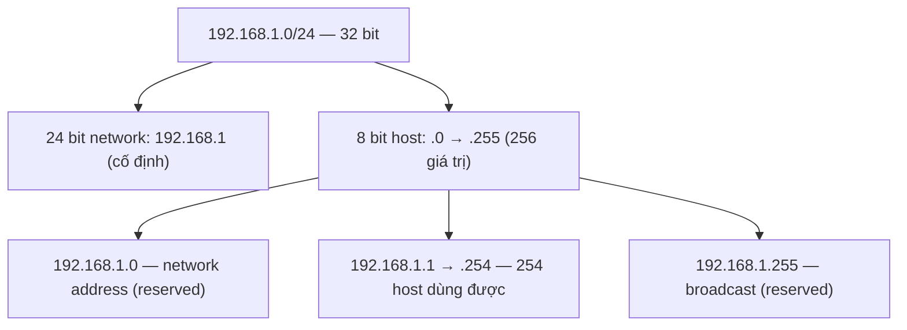

# 🎓 IP Addressing — IPv4, IPv6, Subnet, CIDR, NAT

> **Tác giả:** Mr.Rom\
> **Phiên bản:** v1.1.1\
> **Tạo lúc:** 23/05/2026\
> **Cập nhật:** 11/06/2026\
> **Level:** Basic\
> **Tags:** [MUST-KNOW]\
> **Yêu cầu trước:** [TCP/IP là gì](00_what-is-tcp-ip.md)

> 🎯 *Hiểu **IP address** là gì, **IPv4 vs IPv6**, đọc được **subnet mask + CIDR notation**, phân biệt **public/private/loopback**, biết **NAT** vì sao quan trọng, và đọc được output `ip a` / `ipconfig`.*

## 🎯 Sau bài này bạn sẽ

- [ ] Đọc được 1 địa chỉ **IPv4** (`203.0.113.10`) + **IPv6** (`2001:db8::1`)
- [ ] Hiểu **subnet mask** + đọc **CIDR notation** (`/24`, `/16`)
- [ ] Phân biệt **public** vs **private** IP (RFC 1918) — vì sao `192.168.x.x` không vào Internet được
- [ ] Hiểu **NAT** — sao nhà có 10 máy chia sẻ 1 IP công cộng
- [ ] Đọc được output `ip addr` / `ipconfig` trên Linux/Mac/Windows
- [ ] Tính được số host trong 1 subnet
- [ ] Biết khi nào IPv6 thực sự được dùng (hint: nhiều hơn bạn tưởng)

---

## Tình huống — bạn config server mà network engineer hỏi đầy ngôn ngữ lạ

Bạn thuê VPS DigitalOcean. Admin panel:

```
Public IPv4:    203.0.113.42
Public IPv6:    2604:a880:800:c1::1234:5001/64
Private IPv4:   10.116.0.5
Subnet mask:    255.255.240.0
Default gateway: 10.116.0.1
```

Bạn nói chuyện với network engineer:

> *"Tao cần thêm máy chủ này vào subnet riêng. Mày dùng `/24` nhé. NAT thì set 1-to-1 hay PAT? IPv6 thì stateless hay DHCPv6?"*

Bạn ngơ:
- **Public IP** vs **Private IP** — khác sao?
- `/24` là gì? `subnet mask 255.255.240.0` đọc ra sao?
- **NAT** — hiểu mơ hồ, không biết khi nào cần
- Sao có cả **IPv4 và IPv6**?
- "**Default gateway**" nghĩa là gì?

→ Bài này dạy bạn **đọc IP address** thành thạo, **subnet + CIDR**, **NAT**, **đọc output network tool** cơ bản.

---

## 1️⃣ IPv4 — 32-bit, 4 ô octet

**IPv4** = Internet Protocol version 4. Mỗi địa chỉ = **32 bit**, viết dưới dạng **4 octet** (8 bit/ô), cách nhau bằng `.`:

```
203.0.113.42
└─┬─┘ │ └─┬┘ │
   │  │  │  └── octet 4: 8 bit (0-255) = 42 = 00101010
   │  │  └────── octet 3
   │  └────── octet 2
   └────── octet 1
```

### Range

IPv4 dùng **32 bit** chia thành 4 octet (mỗi octet 8 bit) → tổng cộng có 2³² ≈ 4.3 tỷ địa chỉ. Nghe to nhưng thực tế **không đủ** cho thế giới 8 tỷ người + IoT — đây là lý do IPv6 ra đời:

| Mỗi octet | 0-255 (8 bit) |
|---|---|
| Tổng địa chỉ | 2^32 ≈ **4.3 tỷ** |
| Thiếu | ✅ Cạn ARIN/RIPE pool 2011-2019 — driving force của IPv6 |

### Loại địa chỉ IPv4 đặc biệt

Trong 4.3 tỷ IPv4, có 1 số dải **không dùng được như IP thường** — chúng được dành riêng cho mục đích đặc biệt (loopback, private, broadcast, ...). Nắm 6 loại dưới đây sẽ tránh nhầm khi config network:

| Range | Tên | Mục đích |
|---|---|---|
| `0.0.0.0` | Default route / "any" | Bind socket trên mọi interface |
| `127.0.0.0/8` | Loopback | `127.0.0.1` = "máy của tôi" |
| `10.0.0.0/8`, `172.16-31.0.0/12`, `192.168.0.0/16` | **Private** (RFC 1918) | Mạng nội bộ, không route Internet |
| `169.254.0.0/16` | Link-local (APIPA) | Khi DHCP fail, OS tự chọn |
| `224.0.0.0/4` | Multicast | Broadcast nhóm |
| `255.255.255.255` | Broadcast | "Gửi cho tất cả trong subnet" |

→ Học private vs public ở §5.

---

## 2️⃣ Subnet mask + CIDR notation

Mỗi địa chỉ IP có **2 phần**: **network** (mạng nào) + **host** (máy nào trong mạng).

### Subnet mask cổ điển

Subnet mask là "công cụ" tách IP thành 2 phần — đâu là bit network (mạng nào), đâu là bit host (máy nào trong mạng). Đọc song song IP + mask theo dạng nhị phân sẽ thấy ngay ranh giới:

```
IP:         203.0.113.42
Mask:       255.255.255.0
            └────network──┘ └host─┘
```

Bit `1` ở mask = network, bit `0` = host. `255.255.255.0` = `11111111.11111111.11111111.00000000` (24 bit `1` + 8 bit `0`).

→ Network: `203.0.113.0`. Host trong network: `203.0.113.0` → `203.0.113.255` (= 256 địa chỉ, **254 host** dùng được, trừ 2 reserved).

### CIDR notation — gọn hơn

**CIDR** = Classless Inter-Domain Routing. Thay vì mask `255.255.255.0`, dùng `/24` (24 bit `1`):

| Subnet mask | CIDR | Số host khả dụng |
|---|---|---|
| `255.255.255.0` | `/24` | 254 |
| `255.255.255.128` | `/25` | 126 |
| `255.255.255.192` | `/26` | 62 |
| `255.255.255.224` | `/27` | 30 |
| `255.255.240.0` | `/20` | 4094 |
| `255.255.0.0` | `/16` | 65,534 |
| `255.0.0.0` | `/8` | 16,777,214 |

### Công thức số host

Để tính nhanh số host khả dụng trong 1 subnet, dùng công thức dưới. Trừ 2 vì cần loại trừ 2 địa chỉ đặc biệt (network address + broadcast address — không gán cho host được):

```
Số host = 2^(32 - CIDR) - 2
```

- `-2` = trừ địa chỉ network (host bit 0...0) + broadcast (host bit 1...1).

Ví dụ `/24`: `2^(32-24) - 2 = 256 - 2 = 254` host.

Khái niệm trừu tượng nhất ở đây là cách `/24` **cắt 32 bit thành 2 phần**: network bits (cố định) và host bits (biến thiên). Sơ đồ minh hoạ với mạng quen thuộc `192.168.1.0/24`:



→ Số sau dấu `/` càng lớn thì phần network càng dài, phần host càng ngắn — mạng càng nhỏ; đó cũng là lý do công thức luôn trừ 2 địa chỉ reserved ở 2 đầu dải host.

### Đọc CIDR

Trong daily work (config AWS VPC, Kubernetes network policy, firewall rule, ...) bạn sẽ thấy notation CIDR rất thường xuyên. 4 ví dụ phổ biến nhất giúp nhận diện nhanh:

| Notation | Ý nghĩa |
|---|---|
| `203.0.113.0/24` | "Block 203.0.113.0 đến 203.0.113.255" — 256 địa chỉ |
| `192.168.1.0/24` | Mạng LAN nhà bạn (thường) |
| `10.0.0.0/8` | Block private LARGE — 16.7M địa chỉ |
| `0.0.0.0/0` | "Everything" — dùng trong routing/firewall rule |

---

## 3️⃣ Subnetting — chia network thành sub-network

### Ví dụ: công ty có `10.0.0.0/16` (65k IP)

Chia thành 4 sub-network nhỏ hơn:

| Subnet | CIDR | Range | Use |
|---|---|---|---|
| `10.0.0.0/18` | 16,382 IP | `10.0.0.0` - `10.0.63.255` | Office Hà Nội |
| `10.0.64.0/18` | 16,382 IP | `10.0.64.0` - `10.0.127.255` | Office Saigon |
| `10.0.128.0/18` | 16,382 IP | `10.0.128.0` - `10.0.191.255` | Data center |
| `10.0.192.0/18` | 16,382 IP | `10.0.192.0` - `10.0.255.255` | VPN clients |

→ Bit network `+2` (từ `/16` thành `/18`) = chia 4. Mỗi `+1 bit` = chia đôi.

### Tại sao subnet?

| Lý do | Giải thích |
|---|---|
| **Phân quyền** | Office HN không thấy server data center (firewall theo subnet) |
| **Performance** | Broadcast chỉ trong subnet → giảm noise |
| **Quản lý** | Đặt rule "subnet 10.0.0.0/18 = HN team" dễ hơn liệt kê 4000 IP |
| **Routing** | Router 1 entry cho `/18` thay vì 4000 entry |

→ Subnetting là nền tảng của **VPC** (AWS, GCP, Azure). Mọi cloud network phải chia subnet.

---

## 4️⃣ IPv6 — 128-bit, gấp 4 IPv4

**IPv6** = Internet Protocol version 6. Mỗi địa chỉ = **128 bit**, viết hex 8 nhóm 4 chữ số:

```
2001:0db8:85a3:0000:0000:8a2e:0370:7334
```

### Range

| IPv4 | IPv6 |
|---|---|
| 4.3 × 10^9 | 3.4 × 10^38 |
| 4.3 tỷ | 340 undecillion |

→ Đủ cho mỗi nguyên tử trên Trái Đất 1 địa chỉ. **Không bao giờ hết** thực tế.

### Quy tắc rút gọn

1. **Bỏ leading zero**: `0db8` → `db8`, `0000` → `0`.
2. **Dùng `::` 1 lần** thay nhóm `0` liên tiếp.

```
Đầy đủ:   2001:0db8:0000:0000:0000:0000:0000:0001
Bước 1:   2001:db8:0:0:0:0:0:1
Bước 2:   2001:db8::1                  ← `::` thay 6 nhóm `0`
```

### Cấu trúc

```
2001:db8:abcd:0012:0000:0000:1234:5678/64
└────── 64-bit prefix ─────┘ └── 64-bit interface ─┘
       (network)                    (host)
```

→ IPv6 luôn `/64` cho mạng end-user → mỗi mạng có 2^64 host (đủ vĩnh viễn).

### Loại địa chỉ IPv6

| Range | Tên | Mục đích |
|---|---|---|
| `::1/128` | Loopback | = `127.0.0.1` ở IPv4 |
| `fe80::/10` | Link-local | Trong cùng segment, không route |
| `fc00::/7` | Unique Local (ULA) | "Private" IPv6 (RFC 4193) |
| `2000::/3` | Global Unicast | Public IPv6 |
| `ff00::/8` | Multicast | (broadcast không tồn tại trong v6) |

### Khi nào IPv6 thực sự dùng?

| 2026 reality | Tỷ lệ |
|---|---|
| Truy cập Google qua IPv6 | ~45% |
| Mobile network (Việt Nam, Mỹ, EU) | >70% (carrier prefer v6) |
| Public DNS resolver (1.1.1.1) | Đã dual-stack lâu |
| Home router default v6 | 40-60% |
| Backend server có v6 | 20-30% |

→ **Bạn đã dùng IPv6 hàng ngày** mà không biết (mobile data).

### IPv4 hết — workaround

| Workaround | Cách |
|---|---|
| **NAT** | 1 public IP chia cho nhiều máy nội bộ (§5) |
| **CGNAT** | ISP làm NAT lớp 2 — bạn không có public IPv4 thật, share với hàng nghìn user |
| **IPv6 + 4to6 tunnel** | App chỉ cần biết IPv6, gateway convert sang v4 nếu cần |

→ Tin tốt: IPv6 dual-stack đang phổ biến. Tin xấu: vẫn còn legacy IPv4 chục năm nữa.

---

## 5️⃣ Public vs Private IP — RFC 1918

### Private IP — không route Internet

3 block reserved cho mạng nội bộ:

| Block | CIDR | Số IP | Hay dùng |
|---|---|---|---|
| `10.0.0.0/8` | `10.0.0.0` - `10.255.255.255` | 16.7M | Enterprise lớn, cloud VPC |
| `172.16.0.0/12` | `172.16.0.0` - `172.31.255.255` | 1.04M | Docker default network |
| `192.168.0.0/16` | `192.168.0.0` - `192.168.255.255` | 65.5K | Home router default |

> ⚠️ Router Internet **DROP** packet đến địa chỉ private — chúng không route được. Cần **NAT** để máy private đi Internet.

### Public IP — route được Internet

Mọi IP ngoài 3 block private (+ vài range reserved khác như loopback, link-local) đều có thể là public.

### Tại sao chia?

```
Thiếu IPv4 (chỉ 4.3 tỷ) + Internet 10+ tỷ device →
→ Cho mỗi nhà 1 public IP → hết.
→ Mỗi nhà 1 public, NAT để 10 device trong nhà share → OK.
```

---

## 6️⃣ NAT (Network Address Translation)

**NAT** = router/firewall thay đổi địa chỉ IP của packet đi qua.

### NAT cổ điển (SNAT — Source NAT)

```
Máy A (10.0.0.5)  ──packet──→  Router NAT (public 203.0.113.42)  ──→  Internet
                                  ↑ thay src IP từ 10.0.0.5 → 203.0.113.42
                                  ↑ nhớ "port 12345 = máy A" trong NAT table
```

### Khi response trở về

```
Internet  ──response→ 203.0.113.42:12345 ──→  Router  ──→  10.0.0.5 (máy A)
                                                ↑ tra NAT table: port 12345 = A
                                                ↑ thay dst IP về 10.0.0.5
```

### 3 loại NAT thực tế

| Loại | Cách | Use case |
|---|---|---|
| **SNAT** | Đổi `src IP` outbound | Home router, NAT gateway AWS |
| **DNAT** | Đổi `dst IP` inbound | Port forwarding, expose server private ra Internet |
| **PAT** (Port Address Translation) / **NAPT** | NAT + port mapping nhiều-1 | Default ở home router (n device → 1 public IP) |

### Pros & cons NAT

| Pros | Cons |
|---|---|
| ✅ Tiết kiệm public IP | ❌ Phá vỡ end-to-end principle |
| ✅ Một lớp security ngầm | ❌ P2P khó (cần STUN/TURN/UPnP) |
| ✅ Đơn giản setup | ❌ Tracking session phức tạp |
| | ❌ IPv6 thuần thì NAT không còn cần — public IP mọi nhà OK |

> 💡 **2026 trend**: IPv6 disable NAT (mọi máy 1 public v6). NAT chỉ là patch tạm cho IPv4 đời cuối.

---

## 7️⃣ Đọc output network tool

### Linux/Mac: `ip addr` (Linux) / `ifconfig` (Mac)

```bash
$ ip addr show eth0
2: eth0: <BROADCAST,MULTICAST,UP,LOWER_UP> mtu 1500
    link/ether 00:1a:2b:3c:4d:5e brd ff:ff:ff:ff:ff:ff
    inet 192.168.1.42/24 brd 192.168.1.255 scope global dynamic eth0
       valid_lft 86397sec preferred_lft 86397sec
    inet6 2001:db8::42/64 scope global
    inet6 fe80::21a:2bff:fe3c:4d5e/64 scope link
```

| Trường | Ý nghĩa |
|---|---|
| `eth0` | Tên interface (eth0 = Ethernet, wlan0 = Wi-Fi) |
| `link/ether 00:1a:...` | **MAC address** (Layer 2) |
| `mtu 1500` | Max packet size (1500 = Ethernet standard) |
| `inet 192.168.1.42/24` | IPv4 + CIDR |
| `inet6 2001:db8::42/64` | IPv6 public (scope global) |
| `inet6 fe80::...` | IPv6 link-local |
| `valid_lft 86397sec` | Lease DHCP còn 24h |

### Windows: `ipconfig /all`

```
Ethernet adapter Ethernet:
   IPv4 Address. . . . . . . . . . . : 192.168.1.42(Preferred)
   Subnet Mask . . . . . . . . . . . : 255.255.255.0
   Default Gateway . . . . . . . . . : 192.168.1.1
   DHCP Server . . . . . . . . . . . : 192.168.1.1
   DNS Servers . . . . . . . . . . . : 1.1.1.1
                                        8.8.8.8
```

### Mac (newer): `ipconfig getifaddr en0`

```bash
$ ipconfig getifaddr en0
192.168.1.42

$ networksetup -getinfo Wi-Fi
DHCP Configuration
IP address: 192.168.1.42
Subnet mask: 255.255.255.0
Router: 192.168.1.1
```

### Lệnh hữu ích

```bash
# Xem IP public của bạn (từ ngoài nhìn vào)
curl ifconfig.me                   # 203.0.113.42

# Xem mọi interface
ip -br addr                        # Linux gọn
ifconfig                            # Mac

# Test reachability
ping 8.8.8.8                       # Test L3 (IP)
ping -6 2606:4700:4700::1111       # Test IPv6

# Route table
ip route                            # Linux
route -n get default                # Mac
netstat -rn                         # Cross-platform
```

→ Chi tiết network tools ở [bài 04](04_network-tools.md).

---

## 8️⃣ "Default gateway" là gì?

```
Default gateway: 192.168.1.1
```

= Router của bạn. Khi máy bạn gửi packet đến **địa chỉ ngoài subnet** (`8.8.8.8` chẳng hạn):

```
1. OS kiểm tra: 8.8.8.8 có trong subnet 192.168.1.0/24 không?  → KHÔNG
2. OS tra routing table: default route = 192.168.1.1
3. Gửi packet đến 192.168.1.1 (router)
4. Router NAT, forward ra Internet
```

→ Default gateway sai = không vào được Internet (vào được mạng nội bộ thôi).

---

## 💡 Cạm bẫy thường gặp & Best practice

1. **Tính số host quên trừ 2** → `/24` không phải 256 host mà 254 (trừ network + broadcast).
2. **Tưởng private IP "secure"** → NAT chỉ giấu IP, **không phải firewall**. Vẫn cần security thật (Layer 7, auth).
3. **IPv6 nghĩ "tương lai", không quan tâm** → 2026 mobile network đa số IPv6. Backend khi viết phải support cả 2 (dual-stack).
4. **CIDR `/24` ≠ subnet mask `255.255.255.0` trong code** → Đôi khi syntax DSL/firewall không nhận `/24`. Kiểm tra docs config.
5. **Lẫn lộn `192.168.0.0/24` và `192.168.0.0/16`** → `/24` = 1 subnet với 254 host. `/16` = 256 subnet `/24` ghép lại (65k host).

---

## 🧠 Tự kiểm tra (Self-check)

1. CIDR `203.0.113.0/27` chứa bao nhiêu host khả dụng?
2. Phân biệt 3 block private IP (RFC 1918). Block nào hay dùng cho home Wi-Fi?
3. Viết IPv6 `2001:0db8:0000:0000:0000:ff00:0042:8329` rút gọn.
4. `1.1.1.1` là IPv4 public. Vì sao công ty không thể đặt máy nội bộ địa chỉ `1.1.1.1`?
5. NAT là gì? Vì sao IPv6 không cần NAT?

<details>
<summary>Gợi ý đáp án</summary>

1. `2^(32-27) - 2 = 32 - 2 = 30` host.

2. **`10.0.0.0/8`** (enterprise lớn, cloud), **`172.16.0.0/12`** (Docker default), **`192.168.0.0/16`** (home Wi-Fi default). Home Wi-Fi thường `192.168.1.0/24` hoặc `192.168.0.0/24`.

3. `2001:db8::ff00:42:8329` — bỏ leading zero (`0db8` → `db8`, `0042` → `42`, `8329` → `8329`), thay 3 nhóm `0000` liên tiếp bằng `::`.

4. `1.1.1.1` là public IP, owned bởi **APNIC** (đã cho Cloudflare DNS dùng). Nếu công ty đặt nội bộ `1.1.1.1`, packet đến `1.1.1.1` từ máy nội bộ sẽ **bị route đến chính máy nội bộ** thay vì Cloudflare → DNS query fail. Phải dùng private range.

5. **NAT** = Network Address Translation — đổi IP packet đi qua. Cần khi nhiều máy nội bộ share 1 public IP. **IPv6 không cần** vì có 2^128 địa chỉ — mỗi nhà có 2^64 IP public, mỗi máy 1 public IP thật.
</details>

---

## ⚡ Tra cứu nhanh (Cheatsheet)

### IPv4 quick

```
4 octet × 8 bit = 32 bit
Range mỗi octet: 0-255
Total: 4.3 tỷ
```

### CIDR phổ thông

| CIDR | Mask | Host |
|---|---|---|
| `/8` | 255.0.0.0 | 16.7M |
| `/16` | 255.255.0.0 | 65,534 |
| `/24` | 255.255.255.0 | 254 |
| `/27` | 255.255.255.224 | 30 |
| `/30` | 255.255.255.252 | 2 (cho point-to-point) |
| `/32` | 255.255.255.255 | 1 (host duy nhất) |

### Private IP cheatsheet

```
10.0.0.0/8           ← Enterprise / cloud
172.16.0.0/12        ← Docker default (172.17.0.0/16)
192.168.0.0/16       ← Home Wi-Fi (192.168.1.0/24 thường)
127.0.0.0/8          ← Loopback (127.0.0.1)
169.254.0.0/16       ← Link-local (DHCP fail)
```

### IPv6 rút gọn

```
2001:0db8:0000:0000:0000:0000:0000:0001
↓ bỏ leading zero
2001:db8:0:0:0:0:0:1
↓ :: thay nhóm 0 liên tiếp
2001:db8::1
```

### Lệnh check IP

```bash
ip -br addr               # Linux
ifconfig                  # Mac
ipconfig /all             # Windows
curl ifconfig.me           # Public IP
ping 8.8.8.8               # Test connectivity
```

---

## 📚 Từ Điển Thuật Ngữ (Glossary)

| Thuật ngữ | Ý nghĩa |
|---|---|
| **IPv4 / IPv6** | Internet Protocol version 4 (32-bit) / 6 (128-bit) |
| **Octet** | 8-bit segment của IPv4 (`0-255`) |
| **Subnet mask** | Định ranh network vs host (`255.255.255.0`) |
| **CIDR** | Notation `/N` cho subnet (`/24` = 24 bit network) |
| **Public IP** | Route được trên Internet |
| **Private IP** | RFC 1918 — không route Internet, dùng nội bộ |
| **Loopback** | `127.0.0.1` / `::1` — "máy của tôi" |
| **Link-local** | Tự cấp khi DHCP fail (`169.254.x.x` / `fe80::`) |
| **NAT / SNAT / DNAT / PAT** | Network Address Translation — đổi IP/port |
| **CGNAT** | Carrier-Grade NAT — ISP NAT cho nhiều user share 1 IP |
| **Default gateway** | Router xử lý packet ra ngoài subnet |
| **MTU** | Max Transmission Unit — kích cỡ packet tối đa (1500 Ethernet) |
| **MAC address** | Layer 2 hardware address (`00:1a:2b:3c:4d:5e`) |

---

## 🔗 Liên kết & Tài nguyên

### 🧭 Định hướng lộ trình học
- ⬅️ **Bài trước:** [TCP/IP là gì? — Bộ giao thức nền của Internet](00_what-is-tcp-ip.md)
- ➡️ **Bài tiếp theo:** [TCP vs UDP — 2 giao thức Layer 4 quan trọng nhất](02_tcp-vs-udp.md)
- ↑ **Về cụm:** [tcp-ip-fundamentals README](../../README.md)

### 🧩 Các chủ đề có thể bạn quan tâm
- [DNS Setup](../../../dns/lessons/01_basic/04_dns-setup-and-security.md) — A record trỏ về IP

### 🌐 Tài nguyên tham khảo khác
- 📖 [RFC 1918 — Private IP](https://datatracker.ietf.org/doc/html/rfc1918)
- 📖 [Subnet Mask Cheat Sheet](https://www.aelius.com/njh/subnet_sheet.html)
- 📖 [IPv6 explained — Cloudflare](https://www.cloudflare.com/learning/network-layer/what-is-ipv6/)
- 📖 [Practical Networking — Subnetting Mastery](https://www.practicalnetworking.net/series/subnetting/subnetting-mastery/) (free series)
- 📖 [SubnetOnline calculator](https://www.subnet-calculator.com/)

---

> 🎯 *Sau bài này bạn đọc thuần thục mọi IP/CIDR/NAT, hiểu vì sao home router làm NAT. Bài kế tiếp dạy **TCP vs UDP** — 2 giao thức Layer 4 quan trọng nhất.*

---

## 📌 Nhật ký thay đổi (Changelog)

- **v1.0.0 (23/05/2026)** — Bản đầu tiên. Cluster `tcp-ip-fundamentals/` lesson 2/5. Cover: IPv4 32-bit + 4 octet → range + private/public → subnet mask cổ điển + CIDR notation → subnetting (chia /16 thành 4 /18) → NAT (Network Address Translation) + private vs public IP → IPv6 128-bit + format compress + dual-stack. 5 pitfall + 4 self-check.
- **v1.1.0 (25/05/2026)** — Bổ sung lead-in trước các bảng/sơ đồ ở §1 (Range, "Loại IPv4 đặc biệt") và §2 (subnet mask diagram, công thức số host, "Đọc CIDR"). Thêm Changelog section.
- **v1.1.1 (11/06/2026)** — Bổ sung sơ đồ network bits vs host bits trong /24 (§2) cho trực quan.
