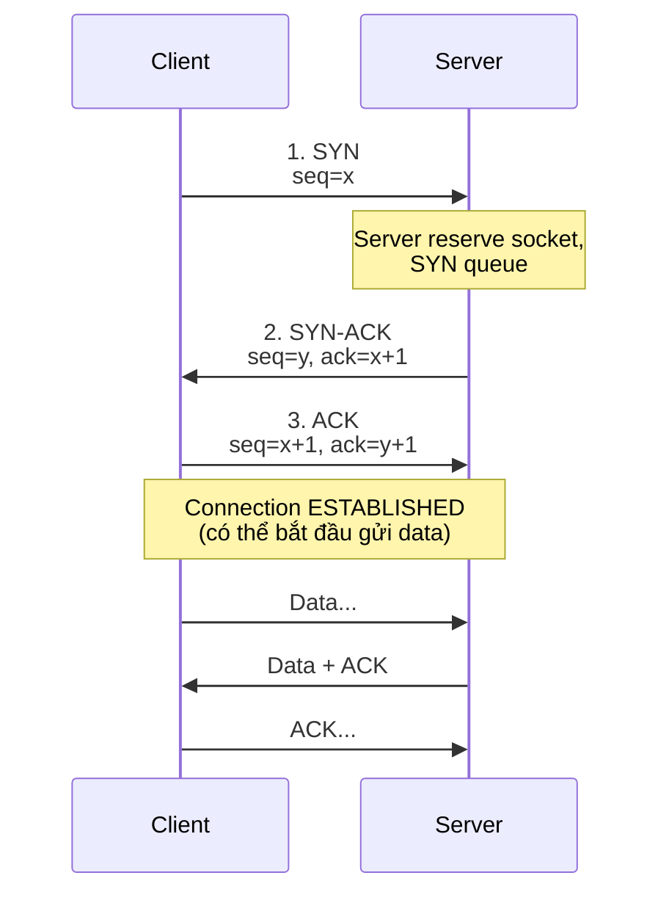
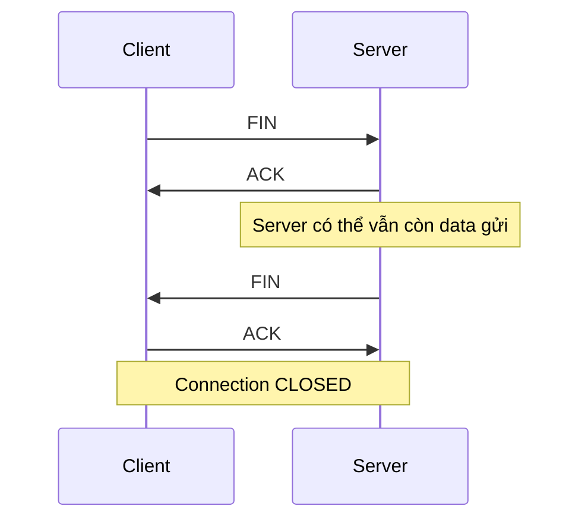

# 🎓 TCP vs UDP — 2 giao thức Layer 4 quan trọng nhất

> **Tác giả:** Mr.Rom\
> **Phiên bản:** v1.2.0\
> **Tạo lúc:** 23/05/2026\
> **Cập nhật:** 25/05/2026\
> **Level:** Basic\
> **Tags:** [MUST-KNOW]\
> **Prerequisites:** [TCP/IP là gì](00_what-is-tcp-ip.md), [IP Addressing](01_ip-addressing.md)

> 🎯 *Hiểu **TCP** (reliable + ordered) vs **UDP** (fast + lossy), **3-way handshake** TCP, **flow + congestion control**, khi nào dùng cái nào, và **QUIC/HTTP3** mới — vì sao Google chọn UDP làm nền tảng HTTP/3.*

## 🎯 Sau bài này bạn sẽ

- [ ] So sánh **TCP vs UDP** trên 8 tiêu chí
- [ ] Vẽ được **3-way handshake** TCP (SYN/SYN-ACK/ACK)
- [ ] Vẽ được **4-way close** (FIN/ACK/FIN/ACK)
- [ ] Hiểu **flow control** (window size) + **congestion control** (slow start, AIMD)
- [ ] Biết **6 flag TCP** chính (SYN, ACK, FIN, RST, PSH, URG)
- [ ] Quyết định được TCP hay UDP cho 1 use case
- [ ] Hiểu **QUIC** + lý do HTTP/3 dùng UDP

---

## Tình huống — bạn bị "sao live streaming chậm hơn web"

Bạn làm app livestream video. Backend dev xài WebSocket (TCP). Tester báo:
- 📺 Video lag, buffer 3-5s mỗi khi network kém.
- 🔊 Audio call có lúc echo, có lúc cắt từng từ.
- 📩 Chat trong stream thì nhanh, mượt.

Senior bảo:
- *"Video/audio realtime phải dùng **UDP/WebRTC**, không phải TCP."*
- *"TCP retransmit gói mất → tạo lag. UDP cho rơi 1 frame video còn hơn dừng 3 giây."*

Bạn ngơ:
- **TCP** và **UDP** khác nhau ra sao mà ảnh hưởng vậy?
- **Reliable** mà thành chậm là sao?
- **3-way handshake** là gì? Mỗi connection mất bao lâu?
- **QUIC** mới nghe — thay TCP được không?

→ Bài này dạy bạn **TCP vs UDP** đầy đủ, **khi nào dùng cái nào**.

---

## 1️⃣ Tổng quan — TCP vs UDP

2 protocol Layer 4 (Transport) **bao trùm 99%** internet hiện đại — mỗi cái thiết kế cho mục tiêu khác biệt. Hiểu trade-off **reliability vs speed** sẽ quyết định pick đúng cho use case. Bảng so sánh 13 tiêu chí cốt lõi:

| Tiêu chí | **TCP** | **UDP** |
|---|---|---|
| Tên đầy đủ | Transmission Control Protocol | User Datagram Protocol |
| Kết nối | **Connection-oriented** (handshake) | **Connectionless** (gửi luôn) |
| Đảm bảo đến | ✅ Reliable (retransmit) | ❌ Best effort |
| Đúng thứ tự | ✅ Có (sequence number) | ❌ Không |
| Flow control | ✅ Window size | ❌ |
| Congestion control | ✅ Slow start, AIMD | ❌ (app tự lo) |
| Header size | 20-60 bytes | **8 bytes** |
| Overhead | Cao | **Thấp** |
| Tốc độ | Chậm hơn UDP (do overhead) | Nhanh |
| RFC | 793 (1981) | 768 (1980) |
| Đơn vị data | Segment | Datagram |
| Use case | HTTP, SSH, email, file transfer | DNS, VoIP, video stream, game |

> 🧠 **Ẩn dụ:**
> - **TCP** = **gọi điện thoại** — alo, alo, "bạn có nghe không?" → "có" → mới bắt đầu nói. Mỗi câu chờ phản hồi.
> - **UDP** = **gửi thư** (không cần thư bảo đảm) — viết thư, gửi, kệ. Không quan tâm đến hay không, không quan tâm đúng thứ tự.

---

## 2️⃣ TCP — 3-way handshake (mở connection)

Trước khi gửi data, TCP phải **bắt tay 3 lần**:



### Diễn giải

Để dễ nhớ 3-way handshake, hình dung như **3 câu hội thoại** giữa client và server — mỗi câu trao đổi 1 thông tin cần thiết để khởi tạo connection. Bảng dưới giải thích vai trò từng bước:

| Bước | Ai gửi | Flag | Ý nghĩa |
|---|---|---|---|
| 1 | Client | `SYN` | "Tôi muốn kết nối. Seq number của tôi = x" |
| 2 | Server | `SYN + ACK` | "OK. Seq tôi = y. Đã nhận seq x+1 của bạn" |
| 3 | Client | `ACK` | "Đã nhận seq y+1 của bạn. Bắt đầu chat" |

### Hậu quả: 1 RTT (round-trip time) overhead

Server Singapore, client Hà Nội — RTT ~30ms.

- Mỗi TCP connection mới = **30ms** trước khi gửi được data.
- HTTPS = TCP + TLS handshake = thêm **30-60ms**.
- HTTP/2 reuse 1 connection cho nhiều request → đỡ handshake.
- HTTP/3 (QUIC) bỏ handshake này → 0-RTT (xem §7).

### TCP close — 4-way

Đóng connection cần **4 message** (không phải 3 như mở) — vì TCP **bidirectional**, mỗi hướng (client→server, server→client) phải close riêng. Sequence diagram dưới minh hoạ:



→ 4-way vì TCP **bidirectional** — mỗi bên close hướng của nó độc lập.

### Trạng thái TCP

Mỗi TCP socket đi qua chuỗi **state machine** rõ ràng từ lúc tạo đến lúc đóng. Khi debug network (port stuck `TIME_WAIT`, socket leak `CLOSE_WAIT`), hiểu state này là then chốt:

```
LISTEN → SYN_SENT → SYN_RECEIVED → ESTABLISHED →
→ FIN_WAIT_1 → FIN_WAIT_2 → TIME_WAIT → CLOSED
```

→ `netstat -an` hoặc `ss -tan` xem state hiện tại các connection (xem [bài 04](04_network-tools.md)).

---

## 3️⃣ TCP — Đảm bảo đến đủ + đúng thứ tự

### Sequence number + ACK

Mỗi byte có **sequence number**. Receiver ACK "tôi đã nhận đến byte X".

```
Client: gửi seq=1000, length=500 bytes  ──→  Server
Server:                                  ──→  ACK=1500 ("đã nhận hết đến byte 1499")
Client: gửi seq=1500, length=500         ──→  Server (packet mất!)
Client: gửi seq=2000, length=500         ──→  Server
Server: out-of-order — buffer 2000-2499, ACK 1500 (đợi 1500)
Client: timeout → retransmit seq=1500    ──→  Server
Server: nhận 1500, ghép buffer, ACK 2500
```

→ Đảm bảo: data đến **đủ** + **đúng thứ tự** ở receiver. App đọc ra stream liên tục.

### Cost: retransmit = lag

Mạng kém, mất packet → retransmit → **lag**. Khi:
- Web load chậm — OK, vẫn xem được.
- Video call lag 2s → echo, không nói chuyện được.

→ Real-time prefer UDP để **không retransmit**.

---

## 4️⃣ TCP — Flow control (sliding window)

Sender không thể gửi quá khả năng receiver xử lý. Receiver thông báo **window size**: "tôi có thể nhận thêm N bytes".

```
Server: window = 65535 (64KB buffer trống)
Client gửi 64KB → Server xử lý
Server: window = 32768 (32KB buffer trống)
Client biết → chậm lại, chỉ gửi 32KB
```

→ Avoid receiver overload.

---

## 5️⃣ TCP — Congestion control (network không bị nghẹt)

Phát hiện network tắc → giảm tốc.

### Slow start

Bắt đầu gửi ít (1-10 segments) → tăng exponential nếu ACK đến đều.

### AIMD (Additive Increase Multiplicative Decrease)

Sau giai đoạn slow start, TCP chuyển sang **AIMD** — chiến lược "tăng từ từ, giảm nhanh" để đảm bảo công bằng giữa các connection chia sẻ chung network. Quy tắc 2 dòng:

```
Mỗi RTT thành công  →  +1 segment per RTT  (additive)
Mất packet (tắc)    →  /2 ngay                (multiplicative)
```

→ Tốc độ giống đồ thị răng cưa lên xuống.

### Các thuật toán

| Thuật toán | Đặc điểm |
|---|---|
| **Reno** | Cổ điển — packet loss = slow down |
| **CUBIC** | Default Linux từ 2006 — phục hồi nhanh sau loss |
| **BBR** | Google 2016 — phát hiện tắc theo bandwidth+RTT, không cần loss |

→ Linux `sysctl net.ipv4.tcp_congestion_control` xem thuật toán đang dùng.

### Nagle's Algorithm — gom packet nhỏ

TCP có 1 optimization ngầm: nếu app gửi nhiều **packet nhỏ** liên tiếp (ví dụ telnet gõ từng phím), Nagle gom lại thành 1 segment lớn trước khi gửi → giảm overhead.

**Mặt trái**: interactive app (SSH, game) bị thêm **40-200ms latency** vì TCP chờ gom data. Giải pháp:

```python
# Python socket — tắt Nagle
import socket
s = socket.socket(socket.AF_INET, socket.SOCK_STREAM)
s.setsockopt(socket.IPPROTO_TCP, socket.TCP_NODELAY, 1)   # ← gửi ngay, không chờ gom
```

→ Mọi RPC framework + game server bật `TCP_NODELAY`. Web HTTP/2 cũng tự bật. Beginner gặp lag interactive app — đây là nghi can hàng đầu.

---

## 6️⃣ UDP — đơn giản tới mức trần trụi

UDP header chỉ **8 byte**:

```
┌──────────────┬──────────────┐
│ Source port  │ Dest port    │  (2 + 2 byte)
├──────────────┼──────────────┤
│ Length       │ Checksum     │  (2 + 2 byte)
└──────────────┴──────────────┘
```

→ Không có:
- ❌ Sequence number → không re-order
- ❌ ACK → không biết đến chưa
- ❌ Window → không flow control
- ❌ Congestion → không slow start

App nhận datagram nguyên gói. Mất = mất. Out-of-order = out-of-order. App tự lo.

### Pros của simplicity

- ✅ **Latency thấp** — không handshake.
- ✅ **Throughput cao** — không retransmit overhead.
- ✅ **Multicast/broadcast** OK — TCP không broadcast được.
- ✅ App có toàn quyền — game muốn drop frame cũ, audio muốn forward error correction.

---

## 7️⃣ Khi nào TCP, khi nào UDP?

### Dùng TCP khi

| Use case | Lý do |
|---|---|
| **Web (HTTP/HTTPS)** | Lost byte = trang lỗi, không chấp nhận |
| **SSH / Telnet** | Lost ký tự = command sai |
| **Email (SMTP/IMAP)** | Mất nội dung = không chấp nhận |
| **File transfer (FTP, SFTP, SCP)** | Bit nào cũng quan trọng |
| **Database connection (MySQL/Postgres protocol)** | Reliable cần |
| **Git push/pull** | Commit data |

### Dùng UDP khi

| Use case | Lý do |
|---|---|
| **DNS query** | Query nhỏ, retry app-level nếu fail, không cần handshake mỗi lần |
| **VoIP / Audio call** | Latency >>> reliability. Mất 1 millisecond = echo, retransmit = thảm |
| **Video streaming (live)** | Cho rơi 1 frame còn hơn buffer 3s |
| **Online gaming** | Position update mỗi 16ms — gói mất thì gói mới đè lên |
| **NTP (time sync)** | Lightweight, retry app-level |
| **DHCP** | Broadcast (TCP không broadcast được) |
| **SNMP monitoring** | Lightweight |

### Use case mới mẻ — QUIC (HTTP/3) dùng UDP

Google đề xuất **QUIC** 2012, IETF chuẩn hóa **HTTP/3** 2022. QUIC chạy trên UDP nhưng **implement reliability + ordering** ở Layer 7.

→ **Tại sao bỏ TCP**?

| Vấn đề TCP | QUIC giải quyết |
|---|---|
| 1-RTT handshake | 0-RTT (reuse session từ trước) |
| TLS handshake riêng | TLS 1.3 tích hợp trong handshake luôn |
| Head-of-line blocking | Mỗi stream độc lập — 1 stream loss không block stream khác |
| Connection migration | Connection ID — đổi IP (4G→Wi-Fi) không drop |

→ Đường dài thay TCP. Hiện 2026 ~30% web traffic dùng HTTP/3.

> 💡 **Nghịch lý**: UDP "lossy" lại làm nền cho protocol "reliable hơn TCP". Vì UDP đơn giản → cho phép Layer 7 cải tiến mạnh mẽ.

---

## 8️⃣ 6 TCP flags chính

| Flag | Nghĩa | Khi nào |
|---|---|---|
| `SYN` | Synchronize | Mở connection |
| `ACK` | Acknowledge | Báo đã nhận |
| `FIN` | Finish | Đóng connection (graceful) |
| `RST` | Reset | Đóng đột ngột (lỗi) |
| `PSH` | Push | App muốn gửi ngay, không buffer |
| `URG` | Urgent | Data ưu tiên (hiếm dùng) |

### `RST` (Reset) — flag bạn sẽ thấy khi debug

```bash
# Connection bị RST = remote đột ngột đóng
$ tcpdump -i any 'tcp[tcpflags] & tcp-rst != 0'
```

→ Server crashed mid-connection, hoặc firewall RST inbound = connection reset.

---

## 9️⃣ Vì sao video stream lag?

```
Client → Server: SYN
Server → Client: SYN-ACK
Client → Server: ACK
Client → Server: GET /stream/segment_42.ts (HTTP)
Server → Client: video data 100KB
                  └─ packet 5/20 LOST do Wi-Fi yếu
Client: ACK packet 4. Đợi packet 5...
Client: timeout → retransmit request
Server: gửi lại packet 5...
                  Tổng wait time = +200ms-500ms cho 1 segment
```

→ TCP đợi gói mất = lag.

### Fix với UDP/WebRTC

```
Client → Server: UDP "send me frame X"
Server → Client: frame X (UDP, ko ACK)
                  └─ frame Y nhanh sau đó
Client: nhận frame Y trước X? OK, hiển thị Y (X bỏ qua, latency hơn quan trọng)
```

→ Mỗi frame độc lập, mất 1 frame = bỏ qua, frame kế tiếp tiếp tục.

→ Đó là cách **YouTube Live, Twitch, Zoom, Google Meet** stream. Backend của bạn phải đổi sang WebRTC (UDP) hoặc HTTP/3.

---

## 💡 Cạm bẫy thường gặp & Best practice

1. **Tưởng UDP "thấp cấp", không cao cấp** → UDP là **lựa chọn** — đôi khi tốt hơn TCP. HTTP/3 chứng minh.
2. **TCP `reliable` = `secure`** → KHÔNG. TCP đảm bảo data đến đủ, **không encrypt**. Cần TLS riêng.
3. **Mở 10000 TCP connection** → mỗi connection tốn socket + memory. **Connection pool** + HTTP/2 multiplex giải quyết.
4. **Connection close = client lỗi** → Không. `FIN` là graceful close (cả 2 OK). `RST` mới là vấn đề.
5. **UDP "không reliable" → không dùng được** → DNS, video stream, game đều UDP và OK. App layer xử lý retry/ordering nếu cần.

---

## 🧠 Tự kiểm tra (Self-check)

1. Liệt kê **6 điểm khác** giữa TCP và UDP.
2. Vẽ flow **3-way handshake** TCP.
3. Tại sao **DNS dùng UDP** thay vì TCP?
4. **Slow start** + **AIMD** — TCP làm gì?
5. **QUIC** chạy trên UDP nhưng vẫn reliable — sao?

<details>
<summary>Gợi ý đáp án</summary>

1. Connection (handshake vs no), reliable (yes vs no), ordered, flow control, congestion control, header size (20+ vs 8 byte).

2. Client `SYN seq=x` → Server `SYN-ACK seq=y, ack=x+1` → Client `ACK seq=x+1, ack=y+1` → ESTABLISHED.

3. (a) Query nhỏ, response nhỏ — handshake overhead lớn hơn data. (b) Retry app-level (resolver chuyển sang TCP nếu UDP fail hoặc response > 512B). (c) Latency quan trọng — mỗi web page 100+ DNS query, không thể đợi handshake.

4. **Slow start**: bắt đầu gửi ít, tăng exponential nếu ACK đều. **AIMD**: Additive Increase Multiplicative Decrease — mỗi RTT OK +1 segment; mất packet /2 ngay. Đồ thị răng cưa lên-xuống. Giúp TCP **không làm tắc network**.

5. QUIC implement reliability/ordering ở **Layer 7** thay vì Layer 4. Mỗi stream trong QUIC độc lập (multiplex) — 1 stream loss không block stream khác. Plus 0-RTT, TLS tích hợp. UDP cho QUIC **toàn quyền điều khiển** mà không bị TCP kernel ràng buộc.
</details>

---

## ⚡ Tra cứu nhanh (Cheatsheet)

### Quyết định nhanh

| Bạn cần | Chọn |
|---|---|
| Reliable + ordered + handshake OK | **TCP** |
| Latency-critical + lossy OK | **UDP** |
| Web/SSH/file | TCP |
| DNS/VoIP/video/game | UDP |
| Mobile, future-proof | **QUIC/HTTP3** (UDP) |

### TCP flags

```
SYN  → mở connection
SYN-ACK → server reply mở
ACK  → confirm
FIN  → graceful close
RST  → reset (lỗi)
```

### Lệnh xem TCP state

```bash
ss -tan                    # All TCP, IPv4/v6
ss -tan state established  # Chỉ ESTABLISHED
ss -tln                    # Listening only
netstat -an | grep :443    # Cross-platform

# Watch trên 1 connection
tcpdump -i any port 80
```

### Lệnh test UDP

```bash
nc -u host port             # UDP netcat
nmap -sU host               # UDP scan ports
```

---

## 📘 Glossary

| Thuật ngữ | Ý nghĩa |
|---|---|
| **TCP** | Transmission Control Protocol — reliable, ordered, connection-oriented |
| **UDP** | User Datagram Protocol — fast, lossy, connectionless |
| **3-way handshake** | SYN / SYN-ACK / ACK — mở TCP connection |
| **4-way close** | FIN/ACK/FIN/ACK — đóng TCP graceful |
| **Sequence number** | Vị trí byte trong stream — đảm bảo thứ tự |
| **ACK** | Acknowledgement — "đã nhận tới byte X" |
| **Window size** | Số byte receiver có thể nhận thêm (flow control) |
| **Slow start / AIMD** | Thuật toán congestion control TCP |
| **Nagle's Algorithm** | Gom packet nhỏ → giảm overhead nhưng tăng latency. Tắt = `TCP_NODELAY` |
| **RTT** | Round-Trip Time — thời gian 1 packet đi-về |
| **TCP flags** | SYN, ACK, FIN, RST, PSH, URG |
| **QUIC** | Protocol thay TCP — chạy UDP, làm nền cho HTTP/3 |
| **HTTP/3** | HTTP qua QUIC, RFC 9114 (2022) |
| **Head-of-line blocking** | 1 packet loss block toàn stream (TCP) — QUIC fix |

---

## 🔗 Liên kết & Tài nguyên

### 🧭 Định hướng lộ trình học
- ⬅️ **Bài trước:** [IP Addressing — IPv4, IPv6, Subnet, CIDR, NAT](01_ip-addressing.md)
- ➡️ **Bài tiếp theo:** [Ports, Sockets & Firewall — Layer 4 access control](03_ports-sockets-firewall.md)
- ↑ **Về cụm:** [tcp-ip-fundamentals README](../../README.md)

### 🧩 Các chủ đề có thể bạn quan tâm
- [HTTPS & TLS](../../../http-https/lessons/01_basic/04_https-tls.md) — TLS chạy trên TCP (HTTP/1-2) hoặc QUIC (HTTP/3)

### 🌐 Tài nguyên tham khảo khác
- 📖 [RFC 793 — TCP](https://datatracker.ietf.org/doc/html/rfc793)
- 📖 [RFC 9000 — QUIC](https://datatracker.ietf.org/doc/html/rfc9000)
- 📖 [Beej's Guide to Network Programming](https://beej.us/guide/bgnet/)
- 📖 [HPBN — Ilya Grigorik: HTTP/2, TCP, QUIC](https://hpbn.co/) — free online book
- 📖 [Mark Nottingham: HTTP/3 Explained](https://http3-explained.haxx.se/)

---

> 🎯 *Sau bài này bạn hiểu vì sao web dùng TCP còn video chat dùng UDP. Bài kế tiếp dạy **ports, sockets, firewall** — cách Layer 4 phân biệt nhiều app trên cùng 1 IP.*

---

## 📌 Nhật ký thay đổi (Changelog)

- **v1.0.0 (23/05/2026)** — Bản đầu tiên. Cluster `tcp-ip-fundamentals/` lesson 3/5. Cover: TCP vs UDP overview → 3-way handshake mermaid → close 4-way → state machine → sequence + ACK reliability → flow control sliding window → congestion control (slow start, AIMD) → UDP simplicity → use cases real-world (HTTP/SSH/DNS/VoIP/game) → QUIC (HTTP/3) hybrid.
- **v1.1.0** — Thêm **Nagle's Algorithm + TCP_NODELAY** (interactive app latency).
- **v1.2.0 (25/05/2026)** — Bổ sung lead-in trước các bảng/sơ đồ ở §1 (TCP vs UDP 13 tiêu chí), §2 ("Diễn giải 3-way" + "TCP close 4-way" + "Trạng thái TCP"), §5 (AIMD formula). Thêm Changelog section.
