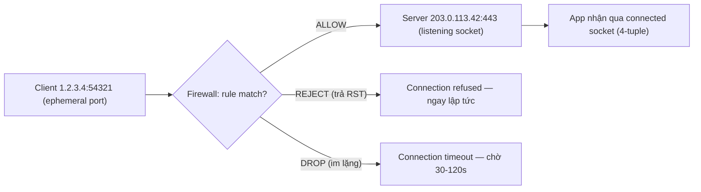

# 🎓 Ports, Sockets & Firewall — Layer 4 access control

> **Tác giả:** Mr.Rom\
> **Phiên bản:** v1.1.1\
> **Tạo lúc:** 23/05/2026\
> **Cập nhật:** 11/06/2026\
> **Level:** Basic\
> **Tags:** [MUST-KNOW]\
> **Yêu cầu trước:** [TCP vs UDP](02_tcp-vs-udp.md)

> 🎯 *Hiểu **port** (số cổng), **well-known ports**, **socket** = (IP, port) tuple, ephemeral port range, và **firewall** cơ bản (`ufw`, `iptables`, AWS Security Group). Sau bài này bạn fix được 80% lỗi "Connection refused".*

## 🎯 Sau bài này bạn sẽ

- [ ] Hiểu **port** = số 16-bit (0-65535) phân biệt app trên cùng IP
- [ ] Thuộc **15 well-known ports** thường gặp (80, 443, 22, 5432, ...)
- [ ] Đọc được **socket** = (proto, IP, port) tuple
- [ ] Phân biệt **listening socket** vs **connected socket**
- [ ] Biết **ephemeral port range** + tại sao quan trọng
- [ ] Config **firewall** cơ bản: `ufw` (Ubuntu), `iptables` (Linux), Windows Defender, AWS Security Group
- [ ] Debug **"Connection refused"** vs **"Connection timeout"**

---

## Tình huống — Bạn debug "tại sao port 5432 không vào được"

Bạn deploy PostgreSQL trên VPS. App ở máy local muốn connect:

```bash
$ psql -h 203.0.113.42 -p 5432 -U acmeshop
psql: error: connection to server at "203.0.113.42",
port 5432 failed: Connection timed out
```

Bạn thử:
```bash
$ ping 203.0.113.42      # → reply OK
$ telnet 203.0.113.42 22 # → SSH OK
$ telnet 203.0.113.42 5432  # → timeout
```

Bạn ngơ:
- Server up (ping OK), SSH up (port 22 OK), tại sao Postgres không OK?
- **"Connection refused"** vs **"timeout"** khác sao?
- **Port 5432** ở đâu cần mở?
- **Firewall** ở đâu — VPS hay máy local?

→ Bài này dạy bạn **port + socket + firewall** đầy đủ.

---

## 1️⃣ Port — số 16-bit phân biệt app

**Port** = số 16-bit (range **0-65535**) để OS phân biệt **nhiều app** chạy trên **cùng 1 máy** (cùng IP).

```
1 máy có IP 203.0.113.42 chạy:
  - HTTP server     listening port 80
  - HTTPS server    listening port 443
  - SSH server      listening port 22
  - PostgreSQL      listening port 5432
  - Redis           listening port 6379

Client kết nối:
  - 203.0.113.42:80   → HTTP
  - 203.0.113.42:443  → HTTPS
  - 203.0.113.42:5432 → Postgres
```

→ Cùng IP, khác port = khác app.

### 3 vùng port

65,535 port không phải dùng đồng đều — IANA chia thành **3 vùng** theo mức độ "chính thức". Hiểu được sẽ trả lời câu hỏi quen thuộc: vì sao dev server hay chạy port `3000`/`8080` mà không phải `80`?

| Range | Tên | Mục đích |
|---|---|---|
| **0-1023** | **Well-known / System** | Reserved cho dịch vụ chuẩn (HTTP, SSH...). Bind cần root/admin |
| **1024-49151** | **Registered / User** | IANA cấp cho phần mềm (Postgres 5432, MySQL 3306...) |
| **49152-65535** | **Dynamic / Ephemeral** | OS tự cấp tạm cho client connection outgoing |

> ⚠️ **Bind port < 1024** trên Linux/Mac cần `sudo`. Đó là lý do dev server chạy port `3000` / `8080` thay vì `80`.

---

## 2️⃣ Well-known ports — phải thuộc

### TCP

Backend dev daily phải nhớ ~10-15 port well-known cho TCP — chúng xuất hiện trong mọi cấu hình firewall, Docker compose, AWS security group. Bảng dưới list 20 port phổ biến nhất:

| Port | Service | Ghi chú |
|---|---|---|
| **20, 21** | FTP | Data + Control |
| **22** | SSH / SCP / SFTP | Remote shell |
| **23** | Telnet | (legacy, không dùng — không encrypt) |
| **25** | SMTP | Send email |
| **53** | DNS | Cả TCP (zone transfer) và UDP (query) |
| **80** | HTTP | |
| **110** | POP3 | Receive email (legacy) |
| **143** | IMAP | Receive email (modern) |
| **443** | HTTPS | TLS over TCP |
| **465** | SMTP+TLS | |
| **587** | SMTP submission (auth) | |
| **993** | IMAPS | IMAP + TLS |
| **3306** | MySQL/MariaDB | |
| **3389** | RDP | Windows Remote Desktop |
| **5432** | PostgreSQL | |
| **6379** | Redis | |
| **8080** | HTTP alt | Hay dùng cho dev |
| **8443** | HTTPS alt | Tomcat default |
| **9200** | Elasticsearch | |
| **27017** | MongoDB | |

### UDP

UDP port well-known ít hơn TCP, nhưng đều là **infrastructure protocol** thiết yếu (DNS, DHCP, NTP, VPN). Khi config firewall outbound, đừng quên mở UDP cho 53 (DNS) — thiếu là toàn bộ resolve fail:

| Port | Service |
|---|---|
| **53** | DNS query |
| **67, 68** | DHCP server/client |
| **69** | TFTP |
| **123** | NTP (time sync) |
| **161, 162** | SNMP |
| **500** | IKE (VPN) |
| **1194** | OpenVPN |
| **5060** | SIP (VoIP) |

→ HTTP/3 cũng **443/UDP** (QUIC).

---

## 3️⃣ Socket — (proto, IP, port) tuple

**Socket** = end-point của 1 kết nối network, định danh bởi **5-tuple**:

```
(protocol, src_IP, src_port, dst_IP, dst_port)
```

### Listening socket (server)

Server bind socket vào (IP, port) và **đợi** connection:

```
TCP  0.0.0.0  443  LISTEN
└─ listening trên mọi interface, port 443
```

`0.0.0.0` = "tất cả IPv4 interface" (= mọi interface máy có). Vs `127.0.0.1` = chỉ local.

### Connected socket (client + server)

Khi client connect, OS tạo **socket mới** với 4-tuple đầy đủ:

```
Server side:                              Client side:
TCP 0.0.0.0:443 LISTEN                    -
TCP 203.0.113.42:443 → 1.2.3.4:54321      TCP 1.2.3.4:54321 → 203.0.113.42:443
```

→ Cùng server có thể có 1000 connection trên port 443 — mỗi connection 4-tuple khác nhau (port client khác nhau).

### Xem sockets — `ss` / `netstat`

Để debug "port nào đang lắng nghe", "process nào chiếm port 80", "có connection nào đang ESTABLISHED" — dùng 2 lệnh dưới (`ss` modern, `netstat` legacy). Đây là tool bạn sẽ gõ hàng ngày nếu làm backend/devops:

```bash
$ ss -tlnp                          # TCP, listening, numeric, process
State  Recv-Q Send-Q Local Address:Port  Peer Address:Port  Process
LISTEN 0      128    0.0.0.0:22          0.0.0.0:*          users:(("sshd"))
LISTEN 0      128    127.0.0.1:5432      0.0.0.0:*          users:(("postgres"))
LISTEN 0      128    0.0.0.0:443         0.0.0.0:*          users:(("nginx"))

$ ss -tan                           # All TCP connections
State       Local:Port            Peer:Port
ESTAB       203.0.113.42:443      1.2.3.4:54321
ESTAB       203.0.113.42:443      5.6.7.8:55001
TIME-WAIT   203.0.113.42:443      9.0.1.2:53001
```

→ Chi tiết tool ở [bài 04](04_network-tools.md).

### Bind `0.0.0.0` vs `127.0.0.1`

Đây là **lỗi bảo mật phổ biến #1** với Postgres/Redis/MongoDB: bind `0.0.0.0` (mở public) thay vì `127.0.0.1` (chỉ local) → DB lộ ra internet, hacker scan port là vào ngay. So sánh 2 dòng:

```
TCP  0.0.0.0:5432 LISTEN   ← Postgres listen MỌI interface (public + private)
TCP  127.0.0.1:5432 LISTEN ← Postgres CHỈ listen loopback (local only)
```

→ Postgres default bind `127.0.0.1` (chỉ local). Muốn cho phép remote → đổi `listen_addresses = '*'` (cẩn thận security!).

→ Bạn ở §tình huống: nếu Postgres bind `127.0.0.1` → từ ngoài kết nối **timeout** (packet bị drop ở Postgres level, không phản hồi).

---

## 4️⃣ Ephemeral port range

Khi client outgoing connect tới server, OS cấp 1 **ephemeral port** làm src_port:

```
Linux default:     32768-60999      (xem /proc/sys/net/ipv4/ip_local_port_range)
Windows default:   49152-65535
Mac default:       49152-65535
```

→ ~28k ports / client. Nếu mở quá nhiều connection (load test, scraping) → **out of ephemeral ports** → "Cannot assign requested address". Tăng range:

```bash
# Linux
sysctl -w net.ipv4.ip_local_port_range="1024 65535"

# Hoặc tăng tcp_tw_reuse (recycle TIME-WAIT faster)
sysctl -w net.ipv4.tcp_tw_reuse=1
```

---

## 5️⃣ Firewall — kiểm soát traffic

### 3 loại firewall

| Loại | Ví dụ | Layer |
|---|---|---|
| **Network firewall** (hardware) | Cisco ASA, Palo Alto | L3-4 (IP/port) |
| **Host firewall** (software) | `iptables`/`nftables` Linux, Windows Defender, `pf` Mac | L3-4 |
| **Cloud security group** | AWS SG, GCP firewall, Azure NSG | L3-4 |
| **WAF** (Web Application Firewall) | Cloudflare, AWS WAF | L7 (HTTP) |

### Default policy — phải hiểu

| Policy | Hành vi default |
|---|---|
| **Default DENY** (recommended) | Mặc định cấm, chỉ cho rule explicit. An toàn hơn. |
| **Default ALLOW** | Mặc định mở, chỉ cấm rule explicit. Dễ thiếu sót. |

→ Production luôn **Default DENY** outbound + inbound.

### Khi packet đến — flow

```
Packet đến NIC
  ↓
Firewall rule check (theo thứ tự):
  Rule 1: ALLOW tcp port 443  ← match? yes → ALLOW
  Rule 2: ALLOW tcp port 22 from my-office-IP
  Rule 3: DENY tcp from 1.2.3.4
  ...
  Default: DENY
  ↓
Nếu ALLOW → forward đến app
Nếu DENY  → drop (silent) hoặc reject (gửi RST)
```

→ **Drop** = silent (client timeout sau 30-120s). **Reject** = trả RST (client báo "Connection refused" ngay).

Ghép port + socket + firewall lại, đường đi của 1 packet từ client đến app là khái niệm trừu tượng nhất bài — sơ đồ dưới tóm gọn 3 kết cục có thể xảy ra:



→ Triệu chứng phía client tiết lộ chuyện gì xảy ra ở giữa: refused ngay = có RST trả về (REJECT hoặc không app listen), còn timeout = packet bị nuốt im lặng (DROP) — đây chính là chìa khoá debug ở §9.

---

## 6️⃣ UFW (Ubuntu Firewall) — đơn giản nhất

`ufw` là wrapper friendly cho `iptables` trên Ubuntu/Debian.

```bash
# Status
sudo ufw status verbose

# Enable
sudo ufw enable

# Allow port
sudo ufw allow 22/tcp                   # SSH
sudo ufw allow 80,443/tcp                # HTTP + HTTPS
sudo ufw allow 5432/tcp                  # Postgres
sudo ufw allow from 1.2.3.4 to any port 5432   # Chỉ cho 1 IP

# Deny
sudo ufw deny 23                         # Cấm Telnet

# Delete rule
sudo ufw delete allow 80/tcp

# Default
sudo ufw default deny incoming
sudo ufw default allow outgoing

# Reload
sudo ufw reload
```

> 💡 **Quy tắc 80%**: server new — `ufw allow ssh`, `ufw allow http`, `ufw allow https`, `ufw default deny incoming`, `ufw enable`. Xong.

---

## 7️⃣ iptables — Linux nguyên gốc

`iptables` (đang được `nftables` thay) là tool gốc, mạnh hơn UFW nhưng phức tạp.

```bash
# Show rules
sudo iptables -L -n -v

# Allow port 443
sudo iptables -A INPUT -p tcp --dport 443 -j ACCEPT

# Allow SSH chỉ từ IP nhất định
sudo iptables -A INPUT -p tcp --dport 22 -s 1.2.3.4 -j ACCEPT

# Drop everything else inbound
sudo iptables -A INPUT -j DROP

# Save (Ubuntu/Debian)
sudo apt install iptables-persistent
sudo netfilter-persistent save
```

→ Cú pháp khó nhớ. Beginner: dùng `ufw` (Ubuntu) hoặc `firewalld` (RHEL/Fedora).

---

## 8️⃣ AWS Security Group — Cloud firewall

Cloud (AWS/GCP/Azure) có firewall riêng **trước** OS firewall. Linux thấy traffic = đã qua SG.

```
SG Inbound rules:
  Type        Protocol  Port    Source
  HTTP        TCP       80      0.0.0.0/0      ← Everyone
  HTTPS       TCP       443     0.0.0.0/0
  SSH         TCP       22      203.0.113.0/24 ← Office IP only
  Postgres    TCP       5432    sg-xxxxx       ← Reference SG khác (chỉ app server)
```

→ **Default**: deny inbound, allow outbound (stateful — reply OK).

> 💡 **AWS Security Group là stateful** → return traffic tự được allow nếu outbound đã ra. Khác `iptables` mặc định stateless (phải allow cả 2 chiều).

### Trên đường packet đến app

```
Internet → ALB SG → ALB → EC2 SG → EC2 OS firewall (iptables) → app
```

→ 3 layer firewall! Lỗi 1 trong 3 = không vào được.

---

## 9️⃣ "Connection refused" vs "Connection timeout"

| Triệu chứng | Nguyên nhân thường gặp |
|---|---|
| **Connection refused** (ngay) | Server up, port không có app listen (or `REJECT` firewall) |
| **Connection timeout** (chờ 30s+) | Packet bị **drop** — firewall, server down, hoặc Internet không route |
| **No route to host** | Routing fail — định tuyến không có path tới đích |
| **Network unreachable** | Local interface không kết nối được mạng |

### Debug case — port 5432 timeout

```
Step 1: ping IP        → OK = server up, layer 3 OK
Step 2: telnet IP 22    → OK = SSH listen, firewall không block 22
Step 3: telnet IP 5432  → TIMEOUT
        → Có thể: (a) Postgres không listen port 5432
                  (b) Postgres listen 127.0.0.1 thay vì 0.0.0.0
                  (c) Firewall drop port 5432
                  (d) AWS SG không allow 5432
```

→ SSH vào server và check:
```bash
ss -tlnp | grep 5432
# LISTEN 0  128  127.0.0.1:5432  ← AH-HA! Bind chỉ local
```

→ Fix: `listen_addresses = '*'` trong `postgresql.conf` + `ufw allow 5432/tcp` + AWS SG allow 5432 từ app server.

---

## 💡 Cạm bẫy thường gặp & Best practice

1. **Bind `0.0.0.0` trên Postgres/MySQL/Redis production** → expose ra Internet, **bị tấn công** trong 24h. Hoặc bind `127.0.0.1` + SSH tunnel, hoặc bind private IP + SG strict.
2. **Mở "all traffic" trong AWS SG cho debug** → quên đóng = exposed forever. Always strict.
3. **`ufw enable` mà chưa `allow ssh`** → SSH bị block, không vào lại được. Mở SSH trước khi enable!
4. **DROP vs REJECT confusion** → DROP = timeout (port scanner đoán có firewall). REJECT = refused (rõ hơn nhưng tiết lộ có port).
5. **Out of ephemeral ports** khi load test/scrape → cần tune `tcp_tw_reuse`, `ip_local_port_range`. Hoặc dùng nhiều IP source.

---

## 🧠 Tự kiểm tra (Self-check)

1. Range port 0-65535 — chia 3 vùng nào? Vùng nào cần `sudo` bind?
2. Phân biệt **listening** và **connected** socket. Bao nhiêu socket cho 100 user truy cập đồng thời 1 web server port 443?
3. **Connection refused** vs **timeout** — khác sao?
4. Bind `0.0.0.0:5432` vs `127.0.0.1:5432` — khác sao?
5. Viết lệnh `ufw` mở port 22 chỉ cho IP `1.2.3.4`.

<details>
<summary>Gợi ý đáp án</summary>

1. **0-1023** well-known (cần `sudo`), **1024-49151** registered, **49152-65535** ephemeral. Chỉ <1024 cần root/admin.

2. **Listening** socket: server bind (IP, port), đợi connection. 1 cái. **Connected**: 1 socket cho mỗi client connection, 4-tuple đầy đủ. 100 user = **1 listening + 100 connected** = 101 socket total trên server.

3. **Refused**: connect tới port không có app listen — TCP RST trả về ngay. **Timeout**: packet bị **drop** (firewall hoặc server down) — không có response, chờ 30-120s.

4. `0.0.0.0:5432` = listen trên **mọi interface** (kể cả public, ai cũng connect được). `127.0.0.1:5432` = chỉ **loopback** (chỉ process trên cùng máy mới connect, kể cả từ private LAN cũng không).

5. ```bash
   sudo ufw allow from 1.2.3.4 to any port 22 proto tcp
   ```
</details>

---

## ⚡ Tra cứu nhanh (Cheatsheet)

### Well-known port phải thuộc

```
22  SSH
25  SMTP
53  DNS (TCP+UDP)
80  HTTP
443 HTTPS (TCP+QUIC/UDP)
3306 MySQL
5432 Postgres
6379 Redis
27017 MongoDB
9200 Elasticsearch
```

### Xem listening port

```bash
ss -tlnp                       # Linux modern
netstat -an | grep LISTEN      # Cross-platform
lsof -i -P -n | grep LISTEN    # Mac/Linux + process info
```

### UFW basic

```bash
sudo ufw allow ssh
sudo ufw allow 80,443/tcp
sudo ufw allow from 1.2.3.4 to any port 5432
sudo ufw default deny incoming
sudo ufw enable
sudo ufw status verbose
```

### Test connectivity

```bash
ping host                       # L3 (IP)
telnet host port                # L4 (TCP)
nc -zv host port                # L4 quick check
nc -uz host port                # L4 UDP check
curl -v https://host            # L7 (HTTP)
```

### Quy trình troubleshoot nhanh

```
1. ping IP                 → fail? Layer 3 / route / firewall L3
2. telnet IP port          → refused? App không listen. timeout? Firewall.
3. ss -tlnp on server      → process listen port chưa?
4. ufw status / iptables -L → firewall block?
5. Cloud SG inbound        → SG allow port?
```

---

## 📚 Từ Điển Thuật Ngữ (Glossary)

| Thuật ngữ | Ý nghĩa |
|---|---|
| **Port** | Số 16-bit (0-65535) phân biệt app trên cùng IP |
| **Well-known port** | 0-1023, reserved cho dịch vụ chuẩn |
| **Ephemeral port** | 49152-65535, OS cấp tạm cho client |
| **Socket** | (proto, IP, port) — endpoint connection |
| **Listening socket** | Server bind, đợi connection |
| **Connected socket** | 4-tuple đầy đủ — 1 connection cụ thể |
| **Bind** | App đăng ký quyền listen trên (IP, port) |
| **0.0.0.0 / ::0** | Wildcard — mọi interface |
| **127.0.0.1 / ::1** | Loopback — chỉ local |
| **Firewall** | Bộ lọc traffic theo rule |
| **DROP vs REJECT** | Drop silent vs Reject trả RST |
| **Stateful firewall** | Track connection — reply tự allow (AWS SG) |
| **Security Group** | Cloud firewall (AWS/GCP/Azure) |
| **iptables / nftables / ufw** | Linux firewall tools |

---

## 🔗 Liên kết & Tài nguyên

### 🧭 Định hướng lộ trình học
- ⬅️ **Bài trước:** [TCP vs UDP — 2 giao thức Layer 4 quan trọng nhất](02_tcp-vs-udp.md)
- ➡️ **Bài tiếp theo:** [Network Tools — `ping`, `traceroute`, `ss`, `tcpdump`, `nmap` & friends](04_network-tools.md)
- ↑ **Về cụm:** [tcp-ip-fundamentals README](../../README.md)

### 🧩 Các chủ đề có thể bạn quan tâm
- [HTTP headers](../../../http-https/lessons/01_basic/03_http-headers.md) — CORS thực thi ở Layer 7, không phải firewall L4

### 🌐 Tài nguyên tham khảo khác
- 📖 [IANA Service Name and Transport Protocol Port Registry](https://www.iana.org/assignments/service-names-port-numbers/service-names-port-numbers.xhtml)
- 📖 [UFW Ubuntu wiki](https://help.ubuntu.com/community/UFW)
- 📖 [iptables tutorial — Frozentux](https://www.frozentux.net/iptables-tutorial/iptables-tutorial.html) — classic
- 📖 [AWS Security Groups vs NACL — Cloudflare](https://aws.amazon.com/blogs/security/working-backward-from-the-customer-revisiting-security-services/) — official AWS docs

---

> 🎯 *Sau bài này bạn config được firewall + debug "Connection refused/timeout" trong 5 phút. Bài cuối cluster dạy **6 network tools** thực hành: ping/traceroute/netstat/ss/tcpdump/nmap.*

---

## 📌 Nhật ký thay đổi (Changelog)

- **v1.0.0 (23/05/2026)** — Bản đầu tiên. Cluster `tcp-ip-fundamentals/` lesson 4/5. Cover: port 16-bit + 3 vùng (well-known/registered/ephemeral) → 20+ TCP + 8 UDP well-known port → socket 5-tuple + listening vs connected → `ss`/`netstat` + bind 0.0.0.0 vs 127.0.0.1 → firewall layer (iptables, ufw, AWS SG, K8s NetPol) → Connection refused vs timeout debug.
- **v1.1.0 (25/05/2026)** — Bổ sung lead-in trước các bảng/ví dụ ở §1 ("3 vùng port"), §2 (TCP/UDP well-known), §3 ("Xem sockets ss/netstat" + "Bind 0.0.0.0 vs 127.0.0.1"). Thêm Changelog section.
- **v1.1.1 (11/06/2026)** — Bổ sung sơ đồ đường đi packet qua firewall (allow/reject/drop → socket) ở §5 cho trực quan.
