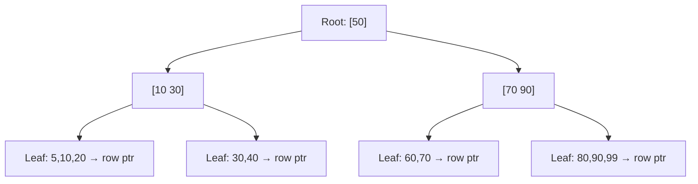

# 🎓 Indexes & Performance — EXPLAIN ANALYZE, B-tree, GIN, BRIN

> **Tác giả:** Mr.Rom\
> **Phiên bản:** v1.1.1\
> **Tạo lúc:** 23/05/2026\
> **Cập nhật:** 10/06/2026\
> **Level:** Basic\
> **Tags:** [MUST-KNOW]\
> **Yêu cầu trước:** [psql & Meta-commands](01_psql-and-meta-commands.md), [SQL schema design](../../../sql-fundamentals/lessons/01_basic/05_schema-design-basics.md)

> 🎯 *Master index Postgres: **5 loại index** (B-tree default, GIN cho text/JSONB, GiST cho range/geo, BRIN cho time-series, Hash), **partial + multicolumn + expression** indexes, **EXPLAIN ANALYZE** đọc query plan, **5 common slow query patterns** + fix, **VACUUM + ANALYZE** tuning.*

## 🎯 Sau bài này bạn sẽ

- [ ] Hiểu **5 loại index** Postgres + khi nào dùng
- [ ] Tạo **B-tree** (default), **composite**, **partial**, **expression** index
- [ ] Đọc **EXPLAIN ANALYZE** output (Seq Scan, Index Scan, Bitmap, Sort, ...)
- [ ] Detect **5 anti-pattern** slow query
- [ ] Hiểu **VACUUM + ANALYZE** + tự động vs manual
- [ ] Biết **`pg_stat_user_indexes`** check unused index
- [ ] Index cho **JSONB** (GIN) + **full-text** (tsvector + GIN)
- [ ] Hiểu trade-off: index nhanh read, chậm write

---

## Tình huống — Bạn debug 5s query

Bạn backend chạy ngon. Sau 6 tháng, bảng `orders` có 5M rows. Query:

```sql
SELECT * FROM orders WHERE user_id = 1234 ORDER BY created_at DESC LIMIT 20;
```

→ Trước: 50ms. Giờ: **5 giây**.

Bạn thử:

```sql
EXPLAIN ANALYZE
SELECT * FROM orders WHERE user_id = 1234 ORDER BY created_at DESC LIMIT 20;
```

Output:
```
Limit  (cost=180000..180000 rows=20 actual time=4823..4824 rows=20 loops=1)
  -> Sort  (cost=180000..181000 rows=400000 actual time=4823..4823 rows=20 loops=1)
        Sort Key: created_at DESC
        Sort Method: top-N heapsort  Memory: 25kB
        -> Seq Scan on orders  (cost=0..150000 rows=400000 actual time=12..4500 rows=420000 loops=1)
              Filter: (user_id = 1234)
              Rows Removed by Filter: 4580000     ← Scan 5M, throw 4.58M
```

→ **Seq Scan** = full table scan 5M rows. Bạn ngơ:
- Sao **không dùng index**?
- Tạo index thế nào?
- **EXPLAIN ANALYZE** đọc ra sao?

Senior:
> *"Bảng 5M không có index trên `user_id`. Tạo `CREATE INDEX idx_orders_user_id ON orders(user_id);` → query xuống 5ms. Nhưng học sâu để biết khi nào dùng B-tree, khi nào GIN, khi nào composite."*

→ Bài này dạy index + EXPLAIN đầy đủ.

---

## 1️⃣ Index là gì + Trade-off

**Index** = cấu trúc data riêng (cây B-tree, hash, ...) giúp lookup nhanh thay vì scan toàn bảng.

### Phân tích trade-off

Index là **dao 2 lưỡi**: tăng tốc đọc nhưng chậm ghi + tốn storage. Bảng dưới so sánh 7 operation với và không có index — số liệu giúp quyết định "nên/không nên" add index cho 1 cột cụ thể:

| Aspect | No index | With index |
|---|---|---|
| Find row | O(n) scan | O(log n) B-tree lookup |
| Sort | O(n log n) | O(n) if sorted by index |
| Range scan | O(n) | O(log n + k) |
| Insert | O(1) | O(log n) — phải update index |
| Update | O(1) | O(log n) nếu update indexed col |
| Delete | O(1) | O(log n) |
| Storage | 0 | 10-30% size of table |

→ **Rule of thumb**:
- **Read-heavy + filter/sort thường xuyên** → nhiều index OK.
- **Write-heavy + ít read** → ít index tốt.
- Index UNIQUE + PK = tự có, không phải tạo.

> ⚠️ **Quá nhiều index** = write slow + storage bloat. Mỗi index cần justify.

---

## 2️⃣ 6 loại index Postgres

Postgres support **6 loại index** khác nhau, mỗi loại tối ưu cho 1 kiểu query. B-tree là default (90% case dùng), còn lại cho use case đặc biệt (JSONB → GIN, geo → GiST, time-series → BRIN):

| Type | Mục đích | Ví dụ |
|---|---|---|
| **B-tree** (default) | `=`, `<`, `>`, `BETWEEN`, sort, prefix LIKE | `WHERE id = 5`, `ORDER BY created_at` |
| **Hash** | Chỉ `=` (hiếm dùng) | Lookup exact match only |
| **GIN** | Composite values: array, JSONB, full-text | `WHERE tags @> ARRAY['a']`, `WHERE data @> '{...}'` |
| **GiST** | Geometric, range, full-text (older) | PostGIS, range types |
| **BRIN** | Block Range — large ordered table | Time-series log table (ordered insert) |
| **SP-GiST** | Non-balanced trees (radix, quadtree) | Niche — specialized data |

### Cú pháp tạo

`CREATE INDEX` có syntax đơn giản — default là B-tree nếu không chỉ định type. 4 dạng phổ biến nhất: default, custom type, unique, concurrent (production-safe):

```sql
-- Default B-tree
CREATE INDEX idx_users_email ON users(email);

-- Specify type
CREATE INDEX idx_orders_data_gin ON orders USING GIN (data jsonb_path_ops);
CREATE INDEX idx_logs_ts_brin ON logs USING BRIN (timestamp);

-- Unique
CREATE UNIQUE INDEX idx_users_email_unique ON users(email);

-- Drop
DROP INDEX idx_users_email;

-- Concurrent (no lock — production safe)
CREATE INDEX CONCURRENTLY idx_users_email ON users(email);
```

### `CONCURRENTLY` — Quan trọng cho production

Trên production, `CREATE INDEX` thường (không có `CONCURRENTLY`) sẽ **lock toàn bộ table** vài giây-phút → block writes → downtime. Add `CONCURRENTLY` chậm hơn 2× nhưng **không lock** — luôn dùng cho prod:

```sql
-- Lock table → block writes (vài giây-phút trên large table)
CREATE INDEX idx_x ON huge_table(col);

-- No lock — slow hơn (2x) nhưng không block writes
CREATE INDEX CONCURRENTLY idx_x ON huge_table(col);
```

→ **Production**: always `CONCURRENTLY`. Pitfall: trong transaction không dùng được.

---

## 3️⃣ B-tree — 90% case

B-tree là cây cân bằng nhiều tầng: từ **root** (1 node trên cùng) đi xuống các node **branch**, rồi tới **leaf** chứa key đã sắp xếp + con trỏ về row trong bảng. Sơ đồ dưới minh hoạ cách Postgres đi từ root xuống leaf để tìm 1 giá trị.



→ Vì sao tìm theo index nhanh: mỗi tầng cây loại bỏ một nửa (hoặc nhiều hơn) không gian tìm kiếm, nên độ phức tạp là **O(log n)** — chỉ đi vài bước từ root xuống leaf rồi nhảy thẳng tới row, thay vì **full table scan O(n)** quét lần lượt từng row của bảng.

### Single column

Index 1 cột là dạng phổ biến nhất — phù hợp khi query thường filter/sort theo cột đó. Postgres tự dùng index nếu thấy benefit. Có thể chỉ định `ASC`/`DESC` để optimize cho ORDER BY:

```sql
CREATE INDEX idx_orders_user_id ON orders(user_id);
CREATE INDEX idx_orders_created_at ON orders(created_at DESC);    -- DESC giúp ORDER BY DESC
```

### Composite (multicolumn)

```sql
CREATE INDEX idx_orders_user_created ON orders(user_id, created_at DESC);
```

→ **Quan trọng**: column **thứ tự** matter:
- `WHERE user_id = X AND created_at > Y` → use index ✅
- `WHERE user_id = X` → use index ✅ (prefix)
- `WHERE created_at > Y` → **NOT use** ❌ (skip first column)
- `WHERE user_id = X ORDER BY created_at DESC` → ✅ index handles both filter + sort

### Thứ tự column trong composite

| Pattern | Best order |
|---|---|
| Filter A + Sort B | `(A, B)` |
| Filter A + Filter B (equal) | (A first if more selective) |
| Filter A + Range B | `(A, B)` |
| Range A + Filter B | `(B, A)` — range last |

→ **Rule**: **equality first, range last**.

### Bạn fix slow query

```sql
-- Before
SELECT * FROM orders WHERE user_id = 1234 ORDER BY created_at DESC LIMIT 20;
-- Seq Scan 5M rows → 5s

-- Create composite index
CREATE INDEX CONCURRENTLY idx_orders_user_created
  ON orders(user_id, created_at DESC);

-- After
EXPLAIN ANALYZE SELECT ...;
-- Index Scan using idx_orders_user_created (cost=0..40 rows=20 actual time=0.5..5 rows=20)
-- Time: 5ms ✓
```

→ **From 5000ms → 5ms = 1000x faster** với 1 index đúng.

---

## 4️⃣ Partial index — Index 1 phần

Index chỉ trên **subset** rows match condition.

```sql
-- Index chỉ orders chưa shipped (90% queries hỏi nhóm này)
CREATE INDEX idx_orders_pending ON orders(created_at DESC)
WHERE status = 'pending';

-- Use case: queue
SELECT * FROM orders
WHERE status = 'pending'
ORDER BY created_at DESC LIMIT 100;
-- → Index scan nhỏ + nhanh hơn full B-tree
```

### Pros

| Pros | Cons |
|---|---|
| ✅ Index size nhỏ (chỉ subset) | ❌ Query phải match WHERE condition |
| ✅ Maintenance nhẹ | ❌ Khó debug "tại sao index không dùng" |
| ✅ Fast for hot data | |

→ **Pattern**: hot data (status=active, deleted_at IS NULL, recent), 80/20 rule.

### Common partial indexes

```sql
-- Soft delete
CREATE INDEX idx_users_active ON users(created_at)
WHERE deleted_at IS NULL;

-- Active session
CREATE INDEX idx_sessions_valid ON sessions(user_id)
WHERE expires_at > now();

-- Boolean flag
CREATE INDEX idx_articles_published ON articles(published_at DESC)
WHERE is_published = true;
```

---

## 5️⃣ Expression index — Index trên function/expression

```sql
-- Lowercase email search (case-insensitive)
CREATE INDEX idx_users_email_lower ON users(LOWER(email));

-- Query phải dùng đúng expression
SELECT * FROM users WHERE LOWER(email) = 'nguyenvana@ex.com';     -- ✅ use index
SELECT * FROM users WHERE email = 'NguyenVanA@ex.com';       -- ❌ not use (different expr)

-- Extract from JSONB
CREATE INDEX idx_users_country ON users((data->>'country'));
SELECT * FROM users WHERE data->>'country' = 'VN';           -- ✅ use index

-- Date function
CREATE INDEX idx_orders_year ON orders(EXTRACT(YEAR FROM created_at));
SELECT * FROM orders WHERE EXTRACT(YEAR FROM created_at) = 2026;
```

→ Hữu ích khi query có hàm trên column.

---

## 6️⃣ EXPLAIN ANALYZE — Đọc query plan

### Cú pháp

```sql
EXPLAIN SELECT ...;                       -- estimate
EXPLAIN ANALYZE SELECT ...;                -- actually run, show real timing
EXPLAIN (ANALYZE, BUFFERS, FORMAT TEXT) SELECT ...;   -- detailed
EXPLAIN (ANALYZE, FORMAT JSON) SELECT ...;             -- JSON cho tool
```

→ `ANALYZE` **CHẠY THẬT** query (slow if heavy). Đừng `EXPLAIN ANALYZE DELETE/UPDATE` lung tung.

### Đọc output

```
Limit  (cost=0..2.5 rows=20 width=120) (actual time=0.05..0.20 rows=20 loops=1)
  -> Index Scan using idx_orders_user_created on orders
        (cost=0..2.5 rows=20 width=120) (actual time=0.04..0.18 rows=20 loops=1)
        Index Cond: (user_id = 1234)
Planning Time: 0.150 ms
Execution Time: 0.250 ms
```

| Field | Ý nghĩa |
|---|---|
| **`cost=startup..total`** | Estimated cost (arbitrary units) |
| **`rows=N`** | Estimated rows |
| **`width=N`** | Average row size (bytes) |
| **`actual time=startup..total`** | Real ms (chỉ có nếu ANALYZE) |
| **`actual rows=N`** | Real rows returned |
| **`loops=N`** | Lần lặp (e.g., nested loop join) |
| **Planning Time** | Time optimizer chọn plan |
| **Execution Time** | Total real run time |

### 6 node types phổ biến

| Node | Khi nào | Speed |
|---|---|---|
| **Seq Scan** | Read all rows | Slow O(n) — bad cho big table |
| **Index Scan** | Use B-tree index → fetch row | Fast |
| **Index Only Scan** | All data trong index, no heap fetch | Fastest |
| **Bitmap Heap Scan** | Multiple matches → bitmap + heap fetch | Faster than Seq Scan |
| **Nested Loop / Hash Join / Merge Join** | Join algorithms | Depends |
| **Sort** | ORDER BY without index | Slow if large |

### Red flags trong plan

| Pattern | Vấn đề |
|---|---|
| `Seq Scan` trên big table | Cần index |
| `actual rows >> estimated rows` | Statistics stale → `ANALYZE table` |
| `Sort` với high memory or `Sort Method: external merge Disk` | Sort không fit RAM, dùng disk |
| `Rows Removed by Filter: HIGH` | Filter sau scan → cần composite index |
| `Hash Join` với big hash | Memory pressure |
| `Nested Loop` với big outer | O(n*m) |

### Use EXPLAIN trong dev

```bash
psql -d myapp -c "EXPLAIN ANALYZE SELECT * FROM orders WHERE user_id = 1234;"
```

→ **Always EXPLAIN slow query** trước fix tay. Optimizer biết hơn bạn 80% case.

### Visual tool

[explain.dalibo.com](https://explain.dalibo.com/) — paste EXPLAIN output, visualize tree.

---

## 7️⃣ 5 anti-pattern slow query

### Anti-pattern 1 — `SELECT *` trên bảng wide

```sql
-- ❌ Fetch toàn bộ 50 cột mỗi row
SELECT * FROM users LIMIT 20;
```

→ Network bandwidth tốn, RAM phía app tăng. Specific cột.

### Anti-pattern 2 — `LIKE '%pattern%'` (wildcard đầu)

```sql
-- ❌ Không dùng index B-tree
SELECT * FROM users WHERE email LIKE '%@gmail.com';

-- ✅ Suffix search → reverse trick
CREATE INDEX idx_users_email_reversed ON users(reverse(email) text_pattern_ops);
SELECT * FROM users WHERE reverse(email) LIKE reverse('%@gmail.com');

-- ✅ Hoặc full-text search (xem bài 03 JSONB)
```

### Anti-pattern 3 — Function on indexed column

```sql
-- ❌ Function trên column → bypass B-tree index
SELECT * FROM users WHERE LOWER(email) = 'nguyenvana@ex.com';

-- ✅ Expression index
CREATE INDEX idx_users_email_lower ON users(LOWER(email));
```

### Anti-pattern 4 — `OFFSET 100000`

```sql
-- ❌ DB phải đọc + bỏ 100k rows
SELECT * FROM orders ORDER BY created_at LIMIT 20 OFFSET 100000;

-- ✅ Keyset pagination
SELECT * FROM orders
WHERE created_at < '2025-05-01 14:00:00'
ORDER BY created_at DESC LIMIT 20;
```

### Anti-pattern 5 — `NOT IN (subquery)`

```sql
-- ❌ Slow + NULL gotcha
SELECT * FROM users WHERE id NOT IN (SELECT user_id FROM bans);

-- ✅ LEFT JOIN
SELECT u.* FROM users u
LEFT JOIN bans b ON b.user_id = u.id
WHERE b.id IS NULL;

-- ✅ Hoặc NOT EXISTS
SELECT * FROM users u
WHERE NOT EXISTS (SELECT 1 FROM bans b WHERE b.user_id = u.id);
```

---

## 8️⃣ VACUUM + ANALYZE — Maintenance

### VACUUM — Cleanup dead tuples

```sql
VACUUM users;                          -- Mark dead rows reusable
VACUUM FULL users;                     -- Rewrite table → reclaim space (LOCK table!)
VACUUM (VERBOSE, ANALYZE) users;       -- Verbose + update stats
```

→ MVCC tạo dead tuples khi update/delete. VACUUM cleanup. **Autovacuum** chạy ngầm — beginner không phải lo.

### ANALYZE — Update statistics cho optimizer

```sql
ANALYZE users;                         -- Update stats 1 table
ANALYZE;                                -- All tables
```

→ Optimizer dùng stats (table size, distribution values) để chọn plan. Stale stats → wrong plan.

### Khi nào manual?

- Sau **bulk INSERT/UPDATE** lớn (1M+ rows) → `ANALYZE table`.
- Sau **DELETE** nhiều → `VACUUM table`.
- Table **bloated** (`n_dead_tup` cao) → `VACUUM FULL` (off-peak — lock table!).
- Default: autovacuum đủ 99% case.

### Monitor autovacuum

```sql
SELECT relname, n_live_tup, n_dead_tup, last_autovacuum
FROM pg_stat_user_tables
ORDER BY n_dead_tup DESC LIMIT 10;
```

---

## 9️⃣ Index strategy — chiến lược thực tế

### 1. Index FK columns

```sql
CREATE INDEX idx_orders_user_id ON orders(user_id);
CREATE INDEX idx_order_items_order_id ON order_items(order_id);
CREATE INDEX idx_order_items_product_id ON order_items(product_id);
```

→ Postgres **không tự** index FK (MySQL có). Always index FK columns.

### 2. Index sort columns (ORDER BY)

```sql
CREATE INDEX idx_orders_created_desc ON orders(created_at DESC);
```

### 3. Composite cho common filter + sort

```sql
CREATE INDEX idx_orders_user_created ON orders(user_id, created_at DESC);
```

### 4. Partial cho hot subset

```sql
CREATE INDEX idx_orders_pending ON orders(created_at DESC) WHERE status = 'pending';
```

### 5. Audit unused

```sql
SELECT relname, indexrelname, idx_scan
FROM pg_stat_user_indexes
WHERE idx_scan = 0;
-- Drop these → save space + speed up writes
```

→ Mỗi quarter run này. Drop indexes never used.

---

## 💡 Cạm bẫy thường gặp & Best practice

1. **`SELECT * FROM table` lúc dev nhanh, prod chậm** → tables grow. Dùng specific cột + EXPLAIN check.
2. **Quên `CONCURRENTLY` khi index prod** → lock writes 5-30 phút trên big table. Always `CONCURRENTLY` prod.
3. **Composite index thứ tự sai** → `(b, a)` không help query `WHERE a = X`. Equality first, range last.
4. **`EXPLAIN ANALYZE DELETE`** → chạy thật! Wrap trong transaction `BEGIN; EXPLAIN ANALYZE DELETE ...; ROLLBACK;`.
5. **Index trên cột thường NULL** → B-tree không index NULL by default. Dùng partial `WHERE col IS NOT NULL` hoặc rethink.

---

## 🧠 Tự kiểm tra (Self-check)

1. 5 loại index Postgres — chọn cái nào cho: ID lookup? JSONB search? Time-series log?
2. Composite index `(user_id, created_at)` help query nào, không help query nào?
3. Đọc `Seq Scan on orders ... actual rows=5M` — vấn đề gì? Fix?
4. Sao `LIKE '%pattern%'` slow?
5. `CONCURRENTLY` index — vì sao quan trọng prod?

<details>
<summary>Gợi ý đáp án</summary>

1. **B-tree** (ID lookup, default) — `WHERE id = X`. **GIN** (JSONB search) — `WHERE data @> '...'`. **BRIN** (time-series log) — large ordered table, tiny index (1000x smaller than B-tree).

2. **Help**: `WHERE user_id = X` (prefix), `WHERE user_id = X AND created_at > Y`, `WHERE user_id = X ORDER BY created_at DESC LIMIT N`. **Not help**: `WHERE created_at > Y` (skip first column), `ORDER BY created_at` no `user_id` filter.

3. **Vấn đề**: full table scan 5M rows = slow. **Fix**: tạo B-tree index trên column trong WHERE clause. `CREATE INDEX CONCURRENTLY idx_t_col ON t(col);` Verify với EXPLAIN sau.

4. Wildcard đầu (`%pattern%`) = không có prefix match → B-tree không help (B-tree sort theo prefix). Postgres full table scan + LIKE check mỗi row. Fix: **GIN + pg_trgm** extension hoặc **full-text search** (tsvector).

5. **`CREATE INDEX`** lock table cho writes (5 phút trên 10M row table). **`CREATE INDEX CONCURRENTLY`** = không lock, build index trong background — slow hơn 2x nhưng app không downtime. Production always concurrent.
</details>

---

## ⚡ Tra cứu nhanh (Cheatsheet)

### Create index

```sql
CREATE INDEX idx_name ON table(col);                       -- B-tree single
CREATE INDEX idx_name ON table(col1, col2 DESC);            -- composite
CREATE INDEX idx_name ON table(LOWER(col));                 -- expression
CREATE INDEX idx_name ON table(col) WHERE cond;             -- partial
CREATE UNIQUE INDEX idx_name ON table(col);                 -- unique
CREATE INDEX idx_name ON table USING GIN (jsonb_col);       -- GIN cho JSONB
CREATE INDEX CONCURRENTLY idx_name ON table(col);           -- production
DROP INDEX idx_name;                                          -- drop
```

### EXPLAIN

```sql
EXPLAIN ANALYZE SELECT ...;
EXPLAIN (ANALYZE, BUFFERS) SELECT ...;
EXPLAIN (ANALYZE, FORMAT JSON) SELECT ...;
```

### Node types

```
Seq Scan          (slow on big table)
Index Scan        (good)
Index Only Scan    (best)
Bitmap Heap Scan   (multiple matches)
Sort              (slow if no index for ORDER BY)
Nested Loop / Hash Join / Merge Join
```

### Maintenance

```sql
VACUUM table;
VACUUM (VERBOSE, ANALYZE) table;
ANALYZE table;       -- update stats
REINDEX TABLE table;  -- rebuild bloated index
```

### Audit

```sql
-- Unused indexes
SELECT * FROM pg_stat_user_indexes WHERE idx_scan = 0;

-- Slow queries (pg_stat_statements)
SELECT query, mean_exec_time FROM pg_stat_statements ORDER BY mean_exec_time DESC LIMIT 10;

-- Table bloat
SELECT relname, n_dead_tup FROM pg_stat_user_tables ORDER BY n_dead_tup DESC LIMIT 10;
```

---

## 📚 Từ Điển Thuật Ngữ (Glossary)

| Thuật ngữ | Ý nghĩa |
|---|---|
| **Index** | Cấu trúc data giúp lookup nhanh |
| **B-tree** | Default index, balanced tree |
| **GIN** | Generalized Inverted Index — JSONB, array, text |
| **GiST** | Generalized Search Tree — geo, range |
| **BRIN** | Block Range Index — ordered large table |
| **Composite index** | Multi-column index |
| **Partial index** | Index trên subset rows (`WHERE`) |
| **Expression index** | Index trên function/expr |
| **`CONCURRENTLY`** | Build index without locking writes |
| **EXPLAIN** | Show query plan (estimated) |
| **EXPLAIN ANALYZE** | + actual run + timing |
| **Seq Scan / Index Scan / Bitmap Scan** | Plan node types |
| **VACUUM** | Cleanup dead tuples |
| **ANALYZE** | Update statistics cho optimizer |
| **Autovacuum** | Background VACUUM automatic |
| **Keyset pagination** | Pagination dùng key thay OFFSET |
| **`pg_stat_statements`** | Extension track query stats |

---

## 🔗 Liên kết & Tài nguyên

### 🧭 Định hướng lộ trình học
- ⬅️ **Bài trước:** [psql & Meta-commands — Master CLI client](01_psql-and-meta-commands.md)
- ➡️ **Bài tiếp theo:** [JSONB, Arrays & Full-text — Postgres killer features](03_jsonb-and-arrays.md)
- ↑ **Về cụm:** [postgresql README](../../README.md)

### 🧩 Các chủ đề có thể bạn quan tâm
- [SQL schema design](../../../sql-fundamentals/lessons/01_basic/05_schema-design-basics.md) — index basics
- [SQL SELECT](../../../sql-fundamentals/lessons/01_basic/01_select-and-filter.md) — keyset pagination

### 🌐 Tài nguyên tham khảo khác
- 📖 [Use The Index, Luke!](https://use-the-index-luke.com/) — bible, free online book
- 📖 [PostgreSQL indexes docs](https://www.postgresql.org/docs/current/indexes.html)
- 📖 [explain.dalibo.com](https://explain.dalibo.com/) — visualize EXPLAIN
- 📖 [PG EXPLAIN Glossary](https://www.depesz.com/2013/04/16/explaining-the-unexplainable/) — series từ depesz
- 📖 [Crunchy Data — Postgres playground](https://www.crunchydata.com/developers/playground)

---

> 🎯 *Sau bài này bạn perf Postgres production. Bài kế tiếp dạy **JSONB + Arrays + Full-text** — features Postgres độc đáo.*

---

## 📌 Nhật ký thay đổi (Changelog)

- **v1.0.0 (23/05/2026)** — Bản đầu tiên. Cluster `postgresql/` lesson 3/5. Cover: index là gì + trade-off + 6 loại Postgres (B-tree/Hash/GIN/GiST/BRIN/SP-GiST) + B-tree composite + partial + expression + EXPLAIN ANALYZE + index size + bloat + VACUUM + pg_stat_user_indexes monitor.
- **v1.1.0 (25/05/2026)** — Thêm lead-in 2-3 câu trước §1 Phân tích trade-off + §2 6 loại index + Cú pháp tạo + CONCURRENTLY + §3 Single column. Chuẩn hoá ví dụ email + tiêu đề §9. Thêm Changelog section.
- **v1.1.1 (10/06/2026)** — Bổ sung sơ đồ cấu trúc B-tree index cho trực quan.
