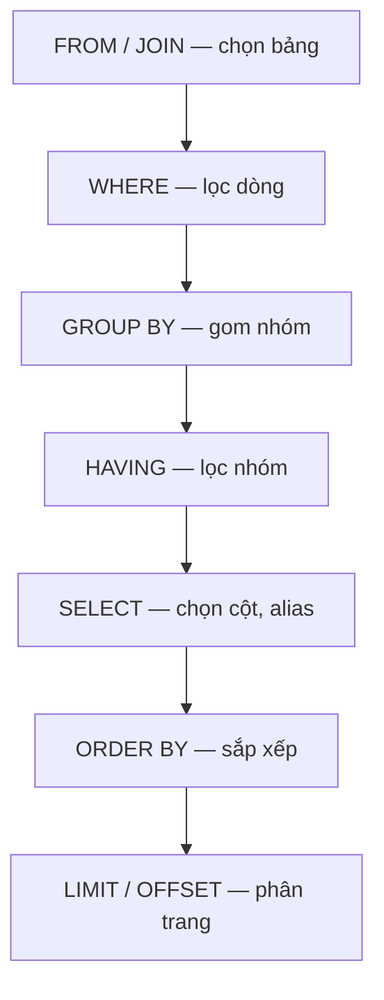

# 🎓 SELECT & WHERE — Câu lệnh SQL bạn dùng 90% thời gian

> **Tác giả:** Mr.Rom\
> **Phiên bản:** v1.1.2\
> **Tạo lúc:** 23/05/2026\
> **Cập nhật:** 10/06/2026\
> **Level:** Basic\
> **Tags:** [MUST-KNOW]\
> **Yêu cầu trước:** [SQL là gì](00_what-is-sql.md)

> 🎯 *Học **SELECT** đầy đủ: cột cụ thể vs `*`, alias, **WHERE** filter (AND/OR/NOT/IN/BETWEEN/LIKE/NULL), **ORDER BY** sort, **LIMIT/OFFSET** paginate, **DISTINCT** unique. Sau bài này bạn query 80% câu hỏi data thực tế.*

## 🎯 Sau bài này bạn sẽ

- [ ] Viết được `SELECT` với cột cụ thể (KHÔNG dùng `*` bừa bãi)
- [ ] Dùng được `AS` alias cho cột và bảng
- [ ] Filter bằng `WHERE` với 8 operator (`=`, `<>`, `<`, `>`, `IN`, `BETWEEN`, `LIKE`, `IS NULL`)
- [ ] Kết hợp điều kiện bằng `AND` / `OR` / `NOT` đúng priority
- [ ] Sort bằng `ORDER BY` (ASC/DESC, nhiều cột)
- [ ] Paginate bằng `LIMIT` + `OFFSET`
- [ ] Khử trùng lặp bằng `DISTINCT`
- [ ] Hiểu **thứ tự thực thi logic** của SQL (FROM → WHERE → ORDER → LIMIT)

---

## Tình huống — Bạn debug query "đợi 5 giây không trả về"

Bạn viết backend list user. Câu query:

```sql
SELECT * FROM users;
```

Bảng `users` đã có **2 triệu rows** (1 năm sau khi launch). Query này **đợi 5 giây** mỗi lần frontend gọi. Frontend timeout.

Senior xem code chê:
- ❌ `SELECT *` lôi hết 50 cột — frontend chỉ cần 3 cột.
- ❌ Không có `LIMIT` — trả về 2 triệu rows thì client OOM.
- ❌ Không filter — load mọi user kể cả inactive 5 năm trước.
- ❌ Không sort — hôm nay row order khác hôm qua.

Bạn ngơ:
- `SELECT *` sai gì? Nó dễ viết mà?
- `WHERE`, `ORDER BY`, `LIMIT` viết thứ tự ra sao?
- Sao `name = NULL` không hoạt động?
- Sao `name LIKE '%nguyen%'` chạy chậm?

→ Bài này dạy bạn **cách viết SELECT đúng**, **filter đầy đủ**, **tránh 5 sai lầm beginner**.

---

## 1️⃣ Bảng sample — `users` và `orders`

Dùng chung cho mọi ví dụ bài này. Bạn có thể copy chạy ở SQLite/Postgres.

```sql
CREATE TABLE users (
  id          INTEGER PRIMARY KEY,
  name        TEXT NOT NULL,
  email       TEXT UNIQUE,
  city        TEXT,
  age         INTEGER,
  status      TEXT,            -- 'active' | 'inactive'
  created_at  TEXT             -- ISO date
);

INSERT INTO users VALUES
(1, 'Nguyen Van A',  'nguyenvana@ex.com',  'Hanoi',     28, 'active',   '2025-01-15'),
(2, 'Le Van B',   'levanb@ex.com',   'Hanoi',     25, 'active',   '2025-02-20'),
(3, 'Tran Van C',  'tranvanc@ex.com',  'Saigon',    35, 'inactive', '2025-03-10'),
(4, 'Pham Van D',   'phamvand@ex.com',   'Danang',    30, 'active',   '2025-04-05'),
(5, 'Hoang Van E',  NULL,           'Saigon',    22, 'active',   '2025-05-12'),
(6, 'Vu Van F',  'vuvanf@ex.com',  'Hanoi',     40, 'inactive', '2024-12-01'),
(7, 'Bui Van G',   'buivang@ex.com',   NULL,        NULL, 'active', '2025-06-18');
```

---

## 2️⃣ SELECT cơ bản

### Syntax tổng

SELECT statement có **5 clause chính** theo thứ tự cố định — viết sai thứ tự là syntax error. Dù query 1 dòng hay 100 dòng, structure đều tuân theo skeleton dưới:

```sql
SELECT <columns>
FROM   <table>
WHERE  <condition>
ORDER BY <column> [ASC | DESC]
LIMIT  <n> OFFSET <m>;
```

### Lấy tất cả cột

`SELECT *` là cách viết ngắn gọn nhất nhưng cũng là **anti-pattern phổ biến nhất** trong production code. Dễ viết, nhanh thấy data — nhưng có 3 vấn đề lớn khi scale:

```sql
SELECT * FROM users;
```

→ `*` = **mọi cột**. Tiện nhưng **3 vấn đề**:

| Vấn đề | Hậu quả |
|---|---|
| Trả về cột không cần | Tốn bandwidth, RAM, time |
| Thay đổi schema đập app | Thêm 1 cột → response struct đổi → frontend lỗi |
| Index không cover | DB phải fetch row đầy đủ (heap), chậm hơn index-only scan |

→ **Quy tắc vàng**: production code luôn liệt kê cột cụ thể.

### Lấy cột cụ thể

Production code **luôn** liệt kê cột cụ thể — code tự document được, performance tốt hơn, không vỡ khi schema đổi. Ví dụ lấy 3 cột thường dùng:

```sql
SELECT id, name, email FROM users;
```

```
id | name | email
---+------+--------------
 1 | Nguyen Van A | nguyenvana@ex.com
 2 | Le Van B  | levanb@ex.com
 3 | Tran Van C | tranvanc@ex.com
 ...
```

### Alias cột (đổi tên hiển thị)

`AS` đổi tên cột khi return — hữu ích khi join nhiều bảng có cột trùng tên, hoặc khi response API muốn key đẹp hơn schema DB. 3 cách dùng phổ biến:

```sql
SELECT
  id      AS user_id,
  name    AS full_name,
  email   AS contact_email
FROM users;
```

```
user_id | full_name | contact_email
--------+-----------+---------------
   1    | Nguyen Van A      | nguyenvana@ex.com
   ...
```

→ `AS` tuỳ chọn — `SELECT id user_id` cũng OK nhưng kém rõ ràng.

### Biểu thức + tính toán

SELECT clause không chỉ lấy cột — còn **tính toán** trực tiếp: cộng/trừ/nhân/chia số, concat string, gọi function (UPPER/LOWER/SUBSTR/DATE). Bớt phải xử lý ở app layer:

```sql
SELECT
  name,
  age,
  age + 10 AS age_in_10_years,
  UPPER(name) AS name_upper
FROM users;
```

```
name | age | age_in_10_years | name_upper
-----+-----+-----------------+-----------
Nguyen Van A |  28 |              38 | NGUYEN VAN A
Le Van B  |  25 |              35 | LE VAN B
...
```

→ `+`, `-`, `*`, `/`, `||` (concat), hàm `UPPER()`, `LOWER()`, `LENGTH()`, `SUBSTR()`, `DATE()`...

---

## 3️⃣ WHERE — Filter rows

### Comparison operators

| Op | Ý nghĩa | Ví dụ |
|---|---|---|
| `=` | Bằng | `WHERE id = 1` |
| `<>` hoặc `!=` | Khác | `WHERE status <> 'inactive'` |
| `<` `>` `<=` `>=` | So sánh | `WHERE age >= 30` |
| `BETWEEN ... AND ...` | Trong khoảng (cả 2 đầu) | `WHERE age BETWEEN 20 AND 30` |
| `IN (...)` | Trong list | `WHERE city IN ('Hanoi','Saigon')` |
| `LIKE` | Pattern match | `WHERE name LIKE 'L%'` |
| `IS NULL` / `IS NOT NULL` | NULL check | `WHERE email IS NULL` |
| `NOT` | Phủ định | `WHERE NOT (age > 30)` |

### Ví dụ — user active ở Hà Nội tuổi 25-35

```sql
SELECT name, age, city
FROM   users
WHERE  status = 'active'
  AND  city = 'Hanoi'
  AND  age BETWEEN 25 AND 35;
```

```
name | age | city
-----+-----+------
Nguyen Van A |  28 | Hanoi
Le Van B  |  25 | Hanoi
```

### `IN` thay nhiều `OR`

```sql
-- Cồng kềnh
WHERE city = 'Hanoi' OR city = 'Saigon' OR city = 'Danang'

-- Gọn
WHERE city IN ('Hanoi', 'Saigon', 'Danang')
```

### `LIKE` — pattern matching

| Pattern | Match |
|---|---|
| `'N%'` | Bắt đầu bằng N (Nguyen Van A) |
| `'%C'` | Kết thúc bằng C (Tran Van C) |
| `'%Van%'` | Chứa "Van" (cả 7 placeholder đều có "Van" ở giữa) |
| `'_e%'` | Ký tự thứ 2 là e (Le Van B) — `_` = đúng 1 ký tự |
| `'Pham%'` | Bắt đầu bằng "Pham" (Pham Van D) |

```sql
SELECT name FROM users WHERE name LIKE 'N%';
```

→ ⚠️ `LIKE '%abc%'` (wildcard đầu) **không dùng được index** → chậm trên bảng lớn. Cần full-text search (Postgres `tsvector`, Elasticsearch).

### Case-insensitive LIKE

| DB | Cách |
|---|---|
| PostgreSQL | `ILIKE '%nguyen%'` |
| SQLite | mặc định case-insensitive cho ASCII |
| MySQL | `LIKE` case-insensitive theo collation |
| Cross-DB | `LOWER(name) LIKE LOWER('%nguyen%')` |

### `IS NULL` — không phải `= NULL`!

```sql
-- ❌ SAI — luôn không trả gì (NULL không bằng NULL)
SELECT * FROM users WHERE email = NULL;

-- ✅ ĐÚNG
SELECT * FROM users WHERE email IS NULL;
SELECT * FROM users WHERE email IS NOT NULL;
```

→ Trong SQL, `NULL` là **"không biết"** — `NULL = NULL` không phải `TRUE`, mà là `NULL` (unknown). Phải dùng `IS NULL`.

### AND / OR / NOT — priority

```sql
-- Priority: NOT > AND > OR
WHERE a = 1 OR b = 2 AND c = 3
-- Tương đương:
WHERE a = 1 OR (b = 2 AND c = 3)
```

→ **Quy tắc vàng**: dùng **dấu ngoặc** rõ ràng để không nhầm:

```sql
WHERE (a = 1 OR b = 2) AND c = 3
```

---

## 4️⃣ ORDER BY — Sort

```sql
SELECT name, age FROM users
ORDER BY age;                 -- mặc định ASC (nhỏ → lớn)

ORDER BY age DESC;            -- lớn → nhỏ
```

### Sort nhiều cột

```sql
SELECT name, city, age FROM users
ORDER BY city ASC, age DESC;
```

```
name | city   | age
-----+--------+----
Pham Van D  | Danang |  30
Nguyen Van A | Hanoi  |  28        ← Hanoi sort trước Saigon
Vu Van F | Hanoi  |  40        ← cùng Hanoi, age DESC
Le Van B  | Hanoi  |  25
Hoang Van E | Saigon |  22
Tran Van C | Saigon |  35
```

### Sort theo alias / expression / số thứ tự cột

```sql
SELECT name, age * 12 AS months
FROM   users
ORDER BY months DESC;        -- Sort theo alias

ORDER BY 2 DESC;              -- Sort theo cột thứ 2 (anti-pattern, dễ vỡ)
```

→ Tránh sort theo **số thứ tự cột** — đổi `SELECT` đập sort.

### NULL trong ORDER BY

| DB | NULL default |
|---|---|
| PostgreSQL | NULL **lớn nhất** (last khi ASC, first khi DESC) |
| MySQL | NULL **nhỏ nhất** (first khi ASC) |
| SQLite | NULL **nhỏ nhất** |
| Oracle | NULL **lớn nhất** |

→ Để chắc chắn: `ORDER BY col NULLS FIRST` hoặc `NULLS LAST` (Postgres/Oracle).

---

## 5️⃣ LIMIT + OFFSET — Pagination

```sql
SELECT * FROM users
ORDER BY id
LIMIT 3;                     -- 3 row đầu
```

```sql
SELECT * FROM users
ORDER BY id
LIMIT 3 OFFSET 6;            -- Bỏ 6 row đầu, lấy 3 row kế (page 3)
```

### Pagination công thức

```
page_size = 20
page      = 3                -- page hiện tại (1-indexed)
OFFSET    = (page - 1) * page_size
          = 40
```

```sql
SELECT * FROM users
ORDER BY id
LIMIT 20 OFFSET 40;          -- Page 3
```

### ⚠️ Lưu ý OFFSET trên bảng lớn

`OFFSET 100000` = DB vẫn phải **đọc 100k row** rồi bỏ đi. Chậm dần khi page tăng.

**Giải pháp**: dùng **keyset pagination**:

```sql
-- Page tiếp theo dựa vào ID cuối cùng của page trước
SELECT * FROM users
WHERE id > 100         -- ID cuối page trước
ORDER BY id
LIMIT 20;
```

→ Index trên `id` → query luôn nhanh, không phụ thuộc page.

### MySQL/MariaDB cú pháp khác

```sql
LIMIT 40, 20             -- OFFSET 40 LIMIT 20 (cú pháp MySQL cũ)
```

→ Tránh — dùng `LIMIT ... OFFSET ...` chuẩn.

### SQL Server / Oracle

```sql
-- SQL Server (2012+):
ORDER BY id OFFSET 40 ROWS FETCH NEXT 20 ROWS ONLY;

-- Oracle 12c+:
ORDER BY id OFFSET 40 ROWS FETCH FIRST 20 ROWS ONLY;
```

---

## 6️⃣ DISTINCT — Khử trùng lặp

```sql
SELECT DISTINCT city FROM users;
```

```
city
------
Hanoi
Saigon
Danang
(NULL)         ← NULL được coi là 1 giá trị "distinct"
```

### `DISTINCT` trên nhiều cột

```sql
SELECT DISTINCT city, status FROM users;
```

→ Khử cặp `(city, status)` trùng. Khác với `SELECT DISTINCT city, COUNT(*)` (xem [bài 02 aggregations](02_aggregations.md)).

### Cạm bẫy

```sql
-- ❌ DISTINCT chỉ apply trên toàn row, không phải 1 cột
SELECT DISTINCT name, email FROM users;  -- Khử trùng (name, email)

-- ❌ Tưởng DISTINCT là function
SELECT DISTINCT(name) FROM users;        -- Vẫn OK ở SQLite/Postgres
                                          -- Nhưng `(name)` chỉ là wrap, không phải DISTINCT của 1 cột
```

---

## 7️⃣ Thứ tự thực thi logic của SQL

SQL bạn viết **theo thứ tự khác** với thứ tự DB thực thi:

```
Bạn viết:        Thực thi logic:
SELECT cols      →  6. SELECT (chọn cột)
FROM   t            1. FROM (table source)
WHERE  cond         2. WHERE (filter row)
GROUP BY g          3. GROUP BY
HAVING  hcond       4. HAVING
ORDER BY o          7. ORDER BY
LIMIT  n            8. LIMIT / OFFSET

(SELECT thực ra số 6 — SAU GROUP BY/HAVING, TRƯỚC ORDER BY/LIMIT)
```

Sơ đồ dưới vẽ lại **thứ tự DB thực thi từng clause** (khác thứ tự bạn viết). Đây chính là lý do `WHERE` không dùng được alias định nghĩa ở `SELECT` — vì `SELECT` chạy SAU `WHERE`.



Theo dòng chảy này, alias chỉ "ra đời" ở bước `SELECT` nên các clause trước đó (`WHERE`, `GROUP BY`, `HAVING`) chưa thấy được, còn `ORDER BY`/`LIMIT` đứng sau nên dùng alias thoải mái.

### Tại sao quan trọng?

```sql
-- ❌ Lỗi: alias `full_name` chưa tồn tại ở WHERE
SELECT name AS full_name FROM users WHERE full_name LIKE 'L%';

-- ✅ ĐÚNG
SELECT name AS full_name FROM users WHERE name LIKE 'L%';

-- ✅ Alias dùng được ở ORDER BY (vì sau SELECT)
SELECT name AS full_name FROM users ORDER BY full_name;
```

→ `WHERE` thực thi **trước** `SELECT` → chưa có alias. `ORDER BY` thực thi **sau** → alias OK.

---

## 8️⃣ Ví dụ thực tế — Bạn viết lại query đúng

### Bài toán

> *"Frontend cần list 20 user active sort theo thời gian đăng ký mới nhất, page hiện tại 3."*

### ❌ Trước (bạn sai)

```sql
SELECT * FROM users;
-- Trả 2 triệu rows, frontend timeout
```

### ✅ Sau (Bạn sửa)

```sql
SELECT
  id,
  name,
  email,
  city,
  created_at
FROM   users
WHERE  status = 'active'
ORDER BY created_at DESC
LIMIT  20 OFFSET 40;        -- page 3
```

→ Trả về 20 rows trong **20ms** (có index trên `created_at`).

### Với keyset pagination (production)

```sql
SELECT id, name, email, city, created_at
FROM   users
WHERE  status = 'active'
  AND  created_at < '2025-04-15T10:30:00Z'   -- giá trị cuối page trước
ORDER BY created_at DESC
LIMIT  20;
```

→ **Luôn O(log n + 20)** — không chậm dần.

---

## 💡 Cạm bẫy thường gặp & Best practice

1. **`SELECT *`** → Production code phải liệt kê cột. `*` chỉ OK cho debug/ad-hoc.
2. **`WHERE col = NULL`** → Sai. Phải `IS NULL` / `IS NOT NULL`.
3. **`LIKE '%abc%'`** → Wildcard đầu = không dùng index = chậm. Cần full-text search engine.
4. **`OFFSET 100000`** → Đọc rồi bỏ 100k row. Dùng keyset pagination cho production.
5. **Quên `ORDER BY`** → Order rows **không đảm bảo**. Mỗi lần query có thể khác. Luôn sort khi pagination.

---

## 🧠 Tự kiểm tra (Self-check)

1. Khác biệt giữa `WHERE age = NULL` và `WHERE age IS NULL`?
2. Viết query lấy 5 user **lớn tuổi nhất ở Hà Nội**, hiển thị tên + email + tuổi.
3. Vì sao `OFFSET 100000` chậm? Cách thay thế tốt hơn?
4. Thứ tự logic SQL thực thi — `WHERE` trước hay sau `SELECT`?
5. `LIKE '%nguyen%'` vs `LIKE 'Le%'` — cái nào chậm hơn? Vì sao?

<details>
<summary>Gợi ý đáp án</summary>

1. `WHERE age = NULL` luôn trả **0 row** vì SQL `NULL = NULL` không phải TRUE. `WHERE age IS NULL` chuẩn — đúng cú pháp NULL check.

2. ```sql
   SELECT name, email, age FROM users
   WHERE city = 'Hanoi'
   ORDER BY age DESC
   LIMIT 5;
   ```

3. DB vẫn phải **đọc rồi bỏ qua** 100k rows → chậm O(n). Dùng **keyset pagination** với `WHERE col > last_value ORDER BY col LIMIT N` → O(log n).

4. `WHERE` thực thi **TRƯỚC** `SELECT` (số 2 vs số 6 trong order thực thi). Vì vậy alias từ `SELECT` không dùng được trong `WHERE`.

5. `LIKE '%nguyen%'` chậm hơn vì **wildcard đầu** = không có index nào dùng được → full table scan. `LIKE 'Le%'` có thể dùng B-tree index (prefix match).
</details>

---

## ⚡ Cheatsheet

### SELECT pattern

```sql
SELECT col1, col2 AS alias
FROM   table
WHERE  condition
ORDER BY col DESC
LIMIT  20 OFFSET 40;
```

### WHERE operators

```sql
WHERE id = 1
WHERE age <> 30
WHERE age BETWEEN 25 AND 35
WHERE city IN ('Hanoi', 'Saigon')
WHERE name LIKE 'L%'
WHERE email IS NULL
WHERE NOT (status = 'inactive')
WHERE city = 'Hanoi' AND age > 25
WHERE city = 'Hanoi' OR city = 'Saigon'
```

### ORDER BY

```sql
ORDER BY age ASC
ORDER BY age DESC
ORDER BY city, age DESC
ORDER BY col NULLS LAST       -- Postgres/Oracle
```

### LIMIT/OFFSET

```sql
LIMIT 10                       -- 10 row đầu
LIMIT 10 OFFSET 20             -- 10 row sau khi bỏ 20

-- Keyset pagination (recommend)
WHERE id > 100
ORDER BY id
LIMIT 10
```

### Quick patterns

```sql
-- Distinct list
SELECT DISTINCT city FROM users;

-- 10 user mới nhất
SELECT * FROM users ORDER BY created_at DESC LIMIT 10;

-- User có email
SELECT * FROM users WHERE email IS NOT NULL;

-- Search prefix
SELECT * FROM users WHERE name LIKE 'L%';

-- Case-insensitive search (Postgres)
SELECT * FROM users WHERE name ILIKE '%nguyen%';
```

---

## 📚 Từ Điển Thuật Ngữ (Glossary)

| Thuật ngữ | Ý nghĩa |
|---|---|
| **SELECT** | Câu lệnh đọc data |
| **WHERE** | Filter rows theo điều kiện |
| **ORDER BY** | Sort rows |
| **LIMIT / OFFSET** | Pagination |
| **DISTINCT** | Khử trùng lặp |
| **AS** | Đặt alias cho cột/bảng |
| **LIKE** | Pattern match (`%`, `_`) |
| **IS NULL** | Check NULL (không phải `= NULL`) |
| **Keyset pagination** | Pagination dựa vào last value (thay vì OFFSET) — nhanh O(log n) |
| **Full table scan** | DB đọc tất cả rows — chậm O(n) |
| **Index** | Cấu trúc giúp query nhanh (B-tree, hash) — chi tiết ở [bài 05](05_schema-design-basics.md) |

---

## 🔗 Liên kết & Tài nguyên

### 🧭 Định hướng lộ trình học
- ⬅️ **Bài trước:** [SQL là gì? — Ngôn ngữ chung của database](00_what-is-sql.md)
- ➡️ **Bài tiếp theo:** [Aggregations — COUNT, SUM, AVG & GROUP BY](02_aggregations.md)
- ↑ **Về cụm:** [sql-fundamentals README](../../README.md)

### 🌐 Tài nguyên tham khảo khác
- 📖 [SQLBolt — Lesson 1-5](https://sqlbolt.com/) — interactive WHERE/ORDER BY/LIMIT
- 📖 [Use The Index, Luke!](https://use-the-index-luke.com/) — vì sao `LIKE '%x%'` chậm
- 📖 [Keyset pagination — Markus Winand](https://use-the-index-luke.com/no-offset)
- 📖 [PostgreSQL: SELECT docs](https://www.postgresql.org/docs/current/sql-select.html)

---

> 🎯 *Sau bài này bạn viết được 80% query data thực tế. Bài kế tiếp dạy **aggregations** — `COUNT`, `SUM`, `AVG`, `GROUP BY` — để trả lời câu hỏi "có bao nhiêu user mỗi thành phố?".*

---

## 📌 Nhật ký thay đổi (Changelog)

- **v1.0.0 (23/05/2026)** — Bản đầu tiên. Cluster `sql-fundamentals/` lesson 2/6. Cover: SELECT đầy đủ (cột cụ thể vs *, alias) + WHERE 8 operator + AND/OR/NOT priority + ORDER BY multi-column + LIMIT/OFFSET pagination + DISTINCT + LIKE pattern + thứ tự thực thi logical SQL.
- **v1.1.0 (25/05/2026)** — Thêm lead-in 2-3 câu trước §2 Syntax tổng + Lấy tất cả cột + Lấy cột cụ thể + Alias + Biểu thức tính toán. Chuẩn hoá tên + email trong ví dụ.
- **v1.1.1 (10/06/2026)** — Sửa bảng ví dụ `LIKE`: pattern và tên placeholder không khớp sau đợt đổi tên (vd `'D____'` chú thích "Pham Van D"). Viết lại 5 pattern khớp đúng dữ liệu (`N%`/`%C`/`%Van%`/`_e%`/`Pham%`).
- **v1.1.2 (10/06/2026)** — Bổ sung sơ đồ thứ tự thực thi logic SELECT cho trực quan.
