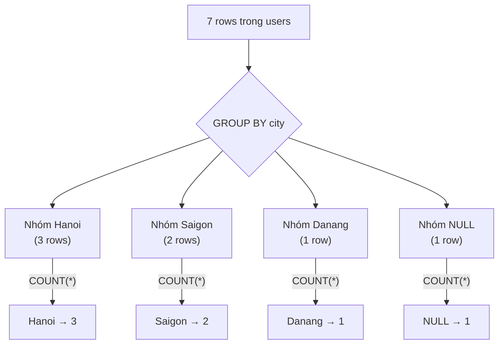

# 🎓 Aggregations — COUNT, SUM, AVG & GROUP BY

> **Tác giả:** Mr.Rom\
> **Phiên bản:** v1.1.2\
> **Tạo lúc:** 23/05/2026\
> **Cập nhật:** 13/06/2026\
> **Level:** Basic\
> **Tags:** [MUST-KNOW]\
> **Yêu cầu trước:** [SELECT & Filter](01_select-and-filter.md)

> 🎯 *Học **5 hàm aggregation** (COUNT/SUM/AVG/MIN/MAX), **GROUP BY** chia nhóm, **HAVING** filter sau GROUP, và phân biệt **WHERE vs HAVING** (lỗi #1 của beginner). Sau bài này bạn trả lời được mọi câu hỏi thống kê data.*

## 🎯 Sau bài này bạn sẽ

- [ ] Dùng 5 hàm aggregation: `COUNT`, `SUM`, `AVG`, `MIN`, `MAX`
- [ ] Hiểu `COUNT(*)` vs `COUNT(col)` vs `COUNT(DISTINCT col)`
- [ ] Chia nhóm bằng `GROUP BY` (1 cột, nhiều cột)
- [ ] Filter aggregation bằng `HAVING`
- [ ] Phân biệt **WHERE vs HAVING** (timing thực thi)
- [ ] Tránh **lỗi non-aggregated column** (chỉ chọn cột trong GROUP BY hoặc aggregation)
- [ ] Kết hợp aggregation với ORDER BY + LIMIT để rank top-N

---

## Tình huống — Sếp hỏi "tháng này có bao nhiêu user mỗi thành phố?"

Bạn nhận yêu cầu:

> *"Cho tôi biết: trong tháng 5/2025, mỗi **city** có bao nhiêu user **active** đăng ký? Sort theo số user giảm dần. Chỉ show city có ≥ 2 user."*

Bạn thử:

```sql
SELECT city, name FROM users WHERE status = 'active';
```

→ Ra list user, không phải **số đếm**. Sếp lắc đầu.

Bạn thử nữa:

```sql
SELECT city, COUNT(*) FROM users WHERE status = 'active';
```

→ DB báo lỗi: `column "city" must appear in GROUP BY clause`.

Bạn ngơ:
- **`COUNT`** dùng sao cho đúng?
- **`GROUP BY`** là gì? Sao bắt buộc?
- Sao có `WHERE` lại còn `HAVING`?
- Sort sao theo "số user" mà cột đó không có tên?

→ Bài này dạy bạn **aggregation** đầy đủ.

---

## 1️⃣ 5 hàm aggregation cơ bản

Dùng bảng `users` từ [bài 01](01_select-and-filter.md):

| Hàm | Mục đích | Bỏ qua NULL? |
|---|---|---|
| `COUNT(*)` | Đếm tất cả rows | Không (đếm cả NULL) |
| `COUNT(col)` | Đếm rows có giá trị non-NULL ở `col` | ✅ Bỏ NULL |
| `COUNT(DISTINCT col)` | Đếm giá trị unique non-NULL | ✅ Bỏ NULL |
| `SUM(col)` | Tổng (chỉ với số) | ✅ Bỏ NULL |
| `AVG(col)` | Trung bình (chỉ với số) | ✅ Bỏ NULL |
| `MIN(col)` | Giá trị nhỏ nhất | ✅ Bỏ NULL |
| `MAX(col)` | Giá trị lớn nhất | ✅ Bỏ NULL |

### Ví dụ — toàn bộ bảng

Aggregation function chạy trên **toàn bộ table** (không có GROUP BY) sẽ thu gọn N rows thành **1 row** kết quả. Ví dụ dưới chạy 7 phép thống kê cùng lúc — đây là pattern dashboard "tổng quan":

```sql
SELECT
  COUNT(*)              AS total_users,           -- 7
  COUNT(email)          AS users_with_email,      -- 6 (Hoang Van E NULL email)
  COUNT(DISTINCT city)  AS unique_cities,         -- 3 (Hanoi/Saigon/Danang)
  SUM(age)              AS total_age,             -- 180
  AVG(age)              AS avg_age,               -- 30.0
  MIN(age)              AS youngest,              -- 22
  MAX(age)              AS oldest                 -- 40
FROM users;
```

```
total_users | users_with_email | unique_cities | total_age | avg_age | youngest | oldest
------------+------------------+---------------+-----------+---------+----------+--------
          7 |                6 |             3 |       180 |    30.0 |       22 |     40
```

### `COUNT(*)` vs `COUNT(col)` vs `COUNT(1)`

3 cách viết `COUNT` cho ra **kết quả khác nhau** (vì NULL handling) — đây là câu hỏi interview kinh điển. So sánh chi tiết:

| Cách | Đếm gì | Tốc độ |
|---|---|---|
| `COUNT(*)` | Tất cả rows | Nhanh nhất (Postgres optimize riêng) |
| `COUNT(1)` | Tất cả rows (`1` non-NULL) | Bằng `COUNT(*)` |
| `COUNT(col)` | Rows có `col IS NOT NULL` | Hơi chậm hơn (phải check NULL) |
| `COUNT(DISTINCT col)` | Giá trị unique | Chậm nhất (cần sort/hash) |

→ **Quy tắc**: muốn đếm row → `COUNT(*)`. Muốn đếm "user có email" → `COUNT(email)`. Muốn đếm "số city unique" → `COUNT(DISTINCT city)`.

---

## 2️⃣ GROUP BY — chia nhóm

`GROUP BY` chia rows thành **nhóm theo cột** rồi apply aggregation cho từng nhóm. Đây là cách trả lời câu hỏi "có bao nhiêu user mỗi thành phố?", "doanh thu mỗi tháng?":

```sql
SELECT city, COUNT(*) AS user_count
FROM   users
GROUP BY city;
```

```
city   | user_count
-------+-----------
Hanoi  |          3
Saigon |          2
Danang |          1
(NULL) |          1    ← Bui Van G city NULL — group thành nhóm riêng
```

→ DB chia rows thành **nhóm** theo `city`, mỗi nhóm tính `COUNT(*)`.

Sơ đồ dưới minh hoạ cơ chế GROUP BY: 7 rows được gom thành nhóm theo `city`, rồi aggregation áp lên **từng nhóm** để ra đúng 1 dòng/nhóm:



→ Mỗi nhóm thu gọn thành **đúng 1 dòng** kết quả — vì vậy cột nào không nằm trong GROUP BY thì bắt buộc phải bọc aggregation (quy tắc vàng bên dưới).

### Group by nhiều cột

Khi liệt kê nhiều cột trong `GROUP BY`, DB chia rows thành **nhóm theo combination** của tất cả cột. Vd `(city, status)` tạo ra 6 nhóm (Hanoi active, Hanoi inactive, Saigon active, ...):

```sql
SELECT city, status, COUNT(*) AS cnt
FROM   users
GROUP BY city, status;
```

```
city   | status   | cnt
-------+----------+----
Hanoi  | active   |   2     ← Nguyen Van A, Le Van B
Hanoi  | inactive |   1     ← Vu Van F
Saigon | active   |   1     ← Hoang Van E
Saigon | inactive |   1     ← Tran Van C
Danang | active   |   1     ← Pham Van D
(NULL) | active   |   1     ← Bui Van G
```

→ Mỗi cặp `(city, status)` thành 1 nhóm.

### Quy tắc vàng — non-aggregated column

Quy tắc đặc biệt quan trọng — vi phạm sẽ ra **lỗi syntax** ngay lập tức. Cột trong `SELECT` mà **không bọc aggregation** thì **bắt buộc** phải có trong `GROUP BY`:

```sql
-- ❌ SAI
SELECT city, name, COUNT(*) FROM users GROUP BY city;
--           ^^^^ name không trong GROUP BY và không aggregate → lỗi
```

> **Quy tắc**: cột xuất hiện trong `SELECT` (mà không bọc trong `COUNT/SUM/...`) **bắt buộc** phải có trong `GROUP BY`.

```sql
-- ✅ ĐÚNG (cách 1) — thêm vào GROUP BY
SELECT city, name, COUNT(*) FROM users GROUP BY city, name;

-- ✅ ĐÚNG (cách 2) — aggregate name
SELECT city, MAX(name) AS sample_name, COUNT(*) FROM users GROUP BY city;
```

> 💡 **MySQL ngoại lệ**: trước 5.7, MySQL cho phép select cột không trong GROUP BY — trả random value. Từ 5.7 default strict mode bật, sẽ báo lỗi. Đừng tin "MySQL nice", spec SQL chuẩn cấm.

---

## 3️⃣ HAVING — filter SAU khi GROUP BY

`WHERE` filter **rows trước GROUP**. `HAVING` filter **nhóm sau GROUP**.

```sql
SELECT city, COUNT(*) AS cnt
FROM   users
WHERE  status = 'active'        -- Filter rows: chỉ user active
GROUP BY city
HAVING COUNT(*) >= 2;            -- Filter nhóm: chỉ city có ≥ 2 user active
```

```
city  | cnt
------+----
Hanoi |   2
```

→ Giải đúng bài toán của sếp.

### Thứ tự thực thi (cập nhật từ [bài 01](01_select-and-filter.md))

```
1. FROM
2. WHERE      ← filter rows (chưa biết group)
3. GROUP BY   ← chia nhóm
4. HAVING     ← filter nhóm
5. SELECT     ← chọn cột (alias xuất hiện ở đây)
6. ORDER BY
7. LIMIT
```

→ `WHERE` không dùng aggregation function được (chưa group). `HAVING` dùng aggregation được (đã group).

### Quy tắc khi nào WHERE, khi nào HAVING

| Filter cái gì | Dùng |
|---|---|
| Giá trị **của row** | `WHERE` |
| Giá trị **của aggregation** (COUNT, SUM, AVG) | `HAVING` |
| Cả 2 | `WHERE ... GROUP BY ... HAVING ...` |

### Ví dụ kết hợp

```sql
SELECT
  city,
  COUNT(*)      AS total,
  AVG(age)      AS avg_age,
  MAX(age)      AS oldest
FROM   users
WHERE  status = 'active'                -- 1. filter user active
GROUP BY city                            -- 2. group theo city
HAVING COUNT(*) >= 2                     -- 3. chỉ city ≥ 2 user
   AND AVG(age) < 30                     -- 4. avg age < 30
ORDER BY total DESC                      -- 5. sort
LIMIT 10;                                -- 6. top 10
```

---

## 4️⃣ Aggregation với DATE — group theo tháng/năm

### Sample bảng `orders`

```sql
CREATE TABLE orders (
  id          INTEGER PRIMARY KEY,
  user_id     INTEGER,
  amount      INTEGER,
  status      TEXT,
  created_at  TEXT             -- ISO date
);

INSERT INTO orders VALUES
(1, 1, 250000, 'paid',     '2025-05-01'),
(2, 1, 380000, 'paid',     '2025-05-15'),
(3, 2, 150000, 'paid',     '2025-05-20'),
(4, 2, 500000, 'cancelled','2025-04-25'),
(5, 3, 120000, 'paid',     '2025-06-01'),
(6, 4, 600000, 'paid',     '2025-06-10'),
(7, 4, 800000, 'paid',     '2025-06-22');
```

### Group theo tháng

**PostgreSQL:**
```sql
SELECT
  DATE_TRUNC('month', created_at::timestamp) AS month,
  COUNT(*)    AS orders_count,
  SUM(amount) AS revenue
FROM   orders
WHERE  status = 'paid'
GROUP BY month
ORDER BY month;
```

**SQLite:**
```sql
SELECT
  strftime('%Y-%m', created_at) AS month,
  COUNT(*)    AS orders_count,
  SUM(amount) AS revenue
FROM   orders
WHERE  status = 'paid'
GROUP BY month
ORDER BY month;
```

**MySQL:**
```sql
SELECT
  DATE_FORMAT(created_at, '%Y-%m') AS month,
  COUNT(*)    AS orders_count,
  SUM(amount) AS revenue
FROM   orders
WHERE  status = 'paid'
GROUP BY month
ORDER BY month;
```

```
month   | orders_count | revenue
--------+--------------+--------
2025-05 |            3 |  780000
2025-06 |            3 | 1520000
```

→ Date functions khác giữa DB. Postgres mạnh nhất (`DATE_TRUNC`, `EXTRACT`).

---

## 5️⃣ Top-N pattern — "5 user mua nhiều nhất"

```sql
SELECT
  user_id,
  COUNT(*)    AS orders,
  SUM(amount) AS total_spent
FROM   orders
WHERE  status = 'paid'
GROUP BY user_id
ORDER BY total_spent DESC
LIMIT 5;
```

```
user_id | orders | total_spent
--------+--------+-------------
      4 |      2 |     1400000
      1 |      2 |      630000
      2 |      1 |      150000
      3 |      1 |      120000
```

→ Pattern này dùng cực nhiều: top sản phẩm bán chạy, top user spend, top city revenue, top page view...

---

## 6️⃣ Aggregation với CASE — conditional count

Muốn đếm "user active + user inactive" trong **1 row**?

```sql
SELECT
  COUNT(*)                                              AS total,
  SUM(CASE WHEN status = 'active'   THEN 1 ELSE 0 END)  AS active_count,
  SUM(CASE WHEN status = 'inactive' THEN 1 ELSE 0 END)  AS inactive_count,
  COUNT(CASE WHEN status = 'active'   THEN 1 END)       AS active_v2
  -- COUNT bỏ qua NULL → CASE không match trả NULL → đếm chỉ active
FROM users;
```

```
total | active_count | inactive_count | active_v2
------+--------------+----------------+----------
    7 |            5 |              2 |        5
```

→ Pattern "pivot" — mọi data analyst dùng hàng ngày.

### Postgres-only: `FILTER` syntax đẹp hơn

```sql
SELECT
  COUNT(*)                                  AS total,
  COUNT(*) FILTER (WHERE status = 'active') AS active_count,
  COUNT(*) FILTER (WHERE status = 'inactive') AS inactive_count
FROM users;
```

→ Sạch hơn `CASE WHEN`. Chỉ Postgres + SQLite 3.30+.

---

## 7️⃣ Combine WHERE + GROUP + HAVING + ORDER + LIMIT — full example

> *"Top 3 city có ≥ 2 user paid order, sort theo revenue tháng 5/2025 giảm dần."*

```sql
SELECT
  u.city,
  COUNT(DISTINCT u.id) AS users,
  COUNT(o.id)          AS orders,
  SUM(o.amount)        AS revenue
FROM       users  u
INNER JOIN orders o ON o.user_id = u.id
WHERE  o.status = 'paid'
   AND o.created_at >= '2025-05-01'
   AND o.created_at <  '2025-06-01'
GROUP BY u.city
HAVING COUNT(DISTINCT u.id) >= 2
ORDER BY revenue DESC
LIMIT 3;
```

→ JOIN học chi tiết ở [bài 03](03_joins.md). Đây là preview để bạn thấy mảnh ghép.

---

## 💡 Cạm bẫy thường gặp & Best practice

1. **Select cột không trong GROUP BY và không aggregate** → SQL chuẩn cấm. MySQL từ 5.7 cũng cấm. Phải thêm vào GROUP BY hoặc aggregate.
2. **Dùng `WHERE COUNT(*) > 5`** → Sai. `WHERE` chạy trước GROUP, không biết COUNT. Dùng `HAVING`.
3. **`SUM(col)` khi col có NULL** → NULL bị bỏ qua tự động. Kết quả đúng nhưng đừng giả định `SUM = 0` khi all NULL — sẽ là **NULL**, không phải 0. Dùng `COALESCE(SUM(col), 0)`.
4. **Chia số nguyên cho số nguyên ra số nguyên** → trong Postgres `SUM(age)/COUNT(*)` = integer/integer = **integer** (cắt phần thập phân), vd `61/2 = 30` thay vì `30.5`. Phải cast: `SUM(age)::numeric / COUNT(*)`. Lưu ý: `AVG(age)` thì **KHÔNG** bị — Postgres trả `numeric` (30.5) dù cột là integer.
5. **`COUNT(col)` mà tưởng đếm row** → `COUNT(col)` bỏ qua NULL. Nếu cột có NULL → ra số nhỏ hơn `COUNT(*)`. Cẩn thận khi report.

---

## 🧠 Tự kiểm tra (Self-check)

1. Phân biệt `COUNT(*)`, `COUNT(col)`, `COUNT(DISTINCT col)`. Khi nào dùng cái nào?
2. Vì sao `WHERE COUNT(*) > 5` báo lỗi? Cách fix?
3. `SUM(age)` nếu cột `age` có 3 NULL trong 10 row → kết quả tính trên mấy giá trị?
4. Viết query: trung bình tuổi user theo mỗi `(city, status)`, chỉ show nhóm có ≥ 2 user.
5. Vì sao SQL chuẩn cấm select cột không trong GROUP BY?

<details>
<summary>Gợi ý đáp án</summary>

1. **`COUNT(*)`** = số row. **`COUNT(col)`** = số row có `col` non-NULL. **`COUNT(DISTINCT col)`** = số giá trị unique non-NULL. Đếm row → `*`. Đếm "có giá trị" → `col`. Đếm unique → `DISTINCT`.

2. `WHERE` chạy **trước GROUP BY** → chưa biết COUNT là gì → báo lỗi. Dùng `HAVING COUNT(*) > 5` (sau GROUP).

3. Tính trên **7 giá trị** non-NULL. NULL bỏ qua tự động. Nếu muốn coi NULL = 0: `SUM(COALESCE(age, 0))`.

4. ```sql
   SELECT city, status, AVG(age) AS avg_age
   FROM   users
   GROUP BY city, status
   HAVING COUNT(*) >= 2;
   ```

5. Vì kết quả **không xác định** — group có nhiều row nhưng mỗi non-aggregated cột có **nhiều giá trị**. SQL không biết chọn cái nào → trả random. Postgres/Oracle ném lỗi. MySQL cũ trả random.
</details>

---

## ⚡ Tra cứu nhanh (Cheatsheet)

### Aggregation functions

```sql
COUNT(*)               -- Số row
COUNT(col)             -- Số row có col non-NULL
COUNT(DISTINCT col)    -- Số giá trị unique
SUM(col)               -- Tổng
AVG(col)               -- Trung bình
MIN(col) / MAX(col)    -- Min / Max
```

### Pattern toàn diện

```sql
SELECT
  group_col,
  COUNT(*) AS cnt,
  AVG(num) AS avg_num
FROM   table
WHERE  row_filter
GROUP BY group_col
HAVING COUNT(*) >= threshold
ORDER BY cnt DESC
LIMIT 10;
```

### WHERE vs HAVING

| Filter | Dùng | Lý do |
|---|---|---|
| `age > 30` | WHERE | filter row |
| `status = 'active'` | WHERE | filter row |
| `COUNT(*) >= 5` | HAVING | filter group |
| `AVG(amount) > 100k` | HAVING | filter group |

### Conditional count (Postgres)

```sql
SELECT
  COUNT(*) FILTER (WHERE status = 'paid') AS paid_count,
  SUM(amount) FILTER (WHERE status = 'paid') AS paid_revenue
FROM orders;
```

### Conditional count (cross-DB)

```sql
SELECT
  SUM(CASE WHEN status = 'paid' THEN 1 ELSE 0 END) AS paid_count,
  SUM(CASE WHEN status = 'paid' THEN amount ELSE 0 END) AS paid_revenue
FROM orders;
```

---

## 📚 Từ Điển Thuật Ngữ (Glossary)

| Thuật ngữ | Ý nghĩa |
|---|---|
| **Aggregation** | Hàm tính giá trị tổng hợp từ nhiều row (COUNT, SUM, AVG, MIN, MAX) |
| **GROUP BY** | Chia rows thành nhóm theo giá trị cột |
| **HAVING** | Filter nhóm sau GROUP BY |
| **Non-aggregated column** | Cột trong SELECT không bọc trong aggregation — phải có trong GROUP BY |
| **CASE WHEN** | Conditional expression — tương đương if-else trong SQL |
| **FILTER (WHERE ...)** | Conditional aggregation syntax (Postgres + SQLite 3.30+) |
| **Top-N query** | Pattern `GROUP BY + ORDER BY agg DESC + LIMIT N` |
| **COALESCE** | Trả non-NULL đầu tiên trong list — `COALESCE(NULL, 0)` = 0 |

---

## 🔗 Liên kết & Tài nguyên

### 🧭 Định hướng lộ trình học
- ⬅️ **Bài trước:** [SELECT & WHERE — Câu lệnh SQL bạn dùng 90% thời gian](01_select-and-filter.md)
- ➡️ **Bài tiếp theo:** [JOINs — Ghép bảng để query data đầy đủ](03_joins.md)
- ↑ **Về cụm:** [sql-fundamentals README](../../README.md)

### 🌐 Tài nguyên tham khảo khác
- 📖 [SQLBolt — Lesson 9-10 (GROUP BY)](https://sqlbolt.com/lesson/select_queries_with_aggregates)
- 📖 [PostgreSQL aggregate functions](https://www.postgresql.org/docs/current/functions-aggregate.html)
- 📖 [Mode SQL — Group BY tutorial](https://mode.com/sql-tutorial/sql-group-by/)

---

> 🎯 *Sau bài này bạn trả lời được "có bao nhiêu / tổng bao nhiêu / trung bình bao nhiêu theo nhóm". Bài kế tiếp dạy **JOINs** — cách ghép 2 bảng để query "tất cả order của user X".*

---

## 📌 Nhật ký thay đổi (Changelog)

- **v1.0.0 (23/05/2026)** — Bản đầu tiên. Cluster `sql-fundamentals/` lesson 3/6. Cover: 6 aggregation function (COUNT/SUM/AVG/MIN/MAX/COUNT DISTINCT) + NULL handling + COUNT(*) vs COUNT(col) + GROUP BY single + multi-col + HAVING (filter sau aggregate) + WHERE vs HAVING distinction + execution order.
- **v1.1.0 (25/05/2026)** — Thêm lead-in 2-3 câu trước §1 Ví dụ aggregation toàn bộ bảng + COUNT(*) vs COUNT(col) + §2 GROUP BY + Group by nhiều cột + Quy tắc vàng non-aggregated. Chuẩn hoá tên trong output table. Thêm Changelog section.
- **v1.1.1 (11/06/2026)** — Bổ sung sơ đồ flow GROUP BY (rows → gom nhóm → COUNT mỗi nhóm) cho trực quan.
- **v1.1.2 (13/06/2026)** — Sửa lỗi factual cạm bẫy #4: Postgres `AVG(integer)` trả `numeric` (30.5), KHÔNG cắt — pitfall thật là phép chia số nguyên `SUM/COUNT` mới cần cast.
