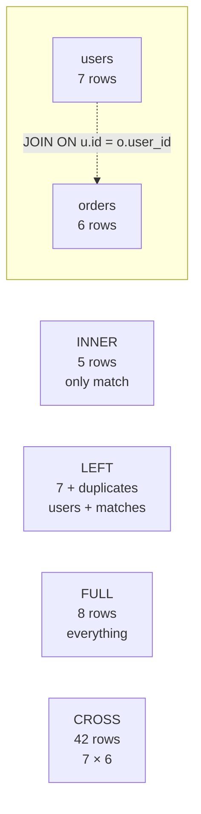

# 🎓 JOINs — Ghép bảng để query data đầy đủ

> **Tác giả:** Mr.Rom\
> **Phiên bản:** v1.1.0\
> **Tạo lúc:** 23/05/2026\
> **Cập nhật:** 25/05/2026\
> **Level:** Basic\
> **Tags:** [MUST-KNOW]\
> **Yêu cầu trước:** [SELECT & Filter](01_select-and-filter.md), [Aggregations](02_aggregations.md)

> 🎯 *Học **5 loại JOIN** (INNER/LEFT/RIGHT/FULL/CROSS), khi nào dùng cái nào, **alias bảng**, **self-join**, **3 JOIN bảng**, và 4 sai lầm phổ biến (Cartesian, ambiguous column, NULL trong LEFT JOIN). Sau bài này bạn ghép được data từ mọi schema relational.*

## 🎯 Sau bài này bạn sẽ

- [ ] Hiểu **5 loại JOIN** + vẽ được Venn diagram của từng cái
- [ ] Dùng được **INNER JOIN** (intersect) và **LEFT JOIN** (90% case)
- [ ] Phân biệt **`ON`** vs **`USING`** vs **`WHERE`** trong JOIN
- [ ] Dùng **alias bảng** (`u`, `o`) tránh lặp tên dài
- [ ] **Self-join** — ghép bảng với chính nó
- [ ] **JOIN 3+ bảng** trong 1 query
- [ ] Tránh 4 sai lầm: Cartesian, ambiguous column, NULL LEFT, JOIN trên cột không index

---

## Tình huống — Bạn muốn list "user + order của họ"

Bạn có 2 bảng: `users` và `orders`. Sếp yêu cầu:

> *"Cho tôi list: tên user + tổng tiền user đó đã mua. Sort theo total giảm dần."*

Bạn thử:

```sql
SELECT name, SUM(amount) FROM users, orders GROUP BY name;
```

→ Kết quả ra **49 rows** thay vì 7 (số user). Tổng tiền sai bét.

Bạn thử nữa:

```sql
SELECT name, SUM(amount) FROM users INNER JOIN orders;
```

→ DB báo: `missing JOIN condition`.

Bạn ngơ:
- **JOIN** là gì? Sao có nhiều loại?
- Tại sao `FROM users, orders` ra **49 rows** (7 × 7)?
- **`ON`** dùng ra sao?
- **LEFT JOIN** với **INNER JOIN** khác nhau thế nào?

→ Bài này dạy bạn **JOIN bảng đúng cách**.

---

## 1️⃣ Setup — 2 bảng để minh họa

Để demo JOIN, cần 2 bảng có **quan hệ FK** (foreign key) — `users` chứa người, `orders` chứa đơn hàng với cột `user_id` trỏ về `users.id`. Dữ liệu cố tình có **edge case** (user không order, order không user) để show rõ trade-off mỗi loại JOIN:

```sql
-- users (7 rows)
CREATE TABLE users (
  id    INTEGER PRIMARY KEY,
  name  TEXT,
  city  TEXT
);
INSERT INTO users VALUES
(1, 'Nguyen Van A',  'Hanoi'),
(2, 'Le Van B',   'Hanoi'),
(3, 'Tran Van C',  'Saigon'),
(4, 'Pham Van D',   'Danang'),
(5, 'Hoang Van E',  'Saigon'),
(6, 'Vu Van F',  'Hanoi'),
(7, 'Bui Van G',   NULL);          -- không có city

-- orders (6 rows)
CREATE TABLE orders (
  id       INTEGER PRIMARY KEY,
  user_id  INTEGER,
  amount   INTEGER
);
INSERT INTO orders VALUES
(101, 1, 250000),
(102, 1, 380000),
(103, 2, 150000),
(104, 4, 500000),
(105, 4, 600000),
(106, 99, 800000);            -- user_id 99 không có trong users
```

→ Nguyen Van A, Le Van B, Pham Van D có order. Tran Van C, Hoang Van E, Vu Van F, Bui Van G **không có**. Order 106 trỏ tới user 99 **không tồn tại** (orphan).

---

## 2️⃣ 5 loại JOIN — overview

SQL có **5 loại JOIN** chính, khác nhau ở "giữ rows nào nếu không match". Hiểu trade-off này quyết định query đúng — INNER bỏ rows không match, LEFT giữ bên trái, FULL giữ cả 2:

| JOIN | Trả về | Use case |
|---|---|---|
| **INNER JOIN** | Chỉ rows match cả 2 bên | "User CÓ order" |
| **LEFT JOIN** | Tất cả rows bảng trái + match bên phải | "Tất cả user, kèm order nếu có" |
| **RIGHT JOIN** | Tất cả rows bảng phải + match bên trái | (Ít dùng, đảo LEFT) |
| **FULL OUTER JOIN** | Tất cả rows cả 2 bên | "Mọi user và mọi order, kể cả không match" |
| **CROSS JOIN** | Cartesian — mọi cặp | "Mọi combination" (hiếm) |



### Venn diagram (tưởng tượng)

Cách dễ nhất hình dung 3 loại JOIN phổ biến: vẽ **2 hình tròn** A (users) và B (orders) — INNER chỉ là phần giao, LEFT là toàn A, FULL là cả 2:

```
       INNER JOIN              LEFT JOIN               FULL OUTER JOIN
    ┌───┐  ┌───┐            ┌───┐  ┌───┐              ┌───┐  ┌───┐
    │ A │∩ │ B │            │ A │  │ B │              │ A │  │ B │
    │  ███  │                │██████  │                │██████████│
    └───┘  └───┘            └───┘  └───┘              └───┘  └───┘
    Chỉ phần giao        Toàn A + phần giao         Toàn A + Toàn B
```

---

## 3️⃣ INNER JOIN — chỉ rows match

INNER JOIN là **loại phổ biến nhất** — ghép 2 bảng theo điều kiện ở `ON`, **chỉ giữ rows match cả 2 bên**. Rows không match (orphan record, user không order) bị **loại bỏ** khỏi kết quả:

```sql
SELECT u.name, o.id AS order_id, o.amount
FROM       users  u
INNER JOIN orders o ON o.user_id = u.id;
```

```
name | order_id | amount
-----+----------+--------
Nguyen Van A |      101 | 250000
Nguyen Van A |      102 | 380000
Le Van B  |      103 | 150000
Pham Van D  |      104 | 500000
Pham Van D  |      105 | 600000
```

→ **5 rows** — chỉ user có order. Order 106 (user 99) **bị loại** (user không match).

### `INNER JOIN` có thể viết tắt `JOIN`

Vì INNER là default, mọi DB chấp nhận `JOIN` (không có keyword) cũng tương đương `INNER JOIN`. Hai cách viết giống nhau 100% — production code thường viết tắt:

```sql
FROM users u JOIN orders o ON o.user_id = u.id
```

→ `JOIN` không có prefix = `INNER JOIN`. Production code khuyên viết rõ `INNER` cho dễ đọc.

---

## 4️⃣ LEFT JOIN — toàn bộ bảng trái

```sql
SELECT u.name, o.id AS order_id, o.amount
FROM      users  u
LEFT JOIN orders o ON o.user_id = u.id;
```

```
name | order_id | amount
-----+----------+--------
Nguyen Van A |      101 | 250000
Nguyen Van A |      102 | 380000
Le Van B  |      103 | 150000
Tran Van C |   (NULL) | (NULL)        ← user có, không order
Pham Van D  |      104 | 500000
Pham Van D  |      105 | 600000
Hoang Van E |   (NULL) | (NULL)
Vu Van F |   (NULL) | (NULL)
Bui Van G  |   (NULL) | (NULL)
```

→ **9 rows** — toàn bộ 7 user, kèm order nếu có. User không có order → cột bên phải = **NULL**.

### Use case classic — user + tổng order (kể cả không có)

```sql
SELECT u.name, COALESCE(SUM(o.amount), 0) AS total_spent
FROM      users  u
LEFT JOIN orders o ON o.user_id = u.id
GROUP BY u.id, u.name
ORDER BY total_spent DESC;
```

```
name | total_spent
-----+------------
Pham Van D  |     1100000
Nguyen Van A |      630000
Le Van B  |      150000
Tran Van C |           0      ← LEFT JOIN giữ lại, COALESCE NULL → 0
Hoang Van E |           0
Vu Van F |           0
Bui Van G  |           0
```

→ Nếu dùng `INNER JOIN` ở đây, Tran Van C/Hoang Van E/Vu Van F/Bui Van G sẽ **bị mất** khỏi list.

### LEFT JOIN với filter — pitfall #1

```sql
-- ❌ SAI: filter ở WHERE biến LEFT JOIN thành INNER
SELECT u.name, o.amount
FROM      users  u
LEFT JOIN orders o ON o.user_id = u.id
WHERE     o.amount > 200000;        -- ← loại bỏ NULL → mất user không order

-- ✅ ĐÚNG: filter ở ON
SELECT u.name, o.amount
FROM      users  u
LEFT JOIN orders o ON o.user_id = u.id AND o.amount > 200000;
```

| Cách | Hành vi |
|---|---|
| `ON ... AND o.amount > 200k` | Filter `orders` trước JOIN, vẫn giữ user không order |
| `WHERE o.amount > 200k` | Filter sau JOIN, NULL bị loại → mất user không order |

→ **Quy tắc**: filter từ **bảng phải** (trong LEFT JOIN) — đặt ở `ON`. Filter từ **bảng trái** — đặt ở `WHERE`.

---

## 5️⃣ RIGHT JOIN — ít dùng

```sql
SELECT u.name, o.id, o.amount
FROM      users  u
RIGHT JOIN orders o ON o.user_id = u.id;
```

```
name   | id  | amount
-------+-----+--------
Nguyen Van A   | 101 | 250000
Nguyen Van A   | 102 | 380000
Le Van B    | 103 | 150000
Pham Van D    | 104 | 500000
Pham Van D    | 105 | 600000
(NULL) | 106 | 800000      ← order orphan (user_id 99 không tồn tại)
```

→ **Giữ toàn bộ orders**, user NULL nếu không match.

> 💡 **Quy tắc thực tế**: viết LEFT JOIN, đảo thứ tự bảng. `A RIGHT JOIN B` = `B LEFT JOIN A` về kết quả. Code dễ đọc hơn.

---

## 6️⃣ FULL OUTER JOIN — toàn bộ 2 bên

```sql
SELECT u.name, o.id, o.amount
FROM       users  u
FULL OUTER JOIN orders o ON o.user_id = u.id;
```

```
name   | id     | amount
-------+--------+--------
Nguyen Van A   | 101    | 250000
Nguyen Van A   | 102    | 380000
Le Van B    | 103    | 150000
Tran Van C   | (NULL) | (NULL)
Pham Van D    | 104    | 500000
Pham Van D    | 105    | 600000
Hoang Van E   | (NULL) | (NULL)
Vu Van F   | (NULL) | (NULL)
Bui Van G    | (NULL) | (NULL)
(NULL) | 106    | 800000        ← orphan order
```

→ **10 rows** — mọi user + mọi order, kèm NULL khi không match.

### ⚠️ MySQL không support FULL OUTER JOIN

Workaround: `LEFT JOIN UNION RIGHT JOIN`. Hoặc switch sang Postgres.

### Use case FULL JOIN

- Reconcile 2 nguồn data (master vs replica).
- Audit "ai missing ở đâu" (Postgres users vs Auth0 users).

---

## 7️⃣ CROSS JOIN — Cartesian product

```sql
SELECT u.name, o.id
FROM      users  u
CROSS JOIN orders o;
```

→ **7 × 6 = 42 rows** — mọi cặp (user, order). **Không có `ON`**.

### Khi nào dùng?

| Use case | Ví dụ |
|---|---|
| Generate calendar | `CROSS JOIN generate_series(2025-01-01, 2025-12-31)` × `categories` |
| Test data combinations | Mọi (color, size) cho 1 product |
| Pivot helper | (xem [bài 02 §6](02_aggregations.md#6️⃣-aggregation-với-case--conditional-count)) |

### Nguy hiểm

```sql
-- ❌ Quên ON → comma syntax = CROSS JOIN ngầm
SELECT * FROM users, orders;
-- = SELECT * FROM users CROSS JOIN orders;
-- = 42 rows (with example data)
-- Trong production: 1M user × 10M order = 10 nghìn tỷ rows → DB crash
```

→ Bạn sai ở §tình huống vì viết `FROM users, orders` không có `WHERE u.id = o.user_id`. Modern code **luôn dùng `JOIN ... ON`** rõ ràng.

---

## 8️⃣ Alias bảng — ngắn gọn, tránh lặp

```sql
-- ❌ Dài, lặp
SELECT users.name, orders.amount
FROM   users
INNER JOIN orders ON orders.user_id = users.id;

-- ✅ Alias
SELECT u.name, o.amount
FROM   users  u
INNER JOIN orders o ON o.user_id = u.id;

-- ✅ Alias với AS (verbose)
SELECT u.name, o.amount
FROM   users  AS u
INNER JOIN orders AS o ON o.user_id = u.id;
```

→ Alias bắt buộc khi:
- Cùng tên cột ở 2 bảng (`id`, `name`, `created_at`) — phải prefix.
- Self-join (xem §10).

---

## 9️⃣ `ON` vs `USING` vs `WHERE`

```sql
-- Truyền thống: ON
INNER JOIN orders o ON o.user_id = u.id

-- Postgres/MySQL/SQLite: USING (khi tên cột giống nhau)
INNER JOIN orders USING (user_id)
-- Hoạt động nếu cả 2 bảng có cột tên user_id

-- Comma + WHERE (cũ, tránh dùng)
FROM users u, orders o WHERE o.user_id = u.id
```

| Cú pháp | Pros | Cons |
|---|---|---|
| `ON ...` | Rõ ràng, mọi điều kiện được | Verbose |
| `USING (col)` | Gọn, không cần prefix `col` | Chỉ work khi tên cột giống |
| Comma + WHERE | Cũ, ngắn | Dễ quên ON → Cartesian |

→ **Production code dùng `JOIN ... ON ...`** — chuẩn nhất.

---

## 🔟 Self-join — bảng tự nối với chính nó

### Use case 1 — phân cấp (manager)

```sql
CREATE TABLE employees (
  id        INTEGER,
  name      TEXT,
  manager_id INTEGER       -- trỏ về employees.id
);
INSERT INTO employees VALUES
(1, 'CEO',     NULL),
(2, 'Nguyen Van A',    1),
(3, 'Le Van B',     1),
(4, 'Tran Van C',    2);

-- "Mỗi nhân viên có manager là ai?"
SELECT e.name AS employee, m.name AS manager
FROM      employees e
LEFT JOIN employees m ON m.id = e.manager_id;
```

```
employee | manager
---------+--------
CEO      | (NULL)
Nguyen Van A     | CEO
Le Van B      | CEO
Tran Van C     | Nguyen Van A
```

→ Cùng bảng nhưng alias 2 lần (`e`, `m`).

### Use case 2 — "user nào cùng city"

```sql
SELECT a.name AS user_a, b.name AS user_b, a.city
FROM      users  a
INNER JOIN users b ON b.city = a.city AND b.id > a.id;
```

```
user_a | user_b | city
-------+--------+-----
Nguyen Van A   | Le Van B    | Hanoi
Nguyen Van A   | Vu Van F   | Hanoi
Le Van B    | Vu Van F   | Hanoi
Tran Van C   | Hoang Van E   | Saigon
```

→ `b.id > a.id` để tránh `(Nguyen Van A, Le Van B)` và `(Le Van B, Nguyen Van A)` cả 2 xuất hiện.

---

## 1️⃣1️⃣ JOIN 3+ bảng

```sql
CREATE TABLE products (
  id   INTEGER PRIMARY KEY,
  name TEXT,
  price INTEGER
);
INSERT INTO products VALUES (1, 'iPhone', 25000000), (2, 'AirPods', 5000000);

CREATE TABLE order_items (
  order_id   INTEGER,
  product_id INTEGER,
  qty        INTEGER
);
INSERT INTO order_items VALUES
(101, 1, 1),
(101, 2, 2),
(102, 1, 1);

-- "Mỗi user mua product gì?"
SELECT u.name AS user_name, p.name AS product, oi.qty
FROM       users        u
INNER JOIN orders       o   ON o.user_id    = u.id
INNER JOIN order_items  oi  ON oi.order_id  = o.id
INNER JOIN products     p   ON p.id         = oi.product_id;
```

```
user_name | product | qty
----------+---------+----
Nguyen Van A      | iPhone  |   1
Nguyen Van A      | AirPods |   2
Nguyen Van A      | iPhone  |   1
```

→ Chuỗi JOIN: `users → orders → order_items → products`. Mỗi `JOIN ... ON` mở 1 bước.

### Tip — vẽ ERD trên giấy trước

Khi schema có 5+ bảng, vẽ relationship trên giấy → biết JOIN nào cần. Không vẽ → JOIN sai → kết quả sai mà không biết.

---

## 1️⃣2️⃣ Aggregation + JOIN — pattern thông dụng

```sql
-- Top 3 user spend nhiều nhất tháng 5
SELECT
  u.name,
  COUNT(o.id)   AS orders,
  SUM(o.amount) AS total
FROM       users  u
INNER JOIN orders o ON o.user_id = u.id
-- WHERE o.created_at >= '2025-05-01' ...
GROUP BY u.id, u.name
ORDER BY total DESC
LIMIT 3;
```

→ Pattern này dùng cực nhiều: dashboard, report, leaderboard.

---

## ⚠️ 4 sai lầm phổ biến

### Sai lầm 1 — Cartesian product (quên ON)

```sql
-- ❌ 1M × 1M = 10^12 rows → DB chết
SELECT * FROM users, orders;
```

→ **Luôn dùng `JOIN ... ON ...`** rõ ràng, không dùng comma.

### Sai lầm 2 — Ambiguous column

```sql
-- ❌ id không rõ là users.id hay orders.id
SELECT id, name FROM users JOIN orders ON ...;

-- ✅ Prefix
SELECT u.id, u.name FROM users u JOIN orders o ON ...;
```

### Sai lầm 3 — Filter biến LEFT JOIN thành INNER

```sql
-- ❌ WHERE o.amount > 100 loại bỏ NULL → mất user không order
LEFT JOIN orders o ON o.user_id = u.id WHERE o.amount > 100;

-- ✅ Filter trong ON
LEFT JOIN orders o ON o.user_id = u.id AND o.amount > 100;

-- Hoặc nếu filter từ trái:
LEFT JOIN orders o ON o.user_id = u.id WHERE u.status = 'active';   -- OK
```

### Sai lầm 4 — JOIN trên cột không index

```sql
-- ❌ orders.user_id không có index → JOIN chậm O(n × m)
SELECT * FROM users u JOIN orders o ON o.user_id = u.id;
```

→ Tạo index: `CREATE INDEX idx_orders_user_id ON orders(user_id);` → query nhanh hơn 100-1000x. Chi tiết [bài 05](05_schema-design-basics.md).

---

## 🧠 Tự kiểm tra (Self-check)

1. Khác biệt giữa `INNER JOIN` và `LEFT JOIN`?
2. Vì sao `FROM users, orders` (không ON) ra Cartesian product?
3. Lỗi: `LEFT JOIN orders ON ... WHERE orders.amount > 100` — kết quả mất gì?
4. Tại sao production code dùng alias `u`, `o` thay vì `users`, `orders`?
5. Viết query: "user nào KHÔNG có order nào".

<details>
<summary>Gợi ý đáp án</summary>

1. **INNER JOIN** chỉ trả row có match cả 2 bên. **LEFT JOIN** trả tất cả bảng trái + NULL ở bảng phải nếu không match.

2. Comma không có ON = JOIN không điều kiện = `CROSS JOIN`. Mọi cặp (user, order) = 7 × 6 = 42 rows.

3. Mất **user không có order** — `o.amount` của họ là NULL, `NULL > 100` không TRUE, bị loại bỏ. LEFT JOIN biến thành INNER JOIN. Fix: chuyển `o.amount > 100` vào `ON`.

4. Vì JOIN nhiều bảng có cùng tên cột (`id`, `name`, `created_at`) → phải prefix. Alias ngắn dễ đọc, ít typo.

5. ```sql
   SELECT u.name FROM users u
   LEFT JOIN orders o ON o.user_id = u.id
   WHERE o.id IS NULL;
   ```
   Hoặc:
   ```sql
   SELECT name FROM users WHERE id NOT IN (SELECT user_id FROM orders);
   ```
</details>

---

## ⚡ Cheatsheet

### 5 loại JOIN

| Cú pháp | Mô tả |
|---|---|
| `A INNER JOIN B ON ...` | Match cả 2 |
| `A LEFT JOIN B ON ...` | Toàn A + match B |
| `A RIGHT JOIN B ON ...` | Toàn B + match A (đảo LEFT) |
| `A FULL OUTER JOIN B ON ...` | Toàn A + toàn B |
| `A CROSS JOIN B` | Cartesian (mọi cặp) |

### Pattern thường dùng

```sql
-- "List user và data liên quan, kể cả không có"
SELECT u.*, o.*
FROM      users u
LEFT JOIN orders o ON o.user_id = u.id;

-- "Aggregate per user"
SELECT u.name, COUNT(o.id), SUM(o.amount)
FROM      users  u
LEFT JOIN orders o ON o.user_id = u.id
GROUP BY u.id, u.name;

-- "User không có order"
SELECT u.* FROM users u
LEFT JOIN orders o ON o.user_id = u.id
WHERE o.id IS NULL;

-- "Self-join phân cấp"
SELECT e.name, m.name AS manager
FROM      employees e
LEFT JOIN employees m ON m.id = e.manager_id;

-- "Chain 3 bảng"
FROM       a
INNER JOIN b ON b.a_id = a.id
INNER JOIN c ON c.b_id = b.id
```

### Filter đúng chỗ trong LEFT JOIN

```sql
-- Filter bảng PHẢI → ON
LEFT JOIN orders o ON o.user_id = u.id AND o.status = 'paid'

-- Filter bảng TRÁI → WHERE
LEFT JOIN orders o ON o.user_id = u.id
WHERE u.status = 'active'
```

---

## 📚 Từ Điển Thuật Ngữ (Glossary)

| Thuật ngữ | Ý nghĩa |
|---|---|
| **JOIN** | Câu lệnh ghép 2 bảng theo điều kiện |
| **INNER JOIN** | Chỉ rows match cả 2 |
| **LEFT JOIN** | Toàn bộ bảng trái + match phải |
| **RIGHT JOIN** | Toàn bộ bảng phải + match trái |
| **FULL OUTER JOIN** | Toàn bộ cả 2 |
| **CROSS JOIN** | Cartesian — mọi cặp |
| **ON** | Điều kiện JOIN |
| **USING** | Cú pháp ngắn cho JOIN khi tên cột giống |
| **Alias** | Tên tắt cho bảng (`u`, `o`) |
| **Self-join** | Bảng nối với chính nó |
| **Cartesian product** | Mọi cặp — 7 × 6 = 42 rows |
| **Ambiguous column** | Cột trùng tên ở 2 bảng, chưa prefix |

---

## 🔗 Liên kết & Tài nguyên

### 🧭 Định hướng lộ trình học
- ⬅️ **Bài trước:** [Aggregations — COUNT, SUM, AVG & GROUP BY](02_aggregations.md)
- ➡️ **Bài tiếp theo:** [INSERT / UPDATE / DELETE & Transactions](04_insert-update-delete.md)
- ↑ **Về cụm:** [sql-fundamentals README](../../README.md)

### 🌐 Tài nguyên tham khảo khác
- 📖 [SQLBolt — Lesson 6-8 (JOINs)](https://sqlbolt.com/lesson/select_queries_with_joins)
- 📖 [Visualizing SQL JOINs — Joe Celko style diagram](https://www.codeproject.com/articles/33052/visual-representation-of-sql-joins)
- 📖 [Use The Index, Luke! — Indexes for JOIN](https://use-the-index-luke.com/sql/join)

---

> 🎯 *Sau bài này bạn ghép được data từ mọi schema relational. Bài kế tiếp dạy **INSERT / UPDATE / DELETE** — cách sửa data và **transactions ACID** để đảm bảo không mất data.*

---

## 📌 Nhật ký thay đổi (Changelog)

- **v1.0.0 (23/05/2026)** — Bản đầu tiên. Cluster `sql-fundamentals/` lesson 4/6. Cover: 5 JOIN (INNER/LEFT/RIGHT/FULL/CROSS) + alias bảng + self-join + JOIN 3 bảng + 4 anti-pattern (Cartesian explosion, ambiguous column, NULL trong LEFT JOIN, missing ON).
- **v1.1.0 (25/05/2026)** — Thêm lead-in 2-3 câu trước §1 Setup 2 bảng + §2 5 loại JOIN overview + Venn diagram + §3 INNER JOIN + INNER tắt JOIN. Thêm Changelog section.
