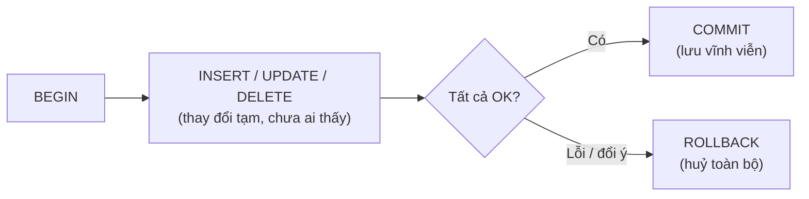

# 🎓 INSERT / UPDATE / DELETE & Transactions

> **Tác giả:** Mr.Rom\
> **Phiên bản:** v1.1.1\
> **Tạo lúc:** 23/05/2026\
> **Cập nhật:** 11/06/2026\
> **Level:** Basic\
> **Tags:** [MUST-KNOW]\
> **Yêu cầu trước:** [SELECT & Filter](01_select-and-filter.md)

> 🎯 *Học **DML**: `INSERT`, `UPDATE`, `DELETE` đúng cách + **transaction** với `BEGIN/COMMIT/ROLLBACK` đảm bảo nguyên tử (ACID). Sau bài này bạn sửa data tự tin, không sợ "lỡ tay DROP" hay "UPDATE quên WHERE".*

## 🎯 Sau bài này bạn sẽ

- [ ] `INSERT` 1 row, nhiều rows, từ `SELECT`
- [ ] `UPDATE` với WHERE đúng (và biết sợ khi quên WHERE)
- [ ] `DELETE` an toàn — luôn `SELECT` trước
- [ ] `UPSERT` — INSERT hoặc UPDATE nếu đã có (`ON CONFLICT` Postgres / `ON DUPLICATE KEY` MySQL)
- [ ] `RETURNING` lấy data sau INSERT/UPDATE/DELETE (Postgres)
- [ ] Hiểu **ACID** transaction
- [ ] Dùng `BEGIN/COMMIT/ROLLBACK` cho atomic operation
- [ ] Phân biệt `DELETE` vs `TRUNCATE` vs `DROP`

---

## Tình huống — Bạn làm DELETE quên WHERE

Bạn muốn xóa user inactive đã 1 năm. Viết:

```sql
DELETE FROM users WHERE last_login < '2024-05-23';
```

Bạn click "Run" — tay run nhầm dòng trên:

```sql
DELETE FROM users;
```

→ **2 triệu user biến mất trong 0.3 giây.** Production tan tành.

Bạn ngơ:
- Có cách nào **chặn** việc quên WHERE?
- **Rollback** lại được không?
- Production data có backup nhưng restore mất 4 giờ — có cách nhanh hơn?

→ Bài này dạy bạn **DML đầy đủ**, **transaction**, **soft delete**, và **chặn lỗi từ đầu**.

---

## 1️⃣ INSERT — Thêm row

### Cú pháp cơ bản

INSERT thêm 1 row mới vào bảng. **Best practice**: luôn liệt kê tên cột rõ ràng (không phụ thuộc thứ tự cột schema) — code self-documenting + không vỡ khi DBA thêm cột mới:

```sql
INSERT INTO users (name, email, city)
VALUES ('Nguyen Van A', 'nguyenvana@ex.com', 'Hanoi');
```

→ **Quy tắc**: luôn liệt kê **cột tên**. Không liệt kê = phụ thuộc thứ tự cột schema, dễ vỡ khi schema đổi.

```sql
-- ❌ KHÔNG nên (phụ thuộc thứ tự)
INSERT INTO users VALUES (1, 'Nguyen Van A', 'nguyenvana@ex.com', 'Hanoi', NULL, 'active', '2025-05-23');

-- ✅ ĐÚNG
INSERT INTO users (name, email, city, status)
VALUES ('Nguyen Van A', 'nguyenvana@ex.com', 'Hanoi', 'active');
```

### INSERT nhiều rows

Để bulk insert, gộp nhiều `VALUES` trong **1 statement** thay vì nhiều INSERT riêng — nhanh hơn 3-10× vì chỉ tốn 1 round-trip + 1 transaction:

```sql
INSERT INTO users (name, email, city) VALUES
  ('Nguyen Van A', 'nguyenvana@ex.com', 'Hanoi'),
  ('Le Van B',  'levanb@ex.com',  'Hanoi'),
  ('Tran Van C', 'tranvanc@ex.com', 'Saigon');
```

→ Nhanh hơn 3 lần `INSERT` riêng (1 transaction thay vì 3, 1 round-trip thay vì 3).

### INSERT từ SELECT (copy data)

Đôi khi cần copy data từ bảng này sang bảng khác (archive cũ, ETL, data warehouse). Dùng `INSERT INTO ... SELECT` để làm trong **1 query** thay vì kéo data ra rồi push lại:

```sql
INSERT INTO users_archive (id, name, email)
SELECT id, name, email FROM users WHERE status = 'inactive';
```

→ Copy data từ bảng khác. Hữu ích cho ETL, archive.

### Default values & AUTO-INCREMENT

Schema có thể định nghĩa `DEFAULT` cho cột — khi INSERT mà bỏ cột đó, DB tự fill giá trị mặc định. `AUTO-INCREMENT` (Postgres `SERIAL`, MySQL `AUTO_INCREMENT`) tự tăng PK cho mỗi row mới:

```sql
CREATE TABLE users (
  id          SERIAL PRIMARY KEY,        -- Postgres: tự tăng
  -- INTEGER PRIMARY KEY AUTOINCREMENT  -- SQLite
  -- INT AUTO_INCREMENT PRIMARY KEY     -- MySQL
  name        VARCHAR(100) NOT NULL,
  status      VARCHAR(20) DEFAULT 'active',
  created_at  TIMESTAMP DEFAULT CURRENT_TIMESTAMP
);

INSERT INTO users (name) VALUES ('Nguyen Van A');
-- id = auto, status = 'active', created_at = now()
```

### RETURNING — lấy data sau INSERT (Postgres + SQLite 3.35+)

`RETURNING` clause là **best feature của Postgres** — sau INSERT (hoặc UPDATE/DELETE), trả về luôn data của row vừa thao tác. Tiết kiệm 1 query phụ phải SELECT để lấy ID auto-generated:

```sql
INSERT INTO users (name, email)
VALUES ('Nguyen Van A', 'nguyenvana@ex.com')
RETURNING id, created_at;
```

```
id | created_at
---+--------------------
 8 | 2026-05-23 14:00:00
```

→ Tiết kiệm 1 query — không cần `SELECT` sau INSERT để lấy ID.

### MySQL/SQLite — `last_insert_rowid()`

```sql
INSERT INTO users (name) VALUES ('Nguyen Van A');
SELECT last_insert_rowid();   -- SQLite
SELECT LAST_INSERT_ID();       -- MySQL
```

---

## 2️⃣ UPDATE — Sửa row

### Cú pháp cơ bản

```sql
UPDATE users
SET    name = 'Nguyen Van A (updated)', city = 'Saigon'
WHERE  id = 1;
```

### ⚠️ QUY TẮC SỐ 1 — KHÔNG BAO GIỜ UPDATE KHÔNG WHERE

```sql
-- ❌ THẢM HỌA: update toàn bộ bảng
UPDATE users SET status = 'inactive';
-- → 2 triệu user thành inactive
```

### Cách phòng

1. **SELECT trước UPDATE** — chạy SELECT cùng WHERE để confirm số rows:
```sql
SELECT COUNT(*) FROM users WHERE last_login < '2024-05-23';
-- Confirm: "OK, 1234 rows"
UPDATE users SET status = 'inactive' WHERE last_login < '2024-05-23';
```

2. **TRANSACTION với ROLLBACK** (xem §6):
```sql
BEGIN;
UPDATE users SET status = 'inactive' WHERE last_login < '2024-05-23';
-- Check kết quả
SELECT COUNT(*) FROM users WHERE status = 'inactive';
-- Nếu OK:
COMMIT;
-- Nếu sai:
ROLLBACK;
```

3. **GUI tool** (DBeaver, DataGrip) — có **"Safe mode"** cảnh báo trước UPDATE/DELETE không WHERE.

4. **MySQL `--safe-updates`** — config server từ chối UPDATE/DELETE không có WHERE trên PK:
```
mysql --safe-updates -u root -p
```

### UPDATE từ JOIN (Postgres)

```sql
UPDATE orders
SET    customer_name = u.name
FROM   users u
WHERE  orders.user_id = u.id;
```

### UPDATE từ JOIN (MySQL)

```sql
UPDATE orders o
INNER JOIN users u ON u.id = o.user_id
SET    o.customer_name = u.name;
```

→ Cú pháp khác nhau. SQLite chỉ support sub-query, không JOIN trực tiếp trong UPDATE.

### UPDATE với CASE

```sql
UPDATE users
SET status = CASE
  WHEN last_login > '2025-04-23' THEN 'active'
  WHEN last_login > '2024-05-23' THEN 'dormant'
  ELSE 'inactive'
END
WHERE status IS NULL OR status = '';
```

### RETURNING (Postgres)

```sql
UPDATE users
SET    status = 'inactive'
WHERE  last_login < '2024-05-23'
RETURNING id, name, last_login;
```

→ Vừa update vừa biết "đã update những row nào".

---

## 3️⃣ DELETE — Xóa row

### Cú pháp cơ bản

```sql
DELETE FROM users WHERE id = 1;
```

### ⚠️ Như UPDATE — không bao giờ DELETE không WHERE

```sql
-- ❌ Xóa toàn bộ bảng
DELETE FROM users;
-- → 2 triệu rows GONE
```

### Pattern an toàn

```sql
-- 1. SELECT đếm trước
SELECT COUNT(*) FROM users WHERE status = 'inactive' AND last_login < '2024-05-23';

-- 2. SELECT chi tiết (xem mẫu)
SELECT id, name, last_login FROM users
WHERE status = 'inactive' AND last_login < '2024-05-23'
LIMIT 10;

-- 3. Transaction
BEGIN;
DELETE FROM users WHERE status = 'inactive' AND last_login < '2024-05-23';
-- Check số rows deleted
SELECT changes();   -- SQLite (rows affected)
-- ROW_COUNT() trong MySQL
COMMIT;  -- hoặc ROLLBACK
```

### Soft delete — pattern tốt hơn DELETE thật

Thay vì xóa row, **đánh dấu xóa**:

```sql
ALTER TABLE users ADD COLUMN deleted_at TIMESTAMP DEFAULT NULL;

-- "Xóa" user 1
UPDATE users SET deleted_at = CURRENT_TIMESTAMP WHERE id = 1;

-- Query "user còn sống"
SELECT * FROM users WHERE deleted_at IS NULL;

-- Restore (undo)
UPDATE users SET deleted_at = NULL WHERE id = 1;
```

| Pros soft delete | Cons soft delete |
|---|---|
| ✅ Undo dễ | ❌ Data lớn dần |
| ✅ Audit trail tự nhiên | ❌ Mọi query phải `WHERE deleted_at IS NULL` |
| ✅ FK không gãy | ❌ Vi phạm GDPR "right to be forgotten" |

→ **2026 best practice**: soft delete cho user-data, hard delete cho log/cache. GDPR + privacy law: phải có hard-delete khi user yêu cầu.

### DELETE với JOIN

```sql
-- Postgres
DELETE FROM orders
USING  users
WHERE  orders.user_id = users.id
  AND  users.status = 'spam';

-- MySQL
DELETE o FROM orders o
INNER JOIN users u ON u.id = o.user_id
WHERE u.status = 'spam';
```

---

## 4️⃣ UPSERT — INSERT hoặc UPDATE nếu đã có

### Postgres / SQLite 3.24+ — `ON CONFLICT`

```sql
INSERT INTO users (email, name, login_count)
VALUES ('nguyenvana@ex.com', 'Nguyen Van A', 1)
ON CONFLICT (email)
DO UPDATE SET
  login_count = users.login_count + 1,
  updated_at  = CURRENT_TIMESTAMP;
```

→ Nếu `email` trùng (unique constraint) → update `login_count`. Nếu chưa có → insert mới.

### Postgres `ON CONFLICT DO NOTHING`

```sql
INSERT INTO users (email, name)
VALUES ('nguyenvana@ex.com', 'Nguyen Van A')
ON CONFLICT (email) DO NOTHING;
```

→ Nếu trùng → bỏ qua, không lỗi. Hữu ích cho idempotent insert.

### MySQL — `ON DUPLICATE KEY UPDATE`

```sql
INSERT INTO users (email, name, login_count)
VALUES ('nguyenvana@ex.com', 'Nguyen Van A', 1)
ON DUPLICATE KEY UPDATE
  login_count = login_count + 1;
```

### SQLite cũ (< 3.24) — `INSERT OR REPLACE`

```sql
INSERT OR REPLACE INTO users (id, name) VALUES (1, 'Nguyen Van A');
```

→ ⚠️ `OR REPLACE` **xóa rồi insert lại** — mất cột không update, vỡ FK. Dùng `ON CONFLICT` (3.24+) tốt hơn.

### Use case UPSERT

- Counter (page view, like count).
- Cache update (mutate hoặc insert).
- Sync data từ external API (idempotent).
- "Welcome back, last login: X" — update last_login mỗi lần login.

---

## 5️⃣ ACID — Cam kết của transaction

**ACID** = 4 thuộc tính database **đảm bảo data an toàn**:

| Chữ | Tên | Nghĩa |
|---|---|---|
| **A** | Atomicity | Tất cả hoặc không gì — không có half-done |
| **C** | Consistency | Sau transaction, data luôn ở trạng thái hợp lệ |
| **I** | Isolation | Transaction A không thấy data dở của B |
| **D** | Durability | COMMIT xong = data lưu vĩnh viễn (kể cả crash) |

### Câu chuyện chuyển tiền — cần ACID

```sql
-- 1. Trừ tiền tài khoản A
UPDATE accounts SET balance = balance - 1000 WHERE id = 1;

-- ⚡ Server crash ở đây!

-- 2. Cộng tiền tài khoản B
UPDATE accounts SET balance = balance + 1000 WHERE id = 2;
```

→ Không có transaction → A mất 1000, B không nhận. **Cướp** ngân hàng.

→ Có transaction:

```sql
BEGIN;
  UPDATE accounts SET balance = balance - 1000 WHERE id = 1;
  UPDATE accounts SET balance = balance + 1000 WHERE id = 2;
COMMIT;
```

→ Crash giữa chừng = **toàn bộ rollback**, A vẫn còn tiền.

---

## 6️⃣ Transaction — BEGIN / COMMIT / ROLLBACK

Sơ đồ dưới minh hoạ vòng đời 1 transaction — mọi thay đổi giữa `BEGIN` và `COMMIT` chỉ tồn tại "tạm" cho đến khi bạn quyết định giữ hay huỷ:



→ Chính nhánh ROLLBACK là "lưới an toàn" giúp bạn thoát thảm hoạ UPDATE/DELETE quên WHERE — miễn là chưa COMMIT.

```sql
BEGIN;                                  -- bắt đầu transaction
  INSERT INTO orders (user_id, amount) VALUES (1, 250000);
  UPDATE users SET total_orders = total_orders + 1 WHERE id = 1;
  UPDATE products SET stock = stock - 1 WHERE id = 42;
COMMIT;                                 -- commit toàn bộ
```

→ 3 lệnh trên hoặc **all success** hoặc **all rollback**. Không có "đặt order xong, quên trừ kho".

### ROLLBACK khi có lỗi

```sql
BEGIN;
  INSERT INTO orders (user_id, amount) VALUES (1, 250000);
  UPDATE products SET stock = stock - 1 WHERE id = 42 AND stock > 0;
  -- Check: nếu stock = 0 → ROLLBACK
  -- (Trong code app, IF clause check rồi gọi ROLLBACK)
ROLLBACK;
```

### Auto-commit (default ở mọi DB)

Bình thường mỗi statement = 1 transaction tự động commit:

```sql
INSERT INTO users (name) VALUES ('Nguyen Van A');
-- Tương đương:
-- BEGIN; INSERT ...; COMMIT;
```

→ `BEGIN` để tắt auto-commit cho block nhiều statement.

### Savepoint — nested rollback

```sql
BEGIN;
  INSERT INTO orders ...;
  SAVEPOINT after_order;
  UPDATE products SET stock = stock - 1 ...;
  -- Lỗi stock = 0
  ROLLBACK TO SAVEPOINT after_order;     -- Rollback chỉ tới savepoint
  -- Order vẫn còn (nếu commit đến đây)
COMMIT;
```

→ Hữu ích khi transaction lớn có nhiều bước, chỉ retry 1 phần.

### Trong code Python

```python
import psycopg2
conn = psycopg2.connect(...)
try:
    with conn:
        with conn.cursor() as cur:
            cur.execute("UPDATE accounts SET balance = balance - 1000 WHERE id = 1")
            cur.execute("UPDATE accounts SET balance = balance + 1000 WHERE id = 2")
    # context manager tự commit nếu không exception
except Exception:
    # tự rollback nếu exception
    raise
```

→ ORM (SQLAlchemy, Django) auto-manage transaction qua context manager.

---

## 7️⃣ Isolation levels — 4 mức

Không phải 2 transaction nào cũng "thấy" nhau giống nhau. SQL có 4 mức:

| Level | Vấn đề có thể gặp |
|---|---|
| **Read Uncommitted** | Dirty read (đọc data chưa commit) |
| **Read Committed** | Non-repeatable read (đọc lại thấy khác) |
| **Repeatable Read** | Phantom read (range query thấy row mới) |
| **Serializable** | Không vấn đề — slowest, lock nhiều |

### Default

| DB | Default |
|---|---|
| PostgreSQL | Read Committed |
| MySQL InnoDB | Repeatable Read |
| SQL Server | Read Committed |
| Oracle | Read Committed |

→ 99% app default OK. Chỉ tăng lên khi business critical (ngân hàng, e-commerce inventory).

### Set isolation level

```sql
BEGIN;
SET TRANSACTION ISOLATION LEVEL SERIALIZABLE;
-- ...
COMMIT;
```

> ⚠️ Isolation level chi tiết là chủ đề riêng, deep dive ở `02_intermediate/`. Beginner chỉ cần biết "có 4 mức, default OK".

---

## 8️⃣ DELETE vs TRUNCATE vs DROP

| Lệnh | Tác dụng | Rollback được? | Trigger fire? |
|---|---|---|---|
| `DELETE FROM t WHERE ...` | Xóa rows (theo điều kiện) | ✅ (trong transaction) | ✅ |
| `DELETE FROM t` | Xóa hết rows | ✅ | ✅ |
| `TRUNCATE TABLE t` | Xóa hết rows, reset auto-increment | ⚠️ Tùy DB | ❌ Postgres: ✅, MySQL: ❌ |
| `DROP TABLE t` | Xóa cả bảng | ❌ (sau commit) | — |

### Khi nào dùng cái nào?

```sql
-- Xóa user 1
DELETE FROM users WHERE id = 1;

-- Xóa log table 100GB nhanh (truncate nhanh hơn DELETE rất nhiều)
TRUNCATE TABLE access_logs;

-- Xóa hẳn table không dùng nữa
DROP TABLE old_users_archive;
```

### ⚠️ TRUNCATE và DROP rất nguy hiểm

- Production: hầu hết DBA **disable TRUNCATE/DROP** cho app user, chỉ admin role.
- Tools (DBeaver, DataGrip) cảnh báo 2 lần.
- **Backup trước khi DROP** — vô tình DROP bảng = mất sạch.

---

## 💡 Cạm bẫy thường gặp & Best practice

1. **UPDATE/DELETE quên WHERE** → Lỗi #1 disaster. SELECT trước, BEGIN trước.
2. **TRUNCATE tưởng rollback được** → Postgres OK, MySQL **không**. Đọc docs trước.
3. **UPSERT race condition** → 2 thread cùng INSERT cùng key → 1 lỗi. `ON CONFLICT` chuẩn giải quyết.
4. **Transaction quá dài** → giữ lock lâu, block transaction khác → deadlock. Transaction nên ngắn (ms-giây), không nên có HTTP call ngoài bên trong.
5. **Quên COMMIT** → để `BEGIN` open trong session → toàn bộ change visible chỉ session đó, người khác không thấy. Database connection idle với open transaction = vấn đề lớn.

---

## 🧠 Tự kiểm tra (Self-check)

1. Cách nào tránh UPDATE quên WHERE thảm họa?
2. Khác biệt `DELETE FROM t WHERE id=1` và `TRUNCATE TABLE t`?
3. Viết UPSERT: "tăng `view_count` mỗi lần page được vào, hoặc tạo row mới nếu chưa có" (page_id là PK).
4. ACID — A và D nghĩa là gì? Cho ví dụ vi phạm A.
5. Khi nào dùng soft delete thay vì hard delete?

<details>
<summary>Gợi ý đáp án</summary>

1. (a) SELECT trước với cùng WHERE để confirm count. (b) BEGIN; UPDATE; check; COMMIT/ROLLBACK. (c) GUI tool safe mode. (d) MySQL `--safe-updates`. (e) App layer disable raw SQL từ untrusted code.

2. `DELETE WHERE` xóa rows theo điều kiện, rollback được, trigger fire, chậm trên bảng lớn. `TRUNCATE` xóa hết rows, reset auto-increment, không fire trigger (MySQL), không rollback (MySQL), nhanh hơn rất nhiều (chỉ deallocate page).

3. ```sql
   -- Postgres / SQLite 3.24+
   INSERT INTO page_views (page_id, view_count)
   VALUES ('home', 1)
   ON CONFLICT (page_id) DO UPDATE
   SET view_count = page_views.view_count + 1;
   ```

4. **A** (Atomicity) — tất cả hoặc không. **D** (Durability) — commit xong = bền vững kể cả crash. Vi phạm A: transfer tiền, trừ A xong server crash → A mất tiền, B không nhận. Transaction rollback toàn bộ là cách defend.

5. **Soft delete** khi: cần audit trail, undo dễ, GDPR không bắt hard-delete. **Hard delete** khi: GDPR demand, data nhạy cảm không cần lưu, log lớn (cleanup). Best practice: soft cho user-data, hard cho log.
</details>

---

## ⚡ Tra cứu nhanh (Cheatsheet)

### DML quick

```sql
-- INSERT 1 row
INSERT INTO t (col1, col2) VALUES ('a', 'b');

-- INSERT nhiều
INSERT INTO t (col1, col2) VALUES ('a','b'), ('c','d'), ('e','f');

-- INSERT từ SELECT
INSERT INTO t_archive SELECT * FROM t WHERE ...;

-- INSERT trả về row mới (Postgres/SQLite 3.35+)
INSERT INTO t (...) VALUES (...) RETURNING id, created_at;

-- UPDATE (LUÔN có WHERE)
UPDATE t SET col1 = 'x' WHERE id = 1;

-- DELETE (LUÔN có WHERE)
DELETE FROM t WHERE id = 1;

-- UPSERT (Postgres/SQLite 3.24+)
INSERT INTO t (k, v) VALUES ('a', 1)
ON CONFLICT (k) DO UPDATE SET v = t.v + 1;

-- UPSERT (MySQL)
INSERT INTO t (k, v) VALUES ('a', 1)
ON DUPLICATE KEY UPDATE v = v + 1;
```

### Transaction

```sql
BEGIN;
  -- ... statements ...
COMMIT;     -- hoặc ROLLBACK;

-- Với savepoint
BEGIN;
  ...
  SAVEPOINT s1;
  ...
  ROLLBACK TO SAVEPOINT s1;
  ...
COMMIT;
```

### Soft delete pattern

```sql
ALTER TABLE users ADD COLUMN deleted_at TIMESTAMP DEFAULT NULL;

-- "Delete"
UPDATE users SET deleted_at = NOW() WHERE id = 1;

-- Query alive
SELECT * FROM users WHERE deleted_at IS NULL;

-- Restore
UPDATE users SET deleted_at = NULL WHERE id = 1;
```

### DELETE/TRUNCATE/DROP

```sql
DELETE FROM t WHERE id = 1;     -- xóa row, rollback được
DELETE FROM t;                  -- xóa hết row, rollback được
TRUNCATE TABLE t;               -- xóa hết, nhanh, reset auto-inc
DROP TABLE t;                   -- xóa cả bảng
```

---

## 📚 Từ Điển Thuật Ngữ (Glossary)

| Thuật ngữ | Ý nghĩa |
|---|---|
| **DML** | Data Manipulation Language — INSERT/UPDATE/DELETE |
| **UPSERT** | INSERT-or-UPDATE (Postgres `ON CONFLICT`, MySQL `ON DUPLICATE KEY`) |
| **RETURNING** | Trả về cột sau INSERT/UPDATE/DELETE (Postgres, SQLite 3.35+) |
| **Transaction** | Block lệnh chạy như đơn vị nguyên tử |
| **ACID** | Atomicity / Consistency / Isolation / Durability |
| **BEGIN / COMMIT / ROLLBACK** | Bắt đầu / lưu / hủy transaction |
| **SAVEPOINT** | Điểm rollback trong transaction lớn |
| **Soft delete** | Đánh dấu xóa (`deleted_at`) thay vì xóa thật |
| **Hard delete** | DELETE thật khỏi bảng |
| **Isolation level** | Mức cách ly giữa transaction (4 mức) |
| **Dirty read / Phantom read** | Vấn đề khi isolation thấp |

---

## 🔗 Liên kết & Tài nguyên

### 🧭 Định hướng lộ trình học
- ⬅️ **Bài trước:** [JOINs — Ghép bảng để query data đầy đủ](03_joins.md)
- ➡️ **Bài tiếp theo:** [Schema Design — CREATE TABLE, PK/FK, Indexes & Normalization](05_schema-design-basics.md)
- ↑ **Về cụm:** [sql-fundamentals README](../../README.md)

### 🌐 Tài nguyên tham khảo khác
- 📖 [Postgres: Transactions](https://www.postgresql.org/docs/current/tutorial-transactions.html)
- 📖 [Postgres: INSERT ... ON CONFLICT](https://www.postgresql.org/docs/current/sql-insert.html#SQL-ON-CONFLICT)
- 📖 [Martin Fowler: Patterns of Enterprise Application Architecture](https://martinfowler.com/eaaCatalog/) — Unit of Work, Identity Map patterns
- 📖 [Aphyr — Jepsen analysis](https://jepsen.io/) — deep dive transaction isolation các DB thực tế

---

> 🎯 *Sau bài này bạn sửa data tự tin, dùng transaction để không mất data. Bài cuối cluster — schema design — dạy **CREATE TABLE đúng cách**, **PK/FK**, **indexes**, và **normalization** để DB không trở thành cơn ác mộng sau 1 năm.*

---

## 📌 Nhật ký thay đổi (Changelog)

- **v1.0.0 (23/05/2026)** — Bản đầu tiên. Cluster `sql-fundamentals/` lesson 5/6. Cover: INSERT (single/multi/from SELECT/RETURNING) + UPDATE (luôn WHERE!) + DELETE (TRUNCATE compare) + UPSERT (INSERT ON CONFLICT / MERGE) + transactions ACID + savepoints + soft delete pattern.
- **v1.1.0 (25/05/2026)** — Thêm lead-in 2-3 câu trước §1 Cú pháp INSERT + INSERT nhiều rows + INSERT từ SELECT + Default & AUTO-INCREMENT + RETURNING. Chuẩn hoá tên + email trong ví dụ. Thêm Changelog section.
- **v1.1.1 (11/06/2026)** — Bổ sung sơ đồ flow vòng đời transaction (BEGIN → COMMIT/ROLLBACK) cho trực quan.
