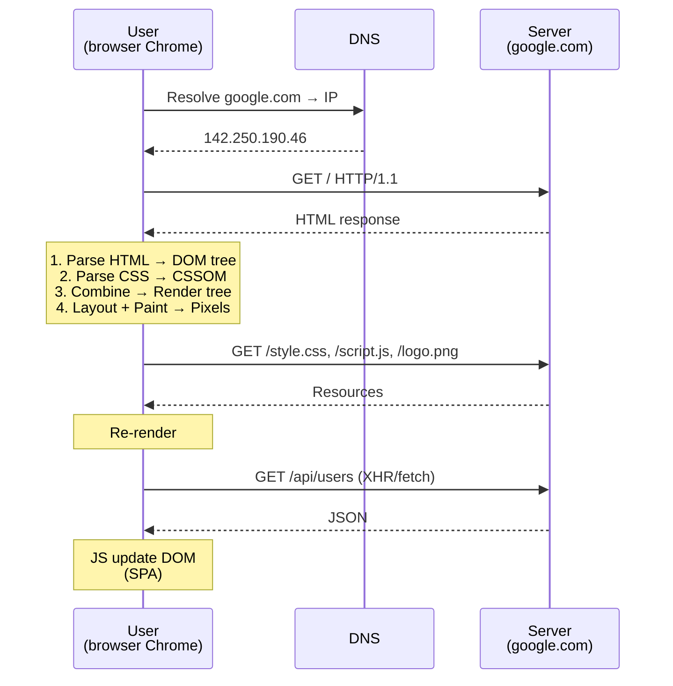

# 🎓 HTML & CSS là gì? — Nền tảng frontend web

> **Tác giả:** Mr.Rom\
> **Phiên bản:** v1.1.0\
> **Tạo lúc:** 23/05/2026\
> **Cập nhật:** 25/05/2026\
> **Level:** Basic\
> **Tags:** [MUST-KNOW]\
> **Thời lượng đọc:** ~15 phút\
> **Prerequisites:** Không có — đây là bài intro frontend đầu tiên

> 🎯 *Bài INTRO. Hiểu **browser model** (Server → HTML → Browser → render), **3 ngôn ngữ trụ cột** (HTML + CSS + JS), **HTML/CSS evolution** (HTML4 → 5, CSS1 → 3+), **framework landscape** 2026 (React/Vue/Svelte/HTMX), **build tools** (Vite/Webpack). KHÔNG dạy syntax HTML/CSS chi tiết (sẽ học từ bài 01 trở đi).*

## 🎯 Sau bài này bạn sẽ

- [ ] Hiểu **browser** làm gì với HTML/CSS/JS
- [ ] Biết **3 ngôn ngữ trụ cột** + vai trò từng cái
- [ ] Đọc anatomy 1 trang web đơn giản
- [ ] Phân biệt **HTML/CSS/JS vs React/Vue framework**
- [ ] Hiểu **build process** (source → bundle → deploy)
- [ ] Biết DevTools để inspect element + debug
- [ ] So sánh **framework 2026** (React vs Vue vs Svelte vs HTMX)

---

## Tình huống — Bạn muốn build frontend cho FastAPI

Bạn đã có backend FastAPI ([cluster trước](../../../backend/python-fastapi/)). Sản phẩm cần **UI** cho user click + xem data.

Bạn thử:

```html
<!-- file: index.html -->
<h1>Acme Shop</h1>
<button onclick="alert('Hi')">Click me</button>
```

→ Mở file `index.html` trong Chrome → có button → click → alert hiện. OK! Nhưng:

- 😱 Trang xấu — không CSS.
- 😱 Cần fetch data từ FastAPI → show products → cần JS.
- 😱 Resize trên mobile → vỡ layout.
- 😱 Form login → validation tay rất nhiều.
- 😱 React/Vue/Svelte nghe rần rộ — nên học cái nào?

Bạn ngơ:
- **HTML** vs **CSS** vs **JS** — phân chia thế nào?
- Sao gọi là **"frontend framework"** trong khi đã có HTML?
- **Vanilla JS** vs **React** — khác sao?
- Học theo thứ tự nào? HTML đầu tiên đúng không?

→ Bài này đi từ tổng quan đến lộ trình. Bài 01-04 dạy HTML+CSS sâu hơn. Cluster `javascript-dom/` cho JS. Cluster `react/` cho React framework.

---

## 1️⃣ Browser model — khi bạn truy cập `https://google.com`

Trước khi học HTML/CSS, cần hiểu **browser hoạt động ra sao** với file `.html` — từ lúc gõ URL đến khi pixel hiện trên màn hình. Sequence diagram dưới minh hoạ 7 bước từ DNS resolve đến render:



→ Browser là **"runtime"** của HTML/CSS/JS — nhận file text → vẽ giao diện + chạy code.

### Đọc nhanh DevTools

DevTools là **vũ khí số 1** của frontend dev — inspect DOM, debug JS, profile performance, audit accessibility. Mỗi tab có chức năng riêng. Phím tắt + 7 tab chính:

```
F12 (hoặc Cmd+Option+I trên Mac)
├── Elements      ← DOM tree + CSS hiện tại
├── Console        ← JS log + run code
├── Sources         ← debug JS
├── Network         ← HTTP request/response
├── Application      ← localStorage, cookies, cache
├── Performance      ← profile render
└── Lighthouse        ← audit speed + a11y
```

→ DevTools là bạn của mọi frontend dev. Master nó từ ngày đầu.

---

## 2️⃣ 3 ngôn ngữ trụ cột — HTML + CSS + JavaScript

### HTML — Structure (nội dung gì)

**HTML** = **HyperText Markup Language**. Cấu trúc trang web — tag-based.

```html
<h1>Acme Shop</h1>
<p>Mua điện thoại tại đây.</p>
<button>Mua ngay</button>
```

→ HTML nói: "Trang có heading, paragraph, button". KHÔNG nói trang trông thế nào.

### CSS — Style (trông như thế nào)

**CSS** = **Cascading Style Sheets**. Style cho HTML.

```css
h1 { color: red; font-size: 32px; }
button { background: blue; color: white; padding: 10px 20px; }
```

→ CSS nói: "Heading đỏ size 32, button xanh padding 10/20".

### JS — Behavior (làm gì khi tương tác)

**JavaScript** = ngôn ngữ lập trình **chạy trong browser** (+ Node.js cho server).

```javascript
document.querySelector('button').addEventListener('click', () => {
  alert('Đã thêm vào giỏ!');
});
```

→ JS nói: "Click button → hiện alert".

### Ẩn dụ — Nhà

> 🧠 **Ẩn dụ — Trang web như xây nhà:**
> - **HTML** = bộ khung gạch (`<div>`, `<p>`, `<button>`) — nhà có **bao nhiêu phòng, ở đâu**.
> - **CSS** = sơn + nội thất (`color`, `padding`, `flex`) — nhà **trông như thế nào**.
> - **JS** = điện + nước + máy lạnh (`onclick`, `fetch`) — nhà **hoạt động thế nào**.

→ 3 cái **độc lập** mà bổ trợ. Nhà có thể có khung không sơn, có sơn không điện. Nhưng đầy đủ mới ở được.

### Bảng vai trò

Tóm tắt **phân chia trách nhiệm** giữa 3 ngôn ngữ — đây là nguyên tắc "separation of concerns" trong web development. Mỗi layer độc lập, dễ maintain hơn nếu trộn vào nhau:

| Layer | Ngôn ngữ | Lưu file | Vai trò |
|---|---|---|---|
| Structure | HTML | `.html` | Có gì trên trang |
| Style | CSS | `.css` | Trông thế nào |
| Behavior | JavaScript | `.js` | Làm gì khi tương tác |

---

## 3️⃣ Anatomy 1 trang HTML tối thiểu

Mọi trang HTML production-ready cần **8 thành phần cơ bản** — từ DOCTYPE đầu file đến script ở cuối body. Đây là skeleton bạn sẽ thấy lặp lại trong mọi project, copy-paste rồi điền nội dung:

```html
<!DOCTYPE html>
<html lang="vi">
<head>
  <meta charset="UTF-8">
  <meta name="viewport" content="width=device-width, initial-scale=1.0">
  <title>Acme Shop</title>
  <link rel="stylesheet" href="styles.css">
</head>
<body>
  <h1>Acme Shop</h1>
  <p>Chào mừng bạn đến với cửa hàng.</p>
  <button id="cta">Mua ngay</button>

  <script src="app.js"></script>
</body>
</html>
```

### Phần

8 thành phần trên có vai trò khác nhau — `<!DOCTYPE html>` bắt buộc đầu file để browser parse đúng HTML5, `<meta charset>` cho diacritics tiếng Việt, `<script>` đặt cuối body để render nhanh hơn. Bảng giải thích từng phần:

| Phần | Mục đích |
|---|---|
| `<!DOCTYPE html>` | Khai HTML5 — bắt buộc đầu file |
| `<html lang="vi">` | Root + ngôn ngữ (giúp SEO + accessibility) |
| `<head>` | Metadata + link CSS + title — KHÔNG hiển thị |
| `<meta charset="UTF-8">` | Encoding (cho diacritics tiếng Việt) |
| `<meta name="viewport">` | Mobile responsive |
| `<title>` | Tab title |
| `<body>` | Nội dung hiển thị |
| `<script src="...">` | Link JS (đặt cuối body cho tốc độ) |

→ Mọi trang HTML cấu trúc tương tự. Học chi tiết tag ở [bài 01](01_html-essentials.md).

---

## 4️⃣ HTML evolution — HTML4 → HTML5 → HTML Living Standard

| Năm | Version | Đặc điểm |
|---|---|---|
| 1991 | HTML 1 | Tim Berners-Lee tại CERN — đơn giản, học thuật |
| 1995 | HTML 2 | Form, table |
| 1999 | HTML 4 | Frame, scripting |
| 2008 | **HTML 5 draft** | `<video>`, `<audio>`, `<canvas>`, semantic tag |
| 2014 | **HTML 5 W3C Recommendation** | Stable cho ~10 năm |
| 2019+ | **HTML Living Standard** (WHATWG) | Update liên tục — không có "HTML 6" |

→ **2026 reality**: nói **"HTML5"** trong công nghiệp = HTML modern. Chuẩn thực tế là WHATWG HTML Living Standard.

### HTML5 quan trọng — semantic tags

```html
<!-- HTML4 (cũ, vẫn dùng) -->
<div id="header">...</div>
<div id="content">...</div>
<div id="footer">...</div>

<!-- HTML5 (semantic, recommended) -->
<header>...</header>
<main>...</main>
<footer>...</footer>
```

→ Semantic tag (`<header>`, `<nav>`, `<article>`, `<section>`, `<aside>`, `<footer>`) tốt cho:
- **SEO** — Google hiểu cấu trúc.
- **Accessibility** — screen reader đọc đúng.
- **Maintainability** — code dễ đọc hơn `<div>` lung tung.

---

## 5️⃣ CSS evolution — CSS1 → CSS3 → CSS Snapshot

| Năm | Version | Đặc điểm |
|---|---|---|
| 1996 | CSS 1 | Inline styling |
| 1998 | CSS 2 | Position, float, media |
| 2011-2018 | **CSS 3 modules** | Selectors L3, Flexbox, Grid, Transform, Animation, Variables |
| 2024+ | **CSS Snapshot 2024** | Container queries, `:has()`, nesting native, color functions |

→ **2026 reality**: "CSS 3" = umbrella term cho modules modern. Không có "CSS 4".

### CSS hot trong 2026

| Feature | Khi hỗ trợ browser | Use case |
|---|---|---|
| **Flexbox** | 2015 (cross-browser) | Layout 1D |
| **Grid** | 2017 | Layout 2D (rows + columns) |
| **CSS Variables** | 2016 | Theme, design tokens |
| **`:has()`** | 2023 | Parent selector |
| **Container queries** | 2023 | Responsive theo container, không phải viewport |
| **CSS Nesting** | 2023 native | Như Sass nhưng built-in |
| **Color functions** | 2023+ | `oklch()`, `color-mix()` — color modern |

→ CSS 2026 mạnh ngang ngửa Sass cũ. Nhiều preprocessor (Sass, Less) không còn cần.

---

## 6️⃣ Vanilla vs Framework — Khi nào dùng gì?

### Vanilla (HTML + CSS + JS thuần)

```html
<button id="btn">Click</button>
<script>
  document.getElementById('btn').addEventListener('click', () => {
    alert('Hi!');
  });
</script>
```

✅ **Pros**:
- Không build tool, mở `.html` chạy ngay.
- Bundle size = 0KB framework.
- Học fundamentals đầu tiên.

❌ **Cons**:
- App lớn = code nhiều, khó manage state.
- Reactivity manual (event listener khắp nơi).
- Không có component reuse builtin.

### Framework — React/Vue/Svelte/SolidJS

```jsx
// React example
function App() {
  const [count, setCount] = useState(0);
  return <button onClick={() => setCount(count + 1)}>Count: {count}</button>;
}
```

✅ **Pros**:
- Component-based — reuse + scoped state.
- Reactivity tự động (state đổi → UI re-render).
- Ecosystem to: router, state management, UI lib.

❌ **Cons**:
- Cần build tool (Vite/Webpack).
- Bundle size ban đầu lớn.
- Learning curve.

---

## 7️⃣ Framework landscape 2026

| Framework | Năm | Triết lý | npm weekly downloads 2026 | Best for |
|---|---|---|---|---|
| **React** | 2013 | Library + ecosystem | ~22M | Default cho startup, mobile (React Native) |
| **Vue** | 2014 | Progressive, dễ học | ~5M | Solo dev, prototype, China popular |
| **Angular** | 2010 (v1) → 2016 (v2) | Enterprise, full-featured | ~3M | Large team, TypeScript-first |
| **Svelte/SvelteKit** | 2016 / 2022 | Compile-time, no virtual DOM | ~1M | Performance, indie |
| **Solid** | 2021 | React syntax + fine-grained reactivity | ~200k | Performance lover |
| **HTMX** | 2020 | Server-driven, no JS framework | ~150k | Backend dev không muốn SPA |
| **Qwik** | 2022 | Resumable, instant interactivity | ~50k | E-commerce performance critical |

### Khi nào chọn gì?

| Use case | Chọn |
|---|---|
| Mới học, startup, mobile cross-platform | **React** (default 2026) |
| Solo dev / prototype, ít chuẩn enterprise | **Vue** |
| Large enterprise + TypeScript bắt buộc | **Angular** |
| Performance + bundle nhỏ + UX silky | **Svelte** |
| Backend dev không muốn học JS framework | **HTMX** + server template |
| Static blog/marketing site | **Astro** (multi-framework) |

→ **2026 reality**: **React** vẫn vua (~60% mới), Vue + Svelte tăng dần, Angular ổn enterprise, HTMX phục hưng "server-first".

---

## 8️⃣ Build process — Sao app modern lại "build"?

### Vanilla HTML/CSS/JS — không build

```
index.html → Browser
styles.css → Browser
app.js     → Browser
```

→ 3 file text. Browser hiểu trực tiếp.

### Framework — cần build

```
src/
├── App.jsx        ← JSX (browser không hiểu)
├── styles.scss     ← Sass (browser không hiểu)
└── utils.ts        ← TypeScript (browser không hiểu)
    │
    ├ npm run build  (Vite/Webpack)
    ▼
dist/
├── index.html
├── bundle.[hash].js   ← Compiled, minified
└── bundle.[hash].css
    │
    ▼
   Browser
```

### Vai trò build tool

| Build tool | Năm | Đặc điểm | 2026 |
|---|---|---|---|
| **Webpack** | 2012 | Mature, slow, complex config | Legacy enterprise |
| **Parcel** | 2017 | Zero config | Niche |
| **esbuild** | 2020 | Go-based, 10-100x nhanh hơn webpack | Underlying tool |
| **Vite** | 2020 | Dev server siêu nhanh + esbuild + Rollup | **Recommended 2026** |
| **Turbopack** | 2022 | Rust-based, Vercel | Next.js future |

→ **2026 default**: **Vite** cho React/Vue/Svelte. `npm create vite@latest`.

---

## 9️⃣ bạn ghép tất cả — full-stack dự kiến

```
┌─────────────────────────────────────┐
│        Browser (Chrome/Firefox)     │
│  ┌─────────────────────────────┐   │
│  │  React App (frontend)        │   │  ← bạn học từ cluster react/
│  │   - HTML + CSS + JS          │   │
│  │   - Built bởi Vite           │   │
│  │   - fetch FastAPI            │   │
│  └─────────────────────────────┘   │
└─────────────────────────────────────┘
              ↓ HTTP (HTTPS)
┌─────────────────────────────────────┐
│  FastAPI backend (Bạn đã viết)     │  ← Cluster python-fastapi
│   - REST API                         │
│   - Postgres database                │
│   - Chạy systemd service              │
└─────────────────────────────────────┘
```

→ **Lộ trình**:
1. Cluster này (HTML+CSS) → bài 01-04 dạy chi tiết.
2. Cluster `javascript-dom/` → JS + DOM + fetch.
3. Cluster `react/` → component-based, fetch FastAPI.
4. Production: deploy frontend lên Vercel/Netlify, backend trên VPS.

---

## ⚠️ 5 pitfall hay vướng

1. **Học framework trước HTML/CSS** → khi React broken, không debug được CSS layout cơ bản. Học vanilla trước.
2. **Inline style mọi thứ** (`<p style="color:red">`) → khó maintain. Tách CSS file.
3. **Quên `<meta viewport>`** → mobile responsive vỡ. Mọi trang HTML5 phải có.
4. **`<script>` ở `<head>`** không có `defer/async` → block render. Đặt cuối `<body>` hoặc dùng `defer`.
5. **Chạy đua framework** → mỗi tháng có thứ mới. **React** stable 10+ năm — chọn an toàn, học sâu, ít chạy đua.

---

## ✅ Self-check

1. Vai trò 3 ngôn ngữ trụ cột — HTML, CSS, JS?
2. Mở DevTools tab nào để debug HTTP request? Tab nào xem DOM?
3. Khác **vanilla JS** và **React**?
4. **Vite** vs **Webpack** — 2026 recommend cái nào, lý do?
5. Khi nào chọn **HTMX** thay React?

<details>
<summary>Gợi ý đáp án</summary>

1. **HTML** = structure (nội dung gì). **CSS** = style (trông thế nào). **JS** = behavior (làm gì khi tương tác). 3 cái độc lập + bổ trợ.

2. **Network** tab xem HTTP request. **Elements** tab xem DOM (hover element trên trang → highlight ở Elements). Bonus: **Console** tab debug JS.

3. **Vanilla JS** = không framework, viết tay event listener + DOM manipulation. **React** = component-based, state đổi tự re-render, ecosystem to (router, state lib). React build complexity cao hơn nhưng scale tốt cho app lớn.

4. **Vite** — dev server siêu nhanh (esbuild), config tối thiểu, đa số framework support. Webpack mature nhưng slow + verbose. 2026 dự án mới đều chọn Vite.

5. **HTMX** khi: (a) backend dev (Python/Go/Ruby) không muốn học React. (b) App đơn giản dùng server-rendered HTML, chỉ cần interactivity nhỏ. (c) Cần SEO tốt mà không muốn SSR React. (d) Bundle JS = 0KB (HTMX 14KB total) → tốt cho mobile yếu, thị trường low-end.
</details>

---

## ⚡ Cheatsheet

### HTML minimal template

```html
<!DOCTYPE html>
<html lang="vi">
<head>
  <meta charset="UTF-8">
  <meta name="viewport" content="width=device-width, initial-scale=1.0">
  <title>My Page</title>
  <link rel="stylesheet" href="styles.css">
</head>
<body>
  <h1>Hello</h1>
  <script src="app.js" defer></script>
</body>
</html>
```

### Setup project Vite + React

```bash
npm create vite@latest myapp -- --template react
cd myapp
npm install
npm run dev
```

### DevTools shortcuts

```
F12 / Cmd+Option+I       Open DevTools
Cmd+Shift+M (Mac)         Toggle mobile view
Cmd+R                      Reload
Cmd+Shift+R                Hard reload (no cache)
```

### Framework chọn nhanh

```
Mới học?              → Vanilla HTML/CSS/JS
Startup, app mobile?   → React
Solo, prototype?       → Vue
Enterprise + TS?       → Angular
Performance + tiny?    → Svelte
Backend dev?           → HTMX
```

---

## 📘 Glossary

| Thuật ngữ | Ý nghĩa |
|---|---|
| **HTML** | HyperText Markup Language — structure |
| **CSS** | Cascading Style Sheets — style |
| **JavaScript / JS** | Ngôn ngữ lập trình browser |
| **DOM** | Document Object Model — cây HTML trong memory |
| **CSSOM** | CSS Object Model |
| **Render tree** | DOM + CSSOM kết hợp, dùng để vẽ pixel |
| **DevTools** | Browser dev tool (F12) |
| **Semantic HTML** | Tag có nghĩa (`<header>`, `<article>`) thay vì `<div>` |
| **WHATWG / W3C** | 2 tổ chức chuẩn hóa web |
| **HTML5 / CSS3** | Tên chung cho HTML/CSS modern (2008+) |
| **Vanilla JS** | JS thuần, không framework |
| **Framework** | React/Vue/Svelte/Angular — component-based |
| **Vite / Webpack** | Build tool — bundle source code |
| **SPA** | Single Page Application — JS render frontend |
| **SSR** | Server-Side Rendering — server trả HTML đã render |

---

## 🔗 Links

### Trong cluster
- → Tiếp: [HTML Essentials](01_html-essentials.md)
- ↑ Cluster: [html-css README](../../README.md)
- ↑↑ Frontend grouping: [frontend README](../../../README.md)

### Cross-reference
- [HTTP là gì](../../../../05_Networking/http-https/lessons/01_basic/00_what-is-http.md) — browser nhận HTML qua HTTP
- [FastAPI](../../../backend/python-fastapi/) — frontend gọi backend này

### External
- 📖 [MDN Web Docs](https://developer.mozilla.org/) — bible cho mọi frontend dev
- 📖 [HTML Living Standard](https://html.spec.whatwg.org/) — spec gốc
- 📖 [Can I Use](https://caniuse.com/) — browser support tracker
- 📖 [State of JS](https://stateofjs.com/) — annual survey framework
- 📖 [State of CSS](https://stateofcss.com/) — annual survey CSS

---

> 🎯 *Sau bài này bạn có bản đồ frontend 2026. Bài kế tiếp dạy **HTML semantic + common tags** — viết được trang đầu tiên.*

---

## 📌 Changelog

- **v1.1.0 (25/05/2026)** — Apply Blueprint v0.5.4+ §3.6: thêm lead-in 2-3 câu trước §1 Browser model + DevTools + §2 Bảng vai trò + §3 Anatomy HTML + Phần. Fix `bạn Shop` (residue Long Shop fictional brand) → `Acme Shop` per Blueprint placeholder. Thêm Changelog section.

- **v1.0.0 (23/05/2026)** — Bản đầu tiên. Cluster `html-css/` lesson 1/5. Cover: browser request → render flow + DevTools 7 tab + 3 ngôn ngữ trụ cột (HTML/CSS/JS) + ẩn dụ "Trang web như xây nhà" + Anatomy 1 trang HTML đầy đủ + lộ trình frontend 2026.
