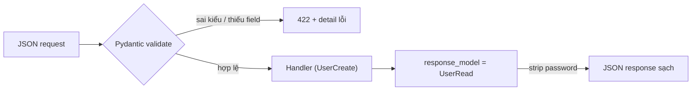

# 🎓 Pydantic Models — Validation + Serialization của FastAPI

> **Tác giả:** Mr.Rom\
> **Phiên bản:** v1.1.2\
> **Tạo lúc:** 23/05/2026\
> **Cập nhật:** 13/06/2026\
> **Level:** Basic\
> **Tags:** [MUST-KNOW]\
> **Yêu cầu trước:** [Routes & Parameters](01_routes-and-parameters.md)

> 🎯 *Sâu vào **Pydantic v2** — viết model đúng cách: **separate Request vs Response model**, **nested model**, **validator custom**, **`response_model` exclude/include**, **Field()** validation, **alias**. Sau bài này bạn type-safe toàn API.*

## 🎯 Sau bài này bạn sẽ

- [ ] Phân biệt **input** model (Create/Update) vs **output** model (Read)
- [ ] Tách **`response_model`** khỏi `return type` → loại bỏ field nhạy cảm (password)
- [ ] **Nested model** (User chứa Address) + list nested
- [ ] **Field()** với constraint (`min_length`, `pattern`, `ge`/`le`)
- [ ] **Validator** custom (cross-field, format check)
- [ ] **Alias** field (Python `created_at` ↔ JSON `createdAt`)
- [ ] **Optional + default + `None`** đúng cách
- [ ] Sử dụng **Pydantic v2** features (`Annotated`, `Field()`, `model_validator`)

---

## Tình huống — bạn bị "trả lộ password trong response"

Bạn viết:

```python
class User(BaseModel):
    id: int
    email: str
    password: str
    name: str

@app.post("/users")
def create_user(user: User):
    db.save(user)
    return user        # ← Lộ password trong response!
```

Security audit:
- ❌ Response trả về `password` (cleartext lẽ ra hash).
- ❌ Client có thể GỬI `id` (lẽ ra server gán).
- ❌ Không validate email format.
- ❌ Không có cấu trúc nhiều cấp (Address nested).

Bạn ngơ:
- Một model dùng cho cả Request và Response — sai sao?
- Sao validate email/password?
- Nested model là gì?

→ Bài này dạy đầy đủ.

---

## 1️⃣ Tách Request vs Response model — Pattern quan trọng nhất

### ❌ Anti-pattern — 1 model cho tất cả

Beginner hay viết **1 Pydantic model dùng chung** cho mọi request + response. Tưởng tiết kiệm code nhưng tạo 2 bug nghiêm trọng — POST cho client gửi `id` (lẽ ra server gán) và response **lộ `password`**:

```python
class User(BaseModel):
    id: int
    email: str
    password: str
    name: str
```

Vấn đề:
- POST: client gửi `id` (lẽ ra server gán).
- Response: lộ `password`.

### ✅ Pattern chuẩn — tách 3 model

Pattern production: tách **`Base` → `Create` / `Update` / `Read`** với inheritance — mỗi model phục vụ 1 use case, field nào không phù hợp thì không có. Đây là pattern Pydantic recommend chính thức:

```python
class UserBase(BaseModel):
    email: str
    name: str

class UserCreate(UserBase):
    password: str          # Cho phép gửi khi tạo

class UserUpdate(BaseModel):
    email: str | None = None
    name: str | None = None
    # Không cho update password ở endpoint này (làm endpoint riêng /password)

class UserRead(UserBase):
    id: int
    created_at: datetime
    # KHÔNG có password!
```

### Endpoint dùng đúng

Mỗi endpoint match đúng model: POST nhận `UserCreate`, PATCH nhận `UserUpdate`, mọi response dùng `response_model=UserRead`. FastAPI **tự strip field không có trong response_model** — đây là firewall chống leak password:

```python
@app.post("/users", response_model=UserRead, status_code=201)
def create_user(user: UserCreate) -> UserRead:
    db_user = db.create(user)
    return db_user        # ← password bị strip tự động khi convert sang UserRead

@app.patch("/users/{id}", response_model=UserRead)
def update_user(id: int, user: UserUpdate) -> UserRead:
    return db.update(id, user)

@app.get("/users/{id}", response_model=UserRead)
def get_user(id: int) -> UserRead:
    return db.find(id)
```

→ `response_model=UserRead` = FastAPI **strip** mọi field không có trong UserRead, kể cả `password` bạn lỡ return.

> 💡 **Quy tắc 2026**: mọi endpoint nên có `response_model`. Đó là **firewall** chống leak data.

Toàn bộ vòng đời validate — từ JSON request vào đến JSON response ra — gói gọn trong sơ đồ sau:



→ Pydantic đứng gác **2 cửa**: cửa vào reject data sai (422 trước khi handler chạy), cửa ra lọc field nhạy cảm — handler ở giữa chỉ lo business logic.

---

## 2️⃣ `Field()` — Validate + metadata

`Field()` cho phép thêm **constraint validation** (min_length, ge, pattern) + **metadata** (description, examples) vào field. Validation fail → response 422 với detail rõ ràng, không cần viết tay check:

```python
from pydantic import BaseModel, Field

class ProductCreate(BaseModel):
    name: str = Field(..., min_length=2, max_length=100, description="Tên sản phẩm")
    price: int = Field(..., ge=0, le=1_000_000_000, description="Giá VND")
    sku: str = Field(..., pattern=r"^[A-Z0-9-]+$", examples=["IPH-15-256"])
    discount: float = Field(default=0.0, ge=0.0, le=1.0)
    description: str | None = Field(default=None, max_length=2000)
```

| Constraint | Cho field |
|---|---|
| `min_length` / `max_length` | str, list |
| `ge` / `le` / `gt` / `lt` | int, float |
| `pattern` | str (Pydantic v2; v1 cũ là `regex`) |
| `examples=[...]` | metadata cho Swagger UI |
| `description="..."` | metadata cho Swagger UI |
| `default=...` / `...` (required) | default value |
| `alias="..."` | tên JSON khác |

→ Validation fail → 422 với detail rõ ràng.

### Swagger UI tự đẹp

`Field(description="Tên sản phẩm", examples=["iPhone"])` → Swagger UI hiển thị description + example. Đỡ viết docs riêng.

---

## 3️⃣ Validator custom — `field_validator` & `model_validator`

### Validate 1 field

Khi constraint cần logic phức tạp (kiểm tra format custom, business rule), dùng `@field_validator("field_name")` decorator. Hàm validator nhận giá trị → return giá trị sau xử lý hoặc raise lỗi:

```python
from pydantic import BaseModel, field_validator

class User(BaseModel):
    email: str
    password: str

    @field_validator("email")
    @classmethod
    def email_must_contain_at(cls, v: str) -> str:
        if "@" not in v:
            raise ValueError("Email phải chứa @")
        return v.lower()        # ← có thể transform giá trị

    @field_validator("password")
    @classmethod
    def password_strength(cls, v: str) -> str:
        if len(v) < 8:
            raise ValueError("Password tối thiểu 8 ký tự")
        if not any(c.isdigit() for c in v):
            raise ValueError("Password phải có số")
        return v
```

→ Khi `User(email="bad", password="weak")` → `ValidationError`.

### Validate cross-field

```python
from pydantic import model_validator

class DateRange(BaseModel):
    start: date
    end: date

    @model_validator(mode="after")
    def check_dates(self):
        if self.end < self.start:
            raise ValueError("end phải sau start")
        return self
```

### Built-in email/url validation

Cài `pip install "pydantic[email]"`:

```python
from pydantic import BaseModel, EmailStr, HttpUrl

class User(BaseModel):
    email: EmailStr        # ← tự validate email format
    website: HttpUrl | None = None
```

→ Đỡ viết validator tay.

---

## 4️⃣ Nested model — model trong model

```python
class Address(BaseModel):
    street: str
    city: str
    country: str = "Vietnam"

class User(BaseModel):
    id: int
    name: str
    address: Address              # ← nested
    secondary_addresses: list[Address] = []   # ← list nested
```

Request JSON:

```json
{
  "id": 1,
  "name": "Nguyen Van A",
  "address": {"street": "Đ Trần Phú", "city": "Hà Nội"},
  "secondary_addresses": [
    {"street": "Đ Lê Lợi", "city": "Sài Gòn"}
  ]
}
```

→ FastAPI tự parse nested + validate đầy đủ + Swagger UI hiển thị structure đẹp.

### Sâu nhiều cấp

```python
class OrderItem(BaseModel):
    product_id: int
    qty: int

class Order(BaseModel):
    id: int
    items: list[OrderItem]
    customer: User
    delivery_address: Address
```

→ Order chứa User chứa Address chứa... vô hạn cấp đều OK.

---

## 5️⃣ `response_model` — Filter output mạnh hơn

### Exclude field

```python
@app.get("/users/{id}", response_model=UserRead, response_model_exclude={"password", "internal_id"})
def get_user(id: int):
    ...
```

### Include only

```python
@app.get("/users", response_model=list[UserRead], response_model_include={"id", "name"})
def list_users():
    ...
```

### Exclude None (gọn JSON)

```python
@app.get("/users/{id}", response_model=UserRead, response_model_exclude_none=True)
def get_user(id: int):
    ...
```

→ Field nào value = `None` sẽ bị bỏ khỏi JSON response.

---

## 6️⃣ Alias — tên Python khác tên JSON

Python convention: `snake_case`. JSON API có khi yêu cầu `camelCase`.

```python
from pydantic import BaseModel, Field, ConfigDict

class User(BaseModel):
    model_config = ConfigDict(populate_by_name=True)   # ← cho phép cả 2 tên

    user_id: int = Field(..., alias="userId")
    full_name: str = Field(..., alias="fullName")
    created_at: datetime = Field(..., alias="createdAt")
```

Request JSON:

```json
{"userId": 1, "fullName": "Nguyen Van A", "createdAt": "2025-01-15"}
```

→ Pydantic accept cả `user_id` lẫn `userId`. Response trả `userId` (alias).

### Global config

```python
from pydantic.alias_generators import to_camel

class User(BaseModel):
    model_config = ConfigDict(alias_generator=to_camel, populate_by_name=True)

    user_id: int
    full_name: str
    # Pydantic tự generate alias userId, fullName
```

→ Tiện khi nhiều model.

---

## 7️⃣ Optional + default + None — common bug

### 3 cách "optional"

```python
class A(BaseModel):
    field: str | None = None        # ✅ Optional, default None
    field: str = "default"           # ✅ Default value
    field: str | None                  # ❌ Required, có thể là None
    field: str                         # ❌ Required, không None
```

→ Pydantic phân biệt **default value** với **None type**:

```python
class User(BaseModel):
    email: str | None      # ← REQUIRED (không có default)
    name: str | None = None  # ← OPTIONAL (default None)
```

→ Lỗi thường: tưởng `str | None` = optional, nhưng vẫn required. Phải có `= None`.

### `Optional` cũ — Python 3.9- syntax

```python
from typing import Optional

class A(BaseModel):
    field: Optional[str] = None    # = str | None = None (Python 3.10+)
```

→ 2026 dùng `|` cú pháp mới. Code base cũ vẫn thấy `Optional`.

---

## 8️⃣ `model_dump()` + `model_validate()` — convert object ↔ dict

### Object → dict

```python
user = UserRead(id=1, name="Nguyen Van A", email="nguyenvana@ex.com")

user.model_dump()
# {"id": 1, "name": "Nguyen Van A", "email": "nguyenvana@ex.com"}

user.model_dump(exclude={"email"})
# {"id": 1, "name": "Nguyen Van A"}

user.model_dump_json()              # JSON string
# '{"id":1,"name":"Nguyen Van A","email":"nguyenvana@ex.com"}'

user.model_dump(by_alias=True)     # Dùng alias names
```

### dict → object

```python
data = {"id": 1, "name": "Nguyen Van A", "email": "nguyenvana@ex.com"}
user = UserRead.model_validate(data)

# JSON string
user = UserRead.model_validate_json('{"id":1,"name":"Nguyen Van A","email":"nguyenvana@ex.com"}')
```

> 💡 **Pydantic v1 vs v2**: cũ là `.dict()`, `.parse_obj()`. Mới là `.model_dump()`, `.model_validate()`. 2026 mọi project mới dùng v2.

---

## 9️⃣ Bạn viết lại API chuẩn

```python
from fastapi import FastAPI, HTTPException, status
from pydantic import BaseModel, EmailStr, Field
from datetime import datetime, timezone

app = FastAPI()

# --- Models ---

class UserBase(BaseModel):
    email: EmailStr
    name: str = Field(..., min_length=2, max_length=100)

class UserCreate(UserBase):
    password: str = Field(..., min_length=8)

class UserUpdate(BaseModel):
    email: EmailStr | None = None
    name: str | None = Field(default=None, min_length=2, max_length=100)

class UserRead(UserBase):
    id: int
    created_at: datetime

# --- Fake DB ---

users_db: list[dict] = []
next_id = 1

# --- Endpoints ---

@app.post("/users", response_model=UserRead, status_code=201)
def create_user(user: UserCreate):
    global next_id
    if any(u["email"] == user.email for u in users_db):
        raise HTTPException(409, "Email đã tồn tại")
    new = {
        "id": next_id,
        "email": user.email,
        "name": user.name,
        "password_hash": hash_password(user.password),    # ← KHÔNG lưu cleartext
        "created_at": datetime.now(timezone.utc)
    }
    users_db.append(new)
    next_id += 1
    return new      # response_model=UserRead → strip password_hash tự động


@app.get("/users/{id}", response_model=UserRead)
def get_user(id: int):
    for u in users_db:
        if u["id"] == id:
            return u
    raise HTTPException(404, "User not found")


def hash_password(p: str) -> str:
    # Demo - thực tế dùng bcrypt/argon2
    return f"hashed-{p}"
```

→ API này: validate đầy đủ, không leak password, status code chuẩn, response sạch.

---

## 💡 Cạm bẫy thường gặp & Best practice

1. **Dùng 1 model cho cả Request và Response** → leak password, cho client gửi field không nên. Pattern 3 model: Base / Create / Read.
2. **Quên `response_model`** → return object có thể leak field. Mọi endpoint nên có.
3. **`str | None` tưởng optional** → vẫn required. Phải `str | None = None`.
4. **Pydantic v1 syntax trong project v2** → `.dict()` → `.model_dump()`. `.parse_obj()` → `.model_validate()`.
5. **Validator nặng** (DB query, HTTP call) → chạy mỗi request → chậm. Validator chỉ làm format/range check, business logic ở endpoint.

---

## 🧠 Tự kiểm tra (Self-check)

1. Tại sao phải **tách 3 model** (Base/Create/Read)?
2. `str | None` vs `str | None = None` — khác sao?
3. Viết model `Order` chứa `list[OrderItem]` + `customer: User`.
4. `response_model_exclude_none=True` làm gì?
5. Cài Pydantic email validator?

<details>
<summary>Gợi ý đáp án</summary>

1. Vì **request** và **response** có cấu trúc khác:
   - Create: client gửi `password` không gửi `id`.
   - Update: chỉ field cần đổi (optional).
   - Read: server trả `id` + `created_at`, KHÔNG trả `password`.
   1 model = compromise nhiều thứ, lộ data hoặc cho client gửi field không nên.

2. `str | None` = required, có thể là None nhưng PHẢI có (gửi `null` hoặc value). `str | None = None` = optional + default None (có thể bỏ qua hoàn toàn).

3. ```python
   class OrderItem(BaseModel):
       product_id: int
       qty: int = Field(..., gt=0)

   class Order(BaseModel):
       id: int
       items: list[OrderItem]
       customer: User
   ```

4. Field nào value = None sẽ bị BỎ QUA khỏi JSON response. Tránh JSON có `{"foo": null, "bar": null, ...}` mà thay bằng `{}`.

5. `pip install "pydantic[email]"` → `from pydantic import EmailStr` → dùng `email: EmailStr`.
</details>

---

## ⚡ Tra cứu nhanh (Cheatsheet)

### Pattern 3-model

```python
class UserBase(BaseModel):
    email: EmailStr
    name: str

class UserCreate(UserBase):
    password: str

class UserUpdate(BaseModel):
    email: EmailStr | None = None
    name: str | None = None

class UserRead(UserBase):
    id: int
    created_at: datetime
```

### Field validation

```python
Field(..., min_length=2, max_length=100)
Field(..., ge=0, le=100)
Field(..., pattern=r"^\d+$")
Field(default=None, alias="userId")
```

### Validator

```python
@field_validator("email")
@classmethod
def normalize(cls, v): return v.lower()

@model_validator(mode="after")
def cross_field(self): ...; return self
```

### Endpoint response

```python
@app.get("/x", response_model=UserRead)
@app.get("/x", response_model=UserRead, response_model_exclude_none=True)
@app.get("/x", response_model=list[UserRead])
```

### Convert

```python
user.model_dump()              # → dict
user.model_dump_json()         # → JSON string
UserRead.model_validate(data)  # dict → object
```

---

## 📚 Từ Điển Thuật Ngữ (Glossary)

| Thuật ngữ | Ý nghĩa |
|---|---|
| **Pydantic** | Validation + serialization library cho Python |
| **`BaseModel`** | Class gốc cho mọi Pydantic model |
| **`Field()`** | Định nghĩa constraint + metadata cho field |
| **`@field_validator`** | Decorator validate 1 field |
| **`@model_validator`** | Decorator validate cross-field |
| **`response_model`** | FastAPI option — filter output theo schema |
| **`EmailStr` / `HttpUrl`** | Type built-in validate format |
| **Nested model** | Model trong model |
| **Alias** | Tên JSON khác tên Python |
| **`.model_dump()`** | Object → dict (Pydantic v2) |
| **`.model_validate()`** | dict → Object (Pydantic v2) |

---

## 🔗 Liên kết & Tài nguyên

### 🧭 Định hướng lộ trình học
- ⬅️ **Bài trước:** [Routes & Parameters — Path, Query, Body trong FastAPI](01_routes-and-parameters.md)
- ➡️ **Bài tiếp theo:** [Database với SQLModel — CRUD thực tế](03_database-with-sqlmodel.md)
- ↑ **Về cụm:** [python-fastapi README](../../README.md)

### 🌐 Tài nguyên tham khảo khác
- 📖 [FastAPI tutorial — Body](https://fastapi.tiangolo.com/tutorial/body/)
- 📖 [Pydantic v2 docs](https://docs.pydantic.dev/latest/)
- ➡️ **Bài tiếp theo:** [Pydantic v1 → v2 migration](https://docs.pydantic.dev/latest/migration/)
- 📖 [FastAPI — Response Model](https://fastapi.tiangolo.com/tutorial/response-model/)

---

> 🎯 *Sau bài này bạn type-safe toàn API + không leak data. Bài kế tiếp ghép vào **database thực** với SQLModel — kết hợp Pydantic + SQLAlchemy gọn nhất.*

---

## 📌 Nhật ký thay đổi (Changelog)

- **v1.0.0 (23/05/2026)** — Bản đầu tiên. Cluster `python-fastapi/` lesson 3/5. Cover: Anti-pattern 1 model + Pattern tách `Base/Create/Update/Read` + `Field()` constraint + metadata + `@field_validator` + `@model_validator` cross-field + `response_model` strip pattern.
- **v1.1.0 (25/05/2026)** — Bổ sung câu dẫn nhập cho §1 Anti-pattern 1 model + Pattern tách 3 model + Endpoint dùng đúng, §2 Field() validate, §3 Validate 1 field. Chuẩn hóa placeholder tên trong code mẫu. Thêm mục Changelog.
- **v1.1.1 (11/06/2026)** — Bổ sung sơ đồ vòng đời validate request → 422/handler → response_model cho trực quan.
- **v1.1.2 (13/06/2026)** — Sửa lỗi factual: `regex=` → `pattern=` trong `Field()` (Pydantic v2 bỏ `regex`); `datetime.utcnow()` → `datetime.now(timezone.utc)` (deprecated từ Python 3.12).
