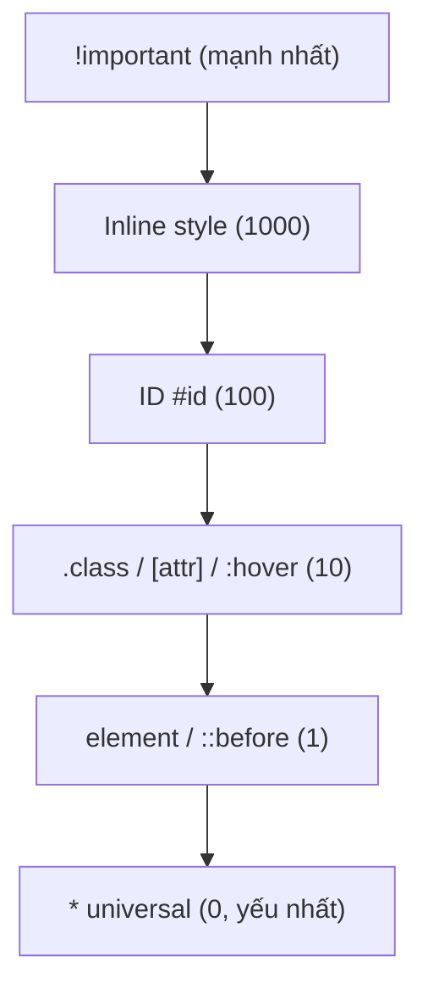

# 🎓 CSS Fundamentals — Selectors, Specificity, Box Model

> **Tác giả:** Mr.Rom\
> **Phiên bản:** v1.1.1\
> **Tạo lúc:** 23/05/2026\
> **Cập nhật:** 10/06/2026\
> **Level:** Basic\
> **Tags:** [MUST-KNOW]\
> **Yêu cầu trước:** [HTML Essentials](01_html-essentials.md)

> 🎯 *Master CSS thực sự: **3 cách include CSS**, **selectors** đầy đủ, **specificity** (vì sao style không apply), **box model** (margin/border/padding/content), **`box-sizing: border-box`**, **units** (px/rem/em/%/vh/vw), **CSS variables**, **`!important`** đừng lạm dụng.*

## 🎯 Sau bài này bạn sẽ

- [ ] 3 cách include CSS (inline / `<style>` / external `.css`)
- [ ] Master 10+ **selector** (class, ID, attribute, pseudo-class, combinator)
- [ ] Hiểu **specificity** (0,0,0,0) — vì sao style không apply
- [ ] Vẽ được **box model** + dùng `box-sizing: border-box`
- [ ] Phân biệt 6 **units**: `px`, `rem`, `em`, `%`, `vh`/`vw`, `ch`
- [ ] Dùng **CSS variables** (`--my-color`) cho theme
- [ ] Hiểu **cascade + inheritance**
- [ ] Biết khi nào dùng `!important` (= hầu như không bao giờ)

---

## Tình huống — Bạn viết CSS đầu, "Sao style không apply?"

Bạn viết:

```html
<button id="my-btn" class="btn primary">Click</button>
```

```css
.btn { background: blue; color: white; }
button { background: gray; }       /* Tại sao apply cái này??? */
#my-btn { background: red !important; color: yellow !important; }
.btn.primary { background: green; }
```

Bạn thắc mắc:
- Button **màu gì** thực sự?
- Sao **`button`** override **`.btn`**?
- **`!important`** mạnh đến đâu? Có 2 `!important` thì sao?
- Sao **`.btn.primary`** không thắng?

Senior chỉ:
> *"Đây gọi là **specificity** — CSS có luật rất chặt về priority. Biết luật = style đúng ý mình. Không biết = đập đầu vào tường rồi nhồi `!important` lung tung."*

→ Bài này dạy CSS cơ chế đầy đủ.

---

## 1️⃣ 3 cách include CSS

### 1. Inline — trong attribute `style`

Cách đơn giản nhất nhưng **tệ nhất** cho production — style trộn với HTML, không reuse được, specificity cao nhất khó override. Chỉ dùng cho dynamic JS set style hoặc email HTML (vì email client ít support `<style>`):

```html
<button style="background: blue; color: white;">Click</button>
```

→ Tiện nhanh nhưng **specificity cao nhất** + KHÔNG reuse được. Tránh trừ dynamic JS hoặc email HTML.

### 2. Internal — `<style>` trong `<head>`

CSS đặt trong `<style>` tag bên trong `<head>` — phù hợp single-page demo hoặc critical CSS inline cho first-paint. Browser parse cùng HTML, không cần extra request:

```html
<head>
  <style>
    button { background: blue; }
  </style>
</head>
```

→ OK cho single-page demo, code không reuse.

### 3. External — file `.css` riêng (recommended)

File `.css` riêng tham chiếu qua `<link>` — đây là **best practice 2026**. Browser cache file CSS, reuse cross-page, minify được, dễ maintain. Mọi project production đều dùng:

```html
<head>
  <link rel="stylesheet" href="/styles.css">
</head>
```

→ **Best practice 2026**: external file, reuse cross-page, browser cache.

### Khi nào dùng cái nào?

3 cách trên đều **valid** nhưng mỗi cách có sweet spot riêng. Bảng quick decision giúp pick đúng theo context:

| Cách | Khi nào |
|---|---|
| External `.css` | **Default 2026** — mọi production |
| `<style>` internal | Single page demo / critical CSS inline |
| `style` inline | Dynamic JS set / email HTML / quick fix |

---

## 2️⃣ Anatomy CSS rule

Mỗi CSS rule có **3 thành phần** rõ ràng — selector (chọn element nào), property (đổi gì), value (đổi thành gì). Cú pháp đơn giản nhưng cần biết tên đúng để đọc tài liệu CSS:

```css
selector {
  property: value;
  property2: value2;
}
```

Ví dụ:
```css
h1 {
  color: red;
  font-size: 24px;
  margin-top: 10px;
}
```

| Phần | Tên |
|---|---|
| `h1` | **Selector** — chọn element |
| `color`, `font-size`, ... | **Property** — thuộc tính |
| `red`, `24px`, ... | **Value** |
| `color: red;` | **Declaration** |
| `{ ... }` | **Declaration block** |

---

## 3️⃣ 10+ selectors phổ biến

### Type selector — theo tag

```css
h1 { color: red; }
p { line-height: 1.5; }
```

### Class selector — `.classname`

```css
.btn { padding: 10px 20px; }
.btn-primary { background: blue; }
```

→ **Recommended** cho 90% case. Class reusable, specificity vừa phải.

### ID selector — `#idname`

```css
#header { position: sticky; top: 0; }
```

→ **Hiếm dùng cho CSS** — specificity quá cao (khó override). Dùng cho JS / anchor link.

### Attribute selector — `[attr]`

```css
[type="email"] { background: lightyellow; }
[disabled] { opacity: 0.5; cursor: not-allowed; }
a[href^="https"] { color: green; }              /* starts with */
a[href$=".pdf"] { color: red; }                  /* ends with */
[class*="btn"] { font-weight: bold; }            /* contains */
```

### Pseudo-class — `:state`

```css
a:hover { color: red; }                          /* hover chuột */
a:focus { outline: 2px solid blue; }              /* focus keyboard */
a:active { color: orange; }                       /* đang click */
a:visited { color: purple; }                       /* đã thăm */

input:invalid { border-color: red; }
input:disabled { opacity: 0.5; }
input:checked { background: blue; }

li:first-child { font-weight: bold; }
li:last-child { border-bottom: none; }
li:nth-child(odd) { background: #eee; }
li:nth-child(3n+1) { color: red; }                /* 1st, 4th, 7th, ... */

p:empty { display: none; }
p:not(.special) { color: gray; }                  /* not match */

article:has(img) { background: #f0f0f0; }         /* :has() 2023 — parent selector */
```

### Pseudo-element — `::part`

```css
p::first-line { font-weight: bold; }
p::first-letter { font-size: 2em; }
a::before { content: "→ "; }
a::after { content: " ←"; }
::selection { background: yellow; }                /* khi user select */
::placeholder { color: gray; }
```

→ `::before` / `::after` không tạo HTML thật — chèn content qua CSS.

### Combinator — quan hệ giữa selector

```css
/* Descendant — bất kỳ con cháu */
article p { line-height: 1.6; }

/* Direct child — con trực tiếp */
ul > li { list-style: square; }

/* Adjacent sibling — anh em ngay cạnh */
h2 + p { margin-top: 0; }

/* General sibling — anh em sau */
h2 ~ p { color: gray; }
```

### Group selector — nhiều selector cùng style

```css
h1, h2, h3 { font-family: serif; }
.btn, .link, button { cursor: pointer; }
```

### Universal selector — `*`

```css
*, *::before, *::after {
  box-sizing: border-box;
  margin: 0;
  padding: 0;
}
```

→ Hiệu năng kém nếu lạm dụng. Dùng cho **reset** đầu file CSS, không elsewhere.

---

## 4️⃣ Specificity — luật ai thắng

Khi 2+ rule cùng apply 1 element, **specificity cao hơn thắng**. Tính theo 4 cấp `(A, B, C, D)`:

| Cấp | Tăng khi |
|---|---|
| **A** | Inline style (`style="..."`) |
| **B** | ID selector (`#id`) |
| **C** | Class, attribute, pseudo-class (`.cls`, `[attr]`, `:hover`) |
| **D** | Type, pseudo-element (`p`, `::before`) |

Khi nhiều rule cùng nhắm 1 element, trình duyệt chọn rule có specificity cao hơn. Sơ đồ dưới xếp hạng từ mạnh nhất xuống yếu nhất:



→ Selector càng lên cao trong sơ đồ càng thắng, nên hạn chế ID + `!important` để CSS dễ override.

Đọc số: `(A, B, C, D)` so sánh từ trái — A trước, B sau, ...

### Ví dụ tính specificity

| Selector | A | B | C | D | Tổng |
|---|---|---|---|---|---|
| `p` | 0 | 0 | 0 | 1 | `(0,0,0,1)` |
| `.btn` | 0 | 0 | 1 | 0 | `(0,0,1,0)` |
| `#header` | 0 | 1 | 0 | 0 | `(0,1,0,0)` |
| `ul li` | 0 | 0 | 0 | 2 | `(0,0,0,2)` |
| `.btn.primary` | 0 | 0 | 2 | 0 | `(0,0,2,0)` |
| `#header .btn` | 0 | 1 | 1 | 0 | `(0,1,1,0)` |
| `style="..."` (inline) | 1 | 0 | 0 | 0 | `(1,0,0,0)` |
| `!important` | — | — | — | — | **Override mọi thứ** |

### Quay lại case button ở tình huống đầu bài

```css
.btn { background: blue; }                /* (0,0,1,0) */
button { background: gray; }               /* (0,0,0,1) — thua .btn */
#my-btn { background: red !important; }    /* (0,1,0,0) + !important — WIN */
.btn.primary { background: green; }        /* (0,0,2,0) — thua #my-btn */
```

→ Button cuối cùng **đỏ** (vì `#my-btn !important`).

### Cascade order (khi specificity bằng nhau)

```
1. Author !important
2. User !important
3. Browser default !important
4. Inline style
5. Author CSS
6. User CSS
7. Browser default
```

→ Trong cùng cấp + cùng specificity → **CSS sau** thắng (cascade theo thứ tự source).

### Quy tắc thực hành

1. **Dùng class** cho 90% — specificity vừa, dễ override.
2. **Tránh ID** trong CSS — specificity cao quá, khó.
3. **Tránh `!important`** — chỉ khi force override 3rd-party.
4. **Nested không quá 3 level** — `.card .header .title` đủ rồi.

---

## 5️⃣ Box model — Mọi element là 1 hộp

```
┌─────────────────────────────────────────────┐
│         MARGIN                              │
│   ┌─────────────────────────────────────┐   │
│   │       BORDER                        │   │
│   │   ┌───────────────────────────────┐ │   │
│   │   │     PADDING                   │ │   │
│   │   │   ┌───────────────────────┐   │ │   │
│   │   │   │   CONTENT             │   │ │   │
│   │   │   │   (width × height)    │   │ │   │
│   │   │   └───────────────────────┘   │ │   │
│   │   └───────────────────────────────┘ │   │
│   └─────────────────────────────────────┘   │
└─────────────────────────────────────────────┘
```

```css
.box {
  width: 300px;
  height: 200px;
  padding: 20px;
  border: 5px solid black;
  margin: 30px;
}
```

### Tính toán total size

**Default** (`box-sizing: content-box`):
```
Total width  = width + padding-x*2 + border-x*2 + margin-x*2
            = 300 + 40 + 10 + 60 = 410px

Total height = height + padding-y*2 + border-y*2 + margin-y*2
            = 200 + 40 + 10 + 60 = 310px
```

→ Khó tính → vỡ layout.

### `box-sizing: border-box` (modern recommended)

```css
* { box-sizing: border-box; }     /* Apply mọi element */
```

→ `width: 300px` **bao gồm** padding + border:
```
Outer width = 300px (đúng như khai báo)
Content width = 300 - padding*2 - border*2 = 250px
```

→ Dễ tính + responsive dễ hơn. **2026 default** mọi reset CSS.

### Margin shorthand

```css
margin: 10px;                   /* All 4 sides */
margin: 10px 20px;              /* Y X */
margin: 10px 20px 30px;          /* Top X Bottom */
margin: 10px 20px 30px 40px;     /* T R B L (clockwise from top) */
```

→ Padding shorthand giống. Border: `border: 1px solid red`.

### Margin collapse — gotcha

```html
<p style="margin-bottom: 30px;">A</p>
<p style="margin-top: 20px;">B</p>
```

→ Khoảng cách A-B **không phải 50px** mà **30px** (lấy giá trị lớn hơn). Gọi **margin collapse**.

→ Tránh: dùng `padding` thay margin, hoặc `display: flex`/`grid` (không collapse).

---

## 6️⃣ Units — `px`, `rem`, `em`, `%`, `vh`/`vw`, `ch`

### Absolute units

```css
font-size: 16px;          /* Pixel — fixed */
width: 200pt;              /* Point — print */
margin: 1cm;                /* Cm, mm, in — print */
```

→ `px` phổ biến nhất.

### Relative units

```css
font-size: 1rem;          /* Relative to ROOT html font-size */
font-size: 1em;            /* Relative to PARENT font-size */
width: 50%;                 /* Relative to PARENT width */
height: 100vh;             /* Viewport height (full screen) */
width: 100vw;               /* Viewport width */
font-size: 1ch;             /* Width of "0" character */
font-size: clamp(1rem, 2vw, 2rem);   /* Fluid — min/preferred/max */
```

### Khi nào dùng cái nào?

| Unit | Khi |
|---|---|
| **`rem`** | **Default 2026** — font-size, spacing nhất quán theo root |
| **`em`** | Khi cần scale theo parent (vd icon trong button) |
| **`px`** | Border (1px sharp), small spacing, when need exact |
| **`%`** | Width relative to parent (flex/grid time ít cần) |
| **`vh`/`vw`** | Full-screen hero section, modal |
| **`ch`** | Max-width text (~60-75ch reading optimal) |
| **`clamp()`** | Responsive font size không cần media query |

### Why prefer `rem` over `px` for font

```css
html { font-size: 16px; }                   /* Default */

p { font-size: 1rem; }                       /* = 16px */
h1 { font-size: 2rem; }                       /* = 32px */
```

→ User đổi font size browser (a11y) → toàn site scale theo. Với `px`, không scale.

---

## 7️⃣ CSS Variables — Theme + Design tokens

```css
:root {
  /* Color tokens */
  --color-primary: #2563eb;
  --color-secondary: #f59e0b;
  --color-text: #1f2937;
  --color-bg: #ffffff;

  /* Spacing tokens */
  --spacing-sm: 0.5rem;
  --spacing-md: 1rem;
  --spacing-lg: 2rem;

  /* Font tokens */
  --font-base: system-ui, sans-serif;
  --font-mono: "Fira Code", monospace;

  /* Radius */
  --radius-sm: 4px;
  --radius-md: 8px;
}

.btn {
  background: var(--color-primary);
  padding: var(--spacing-sm) var(--spacing-md);
  border-radius: var(--radius-md);
}

/* Dark theme */
[data-theme="dark"] {
  --color-text: #f9fafb;
  --color-bg: #111827;
}
```

→ Đổi `data-theme="dark"` trên `<html>` → mọi color đổi.

### Pros vs SCSS variables

| Aspect | CSS variables | SCSS variables |
|---|---|---|
| Runtime | ✅ Đổi qua JS | ❌ Compile time |
| Theme switch | ✅ Native | Cần class toggle |
| Cascade | ✅ Inherit | ❌ |
| Tooling | Browser tự | Cần Sass compile |

→ **2026 default**: CSS variables. SCSS variables chỉ khi cần build-time math.

---

## 8️⃣ Cascade + Inheritance

### Inheritance — kế thừa từ parent

```html
<div class="parent">
  <p>Inherits color from parent</p>
</div>
```

```css
.parent { color: red; font-family: serif; }
/* <p> inside tự lấy color: red, font: serif */
```

| Inherit | Không inherit |
|---|---|
| `color`, `font-*`, `line-height`, `text-align`, `visibility` | `border`, `background`, `margin`, `padding`, `width`, `height` |

→ Property liên quan **text** thường inherit. Property **box** không.

### Force inherit / reset

```css
.child {
  color: inherit;          /* Bắt buộc inherit */
  border: initial;         /* Reset về default browser */
  padding: unset;          /* Inherit nếu có, else initial */
  all: revert;              /* Revert về user-agent stylesheet */
}
```

### Cascade order (tổng kết)

```
1. !important user agent (browser default)
2. !important author (CSS của bạn)
3. Inline style="..."
4. Author CSS (specificity)
5. User CSS
6. Browser default (user-agent stylesheet)
```

→ Trong cùng layer + cùng specificity → **last declared wins**.

---

## 9️⃣ `!important` — chỉ khi tuyệt vọng

```css
.btn {
  color: red !important;
}
```

→ `!important` **bỏ qua specificity rules** — luôn thắng (trừ `!important` cao hơn trong cascade).

### Khi nào dùng?

- ✅ Override **3rd-party library** (Bootstrap, MUI) khi không sửa được source.
- ✅ Utility classes (Tailwind `text-red-500!`).
- ❌ Fix bug specificity → tăng specificity selector thay vì `!important`.
- ❌ Lazy → "không apply, thêm `!important`" → debt code.

### Hậu quả lạm dụng

```css
.btn { color: red !important; }
.btn-large { color: blue !important; }      /* Cannot override .btn ??? */
```

→ Specificity war. CSS không maintain được. Refactor toàn bộ.

---

## 1️⃣0️⃣ Bạn viết style cho login form (bài 02)

```css
:root {
  --color-primary: #2563eb;
  --color-error: #dc2626;
  --color-text: #1f2937;
  --color-border: #d1d5db;
  --spacing-sm: 0.5rem;
  --spacing-md: 1rem;
  --spacing-lg: 1.5rem;
  --radius-md: 8px;
}

* {
  box-sizing: border-box;
  margin: 0;
  padding: 0;
}

body {
  font-family: system-ui, -apple-system, sans-serif;
  color: var(--color-text);
  line-height: 1.5;
  padding: var(--spacing-lg);
}

form {
  max-width: 400px;
  margin: 0 auto;
  display: flex;
  flex-direction: column;
  gap: var(--spacing-md);
}

.field {
  display: flex;
  flex-direction: column;
  gap: var(--spacing-sm);
}

label {
  font-weight: 600;
}

input {
  padding: var(--spacing-sm) var(--spacing-md);
  border: 1px solid var(--color-border);
  border-radius: var(--radius-md);
  font-size: 1rem;
  font-family: inherit;
}

input:focus {
  outline: 2px solid var(--color-primary);
  outline-offset: 2px;
  border-color: var(--color-primary);
}

input:invalid:not(:placeholder-shown) {
  border-color: var(--color-error);
}

button {
  padding: var(--spacing-sm) var(--spacing-md);
  background: var(--color-primary);
  color: white;
  border: none;
  border-radius: var(--radius-md);
  font-size: 1rem;
  font-weight: 600;
  cursor: pointer;
}

button:hover {
  filter: brightness(0.95);
}

button:focus-visible {
  outline: 2px solid var(--color-primary);
  outline-offset: 2px;
}

small {
  color: #6b7280;
  font-size: 0.875rem;
}
```

→ Form đẹp + accessible + theme-able. Layout chi tiết với Flexbox/Grid ở [bài 04](04_layout-flexbox-grid-responsive.md).

---

## 💡 Cạm bẫy thường gặp & Best practice

1. **Lạm dụng `!important`** → specificity war, debt code không maintain. Tăng specificity selector thay vì.
2. **ID trong CSS** → specificity quá cao, khó override. Dùng class.
3. **Box-sizing default `content-box`** → vỡ layout. **Luôn** set `* { box-sizing: border-box }` đầu CSS.
4. **`px` cho mọi thứ** → user a11y zoom không hoạt động. Dùng `rem` cho font, spacing.
5. **Margin collapse confusion** → 30px + 20px = 30px (không 50px). Dùng flex/grid hoặc padding để tránh.

---

## 🧠 Tự kiểm tra (Self-check)

1. 3 cách include CSS — chọn cái nào cho production?
2. Tính specificity của `#header .nav li.active a:hover`?
3. `box-sizing: border-box` khác `content-box` sao?
4. `rem` vs `em` — khi nào dùng cái nào?
5. CSS variables — vì sao tốt hơn SCSS variables 2026?

<details>
<summary>Gợi ý đáp án</summary>

1. (a) Inline `style=""` — tránh. (b) Internal `<style>` — single page. (c) External `.css` — **production default**. Cache browser tốt, reuse, separation of concerns.

2. `(0, 1, 2, 2)`: 1 ID (`#header`), 2 class/pseudo-class (`.nav`, `.active`, `:hover` = 3 thực ra), 2 type (`li`, `a`). Let me recount:
   - `#header` → B=1
   - `.nav` → C=1, `.active` → C=1, `:hover` → C=1 → C=3
   - `li`, `a` → D=2
   - Total: `(0, 1, 3, 2)`

3. **`content-box`** (default): `width` = chỉ content, total = width + padding + border. **`border-box`** (modern): `width` = total bao gồm padding + border. `border-box` dễ tính + responsive friendly. **2026 default** mọi reset.

4. **`rem`** = relative to **root** (`html { font-size: 16px }`) — nhất quán toàn site. **`em`** = relative to **parent** — scale theo context (vd icon trong button to lên khi button to). Default: dùng `rem` cho font-size + spacing. `em` khi cần local scale.

5. CSS variables: (a) **Runtime** — đổi qua JS / theme switch. (b) **Native** — không cần build. (c) **Cascade + inherit** — child element override parent. (d) **DevTools editable** — debug dễ. SCSS variables compile-time only — đổi = rebuild.
</details>

---

## ⚡ Tra cứu nhanh (Cheatsheet)

### Selectors

```css
*               h1              .class         #id
[attr]          [attr=val]      [attr^=start]  [attr$=end]
:hover :focus :active :visited :first-child :last-child :nth-child()
::before ::after ::placeholder ::selection
a, b (group)    a b (descendant)   a > b (child)
a + b (adjacent sibling)   a ~ b (general sibling)
:has()           :not(.x)
```

### Box model

```css
* { box-sizing: border-box; }
margin: 10px 20px;     padding: 10px;
border: 1px solid red; outline: 2px solid blue;
```

### Units

```
px    fixed
rem   relative root (default font-size)
em    relative parent
%     relative parent
vh/vw viewport height/width
ch    character width
clamp(min, ideal, max)
```

### Variables

```css
:root { --primary: #2563eb; }
.btn { color: var(--primary); }
```

### Specificity

```
Inline > ID > Class > Type
`!important` > everything (avoid!)
Same specificity → last declared wins
```

---

## 📚 Từ Điển Thuật Ngữ (Glossary)

| Thuật ngữ | Ý nghĩa |
|---|---|
| **Selector** | Mẫu chọn element áp dụng style |
| **Specificity** | Luật ưu tiên khi nhiều rule conflict |
| **Cascade** | Thứ tự CSS apply (browser → user → author) |
| **Inheritance** | Property kế thừa từ parent (color, font-*) |
| **Box model** | Margin / Border / Padding / Content |
| **`box-sizing: border-box`** | Width bao gồm padding + border |
| **Pseudo-class** | `:hover`, `:focus` — state |
| **Pseudo-element** | `::before`, `::after` — phần ảo của element |
| **Combinator** | ` `, `>`, `+`, `~` — quan hệ giữa selector |
| **CSS variable** | `--name: value` + `var(--name)` |
| **`rem` / `em`** | Relative units to root / parent |
| **Margin collapse** | Margin top + bottom lấy max, không cộng |
| **`!important`** | Override mọi specificity (avoid) |
| **CSS reset** | Normalize.css, modern-css-reset — base style |

---

## 🔗 Liên kết & Tài nguyên

### 🧭 Định hướng lộ trình học
- ⬅️ **Bài trước:** [Forms & Accessibility — Input đúng cách + a11y basic](02_forms-and-accessibility.md)
- ➡️ **Bài tiếp theo:** [Layout — Flexbox, Grid, Responsive Design](04_layout-flexbox-grid-responsive.md)
- ↑ **Về cụm:** [html-css README](../../README.md)

### 🌐 Tài nguyên tham khảo khác
- 📖 [MDN — CSS Reference](https://developer.mozilla.org/en-US/docs/Web/CSS/Reference)
- 📖 [CSS-Tricks Almanac](https://css-tricks.com/almanac/) — properties + tutorials
- 📖 [Specificity Calculator](https://specificity.keegan.st/)
- 📖 [Modern CSS Reset — Andy Bell](https://piccalil.li/blog/a-more-modern-css-reset/)
- 📖 [Every Layout — Heydon + Andy](https://every-layout.dev/)
- 📖 [State of CSS 2024](https://stateofcss.com/) — survey trend

---

> 🎯 *Sau bài này bạn style được trang đầy đủ + hiểu specificity. Bài cuối cluster dạy **Flexbox + Grid + Responsive** — layout 2026 nhất.*

---

## 📌 Nhật ký thay đổi (Changelog)

- **v1.0.0 (23/05/2026)** — Bản đầu tiên. Cluster `html-css/` lesson 4/5. Cover: 3 cách include CSS + anatomy rule + selectors (basic + combinator + pseudo-class + pseudo-element + attribute) + specificity rules + cascade order + box model + units (px/em/rem/%) + colors + font + CSS variables.
- **v1.1.0 (25/05/2026)** — Bổ sung lời dẫn trước mục 3 cách include CSS (Inline, Internal, External, bảng quyết định) và mục Anatomy CSS rule. Thêm mục Changelog.
- **v1.1.1 (10/06/2026)** — Bổ sung sơ đồ CSS specificity ranking cho trực quan.
