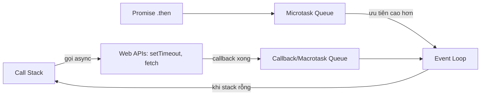

# 🎓 JavaScript là gì? — Ngôn ngữ chính của browser

> **Tác giả:** Mr.Rom\
> **Phiên bản:** v1.1.1\
> **Tạo lúc:** 23/05/2026\
> **Cập nhật:** 10/06/2026\
> **Level:** Basic\
> **Tags:** [MUST-KNOW]\
> **Yêu cầu trước:** [HTML & CSS là gì](../../../html-css/lessons/01_basic/00_what-is-html-and-css.md)

> 🎯 *Bài INTRO. Hiểu **JavaScript là gì** (browser + Node), **ECMAScript** evolution (ES6 → ES2025), **JS engine** (V8/JSCore), **single-thread + event loop**, **TypeScript** so sánh, **3 cách chạy JS**, và **console.log** debug. KHÔNG dạy syntax chi tiết (bài 01 trở đi).*

## 🎯 Sau bài này bạn sẽ

- [ ] Hiểu **JS = browser** + **Node.js = JS ngoài browser**
- [ ] ECMAScript evolution: ES5 → **ES6 (2015)** → ES2025
- [ ] **3 cách include JS** trong HTML
- [ ] Hiểu **JS engine** (V8/JSCore/SpiderMonkey) + **JIT compilation**
- [ ] **Single thread** + **event loop** + **non-blocking**
- [ ] So sánh **JavaScript** vs **TypeScript**
- [ ] Dùng **console.log** + **debugger** + DevTools
- [ ] Biết **dynamic typing** + **type coercion** (gotcha)

---

## Tình huống — Bạn muốn thêm interactivity cho trang

Bạn đã có HTML+CSS đẹp ([cluster trước](../../../html-css/)). Trang trông OK nhưng **chết** — không tương tác.

Bạn muốn:
- Click button "Mua" → hiển thị alert "Đã thêm vào giỏ"
- Form login → validate email trước submit
- Click filter "Phone" → lọc danh sách sản phẩm không reload page
- Fetch data sản phẩm từ FastAPI backend → render lên trang

→ **Cần JavaScript**.

Bạn thử:
```html
<button onclick="alert('Hi')">Click</button>
```

→ Có alert. Nhưng:
- `let` vs `const` vs `var` — chọn cái nào?
- `function` vs `=>` arrow — khác sao?
- **Async/await** nghe rần rộ — là gì?
- **TypeScript** đáng học không?
- JS chạy thế nào trong browser?

→ Bài này dạy bạn overview + lộ trình JS.

---

## 1️⃣ Vậy JavaScript là gì?

**JavaScript** = ngôn ngữ lập trình:
- Bắt đầu **trong browser** (1995 — Brendan Eich, Netscape, viết trong 10 ngày).
- Hiện chạy **mọi nơi**: browser, server (Node.js), mobile (React Native), desktop (Electron), embedded.

**ECMAScript** = chuẩn ngôn ngữ JavaScript (ECMA International maintain).

> 🧠 **Ẩn dụ — JS như tiếng Anh:**
> - 1995 sinh tại Mỹ (Netscape). Giờ là **lingua franca** — mọi nơi đều dùng.
> - **JavaScript** = thực thi (implementation).
> - **ECMAScript** = grammar book (specification).
> - "ES6" = phiên bản 6 grammar.

### Lịch sử — Các mốc quan trọng

JavaScript có lịch sử rất "messy" — tạo trong 10 ngày để cạnh tranh Microsoft, đổi tên 3 lần, mất 14 năm mới có version đột phá. Hiểu lịch sử giúp giải thích vì sao JS có nhiều quirks (`var` vs `let`, `==` vs `===`):

| Năm | Sự kiện |
|---|---|
| 1995 | Brendan Eich tạo trong **10 ngày** tại Netscape. Tên ban đầu "Mocha", rồi "LiveScript", cuối "JavaScript" (marketing đu Java) |
| 1997 | Standardized as **ECMAScript** (ECMA-262) |
| 1999 | **ES3** — RegExp, try/catch |
| 2009 | **ES5** — strict mode, JSON, Array methods (`forEach`, `map`...) |
| 2009 | **Node.js** ra đời — JS ngoài browser |
| **2015** | **ES6 / ES2015** — **GAME CHANGER**: `let`/`const`, arrow function, class, Promise, modules, template literal, destructure, spread |
| 2016+ | Mỗi năm thêm tính năng: `async/await`, optional chaining, nullish coalescing, etc. |
| 2025 | **ES2025** — Iterator helpers, Set methods, RegExp `v` flag, Temporal API |

### **JS modern = "ES6+"**

→ 2026 mọi code mới dùng **ES6+** (let/const, arrow, async/await, modules). `var` + `function() {}` + callback hell = legacy.

---

## 2️⃣ 3 cách include JS trong HTML

### 1. Inline event handler

Cách cũ nhất + tệ nhất — code JS nhúng thẳng vào attribute HTML. Tiện cho demo nhanh nhưng vi phạm separation of concerns, khó debug, không reuse được:

```html
<button onclick="alert('Hi')">Click</button>
```

→ Tiện nhanh. **Tránh production** — JS mix với HTML, khó maintain.

### 2. Internal `<script>` trong HTML

JS code embed bên trong `<script>` tag — tốt hơn inline nhưng vẫn mix HTML với JS. OK cho prototype hoặc bài demo nhỏ, không phù hợp production có nhiều file:

```html
<head>
  <script>
    console.log('Hello');
    function greet() { alert('Hi'); }
  </script>
</head>
```

→ OK cho demo. Real code → external file.

### 3. External file `.js` (recommended)

Cách chuẩn 2026 — JS lưu file riêng `.js`, browser cache được, dễ minify + bundle. HTML chỉ tham chiếu qua `<script src>`. Đây là pattern bạn dùng hàng ngày trong project:

```html
<script src="/app.js"></script>
```

→ **Best practice 2026** — separation of concerns + browser cache.

### Đặt `<script>` ở đâu?

Vị trí `<script>` quyết định **page render speed**. Mặc định JS **block parser** → để trong `<head>` thì trang trắng đến khi load xong JS. 3 chiến lược + best practice 2026:

```html
<!-- ❌ TRONG <head> (default block render) -->
<head>
  <script src="/app.js"></script>
</head>

<!-- ✅ CUỐI <body> -->
<body>
  ...
  <script src="/app.js"></script>
</body>

<!-- ✅ HOẶC dùng defer (modern preferred) -->
<head>
  <script src="/app.js" defer></script>
</head>
```

| Attribute | Hành vi |
|---|---|
| (none) | Block parsing HTML để download + execute |
| `async` | Download song song, **execute ngay khi xong** (có thể trước/sau HTML xong) |
| `defer` | Download song song, **execute sau khi HTML xong** (đúng thứ tự `<script>`) |
| `type="module"` | ES modules — tự `defer`, có scope riêng |

→ **Modern 2026 default**: `<script src="..." defer></script>` trong `<head>` HOẶC `<script type="module" src="..."></script>`.

---

## 3️⃣ JS engine + JIT compilation

JS không phải interpreted thuần — **JIT compile** (Just-In-Time) sang machine code.

### Engines phổ biến

| Engine | Browser | Người tạo |
|---|---|---|
| **V8** | Chrome, Edge, Node.js, Deno | Google |
| **JavaScriptCore** (JSC) | Safari, Bun | Apple |
| **SpiderMonkey** | Firefox | Mozilla |
| **Hermes** | React Native | Meta |

→ V8 **dominate** browser + server (Node.js).

### Flow execution

```
JS source code
   ↓
Parse → AST (Abstract Syntax Tree)
   ↓
Interpreter (Ignition) → bytecode (chạy ngay)
   ↓ (đoạn code hot)
JIT compiler (TurboFan) → optimized machine code
   ↓
CPU execute
```

→ Lần đầu chạy = chậm (parse + bytecode). Code "hot" (chạy nhiều) = compile native → tốc độ gần C++.

> 💡 V8 process ~1M dòng C++. Open-source. Reading V8 internals = learn how modern compiler works.

---

## 4️⃣ Single thread + Event loop

JS chạy **1 thread duy nhất** (main thread). Nhưng vẫn handle async (network, timer, event) **không block** nhờ **event loop**.

### Mô hình

```
┌──────────────┐       ┌──────────────┐
│ Call stack    │       │  Web APIs    │
│ (sync code)   │       │  - setTimeout│
│               │       │  - fetch     │
│               │       │  - DOM events│
└──────┬───────┘       └──────┬───────┘
       │                       │ Callback ready
       │                       ▼
       │              ┌────────────────┐
       │              │ Callback queue │
       │              │ (macro/micro)  │
       │              └──────┬─────────┘
       │   Stack empty?      │
       └◄────────────────────┘
              ↑
         Event loop (đường lặp)
```

JS đẩy tác vụ async sang Web APIs, callback xong xếp vào queue, rồi event loop đưa lại Call Stack khi stack rỗng. Sơ đồ dưới mô tả vòng lặp này (microtask ưu tiên hơn macrotask):



→ Nhờ vòng lặp này, JS 1 thread vẫn xử lý async mà không block UI.

### Code minh hoạ

```javascript
console.log('1');

setTimeout(() => console.log('2'), 0);    // ← Đẩy vào queue

Promise.resolve().then(() => console.log('3'));    // ← Microtask queue (priority)

console.log('4');
```

Output:
```
1
4
3    ← Microtask trước
2    ← Macrotask sau
```

→ Synchronous code chạy trước. Promise (microtask) trước setTimeout (macrotask).

### Hệ quả

- ✅ JS không **block** trên I/O — fetch không freeze browser.
- ❌ JS không có **threading** thật. CPU-intensive task block UI.
- → CPU-intensive: dùng **Web Workers** (parallel thread riêng).

---

## 5️⃣ Dynamic typing — Vừa tiện vừa lừa

JS là **dynamically typed** — biến không có type cố định.

```javascript
let x = 5;
x = "hello";        // OK — x giờ là string
x = true;            // OK — x giờ là boolean
x = [1, 2, 3];       // OK — array
```

→ Tiện cho prototype, nguy hiểm khi scale.

### Type coercion — "lừa" lớn nhất

```javascript
"5" + 3        // → "53"   (string concat)
"5" - 3        // → 2      (numeric subtract)
"5" == 5       // → true   (loose equality coerce)
"5" === 5      // → false  (strict — không coerce)

[] + []        // → ""     (array → string)
[] + {}        // → "[object Object]"
{} + []        // → 0      (tùy context, dễ confuse)

null == undefined        // → true
null === undefined        // → false
NaN === NaN                // → false  (NaN không bằng chính nó!)
0.1 + 0.2                  // → 0.30000000000000004 (floating point)
```

→ **Quy tắc**: **luôn dùng `===`** (strict equality), không `==`. Tránh phép cộng `+` lẫn lộn type.

### TypeScript — Cứu cánh

```typescript
let x: number = 5;
x = "hello";    // ← Compile error!
```

→ **TypeScript** = superset của JS, add static types. Compile sang JS. **2026 default cho project lớn**.

```
60-70% startup mới dùng TypeScript.
```

→ Bài này dạy JS thuần. TypeScript có cluster riêng (sẽ thêm).

---

## 6️⃣ JS values + types

### 8 types

| Type | Ví dụ |
|---|---|
| `number` | `42`, `3.14`, `NaN`, `Infinity` |
| `string` | `"hello"`, `'world'`, `` `template` `` |
| `boolean` | `true`, `false` |
| `null` | `null` (intentional empty) |
| `undefined` | `undefined` (uninitialized) |
| `symbol` | `Symbol('id')` (unique) |
| `bigint` | `123n` (arbitrary precision) |
| **`object`** | `{}`, `[]`, `function`, `class` |

→ 7 primitives + 1 object family. Function thực ra là object.

### `typeof` check

```javascript
typeof 42              // "number"
typeof "hi"             // "string"
typeof true             // "boolean"
typeof undefined        // "undefined"
typeof null             // "object"    ← LỊCH SỬ BUG (đã có 30 năm), không fix vì backward compat
typeof []               // "object"
typeof function(){}     // "function"

Array.isArray([])       // → true       (proper check array)
```

---

## 7️⃣ TypeScript vs JavaScript

| Aspect | JavaScript | TypeScript |
|---|---|---|
| Năm | 1995 | 2012 (Microsoft) |
| Type system | Dynamic, runtime | Static, compile-time |
| File | `.js` | `.ts` / `.tsx` |
| Run | Direct browser/Node | Compile → `.js` |
| Setup | Zero | `tsc`, `tsconfig.json` |
| Learning curve | Smaller | +1 layer (types) |
| Error catch | Runtime | **Compile time** ⭐ |
| IDE support | Good | **Excellent** (autocomplete đầy đủ) |
| Ecosystem | Universal | Growing (90%+ libraries có types) |

### Khi nào TS?

| Use case | Chọn |
|---|---|
| Hobby project, demo | JS |
| Solo coder, đã quen JS | JS hoặc TS |
| Team 2+ người | **TS** (catch bug compile-time) |
| Large enterprise | **TS** mặc định |
| Library code (npm package) | **TS** (consumers cần type hints) |

→ Bài này dạy JS thuần. Sau khi nắm JS → học TS dễ.

---

## 8️⃣ Console + DevTools — Debug bạn của dev

### `console.log` family

```javascript
console.log("hello");              // Generic
console.info("info");               // Same as log but icon (i)
console.warn("warning");            // Yellow
console.error("error");             // Red

console.log({ name: "Nguyen Van A", age: 28 });    // Object expandable
console.table([{a:1, b:2}, {a:3, b:4}]);   // Tabular
console.group("Section");
  console.log("Inside group");
console.groupEnd();

console.time("op");
// ... code ...
console.timeEnd("op");              // "op: 12.345ms"

console.trace();                     // Stack trace
console.dir(document.body);          // Object hierarchy
console.assert(x === 5, "x phải = 5");
```

### `debugger;` statement

```javascript
function process() {
  let x = 5;
  debugger;        // ← Browser stop ở đây khi DevTools mở
  x = x + 1;
}
```

→ Mở DevTools (F12), trang chạy → stop tại `debugger`. Inspect biến, step through.

### Sources tab — Set breakpoint

DevTools → Sources tab → file `.js` → click line number → breakpoint. Reload → stop tại đó.

### Network tab — Xem fetch

DevTools → Network → reload → thấy mọi HTTP request (xem [bài HTTP](../../../../../05_networking/http-https/lessons/01_basic/00_what-is-http.md)).

---

## 9️⃣ Bạn viết JS đầu tiên

### `app.js`

```javascript
console.log('Hello from Acme Shop!');

// Lấy button
const btn = document.querySelector('#cta');

// Add click listener
btn.addEventListener('click', () => {
  alert('Đã thêm vào giỏ hàng!');
});

// Fetch products from FastAPI
async function loadProducts() {
  try {
    const res = await fetch('http://localhost:8000/products');
    const products = await res.json();
    console.log('Products:', products);
  } catch (err) {
    console.error('Failed to fetch:', err);
  }
}

loadProducts();
```

### `index.html`

```html
<!DOCTYPE html>
<html lang="vi">
<head>
  <meta charset="UTF-8">
  <title>Acme Shop</title>
  <script src="/app.js" defer></script>
</head>
<body>
  <h1>Acme Shop</h1>
  <button id="cta">Mua ngay</button>
</body>
</html>
```

→ Mở browser → click button → alert. Console log "Products: [...]". **JavaScript live**.

→ Chi tiết các phần: bài 02 (DOM), 03 (event + async), 04 (fetch).

---

## 💡 Cạm bẫy thường gặp & Best practice

1. **Dùng `==` thay `===`** → type coercion bug. **Luôn `===`** (`!==`).
2. **Dùng `var`** → function-scoped + hoisting confuse. **Dùng `let`/`const`** (block-scoped, ES6).
3. **`<script>` không `defer`/`async`** → block render. Modern: `defer` trong `<head>`.
4. **`typeof null === "object"`** → lịch sử bug. Dùng `value === null` explicit.
5. **Forget `===` check `null` + `undefined`** → `null == undefined` true, `===` false. Cẩn thận.

---

## 🧠 Tự kiểm tra (Self-check)

1. **ES6** ra năm nào? 3 feature quan trọng nhất?
2. Khác **JavaScript** (browser) và **Node.js** (server)?
3. JS **single-thread** — sao vẫn handle async?
4. **`==`** vs **`===`** — chọn cái nào, vì sao?
5. **TypeScript** giúp gì? Có nên học JS trước?

<details>
<summary>Gợi ý đáp án</summary>

1. **2015 (ES2015 / ES6)** — biến đổi lớn nhất JS. **3 feature lớn**: (a) `let`/`const` block-scoped. (b) Arrow function `=>` + class. (c) Promise + module + template literal + destructure + spread. Sau đó mỗi năm thêm tính năng nhỏ.

2. **Browser JS** chạy trong browser, có `document`/`window`/DOM API, không có file system. **Node.js** chạy server, có `fs`/`http`/file API, không có DOM. Cùng ngôn ngữ (V8 engine), khác môi trường (runtime).

3. **Event loop** + **Web APIs**. Async op (fetch, setTimeout, event) handled bởi browser API (C++ background), khi xong push callback vào queue. Main thread chỉ chạy sync code; khi stack rỗng → pull callback từ queue. → Non-blocking.

4. **`===` strict equality** — không type coercion. `"5" === 5` → false. **`==` loose** — coerce: `"5" == 5` → true. **Luôn `===`** trừ khi cần explicit `== null` check (cả null + undefined).

5. **TypeScript** = JS + static types. Catch bug **compile-time** thay runtime. IDE autocomplete + refactor an toàn. Học JS trước (nắm semantics), TS sau (chỉ thêm type annotation). 2026 team 2+ người → TS default.
</details>

---

## ⚡ Tra cứu nhanh (Cheatsheet)

### Include JS

```html
<script src="/app.js" defer></script>          <!-- Modern -->
<script type="module" src="/app.js"></script>   <!-- ES modules -->
<script>console.log('inline')</script>           <!-- Inline -->
```

### 8 types

```
number  string  boolean  null  undefined  symbol  bigint  object
```

### Console

```javascript
console.log(value)
console.error("msg")
console.table([obj1, obj2])
console.time("name") ... console.timeEnd("name")
console.group("...") ... console.groupEnd()
debugger;   // ← stops if DevTools open
```

### Equality

```javascript
===   // ✅ strict (use this)
!==   // ✅ strict
==    // ❌ loose (avoid)
```

### History

```
1995  JS born (10 days)
2009  ES5 + Node.js
2015  ES6 — game changer
2020+ async/await, optional chaining, etc.
```

---

## 📚 Từ Điển Thuật Ngữ (Glossary)

| Thuật ngữ | Ý nghĩa |
|---|---|
| **JavaScript / JS** | Ngôn ngữ lập trình browser (and Node.js) |
| **ECMAScript / ES** | Standard cho JS, ECMA-262 |
| **ES6 / ES2015** | Major update 2015 — let/const, arrow, class, Promise, module |
| **V8 / JSC / SpiderMonkey** | JS engines (Chrome, Safari, Firefox) |
| **JIT compilation** | Just-In-Time — compile hot code → machine code |
| **Event loop** | Cơ chế xử lý async của JS |
| **Microtask / macrotask** | Promise / setTimeout queue priority |
| **Web Workers** | Thread thật cho CPU-bound task |
| **Dynamic typing** | Type runtime, không compile check |
| **Type coercion** | Auto convert type khi op (string + number, etc.) |
| **`===` strict equality** | So sánh không coerce |
| **TypeScript / TS** | JS + static types, compile → JS |
| **Node.js / Deno / Bun** | JS runtime ngoài browser |

---

## 🔗 Liên kết & Tài nguyên

### 🧭 Định hướng lộ trình học
- ➡️ **Bài tiếp theo:** [Variables, Functions, Types — JS core syntax](01_variables-functions-types.md)
- ↑ **Về cụm:** [javascript-dom README](../../README.md)

### 🧩 Các chủ đề có thể bạn quan tâm
- [HTML & CSS là gì](../../../html-css/lessons/01_basic/00_what-is-html-and-css.md) — JS làm việc với HTML/CSS
- [HTTP là gì](../../../../../05_networking/http-https/lessons/01_basic/00_what-is-http.md) — JS fetch HTTP
- [FastAPI](../../../../backend/python-fastapi/) — backend bạn gọi từ JS

### 🌐 Tài nguyên tham khảo khác
- 📖 [MDN JavaScript Guide](https://developer.mozilla.org/en-US/docs/Web/JavaScript/Guide)
- 📖 [javascript.info](https://javascript.info/) — best free book
- 📖 [Eloquent JavaScript — Marijn Haverbeke](https://eloquentjavascript.net/) — free online book
- 📖 [TC39 proposals](https://github.com/tc39/proposals) — ES future
- 📖 [V8 dev blog](https://v8.dev/blog) — engine internals
- 📖 [State of JS 2024](https://stateofjs.com/) — yearly survey

---

> 🎯 *Sau bài này bạn biết JS là gì, nơi nào, evolution. Bài kế tiếp dạy **variables + functions + types** — viết JS thuần chính xác.*

---

## 📌 Nhật ký thay đổi (Changelog)

- **v1.0.0 (23/05/2026)** — Bản đầu tiên. Cluster `javascript-dom/` lesson 1/5. Cover: JS là gì + history 30 năm + ECMAScript spec vs JS implementation + 3 cách include + script placement + ES6+ modern features overview + run JS (browser console + Node.js).
- **v1.1.0 (25/05/2026)** — Bổ sung lời dẫn trước mục Lịch sử (Việt hoá tiêu đề thành "Lịch sử — Các mốc quan trọng") và các mục Inline event, Internal script, External file, Đặt script ở đâu. Thêm mục Changelog.
- **v1.1.1 (10/06/2026)** — Bổ sung sơ đồ JS event loop cho trực quan.
