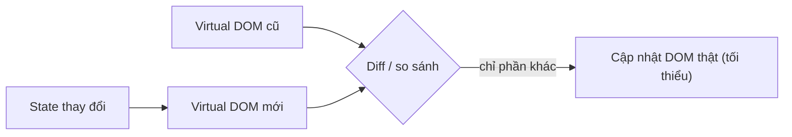

# 🎓 React là gì? — Component framework #1 cho frontend

> **Tác giả:** Mr.Rom\
> **Phiên bản:** v1.1.1\
> **Tạo lúc:** 23/05/2026\
> **Cập nhật:** 10/06/2026\
> **Level:** Basic\
> **Tags:** [MUST-KNOW]\
> **Yêu cầu trước:** [JavaScript modern](../../../javascript-dom/lessons/01_basic/01_variables-functions-types.md), [HTML+CSS](../../../html-css/lessons/01_basic/00_what-is-html-and-css.md)

> 🎯 *Bài INTRO. Hiểu **React là gì**, **JSX**, **Virtual DOM**, **declarative vs imperative**, **component philosophy**, **React vs Vue vs Svelte**, setup Vite + Hello World. KHÔNG dạy hooks chi tiết (bài 02 trở đi).*

## 🎯 Sau bài này bạn sẽ

- [ ] Hiểu **React là gì** + history (2013 Facebook → ~230k stars 2026)
- [ ] **JSX** — HTML + JS in one
- [ ] **Virtual DOM** + **reconciliation** — sao React fast
- [ ] **Declarative** vs **imperative** UI
- [ ] **Component philosophy** — building block của UI
- [ ] So sánh React vs Vue vs Svelte vs Angular
- [ ] Setup project với **Vite** + chạy Hello World
- [ ] Hiểu **React 19+** (2024-2025) features cơ bản

---

## Tình huống — Bạn thấy vanilla JS scale kém

Bạn có app vanilla JS ([cluster trước](../../../javascript-dom/)). Code chạy OK nhưng:

- 😱 1 file `app.js` 1000 dòng, mọi thứ trộn.
- 😱 Modify 1 phần → break phần khác (no isolation).
- 😱 Logic state spread khắp DOM (`localStorage` + global var + DOM dataset).
- 😱 Form login + cart + product list — code lặp lại (event listener, fetch, render).
- 😱 Update list item → re-render full list bằng `innerHTML` → mất focus input, scroll reset.

Bạn search "JS app organize" — gặp **React**. Người ta nói:
- Component-based — UI thành **lego blocks**.
- State + props — data flow rõ ràng.
- Reactivity — state đổi → UI tự update **chỉ chỗ cần**.
- 60-70% startup chọn React 2026.

Bạn ngơ:
- **JSX** là HTML hay JS?
- **Virtual DOM** là gì?
- React **chạy thế nào** trong browser?
- Học React **mất bao lâu**?

→ Bài này tổng quan. Bài 01-04 đi sâu component + state + effect + routing.

---

## 1️⃣ Vậy React là gì?

**React** = **library** (không "framework" theo nghĩa chặt) cho build UI bằng **components**.

- 2011 — Jordan Walke tại Facebook tạo (cho News Feed).
- 2013 — Open source.
- 2026 — **~230k+ GitHub stars**, dùng bởi Meta, Netflix, Airbnb, Uber, Microsoft.
- **React Native** (2015) — dùng cùng API build mobile app native.

> 🧠 **Ẩn dụ — React như Lego:**
> - UI = công trình Lego.
> - **Component** = từng viên Lego (Button, Card, Form).
> - **Props** = thông tin cho Lego (kích cỡ, màu).
> - **State** = trạng thái Lego (đang on/off, đang loading).
> - **JSX** = bản vẽ — mô tả Lego trông thế nào.

### Library vs Framework?

React được gọi là **library** (không phải framework) — chính thức. Khác biệt cốt lõi: ai quyết stack. Library cho bạn tự pick router/state/form, framework gò vào convention. Bảng so sánh 5 trục:

| Tiêu chí | Library (React) | Framework (Angular) |
|---|---|---|
| Quyết định | **Bạn quyết** stack | Framework quyết hết |
| Routing, state, etc. | Tự chọn (React Router, Zustand, ...) | Built-in |
| Học | Core nhỏ + ecosystem big | Full all-at-once |
| Flexibility | Cao | Thấp |
| Adoption | Bạn ghép | "Convention over config" |

→ React = **library** vì cho phép bạn pick router/state/forms từ ecosystem. Angular = framework opinion mạnh.

→ **2026 reality**: nhiều người gọi React "framework" vì có Next.js/Remix wrap. Strictly: React = library.

---

## 2️⃣ JSX — HTML trong JS

### Vanilla JS — Verbose

Để render UI bằng vanilla JS, cần **gọi imperative** từng method — createElement, set property, append. Code dài, khó đọc khi UI phức tạp. Đây là cách React giải quyết:

```javascript
const heading = document.createElement('h1');
heading.textContent = 'Hello, Nguyen Van A!';
heading.className = 'title';

const para = document.createElement('p');
para.textContent = 'Welcome to React.';

const div = document.createElement('div');
div.append(heading, para);
document.body.append(div);
```

### React JSX — Declarative

JSX cho phép viết UI dạng **declarative** — trông như HTML, nhưng thực ra là JS expression. Code ngắn, dễ đọc, dễ reason about. Same UI nhưng JSX gọn hơn ~3 lần vanilla JS:

```jsx
function App() {
  return (
    <div>
      <h1 className="title">Hello, Nguyen Van A!</h1>
      <p>Welcome to React.</p>
    </div>
  );
}
```

→ JSX **trông như HTML** nhưng thực ra là **JavaScript expression**.

### JSX quirks

JSX trông như HTML nhưng có **6 khác biệt quan trọng** — không nắm được sẽ ra ESLint error/runtime crash. Đặc biệt `className` thay `class` (vì `class` là keyword JS), camelCase event, expression trong `{}`:

```jsx
// 1. className thay class (vì 'class' là từ khóa JS)
<button className="btn primary">

// 2. camelCase cho attribute
<input onClick={handle} onChange={handle} tabIndex={0} />

// 3. JS expression trong {}
<h1>Hello, {name}!</h1>
<p>{age > 18 ? 'Adult' : 'Minor'}</p>
<ul>{items.map(i => <li key={i.id}>{i.name}</li>)}</ul>

// 4. Self-closing single-tag bắt buộc
     // ✅ /
<br />                            // ✅ /
<input />                          // ✅ /

// 5. Wrap multi-line trong ()
return (
  <div>
    ...
  </div>
);

// 6. 1 root element — dùng Fragment <>...</>  nếu không muốn extra <div>
return (
  <>
    <h1>Title</h1>
    <p>Body</p>
  </>
);
```

### JSX compile → JavaScript

Browser KHÔNG hiểu JSX — phải qua **build step** (Vite/Babel/esbuild) compile thành plain JS. Đây là lý do project React cần `npm run build`. JSX là **syntactic sugar** cho `React.createElement`:

```jsx
const el = <h1 className="title">Hello</h1>;

// Compile bởi Vite/Babel thành:
const el = React.createElement('h1', { className: 'title' }, 'Hello');
```

→ JSX = **syntactic sugar** cho `React.createElement`. Browser KHÔNG hiểu JSX — phải build step.

---

## 3️⃣ Component philosophy — Building block

### Component = function trả về JSX

```jsx
function Greeting() {
  return <h1>Hello!</h1>;
}

function App() {
  return (
    <div>
      <Greeting />
      <Greeting />        {/* Reuse */}
      <Greeting />
    </div>
  );
}
```

### Component với props

```jsx
function Greeting({ name }) {        // ← destructure props
  return <h1>Hello, {name}!</h1>;
}

<Greeting name="Nguyen Van A" />
<Greeting name="Le Van B" />
```

### Compose components

```jsx
function Avatar({ src, alt }) {
  return ;
}

function UserCard({ user }) {
  return (
    <div className="card">
      <Avatar src={user.avatar} alt={user.name} />
      <h2>{user.name}</h2>
      <p>{user.email}</p>
    </div>
  );
}

function App() {
  return (
    <div>
      <UserCard user={{ name: 'Nguyen Van A', email: 'nguyenvana@ex.com', avatar: '/nguyenvana.jpg' }} />
      <UserCard user={{ name: 'Le Van B', email: 'user@ex.com', avatar: '/levanb.jpg' }} />
    </div>
  );
}
```

→ **Component-based** — chia UI thành nhiều file độc lập, reuse, test riêng.

### Quy tắc đặt tên

- **Component** = **PascalCase** (`Button`, `UserCard`).
- **Props/variable** = camelCase (`isOpen`, `onClick`).
- **File** = `UserCard.jsx` (PascalCase cho component file).

---

## 4️⃣ Declarative vs Imperative

### Imperative (vanilla JS) — Tell HOW

```javascript
const list = document.querySelector('#list');
list.innerHTML = '';                       // Clear

for (const item of items) {                // For each item
  const li = document.createElement('li');
  li.textContent = item.name;
  if (item.done) {
    li.classList.add('done');
  }
  list.append(li);
}
```

→ Bạn **manually** xóa, tạo, gắn từng element. Mỗi update lại làm tay.

### Declarative (React) — Tell WHAT

```jsx
function TodoList({ items }) {
  return (
    <ul>
      {items.map(item => (
        <li key={item.id} className={item.done ? 'done' : ''}>
          {item.name}
        </li>
      ))}
    </ul>
  );
}
```

→ Bạn **describe** UI **trông thế nào** với `items`. React lo việc **diff + update** DOM.

### Triết lý

```
"UI = f(state)"

State đổi → React tự re-render component → diff Virtual DOM → patch real DOM.
```

→ Bạn **không touching DOM trực tiếp**. State đổi → UI đổi tự động.

---

## 5️⃣ Virtual DOM + Reconciliation

### Vấn đề real DOM

DOM manipulation **chậm** (layout reflow + paint). Update 100 items = 100 reflow.

### Virtual DOM solution

```
1. JSX → Virtual DOM tree (JS object, in-memory)
2. State đổi → New Virtual DOM tree
3. Diff old vs new VDOM → minimal change list
4. Apply ONLY diff to real DOM
```

Vì sao React nhanh: không vẽ lại toàn bộ DOM, chỉ patch phần khác biệt sau khi diff 2 cây Virtual DOM. Sơ đồ dưới mô tả luồng này:



→ Chỉ phần thực sự đổi mới chạm tới DOM thật, nên tránh được reflow + paint thừa.

### Ví dụ minh hoạ

```jsx
// State: items = [{id:1, done:false}, {id:2, done:false}]
// Render → <ul>
                  <li>1</li>
                  <li>2</li>
                </ul>

// User check item 1 → setState
// State: items = [{id:1, done:true}, {id:2, done:false}]
// Re-render → new VDOM
//   <ul>
//     <li className="done">1</li>     ← class change
//     <li>2</li>                       ← no change
//   </ul>

// Diff: chỉ item 1's className changed
// Real DOM: chỉ update className của li#1
// (Không re-create entire list)
```

→ **Fast** + **predictable**. Bạn viết "declare" code, React optimize.

### React Fiber (2017+) — Internal architecture

React 16+ dùng **Fiber** — implementation mới cho phép:
- **Concurrent rendering** — pause + resume work.
- **Suspense** — declarative loading.
- **Server Components** (RSC, 2023+) — render server side, ship 0 JS.

→ Không cần hiểu internals. Beginner: biết React fast + smart.

---

## 6️⃣ React vs Vue vs Svelte vs Angular

| Tiêu chí | **React** | **Vue** | **Svelte** | **Angular** |
|---|---|---|---|---|
| Năm | 2013 | 2014 | 2016 | 2010 (v1) → 2016 (v2) |
| Created by | Facebook | Evan You | Rich Harris | Google |
| Philosophy | Library + ecosystem | Progressive | Compile-time | Full framework |
| Virtual DOM | ✅ | ✅ | ❌ (compile to imperative) |  ✅ |
| Template | JSX | HTML template + directive | HTML-like | HTML template + directive |
| State | useState/Context/Zustand/Redux | reactive ref/store | $: + store | RxJS |
| Bundle (KB hello world) | ~40 | ~30 | ~5 | ~150 |
| Learning curve | Medium | Easy | Easy | Hard |
| Adoption 2026 | **#1** ~60% | ~15% | ~5% | ~10% |
| Use case | Default | Solo, prototype | Performance | Enterprise |

### Khi nào chọn gì?

| Use case | Chọn |
|---|---|
| Startup, mobile (React Native), general | **React** |
| Solo dev, Vue ecosystem (Nuxt), simpler | Vue |
| Performance critical, tiny bundle | Svelte |
| Enterprise + TypeScript-first | Angular |
| SSR/SSG site | **Next.js** (React) hoặc Nuxt (Vue) |

→ **React** = safe default. Learn it once → React Native mobile + Next.js fullstack + ecosystem maturity.

---

## 7️⃣ Setup project với Vite

### Cài đặt

```bash
# Tạo project React + Vite
npm create vite@latest myapp -- --template react
cd myapp
npm install
npm run dev
```

→ Open `http://localhost:5173` → React app live, hot reload.

### Cấu trúc folder

```
myapp/
├── public/             # Static assets (favicon, robots.txt)
├── src/
│   ├── App.jsx          # Root component
│   ├── App.css
│   ├── main.jsx         # Entry — render App vào DOM
│   └── index.css
├── index.html           # Single HTML file
├── package.json
└── vite.config.js
```

### `index.html`

```html
<!DOCTYPE html>
<html lang="vi">
<head>
  <meta charset="UTF-8" />
  <title>My App</title>
</head>
<body>
  <div id="root"></div>     <!-- React mount vào đây -->
  <script type="module" src="/src/main.jsx"></script>
</body>
</html>
```

### `src/main.jsx`

```jsx
import { StrictMode } from 'react';
import { createRoot } from 'react-dom/client';
import App from './App.jsx';
import './index.css';

createRoot(document.getElementById('root')).render(
  <StrictMode>
    <App />
  </StrictMode>
);
```

→ `createRoot` (React 18+) — modern API. `StrictMode` = extra runtime check, dev mode only.

### `src/App.jsx`

```jsx
function App() {
  return (
    <div>
      <h1>Acme Shop</h1>
      <p>Welcome!</p>
    </div>
  );
}

export default App;
```

→ Edit save → browser auto refresh (HMR). Fast feedback loop.

---

## 8️⃣ React 19+ — Modern features (2024-2025)

| Feature | Ý nghĩa |
|---|---|
| **Server Components** (RSC) | Render server, ship 0 JS — Next.js 13+ default |
| **`use()` hook** | Promise + Context unify |
| **Actions** | Form actions cleaner (`<form action={fn}>`) |
| **`useOptimistic`** | Optimistic UI update easy |
| **Compiler** (React Compiler, 2024) | Auto memoize — không cần `useMemo`/`useCallback` tay |
| **Async transitions** | `useTransition` improved |

→ 2026 React landscape:
- **Next.js** = SSR/SSG framework (Vercel) — 40%+ React project.
- **Remix** = full-stack (now Vercel) — 5%.
- **Vite + React Router** = SPA classic — 30%.
- **React Native** = mobile — separate ecosystem.

→ Beginner: bắt đầu **Vite + React + React Router** (SPA). Learn Next.js sau.

---

## 9️⃣ Bạn viết React app đầu tiên

```jsx
// src/App.jsx
import { useState } from 'react';

function App() {
  const [count, setCount] = useState(0);

  return (
    <div style={{ padding: 20 }}>
      <h1>Acme Shop Counter</h1>
      <p>Count: {count}</p>
      <button onClick={() => setCount(count + 1)}>
        + Add
      </button>
      <button onClick={() => setCount(0)}>
        Reset
      </button>
    </div>
  );
}

export default App;
```

→ Run `npm run dev` → click button → count tăng. **Reactivity** tự động. Không touching DOM.

→ Bài 02 dạy `useState` chi tiết + event handler. Bài 03 dạy `useEffect` + fetch FastAPI.

---

## 💡 Cạm bẫy thường gặp & Best practice

1. **Open `App.jsx` trong browser** → Browser không hiểu JSX, cần build (Vite). Always `npm run dev`.
2. **`class` thay `className`** → JSX dùng `className` (vì `class` reserved JS). Console warning.
3. **Quên `key` trong `.map()` list** → React warning + bug performance + state. Always `key={uniqueId}`.
4. **Mutate state direct** → `state.push(...)` không trigger re-render. **Always set new value**: `setState([...state, newItem])`.
5. **Tưởng React thay HTML/CSS/JS** → React **dùng** HTML+CSS+JS. Phải nắm 3 cái trước (cluster đã có).

---

## 🧠 Tự kiểm tra (Self-check)

1. **JSX** là gì? Browser hiểu được không?
2. Khác biệt **Library** vs **Framework** — React là cái nào?
3. **Virtual DOM** giải quyết vấn đề gì của real DOM?
4. So sánh **React vs Vue vs Svelte vs Angular** — chọn React 2026 lý do?
5. Setup Vite + React project — 4 command?

<details>
<summary>Gợi ý đáp án</summary>

1. **JSX** = JavaScript XML — syntax cho phép viết HTML-like trong JS file. Browser **KHÔNG hiểu** — phải compile (Vite/Babel) thành `React.createElement(...)` calls. Build step bắt buộc.

2. **Library** = bạn quyết stack (router/state/forms từ ecosystem). **Framework** = framework quyết — "convention over config" (Angular, Rails). **React** technically là library (pick router, state lib, ...), nhưng nhiều người gọi framework vì có Next.js wrap.

3. **Real DOM** update chậm (layout reflow + paint). **Virtual DOM** = in-memory JS object, diff old vs new → apply ONLY change to real DOM. Predictable + fast + declarative API ("UI = f(state)").

4. **React** = #1 (60%+), ecosystem to nhất, React Native cho mobile, Next.js cho fullstack, easy hiring, learning resources nhiều. **Vue** dễ học nhưng ecosystem nhỏ hơn. **Svelte** bundle nhỏ + perf tốt nhưng niche. **Angular** enterprise + TypeScript-first, learning curve cao.

5. ```bash
   npm create vite@latest myapp -- --template react
   cd myapp
   npm install
   npm run dev
   ```
</details>

---

## ⚡ Cheatsheet

### Setup Vite

```bash
npm create vite@latest myapp -- --template react
cd myapp && npm install && npm run dev
```

### JSX rules

```jsx
className="x"           // not class
camelCase props          // onClick, tabIndex
{jsExpression}           // in braces
<self-closing />          // single tag
<>fragment</>             // multi root
key={id}                  // in lists
```

### Component template

```jsx
function Component({ prop1, prop2 }) {
  return (
    <div>
      {/* JSX */}
    </div>
  );
}
export default Component;
```

### Render

```jsx
import { createRoot } from 'react-dom/client';
createRoot(document.getElementById('root')).render(<App />);
```

### Framework chọn

```
React   = default 2026 (60%)
Vue     = solo / simple
Svelte  = perf + tiny
Angular = enterprise + TS
```

---

## 📚 Từ Điển Thuật Ngữ (Glossary)

| Thuật ngữ | Ý nghĩa |
|---|---|
| **React** | Library UI component-based (Facebook 2013) |
| **JSX** | JavaScript XML — HTML-like syntax trong JS |
| **Component** | Function trả về JSX, reusable UI block |
| **Props** | Data parent truyền cho child component |
| **State** | Internal data của component (đổi → re-render) |
| **Virtual DOM** | In-memory tree representation of UI |
| **Reconciliation** | Algorithm diff VDOM → patch real DOM |
| **React Fiber** | Internal architecture từ React 16+ |
| **Hooks** | Functions starting `use*` — useState, useEffect, ... |
| **Vite** | Modern build tool (default React 2026) |
| **HMR** | Hot Module Replacement — auto refresh khi save |
| **StrictMode** | Dev mode wrapper — extra runtime check |
| **React Native** | Build mobile native với React syntax |
| **Next.js** | React SSR/SSG framework (Vercel) |
| **Fragment `<>`** | Multi-root JSX without extra `<div>` |

---

## 🔗 Liên kết & Tài nguyên

### 🧭 Định hướng lộ trình học
- ➡️ **Bài tiếp theo:** [Components & Props — Building block của React](01_components-and-props.md)
- ↑ **Về cụm:** [react README](../../README.md)

### 🧩 Các chủ đề có thể bạn quan tâm
- [JavaScript modern](../../../javascript-dom/lessons/01_basic/01_variables-functions-types.md)
- [HTML & CSS](../../../html-css/lessons/01_basic/00_what-is-html-and-css.md)
- [FastAPI backend](../../../../backend/python-fastapi/) — gọi từ React

### 🌐 Tài nguyên tham khảo khác
- 📖 [React docs (new)](https://react.dev/) — official, 2023 redesign rất tốt
- 📖 [Vite docs](https://vitejs.dev/)
- 📖 [React Native docs](https://reactnative.dev/)
- 📖 [Next.js docs](https://nextjs.org/docs)
- 📖 [State of React 2024](https://stateofreact.com/)
- 📖 [Kent C. Dodds: Epic React](https://epicreact.dev/) — paid course

---

> 🎯 *Sau bài này bạn setup React + viết component đầu tiên. Bài kế tiếp đi sâu **components + props** — building block của React.*

---

## 📌 Nhật ký thay đổi (Changelog)

- **v1.0.0 (23/05/2026)** — Bản đầu tiên. Cluster `react/` lesson 1/5. Cover: React là gì + library vs framework + JSX syntax + 6 quirks + compile process + component philosophy + props + composition + setup với Vite + first component.
- **v1.1.0 (25/05/2026)** — Bổ sung lời dẫn trước các mục Library vs Framework, Vanilla JS verbose, React JSX, JSX quirks, JSX compile, Component props. Chuẩn hoá giá trị ví dụ trong code thành placeholder. Thêm mục Changelog.
- **v1.1.1 (10/06/2026)** — Bổ sung sơ đồ Virtual DOM diffing cho trực quan.
