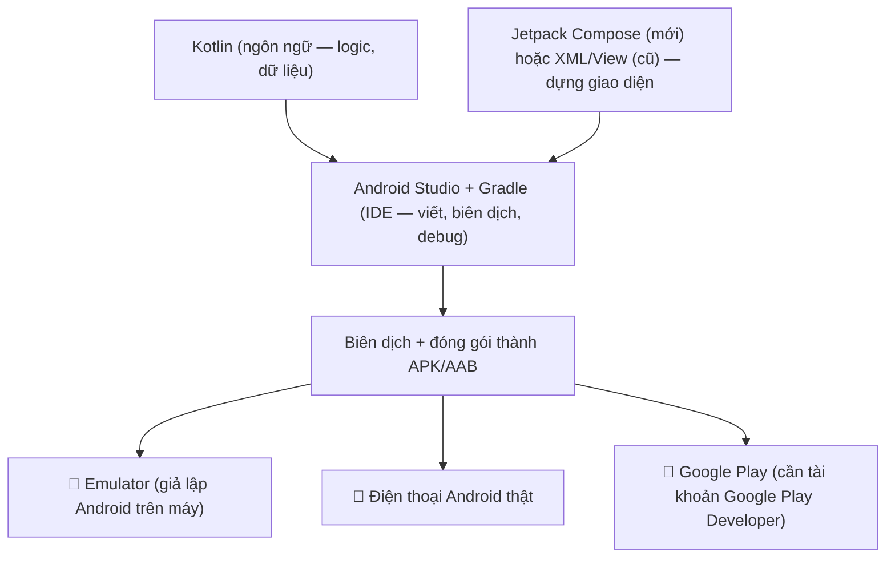
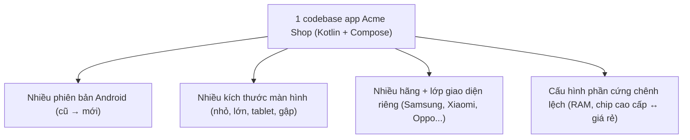

# Lập trình Android là gì? — Kotlin, Android Studio, Compose

> **Tác giả:** Mr.Rom\
> **Phiên bản:** v1.0.0\
> **Tạo lúc:** 13/06/2026\
> **Cập nhật:** 13/06/2026\
> **Level:** Basic\
> **Tags:** android, kotlin, android-studio, jetpack-compose, xml-views, native, google, mobile\
> **Yêu cầu trước:** (không bắt buộc — cần Android Studio)

> 🎯 *Bài INTRO. Bạn đã biết lập trình cơ bản và muốn làm app **Android native** cho Acme Shop. Bài này vẽ ra toàn bộ hệ sinh thái: ngôn ngữ **Kotlin** (chính thức của Google, thay Java), IDE **Android Studio** (chạy trên macOS/Windows/Linux — khác iOS bắt buộc Mac), và hai cách dựng UI — **XML/View** (cũ, imperative) vs **Jetpack Compose** (mới, declarative — khuyến nghị 2026). Bạn sẽ hiểu vì sao chọn native Android, đối mặt với **phân mảnh thiết bị** (nhiều hãng/nhiều version) — thách thức đặc trưng nhất của Android, khác biệt emulator vs thiết bị thật, Android dev khác iOS dev ở đâu, và vị trí native so với cross-platform. KHÔNG đi sâu cú pháp Kotlin — đó là bài 01.*

## 🎯 Sau bài này bạn sẽ

- [ ] Hiểu **lập trình Android native là gì** và 3 trụ cột: **Kotlin** (ngôn ngữ), **Android Studio** (IDE), **Compose/View** (cách dựng UI)
- [ ] Biết vì sao **Kotlin** là ngôn ngữ chính thức thay cho **Java**, và Android Studio **chạy được trên mọi hệ điều hành** (khác iOS)
- [ ] Phân biệt **XML/View** (imperative, cũ) vs **Jetpack Compose** (declarative, mới — mặc định cho dự án 2026) và biết khi nào còn gặp XML
- [ ] Giải thích được **vì sao chọn native Android** (hiệu năng, API mới nhất, trải nghiệm hệ thống) so với cross-platform (React Native / Flutter)
- [ ] Hiểu **phân mảnh thiết bị** (device fragmentation) — thách thức đặc trưng của Android — và vì sao nó tồn tại
- [ ] Phân biệt **emulator** và **thiết bị thật**, biết khi nào phải dùng máy thật
- [ ] So sánh **Android dev vs iOS dev** và định vị Android so với cross-platform

---

## Tình huống — Acme Shop muốn một app Android phủ hết người dùng Việt

Bạn vừa làm xong backend cho Acme Shop và đã quen lập trình. Giờ sếp đặt một yêu cầu rất cụ thể:

> *"Ở Việt Nam đa số khách hàng mình xài Android — đủ loại máy, từ Samsung đời mới tới mấy con Xiaomi, Oppo giá rẻ. Mình cần một app Android chạy mượt trên hầu hết máy đó, dùng được camera quét mã sản phẩm, thanh toán bằng vân tay. Không phải kiểu 'web đóng gói'. Bắt đầu thế nào?"*

Bạn ngồi tìm hiểu và lập tức gặp một loạt từ khoá va vào nhau:

- 😵 Người ta nói viết app Android bằng **Kotlin**. Nhưng sao có chỗ lại nói **Java**? Cuối cùng dùng cái nào?
- 😵 Phải dùng **Android Studio**. Máy bạn đang là Windows — liệu có cài được không, hay lại giống iOS bắt buộc máy Mac?
- 😵 Có chỗ nói dựng UI bằng **XML layout**, chỗ khác bảo dùng **Jetpack Compose**, và nhiều bài cũ trộn cả hai. Học cái nào?
- 😵 Khách hàng dùng **vô số loại máy Android khác nhau** — màn to nhỏ đủ kiểu, Android version cũ mới lẫn lộn. Làm sao một app chạy ổn trên hết?
- 😵 Đã có team biết **React Native** rồi — sao không viết một lần chạy cả Android lẫn iOS cho rẻ?

Đây đều là những câu hỏi đúng và rất thực tế. Bài này trả lời tổng quan toàn bộ, vẽ cho bạn tấm bản đồ hệ sinh thái Android trước khi bạn gõ dòng Kotlin đầu tiên ở bài 01.

> [!NOTE]
> Cụm bài này tập trung vào **Android native** — viết riêng cho hệ điều hành Android bằng công cụ chính chủ của Google. Nếu bạn cần một app chạy **cả Android lẫn iOS** từ một codebase, hãy đọc thêm cụm Flutter hoặc React Native (có link ở cuối bài). Native và cross-platform không phải "đúng/sai" — chúng phục vụ mục tiêu khác nhau, và mục 8 sẽ giúp bạn chọn.

---

## 1️⃣ Lập trình Android native là gì?

Quay lại tình huống: sếp muốn app chạy mượt trên đủ loại máy Android, dùng được camera và cảm biến vân tay. **Lập trình Android native ra đời đúng để làm điều đó.**

**Lập trình Android native** là việc viết ứng dụng chạy trên điện thoại/máy tính bảng Android bằng **bộ công cụ chính chủ của Google**: ngôn ngữ **Kotlin** (hoặc Java đời cũ), IDE **Android Studio**, và framework UI **Jetpack Compose** (hoặc **XML/View** đời cũ). App được biên dịch thành mã chạy thẳng trên hệ điều hành Android — không có lớp trình duyệt ẩn, không có engine vẽ riêng của bên thứ ba.

Điểm cốt lõi cần khắc sâu ngay: **native nghĩa là dùng đúng widget và API mà chính Android cung cấp.** Nút bấm bạn tạo ra *là* nút bấm chuẩn Material của Android; animation cuộn *là* animation gốc của hệ điều hành. Vì thế app native kế thừa "chất" Android một cách tự nhiên, và truy cập được mọi tính năng mới nhất ngay khi Google ra mắt.

🪞 **Ẩn dụ — native như nấu ăn bằng nguyên liệu và bếp của chính nhà hàng:**
> Hãy tưởng tượng Google là một nhà hàng. **Native** là bạn vào thẳng bếp của họ, dùng đúng nguyên liệu tươi và đúng lò nướng họ thiết kế — món ra đúng "vị nhà hàng", và nếu họ vừa nhập một loại gia vị mới (tính năng Android mới) thì bạn được dùng ngay. **Cross-platform** (React Native, Flutter) giống bạn nấu ở bếp trung gian rồi mang món vào — vẫn ngon, vẫn bán được cho cả hai nhà hàng (Android + iOS) cùng lúc, nhưng gia vị mới của Google thì phải chờ bên trung gian "nhập về" mới dùng được.

Để định vị rõ, đây là 3 cách hiểu sai/đúng thường gặp về native Android:

| Cách hiểu | Đúng/Sai | Giải thích |
|---|---|---|
| "Native Android là nhúng website vào app cho điện thoại" | ❌ Sai | Đó là WebView/hybrid kiểu cũ — native KHÔNG có HTML/trình duyệt ẩn |
| "Native Android là viết bằng Kotlin, render ra widget thật của Android" | ✅ Đúng | Kotlin + Compose/View → UI gốc Android, biên dịch thành app native |
| "Native Android thì cũng chạy luôn trên iPhone" | ❌ Sai | Code Kotlin/Compose chỉ chạy trên Android; iOS cần Swift riêng |

→ Vì là native thật, app cho **trải nghiệm mượt nhất, dùng được tính năng Android mới nhất**, đổi lại bạn viết riêng cho Android (không tự động chạy trên iOS). Phần còn lại của bài bóc tách từng trụ cột.

---

## 2️⃣ Ba trụ cột: Kotlin + Android Studio + Compose

Để làm app Android, bạn cần đúng 3 thứ ăn khớp nhau. Đừng nhầm vai trò của chúng — đây là nguồn bối rối lớn nhất của người mới. Ta đi từng cái.

### Kotlin — ngôn ngữ lập trình (chính thức, thay Java)

**Kotlin** là ngôn ngữ lập trình do công ty **JetBrains** tạo ra (ra mắt 2011), và năm 2019 **Google công bố Kotlin là ngôn ngữ ưu tiên (Kotlin-first)** cho phát triển Android. Nay Kotlin đã tới phiên bản **2.x**. Nó được thiết kế hiện đại: kiểu tĩnh (static typing), an toàn null bằng *nullable type* (kiểu có thể vắng giá trị, đánh dấu bằng `?`), hỗ trợ *coroutines* cho lập trình bất đồng bộ, và cú pháp gọn hơn Java rất nhiều.

🪞 **Ẩn dụ**: Nếu bạn từng viết Swift, TypeScript hay một ngôn ngữ kiểu tĩnh hiện đại, Kotlin sẽ thấy **rất quen** — cùng tinh thần "kiểu tĩnh, an toàn null, gọn gàng". So với người tiền nhiệm Java, Kotlin giống một **chiếc xe đời mới thay cho xe đời cũ cùng hãng**: vẫn chạy chung đường (cùng nền tảng JVM, gọi qua lại được code Java cũ), nhưng lái êm hơn, ít thao tác thừa hơn, và có nhiều tính năng an toàn dựng sẵn.

Bạn chưa cần học cú pháp ở bài này, nhưng nhìn qua một đoạn Kotlin để có cảm giác — đây là cách khai báo dữ liệu cho một sản phẩm Acme Shop:

```kotlin
// Một data class mô tả sản phẩm — Kotlin dùng data class rất nhiều cho dữ liệu
data class Product(
    val id: Int,
    val name: String,
    val price: Int,
    val inStock: Boolean = true   // mặc định còn hàng
)

fun main() {
    val pixel = Product(id = 1, name = "Pixel 9", price = 22_000_000)
    println(pixel.name)       // in: Pixel 9
    println(pixel.inStock)    // in: true
}
```

→ Trông giống Swift/TypeScript: khai báo kiểu rõ ràng (`Int`, `String`, `Boolean`), tạo object không cần từ khoá `new`. `val` là hằng (không đổi), dấu `_` trong `22_000_000` chỉ để đọc số cho dễ (Kotlin bỏ qua nó). Bài 01 sẽ dạy `val`/`var`, null safety, `data class` và coroutines kỹ càng.

### Android Studio — IDE chính chủ (chạy trên mọi hệ điều hành)

**Android Studio** là **IDE** (môi trường phát triển tích hợp) chính thức của Google — nơi bạn viết code Kotlin, thiết kế giao diện, biên dịch, chạy app trên emulator, debug, và đóng gói app để đẩy lên Google Play. Android Studio dựa trên nền IntelliJ IDEA của JetBrains, đóng gói sẵn Android SDK, emulator, và hệ thống build Gradle.

> [!IMPORTANT]
> Khác biệt lớn so với iOS: Android Studio **chạy được trên cả macOS, Windows và Linux**. Bạn **không cần máy Mac** để làm app Android — đây chính là điểm khiến Android dễ bắt đầu hơn với người Việt mới vào nghề (so với iOS bắt buộc máy Mac vì Xcode chỉ chạy trên macOS).

🪞 **Ẩn dụ**: Android Studio là **xưởng mộc đầy đủ đồ nghề** của Google — cưa, đục, máy chà, máy sơn đều trong một phòng. Bạn không cần đi mua lẻ từng món; mở Android Studio là có tất cả để dựng app từ con số 0 tới lúc lên kệ Google Play. Và "xưởng" này đặt được trên mọi loại "nhà" (Windows/macOS/Linux), không kén nền.

### Jetpack Compose / XML View — cách dựng giao diện

Kotlin là ngôn ngữ, Android Studio là công cụ — còn thứ dùng để **dựng giao diện** thì Android có hai cách, và đây là chỗ người mới hay phân vân nhất:

- **Jetpack Compose** — bộ công cụ UI **mới** (ổn định từ 2021), viết UI theo phong cách **declarative** (khai báo) bằng chính Kotlin: bạn mô tả "UI nên trông thế nào ứng với dữ liệu hiện tại", framework tự lo việc vẽ. **Đây là lựa chọn khuyến nghị cho mọi dự án mới năm 2026.**
- **XML/View** — cách **cũ** (từ những ngày đầu của Android): bạn viết bố cục giao diện trong file **XML** (`layout`), rồi dùng code Kotlin/Java để *ra lệnh từng bước* tìm view và cập nhật nó (phong cách imperative). Vẫn còn rất nhiều trong các app lớn đời cũ.

Mục 3 sẽ so sánh kỹ hai cách này. Tạm thời nhớ: **dự án mới → Jetpack Compose.**

> 💡 Hiểu vai trò ba trụ cột rồi, ta xem chúng ráp lại thành app như thế nào qua sơ đồ bên dưới để hình dung tổng thể.

### Sơ đồ — ba trụ cột ráp thành file APK

Đây là phần trừu tượng nhất ở mục này: làm sao Kotlin + Android Studio + Compose kết hợp để cho ra một app chạy trên điện thoại Android. Kết quả cuối là một file **APK** (Android Package — gói cài đặt app) hoặc **AAB** (Android App Bundle — định dạng để nộp lên Google Play). Sơ đồ dưới mô tả luồng từ code tới app trên thiết bị:



→ Mấu chốt từ sơ đồ: **Kotlin lo logic, Compose/XML lo giao diện, Android Studio (qua Gradle) gói tất cả lại và biên dịch** thành file APK/AAB. Từ một bản build, bạn chạy thử trên emulator (nhanh, ngay trên máy), trên điện thoại thật (để test cảm giác và phần cứng), rồi cuối cùng đẩy lên Google Play. Cả ba trụ cột đều xoay quanh hệ sinh thái **Google + JetBrains** — đó là lý do chúng gắn chặt và mượt với nhau.

---

## 3️⃣ XML/View vs Jetpack Compose — học cái nào năm 2026?

Đây là câu hỏi gây hoang mang nhất cho người mới, vì tài liệu trên mạng trộn lẫn cả hai. Ta làm rõ một lần.

Khác biệt cốt lõi nằm ở **cách bạn diễn đạt giao diện**: tách bố cục ra file XML rồi ra lệnh cập nhật từng bước (imperative) hay mô tả kết quả mong muốn ngay trong Kotlin (declarative).

🪞 **Ẩn dụ — chỉ đường vs đặt xe công nghệ:**
> **XML/View (imperative)** giống bạn **chỉ đường cho tài xế từng khúc**: "rẽ trái, đi 200m, gặp đèn đỏ rẽ phải, đỗ ở quán cà phê". Bạn kiểm soát từng bước, nhưng phải lo mọi tình huống. **Compose (declarative)** giống bạn **đặt xe công nghệ và gõ điểm đến**: "tôi muốn tới quán cà phê X" — phần chọn đường, tránh kẹt xe, hệ thống tự lo. Bạn mô tả *cái đích*, không mô tả *từng bước*.

Hãy nhìn cùng một việc — hiển thị một dòng chữ "Acme Shop" — viết theo hai cách. Đầu tiên là **XML/View (imperative)**: bạn khai báo bố cục trong một file XML riêng, rồi trong Kotlin tự đi tìm view bằng `id` và gán nội dung:

```xml
<!-- res/layout/activity_main.xml — bố cục viết tách trong file XML -->
<TextView
    android:id="@+id/tieuDe"
    android:layout_width="wrap_content"
    android:layout_height="wrap_content"
    android:textSize="22sp"
    android:textStyle="bold" />
```

```kotlin
// MainActivity.kt — Kotlin phải TỰ đi tìm view theo id rồi gán nội dung
class MainActivity : AppCompatActivity() {
    override fun onCreate(savedInstanceState: Bundle?) {
        super.onCreate(savedInstanceState)
        setContentView(R.layout.activity_main)

        // Tự tìm TextView theo id, rồi tự gán chữ — kiểu imperative
        val tieuDe = findViewById<TextView>(R.id.tieuDe)
        tieuDe.text = "Acme Shop"
    }
}
```

Giờ cũng việc đó nhưng bằng **Jetpack Compose (declarative)**: bạn chỉ **mô tả** "màn hình có một dòng chữ, in đậm, cỡ 22" — ngay trong Kotlin, không cần file XML, không phải tự đi tìm view:

```kotlin
// Jetpack Compose — phong cách DECLARATIVE: mô tả kết quả mong muốn
import androidx.compose.material3.Text
import androidx.compose.runtime.Composable
import androidx.compose.ui.text.font.FontWeight
import androidx.compose.ui.unit.sp

@Composable
fun HomeScreen() {
    Text(
        text = "Acme Shop",
        fontSize = 22.sp,
        fontWeight = FontWeight.Bold,
    )
}
```

Khác biệt nhìn thấy ngay: Compose viết gọn trong một chỗ (cùng Kotlin), không cần file XML tách rời, và bạn không phải tự `findViewById` rồi cập nhật thủ công. Bảng dưới tổng hợp khác biệt để bạn quyết định — đọc theo từng dòng để thấy vì sao 2026 ưu tiên Compose:

| Tiêu chí | **Jetpack Compose** (mới) | **XML/View** (cũ) |
|---|---|---|
| Ổn định từ | 2021 | Từ Android đời đầu (2008) |
| Phong cách | Declarative (khai báo) | Imperative (mệnh lệnh) |
| Viết UI ở đâu | Ngay trong Kotlin | Bố cục trong XML + logic trong Kotlin |
| Cập nhật UI theo dữ liệu | Tự động (recomposition) | Tự tay `findViewById` rồi cập nhật |
| Lượng code cho UI | Ít, gọn | Nhiều, dài dòng (XML + binding) |
| Độ trưởng thành / control chi tiết | Đã chín, đôi lúc còn thiếu vài view hiếm | Rất chín, vô số thư viện sẵn |
| Khuyến nghị 2026 cho dự án mới | ✅ Mặc định | Chỉ khi bảo trì app cũ / cần view chưa có ở Compose |

> [!TIP]
> Bạn **vẫn nên biết XML/View tồn tại**, vì hai lý do: (1) cực nhiều app lớn đời cũ vẫn viết bằng XML layout, đi làm bạn sẽ gặp; (2) Compose và View **lồng vào nhau được** — bạn có thể nhúng một mẩu View cũ vào Compose qua `AndroidView`, hoặc nhúng Compose vào màn hình View cũ. Nhưng để **học và khởi đầu dự án mới**, hãy tập trung 100% vào Compose — cả cụm bài này dùng Compose.

→ Tóm lại: **học Jetpack Compose trước, biết XML/View có mặt ở đó.** Google đang đầu tư mạnh nhất vào Compose và mọi hướng dẫn chính thức mới đều ưu tiên Compose.

---

## 4️⃣ Vì sao chọn native Android (thay vì cross-platform)?

Sếp đã hỏi thẳng: "team mình biết React Native rồi, sao không viết một lần chạy cả hai?". Câu hỏi đúng — và câu trả lời nằm ở những thứ chỉ native làm tốt nhất. Có ba lý do lớn để chọn native Android.

**1. Hiệu năng tốt nhất.** Code Kotlin biên dịch xuống bytecode chạy trực tiếp trên máy ảo Android (ART), không qua cầu nối JavaScript↔native như React Native hay engine vẽ riêng như Flutter. Với app cần độ mượt tuyệt đối — animation phức tạp, xử lý ảnh/video, game nhẹ, cuộn danh sách khổng lồ — native cho khung hình ổn định nhất.

**2. Dùng được API mới nhất ngay ngày đầu.** Mỗi năm Google ra Android mới với hàng loạt API mới (kiểu thông báo mới, tính năng camera, machine learning trên thiết bị...). App native (Kotlin) dùng được **ngay lập tức**. Cross-platform phải **chờ** React Native/Flutter bọc API đó lại rồi mới xài được — có khi vài tháng sau, có khi không bao giờ với API hiếm.

**3. Trải nghiệm "đúng chất Android".** Native tự động kế thừa mọi quy chuẩn của Android: Material Design 3 (ngôn ngữ thiết kế của Google), cử chỉ điều hướng hệ thống, theme động (Material You đổi màu theo hình nền), accessibility (hỗ trợ người khuyết tật), và back gesture chuẩn. Người dùng Android cảm nhận được sự khác biệt tinh tế này.

Để cụ thể, đây là một mẩu Compose hiện đại 2026 — một thẻ sản phẩm Acme Shop dùng *state* (trạng thái) để đếm số lượng trong giỏ — cho thấy code native gọn gàng tới đâu:

```kotlin
import androidx.compose.foundation.layout.Column
import androidx.compose.foundation.layout.padding
import androidx.compose.material3.Button
import androidx.compose.material3.Text
import androidx.compose.runtime.Composable
import androidx.compose.runtime.getValue
import androidx.compose.runtime.mutableIntStateOf
import androidx.compose.runtime.remember
import androidx.compose.runtime.setValue
import androidx.compose.ui.Modifier
import androidx.compose.ui.unit.dp

@Composable
fun ProductCard(name: String, price: Int) {
    // remember + mutableIntStateOf: state nội bộ của UI.
    // Khi soLuong đổi, Compose TỰ vẽ lại phần liên quan (recomposition).
    var soLuong by remember { mutableIntStateOf(0) }

    Column(modifier = Modifier.padding(16.dp)) {
        Text(text = name)
        Text(text = "$price đ")
        Button(onClick = { soLuong++ }) {   // đổi state → Compose tự cập nhật nút
            Text(text = "Thêm vào giỏ ($soLuong)")
        }
    }
}
```

→ Để ý: không có dòng "tìm nút rồi đổi chữ" nào cả (không `findViewById`). Bạn đổi `soLuong`, Compose tự vẽ lại nút với số mới. Đây chính là tư duy declarative + data-driven mà bài 02 và 03 sẽ dạy kỹ. `remember`, `mutableIntStateOf` và `@Composable` là API hiện hành 2026 của Jetpack Compose.

> [!NOTE]
> Native **không phải lúc nào cũng là lựa chọn đúng**. Nếu bạn cần ra **cả Android lẫn iOS** với một team nhỏ, ngân sách hạn chế, và app thiên về nghiệp vụ (form, danh sách, gọi API) thì cross-platform tiết kiệm hơn nhiều. Mục 7 và 8 giúp bạn cân đo.

---

## 5️⃣ Phân mảnh thiết bị — thách thức đặc trưng nhất của Android

Đây là điều khiến Android dev *khác hẳn* iOS dev, và là lý do sếp lo "chạy ổn trên đủ loại máy". Apple kiểm soát chặt phần cứng: chỉ vài model iPhone, vài kích thước màn hình, và đa số người dùng nâng cấp iOS rất nhanh. Android thì ngược lại hoàn toàn.

**Phân mảnh thiết bị** (device fragmentation) là hiện tượng thế giới Android trải rộng trên **vô số biến thể khác nhau**, vì Android là hệ điều hành mở mà **rất nhiều hãng** dùng (Samsung, Xiaomi, Oppo, Vivo, Realme, Google Pixel...). Cụ thể, app của bạn phải chạy tốt trên:

- **Nhiều phiên bản Android cùng lúc** — không phải ai cũng cập nhật. Một app thực tế thường phải hỗ trợ từ Android khá cũ tới mới nhất, mỗi version có khác biệt về API và hành vi.
- **Vô số kích thước và mật độ màn hình** — từ điện thoại nhỏ giá rẻ, máy màn lớn, tới máy tính bảng và điện thoại gập.
- **Nhiều lớp giao diện tuỳ biến của hãng** — Samsung có One UI, Xiaomi có HyperOS/MIUI... mỗi hãng chỉnh sửa Android theo cách riêng, đôi khi đổi cả hành vi (vd cách quản lý pin, tắt app nền).
- **Cấu hình phần cứng chênh lệch lớn** — máy cao cấp RAM nhiều, chip mạnh; máy giá rẻ thì ngược lại. App phải chạy chấp nhận được trên cả hai.

🪞 **Ẩn dụ**: làm app iOS giống **may đồng phục cho một trường học** — học sinh cao thấp gần nhau, chỉ vài size là vừa hết. Làm app Android giống **mở một shop quần áo bán cho cả nước** — khách đủ mọi vóc dáng, mọi gu, mọi túi tiền. Bạn phải thiết kế sao cho "co giãn" vừa được phần lớn người, thay vì may riêng từng bộ.

Sơ đồ dưới cho thấy vì sao một codebase Android phải toả ra phục vụ rất nhiều biến thể — đây là phần trừu tượng cần hình dung rõ:



→ Mấu chốt từ sơ đồ: **một app Android phải sống tốt trong một thế giới rất đa dạng.** Đây vừa là điểm mạnh (Android phủ thị trường rộng, đặc biệt ở Việt Nam và các nước đang phát triển) vừa là thách thức (phải test nhiều, thiết kế giao diện co giãn, cẩn thận với API theo từng version). May mắn là công cụ Android đã hỗ trợ nhiều: bạn khai báo `minSdk` (phiên bản Android thấp nhất hỗ trợ), dùng layout co giãn của Compose, và test trên nhiều cấu hình emulator khác nhau.

> [!WARNING]
> Cạm bẫy kinh điển của người mới: chỉ test trên **đúng một máy của mình** rồi tưởng app ổn. Trên máy bạn (giả sử Pixel đời mới, Android mới nhất) chạy mượt, nhưng trên một máy giá rẻ Android cũ ở nhà khách hàng có thể vỡ layout hoặc chậm. Luôn test trên **nhiều cấu hình** (nhiều version + nhiều kích thước màn hình) trước khi phát hành.

---

## 6️⃣ Emulator vs thiết bị thật — chạy thử ở đâu?

Khi viết app, bạn cần chỗ để xem nó chạy. Có hai lựa chọn, và người mới hay nhầm rằng emulator là đủ.

**Emulator** (trình giả lập, Android Studio gọi là *Android Virtual Device — AVD*) là một "chiếc điện thoại Android ảo" chạy ngay trên màn hình máy tính. Android Studio tạo nó trong vài phút, bạn chọn được nhiều model, nhiều kích thước màn hình và nhiều phiên bản Android. Cực tiện cho vòng lặp viết-sửa-xem nhanh, và rất hợp để **kiểm tra phân mảnh** (tạo nhiều AVD khác nhau).

**Thiết bị thật** là điện thoại/máy tính bảng Android bạn cắm vào (qua cáp USB hoặc kết nối không dây). App được cài và chạy trên phần cứng thật.

🪞 **Ẩn dụ**: Emulator như **lái thử xe trong game đua** — tiện, an toàn, đổi xe/đường tức thì, nhưng không cảm nhận được mặt đường thật. Thiết bị thật như **lái xe ngoài đường** — mới biết cảm giác tay lái, độ rung, và đặc biệt là cách "con đường" (lớp giao diện của hãng như Samsung One UI) thật sự cư xử.

Bảng dưới cho biết mỗi loại làm được gì và khi nào bắt buộc dùng máy thật:

| Tiêu chí | **Emulator** | **Thiết bị thật** |
|---|---|---|
| Tốc độ khởi động | Nhanh sau khi tạo AVD | Phải cắm/kết nối, cài lên máy |
| Thử nhiều model/version | Dễ — tạo nhiều AVD (rất hợp test phân mảnh) | Cần nhiều máy vật lý |
| Camera thật | ⚠️ Mô phỏng (ảnh giả / webcam) | ✅ Có |
| Cảm biến: GPS thật, gia tốc kế, con quay | ⚠️ Mô phỏng hạn chế | ✅ Đầy đủ |
| Cảm biến vân tay thật | ⚠️ Chỉ giả lập "thành công/thất bại" | ✅ Thật |
| Lớp giao diện hãng (One UI, MIUI...) | ❌ Chỉ có Android gốc | ✅ Đúng hành vi từng hãng |
| Đo hiệu năng / pin thật | ❌ Không chính xác | ✅ Chính xác |
| Cảm giác chạm / rung (haptic) | ❌ Không có rung | ✅ Thật |

→ Quy tắc thực dụng: **viết và xem giao diện nhanh thì dùng emulator; nhưng trước khi phát hành phải test trên thiết bị thật** — đặc biệt nếu app dùng camera, cảm biến, vân tay, hay cần đo hiệu năng/pin. Với Acme Shop có quét mã sản phẩm bằng camera và thanh toán bằng vân tay, bạn chắc chắn phải test trên máy thật. Và do phân mảnh, nên test trên ít nhất một máy của hãng phổ biến (vd Samsung) chứ không chỉ Pixel/emulator gốc.

---

## 7️⃣ Android dev vs iOS dev — khác nhau ở đâu?

Để định vị đúng bức tranh mobile, so sánh nhanh hai thế giới native. Cả hai cùng mục tiêu (làm app mobile native) nhưng khác gần như toàn bộ công cụ.

| Tiêu chí | **Android (Google)** | **iOS (Apple)** |
|---|---|---|
| Ngôn ngữ chính | Kotlin | Swift |
| IDE | Android Studio | Xcode |
| Hệ điều hành để dev | **macOS / Windows / Linux** | **Chỉ macOS** |
| Framework UI hiện đại | Jetpack Compose | SwiftUI |
| Cách dựng UI đời cũ | XML/View | UIKit |
| Cửa hàng app | Google Play | App Store |
| Phí lập trình viên | **$25 trả một lần** | $99/năm |
| Quy trình duyệt app | Thoáng hơn, tự động nhiều | App Review nghiêm, kỹ |
| Phân mảnh thiết bị | **Nhiều** (vô số hãng, kích cỡ, version) | Ít (Apple kiểm soát phần cứng) |

Một quan sát thú vị: Jetpack Compose (Android) và SwiftUI (iOS) **rất giống nhau về tư duy** — cả hai đều declarative, data-driven. Nếu bạn học Compose rồi sau này học SwiftUI (hoặc ngược lại), bạn sẽ thấy quen ngay; hai hãng học hỏi lẫn nhau ở hướng đi này.

> [!NOTE]
> Hai khác biệt "đắt giá" nhất khi chọn vào nghề: (1) Android **không bắt buộc máy Mac** — máy nào cũng dev được, rào cản đầu vào thấp hơn iOS; (2) phí publish Android chỉ **$25 trả một lần** (so với iOS $99/năm). Đổi lại, Android có **phân mảnh** cần xử lý cẩn thận hơn. Với người Việt mới bắt đầu, Android thường là cửa vào dễ hơn về chi phí và thiết bị.

→ Tóm lại: Android và iOS là hai hệ sinh thái native song song, công cụ khác nhau hoàn toàn. Cụm bài này đi sâu phía Android; nếu cần làm cả hai từ một codebase thì quay lại lựa chọn cross-platform ở mục dưới.

---

## 8️⃣ Native Android đứng ở đâu so với cross-platform?

Khép lại bằng câu hỏi của sếp: "sao không React Native / Flutter cho rẻ?". Đây là so sánh cuối để bạn ra quyết định có cơ sở.

| Tiêu chí | **Native Android** (Kotlin) | **React Native** | **Flutter** |
|---|---|---|---|
| Ngôn ngữ | Kotlin | JS/TypeScript | Dart |
| Chạy được nền tảng nào | Chỉ Android | Android + iOS (một codebase) | Android + iOS (một codebase) |
| Cách render UI | Widget native gốc của Android | Widget native thật của OS | Tự vẽ pixel bằng engine riêng |
| Hiệu năng | Tốt nhất | Rất tốt | Rất tốt |
| Dùng API Android mới nhất | ✅ Ngay ngày đầu | ⏳ Chờ thư viện bọc lại | ⏳ Chờ thư viện bọc lại |
| Xử lý phân mảnh thiết bị | Trực tiếp, kiểm soát đầy đủ | Qua framework (thường ổn) | Qua engine (đồng nhất nhưng ít "thuần") |
| Hợp nhất khi | App Android đỉnh cao, dùng sâu tính năng hệ thống | Team biết React, cần 2 store nhanh | Cần UI tuỳ biến đậm, 2 store |

Triết lý cần nhớ: **native đánh đổi "viết hai lần" (Android riêng, iOS riêng) để lấy hiệu năng và độ "đúng chất" cao nhất.** Cross-platform đánh đổi điều ngược lại: một codebase cho cả hai, đổi lấy việc đôi khi phải chờ API mới hoặc chấp nhận UI bớt "thuần" một chút.

→ Với Acme Shop: nếu khách hàng **chủ yếu dùng Android** (đúng bối cảnh Việt Nam), cần **trải nghiệm cao cấp** dùng sâu camera, cảm biến vân tay, Material You — và team sẵn sàng đầu tư cho chất lượng Android — thì **native Android là lựa chọn xứng đáng**. Nếu ưu tiên ra **cả hai store nhanh, rẻ** và team đã mạnh JS/React, thì React Native hợp hơn. Không có lựa chọn "luôn đúng"; có lựa chọn "đúng cho mục tiêu của bạn".

---

## 💡 Cạm bẫy thường gặp & Best practice

### ❌ Cạm bẫy: tưởng phải dùng Java mới làm được Android

- **Triệu chứng**: thấy nhiều tài liệu cũ viết bằng Java rồi nghĩ "chắc phải học Java trước", dành thời gian học Java đời cũ trong khi việc làm và hướng dẫn mới đều dùng Kotlin.
- **Nguyên nhân**: Android *xuất phát* từ Java (những năm đầu), nên kho tài liệu cũ rất nhiều Java. Nhưng từ 2019 Google đã công bố **Kotlin-first**, và mọi hướng dẫn chính thức mới, mọi API Jetpack hiện đại đều ưu tiên Kotlin.
- **Cách tránh**: **học Kotlin trước, không cần học Java trước**. Kotlin gọi qua lại được code Java cũ nên bạn vẫn đọc hiểu được app cũ khi cần, nhưng để bắt đầu thì Kotlin là con đường đúng năm 2026.

### ❌ Cạm bẫy: chỉ test trên một máy rồi tưởng app chạy ổn mọi nơi

- **Triệu chứng**: app chạy mượt trên máy/emulator của bạn (thường là cấu hình ngon, Android mới), nhưng vỡ layout, chậm hoặc crash trên máy giá rẻ / Android cũ / lớp giao diện hãng khác ở nhà người dùng.
- **Nguyên nhân**: **phân mảnh thiết bị** — Android trải trên vô số version, kích thước màn hình, hãng và cấu hình phần cứng. Một cấu hình chạy tốt không bảo chứng cho các cấu hình khác.
- **Cách tránh**: test trên **nhiều cấu hình** — tạo vài emulator (AVD) khác version + khác kích thước màn hình, và ít nhất một thiết bị thật của hãng phổ biến (vd Samsung). Khai báo `minSdk` hợp lý và dùng layout co giãn của Compose ngay từ đầu.

### ✅ Best practice: bắt đầu với Kotlin + Jetpack Compose ngay, đừng vòng qua Java/XML

- **Vì sao**: Google đầu tư mạnh nhất vào Kotlin + Compose; đây là hướng đi chính của Android năm 2026. Học thẳng vào cái mới giúp bạn viết ít code hơn, code data-driven sạch hơn, và khớp với phần lớn việc làm mới.
- **Cách áp dụng**: tạo project mới trong Android Studio với template Compose, dùng Kotlin làm ngôn ngữ. Chỉ học XML/View khi cần bảo trì app cũ hoặc đụng một view chưa có sẵn ở Compose — và khi đó chỉ cần *đọc hiểu* là đủ cho giai đoạn đầu.

### ✅ Best practice: tận dụng emulator để test phân mảnh, nhưng luôn chốt trên máy thật

- **Vì sao**: emulator tạo nhanh nhiều cấu hình (rất hợp để bắt lỗi phân mảnh sớm), nhưng không mô phỏng đúng camera thật, vân tay thật, lớp giao diện hãng, hay hiệu năng/pin thật.
- **Cách áp dụng**: dùng emulator cho vòng lặp viết-xem nhanh và để thử nhiều kích thước/version. Trước mỗi mốc quan trọng (phát hành, demo cho sếp) hãy cài lên điện thoại thật — đặc biệt với các tính năng dùng phần cứng như camera (quét mã) hay vân tay (thanh toán).

---

## 🧠 Tự kiểm tra (Self-check)

**Q1.** Ba trụ cột của lập trình Android native là gì, và mỗi cái đóng vai trò nào?

<details>
<summary>💡 Xem giải thích</summary>

- **Kotlin** — ngôn ngữ lập trình (viết logic, dữ liệu); hiện đại, kiểu tĩnh, an toàn null bằng nullable type (`?`), là ngôn ngữ chính thức (Kotlin-first) thay cho Java.
- **Android Studio** — IDE chính chủ của Google, **chạy trên macOS/Windows/Linux**; nơi viết code, biên dịch (qua Gradle), chạy emulator, debug, đóng gói APK/AAB để publish.
- **Jetpack Compose / XML View** — cách dựng **giao diện**. Compose là lựa chọn mới, declarative, khuyến nghị 2026; XML/View là đời cũ, imperative.

</details>

**Q2.** Khác biệt cốt lõi giữa XML/View và Jetpack Compose là gì? Dự án mới năm 2026 nên dùng cái nào?

<details>
<summary>💡 Xem giải thích</summary>

XML/View theo phong cách **imperative** (mệnh lệnh — bố cục tách trong file XML, rồi Kotlin tự `findViewById` và cập nhật từng bước). Jetpack Compose theo phong cách **declarative** (khai báo — mô tả "UI nên trông thế nào ứng với dữ liệu" ngay trong Kotlin, framework tự vẽ và tự cập nhật khi dữ liệu đổi qua recomposition).

Dự án mới năm 2026 nên dùng **Jetpack Compose**: ít code hơn, data-driven, Google ưu tiên mọi hướng dẫn và API mới cho nó. Vẫn nên *biết* XML/View tồn tại để bảo trì app cũ hoặc nhúng view hiếm.

</details>

**Q3.** Vì sao Android dev không bắt buộc máy Mac, còn iOS thì có? Điều này ảnh hưởng gì tới người mới?

<details>
<summary>💡 Xem giải thích</summary>

**Android Studio chạy trên cả macOS, Windows và Linux** — Google không ràng buộc hệ điều hành. Trong khi iOS bắt buộc **Xcode**, mà Xcode **chỉ chạy trên macOS**, nên làm iOS phải có máy Mac.

Ảnh hưởng tới người mới: rào cản đầu vào của Android **thấp hơn** — bạn dùng máy Windows/Linux sẵn có là bắt đầu được ngay, không phải mua máy Mac. Cộng thêm phí publish chỉ $25 trả một lần (so với iOS $99/năm), Android thường là cửa vào dễ hơn về chi phí.

</details>

**Q4.** "Phân mảnh thiết bị" (device fragmentation) là gì? Vì sao nó là thách thức đặc trưng của Android chứ không phải iOS?

<details>
<summary>💡 Xem giải thích</summary>

**Phân mảnh thiết bị** là việc thế giới Android trải rộng trên vô số biến thể: nhiều phiên bản Android cùng tồn tại, vô số kích thước/mật độ màn hình, nhiều hãng (Samsung, Xiaomi, Oppo...) mỗi hãng có lớp giao diện riêng, và cấu hình phần cứng chênh lệch lớn (cao cấp ↔ giá rẻ).

Đây là thách thức đặc trưng của Android vì Android là **hệ điều hành mở** mà rất nhiều hãng dùng và tuỳ biến. iOS thì ngược lại — Apple kiểm soát chặt phần cứng (chỉ vài model iPhone) và người dùng cập nhật iOS nhanh, nên ít biến thể hơn nhiều. App Android phải test trên nhiều cấu hình và thiết kế giao diện co giãn.

</details>

**Q5.** Khi nào bắt buộc phải test trên thiết bị thật thay vì emulator?

<details>
<summary>💡 Xem giải thích</summary>

Khi app cần những thứ emulator **không mô phỏng đúng**: camera thật (vd quét mã sản phẩm), cảm biến thật (GPS, gia tốc kế), **cảm biến vân tay thật**, hành vi đúng của **lớp giao diện hãng** (Samsung One UI, Xiaomi MIUI...), đo **hiệu năng/pin** chính xác, và cảm giác **haptic** (rung). Emulator hợp cho viết-xem giao diện nhanh và thử nhiều cấu hình (test phân mảnh); trước khi phát hành phải kiểm tra trên máy thật, lý tưởng là một máy của hãng phổ biến.

</details>

**Q6.** Acme Shop có khách hàng chủ yếu dùng Android (đủ loại máy ở Việt Nam), cần camera quét mã và vân tay để thanh toán. Nên chọn native Android hay cross-platform? Vì sao?

<details>
<summary>💡 Xem giải thích</summary>

Nghiêng về **native Android**. Lý do: khách hàng tập trung ở Android (không cần iOS gấp), app cần **trải nghiệm cao cấp đúng chất Android** và dùng **tính năng hệ thống đặc thù** (camera, vân tay, Material You) — đây đúng vùng mạnh nhất của native, nơi cross-platform thường phải chờ API hoặc làm được nhưng kém "thuần" hơn. Đồng thời native kiểm soát phân mảnh trực tiếp tốt nhất. Nếu sau này cần iOS nữa với ngân sách hạn chế, lúc đó mới cân nhắc cross-platform.

</details>

---

## ⚡ Tra cứu nhanh (Cheatsheet)

### Ba trụ cột Android

```
Kotlin          = ngôn ngữ (logic + dữ liệu) — hiện đại, kiểu tĩnh, null-safety, thay Java
Android Studio  = IDE của Google — chạy MỌI OS (mac/Win/Linux) — viết/build/debug/publish
Jetpack Compose = cách dựng UI MỚI (declarative, ngay trong Kotlin) — mặc định 2026
XML/View        = cách dựng UI CŨ (imperative, bố cục trong XML) — app đời cũ
```

### Đầu ra build

```
APK = Android Package — gói cài đặt app (cài trực tiếp lên máy/emulator)
AAB = Android App Bundle — định dạng để NỘP lên Google Play (Google tự tạo APK tối ưu)
Gradle = hệ thống build trong Android Studio biến code → APK/AAB
```

### Emulator vs thiết bị thật

```
Emulator (AVD)  = nhanh, tạo nhiều cấu hình (rất hợp test phân mảnh) — KHÔNG có lớp UI hãng/vân tay/haptic thật
Thiết bị thật   = camera, cảm biến, vân tay, lớp UI hãng (One UI...), hiệu năng/pin THẬT
→ Trước khi phát hành: bắt buộc test máy thật (ít nhất 1 máy hãng phổ biến)
```

### So sánh nhanh

```
Android vs iOS    = Kotlin+Android Studio (mọi OS, $25 1 lần)  vs  Swift+Xcode (chỉ macOS, $99/năm)
Compose vs SwiftUI = cùng tư duy declarative (rất giống nhau)
Native vs Cross   = hiệu năng + API mới nhất  vs  một codebase cho 2 store
Đặc trưng Android  = phân mảnh thiết bị (nhiều hãng/version/màn hình)
```

---

## 📚 Từ Điển Thuật Ngữ (Glossary)

| EN | VN | Giải thích |
|---|---|---|
| Android | Android | Hệ điều hành mã nguồn mở của Google cho điện thoại/máy tính bảng |
| Native | Native (gốc) | App viết bằng công cụ chính chủ của OS, biên dịch thành mã native, dùng widget gốc |
| Kotlin | Kotlin | Ngôn ngữ của JetBrains (2011), Google chọn làm ưu tiên cho Android từ 2019; nay Kotlin 2.x |
| Java | Java | Ngôn ngữ đời đầu của Android; vẫn chạy được nhưng Kotlin đã thay làm mặc định |
| Android Studio | Android Studio | IDE chính chủ của Google, chạy mọi OS, gói sẵn SDK + emulator + Gradle |
| IDE | Môi trường phát triển | Phần mềm tích hợp viết code, build, debug trong một chỗ |
| Jetpack Compose | Jetpack Compose | Bộ công cụ UI mới (ổn định 2021), declarative, viết bằng Kotlin — khuyến nghị 2026 |
| XML layout | Bố cục XML | Cách cũ khai báo giao diện Android trong file XML riêng |
| View | View | Thành phần giao diện trong hệ thống UI cũ của Android (kèm XML) |
| Imperative | Mệnh lệnh | Phong cách ra lệnh từng bước "làm cái này rồi cái kia" |
| Declarative | Khai báo | Phong cách mô tả "kết quả mong muốn", framework tự lo cách làm |
| @Composable | @Composable | Annotation đánh dấu một hàm Kotlin mô tả một mảnh UI trong Compose |
| Recomposition | Vẽ lại | Compose tự dựng lại phần UI liên quan khi state đổi |
| State | Trạng thái | Dữ liệu "sống" thay đổi theo tương tác, làm UI cập nhật |
| Material Design / Material 3 | Material Design | Ngôn ngữ thiết kế giao diện của Google (Material 3 là bản hiện hành) |
| Coroutines | Coroutines | Cơ chế Kotlin cho lập trình bất đồng bộ (gọi API, đọc file...) |
| Gradle | Gradle | Hệ thống build của Android Studio biến code thành APK/AAB |
| APK | APK | Android Package — gói cài đặt app cài trực tiếp lên thiết bị |
| AAB | App Bundle | Android App Bundle — định dạng nộp lên Google Play |
| Emulator / AVD | Trình giả lập | Điện thoại Android ảo (Android Virtual Device) chạy trên máy để thử app |
| Device fragmentation | Phân mảnh thiết bị | Android trải trên vô số hãng, version, màn hình, cấu hình khác nhau |
| minSdk | Phiên bản tối thiểu | Phiên bản Android thấp nhất mà app hỗ trợ |
| Google Play | Google Play | Cửa hàng app của Google để phát hành công khai |
| Google Play Developer | Tài khoản nhà phát triển | Tài khoản trả $25 một lần để publish app lên Google Play |
| Cross-platform | Đa nền tảng | Viết một codebase chạy nhiều OS (React Native, Flutter) |
| SwiftUI | SwiftUI | Framework UI declarative của Apple — tương tự Jetpack Compose |

---

## 🔗 Liên kết & Tài nguyên

⬅️ **Bài trước:** (đây là bài đầu tiên của cụm)\
➡️ **Bài tiếp theo:** [Kotlin cơ bản — Null safety, data class, coroutines](01_kotlin-basics.md)\
↑ **Về cụm:** [android-kotlin — README cụm](../../README.md)

### 🧭 Định hướng lộ trình học

- [Kotlin cơ bản — Null safety, data class, coroutines](01_kotlin-basics.md) — bài kế: học cú pháp Kotlin đủ để viết app
- [Jetpack Compose cơ bản — @Composable, state, modifier](02_jetpack-compose-fundamentals.md) — dựng giao diện đầu tiên bằng Compose
- [Android Studio, Build & Play Store — Từ Gradle đến publish](04_android-studio-build-and-play-store.md) — đưa app lên store khi đã sẵn sàng

### 🧩 Các chủ đề có thể bạn quan tâm

- [Lập trình iOS là gì? — Swift, Xcode, SwiftUI](../../../ios-swift/lessons/01_basic/00_what-is-ios-development.md) — đối chiếu hệ sinh thái Apple (SwiftUI rất giống Compose)
- [Phát triển mobile đa nền tảng là gì?](../../../cross-platform-concepts/lessons/01_basic/00_what-is-cross-platform-mobile.md) — bức tranh tổng đặt native Android cạnh cross-platform
- [Khi nào chọn cross-platform vs native](../../../cross-platform-concepts/lessons/01_basic/04_when-cross-platform-vs-native.md) — khung quyết định native Android hay React Native/Flutter
- [React Native là gì? — Viết app native bằng React](../../../react-native/lessons/01_basic/00_what-is-react-native.md) — đối chiếu cách cross-platform tiếp cận Android

### 🌐 Tài nguyên tham khảo khác

- [Android Developers — chính thức](https://developer.android.com/) — trang chủ tài liệu Android của Google
- [Android Developers — Jetpack Compose](https://developer.android.com/develop/ui/compose) — hướng dẫn chính thức về Compose
- [Kotlin — trang chủ ngôn ngữ](https://kotlinlang.org/) — tài liệu và hướng dẫn học Kotlin
- [Android — Now in Android (app mẫu chính chủ)](https://github.com/android/nowinandroid) — app Android hiện đại mẫu của Google, Kotlin + Compose

---

> 🎯 *Sau bài này bạn đã có bản đồ hệ sinh thái Android: Kotlin, Android Studio (chạy mọi OS), Jetpack Compose vs XML/View, lý do chọn native, phân mảnh thiết bị, emulator vs máy thật, và định vị so với iOS/cross-platform. Bài kế tiếp đi sâu **Kotlin cơ bản** — null safety, data class, coroutines — đủ để bạn viết logic cho app Acme Shop.*

---

## 📌 Nhật ký thay đổi (Changelog)

- **v1.0.0 (13/06/2026)** — Bản đầu tiên. Cụm `android-kotlin/` lesson 1/5 (basic). Cover: lập trình Android native là gì (Kotlin + Android Studio + Compose/View, render widget gốc Android, không WebView) + ba trụ cột và vai trò từng cái (Kotlin là ngôn ngữ chính thức thay Java; Android Studio chạy mọi OS, khác iOS cần Mac) + XML/View (imperative, cũ) vs Jetpack Compose (declarative, mới — khuyến nghị 2026) với ví dụ song song + vì sao chọn native (hiệu năng, API mới nhất, trải nghiệm hệ thống) kèm ví dụ Compose hiện đại (remember/mutableIntStateOf/Material 3) + phân mảnh thiết bị là thách thức đặc trưng của Android + emulator vs thiết bị thật + Android dev vs iOS dev ($25 1 lần vs $99/năm, mọi OS vs chỉ Mac) + định vị native so với React Native/Flutter. 2 sơ đồ mermaid (ba trụ cột → APK; phân mảnh thiết bị). Cạm bẫy: tưởng phải dùng Java trước, chỉ test một máy bỏ qua phân mảnh.
