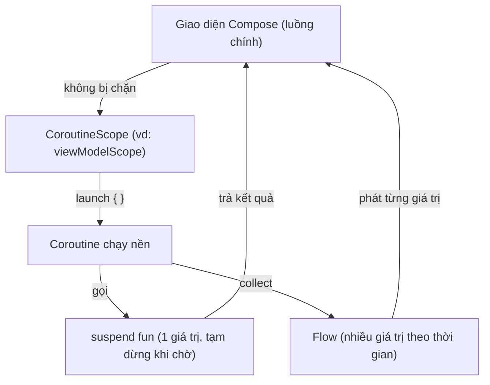

# Kotlin cơ bản — Null safety, data class, coroutines

> **Tác giả:** Mr.Rom\
> **Phiên bản:** v1.0.0\
> **Tạo lúc:** 13/06/2026\
> **Cập nhật:** 13/06/2026\
> **Level:** Basic\
> **Tags:** kotlin, android, null-safety, data-class, lambda, coroutines, flow, when, collection, jetpack-compose, mobile\
> **Yêu cầu trước:** [Lập trình Android là gì](00_what-is-android-development.md)

> 🎯 *Bạn vừa biết Android native viết bằng **Kotlin** + dựng UI bằng **Jetpack Compose** trong **Android Studio**. Nhưng mở file `.kt` đầu tiên là gặp ngay một loạt cú pháp lạ: dấu `?` sau tên kiểu, `?.`, `?:`, `data class`, `suspend fun`, dấu `{ }` kéo ra ngoài lời gọi hàm... Bài này dạy đúng phần Kotlin bạn cần để bắt đầu Compose — không học hết ngôn ngữ, chỉ 8 thứ cốt lõi: `val`/`var` + type inference, **null safety** (đặc sản an toàn null của Kotlin), hàm + **lambda**, **data class**, class + interface, `when` expression, collection + functional (map/filter), và **coroutines** (suspend/launch) + Flow sơ khởi. Cuối bài bạn đọc và viết được Kotlin cho mọi màn hình Acme Shop cơ bản.*

## 🎯 Sau bài này bạn sẽ

- [ ] Khai báo biến `val`/`var` với **type inference**, hiểu vì sao Compose thích `val`
- [ ] Dùng thành thạo **null safety**: `?`, `?.`, `?:` (Elvis), và tránh `!!` gây NPE crash
- [ ] Viết hàm và **lambda**: trailing lambda, higher-order function (nền tảng cú pháp Compose)
- [ ] Dùng **data class** để mô hình hoá dữ liệu (tự sinh `equals`/`copy`/`toString`)
- [ ] Viết class + interface và dùng `when` như một **expression** trả về giá trị
- [ ] Xử lý collection bằng **functional** (`map`/`filter`) và gọi việc bất đồng bộ bằng **coroutines** (`suspend`/`launch`) + `Flow`

---

## Tình huống — biết lập trình rồi mà mở file Kotlin vẫn thấy lạ

Bạn đã quyết định viết app Acme Shop bằng Android native: Kotlin + Jetpack Compose. Bạn từng viết JavaScript, Python hoặc Java nên tự tin học nhanh. Bạn mở Android Studio, tạo project Compose mới, và thấy ngay một đoạn như thế này trong file mẫu:

```kotlin
@Composable
fun ContentView() {
    var soLuong by remember { mutableStateOf(0) }
    Text("Giỏ: $soLuong sản phẩm")
}
```

Một loạt thứ lạ xuất hiện cùng lúc:

- `fun ContentView()` có `@Composable` ở trên — hàm này khác hàm thường ở chỗ nào?
- `var soLuong by remember { ... }` — `by` là gì, và sao lại có một khối `{ }` đứng sau `remember`?
- `mutableStateOf(0)` — gọi hàm mà không có dấu `()` bọc closure như các ngôn ngữ khác?
- `"Giỏ: $soLuong sản phẩm"` — cú pháp nhúng biến vào chuỗi (string template).
- Và khi đọc tiếp code thật, bạn sẽ gặp `String?`, `?.`, `?:`, `data class`, `when`, `suspend`, `Flow`... khắp nơi.

> [!NOTE]
> Để code Kotlin cho Android, bạn cần cài **Android Studio** (miễn phí, chạy trên Windows / macOS / Linux) — nó kèm sẵn Kotlin compiler và trình giả lập (emulator). Mọi đoạn code thuần Kotlin trong bài chạy đúng với **Kotlin 2.x**. Bạn có thể gõ thử nhanh trong **Kotlin Playground** trên web (play.kotlinlang.org) hoặc tạo file `main.kt` chạy bằng `fun main() { ... }` mà chưa cần dựng cả app.

Để hết bối rối, ta cần đúng một thứ: **đủ Kotlin để đọc cú pháp này**. Bài này đi qua 8 mục cốt lõi theo thứ tự, mỗi mục gắn với một mảnh code Acme Shop thật. Học xong, bạn quay lại đoạn trên sẽ thấy mọi ký tự đều có nghĩa.

---

## 1️⃣ `val` / `var` và type inference

Kotlin là ngôn ngữ **kiểu tĩnh** (static typing) — mỗi biến có một kiểu xác định lúc biên dịch, giống Java/TypeScript. Nhưng Kotlin hiếm khi bắt bạn ghi kiểu ra: nó **tự suy ra** (type inference) từ giá trị bên phải.

Điểm đầu tiên phải nhớ: Kotlin phân biệt rạch ròi giữa **biến chỉ-đọc** và **biến đổi được**.

- `val` — khai báo biến **chỉ-đọc** (value): gán một lần, sau đó **không gán lại** được (tương tự `final` trong Java).
- `var` — khai báo **biến** (variable): gán lại bao nhiêu lần cũng được.

```kotlin
// 1. val = chỉ-đọc, gán 1 lần rồi khoá
val tenCuaHang = "Acme Shop"   // Kotlin tự suy ra kiểu String
// tenCuaHang = "Khac"         // ❌ Lỗi biên dịch — không gán lại được val

// 2. var = biến, đổi tuỳ thích
var soLuong = 3                // Kotlin tự suy ra kiểu Int
soLuong = 5                    // OK

// 3. Ghi kiểu tường minh khi cần rõ ràng (kiểu : sau tên)
val giaSanPham: Double = 25_000_000.0   // dấu _ chỉ để dễ đọc, không ảnh hưởng giá trị
val conHang: Boolean = true
```

Có một thói quen quan trọng trong Kotlin mà bạn nên hình thành ngay: **mặc định luôn dùng `val`, chỉ đổi sang `var` khi thật sự cần thay đổi giá trị.** Lý do sâu xa liên quan đến cách Compose hoạt động — Compose vẽ lại UI khi state đổi, nên bạn muốn kiểm soát chặt "cái gì được phép đổi". Nhưng nguyên tắc thì đơn giản: ít thứ thay đổi được thì ít chỗ sinh bug.

🪞 **Ẩn dụ**: `val` như **mực in trên giấy** — viết xong là cố định, muốn đổi phải in tờ mới. `var` như **bảng phấn** — xoá viết lại thoải mái. Kotlin khuyến khích dùng "mực in" nhiều nhất có thể, vì thứ gì không đổi được thì không thể bị ai đó vô tình bôi xoá sai.

So với thứ bạn đã biết: `val` của Kotlin ≈ `const`/`final`, `var` ≈ `let` của JS hay biến thường của Java. Đừng nhầm `var` Kotlin với `var` JS — `var` Kotlin vẫn khoá kiểu, gán `soLuong = "abc"` sẽ lỗi biên dịch ngay.

> 📖 *Khai báo biến thì dễ. Nhưng điểm khác biệt lớn nhất giữa Kotlin và Java (ngôn ngữ Android cũ) nằm ở chỗ tiếp theo: cách Kotlin xử lý giá trị "rỗng" (null). Đây là phần phải nắm thật chắc.*

---

## 2️⃣ Null safety — đặc sản an toàn null của Kotlin

Đây là khái niệm Kotlin khác Java nhiều nhất, và cũng là thứ làm người mới bối rối nhất. Hãy bắt đầu bằng một vấn đề bạn chắc chắn từng gặp.

Trong Java và nhiều ngôn ngữ khác, biến tham chiếu nào cũng có thể là `null` bất cứ lúc nào. Bạn lấy ghi chú đơn hàng từ server, server không trả gì, biến thành `null`, bạn quên kiểm tra, gọi `.length` lên nó — **crash**. Đó là lỗi kinh điển `NullPointerException` (viết tắt **NPE**) — lỗi runtime phổ biến nhất trong lịch sử Java. Tony Hoare — người phát minh ra `null` — gọi nó là "sai lầm tỉ đô" của mình.

Kotlin chặn lỗi này từ gốc bằng **null safety**. Quy tắc cốt lõi: một biến **không được phép** mang giá trị `null`, **trừ khi** bạn nói rõ "biến này có thể null" bằng dấu `?` sau tên kiểu.

```kotlin
// Mặc định: KHÔNG được null (non-nullable)
var ten: String = "Acme"
// ten = null   // ❌ Lỗi biên dịch — String thường không nhận null

// Thêm ? → kiểu "nullable" (có thể chứa giá trị, hoặc null)
var ghiChu: String? = null   // String? mới được phép là null
ghiChu = "Giao buổi sáng"    // gán giá trị: OK
ghiChu = null                // gán null: cũng OK
```

🪞 **Ẩn dụ**: Kiểu nullable giống một **chiếc hộp quà**. `String?` nghĩa là "hộp này **có thể** chứa một chuỗi, hoặc **rỗng** (null)". Bạn không được dùng món đồ bên trong ngay — phải **mở hộp ra kiểm tra** trước. Nếu cứ thò tay vào hộp mà không nhìn (dùng `!!`), gặp hộp rỗng là bị "đứt tay" (NPE crash). Toàn bộ phần này dạy các cách mở hộp an toàn.

### Cách 1 — `?.` (safe call: gọi an toàn)

Khi biến nullable là một object và bạn muốn gọi thuộc tính/method của nó, dùng `?.` (safe call — gọi an toàn): nếu object khác null thì gọi bình thường, nếu null thì cả biểu thức trả về `null` mà **không crash**.

```kotlin
var ghiChu: String? = "Giao nhanh"

// ?. : nếu ghiChu khác null thì lấy .length, nếu null thì doDai = null
val doDai: Int? = ghiChu?.length
println(doDai)   // in: 10  (số ký tự của "Giao nhanh")

ghiChu = null
println(ghiChu?.length)   // in: null  (ghiChu null → cả biểu thức null, KHÔNG crash)
```

### Cách 2 — `?:` (Elvis: giá trị mặc định khi null)

Toán tử `?:` (gọi là **Elvis operator** — vì nhìn nghiêng giống mái tóc Elvis Presley) trả về giá trị bên trái nếu nó khác null, ngược lại lấy giá trị bên phải làm mặc định. Đây là cách gọn nhất để "có một giá trị an toàn", và thường đi kèm `?.`.

```kotlin
var ghiChu: String? = null

// Nếu ghiChu null → dùng chuỗi mặc định
val hienThi = ghiChu ?: "Không có ghi chú"
println(hienThi)   // in: Không có ghi chú

ghiChu = "Giao nhanh"
println(ghiChu ?: "Không có ghi chú")   // in: Giao nhanh

// Kết hợp ?. và ?: — pattern dùng nhiều nhất:
val doDai: Int = ghiChu?.length ?: 0   // có giá trị thì lấy length, null thì 0
println(doDai)   // in: 10
```

### Cách 3 — `if` kiểm tra null (smart cast)

Kotlin có một tính năng rất tiện gọi là **smart cast** (ép kiểu thông minh): sau khi bạn kiểm tra `if (x != null)`, trong khối `if` đó Kotlin **tự hiểu** `x` chắc chắn khác null, nên bạn dùng thẳng như kiểu thường (không cần `?.` nữa).

```kotlin
val ghiChu: String? = "Giao buổi sáng"

// if kiểm tra null: trong khối, Kotlin smart-cast ghiChu thành String thường
if (ghiChu != null) {
    // Trong đây ghiChu là String (đã chắc chắn khác null), dùng .length trực tiếp
    println("Ghi chú dài ${ghiChu.length} ký tự")   // in: Ghi chú dài 14 ký tự
} else {
    println("Không có ghi chú")
}
```

### Cạm bẫy lớn nhất: `!!` (not-null assertion)

Còn một cách mở hộp nữa: dấu `!!` (not-null assertion). Nó nói với trình biên dịch "tôi **chắc chắn** hộp này có đồ, mở luôn đi". Nhưng nếu bạn sai — hộp rỗng — app **crash ngay lập tức** với đúng cái NPE mà null safety sinh ra để ngăn.

```kotlin
var ghiChu: String? = null

// !! ép mở hộp — nếu ghiChu thật sự null thì CRASH
val noiDung = ghiChu!!   // 💥 crash: NullPointerException
println(noiDung)
```

> [!WARNING]
> `!!` là nguyên nhân crash NPE phổ biến nhất của người mới học Kotlin. Nó biến chính cơ chế an toàn của Kotlin thành quả bom hẹn giờ: code biên dịch qua, chạy ngon trong lúc test (vì lúc đó có dữ liệu), rồi crash trên máy người dùng đúng lúc gặp null. Quy tắc vàng: **gần như không bao giờ dùng `!!`**. Cần giá trị an toàn thì `?:`, cần gọi an toàn thì `?.`, cần kiểm tra rồi mới dùng thì `if (x != null)`.

Để chốt lại các cách an toàn, đây là bảng tổng hợp — đọc theo từng dòng để biết khi nào dùng cái nào:

| Cách | Cú pháp | Khi nào dùng |
|---|---|---|
| `?.` | `nullable?.thuộcTính` | Gọi thuộc tính/method an toàn trên object có thể null |
| `?:` | `nullable ?: mặcĐịnh` | Muốn một giá trị thay thế khi null |
| `if (x != null)` | `if (x != null) { ... }` | Cần kiểm tra rồi xử lý cả hai nhánh có/không |
| `?.` + `?:` | `nullable?.length ?: 0` | Pattern phổ biến nhất: gọi an toàn + mặc định |
| `!!` | `nullable!!` | ❌ Tránh — chỉ khi chắc chắn 100% (hiếm) |

> 📖 *Nắm được null safety là qua phần khó nhất của Kotlin cơ bản. Giờ ta sang hàm và lambda — phần này quyết định việc đọc được code Compose.*

---

## 3️⃣ Hàm và lambda

Hàm Kotlin khai báo bằng từ khoá `fun`, ghi kiểu trả về sau dấu `:`. Tham số ghi dạng `tên: Kiểu`. Một đặc điểm tiện lợi: tham số có thể có **giá trị mặc định** và bạn có thể gọi kèm **tên tham số** (named argument) để code đọc rõ.

```kotlin
// fun tên(tham: Kiểu): KiểuTrảVề
fun taoLabel(ten: String, soLuong: Int): String {
    return "$ten x$soLuong"
}

println(taoLabel("iPhone", 2))                  // in: iPhone x2
println(taoLabel(ten = "AirPods", soLuong = 3)) // gọi kèm tên tham số: in: AirPods x3

// Tham số có giá trị mặc định → khi gọi được phép bỏ
fun chao(ten: String = "khách"): String {
    return "Xin chào $ten"
}
println(chao())            // in: Xin chào khách
println(chao("Acme"))      // in: Xin chào Acme

// Hàm 1 biểu thức: viết gọn bằng dấu = (không cần { } và return)
fun gap(x: Int): Int = x * 2
println(gap(10))           // in: 20
```

Để ý `"$ten x$soLuong"` ở trên: đó là **string template** (mẫu chuỗi) — nhúng biến vào chuỗi bằng `$tên`, hoặc `${biểu thức}` cho biểu thức phức tạp. Bạn đã thấy nó trong code Compose ở đầu bài (`"Giỏ: $soLuong sản phẩm"`).

### Lambda — hàm không tên, truyền đi như giá trị

Phần quan trọng nhất của mục này là **lambda**. Lambda là một **khối code không tên** mà bạn có thể gán vào biến, hoặc truyền vào hàm như một tham số. Nếu bạn biết JS, lambda Kotlin ≈ **arrow function** (`() => {}`); biết Python thì ≈ **lambda**.

```kotlin
// Lambda gán vào biến — cú pháp: { tham số -> thân }
val nhanDoi: (Int) -> Int = { x -> x * 2 }
println(nhanDoi(10))   // in: 20

// Lambda 1 tham số có thể bỏ "x ->" và dùng "it" (tên ngầm định)
val nhanBa: (Int) -> Int = { it * 3 }
println(nhanBa(5))     // in: 15
```

### Higher-order function — hàm nhận hàm làm tham số

**Higher-order function** (hàm bậc cao) là hàm **nhận một hàm/lambda làm tham số** (hoặc trả về một hàm). Đây là nền tảng để hiểu Compose: rất nhiều API Compose nhận một lambda mô tả "làm gì". Ví dụ một hàm tự viết nhận lambda `hanhDong` để xử lý mỗi sản phẩm:

```kotlin
// kieuHanhDong là (String) -> Unit — hàm nhận String, không trả gì (Unit ≈ void)
fun voiMoiSanPham(ds: List<String>, hanhDong: (String) -> Unit) {
    for (sp in ds) {
        hanhDong(sp)   // gọi lambda được truyền vào cho từng phần tử
    }
}

val sanPham = listOf("iPhone", "AirPods", "MacBook")

// Truyền lambda vào tham số cuối
voiMoiSanPham(sanPham, { sp -> println("Sản phẩm: $sp") })
// in: Sản phẩm: iPhone / Sản phẩm: AirPods / Sản phẩm: MacBook
```

### Trailing lambda — viết gọn lambda cuối cùng

Để ý ở trên ta truyền lambda **bên trong** dấu `()`. Kotlin có một quy tắc cú pháp cực kỳ quan trọng: khi lambda là **tham số cuối cùng** của hàm, bạn được phép kéo nó ra **ngoài** dấu `()` — gọi là **trailing lambda**. Nếu lambda là tham số *duy nhất*, bỏ luôn cả `()`.

```kotlin
// Cả 3 cách dưới TƯƠNG ĐƯƠNG — chỉ khác cách viết:

// 1. Lambda bên trong ()
voiMoiSanPham(sanPham, { sp -> println(sp) })

// 2. Trailing lambda — kéo ra ngoài ()
voiMoiSanPham(sanPham) { sp -> println(sp) }

// 3. Hàm chỉ có 1 tham số là lambda → bỏ luôn ()
val ket = sanPham.map { it.uppercase() }   // map nhận đúng 1 lambda
println(ket)   // in: [IPHONE, AIRPODS, MACBOOK]
```

> [!IMPORTANT]
> Trailing lambda không phải mẹo làm đẹp tuỳ thích — nó là **nền tảng cú pháp của Jetpack Compose**. Khi bạn viết `Button(onClick = { muaHang() }) { Text("Mua") }`, phần `{ Text("Mua") }` cuối cùng chính là trailing lambda (nội dung nút). Và `remember { mutableStateOf(0) }` ở đầu bài cũng là trailing lambda. Hiểu trailing lambda là điều kiện để đọc được mọi code Compose ở bài sau.

> 📖 *Có hàm và lambda rồi, giờ ta cần một cách gọn để mô hình hoá dữ liệu — sản phẩm, đơn hàng. Đây là lúc `data class` toả sáng.*

---

## 4️⃣ data class — mô hình hoá dữ liệu trong 1 dòng

Trong Java, để tạo một lớp chứa dữ liệu (sản phẩm có tên, giá), bạn phải viết tay constructor, getter/setter, `equals()`, `hashCode()`, `toString()` — hàng chục dòng cho một class chỉ-chứa-dữ-liệu. Kotlin gói tất cả vào một từ khoá: `data class`.

Bạn chỉ khai báo các thuộc tính, Kotlin **tự sinh** cho bạn: `equals()` (so sánh theo giá trị), `hashCode()`, `toString()` (in đẹp), và `copy()` (tạo bản sao có sửa vài field).

```kotlin
// Khai báo data class — chỉ cần liệt kê thuộc tính ở constructor
data class SanPham(
    val ten: String,
    val gia: Int,
    val conHang: Boolean = true   // có thể có giá trị mặc định
)

val sp = SanPham(ten = "iPhone 15", gia = 25_000_000)

// 1. toString() tự sinh — in ra đẹp, không phải "SanPham@1a2b3c"
println(sp)   // in: SanPham(ten=iPhone 15, gia=25000000, conHang=true)

// 2. truy cập thuộc tính
println(sp.ten)   // in: iPhone 15
```

🪞 **Ẩn dụ**: data class giống một **tờ khai mẫu in sẵn** — bạn chỉ điền các ô (tên, giá), còn mọi phần thủ tục đi kèm (so sánh hai tờ có giống nhau không, photocopy tờ mới sửa một ô) thì mẫu lo hết. Class thường giống **tờ giấy trắng** — bạn phải tự kẻ từng dòng, tự viết mọi thủ tục.

### `equals()` tự sinh — so sánh theo giá trị

Điểm khác biệt lớn nhất so với class thường: data class so sánh bằng `==` theo **giá trị các thuộc tính**, không phải theo địa chỉ object. Hai sản phẩm cùng tên cùng giá là "bằng nhau".

```kotlin
val a = SanPham(ten = "iPhone", gia = 25)
val b = SanPham(ten = "iPhone", gia = 25)

println(a == b)   // in: true   (data class: so sánh theo giá trị các field)

// Với class thường (không "data"), a == b sẽ là false (so sánh theo địa chỉ object)
```

### `copy()` tự sinh — tạo bản sao sửa vài field

Vì ta nên dùng `val` (bất biến) cho dữ liệu hiển thị, khi cần "đổi giá sản phẩm" ta không sửa tại chỗ mà tạo **bản sao mới** với field đã đổi. `copy()` làm đúng việc này — giữ nguyên các field còn lại.

```kotlin
val goc = SanPham(ten = "iPhone", gia = 25_000_000)

// copy() — chỉ ghi field cần đổi, các field khác giữ nguyên
val giamGia = goc.copy(gia = 19_000_000)

println(goc.gia)      // in: 25000000  (bản gốc KHÔNG đổi)
println(giamGia.gia)  // in: 19000000  (bản sao đã sửa giá)
```

> [!IMPORTANT]
> Pattern "tạo bản sao mới bằng `copy()` thay vì sửa tại chỗ" là nền tảng của state trong Compose. Compose phát hiện UI cần vẽ lại bằng cách so sánh state cũ và state mới (qua `equals()`). data class + `copy()` cho bạn đúng hai thứ Compose cần: so sánh theo giá trị, và tạo state mới bất biến. Bạn sẽ dùng pattern này liên tục ở bài State & ViewModel.

> 📖 *data class lo phần dữ liệu thuần. Khi cần class có hành vi (method) hoặc cần định nghĩa "hợp đồng chung" cho nhiều kiểu, ta dùng class thường và interface.*

---

## 5️⃣ class và interface

Class thường trong Kotlin gọn hơn Java nhiều: khai báo thuộc tính ngay ở **primary constructor** (constructor chính, viết ngay sau tên class), không cần gán thủ công.

```kotlin
// class với primary constructor — val/var ngay trong ( ) thành thuộc tính luôn
class GioHang(val tenKhach: String) {
    // thuộc tính nội bộ
    private val danhSach = mutableListOf<String>()

    // method
    fun them(sanPham: String) {
        danhSach.add(sanPham)
    }

    fun tongSo(): Int = danhSach.size
}

val gio = GioHang(tenKhach = "Nguyen Van A")
gio.them("iPhone")
gio.them("AirPods")
println("${gio.tenKhach} có ${gio.tongSo()} món")   // in: Nguyen Van A có 2 món
```

### interface — bản hợp đồng chung

**interface** (giao diện) là một **bản hợp đồng** (contract): nó liệt kê những thuộc tính và method mà một kiểu **phải có**, nhưng (thường) không nói **cách làm**. Bất kỳ class nào "ký vào hợp đồng" (implement) đều phải cung cấp đầy đủ những thứ hợp đồng yêu cầu. Nếu bạn biết Java, interface Kotlin ≈ `interface` Java.

🪞 **Ẩn dụ**: interface giống **bằng lái xe**. Tấm bằng không quan tâm bạn lái Toyota hay Honda — nó chỉ chứng nhận "người này **biết các kỹ năng lái cần thiết**". Tương tự, interface `MoTaDuoc` không quan tâm bạn là `SanPham` hay `DonHang` — chỉ yêu cầu "kiểu này phải có một thuộc tính `moTa`". Hàm nào cần "thứ mô tả được" thì nhận bất kỳ kiểu nào có bằng đó.

```kotlin
// 1. Định nghĩa interface — hợp đồng: "phải có thuộc tính moTa"
interface MoTaDuoc {
    val moTa: String   // chỉ khai báo, không nói cách tính
}

// 2. class SanPham "ký hợp đồng" MoTaDuoc → phải cung cấp moTa (dùng override)
class SanPhamUI(val ten: String, val gia: Int) : MoTaDuoc {
    override val moTa: String
        get() = "$ten - ${gia}đ"
}

// 3. DonHang cũng ký hợp đồng đó, nhưng moTa khác
class DonHang(val maDon: String) : MoTaDuoc {
    override val moTa: String
        get() = "Đơn #$maDon"
}

// 4. Hàm nhận BẤT KỲ kiểu nào implement MoTaDuoc
fun inMoTa(item: MoTaDuoc) {
    println(item.moTa)
}

inMoTa(SanPhamUI(ten = "iPhone", gia = 25))   // in: iPhone - 25đ
inMoTa(DonHang(maDon = "ACME-001"))           // in: Đơn #ACME-001
```

Sức mạnh ở bước 4: hàm `inMoTa` không cần biết kiểu cụ thể, chỉ cần "thứ gì đó có bằng `MoTaDuoc`". Đây là cách Kotlin cho phép code linh hoạt mà vẫn an toàn kiểu — và là lý do Compose cho phép bạn nhét đủ loại UI vào cùng một chỗ.

> 📖 *Có class và interface rồi, giờ ta cần một cách rẽ nhánh gọn gàng. Kotlin thay `switch` rườm rà của Java bằng `when` — và `when` còn trả về được giá trị.*

---

## 6️⃣ `when` expression

Trong Java, để rẽ nhánh nhiều trường hợp bạn dùng `switch` — dài dòng, dễ quên `break`. Kotlin thay bằng `when`, và điểm đặc biệt: `when` là một **expression** (biểu thức) — nó **trả về giá trị**, nên bạn gán thẳng kết quả vào biến.

Bắt đầu với `when` dùng như câu lệnh thường (mỗi nhánh làm một việc):

```kotlin
val trangThai = "dangGiao"

// when như câu lệnh — mỗi nhánh chạy code, không cần break
when (trangThai) {
    "dangXuLy" -> println("Đơn đang chuẩn bị")
    "dangGiao" -> println("Đơn đang trên đường giao")   // ← khớp, in dòng này
    "daGiao"   -> println("Đơn đã giao xong")
    else       -> println("Trạng thái không rõ")
}
```

### `when` trả về giá trị (expression)

Đây là chỗ `when` mạnh hơn `switch`: dùng nó như một biểu thức, mỗi nhánh trả về một giá trị, và toàn bộ `when` trả về giá trị đó để gán vào biến.

```kotlin
val diem = 85

// when expression — gán thẳng kết quả vào biến
val xepLoai = when {
    diem >= 90 -> "Xuất sắc"
    diem >= 70 -> "Khá"          // ← 85 >= 70, khớp nhánh này
    diem >= 50 -> "Trung bình"
    else       -> "Yếu"
}
println(xepLoai)   // in: Khá
```

Hai chi tiết đáng nhớ: (1) `when` không có đối số `when (x)` thì mỗi nhánh là một điều kiện boolean — thay được chuỗi `if-else if` dài; (2) khi `when` dùng làm expression và gán vào biến, **`else` thường bắt buộc** để đảm bảo luôn có giá trị trả về. Một nhánh có thể gộp nhiều giá trị bằng dấu phẩy:

```kotlin
val thang = 7
val mua = when (thang) {
    12, 1, 2 -> "Đông"
    3, 4, 5  -> "Xuân"
    6, 7, 8  -> "Hè"      // ← 7 khớp ở đây
    else     -> "Thu"
}
println(mua)   // in: Hè
```

> 📖 *Rẽ nhánh xong, ta tới phần xử lý dữ liệu hàng loạt — danh sách sản phẩm, giỏ hàng. Kotlin có bộ hàm functional trên collection cực gọn.*

---

## 7️⃣ Collection và functional (map / filter)

Kotlin có 3 loại collection chính, mỗi loại còn chia **chỉ-đọc** (`listOf`) và **đổi được** (`mutableListOf`). Mỗi loại giải một bài toán khác nhau, nên hiểu vai trò rồi hẵng dùng:

- **`List`** — danh sách **có thứ tự**, cho phép trùng. Dùng khi thứ tự quan trọng (danh sách sản phẩm hiển thị).
- **`Map`** — cặp **khoá–giá trị** (key–value), tra cứu nhanh theo khoá. Dùng khi cần tìm nhanh theo một định danh (mã sản phẩm → số lượng).
- **`Set`** — tập hợp **không trùng lặp**, không quan tâm thứ tự. Dùng khi cần đảm bảo không có phần tử lặp (tập các thẻ tag).

```kotlin
// 1. List — danh sách có thứ tự (listOf = chỉ-đọc, mutableListOf = đổi được)
val sanPham = listOf("iPhone", "AirPods", "MacBook")
println(sanPham.size)   // in: 3  (số phần tử)
println(sanPham[0])     // in: iPhone  (truy cập theo chỉ số)

val gio = mutableListOf("iPhone")
gio.add("iPad")         // thêm được vì là mutable
println(gio)            // in: [iPhone, iPad]

// 2. Map — cặp khoá : giá trị
val tonKho = mapOf("iPhone" to 12, "AirPods" to 30)
// Tra cứu trả về NULLABLE (vì khoá có thể không tồn tại) → dùng ?: cho an toàn
val soLuong = tonKho["iPhone"] ?: 0
println(soLuong)        // in: 12

// 3. Set — tập hợp không trùng
val tags = setOf("sale", "hot", "sale")   // "sale" lặp sẽ bị gộp
println(tags.size)      // in: 2  (chỉ còn "sale", "hot")
```

Một chi tiết Kotlin đặc trưng đáng nhớ: tra cứu `Map` theo khoá **trả về nullable** (`Int?` ở trên), vì khoá có thể không tồn tại. Đây chính là null safety từ mục 2 quay lại — và vì thế ta dùng `?: 0` để có giá trị an toàn.

### map / filter — biến đổi và lọc danh sách

Phần quan trọng nhất: các hàm functional nhận một lambda để xử lý từng phần tử. Ba hàm gặp nhiều nhất là `map` (biến đổi từng phần tử → danh sách mới), `filter` (lọc giữ phần tử thoả điều kiện), `sortedBy` (sắp xếp). Tất cả dùng trailing lambda từ mục 3.

```kotlin
data class SanPham(val ten: String, val gia: Int)

val danhSach = listOf(
    SanPham("iPhone", 25_000_000),
    SanPham("AirPods", 5_000_000),
    SanPham("MacBook", 40_000_000),
)

// map: biến mỗi sản phẩm thành tên → danh sách tên mới
val tenSanPham = danhSach.map { it.ten }
println(tenSanPham)   // in: [iPhone, AirPods, MacBook]

// filter: chỉ giữ sản phẩm giá > 10 triệu
val hangCao = danhSach.filter { it.gia > 10_000_000 }
println(hangCao.size)   // in: 2  (iPhone và MacBook)

// sortedBy: sắp xếp tăng dần theo giá
val theoGia = danhSach.sortedBy { it.gia }
println(theoGia.map { it.ten })   // in: [AirPods, iPhone, MacBook]

// Nối chuỗi (chaining): lọc rồi lấy tên — đọc như câu tiếng Anh
val tenHangCao = danhSach
    .filter { it.gia > 10_000_000 }
    .map { it.ten }
println(tenHangCao)   // in: [iPhone, MacBook]
```

So với vòng `for` thủ công, cách functional ngắn hơn, ít bug hơn (không có biến đếm, không sửa list tại chỗ), và đọc gần như câu tiếng Anh: "lấy danh sách, **lọc** giá cao, rồi **biến** thành tên". Compose dùng đúng kiểu này để dựng danh sách UI từ dữ liệu.

> 📖 *Còn một mảnh cuối, và là mảnh hiện đại nhất: làm sao gọi việc mất thời gian (gọi API lấy sản phẩm) mà không treo app? Câu trả lời của Kotlin là coroutines.*

---

## 8️⃣ Coroutines và Flow sơ khởi

Gọi API mất vài trăm mili-giây đến vài giây. Nếu chờ kiểu đồng bộ trên luồng giao diện, app **đơ** (treo UI, Android báo "ứng dụng không phản hồi"). Giải pháp hiện đại của Kotlin là **coroutines** — cách viết code bất đồng bộ trông gần như đồng bộ, dễ đọc hơn nhiều so với callback lồng nhau.

### `suspend` — hàm có thể tạm dừng

Hàm bất đồng bộ trong Kotlin đánh dấu bằng từ khoá `suspend`. Một **suspend function** (hàm có thể tạm dừng) có thể "dừng lại chờ" (vd chờ mạng) rồi chạy tiếp, mà **không chặn** luồng đang chạy. Điểm cốt lõi: `suspend fun` chỉ gọi được từ trong một coroutine hoặc một suspend function khác.

```kotlin
import kotlinx.coroutines.delay

// suspend fun: có thể tạm dừng (vd chờ mạng) mà không treo luồng
suspend fun taiDanhSachSanPham(): List<String> {
    delay(1000)   // giả lập gọi mạng mất 1 giây — delay() KHÔNG chặn luồng
    return listOf("iPhone 15", "AirPods Pro", "MacBook Air")
}
```

🪞 **Ẩn dụ**: `suspend` + chờ giống **gọi món ở quán rồi lấy số chờ** — bạn không đứng chôn chân ở quầy chặn cả hàng người sau (treo app), mà ngồi xuống làm việc khác; có món thì hệ thống gọi số bạn (code chạy tiếp). `delay()` là "tôi chờ ở đây nhưng nhường chỗ cho người khác", khác hẳn `Thread.sleep()` (đứng lì chặn cả hàng).

### `launch` — khởi chạy một coroutine

Để gọi một `suspend fun`, bạn cần một **coroutine**. Cách phổ biến nhất là `launch` trong một `CoroutineScope`. Đây là ví dụ chạy được hoàn chỉnh bằng `runBlocking` (chỉ dùng để demo/test — trong app thật bạn dùng scope của ViewModel):

```kotlin
import kotlinx.coroutines.*

suspend fun taiDanhSachSanPham(): List<String> {
    delay(1000)
    return listOf("iPhone 15", "AirPods Pro", "MacBook Air")
}

fun main() = runBlocking {
    // launch: khởi chạy 1 coroutine chạy nền, không chặn dòng tiếp theo
    launch {
        val ds = taiDanhSachSanPham()   // gọi suspend fun — tạm dừng ~1 giây
        println("Tải được ${ds.size} sản phẩm")   // in: Tải được 3 sản phẩm
    }
    println("Đang tải...")   // dòng này IN TRƯỚC, vì launch chạy nền

    // Output thực tế:
    // Đang tải...
    // (chờ ~1 giây)
    // Tải được 3 sản phẩm
}
```

> [!NOTE]
> Nếu bạn từng viết `async`/`await` trong JavaScript, coroutines giải đúng vấn đề đó với tư duy gần giống: viết code bất đồng bộ mà đọc như tuần tự. Trong app Android thật, bạn hiếm khi tự `runBlocking` — bạn dùng `viewModelScope.launch { ... }` (scope gắn vòng đời ViewModel) hoặc trong Compose dùng `LaunchedEffect`. Bài State & ViewModel sẽ đi sâu phần này. `runBlocking` ở trên chỉ để code chạy được trong `fun main()` cho bạn thử nhanh.

### Flow sơ khởi — luồng nhiều giá trị theo thời gian

`suspend fun` trả về **một** giá trị (một lần). Nhưng nhiều khi bạn cần một **luồng nhiều giá trị phát ra theo thời gian** — vd số lượng tồn kho cập nhật liên tục, kết quả tìm kiếm gõ tới đâu hiện tới đó. Đó là việc của **`Flow`**.

🪞 **Ẩn dụ**: `suspend fun` giống **gọi điện hỏi giá một lần** — hỏi xong cúp máy, được đúng một câu trả lời. `Flow` giống **đăng ký nhận thông báo khuyến mãi** — cứ có đợt mới là tin nhắn tự đẩy về, nhiều lần, cho tới khi bạn huỷ đăng ký.

```kotlin
import kotlinx.coroutines.*
import kotlinx.coroutines.flow.*

// flow { } phát ra nhiều giá trị theo thời gian bằng emit()
fun demSanPham(): Flow<Int> = flow {
    val tong = listOf("iPhone", "AirPods", "MacBook")
    for (i in 1..tong.size) {
        delay(500)     // giả lập mỗi sản phẩm về cách nhau 0.5 giây
        emit(i)        // phát ra giá trị hiện tại (đếm dần 1, 2, 3)
    }
}

fun main() = runBlocking {
    // collect: lắng nghe và xử lý từng giá trị Flow phát ra
    demSanPham().collect { soDaTai ->
        println("Đã tải $soDaTai sản phẩm")
    }
    // in lần lượt (mỗi dòng cách ~0.5 giây):
    // Đã tải 1 sản phẩm
    // Đã tải 2 sản phẩm
    // Đã tải 3 sản phẩm
}
```

Điểm cốt lõi: `flow { emit(...) }` phát ra giá trị, `collect { }` lắng nghe từng giá trị. Trong Compose, `Flow` là cách phổ biến để UI **tự động cập nhật** khi dữ liệu đổi (vd tồn kho thay đổi → màn hình tự hiện số mới) — bạn sẽ gặp `StateFlow` và `collectAsState()` ở bài State & ViewModel.

Để hình dung quan hệ giữa các khái niệm bất đồng bộ vừa học — đây là phần trừu tượng nhất của bài — sơ đồ dưới mô tả cách `suspend fun`, `launch` và `Flow` phối hợp để gọi việc mất thời gian mà không treo giao diện:



→ Điểm cốt lõi từ sơ đồ: luồng giao diện không bao giờ tự đứng chờ. Mọi việc mất thời gian được giao cho coroutine chạy nền (`launch`); xong **một** việc thì `suspend fun` trả kết quả về, còn dữ liệu cập nhật **liên tục** thì `Flow` phát từng giá trị về — giao diện chỉ việc nhận và vẽ lại.

→ Vậy là đủ 8 mảnh Kotlin cốt lõi. Quay lại đoạn `@Composable fun ContentView()` ở đầu bài: giờ bạn biết `var soLuong by remember { ... }` dùng `var` + trailing lambda, `mutableStateOf(0)` là lời gọi hàm, `"Giỏ: $soLuong sản phẩm"` là string template. Không còn ký tự nào lạ nữa.

---

## 💡 Cạm bẫy thường gặp & Best practice

### ❌ Cạm bẫy: Lạm dụng `!!` gây NPE crash

- **Triệu chứng**: App biên dịch qua, chạy ngon lúc test, rồi **crash đột ngột** trên máy người dùng với lỗi `NullPointerException`.
- **Nguyên nhân**: Dùng `!!` để ép mở một biến nullable đang là `null`. Phổ biến nhất là khi lấy dữ liệu từ server/`Map` rồi `!!` ngay mà không kiểm tra — lúc test có dữ liệu nên không sao, lúc thật gặp null thì nổ. Người mới hay gõ `!!` chỉ để "làm trình biên dịch im lặng".
- **Cách tránh**: Gần như không bao giờ dùng `!!`. Cần giá trị thay thế thì `?:` (vd `tonKho["x"] ?: 0`); cần gọi an toàn thì `?.`; cần kiểm tra rồi mới dùng thì `if (x != null)` (Kotlin tự smart-cast). Khi thấy mình định gõ `!!`, dừng lại tự hỏi "nếu nó null thì sao?" — gần như luôn có cách an toàn hơn.

### ❌ Cạm bẫy: Nhầm `val` với `var`

- **Triệu chứng**: Hoặc (a) khai báo `var` cho thứ không bao giờ đổi → IDE cảnh báo, code lỏng lẻo; hoặc (b) khai báo `val` rồi cố gán lại → lỗi biên dịch `Val cannot be reassigned`; hoặc (c) tưởng `val` làm nội dung object bất biến — nhưng `val ds = mutableListOf(...)` vẫn cho `ds.add(...)`.
- **Nguyên nhân**: Chưa phân biệt rõ "khoá việc gán lại biến" (`val`) với "khoá nội dung bên trong object". `val` chỉ đảm bảo *biến trỏ tới object nào* không đổi — nếu object đó là `MutableList` thì nội dung của nó vẫn sửa được.
- **Cách tránh**: Mặc định khai báo `val`; đổi sang `var` chỉ khi thật sự cần gán lại giá trị. Muốn dữ liệu thật sự bất biến thì dùng `val` + kiểu chỉ-đọc (`listOf`/`mapOf`/`setOf`), không dùng `mutableListOf`.

### ✅ Best practice: Mặc định `val` + data class bất biến + `copy()`

- **Vì sao**: Càng nhiều thứ chỉ-đọc (`val`) và bất biến (`data class` với `val` field) thì càng ít chỗ trạng thái bị thay đổi ngoài ý muốn — ít bug khó tìm. Compose được thiết kế quanh đúng nguyên tắc này: nó so sánh state cũ/mới qua `equals()` để biết có cần vẽ lại không, nên state bất biến + `copy()` là cặp bài trùng.
- **Cách áp dụng**: Khai báo `val` trước, đổi `var` chỉ khi bắt buộc. Mô hình hoá dữ liệu bằng `data class` với field `val`. Khi cần "đổi" dữ liệu, tạo bản sao mới bằng `copy(field = giáTrịMới)` thay vì sửa tại chỗ.

### ✅ Best practice: Dùng coroutines thay vì chặn luồng giao diện

- **Vì sao**: Mọi việc mất thời gian (gọi API, đọc database, đọc file) chạy trên luồng giao diện sẽ làm app đơ. Coroutines cho phép viết code bất đồng bộ đọc như tuần tự, dễ hơn callback lồng nhau, mà không treo UI.
- **Cách áp dụng**: Đánh dấu `suspend` cho hàm gọi việc mất thời gian. Trong app Android, chạy chúng trong `viewModelScope.launch { }` (gắn vòng đời ViewModel) hoặc `LaunchedEffect` của Compose — đừng tự tạo `Thread` thủ công. Dùng `Flow` khi dữ liệu cập nhật liên tục theo thời gian.

---

## 🧠 Tự kiểm tra (Self-check)

**Q1.** `String` và `String?` khác nhau thế nào? Vì sao Kotlin bắt xử lý null trước khi dùng một biến nullable?

<details>
<summary>💡 Đáp án</summary>

`String` là kiểu **non-nullable**: không bao giờ được gán `null` (gán sẽ lỗi biên dịch). `String?` là **nullable**: có thể chứa một chuỗi, hoặc là `null`.

Kotlin bắt xử lý null (qua `?.`/`?:`/`if (x != null)`) trước khi dùng để **chặn NPE ngay lúc biên dịch** thay vì để app crash lúc chạy. Nếu cho phép dùng thẳng giá trị có thể null, ta quay lại đúng lỗi `NullPointerException` mà null safety sinh ra để ngăn.

</details>

**Q2.** Dòng nào sau đây nguy hiểm và vì sao: `val x = tonKho["iPhone"] ?: 0` hay `val x = tonKho["iPhone"]!!`?

<details>
<summary>💡 Đáp án</summary>

Dòng `tonKho["iPhone"]!!` nguy hiểm. Tra cứu `Map` luôn trả về **nullable** (khoá có thể không tồn tại). Dùng `!!` ép mở: nếu khoá `"iPhone"` không có trong `tonKho`, app **crash NPE** ngay.

Dòng `tonKho["iPhone"] ?: 0` an toàn: nếu khoá tồn tại thì lấy giá trị, nếu không thì dùng `0` làm mặc định — không bao giờ crash.

</details>

**Q3.** `data class` tự sinh những gì so với class thường? Vì sao pattern đó hợp với Compose?

<details>
<summary>💡 Đáp án</summary>

`data class` tự sinh: `equals()` (so sánh theo giá trị các field), `hashCode()`, `toString()` (in đẹp), và `copy()` (tạo bản sao sửa vài field). Class thường phải tự viết tay tất cả.

Hợp với Compose vì Compose phát hiện UI cần vẽ lại bằng cách **so sánh state cũ và mới** qua `equals()`. data class cho so sánh theo giá trị; `copy()` cho cách tạo state mới bất biến thay vì sửa tại chỗ — đúng hai thứ Compose cần.

</details>

**Q4.** `when` của Kotlin mạnh hơn `switch` của Java ở điểm nào? Cho một ví dụ `when` trả về giá trị.

<details>
<summary>💡 Đáp án</summary>

Điểm mạnh: (1) `when` là **expression** — trả về được giá trị để gán vào biến; (2) không cần `break`; (3) `when` không đối số thì mỗi nhánh là một điều kiện boolean (thay chuỗi `if-else if`); (4) gộp nhiều giá trị bằng dấu phẩy.

Ví dụ trả về giá trị:

```kotlin
val xepLoai = when {
    diem >= 90 -> "Xuất sắc"
    diem >= 70 -> "Khá"
    else       -> "Yếu"
}
```

</details>

**Q5.** Trailing lambda là gì? Vì sao nó quan trọng với Jetpack Compose?

<details>
<summary>💡 Đáp án</summary>

Trailing lambda: khi lambda là **tham số cuối cùng** của hàm, Kotlin cho phép kéo nó ra **ngoài** dấu `()`; nếu là tham số duy nhất thì bỏ luôn `()`. Vd `sanPham.map { it.ten }`.

Quan trọng với Compose vì cú pháp Compose dựa hoàn toàn vào nó: `Button(onClick = { ... }) { Text("Mua") }` có nội dung nút là trailing lambda; `remember { mutableStateOf(0) }` cũng vậy. Không hiểu trailing lambda thì không đọc được code Compose.

</details>

**Q6.** Vì sao nên dùng `suspend`/coroutines để gọi API thay vì gọi trực tiếp trên luồng giao diện? Khi nào dùng `Flow` thay vì `suspend fun`?

<details>
<summary>💡 Đáp án</summary>

Gọi API mất thời gian; nếu chạy trên luồng giao diện, app **đơ** (treo UI). `suspend`/coroutines cho phép việc mất thời gian chạy nền (qua `launch`) mà không chặn UI, và code đọc như tuần tự.

Dùng `suspend fun` khi cần **một** kết quả một lần (tải xong danh sách). Dùng `Flow` khi cần một **luồng nhiều giá trị phát ra theo thời gian** (tồn kho cập nhật liên tục, kết quả tìm kiếm theo từng ký tự gõ).

</details>

---

## ⚡ Tra cứu nhanh (Cheatsheet)

| Mục đích | Cú pháp Kotlin |
|---|---|
| Biến chỉ-đọc | `val x = 5` |
| Biến đổi được | `var x = 5` |
| Kiểu nullable | `var x: String? = null` |
| Gọi an toàn (safe call) | `x?.length` |
| Giá trị mặc định khi null (Elvis) | `x ?: 0` |
| Gọi an toàn + mặc định | `x?.length ?: 0` |
| Kiểm tra null + smart cast | `if (x != null) { x.length }` |
| Not-null assertion (❌ tránh) | `x!!` |
| String template | `"Giá $gia đ"` / `"${sp.ten}"` |
| Hàm | `fun f(ten: String): Int { ... }` |
| Hàm 1 biểu thức | `fun gap(x: Int) = x * 2` |
| Lambda | `val f: (Int) -> Int = { it * 2 }` |
| Trailing lambda | `list.map { it.ten }` |
| Higher-order function | `fun f(action: (String) -> Unit)` |
| data class | `data class SanPham(val ten: String, val gia: Int)` |
| Bản sao sửa field | `sp.copy(gia = 19)` |
| Class | `class C(val x: Int) { fun f() { ... } }` |
| Interface | `interface P { val moTa: String }` |
| Implement interface | `class C : P { override val moTa = "..." }` |
| `when` câu lệnh | `when (x) { "a" -> ...; else -> ... }` |
| `when` expression | `val y = when { c1 -> a; else -> b }` |
| List / Map / Set | `listOf(...)` / `mapOf("a" to 1)` / `setOf(...)` |
| map / filter | `list.filter { it.gia > 10 }.map { it.ten }` |
| Suspend function | `suspend fun tai(): List<String> { ... }` |
| Khởi chạy coroutine | `scope.launch { tai() }` |
| Flow phát giá trị | `flow { emit(1); emit(2) }` |
| Lắng nghe Flow | `myFlow.collect { v -> ... }` |

---

## 📚 Từ Điển Thuật Ngữ (Glossary)

| EN | VN | Giải thích |
|---|---|---|
| Kotlin | Kotlin | Ngôn ngữ chính cho Android hiện đại; kiểu tĩnh, an toàn null |
| Type inference | Suy ra kiểu | Kotlin tự đoán kiểu biến từ giá trị, không cần ghi rõ |
| `val` | Biến chỉ-đọc | Giá trị gán một lần rồi khoá, không gán lại được |
| `var` | Biến | Giá trị gán lại được nhiều lần |
| Null safety | An toàn null | Cơ chế Kotlin ngăn NPE bằng cách phân biệt nullable / non-nullable |
| Nullable type (`?`) | Kiểu có thể null | Kiểu được phép chứa null, đánh dấu bằng `?` sau tên kiểu |
| NPE (NullPointerException) | Lỗi null | Crash khi gọi method/thuộc tính trên một giá trị null |
| Safe call (`?.`) | Gọi an toàn | Gọi thuộc tính/method, null thì cả biểu thức là null |
| Elvis operator (`?:`) | Toán tử mặc định | Lấy giá trị bên trái nếu khác null, không thì lấy bên phải |
| Not-null assertion (`!!`) | Ép không-null | Mở nullable bất chấp; crash NPE nếu đang là null |
| Smart cast | Ép kiểu thông minh | Sau khi kiểm tra `x != null`, Kotlin tự coi `x` là non-null trong khối |
| String template | Mẫu chuỗi | Nhúng biến vào chuỗi bằng `$tên` hoặc `${biểu thức}` |
| Lambda | Lambda | Khối code không tên, gán/truyền đi như giá trị |
| `it` | `it` | Tên ngầm định cho tham số duy nhất của lambda |
| Trailing lambda | Trailing lambda | Kéo lambda cuối ra ngoài `()` cho gọn |
| Higher-order function | Hàm bậc cao | Hàm nhận hàm/lambda làm tham số hoặc trả về hàm |
| `Unit` | Unit | Kiểu trả về "không có gì" (≈ `void`) |
| data class | data class | Class chứa dữ liệu, tự sinh `equals`/`copy`/`toString` |
| `copy()` | Sao chép | Tạo bản sao của data class, sửa vài field, giữ phần còn lại |
| Interface | Giao diện | Bản hợp đồng liệt kê thuộc tính/method kiểu phải có |
| `override` | Ghi đè | Cung cấp phần thực thi cho thứ interface/lớp cha yêu cầu |
| `when` expression | Biểu thức `when` | Rẽ nhánh trả về giá trị, thay `switch` của Java |
| List / Map / Set | Danh sách / Bản đồ / Tập hợp | 3 loại collection: có thứ tự / khoá–giá trị / không trùng |
| `map` / `filter` | Biến đổi / Lọc | Hàm functional: biến đổi từng phần tử / lọc theo điều kiện |
| Coroutine | Coroutine | Đơn vị thực thi bất đồng bộ nhẹ, không treo luồng |
| `suspend` | Hàm tạm dừng được | Hàm có thể dừng chờ rồi chạy tiếp mà không chặn luồng |
| `launch` | Khởi chạy | Bắt đầu một coroutine chạy nền trong một scope |
| Flow | Luồng | Chuỗi nhiều giá trị phát ra theo thời gian, lắng nghe bằng `collect` |
| Android Studio | Android Studio | IDE chính thức để viết, build, chạy app Android |

---

## 🔗 Liên kết & Tài nguyên

⬅️ **Bài trước:** [Lập trình Android là gì? — Kotlin, Android Studio, Compose](00_what-is-android-development.md)\
➡️ **Bài tiếp theo:** [Jetpack Compose cơ bản — @Composable, state, modifier](02_jetpack-compose-fundamentals.md)\
↑ **Về cụm:** [Android & Kotlin cơ bản](../../README.md)

### 🧭 Định hướng lộ trình học

- [Lập trình Android là gì? — Kotlin, Android Studio, Compose](00_what-is-android-development.md) — nền tảng trước khi vào cú pháp Kotlin
- [Jetpack Compose cơ bản — @Composable, state, modifier](02_jetpack-compose-fundamentals.md) — bài kế: dùng Kotlin vừa học để dựng giao diện
- [State, Data & Navigation — ViewModel, Retrofit, Room](03_state-data-and-navigation.md) — đào sâu state, gọi API (coroutines/Flow) và lưu dữ liệu

### 🧩 Các chủ đề có thể bạn quan tâm

- [Swift cơ bản — Optionals, struct/class, protocol](../../../ios-swift/lessons/01_basic/01_swift-basics.md) — đối chiếu Swift (iOS) với Kotlin: cả hai đều kiểu tĩnh + null/nil-safety
- [React Native là gì? — Viết app native bằng React](../../../react-native/lessons/01_basic/00_what-is-react-native.md) — góc nhìn khác để làm app Android nếu bạn đã biết React

### 🌐 Tài nguyên tham khảo khác

- [Kotlin docs — Basic syntax](https://kotlinlang.org/docs/basic-syntax.html) — tài liệu cú pháp Kotlin chính thức, miễn phí
- [Kotlin docs — Null safety](https://kotlinlang.org/docs/null-safety.html) — chi tiết về `?`, `?.`, `?:`, `!!`
- [Kotlin docs — Coroutines guide](https://kotlinlang.org/docs/coroutines-guide.html) — coroutines và Flow đầy đủ
- [Android Developers — Kotlin for Android](https://developer.android.com/kotlin) — học Kotlin trong ngữ cảnh Android, kèm Compose

---

> 🎯 *Bạn vừa nắm 8 mảnh Kotlin cốt lõi: `val`/`var`, null safety, hàm + lambda, data class, class + interface, `when`, collection + functional, và coroutines + Flow — đủ để đọc và viết Kotlin cho mọi màn hình cơ bản. Bài kế tiếp dùng đúng nền này để dựng **Jetpack Compose**: `@Composable`, `state` để giao diện phản ứng với dữ liệu, và `modifier` để tạo kiểu.*

---

## 📌 Nhật ký thay đổi (Changelog)

- **v1.0.0 (13/06/2026)** — Bản đầu tiên. Cụm `android-kotlin/` lesson 1/5 (basic). Cover: `val`/`var` + type inference; null safety (`?`, `?.`, `?:` Elvis, smart cast, cạm bẫy `!!`); hàm + lambda + `it` + higher-order + trailing lambda (nền tảng cú pháp Compose); data class (tự sinh `equals`/`copy`/`toString`); class + primary constructor + interface + `override`; `when` câu lệnh và `when` expression; collection (List/Map/Set) + functional (`map`/`filter`/`sortedBy`/chaining); coroutines (`suspend`/`launch`/`runBlocking`) + Flow sơ khởi (`flow`/`emit`/`collect`). 1 sơ đồ mermaid (suspend/launch/Flow phối hợp không treo UI). Tình huống Acme Shop xuyên suốt, code Kotlin 2.x chạy đúng. Cạm bẫy: lạm dụng `!!` gây NPE, nhầm `val`/`var`.
