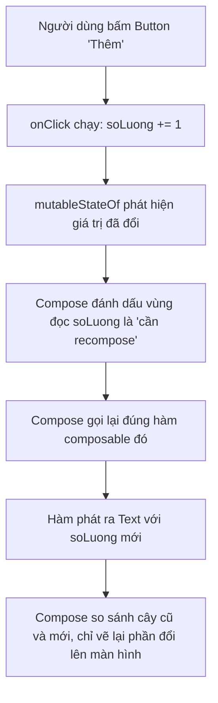

# Jetpack Compose cơ bản — @Composable, state, modifier

> **Tác giả:** Mr.Rom\
> **Phiên bản:** v1.0.0\
> **Tạo lúc:** 13/06/2026\
> **Cập nhật:** 13/06/2026\
> **Level:** Basic\
> **Tags:** android, kotlin, jetpack-compose, composable, modifier, state, recomposition, material3, preview, declarative, mobile\
> **Yêu cầu trước:** [Kotlin cơ bản](01_kotlin-basics.md)

> 🎯 *Bạn vừa nắm đủ Kotlin để đọc code (null safety, `data class`, coroutines). Giờ mở Android Studio ra dựng giao diện thì gặp ngay một thế giới lạ: **Jetpack Compose** — bộ công cụ UI khai báo hiện đại của Google. Bài này dạy đủ để bạn dựng được một màn hình thật: hàm **`@Composable`** là gì và vì sao nó không "trả về" gì, bộ composable nền tảng (`Text`/`Image`/`Button`/`Column`/`Row`/`Box`/`LazyColumn`), **`Modifier`** và vì sao **thứ tự nối chuỗi quyết định kết quả**, **`state`** với `remember { mutableStateOf() }` cùng cơ chế **recomposition** (vẽ lại), `@Preview` để xem ngay không cần build cả app, và Material 3 (`Scaffold`/`TopAppBar`). Cuối bài bạn ráp được một màn hình chi tiết sản phẩm Acme Shop chạy thật trên emulator.*

## 🎯 Sau bài này bạn sẽ

- [ ] Hiểu **Compose khai báo** (declarative) là gì và vì sao hàm `@Composable` mô tả UI thay vì trả về view
- [ ] Dùng được bộ composable nền tảng: `Text`, `Image`, `Button`, `Column`, `Row`, `Box`, `LazyColumn`
- [ ] Hiểu **`Modifier`**, cách chaining (nối chuỗi), và vì sao **thứ tự gọi modifier thay đổi kết quả**
- [ ] Quản lý dữ liệu thay đổi với `remember { mutableStateOf() }` và hiểu **recomposition**
- [ ] Dùng `@Preview` để xem giao diện trực tiếp trong Android Studio mà không cần build cả app
- [ ] Dựng khung màn hình bằng Material 3 (`Scaffold` + `TopAppBar`)
- [ ] Ráp được màn hình `ProductDetailScreen` của Acme Shop có nút tăng/giảm số lượng

---

## Cần gì để theo bài này

Trước khi đi tiếp, một điều dễ chịu cần nói rõ: khác với iOS (chỉ chạy trên Mac), lập trình Android **chạy trên mọi hệ điều hành** — Windows, macOS, hay Linux đều được. Bạn cần:

- **Android Studio** — IDE chính thức của Google (miễn phí), đã kèm sẵn JDK, Android SDK, và **emulator** (giả lập điện thoại Android ngay trên máy) nên bạn không cần điện thoại thật để học.
- Một **dự án Compose**. Khi tạo project mới (`File → New → New Project`), chọn template **Empty Activity** — template này mặc định đã bật Jetpack Compose, không phải cấu hình gì thêm.

Toàn bộ code trong bài viết theo **Kotlin 2.x**, **Jetpack Compose** và **Material 3** phiên bản hiện hành. Cách chạy: dán code vào file `.kt` tương ứng trong project. Mục `@Preview` ở cuối bài cho phép bạn xem giao diện **ngay trong Android Studio** (khung Design/Split bên phải) mà không phải build cả app lên emulator — ta sẽ dùng nó liên tục.

---

## Tình huống — biết Kotlin rồi mà nhìn `MainActivity.kt` vẫn thấy lạ

Bạn đã quyết định viết app Android native cho Acme Shop bằng Kotlin + Jetpack Compose. Bạn tạo project mới với template **Empty Activity**, và Android Studio sinh ra sẵn file `MainActivity.kt` đại loại như sau:

```kotlin
class MainActivity : ComponentActivity() {
    override fun onCreate(savedInstanceState: Bundle?) {
        super.onCreate(savedInstanceState)
        setContent {
            AcmeTheme {
                Greeting(name = "Android")
            }
        }
    }
}

@Composable
fun Greeting(name: String, modifier: Modifier = Modifier) {
    Text(
        text = "Xin chào $name!",
        modifier = modifier
    )
}

@Preview(showBackground = true)
@Composable
fun GreetingPreview() {
    AcmeTheme {
        Greeting(name = "Acme")
    }
}
```

Một loạt thứ lạ hiện ra cùng lúc, dù bạn đã biết Kotlin:

- `@Composable fun Greeting(...)` — sao một **hàm thường** lại dựng được giao diện? Nó không `return` gì, vậy "kết quả" của nó là cái gì?
- `setContent { ... }` — cái block này biến nội dung Compose thành màn hình thật như thế nào?
- `modifier: Modifier = Modifier` — tham số `Modifier` này là gì, và tại sao gần như composable nào cũng có nó?
- `@Preview` — cái annotation này làm gì mà chạy được giao diện ngay không cần bấm Run lên emulator?

Để hết bối rối, ta cần hiểu một tư duy mới: **declarative UI** (UI khai báo). Bài này đi đúng vào đó — từ hàm `@Composable`, qua các composable nền tảng, modifier, đến `state`/recomposition và Material 3.

---

## 1️⃣ Jetpack Compose khai báo (declarative) là gì?

Nếu bạn từng nghe đến cách viết UI Android **cũ** — dùng **XML layout** + **View** (ra đời 2008, từ thời Android đầu tiên) — thì cách làm ở đó là **mệnh lệnh** (imperative): bạn vẽ giao diện trong file `.xml`, rồi trong code Kotlin/Java phải `findViewById(...)` để *tìm* từng widget, và mỗi khi dữ liệu đổi thì *tự tay* đi gọi `textView.text = ...` để cập nhật. Bạn phải tự đồng bộ giao diện với dữ liệu — quên một chỗ là UI hiện sai.

Jetpack Compose (ra mắt ổn định 2021) lật ngược tư duy đó. Bạn **không tách XML khỏi code**, và **không ra lệnh từng bước**. Bạn viết các hàm Kotlin **khai báo** (declare): "với trạng thái hiện tại, giao diện *nên* trông như thế này". Khi dữ liệu đổi, Compose **tự** gọi lại hàm và vẽ lại đúng phần cần đổi. Đây gọi là **declarative UI** (UI khai báo).

🪞 **Ẩn dụ**: XML + View giống **tự lái xe số sàn** — bạn phải tự đạp côn, sang số, canh ga ở từng khúc cua (tự `findViewById`, tự set lại text). Compose giống **xe tự lái có điều hướng**: bạn chỉ khai báo điểm đến ("tôi muốn màn hình hiện giỏ hàng có 3 món"), xe tự lo đường đi và tự điều chỉnh khi tình huống đổi. Bạn mô tả *kết quả mong muốn*, framework lo *cách đạt được*. Ta sẽ dùng lại ẩn dụ "xe tự lái" này xuyên suốt bài.

### Hàm `@Composable` — UI là hàm, không phải file XML

Trong Compose, mọi mảnh giao diện đều là một **hàm** được đánh dấu annotation **`@Composable`**. Khi viết `@Composable fun Greeting(...)`, bạn đang nói với trình biên dịch: "đây không phải hàm thường — đây là hàm *mô tả UI*".

Điểm khiến người mới bất ngờ: hàm composable **không `return` ra view**. Nó cũng không in gì ra. Thay vào đó, khi chạy, nó **phát ra (emit)** các phần tử UI vào cây giao diện mà Compose đang dựng. Bạn cứ hình dung: gọi `Text("Acme")` *bên trong* một hàm `@Composable` nghĩa là "thêm một dòng chữ vào giao diện ở đây" — chứ không phải "tạo một đối tượng Text rồi trả về".

```kotlin
import androidx.compose.material3.Text
import androidx.compose.runtime.Composable

@Composable
fun Greeting() {
    // Hàm này KHÔNG return gì. Gọi Text(...) = "phát ra một dòng chữ vào UI ở đây".
    Text("Xin chào Acme")
}
```

Vì composable chỉ là hàm Kotlin, bạn được dùng mọi thứ Kotlin đã quen ngay trong đó: tham số, `if/else`, vòng lặp `for`, biến cục bộ. Đây là sức mạnh lớn — UI và logic ở chung một ngôn ngữ, không phải nhảy qua nhảy lại giữa XML và Kotlin.

> [!NOTE]
> Quy ước đặt tên: hàm `@Composable` **viết hoa chữ đầu** (`Greeting`, `ProductCard`) — khác với hàm Kotlin thường (`viết thường chữ đầu`). Đây là convention chính thức của Google để phân biệt nhanh "hàm này dựng UI" với "hàm này chạy logic".

> 📖 *Hiểu hàm `@Composable` "phát ra UI" rồi, giờ ta xem những viên gạch cụ thể để dựng giao diện — bộ composable nền tảng mà màn hình nào cũng dùng.*

---

## 2️⃣ Bộ composable nền tảng — những viên gạch dựng UI

Compose dựng UI bằng cách **lồng composable vào composable** — y như xếp hộp. Có hai nhóm: composable **nội dung** (hiện ra cái gì đó) và composable **bố cục** (sắp xếp các composable khác). Ta điểm qua bộ phải biết.

### Composable nội dung: `Text`, `Image`, `Button`

`Text` hiển thị chữ, `Image` hiển thị ảnh, `Button` là nút bấm. Đây là 3 composable nội dung gặp ở gần như mọi màn hình. Lưu ý: trong bài này ta dùng phiên bản từ Material 3 (`androidx.compose.material3`):

```kotlin
import androidx.compose.foundation.Image
import androidx.compose.material3.Button
import androidx.compose.material3.Text
import androidx.compose.ui.res.painterResource

// Text — hiển thị chữ
Text("Acme Shop")

// Image từ tài nguyên drawable trong project (res/drawable/logo_acme.png)
Image(
    painter = painterResource(id = R.drawable.logo_acme),
    contentDescription = "Logo Acme"   // mô tả cho trình đọc màn hình (accessibility)
)

// Button — tham số onClick là việc làm khi bấm, content là nhãn bên trong
Button(onClick = { println("Đã bấm Mua ngay") }) {
    Text("Mua ngay")
}
```

`Button(onClick = { ... }) { Text("Mua ngay") }` đọc là: `onClick` nhận một lambda (đoạn code chạy khi bấm), và block `{ ... }` cuối cùng là **nội dung** nút — ở đây là một `Text`. Để ý nhãn nút không phải một chuỗi truyền vào, mà là cả một composable lồng bên trong — nên bạn có thể đặt icon, nhiều dòng chữ, bất cứ gì vào nút.

> [!TIP]
> Tham số `contentDescription` của `Image` không phải để cho đẹp — nó là phần **accessibility** (trợ năng) để trình đọc màn hình đọc cho người khiếm thị. Nếu ảnh chỉ trang trí, truyền `contentDescription = null` để báo "ảnh này bỏ qua được".

### Composable bố cục: `Column`, `Row`, `Box`

Ba composable này là xương sống của bố cục Compose. Tên gọi cho biết chúng xếp các con theo trục nào: `Column` = cột (dọc), `Row` = hàng (ngang), `Box` = chồng lên nhau theo chiều sâu.

🪞 **Ẩn dụ**: 3 composable này như 3 cách xếp một chồng giấy. `Column` xếp các tờ **chồng dọc từ trên xuống** (như xếp giấy thành cột). `Row` đặt các tờ **cạnh nhau theo hàng ngang** (như bày giấy trên bàn từ trái sang phải). `Box` **đè các tờ lên nhau** (như chồng ảnh — tờ sau đè lên tờ trước, dùng để đặt chữ lên trên ảnh nền).

```kotlin
import androidx.compose.foundation.layout.Arrangement
import androidx.compose.foundation.layout.Box
import androidx.compose.foundation.layout.Column
import androidx.compose.foundation.layout.Row
import androidx.compose.ui.unit.dp

// Column — xếp dọc, từ trên xuống
Column {
    Text("iPhone 15 Pro")
    Text("28.000.000đ")
}

// Row — xếp ngang. Arrangement.spacedBy = khoảng cách đều giữa các con
Row(horizontalArrangement = Arrangement.spacedBy(12.dp)) {
    Text("⭐")
    Text("4.8")
}

// Box — chồng lên nhau theo chiều sâu (con sau đè lên con trước)
Box {
    Image(                                  // ảnh nền (dưới cùng)
        painter = painterResource(id = R.drawable.banner_acme),
        contentDescription = null
    )
    Text("Sale 50%")                        // chữ đè lên trên ảnh
}
```

`Column` và `Row` nhận hai nhóm tham số hay dùng để canh chỉnh con: trục chính (`verticalArrangement` cho `Column`, `horizontalArrangement` cho `Row`) và trục phụ (`horizontalAlignment` cho `Column`, `verticalAlignment` cho `Row`). Để ý đơn vị `dp` (*density-independent pixels* — pixel độc lập mật độ màn hình): Compose dùng `dp` thay cho pixel thô để UI hiển thị nhất quán trên màn hình mọi độ phân giải.

### Composable danh sách: `LazyColumn`

Khi cần hiển thị **nhiều phần tử** (danh sách sản phẩm, danh sách đơn hàng), bạn **không** dùng `Column` thường. Lý do: `Column` dựng **tất cả** các con cùng lúc — danh sách 1000 sản phẩm sẽ dựng đủ 1000 dòng dù màn hình chỉ thấy 10, vừa tốn bộ nhớ vừa lag. Compose có **`LazyColumn`** — danh sách cuộn dọc chỉ dựng đúng những phần tử **đang nhìn thấy** (và vài cái dự phòng), tái dùng khi cuộn. Chữ "Lazy" (lười) nghĩa là vậy: chỉ làm việc khi cần.

`LazyColumn` không nhận thẳng các con, mà nhận một block đặc biệt khai báo nội dung qua `items(...)`:

```kotlin
import androidx.compose.foundation.lazy.LazyColumn
import androidx.compose.foundation.lazy.items

val sanPham = listOf("iPhone 15", "iPad Air", "MacBook Pro")

// LazyColumn — danh sách cuộn, chỉ dựng phần tử đang thấy
LazyColumn {
    // items(...) lặp qua danh sách, mỗi phần tử sinh ra một dòng
    items(sanPham) { ten ->
        Text(ten)
    }
}
```

→ Quy tắc chọn: vài composable cố định, không cần cuộn động (như một thẻ sản phẩm gồm ảnh + tên + giá) → dùng `Column`/`Row`. Danh sách **dài / số lượng không biết trước / cần cuộn** → luôn dùng `LazyColumn` (hoặc `LazyRow` cho cuộn ngang). Bảng dưới tóm tắt cả bộ composable nền tảng để bạn tra nhanh:

| Composable | Vai trò | Tương đương web (gần đúng) |
|---|---|---|
| `Text` | Hiển thị chữ | `<p>` / `<span>` |
| `Image` | Hiển thị ảnh (drawable hoặc nguồn khác) | `` |
| `Button` | Nút bấm có hành động | `<button>` |
| `Column` | Xếp các con theo chiều dọc | `flex-direction: column` |
| `Row` | Xếp các con theo chiều ngang | `flex-direction: row` |
| `Box` | Chồng các con lên nhau theo chiều sâu | `position: absolute` xếp lớp |
| `LazyColumn` | Danh sách cuộn dọc, chỉ dựng phần tử đang thấy | `<ul>` ảo hoá (virtualized) |

> 📖 *Có viên gạch rồi, nhưng làm sao chỉnh kích thước, đệm, màu nền, viền? Đó là việc của **`Modifier`** — và đây là phần có một cạm bẫy rất dễ vấp về thứ tự.*

---

## 3️⃣ `Modifier` — chỉnh sửa composable bằng cách nối chuỗi

Một `Text("Acme")` trần thì chỉ là chữ mặc định. Muốn nó có đệm, có màu nền, có kích thước cố định, có viền bo góc? Bạn dùng **`Modifier`** (bộ chỉnh sửa) — một đối tượng bạn nối các hàm chỉnh sửa vào bằng dấu chấm, rồi truyền vào tham số `modifier` của composable.

Gần như **mọi composable nền tảng đều nhận một tham số `modifier`** — đây là cách chuẩn để chỉnh kích thước, đệm, nền, sự kiện bấm, v.v. từ *bên ngoài*. Điểm cốt lõi phải hiểu ngay: mỗi hàm trên `Modifier` **trả về một `Modifier` mới** đã thêm chỉ thị, nên bạn nối tiếp được nhiều cái — đó là **chaining** (nối chuỗi):

```kotlin
import androidx.compose.foundation.background
import androidx.compose.foundation.layout.padding
import androidx.compose.ui.Modifier
import androidx.compose.ui.graphics.Color
import androidx.compose.ui.unit.dp

Text(
    text = "Acme Shop",
    modifier = Modifier
        .padding(16.dp)              // thêm đệm 16dp xung quanh
        .background(Color.LightGray) // tô nền xám
)
```

Đọc từ trên xuống: bắt đầu là `Modifier`, rồi mỗi dòng `.something(...)` thêm một chỉ thị. Compose áp dụng các chỉ thị **theo đúng thứ tự bạn viết, từ ngoài vào trong** — và đây chính là chỗ sinh ra cạm bẫy.

### Vì sao thứ tự modifier lại quan trọng

Đây là chỗ người mới hay vấp nhất, nên đọc kỹ. Compose duyệt chuỗi modifier **theo thứ tự khai báo**: cái viết **trước** được áp dụng **trước** (nằm ở lớp ngoài hơn), cái viết **sau** áp dụng sau (nằm trong hơn, sát nội dung hơn). Vì thế **đổi thứ tự = đổi kết quả**.

Lấy ví dụ kinh điển: `padding` (đệm) và `background` (nền). Hãy so sánh hai chuỗi sau:

```kotlin
// CÁCH A: padding TRƯỚC, background SAU
Text(
    text = "Mua ngay",
    modifier = Modifier
        .padding(16.dp)              // 1. dành 16dp đệm ở vòng ngoài
        .background(Color.Magenta)   // 2. tô nền — nền nằm BÊN TRONG phần đệm
)

// CÁCH B: background TRƯỚC, padding SAU
Text(
    text = "Mua ngay",
    modifier = Modifier
        .background(Color.Magenta)   // 1. tô nền ở vòng ngoài — phủ cả vùng to
        .padding(16.dp)              // 2. đệm nằm BÊN TRONG nền — đẩy chữ vào
)
```

Kết quả khác hẳn nhau:

- **Cách A**: đệm áp dụng trước (vòng ngoài), nền vẽ *bên trong* phần đệm → nền chỉ ôm sát chữ, phần đệm 16dp nằm ngoài nền (trong suốt) → ra một khối màu bé tí với khoảng trống thừa xung quanh. Trông sai.
- **Cách B**: nền áp dụng trước (vòng ngoài) nên phủ cả vùng to, rồi đệm đẩy chữ vào trong → nền màu phủ cả khoảng thở quanh chữ → ra một **nút đẹp**. Đây là cái bạn muốn 99% trường hợp.

> [!NOTE]
> Để ý điểm ngược trực giác: trong Compose, muốn nền phủ cả phần đệm thì gọi `.background(...)` **trước** rồi `.padding(...)` **sau** — vì Compose áp modifier từ ngoài vào trong. (Nếu bạn từng học SwiftUI thì đây đúng là thứ tự **ngược lại** — ở SwiftUI là padding trước, background sau. Đừng nhầm giữa hai framework.)

🪞 **Ẩn dụ**: hình dung modifier như **các lớp của một củ hành**, viết trước là lớp ngoài. `background` viết trước = lớp vỏ ngoài cùng, phủ rộng. `padding` viết sau = lớp trong, đẩy lõi (chữ) thụt vào. Lõi luôn nằm trong cùng, mỗi modifier là một lớp bọc quanh — thứ tự bạn xếp lớp quyết định cái gì phủ rộng, cái gì ôm sát.

> [!WARNING]
> Đây là cạm bẫy modifier phổ biến nhất: **đặt nhầm thứ tự `background`/`padding`/`clip`/`border`**. Quy tắc nhớ nhanh cho Compose: modifier viết **trước** = lớp **ngoài** (phủ rộng), viết **sau** = lớp **trong** (sát nội dung). Muốn nền/viền ôm cả phần đệm → `.background(...)` (hoặc `.border(...)`) trước, `.padding(...)` sau.

→ Tóm lại: chaining modifier đọc tự nhiên từ trên xuống, nhưng **không phải mọi modifier đều giao hoán** (đổi chỗ cho nhau được). Với những cặp ảnh hưởng tới layout/hình khối như `padding`/`background`/`border`/`clip`/`size`, thứ tự là *load-bearing* — đổi chỗ là đổi kết quả.

---

## 4️⃣ `state` — quản lý dữ liệu thay đổi và recomposition

Tới giờ mọi composable ta viết đều **tĩnh** — hiện ra rồi đứng yên. Nhưng giao diện thật phải *động*: số lượng trong giỏ tăng khi bấm nút, công tắc bật/tắt, ô nhập đổi chữ. Những dữ liệu "sống" thay đổi theo tương tác này gọi là **state** (trạng thái).

Nhớ lại cơ chế khai báo: composable chỉ là hàm mô tả "UI nên trông thế nào theo dữ liệu hiện tại". Vậy khi dữ liệu đổi, Compose phải **gọi lại** hàm composable để dựng giao diện mới — việc gọi lại này gọi là **recomposition** (tái dựng / vẽ lại). Câu hỏi là: làm sao Compose *biết* dữ liệu đã đổi để mà gọi lại?

Câu trả lời gồm hai mảnh ghép, luôn đi cùng nhau:

- **`mutableStateOf(...)`** — tạo một "ô chứa state" mà Compose **theo dõi**. Đọc giá trị trong ô này ở đâu, thì khi giá trị đổi, đúng chỗ đó sẽ recompose.
- **`remember { ... }`** — bảo Compose **nhớ** giá trị này qua các lần recomposition. Cực kỳ quan trọng: hàm composable bị gọi lại liên tục, nếu không `remember` thì mỗi lần gọi lại sẽ tạo ô state **mới** với giá trị khởi tạo ban đầu → state bị reset, mất sạch. (Đây là cạm bẫy số 1 — sẽ nói kỹ ở cuối bài.)

Ráp hai mảnh lại thành câu thần chú quen thuộc: `remember { mutableStateOf(...) }`.

```kotlin
import androidx.compose.foundation.layout.Column
import androidx.compose.material3.Button
import androidx.compose.material3.Text
import androidx.compose.runtime.Composable
import androidx.compose.runtime.getValue
import androidx.compose.runtime.mutableStateOf
import androidx.compose.runtime.remember
import androidx.compose.runtime.setValue

@Composable
fun BoDem() {
    // remember + mutableStateOf: tạo ô state "soLuong", và NHỚ nó qua mỗi lần recompose.
    // by getValue/setValue: cho phép đọc/ghi soLuong như biến thường (không cần .value).
    var soLuong by remember { mutableStateOf(0) }

    Column {
        // Đọc soLuong ở đây → khi soLuong đổi, đúng Text này sẽ được vẽ lại.
        Text("Giỏ: $soLuong sản phẩm")

        Button(onClick = {
            // Gán thẳng — KHÔNG cần gọi hàm "báo vẽ lại" thủ công.
            // Compose theo dõi ô state này, thấy đổi là tự recompose.
            soLuong += 1
        }) {
            Text("Thêm")
        }
    }
}
```

Điểm khiến Compose gọn hơn nhiều cách viết XML cũ: bạn **chỉ cần gán** `soLuong += 1`. Không `findViewById`, không tự gọi `textView.text = ...`. Compose theo dõi ô state, thấy nó đổi → tự gọi lại `BoDem()` để dựng giao diện mới với giá trị mới.

🪞 **Ẩn dụ (nối tiếp "xe tự lái")**: state giống **bảng đồng hồ tốc độ** trên xe tự lái. Bạn không tự vẽ lại con số tốc độ — bạn chỉ đạp ga (đổi state), và bảng đồng hồ *tự cập nhật* hiển thị. `remember` giống **bộ nhớ của bảng đồng hồ**: nếu bảng "quên" mỗi lần liếc mắt thì số luôn về 0 — `remember` đảm bảo nó giữ con số qua mỗi lần xe tính toán lại.

> [!NOTE]
> Dòng `import androidx.compose.runtime.getValue` và `setValue` là bắt buộc để dùng cú pháp `by remember { ... }`. Nếu thiếu, Android Studio báo lỗi "delegate". Nếu không muốn dùng `by`, bạn viết `val state = remember { mutableStateOf(0) }` rồi đọc/ghi qua `state.value` — nhưng `by` gọn hơn nên bài này dùng nó.

> 📖 *Khái niệm "state đổi → recompose" là thứ trừu tượng nhất ở đây. Trước khi đi tiếp, hãy nhìn sơ đồ vòng đời một lần đổi state để hình dung rõ.*

Sơ đồ dưới mô tả chuyện gì xảy ra từ lúc người dùng bấm nút "Thêm" cho tới khi con số trên màn hình đổi. Tâm điểm là: bạn chỉ làm một việc (đổi state), phần còn lại Compose lo.



→ Điểm cốt lõi từ sơ đồ: đây là tư duy **declarative**. Bạn không đi tìm `Text` rồi ra lệnh "đổi chữ thành 1". Bạn đổi *dữ liệu*, và đã khai báo "`Text` luôn hiển thị `soLuong` hiện tại". Compose lo việc đồng bộ giao diện với dữ liệu — và nó **thông minh chỉ recompose vùng thật sự đọc state đã đổi**, không vẽ lại cả màn hình. Đây gọi là *intelligent recomposition* (recompose có chọn lọc).

---

## 5️⃣ Nâng state lên — truyền state xuống composable con (state hoisting)

`remember { mutableStateOf() }` giải quyết state *trong một hàm composable*. Nhưng thường bạn tách giao diện thành nhiều composable con — và một composable con cần **đọc và sửa** state nằm ở composable cha. Ví dụ: composable cha giữ số lượng giỏ hàng, một composable con là "bộ đếm" (nút `-` và `+`) cần sửa chính con số đó.

Cách làm chuẩn trong Compose gọi là **state hoisting** (nâng state lên): **state nằm ở cha**, còn composable con **không** tự giữ state — nó chỉ nhận hai thứ qua tham số:

- **giá trị hiện tại** (để hiển thị), và
- **một lambda callback** (để báo ngược lên cha "tôi muốn đổi giá trị").

Con không tự sửa dữ liệu — nó "xin" cha sửa qua callback. Đây là pattern *state đi xuống, event đi lên* (state down, events up), nền tảng của Compose.

🪞 **Ẩn dụ**: state ở cha là **cuốn sổ gốc** (cha giữ). Composable con là **nhân viên** — không có sổ riêng, chỉ được đưa cho *bản photo để xem* (giá trị hiện tại) và một *cái chuông để gọi* (callback). Con muốn đổi số → bấm chuông báo cha; cha mới là người cầm bút sửa sổ, rồi đưa bản photo mới xuống. Một nguồn sự thật duy nhất (cuốn sổ ở cha), con không sửa lén được.

Đây là cặp cha–con đầy đủ. Composable con `BoDemSoLuong` nhận `soLuong` (giá trị) và `onThayDoi` (callback); composable cha sở hữu state thật và truyền cả hai xuống:

```kotlin
import androidx.compose.foundation.layout.Arrangement
import androidx.compose.foundation.layout.Column
import androidx.compose.foundation.layout.Row
import androidx.compose.foundation.layout.padding
import androidx.compose.material3.Button
import androidx.compose.material3.Text
import androidx.compose.runtime.Composable
import androidx.compose.runtime.getValue
import androidx.compose.runtime.mutableStateOf
import androidx.compose.runtime.remember
import androidx.compose.runtime.setValue
import androidx.compose.ui.Modifier
import androidx.compose.ui.unit.dp

// COMPOSABLE CON: không tự giữ state. Nhận giá trị + callback để báo ngược lên cha.
@Composable
fun BoDemSoLuong(
    soLuong: Int,
    onThayDoi: (Int) -> Unit   // callback: con "xin" cha đổi giá trị
) {
    Row(horizontalArrangement = Arrangement.spacedBy(20.dp)) {
        Button(onClick = {
            if (soLuong > 0) onThayDoi(soLuong - 1)   // báo cha: giảm 1
        }) {
            Text("−")
        }
        Text("$soLuong")
        Button(onClick = {
            onThayDoi(soLuong + 1)                    // báo cha: tăng 1
        }) {
            Text("+")
        }
    }
}

// COMPOSABLE CHA: sở hữu state THẬT, truyền giá trị + callback xuống con.
@Composable
fun GioHang() {
    var soLuong by remember { mutableStateOf(1) }

    Column(modifier = Modifier.padding(16.dp)) {
        Text("Tổng trong giỏ: $soLuong")

        // Truyền giá trị xuống, và callback nhận giá trị mới rồi gán vào state của cha.
        BoDemSoLuong(
            soLuong = soLuong,
            onThayDoi = { giaTriMoi -> soLuong = giaTriMoi }
        )
    }
}
```

Hai điểm phải nhớ về pattern này:

- Composable con **stateless** (không state): nó chỉ biết "giá trị hiện tại là gì" và "khi cần đổi thì gọi callback". Nó tái dùng được ở mọi nơi, dễ test, dễ preview.
- Composable cha **stateful** (giữ state): nó là nguồn sự thật duy nhất. Callback `onThayDoi = { giaTriMoi -> soLuong = giaTriMoi }` chính là chỗ cha thật sự cập nhật state.

→ Quy tắc thực dụng: state **thuộc về** composable nào thì để `remember { mutableStateOf() }` ở đó. Composable con cần **sửa ngược** state của cha thì nhận thêm một **callback** (`(T) -> Unit`). Còn nếu con chỉ cần **đọc** (không sửa) thì truyền mỗi giá trị là đủ — không cần callback.

| Cách truyền dữ liệu xuống composable con | Khi nào dùng | Tham số con nhận |
|---|---|---|
| Chỉ giá trị | Con chỉ **đọc** để hiển thị | `fun Con(ten: String)` |
| Giá trị + callback | Con cần **đọc và xin sửa** state của cha | `fun Con(soLuong: Int, onThayDoi: (Int) -> Unit)` |

---

## 6️⃣ `@Preview` — xem giao diện ngay, không cần build cả app

Nãy giờ ta viết composable nhưng chưa "chạy" cái nào lên emulator. Tin vui: với Compose bạn **không cần build và chạy cả app** (vốn chậm) chỉ để xem một composable trông thế nào. Android Studio có **Preview** — một khung xem trực tiếp ở khung Design/Split bên phải editor, dựng lại khi bạn bấm refresh (hoặc bật chế độ live).

Để xem trước một composable, viết thêm **một hàm composable mới** đánh dấu cả `@Preview` lẫn `@Composable`, bên trong gọi composable bạn muốn xem:

```kotlin
import androidx.compose.runtime.Composable
import androidx.compose.ui.tooling.preview.Preview

@Preview(showBackground = true)
@Composable
fun GioHangPreview() {
    GioHang()
}
```

`@Preview` là một annotation báo cho Android Studio "hãy dựng hàm này trong khung xem trước". Tham số `showBackground = true` thêm nền trắng cho dễ nhìn. Bạn có thể có **nhiều** hàm `@Preview` trong một file để xem các trạng thái/kích thước khác nhau, và đặt tên cho từng cái:

```kotlin
// Preview tên rõ ràng
@Preview(name = "Giỏ mặc định", showBackground = true)
@Composable
fun GioHangPreview() {
    GioHang()
}

// Preview composable con riêng lẻ, truyền sẵn giá trị + callback rỗng để xem nhanh
@Preview(name = "Bộ đếm = 5", showBackground = true)
@Composable
fun BoDemPreview() {
    BoDemSoLuong(soLuong = 5, onThayDoi = {})
}
```

> [!TIP]
> Vì composable con `BoDemSoLuong` đã **stateless** (nhận giá trị + callback), preview nó cực dễ: truyền thẳng `soLuong = 5` và một callback rỗng `onThayDoi = {}`. Đây là phần thưởng của state hoisting — composable không tự giữ state thì preview/test nhẹ tênh, không phải dựng cả composable cha.

→ Preview là vũ khí năng suất lớn nhất của Compose: bạn dựng UI và thấy kết quả *ngay*, thử nhiều trạng thái cạnh nhau, không phải đợi build–chạy–bấm tới đúng màn hình mỗi lần sửa một chữ.

---

## 7️⃣ Material 3 — khung màn hình chuẩn với `Scaffold` và `TopAppBar`

App thật không chỉ là vài composable lơ lửng — nó cần một **khung màn hình** chuẩn: thanh tiêu đề trên cùng, vùng nội dung, đôi khi thanh dưới hoặc nút nổi (FAB). Compose dùng **Material 3** (hệ thiết kế hiện hành của Google, gói `androidx.compose.material3`) cung cấp sẵn các thành phần này.

🪞 **Ẩn dụ**: `Scaffold` (giàn giáo) như **khung sườn nhà tiền chế** — nó đã chia sẵn các "ô" chuẩn: ô mái (top bar), ô sàn (nội dung), ô tầng trệt (bottom bar). Bạn chỉ việc lắp nội dung của mình vào từng ô, không phải tự đo đạc canh lề thanh trạng thái, tai thỏ (notch) hay phím điều hướng — `Scaffold` lo phần "chừa chỗ" đó.

`Scaffold` nhận các "ô" qua tham số (`topBar`, `floatingActionButton`...) và một block nội dung. Quan trọng: block nội dung nhận vào một `paddingValues` — phần đệm Compose tính sẵn để nội dung không bị thanh trên/dưới che. Bạn **phải** áp `paddingValues` đó vào nội dung:

```kotlin
import androidx.compose.foundation.layout.Column
import androidx.compose.foundation.layout.padding
import androidx.compose.material3.ExperimentalMaterial3Api
import androidx.compose.material3.Scaffold
import androidx.compose.material3.Text
import androidx.compose.material3.TopAppBar
import androidx.compose.runtime.Composable
import androidx.compose.ui.Modifier

@OptIn(ExperimentalMaterial3Api::class)   // TopAppBar đang là API thử nghiệm
@Composable
fun ManHinhAcme() {
    Scaffold(
        topBar = {
            TopAppBar(
                title = { Text("Acme Shop") }   // tiêu đề trên thanh trên cùng
            )
        }
    ) { paddingValues ->
        // paddingValues = đệm Scaffold tính sẵn để nội dung không bị TopAppBar che.
        // PHẢI áp vào nội dung, nếu không nội dung sẽ chui xuống dưới thanh.
        Column(modifier = Modifier.padding(paddingValues)) {
            Text("Nội dung màn hình ở đây")
        }
    }
}
```

> [!IMPORTANT]
> Tham số `paddingValues` mà `Scaffold` đưa cho block nội dung **bắt buộc phải dùng** (`Modifier.padding(paddingValues)`). Bỏ qua nó là lỗi cực phổ biến: nội dung sẽ bị thanh `TopAppBar` đè lên trên hoặc bị phím điều hướng che ở dưới. Android Studio cũng cảnh báo nếu bạn nhận `paddingValues` mà không dùng.

> [!NOTE]
> `@OptIn(ExperimentalMaterial3Api::class)` cần có vì một số API Material 3 (như `TopAppBar`) vẫn được Google đánh dấu *experimental* (thử nghiệm) — annotation này là cách bạn xác nhận "tôi biết và chấp nhận dùng". Đây là chuyện bình thường, không phải lỗi.

→ `Scaffold` + `TopAppBar` là khung chuẩn cho gần như mọi màn hình Android hiện đại. Giờ ta có đủ mảnh ghép để ráp một màn hình thật.

> 📖 *Bạn đã có đủ: hàm `@Composable`, composable nền tảng, modifier (đúng thứ tự), state + recomposition, state hoisting, preview, và khung Material 3. Đến lúc ráp tất cả thành một màn hình Acme Shop chạy thật.*

---

## 8️⃣ Ráp lại — màn hình chi tiết sản phẩm Acme Shop

Giờ ta dựng `ProductDetailScreen`: màn hình chi tiết một sản phẩm có khung `Scaffold` + `TopAppBar`, ảnh (dùng emoji trong `Text` cho gọn, khỏi cần thêm file drawable), tên, giá, mô tả, một bộ đếm số lượng (tách thành composable con stateless dùng callback), và một nút "Thêm vào giỏ" hiện tổng số đã thêm. Vì có **dữ liệu thay đổi** (số lượng, tổng giỏ), màn hình dùng `remember { mutableStateOf() }`. Đây là file `.kt` hoàn chỉnh — tạo project Compose (Empty Activity) rồi dán các hàm này vào là chạy được trên emulator.

```kotlin
import androidx.compose.foundation.background
import androidx.compose.foundation.layout.Arrangement
import androidx.compose.foundation.layout.Column
import androidx.compose.foundation.layout.Row
import androidx.compose.foundation.layout.fillMaxWidth
import androidx.compose.foundation.layout.padding
import androidx.compose.foundation.rememberScrollState
import androidx.compose.foundation.shape.RoundedCornerShape
import androidx.compose.foundation.verticalScroll
import androidx.compose.material3.Button
import androidx.compose.material3.HorizontalDivider
import androidx.compose.material3.ExperimentalMaterial3Api
import androidx.compose.material3.MaterialTheme
import androidx.compose.material3.Scaffold
import androidx.compose.material3.Text
import androidx.compose.material3.TopAppBar
import androidx.compose.runtime.Composable
import androidx.compose.runtime.getValue
import androidx.compose.runtime.mutableStateOf
import androidx.compose.runtime.remember
import androidx.compose.runtime.setValue
import androidx.compose.ui.Alignment
import androidx.compose.ui.Modifier
import androidx.compose.ui.graphics.Color
import androidx.compose.ui.text.font.FontWeight
import androidx.compose.ui.text.style.TextAlign
import androidx.compose.ui.tooling.preview.Preview
import androidx.compose.ui.unit.dp
import androidx.compose.ui.unit.sp

// COMPOSABLE CON: bộ đếm số lượng — stateless, nhận giá trị + callback (state hoisting)
@Composable
fun BoDemSoLuong(
    soLuong: Int,
    onThayDoi: (Int) -> Unit
) {
    Row(
        horizontalArrangement = Arrangement.spacedBy(20.dp),
        verticalAlignment = Alignment.CenterVertically
    ) {
        Button(onClick = {
            if (soLuong > 1) onThayDoi(soLuong - 1)   // không cho xuống dưới 1
        }) {
            Text("−", fontSize = 18.sp)
        }
        Text("$soLuong", fontSize = 18.sp, fontWeight = FontWeight.SemiBold)
        Button(onClick = { onThayDoi(soLuong + 1) }) {
            Text("+", fontSize = 18.sp)
        }
    }
}

// COMPOSABLE CHÍNH: màn hình chi tiết sản phẩm
@OptIn(ExperimentalMaterial3Api::class)
@Composable
fun ProductDetailScreen() {
    // STATE 1: số lượng đang chọn (mặc định 1)
    var soLuongChon by remember { mutableStateOf(1) }
    // STATE 2: tổng số sản phẩm đã thêm vào giỏ
    var tongTrongGio by remember { mutableStateOf(0) }

    val tenSanPham = "iPhone 15 Pro"
    val gia = 28_000_000

    Scaffold(
        topBar = {
            TopAppBar(title = { Text("Chi tiết") })
        }
    ) { paddingValues ->
        Column(
            modifier = Modifier
                .padding(paddingValues)          // chừa chỗ cho TopAppBar (bắt buộc)
                .verticalScroll(rememberScrollState())  // cho cuộn khi nội dung dài
                .padding(16.dp),                 // đệm nội dung
            verticalArrangement = Arrangement.spacedBy(20.dp)
        ) {
            // 1. "Ảnh" sản phẩm — dùng emoji cho ví dụ, đặt trên nền bo góc.
            //    background TRƯỚC, padding SAU → nền phủ cả vùng to (đúng thứ tự Compose).
            Text(
                text = "📱",
                fontSize = 96.sp,
                textAlign = TextAlign.Center,
                modifier = Modifier
                    .fillMaxWidth()
                    .background(
                        color = MaterialTheme.colorScheme.primary.copy(alpha = 0.1f),
                        shape = RoundedCornerShape(20.dp)
                    )
                    .padding(vertical = 32.dp)
            )

            // 2. Tên + giá
            Column(verticalArrangement = Arrangement.spacedBy(4.dp)) {
                Text(tenSanPham, fontSize = 24.sp, fontWeight = FontWeight.Bold)
                Text(
                    "${"%,d".format(gia).replace(",", ".")}đ",  // 28000000 -> 28.000.000
                    fontSize = 18.sp,
                    color = Color.Gray
                )
            }

            // 3. Mô tả
            Text(
                "Chip A17 Pro, khung titan, camera 48MP. Hàng chính hãng Acme, bảo hành 12 tháng.",
                color = Color.Gray
            )

            HorizontalDivider()

            // 4. Bộ đếm số lượng (composable con stateless, truyền giá trị + callback)
            Row(
                modifier = Modifier.fillMaxWidth(),
                horizontalArrangement = Arrangement.SpaceBetween,
                verticalAlignment = Alignment.CenterVertically
            ) {
                Text("Số lượng", fontWeight = FontWeight.SemiBold)
                BoDemSoLuong(
                    soLuong = soLuongChon,
                    onThayDoi = { giaTriMoi -> soLuongChon = giaTriMoi }
                )
            }

            // 5. Nút thêm vào giỏ — cộng số lượng đang chọn vào tổng giỏ
            Button(
                onClick = { tongTrongGio += soLuongChon },
                modifier = Modifier.fillMaxWidth()
            ) {
                Text("Thêm $soLuongChon vào giỏ")
            }

            // 6. Hiện tổng trong giỏ — chỉ hiện khi đã thêm (if thẳng trong composable)
            if (tongTrongGio > 0) {
                Text(
                    "🛒 Giỏ hàng: $tongTrongGio sản phẩm",
                    color = Color(0xFF2E7D32),       // xanh lá
                    fontWeight = FontWeight.SemiBold
                )
            }
        }
    }
}

@Preview(showBackground = true)
@Composable
fun ProductDetailScreenPreview() {
    ProductDetailScreen()
}
```

Chạy preview (hoặc bấm Run để mở emulator): bạn thấy màn hình chi tiết iPhone 15 Pro với thanh tiêu đề "Chi tiết". Bấm `+`/`−` thay đổi số lượng; bấm "Thêm vào giỏ" thì tổng giỏ tăng và dòng "🛒 Giỏ hàng" hiện ra. Vài điểm trong code đáng soi kỹ để thấy mọi khái niệm đã học gắn vào đâu:

- `var soLuongChon by remember { mutableStateOf(1) }` và `tongTrongGio` là hai mẩu **state** của màn hình — đổi là hàm composable tự recompose. Đúng mục 4.
- `BoDemSoLuong(soLuong = soLuongChon, onThayDoi = { ... })` là **state hoisting**: con stateless nhận giá trị + callback, cha mới giữ state thật. Đúng mục 5.
- Cái "ảnh" emoji dùng `.background(...)` **trước** `.padding(...)` → nền phủ cả vùng to (đúng thứ tự Compose: ngoài → trong). Đảo hai dòng này, nền sẽ chỉ ôm sát emoji — đúng cạm bẫy ở mục 3.
- `Scaffold { paddingValues -> Column(Modifier.padding(paddingValues)...) }` — luôn áp `paddingValues` để nội dung không bị `TopAppBar` che. Đúng mục 7.
- `Modifier.verticalScroll(rememberScrollState())` cho phép cuộn khi nội dung dài hơn màn hình. Vì đây là vài composable cố định (không phải danh sách động), ta dùng `Column` cuộn được thay vì `LazyColumn`.
- `if (tongTrongGio > 0) { ... }` — bạn được viết `if` **thẳng trong hàm composable** để hiện/ẩn UI theo điều kiện. Đây là sức mạnh của declarative: UI là *hàm của state*.
- `Modifier.fillMaxWidth()` cho composable giãn hết bề ngang — kỹ thuật hay dùng để nút/hàng chiếm trọn chiều rộng.

→ Toàn bộ màn hình chỉ là một cây composable: `Scaffold` → `Column` cuộn → (ảnh + tên/giá + mô tả + bộ đếm + nút + dòng tổng). Đây là khung mẫu cho mọi màn hình Compose: khai báo state với `remember { mutableStateOf() }`, mô tả UI theo state đó, tách composable con stateless và nâng state lên cha (state hoisting), chỉnh diện mạo bằng `Modifier` (chú ý thứ tự), bọc trong `Scaffold` + `TopAppBar`.

---

## So với XML View cũ — vì sao Compose ít code hơn và reactive

Để thấy rõ Compose tiết kiệm cỡ nào, đặt cạnh cách viết XML + View cũ cho cùng một việc nhỏ: hiển thị một chữ và cập nhật khi bấm nút. Cách cũ tách làm **hai file** — một file XML khai báo giao diện, một file Kotlin phải `findViewById` để *tìm* widget rồi **tự tay** cập nhật mỗi khi dữ liệu đổi:

```xml
<!-- res/layout/activity_main.xml — phải khai báo UI ở file XML riêng -->
<LinearLayout ...>
    <TextView
        android:id="@+id/textGio"
        android:text="Giỏ: 0" />
    <Button
        android:id="@+id/btnThem"
        android:text="Thêm" />
</LinearLayout>
```

```kotlin
// MainActivity.kt — phải tìm view bằng id, rồi TỰ cập nhật text mỗi lần đổi
private var soLuong = 0

override fun onCreate(savedInstanceState: Bundle?) {
    super.onCreate(savedInstanceState)
    setContentView(R.layout.activity_main)

    val textGio = findViewById<TextView>(R.id.textGio)
    findViewById<Button>(R.id.btnThem).setOnClickListener {
        soLuong += 1
        textGio.text = "Giỏ: $soLuong"   // tự đồng bộ tay — quên là UI hiện sai
    }
}
```

Compose làm cùng việc đó **khai báo** trong **một file Kotlin duy nhất** — bạn nói "`Text` luôn hiện `soLuong` hiện tại", không bao giờ phải `findViewById` hay tự cập nhật:

```kotlin
// Compose: khai báo "Text hiển thị soLuong" — đổi state là tự recompose
@Composable
fun GioHang() {
    var soLuong by remember { mutableStateOf(0) }
    Column {
        Text("Giỏ: $soLuong")
        Button(onClick = { soLuong += 1 }) {   // không cần tự set lại Text
            Text("Thêm")
        }
    }
}
```

Khác biệt cốt lõi gói trong bảng dưới — đây là lý do Google đẩy Compose làm hướng đi chính cho UI Android mới:

| Tiêu chí | XML + View (cũ, mệnh lệnh) | Jetpack Compose (khai báo) |
|---|---|---|
| Ra đời | 2008 | 2021 (ổn định) |
| Nơi viết UI | File `.xml` riêng + code Kotlin | Hàm Kotlin `@Composable`, một chỗ |
| Tìm widget | `findViewById` / View Binding | Không cần — gọi composable trực tiếp |
| Đồng bộ UI với dữ liệu | Tự tay cập nhật (dễ quên, dễ sai) | Tự động — state đổi thì recompose |
| Lượng code cho việc tương tự | Nhiều, dài dòng, hai file | Ít hơn rõ rệt, một file |
| Xem trước giao diện | Preview XML (không chạy logic/state thật) | `@Preview` ngay trong editor, có state |
| Khi nào vẫn cần cái cũ | Codebase cũ, vài view rất chuyên sâu chưa có ở Compose | Mặc định cho UI mới |

→ Compose không xoá bỏ View cũ ngay (hai cái còn lồng vào nhau được, codebase cũ vẫn dùng XML), nhưng cho dự án **mới** thì Compose là lựa chọn mặc định của Google: ít code hơn, **reactive** (giao diện tự phản ứng theo dữ liệu), và xem trước cực nhanh.

---

## 💡 Cạm bẫy thường gặp & Best practice

### ❌ Cạm bẫy: Quên `remember` → mất state mỗi lần recompose

- **Triệu chứng**: Khai báo state mà **không bọc `remember`**, kiểu `var soLuong by mutableStateOf(0)` ngay trong hàm composable. Bấm "Thêm", con số nhảy lên 1 rồi... lập tức quay về 0, hoặc đứng im không tăng. State như bị "reset" liên tục.
- **Nguyên nhân**: Hàm composable bị Compose **gọi lại (recompose) liên tục**. Nếu không có `remember`, mỗi lần gọi lại sẽ chạy lại `mutableStateOf(0)` → tạo một ô state **mới tinh** với giá trị khởi tạo `0`, vứt bỏ ô cũ cùng giá trị đã tăng. `remember` mới là cái bảo Compose "nhớ ô state này qua các lần recompose, đừng tạo lại".
- **Cách tránh**: Luôn dùng đúng cặp `remember { mutableStateOf(...) }` đi liền nhau cho state cục bộ trong composable. Nhớ câu thần chú: *`mutableStateOf` để Compose theo dõi đổi giá trị, `remember` để Compose giữ giá trị qua recompose* — thiếu một trong hai là sai.

### ❌ Cạm bẫy: Đặt sai thứ tự modifier (`background`/`padding`/`clip`)

- **Triệu chứng**: Nút/khối có nền chỉ ôm sát chữ với khoảng trống thừa xung quanh; hoặc viền/bo góc không bao đúng vùng mong muốn; vùng bấm to/nhỏ hơn ý muốn. UI "trông sai" dù từng modifier đều đúng.
- **Nguyên nhân**: Compose áp modifier **theo thứ tự khai báo, từ ngoài vào trong** — viết trước là lớp ngoài (phủ rộng), viết sau là lớp trong (sát nội dung). Gọi `.padding(...)` *trước* `.background(...)` thì nền nằm trong phần đệm → chỉ phủ sát chữ. Người mới tưởng modifier "cộng dồn thuộc tính" như CSS nên đổi thứ tự thoải mái — sai.
- **Cách tránh**: Nhớ quy tắc "viết trước = lớp ngoài, viết sau = lớp trong". Muốn nền/viền/bo góc ôm cả phần đệm → gọi `.background(...)`/`.border(...)`/`.clip(...)` **trước**, rồi `.padding(...)` **sau**. (Lưu ý: thứ tự này **ngược** với SwiftUI — đừng nhầm.) Khi UI sai, thử đảo thứ tự hai modifier liên quan đến hình khối trước khi nghĩ tới nguyên nhân khác.

### ✅ Best practice: State hoisting — tách composable con stateless

- **Vì sao**: Composable con tự giữ state riêng thì khó tái dùng, khó test, khó preview, và dễ sinh "hai nguồn sự thật" lệch nhau. Tách state lên cha và để con **stateless** (nhận giá trị + callback) khiến con thuần tuý là "hàm vẽ UI theo input" — tái dùng được mọi nơi, preview chỉ cần truyền giá trị cố định + callback rỗng.
- **Cách áp dụng**: Khi một composable con cần dữ liệu thay đổi từ cha, đừng cho con `remember` state riêng. Cho con nhận giá trị (đọc) + một lambda `(T) -> Unit` (báo cha đổi). State `remember { mutableStateOf() }` chỉ nằm ở composable cha — nơi *sở hữu* dữ liệu đó.

### ✅ Best practice: Dùng `@Preview` liên tục, thử nhiều trạng thái cạnh nhau

- **Vì sao**: Build & chạy cả app lên emulator để xem một thay đổi nhỏ rất chậm. Preview dựng lại nhanh hơn nhiều, và bạn có thể đặt nhiều `@Preview` để xem các state khác nhau (giỏ trống / giỏ có hàng, màn nhỏ / màn lớn) cùng lúc — bắt lỗi layout sớm.
- **Cách áp dụng**: Mỗi file composable nên có ít nhất một hàm `@Preview`. Với composable con stateless, truyền thẳng giá trị mẫu và callback rỗng (`onThayDoi = {}`). Đặt tên preview (`@Preview(name = "Giỏ trống")`) khi có nhiều cái để dễ phân biệt.

---

## 🧠 Tự kiểm tra (Self-check)

**Q1.** Một hàm `@Composable` khác hàm Kotlin thường ở điểm gì? Nó "trả về" cái gì?

<details>
<summary>💡 Xem giải thích</summary>

Hàm `@Composable` được đánh dấu annotation `@Composable` để báo trình biên dịch "đây là hàm *mô tả UI*", không phải hàm logic thường. Điểm khác cốt lõi: nó **không `return` ra view**. Khi chạy, nó **phát ra (emit)** các phần tử UI vào cây giao diện Compose đang dựng — gọi `Text("Acme")` bên trong nghĩa là "thêm một dòng chữ vào UI ở đây". Vì nó vẫn là hàm Kotlin, bạn dùng được `if/else`, vòng lặp, tham số ngay trong đó. Quy ước: tên viết hoa chữ đầu (`Greeting`).

</details>

**Q2.** Hai chuỗi modifier sau cho kết quả khác nhau như thế nào, và vì sao?
`Modifier.padding(16.dp).background(Color.Blue)` so với `Modifier.background(Color.Blue).padding(16.dp)`

<details>
<summary>💡 Xem giải thích</summary>

Compose áp modifier **theo thứ tự khai báo, từ ngoài vào trong** — viết trước là lớp ngoài.

- `.padding(16.dp).background(...)`: đệm áp trước (vòng ngoài), nền vẽ *bên trong* phần đệm → nền chỉ ôm sát chữ, phần đệm 16dp nằm ngoài nền (trong suốt) → khối xanh bé với khoảng trống thừa xung quanh.
- `.background(...).padding(16.dp)`: nền áp trước (vòng ngoài) phủ cả vùng to, rồi đệm đẩy chữ vào trong → nền xanh **phủ cả khoảng thở quanh chữ** → ra nút đẹp.

Quy tắc nhớ (Compose): viết **trước** = lớp **ngoài** (phủ rộng), viết **sau** = lớp **trong** (sát nội dung). Lưu ý thứ tự này ngược với SwiftUI.

</details>

**Q3.** Vì sao `remember` lại bắt buộc đi kèm `mutableStateOf`? Bỏ `remember` thì chuyện gì xảy ra?

<details>
<summary>💡 Xem giải thích</summary>

`mutableStateOf(...)` tạo ô state mà Compose **theo dõi** (giá trị đổi → recompose vùng đọc nó). `remember { ... }` bảo Compose **giữ** giá trị đó qua các lần recompose.

Bỏ `remember`: vì hàm composable bị gọi lại liên tục, mỗi lần recompose sẽ chạy lại `mutableStateOf(0)` → tạo ô state **mới** với giá trị khởi tạo ban đầu, vứt giá trị cũ → state bị reset, không bao giờ giữ được thay đổi. Phải dùng cặp `remember { mutableStateOf(...) }` đi liền.

</details>

**Q4.** State hoisting là gì? Một composable con cần đổi số lượng giỏ hàng (state nằm ở cha) thì nhận những tham số nào?

<details>
<summary>💡 Xem giải thích</summary>

State hoisting (nâng state lên) = để **state nằm ở composable cha**, còn con **không** giữ state riêng. Con nhận hai thứ: **giá trị hiện tại** (để hiển thị) và **một callback** `(T) -> Unit` (để báo ngược lên cha "tôi muốn đổi"). Pattern *state đi xuống, event đi lên*.

Composable con đổi số lượng nhận: `soLuong: Int` (giá trị) và `onThayDoi: (Int) -> Unit` (callback). Con không tự sửa — nó gọi `onThayDoi(soLuong + 1)`; cha mới là người gán `soLuong = giaTriMoi` vào state thật. Nếu con chỉ **đọc** (không sửa) thì truyền mỗi giá trị là đủ.

</details>

**Q5.** `@Preview` dùng để làm gì? Vì sao nó là điểm cộng năng suất lớn của Compose? Làm sao preview một composable con stateless cần callback?

<details>
<summary>💡 Xem giải thích</summary>

`@Preview` (đặt trên một hàm composable, kèm `@Composable`) cho phép xem giao diện **ngay trong Android Studio** mà **không cần build & chạy cả app lên emulator** — dựng lại nhanh khi sửa code. So với XML + View cũ (thường phải build → chạy → bấm tới đúng màn hình mới thấy state thật), đây là vòng lặp phản hồi nhanh hơn nhiều, và preview chạy được cả state thật.

Preview một composable con stateless: truyền thẳng giá trị mẫu và callback rỗng, ví dụ `BoDemSoLuong(soLuong = 5, onThayDoi = {})`. Không cần dựng cả composable cha — đây là phần thưởng của state hoisting.

</details>

---

## ⚡ Tra cứu nhanh (Cheatsheet)

| Mục đích | Cú pháp Compose |
|---|---|
| Khai báo một composable | `@Composable fun MyScreen() { ... }` |
| Chữ | `Text("Acme")` |
| Ảnh từ drawable | `Image(painterResource(R.drawable.logo), contentDescription = "...")` |
| Nút | `Button(onClick = { ... }) { Text("Mua") }` |
| Xếp dọc | `Column { ... }` |
| Xếp ngang | `Row { ... }` |
| Chồng lớp | `Box { ... }` |
| Danh sách cuộn (ảo hoá) | `LazyColumn { items(ds) { x -> ... } }` |
| Khoảng cách đều giữa con | `Arrangement.spacedBy(12.dp)` |
| Đệm | `Modifier.padding(16.dp)` |
| Nền (gọi TRƯỚC padding) | `Modifier.background(Color.Magenta)` |
| Bo góc nền | `Modifier.background(color, RoundedCornerShape(14.dp))` |
| Giãn hết bề ngang | `Modifier.fillMaxWidth()` |
| Cho cuộn dọc | `Modifier.verticalScroll(rememberScrollState())` |
| State nội bộ | `var x by remember { mutableStateOf(0) }` |
| Truyền state xuống con (hoisting) | `Con(value = x, onChange = { x = it })` |
| Xem trước | `@Preview @Composable fun P() { MyScreen() }` |
| Khung màn hình | `Scaffold(topBar = { TopAppBar(...) }) { pad -> ... }` |
| Thanh tiêu đề | `TopAppBar(title = { Text("...") })` |
| Hiện UI theo điều kiện | `if (dieuKien) { SomeComposable() }` trong composable |

---

## 📚 Từ Điển Thuật Ngữ (Glossary)

| EN | VN | Giải thích |
|---|---|---|
| Jetpack Compose | Jetpack Compose | Bộ công cụ UI khai báo hiện đại của Google cho Android (ổn định 2021), viết bằng Kotlin |
| XML layout / View | Layout XML / View | Cách viết UI Android cũ (2008): khai báo trong file XML + code Kotlin tìm/cập nhật thủ công |
| Declarative UI | UI khai báo | Mô tả "UI nên trông thế nào theo state", framework tự lo cập nhật |
| Imperative UI | UI mệnh lệnh | Ra lệnh từng bước tạo và cập nhật UI thủ công (XML + View) |
| @Composable | @Composable | Annotation đánh dấu hàm mô tả UI; hàm không return view mà "phát ra" UI |
| Composable | Composable | Một hàm `@Composable`, đơn vị dựng UI trong Compose |
| Modifier | Bộ chỉnh sửa | Đối tượng nối chuỗi để chỉnh kích thước/đệm/nền/sự kiện của composable; thứ tự quan trọng |
| Chaining | Nối chuỗi | Gọi nhiều hàm modifier liên tiếp; Compose áp từ ngoài vào trong |
| State | Trạng thái | Dữ liệu "sống" thay đổi theo tương tác, làm UI vẽ lại |
| mutableStateOf | mutableStateOf | Tạo ô state Compose theo dõi; đổi giá trị thì recompose vùng đọc nó |
| remember | remember | Giữ giá trị qua các lần recompose; thiếu nó state bị reset mỗi lần gọi lại |
| Recomposition | Tái dựng | Compose gọi lại hàm composable để dựng UI mới khi state đổi |
| State hoisting | Nâng state lên | Đặt state ở cha, con stateless nhận giá trị + callback (state down, events up) |
| Stateless / Stateful | Không/có state | Composable không tự giữ state (con) / có giữ state (cha) |
| @Preview | @Preview | Annotation cho xem composable ngay trong Android Studio, không cần build cả app |
| Material 3 | Material 3 | Hệ thiết kế hiện hành của Google; gói `androidx.compose.material3` |
| Scaffold | Scaffold (giàn giáo) | Composable cung cấp khung màn hình chuẩn: top bar, nội dung, bottom bar |
| TopAppBar | Thanh tiêu đề trên | Thanh trên cùng màn hình Material 3, thường chứa tiêu đề + nút |
| dp | dp | Density-independent pixel — đơn vị kích thước độc lập mật độ màn hình |
| sp | sp | Scale-independent pixel — đơn vị cỡ chữ, co theo cài đặt cỡ chữ của người dùng |
| LazyColumn | LazyColumn | Danh sách cuộn dọc chỉ dựng phần tử đang thấy (ảo hoá) — cho danh sách dài |

---

## 🔗 Liên kết & Tài nguyên

⬅️ **Bài trước:** [Kotlin cơ bản — Null safety, data class, coroutines](01_kotlin-basics.md)\
➡️ **Bài tiếp theo:** [State, Data & Navigation — ViewModel, Retrofit, Room](03_state-data-and-navigation.md)\
↑ **Về cụm:** [Android với Kotlin — README cụm](../../README.md)

### 🧭 Định hướng lộ trình học

- [Kotlin cơ bản — Null safety, data class, coroutines](01_kotlin-basics.md) — nền tảng Kotlin, yêu cầu trước của bài này
- [State, Data & Navigation — ViewModel, Retrofit, Room](03_state-data-and-navigation.md) — bài kế: quản lý state lớn hơn (`ViewModel`), gọi API với Retrofit, lưu trữ với Room
- [Lập trình Android là gì? — Kotlin, Android Studio, Compose](00_what-is-android-development.md) — bức tranh tổng nếu cần xem lại bối cảnh

### 🧩 Các chủ đề có thể bạn quan tâm

- [SwiftUI cơ bản — View, modifier, @State](../../../ios-swift/lessons/01_basic/02_swiftui-fundamentals.md) — đối chiếu cách iOS dựng UI khai báo (lưu ý: thứ tự modifier của SwiftUI **ngược** với Compose)
- [Dart & Widgets — Mọi thứ là widget](../../../flutter/lessons/01_basic/01_dart-and-widgets.md) — cách Flutter dựng UI khai báo (so sánh `remember` với `setState`)
- [React Native là gì? — Viết app native bằng React](../../../react-native/lessons/01_basic/00_what-is-react-native.md) — một hướng đa nền tảng khác cho cùng bài toán app mobile

### 🌐 Tài nguyên tham khảo khác

- [Android Developers — Jetpack Compose](https://developer.android.com/jetpack/compose) — tài liệu chính thức, đầy đủ mọi composable và modifier
- [Android Developers — Compose Tutorial](https://developer.android.com/develop/ui/compose/tutorial) — hướng dẫn từng bước có hình ảnh, rất hợp người mới
- [Android Developers — State and Jetpack Compose](https://developer.android.com/develop/ui/compose/state) — đào sâu state, `remember`, recomposition, state hoisting
- [Material 3 — Compose components](https://m3.material.io/develop/android/jetpack-compose) — tra cứu thành phần Material 3 cho Compose

---

> 🎯 *Sau bài này bạn đã dựng được màn hình Compose thật: hàm `@Composable` khai báo, modifier (đúng thứ tự), `remember { mutableStateOf() }` + recomposition, state hoisting, `@Preview` và khung Material 3. Bài kế tiếp nâng tầm: quản lý state ở quy mô app bằng **ViewModel**, gọi API thật với **Retrofit**, và lưu dữ liệu lâu dài bằng **Room** — cùng điều hướng nhiều màn hình.*

---

## 📌 Nhật ký thay đổi (Changelog)

- **v1.0.0 (13/06/2026)** — Bản đầu tiên. Cụm `android-kotlin/` lesson 2/5 (basic). Cover: Compose khai báo (declarative) là gì + hàm `@Composable` "phát ra UI" không return view + bộ composable nền tảng (`Text`/`Image`/`Button`/`Column`/`Row`/`Box`/`LazyColumn`) + `Modifier` và chaining (nhấn mạnh thứ tự `background` vs `padding` quan trọng, ngược SwiftUI) + `state` với `remember { mutableStateOf() }` + recomposition + state hoisting (con stateless nhận giá trị + callback) + `@Preview` xem trực tiếp trong Android Studio + Material 3 (`Scaffold`/`TopAppBar`/`paddingValues`) + so sánh Compose vs XML+View cũ (ít code, một file, reactive). Code Kotlin 2.x/Compose/Material 3 hiện hành; màn hình `ProductDetailScreen` của Acme Shop hoàn chỉnh (state đếm số lượng + composable con `BoDemSoLuong` dùng callback). 1 sơ đồ mermaid (state đổi → recomposition). Cạm bẫy: quên `remember` (mất state khi recompose), thứ tự modifier.
</content>
</invoke>
