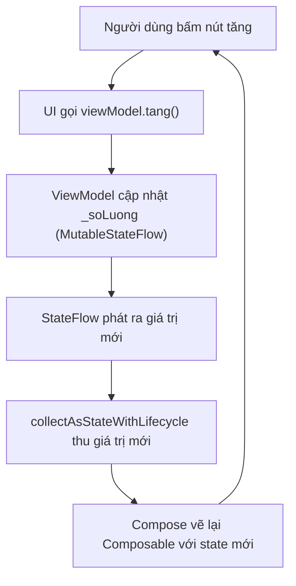

# State, Data & Navigation — ViewModel, Retrofit, Room

> **Tác giả:** Mr.Rom\
> **Phiên bản:** v1.0.0\
> **Tạo lúc:** 13/06/2026\
> **Cập nhật:** 13/06/2026\
> **Level:** Basic\
> **Tags:** android, kotlin, jetpack-compose, viewmodel, stateflow, navigation-compose, retrofit, coroutines, room, datastore, lifecycle, mobile\
> **Yêu cầu trước:** [Jetpack Compose cơ bản](02_jetpack-compose-fundamentals.md)

> 🎯 *Bài trước bạn dựng được màn hình tĩnh bằng `@Composable` và `remember`/`mutableStateOf`. Nhưng app thật phải xoay ngang màn là không mất dữ liệu, tải sản phẩm Acme từ server qua mạng mà không treo app, đi qua lại giữa các màn hình, và nhớ cài đặt người dùng sau khi tắt máy. Bài này lắp đủ 4 mảnh đó: **state hoisting** + **`ViewModel`** giữ state qua config change với **`StateFlow`** và `collectAsStateWithLifecycle`; **Navigation Compose** để chuyển màn và truyền argument; **Retrofit + coroutines** để gọi API thật (loading/error đàng hoàng); và **DataStore** + **Room** để lưu dữ liệu lâu dài. Cuối bài bạn có màn hình danh sách sản phẩm Acme tải từ network, đúng kiến trúc Android hiện hành.*

## 🎯 Sau bài này bạn sẽ

- [ ] Hiểu **state hoisting** — nâng state lên cao để Composable thuần (stateless) dễ test, dễ tái dùng
- [ ] Dùng **`ViewModel`** giữ state sống sót qua **config change** (xoay màn) và hiểu vì sao không để logic trong Composable
- [ ] Phơi state từ ViewModel bằng **`StateFlow`** và thu trong UI bằng **`collectAsStateWithLifecycle`** (lifecycle-aware)
- [ ] Điều hướng giữa màn hình bằng **Navigation Compose**: `NavHost`, `route`, và **truyền argument**
- [ ] Gọi API thật bằng **Retrofit + coroutines**, parse JSON, xử lý 3 trạng thái **loading / success / error**
- [ ] Lưu cài đặt bằng **DataStore** (thay `SharedPreferences`) và lưu dữ liệu có cấu trúc bằng **Room**
- [ ] Tránh 2 lỗi kinh điển: **chặn main thread** và **nhét logic vào Composable** thay vì ViewModel

---

## Cần gì để theo bài này

Bài này tiếp nối thẳng từ Jetpack Compose cơ bản, nên môi trường vẫn như cũ: **Android Studio** (chạy được trên Windows / macOS / Linux) với một dự án **Empty Activity (Compose)**. Toàn bộ code theo **Kotlin 2.x**, **Jetpack Compose** + **Material 3**, và **coroutines/Flow** — các API hiện hành.

Khác với bài trước, bài này thêm vài thư viện. Bạn khai báo chúng trong file `build.gradle.kts` (module `app`) ở khối `dependencies`. Đây là phần thư viện cần cho cả bài — thêm vào rồi bấm **Sync Now** Android Studio sẽ tải về:

```kotlin
dependencies {
    // ViewModel cho Compose — lấy ViewModel trong Composable bằng viewModel()
    implementation("androidx.lifecycle:lifecycle-viewmodel-compose:2.8.4")
    // collectAsStateWithLifecycle — thu Flow an toàn theo vòng đời
    implementation("androidx.lifecycle:lifecycle-runtime-compose:2.8.4")

    // Navigation Compose — NavHost, NavController, truyền argument
    implementation("androidx.navigation:navigation-compose:2.8.0")

    // Retrofit — HTTP client + bộ chuyển JSON sang object
    implementation("com.squareup.retrofit2:retrofit:2.11.0")
    implementation("com.squareup.retrofit2:converter-kotlinx-serialization:2.11.0")
    // kotlinx.serialization — parse JSON kiểu Kotlin-native
    implementation("org.jetbrains.kotlinx:kotlinx-serialization-json:1.7.1")

    // DataStore — lưu cài đặt key-value (thay SharedPreferences)
    implementation("androidx.datastore:datastore-preferences:1.1.1")

    // Room — database SQLite có kiểm tra ở compile-time
    implementation("androidx.room:room-runtime:2.6.1")
    implementation("androidx.room:room-ktx:2.6.1")
    ksp("androidx.room:room-compiler:2.6.1")
}
```

> [!NOTE]
> `kotlinx.serialization` và Room cần thêm plugin biên dịch. Ở đầu file `build.gradle.kts` module `app`, thêm `id("org.jetbrains.kotlin.plugin.serialization")` và `id("com.google.devtools.ksp")` vào khối `plugins`. Số phiên bản thư viện thay đổi theo thời gian — Android Studio sẽ gợi ý bản mới khi bạn Sync, cứ nhận bản ổn định mới nhất.

---

## Tình huống — màn hình đẹp mà xoay ngang là mất sạch

Bạn vừa dựng xong màn hình Acme Shop bằng Compose. Bạn dùng `remember { mutableStateOf(...) }` để giữ danh sách sản phẩm và số liệu giỏ hàng, mọi thứ chạy mượt trên emulator. Rồi bạn **xoay ngang** điện thoại để test — và toàn bộ dữ liệu **biến mất**, màn hình quay về trạng thái rỗng ban đầu.

Chuyện gì vừa xảy ra? Khi xoay màn, Android **huỷ và tạo lại** `Activity` (đây là một dạng *config change* — thay đổi cấu hình thiết bị). State giữ trong `remember` chỉ sống trong vòng đời của Composition, nên Activity tạo lại là state về 0. Đây chính là vấn đề mà `remember` **không** giải quyết được.

Tệ hơn, khi bạn thêm phần gọi API tải sản phẩm Acme: nếu viết code gọi mạng **thẳng trong Composable** và chạy đồng bộ trên *main thread* (luồng chính — luồng vẽ UI), app sẽ **đứng hình** vài giây rồi báo lỗi **ANR** (*Application Not Responding* — ứng dụng không phản hồi). Người dùng thấy app treo.

Hai vấn đề này — *state mất khi xoay màn* và *gọi mạng làm treo UI* — là lý do Android có sẵn một bộ công cụ chuẩn: **`ViewModel`** (giữ state ngoài vòng đời Activity), **`StateFlow`** (luồng state quan sát được), **coroutines** (chạy việc nặng ngoài main thread). Bài này lắp chúng lại với nhau, cộng thêm Navigation, Retrofit, DataStore và Room.

---

## 1️⃣ State hoisting — đẩy state lên cao để Composable "thuần"

Ở bài Compose cơ bản, bạn giữ state ngay trong Composable bằng `remember { mutableStateOf(...) }`. Cách đó tiện cho ví dụ nhỏ, nhưng có một vấn đề: Composable vừa **giữ** dữ liệu vừa **vẽ** giao diện — nó "biết quá nhiều", khó test riêng và khó tái dùng ở chỗ khác.

**State hoisting** (nâng state lên) là kỹ thuật **chuyển state ra khỏi** Composable, đẩy lên *Composable cha* (hoặc lên ViewModel). Composable con trở thành **stateless** (không state): nó chỉ nhận `value` để hiển thị và một *callback* (hàm gọi ngược) để báo "người dùng vừa muốn đổi". Mẫu chuẩn gọi là **state down, events up** — dữ liệu chảy *xuống*, sự kiện bắn *lên*.

🪞 **Ẩn dụ**: Composable stateless giống một **chiếc TV**. TV không tự quyết kênh — nó chỉ *hiển thị* tín hiệu được đưa vào (`value` đi xuống) và *gửi lệnh* khi bạn bấm remote (event đi lên). Bộ thu/đầu phát (cha hoặc ViewModel) mới là nơi *giữ* kênh hiện tại. Đổi đầu phát, cùng cái TV đó hiển thị nội dung khác — đó là lý do stateless dễ tái dùng.

So sánh trực tiếp một bộ đếm số lượng giỏ hàng, kiểu "ôm state" và kiểu "hoisted":

```kotlin
// ❌ STATEFUL — Composable tự ôm state. Khó test, khó tái dùng,
// và mỗi nơi gọi lại có một bản state riêng tách biệt.
@Composable
fun BoDemOmState() {
    var soLuong by remember { mutableStateOf(1) }
    Button(onClick = { soLuong++ }) {
        Text("Số lượng: $soLuong")
    }
}

// ✅ STATELESS (hoisted) — nhận giá trị xuống, bắn sự kiện lên.
// Không biết state ở đâu, ai giữ. Tái dùng và test được dễ dàng.
@Composable
fun BoDem(
    soLuong: Int,                 // state đi XUỐNG (đọc để hiển thị)
    onTang: () -> Unit,           // event đi LÊN (báo cha xử lý)
) {
    Button(onClick = onTang) {
        Text("Số lượng: $soLuong")
    }
}
```

Bản stateless `BoDem` không quan tâm `soLuong` đến từ đâu — từ `remember` của cha, hay từ ViewModel, hay giá trị cố định trong `@Preview` đều dùng được. Đó là điểm mạnh: **một Composable, nhiều ngữ cảnh**.

→ Quy tắc thực dụng: Composable hiển thị nên **stateless** (nhận `value` + callback). State đặt ở đâu thì tuỳ — với state cần sống lâu (qua xoay màn) và có logic, ta nâng hẳn lên **ViewModel**, là phần tiếp theo.

---

## 2️⃣ `ViewModel` — giữ state sống qua config change

Quay lại vấn đề đầu bài: xoay màn là mất state. **`ViewModel`** ra đời đúng để giải quyết điều này. Nó là một object **sống lâu hơn** Activity/màn hình: khi Android huỷ-tạo-lại Activity lúc xoay màn, ViewModel **vẫn còn nguyên** với dữ liệu bên trong. Chỉ khi màn hình bị đóng *thật sự* (người dùng back ra hẳn) ViewModel mới bị dọn.

🪞 **Ẩn dụ**: `Activity` (cùng các Composable trong nó) giống **tờ giấy nháp** — xoay màn là vò đi viết lại tờ mới. **`ViewModel`** giống **cái ngăn kéo bàn**: bạn vò giấy nháp bao nhiêu lần thì đồ trong ngăn kéo (state) vẫn nằm yên đó. Chỉ khi bạn dọn hẳn bàn (đóng màn hình) ngăn kéo mới được dọn theo.

Ngoài việc giữ state, ViewModel còn là **nơi đặt logic** — gọi API, tính toán, xử lý sự kiện. Composable chỉ nên *hiển thị state* và *bắn event lên ViewModel*. Tách bạch như vậy gọi là kiến trúc **UI ↔ ViewModel**, và đây là lý do quan trọng để **không nhét logic vào Composable** (sẽ nói kỹ ở phần Cạm bẫy).

Đây là một ViewModel cho màn hình giỏ hàng Acme. Để ý nó dùng `StateFlow` (phần tiếp theo giải thích) để phơi state ra ngoài:

```kotlin
import androidx.lifecycle.ViewModel
import kotlinx.coroutines.flow.MutableStateFlow
import kotlinx.coroutines.flow.StateFlow
import kotlinx.coroutines.flow.asStateFlow
import kotlinx.coroutines.flow.update

class GioHangViewModel : ViewModel() {

    // 1. State NỘI BỘ — mutable, chỉ ViewModel được sửa (private).
    private val _soLuong = MutableStateFlow(1)

    // 2. State CÔNG KHAI — read-only ra UI. UI không sửa thẳng được.
    val soLuong: StateFlow<Int> = _soLuong.asStateFlow()

    // 3. Logic xử lý sự kiện — UI gọi hàm này, KHÔNG tự sửa state.
    fun tang() {
        _soLuong.update { it + 1 }
    }

    fun giam() {
        _soLuong.update { hienTai -> if (hienTai > 1) hienTai - 1 else 1 }
    }
}
```

Mẫu `_state` (private, mutable) + `state` (public, read-only) là quy ước chuẩn: bên ngoài chỉ **đọc**, mọi thay đổi phải đi qua **hàm** của ViewModel. Nhờ đó state luôn đổi theo một đường duy nhất, dễ kiểm soát.

> 📖 *Hiểu ViewModel giữ state qua xoay màn rồi, nhưng UI làm sao "thấy" được state đó cập nhật theo thời gian? Đó là việc của `StateFlow` — phần tiếp theo.*

---

## 3️⃣ `StateFlow` + `collectAsStateWithLifecycle` — UI quan sát state

ViewModel giữ state, nhưng Compose cần một cách để **quan sát** state đó: khi giá trị đổi thì Composable tự vẽ lại. Công cụ chuẩn là **`StateFlow`** — một loại *Flow* (luồng dữ liệu) luôn có **một giá trị hiện tại** và phát ra giá trị mới mỗi khi đổi.

🪞 **Ẩn dụ**: `StateFlow` như **bảng tỷ giá điện tử** ở quầy thu đổi ngoại tệ. Nó luôn hiện *một con số hiện tại* (ai nhìn vào cũng thấy ngay, không cần đợi), và **tự cập nhật** khi tỷ giá đổi. Ai đứng xem (UI) sẽ thấy số mới ngay lập tức mà không phải hỏi đi hỏi lại.

Trong Composable, ta "đăng ký xem bảng" bằng **`collectAsStateWithLifecycle()`** — hàm thu `StateFlow` thành một `State` của Compose. Chữ *WithLifecycle* rất quan trọng: nó **tự dừng thu** khi màn hình xuống nền (không hiển thị) và **thu lại** khi quay lại — *lifecycle-aware* (biết theo vòng đời). Nhờ đó app không phí tài nguyên cập nhật UI lúc người dùng không nhìn.

Ráp ViewModel ở mục 2 vào UI. Để ý cách lấy ViewModel bằng `viewModel()` và thu state bằng `collectAsStateWithLifecycle()`:

```kotlin
import androidx.compose.runtime.Composable
import androidx.compose.runtime.getValue
import androidx.lifecycle.compose.collectAsStateWithLifecycle
import androidx.lifecycle.viewmodel.compose.viewModel

@Composable
fun GioHangScreen(
    // viewModel() lấy đúng instance gắn với màn hình này (giữ qua xoay màn)
    viewModel: GioHangViewModel = viewModel(),
) {
    // 1. Thu StateFlow thành State của Compose — đổi giá trị là tự vẽ lại.
    //    Lifecycle-aware: tự ngừng thu khi màn hình xuống nền.
    val soLuong by viewModel.soLuong.collectAsStateWithLifecycle()

    // 2. UI chỉ hiển thị state + bắn event lên ViewModel (KHÔNG tự sửa state).
    BoDemGioHang(
        soLuong = soLuong,
        onTang = viewModel::tang,
        onGiam = viewModel::giam,
    )
}
```

Kiểu khai báo của `viewModel.soLuong` ở đây là `StateFlow<Int>`; sau `collectAsStateWithLifecycle()` nó thành `State<Int>`, và `by` giúp đọc thẳng ra `Int`. Khi `tang()` gọi `_soLuong.update { ... }`, `StateFlow` phát giá trị mới → `collectAsStateWithLifecycle` nhận → Compose vẽ lại `BoDemGioHang`. Vòng tròn khép kín mà UI không phải làm gì thủ công.

> 📖 *Đây là phần trừu tượng nhất của bài — dữ liệu chảy vòng giữa UI và ViewModel. Hãy nhìn sơ đồ một lần để có mental model rõ trước khi đi tiếp.*

Sơ đồ dưới mô tả luồng dữ liệu một chiều (*unidirectional data flow*) của một lần người dùng bấm nút "tăng": event đi lên ViewModel, state mới chảy xuống UI. Tâm điểm: UI **không bao giờ tự sửa state**, nó chỉ *báo* và *hiển thị*.



→ Điểm cốt lõi từ sơ đồ: chỉ có **một** hướng cho state (từ ViewModel xuống UI) và **một** hướng cho event (từ UI lên ViewModel). Không có đường tắt nào để UI tự đổi state. Kiến trúc một chiều này khiến bug dễ truy: state sai thì chắc chắn lỗi nằm trong ViewModel, không phải rải rác khắp UI.

---

## 4️⃣ Navigation Compose — chuyển màn và truyền argument

App Acme thật có nhiều màn hình: danh sách sản phẩm → bấm vào một món → mở màn chi tiết, có nút back. Trong Compose, điều hướng dùng **Navigation Compose** với ba mảnh: `NavController` (bộ điều khiển), `NavHost` (vùng chứa các đích đến), và các `composable(route)` (mỗi đích là một *route* — một chuỗi định danh màn hình).

🪞 **Ẩn dụ**: `NavController` như **người soát vé tàu điện ngầm**. `NavHost` là **bản đồ tuyến** liệt kê các ga (route). Bạn nói "cho tôi tới ga `chi_tiet`", người soát vé (`NavController.navigate(...)`) đưa bạn tới đúng ga đó và **nhớ đường đã đi** để bấm back là quay lại ga trước.

Bản tối giản: định nghĩa các route bằng hằng cho khỏi gõ sai chuỗi, rồi dựng `NavHost`. Đây là điều hướng cơ bản chưa truyền dữ liệu:

```kotlin
import androidx.compose.runtime.Composable
import androidx.navigation.compose.NavHost
import androidx.navigation.compose.composable
import androidx.navigation.compose.rememberNavController

// Gom route vào một chỗ để tránh gõ sai chuỗi rải rác
object AcmeRoute {
    const val DANH_SACH = "danh_sach"
    const val CHI_TIET = "chi_tiet"
}

@Composable
fun AcmeApp() {
    val navController = rememberNavController()

    // NavHost: vùng chứa, startDestination = màn hình mở đầu
    NavHost(navController = navController, startDestination = AcmeRoute.DANH_SACH) {

        // Màn 1: danh sách. Bấm sản phẩm -> điều hướng sang chi tiết.
        composable(AcmeRoute.DANH_SACH) {
            DanhSachScreen(
                onChonSanPham = { navController.navigate(AcmeRoute.CHI_TIET) }
            )
        }

        // Màn 2: chi tiết. Nút back tự có sẵn, không cần viết thêm.
        composable(AcmeRoute.CHI_TIET) {
            ChiTietScreen()
        }
    }
}
```

### Truyền argument giữa các màn

Màn chi tiết cần biết *sản phẩm nào* để hiển thị — nên ta phải **truyền argument** (tham số) qua route. Cách làm: nhúng một *placeholder* `{tenArg}` vào route, khai báo kiểu trong `arguments`, và khi điều hướng thì ghép giá trị thật vào chuỗi route.

Ở đây ta truyền `productId` (kiểu `Int`) sang màn chi tiết:

```kotlin
import androidx.navigation.NavType
import androidx.navigation.compose.composable
import androidx.navigation.navArgument

object AcmeRoute {
    const val DANH_SACH = "danh_sach"
    // Route có placeholder {productId}
    const val CHI_TIET = "chi_tiet/{productId}"

    // Hàm tiện ích: ghép id thật vào route khi điều hướng
    fun chiTiet(productId: Int) = "chi_tiet/$productId"
}

// ... bên trong NavHost:

composable(AcmeRoute.DANH_SACH) {
    DanhSachScreen(
        // Điều hướng kèm id sản phẩm vừa chọn
        onChonSanPham = { id -> navController.navigate(AcmeRoute.chiTiet(id)) }
    )
}

composable(
    route = AcmeRoute.CHI_TIET,
    // 1. Khai báo argument productId là kiểu Int
    arguments = listOf(navArgument("productId") { type = NavType.IntType }),
) { backStackEntry ->
    // 2. Lấy argument ra từ backStackEntry
    val productId = backStackEntry.arguments?.getInt("productId") ?: 0
    // 3. Truyền vào màn chi tiết
    ChiTietScreen(productId = productId)
}
```

Đọc theo 3 bước trong code: route chứa `{productId}` → khai báo kiểu `IntType` để Navigation tự ép kiểu → lấy ra bằng `getInt("productId")`. Khi `DanhSachScreen` gọi `navController.navigate("chi_tiet/42")`, màn chi tiết nhận `productId = 42`.

> [!TIP]
> Truyền **id** (số nhỏ) qua route là cách tốt; tránh truyền cả object lớn hay dữ liệu nhạy cảm qua chuỗi route. Màn chi tiết nhận `productId` rồi tự hỏi ViewModel/Repository để lấy đầy đủ thông tin sản phẩm — gọn và an toàn hơn.

→ Vậy là đủ điều hướng cơ bản: nhiều màn, qua lại, truyền id. Giờ tới phần "máu thịt" của app thật — **tải dữ liệu sản phẩm Acme từ server**.

---

## 5️⃣ Networking với Retrofit + coroutines — tải sản phẩm Acme

Đây là phần app "có sự sống". Ta sẽ gọi API trả về danh sách sản phẩm Acme dưới dạng JSON, parse thành object Kotlin, và xử lý đủ 3 trạng thái: đang tải, thành công, lỗi. Công cụ chuẩn là **Retrofit** — thư viện HTTP client biến một *interface* Kotlin thành lệnh gọi mạng thật.

Giả sử API trả về JSON như sau khi gọi `GET /products`:

```json
[
  { "id": 1, "name": "iPhone 15 Pro", "price": 28000000 },
  { "id": 2, "name": "iPad Air", "price": 16000000 },
  { "id": 3, "name": "MacBook Pro", "price": 42000000 }
]
```

### Bước 1: Data class khớp JSON

Mỗi object JSON ánh xạ thành một **data class** Kotlin. Annotation `@Serializable` cho phép `kotlinx.serialization` tự parse JSON thành object — bạn không phải viết tay code đọc từng field:

```kotlin
import kotlinx.serialization.Serializable

@Serializable
data class Product(
    val id: Int,
    val name: String,
    val price: Long,   // giá tiền VND dùng Long cho an toàn (số lớn)
)
```

### Bước 2: Interface API của Retrofit

Bạn **mô tả** API bằng một interface — Retrofit lo phần hiện thực. Hàm là **`suspend`** (hàm tạm dừng — coroutine) nên có thể chạy *ngoài main thread* mà không chặn UI:

```kotlin
import retrofit2.http.GET

interface AcmeApi {
    // GET /products -> trả về danh sách Product.
    // suspend = gọi được trong coroutine, không chặn main thread.
    @GET("products")
    suspend fun layDanhSachSanPham(): List<Product>
}
```

### Bước 3: Dựng Retrofit

Tạo một instance Retrofit, gắn `baseUrl` và bộ chuyển JSON. Ở đây dùng `kotlinx.serialization` làm converter:

```kotlin
import kotlinx.serialization.json.Json
import okhttp3.MediaType.Companion.toMediaType
import retrofit2.Retrofit
import retrofit2.converter.kotlinx.serialization.asConverterFactory

object AcmeNetwork {
    private const val BASE_URL = "https://api.acmeshop.vn/"

    // Json bỏ qua field lạ trong response để khỏi crash khi API thêm field mới
    private val json = Json { ignoreUnknownKeys = true }

    val api: AcmeApi = Retrofit.Builder()
        .baseUrl(BASE_URL)
        .addConverterFactory(json.asConverterFactory("application/json".toMediaType()))
        .build()
        .create(AcmeApi::class.java)
}
```

### Bước 4: ViewModel gọi API và phơi 3 trạng thái

Đây là mảnh ghép quan trọng nhất. UI cần phân biệt rõ 3 tình huống: **đang tải** (hiện spinner), **thành công** (hiện danh sách), **lỗi** (hiện thông báo + nút thử lại). Ta mô hình hoá bằng một **sealed interface** — kiểu "một trong các khả năng cố định":

```kotlin
// 3 trạng thái có thể của màn hình danh sách
sealed interface ProductListUiState {
    data object Loading : ProductListUiState
    data class Success(val products: List<Product>) : ProductListUiState
    data class Error(val message: String) : ProductListUiState
}
```

ViewModel gọi API trong `viewModelScope` — một *coroutine scope* (phạm vi coroutine) gắn với vòng đời ViewModel, tự huỷ khi ViewModel bị dọn nên **không rò rỉ** (không leak):

```kotlin
import androidx.lifecycle.ViewModel
import androidx.lifecycle.viewModelScope
import kotlinx.coroutines.flow.MutableStateFlow
import kotlinx.coroutines.flow.StateFlow
import kotlinx.coroutines.flow.asStateFlow
import kotlinx.coroutines.launch

class ProductListViewModel : ViewModel() {

    private val _uiState = MutableStateFlow<ProductListUiState>(ProductListUiState.Loading)
    val uiState: StateFlow<ProductListUiState> = _uiState.asStateFlow()

    init {
        taiSanPham()   // tải ngay khi ViewModel được tạo
    }

    fun taiSanPham() {
        // launch chạy coroutine trên viewModelScope (tự huỷ khi ViewModel chết)
        viewModelScope.launch {
            // 1. Báo đang tải
            _uiState.value = ProductListUiState.Loading
            try {
                // 2. Gọi API — suspend, KHÔNG chặn main thread.
                //    Retrofit tự chạy I/O mạng trên background thread.
                val danhSach = AcmeNetwork.api.layDanhSachSanPham()
                _uiState.value = ProductListUiState.Success(danhSach)
            } catch (e: Exception) {
                // 3. Lỗi mạng / parse -> chuyển sang trạng thái Error
                _uiState.value = ProductListUiState.Error(
                    e.message ?: "Không tải được sản phẩm. Kiểm tra mạng rồi thử lại."
                )
            }
        }
    }
}
```

> [!IMPORTANT]
> `suspend fun` của Retrofit **tự** chuyển việc gọi mạng sang background thread — bạn **không** cần tự gọi `withContext(Dispatchers.IO)` quanh nó. Đây là điểm gọn nhất của Retrofit + coroutines: bạn viết code trông như tuần tự, nhưng nó không hề chặn main thread.

### Bước 5: UI hiển thị 3 trạng thái

Composable thu `uiState` và dùng `when` để vẽ đúng giao diện cho từng trạng thái. `when` trên sealed interface buộc bạn xử lý **đủ** mọi nhánh — quên một trạng thái là lỗi biên dịch, rất an toàn:

```kotlin
import androidx.compose.foundation.layout.Arrangement
import androidx.compose.foundation.layout.Box
import androidx.compose.foundation.layout.Column
import androidx.compose.foundation.layout.fillMaxSize
import androidx.compose.foundation.layout.padding
import androidx.compose.foundation.lazy.LazyColumn
import androidx.compose.foundation.lazy.items
import androidx.compose.material3.Button
import androidx.compose.material3.CircularProgressIndicator
import androidx.compose.material3.Text
import androidx.compose.runtime.Composable
import androidx.compose.runtime.getValue
import androidx.compose.ui.Alignment
import androidx.compose.ui.Modifier
import androidx.compose.ui.unit.dp
import androidx.lifecycle.compose.collectAsStateWithLifecycle
import androidx.lifecycle.viewmodel.compose.viewModel

@Composable
fun DanhSachScreen(
    onChonSanPham: (Int) -> Unit,
    viewModel: ProductListViewModel = viewModel(),
) {
    val uiState by viewModel.uiState.collectAsStateWithLifecycle()

    // when trên sealed interface: phải xử lý ĐỦ 3 nhánh
    when (val state = uiState) {
        is ProductListUiState.Loading -> {
            Box(Modifier.fillMaxSize(), contentAlignment = Alignment.Center) {
                CircularProgressIndicator()   // spinner đang tải
            }
        }

        is ProductListUiState.Success -> {
            LazyColumn {
                // items() lặp qua danh sách, key = id để Compose nhận diện từng dòng
                items(state.products, key = { it.id }) { product ->
                    Text(
                        text = "${product.name} — ${product.price}đ",
                        modifier = Modifier
                            .padding(16.dp)
                    )
                    // (Bấm vào dòng -> onChonSanPham(product.id) — gắn clickable tuỳ ý)
                }
            }
        }

        is ProductListUiState.Error -> {
            Column(
                Modifier.fillMaxSize().padding(24.dp),
                horizontalAlignment = Alignment.CenterHorizontally,
                verticalArrangement = Arrangement.Center,
            ) {
                Text(state.message)
                Button(onClick = viewModel::taiSanPham) {
                    Text("Thử lại")
                }
            }
        }
    }
}
```

Chạy thử trên emulator (có mạng): màn hình hiện spinner một thoáng, rồi danh sách sản phẩm Acme hiện ra. Tắt mạng rồi bấm "Thử lại": màn chuyển sang trạng thái lỗi với nút thử lại. Vài điểm đáng soi:

- **Loading → Success/Error** được mô hình bằng `sealed interface` nên UI không bao giờ rơi vào trạng thái "nửa nạc nửa mỡ" (vừa loading vừa có data) — mỗi lúc đúng một trạng thái.
- Lệnh gọi mạng nằm trong **ViewModel**, chạy trong **`viewModelScope`**, là **`suspend`** — ba điều này cộng lại đảm bảo *không chặn main thread* và *không leak coroutine* khi rời màn.
- UI **không** chứa logic mạng — nó chỉ đọc `uiState` và vẽ. Logic ở ViewModel. Đây là kiến trúc bạn nên giữ cho mọi màn hình.
- `LazyColumn` + `items(..., key = { it.id })` là cách hiển thị danh sách dài hiệu quả (chỉ dựng phần đang thấy), tương đương `List` của SwiftUI hay `RecyclerView` đời cũ.

> 📖 *Dữ liệu từ network đã chảy được vào UI. Nhưng dữ liệu mạng là tạm — tắt app là mất. Giờ ta lưu xuống máy: cài đặt nhẹ bằng DataStore, dữ liệu có cấu trúc bằng Room.*

---

## 6️⃣ Persistence — DataStore cho cài đặt, Room cho database

Có hai nhu cầu lưu trữ khác nhau, và Android có hai công cụ tương ứng. Chọn nhầm sẽ khổ về sau, nên phân biệt rõ ngay:

| Nhu cầu | Ví dụ Acme | Công cụ | Vì sao |
|---|---|---|---|
| Vài cặp key-value nhỏ (cài đặt) | Bật/tắt dark mode, ngôn ngữ, "đã xem onboarding" | **DataStore** | Nhẹ, bất đồng bộ, an toàn — thay thế `SharedPreferences` cũ |
| Nhiều bản ghi có cấu trúc, cần truy vấn | Danh sách sản phẩm đã lưu, giỏ hàng, lịch sử đơn | **Room** | Là SQLite có kiểm tra ở compile-time, query mạnh |

### DataStore — thay `SharedPreferences` cho cài đặt

`SharedPreferences` (kho lưu cài đặt đời cũ) có nhược điểm: API đồng bộ dễ **chặn main thread** khi đọc file, và không báo lỗi rõ ràng. **DataStore** là bản thay thế hiện hành: dựa trên **coroutines + Flow**, đọc/ghi bất đồng bộ, an toàn theo luồng.

🪞 **Ẩn dụ**: `SharedPreferences` như một **cuốn sổ tay** bạn lật ra ghi/đọc *ngay tại chỗ* — nếu sổ dày, lật giữa lúc đang lái xe (main thread) là nguy hiểm. `DataStore` như **trợ lý**: bạn nhờ "ghi giúp cài đặt này", trợ lý lo ghi *ở phòng khác* (background) và *báo lại* khi xong (qua Flow) — bạn không phải dừng tay.

Tạo một DataStore lưu cài đặt dark mode của Acme. Đọc ra là một `Flow<Boolean>`, ghi là một hàm `suspend`:

```kotlin
import android.content.Context
import androidx.datastore.preferences.core.booleanPreferencesKey
import androidx.datastore.preferences.core.edit
import androidx.datastore.preferences.preferencesDataStore
import kotlinx.coroutines.flow.Flow
import kotlinx.coroutines.flow.map

// Khai báo DataStore cấp file (extension trên Context) — đặt ở top-level
val Context.settingsDataStore by preferencesDataStore(name = "acme_settings")

class SettingsRepository(private val context: Context) {

    // Key cho cài đặt dark mode
    private val DARK_MODE = booleanPreferencesKey("dark_mode")

    // 1. ĐỌC: trả về Flow — UI thu được giá trị mới mỗi khi cài đặt đổi.
    val darkMode: Flow<Boolean> = context.settingsDataStore.data
        .map { prefs -> prefs[DARK_MODE] ?: false }   // mặc định: tắt

    // 2. GHI: suspend, chạy ngoài main thread, an toàn.
    suspend fun setDarkMode(bat: Boolean) {
        context.settingsDataStore.edit { prefs ->
            prefs[DARK_MODE] = bat
        }
    }
}
```

→ Khác biệt cốt lõi với `SharedPreferences`: đọc ra là **Flow** (cập nhật liên tục, hợp với Compose), ghi là **`suspend`** (không bao giờ chặn main thread). Đây là lý do Android khuyến nghị DataStore cho code mới.

### Room — database local cho dữ liệu có cấu trúc

Khi cần lưu **nhiều bản ghi** và **truy vấn** chúng (lọc, sắp xếp, đếm), DataStore không hợp — bạn cần database. **Room** là lớp bọc trên **SQLite** (database nhúng có sẵn trong Android), giúp bạn làm việc với *object Kotlin* thay vì viết SQL thô, và **kiểm tra câu query ngay lúc biên dịch** (sai cú pháp SQL là báo lỗi liền, không đợi tới khi chạy).

🪞 **Ẩn dụ**: nếu DataStore là *cuốn sổ ghi chú vài dòng*, thì Room là **tủ hồ sơ có ngăn kéo, nhãn, và mục lục**. Bạn cất hàng nghìn hồ sơ (bản ghi), và tìm "tất cả sản phẩm giá dưới 20 triệu" trong tích tắc nhờ mục lục (index) — việc mà cuốn sổ tay không làm nổi.

Room có 3 mảnh: **`@Entity`** (một bảng = một data class), **`@Dao`** (*Data Access Object* — nơi khai báo các thao tác đọc/ghi), và **`@Database`** (gắn tất cả lại). Đây là Room lưu sản phẩm Acme xuống máy:

```kotlin
import androidx.room.Dao
import androidx.room.Database
import androidx.room.Entity
import androidx.room.Insert
import androidx.room.OnConflictStrategy
import androidx.room.PrimaryKey
import androidx.room.Query
import androidx.room.RoomDatabase
import kotlinx.coroutines.flow.Flow

// 1. ENTITY — một dòng trong bảng "products"
@Entity(tableName = "products")
data class ProductEntity(
    @PrimaryKey val id: Int,
    val name: String,
    val price: Long,
)

// 2. DAO — khai báo thao tác. Room sinh code hiện thực tự động.
@Dao
interface ProductDao {

    // Đọc tất cả -> trả Flow: bảng đổi là UI tự nhận danh sách mới
    @Query("SELECT * FROM products ORDER BY price ASC")
    fun layTatCa(): Flow<List<ProductEntity>>

    // Lọc theo giá — Room kiểm tra câu SQL này lúc biên dịch
    @Query("SELECT * FROM products WHERE price < :gioiHan ORDER BY price ASC")
    fun layDuoiGia(gioiHan: Long): Flow<List<ProductEntity>>

    // Ghi: suspend, không chặn main thread. Trùng id thì ghi đè.
    @Insert(onConflict = OnConflictStrategy.REPLACE)
    suspend fun luuTatCa(products: List<ProductEntity>)
}

// 3. DATABASE — gắn entity + dao lại
@Database(entities = [ProductEntity::class], version = 1)
abstract class AcmeDatabase : RoomDatabase() {
    abstract fun productDao(): ProductDao
}
```

Hai điểm khiến Room mạnh và an toàn:

- Hàm đọc trả **`Flow<List<...>>`**: mỗi khi bảng `products` đổi, Room **tự** phát danh sách mới — ghép thẳng vào ViewModel/Compose y như `StateFlow`, UI tự cập nhật.
- Hàm ghi là **`suspend`**, và câu `@Query` được **kiểm tra ở compile-time**. Gõ sai tên cột hay cú pháp SQL → lỗi biên dịch ngay, không phải đợi app crash lúc chạy.

> [!WARNING]
> Tuyệt đối **không** gọi hàm Room/DataStore đồng bộ trên main thread. Room thậm chí ném exception nếu bạn cố query đồng bộ trên main thread (để bắt lỗi sớm). Luôn gọi hàm `suspend` của chúng trong một coroutine (`viewModelScope.launch { ... }`) hoặc thu `Flow` bằng `collectAsStateWithLifecycle`.

→ Ráp lại bức tranh lưu trữ: **DataStore** cho cài đặt nhẹ (dark mode, cờ on/off), **Room** cho dữ liệu có cấu trúc cần query (sản phẩm, đơn hàng). Cả hai đều dựa trên **coroutines/Flow** — cùng một tư duy *bất đồng bộ + quan sát được* xuyên suốt với ViewModel/StateFlow ở các phần trên.

---

## 💡 Cạm bẫy thường gặp & Best practice

### ❌ Cạm bẫy: Chặn main thread (đứng app, ANR)

- **Triệu chứng**: App **đứng hình** vài giây khi tải dữ liệu hoặc đọc/ghi file, đôi khi văng hộp thoại **ANR** (*Application Not Responding*). Giao diện không bấm được, animation khựng.
- **Nguyên nhân**: Bạn chạy việc nặng — gọi mạng, đọc database, đọc file lớn — **đồng bộ trên main thread** (luồng vẽ UI). Main thread bị "bận", không kịp vẽ khung hình → Android báo treo. Ví dụ kinh điển: gọi API đồng bộ thẳng trong `onClick`, hoặc query Room đồng bộ.
- **Cách tránh**: Mọi việc I/O (mạng, disk, database) phải chạy **ngoài main thread**. Dùng **`suspend fun`** + **coroutine** (`viewModelScope.launch { ... }`). Retrofit `suspend` và Room/DataStore `suspend` **tự** chuyển sang background — bạn chỉ cần gọi chúng *trong* coroutine, không gọi thẳng trên main thread.

### ❌ Cạm bẫy: Để logic trong Composable thay vì ViewModel

- **Triệu chứng**: Code gọi API, tính toán, hay biến đổi dữ liệu nằm thẳng trong hàm `@Composable`. Hậu quả: gọi API **lặp lại mỗi lần recompose** (Compose vẽ lại Composable rất thường xuyên), state mất khi xoay màn, và logic không test được (không thể test mà không dựng cả UI).
- **Nguyên nhân**: Composable được Compose **gọi lại nhiều lần** không kiểm soát (mỗi lần state đổi). Đặt logic ở đó nghĩa là logic chạy lại theo nhịp vẽ UI — sai và tốn. Ngoài ra Composable chết theo vòng đời Composition, không giữ được state qua config change.
- **Cách tránh**: Composable chỉ làm **hai việc**: *hiển thị state* và *bắn event lên ViewModel*. Mọi logic (gọi API, xử lý dữ liệu, giữ state) đặt trong **ViewModel**. Việc khởi tạo (như tải dữ liệu lần đầu) đặt trong `init { }` của ViewModel hoặc trong `LaunchedEffect` — **không** gọi thẳng trong thân Composable.

### ✅ Best practice: Mô hình hoá UI state bằng `sealed interface`

- **Vì sao**: Một màn hình tải dữ liệu luôn có ít nhất 3 trạng thái (loading / success / error). Dùng vài `Boolean` rời rạc (`isLoading`, `hasError`, `data`) dễ rơi vào trạng thái vô lý (vừa loading vừa có lỗi). `sealed interface` buộc đúng *một* trạng thái tại một thời điểm, và `when` bắt bạn xử lý đủ mọi nhánh (quên là lỗi biên dịch).
- **Cách áp dụng**: Định nghĩa `sealed interface XxxUiState` với các `data object`/`data class` cho từng trạng thái, phơi qua `StateFlow<XxxUiState>` từ ViewModel, và `when` trên nó trong Composable. Như mẫu `ProductListUiState` ở mục 5.

### ✅ Best practice: Phơi state read-only, thu lifecycle-aware

- **Vì sao**: Cho UI sửa thẳng state sẽ phá vỡ luồng dữ liệu một chiều, khó truy bug. Thu `Flow` không theo vòng đời thì app phí tài nguyên cập nhật UI cả khi màn hình không hiển thị (thậm chí rò rỉ).
- **Cách áp dụng**: Trong ViewModel, giữ `private val _state = MutableStateFlow(...)` và phơi `val state = _state.asStateFlow()` (read-only). Trong Compose, thu bằng **`collectAsStateWithLifecycle()`** (không phải `collectAsState()` thường) để tự dừng/tiếp tục theo vòng đời màn hình.

---

## 🧠 Tự kiểm tra (Self-check)

**Q1.** Vì sao `remember { mutableStateOf(...) }` không đủ để giữ state qua xoay màn, còn `ViewModel` thì được?

<details>
<summary>💡 Xem giải thích</summary>

Xoay màn là một **config change** — Android **huỷ và tạo lại** Activity. State trong `remember` chỉ sống trong vòng đời Composition (gắn với Activity hiện tại), nên Activity tạo lại là state về giá trị ban đầu.

`ViewModel` **sống lâu hơn** Activity: khi Activity bị huỷ-tạo-lại lúc xoay màn, ViewModel vẫn còn nguyên với dữ liệu bên trong. Chỉ khi màn hình bị đóng *thật sự* (back ra hẳn) ViewModel mới bị dọn. Vì vậy state cần sống qua config change phải đặt trong ViewModel.

</details>

**Q2.** Phân biệt `MutableStateFlow` và `StateFlow`. Vì sao trong ViewModel ta thường khai báo cả hai (`_state` và `state`)?

<details>
<summary>💡 Xem giải thích</summary>

`MutableStateFlow` **đổi giá trị được** (có `.value =` và `.update { }`); `StateFlow` chỉ **đọc** (không sửa).

Quy ước: giữ `private val _state = MutableStateFlow(...)` để **chỉ ViewModel** sửa được, và phơi ra ngoài `val state: StateFlow<...> = _state.asStateFlow()` (read-only). Nhờ đó UI chỉ đọc, mọi thay đổi state phải đi qua **hàm** của ViewModel — luồng dữ liệu một chiều, dễ kiểm soát và truy bug.

</details>

**Q3.** Vì sao gọi `suspend fun` của Retrofit trong `viewModelScope.launch { }` lại không chặn main thread, và `viewModelScope` giúp tránh điều gì?

<details>
<summary>💡 Xem giải thích</summary>

`suspend fun` của Retrofit **tự** chuyển việc gọi mạng (I/O) sang background thread — bạn không cần tự bọc `withContext(Dispatchers.IO)`. Coroutine "tạm dừng" tại điểm gọi mạng mà **không** giữ main thread bận, nên UI vẫn mượt.

`viewModelScope` là coroutine scope gắn với vòng đời ViewModel: khi ViewModel bị dọn (rời màn hẳn), mọi coroutine trong scope **tự huỷ**. Điều này tránh **rò rỉ** (leak) — coroutine không chạy mãi sau khi màn hình đã đóng.

</details>

**Q4.** Khi nào dùng DataStore, khi nào dùng Room? Lưu cài đặt "bật dark mode" và lưu "danh sách 500 sản phẩm cần lọc theo giá" thì mỗi cái dùng gì?

<details>
<summary>💡 Xem giải thích</summary>

**DataStore**: vài cặp **key-value nhỏ** — cài đặt, cờ on/off, lựa chọn ngôn ngữ. Nhẹ, bất đồng bộ, thay `SharedPreferences`.

**Room**: **nhiều bản ghi có cấu trúc** cần **truy vấn** (lọc, sắp xếp, đếm). Là SQLite có kiểm tra query ở compile-time.

- "Bật dark mode" → **DataStore** (một `Boolean`).
- "500 sản phẩm cần lọc theo giá" → **Room** (nhiều bản ghi + cần `WHERE price < ...`).

</details>

**Q5.** Truyền argument giữa hai màn trong Navigation Compose làm thế nào? Nên truyền cả object sản phẩm hay chỉ id?

<details>
<summary>💡 Xem giải thích</summary>

Nhúng placeholder vào route (`"chi_tiet/{productId}"`), khai báo kiểu trong `arguments = listOf(navArgument("productId") { type = NavType.IntType })`, điều hướng bằng route đã ghép giá trị (`navigate("chi_tiet/42")`), và lấy ra bằng `backStackEntry.arguments?.getInt("productId")`.

Nên truyền **id** (số nhỏ), không truyền cả object lớn qua route. Màn chi tiết nhận id rồi tự hỏi ViewModel/Repository để lấy đầy đủ dữ liệu — gọn và an toàn hơn.

</details>

---

## ⚡ Tra cứu nhanh (Cheatsheet)

| Mục đích | Cú pháp Kotlin / Compose |
|---|---|
| Khai báo ViewModel | `class XxxViewModel : ViewModel() { ... }` |
| State nội bộ (mutable) | `private val _x = MutableStateFlow(giaTri)` |
| State công khai (read-only) | `val x: StateFlow<T> = _x.asStateFlow()` |
| Đổi state | `_x.value = ...` hoặc `_x.update { it + 1 }` |
| Lấy ViewModel trong Composable | `val vm: XxxViewModel = viewModel()` |
| Thu state (lifecycle-aware) | `val x by vm.x.collectAsStateWithLifecycle()` |
| Chạy coroutine trong ViewModel | `viewModelScope.launch { ... }` |
| Tạo NavController | `val nav = rememberNavController()` |
| Vùng chứa điều hướng | `NavHost(nav, startDestination = "...") { ... }` |
| Một màn hình | `composable("route") { Screen() }` |
| Route có argument | `composable("chi_tiet/{id}", arguments = listOf(navArgument("id"){ type = NavType.IntType }))` |
| Điều hướng sang màn khác | `nav.navigate("chi_tiet/42")` |
| Quay lại | `nav.popBackStack()` |
| Interface API Retrofit | `@GET("products") suspend fun lay(): List<Product>` |
| Data class parse JSON | `@Serializable data class Product(...)` |
| 3 trạng thái UI | `sealed interface UiState { data object Loading; data class Success; data class Error }` |
| Danh sách dài | `LazyColumn { items(list, key = { it.id }) { ... } }` |
| DataStore (top-level) | `val Context.dataStore by preferencesDataStore(name = "...")` |
| Đọc cài đặt | `dataStore.data.map { it[KEY] ?: macDinh }` |
| Ghi cài đặt | `dataStore.edit { it[KEY] = value }` (suspend) |
| Room entity | `@Entity data class XEntity(@PrimaryKey val id: Int, ...)` |
| Room query | `@Query("SELECT * FROM x") fun lay(): Flow<List<XEntity>>` |
| Room insert | `@Insert(onConflict = REPLACE) suspend fun luu(...)` |

---

## 📚 Từ Điển Thuật Ngữ (Glossary)

| EN | VN | Giải thích |
|---|---|---|
| State hoisting | Nâng state lên | Đẩy state ra khỏi Composable lên cha/ViewModel; con thành stateless |
| Stateless | Không state | Composable chỉ nhận giá trị + callback, không tự giữ dữ liệu |
| State down, events up | State xuống, event lên | Mẫu: dữ liệu chảy xuống UI, sự kiện bắn lên nơi giữ state |
| ViewModel | ViewModel | Object giữ state + logic, sống qua config change của Activity |
| Config change | Đổi cấu hình | Thay đổi thiết bị (xoay màn...) khiến Activity bị huỷ-tạo lại |
| StateFlow | StateFlow | Flow luôn có một giá trị hiện tại, phát giá trị mới khi đổi |
| MutableStateFlow | StateFlow sửa được | Bản StateFlow cho phép đổi `.value` (giữ private trong ViewModel) |
| collectAsStateWithLifecycle | Thu theo vòng đời | Thu Flow thành State Compose, tự dừng khi màn hình xuống nền |
| viewModelScope | Phạm vi coroutine ViewModel | Coroutine scope tự huỷ khi ViewModel bị dọn (chống leak) |
| Coroutine | Coroutine | Cơ chế Kotlin chạy việc bất đồng bộ mà code trông tuần tự |
| suspend | suspend (tạm dừng) | Hàm có thể tạm dừng/tiếp tục, chạy được trong coroutine |
| Main thread | Luồng chính | Luồng vẽ UI; chặn nó là app đứng hình |
| ANR | App không phản hồi | Hộp thoại Android báo app treo do main thread bị chặn quá lâu |
| Navigation Compose | Navigation Compose | Thư viện điều hướng giữa các Composable bằng route |
| NavHost | NavHost | Vùng chứa khai báo các đích đến (route) của điều hướng |
| NavController | NavController | Bộ điều khiển điều hướng: navigate, back, nhớ lịch sử |
| Route | Route (tuyến) | Chuỗi định danh một màn hình trong NavHost |
| Argument | Tham số | Dữ liệu truyền kèm khi điều hướng sang màn khác |
| Retrofit | Retrofit | Thư viện biến interface Kotlin thành lệnh gọi HTTP thật |
| kotlinx.serialization | kotlinx.serialization | Thư viện parse JSON sang object Kotlin (`@Serializable`) |
| Sealed interface | Interface niêm phong | Kiểu "một trong các khả năng cố định"; `when` buộc xử lý đủ |
| SharedPreferences | SharedPreferences | Kho lưu cài đặt key-value đời cũ, API đồng bộ dễ chặn UI |
| DataStore | DataStore | Bản thay SharedPreferences dựa trên coroutines/Flow, bất đồng bộ |
| Room | Room | Lớp bọc SQLite, làm việc bằng object Kotlin, kiểm tra query lúc build |
| SQLite | SQLite | Database nhúng nhỏ gọn có sẵn trong Android |
| Entity | Entity | Một bảng database, biểu diễn bằng một data class (`@Entity`) |
| DAO | DAO | Data Access Object — nơi khai báo thao tác đọc/ghi của Room |
| LazyColumn | LazyColumn | Danh sách cuộn dọc chỉ dựng phần đang thấy (hiệu năng cao) |

---

## 🔗 Liên kết & Tài nguyên

⬅️ **Bài trước:** [Jetpack Compose cơ bản — @Composable, state, modifier](02_jetpack-compose-fundamentals.md)\
➡️ **Bài tiếp theo:** [Android Studio, Build & Play Store — Từ Gradle đến publish](04_android-studio-build-and-play-store.md)\
↑ **Về cụm:** [Android với Kotlin — README cụm](../../README.md)

### 🧭 Định hướng lộ trình học

- [Jetpack Compose cơ bản — @Composable, state, modifier](02_jetpack-compose-fundamentals.md) — nền tảng Compose, yêu cầu trước của bài này
- [Android Studio, Build & Play Store — Từ Gradle đến publish](04_android-studio-build-and-play-store.md) — bài kế: build APK/AAB, ký app và đưa lên Play Store
- [Kotlin cơ bản — Null safety, data class, coroutines](01_kotlin-basics.md) — xem lại coroutines/data class nếu phần Retrofit/Room còn lạ
- [Lập trình Android là gì? — Kotlin, Android Studio, Compose](00_what-is-android-development.md) — bức tranh tổng nếu cần xem lại bối cảnh

### 🧩 Các chủ đề có thể bạn quan tâm

- [Data, State & Navigation — @Observable, networking, SwiftData](../../../ios-swift/lessons/01_basic/03_data-state-and-navigation.md) — đối chiếu cách iOS giải cùng bài toán (ViewModel ↔ `@Observable`, Room ↔ SwiftData)
- [Điều hướng & state — React Navigation, hooks](../../../react-native/lessons/01_basic/02_navigation-and-state.md) — cách React Native điều hướng và quản lý state
- [Quản lý state — setState và xa hơn](../../../flutter/lessons/01_basic/03_state-management.md) — góc nhìn Flutter về cùng vấn đề state

### 🌐 Tài nguyên tham khảo khác

- [Android Developers — ViewModel overview](https://developer.android.com/topic/libraries/architecture/viewmodel) — tài liệu chính thức về ViewModel và vòng đời
- [Android Developers — State and Jetpack Compose](https://developer.android.com/develop/ui/compose/state) — state hoisting, `StateFlow`, `collectAsStateWithLifecycle`
- [Android Developers — Navigation Compose](https://developer.android.com/develop/ui/compose/navigation) — `NavHost`, route, truyền argument
- [Square — Retrofit](https://square.github.io/retrofit/) — tài liệu chính thức Retrofit
- [Android Developers — Save data: DataStore & Room](https://developer.android.com/training/data-storage) — hướng dẫn lưu trữ chính thức

---

> 🎯 *Sau bài này bạn đã có một màn hình Acme thật: tải sản phẩm từ network qua Retrofit + coroutines (loading/success/error), state giữ trong ViewModel qua `StateFlow` (sống sót xoay màn), điều hướng giữa các màn có truyền argument, và lưu trữ bằng DataStore + Room — tất cả lifecycle-aware, không chặn main thread. Bài cuối cụm đưa app từ code lên thiết bị thật: cấu hình Gradle, build APK/AAB, ký app và publish lên Google Play Store.*

---

## 📌 Nhật ký thay đổi (Changelog)

- **v1.0.0 (13/06/2026)** — Bản đầu tiên. Cụm `android-kotlin/` lesson 3/5 (basic). Cover: state hoisting (state down/events up, Composable stateless) + `ViewModel` giữ state qua config change + `StateFlow`/`MutableStateFlow` + `collectAsStateWithLifecycle` (lifecycle-aware) + Navigation Compose (`NavHost`/`NavController`/`composable`/route + truyền argument `Int`) + networking Retrofit + coroutines (`@Serializable` data class, `suspend` API, 3 trạng thái loading/success/error bằng `sealed interface`, `viewModelScope.launch` + try/catch) + persistence (DataStore thay `SharedPreferences` cho cài đặt, Room cho DB local với `@Entity`/`@Dao`/`@Database`). Code Kotlin 2.x / Jetpack Compose / Material 3 / coroutines/Flow hiện hành; ViewModel + Retrofit tải sản phẩm Acme hoàn chỉnh. 1 sơ đồ mermaid (unidirectional data flow UI ↔ ViewModel). Cạm bẫy: chặn main thread (ANR), để logic trong Composable thay vì ViewModel.
