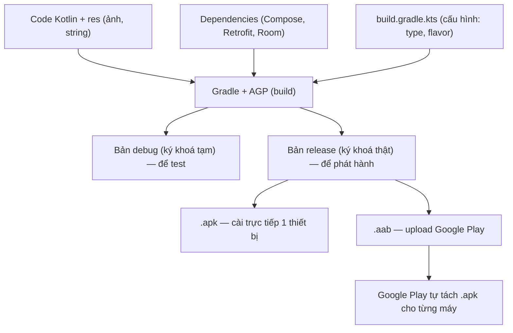

# Android Studio, Build & Play Store — Từ Gradle đến publish

> **Tác giả:** Mr.Rom\
> **Phiên bản:** v1.0.0\
> **Tạo lúc:** 13/06/2026\
> **Cập nhật:** 13/06/2026\
> **Level:** Basic\
> **Tags:** android, kotlin, android-studio, gradle, build, aab, apk, signing, keystore, play-console, mobile\
> **Yêu cầu trước:** [State, Data & Navigation](03_state-data-and-navigation.md)

> 🎯 *Bạn đã viết được màn hình Acme Shop bằng Compose, gọi API bằng Retrofit, lưu local bằng Room. App chạy ngon trên emulator. Nhưng giữa "chạy được trên máy mình" và "có mặt trên Google Play cho cả triệu người tải" là cả một khoảng mà người mới hay sợ: project có hàng tá file `.gradle`, build ra `.apk` hay `.aab` mới đúng, ký app cần keystore là gì, rồi Play Console với đủ loại track internal/closed/open... Bài này đi hết chặng đó: hiểu **cấu trúc project Android Studio**, **Gradle** (build system + dependency + flavor), debug bằng **Logcat**/breakpoint/**Layout Inspector**, dựng bản **release** ký đúng (keystore + **Play App Signing**), và publish lên **Google Play Console**. Cuối bài bạn cầm được file `.aab` đã ký và biết chính xác các bước đẩy nó lên Play.*

## 🎯 Sau bài này bạn sẽ

- [ ] Đọc được **cấu trúc project Android Studio** và vai trò từng file Gradle (`settings.gradle.kts`, `build.gradle.kts` cấp project vs cấp module)
- [ ] Hiểu **Gradle** là gì, khai báo **dependency**, dùng **version catalog** (`libs.versions.toml`), và tạo **build type** + **product flavor**
- [ ] Chạy app trên **emulator** lẫn **thiết bị thật**, và debug bằng **Logcat**, **breakpoint**, **Layout Inspector**
- [ ] Phân biệt **APK vs AAB** và biết vì sao Google Play **bắt buộc** dùng `.aab`
- [ ] Tạo **keystore**, ký bản release, và hiểu **Play App Signing** (upload key vs app signing key)
- [ ] Build bản release bằng `./gradlew assembleRelease` và `./gradlew bundleRelease`, đặt đúng `versionCode`/`versionName`
- [ ] Đẩy app lên **Google Play Console** qua các track internal → closed → open → production

---

## Tình huống — app chạy ngon trên máy mình, giờ sao đưa lên Play?

Bạn vừa hoàn thành phần khó nhất: app Acme Shop đã có màn hình danh sách sản phẩm (Compose), gọi API thật (Retrofit), lưu giỏ hàng offline (Room). Bạn bấm nút ▶️ **Run** trong Android Studio, app bật lên emulator, mọi thứ mượt mà. Cảm giác rất sướng.

Rồi sếp hỏi một câu đơn giản: *"Khi nào lên được Google Play?"*

Và bạn nhận ra mình không biết bắt đầu từ đâu. Cái nút ▶️ Run đó thực ra đã làm rất nhiều việc ngầm mà bạn chưa từng để ý:

- Nó gọi **Gradle** build code Kotlin + tài nguyên thành một file cài đặt.
- File đó là bản **debug** — ký bằng một khoá tạm tự sinh, chỉ chạy được để test, **không** đẩy lên Play được.
- Để lên Play, bạn cần một bản **release**, **ký bằng khoá thật của bạn**, đóng gói dạng **`.aab`** (không phải `.apk`), rồi upload qua **Play Console**.

Mỗi cụm từ in đậm ở trên là một thứ bạn chưa nắm. Bài này gỡ từng cái một, theo đúng thứ tự một app đi từ code trên máy tới ô "Tải xuống" trên điện thoại người dùng.

> [!NOTE]
> Khác với iOS (bắt buộc máy Mac + Xcode), lập trình Android chạy trên **mọi hệ điều hành** — Windows, macOS, Linux đều cài được **Android Studio** (miễn phí, dựa trên IntelliJ IDEA). Mọi lệnh và cấu hình trong bài đúng với Android Studio bản hiện hành, **Kotlin 2.x**, **Android Gradle Plugin (AGP) 8.x**, và **Gradle 8.x**. Bạn không cần điện thoại Android thật để học — emulator kèm sẵn trong Android Studio là đủ.

---

## 1️⃣ Cấu trúc project Android Studio

Khi tạo project mới (`File → New → New Project → Empty Activity`, chọn **Kotlin** + **Jetpack Compose**), Android Studio sinh ra một cây thư mục thoạt nhìn rối. Nhưng nó tuân theo một quy ước rất rõ. Hiểu được cây này là điều kiện để biết "code mình bỏ ở đâu, cấu hình build sửa ở đâu".

🪞 **Ẩn dụ**: một project Android giống một **toà nhà công ty**. `settings.gradle.kts` là **danh sách các phòng ban** (module nào thuộc toà nhà). `build.gradle.kts` cấp project là **quy định chung toàn công ty** (dùng công cụ, version nào). `build.gradle.kts` cấp module (`app/`) là **nội quy riêng của một phòng** (phòng `app` cài thư viện gì, đóng gói ra sao). Còn `gradle/` chứa **bản thân bộ máy hành chính** (Gradle wrapper) để ai đến cũng vận hành được y hệt.

Đây là cây thư mục rút gọn của một project Compose điển hình — phần lớn thời gian bạn làm việc trong `app/src/main/`:

```text
AcmeShop/
├── settings.gradle.kts          # khai báo các module (vd: include ":app")
├── build.gradle.kts             # cấu hình cấp PROJECT (plugin dùng chung)
├── gradle.properties            # cờ cấu hình toàn cục (JVM args, AndroidX...)
├── gradle/
│   ├── libs.versions.toml        # version catalog: khai báo version thư viện tập trung
│   └── wrapper/
│       └── gradle-wrapper.properties   # ghim version Gradle dùng
├── gradlew                       # script chạy Gradle trên macOS/Linux
├── gradlew.bat                   # script chạy Gradle trên Windows
└── app/                          # module ứng dụng chính
    ├── build.gradle.kts          # cấu hình cấp MODULE (dependency, build type...)
    └── src/
        ├── main/
        │   ├── AndroidManifest.xml        # khai báo app: tên, quyền, activity
        │   ├── java/com/acme/shop/        # code Kotlin (Compose, ViewModel...)
        │   └── res/                       # tài nguyên: icon, string, theme
        ├── test/                          # unit test (chạy trên JVM máy tính)
        └── androidTest/                   # instrumented test (chạy trên thiết bị)
```

Có 4 file bạn sẽ động vào nhiều nhất, nên nắm rõ ngay từ đầu vai trò của chúng:

| File | Cấp | Vai trò |
|---|---|---|
| `settings.gradle.kts` | Project | Liệt kê các module (`include(":app")`) và khai báo nơi tải plugin/thư viện |
| `build.gradle.kts` (gốc) | Project | Khai báo các plugin dùng chung cho mọi module — thường chỉ `apply false` |
| `app/build.gradle.kts` | Module | **File bạn sửa nhiều nhất**: dependency, `versionCode`, build type, flavor |
| `gradle/libs.versions.toml` | Project | Version catalog — gom mọi version thư viện về một chỗ |
| `AndroidManifest.xml` | Module | "Giấy khai sinh" của app: package, quyền (permission), activity khởi động |

> [!TIP]
> Android Studio mặc định hiển thị cây thư mục ở chế độ **Android view** (gom nhóm theo logic) thay vì **Project view** (đúng như trên ổ đĩa). Khi mới học hay bị rối "sao không thấy file giống bài hướng dẫn", hãy đổi dropdown trên cùng panel bên trái từ **Android** sang **Project** để thấy cây thư mục thật như cây ASCII ở trên.

→ Đã biết file nào ở đâu. Câu hỏi tiếp theo: cái "Gradle" được nhắc tới khắp nơi đó thực ra là gì, và vì sao Android lại cần nó?

---

## 2️⃣ Gradle — bộ máy build của Android

### Vì sao cần một build system?

App Android không phải chỉ là code Kotlin. Một bản build hoàn chỉnh phải: biên dịch Kotlin → bytecode, gộp hàng chục thư viện ngoài (Compose, Retrofit, Room...), nén tài nguyên (ảnh, string, layout), sinh code từ annotation (Room, Hilt), ký file, rồi đóng gói tất cả thành một file cài được. Làm tay thì bất khả thi. **Gradle** là công cụ tự động hoá toàn bộ chuỗi việc đó.

🪞 **Ẩn dụ**: Gradle giống **một dây chuyền lắp ráp trong nhà máy**. Bạn không tự tay lắp từng con ốc — bạn viết một **bản hướng dẫn** (`build.gradle.kts`) nói "cần linh kiện A, B, C, ráp theo cấu hình X", rồi bấm nút cho dây chuyền chạy. Lần sau cần ráp lại y hệt, chỉ cần bấm nút — không sợ quên bước.

**Vậy Gradle là gì?** Về kỹ thuật, đây là một **build automation tool** (công cụ tự động hoá build) đa nền tảng. Android dùng nó kèm **Android Gradle Plugin (AGP)** — phần mở rộng riêng cho Android. Bạn mô tả cấu hình build bằng file `.gradle.kts` (viết bằng **Kotlin DSL** — một dạng cú pháp Kotlin chuyên để cấu hình), Gradle đọc và thực thi.

> [!IMPORTANT]
> Luôn chạy Gradle qua **wrapper** (`./gradlew`) chứ không phải `gradle` cài sẵn trên máy. Wrapper ghim đúng version Gradle mà project cần (khai báo trong `gradle-wrapper.properties`), nên build trên máy bạn, máy đồng nghiệp, hay server CI đều **giống hệt nhau** — không còn cảnh "máy tôi build được mà máy bạn lỗi".

### Khai báo dependency và version catalog

Phần bạn sửa nhiều nhất trong `app/build.gradle.kts` là khối `dependencies` — nơi khai báo thư viện ngoài. Cách hiện hành (bản mới của Android Studio sinh ra mặc định) là dùng **version catalog**: gom mọi version về file `gradle/libs.versions.toml`, rồi tham chiếu bằng tên `libs.xxx`. Lợi ích là khi nâng version chỉ sửa một chỗ.

Trước hết, file `libs.versions.toml` khai báo phiên bản và "alias" cho từng thư viện:

```toml
# gradle/libs.versions.toml

[versions]
kotlin = "2.0.21"
agp = "8.7.2"
composeBom = "2024.10.01"
retrofit = "2.11.0"
room = "2.6.1"

[libraries]
# Compose dùng BOM — không cần ghi version cho từng artifact Compose
androidx-compose-bom = { group = "androidx.compose", name = "compose-bom", version.ref = "composeBom" }
androidx-compose-material3 = { group = "androidx.compose.material3", name = "material3" }
retrofit = { group = "com.squareup.retrofit2", name = "retrofit", version.ref = "retrofit" }
room-runtime = { group = "androidx.room", name = "room-runtime", version.ref = "room" }

[plugins]
android-application = { id = "com.android.application", version.ref = "agp" }
kotlin-android = { id = "org.jetbrains.kotlin.android", version.ref = "kotlin" }
```

Sau đó trong `app/build.gradle.kts` bạn chỉ việc tham chiếu tên alias — gọn và không lặp version:

```kotlin
// app/build.gradle.kts (trích phần dependencies)
dependencies {
    // platform() = áp BOM, từ đó các artifact Compose tự khớp version
    implementation(platform(libs.androidx.compose.bom))
    implementation(libs.androidx.compose.material3)
    implementation(libs.retrofit)
    implementation(libs.room.runtime)
}
```

Hai cấu hình dependency hay gặp nhất, nên phân biệt rõ:

- `implementation(...)` — thư viện dùng **bên trong** module này. Module khác phụ thuộc vào bạn sẽ **không** thấy nó (đóng gói gọn, build nhanh hơn). Đây là lựa chọn mặc định.
- `api(...)` — thư viện được "xuất khẩu" cho module phụ thuộc cũng thấy. Chỉ dùng khi bạn cố ý cho module khác xài chung — hiếm với app thường.

### Build type và product flavor

Đây là sức mạnh thực dụng nhất của Gradle với Android: từ **một** codebase, sinh ra **nhiều** phiên bản app khác nhau mà không phải copy code.

- **Build type** — phân biệt theo *mục đích build*. Mặc định có 2: `debug` (để phát triển — bật log, ký khoá tạm) và `release` (để phát hành — tối ưu, ký khoá thật).
- **Product flavor** — phân biệt theo *biến thể sản phẩm*. Ví dụ Acme Shop muốn 2 bản: `free` (miễn phí, có quảng cáo) và `paid` (trả phí, gỡ quảng cáo), hoặc bản trỏ server `staging` vs `production`.

Gradle nhân hai trục này thành **build variant** = `flavor` × `buildType`. Ví dụ `freeDebug`, `paidRelease`. Đây là đoạn cấu hình điển hình trong `app/build.gradle.kts`:

```kotlin
// app/build.gradle.kts (trích phần android { })
android {
    namespace = "com.acme.shop"
    compileSdk = 35

    defaultConfig {
        applicationId = "com.acme.shop"
        minSdk = 24            // hỗ trợ từ Android 7.0 trở lên
        targetSdk = 35
        versionCode = 1        // số nguyên tăng dần — Play dùng để so sánh "bản nào mới"
        versionName = "1.0.0"  // chuỗi hiển thị cho người dùng
    }

    buildTypes {
        getByName("debug") {
            applicationIdSuffix = ".debug"   // cho phép cài song song với bản release
            isDebuggable = true
        }
        getByName("release") {
            isMinifyEnabled = true           // bật R8 rút gọn + tối ưu code
            proguardFiles(
                getDefaultProguardFile("proguard-android-optimize.txt"),
                "proguard-rules.pro"
            )
        }
    }

    // Hai biến thể sản phẩm: free vs paid
    flavorDimensions += "tier"
    productFlavors {
        create("free") {
            dimension = "tier"
            applicationIdSuffix = ".free"
            versionNameSuffix = "-free"
        }
        create("paid") {
            dimension = "tier"
            applicationIdSuffix = ".paid"
        }
    }
}
```

Với cấu hình trên, Gradle tạo ra 4 variant: `freeDebug`, `freeRelease`, `paidDebug`, `paidRelease`. Trong Android Studio có panel **Build Variants** (góc dưới trái) để chọn nhanh variant nào sẽ chạy khi bấm Run.

> 💡 Hiểu Gradle build ra cái gì rồi, ta nhìn tổng thể cả luồng từ code tới file cài qua sơ đồ bên dưới — để thấy "nút Run" thực ra đi qua những chặng nào.



→ Điểm cốt lõi từ sơ đồ: cùng một code, Gradle rẽ thành nhiều đầu ra tuỳ cấu hình. Bản test thì ký khoá tạm và đóng `.apk`; bản phát hành thì ký khoá thật và đóng `.aab`. Giờ ta thử chạy app thật để thấy quy trình debug hằng ngày.

---

## 3️⃣ Chạy và debug — emulator, thiết bị thật, Logcat, Layout Inspector

### Emulator vs thiết bị thật

Để chạy app, bạn cần một "máy đích". Có hai lựa chọn, mỗi cái hợp một việc:

- **Emulator** (giả lập) — tạo qua **Device Manager** trong Android Studio (chọn model + version Android). Tiện vì không cần phần cứng, đổi model/độ phân giải dễ. Hợp để dev hằng ngày.
- **Thiết bị thật** — cắm điện thoại qua USB. Cần bật **Developer options** (vào `Settings → About phone`, bấm **Build number** 7 lần), rồi bật **USB debugging**. Hợp để kiểm tra hiệu năng thật, camera, cảm biến — những thứ emulator mô phỏng không chuẩn.

Cả hai đều giao tiếp với máy tính qua **adb** (Android Debug Bridge) — công cụ dòng lệnh kèm Android Studio. Bạn có thể liệt kê thiết bị đang kết nối:

```bash
adb devices
```

Kết quả mong đợi (một emulator đang chạy + một điện thoại cắm USB):

```text
List of devices attached
emulator-5554   device
R5CT30XXXXX     device
```

Cột thứ hai cho biết trạng thái. `device` nghĩa là sẵn sàng nhận lệnh. Nếu thấy `unauthorized` tức là điện thoại thật chưa xác nhận pop-up "Cho phép gỡ lỗi USB?" — mở khoá máy và bấm **Allow**. Nếu thấy `offline` thì rút cắm lại cáp USB.

### Logcat — cửa sổ nhìn vào app đang chạy

Khi app chạy, cách đầu tiên để biết "bên trong đang xảy ra gì" là **Logcat** — luồng log thời gian thực từ thiết bị. Trong code Kotlin bạn ghi log bằng lớp `Log`:

```kotlin
import android.util.Log

class CartViewModel : ViewModel() {
    fun themVaoGio(sanPhamId: String) {
        // Ghi log mức DEBUG — TAG để lọc nhanh trong Logcat
        Log.d("AcmeCart", "Thêm sản phẩm vào giỏ: id=$sanPhamId")
        // ... xử lý nghiệp vụ ...
    }
}
```

Trong panel **Logcat** (góc dưới Android Studio), dòng log trên hiện ra dạng:

```text
2026-06-13 09:12:44.501  D  AcmeCart  Thêm sản phẩm vào giỏ: id=SP001
```

Cột thứ ba là **mức log** (`D` = Debug). Android có 5 mức theo độ nghiêm trọng tăng dần: `V` (Verbose) < `D` (Debug) < `I` (Info) < `W` (Warn) < `E` (Error). Cột `AcmeCart` là **TAG** bạn đặt — gõ `tag:AcmeCart` vào ô lọc của Logcat để chỉ thấy log của mình giữa hàng nghìn dòng hệ thống. Khi app **crash**, Logcat in một khối đỏ bắt đầu bằng `FATAL EXCEPTION` kèm stack trace — đây là chỗ đầu tiên cần nhìn khi app văng.

### Breakpoint — dừng app để soi từng dòng

Log hợp để theo dõi luồng, nhưng khi cần *dừng hẳn* app tại một dòng và xem giá trị mọi biến lúc đó, ta dùng **breakpoint** (điểm dừng). Bấm vào lề trái cạnh số dòng để đặt một chấm đỏ, rồi chạy app ở chế độ **Debug** (nút 🐞 thay vì ▶️). Khi luồng chạy tới dòng đó, app đứng lại, và panel **Debugger** hiện toàn bộ biến hiện hành cùng các nút bước qua từng dòng (Step Over / Step Into). Đây là cách mạnh hơn `Log` nhiều khi bug khó.

### Layout Inspector — soi cây UI Compose

Với giao diện, đôi khi app không crash nhưng *hiển thị sai* — một thành phần lệch, một padding thừa. **Layout Inspector** (mở qua `View → Tool Windows → Layout Inspector` khi app đang chạy) chụp lại **cây UI thật** trên thiết bị: bạn click vào từng node để xem nó là composable nào, kích thước, padding, vì sao nằm ở đó. Với Compose, nó còn cho biết **recomposition count** — số lần một composable bị vẽ lại — cực hữu ích để bắt lỗi UI vẽ lại quá nhiều gây giật.

| Công cụ | Dùng khi | Câu hỏi nó trả lời |
|---|---|---|
| **Logcat** | Theo dõi luồng, đọc crash | "App đang làm gì? Crash ở đâu?" |
| **Breakpoint** | Bug logic khó, cần soi biến | "Tại dòng này, biến X đang bằng bao nhiêu?" |
| **Layout Inspector** | UI hiển thị sai | "Composable này nằm ở đâu, kích thước bao nhiêu?" |

→ Debug xong, app đã đúng. Giờ tới phần khác hẳn: đóng gói app để phát hành. Và câu hỏi đầu tiên là — đóng ra `.apk` hay `.aab`?

---

## 4️⃣ APK vs AAB — và vì sao Play bắt buộc dùng AAB

Khi bấm Run, Android Studio tạo ra một file **`.apk`** (Android Package) — định dạng cài đặt kinh điển của Android từ ngày đầu. Một `.apk` chứa **mọi thứ cho mọi loại máy**: code cho mọi kiến trúc CPU (`arm64`, `armeabi`, `x86`...), ảnh cho mọi mật độ màn hình (`hdpi`, `xhdpi`, `xxhdpi`...), mọi ngôn ngữ. Hệ quả: một máy chỉ cần ảnh `xxhdpi` tiếng Việt vẫn phải tải về phần ảnh `hdpi` và toàn bộ ngôn ngữ khác — **lãng phí dung lượng**.

Để giải bài toán đó, Google ra **`.aab`** (Android App Bundle): thay vì một file cài hoàn chỉnh, `.aab` là một **gói chứa toàn bộ phần code + tài nguyên ở dạng module hoá**, bạn upload lên Play, rồi **Google Play tự sinh ra `.apk` tối ưu riêng cho từng máy** lúc người dùng tải (cơ chế gọi là Dynamic Delivery). Máy Pixel `arm64` màn `xxhdpi` chỉ nhận đúng phần nó cần — app nhẹ hơn đáng kể.

🪞 **Ẩn dụ**: `.apk` giống một **vali đóng sẵn đủ đồ cho mọi mùa** — bạn mang cả áo lạnh lẫn đồ bơi dù chuyến đi chỉ cần một loại. `.aab` giống **gửi cả tủ quần áo cho một người trợ lý** (Google Play): họ nhìn điểm đến của bạn rồi *chỉ xếp đúng đồ cần thiết* vào vali — vali nhẹ hơn hẳn.

Bảng dưới chốt lại sự khác nhau và khi nào dùng cái nào:

| Tiêu chí | `.apk` | `.aab` (App Bundle) |
|---|---|---|
| Bản chất | File cài hoàn chỉnh, cài trực tiếp được | Gói build, **không** cài trực tiếp |
| Kích thước tới máy người dùng | To (chứa cho mọi máy) | Nhỏ (Play tách đúng phần cần) |
| Cài trực tiếp (sideload, test nhanh) | ✅ Được | ❌ Không (cần công cụ tách trước) |
| Upload lên Google Play | ❌ Không còn nhận (từ 8/2021) | ✅ **Bắt buộc** |
| Khi nào dùng | Test trên máy, phân phối ngoài Play | **Mọi app phát hành qua Google Play** |

> [!IMPORTANT]
> Từ tháng 8/2021, **mọi app mới phát hành trên Google Play bắt buộc dùng định dạng `.aab`** — Play không còn nhận `.apk` để publish. Bạn vẫn build `.apk` để cài thử nhanh lên một máy, nhưng để đẩy lên Play thì luôn là `.aab`. Đây là khác biệt lớn so với thói quen "gửi file APK" của thời trước.

→ Đã rõ phải nộp `.aab`. Nhưng dù `.apk` hay `.aab`, bản phát hành đều phải được **ký số** — nếu không Play từ chối. Đây là phần người mới hay vướng nhất.

---

## 5️⃣ Signing — keystore, upload key và Play App Signing

### Vì sao app phải được ký?

Android không cho cài bất kỳ app nào **chưa được ký số** (digital signature). Chữ ký này chứng minh hai điều: (1) app đến từ đúng tác giả, và (2) bản cập nhật mới đúng là từ chính tác giả của bản cũ — Android chỉ cho cập nhật đè khi **chữ ký khớp**. Đây là cơ chế chống kẻ xấu phát tán bản giả mạo đè lên app của bạn.

Bản **debug** được Android Studio ký tự động bằng một khoá tạm (`debug.keystore`) — tiện cho test, nhưng tuyệt đối không dùng để phát hành. Bản **release** phải ký bằng **khoá riêng của bạn**, lưu trong một **keystore** (kho khoá).

🪞 **Ẩn dụ**: keystore giống **con dấu khắc riêng của công ty bạn**. Mỗi bản phát hành đóng con dấu này lên để chứng minh "đúng hàng của Acme Shop". Nếu **mất con dấu** (mất keystore), bạn không thể đóng dấu bản cập nhật mới khớp với bản cũ — coi như mất quyền cập nhật app đó vĩnh viễn. Vì thế keystore phải giữ như giữ vàng.

### Tạo keystore

Bạn tạo keystore bằng công cụ `keytool` (kèm sẵn trong JDK mà Android Studio cài). Lệnh dưới sinh một keystore tên `acme-upload.jks` chứa một khoá hiệu lực ~27 năm (10000 ngày):

```bash
keytool -genkeypair -v \
  -keystore acme-upload.jks \
  -alias acme-upload \
  -keyalg RSA \
  -keysize 2048 \
  -validity 10000
```

Lệnh sẽ hỏi mật khẩu keystore và vài thông tin danh tính (tên, tổ chức). Kết quả sinh file:

```text
Generating 2,048 bit RSA key pair and self-signed certificate (SHA256withRSA) with a validity of 10,000 days
        for: CN=Acme Shop, OU=Mobile, O=Acme, L=Hanoi, ST=Hanoi, C=VN
[Storing acme-upload.jks]
```

Dòng `[Storing acme-upload.jks]` xác nhận file keystore đã được tạo trong thư mục hiện hành. Hãy cất file này ra ngoài project và **không bao giờ commit lên git**.

> [!CAUTION]
> Mất keystore (hoặc lộ mật khẩu) là sự cố nghiêm trọng. Mất keystore mà **không** dùng Play App Signing thì bạn vĩnh viễn không cập nhật được app — phải đăng app mới từ đầu, mất hết người dùng cũ. Lộ keystore thì kẻ xấu ký được bản giả mạo. Lưu keystore ở nơi an toàn (password manager, vault), sao lưu nhiều bản, và **thêm `*.jks` cùng file chứa mật khẩu vào `.gitignore`**.

### Khai báo signing trong Gradle

Để Gradle tự ký bản release, khai báo `signingConfigs` trong `app/build.gradle.kts`. Mật khẩu thật **không** viết thẳng vào file này — đọc từ biến môi trường hoặc file `local.properties` không commit:

```kotlin
// app/build.gradle.kts (trích) — đọc mật khẩu từ biến môi trường
android {
    signingConfigs {
        create("release") {
            storeFile = file(System.getenv("ACME_KEYSTORE_PATH") ?: "acme-upload.jks")
            storePassword = System.getenv("ACME_KEYSTORE_PASSWORD")
            keyAlias = "acme-upload"
            keyPassword = System.getenv("ACME_KEY_PASSWORD")
        }
    }

    buildTypes {
        getByName("release") {
            signingConfig = signingConfigs.getByName("release")
            isMinifyEnabled = true
        }
    }
}
```

### Play App Signing — upload key vs app signing key

Đây là cơ chế quan trọng nhất phải hiểu, vì nó thay đổi cách bạn nghĩ về keystore. Khi bật **Play App Signing** (mặc định bật cho app mới), có **hai** khoá khác nhau:

- **App signing key** (khoá ký ứng dụng) — khoá *thật* mà người dùng cuối nhìn thấy. **Google giữ và bảo quản** khoá này trong hạ tầng của họ. Đây là khoá ký các `.apk` cuối cùng gửi tới máy người dùng.
- **Upload key** (khoá tải lên) — khoá *của bạn* (chính là keystore bạn vừa tạo). Bạn chỉ dùng nó để ký bản `.aab` khi **upload lên Play**. Play xác minh upload key, gỡ chữ ký đó ra, rồi ký lại bằng app signing key của Google.

🪞 **Ẩn dụ**: hình dung Play như **một nhà in tem bảo hành chính hãng**. **App signing key** là khuôn dập tem chính hãng — nhà in (Google) giữ, không đưa ai. **Upload key** là thẻ ra vào của bạn để nộp bản thảo cho nhà in. Bạn chỉ cần thẻ ra vào (upload key); việc dập tem chính hãng (app signing key) do nhà in lo. Nếu bạn **mất thẻ ra vào** (mất upload key), bạn xin Google **cấp thẻ mới** — app vẫn cập nhật bình thường vì khuôn dập tem chính hãng không đổi.

Lợi ích lớn nhất: nếu bạn **mất upload key**, bạn liên hệ Google để **reset upload key mới** mà người dùng không bị ảnh hưởng — vì app signing key (thứ quyết định danh tính app) vẫn nằm an toàn ở Google. Đây là lý do Play App Signing được khuyến nghị bật cho mọi app.

| Khái niệm | Ai giữ | Dùng để | Mất thì sao |
|---|---|---|---|
| **Upload key** | Bạn (keystore của bạn) | Ký `.aab` lúc upload lên Play | Xin Google reset key mới — app vẫn cập nhật được |
| **App signing key** | Google (Play App Signing) | Ký `.apk` cuối gửi tới máy người dùng | Không xảy ra với bạn — Google bảo quản |

→ Khoá đã sẵn sàng, Gradle đã biết cách ký. Giờ là lúc gõ lệnh build ra file thật để nộp lên Play.

---

## 6️⃣ Build bản release bằng lệnh

Bạn có thể build qua menu (`Build → Generate Signed Bundle / APK`), nhưng dùng dòng lệnh nhanh hơn và là cách CI/CD chạy. Hai task Gradle quan trọng nhất:

- `assembleRelease` — build ra **`.apk`** release (để test trên máy hoặc phân phối ngoài Play).
- `bundleRelease` — build ra **`.aab`** release (để upload lên Google Play).

Trước khi chạy, một thói quen tốt là dọn sạch output cũ. Đây là chuỗi lệnh trên macOS/Linux (Windows thay `./gradlew` bằng `gradlew.bat`):

```bash
# 1. Dọn sạch thư mục build cũ
./gradlew clean

# 2. Build file .apk release (dùng để cài thử nhanh)
./gradlew assembleRelease

# 3. Build file .aab release (dùng để upload lên Play)
./gradlew bundleRelease
```

Kết quả khi `bundleRelease` chạy xong:

```text
> Task :app:bundleRelease

BUILD SUCCESSFUL in 1m 12s
47 actionable tasks: 47 executed
```

Dòng `BUILD SUCCESSFUL` xác nhận build xong. Nếu thấy `BUILD FAILED`, Gradle in ngay phía trên đó dòng lỗi cụ thể (thường là thiếu dependency, sai cú pháp, hoặc signing config sai mật khẩu) — đọc từ dưới lên là thấy nguyên nhân gốc.

File output nằm trong thư mục `app/build/outputs/`. Bạn kiểm tra bằng:

```bash
# Liệt kê các file build vừa tạo
ls app/build/outputs/bundle/release/
ls app/build/outputs/apk/release/
```

Kết quả:

```text
app-release.aab

app-release.apk
```

File `app-release.aab` chính là thứ bạn sẽ upload lên Play Console ở mục sau.

### versionCode và versionName

Mỗi bản build mang hai con số version khai báo trong `defaultConfig` (đã thấy ở mục 2), và việc hiểu đúng chúng là cực kỳ quan trọng khi cập nhật app:

- **`versionCode`** — một **số nguyên** (1, 2, 3...). Đây là thứ **Google Play dùng để so sánh** bản nào mới hơn. Mỗi lần upload bản mới lên Play, `versionCode` **bắt buộc phải lớn hơn** bản trước, nếu không Play từ chối. Người dùng không nhìn thấy số này.
- **`versionName`** — một **chuỗi** hiển thị cho người dùng (vd `"1.0.0"`, `"2.3.1"`). Đây là số version "marketing" hiện trong trang Play và phần Cài đặt → Ứng dụng. Play **không** dùng nó để so sánh.

```kotlin
defaultConfig {
    versionCode = 2          // ← tăng từ 1 lên 2 cho mỗi lần upload lên Play
    versionName = "1.0.1"    // ← chuỗi người dùng thấy, đặt tuỳ quy ước (vd SemVer)
}
```

> [!WARNING]
> Lỗi kinh điển khi tung bản cập nhật: quên tăng `versionCode`. Play sẽ báo *"Version code N has already been used"* và từ chối nhận. Quy tắc đơn giản: **mỗi lần upload là tăng `versionCode` thêm 1** (hoặc tự sinh từ CI), độc lập với việc `versionName` có đổi hay không.

→ Đã có file `.aab` đã ký trong tay. Bước cuối: đẩy nó lên Google Play Console.

---

## 7️⃣ Google Play Console — publish và các track

**Google Play Console** là trang web (`play.google.com/console`) để quản lý app trên Play: đăng app, upload bản build, viết mô tả, theo dõi lượt cài, doanh thu. Để dùng, bạn cần một **tài khoản Google Play Developer** (đăng ký một lần, có phí một lần ~$25).

Quy trình lần đầu rất nhiều bước khai báo (tên app, mô tả, ảnh chụp màn hình, phân loại nội dung, chính sách quyền riêng tư), nhưng phần cốt lõi với một developer là **upload `.aab` vào một track và phát hành**.

### Các track phát hành

Play không bắt bạn tung thẳng app cho cả thế giới. Nó có **4 track** theo độ rộng người nhận tăng dần — bạn đẩy app qua từng track để test trước khi lên production:

| Track | Ai nhận được | Dùng khi |
|---|---|---|
| **Internal testing** | Tối đa ~100 tester bạn liệt kê email | Test nhanh nội bộ, bản build mới sẵn sàng gần như tức thì |
| **Closed testing** | Nhóm tester kín (theo email/group) | Beta nội bộ rộng hơn, nhiều nhóm |
| **Open testing** | Bất kỳ ai có link, công khai (beta) | Beta công khai trước khi ra mắt chính thức |
| **Production** | Mọi người dùng trên Google Play | Phát hành chính thức |

🪞 **Ẩn dụ**: 4 track giống **các vòng chiếu phim trước khi ra rạp đại trà**. Internal là buổi chiếu cho ê-kíp làm phim. Closed là chiếu cho một nhóm khách mời. Open là suất chiếu sớm bán vé công khai. Production là ngày phim ra rạp toàn quốc. Lỗi phát hiện ở vòng nhỏ thì sửa rẻ; lỗi lọt tới rạp đại trà thì đắt.

### Luồng publish điển hình

Sau khi đã khai báo xong thông tin app, mỗi lần tung một bản build mới đi qua các bước:

1. Vào Play Console → chọn app → mục **Testing → Internal testing** (hoặc track muốn dùng).
2. Bấm **Create new release** → upload file `app-release.aab`.
3. Điền **Release notes** (ghi chú thay đổi bản này).
4. Bấm **Review release** → Play kiểm tra tự động (xác minh signing, quyền, kích thước).
5. Bấm **Start rollout** → bản build được phát hành tới track đó.

Một điểm thực dụng để biết: **review của Google Play thường nhanh hơn Apple App Store rõ rệt**. Bản đầu tiên (app mới) có thể mất một khoảng để Google duyệt thủ công; các bản cập nhật sau, nhất là trên track internal testing, thường khả dụng gần như ngay hoặc rất nhanh. Đây là khác biệt đáng kể so với quy trình review của Apple vốn kỹ và chậm hơn.

> [!TIP]
> Khi mới bắt đầu, hãy luôn đẩy bản build vào **Internal testing** trước. Bạn (và vài tester) cài thử qua link nội bộ, xác nhận app chạy đúng trên máy thật, *rồi* mới promote lên các track rộng hơn. Play cho phép **promote** thẳng một bản từ track này lên track cao hơn mà không cần build lại — rất tiện.

→ Tới đây bạn đã đi trọn vòng đời một app Android: từ code trên máy, qua Gradle build và debug, ký bằng keystore, đóng gói `.aab`, lên Play Console qua các track. Cùng điểm lại các cạm bẫy hay gặp.

---

## 💡 Cạm bẫy thường gặp & Best practice

### ❌ Cạm bẫy: Commit keystore hoặc mật khẩu lên git

- **Triệu chứng**: File `.jks` hoặc mật khẩu signing lọt vào lịch sử git, đặc biệt nguy hiểm nếu repo là public — bất kỳ ai cũng tải được khoá ký app của bạn.
- **Nguyên nhân**: Để keystore trong thư mục project và quên thêm vào `.gitignore`; hoặc viết thẳng `storePassword = "matkhau123"` vào `build.gradle.kts` đã commit.
- **Cách tránh**: Để keystore **ngoài** thư mục project. Thêm `*.jks`, `*.keystore`, và file chứa mật khẩu (`keystore.properties`) vào `.gitignore`. Đọc mật khẩu từ biến môi trường hoặc file không commit. Bật **Play App Signing** để nếu lỡ lộ upload key vẫn reset được.

### ❌ Cạm bẫy: Cố upload `.apk` lên Play hoặc quên tăng versionCode

- **Triệu chứng**: Play báo lỗi không nhận file `.apk`, hoặc báo *"Version code N has already been used"* và từ chối bản cập nhật.
- **Nguyên nhân**: Build nhầm `assembleRelease` (ra `.apk`) thay vì `bundleRelease` (ra `.aab`); hoặc quên tăng `versionCode` so với bản trước.
- **Cách tránh**: Upload lên Play luôn dùng file `.aab` từ `./gradlew bundleRelease`. Mỗi lần tung bản mới, **tăng `versionCode` thêm 1** — đây là số nguyên Play dùng so sánh, không liên quan tới `versionName`.

### ✅ Best practice: Tách signing config khỏi code, dùng version catalog

- **Vì sao**: Mật khẩu signing trong code là rủi ro bảo mật; version thư viện rải rác nhiều file khiến nâng cấp dễ lệch version gây xung đột.
- **Cách áp dụng**: Đọc mật khẩu signing từ biến môi trường / `local.properties` (không commit). Gom mọi version thư viện vào `gradle/libs.versions.toml` (version catalog) và tham chiếu `libs.xxx` — nâng version chỉ sửa một chỗ, mọi module khớp nhau.

### ✅ Best practice: Luôn test qua track Internal trước khi lên Production

- **Vì sao**: Bản build trên máy dev ký khoá tạm, hành xử có thể khác bản release ký khoá thật + bật minify (R8). Lỗi do tối ưu/proguard chỉ lộ ở bản release thật.
- **Cách áp dụng**: Build `.aab` release → upload **Internal testing** → cài lên máy thật qua link tester → xác nhận chạy đúng → *rồi* mới **promote** lên track rộng hơn. Tận dụng việc Play promote thẳng không cần build lại.

---

## 🧠 Tự kiểm tra (Self-check)

**Q1.** File `build.gradle.kts` cấp project và cấp module (`app/`) khác nhau ở đâu? Bạn sửa dependency thư viện ở file nào?

<details>
<summary>💡 Đáp án</summary>

`build.gradle.kts` **cấp project** (ở thư mục gốc) khai báo các plugin dùng chung cho mọi module — thường chỉ `apply false`, ít khi sửa. `build.gradle.kts` **cấp module** (`app/build.gradle.kts`) là nơi cấu hình thật của app: khối `android { }` (versionCode, build type, flavor) và khối `dependencies { }`.

Sửa dependency thư viện ở file **cấp module** (`app/build.gradle.kts`), trong khối `dependencies`.

</details>

**Q2.** Vì sao Google Play bắt buộc dùng `.aab` thay vì `.apk`? Bạn còn dùng `.apk` để làm gì?

<details>
<summary>💡 Đáp án</summary>

`.apk` chứa code + tài nguyên cho **mọi** loại máy (mọi kiến trúc CPU, mọi mật độ màn hình, mọi ngôn ngữ) nên nặng. `.aab` là gói module hoá: upload lên Play, rồi **Play tự tách ra `.apk` tối ưu riêng cho từng máy** lúc người dùng tải — app nhẹ hơn nhiều. Từ 8/2021 Play chỉ nhận `.aab` để publish.

Vẫn dùng `.apk` để **cài thử nhanh trực tiếp lên một thiết bị** (sideload) hoặc phân phối ngoài Play.

</details>

**Q3.** Phân biệt **upload key** và **app signing key** trong Play App Signing. Nếu mất upload key thì sao?

<details>
<summary>💡 Đáp án</summary>

**Upload key** là khoá *của bạn* (keystore bạn tạo), chỉ dùng để ký `.aab` khi upload lên Play. **App signing key** là khoá *thật* ký các `.apk` cuối gửi tới người dùng — **Google giữ** trong Play App Signing.

Nếu **mất upload key**, bạn liên hệ Google để **reset upload key mới** — người dùng không bị ảnh hưởng, app vẫn cập nhật được, vì app signing key (quyết định danh tính app) vẫn nằm an toàn ở Google. Đây là lợi ích chính của Play App Signing.

</details>

**Q4.** `versionCode` và `versionName` khác nhau thế nào? Cái nào bắt buộc tăng mỗi lần upload?

<details>
<summary>💡 Đáp án</summary>

`versionCode` là **số nguyên** Google Play dùng để so sánh bản nào mới hơn — người dùng không thấy. `versionName` là **chuỗi** hiển thị cho người dùng (vd `"1.0.1"`) — Play không dùng để so sánh.

**`versionCode` bắt buộc tăng** (lớn hơn bản trước) mỗi lần upload, nếu không Play từ chối với lỗi "Version code has already been used". `versionName` đổi hay không tuỳ quy ước, không bắt buộc.

</details>

**Q5.** Bạn sẽ dùng công cụ nào trong 3 trường hợp: (a) app crash khi bấm nút, (b) một thẻ sản phẩm bị lệch padding, (c) cần biết giá trị một biến tại đúng một dòng code?

<details>
<summary>💡 Đáp án</summary>

(a) App crash → **Logcat**: tìm khối đỏ `FATAL EXCEPTION` kèm stack trace để biết crash ở đâu.

(b) UI lệch padding → **Layout Inspector**: soi cây UI thật, click vào node để xem kích thước/padding của composable.

(c) Soi biến tại một dòng → **Breakpoint**: đặt điểm dừng ở dòng đó, chạy chế độ Debug (🐞), xem panel Debugger.

</details>

**Q6.** Liệt kê 4 track của Play Console theo thứ tự độ rộng người nhận tăng dần. Vì sao nên đẩy qua track nhỏ trước?

<details>
<summary>💡 Đáp án</summary>

Theo thứ tự: **Internal testing** (tối đa ~100 tester) → **Closed testing** (nhóm kín) → **Open testing** (beta công khai) → **Production** (mọi người dùng).

Nên đẩy qua track nhỏ trước vì bản release thật (ký khoá thật + bật minify R8) có thể hành xử khác bản debug; test ở track nhỏ giúp bắt lỗi sớm với chi phí thấp trước khi tung cho toàn bộ người dùng. Play cho **promote** thẳng từ track thấp lên cao mà không cần build lại.

</details>

---

## ⚡ Tra cứu nhanh (Cheatsheet)

| Mục đích | Lệnh / Cú pháp |
|---|---|
| Liệt kê thiết bị/emulator đang kết nối | `adb devices` |
| Dọn sạch build cũ | `./gradlew clean` |
| Build `.apk` release | `./gradlew assembleRelease` |
| Build `.aab` release (upload Play) | `./gradlew bundleRelease` |
| Cài `.apk` lên thiết bị qua dòng lệnh | `adb install app-release.apk` |
| Xem log app theo TAG | Logcat → lọc `tag:AcmeCart` |
| Tạo keystore | `keytool -genkeypair -keystore acme-upload.jks -alias acme-upload -keyalg RSA -keysize 2048 -validity 10000` |
| Đầu ra `.aab` | `app/build/outputs/bundle/release/app-release.aab` |
| Đầu ra `.apk` | `app/build/outputs/apk/release/app-release.apk` |
| Khai báo dependency (module) | `implementation(libs.retrofit)` trong `app/build.gradle.kts` |
| Số version so sánh trên Play | `versionCode = 2` |
| Chuỗi version hiển thị | `versionName = "1.0.1"` |
| Build trên Windows | `gradlew.bat bundleRelease` |

---

## 📚 Từ Điển Thuật Ngữ (Glossary)

| EN | VN | Giải thích |
|---|---|---|
| Android Studio | Android Studio | IDE chính thức làm app Android, dựa trên IntelliJ IDEA; chạy mọi OS |
| Gradle | Gradle | Công cụ tự động hoá build; Android dùng kèm Android Gradle Plugin |
| AGP (Android Gradle Plugin) | Plugin Gradle cho Android | Phần mở rộng Gradle biết cách build app Android |
| Gradle wrapper (`./gradlew`) | Bộ bọc Gradle | Script ghim đúng version Gradle để build giống nhau ở mọi máy |
| Kotlin DSL | Kotlin DSL | Cú pháp Kotlin dùng viết file cấu hình `.gradle.kts` |
| Dependency | Phụ thuộc | Thư viện ngoài app dùng tới (Compose, Retrofit...) |
| Version catalog | Danh mục version | File `libs.versions.toml` gom mọi version thư viện về một chỗ |
| Build type | Loại build | Phân biệt theo mục đích: `debug` (phát triển) vs `release` (phát hành) |
| Product flavor | Biến thể sản phẩm | Phân biệt theo bản: `free`/`paid`, `staging`/`production`... |
| Build variant | Biến thể build | Tổ hợp flavor × buildType (vd `freeRelease`) |
| Emulator | Máy ảo Android | Giả lập điện thoại Android ngay trên máy tính |
| adb | Cầu gỡ lỗi Android | Công cụ dòng lệnh giao tiếp với thiết bị/emulator |
| Logcat | Logcat | Luồng log thời gian thực từ thiết bị, dùng để debug |
| Breakpoint | Điểm dừng | Dừng app tại một dòng để soi giá trị biến |
| Layout Inspector | Trình soi giao diện | Soi cây UI thật đang chạy, kích thước, recomposition |
| APK | APK | File cài Android hoàn chỉnh cho mọi loại máy |
| AAB (App Bundle) | Gói ứng dụng Android | Gói module hoá upload lên Play; Play tự tách APK tối ưu cho từng máy |
| Signing | Ký số | Đóng chữ ký số lên app để chứng minh tác giả và tính toàn vẹn |
| Keystore | Kho khoá | File chứa khoá ký app (vd `.jks`) |
| Upload key | Khoá tải lên | Khoá của bạn dùng ký `.aab` khi upload lên Play |
| App signing key | Khoá ký ứng dụng | Khoá thật ký APK cuối; Google giữ trong Play App Signing |
| Play App Signing | Ký ứng dụng qua Play | Cơ chế Google giữ app signing key, bạn chỉ giữ upload key |
| `versionCode` | Mã version | Số nguyên Play dùng so sánh bản mới/cũ; phải tăng mỗi lần upload |
| `versionName` | Tên version | Chuỗi version hiển thị cho người dùng (vd `1.0.1`) |
| Google Play Console | Bảng điều khiển Play | Trang web quản lý, phát hành app lên Google Play |
| Track | Kênh phát hành | Mức độ rộng người nhận: internal → closed → open → production |
| R8 / minify | Rút gọn/tối ưu code | Công cụ rút gọn, làm rối tên, tối ưu code ở bản release |

---

## 🔗 Liên kết & Tài nguyên

🧭 ⬅️ **Bài trước:** [State, Data & Navigation — ViewModel, Retrofit, Room](03_state-data-and-navigation.md)\
↑ **Về cụm:** [Android & Kotlin cơ bản](../../README.md)

### 🧭 Định hướng lộ trình học

- [Lập trình Android là gì? — Kotlin, Android Studio, Compose](00_what-is-android-development.md) — nền tảng tổng quan trước cả cụm
- [State, Data & Navigation — ViewModel, Retrofit, Room](03_state-data-and-navigation.md) — bài ngay trước: dữ liệu và state của app
- [Jetpack Compose cơ bản — @Composable, state, modifier](02_jetpack-compose-fundamentals.md) — dựng UI mà ở bài này ta đem đi build và publish

### 🧩 Các chủ đề có thể bạn quan tâm

- [Xcode, Build & App Store — Từ ký app đến phát hành](../../../ios-swift/lessons/01_basic/04_xcode-build-and-app-store.md) — bản song song bên iOS: đối chiếu quy trình build/ký/publish của Apple với Google
- [Khi nào dùng cross-platform vs native](../../../cross-platform-concepts/lessons/01_basic/04_when-cross-platform-vs-native.md) — góc nhìn chọn native hay đa nền tảng cho dự án

### 🌐 Tài nguyên tham khảo khác

- [Android Developers — Configure your build](https://developer.android.com/build) — tài liệu chính thức về Gradle và build trên Android
- [Android Developers — About Android App Bundles](https://developer.android.com/guide/app-bundle) — chi tiết `.aab` và Dynamic Delivery
- [Android Developers — Sign your app](https://developer.android.com/studio/publish/app-signing) — keystore, upload key và Play App Signing
- [Play Console Help — Prepare and roll out a release](https://support.google.com/googleplay/android-developer/answer/9859348) — hướng dẫn chính thức các track và publish

---

> 🎯 *Bạn vừa đi trọn chặng đưa một app Android từ code trên máy tới Google Play: đọc được cấu trúc project và Gradle, debug bằng Logcat/breakpoint/Layout Inspector, phân biệt `.apk` vs `.aab`, ký app bằng keystore với Play App Signing, build `.aab` bằng `./gradlew bundleRelease`, đặt đúng `versionCode`/`versionName`, và publish qua các track của Play Console. Đây cũng là bài khép lại cụm Android & Kotlin cơ bản — bạn đã có đủ nền để tự dựng và phát hành một app native hoàn chỉnh.*

---

## 📌 Nhật ký thay đổi (Changelog)

- **v1.0.0 (13/06/2026)** — Bản đầu tiên. Cụm `android-kotlin/` lesson 5/5 (basic), khép cụm và đóng module `08_mobile`. Cover: cấu trúc project Android Studio (settings/build.gradle.kts project vs module, version catalog, AndroidManifest); Gradle (build system, dependency `implementation`/`api`, version catalog `libs.versions.toml`, build type + product flavor + build variant); chạy app trên emulator + thiết bị thật (adb), debug bằng Logcat/breakpoint/Layout Inspector; APK vs AAB (Play bắt buộc `.aab` từ 8/2021); signing (keystore qua `keytool`, signingConfigs, upload key vs app signing key, Play App Signing); build release (`./gradlew assembleRelease`/`bundleRelease`, output paths); versionCode/versionName; Google Play Console (4 track internal/closed/open/production, luồng publish, review nhanh hơn Apple). 1 sơ đồ mermaid (luồng code → Gradle → debug/release → apk/aab → Play). Tình huống Acme Shop xuyên suốt, code Kotlin DSL + lệnh `./gradlew`/`adb`/`keytool` chạy đúng (Kotlin 2.x, AGP 8.x, Gradle 8.x). Cạm bẫy: commit keystore, upload `.apk` nhầm, quên tăng versionCode.
