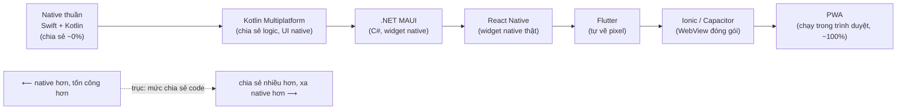

# Phát triển mobile đa nền tảng là gì?

> **Tác giả:** Mr.Rom\
> **Phiên bản:** v1.0.0\
> **Tạo lúc:** 13/06/2026\
> **Cập nhật:** 13/06/2026\
> **Level:** Basic\
> **Tags:** cross-platform, mobile, native, react-native, flutter, kmp, maui, ionic, pwa\
> **Yêu cầu trước:** (không bắt buộc)

> 🎯 *Bài INTRO của cụm. Trước khi đào sâu bất kỳ framework nào, bạn cần một bức tranh tổng. Sau bài này bạn phân biệt được **native** (Swift/Kotlin riêng từng OS) với **cross-platform** (1 codebase → iOS + Android), hiểu vì sao team chọn cross-platform, biết các đánh đổi, và nắm landscape 2026 (React Native, Flutter, KMP, .NET MAUI, Ionic/Capacitor, PWA) trên một **phổ "mức chia sẻ code"**. Chưa đi sâu 1 framework cụ thể — đó là việc của các bài sau.*

## 🎯 Sau bài này bạn sẽ

- [ ] Phân biệt rõ **native** (mỗi OS một codebase) với **cross-platform** (một codebase ra hai OS)
- [ ] Giải thích được vì sao team chọn cross-platform — tiết kiệm chi phí + thời gian, một team, đồng bộ tính năng
- [ ] Kể tên các **đánh đổi** của cross-platform (hiệu năng, độ "native", phụ thuộc framework, độ trễ khi OS ra API mới)
- [ ] Đặt được 6 lựa chọn 2026 (RN, Flutter, KMP, .NET MAUI, Ionic/Capacitor, PWA) lên một **phổ mức chia sẻ code**
- [ ] Dùng bức tranh này để bắt đầu cân nhắc cách dựng app cho Acme Shop

---

## Tình huống — Acme Shop muốn lên hai store cùng lúc

Acme Shop đang bán hàng tốt trên website. Sếp nhìn báo cáo và chốt một câu: *"Khách hỏi app suốt. Mình cần app trên **App Store** (iOS) và **Play Store** (Android). Cùng lúc, không phải cái này xong mới làm cái kia."*

Bạn ngồi tính và lập tức gặp một bức tường:

- 📱 App **iOS** truyền thống viết bằng **Swift**, dùng **Xcode**, máy phải là Mac.
- 🤖 App **Android** truyền thống viết bằng **Kotlin**, dùng **Android Studio**.
- 😱 Hai ngôn ngữ khác nhau, hai bộ công cụ khác nhau, hai codebase khác nhau → thường là **hai team** hoặc một team phải giỏi cả hai.
- 😱 Mỗi tính năng mới (ví dụ nút "Yêu thích") phải viết **hai lần**. Sửa bug cũng **hai lần**. Hai bên dễ lệch nhau, lúc thì iOS có tính năng mà Android chưa.

Bạn search "viết app cho cả iOS và Android một lần" và thấy một loạt tên: **React Native**, **Flutter**, **Kotlin Multiplatform**, **.NET MAUI**, **Ionic**, **PWA**... Người ta gọi chung nhóm này là **cross-platform** (đa nền tảng).

Một loạt câu hỏi hiện ra:

- "Đa nền tảng" thực ra nghĩa là gì? Viết một lần chạy mọi nơi có thật không?
- Nếu viết một codebase cho cả hai, có phải đánh đổi gì không? App có "kém native" hơn không?
- Sao có tới 6-7 cái tên? Chúng khác nhau ở đâu? Cái nào "chia sẻ được nhiều code" nhất?
- Vậy với Acme Shop, đi đường nào?

→ Bài này trả lời tổng quan tất cả, đặt mọi lựa chọn lên **một phổ duy nhất** để bạn không bị rối. Các bài sau mới đi sâu cách tiếp cận kỹ thuật, cách chọn framework, và cách chia sẻ code.

---

## 1️⃣ Trước hết, "native" là gì?

Quay lại bức tường ở trên. Để hiểu cross-platform giải quyết điều gì, ta phải hiểu **cách làm gốc** mà nó thay thế: **native** (gốc/bản địa).

**Native development** (phát triển gốc) nghĩa là viết app bằng **đúng ngôn ngữ và công cụ chính chủ** mà nhà sản xuất hệ điều hành cung cấp — mỗi nền tảng một bộ riêng:

- **iOS** → viết bằng *Swift* (ngôn ngữ của Apple), dùng *Xcode*, gọi thẳng các framework của Apple như *UIKit* / *SwiftUI*.
- **Android** → viết bằng *Kotlin* (ngôn ngữ Google ưu tiên), dùng *Android Studio*, gọi thẳng SDK Android như *Jetpack Compose*.

Điểm mấu chốt: **hai codebase hoàn toàn tách biệt**. Logic giỏ hàng của Acme Shop bạn phải viết một lần bằng Swift cho iOS, rồi viết lại lần nữa bằng Kotlin cho Android. Không dùng chung được dòng nào.

🪞 **Ẩn dụ — native như thuê hai đầu bếp riêng cho hai nhà hàng:**
> Bạn mở hai chi nhánh, một ở khu người Pháp (iOS), một ở khu người Nhật (Android). Khách hai bên muốn ăn cùng một món (cùng tính năng app), nhưng bạn phải thuê **hai đầu bếp**: một người chỉ nấu được theo kiểu Pháp, một người chỉ kiểu Nhật. Mỗi lần đổi thực đơn, bạn phải dặn **cả hai** — và họ rất dễ làm ra hai phiên bản hơi khác nhau.

Native cho chất lượng cao nhất, "đúng chất" từng nền tảng nhất — nhưng cũng tốn nhất vì mọi thứ làm **hai lần**.

---

## 2️⃣ Vậy cross-platform là gì?

Đây là phần "lời giải" cho tình huống đầu bài. Bạn không muốn nuôi hai đầu bếp riêng — bạn muốn **một công thức nấu được cả hai kiểu**.

**Cross-platform development** (phát triển đa nền tảng) là cách viết app sao cho **một codebase duy nhất** chạy được trên **nhiều nền tảng** (iOS + Android, đôi khi cả web và desktop). Bạn viết logic và phần lớn giao diện **một lần**, framework lo việc đưa nó xuống từng hệ điều hành.

🪞 **Ẩn dụ — cross-platform như một đầu bếp song ngữ:**
> Thay vì hai đầu bếp, bạn thuê **một đầu bếp giỏi cả hai kiểu**, biết "dịch" cùng một công thức gốc ra phiên bản Pháp và phiên bản Nhật. Đổi thực đơn? Dặn **một người**. Hai nhà hàng tự động đồng bộ. Đôi khi món "dịch ra" chưa tinh tế bằng đầu bếp thuần bản địa — đó chính là **cái giá** của tiện lợi, ta sẽ nói ở mục 4.

Quan trọng: **"cross-platform" không phải một công nghệ duy nhất.** Nó là một **nhóm cách tiếp cận** với mức độ "chia sẻ" và "native" rất khác nhau. Có cái chia sẻ gần 100% code, có cái chỉ chia sẻ phần logic. Có cái render ra giao diện native thật, có cái chỉ là website đóng gói. Ba hiểu lầm thường gặp:

| Cách hiểu | Đúng/Sai | Giải thích |
|---|---|---|
| "Cross-platform = nhét website vào app" | ⚠️ Chỉ đúng với 1 nhánh | Đó là kiểu WebView (Ionic/Cordova). Nhiều framework khác render UI native thật |
| "Cross-platform luôn chậm và xấu hơn native" | ❌ Sai (đã lỗi thời) | RN/Flutter 2026 đủ mượt cho đa số app nghiệp vụ; khác biệt thường rất nhỏ |
| "Cross-platform = một codebase ra nhiều nền tảng" | ✅ Đúng (cốt lõi) | Mức chia sẻ code dao động tuỳ framework, nhưng ý tưởng gốc là vậy |

→ Vì "cross-platform" là một **phổ** chứ không phải một điểm, phần còn lại của bài sẽ giúp bạn định vị từng lựa chọn trên phổ đó.

---

## 3️⃣ Vì sao team thật chọn cross-platform?

Định nghĩa rõ rồi, nhưng "vì sao đáng chọn" mới là thứ thuyết phục được sếp Acme Shop. Bốn lý do lớn, đi từ tiền bạc tới sản phẩm:

**1. Tiết kiệm chi phí.** Thay vì trả cho hai team (iOS + Android) hoặc một team phải biết cả Swift lẫn Kotlin, bạn chỉ cần **một team biết một stack** (ví dụ React/JS hoặc Dart). Ít người hơn cho cùng phạm vi công việc.

**2. Tiết kiệm thời gian ra mắt.** Viết logic và UI **một lần** thay vì hai lần. App lên **cả hai store cùng lúc** — đúng yêu cầu của sếp, thay vì "iOS xong trước, Android lẹt đẹt theo sau".

**3. Một team, một nguồn sự thật.** Cả app sống trong **một repo**, một ngôn ngữ, một quy trình review. Người mới onboard học một stack là làm được cả hai nền tảng.

**4. Đồng bộ tính năng tự nhiên.** Vì cùng một codebase, tính năng mới và bản sửa lỗi **xuất hiện đồng thời** trên iOS và Android. Không còn cảnh "iOS đã có dark mode mà Android phải chờ".

Để thấy rõ khác biệt về công sức, hãy so sánh hai cách dựng cùng một app Acme Shop. Bảng dưới nhìn theo từng đầu việc:

| Đầu việc | Native (2 codebase) | Cross-platform (1 codebase) |
|---|---|---|
| Ngôn ngữ phải biết | Swift **và** Kotlin | Một ngôn ngữ (vd JS/TS hoặc Dart) |
| Số codebase | 2 (iOS + Android tách biệt) | 1 (dùng chung) |
| Viết một tính năng mới | 2 lần (mỗi OS một lần) | 1 lần |
| Sửa một bug logic | 2 lần | 1 lần |
| Ra mắt hai store | Thường lệch thời điểm | Đồng thời |
| Nguy cơ lệch tính năng giữa 2 OS | Cao | Thấp |
| Quy mô team tối thiểu | Lớn hơn | Nhỏ hơn |

→ Với một shop thương mại điện tử cần ra mắt nhanh và ngân sách hữu hạn, cột bên phải rõ ràng hấp dẫn hơn. Nhưng "hấp dẫn hơn" không phải "luôn đúng" — mục kế nói về cái giá phải trả.

---

## 4️⃣ Có đánh đổi gì không? — Cái giá của cross-platform

Không có bữa trưa miễn phí. Viết một lần chạy hai nơi luôn kèm theo đánh đổi. Hiểu rõ chúng giúp bạn quyết định tỉnh táo, không bị "marketing" của framework cuốn đi.

**1. Hiệu năng — thường đủ tốt, nhưng có trần.** Code của bạn không chạy "trần" trên CPU như native; nó đi qua một lớp trung gian (engine JS, engine vẽ, lớp dịch...). Với app nghiệp vụ thông thường (danh sách, form, gọi API) khác biệt là **không đáng kể**. Nhưng với **game 3D, xử lý ảnh/video thời gian thực, AR nặng**, native vẫn nhanh hơn rõ rệt.

**2. Độ "native" của trải nghiệm.** Mỗi OS có "chất" riêng: cách cuộn, hiệu ứng chạm, cử chỉ vuốt, phông chữ hệ thống. Framework dùng widget native thật (như RN) giữ được nhiều "chất" này; framework tự vẽ pixel (như Flutter) cho UI **giống hệt nhau trên mọi máy** — đẹp nhưng đôi khi "không giống app gốc" của từng OS.

**3. Phụ thuộc framework (lock-in).** Bạn đặt cược vào một framework và hệ sinh thái của nó. Nếu framework đó ngừng phát triển, hoặc một thư viện quan trọng không được bảo trì, bạn gặp khó. (Đây là một trong những lý do người ta nhìn vào "ai chống lưng": Meta cho RN, Google cho Flutter, JetBrains cho KMP...)

**4. Độ trễ khi OS ra API mới.** Khi Apple/Google ra tính năng mới (widget kiểu mới, API quyền riêng tư mới), native dùng được **ngay hôm đó**. Cross-platform thường phải **chờ** framework hoặc cộng đồng bọc (wrap) API đó lại — có thể mất một khoảng cho tới khi có thư viện ổn định.

> [!WARNING]
> Đừng chọn cross-platform chỉ vì "rẻ và nhanh" mà bỏ qua đánh đổi. Nếu app của bạn là **game 3D nặng** hay **lệ thuộc sâu vào API phần cứng vừa ra mắt**, native có thể là lựa chọn đúng dù tốn hơn. Quyết định nên dựa trên **bản chất app**, không chỉ ngân sách.

→ Điểm cần nhớ: với app dạng nội dung/nghiệp vụ (như Acme Shop), các đánh đổi này phần lớn **chấp nhận được**; với app đặc thù hiệu năng/phần cứng, chúng có thể là deal-breaker. Bài 04 của cụm sẽ đi sâu khung quyết định "khi nào cross-platform, khi nào native".

---

## 5️⃣ Landscape 2026 — sáu lựa chọn chính

Khi search, bạn gặp một "rừng" tên. Tin tốt: chỉ cần nắm **sáu cái tên chính** là đủ bức tranh 2026. Trước khi xem bảng, lưu ý chúng không cùng "loại" — sẽ rõ hơn ở mục 6 khi xếp lên phổ. Bảng dưới là phần giới thiệu nhanh từng cái:

| Framework | Ngôn ngữ | Chống lưng | Cách render UI | Một câu định vị |
|---|---|---|---|---|
| **React Native** (RN) | JavaScript / TypeScript | Meta | Widget **native thật** của OS | Dân React/web bước sang mobile dễ nhất |
| **Flutter** | Dart | Google | **Tự vẽ pixel** bằng engine riêng (Impeller) | UI tuỳ biến đậm, đồng nhất mọi máy |
| **Kotlin Multiplatform** (KMP) | Kotlin | JetBrains | UI vẫn **native từng OS** (chỉ chia sẻ logic) | Chia sẻ logic, UI để native lo |
| **.NET MAUI** | C# | Microsoft | Widget native qua lớp .NET | Doanh nghiệp đã dùng C#/.NET |
| **Ionic / Capacitor** | HTML/CSS/JS (web) | Ionic (OSS) | **WebView** (web bọc trong app) | Dân web thuần, app nội dung nhẹ |
| **PWA** (Progressive Web App) | HTML/CSS/JS | Chuẩn web (W3C) | Chạy trong **trình duyệt**, cài như app | Không cần qua store, một URL cho tất cả |

Vài ghi chú quan trọng để không hiểu nhầm:

- **KMP khác phần còn lại ở chỗ:** nó **không** cố chia sẻ UI. Triết lý của KMP là *"chia sẻ phần logic (network, database, business rules), còn giao diện thì cứ viết native từng OS cho đẹp nhất"*. Đây là một trường phái riêng, không phải "viết một lần cho tất cả".
- **Ionic/Capacitor và PWA** đều dựa trên **công nghệ web**. Khác biệt: Ionic/Capacitor **đóng gói** web thành app cài qua store và mở được nhiều API native hơn; PWA **chạy thẳng trong trình duyệt**, người dùng "Add to Home Screen" là có icon, không qua store.
- **RN và Flutter** là hai "ông lớn" được dùng nhiều nhất cho app native-feel năm 2026. Bài 02 của cụm so sánh chúng kỹ.

> [!NOTE]
> Danh sách này là **các lựa chọn chính**, không phải tất cả. Còn những cái tên khác (Cordova kiểu cũ, NativeScript, Xamarin — tiền thân của MAUI...) nhưng với người mới năm 2026, sáu cái trên đã phủ gần hết quyết định thực tế.

→ Sáu cái tên nhìn rời rạc, nhưng chúng sắp xếp được theo **một trục duy nhất** — "chia sẻ được bao nhiêu code". Đó là sơ đồ ở mục tiếp theo.

---

## 6️⃣ Phổ "mức chia sẻ code" — xương sống để nhớ tất cả

Đây là phần trừu tượng nhất và cũng **đáng nhớ nhất** của bài. Thay vì học thuộc sáu framework rời rạc, hãy đặt chúng lên **một trục liên tục**: từ **native thuần** (chia sẻ 0% code) ở một đầu, tới **web/PWA** (chia sẻ gần 100%) ở đầu kia. Càng đi về phía chia sẻ nhiều, bạn càng tiết kiệm công — nhưng thường càng xa "chất native thuần".

Sơ đồ dưới xếp các lựa chọn theo trục đó. Hãy đọc từ trái (ít chia sẻ, native nhất) sang phải (chia sẻ nhiều nhất, xa native nhất):



→ Mấu chốt cần khắc sâu: **không có vị trí nào "tốt nhất tuyệt đối"** trên trục này. Đi về trái (native) được "chất" và hiệu năng nhưng tốn công gấp đôi; đi về phải (web) chia sẻ tối đa nhưng xa cảm giác native. Mỗi dự án có một điểm "vừa vặn" riêng — việc của bạn là tìm đúng điểm đó, không phải chọn "cái xịn nhất".

Để dễ chốt, đây là **bảng quyết định nhanh** ánh xạ "bạn là ai / app thế nào" sang vị trí trên phổ. Bảng đọc theo hàng — tìm hàng giống tình huống của bạn nhất:

| Nếu bạn / app của bạn… | Nghiêng về | Vì sao |
|---|---|---|
| Team đã giỏi **React/web**, cần native-feel, ra 2 store nhanh | **React Native** | Tái dùng kỹ năng React, widget native thật |
| Cần **UI tuỳ biến đậm**, animation nặng, đồng nhất mọi máy | **Flutter** | Tự vẽ pixel → toàn quyền với pixel |
| App đã có **UI native riêng đẹp**, chỉ muốn dùng chung **logic** | **Kotlin Multiplatform** | Chia sẻ logic, giữ UI native từng OS |
| Doanh nghiệp đã đầu tư **C#/.NET** sâu | **.NET MAUI** | Tận dụng đội ngũ và code C# sẵn có |
| Team **web thuần**, app nhẹ chủ yếu nội dung | **Ionic / Capacitor** | Dùng lại kỹ năng HTML/CSS/JS |
| Muốn **một URL**, không qua store, cập nhật tức thì | **PWA** | Không cần submit store, deploy như web |
| App là **game 3D / đồ hoạ nặng / phụ thuộc API phần cứng mới** | **Native thuần** | Hiệu năng trần + API mới nhất ngay lập tức |

→ Với Acme Shop (thương mại điện tử, nội dung + nghiệp vụ, cần ra hai store nhanh), điểm "vừa vặn" rơi vào vùng **giữa phổ**: RN hoặc Flutter. Đây mới là định hướng — bài 02 sẽ so sánh chi tiết để chốt.

---

## 💡 Cạm bẫy thường gặp & Best practice

### ❌ Cạm bẫy: nghĩ "cross-platform luôn xấu/chậm hơn native"

- **Triệu chứng**: loại bỏ cross-platform ngay từ đầu vì sợ "app sẽ lag, sẽ giống website", dựa trên định kiến từ ~5-7 năm trước.
- **Nguyên nhân**: thời kỳ đầu (Cordova/WebView, RN Bridge cũ) đúng là có vấn đề hiệu năng. Định kiến đó còn sót lại tới giờ.
- **Cách tránh**: phân biệt **kiểu WebView** (Ionic/PWA — đúng là khác native) với **kiểu render native/tự vẽ** (RN/Flutter 2026 — mượt cho đa số app). Đánh giá theo bản chất app cụ thể, không theo định kiến.

### ❌ Cạm bẫy: nhầm "cross-platform" là một công nghệ duy nhất

- **Triệu chứng**: hỏi "cross-platform có chia sẻ được 100% code không?" như thể chỉ có một câu trả lời.
- **Nguyên nhân**: bị gộp sáu thứ rất khác nhau (RN, Flutter, KMP, MAUI, Ionic, PWA) vào một cái tên.
- **Cách tránh**: luôn nghĩ theo **phổ "mức chia sẻ code"** ở mục 6. KMP chia sẻ logic thôi; PWA chia sẻ gần hết. Hỏi "framework *nào*", đừng hỏi "cross-platform nói chung".

### ✅ Best practice: chọn theo kỹ năng team + bản chất app, không theo "hype"

- **Vì sao**: framework "hot nhất" chưa chắc hợp dự án của bạn. Một team React mà ép học Dart cho Flutter có thể chậm hơn là dùng RN. App game ép vào RN sẽ khổ.
- **Cách áp dụng**: trả lời hai câu trước khi chọn — *(1) team đang giỏi stack gì?* và *(2) app nghiêng về nội dung/nghiệp vụ hay đồ hoạ/phần cứng?* Hai câu này đưa bạn về đúng vùng trên phổ.

### ✅ Best practice: chấp nhận một ít code riêng theo nền tảng là chuyện bình thường

- **Vì sao**: "một codebase" không có nghĩa "100% giống nhau". Vài chỗ đặc thù (icon back của iOS khác Android, cách xin quyền) cần xử lý riêng — điều này hoàn toàn ổn.
- **Cách áp dụng**: kỳ vọng chia sẻ phần lớn (logic + đa số UI), giữ chỗ cho một ít nhánh riêng theo nền tảng. Đừng cố ép 100% chung rồi UI nào cũng "nửa nạc nửa mỡ".

---

## 🧠 Tự kiểm tra (Self-check)

**Q1.** Khác biệt cốt lõi giữa **native** và **cross-platform** là gì?

<details>
<summary>💡 Đáp án</summary>

**Native**: mỗi hệ điều hành một codebase riêng, viết bằng ngôn ngữ chính chủ — iOS bằng *Swift* (Xcode), Android bằng *Kotlin* (Android Studio). Logic và UI viết **hai lần**, không dùng chung.

**Cross-platform**: **một codebase duy nhất** chạy được trên nhiều nền tảng (iOS + Android, đôi khi web/desktop). Viết logic và phần lớn UI **một lần**, framework lo việc đưa xuống từng OS. Mức chia sẻ code dao động tuỳ framework.

</details>

**Q2.** Kể bốn lý do team chọn cross-platform.

<details>
<summary>💡 Đáp án</summary>

1. **Tiết kiệm chi phí** — một team biết một stack thay vì hai team / phải biết cả Swift lẫn Kotlin.
2. **Tiết kiệm thời gian** — viết một lần, ra hai store cùng lúc.
3. **Một team, một nguồn sự thật** — một repo, một ngôn ngữ, một quy trình; onboard dễ.
4. **Đồng bộ tính năng** — tính năng mới và bản sửa lỗi xuất hiện đồng thời trên cả hai OS, không lệch.

</details>

**Q3.** Nêu bốn đánh đổi (trade-off) của cross-platform so với native.

<details>
<summary>💡 Đáp án</summary>

1. **Hiệu năng** — đủ tốt cho app nghiệp vụ, nhưng có trần với game 3D / đồ hoạ nặng / AR.
2. **Độ "native"** — có thể mất một phần "chất" riêng của từng OS (nhất là framework tự vẽ pixel như Flutter).
3. **Phụ thuộc framework (lock-in)** — đặt cược vào một hệ sinh thái; rủi ro nếu framework hay thư viện ngừng bảo trì.
4. **Độ trễ khi OS ra API mới** — phải chờ framework/cộng đồng bọc API mới, trong khi native dùng được ngay.

</details>

**Q4.** Trên phổ "mức chia sẻ code", đầu nào là **native thuần** và đầu nào là **chia sẻ nhiều nhất**? Đặt KMP và PWA vào đúng chỗ.

<details>
<summary>💡 Đáp án</summary>

Một đầu là **native thuần** (Swift + Kotlin, chia sẻ ~0% code) — nhiều "chất" native nhất nhưng tốn công nhất. Đầu kia là **PWA** (chạy trong trình duyệt, chia sẻ gần 100%) — chia sẻ tối đa nhưng xa cảm giác native nhất.

- **KMP** nằm gần đầu native: chỉ chia sẻ **logic**, còn **UI vẫn viết native từng OS**.
- **PWA** nằm ở đầu chia sẻ tối đa: web chạy thẳng trong trình duyệt, một codebase cho tất cả.

Thứ tự gợi nhớ (trái → phải): Native → KMP → .NET MAUI → React Native → Flutter → Ionic/Capacitor → PWA.

</details>

**Q5.** Acme Shop là app thương mại điện tử (nội dung + nghiệp vụ), team đã quen web/React, cần ra cả hai store nhanh với ngân sách hữu hạn. App này nghiêng về vùng nào trên phổ? Vì sao chưa chốt ngay một framework?

<details>
<summary>💡 Đáp án</summary>

Nghiêng về **vùng giữa phổ** — cụ thể **React Native** hoặc **Flutter**: đủ native-feel, một codebase ra hai store, tiết kiệm chi phí/thời gian. Vì team quen React/web, RN có lợi thế tái dùng kỹ năng.

Chưa chốt ngay vì đây là bài **tổng quan**: cần so sánh kỹ RN vs Flutter (và các yếu tố như UI tuỳ biến, hệ sinh thái thư viện, đường cong học) trước khi quyết. Đó là việc của bài 02 trong cụm.

</details>

---

## ⚡ Tra cứu nhanh (Cheatsheet)

### Native vs Cross-platform — phân biệt nhanh

```text
Native        = 2 codebase (Swift cho iOS + Kotlin cho Android)
                → chất native nhất, tốn nhất, làm 2 lần
Cross-platform = 1 codebase ra nhiều OS
                → tiết kiệm chi phí/thời gian, 1 team, đồng bộ tính năng
```

### Vì sao chọn cross-platform

```text
+ Tiết kiệm chi phí (1 team, 1 stack)
+ Tiết kiệm thời gian (viết 1 lần, ra 2 store cùng lúc)
+ Một nguồn sự thật (1 repo, onboard dễ)
+ Đồng bộ tính năng (iOS & Android cập nhật cùng lúc)
```

### Đánh đổi cần nhớ

```text
- Hiệu năng     : đủ tốt cho app nghiệp vụ; có trần với game 3D / đồ hoạ nặng
- Độ "native"   : có thể mất "chất" riêng từng OS (Flutter tự vẽ pixel)
- Lock-in       : phụ thuộc framework + hệ sinh thái
- API mới của OS: phải chờ framework bọc lại (native dùng được ngay)
```

### Phổ "mức chia sẻ code" (trái = native nhất → phải = chia sẻ nhất)

```text
Native(Swift+Kotlin) → KMP → .NET MAUI → React Native → Flutter → Ionic/Capacitor → PWA
   chia sẻ ~0%                                                              chia sẻ ~100%
```

### Landscape 2026 — định vị một dòng

```text
React Native        JS/TS, Meta      — widget native thật; dân React dễ vào
Flutter             Dart, Google     — tự vẽ pixel; UI tuỳ biến đậm
Kotlin Multiplatform Kotlin, JetBrains— chia sẻ LOGIC, UI native từng OS
.NET MAUI           C#, Microsoft    — hợp shop đã dùng .NET
Ionic / Capacitor   web, OSS         — WebView đóng gói; dân web thuần
PWA                 web, chuẩn W3C   — chạy trong trình duyệt, không qua store
```

---

## 📚 Từ Điển Thuật Ngữ (Glossary)

| EN | VN | Giải thích |
|---|---|---|
| Native development | Phát triển gốc | Viết app bằng ngôn ngữ/công cụ chính chủ của OS — Swift cho iOS, Kotlin cho Android |
| Cross-platform | Đa nền tảng | Một codebase chạy được nhiều OS; framework lo đưa xuống từng nền tảng |
| Codebase | Mã nguồn dự án | Toàn bộ source code của app; native có 2, cross-platform thường có 1 |
| Code sharing | Chia sẻ code | Mức độ code dùng chung được giữa các nền tảng (từ ~0% native tới ~100% web) |
| Swift | Swift | Ngôn ngữ chính của Apple để viết app iOS native |
| Kotlin | Kotlin | Ngôn ngữ Google ưu tiên để viết app Android native |
| React Native (RN) | React Native | Framework cross-platform của Meta (JS/TS), render widget native thật |
| Flutter | Flutter | Framework cross-platform của Google (Dart), tự vẽ pixel bằng engine riêng |
| Kotlin Multiplatform (KMP) | KMP | Cách của JetBrains: chia sẻ logic Kotlin, UI vẫn native từng OS |
| .NET MAUI | .NET MAUI | Framework cross-platform của Microsoft dùng C#, render qua widget native |
| Ionic / Capacitor | Ionic / Capacitor | Đóng gói web (HTML/CSS/JS) thành app qua WebView, mở thêm API native |
| WebView | WebView | Trình duyệt nhúng trong app — hiển thị web như một phần của app |
| PWA (Progressive Web App) | Ứng dụng web tiến bộ | Web chạy trong trình duyệt, cài như app (Add to Home Screen), không qua store |
| Lock-in | Khoá nhà cung cấp | Sự phụ thuộc vào một framework/hệ sinh thái, khó đổi sang cái khác |
| Native-feel | Cảm giác native | Trải nghiệm cuộn/chạm/vuốt giống app viết tay bằng Swift/Kotlin |

---

## 🔗 Liên kết & Tài nguyên

➡️ **Bài tiếp theo:** [Các cách tiếp cận — WebView, Bridge, Compiled](01_approaches-and-architecture.md)\
↑ **Về cụm:** [cross-platform-concepts — README cụm](../../README.md)

### 🧭 Định hướng lộ trình học

- [Các cách tiếp cận — WebView, Bridge, Compiled](01_approaches-and-architecture.md) — bài kế: ba kiểu kiến trúc kỹ thuật đứng sau các framework
- [Chọn framework — RN vs Flutter vs KMP vs MAUI vs Ionic](02_choosing-a-framework.md) — đào sâu cách chốt một framework
- [Khi nào cross-platform, khi nào native thuần?](04_when-cross-platform-vs-native.md) — khung quyết định cuối cụm

### 🧩 Các chủ đề có thể bạn quan tâm

- [React Native là gì? — Viết app native bằng React](../../../react-native/lessons/01_basic/00_what-is-react-native.md) — đào sâu lựa chọn RN trên phổ
- [Flutter — cụm chủ đề](../../../flutter/README.md) — đào sâu lựa chọn Flutter (tự vẽ pixel)
- [Kotlin Multiplatform / Android — cụm chủ đề](../../../android-kotlin/README.md) — hướng chia sẻ logic, UI native
- [iOS / Swift — cụm chủ đề](../../../ios-swift/README.md) — native thuần phía iOS
- [Kiến trúc mobile — cụm chủ đề](../../../mobile-architecture/README.md) — tổ chức code app dù chọn hướng nào

### 🌐 Tài nguyên tham khảo khác

- [React Native docs (chính thức)](https://reactnative.dev/) — tài liệu gốc của RN
- [Flutter docs (chính thức)](https://docs.flutter.dev/) — tài liệu gốc của Flutter
- [Kotlin Multiplatform docs](https://www.jetbrains.com/kotlin-multiplatform/) — giới thiệu triết lý chia sẻ logic của KMP
- [.NET MAUI docs](https://learn.microsoft.com/dotnet/maui/) — tài liệu MAUI của Microsoft
- [Capacitor docs (Ionic)](https://capacitorjs.com/docs) — cách đóng gói web thành app native
- [web.dev — Progressive Web Apps](https://web.dev/explore/progressive-web-apps) — hướng dẫn PWA của Google

---

> 🎯 *Sau bài này bạn đã có bức tranh tổng: native vs cross-platform, vì sao chọn, đánh đổi, và phổ "mức chia sẻ code" với sáu lựa chọn 2026. Bài kế tiếp đi sâu **ba cách tiếp cận kỹ thuật** đứng sau các framework — WebView, Bridge và Compiled — để bạn hiểu vì sao chúng nằm ở các vị trí khác nhau trên phổ.*

---

## 📌 Nhật ký thay đổi (Changelog)

- **v1.0.0 (13/06/2026)** — Bản đầu tiên. Cụm `cross-platform-concepts/` lesson 1/5. Cover: native (Swift/Kotlin riêng từng OS) vs cross-platform (1 codebase → iOS + Android) + vì sao chọn cross-platform (tiết kiệm chi phí/thời gian, 1 team, đồng bộ tính năng) + 4 đánh đổi (hiệu năng, độ native, lock-in, độ trễ API mới của OS) + landscape 2026 (React Native, Flutter, KMP, .NET MAUI, Ionic/Capacitor, PWA) + phổ "mức chia sẻ code" + bảng quyết định nhanh. Kèm sơ đồ mermaid phổ native ↔ cross-platform.
