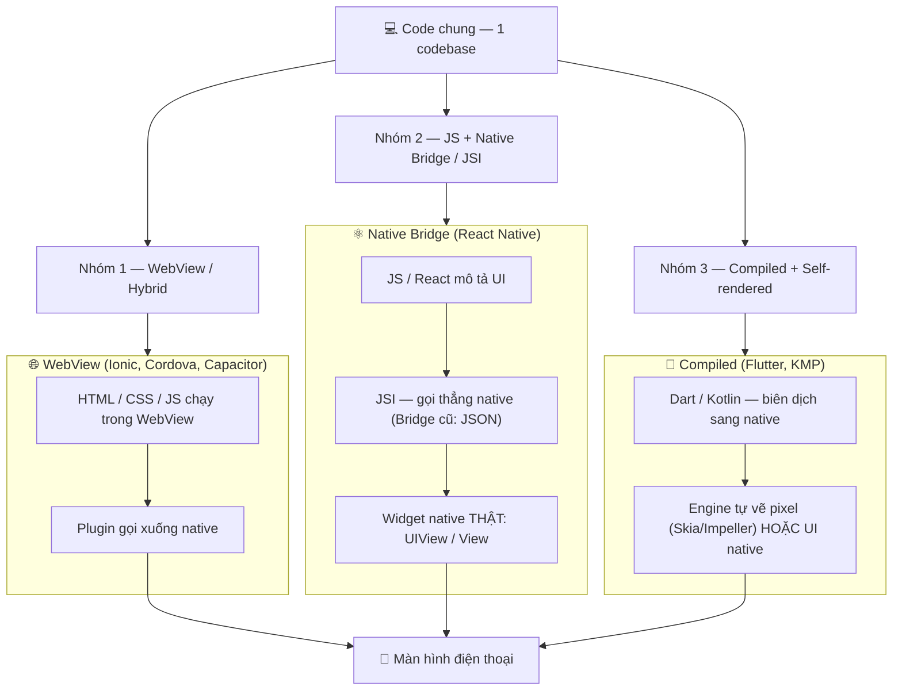

# Các cách tiếp cận — WebView, Bridge, Compiled

> **Tác giả:** Mr.Rom\
> **Phiên bản:** v1.0.0\
> **Tạo lúc:** 13/06/2026\
> **Cập nhật:** 13/06/2026\
> **Level:** Basic\
> **Tags:** cross-platform, mobile, architecture, webview, react-native, flutter, kmp\
> **Yêu cầu trước:** [Phát triển mobile đa nền tảng là gì](00_what-is-cross-platform-mobile.md)

> 🎯 *Bài trước bạn đã biết cross-platform là "1 codebase, nhiều nền tảng". Nhưng "nhiều framework cùng làm được điều đó" lại chia thành **3 nhóm kiến trúc khác nhau về bản chất** — WebView/hybrid, JS + native bridge, và compiled + self-rendered. Bài này mổ xẻ 3 nhóm đó để bạn hiểu **vì sao** Ionic, React Native và Flutter cho cảm giác khác nhau, từ đó chọn đúng hướng cho Acme Shop. KHÔNG đi sâu 1 framework — bài 02 mới làm việc đó.*

## 🎯 Sau bài này bạn sẽ

- [ ] Phân biệt **3 nhóm kiến trúc** cross-platform: WebView/hybrid, JS + native bridge/JSI, compiled + self-rendered
- [ ] Hiểu cách mỗi nhóm **dựng UI** lên màn hình (HTML trong WebView vs widget native thật vs tự vẽ pixel)
- [ ] Giải thích **hiệu năng** và **native feel** của mỗi nhóm khác nhau ở đâu và vì sao
- [ ] Biết mỗi nhóm **truy cập tính năng native** (camera, GPS, notification) qua cơ chế nào
- [ ] Dùng bảng so sánh để **định vị** một framework bất kỳ vào đúng nhóm khi gặp lần đầu

---

## Tình huống — cùng là "cross-platform" mà sao khác nhau quá

Bài trước bạn đã thuyết phục được sếp: Acme Shop sẽ làm app bằng cross-platform, viết 1 codebase ra cả iOS lẫn Android thay vì 2 team riêng. Sếp gật đầu, rồi bảo bạn đi khảo sát công cụ.

Bạn mở Google ra, và lập tức bối rối. Cùng được gắn nhãn "cross-platform" mà có cả chục cái tên: **Ionic**, **Cordova**, **Capacitor**, **React Native**, **Flutter**, **Kotlin Multiplatform**, **.NET MAUI**… Bạn tải thử vài app demo về máy và thấy điều kỳ lạ:

- App làm bằng **Ionic** cuộn hơi "lướt" lạ lạ, đôi chỗ giống như đang lướt một trang web trong app.
- App làm bằng **React Native** thì cuộn mượt, bấm nút có cảm giác y hệt app gốc.
- App làm bằng **Flutter** cũng mượt, nhưng nút bấm trông giống hệt nhau trên cả iPhone lẫn Android — không "đậm chất iOS" hay "đậm chất Android" như các app khác.

Bạn ngơ ra với một loạt câu hỏi:

- Tại sao cùng là cross-platform mà cảm giác khác nhau đến vậy?
- Cái nào "native thật", cái nào chỉ là "website đội lốt app"?
- Vì sao có cái mượt, có cái hơi giật?
- Khi muốn dùng camera quét mã sản phẩm cho Acme Shop, mỗi cái truy cập camera kiểu gì?

Câu trả lời nằm ở **kiến trúc bên dưới**. Mọi framework cross-platform, dù tên gì, đều rơi vào **1 trong 3 nhóm kiến trúc**. Hiểu 3 nhóm này, bạn sẽ "đọc vị" được bất kỳ framework nào chỉ trong vài phút — và đó là nền tảng để bài 02 chọn framework cụ thể.

---

## 1️⃣ Vấn đề gốc: làm sao 1 codebase vẽ được UI lên 2 hệ điều hành?

Trước khi xem 3 nhóm, phải hiểu **bài toán chung** mà cả 3 đang giải.

iOS và Android là hai thế giới tách biệt. iOS dựng giao diện bằng **UIKit/SwiftUI** (các widget như `UIButton`, `UILabel`), viết bằng Swift. Android dựng giao diện bằng **View system/Jetpack Compose** (`Button`, `TextView`), viết bằng Kotlin. Hai bộ widget, hai ngôn ngữ, hai cách vẽ lên màn hình hoàn toàn khác nhau.

Khi bạn viết "1 codebase", framework cross-platform phải **bắc cầu** từ code chung của bạn sang 2 thế giới đó. Và đây là chỗ các framework rẽ thành 3 hướng — khác nhau ở câu hỏi: **"cuối cùng cái gì được vẽ lên màn hình?"**

🪞 **Ẩn dụ — 3 cách làm một bộ phim chiếu ở cả Việt Nam lẫn Nhật:**
> Bạn có 1 kịch bản (codebase). Muốn chiếu ở 2 nước:
> - **Cách 1 — chiếu nguyên bản, gắn phụ đề (WebView):** dùng đúng 1 bản phim web, đặt nó vào "khung rạp" của từng nước. Nhanh, rẻ, nhưng khán giả vẫn nhận ra "đây là phim nhập, không phải phim bản địa".
> - **Cách 2 — thuê diễn viên bản địa đóng lại (native bridge):** đạo diễn (code JS của bạn) chỉ đạo, nhưng diễn viên là người thật của từng nước (widget native thật). Khán giả thấy "đúng chất bản địa".
> - **Cách 3 — tự dựng phim trường, tự quay từng khung hình (compiled + self-rendered):** không mượn diễn viên ai cả, tự vẽ mọi thứ bằng máy quay riêng. Kiểm soát tuyệt đối từng pixel, giống hệt nhau ở mọi nước.

Ba "cách làm phim" đó chính là 3 nhóm kiến trúc. Ta đi vào từng nhóm.

Trước khi đi sâu, ghim sẵn 3 từ khoá để theo dõi xuyên suốt bài — đây là 3 trục mà mọi nhóm đều phải trả lời:

- **Render** — *"cái gì được vẽ lên màn hình?"* (HTML trong WebView / widget native thật / pixel tự vẽ). Đây là trục phân loại quan trọng nhất.
- **Native access** — *"muốn dùng camera, GPS, notification thì gọi qua đâu?"* (plugin / native module / platform channel).
- **Đánh đổi** — *"được native feel + hiệu năng tới đâu, đổi lại tốn công học gì?"*

Giữ 3 trục này trong đầu, bạn sẽ thấy 3 nhóm dưới đây chỉ là 3 câu trả lời khác nhau cho cùng bộ câu hỏi.

---

## 2️⃣ Nhóm 1 — WebView / Hybrid: web app mặc áo native

**Đại diện:** Apache **Cordova** (tiền thân PhoneGap), **Ionic**, **Capacitor**.

### Ý tưởng cốt lõi của WebView/Hybrid

Bạn viết app bằng đúng công nghệ web bạn đã biết: **HTML + CSS + JavaScript** (thường kèm framework web như Angular/React/Vue). Sau đó, framework gói toàn bộ web app đó vào một **WebView** — một *trình duyệt thu nhỏ nhúng bên trong app native*. Người dùng tải về một app thật từ store, nhưng bên trong app đó, nội dung là một trang web đang chạy.

🪞 **Ẩn dụ:** giống như đóng khung một bức tranh. Bức tranh (web app HTML/CSS/JS) không đổi, bạn chỉ đặt nó vào một **cái khung** (app native vỏ ngoài) để treo lên tường (cài lên điện thoại, lên store). Người xem thấy "một món đồ trang trí trên tường", nhưng ruột vẫn là bức tranh cũ.

### Vẽ UI bằng cách nào?

WebView **render HTML/CSS** y như trình duyệt. Khi bạn viết `<button>` và style bằng CSS, người dùng thấy một nút do **engine trình duyệt** vẽ ra — không phải `UIButton` của iOS hay `Button` của Android. Để trông giống native, các framework như Ionic cung cấp **bộ component CSS bắt chước** giao diện iOS/Android. Nhưng đó là *mô phỏng*, không phải widget native thật.

### Truy cập native (camera, GPS…) bằng cách nào?

WebView một mình không chạm được vào camera hay GPS — nó chỉ là trình duyệt. Vì thế nhóm này dùng **plugin/bridge**: một lớp cầu nối cho JS gọi xuống code native.

🪞 *Ẩn dụ: WebView như một người khách trong nhà bạn, chỉ ở trong phòng khách (trình duyệt). Muốn lấy đồ trong bếp (camera), khách phải nhờ gia chủ (plugin native) đi lấy hộ.*

Với **Capacitor** (thế hệ mới, do team Ionic làm), bạn gọi camera đại loại như sau — chú ý đây là JS thuần, plugin lo phần native:

```js
// Lấy ảnh từ camera bằng plugin Capacitor (chạy trong WebView)
import { Camera, CameraResultType } from '@capacitor/camera';

async function chupAnhSanPham() {
  // 1. Gọi plugin — plugin tự mở camera native của iOS/Android
  const anh = await Camera.getPhoto({
    quality: 90,
    resultType: CameraResultType.Uri, // trả về đường dẫn ảnh
  });

  // 2. Nhận kết quả về lại JS để hiển thị trong WebView
  return anh.webPath;
}
```

→ Điểm mấu chốt: phần UI (nút "Chụp ảnh") là HTML/CSS trong WebView, còn việc *mở camera thật* do plugin native làm hộ. Nếu một tính năng native chưa có plugin sẵn, bạn (hoặc cộng đồng) phải tự viết plugin — đây là giới hạn lớn của nhóm này.

### Ưu / nhược của WebView/Hybrid

- ✅ **Dễ nhất với dev web** — tái dùng gần như 100% kiến thức HTML/CSS/JS, thậm chí chia sẻ code với website.
- ✅ **Ra nhanh, rẻ** — hợp app nội bộ, MVP, app nội dung đơn giản.
- ⚠️ **Native feel kém nhất** — vì là web vẽ trong WebView, cuộn list dài / animation phức tạp dễ "lướt" không giống native; mỗi OS lại có engine WebView khác nhau gây lệch nhỏ.
- ⚠️ **Hiệu năng yếu nhất** với UI nặng — mọi thứ qua một lớp trình duyệt trung gian.
- ⚠️ **Phụ thuộc plugin** cho tính năng native; rủi ro bị App Store coi là "website đóng gói" nếu app quá sơ sài.

> 💡 **Capacitor vs Cordova**: cả hai cùng nhóm WebView/hybrid, nhưng Capacitor (mới hơn) coi phần native iOS/Android là project mở để bạn chỉnh trực tiếp khi cần, còn Cordova ẩn phần đó đi. 2026 dự án mới thường chọn Capacitor; Ionic là bộ UI chạy bên trên.

---

## 3️⃣ Nhóm 2 — JS + Native Bridge/JSI: UI native thật, điều khiển bằng JS

**Đại diện:** **React Native** (Meta). (NativeScript cùng nhóm nhưng ít phổ biến hơn.)

### Ý tưởng cốt lõi của Native Bridge

Bạn viết logic và mô tả UI bằng **JavaScript/TypeScript** (với React Native là React). Nhưng khác hẳn nhóm 1: **KHÔNG có WebView, KHÔNG có HTML**. Khi bạn viết `<View>`, framework không vẽ một `<div>` trong trình duyệt — nó dựng một **widget native thật**: `UIView` của iOS, `android.view.View` của Android. Code JS của bạn đóng vai "đạo diễn" điều khiển các widget native đó từ xa.

🪞 **Ẩn dụ:** như đã nói ở ẩn dụ làm phim — bạn là **đạo diễn** nói một thứ tiếng (JS), còn diễn viên là **người bản địa thật** của từng nước (widget native thật). Có một **phiên dịch viên** đứng giữa truyền đạt ý bạn cho diễn viên. Khán giả xem thấy đúng chất bản địa, vì diễn viên *là* người bản địa.

### "Phiên dịch viên" đó là gì? — Bridge rồi JSI

Đây là phần kỹ thuật quan trọng nhất của nhóm này: thế giới JS và thế giới native phải "nói chuyện" với nhau, và cơ chế nói chuyện đó đã tiến hoá:

- **Bridge (kiến trúc cũ)** — mọi thông điệp JS ↔ native phải **serialize thành JSON**, gửi qua một "cây cầu", đầu kia parse lại. Bất đồng bộ và là **nút thắt cổ chai** khi dữ liệu dồn nhiều. 🪞 *Giống viết thư bỏ vào chai thả qua sông — chậm, không hỏi-đáp tức thì.*
- **JSI — JavaScript Interface (kiến trúc mới, mặc định 2026)** — một lớp C++ cho JS **gọi thẳng** hàm native, **không cần serialize JSON, không cần cầu**. 🪞 *Thay vì thả chai, giờ có một cây cầu đi bộ — bước qua gọi trực tiếp.* Nhờ JSI, React Native New Architecture mượt hơn hẳn kiến trúc Bridge cũ.

> 💡 Beginner không cần thuộc chi tiết Bridge vs JSI. Chỉ cần nhớ: nhóm này dựng **widget native thật**, có một lớp trung gian nối JS với native, và lớp đó năm 2026 đã rất nhanh. Cụm `react-native/` trong kho mổ xẻ kỹ phần này.

### Truy cập native bằng cách nào?

Vì đã có sẵn lớp cầu nối JS ↔ native, truy cập camera/GPS đi qua **native module** (React Native gọi là TurboModules ở kiến trúc mới). Hệ sinh thái thư viện rất lớn, đa số tính năng native phổ biến đều có gói sẵn để `import` dùng.

### Ưu / nhược của Native Bridge

- ✅ **Native feel tốt** — UI là widget native thật, cuộn/chạm mượt, tự kế thừa "chất" của từng OS.
- ✅ **Tái dùng kỹ năng React/web** — dev React web sang React Native rất nhanh.
- ✅ **Hệ sinh thái npm khổng lồ** + công cụ như Expo lo hộ phần khó.
- ⚠️ **Lớp trung gian JS ↔ native** vẫn tồn tại — với tác vụ cực nặng (xử lý ảnh/video thời gian thực) có thể là điểm nghẽn so với native thuần.
- ⚠️ **Phụ thuộc JS engine** — cần một engine chạy JS trên điện thoại (React Native dùng Hermes).

---

## 4️⃣ Nhóm 3 — Compiled + Self-rendered: tự vẽ pixel hoặc biên dịch thẳng

Nhóm này gom hai cách tiếp cận khác nhau về chi tiết nhưng chung một tinh thần: **không mượn WebView, không "điều khiển từ xa" widget native qua cầu nối runtime** — mà biên dịch (compile) code ra dạng gần với máy hơn.

### 4a. Flutter — tự vẽ mọi pixel bằng engine riêng

**Đại diện:** **Flutter** (Google), viết bằng ngôn ngữ **Dart**.

Flutter không dùng widget native của iOS/Android, cũng không dùng WebView. Thay vào đó, nó mang theo **engine đồ hoạ riêng** (**Skia**, và engine thế hệ mới **Impeller**) và **tự vẽ từng pixel** lên một khung vẽ (canvas) — kể cả nút bấm, text, hình ảnh. Hệ điều hành chỉ cấp cho Flutter một "tấm bảng trống" để vẽ lên.

🪞 **Ẩn dụ:** như đã nói — Flutter **tự dựng phim trường, tự quay từng khung hình** bằng máy quay riêng. Không mượn diễn viên (widget) của ai. Vì tự vẽ tất cả nên hình ảnh **giống hệt nhau trên mọi máy** — nhưng cũng vì thế nó *không tự động kế thừa* phong cách native của từng OS (Flutter mô phỏng lại phong cách đó bằng bộ widget Material/Cupertino).

Code Dart của Flutter được **biên dịch trước (AOT — Ahead Of Time)** ra mã máy native (ARM) khi build release → chạy nhanh, không cần "phiên dịch viên" lúc runtime như nhóm 2.

### 4b. Kotlin Multiplatform (KMP) — chia sẻ logic, compile sang native

**Đại diện:** **Kotlin Multiplatform** (JetBrains), gần đây kèm **Compose Multiplatform** cho UI.

KMP có triết lý hơi khác hai cái trên. Mặc định, KMP **chia sẻ phần logic** (gọi API, xử lý dữ liệu, business rules) viết bằng **Kotlin**, rồi **biên dịch** phần đó sang native cho từng nền tảng: sang bytecode cho Android, sang native binary (qua **Kotlin/Native**) cho iOS. Phần UI có thể viết riêng từng nền tảng (Swift cho iOS, Kotlin cho Android) **hoặc** chia sẻ luôn bằng **Compose Multiplatform** (lúc đó UI lại tự vẽ kiểu giống Flutter).

🪞 **Ẩn dụ:** KMP như **một nhà máy sản xuất chung phần ruột máy** (động cơ, mạch điện = logic), còn **vỏ ngoài** thì mỗi nước tự lắp cho hợp thị hiếu (UI native riêng). Bạn chia sẻ phần khó-và-dễ-sai nhất, giữ vỏ UI bản địa nhất.

Vì compile thẳng sang native, KMP **không có lớp trung gian runtime** và không có WebView → hiệu năng rất sát native.

### Flutter vs KMP — cùng nhóm, khác triết lý

Cả hai cùng "compile sang native, không WebView", nhưng tinh thần khác hẳn nhau. Bảng dưới làm rõ để bạn không nhầm hai cái khi nghe chung nhóm:

| Khía cạnh | **Flutter** | **Kotlin Multiplatform (KMP)** |
|---|---|---|
| Chia sẻ cái gì | Cả **UI + logic** | Mặc định chỉ **logic**; UI tuỳ chọn chia sẻ |
| Vẽ UI bằng gì | Engine riêng **tự vẽ pixel** (Skia/Impeller) | UI **native riêng** từng nền tảng, hoặc Compose Multiplatform (tự vẽ) |
| Ngôn ngữ | Dart | Kotlin |
| Triết lý | "1 codebase vẽ giống hệt mọi máy" | "Chia sẻ ruột, giữ vỏ bản địa" |
| Hợp khi | Cần UI đồng nhất + animation mạnh | Đã có team Kotlin/Android, muốn UI thật-bản-địa |

→ Nói gọn: **Flutter ưu tiên đồng nhất** (mọi máy giống nhau), **KMP ưu tiên bản địa** (mỗi máy giữ chất riêng). Cùng "compiled", hai lựa chọn này phục vụ hai gu khác nhau.

### Ưu / nhược chung của nhóm 3

- ✅ **Hiệu năng cao nhất trong các nhóm cross-platform** — compile sát mã máy, không qua trình duyệt hay cầu nối JSON.
- ✅ **Kiểm soát tốt** — Flutter kiểm soát từng pixel UI; KMP kiểm soát rạch ròi giữa logic chia sẻ và UI bản địa.
- ⚠️ **Phải học ngôn ngữ mới** — Dart (Flutter) hoặc Kotlin (KMP), không tái dùng kỹ năng web sẵn có.
- ⚠️ Flutter: UI **không tự động "chất" native** (phải dựa vào bộ widget mô phỏng); app size thường lớn hơn do mang theo engine.
- ⚠️ KMP còn **mới**, hệ sinh thái và công cụ chưa rộng bằng React Native/Flutter; nếu chia sẻ cả UI thì độ chín còn đang lên.

---

## 5️⃣ Ba kiến trúc đặt cạnh nhau — sơ đồ

Phần trên đã mô tả từng nhóm bằng lời. Để thấy rõ **điểm rẽ nhánh** — câu hỏi "cuối cùng cái gì được vẽ lên màn hình?" — sơ đồ dưới đặt cả 3 nhóm cạnh nhau, cùng xuất phát từ "code chung 1 codebase" và cùng kết thúc ở màn hình điện thoại:



→ Đọc sơ đồ theo chiều dọc: cả 3 đều bắt đầu từ "1 codebase" và đều kết thúc ở "màn hình", nhưng **đoạn giữa hoàn toàn khác nhau** — và chính đoạn giữa đó quyết định native feel, hiệu năng, và cách truy cập native mà bạn cảm nhận được ở các app demo lúc đầu bài.

---

## 6️⃣ Bảng so sánh tổng hợp 3 nhóm

Gom tất cả lại thành một bảng để bạn đối chiếu nhanh. Đây là phần đáng nhớ nhất của cả bài — khi gặp một framework lạ, hãy xếp nó vào 1 trong 3 cột này:

| Tiêu chí | **Nhóm 1 — WebView/Hybrid** | **Nhóm 2 — JS + Native Bridge** | **Nhóm 3 — Compiled + Self-rendered** |
|---|---|---|---|
| Đại diện | Ionic, Cordova, Capacitor | React Native | Flutter, Kotlin Multiplatform |
| Ngôn ngữ | HTML/CSS/JS (Angular/React/Vue) | JavaScript/TypeScript (React) | Dart (Flutter) / Kotlin (KMP) |
| Cái gì vẽ lên màn hình | HTML/CSS render trong WebView | Widget native **thật** (UIView/View) | Flutter: tự vẽ pixel; KMP: native hoặc tự vẽ |
| Native feel | ⚠️ Mô phỏng — yếu nhất | ✅ Native thật — tốt | ✅ Mượt; Flutter giống nhau mọi máy |
| Hiệu năng | ⚠️ Thấp nhất (qua trình duyệt) | ✅ Tốt (JSI nhanh, có lớp trung gian) | ✅ Cao nhất (compile sát mã máy) |
| Truy cập native | Plugin (Cordova/Capacitor) | Native module / TurboModules | Platform channel (Flutter) / interop (KMP) |
| Tái dùng kỹ năng web | ✅ Cao nhất | ✅ Cao (biết React là gần xong) | ❌ Phải học Dart/Kotlin |
| Chia sẻ code với web | ✅ Có thể dùng chung nhiều | 🟡 Một phần logic | 🟡 Hạn chế |
| App size | Nhỏ-vừa | Vừa | Lớn hơn (Flutter mang engine) |
| Hợp nhất khi | App nội dung, MVP, app nội bộ | Team web/React, cần native feel nhanh | Cần hiệu năng/UI tuỳ biến cao; KMP cho chia sẻ logic |

→ Quy luật dễ nhớ: đi từ trái sang phải, **native feel và hiệu năng tăng dần**, nhưng **chi phí học và rời xa kỹ năng web cũng tăng dần**. Không có nhóm "tốt nhất tuyệt đối" — chỉ có nhóm hợp nhất với *team và bài toán cụ thể*.

### Ba cơ chế truy cập native — nhìn cạnh nhau

Một điểm hay nhầm là "cross-platform thì không chạm được native". Sai — cả 3 nhóm đều chạm được, chỉ khác **đường đi**. Bảng dưới đặt 3 cơ chế cạnh nhau để bạn thấy bản chất giống nhau: đều là một lớp trung gian cho code chung gọi xuống API native của OS.

| Nhóm | Cơ chế gọi native | Bản chất | Khi tính năng chưa có sẵn |
|---|---|---|---|
| WebView/Hybrid | **Plugin** (Cordova/Capacitor) | JS trong WebView → plugin → code native | Tự viết plugin (Swift/Kotlin) |
| Native Bridge | **Native module / TurboModules** | JS → cầu nối (JSI) → code native | Viết native module hoặc dùng gói cộng đồng |
| Compiled | **Platform channel** (Flutter) / **interop** (KMP) | Dart/Kotlin → kênh → API native | Viết platform channel / gọi interop trực tiếp |

→ Cả 3 đều "gọi xuống được native" — khác biệt thật sự là **độ phong phú của gói có sẵn** và **công sức tự viết khi thiếu**. React Native và Flutter có hệ sinh thái gói sẵn rộng nhất; KMP gọi interop trực tiếp nhưng còn mới.

---

## 7️⃣ Decision matrix — nhóm nào cho hoàn cảnh nào?

Ba nhóm không "ai thắng ai" mà phụ thuộc hoàn cảnh team + app. Ma trận dưới giúp bạn khoanh vùng nhanh theo điểm xuất phát thực tế của dự án — đọc theo hàng "tình huống của bạn" rồi xem cột gợi ý:

| Tình huống của bạn | Nhóm gợi ý | Lý do ngắn gọn |
|---|---|---|
| Team chỉ biết HTML/CSS/JS, app nội bộ hoặc MVP cần ra nhanh-rẻ | **Nhóm 1 — WebView** | Tái dùng 100% kỹ năng web, ship nhanh nhất |
| Đã có website React, cần app native feel ra cả 2 store | **Nhóm 2 — React Native** | Tái dùng React + widget native thật |
| Cần UI tuỳ biến đậm, animation phức tạp, hiệu năng cao, đồng nhất mọi máy | **Nhóm 3 — Flutter** | Tự vẽ pixel → kiểm soát + mượt |
| Đã có team Android/Kotlin, muốn chia sẻ **logic** nhưng giữ UI native riêng | **Nhóm 3 — KMP** | Chia sẻ logic, vỏ UI bản địa |
| Game 3D / xử lý ảnh-video thời gian thực / AR phức tạp | **Native thuần** (không cross-platform) | Hiệu năng đồ hoạ tột cùng |
| App nghiệp vụ thông thường (giỏ hàng, form, danh sách), team đa kỹ năng | **Nhóm 2 hoặc 3** | Cả hai đều dư sức; chọn theo kỹ năng team |

> ⚠️ Ma trận này là **gợi ý khoanh vùng**, không phải luật cứng. Quyết định cuối cần cân thêm ngân sách, deadline, kỹ năng cụ thể của team, và yêu cầu bảo trì dài hạn — bài 02 đi sâu chuyện chốt framework.

---

## 8️⃣ Với Acme Shop thì sao?

Quay lại app thương mại điện tử của Acme Shop. Ta chưa chọn framework cụ thể (đó là bài 02), nhưng đã có thể **loại trừ và định hướng** dựa trên 3 nhóm:

- App có **giỏ hàng, danh sách sản phẩm cuộn dài, camera quét mã, push notification** — cần cuộn mượt và truy cập native ổn định. Nhóm 1 (WebView) hợp MVP nhanh-rẻ nhưng cuộn list dài dễ "lướt" kém mượt → cân nhắc kỹ nếu app sẽ lớn.
- Nếu team Acme Shop **đã biết React/web** (từ cluster React web) → nhóm 2 (React Native) tái dùng được kỹ năng ngay, lại có native feel tốt → ứng viên mạnh.
- Nếu team có nền **Kotlin/Android** sẵn, hoặc muốn UI tuỳ biến cực mạnh → nhóm 3 (KMP/Flutter) đáng cân nhắc, đổi lại phải học ngôn ngữ mới.

→ Điểm rút ra: **chọn nhóm kiến trúc trước, chọn framework sau.** Hiểu 3 nhóm giúp bạn không bị "ngợp" trước chục cái tên — vì thực chất chỉ có 3 hướng. Bài 02 sẽ đi sâu so sánh từng framework cụ thể (RN vs Flutter vs KMP vs MAUI vs Ionic) để chốt lựa chọn.

---

## 💡 Cạm bẫy thường gặp & Best practice

### ❌ Cạm bẫy: gộp tất cả cross-platform vào một rọ "đều như nhau"

- **Triệu chứng**: nghĩ "React Native, Ionic, Flutter đều là cross-platform nên chọn cái nào cũng được", rồi ngạc nhiên khi app Ionic cuộn không mượt như app React Native dù cùng "1 codebase".
- **Nguyên nhân**: không phân biệt **3 nhóm kiến trúc** — bản chất cách dựng UI khác nhau hoàn toàn (HTML trong WebView vs widget native thật vs tự vẽ pixel).
- **Cách tránh**: trước khi chọn framework, luôn hỏi "**cái này thuộc nhóm nào trong 3 nhóm?**". Câu trả lời quyết định native feel, hiệu năng, và cách truy cập native.

### ❌ Cạm bẫy: tưởng "WebView/hybrid là kém, phải tránh"

- **Triệu chứng**: loại bỏ Ionic/Capacitor ngay lập tức vì nghe "WebView yếu hơn", dù app chỉ là form nội bộ đơn giản.
- **Nguyên nhân**: đánh giá kiến trúc tách rời khỏi bài toán. WebView "yếu hơn về native feel" không có nghĩa là "sai cho mọi trường hợp".
- **Cách tránh**: chọn nhóm theo **yêu cầu thật**. App nội dung/nội bộ/MVP ra nhanh-rẻ → WebView/hybrid hoàn toàn hợp lý. Native feel chỉ là một tiêu chí trong nhiều tiêu chí.

### ✅ Best practice: dùng "câu hỏi cái gì vẽ lên màn hình" làm la bàn

- **Vì sao**: đây là câu hỏi tách bạch 3 nhóm rõ nhất — HTML render trong WebView / widget native thật / engine tự vẽ pixel. Trả lời được câu này là hiểu được kiến trúc.
- **Cách áp dụng**: khi đọc tài liệu một framework lạ, tìm xem nó "render" UI bằng gì. Nếu nói "WebView" → nhóm 1. Nếu nói "native components/views" → nhóm 2. Nếu nói "own rendering engine / Skia / compiles to native" → nhóm 3.

### ✅ Best practice: đối chiếu native feel với kỳ vọng người dùng, không với cảm tính dev

- **Vì sao**: dev dễ bị cuốn vào "cái nào xịn về kỹ thuật", nhưng người dùng cuối chỉ cảm nhận "app này mượt/giống native không". App nội bộ ít người dùng không cần native feel hảo hạng.
- **Cách áp dụng**: liệt kê **kỳ vọng người dùng thật** (cuộn list dài? animation phức tạp? đậm chất iOS/Android?) rồi mới map sang nhóm phù hợp.

---

## 🧠 Tự kiểm tra (Self-check)

**Q1.** Ba nhóm kiến trúc cross-platform là gì? Mỗi nhóm "vẽ" cái gì lên màn hình?

<details>
<summary>💡 Đáp án</summary>

1. **WebView/Hybrid** (Ionic, Cordova, Capacitor) — render **HTML/CSS trong một WebView** (trình duyệt nhúng). UI là web vẽ trong app.
2. **JS + Native Bridge/JSI** (React Native) — dựng **widget native thật** (`UIView` iOS / `View` Android), điều khiển từ JS qua lớp cầu nối (Bridge cũ → JSI mới).
3. **Compiled + Self-rendered** (Flutter, KMP) — **biên dịch sang native**; Flutter **tự vẽ từng pixel** bằng engine Skia/Impeller, KMP compile Kotlin sang native (UI có thể riêng hoặc chia sẻ bằng Compose Multiplatform).

</details>

**Q2.** Vì sao app làm bằng Ionic thường có native feel kém hơn app React Native?

<details>
<summary>💡 Đáp án</summary>

Vì Ionic là **WebView/hybrid**: UI là HTML/CSS render trong một trình duyệt nhúng, các component chỉ **mô phỏng** giao diện native bằng CSS. React Native dựng **widget native thật** (`UIView`/`View`) — đúng các widget mà app Swift/Kotlin dùng — nên cuộn/chạm mượt và "đúng chất" OS hơn. Mọi thứ trong WebView còn phải đi qua một lớp trình duyệt trung gian, gây giật với UI nặng.

</details>

**Q3.** Khác biệt cốt lõi giữa Flutter và React Native về cách dựng UI?

<details>
<summary>💡 Đáp án</summary>

**React Native dùng lại widget native thật** của OS (UIView/View) — UI tự kế thừa "chất" native của từng nền tảng. **Flutter tự vẽ mọi pixel** bằng engine đồ hoạ riêng (Skia/Impeller) trên một canvas, không mượn widget OS — nên UI **giống hệt nhau trên mọi máy**, nhưng không tự động mang phong cách native (phải dùng bộ widget Material/Cupertino mô phỏng lại). React Native chạy JS qua engine + lớp JSI; Flutter biên dịch Dart AOT sang mã máy.

</details>

**Q4.** Mỗi nhóm truy cập tính năng native (camera, GPS) qua cơ chế nào?

<details>
<summary>💡 Đáp án</summary>

- **WebView/Hybrid**: qua **plugin** (Cordova plugin / Capacitor plugin) — JS trong WebView gọi xuống code native qua plugin.
- **JS + Native Bridge**: qua **native module** (React Native: TurboModules ở kiến trúc mới) — đi qua lớp cầu nối JS ↔ native sẵn có.
- **Compiled**: Flutter dùng **platform channel** (kênh gọi native); KMP dùng **interop** trực tiếp với API native của từng nền tảng (Kotlin gọi thẳng API Android, qua Kotlin/Native cho iOS).

</details>

**Q5.** Acme Shop có team đã biết React web, cần app thương mại điện tử ra cả 2 store, cuộn mượt. Nên nghiêng về nhóm nào, vì sao?

<details>
<summary>💡 Đáp án</summary>

Nghiêng về **Nhóm 2 — JS + Native Bridge (React Native)**. Team đã biết React nên tái dùng kỹ năng ngay (không phải học Dart/Kotlin như nhóm 3). UI là widget native thật nên cuộn mượt, hợp app thương mại điện tử có list sản phẩm dài (tốt hơn WebView/hybrid của nhóm 1). Đây mới là **định hướng theo nhóm** — chốt framework cụ thể là việc của bài 02.

</details>

---

## ⚡ Tra cứu nhanh (Cheatsheet)

### 3 nhóm kiến trúc — nhớ nhanh

```
Nhóm 1 — WebView/Hybrid   : HTML/CSS trong WebView      → Ionic, Cordova, Capacitor
Nhóm 2 — Native Bridge/JSI: widget native THẬT từ JS     → React Native
Nhóm 3 — Compiled/Self-render: compile sang native       → Flutter (tự vẽ pixel), KMP (compile Kotlin)
```

### Câu hỏi "đọc vị" một framework lạ

```
Hỏi 1: Nó render UI bằng gì?
  - "WebView / trình duyệt nhúng"      → Nhóm 1
  - "native components / native views" → Nhóm 2
  - "own engine / Skia / compiles AOT" → Nhóm 3

Hỏi 2: Truy cập native qua đâu?
  - plugin (Cordova/Capacitor)         → Nhóm 1
  - native module / TurboModules       → Nhóm 2
  - platform channel / interop         → Nhóm 3
```

### Đánh đổi theo trục trái → phải

```
Native feel / hiệu năng :  WebView  <  Native Bridge  <  Compiled   (tăng dần)
Tái dùng kỹ năng web    :  WebView  >  Native Bridge  >  Compiled   (giảm dần)
```

---

## 📚 Từ Điển Thuật Ngữ (Glossary)

| EN | VN | Giải thích |
|---|---|---|
| WebView | WebView | Trình duyệt thu nhỏ nhúng trong app native, dùng render HTML/CSS/JS |
| Hybrid app | App lai | App đóng gói web app vào vỏ native qua WebView (Cordova/Ionic/Capacitor) |
| Cordova | Cordova | Framework hybrid đời đầu (tiền thân PhoneGap), web app + plugin native |
| Ionic | Ionic | Bộ component UI web bắt chước native, chạy trên Cordova/Capacitor |
| Capacitor | Capacitor | Runtime hybrid thế hệ mới của team Ionic, thay Cordova |
| Plugin | Plugin | Lớp cầu nối cho JS trong WebView gọi xuống tính năng native |
| Native bridge | Cầu nối native | Cơ chế cho code JS giao tiếp với code native (Bridge cũ qua JSON) |
| JSI (JavaScript Interface) | Giao diện JS | Lớp C++ cho JS gọi thẳng native, không cần serialize JSON — kiến trúc mới |
| Native widget | Widget native | Thành phần UI gốc của OS (UIView iOS / View Android) |
| Native module | Module native | Gói code native cho JS gọi tính năng native (RN: TurboModules) |
| Self-rendered | Tự dựng UI | Framework tự vẽ pixel thay vì mượn widget OS (Flutter) |
| Skia / Impeller | Engine đồ hoạ | Engine vẽ pixel của Flutter (Impeller là thế hệ mới) |
| AOT (Ahead Of Time) | Biên dịch trước | Compile code ra mã máy trước khi chạy (Flutter release) |
| Flutter | Flutter | Framework Google (Dart), tự vẽ pixel bằng engine riêng |
| Dart | Dart | Ngôn ngữ của Flutter, compile AOT sang mã máy native |
| Kotlin Multiplatform (KMP) | Kotlin đa nền tảng | Chia sẻ logic Kotlin, compile sang native từng nền tảng |
| Compose Multiplatform | Compose đa nền tảng | Bộ UI chia sẻ của KMP (tự vẽ kiểu giống Flutter) |
| Platform channel | Kênh nền tảng | Cơ chế Flutter gọi code native của từng OS |
| Native feel | Cảm giác native | Mức độ app cho cảm giác mượt/giống app gốc của OS |

---

## 🔗 Liên kết & Tài nguyên

⬅️ **Bài trước:** [Phát triển mobile đa nền tảng là gì?](00_what-is-cross-platform-mobile.md)\
➡️ **Bài tiếp theo:** [Chọn framework — RN vs Flutter vs KMP vs MAUI vs Ionic](02_choosing-a-framework.md)\
↑ **Về cụm:** [cross-platform-concepts — README cụm](../../README.md)

### 🧭 Định hướng lộ trình học

- [Phát triển mobile đa nền tảng là gì?](00_what-is-cross-platform-mobile.md) — bài trước, nền tảng khái niệm cross-platform
- [Chọn framework — RN vs Flutter vs KMP vs MAUI vs Ionic](02_choosing-a-framework.md) — bài kế: đi sâu so sánh từng framework để chốt lựa chọn

### 🧩 Các chủ đề có thể bạn quan tâm

- [Chia sẻ code & Design System đa nền tảng](03_sharing-code-and-design-system.md) — chia sẻ logic/UI giữa các nền tảng
- [Khi nào cross-platform, khi nào native thuần?](04_when-cross-platform-vs-native.md) — ranh giới chọn cross-platform vs native
- [React Native là gì? — Viết app native bằng React](../../../react-native/lessons/01_basic/00_what-is-react-native.md) — đào sâu đại diện Nhóm 2

### 🌐 Tài nguyên tham khảo khác

- [React Native — Architecture](https://reactnative.dev/architecture/landing-page) — giải thích JSI/Fabric/TurboModules của Nhóm 2
- [Flutter — Architectural overview](https://docs.flutter.dev/resources/architectural-overview) — engine tự vẽ pixel của Nhóm 3
- [Capacitor docs](https://capacitorjs.com/docs) — runtime hybrid hiện đại của Nhóm 1
- [Kotlin Multiplatform docs](https://www.jetbrains.com/kotlin-multiplatform/) — chia sẻ logic + Compose Multiplatform

---

> 🎯 *Sau bài này bạn đã phân biệt được 3 nhóm kiến trúc cross-platform và "đọc vị" được bất kỳ framework nào. Bài kế tiếp dùng đúng nền tảng này để **so sánh từng framework cụ thể** — RN, Flutter, KMP, MAUI, Ionic — và chốt lựa chọn cho Acme Shop.*

---

## 📌 Nhật ký thay đổi (Changelog)

- **v1.0.0 (13/06/2026)** — Bản đầu tiên. Cluster `cross-platform-concepts/` lesson 1/5. Cover: 3 nhóm kiến trúc cross-platform (WebView/hybrid với Cordova/Ionic/Capacitor + plugin; JS + native bridge/JSI với React Native + widget native thật; compiled + self-rendered với Flutter tự vẽ pixel bằng Skia/Impeller và KMP compile Kotlin sang native) + so sánh hiệu năng/native feel/truy cập native theo từng nhóm + sơ đồ mermaid 3 kiến trúc cạnh nhau + bảng so sánh tổng hợp + định hướng cho Acme Shop.
