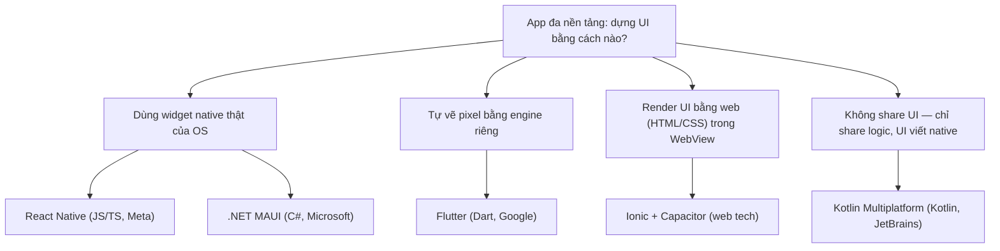
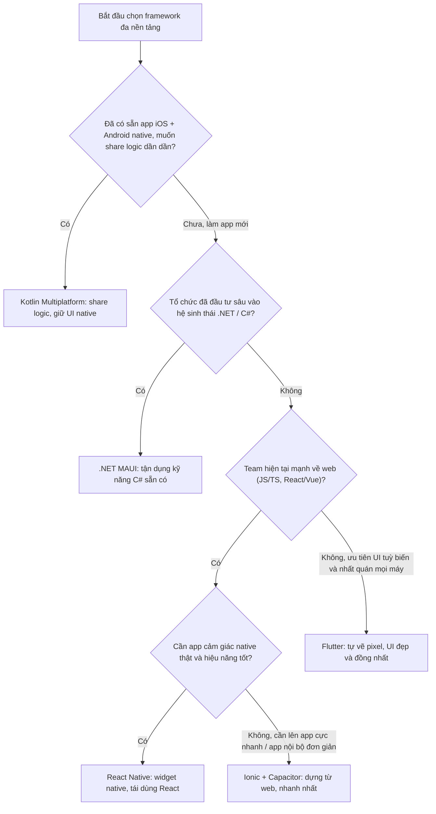

# Chọn framework — RN vs Flutter vs KMP vs MAUI vs Ionic

> **Tác giả:** Mr.Rom\
> **Phiên bản:** v1.0.0\
> **Tạo lúc:** 13/06/2026\
> **Cập nhật:** 13/06/2026\
> **Level:** Basic\
> **Tags:** cross-platform, mobile, react-native, flutter, kotlin-multiplatform, maui, ionic, decision-matrix\
> **Yêu cầu trước:** [Các cách tiếp cận](01_approaches-and-architecture.md)

> 🎯 *Bài trước bạn đã biết 3 cách tiếp cận đa nền tảng (WebView, Bridge, Compiled). Giờ ta đi vào câu hỏi thực tế nhất khi bắt đầu dự án Acme Shop: **chọn framework nào** trong 5 ứng viên lớn — React Native, Flutter, Kotlin Multiplatform, .NET MAUI, Ionic? Sau bài này bạn có một **decision matrix** và **cây quyết định** để chọn có cơ sở, không cảm tính.*

## 🎯 Sau bài này bạn sẽ

- [ ] Phân biệt được **5 framework chính**: React Native, Flutter, Kotlin Multiplatform, .NET MAUI, Ionic — ngôn ngữ, cách render, ai tạo ra
- [ ] Nắm **6 tiêu chí chọn framework**: kỹ năng team, hiệu năng, hệ sinh thái, mức truy cập native, độ trưởng thành, khả năng hiring
- [ ] Đọc và áp dụng được một **decision matrix** chấm điểm đa tiêu chí
- [ ] Đi theo **cây quyết định** để ra lựa chọn phù hợp ngữ cảnh
- [ ] Giải thích được vì sao "team web → RN/Ionic", "cần UI custom đẹp → Flutter", "đã có app native muốn share logic → KMP"
- [ ] Tránh các cạm bẫy chọn framework theo hype thay vì theo ngữ cảnh dự án

---

## Tình huống — Acme Shop đứng trước 5 cánh cửa

Sau khi đọc bài về các cách tiếp cận, sếp gật gù: *"OK, mình hiểu rồi — không nhét website vào WebView, mình muốn app mượt như native nhưng chỉ nuôi 1 team."* Rồi sếp hỏi tiếp câu khó hơn:

> *"Vậy cụ thể mình dùng cái gì? Mình nghe React Native, Flutter, rồi gần đây mấy bạn Android nhắc Kotlin Multiplatform, team .NET nội bộ thì đẩy MAUI, agency thì chào Ionic. Năm cái này khác nhau chỗ nào? Mình nên cược vào cái nào?"*

Đây là **một trong những quyết định tốn kém nhất** của cả dự án. Chọn sai không chỉ là "viết lại code" — nó là:

- 🔴 Tuyển nhầm người (tuyển team Dart rồi đổi sang RN → phải tuyển lại).
- 🔴 Khoá công nghệ nhiều năm (đổi framework giữa chừng ≈ viết lại app).
- 🔴 Trần hiệu năng hoặc trần tính năng đụng phải khi app đã lớn, rất khó gỡ.

Vấn đề là **không có framework "tốt nhất"** — chỉ có framework **hợp nhất với ngữ cảnh của bạn**. Một startup 3 dev biết React có lựa chọn rất khác một ngân hàng đã có sẵn app iOS Swift + Android Kotlin với 40 kỹ sư.

→ Bài này không bảo bạn "chọn X". Nó cho bạn **khung tư duy** để tự chọn đúng cho Acme Shop — và bảo vệ được lựa chọn đó trước sếp.

---

## 1️⃣ Gặp mặt 5 ứng viên

Trước khi so sánh, cần biết mỗi ứng viên *là ai*. Năm framework này đại diện cho **những triết lý khác hẳn nhau** về cách giải bài toán "1 codebase, nhiều nền tảng". Mình giới thiệu nhanh từng cái, kèm 1 ẩn dụ để bạn giữ mental model.

🪞 **Ẩn dụ tổng — chọn cách "xây nhà cho 2 mảnh đất" (iOS và Android):**
> Bạn có 2 mảnh đất hình dạng khác nhau và muốn xây nhà giống nhau trên cả hai. **Flutter** mang theo cả đội thợ + vật liệu riêng, san phẳng đất rồi xây y hệt nhau (tự vẽ pixel). **React Native** thuê thợ địa phương của từng vùng nhưng đưa chung một bản vẽ (dùng widget native thật). **Kotlin Multiplatform** chỉ làm sẵn phần móng + đường ống chung (logic), còn phần mặt tiền thì mỗi vùng tự làm theo phong cách của họ (UI native riêng). **.NET MAUI** giống RN nhưng bản vẽ viết bằng C#. **Ionic** dựng nhà bằng vật liệu web (HTML/CSS) rồi bọc lớp vỏ app bên ngoài.

**React Native (RN)** — *framework* của **Meta** (2015). Viết bằng **JavaScript/TypeScript** trong hệ sinh thái React. Render ra **widget native thật** của hệ điều hành. Mạnh nhất khi team đã biết React/web.

**Flutter** — của **Google** (2017). Viết bằng **Dart**. Không dùng widget native — nó **tự vẽ từng pixel** bằng engine đồ hoạ riêng (*Impeller*, trước đây là *Skia*). Đổi lại: UI **giống hệt nhau** trên mọi máy, đẹp và tuỳ biến mạnh.

**Kotlin Multiplatform (KMP)** — của **JetBrains** (ổn định 2023). Viết bằng **Kotlin**. Triết lý khác hẳn: **chỉ chia sẻ phần logic** (gọi API, business rules, database), còn **UI thì viết native riêng** cho từng nền tảng (SwiftUI cho iOS, Jetpack Compose cho Android). Có **Compose Multiplatform** nếu muốn share cả UI.

**.NET MAUI** — của **Microsoft** (2022, kế thừa Xamarin). Viết bằng **C#/XAML**. Render ra widget native qua các *handler*. Hợp nhất với các tổ chức **đã đầu tư sâu vào hệ .NET**.

**Ionic + Capacitor** — của **Ionic** (Capacitor ra 2019). Dùng **web tech thật** (HTML/CSS/JS, chạy được trong React/Vue/Angular). UI chạy trong một *WebView*, **Capacitor** là lớp cầu nối ra API native. Nhanh nhất để dựng nếu team thuần web.

> 💡 Khái niệm "5 ứng viên với 5 triết lý" còn trừu tượng. Sơ đồ dưới gom chúng theo **cách dựng UI** — đây là trục khác biệt cốt lõi nhất, quyết định phần lớn cảm giác app và hiệu năng.



→ Mấu chốt: RN và MAUI **mượn widget native**, Flutter **tự vẽ**, Ionic **dùng web**, còn KMP **không chơi trò share UI** mà chỉ share ruột logic. Hiểu được trục này, bạn đã nắm 80% lý do mỗi framework hợp với loại dự án nào.

---

## 2️⃣ 6 tiêu chí để chấm điểm

Năm framework nào cũng "làm được app 2 nền tảng" — nói chung chung thì cái nào cũng tốt. Để chọn có cơ sở, ta cần các **trục đo cụ thể**. Đây là 6 tiêu chí mà các team thật dùng để quyết định. Hiểu rõ từng cái trước, rồi mục 3 ta sẽ ghép thành bảng chấm điểm.

**1. Kỹ năng team sẵn có** — đây thường là tiêu chí *nặng ký nhất*. Một team 5 dev React sẽ năng suất với RN ngay tuần đầu, nhưng phải mất thời gian dài học Dart cho Flutter. Hỏi: *team mình đang giỏi ngôn ngữ/hệ sinh thái nào?*

**2. Hiệu năng cần** — không phải app nào cũng cần 120fps. App nghiệp vụ (giỏ hàng, danh sách, form) cần "đủ mượt"; game/đồ hoạ/animation nặng cần "tột cùng". Hỏi: *app mình thuộc nhóm nào?*

**3. Hệ sinh thái & thư viện** — khi cần thanh toán, bản đồ, push notification, bạn muốn có sẵn thư viện chín muồi hay phải tự viết cầu nối native? Hỏi: *thư viện mình cần đã có chưa, có được bảo trì không?*

**4. Mức truy cập native** — app dùng nhiều API phần cứng/OS đặc thù (Bluetooth tuỳ biến, camera nâng cao, widget màn hình khoá) hay chỉ vài API phổ thông? Hỏi: *mình cần đụng sâu vào native tới đâu?*

**5. Độ trưởng thành & ổn định** — framework đã production-grade nhiều năm, ít breaking change, có công ty lớn đứng sau lâu dài chưa? Hỏi: *mình có dám cược 3-5 năm vào nó không?*

**6. Khả năng hiring** — thị trường có nhiều dev biết framework này không, tuyển có dễ và rẻ không? Hỏi: *6 tháng nữa cần tuyển thêm, có tìm được người không?*

> [!IMPORTANT]
> Trong 6 tiêu chí, **kỹ năng team** và **hiring** thường quyết định nhiều hơn cả "hiệu năng" hay "độ đẹp". Lý do: một framework hơi kém tối ưu nhưng team thành thạo vẫn ra sản phẩm nhanh và chất lượng; còn framework tối ưu nhất mà cả team phải vừa học vừa làm thì dự án trễ và đầy bug. Đừng chọn theo benchmark, hãy chọn theo **đội ngũ thật của bạn**.

→ Sáu trục này không độc lập tuyệt đối, nhưng đủ để biến cuộc tranh luận cảm tính ("tôi thích Flutter") thành so sánh có điểm số. Giờ ta xếp chúng vào bảng.

---

## 3️⃣ Bảng so sánh đa tiêu chí

Đây là phần trung tâm của bài. Bảng dưới chấm 5 framework theo 6 tiêu chí, dùng thang đơn giản để bạn nhìn phát thấy ngay. Quy ước điểm: 🟢 mạnh / 🟡 trung bình / 🔴 yếu (so tương đối giữa 5 framework, không phải điểm tuyệt đối). Đọc theo **hàng** để hiểu 1 tiêu chí, theo **cột** để hiểu chân dung 1 framework.

| Tiêu chí | **React Native** | **Flutter** | **Kotlin Multiplatform** | **.NET MAUI** | **Ionic + Capacitor** |
|---|---|---|---|---|---|
| Ngôn ngữ | JavaScript/TypeScript | Dart | Kotlin | C#/XAML | HTML/CSS/JS (React/Vue/Angular) |
| Tạo bởi | Meta (2015) | Google (2017) | JetBrains (2023 ổn định) | Microsoft (2022) | Ionic (Capacitor 2019) |
| Cách render UI | Widget native thật | Tự vẽ pixel (Impeller) | UI native riêng / Compose MP | Widget native qua handler | Web UI trong WebView |
| 1. Tận dụng kỹ năng team web | 🟢 Rất cao (biết React là gần xong) | 🔴 Phải học Dart | 🔴 Phải học Kotlin | 🔴 Phải học C# | 🟢 Cao nhất (web thuần) |
| 2. Hiệu năng | 🟢 Rất tốt | 🟢 Rất tốt | 🟢 Native (UI native thật) | 🟡 Tốt | 🟡 Khá (giới hạn WebView) |
| 3. Hệ sinh thái thư viện | 🟢 Khổng lồ (npm + Expo) | 🟢 Lớn, lớn nhanh (pub.dev) | 🟡 Đang lớn, còn mỏng | 🟡 Trung bình | 🟢 Dùng được cả npm web |
| 4. Mức truy cập native sẵn | 🟢 Rất nhiều thư viện cầu nối | 🟢 Nhiều, plugin chính chủ | 🟢 Trực tiếp (gọi API native) | 🟡 Khá | 🟡 Qua Capacitor plugin |
| 5. Độ trưởng thành | 🟢 Chín, dùng rộng | 🟢 Chín, dùng rộng | 🟡 Trẻ hơn nhưng ổn định nhanh | 🟡 Kế thừa Xamarin, đang ổn định | 🟢 Chín (Capacitor) |
| 6. Khả năng hiring | 🟢 Rất dễ (dev JS đông) | 🟡 Khá, đang tăng | 🔴 Hẹp (dev Kotlin mobile) | 🟡 Có nếu ở môi trường .NET | 🟢 Dễ (dev web đông) |
| Điểm mạnh nổi bật | Tái dùng React, share code cao | UI nhất quán, đẹp, tuỳ biến mạnh | Share logic + UI 100% native | Hợp hệ sinh thái .NET/enterprise | Lên app cực nhanh từ web |
| Điểm yếu nổi bật | UI phụ thuộc thư viện cộng đồng | Phải học Dart, không kế thừa "chất" OS | UI viết 2 lần (nếu không dùng Compose MP) | Cộng đồng nhỏ hơn, ít người Việt dùng | Cảm giác kém native, hiệu năng trần thấp hơn |

> [!NOTE]
> Bảng dùng thang 🟢🟡🔴 *tương đối* để dễ nhìn. Trong dự án thật, bạn nên thay bằng điểm số (vd 1-5) và **gắn trọng số** cho từng tiêu chí theo ưu tiên của mình — mục 4 sẽ chỉ cách làm decision matrix có trọng số.

Vài điểm cần đọc kỹ trong bảng:

- **Hàng "kỹ năng team web"**: RN và Ionic xanh vì cùng hệ web; ba cái còn lại đỏ vì buộc học ngôn ngữ mới. Đây là lý do team web hay rơi vào RN hoặc Ionic.
- **Hàng "hiệu năng"**: KMP xanh đậm nhất về bản chất — vì UI là native thật 100%, không qua lớp trung gian nào. Ionic vàng vì UI chạy trong WebView, trần thấp hơn cho animation phức tạp.
- **Hàng "hiring"**: KMP đỏ không phải vì công nghệ kém, mà vì **thị trường dev biết KMP còn hẹp** — đây là rủi ro vận hành thật, đừng bỏ qua.

→ Một bảng đẹp vẫn chưa ra quyết định — vì mỗi dự án **coi trọng tiêu chí khác nhau**. Acme Shop coi "kỹ năng team" nặng gấp đôi "độ đẹp UI"; một studio game thì ngược lại. Để biến bảng thành quyết định, ta cần **decision matrix có trọng số**.

---

## 4️⃣ Decision matrix — biến cảm tính thành điểm số

Decision matrix (ma trận quyết định) là cách chấm điểm có hệ thống để **so sánh táo với táo**. Ý tưởng đơn giản:

1. Liệt kê các tiêu chí (ta đã có 6 ở mục 2).
2. Gán **trọng số** cho mỗi tiêu chí theo mức quan trọng *với dự án của bạn* (tổng = 100%).
3. Chấm mỗi framework theo từng tiêu chí (vd thang 1-5).
4. Nhân điểm × trọng số, cộng lại → framework điểm cao nhất là ứng viên hàng đầu.

Để cụ thể, mình điền matrix theo **đúng ngữ cảnh Acme Shop**: app thương mại điện tử, team hiện có 4 dev biết React (web), cần ra cả 2 store trong ngân sách hợp lý, UI quan trọng nhưng không cần animation game. Với hồ sơ đó, trọng số được đặt như sau (kỹ năng team + hiring chiếm phần lớn):

| Tiêu chí | Trọng số | React Native | Flutter | KMP | MAUI | Ionic |
|---|---|---|---|---|---|---|
| 1. Kỹ năng team sẵn có | 30% | 5 | 2 | 2 | 1 | 5 |
| 2. Hiệu năng cần | 15% | 4 | 5 | 5 | 4 | 3 |
| 3. Hệ sinh thái thư viện | 15% | 5 | 4 | 3 | 3 | 4 |
| 4. Mức truy cập native | 10% | 4 | 4 | 5 | 3 | 3 |
| 5. Độ trưởng thành | 10% | 5 | 5 | 3 | 3 | 4 |
| 6. Khả năng hiring | 20% | 5 | 3 | 2 | 2 | 5 |
| **Điểm có trọng số** | **100%** | **4.75** | **3.45** | **3.00** | **2.35** | **4.25** |

Cách đọc dòng cuối: với mỗi framework, lấy điểm từng tiêu chí nhân trọng số rồi cộng. Ví dụ React Native = 5×0.30 + 4×0.15 + 5×0.15 + 4×0.10 + 5×0.10 + 5×0.20 = **4.75**. Cách tính giống hệt cho các cột còn lại.

→ Với hồ sơ Acme Shop, **React Native (4.75)** và **Ionic (4.25)** dẫn đầu — đúng như trực giác "team web", vì hai tiêu chí trọng số cao nhất (kỹ năng team 30% + hiring 20% = 50%) đều nghiêng về hệ web. RN nhỉnh hơn Ionic ở hiệu năng và truy cập native, nên về nhất.

> [!WARNING]
> Đừng tôn sùng con số. Decision matrix **chỉ tốt bằng trọng số bạn đặt**. Nếu Acme Shop bỗng cần một app có animation cực kỳ tuỳ biến (vd app khuyến mãi tương tác như game nhỏ), bạn phải tăng trọng số "hiệu năng/đẹp" lên — và Flutter có thể vượt lên. Matrix là công cụ *kỷ luật hoá* suy nghĩ, không phải máy ra quyết định thay bạn.

**Thử lại với hồ sơ khác để thấy matrix "biết đổi ý":** giả sử thay vì team web, bạn là một team có sẵn **app iOS Swift + Android Kotlin** đang chạy, muốn dần dần share phần logic chung mà không đập đi xây lại. Lúc này trọng số đổi: "tận dụng codebase native sẵn có" và "truy cập native" lên rất cao, "kỹ năng team web" gần như bằng 0. Với hồ sơ đó, **KMP vọt lên đầu** — vì nó cho phép chèn dần module Kotlin chung vào 2 app native mà không cần viết lại UI. Cùng một bộ tiêu chí, đổi trọng số → đổi người thắng. Đó chính là sức mạnh của matrix.

---

## 5️⃣ Cây quyết định — đi theo câu hỏi để ra lựa chọn

Decision matrix chính xác nhưng tốn công điền. Khi cần quyết nhanh hoặc tư vấn cho người khác, một **cây quyết định** (decision tree) thường đủ. Nó hỏi vài câu mấu chốt theo thứ tự ưu tiên và dẫn bạn tới ứng viên hợp lý. Lead-in trước sơ đồ: cây dưới ưu tiên hỏi **ràng buộc cứng trước** (đã có app native chưa? team biết gì?) rồi mới tới sở thích (UI đẹp tới mức nào?).



→ Cây này không phải luật cứng — nó là **đường tắt cho 80% trường hợp phổ biến**. Lưu ý nó hỏi "đã có app native chưa" *đầu tiên*, vì đó là ràng buộc nặng nhất: nếu có, KMP gần như luôn là câu trả lời hợp lý nhất (chèn dần, rủi ro thấp); còn các nhánh sau mới phân theo kỹ năng team và mức ưu tiên UI.

---

## 6️⃣ Khuyến nghị theo ngữ cảnh — và chốt cho Acme Shop

Gom matrix + cây quyết định lại thành các "công thức" dễ nhớ theo loại dự án. Đây là những kết luận hay gặp nhất trong thực tế, không phải luật bất biến:

| Ngữ cảnh dự án | Khuyến nghị | Vì sao |
|---|---|---|
| Team mạnh **web/React**, app nghiệp vụ (e-commerce, social, nội bộ) | **React Native** | Tái dùng kỹ năng, hệ sinh thái lớn, hiring dễ |
| Team thuần web, cần **lên app cực nhanh**, app nội dung/nội bộ đơn giản | **Ionic + Capacitor** | Dùng thẳng kỹ năng web, dựng nhanh nhất |
| Cần **UI tuỳ biến cực đẹp**, animation phức tạp, brand đồng nhất mọi máy | **Flutter** | Tự vẽ pixel → kiểm soát từng điểm ảnh |
| **Đã có** app iOS + Android native, muốn **share logic** dần | **Kotlin Multiplatform** | Chèn module chung, giữ nguyên UI native |
| Tổ chức **enterprise đầu tư sâu .NET/C#** | **.NET MAUI** | Tận dụng kỹ năng + công cụ Microsoft sẵn có |

Ba câu thần chú đáng nhớ (đề bài đã gợi, và matrix cũng xác nhận):

- **Team web → React Native hoặc Ionic.** (Cùng hệ JS, không phải học ngôn ngữ mới.)
- **Cần UI custom đẹp → Flutter.** (Tự vẽ pixel cho bạn toàn quyền thẩm mỹ.)
- **Đã có app native, muốn share logic → Kotlin Multiplatform.** (Không đập đi xây lại UI.)

**Chốt cho Acme Shop:** team có 4 dev React, app thương mại điện tử nghiệp vụ, cần 2 store với ngân sách hợp lý, UI quan trọng nhưng không phải game. Cả decision matrix (RN 4.75 cao nhất) lẫn cây quyết định (team web → cần cảm giác native → RN) đều chỉ về **React Native**. Ionic là phương án dự phòng nếu cần MVP siêu nhanh và app rất đơn giản; Flutter chỉ đáng cân nhắc nếu yêu cầu UI/animation tăng đột biến về sau.

> 📖 Lựa chọn framework xong mới là khởi đầu. Bài tiếp theo đi vào câu hỏi vận hành: **chia sẻ code và design system** như thế nào cho hiệu quả khi đã chốt framework — phần nào nên share, phần nào để riêng từng nền tảng.

---

## 💡 Cạm bẫy thường gặp & Best practice

### ❌ Cạm bẫy: chọn framework theo hype thay vì theo ngữ cảnh team

- **Triệu chứng**: chọn Flutter vì "đang hot trên Twitter/YouTube" trong khi cả team chỉ biết JavaScript → 2 tháng đầu loay hoay học Dart, tiến độ trễ, code đầy bug do chưa quen ngôn ngữ.
- **Nguyên nhân**: lấy "framework tốt nhất nói chung" làm tiêu chí, bỏ qua tiêu chí nặng ký nhất là **kỹ năng team sẵn có**.
- **Cách tránh**: luôn điền decision matrix với trọng số thật của *team bạn*. Kỹ năng team + hiring thường chiếm ≥ 40% tổng trọng số. Hype không có trong bảng.

### ❌ Cạm bẫy: tưởng "share code đa nền tảng" nghĩa là 100% chung

- **Triệu chứng**: hứa với sếp "viết 1 lần chạy mọi nơi 100%", rồi vỡ mộng khi gặp khác biệt nền tảng (icon back iOS vs Android, permission flow, thanh toán in-app khác nhau).
- **Nguyên nhân**: hiểu sai bản chất — kể cả framework share UI cao nhất vẫn có **phần riêng từng nền tảng**; KMP thì cố tình *chỉ* share logic.
- **Cách tránh**: kỳ vọng đúng mức share code theo từng framework (RN/Flutter thường 80-95% UI+logic; KMP chủ yếu share logic). Bài kế về sharing code & design system sẽ làm rõ ranh giới này.

### ✅ Best practice: chấm điểm có trọng số trước khi tranh luận

- **Vì sao**: cuộc họp "RN hay Flutter" dễ thành tranh cãi cảm tính ai cũng bảo vệ thứ mình thích. Một decision matrix điền chung biến nó thành thảo luận về *trọng số* (cái thật sự cần thống nhất) thay vì *sở thích*.
- **Cách áp dụng**: trước buổi quyết, gửi trước bảng 6 tiêu chí, để mọi người đề xuất trọng số. Khi cả nhóm đồng ý trọng số, điểm số gần như tự ra kết quả — và ai cũng "buy-in".

### ✅ Best practice: tính cả chi phí hiring và bảo trì dài hạn

- **Vì sao**: framework rẻ lúc dựng có thể đắt lúc bảo trì — vd KMP mạnh kỹ thuật nhưng thị trường dev hẹp, 6 tháng sau cần scale team lại khó tuyển.
- **Cách áp dụng**: đưa "khả năng hiring" thành tiêu chí có trọng số rõ ràng (gợi ý ≥ 15-20% với startup cần lớn nhanh), không coi nó là yếu tố phụ.

---

## 🧠 Tự kiểm tra (Self-check)

**Q1.** Trục khác biệt cốt lõi nhất giữa 5 framework là gì? Mỗi framework đứng ở đâu trên trục đó?

<details>
<summary>💡 Đáp án</summary>

Trục cốt lõi là **cách dựng UI**:
- **Widget native thật**: React Native (JS/TS) và .NET MAUI (C#) — mượn widget của OS.
- **Tự vẽ pixel**: Flutter (Dart) — engine riêng (Impeller) vẽ từng điểm ảnh, UI giống hệt mọi máy.
- **Web trong WebView**: Ionic + Capacitor — UI là HTML/CSS chạy trong WebView, Capacitor cầu nối ra native.
- **Không share UI, chỉ share logic**: Kotlin Multiplatform — UI viết native riêng (SwiftUI/Compose), chỉ phần logic dùng chung.

Hiểu trục này là nắm được phần lớn lý do mỗi framework hợp loại dự án nào.

</details>

**Q2.** Vì sao "kỹ năng team sẵn có" thường là tiêu chí nặng ký nhất, hơn cả "hiệu năng"?

<details>
<summary>💡 Đáp án</summary>

Vì một framework hơi kém tối ưu nhưng team thành thạo vẫn ra sản phẩm nhanh, đúng hạn, ít bug; còn framework tối ưu nhất mà cả team phải vừa học vừa làm thì dự án trễ và đầy lỗi do chưa quen ngôn ngữ/hệ sinh thái. Phần lớn app nghiệp vụ (e-commerce, social, nội bộ) cũng chỉ cần "đủ mượt", không cần hiệu năng tột cùng — nên lợi thế hiệu năng của một framework thường không bù được chi phí team phải học lại từ đầu.

</details>

**Q3.** Decision matrix của Acme Shop cho RN 4.75 điểm cao nhất. Nếu yêu cầu đổi thành "app cần animation tương tác cực kỳ tuỳ biến giống game nhỏ" thì kết quả có thể đổi thế nào? Vì sao?

<details>
<summary>💡 Đáp án</summary>

Khi yêu cầu đổi, ta phải **tăng trọng số cho hiệu năng/đẹp UI** và giảm trọng số các tiêu chí khác. Lúc đó **Flutter** có thể vượt lên, vì nó tự vẽ từng pixel → kiểm soát animation và thẩm mỹ mạnh nhất, đồng nhất trên mọi máy. Bài học: decision matrix chỉ tốt bằng trọng số bạn đặt — đổi trọng số (theo yêu cầu thật của dự án) có thể đổi cả người thắng. Matrix kỷ luật hoá suy nghĩ chứ không quyết định thay bạn.

</details>

**Q4.** Một team đã có app iOS (Swift) và Android (Kotlin) đang chạy, muốn giảm việc viết logic 2 lần nhưng không muốn đập đi xây lại UI. Framework nào hợp nhất? Vì sao?

<details>
<summary>💡 Đáp án</summary>

**Kotlin Multiplatform (KMP).** Triết lý của KMP là **chỉ share phần logic** (gọi API, business rules, lưu trữ), còn UI vẫn viết native riêng (SwiftUI cho iOS, Jetpack Compose cho Android). Team có thể chèn dần module Kotlin dùng chung vào 2 app native sẵn có — rủi ro thấp, không phải viết lại UI. Đây đúng tình huống "đã có app native, muốn share logic → KMP". Chọn RN/Flutter ở đây sẽ buộc viết lại toàn bộ UI, tốn kém và rủi ro hơn nhiều.

</details>

**Q5.** Tại sao Kotlin Multiplatform bị chấm thấp ở tiêu chí "hiring" dù nó mạnh về kỹ thuật? Điều đó dạy ta gì khi chọn framework?

<details>
<summary>💡 Đáp án</summary>

KMP bị chấm thấp ở hiring vì **thị trường dev biết KMP còn hẹp** so với JS (RN/Ionic) hay Dart (Flutter) — không phải vì công nghệ kém. Bài học: chọn framework không chỉ là quyết định kỹ thuật mà còn là **quyết định vận hành dài hạn**. Một framework khó tuyển người sẽ khiến việc scale team, thay người nghỉ việc, hay bảo trì sau này tốn kém — nên "khả năng hiring" phải là tiêu chí có trọng số rõ ràng, không phải yếu tố phụ.

</details>

---

## ⚡ Tra cứu nhanh (Cheatsheet)

### 5 framework — nhớ nhanh

```
React Native  = JS/TS, Meta,      widget native thật   → team web, app nghiệp vụ
Flutter       = Dart, Google,     tự vẽ pixel          → UI custom đẹp, animation
Kotlin MP     = Kotlin, JetBrains share logic, UI native → đã có app native
.NET MAUI     = C#, Microsoft,    widget native        → tổ chức .NET/enterprise
Ionic/Capacitor = web tech,       WebView + cầu nối     → web thuần, lên app nhanh
```

### 3 câu thần chú chọn nhanh

```
Team web                       → React Native / Ionic
Cần UI custom đẹp              → Flutter
Đã có app native, share logic  → Kotlin Multiplatform
```

### Công thức decision matrix

```
1. Liệt kê tiêu chí (6 cái: team, hiệu năng, thư viện, native, trưởng thành, hiring)
2. Gán trọng số theo dự án (tổng = 100%)
3. Chấm mỗi framework từng tiêu chí (1-5)
4. Điểm = Σ (điểm × trọng số) → cao nhất là ứng viên hàng đầu
```

### 6 tiêu chí — câu hỏi tự hỏi

```
1. Kỹ năng team   → team mình giỏi ngôn ngữ/hệ nào?
2. Hiệu năng      → app nghiệp vụ "đủ mượt" hay game "tột cùng"?
3. Hệ sinh thái   → thư viện mình cần đã có & được bảo trì chưa?
4. Truy cập native→ cần đụng sâu API phần cứng/OS tới đâu?
5. Trưởng thành   → dám cược 3-5 năm vào nó không?
6. Hiring         → 6 tháng nữa tuyển thêm có dễ không?
```

---

## 📚 Từ Điển Thuật Ngữ (Glossary)

| EN | VN | Giải thích |
|---|---|---|
| React Native (RN) | React Native | Framework Meta (2015), viết app bằng JS/TS hệ React, render widget native thật |
| Flutter | Flutter | Framework Google (2017), viết bằng Dart, tự vẽ pixel bằng engine riêng |
| Kotlin Multiplatform (KMP) | Kotlin đa nền tảng | Của JetBrains, share phần logic bằng Kotlin, UI viết native riêng từng nền tảng |
| Compose Multiplatform | Compose đa nền tảng | Mở rộng KMP cho phép share cả UI (dựa trên Jetpack Compose) |
| .NET MAUI | .NET MAUI | Framework Microsoft (kế thừa Xamarin), viết bằng C#/XAML, render widget native |
| Ionic | Ionic | Framework UI dùng web tech (HTML/CSS/JS) để dựng app mobile |
| Capacitor | Capacitor | Lớp cầu nối của Ionic giúp UI web (chạy trong WebView) gọi được API native |
| WebView | WebView | Trình duyệt nhúng trong app, nơi Ionic render UI web |
| Decision matrix | Ma trận quyết định | Bảng chấm điểm có trọng số để so sánh nhiều lựa chọn theo nhiều tiêu chí |
| Decision tree | Cây quyết định | Sơ đồ hỏi-đáp theo nhánh để dẫn tới lựa chọn phù hợp |
| Trọng số (weight) | Trọng số | Mức độ quan trọng gán cho mỗi tiêu chí, tổng = 100% |
| Hiring | Tuyển dụng | Khả năng tìm/tuyển dev biết framework trên thị trường |
| Impeller | Impeller | Engine render đồ hoạ thế hệ mới của Flutter (kế thừa Skia) |
| SwiftUI | SwiftUI | Framework dựng UI native cho iOS bằng Swift |
| Jetpack Compose | Jetpack Compose | Framework dựng UI native cho Android bằng Kotlin |

---

## 🔗 Liên kết & Tài nguyên

⬅️ **Bài trước:** [Các cách tiếp cận — WebView, Bridge, Compiled](01_approaches-and-architecture.md)\
➡️ **Bài tiếp theo:** [Chia sẻ code & Design System đa nền tảng](03_sharing-code-and-design-system.md)\
↑ **Về cụm:** [cross-platform-concepts — README cụm](../../README.md)

### 🧭 Định hướng lộ trình học

- [Các cách tiếp cận — WebView, Bridge, Compiled](01_approaches-and-architecture.md) — yêu cầu trước của bài này, nền tảng để hiểu vì sao mỗi framework render khác nhau
- [Chia sẻ code & Design System đa nền tảng](03_sharing-code-and-design-system.md) — bài kế: sau khi chốt framework thì share code/UI ra sao
- [Khi nào cross-platform, khi nào native thuần?](04_when-cross-platform-vs-native.md) — bước lùi một bước: có nên dùng cross-platform không

### 🧩 Các chủ đề có thể bạn quan tâm

- [React Native là gì? — Viết app native bằng React](../../../react-native/lessons/01_basic/00_what-is-react-native.md) — đi sâu ứng viên React Native nếu Acme Shop chốt RN
- [Tổng quan 08_mobile](../../../00_overview.md) — bức tranh toàn module mobile (native, cross-platform, kiến trúc)

### 🌐 Tài nguyên tham khảo khác

- [React Native docs (chính thức)](https://reactnative.dev/) — tài liệu gốc của RN
- [Flutter docs (chính thức)](https://docs.flutter.dev/) — tài liệu gốc của Flutter, có mục so sánh
- [Kotlin Multiplatform docs (JetBrains)](https://www.jetbrains.com/kotlin-multiplatform/) — giới thiệu KMP và share logic
- [.NET MAUI docs (Microsoft)](https://learn.microsoft.com/dotnet/maui/) — tài liệu gốc MAUI
- [Ionic + Capacitor docs](https://capacitorjs.com/docs) — cách Capacitor cầu nối web ↔ native

---

> 🎯 *Sau bài này bạn đã có khung tư duy chọn framework: 5 ứng viên, 6 tiêu chí, một decision matrix có trọng số và một cây quyết định. Acme Shop nghiêng về React Native. Bài kế tiếp đi sâu **chia sẻ code & design system** — phần nào share được, phần nào để riêng từng nền tảng.*

---

## 📌 Nhật ký thay đổi (Changelog)

- **v1.0.0 (13/06/2026)** — Bản đầu tiên. Cluster `cross-platform-concepts/` lesson 2/5. Cover: giới thiệu 5 framework (React Native, Flutter, Kotlin Multiplatform, .NET MAUI, Ionic+Capacitor) theo trục cách-dựng-UI + 6 tiêu chí chọn (kỹ năng team, hiệu năng, hệ sinh thái, truy cập native, độ trưởng thành, hiring) + bảng so sánh đa tiêu chí 🟢🟡🔴 + decision matrix có trọng số cho Acme Shop (RN 4.75) + cây quyết định mermaid + khuyến nghị theo ngữ cảnh (team web→RN/Ionic, UI đẹp→Flutter, có app native→KMP, enterprise .NET→MAUI). Kèm 2 sơ đồ mermaid (phân loại theo render + cây quyết định).
