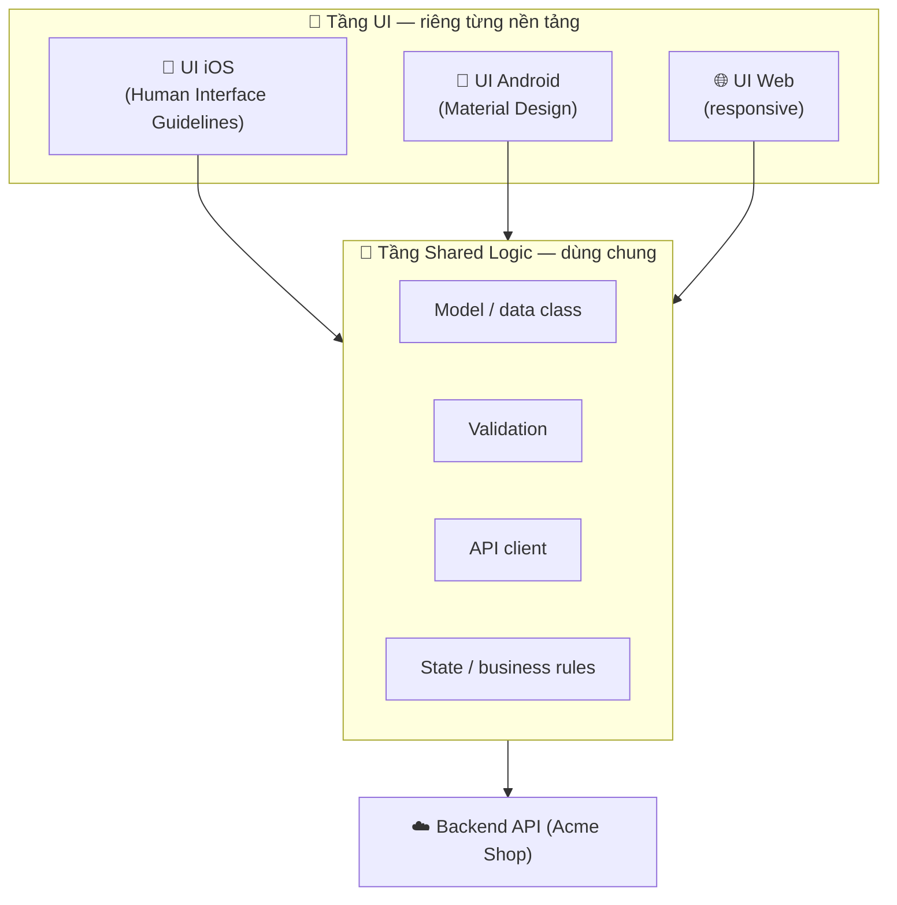

# Chia sẻ code & Design System đa nền tảng

> **Tác giả:** Mr.Rom\
> **Phiên bản:** v1.0.0\
> **Tạo lúc:** 13/06/2026\
> **Cập nhật:** 13/06/2026\
> **Level:** Basic\
> **Tags:** cross-platform, mobile, code-sharing, design-system, design-tokens, kmp, monorepo, architecture\
> **Yêu cầu trước:** [Chọn framework — RN vs Flutter vs KMP vs MAUI vs Ionic](02_choosing-a-framework.md)

> 🎯 *Đã chọn được framework rồi, câu hỏi tiếp theo là: **chia sẻ tới đâu mới khôn?** Bài này dạy bạn vẽ ranh giới giữa phần code share được (business logic) và phần nên để riêng từng nền tảng (UI), hiểu mô hình KMP, tổ chức monorepo, và dùng **design tokens** để giao diện iOS + Android + web nhất quán mà vẫn tôn trọng phong cách mỗi nền tảng.*

## 🎯 Sau bài này bạn sẽ

- [ ] Vẽ được **ranh giới chia sẻ code**: cái gì nên share (model, validation, API client, state) vs cái gì nên để platform-specific (UI)
- [ ] Hiểu mô hình **KMP (Kotlin Multiplatform)** — share logic bằng Kotlin, UI native mỗi bên
- [ ] Tổ chức được một **monorepo** module hoá cho app đa nền tảng
- [ ] Giải thích **design system** và **design tokens** (màu/spacing/typography) dùng chung iOS + Android + web
- [ ] Xử lý khác biệt nền tảng: **Material vs Human Interface Guidelines**, navigation pattern, nút back

---

## Tình huống — Acme Shop muốn "viết 1 lần, chạy mọi nơi". Có thật vậy không?

Ở bài trước bạn đã chốt framework cho app Acme Shop. Sếp vui lắm, gọi bạn vào và nói một câu nghe rất hợp lý:

> *"Vậy là giờ mình viết 1 lần là chạy được cả iOS, Android, lại còn dùng chung với web nữa đúng không? Tiết kiệm gấp ba!"*

Bạn gật đầu nửa vời, vì trong đầu đã thấy vài chỗ gợn:

- 🤔 Logic tính tiền giỏ hàng (cộng giá, áp mã giảm giá, tính phí ship) — cái này **chắc chắn nên dùng chung**. Viết 3 lần thì 3 lần sai khác nhau.
- 🤔 Nhưng cái **nút back**? Trên iOS người ta vuốt từ mép trái để quay lại, có mũi tên `<` ở góc. Trên Android có nút back hệ thống (hoặc cử chỉ vuốt từ mép). Ép iOS dùng kiểu Android → người dùng iOS thấy "sai sai".
- 🤔 Màu thương hiệu Acme Shop là một màu cam cụ thể. Nếu web để `#F97316`, app iOS để `#F87316` (gõ nhầm), app Android lại `#FF8800` (designer khác) → ba sắc cam lệch nhau, brand trông cẩu thả.
- 🤔 Form đăng ký: luật "email phải hợp lệ, mật khẩu ≥ 8 ký tự" — nếu mỗi nền tảng tự viết một bản, sớm muộn cũng có chỗ kiểm tra lỏng hơn chỗ khác → lỗ hổng.

Bạn nhận ra: **"viết 1 lần chạy mọi nơi" không phải là tất-cả-hoặc-không-gì.** Có phần nên dùng chung tới mức tối đa, có phần *cố tình* để riêng vì để riêng mới đúng. Vấn đề không phải "share được bao nhiêu phần trăm", mà là **share đúng chỗ**.

→ Bài này trả lời 2 câu hỏi cốt lõi: (1) **Code** nào nên dùng chung, code nào nên tách? (2) **Giao diện** làm sao nhất quán mà vẫn native? Đây là kiến thức áp dụng cho *mọi* framework đa nền tảng, không riêng cái nào.

---

## 1️⃣ Hai loại "code" trong một app — và vì sao chúng khác nhau

Trước khi nói "share hay không share", ta phải tách app ra làm hai phần đã, vì hai phần này có bản chất khác hẳn nhau.

Một app mobile, bất kể framework gì, luôn gồm 2 tầng:

- **Business logic (logic nghiệp vụ)** — phần "bộ não". Tính tiền, validate dữ liệu, gọi API, lưu/đọc cache, quản lý trạng thái đăng nhập. Phần này **không quan tâm màn hình trông như nào** — nó chỉ xử lý dữ liệu. Tính tổng giỏ hàng ra `350.000đ` thì trên iOS, Android hay web đều phải ra đúng `350.000đ`.
- **UI (giao diện người dùng)** — phần "bộ mặt". Nút bấm, danh sách cuộn, animation, cách chuyển màn hình, kiểu chữ, khoảng cách. Phần này **rất quan tâm nền tảng** — vì mỗi nền tảng có "ngôn ngữ thiết kế" và thói quen người dùng riêng.

🪞 **Ẩn dụ — nhà hàng có chung một bếp, nhiều phòng ăn:**
> Hãy hình dung Acme Shop là một chuỗi nhà hàng. **Bếp trung tâm** (business logic) nấu theo *đúng một* công thức — món phở phải ra đúng vị đó dù phục vụ ở đâu. Nhưng **phòng ăn** (UI) thì mỗi chi nhánh trang trí theo gu khách địa phương: chi nhánh trong khu Nhật bày kiểu Nhật, chi nhánh kiểu Âu bày kiểu Âu. Khách vẫn ăn đúng món, nhưng *cảm giác* phòng ăn hợp với họ. Chia sẻ code chính là: **một bếp chung, nhiều phòng ăn riêng.**

Vì sao tách như vậy lại quan trọng? Vì hai phần này hỏng theo hai kiểu khác nhau:

- Business logic mà mỗi nền tảng viết một bản → **lệch nhau về kết quả** (iOS tính ship 30k, Android tính 25k). Đây là bug nghiêm trọng, khó phát hiện.
- UI mà ép giống hệt nhau trên mọi nền tảng → **đúng pixel nhưng sai cảm giác** (người dùng iOS thấy app "lạ", không quen tay). Đây không phải bug, nhưng làm app kém chuyên nghiệp.

→ Quy tắc nền tảng của cả bài: **share tối đa business logic, tách UI theo nền tảng ở mức cần thiết.** Phần còn lại của bài chỉ là triển khai quy tắc này theo nhiều cách.

---

## 2️⃣ Vẽ ranh giới: cái gì share, cái gì để riêng?

Nói "share business logic" thì dễ, nhưng lúc code thật bạn sẽ gặp những thứ nằm giữa — vừa giống logic vừa dính tới UI. Bảng dưới là **decision matrix** giúp bạn quyết nhanh từng loại code thuộc bên nào. Cột cuối giải thích lý do, vì hiểu lý do quan trọng hơn học thuộc:

| Loại code | Nên share? | Vì sao |
|---|---|---|
| **Model / data class** (Product, Order, User) | ✅ Share | Cấu trúc dữ liệu phải giống nhau mọi nơi, nếu không API sẽ parse lệch |
| **Validation** (email hợp lệ, mật khẩu ≥ 8 ký tự) | ✅ Share | Một bộ luật duy nhất → không có chỗ lỏng chỗ chặt → bớt lỗ hổng |
| **API client** (gọi endpoint, parse JSON, xử lý lỗi mạng) | ✅ Share | URL, header, format response giống nhau; viết lại = nhân đôi bug |
| **Business rules** (tính tiền, áp mã giảm, tính phí ship) | ✅ Share | Kết quả phải *bằng nhau tuyệt đối* giữa các nền tảng |
| **State management** (giỏ hàng đang có gì, đã đăng nhập chưa) | ✅ Thường share | Trạng thái nghiệp vụ độc lập với cách hiển thị |
| **Component thuần hiển thị** (card sản phẩm, nút) | 🟡 Tuỳ | Share được nếu framework cho phép (RN/Flutter); với KMP thì viết native mỗi bên |
| **Navigation pattern** (cách chuyển màn hình, nút back) | ❌ Để riêng | iOS và Android có thói quen điều hướng khác nhau (xem mục 6) |
| **Icon, animation đặc thù OS** | ❌ Để riêng | Mỗi OS có bộ icon hệ thống và "chất" chuyển động riêng |
| **Tích hợp phần cứng đặc thù** (Face ID iOS, một số sensor) | ❌ Để riêng | API native riêng từng nền tảng |

Đọc bảng theo chiều dọc, bạn sẽ thấy một quy luật: **càng gần dữ liệu thì càng nên share, càng gần ngón tay người dùng thì càng nên để riêng.** Model ở trong cùng → share 100%. Navigation/icon ở ngoài cùng (người dùng chạm vào) → để riêng.

Sơ đồ dưới đây là phần trừu tượng nhất của bài — nó vẽ ra **kiến trúc tầng** mà *mọi* chiến lược chia sẻ code đều quy về: một tầng logic dùng chung ở dưới, các tầng UI riêng từng nền tảng ở trên. Hãy nhìn kỹ ranh giới ngang giữa hai vùng:



→ Mấu chốt của sơ đồ: **ba khối UI ở trên đều cắm xuống cùng một tầng logic ở giữa.** Đó là điều khiến giỏ hàng tính tiền giống nhau ở cả 3 nơi, trong khi mỗi nền tảng vẫn được tự do hiển thị theo phong cách riêng. Mọi framework (RN, Flutter, KMP...) chỉ khác nhau ở chỗ *ranh giới ngang đó nằm cao hay thấp* — share cả UI hay chỉ share logic.

---

## 3️⃣ Hai trường phái chia sẻ — và KMP đại diện cho trường phái "chỉ share logic"

Cùng quy tắc "share logic, tách UI", nhưng các framework thực thi theo 2 trường phái khác nhau ở chỗ: **đường ranh giới chia sẻ nằm cao tới đâu.**

**Trường phái A — share cả UI lẫn logic (RN, Flutter):** ranh giới nằm rất cao. Bạn viết UI một lần (bằng React hoặc Dart), framework render ra giao diện cho cả iOS lẫn Android. Share được nhiều nhất, nhưng UI là "chung" nên đôi khi chưa thật khớp chất từng nền tảng.

**Trường phái B — chỉ share logic, UI viết native từng bên (KMP):** ranh giới nằm thấp hơn. Bạn share phần "bộ não" (Kotlin), còn "bộ mặt" thì viết riêng bằng công cụ native chính chủ — SwiftUI cho iOS, Jetpack Compose cho Android. UI native 100%, đổi lại viết UI 2 lần.

Vì KMP là đại diện rõ ràng nhất của trường phái B (và đang rất phổ biến 2026), ta tìm hiểu kỹ nó như một *case study* về cách "chỉ share logic".

### KMP (Kotlin Multiplatform) là gì?

**Kotlin Multiplatform** (viết tắt **KMP**) — công nghệ của *JetBrains* (hãng làm IntelliJ, Android Studio) cho phép viết **business logic một lần bằng Kotlin**, rồi compile ra dạng dùng được trên iOS, Android, web, desktop. Điểm đặc trưng: **KMP không ép share UI.** UI mỗi nền tảng vẫn viết bằng công cụ native gốc.

🪞 **Ẩn dụ — quay lại nhà hàng:** KMP chính là mô hình "một bếp trung tâm, mỗi phòng ăn thuê kiến trúc sư địa phương riêng". Bếp (Kotlin logic) chung tuyệt đối; phòng ăn iOS do "kiến trúc sư SwiftUI" trang trí, phòng ăn Android do "kiến trúc sư Compose" trang trí — không ai bị ép theo gu người kia.

Cụ thể KMP chia code ra các tầng:

- **`commonMain`** — code Kotlin dùng chung mọi nền tảng (model, validation, API client, state). Đây là phần share.
- **`androidMain`** — code Kotlin chỉ cho Android (gọi API Android đặc thù nếu cần).
- **`iosMain`** — code Kotlin chỉ cho iOS, được compile thành framework để Swift gọi vào.
- **UI Android** — viết bằng *Jetpack Compose* (Kotlin), gọi xuống `commonMain`.
- **UI iOS** — viết bằng *SwiftUI* (Swift), gọi vào framework do KMP sinh ra.

> [!NOTE]
> Có một biến thể tên là **Compose Multiplatform** cho phép share *cả UI* bằng Jetpack Compose (kể cả trên iOS). Nó nâng ranh giới chia sẻ lên cao như trường phái A. Nhưng "KMP thuần" mà cộng đồng nhắc tới nhiều nhất vẫn là mô hình *share logic, UI native mỗi bên* — đó là điểm khác biệt cốt lõi bạn cần nhớ ở Basic.

Để thấy "share logic Kotlin" trông thế nào, đây là một validation viết một lần trong `commonMain` — cả iOS lẫn Android đều gọi đúng hàm này, nên luật kiểm tra không bao giờ lệch:

```kotlin
// commonMain/kotlin/com/acmeshop/validation/SignupValidator.kt
// Code này nằm ở commonMain → iOS và Android dùng CHUNG, không ai viết lại.

object SignupValidator {

    // 1. Kiểm tra email có đúng định dạng cơ bản không
    fun isValidEmail(email: String): Boolean {
        return Regex("^[^@\\s]+@[^@\\s]+\\.[^@\\s]+$").matches(email)
    }

    // 2. Mật khẩu phải tối thiểu 8 ký tự
    fun isValidPassword(password: String): Boolean {
        return password.length >= 8
    }
}
```

→ Một bộ luật duy nhất, hai nền tảng dùng chung. Nếu sau này đổi yêu cầu mật khẩu lên 10 ký tự, bạn sửa **một chỗ** — không có chuyện iOS chặt hơn Android. Đây chính là giá trị lớn nhất của việc share logic, áp dụng cho mọi framework chứ không riêng KMP.

Validation chỉ là một phần. "Share business logic" còn gồm **API client** và **state** — và đây mới là chỗ tiết kiệm nhiều nhất. API client là toàn bộ phần "nói chuyện với backend": dựng URL, gắn header xác thực, parse JSON, xử lý lỗi mạng. Nếu mỗi nền tảng tự viết, bạn sẽ có hai (hoặc ba) bản client dễ lệch nhau — iOS parse field `total_price`, Android lỡ gõ `totalPrice`, thế là Android luôn hiện giá 0đ. Đặt nó ở `commonMain`, cả hai cùng gọi một hàm:

```kotlin
// commonMain/kotlin/com/acmeshop/api/CartApi.kt
// API client dùng chung — iOS và Android gọi đúng hàm này để lấy giỏ hàng.

class CartApi(private val client: HttpClient) {

    suspend fun fetchCart(userId: String): Cart {
        // 1. Gọi endpoint giỏ hàng của Acme Shop
        val response = client.get("https://api.acmeshop.vn/cart/$userId")

        // 2. Parse JSON thành model Cart dùng chung (model cũng ở commonMain)
        return response.body<Cart>()
    }
}
```

→ Vì `Cart` là model dùng chung và hàm parse cũng dùng chung, không có chỗ cho "iOS hiểu một kiểu, Android hiểu kiểu khác". Đây là điều quan trọng nhất khi share logic: **không chỉ tiết kiệm công viết, mà còn xoá luôn cả một lớp bug "lệch nền tảng".**

So sánh nhanh hai trường phái để bạn định vị KMP:

| Tiêu chí | Trường phái A (RN / Flutter) | Trường phái B (KMP thuần) |
|---|---|---|
| Share logic | ✅ Có | ✅ Có |
| Share UI | ✅ Có (1 bộ UI) | ❌ Không (UI native mỗi bên) |
| Công cụ viết UI | React (RN) / Dart (Flutter) | SwiftUI (iOS) + Compose (Android) |
| Độ "native" của UI | Tốt → rất tốt | Cao nhất (native gốc 100%) |
| Lượng code viết lại | Ít nhất | UI viết 2 lần |
| Hợp khi | Cần ra 2 store nhanh, team JS/Dart | Đã có team iOS + Android native, muốn dùng chung logic |

→ KMP đặc biệt hợp với công ty *đã có sẵn* hai team native và không muốn vứt bỏ codebase native, chỉ muốn **gom phần logic về một mối**. Đó là lý do nhiều app lớn (kể cả của Netflix, McDonald's...) chọn KMP cho tầng logic chung.

---

## 4️⃣ Monorepo & module hoá — chỗ để code dùng chung "sống"

Bạn đã biết *cái gì* nên share. Câu hỏi thực tế tiếp theo: **để code dùng chung ở đâu trong dự án?** Nếu mỗi nền tảng nằm một repo Git riêng, làm sao share logic giữa chúng mà không phải copy-paste?

Đây là lúc **monorepo** (kho mã đơn) xuất hiện.

**Monorepo** — *mono* (một) + *repo* (kho mã) — là kiểu tổ chức **gộp nhiều phần của dự án vào chung một repository Git**, thay vì tách mỗi nền tảng một repo riêng. Code dùng chung nằm ở một module riêng mà mọi nền tảng cùng import.

🪞 **Ẩn dụ:** Monorepo giống một **toà nhà văn phòng chung** thay vì mỗi team thuê một toà riêng rải rác khắp thành phố. Phòng "kế toán dùng chung" (shared logic) đặt ở tầng trệt, các team (iOS, Android, web) ở các tầng trên, ai cần số liệu chỉ cần xuống tầng trệt — không phải gọi điện chạy xe qua toà nhà khác.

Bên trong monorepo, ta **module hoá**: chẻ code thành các module độc lập, mỗi module một nhiệm vụ. Một cấu trúc điển hình cho Acme Shop trông như sau (đây là *minh hoạ cấu trúc*, không phải lệnh chạy):

```text
acme-shop/                      # monorepo — 1 repo Git duy nhất
├── shared/                     # 🧠 code dùng chung mọi nền tảng
│   ├── models/                 #    Product, Order, User...
│   ├── validation/             #    luật validate form
│   ├── api-client/             #    gọi backend Acme Shop
│   └── state/                  #    quản lý giỏ hàng, đăng nhập
│
├── design-system/              # 🎨 design tokens + component dùng chung
│   ├── tokens/                 #    màu, spacing, typography (mục 5)
│   └── components/             #    button, card... (nếu share UI)
│
├── apps/
│   ├── ios/                    # 📱 phần riêng iOS
│   ├── android/                # 🤖 phần riêng Android
│   └── web/                    # 🌐 phần riêng web
│
└── README.md
```

Cấu trúc này nói lên một điều quan trọng: `shared/` và `design-system/` nằm **ngang hàng và độc lập** với `apps/`. Ba app con đều "với xuống" hai thư mục dùng chung, nhưng không app nào *sở hữu* chúng. Khi sửa luật validate, bạn vào đúng `shared/validation/` — sửa một chỗ, ba app cùng được cập nhật.

Vì sao module hoá lại quan trọng đến vậy? Vài lợi ích cụ thể:

- **Một nguồn sự thật (single source of truth).** Logic chỉ tồn tại một bản → không có chuyện ba bản lệch nhau.
- **Sửa một chỗ, áp dụng mọi nơi.** Đổi format tiền tệ trong `shared/` → cả iOS, Android, web đều đổi theo.
- **Ranh giới rõ ràng.** Module `api-client` không được "thò tay" vào UI iOS → kiến trúc sạch, dễ test.
- **Dễ chia việc.** Team logic làm `shared/`, team mobile làm `apps/`, ít giẫm chân nhau.

> [!TIP]
> Bạn không nhất thiết phải dùng monorepo để share code — vẫn có thể publish `shared/` thành một package riêng (npm, Maven...) rồi các app cài vào. Nhưng với team nhỏ và vừa, monorepo thường đơn giản hơn: sửa logic và sửa UI trong *cùng một PR*, không phải publish version mới rồi đợi các app nâng cấp.

---

## 5️⃣ Design System & Design Tokens — để 3 nền tảng "khác mà giống"

Phần code đã xong. Giờ tới phần *nhìn thấy được*: làm sao iOS, Android và web của Acme Shop trông như **cùng một thương hiệu**, dù mỗi nền tảng render kiểu khác?

Quay lại nỗi gợn ở đầu bài: web để màu cam `#F97316`, iOS gõ nhầm `#F87316`, Android lại `#FF8800`. Ba sắc cam lệch nhau. Vì sao xảy ra? Vì **giá trị màu được "hard-code" rải rác** ở ba nơi, không ai là nguồn chuẩn.

### Design system là gì?

**Design system** (hệ thống thiết kế) — là **bộ quy tắc + thành phần giao diện thống nhất** cho một sản phẩm: dùng màu nào, khoảng cách bao nhiêu, chữ cỡ mấy, nút trông ra sao. Nó đảm bảo mọi màn hình, mọi nền tảng đều "nói cùng một giọng thiết kế".

🪞 **Ẩn dụ:** Design system giống **cẩm nang thương hiệu (brand guideline) của một chuỗi cà phê.** Dù bạn vào cửa hàng ở Hà Nội hay Sài Gòn, logo vẫn đúng sắc xanh đó, menu vẫn đúng font đó, khoảng cách bàn ghế vẫn cảm giác đó. Nhân viên không tự ý đổi màu biển hiệu — họ tra cẩm nang.

### Design tokens — trái tim của design system

Trong cẩm nang đó, thứ cụ thể nhất là **design tokens**.

**Design tokens** — là **các giá trị thiết kế nguyên tử**, đặt tên có nghĩa, lưu ở **một nơi duy nhất**: màu sắc, khoảng cách (spacing), kiểu chữ (typography), bo góc, đổ bóng... Thay vì viết `#F97316` khắp nơi, bạn định nghĩa một token `color.brand.primary = #F97316` và mọi nền tảng tham chiếu tới nó.

🪞 **Ẩn dụ:** Design token như **biến (variable) trong lập trình, nhưng dành cho thiết kế.** Bạn không gõ số `3.14159` khắp code mà khai báo `const PI = 3.14159` rồi dùng `PI`. Token chính là `const` cho màu/spacing/font — sửa một chỗ, đổi mọi nơi.

Token thường lưu ở dạng trung lập (như JSON) để cả 3 nền tảng đọc được. Đây là một file token ví dụ cho Acme Shop — đặt trong `design-system/tokens/`:

```json
{
  "color": {
    "brand": {
      "primary":   "#F97316",
      "secondary": "#0EA5E9"
    },
    "text": {
      "default": "#1F2937",
      "muted":   "#6B7280"
    },
    "background": {
      "default": "#FFFFFF",
      "surface":  "#F3F4F6"
    }
  },
  "spacing": {
    "xs": 4,
    "sm": 8,
    "md": 16,
    "lg": 24,
    "xl": 32
  },
  "typography": {
    "heading": { "fontSize": 20, "fontWeight": "600" },
    "body":    { "fontSize": 16, "fontWeight": "400" },
    "caption": { "fontSize": 12, "fontWeight": "400" }
  },
  "radius": {
    "sm": 4,
    "md": 8,
    "lg": 12
  }
}
```

→ File này là **nguồn sự thật duy nhất** cho mọi giá trị thiết kế. Lưu ý 3 nhóm chính khớp với yêu cầu cốt lõi: **màu (`color`)**, **khoảng cách (`spacing`)**, **kiểu chữ (`typography`)**. Web đọc nó sinh ra CSS variables, iOS sinh ra hằng số Swift, Android sinh ra resource — nhưng tất cả bắt nguồn từ đúng `#F97316` này. Hết cảnh ba sắc cam.

Vì sao tách token theo tên (như `color.brand.primary`) thay vì dùng thẳng mã màu? Vì tên *có ngữ nghĩa*. Khi thiết kế đổi màu thương hiệu sang đỏ, bạn chỉ sửa `primary` thành `#DC2626` ở một dòng — mọi nút, mọi nhãn dùng `color.brand.primary` tự đổi theo. Còn nếu hard-code `#F97316` khắp nơi, bạn phải đi tìm-và-thay từng chỗ, sót một chỗ là lệch.

### Component library — token được "đóng gói" thành thành phần

Token là nguyên liệu thô. Bước trên token là **component library** (thư viện thành phần) — các "viên gạch UI" dựng sẵn từ token: nút, ô nhập, card sản phẩm... Mỗi component **dùng token bên trong**, không hard-code.

Ví dụ ý tưởng một nút "Thêm vào giỏ" dùng token (minh hoạ tư duy, đơn giản hoá):

```text
Button "Thêm vào giỏ"
├── màu nền     = color.brand.primary   (#F97316)
├── màu chữ     = color.background.default (#FFFFFF)
├── padding     = spacing.md (16)
├── bo góc      = radius.md (8)
└── cỡ chữ      = typography.body.fontSize (16)
```

→ Vì nút này lắp ráp hoàn toàn từ token, nó tự động đúng thương hiệu. Designer đổi `primary` → nút đổi màu. Đây là lúc design system thật sự "trả công": **một thay đổi của designer lan ra toàn app mọi nền tảng**, không cần dev đi sửa tay từng nơi.

> [!TIP]
> Có nhiều công cụ giúp tự động biến file token (JSON) thành code cho từng nền tảng (CSS variables, hằng số Swift, resource Android) — phổ biến nhất là **Style Dictionary** của Amazon. Bạn viết token một lần, công cụ "dịch" ra mọi nền tảng. Ở Basic chỉ cần hiểu *ý tưởng*: token là nguồn, code nền tảng là bản dịch.

### Lợi ích "ẩn" của token: dark mode gần như miễn phí

Có một lợi ích của design token mà người mới hay bỏ sót, nhưng lại rất "đáng tiền" trong thực tế: **làm chế độ tối (dark mode).** Vì mọi component đã tham chiếu token *theo tên* (như `color.background.default`) chứ không gõ thẳng mã màu, bạn chỉ cần định nghĩa thêm một bộ giá trị cho chế độ tối, rồi đổi cả bộ token một lần:

```text
color.background.default   sáng = #FFFFFF   tối = #111827
color.text.default         sáng = #1F2937   tối = #F9FAFB
color.brand.primary        sáng = #F97316   tối = #FB923C  (cam sáng hơn cho nền tối)
```

→ Vì nút "Thêm vào giỏ" lấy màu chữ từ `color.text.default` chứ không hard-code `#1F2937`, khi chuyển sang bộ token tối, nút **tự đổi màu chữ** mà bạn không phải sửa một dòng code component nào. Đây là minh chứng rõ nhất cho lý do tách token: thay đổi diện rộng (theme) gói gọn ở một nơi. App hard-code màu thì làm dark mode là một cơn ác mộng sửa-từng-màn-hình.

---

## 6️⃣ Tôn trọng khác biệt nền tảng — Material vs HIG, navigation, nút back

Đây là phần dễ bị bỏ quên nhất, nhưng lại là thứ phân biệt app "đa nền tảng tử tế" với app "đa nền tảng làm cho có". Bạn share logic, dùng chung token — tốt. Nhưng **đừng share những thứ đáng lẽ phải khác nhau.**

Hai hệ điều hành có hai "ngôn ngữ thiết kế" chính thức, do chính Google và Apple ban hành:

- **Material Design** — ngôn ngữ thiết kế của Google cho Android. Đặc trưng: nút nổi (FAB - floating action button) ở góc dưới phải, hiệu ứng gợn sóng (ripple) khi chạm, thanh điều hướng dưới (bottom navigation).
- **Human Interface Guidelines (HIG)** — bộ hướng dẫn thiết kế của Apple cho iOS. Đặc trưng: thanh tab dưới kiểu iOS, tiêu đề lớn (large title) ở đầu màn, cử chỉ vuốt mép trái để quay lại.

Bảng dưới đối chiếu vài khác biệt cụ thể mà bạn *bắt buộc* phải tôn trọng, kèm hậu quả nếu làm sai:

| Khía cạnh | iOS (HIG) | Android (Material) | Nếu ép giống nhau |
|---|---|---|---|
| **Quay lại màn trước** | Vuốt từ mép trái + mũi tên `<` góc trên | Nút back hệ thống / vuốt mép | Người dùng "lạc" vì thao tác quen không hoạt động |
| **Điều hướng chính** | Tab bar dưới (kiểu iOS) | Bottom nav / navigation drawer | App trông "lai", không nền tảng nào nhận ra |
| **Nút hành động nổi** | Thường không dùng FAB | FAB góc dưới phải rất phổ biến | Android thiếu FAB = kém quen tay |
| **Tiêu đề màn hình** | Large title, căn trái | Tiêu đề trên app bar, thường căn trái | Khác biệt nhỏ nhưng người tinh ý nhận ra |
| **Hiệu ứng chạm** | Highlight nhẹ | Ripple (gợn sóng) | Sai "chất" chuyển động của OS |

Trong số này, **nút back** là cái sai phổ biến nhất và đáng nói riêng. Trên Android có nút back ở cấp hệ điều hành (người dùng bấm là quay lại bất kể app muốn hay không) — app **phải** xử lý sự kiện back này cho đúng (đóng dialog, quay màn trước, hoặc thoát app). Trên iOS *không có* nút back hệ thống; thay vào đó là cử chỉ vuốt mép trái và mũi tên back trong thanh điều hướng do app tự đặt. Nếu bạn bê nguyên cách làm của một nền tảng sang nền tảng kia → người dùng thấy app "cứng" và lạ.

→ Tin tốt: phần lớn framework đa nền tảng tử tế (RN với React Navigation, Flutter với Navigator, KMP với UI native) **đã xử lý khác biệt này sẵn** — dùng đúng component điều hướng của framework thì nó tự render kiểu iOS trên iOS, kiểu Android trên Android. Việc của bạn là **đừng tự chế lại navigation** và **đừng ép một kiểu cho cả hai**.

🪞 **Ẩn dụ chốt lại:** Quay về nhà hàng — bếp chung (logic) + cẩm nang thương hiệu (design tokens) đảm bảo *vị món* và *nhận diện* nhất quán. Nhưng cách *bày bàn, lối đi, cửa ra vào* (navigation) thì để mỗi chi nhánh theo thói quen khách địa phương. Khách Nhật vào cửa kiểu Nhật, khách Âu vào cửa kiểu Âu — vẫn ăn đúng món Acme Shop.

---

## 7️⃣ Ghép lại — chiến lược chia sẻ cho Acme Shop

Bốn mảnh ghép vừa học (ranh giới share, KMP/trường phái, monorepo, design tokens) không rời rạc — chúng ghép thành một chiến lược duy nhất. Để bạn thấy bức tranh tổng, bảng dưới gom mọi quyết định về chung một chỗ: với từng phần của app Acme Shop, ta xử lý thế nào và bằng công cụ gì.

| Phần của app | Chiến lược | Sống ở đâu |
|---|---|---|
| Model, validation, API client, business rules | Share tối đa | `shared/` (hoặc `commonMain` nếu dùng KMP) |
| State giỏ hàng / đăng nhập | Thường share | `shared/state/` |
| Màu, spacing, typography | Share qua **design tokens** | `design-system/tokens/` (JSON → sinh code mỗi nền tảng) |
| Button, card, ô nhập | Share nếu framework cho (RN/Flutter); native nếu KMP | `design-system/components/` hoặc UI từng nền tảng |
| Navigation, nút back, icon OS | **Để riêng** theo Material / HIG | `apps/ios/`, `apps/android/` |

Đọc bảng từ trên xuống, bạn thấy lại đúng quy luật xuyên suốt bài: **trên cùng (gần dữ liệu) share mạnh, dưới cùng (gần ngón tay người dùng) để riêng.** Đây là kim chỉ nam áp dụng được cho bất kỳ framework nào bạn đã chọn ở bài trước.

Một lưu ý cuối về **web**: nếu Acme Shop muốn dùng chung với web, phần share mạnh nhất luôn là tầng logic (`shared/` đọc được từ web nếu cùng ngôn ngữ, hoặc qua API). Riêng UI web thì khác mobile ở bản chất — web phải **responsive** (co giãn theo bề rộng màn hình từ điện thoại tới desktop), trong khi mobile thiết kế cho cảm ứng. Vì thế web thường share **logic + design tokens** với mobile, nhưng dựng UI riêng. Token chính là sợi dây giữ cho web và mobile *cùng một thương hiệu* dù UI khác nhau.

→ Tóm lại: chia sẻ code không phải bài toán "được bao nhiêu phần trăm", mà là **bài toán vẽ ranh giới đúng** — và bạn vừa có đủ công cụ để vẽ nó.

---

## 💡 Cạm bẫy thường gặp & Best practice

### ❌ Cạm bẫy: chạy theo "100% code share" như một KPI

- **Triệu chứng**: ép share cả navigation, cả icon hệ thống, cả thao tác back để khoe "app share 100%". Kết quả: app trên iOS thao tác như Android, người dùng iOS bỏ app.
- **Nguyên nhân**: hiểu nhầm "đa nền tảng = mọi thứ giống hệt". Coi tỷ lệ share là mục tiêu thay vì là *kết quả* của việc share đúng chỗ.
- **Cách tránh**: share business logic tối đa, nhưng **cố tình để UI/navigation theo từng nền tảng**. Tỷ lệ share là hệ quả, không phải mục tiêu.

### ❌ Cạm bẫy: hard-code màu/spacing/font rải rác khắp 3 nền tảng

- **Triệu chứng**: web `#F97316`, iOS `#F87316`, Android `#FF8800` — ba sắc cam lệch; spacing chỗ 14px chỗ 16px không lý do.
- **Nguyên nhân**: mỗi nền tảng (hoặc mỗi dev) tự gõ giá trị, không có nguồn chuẩn.
- **Cách tránh**: định nghĩa **design tokens** ở một file trung lập (JSON), mọi nền tảng tham chiếu token thay vì gõ thẳng giá trị. Đổi màu = sửa một dòng.

### ✅ Best practice: tách module logic độc lập, không phụ thuộc UI

- **Vì sao**: module `shared/` không "biết" gì về iOS/Android → test được độc lập (không cần giả lập thiết bị), tái dùng được cho cả web, và không kéo theo bug UI.
- **Cách áp dụng**: trong monorepo, đặt logic ở module riêng (`shared/`); cấm module này import bất cứ thứ gì thuộc UI. Quy tắc một chiều: UI → gọi logic, logic → không biết UI.

### ✅ Best practice: dùng đúng component navigation của framework, đừng tự chế

- **Vì sao**: component điều hướng chính chủ (React Navigation, Flutter Navigator, native iOS/Android) đã tự render đúng kiểu từng OS — tự viết lại gần như chắc chắn sai HIG hoặc Material.
- **Cách áp dụng**: dùng thư viện navigation chuẩn của framework đã chọn; để nó lo việc "kiểu iOS trên iOS, kiểu Android trên Android"; chỉ tuỳ biến phần nội dung, không tự dựng lại cơ chế back/tab.

---

## 🧠 Tự kiểm tra (Self-check)

**Q1.** Trong app Acme Shop, hàm tính tổng tiền giỏ hàng nên đặt ở tầng nào (shared logic hay UI riêng từng nền tảng)? Vì sao?

<details>
<summary>💡 Xem giải thích</summary>

Đặt ở **tầng shared logic**. Kết quả tính tiền phải *bằng nhau tuyệt đối* trên iOS, Android, web — nếu mỗi nền tảng tự viết một bản, sớm muộn sẽ lệch (iOS tính phí ship 30k, Android 25k chẳng hạn), gây bug nghiêm trọng và khó phát hiện. Logic nghiệp vụ không quan tâm màn hình trông ra sao nên hoàn toàn share được. Quy tắc: càng gần dữ liệu càng nên share.

</details>

**Q2.** KMP (Kotlin Multiplatform) share cái gì và *không* share cái gì? Khác trường phái RN/Flutter ở điểm nào?

<details>
<summary>💡 Xem giải thích</summary>

KMP thuần **share business logic** (model, validation, API client, state) viết bằng Kotlin ở `commonMain`, nhưng **không share UI** — UI iOS viết bằng SwiftUI, UI Android viết bằng Jetpack Compose (native gốc mỗi bên). Khác RN/Flutter ở chỗ: RN/Flutter share *cả UI lẫn logic* (viết UI một lần bằng React/Dart), còn KMP đặt ranh giới chia sẻ thấp hơn — UI native 100% từng bên, đổi lại phải viết UI hai lần. KMP hợp với team đã có sẵn cả iOS lẫn Android native muốn gom logic về một mối.

</details>

**Q3.** Vì sao nên định nghĩa `color.brand.primary = "#F97316"` thay vì gõ thẳng `#F97316` ở mọi nơi cần dùng?

<details>
<summary>💡 Xem giải thích</summary>

Vì đó là **design token** — giống biến (`const`) cho thiết kế. Lợi ích: (1) **một nguồn sự thật** → ba nền tảng tham chiếu cùng giá trị, không lệch sắc; (2) **đổi một chỗ áp dụng mọi nơi** → khi thương hiệu đổi màu, sửa một dòng là toàn app đổi theo, không phải tìm-và-thay từng chỗ và sót; (3) **tên có ngữ nghĩa** (`brand.primary`) đọc rõ ý đồ hơn mã hex trần. Hard-code `#F97316` khắp nơi dẫn tới ba sắc cam lệch và bảo trì cực khổ.

</details>

**Q4.** Nút "quay lại màn trước" nên share một cách làm chung cho iOS và Android không? Giải thích.

<details>
<summary>💡 Xem giải thích</summary>

**Không nên.** Hai nền tảng có thói quen điều hướng khác nhau: iOS dùng cử chỉ vuốt mép trái + mũi tên `<` trong thanh điều hướng do app tự đặt (không có nút back hệ thống); Android có nút back ở cấp hệ điều hành mà app *bắt buộc* phải xử lý đúng. Ép một kiểu cho cả hai làm người dùng "lạc" vì thao tác quen không hoạt động. Đây là loại code nên **để riêng từng nền tảng** — và phần lớn framework đã tự render đúng kiểu nếu bạn dùng component navigation chuẩn thay vì tự chế.

</details>

**Q5.** Monorepo giúp gì cho việc chia sẻ code? Kể 2 lợi ích cụ thể.

<details>
<summary>💡 Xem giải thích</summary>

Monorepo gộp nhiều phần dự án (shared logic, design system, các app iOS/Android/web) vào *một repo Git*, code dùng chung đặt ở module riêng (`shared/`, `design-system/`) mà mọi app cùng import. Lợi ích cụ thể: (1) **một nguồn sự thật** — logic chỉ tồn tại một bản, không có ba bản lệch nhau; (2) **sửa một chỗ áp dụng mọi nơi** — đổi format tiền trong `shared/` thì cả ba app đổi theo, lại sửa được trong cùng một PR mà không phải publish package rồi đợi từng app nâng cấp. (Lợi ích khác: ranh giới module rõ ràng, dễ chia việc.)

</details>

---

## ⚡ Tra cứu nhanh (Cheatsheet)

### Share hay để riêng?

```text
SHARE (business logic):     model · validation · API client · business rules · state
ĐỂ RIÊNG (UI/platform):     navigation · nút back · icon OS · animation đặc thù · Face ID/sensor
Quy tắc:                    gần dữ liệu → share ; gần ngón tay người dùng → để riêng
```

### Mô hình KMP

```text
commonMain   = Kotlin logic dùng chung (model, validation, API, state)
androidMain  = Kotlin riêng Android
iosMain      = Kotlin riêng iOS (compile thành framework cho Swift)
UI Android   = Jetpack Compose (native)
UI iOS       = SwiftUI (native)
→ Share LOGIC, UI native mỗi bên (khác RN/Flutter share cả UI)
```

### 3 nhóm design token cốt lõi

```text
color       brand.primary · text.default · background.surface ...
spacing     xs=4 · sm=8 · md=16 · lg=24 · xl=32
typography  heading · body · caption  (fontSize + fontWeight)
→ lưu 1 nơi (JSON) → sinh ra CSS var / Swift const / Android resource
```

### Tôn trọng nền tảng

```text
Android  →  Material Design (FAB, ripple, bottom nav, nút back hệ thống)
iOS      →  Human Interface Guidelines (tab bar, large title, vuốt mép trái)
Nguyên tắc: dùng component navigation chuẩn của framework, KHÔNG tự chế
```

---

## 📚 Từ Điển Thuật Ngữ (Glossary)

| EN | VN | Giải thích |
|---|---|---|
| Business logic | Logic nghiệp vụ | Phần xử lý dữ liệu (tính tiền, validate, gọi API) — độc lập với giao diện |
| UI (User Interface) | Giao diện người dùng | Phần nhìn thấy & chạm được: nút, danh sách, animation, điều hướng |
| Code sharing | Chia sẻ code | Dùng chung một đoạn code cho nhiều nền tảng thay vì viết lại |
| KMP (Kotlin Multiplatform) | Kotlin đa nền tảng | Công nghệ JetBrains share logic Kotlin, UI native mỗi bên |
| commonMain | Module chung | Tầng KMP chứa code Kotlin dùng chung mọi nền tảng |
| Compose Multiplatform | Compose đa nền tảng | Biến thể share cả UI bằng Jetpack Compose (kể cả iOS) |
| Monorepo | Kho mã đơn | Gộp nhiều phần dự án vào một repository Git duy nhất |
| Module hoá | Module hoá | Chẻ code thành các module độc lập, mỗi module một nhiệm vụ |
| Single source of truth | Nguồn sự thật duy nhất | Một bản dữ liệu/code chuẩn, mọi nơi tham chiếu về nó |
| Design system | Hệ thống thiết kế | Bộ quy tắc + thành phần UI thống nhất cho sản phẩm |
| Design tokens | Token thiết kế | Giá trị thiết kế nguyên tử (màu/spacing/font) đặt tên, lưu một nơi |
| Typography | Kiểu chữ | Quy định cỡ chữ, độ đậm, dòng chữ trong thiết kế |
| Spacing | Khoảng cách | Khoảng trống chuẩn giữa các thành phần (padding, margin) |
| Component library | Thư viện thành phần | Các "viên gạch UI" dựng sẵn từ token (button, card...) |
| Style Dictionary | Style Dictionary | Công cụ dịch file token thành code cho từng nền tảng |
| Material Design | Material Design | Ngôn ngữ thiết kế của Google cho Android |
| Human Interface Guidelines (HIG) | Hướng dẫn giao diện | Bộ hướng dẫn thiết kế của Apple cho iOS |
| Navigation pattern | Mẫu điều hướng | Cách chuyển giữa các màn hình, xử lý nút back |
| FAB (Floating Action Button) | Nút hành động nổi | Nút tròn nổi góc dưới phải đặc trưng Material/Android |

---

## 🔗 Liên kết & Tài nguyên

⬅️ **Bài trước:** [Chọn framework — RN vs Flutter vs KMP vs MAUI vs Ionic](02_choosing-a-framework.md)\
➡️ **Bài tiếp theo:** [Khi nào cross-platform, khi nào native thuần?](04_when-cross-platform-vs-native.md)\
↑ **Về cụm:** [cross-platform-concepts — README cụm](../../README.md)

### 🧭 Định hướng lộ trình học

- [Chọn framework — RN vs Flutter vs KMP vs MAUI vs Ionic](02_choosing-a-framework.md) — bài trước, yêu cầu trước của bài này
- [Khi nào cross-platform, khi nào native thuần?](04_when-cross-platform-vs-native.md) — bài kế: ra quyết định cuối cùng cho dự án

### 🧩 Các chủ đề có thể bạn quan tâm

- [Các cách tiếp cận — WebView, Bridge, Compiled](01_approaches-and-architecture.md) — nền tảng kiến trúc của các framework
- [Mobile architecture — kiến trúc app mobile](../../../mobile-architecture/README.md) — tách tầng logic/UI sâu hơn trong một app
- [React Native là gì? — Viết app native bằng React](../../../react-native/lessons/01_basic/00_what-is-react-native.md) — đại diện trường phái share cả UI lẫn logic
- [Flutter — cụm chủ đề](../../../flutter/README.md) — framework tự vẽ pixel, share cả UI

### 🌐 Tài nguyên tham khảo khác

- [Kotlin Multiplatform — docs chính thức](https://kotlinlang.org/docs/multiplatform.html) — tài liệu gốc về KMP, commonMain/androidMain/iosMain
- [Style Dictionary — Amazon](https://amzn.github.io/style-dictionary/) — công cụ sinh code từ design tokens cho mọi nền tảng
- [Material Design 3](https://m3.material.io/) — ngôn ngữ thiết kế Android (Google)
- [Apple Human Interface Guidelines](https://developer.apple.com/design/human-interface-guidelines) — hướng dẫn thiết kế iOS (Apple)
- [Design Tokens Community Group](https://www.designtokens.org/) — chuẩn cộng đồng cho định dạng design tokens

---

> 🎯 *Sau bài này bạn đã biết chia sẻ code đúng chỗ (share logic, tách UI), hiểu mô hình KMP, tổ chức monorepo và dùng design tokens cho giao diện nhất quán. Bài kế tiếp gom mọi thứ lại để trả lời câu hỏi quyết định: **khi nào nên đi cross-platform, khi nào nên viết native thuần?***

---

## 📌 Nhật ký thay đổi (Changelog)

- **v1.0.0 (13/06/2026)** — Bản đầu tiên. Cluster `cross-platform-concepts/` lesson 3/5. Cover: hai loại code (business logic vs UI) + decision matrix share/để-riêng + hai trường phái chia sẻ + mô hình KMP (commonMain/androidMain/iosMain, UI native mỗi bên) + ví dụ share validation & API client + monorepo & module hoá + design system + design tokens (màu/spacing/typography) + component library + dark mode qua token + Style Dictionary + xử lý khác biệt nền tảng (Material vs HIG, navigation, nút back) + chiến lược tổng hợp end-to-end cho Acme Shop (gồm web responsive). Kèm sơ đồ mermaid kiến trúc tầng shared-logic + platform-UI.
