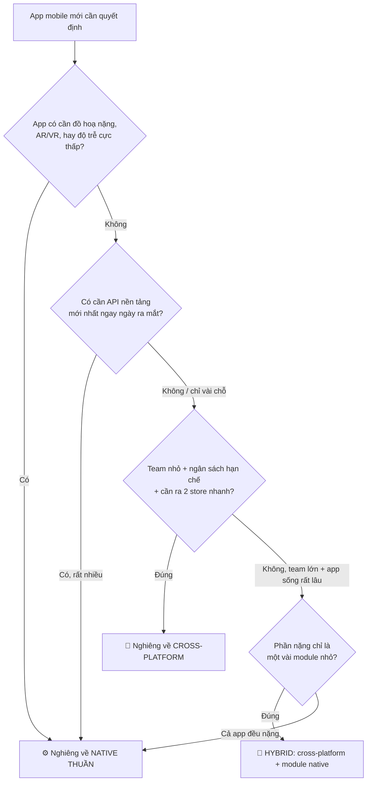
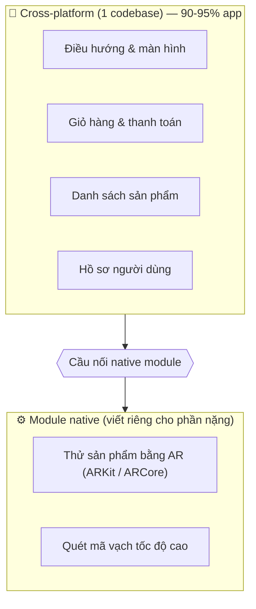

# Khi nào cross-platform, khi nào native thuần?

> **Tác giả:** Mr.Rom\
> **Phiên bản:** v1.0.0\
> **Tạo lúc:** 13/06/2026\
> **Cập nhật:** 13/06/2026\
> **Level:** Basic\
> **Tags:** cross-platform, native, mobile, decision-matrix, hybrid, kiến-trúc\
> **Yêu cầu trước:** [Chia sẻ code & Design System](03_sharing-code-and-design-system.md)

> 🎯 *Bài cuối của cụm — gom mọi thứ thành **khung quyết định**. Bạn đã biết cross-platform là gì, các cách tiếp cận, cách chọn framework, cách chia sẻ code. Giờ ta trả lời câu hỏi sếp Acme Shop sẽ hỏi: "Vậy rốt cuộc app này nên viết cross-platform hay native thuần?" Sau bài này bạn có một bộ tiêu chí rõ ràng để tự quyết — và bảo vệ được quyết định đó.*

## 🎯 Sau bài này bạn sẽ

- [ ] Nêu được **4 trường hợp cross-platform thắng** (app nội dung/thương mại, team nhỏ, time-to-market, ngân sách hạn chế)
- [ ] Nêu được **4 trường hợp native thuần thắng** (đồ hoạ nặng, AR/VR, API nền tảng mới nhất, hiệu năng cực khắt khe)
- [ ] Hiểu mô hình **hybrid** — app chính cross-platform + module native cho phần nặng
- [ ] Cân được **chi phí dài hạn** (bảo trì + tuyển dụng) chứ không chỉ chi phí ban đầu
- [ ] Đọc được **bảng quyết định theo loại app** và áp dụng vào tình huống thật
- [ ] Tự đưa ra **quyết định cho Acme Shop** và giải thích vì sao

---

## Tình huống — buổi họp chốt công nghệ cho Acme Shop

Bạn đã đi qua cả cụm: hiểu [cross-platform là gì](00_what-is-cross-platform-mobile.md), [các cách tiếp cận WebView/Bridge/Compiled](01_approaches-and-architecture.md), [cách chọn framework](02_choosing-a-framework.md), và [cách chia sẻ code & design system](03_sharing-code-and-design-system.md). Kiến thức thì đủ rồi. Nhưng trong phòng họp, sếp gõ bàn:

> *"Mình nghe nói cross-platform viết 1 lần chạy 2 nền tảng, rẻ và nhanh. Vậy tại sao Instagram, Uber, ngân hàng vẫn có chỗ viết native thuần? Mình làm Acme Shop thì chọn cái nào? Nói cho mình lý do, đừng nói 'tuỳ'."*

Đây là câu hỏi khó nhất — không phải vì thiếu kiến thức, mà vì **không có đáp án đúng tuyệt đối**. Cùng một câu "nên dùng cross-platform không?", câu trả lời cho một app bán hàng và cho một game đua xe 3D là **ngược nhau hoàn toàn**.

Cái bẫy hay gặp: người mới nghe "cross-platform rẻ hơn" rồi áp cho mọi app, hoặc nghe "native nhanh hơn" rồi vẽ rắn thêm chân cho một app CRUD đơn giản. Cả hai đều sai vì **bỏ qua bối cảnh**: loại app, quy mô team, ngân sách, và quan trọng nhất — **chi phí 3 năm sau** chứ không chỉ chi phí lúc khởi động.

→ Bài này biến câu "tuỳ" thành một **khung quyết định có tiêu chí rõ ràng**. Đọc xong, bạn trả lời được sếp bằng lý do, và biết khi nào nên đổi ý.

> [!NOTE]
> "Native thuần" trong bài nghĩa là viết bằng đúng công cụ chính chủ của từng nền tảng: **Swift/SwiftUI** cho iOS và **Kotlin/Jetpack Compose** cho Android — hai codebase riêng. "Cross-platform" nghĩa là một codebase (React Native, Flutter, KMP...) ra cả hai nền tảng.

---

## 1️⃣ Đổi câu hỏi: không phải "cái nào tốt hơn", mà "tốt hơn cho việc gì"

Trước khi vào tiêu chí, phải sửa lại tư duy. Câu hỏi "cross-platform hay native, cái nào tốt hơn?" **sai ngay từ cách đặt** — giống hỏi "xe máy hay xe tải, cái nào tốt hơn?". Không có đáp án, vì còn tuỳ bạn chở 1 người đi làm hay chở 2 tấn hàng.

Câu hỏi đúng là: **"Với loại app này, ràng buộc team này, ngân sách này — cái nào hợp hơn?"**

🪞 **Ẩn dụ — chọn phương tiện đi lại:**
> **Cross-platform** giống **xe máy**: nhỏ gọn, rẻ, len lỏi nhanh, một người lái được cả phố. Đa số nhu cầu hằng ngày (đi làm, đi chợ — tức app CRUD, thương mại, nội dung) thì xe máy thừa sức. **Native thuần** giống **xe đua F1 / xe tải chuyên dụng**: đắt, cần đội kỹ thuật riêng cho từng chiếc, nhưng khi cần tốc độ tối đa trên đường đua (game 3D, AR) hoặc chở hàng siêu nặng (hệ thống cực lớn lâu dài) thì xe máy chịu thua. Chọn sai phương tiện cho nhu cầu = lãng phí hoặc bất lực.

Ta sẽ dùng lại ẩn dụ xe máy / xe F1 này xuyên suốt bài.

Khung quyết định gồm **3 lớp câu hỏi**, hỏi theo thứ tự:

- **Lớp 1 — Bản chất app:** App này làm gì? Hiển thị dữ liệu (CRUD/nội dung/thương mại) hay vắt kiệt phần cứng (đồ hoạ/AR/độ trễ)?
- **Lớp 2 — Ràng buộc tổ chức:** Team mấy người, biết gì sẵn? Ngân sách bao nhiêu? Cần ra mắt nhanh cỡ nào?
- **Lớp 3 — Tầm nhìn dài hạn:** App sống 6 tháng hay 10 năm? Ai bảo trì? Tuyển người có dễ không?

Phần trừu tượng nhất của bài là **cách 3 lớp này hợp lại thành một quyết định**. Sơ đồ dưới mô tả luồng suy nghĩ — đi từ trên xuống, mỗi nhánh dẫn tới một kết luận:



→ Mấu chốt: quyết định **không phải nhị phân** (cross-platform XOR native). Có nhánh thứ ba — **hybrid** — và trong thực tế đây là chỗ nhiều app lớn dừng lại. Ta đi từng nhánh.

---

## 2️⃣ Khi nào cross-platform thắng?

Quay lại ẩn dụ: phần lớn nhu cầu đi lại hằng ngày, **xe máy là tối ưu**. Tương tự, **phần lớn app mobile ngoài đời** rơi đúng vào vùng mạnh của cross-platform. Có 4 dấu hiệu, gặp càng nhiều thì cross-platform càng thắng đậm.

**1. App nghiêng về dữ liệu/nội dung/thương mại (CRUD).** Đây là loại app phổ biến nhất: hiển thị danh sách, form nhập liệu, gọi API, đẩy/kéo dữ liệu. *CRUD* (Create-Read-Update-Delete — tạo/đọc/sửa/xoá dữ liệu) là xương sống của thương mại điện tử, mạng xã hội, app nội bộ, đặt món, đặt xe, fintech cơ bản. Những app này **không vắt kiệt phần cứng** — chúng dành 90% thời gian chờ mạng và vẽ list. Cross-platform thừa sức làm mượt.

**2. Team nhỏ, kỹ năng tập trung.** Nếu team chỉ 2-5 dev và đã biết một hệ sinh thái (vd JavaScript/React), việc bắt họ học **cả Swift lẫn Kotlin** để duy trì 2 codebase là gánh nặng khổng lồ. Một codebase cross-platform để cả team cùng làm trên cùng một thứ tiếng.

**3. Time-to-market gấp.** *Time-to-market* (thời gian đưa sản phẩm ra thị trường) là yếu tố sống còn của startup. Cross-platform cho ra mắt **cả 2 store gần như cùng lúc** với một nửa công sức. Native thuần thường buộc bạn chọn: làm iOS trước rồi Android sau (chậm), hoặc thuê 2 team song song (đắt).

**4. Ngân sách hạn chế.** Một codebase = một team = một dòng chi phí phát triển, thay vì hai. Với startup hoặc dự án nội bộ, đây thường là yếu tố quyết định.

Để thấy "share code" tiết kiệm cỡ nào, đây là một màn hình giỏ hàng Acme Shop — viết một lần, chạy cả iOS lẫn Android, không có dòng nào riêng cho từng nền tảng:

```tsx
// CartScreen.tsx — chạy y hệt trên iOS và Android, không tách codebase
import { View, Text, FlatList, Pressable } from 'react-native';

type CartItem = { id: number; name: string; price: number; qty: number };

function CartScreen({ items }: { items: CartItem[] }) {
  // 1. Tính tổng tiền giỏ hàng (logic dùng chung cho cả 2 nền tảng)
  const total = items.reduce((sum, it) => sum + it.price * it.qty, 0);

  return (
    <View style={{ flex: 1, padding: 16 }}>
      {/* 2. Danh sách sản phẩm — FlatList cuộn mượt như native thật */}
      <FlatList
        data={items}
        keyExtractor={(it) => String(it.id)}
        renderItem={({ item }) => (
          <Text>
            {item.name} × {item.qty} — {(item.price * item.qty).toLocaleString('vi-VN')}đ
          </Text>
        )}
      />
      {/* 3. Tổng tiền + nút thanh toán */}
      <Text style={{ fontSize: 18, fontWeight: '600' }}>
        Tổng: {total.toLocaleString('vi-VN')}đ
      </Text>
      <Pressable style={{ marginTop: 12, padding: 14, backgroundColor: '#16a34a', borderRadius: 8 }}>
        <Text style={{ color: '#fff', textAlign: 'center' }}>Thanh toán</Text>
      </Pressable>
    </View>
  );
}

export default CartScreen;
```

→ Toàn bộ logic giỏ hàng (tính tổng, render list, nút thanh toán) **viết một lần**. Native thuần buộc bạn viết màn hình này **hai lần** — một bản Swift, một bản Kotlin — và giữ cho hai bản không lệch nhau. Với app đầy màn hình kiểu này, tiết kiệm cộng dồn rất lớn.

> [!TIP]
> Quy tắc ngón tay cái: nếu khi mô tả app bạn dùng nhiều động từ "hiển thị / nhập / gửi / lọc / đồng bộ dữ liệu" hơn là "vẽ / mô phỏng / render đồ hoạ / theo dõi chuyển động" — gần như chắc chắn cross-platform là lựa chọn đúng.

Những cái tên thật trong vùng này: Instagram, Discord, Shopify, Coinbase, Microsoft Office đều có phần lớn viết cross-platform. Acme Shop — một app thương mại điện tử — nằm thẳng giữa vùng này.

---

## 3️⃣ Khi nào native thuần thắng?

Giờ tới đường đua F1. Có những app mà xe máy chịu thua — không phải vì xe máy kém, mà vì **bài toán đòi đúng loại phương tiện chuyên dụng**. Có 4 dấu hiệu, gặp một cái mạnh là đủ nghiêng về native.

**1. Game đồ hoạ nặng / render thời gian thực.** Game 3D, engine vật lý, app render video/ảnh thời gian thực phải vắt kiệt GPU và CPU từng khung hình (60-120 fps). Đây là lúc bạn cần **toàn quyền với phần cứng** mà chỉ native (hoặc engine game chuyên dụng như Unity/Unreal) cho được. Lưu ý: game nặng thường **không** dùng cross-platform app framework, mà dùng **game engine** riêng — đó là một thế giới khác.

**2. AR/VR và cảm biến chuyên sâu.** *AR* (Augmented Reality — thực tế tăng cường) và *VR* (Virtual Reality — thực tế ảo) cần truy cập sâu vào camera, con quay hồi chuyển, độ sâu, và các framework chuyên biệt của từng OS (ARKit của Apple, ARCore của Google). Các API này thay đổi nhanh và gắn chặt với native — cross-platform thường chạy sau vài bước.

**3. Cần API nền tảng mới nhất ngay ngày ra mắt.** Mỗi năm Apple/Google ra phiên bản OS mới với API mới (widget kiểu mới, tính năng AI trên thiết bị, kiểu giao diện mới...). Native thuần dùng được **ngay hôm OS phát hành**. Cross-platform phải **chờ framework cập nhật** hoặc tự viết cầu nối — độ trễ vài tuần đến vài tháng. Nếu sản phẩm của bạn sống bằng việc "luôn là người đầu tiên dùng tính năng iOS/Android mới nhất", native thắng.

**4. Hiệu năng / độ trễ cực khắt khe.** Một số ít app cần độ trễ tột cùng ở **mọi** thao tác: bàn phím tuỳ biến phản hồi tức thì, app đo đạc y tế thời gian thực, công cụ sáng tạo chuyên nghiệp. Phần overhead nhỏ của lớp cross-platform — dù 2026 đã rất mỏng — vẫn có thể là vấn đề ở biên này.

Một dấu hiệu thứ năm thiên về tổ chức: **app rất lớn, sống rất lâu, team rất đông.** Khi một app có hàng trăm kỹ sư và dự kiến sống cả thập kỷ (vd app ngân hàng lớn, super-app), nhiều tổ chức chọn native thuần để có toàn quyền tối ưu và không phụ thuộc vào vòng đời của một framework bên thứ ba. Đây không phải vì cross-platform "không làm nổi", mà là một **đánh đổi chiến lược** về kiểm soát rủi ro dài hạn.

So sánh hai vùng cho rõ — lead-in: cùng một câu hỏi "viết kiểu nào", nhưng bản chất app kéo câu trả lời về hai phía:

| Dấu hiệu của app | Nghiêng về | Vì sao |
|---|---|---|
| Hiển thị/nhập/đồng bộ dữ liệu (CRUD) | 📱 Cross-platform | Không vắt phần cứng, vẽ list + form là chính |
| Game 3D, render thời gian thực | ⚙️ Native (hoặc game engine) | Cần toàn quyền GPU/CPU, 60-120 fps |
| AR/VR, cảm biến chuyên sâu | ⚙️ Native | ARKit/ARCore gắn chặt OS, đổi nhanh |
| Bám API OS mới nhất ngày phát hành | ⚙️ Native | Cross-platform chờ framework cập nhật |
| Độ trễ tột cùng mọi thao tác | ⚙️ Native | Lớp trung gian dù mỏng vẫn là overhead |
| Ra 2 store nhanh, team nhỏ, rẻ | 📱 Cross-platform | 1 codebase, 1 team, 1 dòng chi phí |

> [!WARNING]
> Cạm bẫy phổ biến nhất: dùng "hiệu năng" làm cớ chọn native cho một app CRUD bình thường. Với 2026, cross-platform (đặc biệt RN New Architecture và Flutter) đủ mượt cho **gần như mọi app nghiệp vụ**. Đừng chọn xe F1 chỉ để đi chợ — bạn trả giá đắt mà không dùng tới tốc độ đó.

---

## 4️⃣ Hybrid — không phải chọn một, mà chọn ranh giới

Đây là điều nhiều người mới bỏ sót: quyết định **không bắt buộc nhị phân**. Có một con đường thứ ba rất thực tế — **hybrid**: phần lớn app viết cross-platform, chỉ những module thật sự nặng mới viết native rồi "cắm" vào.

🪞 **Ẩn dụ — xe máy gắn thêm động cơ phụ:**
> Hình dung một chiếc xe máy (cross-platform) đi 95% quãng đường đời thường. Riêng đoạn đường đua ngắn cần tốc độ cực cao, bạn gắn thêm một **động cơ phản lực rời** (module native) chỉ kích hoạt ở đoạn đó. Cả chuyến đi vẫn là xe máy — rẻ và linh hoạt — nhưng không bất lực ở đoạn khó.

Trong thực tế, mô hình này nghĩa là: app chính (điều hướng, danh sách, giỏ hàng, thanh toán, hồ sơ...) viết bằng React Native hoặc Flutter; còn một tính năng đặc thù — ví dụ **bộ lọc camera AR thử sản phẩm**, hoặc **trình quét mã vạch tốc độ cao** — viết bằng native Swift/Kotlin rồi expose ra cho phần cross-platform gọi qua *native module* (module cầu nối native).

Sơ đồ kiến trúc hybrid — lead-in: lõi app dùng chung một codebase, chỉ vài hộp màu xanh là native riêng từng nền tảng:



→ Điểm hay của hybrid: bạn giữ được **năng suất + chi phí thấp** của cross-platform cho 90-95% app, mà vẫn **không thoả hiệp** ở vài chỗ thật sự cần native. Cái giá phải trả: cần ít nhất một người biết native để viết và bảo trì phần cầu nối, và cần kỷ luật giữ ranh giới rõ ràng.

Cả React Native (qua *native module* / *Turbo Modules*) lẫn Flutter (qua *platform channels* — kênh giao tiếp với nền tảng) đều hỗ trợ chính thức mô hình này. Nên hybrid không phải "hack" — nó là pattern được thiết kế sẵn.

> [!TIP]
> Khi sếp nói "app mình có một tính năng AR nhỏ thôi, vậy phải viết native toàn bộ à?" — câu trả lời thường là **không**. Viết cross-platform cho cả app, làm riêng module AR bằng native, ghép lại. Đó là hybrid, và nó tiết kiệm hơn viết lại toàn bộ rất nhiều.

---

## 5️⃣ Chi phí dài hạn — phần ai cũng quên

Đến đây nhiều người đã chốt dựa trên "loại app". Nhưng quyết định công nghệ tốt phải nhìn xa hơn ngày ra mắt. Chi phí thật của một app không nằm ở lúc viết lần đầu, mà ở **3-5 năm bảo trì** phía sau.

Có 3 dòng chi phí dài hạn dễ bị bỏ qua:

**1. Chi phí bảo trì (maintenance).** Mỗi tính năng mới, mỗi bug fix — với native thuần bạn làm **hai lần** (Swift + Kotlin) và phải giữ hai bản đồng bộ. Theo thời gian, hai codebase dễ "trôi" lệch nhau (tính năng có ở iOS mà chưa có ở Android). Cross-platform sửa **một lần**, áp cho cả hai. Càng nhiều tính năng tích luỹ, khoảng cách chi phí càng nới rộng.

**2. Chi phí tuyển dụng (hiring).** Đây là yếu tố ít người mới nghĩ tới nhưng cực kỳ quan trọng. Tuyển một dev React Native (biết JavaScript/React) thường **dễ và rẻ hơn** tuyển song song một dev iOS giỏi *và* một dev Android giỏi. Thị trường lập trình viên web/JS rất lớn; còn dev native chuyên sâu hiếm và đắt hơn. Nếu công ty bạn đã có sẵn team web React, việc tận dụng họ sang mobile gần như "miễn phí" về mặt tuyển dụng.

**3. Chi phí phụ thuộc framework (lock-in & vòng đời).** Đây là chi phí nghiêng về phía cross-platform. Bạn phụ thuộc vào việc Meta (RN) / Google (Flutter) tiếp tục duy trì framework, và phải cập nhật khi framework có breaking change. Native thuần không có rủi ro này — Apple và Google sẽ không bỏ rơi công cụ chính chủ của họ. Đây là một lý do thật khiến app sống-rất-lâu đôi khi chọn native.

So sánh tổng chi phí sở hữu — lead-in: con số ban đầu chỉ là phần nổi, phần chìm là bảo trì và tuyển người kéo dài nhiều năm:

| Dòng chi phí | Cross-platform | Native thuần (2 codebase) |
|---|---|---|
| Phát triển ban đầu | Thấp (1 codebase) | Cao (2 codebase) |
| Bảo trì / thêm tính năng | Thấp — sửa 1 lần | Cao — sửa 2 lần, dễ lệch |
| Tuyển dụng | Dễ (thị trường JS/Dart lớn) | Khó hơn (cần cả iOS + Android giỏi) |
| Rủi ro phụ thuộc framework | Có — phụ thuộc vòng đời RN/Flutter | Không — công cụ chính chủ OS |
| Tận dụng API OS mới | Trễ vài tuần/tháng | Ngay ngày phát hành |
| Trần hiệu năng | Rất cao (đủ cho hầu hết app) | Cao nhất tuyệt đối |

> [!IMPORTANT]
> Đừng quyết định chỉ dựa trên "chi phí ban đầu rẻ hơn". Hãy hỏi: **3 năm nữa ai bảo trì app này, và họ làm việc đó nhanh hay chậm?** Một app cross-platform thường thắng đậm nhất không phải lúc viết, mà ở năm thứ hai, thứ ba khi tính năng chồng lên nhau.

---

## 6️⃣ Quyết định thực tế — Acme Shop nên chọn gì?

Giờ ta áp khung 3 lớp ở mục 1 vào chính tình huống của Acme Shop, trả lời sếp bằng lý do chứ không phải "tuỳ".

**Lớp 1 — Bản chất app.** Acme Shop là app **thương mại điện tử**: danh mục sản phẩm, tìm kiếm, giỏ hàng, thanh toán, theo dõi đơn, hồ sơ người dùng, push notification. Toàn bộ là **CRUD + nội dung** — vẽ list, gọi API, nhập form. Không có đồ hoạ 3D, không AR/VR bắt buộc, không đòi độ trễ tột cùng. → Lớp 1 nghiêng mạnh về **cross-platform**.

**Lớp 2 — Ràng buộc tổ chức.** Team đã làm website Acme Shop bằng React, biết JavaScript/TypeScript sẵn. Cần ra **cả App Store lẫn Play Store** sớm để bắt mùa mua sắm. Ngân sách startup, không dư để nuôi 2 team native song song. → Lớp 2 nghiêng mạnh về **cross-platform**.

**Lớp 3 — Tầm nhìn dài hạn.** App sẽ liên tục thêm tính năng (khuyến mãi, đánh giá, ví điểm thưởng...). Bảo trì 1 codebase + tận dụng team web có sẵn = chi phí dài hạn thấp. App thương mại điện tử cỡ này **không** thuộc nhóm "siêu app trăm kỹ sư sống thập kỷ" cần native vì kiểm soát rủi ro. → Lớp 3 vẫn nghiêng về **cross-platform**.

Cả 3 lớp đồng thuận. Áp vào sơ đồ quyết định ở mục 1, ta đi đúng nhánh: không cần đồ hoạ nặng → không cần API mới nhất ngay → team nhỏ + ngân sách hạn chế + cần ra nhanh → **cross-platform**.

→ **Kết luận cho Acme Shop: cross-platform (cụ thể React Native, vì team đã biết React).** Đây là chiếc "xe máy" đúng nghĩa — rẻ, nhanh, thừa sức cho nhu cầu.

Nhưng đừng dừng ở đó — luôn hỏi "trừ khi". Acme Shop **chỉ nên lệch hướng** nếu xuất hiện một trong các tình huống sau:

| Nếu sau này Acme Shop cần... | Thì xử lý bằng... |
|---|---|
| Tính năng "thử quần áo/đồ nội thất bằng AR" | 🧩 Hybrid — giữ app cross-platform, viết module AR native |
| Quét mã vạch sản phẩm tốc độ rất cao | 🧩 Hybrid — module quét native cắm vào |
| Một widget màn hình chính kiểu iOS mới nhất | Cân nhắc viết widget đó native riêng (phần nhỏ) |
| Toàn app biến thành nền tảng game hoá nặng | Lúc đó mới xét lại từ đầu (hiếm) |

Lưu ý cách trả lời: kể cả khi xuất hiện nhu cầu native, **mặc định đầu tiên vẫn là hybrid** chứ không phải "viết lại toàn bộ bằng native". Chỉ khi *cả app* nghiêng về phần nặng mới quay lại native thuần — điều rất khó xảy ra với một app bán hàng.

> [!NOTE]
> Cách trả lời sếp gọn nhất: *"Acme Shop là app bán hàng — toàn dữ liệu và màn hình thường. Team mình biết React, cần ra 2 store nhanh, ngân sách gọn. Cross-platform thắng cả về tốc độ ra mắt lẫn chi phí bảo trì 3 năm. Nếu sau này cần tính năng AR đặc thù, mình làm riêng module đó bằng native rồi ghép vào — không phải viết lại cả app."*

---

## 💡 Cạm bẫy thường gặp & Best practice

### ❌ Cạm bẫy: chọn native vì "nghe nói native nhanh hơn"
- **Triệu chứng**: app CRUD đơn giản (bán hàng, nội bộ) được lên kế hoạch viết 2 codebase Swift + Kotlin "cho chắc", dẫn tới gấp đôi chi phí và thời gian mà người dùng không cảm nhận được khác biệt.
- **Nguyên nhân**: lấy lý do "hiệu năng" cho mọi app, trong khi 2026 cross-platform đã đủ mượt cho gần như mọi app nghiệp vụ. Đây là chọn xe F1 để đi chợ.
- **Cách tránh**: chỉ kéo "hiệu năng" ra làm lý do khi app **thật sự** vắt phần cứng (game, AR, render thời gian thực, độ trễ tột cùng). App vẽ list + form thì cross-platform thắng.

### ❌ Cạm bẫy: nghĩ quyết định là nhị phân (chỉ được chọn 1)
- **Triệu chứng**: vì app có **một** tính năng nặng (vd quét AR), cả team quyết viết toàn bộ bằng native — bỏ phí lợi ích cross-platform cho 95% còn lại.
- **Nguyên nhân**: không biết tới mô hình hybrid (cross-platform + native module).
- **Cách tránh**: tách phần nặng thành module native riêng, ghép vào app cross-platform qua native module (RN) / platform channels (Flutter). Mặc định là hybrid trước, native thuần chỉ khi cả app đều nặng.

### ❌ Cạm bẫy: chỉ tính chi phí ban đầu, quên chi phí dài hạn
- **Triệu chứng**: chọn công nghệ vì "rẻ lúc đầu" nhưng năm thứ hai, thứ ba ngập trong chi phí bảo trì 2 codebase lệch nhau và khó tuyển người.
- **Nguyên nhân**: bỏ qua tổng chi phí sở hữu (bảo trì + tuyển dụng + vòng đời framework).
- **Cách tránh**: luôn hỏi "3 năm nữa ai bảo trì, tuyển người dễ không, sửa tính năng nhanh hay chậm?". Cộng chi phí 3-5 năm vào quyết định, không chỉ tháng đầu.

### ✅ Best practice: quyết theo khung 3 lớp, viết lý do ra giấy
- **Vì sao**: quyết định công nghệ phải bảo vệ được trước sếp/team và xem lại được sau này. "Tuỳ cảm tính" không bảo vệ được.
- **Cách áp dụng**: trả lời lần lượt Lớp 1 (bản chất app) → Lớp 2 (ràng buộc tổ chức) → Lớp 3 (dài hạn), ghi rõ lý do mỗi lớp. Khi cả 3 đồng thuận thì rất chắc; khi mâu thuẫn thì cân theo ràng buộc nặng nhất.

### ✅ Best practice: chừa cửa cho hybrid ngay từ đầu
- **Vì sao**: app phát triển sẽ phát sinh nhu cầu native không lường trước. Kiến trúc tách bạch giúp cắm module native vào mà không phá vỡ phần còn lại.
- **Cách áp dụng**: tổ chức code theo lớp (logic / UI / cầu nối native), giữ ranh giới rõ. Khi cần phần nặng, viết native module độc lập thay vì nhồi vào codebase chung.

---

## 🧠 Tự kiểm tra (Self-check)

**Q1.** Vì sao "cross-platform hay native, cái nào tốt hơn?" là một câu hỏi đặt sai?

<details>
<summary>💡 Xem giải thích</summary>

Vì không có đáp án tuyệt đối — giống hỏi "xe máy hay xe tải tốt hơn?". Câu trả lời phụ thuộc **bối cảnh**: loại app (CRUD hay đồ hoạ nặng), ràng buộc tổ chức (team mấy người, ngân sách, thời gian), và tầm nhìn dài hạn (app sống bao lâu, ai bảo trì). Câu hỏi đúng là "với loại app này, ràng buộc này, ngân sách này — cái nào hợp hơn?".

</details>

**Q2.** Kể 4 dấu hiệu cho thấy cross-platform thắng, và 4 dấu hiệu cho thấy native thuần thắng.

<details>
<summary>💡 Xem giải thích</summary>

**Cross-platform thắng khi:** (1) app nghiêng về dữ liệu/nội dung/thương mại (CRUD); (2) team nhỏ, kỹ năng tập trung; (3) cần ra 2 store nhanh (time-to-market gấp); (4) ngân sách hạn chế.

**Native thuần thắng khi:** (1) game đồ hoạ nặng / render thời gian thực; (2) AR/VR và cảm biến chuyên sâu; (3) cần API nền tảng mới nhất ngay ngày OS phát hành; (4) đòi hiệu năng/độ trễ cực khắt khe ở mọi thao tác. (Cộng thêm: app rất lớn, sống rất lâu, team rất đông — đánh đổi chiến lược về kiểm soát rủi ro.)

</details>

**Q3.** Hybrid là gì? Cho một ví dụ cụ thể với Acme Shop.

<details>
<summary>💡 Xem giải thích</summary>

Hybrid = phần lớn app (90-95%) viết cross-platform, chỉ những module thật sự nặng viết native rồi ghép vào qua cầu nối (native module ở RN / platform channels ở Flutter). Ví dụ Acme Shop: toàn bộ điều hướng, danh sách sản phẩm, giỏ hàng, thanh toán, hồ sơ viết bằng React Native; riêng tính năng "thử sản phẩm bằng AR" hoặc "quét mã vạch tốc độ cao" viết native rồi cắm vào. Giữ được năng suất + chi phí thấp của cross-platform mà không thoả hiệp ở phần cần native.

</details>

**Q4.** Vì sao chi phí tuyển dụng lại là một lý do nghiêng về cross-platform?

<details>
<summary>💡 Xem giải thích</summary>

Tuyển một dev cross-platform (biết JavaScript/React cho RN, hoặc Dart cho Flutter) thường dễ và rẻ hơn tuyển song song một dev iOS giỏi *và* một dev Android giỏi. Thị trường lập trình viên web/JS rất lớn; dev native chuyên sâu hiếm và đắt hơn. Đặc biệt nếu công ty đã có sẵn team web React, tận dụng họ sang mobile gần như miễn phí về mặt tuyển dụng — đây là một phần lớn của tổng chi phí sở hữu dài hạn mà nhiều người quên tính.

</details>

**Q5.** Acme Shop (thương mại điện tử, team biết React, ngân sách startup, cần ra 2 store sớm) nên chọn gì? Trả lời theo khung 3 lớp.

<details>
<summary>💡 Xem giải thích</summary>

**Cross-platform (React Native).** Lớp 1 (bản chất app): toàn CRUD + nội dung, không đồ hoạ nặng → nghiêng cross-platform. Lớp 2 (ràng buộc tổ chức): team biết React, cần ra 2 store nhanh, ngân sách gọn → nghiêng cross-platform. Lớp 3 (dài hạn): bảo trì 1 codebase + tận dụng team web, không phải siêu app trăm kỹ sư → vẫn nghiêng cross-platform. Cả 3 lớp đồng thuận. Nếu sau này cần AR hoặc quét mã tốc độ cao, dùng hybrid (module native cắm vào) chứ không viết lại toàn bộ.

</details>

---

## ⚡ Tra cứu nhanh (Cheatsheet)

### Khung quyết định 3 lớp

```
Lớp 1 — Bản chất app:   CRUD/nội dung? → cross-platform
                        Đồ hoạ/AR/độ trễ? → native
Lớp 2 — Tổ chức:        Team nhỏ + rẻ + gấp? → cross-platform
                        Team lớn + sống rất lâu? → cân nhắc native
Lớp 3 — Dài hạn:        Bảo trì 1 codebase + dễ tuyển? → cross-platform
                        Cần API OS mới ngày phát hành? → native
```

### Cross-platform thắng khi

```
✅ App CRUD / nội dung / thương mại điện tử
✅ Team nhỏ, kỹ năng tập trung (vd biết React)
✅ Time-to-market gấp (ra 2 store cùng lúc)
✅ Ngân sách hạn chế (1 codebase, 1 team)
```

### Native thuần thắng khi

```
⚙️ Game 3D / render thời gian thực
⚙️ AR/VR, cảm biến chuyên sâu (ARKit/ARCore)
⚙️ Cần API OS mới nhất NGAY ngày phát hành
⚙️ Độ trễ tột cùng ở mọi thao tác
⚙️ App rất lớn, sống thập kỷ, team rất đông
```

### Quyết định không nhị phân

```
Cả app nhẹ            → cross-platform
Một vài module nặng   → hybrid (cross-platform + native module)
Cả app đều nặng       → native thuần
```

---

## 📚 Từ Điển Thuật Ngữ (Glossary)

| EN | VN | Giải thích |
|---|---|---|
| Cross-platform | Đa nền tảng | Một codebase ra cả iOS lẫn Android (RN, Flutter, KMP...) |
| Native (thuần) | Native gốc | Viết riêng từng nền tảng bằng công cụ chính chủ — Swift (iOS) + Kotlin (Android) |
| CRUD | CRUD | Create-Read-Update-Delete — tạo/đọc/sửa/xoá dữ liệu, xương sống app nghiệp vụ |
| Time-to-market | Thời gian ra thị trường | Bao lâu để đưa sản phẩm tới tay người dùng |
| Hybrid | Lai (hybrid) | App chính cross-platform + module native cho phần nặng |
| Native module | Module native | Đoạn code native được ghép vào app cross-platform qua cầu nối |
| Platform channels | Kênh nền tảng | Cơ chế Flutter giao tiếp giữa Dart và code native |
| AR | Thực tế tăng cường | Augmented Reality — phủ vật thể ảo lên hình ảnh thật qua camera |
| VR | Thực tế ảo | Virtual Reality — môi trường ảo hoàn toàn |
| ARKit / ARCore | ARKit / ARCore | Framework AR chính chủ của Apple / Google |
| Lock-in | Phụ thuộc | Bị ràng vào một công nghệ/nhà cung cấp, khó đổi |
| Total cost of ownership | Tổng chi phí sở hữu | Chi phí trọn đời: phát triển + bảo trì + tuyển dụng, không chỉ ban đầu |

---

## 🔗 Liên kết & Tài nguyên

⬅️ **Bài trước:** [Chia sẻ code & Design System đa nền tảng](03_sharing-code-and-design-system.md)\
↑ **Về cụm:** [cross-platform-concepts — README cụm](../../README.md)

### 🧭 Định hướng lộ trình học

- [Chia sẻ code & Design System đa nền tảng](03_sharing-code-and-design-system.md) — bài trước, nền tảng cho quyết định này
- [Chọn framework — RN vs Flutter vs KMP vs MAUI vs Ionic](02_choosing-a-framework.md) — sau khi chốt cross-platform, đây là bước chọn công cụ
- [Phát triển mobile đa nền tảng là gì?](00_what-is-cross-platform-mobile.md) — quay lại điểm khởi đầu của cụm

### 🧩 Các chủ đề có thể bạn quan tâm

- [React Native là gì? — Viết app native bằng React](../../../react-native/lessons/01_basic/00_what-is-react-native.md) — đi sâu lựa chọn cross-platform phổ biến nhất
- [Các cách tiếp cận — WebView, Bridge, Compiled](01_approaches-and-architecture.md) — hiểu vì sao cross-platform 2026 đủ mượt
- [Flutter — cụm chủ đề](../../../flutter/README.md) — lựa chọn cross-platform tự vẽ pixel
- [iOS Swift — cụm chủ đề](../../../ios-swift/README.md) — khi cần native thuần phía iOS
- [Android Kotlin — cụm chủ đề](../../../android-kotlin/README.md) — khi cần native thuần phía Android

### 🌐 Tài nguyên tham khảo khác

- [React Native docs (chính thức)](https://reactnative.dev/) — tài liệu lựa chọn cross-platform phổ biến
- [Flutter docs (chính thức)](https://docs.flutter.dev/) — gồm hướng dẫn platform channels cho hybrid
- [Apple — Human Interface Guidelines](https://developer.apple.com/design/human-interface-guidelines) — chuẩn native iOS
- [Android Developers — Guides](https://developer.android.com/guide) — chuẩn native Android

---

> 🎯 *Đây là bài cuối của cụm cross-platform-concepts. Bạn giờ có một khung quyết định hoàn chỉnh: hiểu cross-platform là gì, các cách tiếp cận, cách chọn framework, cách chia sẻ code, và — quan trọng nhất — khi nào nên dùng cái gì. Bước tiếp theo trong hành trình là đi sâu một framework cụ thể (vd React Native) để biến quyết định thành sản phẩm thật.*

---

## 📌 Nhật ký thay đổi (Changelog)

- **v1.0.0 (13/06/2026)** — Bản đầu tiên. Cluster `cross-platform-concepts/` lesson 5/5 (bài cuối, đóng cụm). Cover: đổi tư duy "cái nào tốt hơn" → "tốt hơn cho việc gì" + khung quyết định 3 lớp (bản chất app / ràng buộc tổ chức / tầm nhìn dài hạn) + 4 dấu hiệu cross-platform thắng (CRUD/nội dung, team nhỏ, time-to-market, ngân sách) + 4 dấu hiệu native thắng (đồ hoạ nặng, AR/VR, API OS mới nhất, độ trễ cực khắt khe) + mô hình hybrid (cross-platform + native module) + chi phí dài hạn (bảo trì + tuyển dụng + lock-in framework) + quyết định thực tế cho Acme Shop. Kèm sơ đồ mermaid cây quyết định + sơ đồ kiến trúc hybrid, bảng so sánh theo loại app + bảng tổng chi phí sở hữu.
