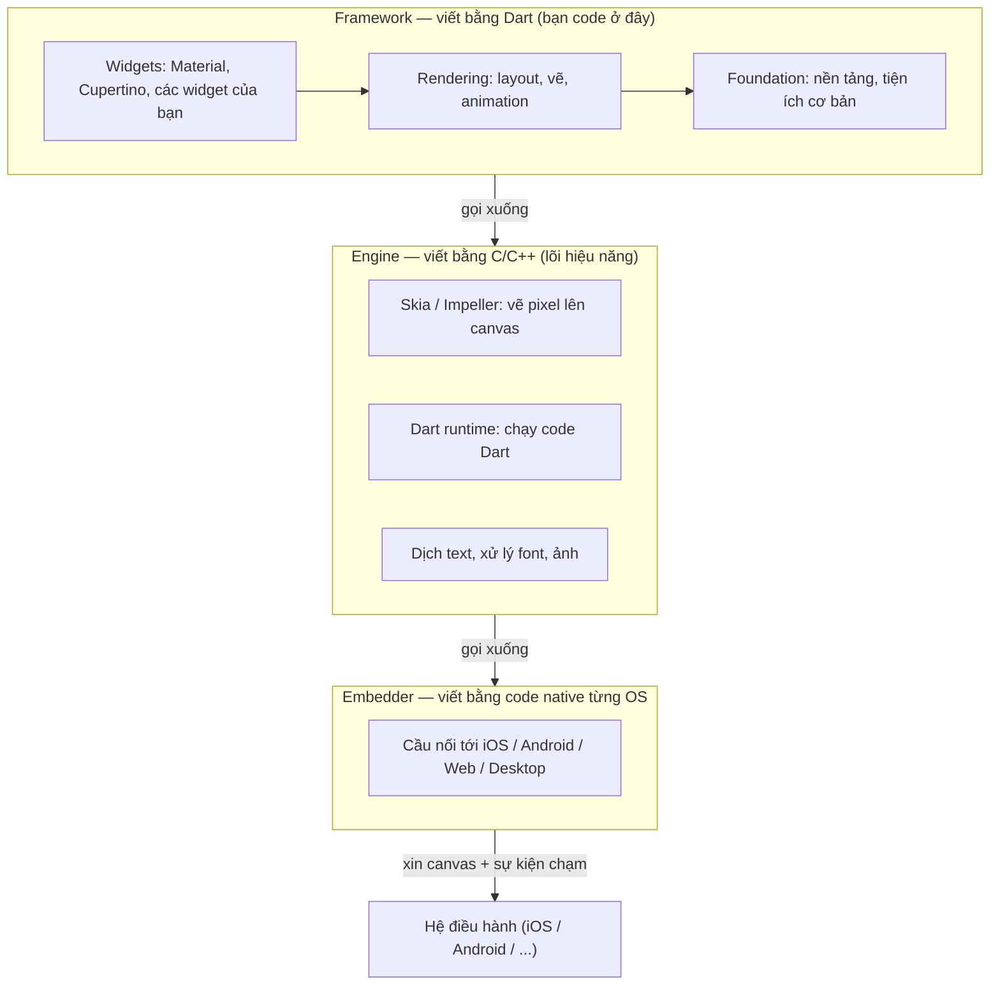
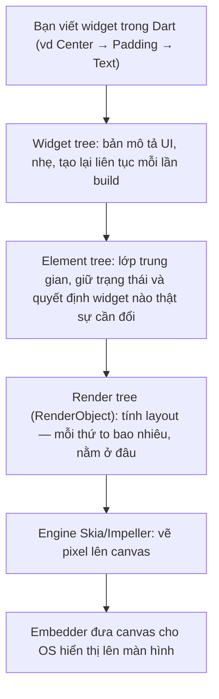
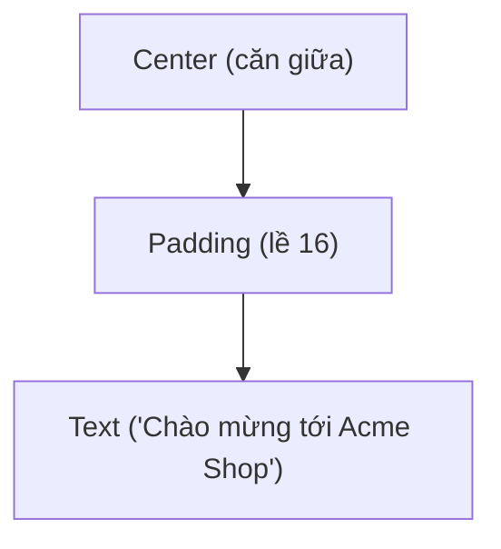

# Flutter là gì? — UI đa nền tảng vẽ bằng engine riêng

> **Tác giả:** Mr.Rom\
> **Phiên bản:** v1.0.0\
> **Tạo lúc:** 13/06/2026\
> **Cập nhật:** 13/06/2026\
> **Level:** Basic\
> **Tags:** flutter, mobile, cross-platform, dart, skia, impeller, widget, hot-reload\
> **Yêu cầu trước:** [Cross-platform là gì](../../../cross-platform-concepts/lessons/01_basic/00_what-is-cross-platform-mobile.md)

> 🎯 *Bạn vừa nắm bức tranh cross-platform và thấy Flutter nằm ở vùng "tự vẽ pixel" trên phổ. Bài này mở hộp Flutter ra: nó là SDK của Google, viết bằng **Dart**, và làm một điều khác lạ — **tự vẽ từng pixel** lên màn hình bằng engine riêng thay vì mượn widget của hệ điều hành. Sau bài này bạn hiểu vì sao UI Flutter giống hệt nhau trên mọi máy, **hot reload** là gì, kiến trúc 3 tầng (Framework → Engine → Embedder), triết lý "mọi thứ là widget", Flutter khác React Native ra sao, và khi nào nên chọn Flutter cho Acme Shop.*

## 🎯 Sau bài này bạn sẽ

- [ ] Giải thích được Flutter là gì: SDK của Google, ngôn ngữ **Dart**, một codebase ra iOS/Android/web/desktop
- [ ] Hiểu điểm khác biệt cốt lõi: Flutter **tự vẽ mọi pixel** (engine Skia/Impeller) thay vì dùng widget của OS, nên UI nhất quán mọi nền tảng
- [ ] Biết **hot reload** là gì và vì sao nó thay đổi cách bạn code UI
- [ ] Vẽ lại được kiến trúc 3 tầng của Flutter: Framework (Dart) → Engine (C++) → Embedder (native)
- [ ] Hiểu triết lý **"everything is a widget"** ở mức trực giác (chưa đi sâu — bài 01)
- [ ] So sánh được Flutter vs React Native (tự vẽ vs cầu nối native, Dart vs JS) và biết khi nào chọn Flutter

---

## Tình huống — chọn được Flutter rồi, nhưng nó "vẽ pixel" nghĩa là sao?

Ở bài cross-platform, Acme Shop đã khoanh vùng được hai ứng viên cho app của mình: **React Native** và **Flutter**. Trên cái phổ "mức chia sẻ code", hai cái này nằm cạnh nhau ở vùng giữa, nhưng có một dòng mô tả khiến bạn gãi đầu:

- React Native → "render **widget native thật** của OS".
- Flutter → "**tự vẽ pixel** bằng engine riêng".

"Tự vẽ pixel" nghĩa là gì? Một cái nút bấm thì có gì mà phải "vẽ"? Chẳng phải iOS đã có sẵn nút, Android cũng có sẵn nút, cứ dùng lại là xong sao?

Hoá ra đây chính là **quyết định kiến trúc lớn nhất** của Flutter — và nó kéo theo gần như mọi đặc điểm khác: vì sao app Flutter trông giống hệt nhau trên iPhone lẫn Android, vì sao Flutter chạy được cả trên web và desktop, vì sao nó cần một engine C++ riêng, và vì sao Google lại chọn ngôn ngữ Dart ít ai biết thay vì JavaScript đầy rẫy lập trình viên.

Bài này tháo gỡ tất cả. Nó là bài **mở màn** cho cụm Flutter — ta đi từ "Flutter là gì" tới "nó hoạt động ra sao ở mức tổng thể". Chi tiết về Dart và cách xếp widget để lại bài sau.

---

## 1️⃣ Flutter là gì?

Quay lại câu hỏi đầu bài. Acme Shop cần một codebase ra cả hai store, và Flutter là một trong hai ứng viên. Vậy nó chính xác là cái gì?

**Flutter** là một *SDK* (Software Development Kit — bộ công cụ phát triển) **mã nguồn mở của Google**, ra mắt ổn định năm 2018, dùng để dựng giao diện (UI) cho nhiều nền tảng từ **một codebase duy nhất**. Bạn viết app bằng ngôn ngữ **Dart** (cũng do Google làm), rồi cùng một mã đó build ra được:

- 📱 **iOS** và **Android** (mục tiêu chính)
- 🌐 **Web** (chạy trong trình duyệt)
- 🖥️ **Desktop** — Windows, macOS, Linux

Điểm khiến Flutter khác hẳn phần còn lại nằm ở **cách nó tạo ra giao diện**. Đa số framework cross-platform cố "mượn" các thành phần UI sẵn có của hệ điều hành (nút, ô nhập, danh sách của iOS/Android). Flutter làm ngược lại: nó **tự vẽ từng pixel** lên một khung hình trống, giống như một game engine vẽ cảnh game. Hệ điều hành chỉ đưa cho Flutter một "tấm canvas" trống và Flutter tự sơn mọi thứ lên đó.

🪞 **Ẩn dụ — Flutter như một hoạ sĩ mang theo cả bộ màu của riêng mình:**
> Hãy tưởng tượng bạn cần trang trí phòng ở hai khách sạn khác nhau (iOS và Android). Cách thông thường (native, hay React Native) là **dùng đồ nội thất có sẵn** của từng khách sạn — ghế của khách sạn A, ghế của khách sạn B, mỗi nơi một kiểu. Flutter thì như **một hoạ sĩ tự mang sơn, cọ và khuôn vẽ riêng** đến cả hai phòng, và **vẽ tay** mọi thứ giống hệt nhau lên tường. Nhờ vậy hai phòng trông y đúc nhau — vì cùng một hoạ sĩ, cùng bộ màu, cùng nét cọ.

Hệ quả trực tiếp của triết lý "tự vẽ": **UI nhất quán trên mọi nền tảng**. Một nút bấm Flutter trên iPhone và trên điện thoại Samsung sẽ giống nhau đến từng pixel, vì cả hai đều do **chính Flutter vẽ ra**, không phụ thuộc nút mặc định của từng OS.

> [!NOTE]
> "Tự vẽ pixel" không có nghĩa app Flutter trông "lạ" hay "không giống app thật". Flutter đi kèm sẵn 2 bộ widget mô phỏng cực sát chuẩn thiết kế gốc: **Material** (phong cách Android/Google) và **Cupertino** (phong cách iOS/Apple). Bạn vẫn có thể làm app "đậm chất iOS" — chỉ là các thành phần đó do Flutter vẽ lại y hệt, không phải lấy từ hệ điều hành.

---

## 2️⃣ Vì sao "tự vẽ pixel" lại là quyết định lớn?

Một câu "tự vẽ pixel" nghe đơn giản, nhưng nó toả ra gần như mọi đặc điểm của Flutter. Để thấy rõ, hãy so cách Flutter vẽ UI với cách "mượn widget OS" mà các framework khác (kể cả React Native) dùng.

Bảng dưới đối chiếu hai triết lý — đọc để thấy mỗi lựa chọn kéo theo hệ quả gì:

| Khía cạnh | Mượn widget OS (RN, native) | Tự vẽ pixel (Flutter) |
|---|---|---|
| Nút bấm trên màn hình | Là nút thật của iOS/Android | Do Flutter vẽ ra trên canvas |
| UI giữa iOS và Android | Khác nhau (theo "chất" từng OS) | Giống hệt nhau đến từng pixel |
| Khi OS đổi giao diện hệ thống | App đổi theo tự động | App giữ nguyên (Flutter kiểm soát) |
| Tuỳ biến giao diện sâu | Bị giới hạn bởi widget OS | Toàn quyền — vẽ gì cũng được |
| Chạy trên web/desktop | Khó (không có widget OS tương ứng) | Dễ — chỉ cần một canvas để vẽ |

Cái "engine vẽ" làm chuyện này tên là **Skia**, một thư viện đồ hoạ 2D mã nguồn mở mà Google đã dùng nhiều năm (cả trong trình duyệt Chrome lẫn Android). Từ Flutter 3.x, Google đang chuyển dần sang một engine vẽ thế hệ mới tên **Impeller**, viết lại để tận dụng GPU hiện đại tốt hơn và loại bỏ hiện tượng giật lúc chạy lần đầu (*jank* — khựng khung hình).

🪞 **Mở rộng ẩn dụ hoạ sĩ:** nếu Flutter là hoạ sĩ, thì **Skia/Impeller là bộ cọ và bảng màu** của hoạ sĩ đó. Bạn (lập trình viên) ra lệnh "vẽ một nút màu xanh, bo góc 12" — Skia/Impeller là thứ thực sự đặt cọ lên canvas và tô màu cho ra pixel.

> [!NOTE]
> **Skia vs Impeller** — bạn chưa cần phân biệt sâu ở mức beginner. Chỉ cần nhớ: cả hai đều là **engine vẽ pixel** của Flutter. Impeller là bản kế nhiệm, mặc định trên iOS từ Flutter 3.10 và đang mở rộng dần sang Android. Khi đọc tài liệu thấy cả hai tên, bạn biết chúng đóng cùng một vai trò.

→ Tóm lại: vì Flutter chỉ cần "một canvas để vẽ", nó **không lệ thuộc vào kho widget của từng OS** — đó là lý do nó vừa cho UI nhất quán, vừa dễ mở rộng ra web và desktop. Cái giá phải trả: app phải đóng gói kèm engine vẽ (làm app nặng hơn chút), và "chất riêng" của từng OS phải do bạn chủ động tái tạo.

---

## 3️⃣ Dart — ngôn ngữ của Flutter

Bạn có thể đã biết JS, Python, hoặc React. Khi sang Flutter, bạn gặp một cái tên mới: **Dart**. Vì sao Google không dùng luôn JavaScript cho dễ tuyển người, mà lại chọn một ngôn ngữ ít phổ biến hơn?

**Dart** là ngôn ngữ lập trình do Google phát triển, có cú pháp khá quen thuộc với người biết Java/JavaScript/C# (dấu `;`, dấu `{}`, class, `async`/`await`). Lý do Flutter chọn Dart nằm ở một thứ rất đặc biệt: Dart **biên dịch được theo hai chế độ khác nhau**, phục vụ hai mục đích trái ngược nhau.

Để thấy vì sao điều này quan trọng, hãy nhìn bảng hai chế độ biên dịch:

| Chế độ | Tên đầy đủ | Dùng khi | Lợi ích |
|---|---|---|---|
| **JIT** | Just-In-Time (biên dịch tức thời) | Lúc dev (gõ code, chạy thử) | Cho phép **hot reload** — sửa code thấy ngay |
| **AOT** | Ahead-Of-Time (biên dịch trước) | Lúc build app phát hành | Code máy native nhanh, khởi động nhanh |

Đây là sự kết hợp hiếm: lúc lập trình bạn được tốc độ phản hồi của ngôn ngữ thông dịch (sửa là thấy), còn lúc ship cho người dùng thì app chạy bằng **mã máy native biên dịch sẵn** — nhanh như app gốc, không cần thông qua máy ảo diễn giải từng dòng lúc chạy.

Một đoạn Dart cơ bản cho người mới nhìn mặt — chưa cần hiểu hết, chỉ để thấy nó "trông như thế nào":

```dart
// Một hàm Dart đơn giản tính giá sau giảm cho Acme Shop.
// Dart có null-safety: kiểu 'double' không thể là null trừ khi ghi 'double?'.
double tinhGiaSauGiam(double giaGoc, double phanTramGiam) {
  // Trả về giá sau khi trừ phần trăm giảm.
  return giaGoc * (1 - phanTramGiam / 100);
}

void main() {
  final giaCuoi = tinhGiaSauGiam(25000000, 10); // iPhone giảm 10%
  print('Giá sau giảm: $giaCuoi'); // 22500000.0
}
```

Vài điểm để bạn định hình Dart so với thứ bạn đã biết:

- **Có kiểu tĩnh** (`double`, `String`...) như Java/TypeScript, nhưng có `var`/`final` để suy luận kiểu tự động như JS.
- **Null-safety mặc định**: một biến không được phép `null` trừ khi bạn khai báo rõ kiểu có dấu `?` (vd `String?`). Điều này chặn cả một lớp lỗi "null pointer" ngay lúc biên dịch.
- **`async`/`await`** giống hệt JavaScript — dân JS sẽ thấy quen ngay.

> [!NOTE]
> Bài này chỉ giới thiệu Dart ở mức "nó là gì, vì sao chọn". Cú pháp Dart chi tiết (class, widget, `build`) là nội dung của bài kế tiếp — [Dart & Widgets](01_dart-and-widgets.md). Ở đây bạn chỉ cần nắm: **Dart = ngôn ngữ của Flutter, biên dịch JIT lúc dev và AOT lúc ship**.

→ Chốt lại lý do chọn Dart: nó là ngôn ngữ duy nhất Google kiểm soát được trọn vẹn, cho phép **vừa hot reload lúc dev, vừa ra mã native nhanh lúc phát hành** — đúng hai thứ một framework UI cross-platform cần nhất.

---

## 4️⃣ Hot reload — sửa code, thấy kết quả ngay

Đây là tính năng khiến nhiều người "phải lòng" Flutter ngay lần đầu thử. Hãy nhớ lại cảm giác làm app native truyền thống: sửa một dòng màu nút, bấm build, **chờ compile lại toàn bộ app**, chờ cài lên máy, mở app, bấm qua 4 màn hình để về đúng chỗ đang sửa — chỉ để xem cái nút đã đổi màu chưa. Lặp lại 50 lần một ngày.

**Hot reload** xoá bỏ vòng lặp khổ sở đó. Bạn sửa code, lưu file (hoặc gõ `r` trong terminal), và **giao diện cập nhật gần như tức thì — trong khi app vẫn đang chạy, vẫn giữ nguyên trạng thái** (vẫn ở màn hình bạn đang xem, vẫn giữ dữ liệu đã nhập).

🪞 **Ẩn dụ:** hot reload giống như **sửa bản vẽ trên bảng trắng đang trình bày dở** — bạn xoá một nét, vẽ lại nét mới, mọi thứ còn lại trên bảng vẫn nguyên. Bạn không phải xoá sạch bảng rồi vẽ lại từ đầu mỗi lần đổi một chi tiết.

Trong thực tế, vòng lặp làm việc với Flutter trông như sau. Đầu tiên bạn chạy app ở chế độ dev:

```bash
flutter run
```

Kết quả mong đợi (rút gọn) trong terminal:

```text
Launching lib/main.dart on iPhone 15 in debug mode...
Running Xcode build...
Syncing files to device iPhone 15...

Flutter run key commands.
r Hot reload. 🔥🔥🔥
R Hot restart.
q Quit (terminate the application on the device).
```

Ba dòng cuối là chìa khoá: `r` để **hot reload**, `R` để **hot restart**, `q` để thoát. Khi bạn sửa code và lưu, terminal báo đã reload trong tích tắc:

```text
Performing hot reload...
Reloaded 1 of 842 libraries in 213ms.
```

Dòng `Reloaded 1 of 842 libraries` cho biết Flutter chỉ nạp lại đúng phần code bạn vừa đổi (1 thư viện), không build lại cả 842 thư viện — đó là lý do nó nhanh đến vậy.

Có một phân biệt quan trọng giữa hai chế độ nạp lại:

| Lệnh | Tên | Giữ trạng thái app? | Khi nào dùng |
|---|---|---|---|
| `r` | **Hot reload** | ✅ Có — app vẫn ở nguyên màn hình, giữ dữ liệu | Đổi UI, đổi logic trong hàm `build` |
| `R` | **Hot restart** | ❌ Không — app khởi động lại từ đầu | Đổi `main()`, đổi biến global, đổi state khởi tạo |

> [!TIP]
> Quy tắc thực dụng: cứ dùng `r` (hot reload) trước. Nếu thấy thay đổi không xuất hiện (thường do bạn sửa thứ nằm ngoài hàm `build`, ví dụ giá trị khởi tạo của một biến), thì dùng `R` (hot restart). Cả hai đều nhanh hơn rebuild full rất nhiều.

→ Hot reload không chỉ tiết kiệm thời gian — nó **đổi cách bạn làm UI**. Bạn dám thử nhiều biến thể (đổi màu, đổi khoảng cách, đổi font) vì mỗi lần thử gần như miễn phí. Đây là một lý do lớn khiến dân làm UI thích Flutter.

---

## 5️⃣ Kiến trúc Flutter — ba tầng xếp chồng

Tới giờ bạn đã có các mảnh ghép rời: Dart, engine vẽ Skia/Impeller, canvas mà OS đưa cho. Giờ ráp chúng lại thành bức tranh kiến trúc tổng thể — đây là phần trừu tượng nhất của bài, nên ta dùng sơ đồ.

Flutter được tổ chức thành **ba tầng** xếp chồng lên nhau, mỗi tầng viết bằng một thứ khác nhau và lo một việc khác nhau. Sơ đồ dưới đọc từ trên xuống: tầng bạn viết code nằm trên cùng, tầng chạm vào hệ điều hành nằm dưới cùng.



Sơ đồ cho thấy điều mấu chốt: **bạn gần như chỉ làm việc ở tầng trên cùng** (Framework, viết bằng Dart), còn hai tầng dưới là phần Flutter lo sẵn để code Dart của bạn cuối cùng biến thành pixel thật trên màn hình.

Đi qua từng tầng cho rõ vai trò:

**Tầng 1 — Framework (Dart).** Đây là nơi bạn sống 99% thời gian. Toàn bộ widget (`Text`, `Container`, `Column`, nút Material, nút Cupertino...), hệ thống layout, animation đều ở đây và viết bằng Dart. Khi bạn "viết app Flutter", bạn đang viết ở tầng này.

**Tầng 2 — Engine (C/C++).** Lõi hiệu năng. Nó chứa engine vẽ **Skia/Impeller** (biến lệnh "vẽ nút xanh" thành pixel), bộ chạy **Dart runtime** (thực thi code Dart của bạn), và phần xử lý text/font/ảnh. Tầng này viết bằng C/C++ để chạy nhanh nhất có thể.

**Tầng 3 — Embedder (native từng OS).** Lớp mỏng nhất nhưng không thể thiếu. Mỗi nền tảng có một embedder riêng, viết bằng ngôn ngữ native của OS đó (Objective-C/Swift cho iOS, Java/Kotlin cho Android...). Việc của nó: **xin hệ điều hành một canvas để vẽ**, nhận **sự kiện chạm/cuộn** từ OS rồi chuyển lên trên, và lo các tích hợp hệ thống (vòng đời app, bàn phím, quyền truy cập).

🪞 **Ẩn dụ ba tầng:** nghĩ về một **xưởng in tranh**:
> - **Framework** = người thiết kế (bạn) ra lệnh "in bức tranh này, bố cục thế này".
> - **Engine** = cái máy in công nghiệp thực sự phun mực ra giấy (Skia/Impeller phun pixel ra canvas).
> - **Embedder** = nhân viên xin phòng, xin điện, xin giấy từ toà nhà (OS) để cái máy in hoạt động được trong từng toà nhà khác nhau.

→ Hiểu kiến trúc này giải thích vì sao Flutter port được sang web/desktop dễ đến vậy: **chỉ cần viết một embedder mới** cho nền tảng đó (lớp mỏng nhất), còn Framework và Engine dùng lại gần như nguyên vẹn. Đó là sức mạnh của việc "chỉ cần một canvas để vẽ".

---

## 6️⃣ Code của bạn biến thành pixel ra sao? — build pipeline

Bạn đã biết ba tầng. Nhưng còn một câu hỏi: từ lúc bạn viết `Text('Xin chào')` trong Dart cho tới lúc dòng chữ hiện lên màn hình, chuyện gì xảy ra? Hiểu sơ đồ này giúp bạn về sau debug nhanh hơn nhiều khi UI "không hiện như mong đợi".

Flutter biến code thành pixel qua một **đường ống (pipeline)** vài bước. Mấu chốt: cái bạn viết (widget) **không trực tiếp là thứ được vẽ** — nó là một "bản mô tả" được Flutter chuyển qua vài lớp trung gian trước khi thành pixel thật. Sơ đồ dưới đọc từ trên (code bạn viết) xuống dưới (pixel trên màn hình):



→ Điểm cần khắc sâu: **widget rất rẻ để tạo**. Mỗi lần UI cần đổi, Flutter dựng lại cả widget tree (bản mô tả) — nghe có vẻ tốn, nhưng widget chỉ là mô tả nhẹ. Lớp **element tree** ở giữa mới là phần thông minh: nó so sánh mô tả mới với cũ và **chỉ cập nhật đúng phần thật sự thay đổi** xuống render tree, nên Flutter không vẽ lại cả màn hình mỗi lần.

🪞 **Ẩn dụ:** nghĩ về việc xây nhà từ **bản vẽ kiến trúc**:
> - **Widget tree** = bản vẽ trên giấy (rẻ, vẽ lại bao nhiêu lần cũng được).
> - **Element tree** = quản đốc công trình — cầm bản vẽ mới, so với hiện trạng, chỉ thị "chỉ sửa cái cửa sổ này thôi, phần còn lại giữ nguyên".
> - **Render tree** = thợ thực sự đo đạc, xây dựng.
> - **Engine** = vật liệu + tay nghề tạo ra bức tường thật (pixel).

> [!NOTE]
> Ở mức beginner, bạn **chưa cần** nắm chi tiết ba "cây" (widget/element/render tree) — đó là kiến thức sẽ quay lại ở mức nâng cao khi tối ưu hiệu năng. Hiện tại chỉ cần nhớ một câu: *"Tạo lại widget liên tục là chuyện bình thường và rẻ ở Flutter — vì widget chỉ là bản mô tả, không phải pixel thật."* Câu này gỡ rất nhiều hiểu lầm về sau.

---

## 7️⃣ "Everything is a widget" — triết lý cốt lõi

Nếu chỉ được nhớ một câu về cách viết Flutter, hãy nhớ câu này: **everything is a widget** (mọi thứ đều là widget). Đây là triết lý xuyên suốt, và nó khác hẳn cách bạn nghĩ về UI ở web hay native.

Ở web, một trang có nhiều "loại" thứ khác nhau: thẻ HTML để dựng cấu trúc, CSS để tạo kiểu, padding/margin là thuộc tính. Trong Flutter, **gần như mọi thứ đều là một widget** — không chỉ cái nút và cái chữ, mà cả:

- Bố cục (xếp dọc = widget `Column`, xếp ngang = widget `Row`)
- Khoảng đệm (padding = widget `Padding`)
- Căn giữa (= widget `Center`)
- Kiểu chữ, màu nền (= cấu hình bên trong widget `Text`, `Container`)
- Thậm chí cả ứng dụng tổng (= widget `MaterialApp` bao ngoài cùng)

🪞 **Ẩn dụ:** widget giống **viên gạch Lego**. Một bức tường Lego không phải làm từ "gạch + keo + sơn" (nhiều loại vật liệu) — nó làm từ **toàn gạch Lego**, chỉ khác loại gạch. Trong Flutter, bạn dựng giao diện bằng cách **lồng widget vào widget**: một widget chứa các widget con, các widget con lại chứa widget cháu — tạo thành một **cây widget** (widget tree).

Một ví dụ nhỏ cho thấy "mọi thứ là widget" — chú ý cách các widget lồng vào nhau, mỗi widget là một viên gạch:

```dart
import 'package:flutter/material.dart';

// Một màn hình chào mừng đơn giản cho Acme Shop.
// Mọi dòng dưới đây đều là widget lồng vào nhau.
Widget manHinhChao() {
  return Center(                 // 1. Widget Center: căn giữa con của nó
    child: Padding(              // 2. Widget Padding: chừa lề 16 quanh con
      padding: const EdgeInsets.all(16),
      child: Text(               // 3. Widget Text: hiển thị chữ
        'Chào mừng tới Acme Shop',
        style: TextStyle(fontSize: 24, fontWeight: FontWeight.bold),
      ),
    ),
  );
}
```

Đọc từ ngoài vào trong: `Center` (căn giữa) bọc `Padding` (chừa lề) bọc `Text` (chữ). Ba widget lồng nhau, mỗi widget lo đúng một việc. Ở web bạn sẽ viết `text-align`, `padding`, `font-size` như các thuộc tính rời; ở Flutter mỗi việc đó là **một widget riêng** trong cây.

Cây widget của đoạn code trên trông như sau — sơ đồ giúp bạn "thấy" cấu trúc lồng nhau:



→ Một widget mỗi nút, lồng nhau thành cây — đó là toàn bộ cách bạn dựng UI Flutter. Triết lý này khiến Flutter rất nhất quán (học một kiểu áp dụng mọi nơi) nhưng cũng khiến code "lồng sâu" hơn bạn quen. Cách xếp widget hiệu quả là nội dung của [bài 01](01_dart-and-widgets.md) và [bài 02](02_layout-and-styling.md) — ở đây bạn chỉ cần thấm câu thần chú: **mọi thứ là widget**.

---

## 8️⃣ Flutter vs React Native — chọn cái nào cho Acme Shop?

Ở bài cross-platform, Acme Shop khoanh vùng hai ứng viên: RN và Flutter. Giờ đủ kiến thức để so chúng cho rõ. Cả hai đều cho "một codebase ra hai store", đều mượt cho app thương mại điện tử như Acme Shop — nhưng triết lý nền tảng khác nhau.

Khác biệt gốc rễ nằm ở **cách render UI** và **ngôn ngữ**. Bảng dưới đặt cạnh nhau các điểm quyết định — đọc theo từng hàng:

| Tiêu chí | React Native | Flutter |
|---|---|---|
| Render UI | Cầu nối tới **widget native thật** của OS | **Tự vẽ pixel** bằng Skia/Impeller |
| Ngôn ngữ | JavaScript / TypeScript | Dart |
| UI giữa iOS và Android | Theo "chất" từng OS (hơi khác nhau) | Giống hệt nhau đến từng pixel |
| Chống lưng | Meta (Facebook) | Google |
| Hợp với ai | Team đã giỏi **React / web** | Team muốn UI tuỳ biến đậm, đồng nhất |
| Hiệu năng UI nặng (animation) | Tốt, nhưng qua một lớp cầu nối | Rất tốt — vẽ thẳng, ít lớp trung gian |
| Tái dùng kỹ năng web | Cao (cùng React) | Thấp hơn (phải học Dart) |

Cái cụm từ "**cầu nối native**" của React Native đáng nói thêm. RN viết UI bằng JS, nhưng JS không tự vẽ được nút; nó gửi lệnh "tạo một nút native" qua một lớp **cầu nối** (bridge/JSI) xuống cho OS dựng nút thật. Còn Flutter không có khái niệm "nút native" — nó tự vẽ luôn. Đây chính là cội nguồn của mọi khác biệt còn lại.

🪞 **Gói lại bằng ẩn dụ:** React Native như **một người phiên dịch** — bạn nói (bằng JS) "cho cái nút", phiên dịch chuyển lời sang tiếng của từng khách sạn (OS) để họ mang nút **của họ** ra. Flutter như **hoạ sĩ tự vẽ** — không cần phiên dịch, không dùng nút của ai, tự vẽ nút của mình lên tường.

> [!TIP]
> Không có cái nào "thắng tuyệt đối". Quy tắc thực dụng năm 2026: team đã có nền **React/JS** mạnh → React Native vào nhanh hơn. Ưu tiên **UI tuỳ biến đậm, thương hiệu mạnh, đồng nhất mọi máy, animation nhiều** → Flutter có lợi thế. Với Acme Shop, cả hai đều khả thi; chọn theo kỹ năng team là tiêu chí thực tế nhất.

→ Vậy **khi nào chọn Flutter**? Khi bạn muốn giao diện của riêng mình (brand đậm, đồng nhất tuyệt đối giữa iOS/Android), khi animation và hiệu ứng là điểm nhấn, khi bạn nhắm luôn cả web/desktop từ cùng codebase, hoặc khi team sẵn sàng học Dart (đường cong không dốc nếu đã biết một ngôn ngữ có kiểu). Nếu Acme Shop muốn một bộ nhận diện hình ảnh độc đáo giống hệt nhau trên mọi thiết bị và có thể mở rộng sang web sau này — Flutter là lựa chọn rất hợp lý.

---

## 💡 Cạm bẫy thường gặp & Best practice

### ❌ Cạm bẫy: nghĩ Flutter "dùng widget native của OS" như React Native

- **Triệu chứng**: kỳ vọng nút Flutter trên iOS sẽ tự động trông giống nút iOS hệ thống, và bối rối khi UI giống hệt nhau trên cả hai OS.
- **Nguyên nhân**: nhầm cơ chế render của Flutter với React Native. Flutter **tự vẽ pixel**, không mượn widget OS.
- **Cách tránh**: nhớ ẩn dụ "hoạ sĩ tự mang sơn". Nếu muốn app "đậm chất iOS", chủ động dùng bộ widget **Cupertino** của Flutter — nhưng nhớ rằng đó vẫn là Flutter vẽ lại, không phải widget thật của iOS.

### ❌ Cạm bẫy: tưởng "everything is a widget" chỉ là khẩu hiệu

- **Triệu chứng**: đi tìm "thuộc tính padding" hay "thuộc tính căn giữa" như ở CSS, không tìm thấy, rồi bí.
- **Nguyên nhân**: ở Flutter padding, căn giữa, khoảng cách... đều là **widget riêng** (`Padding`, `Center`...), không phải thuộc tính rời.
- **Cách tránh**: khi cần một hiệu ứng layout, hãy hỏi "có widget nào làm việc này không" thay vì "có thuộc tính nào". Câu trả lời gần như luôn là một widget. Chi tiết ở bài Layout & Styling.

### ✅ Best practice: tận dụng hot reload để thử nhanh, nhưng biết khi nào cần hot restart

- **Vì sao**: hot reload (`r`) giữ trạng thái app nên cực nhanh, nhưng nó **không** áp dụng được thay đổi nằm ngoài hàm `build` (vd biến khởi tạo, code trong `main()`). Khi đó thay đổi "không hiện" và bạn dễ tưởng code sai.
- **Cách áp dụng**: mặc định gõ `r`. Nếu sửa rồi mà UI không đổi, gõ `R` (hot restart) để khởi động lại sạch. Đừng vội rebuild full — `R` đã đủ trong gần như mọi trường hợp.

### ✅ Best practice: chọn Flutter vs RN theo kỹ năng team + bản chất app, không theo "hype"

- **Vì sao**: framework "hot" hơn chưa chắc hợp dự án. Ép một team React thuần học Dart có thể chậm hơn dùng RN; ngược lại, app cần UI tuỳ biến cực sâu mà chọn RN có thể vướng.
- **Cách áp dụng**: trả lời hai câu — *(1) team đang mạnh stack gì (React/JS hay sẵn sàng học Dart)?* và *(2) app ưu tiên gì (đồng nhất UI + animation, hay tái dùng kỹ năng web)?* Hai câu này đưa bạn về đúng lựa chọn.

---

## 🧠 Tự kiểm tra (Self-check)

**Q1.** Điểm khác biệt cốt lõi giữa cách Flutter tạo UI và cách React Native tạo UI là gì?

<details>
<summary>💡 Xem giải thích</summary>

**Flutter tự vẽ mọi pixel** lên một canvas bằng engine riêng (Skia/Impeller) — nó không dùng widget của hệ điều hành. **React Native** thì viết UI bằng JS rồi qua một **cầu nối** ra lệnh cho OS dựng **widget native thật**.

Hệ quả: UI Flutter giống hệt nhau đến từng pixel trên iOS và Android (vì cùng do Flutter vẽ), còn UI React Native mang "chất" riêng của từng OS (vì là widget thật của OS).

</details>

**Q2.** Flutter viết bằng ngôn ngữ gì, do ai làm, và vì sao ngôn ngữ đó được chọn?

<details>
<summary>💡 Xem giải thích</summary>

Flutter viết bằng **Dart**, ngôn ngữ do **Google** phát triển. Lý do chọn Dart: nó biên dịch được theo **hai chế độ** — **JIT** (Just-In-Time) lúc dev cho phép **hot reload** (sửa thấy ngay), và **AOT** (Ahead-Of-Time) lúc build phát hành cho ra **mã máy native** chạy nhanh. Đúng hai thứ một framework UI cross-platform cần nhất.

</details>

**Q3.** Hot reload khác hot restart ở điểm nào? Khi nào phải dùng hot restart?

<details>
<summary>💡 Xem giải thích</summary>

**Hot reload** (`r`) nạp lại code đã đổi mà **vẫn giữ nguyên trạng thái app** (vẫn ở màn hình đang xem, vẫn giữ dữ liệu đã nhập) — dùng cho thay đổi UI/logic trong hàm `build`.

**Hot restart** (`R`) **khởi động lại app từ đầu**, mất hết state — cần dùng khi đổi thứ nằm ngoài `build`: code trong `main()`, biến global, giá trị khởi tạo state.

</details>

**Q4.** Kể tên ba tầng kiến trúc của Flutter, mỗi tầng viết bằng gì và lo việc gì.

<details>
<summary>💡 Xem giải thích</summary>

1. **Framework** — viết bằng **Dart**. Nơi bạn code: tất cả widget (Material, Cupertino, widget của bạn), layout, animation.
2. **Engine** — viết bằng **C/C++**. Lõi hiệu năng: engine vẽ Skia/Impeller (phun pixel ra canvas), Dart runtime (chạy code Dart), xử lý text/font/ảnh.
3. **Embedder** — viết bằng **code native từng OS**. Lớp mỏng cầu nối: xin OS một canvas để vẽ, nhận sự kiện chạm/cuộn, lo tích hợp hệ thống.

Đây cũng là lý do Flutter port sang web/desktop dễ: chỉ cần viết một embedder mới, còn Framework và Engine dùng lại.

</details>

**Q5.** "Everything is a widget" nghĩa là gì? Ở Flutter, làm sao để "căn giữa một đoạn chữ và chừa lề quanh nó"?

<details>
<summary>💡 Xem giải thích</summary>

"Everything is a widget" nghĩa là gần như mọi thứ trong UI Flutter đều là **widget** — không chỉ nút và chữ, mà cả bố cục (`Column`, `Row`), khoảng đệm (`Padding`), căn giữa (`Center`), thậm chí cả app tổng (`MaterialApp`). Bạn dựng UI bằng cách **lồng widget vào widget** thành một **cây widget**.

Để căn giữa một đoạn chữ và chừa lề: lồng `Center` → `Padding` → `Text`:

```dart
Center(
  child: Padding(
    padding: const EdgeInsets.all(16),
    child: Text('Xin chào'),
  ),
)
```

</details>

**Q6.** Vì sao app Flutter chạy được trên web và desktop dễ hơn so với framework mượn widget OS?

<details>
<summary>💡 Xem giải thích</summary>

Vì Flutter chỉ cần **một canvas để vẽ** (nó tự vẽ mọi thứ), nó **không lệ thuộc vào kho widget của từng OS**. Muốn chạy trên một nền tảng mới chỉ cần viết một **embedder** mới (lớp mỏng nhất) để xin canvas và nhận sự kiện từ nền tảng đó; còn tầng Framework và Engine dùng lại gần như nguyên vẹn.

Ngược lại, framework mượn widget OS sẽ bí trên web/desktop vì không phải nền tảng nào cũng có sẵn "widget native" tương ứng.

</details>

---

## ⚡ Tra cứu nhanh (Cheatsheet)

### Flutter trong một màn hình

```text
Flutter      = SDK của Google, ngôn ngữ Dart, 1 codebase → iOS/Android/web/desktop
Khác biệt    = TỰ VẼ pixel (Skia/Impeller), không mượn widget OS → UI nhất quán mọi máy
Dart         = JIT lúc dev (hot reload) + AOT lúc ship (mã native nhanh), null-safety
Widget       = "everything is a widget"; dựng UI bằng cây widget lồng nhau
```

### Kiến trúc 3 tầng

```text
Framework (Dart)   → nơi bạn code: widget, layout, animation
Engine (C/C++)     → Skia/Impeller vẽ pixel + Dart runtime + xử lý text/font/ảnh
Embedder (native)  → cầu nối tới OS: xin canvas, nhận sự kiện chạm
```

### Lệnh dev hay dùng

| Mục đích | Lệnh / phím |
|---|---|
| Chạy app ở chế độ dev | `flutter run` |
| Hot reload (giữ state) | gõ `r` trong terminal |
| Hot restart (reset state) | gõ `R` trong terminal |
| Thoát app đang chạy | gõ `q` trong terminal |
| Kiểm tra môi trường Flutter | `flutter doctor` |
| Tạo dự án mới | `flutter create acme_app` |

### Flutter vs React Native — phân biệt nhanh

```text
React Native : JS/TS, Meta — CẦU NỐI tới widget native thật của OS
Flutter      : Dart, Google — TỰ VẼ pixel; UI giống hệt mọi máy; hợp UI tuỳ biến đậm
```

---

## 📚 Từ Điển Thuật Ngữ (Glossary)

| EN | VN | Giải thích |
|---|---|---|
| Flutter | Flutter | SDK mã nguồn mở của Google để dựng UI đa nền tảng từ một codebase |
| SDK (Software Development Kit) | Bộ công cụ phát triển | Tập hợp thư viện + công cụ để xây dựng ứng dụng cho một nền tảng |
| Dart | Dart | Ngôn ngữ lập trình của Google, dùng để viết app Flutter |
| Skia | Skia | Engine vẽ đồ hoạ 2D mã nguồn mở của Google, vẽ pixel cho Flutter |
| Impeller | Impeller | Engine vẽ thế hệ mới của Flutter, kế nhiệm Skia, tận dụng GPU hiện đại |
| Canvas | Mặt vẽ | "Tấm vải" trống mà OS đưa cho Flutter để tự vẽ pixel lên |
| JIT (Just-In-Time) | Biên dịch tức thời | Biên dịch lúc chạy; cho phép hot reload khi dev |
| AOT (Ahead-Of-Time) | Biên dịch trước | Biên dịch sẵn ra mã native trước khi chạy; app phát hành chạy nhanh |
| Null-safety | An toàn null | Cơ chế Dart chặn lỗi null lúc biên dịch; biến phải khai `?` mới được null |
| Hot reload | Nạp nóng | Áp dụng code mới mà vẫn giữ trạng thái app, gần như tức thì |
| Hot restart | Khởi động lại nóng | Chạy lại app từ đầu, mất state; cho thay đổi ngoài hàm `build` |
| Widget | Widget | Đơn vị dựng UI cơ bản của Flutter; "everything is a widget" |
| Widget tree | Cây widget | Cấu trúc lồng nhau của các widget tạo nên giao diện |
| Framework | Tầng Framework | Tầng Dart nơi lập trình viên viết code (widget, layout, animation) |
| Engine | Tầng Engine | Lõi C/C++ chứa engine vẽ + Dart runtime + xử lý text/ảnh |
| Embedder | Tầng Embedder | Lớp native từng OS, cầu nối Flutter với hệ điều hành |
| Material | Material | Bộ widget Flutter theo phong cách thiết kế Android/Google |
| Cupertino | Cupertino | Bộ widget Flutter theo phong cách thiết kế iOS/Apple |
| Bridge / JSI | Cầu nối | Lớp trung gian React Native dùng để gọi widget native từ JS |
| Jank | Giật khung hình | Hiện tượng khựng/rớt khung hình khi vẽ UI; Impeller giảm hiện tượng này |

---

## 🔗 Liên kết & Tài nguyên

➡️ **Bài tiếp theo:** [Dart & Widgets — Mọi thứ là widget](01_dart-and-widgets.md)\
↑ **Về cụm:** [Flutter cơ bản](../../README.md)

### 🧭 Định hướng lộ trình học

- [Dart & Widgets — Mọi thứ là widget](01_dart-and-widgets.md) — bài kế: học cú pháp Dart và cách dựng widget đầu tiên
- [Layout & Styling — Row, Column, constraints, Material 3](02_layout-and-styling.md) — xếp widget thành bố cục thật
- [Cross-platform là gì](../../../cross-platform-concepts/lessons/01_basic/00_what-is-cross-platform-mobile.md) — bức tranh tổng cross-platform, nơi Flutter được định vị trên phổ

### 🧩 Các chủ đề có thể bạn quan tâm

- [React Native là gì? — Viết app native bằng React](../../../react-native/lessons/01_basic/00_what-is-react-native.md) — so sánh hướng "cầu nối native" với hướng "tự vẽ pixel" của Flutter
- [Kotlin Multiplatform / Android — cụm chủ đề](../../../android-kotlin/README.md) — hướng chia sẻ logic, UI native từng OS
- [Kiến trúc mobile — cụm chủ đề](../../../mobile-architecture/README.md) — tổ chức code app dù chọn hướng nào

### 🌐 Tài nguyên tham khảo khác

- [Flutter docs (chính thức)](https://docs.flutter.dev/) — tài liệu gốc của Flutter
- [Flutter architectural overview](https://docs.flutter.dev/resources/architectural-overview) — chi tiết kiến trúc Framework/Engine/Embedder
- [Dart language tour](https://dart.dev/language) — học nhanh cú pháp Dart
- [Impeller rendering engine](https://docs.flutter.dev/perf/impeller) — engine vẽ thế hệ mới của Flutter
- [Material 3 trong Flutter](https://docs.flutter.dev/ui/design/material) — bộ widget Material design 3

---

> 🎯 *Sau bài này bạn đã hiểu Flutter là gì, vì sao nó tự vẽ pixel, kiến trúc 3 tầng, và khi nào nên chọn nó. Bài kế tiếp đưa bạn vào code thật: cú pháp **Dart** và cách dựng những **widget** đầu tiên — biến câu thần chú "everything is a widget" thành giao diện chạy được.*

---

## 📌 Nhật ký thay đổi (Changelog)

- **v1.0.0 (13/06/2026)** — Bản đầu tiên. Cụm `flutter/` lesson 0/5 (basic), bài INTRO. Cover: Flutter là gì (SDK Google, ngôn ngữ Dart, 1 codebase → iOS/Android/web/desktop) + tự vẽ pixel bằng Skia/Impeller thay vì mượn widget OS → UI nhất quán + Dart (JIT/AOT, null-safety) + hot reload vs hot restart + kiến trúc 3 tầng Framework/Engine/Embedder + build pipeline (widget tree → element tree → render tree → pixel) + triết lý "everything is a widget" + cây widget + so sánh Flutter vs React Native (tự vẽ vs cầu nối native, Dart vs JS) + khi nào chọn Flutter. 3 sơ đồ mermaid (kiến trúc 3 tầng, build pipeline, cây widget). Cạm bẫy: nhầm Flutter dùng widget native như RN, tưởng "everything is a widget" là khẩu hiệu.
</content>
</invoke>
