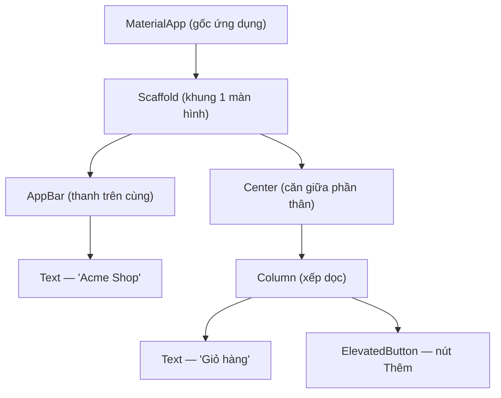
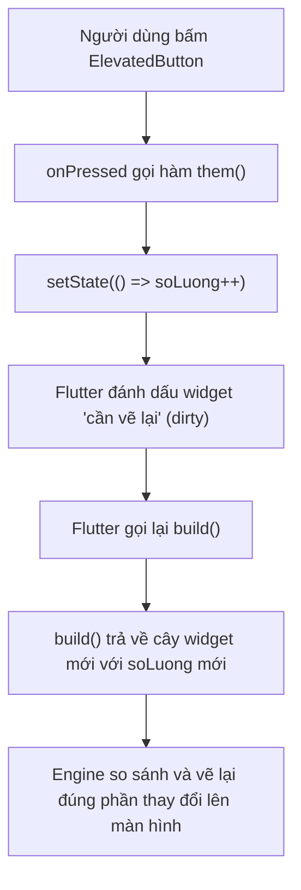

# Dart & Widgets — Mọi thứ là widget

> **Tác giả:** Mr.Rom\
> **Phiên bản:** v1.0.0\
> **Tạo lúc:** 13/06/2026\
> **Cập nhật:** 13/06/2026\
> **Level:** Basic\
> **Tags:** flutter, dart, widget, stateless, stateful, setstate, mobile, material-3, null-safety\
> **Yêu cầu trước:** [Flutter là gì](00_what-is-flutter.md)

> 🎯 *Bạn vừa biết Flutter vẽ UI bằng engine riêng. Giờ mở editor lên thì gặp ngay 2 thứ lạ: ngôn ngữ **Dart** (không phải JS/Python) và một câu thần chú lặp đi lặp lại — "**mọi thứ là widget**". Bài này dạy đủ Dart để bắt đầu (biến, null-safety, hàm, class, `async`/`await`), rồi giải mã widget: `StatelessWidget` vs `StatefulWidget` (khi nào dùng cái nào), `build()` trả về cây widget, `setState` để cập nhật UI. Cuối bài bạn ráp được 1 màn hình Acme Shop chạy thật.*

## 🎯 Sau bài này bạn sẽ

- [ ] Đọc và viết được Dart cơ bản: biến + kiểu, **null-safety** (`?`, `!`, `late`), hàm, class, `async`/`await`/`Future`
- [ ] Hiểu vì sao Flutter nói "mọi thứ là widget" và **widget tree** là gì
- [ ] Phân biệt `StatelessWidget` (UI tĩnh) và `StatefulWidget` (UI có dữ liệu thay đổi), biết **khi nào** dùng cái nào
- [ ] Dùng được bộ widget nền tảng: `MaterialApp`, `Scaffold`, `AppBar`, `Text`, `Container`, `Image`, `ElevatedButton`
- [ ] Gọi `setState` để cập nhật giao diện khi state đổi
- [ ] Ráp được màn hình `AcmeHomePage` hoàn chỉnh, có nút bấm tăng số lượng giỏ hàng

---

## Tình huống — biết JS/Python rồi mà mở file Flutter vẫn thấy lạ

Bạn đã quyết định dùng Flutter cho app Acme Shop. Bạn biết React, biết Python, tự tin sẽ học nhanh. Bạn `flutter create` một dự án mới, mở `lib/main.dart` ra và thấy thế này:

```dart
class HomePage extends StatelessWidget {
  const HomePage({super.key});

  @override
  Widget build(BuildContext context) {
    return const Text('Xin chào Acme');
  }
}
```

Một loạt thứ lạ hiện ra cùng lúc:

- `class ... extends StatelessWidget` — sao UI lại là một **class**, không phải hàm như component React?
- `const HomePage({super.key})` — `const` ở đây làm gì? `super.key` là cái gì?
- `Widget build(BuildContext context)` — hàm `build` này trả về một `Widget`, vậy `Widget` là gì?
- `@override` — annotation kiểu Java?

Để hết bối rối, ta cần 2 thứ: (1) đủ **Dart** để đọc cú pháp này, và (2) hiểu khái niệm **widget** — viên gạch dựng nên mọi giao diện Flutter. Bài này đi đúng 2 việc đó, theo thứ tự.

---

## 1️⃣ Dart đủ dùng — cho người đã biết JS/Python

Flutter viết bằng **Dart** — ngôn ngữ do Google tạo ra. Tin tốt cho bạn: Dart trông **rất giống** Java/JavaScript/TypeScript trộn lại. Nếu bạn từng viết TypeScript, bạn sẽ thấy quen ngay (kiểu tĩnh, class, `async`/`await`). Mục này không dạy lại lập trình từ đầu — chỉ chỉ ra những điểm Dart **khác** với JS/Python mà bạn phải biết để đọc code Flutter.

🪞 **Ẩn dụ**: Nếu JavaScript là "tiếng Anh giao tiếp" (lỏng lẻo, gì cũng nói được), thì Dart giống **tiếng Anh học thuật** — vẫn là tiếng Anh, nhưng có ngữ pháp chặt hơn (kiểu tĩnh) và đòi bạn nói rõ "thứ này có thể vắng mặt không" (null-safety). Khó hơn chút lúc đầu, đổi lại trình biên dịch bắt lỗi giúp bạn trước khi app chạy.

### Biến và kiểu

Dart là ngôn ngữ **kiểu tĩnh** (static typing) — mỗi biến có một kiểu xác định lúc biên dịch, giống TypeScript. Bạn có thể khai báo kiểu tường minh, hoặc dùng `var` để Dart **tự suy ra** (type inference).

```dart
// 1. Khai báo tường minh kiểu — rõ ràng, hay dùng cho field của class
String ten = 'iPhone 15';
int gia = 25000000;
double diem = 4.8;
bool conHang = true;

// 2. Dùng var — Dart tự suy ra kiểu từ giá trị bên phải
var thanhPho = 'Hà Nội';   // Dart hiểu đây là String
var soLuong = 3;            // Dart hiểu đây là int

// 3. final = gán 1 lần rồi khoá (giống const của JS cho biến runtime)
final ngayTao = DateTime.now();

// 4. const = hằng số biết TRƯỚC lúc biên dịch (compile-time constant)
const double thueVAT = 0.1;
```

So với thứ bạn đã biết: `var` của Dart **không lỏng** như `var` JS — một khi suy ra kiểu thì khoá kiểu đó (gán `soLuong = 'abc'` sẽ lỗi biên dịch). `final` ≈ `const` của JS (gán một lần). `const` của Dart **mạnh hơn**: giá trị phải biết ngay lúc compile — ta sẽ thấy `const` quan trọng cỡ nào với widget ở mục sau.

> 📖 *Khác biệt lớn nhất giữa Dart và JS/Python nằm ở chỗ tiếp theo: cách Dart xử lý `null`. Đây là phần bạn phải nắm chắc, vì code Flutter dùng nó khắp nơi.*

### Null-safety — `?`, `!`, `late`

Đây là điểm Dart khác JS/Python nhiều nhất. Trong JS, biến nào cũng có thể là `null` hoặc `undefined` bất cứ lúc nào — nguồn gốc của lỗi kinh điển `Cannot read property 'x' of undefined`. Dart bật **null-safety** mặc định: một biến **không được phép** là `null`, trừ khi bạn nói rõ "biến này có thể null" bằng dấu `?`.

```dart
// Mặc định: KHÔNG được null
String ten = 'Acme';
// ten = null;   // ❌ Lỗi biên dịch — String không nhận null

// Thêm ? → kiểu "nullable" (có thể null)
String? ghiChu;          // OK — mặc định là null
ghiChu = 'Giao nhanh';   // gán giá trị cũng OK
ghiChu = null;           // null cũng OK
```

Khi một biến là nullable (`String?`), Dart **bắt bạn xử lý trường hợp null** trước khi dùng. Có 3 toán tử hay gặp:

```dart
String? ghiChu = layGhiChuTuAPI();   // có thể trả về null

// 1. ?. — "null-aware": chỉ gọi nếu KHÁC null, không thì trả về null
int? doDai = ghiChu?.length;         // nếu ghiChu null → doDai cũng null

// 2. ?? — "default": dùng giá trị bên phải nếu bên trái null
String hienThi = ghiChu ?? 'Không có ghi chú';

// 3. ! — "bang operator": KHẲNG ĐỊNH "tôi chắc chắn không null"
//    Dùng khi bạn biết chắc, nhưng nếu sai → crash lúc chạy
int doDaiChac = ghiChu!.length;      // crash nếu ghiChu thật sự null
```

> [!WARNING]
> Toán tử `!` (bang) là lời hứa với trình biên dịch "biến này chắc chắn không null". Nếu lời hứa sai, app **crash lúc chạy** với lỗi `Null check operator used on a null value`. Chỉ dùng `!` khi bạn thật sự chắc — còn lại ưu tiên `??` (default) hoặc `?.` (null-aware) an toàn hơn.

Còn một từ khoá nữa hay gặp trong widget: `late`. Nó nghĩa là "biến này **không null**, nhưng tôi sẽ gán giá trị **sau**, không phải ngay lúc khai báo". Dart tin bạn và bỏ qua kiểm tra null lúc khai báo — nhưng nếu bạn đọc biến trước khi gán, vẫn crash.

```dart
class GioHang {
  late String maDon;   // chưa gán ngay, sẽ gán trong khoiTao()

  void khoiTao() {
    maDon = 'ACME-${DateTime.now().millisecondsSinceEpoch}';  // gán sau
  }
}
```

→ Tóm gọn: `?` = "có thể null", `??` = "giá trị thay thế khi null", `!` = "chắc chắn không null (tự chịu trách nhiệm)", `late` = "sẽ gán sau, đừng bắt tôi gán ngay". Bốn thứ này xuất hiện ở gần như mọi file Flutter.

### Hàm

Hàm Dart trông giống TypeScript: ghi kiểu trả về trước tên hàm, kiểu tham số trước tên tham số.

```dart
// Hàm thường: kiểu trả về (int) đứng trước tên
int tinhTong(int a, int b) {
  return a + b;
}

// Arrow function cho hàm 1 dòng (giống JS =>)
int nhanDoi(int x) => x * 2;

// Tham số đặt tên (named parameters) — đặt trong { }, gọi kèm tên
//   required = bắt buộc phải truyền
String taoLabel({required String ten, int soLuong = 1}) {
  return '$ten x$soLuong';
}

void main() {
  print(tinhTong(2, 3));                          // 5
  print(nhanDoi(10));                             // 20
  print(taoLabel(ten: 'iPhone', soLuong: 2));     // iPhone x2
  print(taoLabel(ten: 'AirPods'));                // AirPods x1 (dùng default)
}
```

Điểm đáng chú ý là **named parameters** (tham số đặt tên) trong dấu `{ }` — gọi hàm phải ghi rõ tên tham số (`ten: 'iPhone'`). Đây chính là kiểu bạn thấy khắp Flutter: `Text('xin chào', style: ...)`, `Container(width: 100, height: 100)`. `required` đánh dấu tham số bắt buộc; tham số có giá trị mặc định (`soLuong = 1`) thì được phép bỏ.

### Class

Dart hướng đối tượng — và widget chính là class. Đây là cú pháp class Dart, chú ý cách viết constructor vì nó khác JS:

```dart
class SanPham {
  // 1. Field (thuộc tính) — có thể là final (không đổi sau khi tạo)
  final String ten;
  final int gia;
  final bool conHang;

  // 2. Constructor rút gọn: this.ten gán thẳng tham số vào field
  //    Cú pháp này thay cho việc viết this.ten = ten; trong thân hàm
  SanPham({
    required this.ten,
    required this.gia,
    this.conHang = true,   // mặc định còn hàng
  });

  // 3. Method (phương thức)
  String giaDinhDang() {
    return '$gia đ';
  }
}

void main() {
  // Tạo object — KHÔNG cần từ khoá 'new' (Dart bỏ new từ lâu)
  final sp = SanPham(ten: 'MacBook Air', gia: 28000000);
  print(sp.ten);              // MacBook Air
  print(sp.giaDinhDang());    // 28000000 đ
}
```

Hai điểm khác JS phải nhớ: (1) constructor có cú pháp rút gọn `this.ten` — Dart tự gán tham số vào field, không cần viết `this.ten = ten`. (2) Tạo object **không cần `new`** — chỉ `SanPham(...)`. Bạn sẽ thấy đúng pattern này mỗi lần tạo widget: `Text(...)`, `Container(...)` thực ra là gọi constructor của các class đó.

### `async` / `await` / `Future`

Phần này gần như giống hệt JS. `Future<T>` của Dart ≈ `Promise<T>` của JS — đại diện cho một giá trị "sẽ có trong tương lai" (gọi API, đọc file...). `async`/`await` dùng y như JS.

```dart
// Future<T> = giá trị kiểu T sẽ có trong tương lai (giống Promise<T>)
Future<String> layTenSanPham(int id) async {
  // Giả lập gọi API mất 1 giây
  await Future.delayed(const Duration(seconds: 1));
  return 'Sản phẩm #$id';
}

Future<void> main() async {
  print('Bắt đầu tải...');
  final ten = await layTenSanPham(7);   // chờ Future xong rồi mới chạy tiếp
  print(ten);                           // Sản phẩm #7
}
```

So sánh nhanh để bạn ánh xạ kiến thức cũ — cùng khái niệm, chỉ khác tên:

| JavaScript | Dart | Vai trò |
|---|---|---|
| `Promise<T>` | `Future<T>` | Giá trị bất đồng bộ sẽ có sau |
| `async function` | `... async { }` | Đánh dấu hàm bất đồng bộ |
| `await promise` | `await future` | Chờ kết quả |
| `setTimeout(fn, 1000)` | `Future.delayed(Duration(...))` | Hẹn giờ |

→ Vậy là đủ Dart để đọc mọi file Flutter cơ bản. Bạn không cần học hết Dart — chỉ 5 thứ trên (biến/kiểu, null-safety, hàm, class, async) là đã đi được rất xa. Giờ sang phần quan trọng nhất: **widget**.

---

## 2️⃣ "Mọi thứ là widget" nghĩa là gì?

Câu đầu tiên ai học Flutter cũng nghe: *"In Flutter, everything is a widget"*. Nghe thì kêu, nhưng nó nghĩa là gì cụ thể?

Trong Flutter, **widget** là bản mô tả (description) của một phần giao diện. Không chỉ nút bấm hay ô chữ mới là widget — mà **mọi thứ bạn thấy và cả những thứ bạn không thấy** đều là widget: nút bấm là widget, đoạn chữ là widget, khoảng padding (đệm) là widget, căn giữa (`Center`) là widget, thậm chí cả bố cục hàng/cột (`Row`/`Column`) cũng là widget.

🪞 **Ẩn dụ**: Widget giống **viên gạch LEGO**. Một mô hình LEGO lớn không phải làm từ một khối liền, mà ghép từ hàng trăm viên nhỏ — viên to chứa viên nhỏ, viên nhỏ chứa viên nhỏ hơn. Giao diện Flutter cũng vậy: một màn hình là widget lớn, bên trong chứa các widget con, con lại chứa cháu... Bạn không "vẽ" UI, bạn **ghép widget**.

Điểm mấu chốt khác React: ở React một component có thể trả về JSX gồm thẻ HTML (`<div>`, `<span>`) trộn với component. Ở Flutter **không có HTML, không có thẻ** — chỉ có widget lồng widget. Muốn có khoảng đệm? Bọc trong widget `Padding`. Muốn căn giữa? Bọc trong widget `Center`. Mọi thao tác layout đều là "bọc widget này trong widget kia".

```dart
// Một đoạn chữ, có đệm 16, căn giữa — TẤT CẢ đều là widget lồng nhau
Center(                       // widget căn giữa
  child: Padding(             // widget thêm đệm
    padding: const EdgeInsets.all(16),
    child: const Text('Acme Shop'),   // widget hiển thị chữ
  ),
)
```

Đọc đoạn trên từ ngoài vào: `Center` chứa `Padding`, `Padding` chứa `Text`. Đây chính là cách Flutter dựng UI — và cấu trúc lồng nhau đó có một cái tên: **widget tree** (cây widget).

> 📖 *Khái niệm "cây widget" là thứ trừu tượng nhất ở đây. Trước khi viết code, hãy nhìn sơ đồ cây của một màn hình đơn giản để hình dung.*

Sơ đồ dưới mô tả widget tree của một màn hình Acme Shop tối giản: ngoài cùng là `MaterialApp`, trong là `Scaffold` (khung màn hình), bên trong chia ra `AppBar` (thanh tiêu đề) và phần thân.



→ Mỗi nút trên cây là một widget. Cha "chứa" con qua thuộc tính `child` (một con) hoặc `children` (nhiều con). Flutter đi từ gốc xuống lá để biết phải vẽ gì, ở đâu — và bạn xây UI bằng cách dựng đúng cái cây này trong code.

---

## 3️⃣ StatelessWidget vs StatefulWidget — khi nào dùng cái nào

Đây là quyết định đầu tiên bạn phải đưa ra mỗi khi viết một widget mới: nó là **Stateless** hay **Stateful**? Hiểu sai chỗ này là cạm bẫy lớn nhất của người mới. Phân biệt thực ra rất đơn giản, dựa trên một câu hỏi duy nhất.

> Widget này có **dữ liệu thay đổi theo thời gian** (khiến nó phải tự vẽ lại) không?

- **Không đổi** (chỉ hiển thị dữ liệu nhận vào, vẽ một lần là xong) → `StatelessWidget`.
- **Có đổi** (có dữ liệu nội bộ thay đổi khi người dùng tương tác, cần vẽ lại) → `StatefulWidget`.

🪞 **Ẩn dụ**: `StatelessWidget` như **tấm biển hiệu in sẵn** treo trước cửa hàng — nội dung cố định, muốn đổi phải in tấm mới. `StatefulWidget` như **bảng đèn LED điện tử** — cùng cái bảng nhưng nội dung thay đổi được (số lượng khách, giá khuyến mãi) mà không cần thay bảng.

### `StatelessWidget` — UI tĩnh

Dùng khi widget chỉ phụ thuộc vào dữ liệu truyền từ ngoài vào (qua constructor) và **không tự thay đổi**. Ví dụ: một thẻ sản phẩm chỉ hiển thị tên + giá nhận được.

```dart
import 'package:flutter/material.dart';

// StatelessWidget: nhận dữ liệu qua constructor, vẽ ra, hết.
class TheSanPham extends StatelessWidget {
  final String ten;
  final int gia;

  // const constructor — quan trọng, sẽ giải thích ở mục Cạm bẫy
  const TheSanPham({super.key, required this.ten, required this.gia});

  @override
  Widget build(BuildContext context) {
    return Column(
      children: [
        Text(ten),
        Text('$gia đ'),
      ],
    );
  }
}
```

Nó chỉ có duy nhất một method bạn cần viết: `build()`. Nhận `BuildContext` (thông tin vị trí của widget trong cây), trả về cây widget con. Dữ liệu `ten`, `gia` là `final` — vào rồi không đổi. Muốn hiện sản phẩm khác? Flutter tạo một `TheSanPham` mới với dữ liệu mới, không sửa cái cũ.

### `StatefulWidget` — UI có state thay đổi

Dùng khi widget có **dữ liệu nội bộ thay đổi** trong vòng đời của nó: số lượng trong giỏ tăng khi bấm nút, công tắc bật/tắt, ô tick checkbox... Những dữ liệu "sống" này gọi là **state**.

`StatefulWidget` chia làm **2 class** — đây là điểm làm người mới rối nhất, nên đọc kỹ:

```dart
import 'package:flutter/material.dart';

// 1. Class widget — bất biến (immutable), chỉ giữ cấu hình ban đầu
class BoDemGioHang extends StatefulWidget {
  const BoDemGioHang({super.key});

  @override
  State<BoDemGioHang> createState() => _BoDemGioHangState();
}

// 2. Class State — nơi giữ DỮ LIỆU THAY ĐỔI và logic
class _BoDemGioHangState extends State<BoDemGioHang> {
  int soLuong = 0;   // đây là STATE — dữ liệu sẽ thay đổi

  void them() {
    // setState báo Flutter: "state đổi rồi, vẽ lại đi"
    setState(() {
      soLuong++;
    });
  }

  @override
  Widget build(BuildContext context) {
    return Column(
      children: [
        Text('Giỏ: $soLuong sản phẩm'),
        ElevatedButton(
          onPressed: them,
          child: const Text('Thêm'),
        ),
      ],
    );
  }
}
```

Vì sao lại tách 2 class? Vì bản thân widget trong Flutter là **bất biến** (immutable) — không thể sửa. Nhưng state thì cần thay đổi. Giải pháp: widget (`BoDemGioHang`) chỉ giữ cấu hình bất biến, còn dữ liệu thay đổi nằm trong một object riêng — class `State` (`_BoDemGioHangState`). Khi state đổi, Flutter giữ nguyên object `State` và chỉ gọi lại `build()` để vẽ lại. Dấu `_` đầu tên class State nghĩa là **private** (riêng tư trong file) — quy ước Dart.

Để chốt lựa chọn, đây là bảng so sánh. Đọc theo từng dòng để thấy khác biệt cốt lõi:

| Tiêu chí | `StatelessWidget` | `StatefulWidget` |
|---|---|---|
| Có dữ liệu nội bộ đổi theo thời gian? | Không | Có |
| Số class phải viết | 1 | 2 (Widget + State) |
| Cập nhật UI bằng | (không tự cập nhật) | `setState()` |
| Ví dụ | Thẻ sản phẩm, icon, label tĩnh | Bộ đếm, form nhập, checkbox, tab đang chọn |
| Khi nào chọn | Chỉ hiển thị dữ liệu nhận vào | Người dùng tương tác làm dữ liệu đổi |

→ Quy tắc thực dụng: **mặc định viết `StatelessWidget`**. Chỉ "nâng cấp" lên `StatefulWidget` khi bạn nhận ra widget cần nhớ một dữ liệu thay đổi được. Đừng dùng `StatefulWidget` cho mọi thứ — nó nặng hơn và dài dòng hơn không cần thiết.

---

## 4️⃣ `setState` — trái tim của việc cập nhật UI

Ở đoạn code trên có dòng `setState(() { soLuong++; })`. Đây là cơ chế cập nhật UI cơ bản nhất của Flutter, nên phải hiểu rõ nó làm gì.

Trong Flutter, bạn **không sửa giao diện trực tiếp**. Bạn không viết "tìm cái `Text` đó rồi đổi chữ" như thao tác DOM ở web. Thay vào đó: bạn đổi **dữ liệu (state)**, rồi báo Flutter "dữ liệu đổi rồi" — Flutter tự gọi lại `build()` và vẽ lại phần cần vẽ. Cái "báo" đó chính là `setState`.

```dart
void them() {
  setState(() {
    soLuong++;       // 1. Đổi state bên trong hàm callback của setState
  });
  // 2. setState xong → Flutter tự gọi lại build() → UI hiện số mới
}
```

🪞 **Ẩn dụ**: `setState` giống **bấm nút "làm mới" thực đơn ở quán**. Bạn không tự chạy ra sửa từng tấm menu trên bàn — bạn đổi giá trong sổ (state), rồi bấm "làm mới", hệ thống tự in lại menu mới cho mọi bàn. Bạn lo dữ liệu, Flutter lo vẽ.

Luồng từ lúc bấm nút tới lúc màn hình đổi diễn ra theo các bước rõ ràng. Sơ đồ dưới mô tả "vòng đời một lần bấm nút" trong widget bộ đếm:



→ Điểm quan trọng từ sơ đồ: bạn chỉ làm đúng 1 việc — gọi `setState` và đổi dữ liệu. Toàn bộ phần "vẽ lại đúng chỗ cần vẽ" do Flutter lo. Đây là tư duy **khai báo** (declarative): bạn mô tả "UI nên trông thế nào ứng với state hiện tại", không ra lệnh "hãy đổi pixel này".

> [!IMPORTANT]
> Đổi giá trị biến state mà **quên gọi `setState`** thì màn hình **không cập nhật** — dữ liệu đã đổi trong bộ nhớ nhưng `build()` không được gọi lại nên UI vẫn hiện số cũ. Đây là lỗi "tưởng bug Flutter" phổ biến nhất của người mới. Mọi thay đổi state cần hiển thị phải nằm trong `setState(() { ... })`.

---

## 5️⃣ Bộ widget nền tảng phải biết

Trước khi ráp app, ta điểm qua 7 widget bạn sẽ gặp ở gần như mọi màn hình. Hiểu vai trò từng cái thì đọc code Flutter nào cũng được.

`MaterialApp` và `Scaffold` là 2 widget "khung" — gần như app nào cũng bắt đầu bằng chúng, nên hiểu rõ trước:

- **`MaterialApp`** — widget gốc của toàn app. Nó bật **Material Design** (hệ thống thiết kế của Google, hiện là Material 3), quản lý theme, điều hướng giữa các màn hình, ngôn ngữ. Mỗi app thường có đúng **một** `MaterialApp` ở trên cùng.
- **`Scaffold`** — bộ khung chuẩn cho **một** màn hình. Nó cung cấp sẵn các "ô" để bạn lắp vào: `appBar` (thanh trên cùng), `body` (phần thân chính), `floatingActionButton` (nút tròn nổi góc dưới), `bottomNavigationBar`... Không có `Scaffold` thì màn hình thiếu cấu trúc, chữ dính lên thanh trạng thái.

5 widget còn lại là các "viên gạch" nội dung. Bảng dưới tóm tắt vai trò — đọc xong là đủ vốn cho màn hình đầu tiên:

| Widget | Vai trò | Tương đương web (gần đúng) |
|---|---|---|
| `AppBar` | Thanh tiêu đề trên cùng (tên màn hình, nút back, action) | `<header>` |
| `Text` | Hiển thị chữ (kèm `style` để chỉnh font/màu/cỡ) | `<p>` / `<span>` |
| `Container` | Hộp đa năng: đặt kích thước, màu nền, đệm, viền, bo góc | `<div>` có style |
| `Image` | Hiển thị ảnh (từ mạng `Image.network`, hoặc asset `Image.asset`) | `` |
| `ElevatedButton` | Nút bấm nổi (Material), có `onPressed` và `child` | `<button>` |

Đây là ví dụ ngắn cho từng widget nội dung — chú ý mọi thứ đều truyền qua **named parameters** (tham số đặt tên) như đã học ở mục Dart:

```dart
// Text với style (cỡ chữ, đậm, màu)
const Text(
  'Acme Shop',
  style: TextStyle(fontSize: 22, fontWeight: FontWeight.bold, color: Colors.indigo),
);

// Container: hộp 200x100, nền xanh nhạt, bo góc 12, đệm trong 16
Container(
  width: 200,
  height: 100,
  padding: const EdgeInsets.all(16),
  decoration: BoxDecoration(
    color: Colors.blue.shade50,
    borderRadius: BorderRadius.circular(12),
  ),
  child: const Text('Khuyến mãi'),
);

// Image từ URL
Image.network('https://picsum.photos/200', width: 200, height: 200);

// ElevatedButton: onPressed là hàm chạy khi bấm, child là nội dung nút
ElevatedButton(
  onPressed: () => debugPrint('Đã bấm'),
  child: const Text('Mua ngay'),
);
```

> 📖 *Giờ bạn đã có đủ: Dart cơ bản, hiểu widget tree, biết Stateless vs Stateful, biết setState, và 7 widget nền tảng. Đến lúc ráp tất cả thành một màn hình chạy thật.*

---

## 6️⃣ Ráp lại — màn hình Acme Shop chạy được

Giờ ta dựng `AcmeHomePage`: một màn hình có `AppBar` ghi "Acme Shop", phần thân hiển thị số lượng sản phẩm trong giỏ, và một nút `ElevatedButton` để tăng số đó. Vì có **dữ liệu thay đổi** (số trong giỏ), nó phải là `StatefulWidget`. Đây là file `lib/main.dart` hoàn chỉnh — tạo dự án Flutter mới (`flutter create acme_shop`) rồi thay nội dung file này vào là chạy.

```dart
import 'package:flutter/material.dart';

// main() — điểm vào của mọi app Flutter. runApp gắn widget gốc lên màn hình.
void main() {
  runApp(const AcmeApp());
}

// 1. Widget gốc — Stateless vì cấu hình app không đổi theo thời gian
class AcmeApp extends StatelessWidget {
  const AcmeApp({super.key});

  @override
  Widget build(BuildContext context) {
    return MaterialApp(
      title: 'Acme Shop',
      // Bật Material 3 + tạo bảng màu từ 1 màu chủ đạo
      theme: ThemeData(
        colorScheme: ColorScheme.fromSeed(seedColor: Colors.indigo),
        useMaterial3: true,
      ),
      home: const AcmeHomePage(),   // màn hình đầu tiên
    );
  }
}

// 2. Màn hình chính — Stateful vì số lượng giỏ hàng THAY ĐỔI
class AcmeHomePage extends StatefulWidget {
  const AcmeHomePage({super.key});

  @override
  State<AcmeHomePage> createState() => _AcmeHomePageState();
}

class _AcmeHomePageState extends State<AcmeHomePage> {
  // STATE: số sản phẩm trong giỏ — sẽ thay đổi khi bấm nút
  int soLuongGio = 0;

  void themVaoGio() {
    // Đổi state PHẢI nằm trong setState để Flutter vẽ lại
    setState(() {
      soLuongGio++;
    });
  }

  @override
  Widget build(BuildContext context) {
    return Scaffold(
      // appBar: thanh tiêu đề trên cùng
      appBar: AppBar(
        title: const Text('Acme Shop'),
        backgroundColor: Theme.of(context).colorScheme.inversePrimary,
      ),
      // body: phần thân — căn giữa, xếp dọc 3 thành phần
      body: Center(
        child: Column(
          mainAxisAlignment: MainAxisAlignment.center,   // căn giữa theo chiều dọc
          children: [
            // Một Container hộp nhỏ làm "thẻ" hiển thị
            Container(
              padding: const EdgeInsets.all(20),
              decoration: BoxDecoration(
                color: Colors.indigo.shade50,
                borderRadius: BorderRadius.circular(16),
              ),
              child: const Text(
                'Giỏ hàng của bạn',
                style: TextStyle(fontSize: 16, color: Colors.indigo),
              ),
            ),
            const SizedBox(height: 16),   // khoảng cách dọc 16 (widget rỗng tạo chỗ trống)
            // Hiển thị state — đổi mỗi lần bấm nút
            Text(
              '$soLuongGio',
              style: const TextStyle(fontSize: 48, fontWeight: FontWeight.bold),
            ),
            const Text('sản phẩm'),
          ],
        ),
      ),
      // floatingActionButton: nút tròn nổi góc dưới phải
      floatingActionButton: FloatingActionButton(
        onPressed: themVaoGio,
        tooltip: 'Thêm vào giỏ',
        child: const Icon(Icons.add_shopping_cart),
      ),
    );
  }
}
```

Chạy bằng lệnh sau (cần đã cài Flutter và mở sẵn 1 thiết bị/emulator):

```bash
flutter run
```

Mỗi lần bấm nút tròn góc dưới, con số `0` tăng dần lên `1`, `2`, `3`... — đó là `setState` đang làm việc: đổi `soLuongGio` rồi báo Flutter vẽ lại `Text`. Vài điểm trong code đáng soi kỹ để thấy mọi khái niệm đã học gắn vào đâu:

- `AcmeApp` là `StatelessWidget` vì cấu hình app (theme, title) không đổi. `AcmeHomePage` là `StatefulWidget` vì `soLuongGio` thay đổi — đúng quy tắc ở mục 3.
- `ColorScheme.fromSeed(seedColor: ...)` + `useMaterial3: true` là cách chuẩn bật **Material 3** năm 2026 — Flutter tự sinh cả bảng màu hài hoà từ một màu hạt giống (seed color).
- `setState(() { soLuongGio++; })` là chỗ duy nhất đổi state. Bỏ `setState`, chỉ ghi `soLuongGio++`, thì con số trên màn hình **đứng yên** dù biến đã tăng.
- `const` xuất hiện ở khắp nơi (`const Text(...)`, `const SizedBox(...)`): những widget này không bao giờ đổi nên đánh dấu `const` để Flutter tái dùng, khỏi tạo lại mỗi lần `build()` — chi tiết ở mục Cạm bẫy.
- `SizedBox(height: 16)` là một widget rỗng chỉ để tạo khoảng trống 16 — kỹ thuật rất hay dùng để giãn cách trong `Column`/`Row`.

→ Toàn bộ màn hình chỉ là một widget tree: `MaterialApp` → `Scaffold` → (`AppBar` + `Center` → `Column` → các con). Đây là khung mẫu cho mọi màn hình Flutter: chọn Stateless hay Stateful, viết `build()` trả về cây widget, dùng `setState` khi state đổi.

---

## 💡 Cạm bẫy thường gặp & Best practice

### ❌ Cạm bẫy: Quên `const` khiến rebuild thừa

- **Triệu chứng**: App vẫn chạy đúng nhưng analyzer (trình phân tích) gạch chân gợi ý "Prefer const", và mỗi lần `build()` chạy là tạo lại hàng loạt widget không cần thiết.
- **Nguyên nhân**: Viết `Text('Acme Shop')` thay vì `const Text('Acme Shop')`. Widget không có `const` sẽ được **tạo mới mỗi lần `build()` chạy lại** (mỗi lần `setState`), kể cả khi nội dung không đổi.
- **Cách tránh**: Mọi widget có dữ liệu **biết trước lúc biên dịch** (chữ cố định, icon cố định, `SizedBox` cố định) hãy thêm `const`. Để dùng được `const`, constructor của widget cũng phải là `const` (vì vậy `StatelessWidget` thường viết `const TenWidget({super.key})`). Lợi ích: Flutter tái dùng đúng object cũ, bỏ qua việc dựng lại — nhẹ hơn rõ rệt khi `build()` chạy nhiều lần.

### ❌ Cạm bẫy: Hiểu nhầm Stateless vs Stateful

- **Triệu chứng**: Hoặc (a) dùng `StatefulWidget` cho mọi thứ cho "chắc ăn" → code dài dòng, nặng không cần thiết; hoặc (b) để dữ liệu thay đổi trong `StatelessWidget` rồi không hiểu sao UI không cập nhật.
- **Nguyên nhân**: Không phân biệt được "dữ liệu truyền vào từ ngoài" (không cần state) với "dữ liệu nội bộ thay đổi theo tương tác" (cần state). Nhầm rằng "widget có nút bấm thì phải Stateful" — sai, vì nút có thể chỉ gọi hàm bên ngoài mà không đổi state nội bộ nào.
- **Cách tránh**: Hỏi đúng 1 câu: *"Widget này có biến nội bộ nào thay đổi theo thời gian và cần vẽ lại không?"* Có → `StatefulWidget`. Không → `StatelessWidget`. Mặc định viết Stateless, chỉ nâng cấp khi thật sự cần nhớ state.

### ✅ Best practice: Tách widget con thành class riêng, đừng nhồi vào một `build()` khổng lồ

- **Vì sao**: `build()` dài cả trăm dòng lồng 10 tầng widget thì khó đọc, khó sửa, và khi `setState` ở widget cha thì cả cây con bị `build()` lại (kể cả phần không đổi). Tách phần con tĩnh thành `StatelessWidget` riêng (có `const`) giúp Flutter bỏ qua chúng khi cha rebuild.
- **Cách áp dụng**: Khi thấy một nhánh widget có ý nghĩa độc lập (một thẻ sản phẩm, một header), tách thành class `StatelessWidget` riêng nhận dữ liệu qua constructor. Vừa dễ đọc, vừa tối ưu rebuild.

### ✅ Best practice: Đặt mọi thay đổi state trong `setState`, giữ logic nặng ra ngoài

- **Vì sao**: `setState` chỉ nên bọc đúng phần **đổi giá trị state**, không nên bọc cả logic tính toán nặng (gọi API, vòng lặp lớn) — vì callback của `setState` chạy đồng bộ ngay trước khi vẽ lại.
- **Cách áp dụng**: Tính toán/await xong trước, rồi `setState(() { bien = ketQua; })` chỉ để gán kết quả. Ví dụ: `final data = await fetchAPI();` rồi mới `setState(() { sanPham = data; });`.

---

## 🧠 Tự kiểm tra (Self-check)

**Q1.** Biến `String? ghiChu` và `String ghiChu` khác nhau thế nào? `ghiChu ?? 'mặc định'` làm gì?

<details>
<summary>💡 Đáp án</summary>

`String ghiChu` là kiểu **không-null** — không bao giờ được gán `null` (gán sẽ lỗi biên dịch). `String? ghiChu` là kiểu **nullable** — có thể là `null`.

`ghiChu ?? 'mặc định'` là toán tử **null-coalescing**: trả về `ghiChu` nếu nó khác null, ngược lại trả về `'mặc định'`. Hữu ích để có giá trị an toàn khi biến có thể null.

</details>

**Q2.** "Mọi thứ là widget" nghĩa là gì? Cho ví dụ về widget mà người mới không ngờ là widget.

<details>
<summary>💡 Đáp án</summary>

Nghĩa là mọi phần giao diện trong Flutter — kể cả những thứ không "nhìn thấy trực tiếp" — đều là widget, và bạn dựng UI bằng cách **lồng widget vào nhau** (widget tree). Không có HTML/thẻ như web.

Ví dụ bất ngờ: `Padding` (khoảng đệm) là widget, `Center` (căn giữa) là widget, `Column`/`Row` (xếp dọc/ngang) là widget, `SizedBox` (khoảng trống) cũng là widget. Muốn thêm đệm, ta **bọc** widget trong `Padding` chứ không set thuộc tính như CSS.

</details>

**Q3.** Khi nào dùng `StatelessWidget`, khi nào `StatefulWidget`? Một thẻ sản phẩm chỉ hiển thị tên + giá nhận từ ngoài nên là loại nào?

<details>
<summary>💡 Đáp án</summary>

`StatelessWidget`: widget **không có dữ liệu nội bộ thay đổi** — chỉ hiển thị dữ liệu nhận qua constructor, vẽ một lần. `StatefulWidget`: widget có **state thay đổi theo thời gian** (người dùng tương tác làm dữ liệu đổi → cần vẽ lại bằng `setState`).

Thẻ sản phẩm chỉ hiển thị tên + giá nhận từ ngoài → không có dữ liệu nội bộ đổi → dùng **`StatelessWidget`**. (Nếu thẻ có nút "yêu thích" mà trạng thái tim đỏ/xám lưu ngay trong thẻ thì mới cần Stateful.)

</details>

**Q4.** `StatefulWidget` tách thành 2 class. Tên 2 class đó là gì và vì sao phải tách?

<details>
<summary>💡 Đáp án</summary>

Hai class: (1) class `StatefulWidget` (giữ cấu hình ban đầu, bất biến) và (2) class `State` (giữ dữ liệu thay đổi + method `build()` + logic). Class State thường có tiền tố `_` (private).

Phải tách vì **widget trong Flutter là bất biến (immutable)** — không sửa được. Nhưng state cần thay đổi. Giải pháp: widget giữ phần bất biến, còn dữ liệu sống nằm trong object `State` riêng. Khi state đổi, Flutter giữ nguyên object State và chỉ gọi lại `build()`.

</details>

**Q5.** Bạn viết `soLuong++` trong hàm xử lý bấm nút nhưng số trên màn hình không đổi. Nguyên nhân khả dĩ nhất và cách sửa?

<details>
<summary>💡 Đáp án</summary>

Nguyên nhân: **quên gọi `setState`**. Biến `soLuong` đã tăng trong bộ nhớ, nhưng vì không báo Flutter "state đổi rồi" nên `build()` không chạy lại — UI vẫn hiển thị giá trị cũ.

Sửa: bọc thay đổi trong `setState`:

```dart
setState(() {
  soLuong++;
});
```

</details>

---

## ⚡ Tra cứu nhanh (Cheatsheet)

| Mục đích | Cú pháp Dart / Flutter |
|---|---|
| Biến nullable | `String? x;` |
| Giá trị mặc định khi null | `x ?? 'default'` |
| Gọi an toàn khi có thể null | `x?.length` |
| Khẳng định không null | `x!` |
| Gán sau, không null | `late String x;` |
| Hằng compile-time | `const double vat = 0.1;` |
| Gán một lần (runtime) | `final now = DateTime.now();` |
| Hàm 1 dòng | `int x2(int n) => n * 2;` |
| Tham số đặt tên bắt buộc | `void f({required String ten})` |
| Class + constructor rút gọn | `Foo({required this.a});` |
| Hàm bất đồng bộ | `Future<T> f() async { ... }` |
| Widget tĩnh | `class X extends StatelessWidget` |
| Widget có state | `class X extends StatefulWidget` + `State<X>` |
| Cập nhật UI | `setState(() { bien = ...; });` |
| Khung app | `MaterialApp(home: ...)` |
| Khung 1 màn hình | `Scaffold(appBar: ..., body: ...)` |
| Chữ có style | `Text('hi', style: TextStyle(fontSize: 16))` |
| Hộp đa năng | `Container(padding: ..., decoration: ...)` |
| Ảnh từ URL | `Image.network('https://...')` |
| Nút bấm | `ElevatedButton(onPressed: fn, child: Text(...))` |
| Khoảng trống | `SizedBox(height: 16)` |
| Bật Material 3 | `ThemeData(useMaterial3: true, colorScheme: ColorScheme.fromSeed(...))` |

---

## 📚 Từ Điển Thuật Ngữ (Glossary)

| EN | VN | Giải thích |
|---|---|---|
| Dart | Dart | Ngôn ngữ Google dùng để viết Flutter; kiểu tĩnh, giống TypeScript |
| Widget | Widget | Bản mô tả một phần giao diện; viên gạch dựng mọi UI Flutter |
| Widget tree | Cây widget | Cấu trúc lồng nhau của các widget từ gốc xuống lá |
| StatelessWidget | Widget không state | Widget chỉ hiển thị dữ liệu nhận vào, không tự thay đổi |
| StatefulWidget | Widget có state | Widget có dữ liệu nội bộ thay đổi theo thời gian |
| State | Trạng thái | Dữ liệu thay đổi của một StatefulWidget, sống trong class `State` |
| setState | setState | Hàm báo Flutter "state đổi rồi, gọi lại `build()` vẽ lại UI" |
| build | build | Method trả về cây widget, mô tả UI ứng với state hiện tại |
| BuildContext | BuildContext | Thông tin vị trí của widget trong cây, truyền vào `build()` |
| Null-safety | An toàn null | Cơ chế Dart bắt buộc khai báo rõ biến nào có thể null |
| Nullable | Có thể null | Kiểu cho phép giá trị null, đánh dấu bằng `?` (vd `String?`) |
| late | late | Từ khoá báo "biến không-null nhưng sẽ gán sau, không gán ngay" |
| Future | Future | Giá trị bất đồng bộ sẽ có trong tương lai (giống `Promise` của JS) |
| const | Hằng biên dịch | Giá trị biết trước lúc compile; widget `const` được Flutter tái dùng |
| final | Gán một lần | Biến gán đúng một lần lúc chạy rồi khoá |
| Named parameter | Tham số đặt tên | Tham số trong `{ }`, gọi phải ghi rõ tên (vd `Text(style: ...)`) |
| MaterialApp | MaterialApp | Widget gốc bật Material Design, quản lý theme/điều hướng |
| Scaffold | Scaffold | Khung chuẩn cho 1 màn hình (appBar, body, FAB...) |
| Material 3 | Material 3 | Phiên bản hệ thống thiết kế hiện hành của Google |
| Declarative UI | UI khai báo | Mô tả "UI nên trông thế nào theo state", không ra lệnh từng bước |

---

## 🔗 Liên kết & Tài nguyên

⬅️ **Bài trước:** [Flutter là gì? — UI đa nền tảng vẽ bằng engine riêng](00_what-is-flutter.md)\
➡️ **Bài tiếp theo:** [Layout & Styling — Row, Column, constraints, Material 3](02_layout-and-styling.md)\
↑ **Về cụm:** [Flutter cơ bản](../../README.md)

### 🧭 Định hướng lộ trình học

- [Flutter là gì? — UI đa nền tảng vẽ bằng engine riêng](00_what-is-flutter.md) — nền tảng trước khi vào Dart & widget
- [Layout & Styling — Row, Column, constraints, Material 3](02_layout-and-styling.md) — bài kế: sắp xếp widget và làm UI đẹp
- [Quản lý State — setState đến Provider/Riverpod](03_state-management.md) — đào sâu hơn về quản lý state sau `setState`

### 🧩 Các chủ đề có thể bạn quan tâm

- [Core Components & Styling — View, Text, Flexbox](../../../react-native/lessons/01_basic/01_core-components-and-styling.md) — đối chiếu cách React Native dựng UI (hữu ích nếu bạn cân nhắc 2 framework)
- [Phát triển mobile đa nền tảng là gì?](../../../cross-platform-concepts/lessons/01_basic/00_what-is-cross-platform-mobile.md) — bức tranh tổng đặt Flutter vào đúng chỗ

### 🌐 Tài nguyên tham khảo khác

- [Flutter docs — Introduction to widgets](https://docs.flutter.dev/ui/widgets-intro) — giải thích widget chính thức
- [Flutter docs — Adding interactivity (setState)](https://docs.flutter.dev/ui/interactivity) — cách dùng StatefulWidget + setState
- [Dart docs — Language tour](https://dart.dev/language) — học Dart đầy đủ hơn khi cần
- [Dart docs — Sound null safety](https://dart.dev/null-safety) — chi tiết về null-safety

---

> 🎯 *Sau bài này bạn đã viết được widget tĩnh lẫn động và cập nhật UI bằng `setState`. Bài kế tiếp dạy **layout** — dùng `Row`, `Column`, `Expanded` và hệ thống **constraints** để sắp xếp widget gọn gàng, cùng cách style theo **Material 3**.*

---

## 📌 Nhật ký thay đổi (Changelog)

- **v1.0.0 (13/06/2026)** — Bản đầu tiên. Cụm `flutter/` lesson 1/5 (basic). Cover: Dart đủ dùng cho người biết JS/Python (biến + kiểu, null-safety `?`/`!`/`??`/`late`, hàm + named parameters, class + constructor rút gọn, async/await/Future) + khái niệm "mọi thứ là widget" và widget tree + StatelessWidget vs StatefulWidget (khi nào dùng + vì sao Stateful tách 2 class) + setState và tư duy declarative + 7 widget nền tảng (MaterialApp, Scaffold, AppBar, Text, Container, Image, ElevatedButton) + màn hình AcmeHomePage hoàn chỉnh (StatefulWidget đếm giỏ hàng, Material 3 qua ColorScheme.fromSeed). 2 sơ đồ mermaid (widget tree, vòng đời setState). Cạm bẫy: quên const, hiểu nhầm Stateless vs Stateful.
</content>
</invoke>
