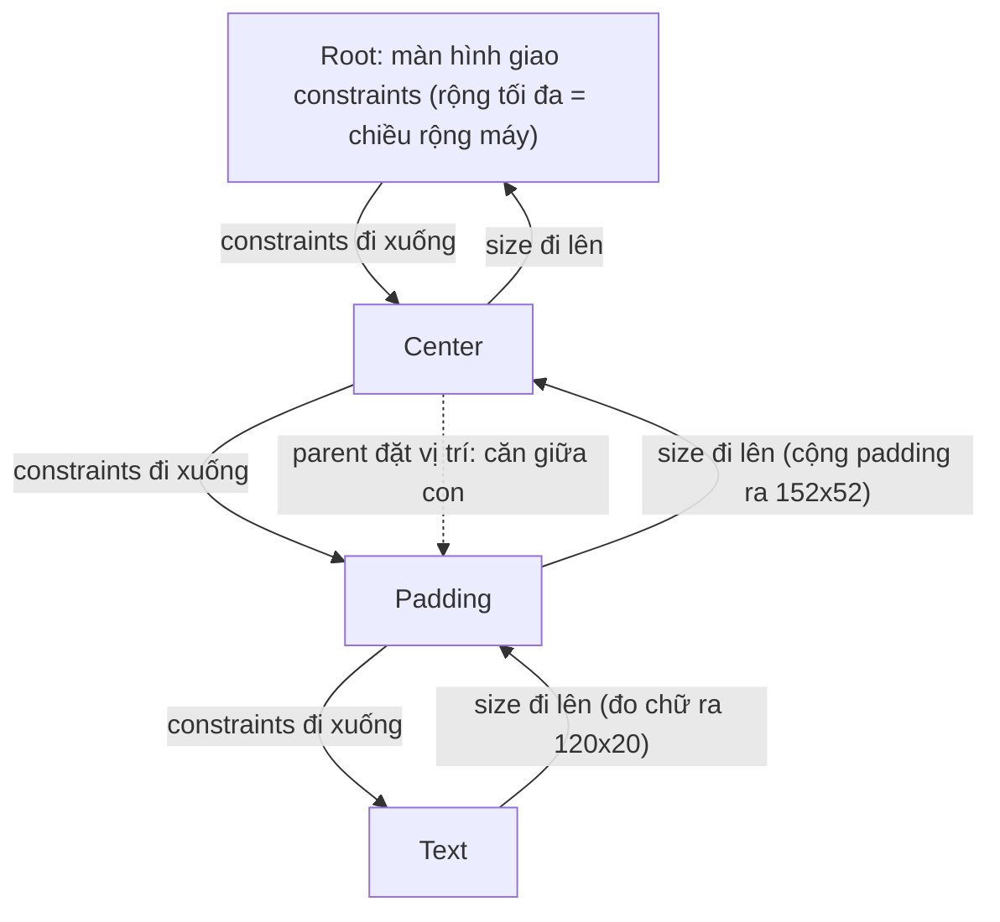
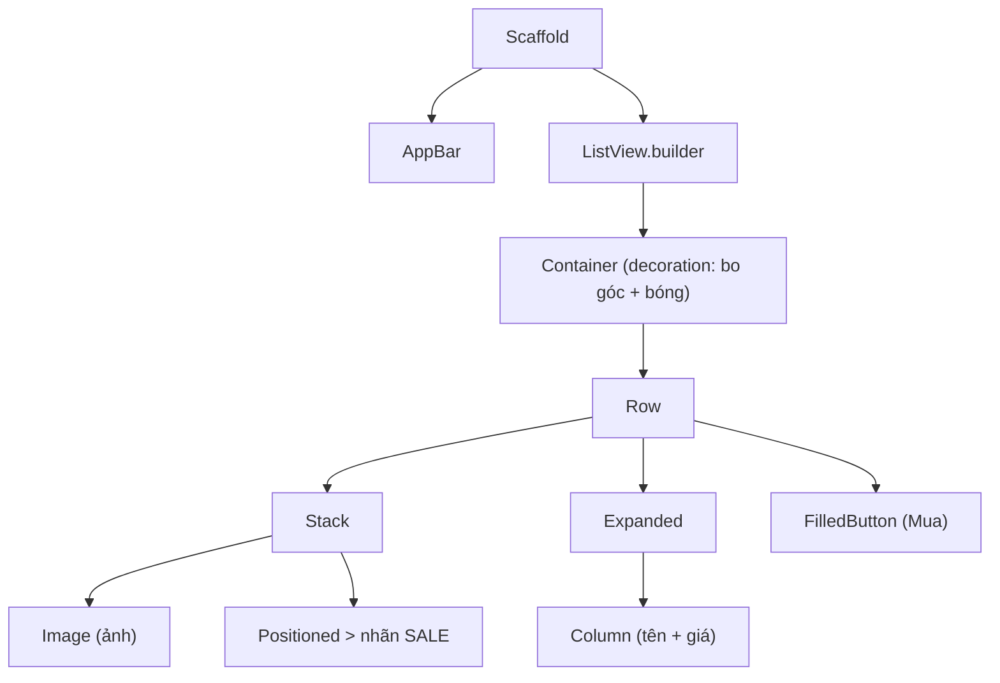

# Layout & Styling — Row, Column, constraints, Material 3

> **Tác giả:** Mr.Rom\
> **Phiên bản:** v1.0.0\
> **Tạo lúc:** 13/06/2026\
> **Cập nhật:** 13/06/2026\
> **Level:** Basic\
> **Tags:** flutter, mobile, layout, row-column, constraints, material3, theming, responsive\
> **Yêu cầu trước:** [Dart & Widgets](01_dart-and-widgets.md)

> 🎯 *Bạn vừa nắm "mọi thứ là widget" và dựng được một widget tree. Giờ bạn cần ráp chúng lại thành một màn hình thật cho Acme Shop — ảnh nằm cạnh chữ, nút bám đáy, danh sách cuộn mượt — và nhuộm cho cả app một bộ màu Material 3 đồng bộ. Bài này dạy bộ layout widget cốt lõi (Row, Column, Expanded, Stack, Container, ListView), giải thích mô hình **constraints** đặc trưng của Flutter để bạn không còn sợ lỗi "RenderFlex overflowed", rồi style toàn app bằng ThemeData + Material 3 và làm nó co giãn theo kích thước màn hình.*

## 🎯 Sau bài này bạn sẽ

- [ ] Xếp widget theo hàng/cột bằng `Row`/`Column` và căn chỉnh chúng với `mainAxisAlignment` / `crossAxisAlignment`
- [ ] Chia không gian linh hoạt bằng `Expanded` / `Flexible`, và xếp chồng widget bằng `Stack` / `Positioned`
- [ ] Trang trí một khối bằng `Container` (padding, margin, decoration) và cuộn danh sách dài bằng `ListView.builder`
- [ ] Giải thích được mô hình constraints của Flutter: *"constraints đi xuống, size đi lên, parent đặt vị trí"* — và vì sao nó gây lỗi `RenderFlex overflowed`
- [ ] Nhuộm cả app bằng **Material 3** (`ColorScheme.fromSeed`) và tinh chỉnh màu/typography qua `ThemeData`
- [ ] Cho layout co giãn theo màn hình bằng `MediaQuery` / `LayoutBuilder`, và biết khi nào dùng look iOS với Cupertino

---

## Tình huống — widget tree đã có, sao màn hình vẫn xấu?

Ở bài trước bạn đã biết cách dựng một cây widget: `Scaffold` bọc `Center` bọc `Text`. Nhưng màn hình sản phẩm thật của Acme Shop không đơn giản vậy — nó cần ảnh sản phẩm bên trái, tên và giá ở giữa, nút "Mua" dán sát mép phải, tất cả nằm trong một thẻ bo góc có đổ bóng. Bạn thử nhét mọi thứ vào một `Column` và gặp ngay ba vấn đề:

- Mọi widget dồn cục lên góc trên trái, không biết cách đẩy chúng dàn đều.
- Bạn muốn tên sản phẩm "nở ra" chiếm chỗ trống còn lại để đẩy nút về sát phải — nhưng không có cú pháp `flex: 1` quen thuộc.
- Tệ nhất: màn hình hiện một dải sọc vàng-đen ở mép kèm dòng chữ đỏ **`A RenderFlex overflowed by 137 pixels on the right`**. App không crash hẳn, nhưng nhìn như hỏng.

Gốc rễ của cả ba là cùng một thứ: bạn chưa hiểu **Flutter bố trí (layout) widget như thế nào**. Khác với CSS (nơi bạn khai `display: flex` rồi để trình duyệt tự lo), Flutter có một mô hình layout riêng, rất nhất quán, gọn trong một câu: *constraints đi xuống, size đi lên, parent đặt vị trí*. Hiểu câu đó là hiểu 90% layout Flutter — và hết sợ lỗi overflow. Bài này sẽ mổ xẻ nó, kèm bộ widget bạn dùng hằng ngày.

---

## 1️⃣ Row & Column — xếp widget theo hàng và cột

Phần lớn giao diện chỉ là widget xếp **ngang** hoặc **dọc**. Flutter cho bạn đúng hai widget cho việc đó:

- `Row` — xếp các con theo **hàng ngang**.
- `Column` — xếp các con theo **cột dọc**.

🪞 **Ẩn dụ**: `Row` và `Column` giống **kệ trưng bày trong siêu thị**. `Column` là kệ đứng nhiều tầng (món xếp chồng từ trên xuống); `Row` là quầy dài (món bày cạnh nhau từ trái qua phải). Mỗi kệ có "trục chính" (hướng dài của kệ) và "trục phụ" (hướng ngang vuông góc) — và bạn cần biết món được dồn về đâu trên mỗi trục.

Cả hai nhận một danh sách con qua thuộc tính `children`, và căn chỉnh bằng hai trục:

- **Trục chính** (main axis) — hướng widget xếp đi. Với `Row` là ngang, với `Column` là dọc. Căn bằng `mainAxisAlignment`.
- **Trục phụ** (cross axis) — hướng vuông góc. Căn bằng `crossAxisAlignment`.

Đây là điểm hay nhầm nhất, nên nhìn bảng cho rõ trước khi viết code. Hai trục **đổi vai** giữa `Row` và `Column`:

| Widget | Trục chính (`mainAxisAlignment`) | Trục phụ (`crossAxisAlignment`) |
|---|---|---|
| `Row` | Ngang (trái ↔ phải) | Dọc (trên ↔ dưới) |
| `Column` | Dọc (trên ↔ dưới) | Ngang (trái ↔ phải) |

Các giá trị căn chỉnh hay dùng trên trục chính (`MainAxisAlignment`):

| Giá trị | Ý nghĩa |
|---|---|
| `start` | Dồn các con về đầu trục (mặc định) |
| `center` | Dồn vào giữa |
| `end` | Dồn về cuối trục |
| `spaceBetween` | Đẩy con ra hai đầu, khoảng trống chia đều vào giữa |
| `spaceAround` | Khoảng trống chia đều, hai mép bằng nửa khoảng giữa |
| `spaceEvenly` | Mọi khoảng trống (kể cả hai mép) bằng nhau |

Ví dụ một hàng có tên sản phẩm bên trái và giá bên phải — đúng kiểu một dòng trong hoá đơn Acme Shop:

```dart
Row(
  mainAxisAlignment: MainAxisAlignment.spaceBetween, // đẩy 2 con ra 2 đầu
  crossAxisAlignment: CrossAxisAlignment.center,     // căn giữa theo chiều dọc
  children: const [
    Text('iPhone 15'),
    Text('25.000.000đ'),
  ],
)
```

→ `spaceBetween` đẩy `Text` tên về sát trái, `Text` giá về sát phải, khoảng trống dồn hết vào giữa. Đây là cách bố cục "nhãn — giá trị" hai đầu mà bạn sẽ gặp ở mọi màn hình.

> [!NOTE]
> Nếu bạn từng viết Flexbox bên web/React Native: `Row` của Flutter tương đương `flexDirection: 'row'`, `Column` tương đương `'column'`. Nhưng đừng nhầm chiều mặc định — Flutter **bắt buộc bạn chọn** `Row` hoặc `Column` rõ ràng, không có "mặc định trục" ngầm như CSS.

---

## 2️⃣ Mô hình constraints — câu thần chú của layout Flutter

Đây là khái niệm trừu tượng nhất của bài, và cũng là thứ phân biệt người "đoán mò layout" với người "hiểu layout". Mọi lỗi bố cục Flutter, kể cả lỗi `RenderFlex overflowed` ở đầu bài, đều xoay quanh nó.

Flutter bố trí giao diện bằng **một câu duy nhất**:

> **Constraints đi xuống. Size đi lên. Parent đặt vị trí.**
> (*Constraints go down. Sizes go up. Parent sets position.*)

Bóc tách từng vế:

- **Constraints (ràng buộc) đi xuống**: widget cha truyền xuống cho con một bộ ràng buộc — "chiều rộng của mày được phép từ `minWidth` đến `maxWidth`, chiều cao từ `minHeight` đến `maxHeight`". Con **không được** vượt khỏi khung này.
- **Size (kích thước) đi lên**: con tự quyết kích thước của mình **trong giới hạn cha cho**, rồi báo ngược kích thước đó lên cho cha biết.
- **Parent đặt vị trí**: cha nhận kích thước con báo lên, rồi quyết định **đặt con ở toạ độ nào** trong vùng của mình.

🪞 **Ẩn dụ — đặt may áo**: Cha như **thợ may**, đưa cho con (vải) một yêu cầu: *"miếng vải này rộng tối đa 50cm, cao tối đa 30cm"* (constraints đi xuống). Con tự cắt mình vừa khít, ví dụ thành 40×20cm, rồi đưa lại kích thước thật cho thợ (size đi lên). Thợ cầm miếng vải 40×20 đó và **dán nó vào vị trí** trên áo (parent đặt vị trí). Con không bao giờ tự quyết mình nằm ở đâu — nó chỉ quyết mình **to bằng nào** trong khuôn cho phép.

Quy trình này chạy đệ quy từ gốc cây xuống lá rồi dội ngược lên. Sơ đồ dưới mô tả một vòng layout cho cây `Center > Padding > Text`:



→ Điểm cốt lõi từ sơ đồ: **không widget nào tự biết vị trí cuối cùng của mình** — vị trí luôn do cha quyết. Và một widget chỉ "to" được trong khung constraints cha cho. Hiểu vậy thì lỗi overflow trở nên rất dễ giải thích, như ta sẽ thấy ngay dưới đây.

### Vì sao sinh ra lỗi `RenderFlex overflowed`

Quay lại dòng chữ đỏ đáng sợ ở đầu bài. `RenderFlex` chính là tên kỹ thuật của `Row`/`Column`. Lỗi này xảy ra khi **tổng kích thước các con vượt quá không gian cha cho** trên trục chính.

Ví dụ kinh điển: một `Row` chứa hai chuỗi văn bản dài, nhưng `Row` chỉ rộng bằng màn hình:

```dart
// ❌ SAI — tổng bề rộng 2 Text > bề rộng màn hình → overflow
Row(
  children: const [
    Text('Đây là một tên sản phẩm rất rất rất dài không chịu xuống dòng'),
    Text('25.000.000đ'),
  ],
)
```

`Row` hỏi từng `Text` con "mày muốn rộng bao nhiêu?". `Text` không bị ép xuống dòng nên đòi nguyên bề rộng của cả câu. Cộng hai con lại > bề rộng màn hình → tràn ra ngoài → sọc vàng-đen. Theo câu thần chú: con (`Text`) đòi size vượt khung, cha (`Row`) không co được nên báo overflow.

Cách sửa là **bắt con co lại trong khung** — đó là việc của `Expanded`/`Flexible`, học ngay phần sau.

> [!WARNING]
> Lỗi `RenderFlex overflowed` **không làm app crash** — app vẫn chạy, chỉ hiện sọc vàng-đen ở chế độ debug. Đừng bỏ qua nó: trên bản release sọc biến mất nhưng nội dung vẫn bị cắt mất. Luôn xử lý overflow trước khi build release.

---

## 3️⃣ Expanded & Flexible — chia không gian còn lại

`Expanded` và `Flexible` là lời giải cho cả lỗi overflow lẫn nhu cầu "cho widget này nở ra chiếm chỗ trống". Chúng chỉ đặt **bên trong `Row`, `Column` hoặc `Flex`**.

- `Expanded` — ép con **chiếm hết** không gian còn trống trên trục chính (giống `flex: 1` ở CSS). Nhiều `Expanded` thì chia theo `flex`.
- `Flexible` — **cho phép** con co lại trong không gian còn trống, nhưng không bắt nó phình ra hết (con tự nhỏ hơn cũng được).

Khác biệt một câu: `Expanded` = `Flexible(fit: FlexFit.tight)`. `Expanded` *bắt buộc* lấp đầy, `Flexible` *tối đa* được phép.

Sửa lỗi overflow ở trên bằng cách bọc `Text` tên trong `Expanded` — nó sẽ co vào phần còn lại sau khi `Text` giá lấy chỗ:

```dart
// ✅ ĐÚNG — Expanded ép tên co vào chỗ trống, không tràn
Row(
  children: const [
    Expanded(
      child: Text(
        'Đây là một tên sản phẩm rất rất rất dài',
        overflow: TextOverflow.ellipsis, // dài quá thì cắt bằng dấu "..."
      ),
    ),
    SizedBox(width: 8), // khoảng cách 8 logical pixel
    Text('25.000.000đ'),
  ],
)
```

→ Bây giờ `Row` đưa toàn bộ chỗ trống (sau khi trừ phần của `Text` giá) cho `Expanded`. `Text` tên buộc phải vừa trong đó, dài quá thì `ellipsis` cắt bằng "...". Hết overflow.

Khi cần chia tỉ lệ, mỗi `Expanded` nhận một `flex` (mặc định `1`):

```dart
Row(
  children: const [
    Expanded(flex: 2, child: ColoredBox(color: Colors.red)),  // chiếm 2 phần
    Expanded(flex: 1, child: ColoredBox(color: Colors.blue)), // chiếm 1 phần
  ],
)
```

→ Tổng `flex` là `2 + 1 = 3`, nên ô đỏ rộng 2/3 màn hình, ô xanh 1/3. Đây là cách chia cột tỉ lệ mà không cần tính pixel tay.

> [!TIP]
> Khi nào `Expanded`, khi nào `Flexible`? Mặc định dùng `Expanded` (đa số trường hợp bạn muốn lấp đầy). Chỉ chọn `Flexible` khi widget có thể **nhỏ hơn** chỗ trống và bạn không muốn ép nó phình ra (ví dụ một nút mà bạn muốn nó chỉ to bằng nội dung khi còn chỗ).

---

## 4️⃣ Stack & Positioned — xếp chồng widget lên nhau

`Row`/`Column` xếp widget cạnh nhau, không đè. Khi bạn cần **đè widget lên nhau** — như một nhãn "SALE" dán góc ảnh, hay một nút nổi đè lên ảnh bìa — bạn dùng `Stack`.

🪞 **Ẩn dụ**: `Stack` như **chồng giấy can (giấy trong suốt)** đặt lên nhau. Tờ dưới cùng là nền, các tờ trên đè lên, bạn nhìn xuyên qua thấy tất cả. `Positioned` là cách bạn **ghim một tờ vào đúng góc** của chồng.

- Các con của `Stack` xếp chồng theo thứ tự: con đầu danh sách ở **dưới cùng**, con cuối ở **trên cùng**.
- Bọc một con trong `Positioned` để ghim nó vào vị trí cụ thể bằng `top` / `right` / `bottom` / `left`.

Ví dụ ảnh sản phẩm Acme Shop với nhãn "SALE" ghim góc trên phải:

```dart
Stack(
  children: [
    // 1. Lớp dưới cùng: ảnh sản phẩm
    Image.network('https://acmeshop.vn/iphone.jpg', width: 160, height: 160),

    // 2. Lớp trên: nhãn SALE ghim góc trên-phải
    Positioned(
      top: 8,
      right: 8,
      child: Container(
        padding: const EdgeInsets.symmetric(horizontal: 8, vertical: 4),
        color: Colors.red,
        child: const Text('SALE', style: TextStyle(color: Colors.white)),
      ),
    ),
  ],
)
```

→ Ảnh là lớp nền, nhãn `SALE` là lớp trên ghim cách mép trên 8 và mép phải 8 logical pixel. Con **không** bọc `Positioned` (như ảnh ở trên) sẽ căn theo `alignment` của `Stack` (mặc định góc trên-trái).

---

## 5️⃣ Container — viên gạch trang trí vạn năng

`Container` là widget bạn dùng nhiều nhất để **trang trí và tạo khoảng cách**. Nó gói gọn nhiều việc trong một: thêm đệm trong (`padding`), đệm ngoài (`margin`), nền/viền/bo góc/đổ bóng (`decoration`), và ép kích thước.

🪞 **Ẩn dụ**: `Container` như một **hộp quà** — bạn quấn giấy gói (màu nền), buộc nơ (viền), bo tròn các cạnh, chừa khoảng đệm bên trong cho món quà không sát thành hộp, và chừa khoảng cách bên ngoài với các hộp khác.

Phân biệt hai loại khoảng cách hay nhầm:

- `padding` — đệm **bên trong**, giữa viền hộp và nội dung con.
- `margin` — đệm **bên ngoài**, giữa hộp này và các hộp xung quanh.

Ví dụ một thẻ sản phẩm bo góc, nền trắng, đổ bóng nhẹ — viên gạch của mọi card trong app:

```dart
Container(
  margin: const EdgeInsets.all(12),       // cách các thẻ khác 12 mọi phía
  padding: const EdgeInsets.all(16),       // nội dung cách viền 16
  decoration: BoxDecoration(
    color: Colors.white,                   // nền trắng
    borderRadius: BorderRadius.circular(12), // bo góc 12
    boxShadow: const [
      BoxShadow(
        color: Colors.black12,             // bóng mờ
        blurRadius: 8,                     // độ nhoè bóng
        offset: Offset(0, 2),              // bóng lệch xuống 2 pixel
      ),
    ],
  ),
  child: const Text('Nội dung thẻ'),
)
```

→ Một lưu ý quan trọng: khi đã dùng `decoration` để đặt màu, **không** được khai thêm thuộc tính `color` thẳng trên `Container` cùng lúc — Flutter sẽ báo lỗi vì màu phải nằm trong `decoration`. Đặt `color: Colors.white` **bên trong** `BoxDecoration` như trên là đúng.

---

## 6️⃣ ListView — cuộn danh sách dài

Acme Shop có hàng trăm sản phẩm. Bạn không thể nhét tất cả vào một `Column` — `Column` không cuộn được, và sẽ overflow ngay khi nội dung cao hơn màn hình. Widget cho danh sách cuộn là `ListView`.

Có hai cách dùng `ListView`, và chọn đúng cách rất quan trọng cho hiệu năng:

- `ListView(children: [...])` — dựng **toàn bộ** con ngay lập tức. Chỉ hợp danh sách **ngắn, biết trước số lượng** (vài item).
- `ListView.builder(...)` — chỉ dựng những item **đang nằm trong (hoặc gần) màn hình**, cuộn tới đâu dựng tới đó. Đây là cách đúng cho danh sách dài hoặc lấy từ API.

🪞 **Ẩn dụ**: `ListView(children: [...])` như **in cả 500 trang sách rồi mới đưa bạn đọc** — tốn giấy, chậm. `ListView.builder` như **đọc ebook** — chỉ tải đúng trang bạn đang xem, lật tới đâu tải tới đó. Cuộn 10.000 item vẫn mượt.

`ListView.builder` cần hai tham số cốt lõi:

- `itemCount` — tổng số item trong danh sách.
- `itemBuilder` — hàm nhận `(context, index)`, trả về widget cho item thứ `index`.

```dart
final products = ['iPhone 15', 'AirPods Pro', 'MacBook Air'];

ListView.builder(
  itemCount: products.length,           // số dòng
  itemBuilder: (context, index) {       // cách dựng dòng thứ index
    return ListTile(
      title: Text(products[index]),
      trailing: const Icon(Icons.chevron_right),
    );
  },
)
```

→ `ListView.builder` chỉ gọi `itemBuilder` cho các dòng đang hiển thị, nên dù `products` có 10.000 phần tử, app vẫn không lag. `ListTile` là widget dựng sẵn cho một dòng danh sách chuẩn (tiêu đề + icon hai bên).

> [!TIP]
> Quy tắc vàng: danh sách **ngắn cố định** (< 10 item, biết trước) → `ListView(children:)`. Danh sách **dài / từ API / không biết trước số lượng** → `ListView.builder`. Khi phân vân, chọn `.builder`.

---

## 7️⃣ Material 3 & theming — nhuộm cả app một bộ màu

Đến giờ bạn dựng được layout, nhưng màu mè còn lộn xộn vì mỗi widget tự khai màu riêng. Cách làm đúng là khai **một bộ theme** cho cả app, rồi mọi widget tự lấy màu/chữ từ đó. Flutter dùng hệ thiết kế **Material Design** của Google, và phiên bản hiện hành là **Material 3** (còn gọi *Material You*).

🪞 **Ẩn dụ**: `ThemeData` như **bảng nội quy đồng phục** của một chuỗi cửa hàng Acme Shop. Bạn quy định một lần "áo xanh, chữ font này, nút bo góc kiểu kia" ở văn phòng trung tâm; mọi chi nhánh (widget) tự lấy quy định đó áp dụng, không ai tự chọn màu lung tung.

Material 3 có một tính năng rất tiện: bạn chỉ cần đưa **một màu hạt giống** (`seedColor`), Flutter tự sinh ra cả một bảng màu hài hoà (nền, chữ, nút, viền...) từ đó. Hàm làm việc này là `ColorScheme.fromSeed`.

Bạn khai theme ở `MaterialApp`, áp cho toàn bộ app:

```dart
import 'package:flutter/material.dart';

void main() => runApp(const AcmeApp());

class AcmeApp extends StatelessWidget {
  const AcmeApp({super.key});

  @override
  Widget build(BuildContext context) {
    return MaterialApp(
      title: 'Acme Shop',
      theme: ThemeData(
        // 1. useMaterial3 mặc định đã là true ở Flutter 3.16+, ghi rõ cho chắc
        useMaterial3: true,
        // 2. Sinh cả bảng màu từ 1 màu hạt giống
        colorScheme: ColorScheme.fromSeed(seedColor: Colors.indigo),
        // 3. Tinh chỉnh typography (font chữ) nếu muốn
        textTheme: const TextTheme(
          titleLarge: TextStyle(fontSize: 22, fontWeight: FontWeight.bold),
          bodyMedium: TextStyle(fontSize: 14),
        ),
      ),
      home: const Scaffold(
        body: Center(child: Text('Acme Shop')),
      ),
    );
  }
}
```

→ Từ đúng một dòng `seedColor: Colors.indigo`, Flutter tô màu `AppBar`, nút, thanh điều hướng... đồng bộ tông tím-chàm. Đổi sang `Colors.green` là cả app đổi tông xanh ngay, không phải sửa từng widget.

Trong widget con, bạn **lấy màu/chữ từ theme** thay vì hardcode, để đổi theme một chỗ là cả app đổi theo:

```dart
@override
Widget build(BuildContext context) {
  final scheme = Theme.of(context).colorScheme;   // lấy bảng màu hiện tại
  final textTheme = Theme.of(context).textTheme;  // lấy bảng chữ hiện tại

  return Container(
    color: scheme.primaryContainer,               // dùng màu từ theme, không hardcode
    child: Text('Acme Shop', style: textTheme.titleLarge),
  );
}
```

→ `Theme.of(context)` "đi ngược lên cây" tìm `ThemeData` gần nhất và trả về. Nhờ vậy mọi widget chia sẻ một nguồn màu/chữ duy nhất.

### Cupertino — khi cần look iOS chính chủ

Material 3 cho ra giao diện kiểu Android/Google. Nếu bạn muốn app **trông giống iOS thuần** (nút, switch, thanh điều hướng kiểu Apple), Flutter có bộ widget song song là **Cupertino** trong `package:flutter/cupertino.dart`.

```dart
import 'package:flutter/cupertino.dart';

const CupertinoButton(
  onPressed: null,
  child: Text('Mua ngay'), // nút kiểu iOS, không phải Material
);
```

→ Phần lớn app thương mại như Acme Shop dùng **Material 3 cho cả hai nền tảng** (đồng bộ, đỡ công), chấp nhận iOS trông "hơi Google một chút". Chỉ khi khách hàng yêu cầu look iOS thuần thì mới trộn Cupertino. Mặc định: bắt đầu bằng Material 3.

---

## 8️⃣ Responsive — co giãn theo kích thước màn hình

App Acme Shop chạy trên điện thoại nhỏ lẫn tablet to. Một layout cứng sẽ đẹp trên máy này, vỡ trên máy kia. Flutter cho hai công cụ để layout **co giãn theo kích thước**:

- `MediaQuery` — hỏi **thông tin toàn màn hình**: rộng/cao bao nhiêu, có notch không, bàn phím đang che bao nhiêu.
- `LayoutBuilder` — hỏi **không gian mà widget cha thực sự cho ô này**, rồi dựng layout khác nhau tuỳ kích thước đó.

Khác biệt: `MediaQuery` nhìn cả màn hình; `LayoutBuilder` chỉ nhìn ô cha cấp cho widget hiện tại. Với responsive cục bộ, `LayoutBuilder` chính xác hơn.

Ví dụ: màn hình hẹp (điện thoại) hiện 1 cột, màn hình rộng (tablet) hiện 2 cột:

```dart
LayoutBuilder(
  builder: (context, constraints) {
    // constraints.maxWidth là bề rộng cha cấp cho ô này
    if (constraints.maxWidth < 600) {
      return const _ProductColumn();   // điện thoại: 1 cột
    } else {
      return const _ProductGrid();     // tablet: lưới nhiều cột
    }
  },
)
```

→ `constraints.maxWidth` chính là phần "constraints đi xuống" trong câu thần chú ở mục 2 — `LayoutBuilder` cho bạn **đọc được** ràng buộc cha gửi xuống để quyết định layout. Mốc 600 logical pixel là ranh giới điện thoại/tablet thông dụng.

Lấy bề rộng toàn màn hình qua `MediaQuery` khi cần:

```dart
final width = MediaQuery.sizeOf(context).width; // bề rộng màn hình (logical pixel)
```

→ Dùng `MediaQuery.sizeOf(context)` (API hiện hành, hiệu quả hơn `MediaQuery.of(context).size` vì chỉ rebuild khi size đổi).

---

## 9️⃣ Ráp lại — màn hình sản phẩm Acme Shop hoàn chỉnh

Giờ ráp tất cả thành một file chạy được: `Scaffold` làm khung, `AppBar` lấy màu từ theme, `ListView.builder` cuộn danh sách sản phẩm, mỗi sản phẩm là một `Container` (decoration) chứa `Row` (`Image` + `Expanded` thông tin + nút), và một nhãn "SALE" dùng `Stack`/`Positioned`. Dán nguyên file này vào `lib/main.dart` của một dự án Flutter mới là chạy.

```dart
import 'package:flutter/material.dart';

void main() => runApp(const AcmeApp());

// 1. Kiểu dữ liệu 1 sản phẩm
class Product {
  final String name;
  final int price;
  final String image;
  final bool onSale;
  const Product(this.name, this.price, this.image, {this.onSale = false});
}

// 2. Dữ liệu mẫu — thực tế sẽ fetch từ API (bài sau)
const products = <Product>[
  Product('iPhone 15', 25000000, 'https://acmeshop.vn/iphone.jpg', onSale: true),
  Product('AirPods Pro', 5000000, 'https://acmeshop.vn/airpods.jpg'),
  Product('MacBook Air', 28000000, 'https://acmeshop.vn/macbook.jpg', onSale: true),
];

// 3. App gốc — khai theme Material 3 một lần cho cả app
class AcmeApp extends StatelessWidget {
  const AcmeApp({super.key});

  @override
  Widget build(BuildContext context) {
    return MaterialApp(
      title: 'Acme Shop',
      theme: ThemeData(
        useMaterial3: true,
        colorScheme: ColorScheme.fromSeed(seedColor: Colors.indigo),
      ),
      home: const ProductScreen(),
    );
  }
}

// 4. Màn hình danh sách sản phẩm
class ProductScreen extends StatelessWidget {
  const ProductScreen({super.key});

  @override
  Widget build(BuildContext context) {
    return Scaffold(
      appBar: AppBar(title: const Text('Acme Shop')), // tự lấy màu từ theme
      body: ListView.builder(
        itemCount: products.length,
        itemBuilder: (context, index) => ProductCard(product: products[index]),
      ),
    );
  }
}

// 5. Một thẻ sản phẩm — Container + Row + Stack
class ProductCard extends StatelessWidget {
  final Product product;
  const ProductCard({super.key, required this.product});

  @override
  Widget build(BuildContext context) {
    final scheme = Theme.of(context).colorScheme;

    return Container(
      margin: const EdgeInsets.symmetric(horizontal: 12, vertical: 6),
      padding: const EdgeInsets.all(12),
      decoration: BoxDecoration(
        color: scheme.surface,
        borderRadius: BorderRadius.circular(12),
        boxShadow: const [
          BoxShadow(color: Colors.black12, blurRadius: 8, offset: Offset(0, 2)),
        ],
      ),
      child: Row(
        children: [
          // 5a. Ảnh + nhãn SALE xếp chồng bằng Stack
          Stack(
            children: [
              Image.network(
                product.image,
                width: 64,
                height: 64,
                // ảnh lỗi/loading thì hiện ô xám thay vì vỡ layout
                errorBuilder: (context, error, stack) => Container(
                  width: 64,
                  height: 64,
                  color: Colors.black12,
                ),
              ),
              if (product.onSale)
                Positioned(
                  top: 0,
                  right: 0,
                  child: Container(
                    padding: const EdgeInsets.symmetric(horizontal: 4, vertical: 2),
                    color: Colors.red,
                    child: const Text(
                      'SALE',
                      style: TextStyle(color: Colors.white, fontSize: 10),
                    ),
                  ),
                ),
            ],
          ),
          const SizedBox(width: 12), // khoảng cách ảnh — thông tin

          // 5b. Khối thông tin nở ra chiếm chỗ trống (Expanded)
          Expanded(
            child: Column(
              crossAxisAlignment: CrossAxisAlignment.start, // căn trái
              mainAxisAlignment: MainAxisAlignment.center,
              children: [
                Text(
                  product.name,
                  maxLines: 1,
                  overflow: TextOverflow.ellipsis, // tên dài thì cắt "..."
                  style: Theme.of(context).textTheme.titleMedium,
                ),
                const SizedBox(height: 4),
                Text(
                  '${product.price.toString()}đ',
                  style: TextStyle(color: scheme.primary),
                ),
              ],
            ),
          ),

          // 5c. Nút Mua dán sát phải
          FilledButton(
            onPressed: () => debugPrint('Đã thêm: ${product.name}'),
            child: const Text('Mua'),
          ),
        ],
      ),
    );
  }
}
```

Vài điểm đáng chú ý, đọc kỹ để thấy mọi luật trong bài gắn vào đâu:

- `Row` chứa `Image` (kích thước cố định 64×64), `Expanded` (khối thông tin nở ra), và `FilledButton` (kích thước theo nội dung). `Expanded` ở giữa chính là thứ đẩy nút `Mua` về sát phải — và cũng là thứ **ngăn overflow** vì nó co tên dài lại trong khung.
- `overflow: TextOverflow.ellipsis` + `maxLines: 1` trên tên sản phẩm: dù tên dài cỡ nào cũng không tràn ra ngoài — đây là cách phòng lỗi `RenderFlex overflowed` cho văn bản.
- `Stack` + `Positioned` ghim nhãn `SALE` vào góc trên-phải của ảnh, chỉ hiện khi `product.onSale == true`.
- Màu lấy từ `Theme.of(context).colorScheme` (`scheme.surface`, `scheme.primary`) — đổi `seedColor` ở `AcmeApp` là cả màn hình đổi tông, không sửa từng widget.
- `errorBuilder` của `Image.network` hiện ô xám khi ảnh chưa tải xong hoặc lỗi, tránh vỡ layout.

→ Toàn bộ màn hình dùng đúng bộ widget đã học (`Scaffold`, `ListView.builder`, `Container`, `Row`, `Column`, `Stack`, `Positioned`, `Expanded`), style 100% qua theme Material 3. Đây là khung mẫu cho mọi màn hình danh sách trong app thật.

App vừa ráp là một **cây widget**. Sơ đồ dưới mô tả cấu trúc cây cho một `ProductCard`:



→ So với cây ở bài trước, cây này phức tạp hơn nhiều nhánh — nhưng vẫn cùng nguyên lý: cha truyền constraints xuống, con báo size lên, cha đặt vị trí. `Row` cấp constraints cho `Expanded`, `Expanded` ép `Column` con vừa khung — đó là lý do không có dải sọc overflow nào.

---

## 💡 Cạm bẫy thường gặp & Best practice

### ❌ Cạm bẫy: `RenderFlex overflowed` vì văn bản dài trong `Row`

- **Triệu chứng**: Dải sọc vàng-đen ở mép màn hình kèm dòng đỏ `A RenderFlex overflowed by N pixels`. Nội dung bị cắt cụt.
- **Nguyên nhân**: Một con trong `Row`/`Column` (thường là `Text` dài hoặc ảnh) đòi kích thước vượt không gian cha cấp trên trục chính. Theo câu thần chú: con báo size vượt constraints cha cho.
- **Cách tránh**: Bọc con co giãn được trong `Expanded` (hoặc `Flexible`), và với văn bản thêm `overflow: TextOverflow.ellipsis` + `maxLines`. Cho danh sách dài thì dùng `ListView` (cuộn được) thay vì `Column`.

### ❌ Cạm bẫy: Cho `Column`/`ListView` vào nơi có chiều cao vô hạn (unbounded height)

- **Triệu chứng**: Lỗi `Vertical viewport was given unbounded height` hoặc `RenderFlex children have non-zero flex but incoming height constraints are unbounded`.
- **Nguyên nhân**: Đặt `ListView` (hoặc `Column` có `Expanded` con) thẳng vào một cha **không giới hạn chiều cao** — ví dụ một `Column` khác đang cuộn. Cha không cấp được constraints chiều cao hữu hạn nên con không biết "cao tối đa bao nhiêu".
- **Cách tránh**: Bọc `ListView` trong `Expanded` (nếu cha là `Column` có chiều cao xác định) hoặc đặt `shrinkWrap: true` cho `ListView` nhỏ. Luôn đảm bảo widget cuộn nhận được constraints chiều cao hữu hạn.

### ✅ Best practice: Theme hoá màu/chữ, không hardcode

- **Vì sao**: Hardcode `Color(0xFF...)` rải rác khiến đổi tông màu phải sửa hàng chục chỗ. Lấy từ `Theme.of(context)` giúp đổi `seedColor` một chỗ là cả app đồng bộ, và tự hỗ trợ dark mode về sau.
- **Cách áp dụng**: Khai `ColorScheme.fromSeed` + `textTheme` trong `ThemeData` ở `MaterialApp`. Trong widget con dùng `Theme.of(context).colorScheme.primary`, `...textTheme.titleLarge` thay cho màu/cỡ chữ cứng.

### ✅ Best practice: Dùng `ListView.builder` cho danh sách dài

- **Vì sao**: `ListView(children:)` và `Column` dựng toàn bộ con ngay lập tức — danh sách dài tốn RAM, dựng chậm, dễ giật. `.builder` chỉ dựng item đang thấy.
- **Cách áp dụng**: `ListView.builder(itemCount: ..., itemBuilder: (context, index) => ...)`. Khi phân vân giữa `Column` và `ListView` cho nội dung có thể tràn màn hình, chọn `ListView`.

---

## 🧠 Tự kiểm tra (Self-check)

**Q1.** Phát biểu câu "thần chú" mô tả mô hình layout của Flutter và giải thích từng vế.

<details>
<summary>💡 Xem giải thích</summary>

**"Constraints đi xuống. Size đi lên. Parent đặt vị trí."**

- **Constraints đi xuống**: widget cha truyền cho con khoảng cho phép (min/max của rộng và cao). Con không được vượt khung này.
- **Size đi lên**: con tự chọn kích thước trong khung cha cho, rồi báo ngược lên cho cha.
- **Parent đặt vị trí**: cha nhận size con báo lên rồi quyết định đặt con ở toạ độ nào. Con không bao giờ tự quyết vị trí của mình.

</details>

**Q2.** Trong một `Row`, `mainAxisAlignment` căn theo chiều nào, `crossAxisAlignment` chiều nào? Còn trong `Column` thì sao?

<details>
<summary>💡 Xem giải thích</summary>

- `Row`: trục chính (`mainAxisAlignment`) là **ngang** (trái ↔ phải), trục phụ (`crossAxisAlignment`) là **dọc** (trên ↔ dưới).
- `Column`: ngược lại — trục chính là **dọc**, trục phụ là **ngang**.

Hai trục đổi vai giữa `Row` và `Column` — đây là chỗ hay nhầm nhất.

</details>

**Q3.** Một `Row` chứa một `Text` tên sản phẩm dài và một `Text` giá báo lỗi `RenderFlex overflowed`. Sửa thế nào?

<details>
<summary>💡 Xem giải thích</summary>

Bọc `Text` tên trong `Expanded` để nó co vào phần còn lại sau khi `Text` giá lấy chỗ, và thêm `overflow: TextOverflow.ellipsis` để dài quá thì cắt bằng "...":

```dart
Row(
  children: const [
    Expanded(
      child: Text('Tên rất dài', overflow: TextOverflow.ellipsis),
    ),
    Text('25.000.000đ'),
  ],
)
```

Theo câu thần chú: `Expanded` ép con vừa trong constraints cha cấp, nên hết tràn.

</details>

**Q4.** Khác biệt giữa `Expanded` và `Flexible` là gì?

<details>
<summary>💡 Xem giải thích</summary>

`Expanded` **bắt buộc** con chiếm hết không gian còn trống trên trục chính (`Expanded` = `Flexible(fit: FlexFit.tight)`). `Flexible` chỉ **cho phép** con co trong khoảng trống nhưng không ép nó phình ra hết — con có thể nhỏ hơn. Mặc định dùng `Expanded`; chọn `Flexible` khi muốn widget chỉ to bằng nội dung khi còn chỗ.

</details>

**Q5.** Bạn muốn đổi cả app từ tông tím sang tông xanh lá chỉ bằng một thay đổi. Làm thế nào, và vì sao được như vậy?

<details>
<summary>💡 Xem giải thích</summary>

Đổi `seedColor` trong `ColorScheme.fromSeed(seedColor: ...)` ở `ThemeData` của `MaterialApp` — ví dụ từ `Colors.indigo` sang `Colors.green`. Material 3 tự sinh lại cả bảng màu hài hoà từ màu hạt giống mới. Được như vậy vì mọi widget lấy màu qua `Theme.of(context).colorScheme` thay vì hardcode, nên đổi nguồn một chỗ là cả app đổi theo.

</details>

---

## ⚡ Tra cứu nhanh (Cheatsheet)

| Mục đích | Cú pháp Flutter |
|---|---|
| Xếp ngang | `Row(children: [...])` |
| Xếp dọc | `Column(children: [...])` |
| Căn trục chính | `mainAxisAlignment: MainAxisAlignment.spaceBetween` |
| Căn trục phụ | `crossAxisAlignment: CrossAxisAlignment.center` |
| Chiếm hết chỗ trống | `Expanded(child: ...)` |
| Cho phép co (không ép phình) | `Flexible(child: ...)` |
| Xếp chồng | `Stack(children: [...])` |
| Ghim vị trí trong Stack | `Positioned(top: 8, right: 8, child: ...)` |
| Khoảng đệm trong | `padding: EdgeInsets.all(16)` |
| Khoảng đệm ngoài | `margin: EdgeInsets.all(12)` |
| Nền + bo góc + bóng | `decoration: BoxDecoration(color: ..., borderRadius: ..., boxShadow: [...])` |
| Khoảng cách cố định | `SizedBox(width: 12)` / `SizedBox(height: 8)` |
| Danh sách dài cuộn | `ListView.builder(itemCount: ..., itemBuilder: (c, i) => ...)` |
| Theme Material 3 | `ThemeData(useMaterial3: true, colorScheme: ColorScheme.fromSeed(seedColor: ...))` |
| Lấy màu từ theme | `Theme.of(context).colorScheme.primary` |
| Lấy chữ từ theme | `Theme.of(context).textTheme.titleLarge` |
| Bề rộng màn hình | `MediaQuery.sizeOf(context).width` |
| Layout theo kích thước cha | `LayoutBuilder(builder: (context, constraints) => ...)` |

### Đối chiếu khái niệm CSS → Flutter

```text
display: flex; flex-direction: row;   →  Row(children: [...])
flex-direction: column;               →  Column(children: [...])
justify-content: space-between;       →  mainAxisAlignment: MainAxisAlignment.spaceBetween
align-items: center;                  →  crossAxisAlignment: CrossAxisAlignment.center
flex: 1;                              →  Expanded(child: ...)
position: absolute;                   →  Positioned(...) trong Stack
padding / margin / box-shadow         →  Container(padding, margin, decoration)
```

---

## 📚 Từ Điển Thuật Ngữ (Glossary)

| EN | VN | Giải thích |
|---|---|---|
| Row | Hàng | Widget xếp các con theo hàng ngang |
| Column | Cột | Widget xếp các con theo cột dọc |
| Main axis | Trục chính | Hướng widget xếp đi (ngang với Row, dọc với Column) |
| Cross axis | Trục phụ | Hướng vuông góc với trục chính |
| Constraints | Ràng buộc | Khoảng kích thước (min/max rộng-cao) cha cấp cho con |
| Expanded | Nở hết | Bắt con chiếm hết chỗ trống trên trục chính (giống `flex: 1`) |
| Flexible | Linh hoạt | Cho con co trong chỗ trống, không ép phình ra hết |
| Stack | Chồng lớp | Widget xếp chồng các con đè lên nhau |
| Positioned | Ghim vị trí | Ghim một con của Stack vào toạ độ cụ thể |
| Container | Hộp chứa | Widget gói padding/margin/decoration/kích thước |
| BoxDecoration | Trang trí hộp | Khai nền, viền, bo góc, đổ bóng cho Container |
| EdgeInsets | Lề | Mô tả khoảng đệm 4 phía (padding/margin) |
| ListView | Danh sách cuộn | Widget hiển thị danh sách cuộn được |
| ListView.builder | Danh sách dựng lười | Chỉ dựng item đang thấy, tối ưu cho danh sách dài |
| Material 3 | Material You | Hệ thiết kế hiện hành của Google trong Flutter |
| ThemeData | Dữ liệu chủ đề | Bộ cấu hình màu/chữ/hình dạng cho cả app |
| ColorScheme | Bảng màu | Tập màu phối hợp (primary, surface...) của theme |
| ColorScheme.fromSeed | Sinh màu từ hạt giống | Tạo cả bảng màu hài hoà từ một màu gốc |
| Cupertino | Cupertino | Bộ widget Flutter mô phỏng giao diện iOS |
| MediaQuery | Truy vấn màn hình | Cung cấp kích thước/đặc điểm toàn màn hình |
| LayoutBuilder | Dựng theo bố cục | Cho biết constraints cha cấp để dựng layout tuỳ kích thước |
| RenderFlex overflow | Tràn bố cục | Lỗi khi tổng size các con vượt không gian cha cấp |

---

## 🔗 Liên kết & Tài nguyên

⬅️ **Bài trước:** [Dart & Widgets — Mọi thứ là widget](01_dart-and-widgets.md)
➡️ **Bài tiếp theo:** [Quản lý State — setState đến Provider/Riverpod](03_state-management.md)
↑ **Về cụm:** [Flutter cơ bản](../../README.md)

### 🧭 Định hướng lộ trình học

- [Dart & Widgets — Mọi thứ là widget](01_dart-and-widgets.md) — nền tảng widget tree trước khi vào layout
- [Quản lý State — setState đến Provider/Riverpod](03_state-management.md) — bài kế: làm cho layout "sống" với dữ liệu thay đổi

### 🧩 Các chủ đề có thể bạn quan tâm

- [Core Components & Styling — View, Text, Flexbox](../../../react-native/lessons/01_basic/01_core-components-and-styling.md) — cách React Native làm layout, đối chiếu với Flutter
- [Phát triển mobile đa nền tảng là gì?](../../../cross-platform-concepts/lessons/01_basic/00_what-is-cross-platform-mobile.md) — bức tranh tổng về cross-platform

### 🌐 Tài nguyên tham khảo khác

- [Flutter docs — Layouts in Flutter](https://docs.flutter.dev/ui/layout) — hướng dẫn chính thức về Row/Column/Stack
- [Flutter docs — Understanding constraints](https://docs.flutter.dev/ui/layout/constraints) — bài giải thích sâu mô hình constraints
- [Material 3 — Material Design](https://m3.material.io/) — đặc tả Material 3 chính thức
- [Flutter docs — Adaptive & responsive design](https://docs.flutter.dev/ui/adaptive-responsive) — làm app co giãn theo màn hình

---

## 📌 Nhật ký thay đổi (Changelog)

- **v1.0.0 (13/06/2026)** — Bản đầu tiên. Cluster `flutter/` lesson 2/5 (basic). Cover: layout widget (Row/Column với main/cross axis alignment, Expanded/Flexible, Stack/Positioned, Container với padding/margin/decoration, ListView.builder) + mô hình constraints ("constraints đi xuống, size đi lên, parent đặt vị trí") giải thích lỗi RenderFlex overflow + Material 3 (ColorScheme.fromSeed, ThemeData, typography) + Cupertino cho look iOS + responsive (MediaQuery.sizeOf, LayoutBuilder) + màn hình ProductScreen hoàn chỉnh cho Acme Shop. 2 sơ đồ mermaid (vòng layout constraints, cây widget). Cạm bẫy: RenderFlex overflow do văn bản dài, unbounded height cho ListView/Column.
</content>
</invoke>
