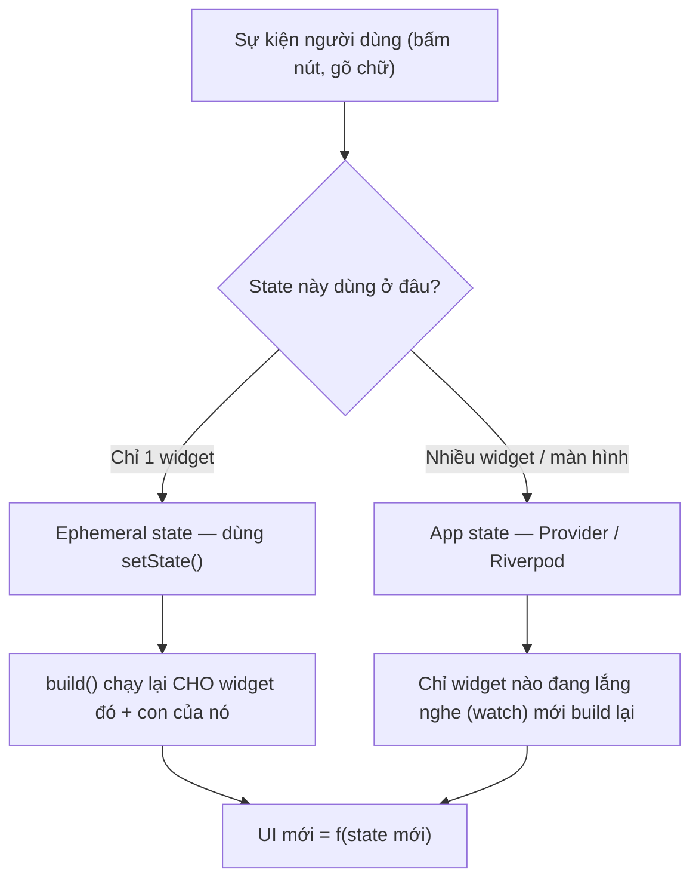
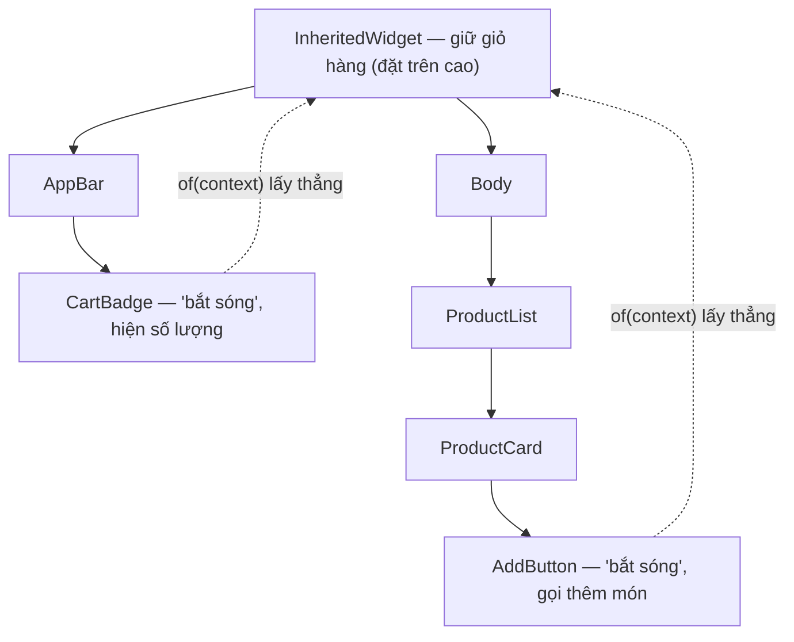

# Quản lý State — setState đến Provider/Riverpod

> **Tác giả:** Mr.Rom\
> **Phiên bản:** v1.0.0\
> **Tạo lúc:** 13/06/2026\
> **Cập nhật:** 13/06/2026\
> **Level:** Basic\
> **Tags:** flutter, dart, state-management, setState, provider, riverpod, mobile\
> **Yêu cầu trước:** [Layout & Styling](02_layout-and-styling.md)

> 🎯 *Bạn đã biết dựng giao diện Flutter tĩnh bằng `Row`, `Column`, `Container`. Nhưng app thật phải "sống": bấm nút thì số lượng giỏ hàng tăng, gõ ô tìm kiếm thì danh sách lọc lại. Đó là **state** (trạng thái) — dữ liệu thay đổi theo thời gian khiến UI vẽ lại. Bài này đi từ `setState` (đủ cho widget lẻ) tới lúc nó "đuối", rồi tới `InheritedWidget` (nền của mọi giải pháp), và cuối cùng là **Provider** + **Riverpod** — cách quản lý state chia sẻ toàn app cho giỏ hàng Acme Shop.*

## 🎯 Sau bài này bạn sẽ

- [ ] Phân biệt **ephemeral state** (state cục bộ 1 widget) với **app state** (state chia sẻ nhiều màn hình)
- [ ] Dùng `setState` cho state cục bộ và hiểu kỹ thuật **lifting state up** (nâng state lên cha)
- [ ] Chỉ ra được 2 lý do `setState` "đuối" khi app lớn: **prop drilling** và **rebuild rộng**
- [ ] Hiểu `InheritedWidget` là cơ chế nền mà Provider/Riverpod đều dựa lên
- [ ] Viết được giỏ hàng Acme Shop bằng cả **Provider** (`ChangeNotifier`) và **Riverpod** (`Notifier`)
- [ ] Biết chọn giải pháp nào theo quy mô app, và biết Bloc tồn tại để cân nhắc về sau

---

## Tình huống — nút "Thêm vào giỏ" mà cả app chẳng ai biết

Ở Acme Shop, bạn vừa dựng xong màn hình danh sách sản phẩm. Mỗi sản phẩm có nút **"Thêm vào giỏ"**. Trên góc phải `AppBar`, bạn muốn có một **badge** (huy hiệu) hiện số lượng món trong giỏ — kiểu `🛒 3`.

Bạn thử dùng `setState` ngay trên màn hình sản phẩm:

```dart
// Trong màn hình sản phẩm
int soLuongTrongGio = 0;

// Khi bấm nút:
setState(() {
  soLuongTrongGio++;
});
```

Số chạy lên đúng. Nhưng rồi vấn đề ập tới:

- Badge giỏ hàng nằm ở `AppBar` — **một widget khác**, có khi ở **màn hình khác**. Làm sao nó biết `soLuongTrongGio` vừa tăng?
- Người dùng vào màn hình **chi tiết sản phẩm** rồi bấm "Thêm vào giỏ" ở đó. Hai màn hình, hai biến `soLuongTrongGio` riêng — chúng **không nói chuyện với nhau**.
- Bạn vào màn hình **Giỏ hàng** để xoá 1 món. Quay lại, badge ở `AppBar` vẫn hiện số cũ vì nó **không hề hay biết**.

`setState` chỉ vẽ lại đúng **cái widget gọi nó** và con của nó. Nó không có cách nào báo cho widget ở nhánh khác của cây. Đây chính là ranh giới: `setState` tuyệt vời cho state **cục bộ**, nhưng giỏ hàng là dữ liệu **dùng chung toàn app** — cần một công cụ khác.

→ Bài này đi đúng theo hành trình đó: hiểu `setState` cho tới giới hạn của nó, rồi mở khoá Provider/Riverpod để cả app cùng "nhìn thấy" một giỏ hàng.

---

## 1️⃣ State là gì, và vì sao UI lại "vẽ lại"?

Trước khi chọn công cụ, phải hiểu **state** là gì trong tư duy Flutter.

**State** (trạng thái) là **bất kỳ dữ liệu nào có thể thay đổi trong lúc app chạy** và khi nó đổi thì giao diện cần vẽ lại để phản ánh. Ví dụ: số món trong giỏ, từ khoá đang gõ, công tắc dark mode đang bật hay tắt, danh sách sản phẩm vừa tải về từ API.

🪞 **Ẩn dụ — UI là một hàm của state:** Hãy hình dung màn hình giống **bảng điện tử ở sân bay**. Bảng không tự nghĩ ra chuyến bay — nó chỉ **hiển thị lại dữ liệu** từ hệ thống điều phối. Dữ liệu (state) đổi "Delayed → Boarding", bảng tự vẽ lại dòng đó. Trong Flutter có một công thức gần như tín điều:

```text
UI = f(state)
```

Tức là *giao diện là kết quả của một hàm chạy trên state*. Bạn không "tự tay sửa pixel trên màn hình" như jQuery thời xưa (`element.innerText = ...`). Bạn chỉ **đổi state**, rồi Flutter gọi lại hàm `build()` để vẽ ra UI mới ứng với state mới. Nhiệm vụ của mọi giải pháp quản lý state — từ `setState` tới Riverpod — chỉ là trả lời một câu: *"state vừa đổi rồi, những widget nào cần build lại, và làm sao báo cho chúng?"*.

Flutter chia state làm **2 loại** — phân biệt được 2 loại này là đã chọn đúng được 80% công cụ. Bảng dưới là ranh giới cốt lõi của cả bài:

| Tiêu chí | Ephemeral state (state cục bộ) | App state (state ứng dụng) |
|---|---|---|
| Ai cần dữ liệu này? | Chỉ **một widget** | **Nhiều widget / nhiều màn hình** |
| Sống bao lâu? | Theo vòng đời của widget đó | Theo vòng đời cả phiên dùng app |
| Ví dụ ở Acme Shop | Tab đang chọn, ô input đang gõ, animation | Giỏ hàng, user đã đăng nhập, dark mode |
| Công cụ phù hợp | `setState` | Provider / Riverpod / Bloc |

> 💡 Hai loại state này là khái niệm trừu tượng nhất của bài. Trước khi xem code, hãy nhìn sơ đồ luồng "state đổi → ai vẽ lại" để có bản đồ tổng thể trong đầu.



→ Điểm mấu chốt từ sơ đồ: cả hai nhánh đều quy về một việc — build lại để ra UI mới. Khác biệt là **phạm vi**: `setState` vẽ lại cả một nhánh cây, còn Provider/Riverpod cho phép chỉ widget *đang lắng nghe* mới vẽ lại. Giữ ý này trong đầu, ta đi vào từng công cụ.

---

## 2️⃣ `setState` — công cụ đầu tiên, đủ dùng cho state cục bộ

`setState` là cách quản lý state **có sẵn trong Flutter**, không cần thư viện. Nó sống trong `StatefulWidget`. Quy tắc duy nhất: **mọi thay đổi state phải nằm trong `setState(() { ... })`** — đó là cách bạn "báo" cho Flutter rằng "dữ liệu vừa đổi, làm ơn build lại".

🪞 **Ẩn dụ:** `setState` giống cái **nút "làm mới"** gắn riêng cho từng widget. Bấm nó, Flutter biết "à, khu vực này có dữ liệu mới" và vẽ lại đúng khu vực đó.

Hãy làm một bộ đếm giỏ hàng cục bộ. Code dưới đây là một `StatefulWidget` hoàn chỉnh, dán vào một dự án Flutter mới (thay `MyHomePage`) là chạy:

```dart
import 'package:flutter/material.dart';

class CartCounter extends StatefulWidget {
  const CartCounter({super.key});

  @override
  State<CartCounter> createState() => _CartCounterState();
}

class _CartCounterState extends State<CartCounter> {
  // 1. State cục bộ — chỉ widget này quan tâm
  int _soLuong = 0;

  void _them() {
    // 2. Đổi state PHẢI bọc trong setState để Flutter biết mà build lại
    setState(() {
      _soLuong++;
    });
  }

  @override
  Widget build(BuildContext context) {
    // 3. build() chạy lại mỗi lần setState → đọc _soLuong mới nhất
    return Column(
      mainAxisAlignment: MainAxisAlignment.center,
      children: [
        Text('Trong giỏ: $_soLuong món', style: const TextStyle(fontSize: 20)),
        const SizedBox(height: 12),
        ElevatedButton(
          onPressed: _them,
          child: const Text('Thêm vào giỏ'),
        ),
      ],
    );
  }
}
```

Chạy lên: mỗi lần bấm "Thêm vào giỏ", dòng chữ tăng `0 → 1 → 2...`. Cơ chế: bấm nút → `_them()` → `setState` → Flutter đánh dấu widget này "dirty" (bẩn) → khung hình kế tiếp gọi lại `build()` → `build()` đọc `_soLuong` mới và vẽ ra `Text` mới.

> [!WARNING]
> Đừng đổi state mà **quên `setState`** (kiểu `_soLuong++;` đứng trần). Giá trị biến đổi trong bộ nhớ nhưng Flutter **không biết** để build lại, nên màn hình "đứng im" — đây là một trong những lỗi gây bối rối nhất với người mới.

### Lifting state up — khi 2 widget anh em cần chung 1 state

`setState` chỉ vẽ lại widget gọi nó **và con của nó**. Vậy nếu hai widget **anh em** (cùng cha, không phải cha-con) cần dùng chung một state thì sao? Ví dụ: ô tìm kiếm (`SearchBox`) gõ từ khoá, còn danh sách (`ProductList`) phải lọc theo từ khoá đó. Hai đứa ngang hàng nhau.

Giải pháp kinh điển của React lẫn Flutter: **lifting state up** (nâng state lên cha chung gần nhất). Đặt state ở widget **cha** bao cả hai, rồi truyền *dữ liệu xuống* và *callback lên* qua constructor.

🪞 **Ẩn dụ:** Hai anh em không tự nói chuyện được thì **đưa món đồ chung cho bố mẹ giữ**. Ai cần thì bố mẹ đưa; ai muốn đổi thì nói bố mẹ đổi giùm.

```dart
import 'package:flutter/material.dart';

// CHA — giữ state "keyword" rồi chia cho 2 con
class SearchScreen extends StatefulWidget {
  const SearchScreen({super.key});

  @override
  State<SearchScreen> createState() => _SearchScreenState();
}

class _SearchScreenState extends State<SearchScreen> {
  String _keyword = ''; // state sống ở CHA

  @override
  Widget build(BuildContext context) {
    return Column(
      children: [
        // Truyền callback LÊN: con gọi để báo cha "keyword đổi rồi"
        SearchBox(onChanged: (value) {
          setState(() => _keyword = value);
        }),
        // Truyền dữ liệu XUỐNG: con đọc keyword để lọc
        Expanded(child: ProductList(keyword: _keyword)),
      ],
    );
  }
}

// CON 1 — chỉ nhận callback, không tự giữ state
class SearchBox extends StatelessWidget {
  final ValueChanged<String> onChanged;
  const SearchBox({super.key, required this.onChanged});

  @override
  Widget build(BuildContext context) {
    return TextField(
      decoration: const InputDecoration(hintText: 'Tìm sản phẩm...'),
      onChanged: onChanged,
    );
  }
}

// CON 2 — chỉ nhận dữ liệu để hiển thị
class ProductList extends StatelessWidget {
  final String keyword;
  const ProductList({super.key, required this.keyword});

  @override
  Widget build(BuildContext context) {
    return Center(child: Text('Đang lọc theo: "$keyword"'));
  }
}
```

→ State sống ở cha (`_SearchScreenState`), con chỉ là "tay sai": `SearchBox` báo lên, `ProductList` nhận xuống. Đây là pattern nền tảng — và cũng chính là **hạt giống của vấn đề** mà phần sau sẽ mổ xẻ.

---

## 3️⃣ Vì sao `setState` "đuối" khi app lớn?

Lifting state up rất gọn khi cha và con chỉ cách nhau 1-2 tầng. Nhưng app thật có cây widget **sâu hàng chục tầng**. Lúc đó `setState` + lifting state up lộ ra hai vết nứt lớn.

### Vết nứt 1 — Prop drilling (khoan props xuyên nhiều tầng)

Quay lại giỏ hàng Acme Shop. State `gioHang` phải đặt ở widget cha cao nhất (vì badge ở `AppBar` và nút "Thêm" ở màn hình sản phẩm đều cần). Nhưng nút "Thêm" nằm sâu **5-6 tầng** dưới đó:

```text
App
 └─ HomeScreen          (giữ state gioHang)
     └─ ProductTab
         └─ ProductList
             └─ ProductCard
                 └─ AddButton   ← chỗ thật sự cần gọi "thêm vào giỏ"
```

Để `AddButton` đổi được `gioHang`, bạn phải truyền callback `onAdd` **xuyên qua từng tầng** một: `HomeScreen → ProductTab → ProductList → ProductCard → AddButton`. Mỗi tầng ở giữa **chẳng dùng gì** tới `onAdd`, nhưng vẫn phải khai nó trong constructor chỉ để "chuyền tiếp".

🪞 **Ẩn dụ:** Như **chuyền xô nước cứu hỏa** qua một hàng người dài. Người đầu và người cuối mới quan trọng, nhưng tất cả người ở giữa đều phải đứng đó chuyền tay — mệt và dễ làm rớt.

Hiện tượng này gọi là **prop drilling** (khoan props): truyền dữ liệu/callback xuyên hàng loạt tầng trung gian không liên quan. Code phình ra, sửa một chỗ phải động vào cả chuỗi.

### Vết nứt 2 — Rebuild rộng (vẽ lại cả cây không cần thiết)

Tệ hơn: khi state ở `HomeScreen` đổi qua `setState`, Flutter build lại `HomeScreen` **và toàn bộ cây con của nó** — kể cả `ProductTab`, `ProductList`, hàng trăm `ProductCard`... dù người dùng chỉ vừa thêm **một** món vào giỏ và đáng lẽ chỉ cái badge cần đổi.

```dart
// ❌ Anti-pattern: đặt state giỏ hàng ở tận gốc cây
setState(() {
  gioHang.add(sanPham); // chỉ badge cần đổi...
});
// ...nhưng HomeScreen build lại → cả ProductTab, ProductList, 200 ProductCard build theo
```

Với app nhỏ thì không sao. Với danh sách 200 sản phẩm, mỗi lần thêm giỏ lại build lại cả 200 card — máy yếu sẽ **giật khung hình**. `setState` không có cách nói "chỉ build lại đúng cái badge thôi" — nó luôn build lại cả nhánh từ chỗ gọi xuống.

→ Hai vết nứt này không phải lỗi của `setState`; nó vốn chỉ sinh ra cho state cục bộ. App state cần một cơ chế khác: cho widget **lấy thẳng** dữ liệu dùng chung mà không phải khoan qua từng tầng, và chỉ build lại **đúng widget đang quan tâm**. Cơ chế nền tảng đó tên là `InheritedWidget`.

---

## 4️⃣ `InheritedWidget` — nền móng của mọi giải pháp

Flutter có sẵn một widget đặc biệt giải đúng bài toán "chuyền nước cứu hỏa": `InheritedWidget`. Đây là cơ chế nền mà **Provider và Riverpod đều xây bên trên** — hiểu nó là hiểu vì sao hai thư viện kia hoạt động được.

**`InheritedWidget`** là một widget đặt ở **trên cao** trong cây, cho phép **bất kỳ widget con nào ở bên dưới** (dù sâu bao nhiêu tầng) **lấy thẳng** dữ liệu của nó **mà không cần truyền qua từng tầng**. Quan trọng hơn: widget con nào "đăng ký nghe" thì khi dữ liệu đổi, **chỉ widget đó** build lại — không phải cả cây.

🪞 **Ẩn dụ:** `InheritedWidget` như **đài phát thanh trong toà nhà**. Đặt một cái loa tổng trên nóc; bất kỳ phòng nào ở tầng dưới chỉ cần **bật radio bắt sóng** là nghe được thông báo — không cần người chạy đến từng phòng báo tin (hết prop drilling). Và chỉ phòng nào *bật radio* mới nghe; phòng tắt radio thì kệ (hết rebuild rộng).

Bạn **hiếm khi viết tay** `InheritedWidget` (API hơi lằng nhằng, phải tự lo logic so sánh "có cần báo không"). Nhưng cần biết nó tồn tại, vì:

- `Theme.of(context)`, `MediaQuery.of(context)`, `Navigator.of(context)` mà bạn đã dùng ở bài Layout — **tất cả đều là `InheritedWidget`** bên dưới. Cái dấu `.of(context)` quen thuộc chính là "bật radio bắt sóng".
- **Provider** thực chất là một lớp bọc thân thiện quanh `InheritedWidget`. **Riverpod** thì viết lại cơ chế tương tự nhưng không phụ thuộc cây widget.

Sơ đồ dưới cho thấy cùng một dữ liệu (giỏ hàng) được phát từ trên cao, hai widget ở hai nhánh khác nhau cùng bắt được mà không cần khoan props:



→ Không còn đường truyền qua từng tầng: `CartBadge` và `AddButton` ở hai nhánh hoàn toàn khác nhau nhưng đều "với tay" thẳng lên `Root` để lấy/đổi giỏ hàng. Đây chính là siêu năng lực mà Provider và Riverpod đóng gói lại cho dễ dùng.

---

## 5️⃣ Provider — đóng gói `InheritedWidget` cho dễ thở

Viết `InheritedWidget` bằng tay vừa dài vừa dễ sai. **Provider** là thư viện (cực phổ biến, từng được team Flutter khuyến nghị chính thức) bọc lại `InheritedWidget` thành API gọn. Ý tưởng: bạn tạo một **lớp chứa state** (thường kế thừa `ChangeNotifier`), đặt nó lên cây bằng `ChangeNotifierProvider`, rồi widget con "bắt sóng" bằng `context.watch` / `context.read`.

🪞 **Ẩn dụ:** Nếu `InheritedWidget` là cái đài phát thanh tự ráp từ linh kiện, thì `Provider` là **cái đài bán sẵn** — cắm điện là phát, có sẵn nút bấm dễ dùng.

### Bước 1 — Cài đặt

Provider cài qua câu lệnh `flutter pub add`. Lệnh này tự thêm dòng dependency vào `pubspec.yaml` và tải gói về:

```bash
flutter pub add provider
```

Kết quả mong đợi (rút gọn):

```text
Resolving dependencies...
+ provider 6.1.2
Changed 1 dependency!
```

Dòng `+ provider 6.1.2` xác nhận gói đã được thêm vào dự án. Con số phiên bản có thể khác — miễn là dòng `Changed ... dependency!` xuất hiện là thành công.

### Bước 2 — Tạo "kho" giỏ hàng bằng `ChangeNotifier`

`ChangeNotifier` là một lớp Flutter có sẵn, cho phép gọi `notifyListeners()` để hét lên "tôi vừa đổi, ai nghe thì build lại đi". Ta cho lớp giỏ hàng kế thừa nó. Lưu ý điểm cốt lõi: **không bao giờ sửa list bên trong trực tiếp từ ngoài** — mọi thay đổi đi qua method và kết thúc bằng `notifyListeners()`.

```dart
import 'package:flutter/foundation.dart';

class Product {
  final String id;
  final String name;
  final int price;
  const Product({required this.id, required this.name, required this.price});
}

// Kho giỏ hàng — kế thừa ChangeNotifier để "phát sóng" khi đổi
class CartModel extends ChangeNotifier {
  // _items để private — ngoài chỉ đọc qua getter, không sửa trực tiếp
  final List<Product> _items = [];

  List<Product> get items => List.unmodifiable(_items); // bản đọc-only
  int get soLuong => _items.length;
  int get tongTien => _items.fold(0, (sum, p) => sum + p.price);

  void them(Product p) {
    _items.add(p);
    notifyListeners(); // 🔔 báo mọi widget đang nghe: build lại đi
  }

  void xoa(Product p) {
    _items.remove(p);
    notifyListeners();
  }
}
```

### Bước 3 — Đặt Provider lên đầu cây

Đặt `ChangeNotifierProvider` bao quanh phần app cần truy cập giỏ hàng — thường bao luôn cả `MaterialApp`. Từ giờ mọi widget con đều "bắt sóng" được `CartModel`:

```dart
import 'package:flutter/material.dart';
import 'package:provider/provider.dart';

void main() {
  runApp(
    ChangeNotifierProvider(
      create: (_) => CartModel(), // tạo kho giỏ hàng 1 lần, đặt lên cây
      child: const MyApp(),
    ),
  );
}

class MyApp extends StatelessWidget {
  const MyApp({super.key});

  @override
  Widget build(BuildContext context) {
    return MaterialApp(
      title: 'Acme Shop',
      theme: ThemeData(colorSchemeSeed: Colors.indigo, useMaterial3: true),
      home: const ShopScreen(),
    );
  }
}
```

### Bước 4 — Đọc và đổi state từ widget con

Đây là chỗ thấy rõ Provider xoá sổ prop drilling. Có 2 cách "bắt sóng", phân biệt rõ kẻo dùng sai:

- `context.watch<CartModel>()` — **lắng nghe**: widget này sẽ **build lại** mỗi khi `CartModel` gọi `notifyListeners()`. Dùng trong `build()` khi cần **hiển thị** dữ liệu.
- `context.read<CartModel>()` — **lấy một lần, không nghe**: chỉ lấy ra để **gọi method**, không build lại theo. Dùng trong callback (`onPressed`) khi chỉ cần **ra lệnh**.

```dart
import 'package:flutter/material.dart';
import 'package:provider/provider.dart';

class ShopScreen extends StatelessWidget {
  const ShopScreen({super.key});

  @override
  Widget build(BuildContext context) {
    const product = Product(id: 'p1', name: 'iPhone 15', price: 25000000);

    return Scaffold(
      appBar: AppBar(
        title: const Text('Acme Shop'),
        actions: const [CartBadge()], // badge ở góc phải
      ),
      body: Center(
        child: ElevatedButton(
          onPressed: () {
            // read: chỉ ra lệnh "thêm", KHÔNG cần build lại nút này
            context.read<CartModel>().them(product);
          },
          child: const Text('Thêm iPhone 15 vào giỏ'),
        ),
      ),
    );
  }
}

// Badge nằm ở nhánh khác hẳn nút "Thêm" — nhưng vẫn cập nhật được
class CartBadge extends StatelessWidget {
  const CartBadge({super.key});

  @override
  Widget build(BuildContext context) {
    // watch: LẮNG NGHE — soLuong đổi thì CHỈ badge này build lại
    final soLuong = context.watch<CartModel>().soLuong;
    return Padding(
      padding: const EdgeInsets.all(16),
      child: Text('🛒 $soLuong', style: const TextStyle(fontSize: 18)),
    );
  }
}
```

Chạy lên: bấm "Thêm iPhone 15 vào giỏ" ở giữa màn hình, badge `🛒 0` trên `AppBar` lập tức nhảy thành `🛒 1`. Hai widget ở **hai nhánh khác nhau**, không hề truyền props cho nhau — đúng lời hứa của `InheritedWidget`.

> [!TIP]
> Mẹo nhớ `watch` vs `read`: **w**atch để **w**iew (xem, build lại theo); **r**ead để **r**un (chạy method, không nghe). Đặt `watch` trong `build()`, `read` trong callback (`onPressed`, `onTap`).

→ So với prop drilling: nút "Thêm" không cần ai chuyền `onAdd` xuống; nó tự `context.read<CartModel>().them(...)`. Badge không cần ai chuyền `soLuong` xuống; nó tự `context.watch`. Và quan trọng: chỉ `CartBadge` build lại khi giỏ đổi, không phải cả màn hình — hết rebuild rộng.

---

## 6️⃣ Riverpod — bản nâng cấp hiện đại, khuyến nghị cho dự án mới

Provider rất tốt, nhưng nó có vài điểm khó chịu: state luôn "dính" vào cây widget (cần `context`), dễ ném lỗi lúc chạy nếu quên đặt Provider lên cây, và khó test ngoài widget. **Riverpod** (do cùng tác giả Provider viết — tên là đảo chữ của "Provider") sinh ra để vá những điểm đó. Năm 2026, Riverpod là **lựa chọn được khuyến nghị rộng rãi cho dự án mới**.

🪞 **Ẩn dụ:** Provider là đài phát thanh **gắn cứng vào toà nhà** — muốn nghe phải đứng trong toà nhà (trong cây widget, có `context`). Riverpod là **đài cầm tay có sóng phủ toàn khu** — bắt sóng ở đâu cũng được, không phụ thuộc vị trí, và bạn kiểm tra được nó ngay cả khi chưa dựng toà nhà (dễ test).

Khác biệt cốt lõi so với Provider:

| Tiêu chí | Provider | Riverpod |
|---|---|---|
| Truy cập state | Qua `context` (dính cây widget) | Qua `ref` (không cần `context`) |
| Quên khai báo provider | Lỗi lúc **chạy** (runtime) | Bắt lỗi lúc **biên dịch** (compile-time) |
| Provider trùng kiểu | Khó (1 kiểu 1 provider) | Dễ — mỗi provider là 1 biến độc lập |
| Khả năng test | Phải dựng widget | Test thẳng, không cần widget |

### Bước 1 — Cài đặt

Riverpod (gói `flutter_riverpod`) cũng cài bằng `flutter pub add`:

```bash
flutter pub add flutter_riverpod
```

Kết quả mong đợi (rút gọn):

```text
Resolving dependencies...
+ flutter_riverpod 2.5.1
+ riverpod 2.5.1
Changed 2 dependencies!
```

Dòng `+ flutter_riverpod ...` xác nhận cài thành công (`riverpod` là gói lõi đi kèm). Phiên bản có thể khác.

### Bước 2 — Bọc app bằng `ProviderScope`

Riverpod cần một `ProviderScope` ở **gốc** app để giữ trạng thái mọi provider. Khác Provider, bạn chỉ cần **một** `ProviderScope` duy nhất cho cả app, không cần lồng nhiều lớp:

```dart
import 'package:flutter/material.dart';
import 'package:flutter_riverpod/flutter_riverpod.dart';

void main() {
  // ProviderScope phải bọc toàn app — giữ state của mọi provider
  runApp(const ProviderScope(child: MyApp()));
}
```

### Bước 3 — Khai báo giỏ hàng bằng `Notifier` + `NotifierProvider`

Riverpod hiện đại (2.x) dùng lớp `Notifier` thay cho `ChangeNotifier`. Khác biệt quan trọng về tư duy: bạn **không sửa state tại chỗ** rồi `notifyListeners()`; thay vào đó **gán `state` bằng một giá trị mới** (immutable — bất biến). Riverpod tự so sánh và báo cho ai đang nghe.

```dart
import 'package:flutter_riverpod/flutter_riverpod.dart';

class Product {
  final String id;
  final String name;
  final int price;
  const Product({required this.id, required this.name, required this.price});
}

// Notifier giữ state là List<Product>
class CartNotifier extends Notifier<List<Product>> {
  @override
  List<Product> build() => []; // state khởi tạo: giỏ rỗng

  void them(Product p) {
    // Gán state MỚI (tạo list mới), KHÔNG sửa list cũ tại chỗ
    state = [...state, p];
  }

  void xoa(Product p) {
    state = state.where((item) => item.id != p.id).toList();
  }
}

// Provider toàn cục — là 1 biến top-level, không cần context
final cartProvider =
    NotifierProvider<CartNotifier, List<Product>>(CartNotifier.new);

// Provider "dẫn xuất": tự tính số lượng từ cartProvider
final cartCountProvider =
    Provider<int>((ref) => ref.watch(cartProvider).length);
```

### Bước 4 — Đọc và đổi state bằng `ref`

Trong Riverpod, widget muốn dùng state thì kế thừa `ConsumerWidget` (thay `StatelessWidget`) để có thêm tham số `ref`. Cũng có `watch` vs `read` y như Provider, nhưng gọi qua `ref`:

- `ref.watch(provider)` — lắng nghe, build lại khi đổi. Dùng trong `build()`.
- `ref.read(provider.notifier)` — lấy notifier để gọi method, không nghe. Dùng trong callback.

```dart
import 'package:flutter/material.dart';
import 'package:flutter_riverpod/flutter_riverpod.dart';

class ShopScreen extends ConsumerWidget {
  const ShopScreen({super.key});

  @override
  Widget build(BuildContext context, WidgetRef ref) {
    const product = Product(id: 'p1', name: 'iPhone 15', price: 25000000);

    return Scaffold(
      appBar: AppBar(
        title: const Text('Acme Shop'),
        actions: const [CartBadge()],
      ),
      body: Center(
        child: ElevatedButton(
          onPressed: () {
            // read .notifier: lấy notifier để gọi method, không build lại nút
            ref.read(cartProvider.notifier).them(product);
          },
          child: const Text('Thêm iPhone 15 vào giỏ'),
        ),
      ),
    );
  }
}

class CartBadge extends ConsumerWidget {
  const CartBadge({super.key});

  @override
  Widget build(BuildContext context, WidgetRef ref) {
    // watch provider dẫn xuất: CHỈ badge build lại khi số lượng đổi
    final soLuong = ref.watch(cartCountProvider);
    return Padding(
      padding: const EdgeInsets.all(16),
      child: Text('🛒 $soLuong', style: const TextStyle(fontSize: 18)),
    );
  }
}
```

Chạy lên kết quả y hệt bản Provider: bấm nút giữa màn, badge trên `AppBar` tăng theo. Khác biệt nằm ở "chất": `cartProvider` là **biến toàn cục độc lập**, không dính `context`; nếu gõ sai tên provider, lỗi hiện ngay lúc **biên dịch** chứ không đợi chạy mới sập.

> [!IMPORTANT]
> Với Riverpod, **luôn tạo state mới** thay vì sửa state cũ tại chỗ (`state = [...state, p]` chứ không `state.add(p)`). Sửa tại chỗ thì danh tính (reference) của list không đổi, Riverpod tưởng "chẳng có gì mới" và **không build lại** — bug rất khó tìm.

---

## 7️⃣ Còn Bloc thì sao? Và chọn cái nào?

Bạn sẽ nghe nhắc nhiều tới **Bloc** (Business Logic Component). Đây là một thư viện quản lý state lớn khác, theo tư duy **event → state**: UI bắn ra *sự kiện* (event), Bloc xử lý rồi *phát ra state mới* dưới dạng luồng (stream). Bloc rất mạnh và có kỷ luật cao, được nhiều team lớn ưa dùng cho app phức tạp — nhưng có nhiều "khuôn mẫu" (boilerplate) hơn, **hơi nặng cho người mới**. Ở mức Basic, bạn chỉ cần **biết Bloc tồn tại** và cân nhắc khi app lên quy mô lớn.

Vậy thực tế chọn gì? Đừng chọn theo "cái nào hot nhất" — chọn theo **bản chất state đang cần**. Bảng dưới là kim chỉ nam:

| Quy mô / nhu cầu | Nên dùng | Vì sao |
|---|---|---|
| State chỉ trong **1 widget** (tab, input, animation) | `setState` | Đơn giản nhất, không cần thư viện |
| App **nhỏ-vừa**, state chia sẻ vài màn hình | **Riverpod** (hoặc Provider) | Gọn, đủ mạnh, hết prop drilling/rebuild rộng |
| Dự án **mới** năm 2026, muốn an toàn & dễ test | **Riverpod** | Bắt lỗi compile-time, không dính `context`, dễ test |
| Codebase **cũ** đã dùng Provider | Provider (giữ nguyên) | Đang chạy tốt thì không cần đổi |
| App **lớn**, nhiều luồng phức tạp, team đông | **Bloc** | Kỷ luật event→state rõ ràng, dễ chia việc |

→ Quy tắc ngón tay cái cho người mới: **state cục bộ → `setState`; state chia sẻ → Riverpod**. Hai cái đó cân được gần hết app ở mức Basic. Bloc để dành khi bạn thật sự đụng app lớn.

---

## 💡 Cạm bẫy thường gặp & Best practice

### ❌ Cạm bẫy: Đặt state sai chỗ (quá cao hoặc quá thấp)

- **Triệu chứng**: Đặt giỏ hàng bằng `setState` ở widget con → màn hình khác không thấy. Hoặc đặt mọi state ở tận gốc cây → đổi gì cũng build lại cả app, app giật.
- **Nguyên nhân**: Chưa phân biệt ephemeral state (để cục bộ) với app state (phải chia sẻ).
- **Cách tránh**: Hỏi "ai cần dữ liệu này?". Chỉ 1 widget → `setState` ngay tại đó. Nhiều widget/màn hình → đưa vào Provider/Riverpod, **không** nhét vào `setState` ở gốc cây.

### ❌ Cạm bẫy: Rebuild cả cây vì `watch` đặt quá cao

- **Triệu chứng**: Thêm 1 món vào giỏ mà cả màn hình (200 product card) build lại, cuộn giật.
- **Nguyên nhân**: Gọi `context.watch` / `ref.watch` ở widget cha bao trùm cả màn hình — cha build lại kéo theo toàn bộ con.
- **Cách tránh**: Đặt `watch` ở **widget nhỏ nhất** thật sự cần dữ liệu (ví dụ chỉ `CartBadge` watch số lượng), không phải ở widget cha. Trong callback dùng `read` (không nghe) để khỏi build lại oan.

### ✅ Best practice: Tách rõ "đọc để hiển thị" và "đọc để ra lệnh"

- **Vì sao**: `watch` làm widget build lại theo state — đúng cho hiển thị, nhưng nếu lỡ dùng trong callback sẽ build lại thừa. `read` lấy một lần, không nghe — đúng cho việc gọi method.
- **Cách áp dụng**: Trong `build()` cần số liệu để vẽ → `watch`. Trong `onPressed`/`onTap` chỉ gọi method → `read`. Quy tắc: *watch để view, read để run*.

### ✅ Best practice: Giữ state bất biến với Riverpod

- **Vì sao**: Riverpod chỉ báo "có thay đổi" khi danh tính (reference) của state đổi. Sửa list/map tại chỗ không đổi reference → UI không cập nhật.
- **Cách áp dụng**: Luôn gán state mới: `state = [...state, item]`, `state = {...state, key: value}` — không bao giờ `state.add(...)` rồi tưởng nó tự cập nhật.

---

## 🧠 Tự kiểm tra (Self-check)

**Q1.** Phân biệt ephemeral state và app state. Cho 1 ví dụ mỗi loại ở Acme Shop và nói công cụ phù hợp.

<details>
<summary>💡 Xem giải thích</summary>

**Ephemeral state** (cục bộ) chỉ một widget cần và sống theo widget đó — ví dụ ô tìm kiếm đang gõ dở, tab đang chọn. Công cụ: `setState`.

**App state** (ứng dụng) nhiều widget/màn hình cùng cần và sống theo cả phiên dùng app — ví dụ giỏ hàng, user đã đăng nhập. Công cụ: Provider / Riverpod / Bloc.

Câu hỏi định hướng: *"Ngoài widget này ra, còn ai cần dữ liệu này không?"* — không thì ephemeral, có thì app state.

</details>

**Q2.** Vì sao đổi state mà quên bọc trong `setState(() {...})` thì màn hình "đứng im"?

<details>
<summary>💡 Xem giải thích</summary>

Vì `setState` chính là cách bạn **báo cho Flutter** rằng "state vừa đổi, hãy lên lịch build lại widget này". Nếu chỉ gán biến trần (`_soLuong++`) thì giá trị trong bộ nhớ có đổi, nhưng Flutter **không nhận được tín hiệu** nên không gọi lại `build()` → UI giữ nguyên hình cũ. Nhớ công thức `UI = f(state)`: phải "kích" thì hàm `f` mới chạy lại.

</details>

**Q3.** Prop drilling là gì? Provider/Riverpod khắc phục nó bằng cách nào?

<details>
<summary>💡 Xem giải thích</summary>

**Prop drilling** là phải truyền dữ liệu/callback **xuyên qua nhiều tầng widget trung gian** không hề dùng tới nó, chỉ để "chuyền tiếp" xuống widget sâu thật sự cần. Code phình, khó sửa.

Provider/Riverpod (dựa trên `InheritedWidget`) cho widget con **lấy thẳng** dữ liệu từ một "nguồn phát" đặt trên cao (`context.watch`/`ref.watch`), bỏ qua mọi tầng trung gian — không cần truyền props qua từng tầng nữa.

</details>

**Q4.** `context.watch` khác `context.read` ở chỗ nào? Đặt mỗi cái ở đâu?

<details>
<summary>💡 Xem giải thích</summary>

`context.watch<T>()` **lắng nghe**: widget sẽ build lại mỗi khi `T` đổi — đặt trong `build()` để **hiển thị** dữ liệu.

`context.read<T>()` **lấy một lần, không nghe** — đặt trong callback (`onPressed`, `onTap`) để **gọi method**, không làm widget build lại theo.

Mẹo: *watch để view, read để run*. (Riverpod tương tự với `ref.watch` và `ref.read(...notifier)`.)

</details>

**Q5.** Với Riverpod, vì sao `state.add(p)` không làm UI cập nhật, còn `state = [...state, p]` thì có?

<details>
<summary>💡 Xem giải thích</summary>

Riverpod chỉ phát tín hiệu "có thay đổi" khi **danh tính (reference) của state đổi**. `state.add(p)` sửa **chính list cũ tại chỗ** — vẫn là cùng một object, reference không đổi → Riverpod tưởng không có gì mới, không báo ai build lại. `state = [...state, p]` tạo một **list mới hoàn toàn** → reference đổi → Riverpod báo cho mọi widget đang `watch` build lại. Đây là tư duy **immutable state** (state bất biến).

</details>

---

## ⚡ Tra cứu nhanh (Cheatsheet)

| Mục đích | Cú pháp |
|---|---|
| Đổi state cục bộ | `setState(() { _x = ...; });` |
| Cài Provider | `flutter pub add provider` |
| Tạo kho state (Provider) | `class CartModel extends ChangeNotifier { ... notifyListeners(); }` |
| Đặt Provider lên cây | `ChangeNotifierProvider(create: (_) => CartModel(), child: ...)` |
| Đọc + nghe (Provider) | `context.watch<CartModel>()` |
| Đọc 1 lần để gọi method (Provider) | `context.read<CartModel>().them(p)` |
| Cài Riverpod | `flutter pub add flutter_riverpod` |
| Bọc app (Riverpod) | `runApp(const ProviderScope(child: MyApp()));` |
| Khai báo notifier (Riverpod) | `class CartNotifier extends Notifier<List<Product>> { ... }` |
| Khai báo provider (Riverpod) | `final cartProvider = NotifierProvider<CartNotifier, List<Product>>(CartNotifier.new);` |
| Đọc + nghe (Riverpod) | `ref.watch(cartProvider)` |
| Gọi method (Riverpod) | `ref.read(cartProvider.notifier).them(p)` |
| Widget có `ref` (Riverpod) | `class X extends ConsumerWidget { Widget build(ctx, ref) {...} }` |

---

## 📚 Từ Điển Thuật Ngữ (Glossary)

| EN | VN | Giải thích |
|---|---|---|
| State | Trạng thái | Dữ liệu thay đổi lúc app chạy, khiến UI vẽ lại khi đổi |
| Ephemeral state | State cục bộ | State chỉ một widget cần, sống theo widget đó |
| App state | State ứng dụng | State nhiều widget/màn hình cùng dùng, sống theo phiên app |
| setState | (giữ nguyên) | Hàm báo Flutter "state đổi rồi" để build lại widget hiện tại |
| Lifting state up | Nâng state lên cha | Đặt state ở cha chung để các widget anh em dùng chung |
| Prop drilling | Khoan props | Truyền dữ liệu/callback xuyên nhiều tầng widget trung gian không dùng tới |
| Rebuild | Vẽ lại | Flutter chạy lại `build()` để tạo UI mới theo state mới |
| InheritedWidget | Widget kế thừa | Widget đặt trên cao cho con bên dưới lấy thẳng dữ liệu, không khoan props |
| Provider | (giữ nguyên) | Thư viện bọc `InheritedWidget` thành API gọn để quản lý app state |
| ChangeNotifier | (giữ nguyên) | Lớp Flutter có `notifyListeners()` để "phát sóng" khi state đổi |
| notifyListeners | Báo người nghe | Method báo mọi widget đang nghe rằng state vừa đổi, hãy build lại |
| Riverpod | (giữ nguyên) | Thư viện quản lý state hiện đại, không phụ thuộc `context`, dễ test |
| Notifier | (giữ nguyên) | Lớp Riverpod giữ state bất biến, đổi state bằng cách gán `state` mới |
| ProviderScope | (giữ nguyên) | Widget gốc Riverpod giữ trạng thái của mọi provider |
| ConsumerWidget | Widget tiêu thụ | Widget Riverpod có thêm tham số `ref` để đọc provider |
| ref | (giữ nguyên) | Đối tượng Riverpod để `watch`/`read` provider, không cần `context` |
| Immutable | Bất biến | Không sửa dữ liệu tại chỗ; mỗi lần đổi tạo bản mới |
| Bloc | (giữ nguyên) | Thư viện state theo mô hình event → state, hợp app lớn |
| Boilerplate | Mã khuôn mẫu | Code lặp đi lặp lại bắt buộc phải viết theo khuôn |

---

## 🔗 Liên kết & Tài nguyên

⬅️ **Bài trước:** [Layout & Styling — Row, Column, constraints, Material 3](02_layout-and-styling.md)
➡️ **Bài tiếp theo:** [Navigation, Build & Deploy — go_router đến store](04_navigation-build-and-deploy.md)
↑ **Về cụm:** [Flutter cơ bản](../../README.md)

### 🧭 Định hướng lộ trình học

- [Dart & Widgets — Mọi thứ là widget](01_dart-and-widgets.md) — nền tảng `StatefulWidget`/`StatelessWidget` mà bài này dựa lên
- [Navigation, Build & Deploy — go_router đến store](04_navigation-build-and-deploy.md) — bài kế: chuyển màn hình rồi đưa app lên store

### 🧩 Các chủ đề có thể bạn quan tâm

- [Quản lý State trong React Native — setState đến Provider/Riverpod tương đương](../../../react-native/lessons/01_basic/02_navigation-and-state.md) — đối chiếu cách RN quản lý state, cùng tư duy `UI = f(state)`
- [Phát triển mobile đa nền tảng là gì?](../../../cross-platform-concepts/lessons/01_basic/00_what-is-cross-platform-mobile.md) — bức tranh tổng vì sao chọn Flutter

### 🌐 Tài nguyên tham khảo khác

- [Flutter docs — State management intro](https://docs.flutter.dev/data-and-backend/state-mgmt/intro) — giải thích chính thức ephemeral vs app state
- [Flutter docs — Simple app state with Provider](https://docs.flutter.dev/data-and-backend/state-mgmt/simple) — hướng dẫn Provider chính chủ
- [Riverpod — Official docs](https://riverpod.dev/) — tài liệu chính thức Riverpod, có bản 2.x dùng `Notifier`
- [Flutter docs — InheritedWidget](https://api.flutter.dev/flutter/widgets/InheritedWidget-class.html) — cơ chế nền của Provider/Riverpod

---

> 🎯 *Giờ app đã có một giỏ hàng "sống" mà cả app cùng nhìn thấy. Bài kế tiếp dạy cách **chuyển giữa các màn hình** bằng `go_router` rồi **build và đưa app lên store** — bước cuối để Acme Shop thật sự đến tay người dùng.*

---

## 📌 Nhật ký thay đổi (Changelog)

- **v1.0.0 (13/06/2026)** — Bản đầu tiên. Cluster `flutter/` lesson 3/5 (basic). Cover: state là gì + công thức `UI = f(state)`, phân biệt ephemeral vs app state, `setState` + lifting state up, hai vết nứt của `setState` khi app lớn (prop drilling, rebuild rộng), `InheritedWidget` làm nền, Provider (`ChangeNotifier` + `context.watch`/`read`) và Riverpod (`Notifier` + `ref.watch`/`read`) cho giỏ hàng Acme Shop, nhắc Bloc, bảng chọn giải pháp theo quy mô. 2 sơ đồ mermaid (luồng state→rebuild, InheritedWidget phát sóng). Cạm bẫy: đặt state sai chỗ, rebuild cả cây, quên `setState`, quên immutable với Riverpod.
