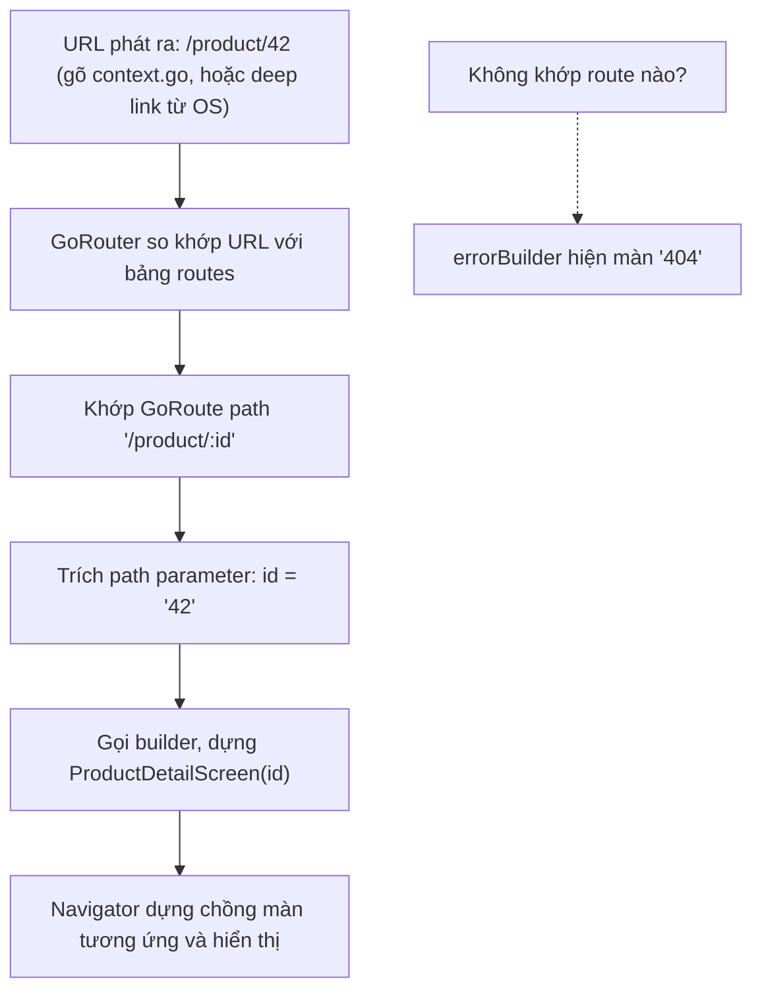
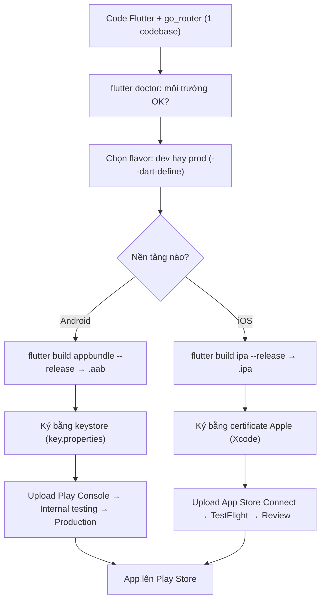

# Navigation, Build & Deploy — go_router đến store

> **Tác giả:** Mr.Rom\
> **Phiên bản:** v1.0.0\
> **Tạo lúc:** 13/06/2026\
> **Cập nhật:** 13/06/2026\
> **Level:** Basic\
> **Tags:** flutter, dart, navigation, go-router, build, deploy, app-store, play-store, devtools, flavor\
> **Yêu cầu trước:** [Quản lý State](03_state-management.md)

> 🎯 *App Acme Shop của bạn giờ có nhiều màn hình — danh sách sản phẩm, chi tiết, giỏ hàng — và state đã chạy ngon. Nhưng làm sao **chuyển giữa các màn**? Làm sao một link `acmeshop.vn/product/42` mở thẳng đúng màn chi tiết (deep link)? Và quan trọng nhất: làm sao **đóng gói** app thành file thật để **đẩy lên App Store và Play Store**? Bài này dạy `Navigator` + named routes, rồi nâng lên **go_router** (chuẩn khuyến nghị 2026, declarative, hỗ trợ deep link), truyền dữ liệu giữa màn, kiểm tra môi trường bằng `flutter doctor`, dùng **DevTools** debug, phân tách **flavor** dev/prod, và cuối cùng **build production** rồi ký + publish lên hai store. Đây là bài đóng cụm Flutter — sau bài này app của bạn ra được tới tay người dùng thật.*

## 🎯 Sau bài này bạn sẽ

- [ ] Hiểu mô hình **stack điều hướng** của Flutter (push/pop) và dùng `Navigator` + named routes cơ bản
- [ ] Cài và dùng **go_router** — định nghĩa route declarative, điều hướng bằng `context.go` / `context.push`, và bắt **deep link**
- [ ] **Truyền dữ liệu** giữa các màn qua path parameter và `extra`
- [ ] Chạy `flutter doctor` để kiểm tra môi trường và phân biệt **hot reload** vs **hot restart**, dùng **DevTools** + Widget Inspector
- [ ] Tách **flavor** `dev` / `prod` để build hai bản app riêng từ cùng codebase
- [ ] **Build production**: `flutter build apk` / `appbundle` / `ipa`, hiểu ký số (signing) và quy trình publish lên Play Store / App Store

---

## Tình huống — app có 3 màn nhưng không qua lại được

Đến giờ app Acme Shop của bạn mới có **một màn hình**. Bạn vừa thêm màn chi tiết sản phẩm và muốn: bấm vào một sản phẩm trong danh sách thì mở màn chi tiết của đúng sản phẩm đó, bấm nút back thì quay về. Theo phản xạ web, bạn nghĩ tới "đổi URL". Nhưng Flutter không phải web — không có thanh địa chỉ, không có `<a href>`.

Flutter quản lý màn hình bằng một mô hình gọi là **navigation stack** (ngăn xếp điều hướng). Hiểu nó là chìa khoá để mọi thứ về sau (go_router, deep link) sáng ra.

🪞 **Ẩn dụ — chồng đĩa trong nhà bếp:** Mỗi màn hình là một cái đĩa. Mở màn mới = **đặt thêm một đĩa lên trên chồng** (push). Bấm back = **lấy đĩa trên cùng ra** (pop), lộ lại đĩa bên dưới. Bạn chỉ nhìn thấy cái đĩa trên cùng — đó là màn hình hiện tại. Cả cụm này, ta sẽ quay lại "chồng đĩa" nhiều lần.

---

## 1️⃣ Navigator — chồng màn hình cốt lõi

`Navigator` là widget Flutter quản lý cái "chồng đĩa" đó. Mọi cách điều hướng — kể cả go_router ở phần sau — cuối cùng đều gọi xuống `Navigator`. Nên hiểu nó trước.

Cách thô sơ nhất là `Navigator.push` với một `MaterialPageRoute`. Đoạn dưới đặt một màn `ProductDetailScreen` lên trên chồng khi người dùng bấm vào sản phẩm — chú ý ta truyền thẳng object `product` vào constructor:

```dart
import 'package:flutter/material.dart';

// Bấm vào 1 sản phẩm → đẩy màn chi tiết lên chồng
ElevatedButton(
  onPressed: () {
    Navigator.push(
      context,
      MaterialPageRoute(
        builder: (context) => ProductDetailScreen(product: product),
      ),
    );
  },
  child: const Text('Xem chi tiết'),
);
```

Để quay lại (lấy đĩa trên cùng ra), gọi `Navigator.pop`:

```dart
// Trong ProductDetailScreen — nút quay về
TextButton(
  onPressed: () => Navigator.pop(context),
  child: const Text('Quay lại'),
);
```

→ Cách `push` trực tiếp này chạy được nhưng có nhược điểm: tên màn nằm rải rác trong code, không có "bản đồ" tập trung các màn, và **không hỗ trợ deep link** (mở app từ một URL). Với app 2-3 màn thì tạm ổn, app thật thì đuối.

### Named routes — đặt tên cho từng màn

Bước cải thiện đầu tiên là **named routes**: khai báo trước một bảng "tên màn → widget", rồi điều hướng bằng tên chuỗi thay vì dựng `MaterialPageRoute` mỗi lần. Bảng này khai trong `MaterialApp`:

```dart
MaterialApp(
  initialRoute: '/',
  routes: {
    '/': (context) => const ProductListScreen(),
    '/cart': (context) => const CartScreen(),
    '/settings': (context) => const SettingsScreen(),
  },
);
```

Điều hướng bằng tên:

```dart
// Mở màn giỏ hàng theo tên
Navigator.pushNamed(context, '/cart');
```

→ Named routes gom tên màn về một chỗ, đỡ lộn xộn hơn. Nhưng nó vẫn có giới hạn lớn: **truyền tham số động kiểu `/product/42` rất vụng** (phải bọc qua `arguments` thủ công), và xử lý deep link/web URL phải tự viết `onGenerateRoute` khá rối. Đây chính là chỗ go_router ra đời để giải quyết.

---

## 2️⃣ go_router — điều hướng declarative, khuyến nghị 2026

Quay lại "chồng đĩa". `Navigator` thuần là cách **imperative** (mệnh lệnh): bạn ra lệnh "push đĩa này", "pop đĩa kia" từng bước. Với app nhiều màn, deep link, web — cách mệnh lệnh này khó kiểm soát: rất khó trả lời câu hỏi "URL `/product/42/reviews` thì chồng đĩa phải trông như thế nào".

**go_router** là package điều hướng chính thức (do team Flutter bảo trì) theo hướng **declarative** (khai báo): thay vì ra lệnh từng bước, bạn **khai báo một bảng đường đi** — mỗi URL ứng với màn nào — rồi chỉ cần nói "đi tới `/product/42`", go_router tự lo dựng đúng chồng đĩa.

🪞 **Ẩn dụ — bản đồ tàu điện ngầm:** `Navigator` thuần như **tự lái xe**, bạn rẽ từng ngã tư bằng tay. go_router như **đi tàu điện ngầm có bản đồ tuyến cố định** — bạn chỉ cần nói tên ga đích (`/cart`), hệ thống tự biết đường. Và vì có "bản đồ tuyến", bất kỳ ai (kể cả một link từ ngoài app — deep link) cũng tới đúng ga.

> 💡 Cách go_router biến một URL thành chồng màn hình là phần trừu tượng nhất bài. Trước khi code, hãy nhìn sơ đồ luồng một URL đi từ lúc người dùng/hệ điều hành phát ra cho tới khi widget hiện trên màn hình.



→ Mấu chốt từ sơ đồ: trong go_router, **URL là nguồn sự thật** — mọi điều hướng quy về "URL này khớp route nào". Đây là lý do deep link gần như "miễn phí": một link ngoài app cũng chỉ là một URL đi vào đúng luồng so khớp đó.

### Cài đặt go_router

go_router là package ngoài, thêm vào dự án bằng lệnh `flutter pub add`. Lệnh này tự ghi dependency vào `pubspec.yaml` và tải về:

```bash
flutter pub add go_router
```

Kết quả mong đợi (rút gọn):

```
Resolving dependencies...
+ go_router 14.6.2
Changed 1 dependency!
```

Dòng `+ go_router 14.6.2` cho biết package đã được thêm và phiên bản tải về (số phiên bản trên máy bạn có thể mới hơn). `Changed 1 dependency!` xác nhận `pubspec.yaml` đã cập nhật. Nếu thấy chữ đỏ kèm `version solving failed`, thường do trùng phiên bản Dart SDK — chạy `flutter pub get` xem chi tiết.

### Định nghĩa router — "bản đồ tuyến"

Đây là trái tim của go_router: một object `GoRouter` chứa danh sách `GoRoute`. Mỗi `GoRoute` gắn một `path` (URL) với một `builder` (hàm dựng widget cho màn đó). Ta tách ra một file riêng `router.dart` cho gọn:

```dart
import 'package:go_router/go_router.dart';
import 'screens/product_list_screen.dart';
import 'screens/product_detail_screen.dart';
import 'screens/cart_screen.dart';

final GoRouter appRouter = GoRouter(
  initialLocation: '/',
  routes: [
    // 1. Màn gốc — danh sách sản phẩm
    GoRoute(
      path: '/',
      builder: (context, state) => const ProductListScreen(),
    ),

    // 2. Màn chi tiết — :id là path parameter động
    GoRoute(
      path: '/product/:id',
      builder: (context, state) {
        // Trích id từ URL, vd '/product/42' → id = '42'
        final id = state.pathParameters['id']!;
        return ProductDetailScreen(productId: id);
      },
    ),

    // 3. Màn giỏ hàng
    GoRoute(
      path: '/cart',
      builder: (context, state) => const CartScreen(),
    ),
  ],

  // Màn hiện khi URL không khớp route nào (kiểu trang 404)
  errorBuilder: (context, state) => Scaffold(
    body: Center(child: Text('Không tìm thấy trang: ${state.uri}')),
  ),
);
```

Trong code trên, `:id` là cú pháp khai **path parameter** — phần URL thay đổi được. Khi URL là `/product/42`, go_router tự bóc `42` ra và đặt vào `state.pathParameters['id']`. Dấu `!` ở cuối là *null assertion* (khẳng định không null) của Dart — ta chắc chắn `id` tồn tại vì route đã khớp.

### Gắn router vào app — dùng `MaterialApp.router`

Để go_router điều khiển toàn bộ điều hướng, ta thay `MaterialApp` thường bằng `MaterialApp.router` và đưa `appRouter` vào. Đây là điểm khác biệt quan trọng so với cách dùng `Navigator` thuần:

```dart
import 'package:flutter/material.dart';
import 'router.dart';

void main() {
  runApp(const AcmeShopApp());
}

class AcmeShopApp extends StatelessWidget {
  const AcmeShopApp({super.key});

  @override
  Widget build(BuildContext context) {
    return MaterialApp.router(
      title: 'Acme Shop',
      theme: ThemeData(useMaterial3: true),
      // Đưa cấu hình router vào — go_router lo toàn bộ điều hướng
      routerConfig: appRouter,
    );
  }
}
```

→ `MaterialApp.router` thay cho `MaterialApp` thường, và `routerConfig` nhận object `GoRouter`. Từ đây, mọi điều hướng đi qua "bản đồ tuyến" của go_router — kể cả deep link từ hệ điều hành.

### Điều hướng — `context.go` vs `context.push`

go_router thêm hai phương thức tiện lợi lên `BuildContext`. Khác biệt giữa chúng đúng bằng khác biệt "thay cả chồng đĩa" vs "đặt thêm một đĩa". Đây là chỗ người mới hay nhầm, nên ghi kỹ:

| Phương thức | Ý nghĩa với "chồng đĩa" | Khi dùng |
|---|---|---|
| `context.go('/cart')` | **Thay** trạng thái điều hướng tới URL đó | Chuyển tab/section chính, đặt lại luồng |
| `context.push('/product/42')` | **Đặt thêm** một màn lên chồng | Mở màn con, muốn có nút back về màn cũ |
| `context.pop()` | Lấy màn trên cùng ra (back) | Đóng màn hiện tại |

```dart
// Mở chi tiết sản phẩm — push để còn back lại được
ElevatedButton(
  onPressed: () => context.push('/product/${product.id}'),
  child: const Text('Xem chi tiết'),
);

// Sang giỏ hàng như một section chính — dùng go
IconButton(
  icon: const Icon(Icons.shopping_cart),
  onPressed: () => context.go('/cart'),
);
```

→ Mẹo nhớ: **`push` để "đi sâu vào" (có đường về), `go` để "nhảy ngang" (đặt lại luồng)**. Mở chi tiết sản phẩm dùng `push`; bấm icon giỏ hàng trên thanh top, hay vào màn chính từ deep link, dùng `go`.

### Truyền dữ liệu giữa màn — path parameter và `extra`

Có hai cách truyền dữ liệu sang màn mới, chọn theo bản chất dữ liệu:

**Cách 1 — path parameter (cho id, slug — thứ lên được URL).** Đây là cách "đúng web nhất": dữ liệu nằm thẳng trong URL nên deep link `/product/42` hoạt động ngay. Phù hợp cho định danh đơn giản (id sản phẩm). Ta đã thấy ở trên: route khai `:id`, đọc ra bằng `state.pathParameters['id']`.

```dart
// Gửi: id nằm trong URL
context.push('/product/${product.id}');

// Nhận: trong builder của route
final id = state.pathParameters['id']!;
```

**Cách 2 — `extra` (cho object phức tạp không lên URL được).** Khi muốn truyền nguyên một object `Product` (nhiều field) thay vì chỉ id, dùng tham số `extra`. Lưu ý: `extra` **không** nằm trong URL nên **không deep-link được** — nó chỉ tồn tại trong phiên chạy hiện tại.

```dart
// Gửi: truyền nguyên object qua extra
context.push('/product/${product.id}', extra: product);
```

```dart
// Nhận: trong builder, ép kiểu state.extra
GoRoute(
  path: '/product/:id',
  builder: (context, state) {
    final id = state.pathParameters['id']!;
    // extra có thể null (vd khi mở từ deep link) → fallback theo id
    final product = state.extra as Product?;
    return ProductDetailScreen(productId: id, product: product);
  },
);
```

> [!WARNING]
> Đừng chỉ dựa vào `extra` cho dữ liệu cốt lõi. Khi người dùng mở app từ **deep link** (`acmeshop.vn/product/42`) hay reload trên web, `extra` là `null` vì không có gì truyền vào. Luôn để màn chi tiết **tự fetch lại theo `id`** từ path parameter nếu `extra` null — coi `extra` chỉ là tối ưu (đỡ load lại), không phải nguồn dữ liệu duy nhất.

→ Quy tắc: **id/slug → path parameter** (deep-link được); **object nặng tạm thời → `extra`** (chỉ trong phiên). Màn nhận luôn phải có đường fetch lại theo id để an toàn với deep link.

---

## 3️⃣ flutter doctor — kiểm tra môi trường trước khi build

Trước khi nghĩ tới build production, máy bạn phải đủ "đồ nghề": Flutter SDK, Android toolchain (để build APK), Xcode (để build iOS — chỉ có trên macOS). Lệnh `flutter doctor` là bác sĩ khám sức khoẻ môi trường — chạy nó đầu tiên mỗi khi máy lạ hoặc build lỗi:

```bash
flutter doctor
```

Kết quả mong đợi (máy đã setup tốt trên macOS):

```
Doctor summary (to see all details, run flutter doctor -v):
[✓] Flutter (Channel stable, 3.27.1, on macOS 15.4)
[✓] Android toolchain - develop for Android devices (Android SDK version 35.0.0)
[✓] Xcode - develop for iOS and macOS (Xcode 16.2)
[✓] Chrome - develop for the web
[✓] Android Studio (version 2024.2)
[✓] VS Code (version 1.96.0)
[✓] Connected device (2 available)
[✓] Network resources

• No issues found!
```

Đọc kết quả theo dấu đầu dòng: `[✓]` (xanh) là mục đã sẵn sàng; `[!]` (vàng) là cảnh báo — chạy được nhưng nên xử lý; `[✗]` (đỏ) là chặn — phải sửa mới build được nền tảng đó. Ví dụ thiếu Android SDK sẽ thành `[✗] Android toolchain` kèm hướng dẫn cài. Dòng `No issues found!` cuối cùng nghĩa là sạch lỗi, build thoải mái.

> [!TIP]
> Khi một mục báo `[!]` vàng, chạy `flutter doctor -v` (verbose) để xem chi tiết và lệnh khắc phục cụ thể. Lỗi phổ biến nhất với người mới là **"Android licenses not accepted"** — sửa bằng một lệnh: `flutter doctor --android-licenses` rồi gõ `y` cho từng license.

---

## 4️⃣ Hot reload vs Hot restart — và DevTools

Trong lúc dev, hai phím tắt bạn dùng nhiều nhất là **hot reload** và **hot restart**. Nhiều người mới gõ nhầm và tưởng code không chạy — nên phân biệt rõ:

| | Hot reload | Hot restart |
|---|---|---|
| Phím (terminal `flutter run`) | `r` | `R` (Shift+R) |
| Việc làm | Nạp code mới vào app **đang chạy**, giữ nguyên state | Khởi động lại app từ đầu, **xoá sạch** state |
| Tốc độ | Gần như tức thì | Chậm hơn (vài giây) |
| Khi dùng | Sửa UI (đổi màu, layout, text) | Đổi `main()`, khởi tạo state ban đầu, đổi biến `static`/global |

🪞 **Ẩn dụ:** hot reload như **thay tờ giấy dán tường** mà không dọn nhà — đồ đạc (state: giỏ hàng đang có 3 món) vẫn nguyên. Hot restart như **dọn sạch nhà rồi bày lại từ đầu** — giỏ hàng về rỗng.

→ Mặc định cứ dùng **hot reload** (`r`) cho mọi chỉnh UI — nhanh và giữ state đang test. Chỉ dùng **hot restart** (`R`) khi đổi logic khởi tạo hoặc thấy hot reload "không ăn" (vd sửa code trong `main()`).

### DevTools + Widget Inspector

Khi layout "lệch" mà không hiểu vì sao, đoán mò rất mất thời gian. **Flutter DevTools** là bộ công cụ debug chạy trong trình duyệt: xem cây widget, đo hiệu năng, soi network, log. Công cụ hay nhất cho người mới là **Widget Inspector** — bấm vào một widget trên màn hình và nó chỉ ra widget đó là gì, nằm ở đâu trong cây, padding/constraint bao nhiêu.

Mở DevTools khi đang `flutter run` bằng cách gõ phím `v` trong terminal, hoặc bấm nút DevTools trong VS Code / Android Studio. Một cách khác là chạy thẳng:

```bash
flutter run
```

Khi app đang chạy, terminal in ra dòng kiểu:

```
Flutter run key commands.
r Hot reload. 🔥🔥🔥
R Hot restart.
v Open Flutter DevTools.
...
A Dart VM Service is available at: http://127.0.0.1:9101/abc123/
The Flutter DevTools debugger and profiler is available at:
http://127.0.0.1:9100?uri=http://127.0.0.1:9101/abc123/
```

Dòng `r Hot reload` và `R Hot restart` chính là hai phím vừa học. Dòng cuối là URL mở DevTools trong trình duyệt — bên trong có tab **Flutter Inspector** để soi cây widget.

> [!TIP]
> Trong Widget Inspector, bật **"Select Widget Mode"** rồi chạm vào phần tử trên app — DevTools tự nhảy tới đúng widget đó trong cây và highlight code. Đây là cách nhanh nhất để trả lời "cái padding thừa này từ widget nào ra".

---

## 5️⃣ Flavor — một codebase, hai bản app (dev / prod)

App thật cần ít nhất hai "phiên bản": bản **dev** trỏ vào API thử nghiệm (`api-dev.acmeshop.vn`), tên hiển thị "Acme Shop DEV", cài song song được; và bản **prod** trỏ API thật, tên "Acme Shop", đẩy lên store. Bạn **không** muốn build tay đổi qua đổi lại — dễ lỡ đẩy bản dev lên store.

**Flavor** (Android) / **scheme** (iOS) là cơ chế tạo nhiều biến thể build từ **cùng một codebase**. Mỗi flavor có thể khác nhau ở applicationId, tên app, icon, và biến môi trường.

🪞 **Ẩn dụ:** flavor như **cùng một công thức bánh, nướng ra hai mẻ** — một mẻ "nếm thử trong bếp" (dev), một mẻ "bán cho khách" (prod). Cùng bột, khác nhãn dán và nơi giao.

Cách nhẹ nhàng nhất cho người mới (không cần đụng sâu Gradle/Xcode) là truyền biến môi trường lúc build qua `--dart-define`, kết hợp `flutter run --flavor`. Trước hết, trong code đọc biến môi trường bằng `String.fromEnvironment`:

```dart
// config.dart — đọc biến truyền vào lúc build
class AppConfig {
  // Giá trị mặc định là 'dev' nếu không truyền gì
  static const String flavor = String.fromEnvironment(
    'FLAVOR',
    defaultValue: 'dev',
  );

  static const String apiBaseUrl = String.fromEnvironment(
    'API_URL',
    defaultValue: 'https://api-dev.acmeshop.vn',
  );

  static bool get isProd => flavor == 'prod';
}
```

Chạy bản dev (mặc định, hoặc truyền tường minh):

```bash
flutter run --dart-define=FLAVOR=dev --dart-define=API_URL=https://api-dev.acmeshop.vn
```

Chạy bản prod:

```bash
flutter run --dart-define=FLAVOR=prod --dart-define=API_URL=https://api.acmeshop.vn
```

→ Với `--dart-define`, biến `FLAVOR` và `API_URL` được "ghim" vào lúc build, đọc lại qua `String.fromEnvironment`. App tự biết nó là bản dev hay prod để trỏ đúng API. Đây là cách flavor tối giản, chạy được ngay mà không cần cấu hình native phức tạp.

> [!NOTE]
> Flavor "đầy đủ" (đổi applicationId, icon, tên app để cài song song hai bản) cần khai thêm trong `android/app/build.gradle` (block `flavorDimensions` + `productFlavors`) và tạo scheme trong Xcode. Đó là bước nâng cao; ở mức Basic, `--dart-define` đã đủ để tách cấu hình dev/prod an toàn.

---

## 6️⃣ Build production — APK, App Bundle, IPA

Đến phần "ra tay người dùng". Khi `flutter run` là chạy bản **debug** (có DevTools, hot reload, chậm và nặng). Để phát hành, ta build bản **release** — đã tối ưu, gọn, nhanh. Có ba sản phẩm build tuỳ nơi phát hành:

| Lệnh | Sản phẩm | Dùng để | Nền tảng |
|---|---|---|---|
| `flutter build apk` | File `.apk` | Cài trực tiếp, test, kho ngoài store | Android |
| `flutter build appbundle` | File `.aab` | **Đẩy lên Play Store** (Google bắt buộc) | Android |
| `flutter build ipa` | File `.ipa` | Đẩy lên App Store / TestFlight | iOS (chỉ macOS) |

### Build cho Android

Đầu tiên là APK — file cài trực tiếp được, hữu ích để gửi tester qua link hoặc cài tay:

```bash
flutter build apk --release --dart-define=FLAVOR=prod --dart-define=API_URL=https://api.acmeshop.vn
```

Kết quả mong đợi (cuối log):

```
Running Gradle task 'assembleRelease'...
✓ Built build/app/outputs/flutter-apk/app-release.apk (21.4MB)
```

Dòng `✓ Built ...app-release.apk (21.4MB)` cho biết file APK đã tạo thành công kèm đường dẫn và kích thước. Đây là file bạn gửi tester cài thử (Android cho phép cài APK ngoài store qua "unknown sources").

Để **đẩy lên Play Store**, Google yêu cầu định dạng **App Bundle** (`.aab`) chứ không phải APK — Play Store tự tách bundle ra APK tối ưu cho từng máy:

```bash
flutter build appbundle --release --dart-define=FLAVOR=prod --dart-define=API_URL=https://api.acmeshop.vn
```

Kết quả:

```
Running Gradle task 'bundleRelease'...
✓ Built build/app/outputs/bundle/release/app-release.aab (24.8MB)
```

File `app-release.aab` chính là thứ bạn upload lên Play Console.

### Build cho iOS

Build iOS **chỉ chạy trên macOS** (cần Xcode). Lệnh tạo file `.ipa` để nộp App Store:

```bash
flutter build ipa --release --dart-define=FLAVOR=prod --dart-define=API_URL=https://api.acmeshop.vn
```

Kết quả (rút gọn):

```
Building com.acmeshop.app for device (ios-release)...
✓ Built build/ios/archive/Runner.xcarchive
✓ Built IPA to build/ios/ipa/acme_shop.ipa
```

→ Build iOS cần **Apple Developer account** (có phí thường niên) và chứng chỉ ký hợp lệ trong Xcode trước khi lệnh này thành công. Nếu thiếu chứng chỉ, lệnh báo lỗi `No valid code signing certificates were found`.

---

## 7️⃣ Ký số (signing) + publish lên store

Build ra file `.aab`/`.ipa` chưa đủ — cả hai store đều bắt **ký số** (code signing) để chứng minh "app này đúng là của bạn, chưa bị sửa". Đây là rào cản người mới hay vấp.

🪞 **Ẩn dụ:** ký số như **đóng dấu giáp lai + chữ ký** lên hồ sơ. Store kiểm tra dấu khớp với "con dấu" đã đăng ký của bạn — đảm bảo file không bị ai tráo giữa đường. Mất "con dấu" (keystore) thì không cập nhật app được nữa, nên giữ rất kỹ.

### Ký Android — keystore

Android ký bằng một file **keystore** (chứa private key). Tạo keystore một lần bằng `keytool` (đi kèm JDK):

```bash
keytool -genkey -v -keystore ~/acme-upload-keystore.jks -keyalg RSA -keysize 2048 -validity 10000 -alias acme-upload
```

Lệnh hỏi mật khẩu và vài thông tin (tên, tổ chức). Sau đó khai báo keystore cho Gradle (không bao giờ commit file này hay mật khẩu lên Git). Tạo file `android/key.properties`:

```properties
storePassword=mat_khau_keystore
keyPassword=mat_khau_key
keyAlias=acme-upload
storeFile=/Users/user/acme-upload-keystore.jks
```

> [!CAUTION]
> File keystore (`.jks`) và `key.properties` chứa khoá ký app. **Mất keystore = không bao giờ cập nhật được app trên Play Store nữa** (phải đăng app mới, mất hết review/lượt cài). **Lộ keystore = người khác giả mạo bản cập nhật app của bạn.** Tuyệt đối thêm cả hai vào `.gitignore`, sao lưu keystore ở nơi an toàn (không phải repo).

Quy trình publish Play Store ở mức tổng quan — đây là các bước trên web Play Console, không phải lệnh terminal:

```text
1. Tạo Google Play Developer account (phí một lần)
2. Tạo app mới trong Play Console → khai tên, mô tả, ảnh chụp màn hình
3. flutter build appbundle --release  → lấy file app-release.aab
4. Upload .aab vào track "Internal testing" trước (test nội bộ)
5. Điền bảng phân loại nội dung, chính sách quyền riêng tư
6. Promote lên "Production" → Google review → app lên store
```

### Ký iOS — chứng chỉ Apple

iOS ký bằng **certificate + provisioning profile** do Apple cấp, quản lý trong Xcode (bật "Automatically manage signing" là cách dễ nhất cho người mới). Quy trình publish App Store tổng quan:

```text
1. Tạo Apple Developer account (phí thường niên)
2. Tạo app trong App Store Connect → khai metadata, ảnh
3. flutter build ipa --release  → lấy file .ipa
4. Upload .ipa lên App Store Connect (qua Xcode hoặc Transporter)
5. Phát hành qua TestFlight (test) trước khi submit review
6. Submit for Review → Apple review → app lên store
```

→ Điểm chung hai store: build → ký → upload bản test (Internal testing / TestFlight) → review → production. **Đừng nhảy thẳng lên production** — luôn qua track test trước để bắt lỗi.

---

## 8️⃣ Ráp lại — đường đi từ code tới store

Cả bài gói gọn trong một đường ống (pipeline): từ code trên máy bạn, qua build, ký, tới tay người dùng trên store. Sơ đồ dưới là bức tranh tổng để bạn không lạc giữa các lệnh:



→ Một codebase Flutter, qua `flutter build` + ký số, ra hai store cùng lúc. Đây chính là lời hứa "cross-platform" thành hiện thực: bạn vừa đi hết đường từ widget đầu tiên (bài 01) tới app thật trên điện thoại người dùng.

---

## 💡 Cạm bẫy thường gặp & Best practice

### ❌ Cạm bẫy: Lẫn lộn `context.go` và `context.push`

- **Triệu chứng**: Mở màn chi tiết bằng `context.go` rồi bấm back thì... thoát luôn về màn gốc, mất cả lịch sử; hoặc dùng `push` cho mọi thứ làm chồng màn ngày càng dày, back mãi không hết.
- **Nguyên nhân**: `go` **thay** trạng thái điều hướng (gần như đặt lại luồng), `push` **đặt thêm** một màn lên chồng (có đường back).
- **Cách tránh**: Mở màn con cần back → `push`. Nhảy sang section chính / vào màn từ deep link → `go`. Nhớ ẩn dụ "chồng đĩa": `push` thêm đĩa, `go` xếp lại chồng.

### ❌ Cạm bẫy: Dựa hoàn toàn vào `extra` cho dữ liệu màn

- **Triệu chứng**: App chạy ngon khi bấm từ trong app, nhưng mở từ deep link `/product/42` thì màn chi tiết trống trơn hoặc crash `Null check operator used on a null value`.
- **Nguyên nhân**: `extra` chỉ tồn tại khi điều hướng trong phiên hiện tại; deep link/web reload không có `extra` → `state.extra` là `null`.
- **Cách tránh**: Luôn truyền **id qua path parameter** và để màn tự fetch lại theo id nếu `extra` null. Coi `extra` là tối ưu (đỡ load), không phải nguồn dữ liệu duy nhất.

### ❌ Cạm bẫy: Đẩy nhầm bản debug / bản dev lên store

- **Triệu chứng**: App trên store chậm bất thường, trỏ vào API dev, hoặc bị từ chối vì còn bật debug banner.
- **Nguyên nhân**: Build quên `--release`, hoặc quên truyền `--dart-define=FLAVOR=prod` nên app vẫn trỏ API dev.
- **Cách tránh**: Lệnh build cho store **luôn** kèm `--release` và flavor prod. Kiểm tra lại `AppConfig.isProd` và URL API trước khi upload. Lý tưởng là gói lệnh build prod vào một script để khỏi gõ tay.

### ✅ Best practice: Tách `router.dart` riêng và đặt tên route bằng hằng số

- **Vì sao**: Gom toàn bộ "bản đồ tuyến" về một file giúp nhìn một chỗ là thấy hết các màn; dùng hằng số cho path (`'/cart'`) tránh gõ sai chuỗi rải rác.
- **Cách áp dụng**: Để `GoRouter` trong `router.dart`. Khai `class Routes { static const cart = '/cart'; }` rồi dùng `context.go(Routes.cart)` thay vì chuỗi trần — đổi path một chỗ, cả app theo.

### ✅ Best practice: Chạy `flutter doctor` đầu tiên khi build lỗi

- **Vì sao**: Phần lớn lỗi build (thiếu Android SDK, chưa accept license, Xcode cũ) hiện rõ ở `flutter doctor`. Đoán mò trong log Gradle/Xcode tốn thời gian hơn nhiều.
- **Cách áp dụng**: Build đỏ → chạy `flutter doctor -v` xem mục nào `[✗]`/`[!]` → sửa đúng mục đó. Mới đổi máy hay mới cài Flutter cũng chạy doctor trước.

---

## 🧠 Tự kiểm tra (Self-check)

**Q1.** Mô hình điều hướng của Flutter gọi là gì, và hai thao tác cơ bản nhất là gì?

<details>
<summary>💡 Đáp án</summary>

Gọi là **navigation stack** (ngăn xếp điều hướng) — như "chồng đĩa". Hai thao tác cơ bản:
- **push**: đặt thêm một màn lên trên chồng (mở màn mới).
- **pop**: lấy màn trên cùng ra (bấm back, quay về màn trước).

Mọi cách điều hướng (kể cả go_router) cuối cùng đều thao tác lên chồng này qua `Navigator`.

</details>

**Q2.** Khác biệt giữa `context.go('/cart')` và `context.push('/cart')` là gì? Cho ví dụ khi nào dùng cái nào.

<details>
<summary>💡 Đáp án</summary>

- `context.push('/cart')`: **đặt thêm** màn `/cart` lên chồng — còn nút back về màn cũ. Dùng khi mở màn con muốn quay lại được, vd mở chi tiết sản phẩm.
- `context.go('/cart')`: **thay** trạng thái điều hướng tới `/cart` (đặt lại luồng). Dùng khi nhảy sang section chính hoặc vào màn từ deep link, vd bấm icon giỏ hàng ở thanh top.

Mẹo: `push` để "đi sâu vào" (có đường về), `go` để "nhảy ngang" (xếp lại chồng).

</details>

**Q3.** Vì sao không nên dựa hoàn toàn vào `extra` để truyền dữ liệu sang màn chi tiết? Cách an toàn là gì?

<details>
<summary>💡 Đáp án</summary>

Vì `extra` chỉ tồn tại khi điều hướng **trong phiên hiện tại**. Khi mở app từ **deep link** (`/product/42`) hoặc reload web, `extra` là `null` → màn trống hoặc crash. Cách an toàn: truyền **id qua path parameter** (`:id`) và để màn chi tiết **tự fetch lại theo id** nếu `extra` null. `extra` chỉ là tối ưu (đỡ load lại), không phải nguồn dữ liệu duy nhất.

</details>

**Q4.** Phân biệt hot reload và hot restart. Khi nào hot reload **không** đủ, phải hot restart?

<details>
<summary>💡 Đáp án</summary>

- **Hot reload** (`r`): nạp code mới vào app đang chạy, **giữ nguyên state** (giỏ hàng vẫn còn 3 món). Gần như tức thì. Dùng cho sửa UI.
- **Hot restart** (`R`): khởi động lại app từ đầu, **xoá sạch state**. Chậm hơn.

Hot reload **không** đủ khi: đổi code trong `main()`, đổi khởi tạo state ban đầu, đổi biến `static`/global, hoặc đổi cấu trúc lớn. Lúc đó phải hot restart.

</details>

**Q5.** Muốn đẩy app Android lên Play Store thì build ra định dạng gì, bằng lệnh nào? Khác gì với file gửi tester cài tay?

<details>
<summary>💡 Đáp án</summary>

Play Store yêu cầu **App Bundle** (`.aab`): `flutter build appbundle --release`. Play Store tự tách `.aab` ra APK tối ưu cho từng máy.

File gửi tester cài tay là **APK** (`.apk`): `flutter build apk --release` — cài trực tiếp được (Android cho phép cài ngoài store), nhưng **không** dùng để upload lên Play Store.

</details>

**Q6.** Vì sao phải giữ file keystore (Android) cực kỳ cẩn thận? Mất nó thì sao?

<details>
<summary>💡 Đáp án</summary>

Keystore chứa khoá ký app — Play Store dùng nó để xác nhận "bản cập nhật đúng là của bạn". **Mất keystore = không bao giờ cập nhật được app cũ trên store** (phải đăng app mới, mất hết review và lượt cài). **Lộ keystore = người khác giả mạo bản cập nhật.** Vì vậy phải `.gitignore` cả keystore lẫn `key.properties`, và sao lưu keystore ở nơi an toàn ngoài repo.

</details>

---

## ⚡ Tra cứu nhanh (Cheatsheet)

| Mục đích | Lệnh / Cú pháp |
|---|---|
| Cài go_router | `flutter pub add go_router` |
| Định nghĩa route | `GoRoute(path: '/product/:id', builder: (c, s) => ...)` |
| Đọc path parameter | `state.pathParameters['id']` |
| Đọc dữ liệu extra | `state.extra as Product?` |
| Gắn router vào app | `MaterialApp.router(routerConfig: appRouter)` |
| Mở màn con (có back) | `context.push('/product/42')` |
| Nhảy section chính | `context.go('/cart')` |
| Quay lại | `context.pop()` |
| Kiểm tra môi trường | `flutter doctor` (`-v` để chi tiết) |
| Accept Android license | `flutter doctor --android-licenses` |
| Hot reload / restart | phím `r` / `R` khi `flutter run` |
| Mở DevTools | phím `v` khi `flutter run` |
| Chạy với flavor | `flutter run --dart-define=FLAVOR=prod` |
| Build APK (test) | `flutter build apk --release` |
| Build App Bundle (Play Store) | `flutter build appbundle --release` |
| Build IPA (App Store, macOS) | `flutter build ipa --release` |
| Tạo keystore Android | `keytool -genkey -v -keystore key.jks -keyalg RSA -keysize 2048 -validity 10000 -alias upload` |

---

## 📚 Từ Điển Thuật Ngữ (Glossary)

| EN | VN | Giải thích |
|---|---|---|
| Navigation stack | Ngăn xếp điều hướng | Chồng các màn hình; push = thêm màn, pop = bỏ màn trên cùng |
| Navigator | Bộ điều hướng | Widget Flutter quản lý navigation stack |
| Named routes | Định tuyến theo tên | Bảng "tên màn → widget" khai trong `MaterialApp` |
| go_router | go_router (giữ nguyên) | Package điều hướng declarative chính thức, hỗ trợ deep link |
| Declarative | Khai báo | Mô tả "kết quả mong muốn" (URL → màn) thay vì ra lệnh từng bước |
| Imperative | Mệnh lệnh | Ra lệnh từng bước (push/pop thủ công) |
| GoRoute | GoRoute (giữ nguyên) | Một mục trong bảng route: gắn path với builder |
| Path parameter | Tham số đường dẫn | Phần URL động, vd `:id` trong `/product/:id` |
| extra | extra (giữ nguyên) | Dữ liệu truyền kèm điều hướng, không nằm trong URL, không deep-link được |
| Deep link | Liên kết sâu | Link/URL từ ngoài mở thẳng vào một màn cụ thể trong app |
| flutter doctor | flutter doctor (lệnh) | Lệnh kiểm tra môi trường Flutter (SDK, Android, Xcode...) |
| Hot reload | Nạp nóng | Nạp code mới vào app đang chạy, giữ nguyên state |
| Hot restart | Khởi động lại nóng | Chạy lại app từ đầu, xoá sạch state |
| DevTools | DevTools (giữ nguyên) | Bộ công cụ debug Flutter chạy trên trình duyệt |
| Widget Inspector | Trình soi widget | Công cụ DevTools xem cây widget và thuộc tính từng widget |
| Flavor | Biến thể build | Cơ chế tạo nhiều bản app (dev/prod) từ cùng codebase |
| Release build | Bản phát hành | Bản đã tối ưu để publish (khác bản debug) |
| App Bundle (.aab) | Gói ứng dụng | Định dạng Google bắt buộc khi upload Play Store |
| APK (.apk) | Gói cài Android | File cài trực tiếp được trên Android, ngoài store |
| IPA (.ipa) | Gói cài iOS | File ứng dụng iOS để nộp App Store |
| Code signing | Ký số | Đóng "dấu" chứng minh app là của bạn, chưa bị sửa |
| Keystore | Kho khoá | File chứa private key ký app Android |

---

## 🔗 Liên kết & Tài nguyên

⬅️ **Bài trước:** [Quản lý State — setState đến Provider/Riverpod](03_state-management.md)\
↑ **Về cụm:** [Flutter cơ bản](../../README.md)

### 🧭 Định hướng lộ trình học

- [Quản lý State — setState đến Provider/Riverpod](03_state-management.md) — nền state trước khi điều hướng giữa các màn
- [Flutter là gì? — UI đa nền tảng vẽ bằng engine riêng](00_what-is-flutter.md) — ôn lại bức tranh tổng nếu cần
- [Layout & Styling — Row, Column, constraints, Material 3](02_layout-and-styling.md) — dựng giao diện từng màn trước khi nối chúng lại

### 🧩 Các chủ đề có thể bạn quan tâm

- [Navigation & State — React Navigation, quản lý dữ liệu](../../../react-native/lessons/01_basic/02_navigation-and-state.md) — đối chiếu cách điều hướng bên React Native
- [Phát triển mobile đa nền tảng là gì?](../../../cross-platform-concepts/lessons/01_basic/00_what-is-cross-platform-mobile.md) — vì sao một codebase ra được hai store

### 🌐 Tài nguyên tham khảo khác

- [go_router (pub.dev)](https://pub.dev/packages/go_router) — trang package chính thức, đầy đủ API
- [Flutter docs — Navigation and routing](https://docs.flutter.dev/ui/navigation) — hướng dẫn điều hướng chính thức
- [Flutter docs — Build and release an Android app](https://docs.flutter.dev/deployment/android) — quy trình ký + publish Play Store
- [Flutter docs — Build and release an iOS app](https://docs.flutter.dev/deployment/ios) — quy trình publish App Store
- [Flutter docs — Flutter DevTools](https://docs.flutter.dev/tools/devtools) — hướng dẫn DevTools và Inspector

---

> 🎯 *Đây là bài cuối cụm Flutter. Bạn đã đi trọn vòng: từ "Flutter là gì", Dart & widgets, layout, state, tới điều hướng và đưa app lên store. App Acme Shop giờ có thể chạy thật trên điện thoại người dùng. Bước tiếp theo tuỳ hướng bạn chọn — đào sâu animation, tích hợp backend, hay so sánh với React Native ở cụm bên cạnh.*

---

## 📌 Nhật ký thay đổi (Changelog)

- **v1.0.0 (13/06/2026)** — Bản đầu tiên. Cụm `flutter/` lesson 5/5 (basic), đóng cụm. Cover: navigation stack (push/pop) + `Navigator` + named routes; go_router (cài `flutter pub add`, `GoRoute`/`GoRouter`, `MaterialApp.router`, `context.go` vs `context.push`, errorBuilder); truyền dữ liệu giữa màn (path parameter `:id` + `extra`, lưu ý deep link); `flutter doctor` + accept Android licenses; hot reload vs hot restart; DevTools + Widget Inspector; flavor dev/prod bằng `--dart-define` + `String.fromEnvironment`; build production (`flutter build apk`/`appbundle`/`ipa --release`); ký số (keystore Android + certificate Apple) và quy trình publish Play Store/App Store. 2 sơ đồ mermaid (luồng URL→màn của go_router, pipeline code→store). 3 đoạn `text` mô tả quy trình publish. Cạm bẫy: lẫn go/push, dựa vào extra cho deep link, đẩy nhầm bản debug/dev lên store.
</content>
</invoke>
