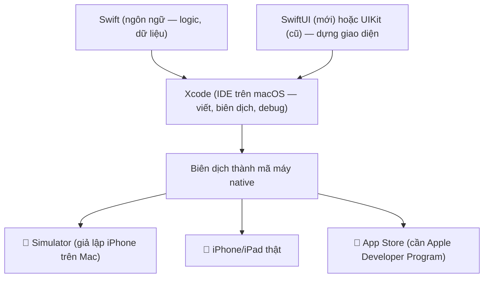

# Lập trình iOS là gì? — Swift, Xcode, SwiftUI

> **Tác giả:** Mr.Rom\
> **Phiên bản:** v1.0.0\
> **Tạo lúc:** 13/06/2026\
> **Cập nhật:** 13/06/2026\
> **Level:** Basic\
> **Tags:** ios, swift, xcode, swiftui, uikit, native, apple, mobile\
> **Yêu cầu trước:** (không bắt buộc — cần máy Mac + Xcode)

> 🎯 *Bài INTRO. Bạn đã biết lập trình cơ bản và muốn làm app **iOS native** cho Acme Shop. Bài này vẽ ra toàn bộ hệ sinh thái: ngôn ngữ **Swift**, IDE **Xcode** (chỉ chạy trên macOS), và hai framework UI — **UIKit** (cũ, imperative) vs **SwiftUI** (mới, declarative — khuyến nghị 2026). Bạn sẽ hiểu vì sao chọn native thay vì cross-platform, cần gì để bắt đầu (máy Mac, Apple Developer Program $99/năm để publish), khác biệt simulator vs thiết bị thật, và iOS dev khác Android dev ở đâu. KHÔNG đi sâu cú pháp Swift — đó là bài 01.*

## 🎯 Sau bài này bạn sẽ

- [ ] Hiểu **lập trình iOS native là gì** và 3 trụ cột của nó: **Swift** (ngôn ngữ), **Xcode** (IDE), **SwiftUI/UIKit** (framework UI)
- [ ] Phân biệt **UIKit** (imperative, cũ) vs **SwiftUI** (declarative, mới — mặc định cho dự án 2026) và biết khi nào còn gặp UIKit
- [ ] Giải thích được **vì sao chọn native iOS** (hiệu năng, API mới nhất, trải nghiệm Apple) so với cross-platform (React Native / Flutter)
- [ ] Biết **yêu cầu để bắt đầu** (máy Mac + Xcode) và để publish (**Apple Developer Program $99/năm**)
- [ ] Phân biệt **simulator** và **thiết bị thật**, biết khi nào phải dùng máy thật
- [ ] So sánh **iOS dev vs Android dev** để định vị đúng bức tranh mobile
- [ ] Đọc được một file SwiftUI tối giản và hiểu nó render ra cái gì

---

## Tình huống — Acme Shop muốn một app iOS "đúng chất Apple"

Bạn vừa hoàn thành phần backend cho Acme Shop và đã quen lập trình. Giờ sếp đặt một yêu cầu cụ thể:

> *"Khách hàng cao cấp của mình đa số xài iPhone. Mình cần một app iOS chạy thật mượt, cảm giác đúng chất Apple — vuốt mượt, hỗ trợ Dynamic Island, widget màn hình khoá, Face ID để thanh toán. Không phải kiểu 'web đóng gói'. Bắt đầu thế nào?"*

Bạn ngồi tìm hiểu và lập tức gặp một loạt từ khoá lạ va vào nhau:

- 😵 Người ta nói viết app iOS bằng **Swift**. Nhưng Swift là gì — giống Java hay giống Python?
- 😵 Phải dùng **Xcode**, mà Xcode **chỉ chạy trên macOS**. Máy bạn đang là Windows — vậy có làm được không?
- 😵 Có chỗ nói dùng **UIKit**, chỗ khác lại bảo dùng **SwiftUI**, và một số bài cũ trộn cả hai. Học cái nào?
- 😵 Muốn đưa app lên **App Store** thì phải trả **$99/năm** cho **Apple Developer Program**. Vì sao tốn tiền vậy?
- 😵 Đã có team biết **React Native** rồi — sao không viết một lần chạy cả iOS lẫn Android cho rẻ?

Đây đều là những câu hỏi đúng và rất thực tế. Bài này trả lời tổng quan toàn bộ, vẽ cho bạn tấm bản đồ hệ sinh thái iOS trước khi bạn gõ dòng Swift đầu tiên ở bài 01.

> [!NOTE]
> Cụm bài này tập trung vào **iOS native** — viết riêng cho hệ điều hành của Apple bằng công cụ chính chủ. Nếu bạn cần một app chạy **cả iOS lẫn Android** từ một codebase, hãy đọc thêm cụm Flutter hoặc React Native (có link ở cuối bài). Native và cross-platform không phải "đúng/sai" — chúng phục vụ mục tiêu khác nhau, và mục 5 sẽ giúp bạn chọn.

---

## 1️⃣ Lập trình iOS native là gì?

Quay lại tình huống: sếp muốn app "đúng chất Apple", mượt, dùng được những tính năng iPhone mới nhất. **Lập trình iOS native ra đời đúng để làm điều đó.**

**Lập trình iOS native** là việc viết ứng dụng chạy trên iPhone/iPad bằng **bộ công cụ chính chủ của Apple**: ngôn ngữ **Swift**, IDE **Xcode**, và framework UI **SwiftUI** (hoặc **UIKit** đời cũ). App được biên dịch (compile) thành mã máy chạy thẳng trên hệ điều hành iOS — không có lớp trung gian, không có trình duyệt ẩn, không có engine vẽ riêng.

Điểm cốt lõi cần khắc sâu ngay: **native nghĩa là dùng đúng widget và API mà chính Apple dùng.** Nút bấm bạn tạo ra *là* nút bấm hệ thống của iOS; animation cuộn *là* animation gốc của iOS. Vì thế app native kế thừa "chất" Apple một cách tự nhiên, và truy cập được mọi tính năng mới nhất ngay ngày Apple ra mắt.

🪞 **Ẩn dụ — native như nấu ăn bằng nguyên liệu và bếp của chính nhà hàng:**
> Hãy tưởng tượng Apple là một nhà hàng. **Native** là bạn vào thẳng bếp của họ, dùng đúng nguyên liệu tươi và đúng lò nướng họ thiết kế — món ra đúng "vị nhà hàng", và nếu họ vừa nhập một loại gia vị mới (tính năng iOS mới) thì bạn được dùng ngay. **Cross-platform** (React Native, Flutter) giống bạn nấu ở bếp trung gian rồi mang món vào — vẫn ngon, vẫn bán được cho cả hai nhà hàng (iOS + Android) cùng lúc, nhưng gia vị mới của Apple thì phải chờ bên trung gian "nhập về" mới dùng được.

Để định vị rõ, đây là 3 cách hiểu sai/đúng thường gặp về native iOS:

| Cách hiểu | Đúng/Sai | Giải thích |
|---|---|---|
| "Native iOS là nhúng website vào app cho iPhone" | ❌ Sai | Đó là WebView/hybrid kiểu cũ — native KHÔNG có HTML/trình duyệt ẩn |
| "Native iOS là viết bằng Swift, render ra widget thật của Apple" | ✅ Đúng | Swift + SwiftUI/UIKit → UI gốc iOS, biên dịch thành mã máy |
| "Native iOS thì cũng chạy luôn trên Android" | ❌ Sai | Code Swift/SwiftUI chỉ chạy trên nền tảng Apple; Android cần Kotlin riêng |

→ Vì là native thật, app cho **trải nghiệm mượt nhất, dùng được tính năng iPhone mới nhất**, đổi lại bạn viết riêng cho Apple (không tự động chạy trên Android). Phần còn lại của bài bóc tách từng trụ cột.

---

## 2️⃣ Ba trụ cột: Swift + Xcode + SwiftUI

Để làm app iOS, bạn cần đúng 3 thứ ăn khớp nhau. Đừng nhầm lẫn vai trò của chúng — đây là nguồn bối rối lớn nhất của người mới. Ta đi từng cái.

### Swift — ngôn ngữ lập trình

**Swift** là ngôn ngữ lập trình do **Apple** tạo ra (ra mắt 2014), nay đã tới **Swift 6**. Nó thay thế Objective-C cũ, được thiết kế hiện đại: kiểu tĩnh (static typing), an toàn null bằng *optional* (kiểu có thể vắng giá trị), hỗ trợ `async`/`await` cho lập trình bất đồng bộ, và cú pháp gọn gàng.

🪞 **Ẩn dụ**: Nếu bạn từng viết TypeScript hoặc Kotlin, Swift sẽ thấy **rất quen** — cùng tinh thần "ngôn ngữ kiểu tĩnh, hiện đại, an toàn". Swift giống một **chiếc xe số tự động đời mới**: bắt lỗi giúp bạn trước khi xe lăn bánh (compile-time), nhưng vẫn cho bạn can thiệp sâu khi cần.

Bạn chưa cần học cú pháp ở bài này, nhưng nhìn qua một đoạn Swift để có cảm giác — đây là cách khai báo dữ liệu cho một sản phẩm Acme Shop:

```swift
// Một struct mô tả sản phẩm — Swift dùng struct rất nhiều cho dữ liệu
struct Product: Identifiable {
    let id: Int
    let name: String
    let price: Int
    var inStock: Bool = true   // mặc định còn hàng
}

let macbook = Product(id: 1, name: "MacBook Air", price: 28_000_000)
print(macbook.name)            // MacBook Air
print(macbook.inStock)         // true
```

→ Trông giống TypeScript/Kotlin: khai báo kiểu rõ ràng (`Int`, `String`, `Bool`), tạo object không cần từ khoá `new`. Dấu `_` trong `28_000_000` chỉ để đọc số cho dễ (Swift bỏ qua nó). Bài 01 sẽ dạy `struct`/`class`, optional và protocol kỹ càng.

### Xcode — IDE chính chủ (chỉ chạy trên macOS)

**Xcode** là **IDE** (môi trường phát triển tích hợp) chính thức của Apple — nơi bạn viết code Swift, thiết kế giao diện, biên dịch, chạy app trên simulator, debug, và đẩy app lên App Store. Xcode đóng gói sẵn compiler Swift, simulator iPhone/iPad, và toàn bộ SDK của Apple.

> [!IMPORTANT]
> Xcode **chỉ chạy trên macOS**. Đây là ràng buộc cứng của Apple, không có cách lách chính thống. Muốn lập trình iOS native, bạn cần một **máy Mac** (MacBook, Mac mini, iMac...) hoặc dịch vụ Mac trên cloud. Trên Windows/Linux bạn **không cài được Xcode** — đây là khác biệt lớn so với Android (Android Studio chạy mọi hệ điều hành).

🪞 **Ẩn dụ**: Xcode là **xưởng mộc đầy đủ đồ nghề** của Apple — cưa, đục, máy chà, máy sơn đều trong một phòng. Bạn không cần đi mua lẻ từng món; mở Xcode là có tất cả để dựng app từ con số 0 tới lúc lên kệ App Store.

### SwiftUI / UIKit — framework UI (dựng giao diện)

Swift là ngôn ngữ, Xcode là công cụ — còn thứ dùng để **dựng giao diện** là một *framework UI*. iOS có hai lựa chọn, và đây là chỗ người mới hay phân vân nhất:

- **SwiftUI** — framework **mới** (ra 2019), viết UI theo phong cách **declarative** (khai báo): bạn mô tả "UI nên trông thế nào ứng với dữ liệu hiện tại", framework tự lo việc vẽ. **Đây là lựa chọn khuyến nghị cho mọi dự án mới năm 2026.**
- **UIKit** — framework **cũ** (từ 2008, thời iPhone đầu tiên), viết UI theo phong cách **imperative** (mệnh lệnh): bạn ra lệnh từng bước "tạo nút này, đặt nó ở đây, khi bấm thì đổi chữ kia". Vẫn còn sống khoẻ trong các app lớn đời cũ.

Mục 3 sẽ so sánh kỹ hai cái này. Tạm thời nhớ: **dự án mới → SwiftUI**.

> 💡 Hiểu vai trò ba trụ cột rồi, ta xem chúng ráp lại thành app như thế nào qua sơ đồ bên dưới để hình dung tổng thể.

### Sơ đồ — ba trụ cột ráp thành app iOS

Đây là phần trừu tượng nhất ở mục này: làm sao Swift + Xcode + SwiftUI/UIKit kết hợp để cho ra một app chạy trên iPhone. Sơ đồ dưới mô tả luồng từ code tới app trên thiết bị:



→ Mấu chốt từ sơ đồ: **Swift lo logic, SwiftUI/UIKit lo giao diện, Xcode gói tất cả lại và biên dịch** thành app native. Từ một bản build, bạn chạy thử trên simulator (nhanh, ngay trên Mac), trên iPhone thật (để test cảm giác và phần cứng), rồi cuối cùng đẩy lên App Store. Cả ba trụ cột đều **của Apple** — đó là lý do hệ sinh thái này gắn chặt và mượt với nhau.

---

## 3️⃣ UIKit vs SwiftUI — học cái nào năm 2026?

Đây là câu hỏi gây hoang mang nhất cho người mới, vì tài liệu trên mạng trộn lẫn cả hai. Ta làm rõ một lần.

Khác biệt cốt lõi nằm ở **cách bạn diễn đạt giao diện**: ra lệnh từng bước (imperative) hay mô tả kết quả mong muốn (declarative).

🪞 **Ẩn dụ — chỉ đường vs đặt grab:**
> **UIKit (imperative)** giống bạn **chỉ đường cho tài xế từng khúc**: "rẽ trái, đi 200m, gặp đèn đỏ rẽ phải, đỗ ở quán cà phê". Bạn kiểm soát từng bước, nhưng phải lo mọi tình huống. **SwiftUI (declarative)** giống bạn **đặt Grab và gõ điểm đến**: "tôi muốn tới quán cà phê X" — phần chọn đường, tránh kẹt xe, hệ thống tự lo. Bạn mô tả *cái đích*, không mô tả *từng bước*.

Hãy nhìn cùng một việc — hiển thị một dòng chữ "Acme Shop" — viết theo hai phong cách. Đầu tiên là **UIKit (imperative)**: bạn tự tạo đối tượng, tự đặt thuộc tính, tự gắn vào màn hình:

```swift
// UIKit — phong cách IMPERATIVE: ra lệnh từng bước
import UIKit

class HomeViewController: UIViewController {
    override func viewDidLoad() {
        super.viewDidLoad()

        // 1. Tự tạo đối tượng label
        let label = UILabel()
        // 2. Tự gán nội dung và style
        label.text = "Acme Shop"
        label.font = .boldSystemFont(ofSize: 22)
        label.translatesAutoresizingMaskIntoConstraints = false
        // 3. Tự thêm vào màn hình rồi tự đặt vị trí (constraints)
        view.addSubview(label)
        NSLayoutConstraint.activate([
            label.centerXAnchor.constraint(equalTo: view.centerXAnchor),
            label.centerYAnchor.constraint(equalTo: view.centerYAnchor),
        ])
    }
}
```

Giờ cũng việc đó nhưng bằng **SwiftUI (declarative)**: bạn chỉ **mô tả** "màn hình có một dòng chữ, in đậm, cỡ 22" — framework tự dựng và tự đặt giữa:

```swift
// SwiftUI — phong cách DECLARATIVE: mô tả kết quả mong muốn
import SwiftUI

struct HomeView: View {
    var body: some View {
        Text("Acme Shop")
            .font(.system(size: 22, weight: .bold))
    }
}
```

Khác biệt nhìn thấy ngay: SwiftUI ngắn hơn nhiều, đọc gần như tiếng Anh, và bạn không phải tự quản lý vòng đời đối tượng. Bảng dưới tổng hợp khác biệt để bạn quyết định — đọc theo từng dòng để thấy vì sao 2026 ưu tiên SwiftUI:

| Tiêu chí | **SwiftUI** (mới) | **UIKit** (cũ) |
|---|---|---|
| Ra đời | 2019 | 2008 (iPhone đời đầu) |
| Phong cách | Declarative (khai báo) | Imperative (mệnh lệnh) |
| Lượng code cho UI | Ít, gọn | Nhiều, dài dòng |
| Cập nhật UI theo dữ liệu | Tự động (data-driven) | Tự tay cập nhật từng phần |
| Đa nền tảng Apple (iOS/iPadOS/macOS/watchOS) | Một code dùng chung nhiều | Phần lớn viết riêng |
| Độ trưởng thành / control chi tiết | Đã chín, đôi lúc còn thiếu vài API hiếm | Rất chín, kiểm soát mọi pixel |
| Khuyến nghị 2026 cho dự án mới | ✅ Mặc định | Chỉ khi cần API mà SwiftUI chưa có / bảo trì app cũ |

> [!TIP]
> Bạn **vẫn nên biết UIKit tồn tại**, vì hai lý do: (1) cực nhiều app lớn đời cũ vẫn viết bằng UIKit, nếu đi làm bạn sẽ gặp; (2) khi SwiftUI thiếu một tính năng hiếm, bạn có thể "nhúng" một mẩu UIKit vào SwiftUI qua `UIViewRepresentable`. Nhưng để **học và khởi đầu dự án mới**, hãy tập trung 100% vào SwiftUI — cả cụm bài này dùng SwiftUI.

→ Tóm lại: **học SwiftUI trước, biết UIKit có mặt ở đó.** Apple đang đầu tư mạnh nhất vào SwiftUI và mọi tính năng mới (widget, Live Activities, Dynamic Island UI) đều ưu tiên SwiftUI.

---

## 4️⃣ Vì sao chọn native iOS (thay vì cross-platform)?

Sếp đã hỏi thẳng: "team mình biết React Native rồi, sao không viết một lần chạy cả hai?". Câu hỏi đúng — và câu trả lời nằm ở những thứ chỉ native làm tốt nhất. Có ba lý do lớn để chọn native iOS.

**1. Hiệu năng tốt nhất.** Code Swift biên dịch thẳng thành mã máy chạy trên iOS, không qua lớp trung gian (cầu nối JS↔native như React Native, hay engine vẽ riêng như Flutter). Với app cần độ mượt tuyệt đối — animation phức tạp, xử lý ảnh/video, game nhẹ, cuộn danh sách khổng lồ — native cho khung hình ổn định nhất.

**2. Dùng được API mới nhất ngay ngày đầu.** Mỗi tháng 9 Apple ra iOS mới với hàng loạt API mới (widget kiểu mới, tính năng camera, Apple Intelligence...). App native dùng được **ngay lập tức**. Cross-platform phải **chờ** Flutter/React Native bọc API đó lại rồi mới xài được — có khi vài tháng sau, có khi không bao giờ với API hiếm.

**3. Trải nghiệm "đúng chất Apple".** Native tự động kế thừa mọi quy chuẩn của Apple: cử chỉ vuốt, haptic (rung phản hồi), Dynamic Type (chữ co giãn theo cài đặt người dùng), Dark Mode, accessibility (hỗ trợ người khuyết tật). Người dùng iPhone cảm nhận được sự khác biệt tinh tế này.

Để cụ thể, đây là một mẩu SwiftUI hiện đại 2026 — một thẻ sản phẩm Acme Shop dùng `@Observable` (cơ chế quản lý dữ liệu mới của Swift) và async — cho thấy code native gọn gàng tới đâu:

```swift
import SwiftUI
import Observation

// @Observable — cơ chế Observation mới (Swift), thay cho ObservableObject cũ.
// Khi thuộc tính đổi, SwiftUI tự vẽ lại phần liên quan.
@Observable
final class CartModel {
    var itemCount: Int = 0

    func addItem() {
        itemCount += 1
    }
}

struct ProductCardView: View {
    let product: Product
    // @State giữ model sống suốt vòng đời view
    @State private var cart = CartModel()

    var body: some View {
        VStack(alignment: .leading, spacing: 8) {
            Text(product.name)
                .font(.headline)
            Text("\(product.price) đ")
                .foregroundStyle(.secondary)
            Button("Thêm vào giỏ (\(cart.itemCount))") {
                cart.addItem()   // đổi dữ liệu → SwiftUI tự cập nhật nút
            }
            .buttonStyle(.borderedProminent)
        }
        .padding()
    }
}
```

→ Để ý: không có dòng "tìm nút rồi đổi chữ" nào cả. Bạn đổi `itemCount`, SwiftUI tự vẽ lại nút với số mới. Đây chính là tư duy declarative + data-driven mà bài 02 và 03 sẽ dạy kỹ. `@Observable` và `@State` là API hiện hành 2026 (thay cho `ObservableObject`/`@ObservedObject` đời cũ).

> [!NOTE]
> Native **không phải lúc nào cũng là lựa chọn đúng**. Nếu bạn cần ra **cả iOS lẫn Android** với một team nhỏ, ngân sách hạn chế, và app thiên về nghiệp vụ (form, danh sách, gọi API) thì cross-platform tiết kiệm hơn nhiều. Mục 5 và 6 giúp bạn cân đo.

---

## 5️⃣ Cần gì để bắt đầu — và để publish?

Trước khi háo hức code, phải biết rõ "đồ nghề" cần có. Chia làm hai mốc: **để học/phát triển** và **để đưa app lên App Store**.

**Để học và phát triển**, bạn cần đúng hai thứ — đều miễn phí:

- **Một máy Mac** chạy macOS gần đây (MacBook, Mac mini, iMac, Mac Studio). Đây là yêu cầu bắt buộc vì Xcode chỉ chạy trên macOS.
- **Xcode** — tải miễn phí từ Mac App Store. Đã bao gồm compiler Swift, simulator iPhone/iPad, và toàn bộ SDK. Không cần trả tiền để code, build, và chạy trên simulator hay trên chính iPhone của bạn (qua chế độ dành cho lập trình viên).

**Để publish lên App Store**, bạn cần thêm:

- **Apple Developer Program** — gói **$99/năm**. Đây là phí để: đăng app lên App Store, dùng TestFlight (phát hành bản thử cho người test), và truy cập một số tính năng nâng cao (push notification ở mức production, một số capability đặc biệt).

> [!IMPORTANT]
> Bạn **không cần trả $99 ngay từ đầu**. Hoàn toàn có thể học Swift, dựng app SwiftUI, chạy trên simulator và trên iPhone của chính mình mà **không tốn đồng nào**. Chỉ khi muốn **đưa app cho người khác** (TestFlight) hoặc **bán/phát hành công khai** (App Store) thì mới cần Apple Developer Program. Đừng để khoản phí này cản bạn bắt đầu học.

🪞 **Ẩn dụ**: $99/năm giống **phí thuê gian hàng ở trung tâm thương mại Apple**. Tự nấu ăn ở nhà (code và chạy trên máy mình) thì miễn phí; chỉ khi muốn mở quầy bán cho khách trong trung tâm (App Store) mới phải đóng phí mặt bằng.

Bảng dưới tóm tắt cần gì ở mỗi mốc — đọc để biết đầu tư từng giai đoạn:

| Mốc | Bắt buộc có | Chi phí |
|---|---|---|
| Học Swift + SwiftUI | Máy Mac + Xcode | Miễn phí |
| Chạy trên iPhone của chính mình | Máy Mac + Xcode + cáp/Wi-Fi + Apple ID | Miễn phí |
| Phát bản thử cho người test (TestFlight) | Trên + **Apple Developer Program** | $99/năm |
| Đưa app lên App Store công khai | Trên + duyệt App Review của Apple | $99/năm |

→ Lộ trình thực tế: bắt đầu **miễn phí**, học cho chắc tay, đến khi có app muốn ra mắt mới đăng ký $99/năm.

---

## 6️⃣ Simulator vs thiết bị thật — chạy thử ở đâu?

Khi viết app, bạn cần chỗ để xem nó chạy. Có hai lựa chọn, và người mới hay nhầm rằng simulator là đủ.

**Simulator** (trình giả lập) là một "chiếc iPhone ảo" chạy ngay trên màn hình Mac. Xcode bật nó trong vài giây, bạn chọn được mọi model (iPhone 15 Pro, iPhone SE, iPad...) và mọi phiên bản iOS. Cực tiện cho vòng lặp viết-sửa-xem nhanh.

**Thiết bị thật** là iPhone/iPad bạn cắm vào (hoặc kết nối Wi-Fi). App được cài và chạy trên phần cứng thật.

🪞 **Ẩn dụ**: Simulator như **lái thử xe trong game đua** — tiện, an toàn, đổi xe/đường tức thì, nhưng không cảm nhận được mặt đường thật. Thiết bị thật như **lái xe ngoài đường** — mới biết cảm giác tay lái, độ rung, nắng nóng thật sự.

Bảng dưới cho biết mỗi loại làm được gì và khi nào bắt buộc dùng máy thật:

| Tiêu chí | **Simulator** | **Thiết bị thật** |
|---|---|---|
| Tốc độ khởi động | Rất nhanh, ngay trên Mac | Phải cắm/kết nối, cài lên máy |
| Thử nhiều model/iOS | Dễ, chọn trong danh sách | Cần nhiều máy vật lý |
| Camera thật | ❌ Không (chỉ ảnh giả) | ✅ Có |
| Cảm biến: GPS thật, gia tốc kế, con quay | ⚠️ Mô phỏng hạn chế | ✅ Đầy đủ |
| Face ID / Touch ID thật | ⚠️ Chỉ giả lập "thành công/thất bại" | ✅ Thật |
| Push notification (môi trường thật) | ⚠️ Hạn chế | ✅ Đầy đủ |
| Đo hiệu năng / pin thật | ❌ Không chính xác | ✅ Chính xác |
| Cảm giác chạm/haptic | ❌ Không có rung | ✅ Thật |

→ Quy tắc thực dụng: **viết và xem giao diện nhanh thì dùng simulator; nhưng trước khi phát hành phải test trên thiết bị thật** — đặc biệt nếu app dùng camera, cảm biến, Face ID, hay cần đo hiệu năng/pin. Với Acme Shop có quét mã sản phẩm bằng camera và thanh toán bằng Face ID, bạn chắc chắn phải test trên iPhone thật.

---

## 7️⃣ iOS dev vs Android dev — khác nhau ở đâu?

Để định vị đúng bức tranh mobile, so sánh nhanh hai thế giới native. Cả hai cùng mục tiêu (làm app mobile native) nhưng khác gần như toàn bộ công cụ.

| Tiêu chí | **iOS (Apple)** | **Android (Google)** |
|---|---|---|
| Ngôn ngữ chính | Swift | Kotlin |
| IDE | Xcode | Android Studio |
| Hệ điều hành để dev | **Chỉ macOS** | macOS / Windows / Linux |
| Framework UI hiện đại | SwiftUI | Jetpack Compose |
| Framework UI đời cũ | UIKit | Android Views (XML) |
| Cửa hàng app | App Store | Google Play |
| Phí lập trình viên | $99/năm | $25 trả một lần |
| Quy trình duyệt app | App Review nghiêm, kỹ | Thoáng hơn, tự động nhiều |
| Phân mảnh thiết bị | Ít (Apple kiểm soát phần cứng) | Nhiều (vô số hãng, kích cỡ, phiên bản) |

Một quan sát thú vị: SwiftUI (iOS) và Jetpack Compose (Android) **rất giống nhau về tư duy** — cả hai đều declarative, data-driven. Nếu bạn học SwiftUI rồi sau này học Compose, bạn sẽ thấy quen ngay; Google học theo hướng đi của Apple ở đây.

> [!NOTE]
> Khác biệt "đắt giá" nhất: lập trình iOS **bắt buộc có máy Mac**, còn Android dev thì máy nào cũng được. Đây thường là rào cản đầu tiên với người Việt mới vào nghề iOS. Một lựa chọn tiết kiệm là Mac mini đời cũ hoặc dịch vụ Mac cloud để học, trước khi đầu tư máy xịn.

→ Tóm lại: iOS và Android là hai hệ sinh thái native song song, công cụ khác nhau hoàn toàn. Cụm bài này đi sâu phía iOS; nếu cần làm cả hai từ một codebase thì quay lại lựa chọn cross-platform ở mục dưới.

---

## 8️⃣ Native iOS đứng ở đâu so với cross-platform?

Khép lại bằng câu hỏi của sếp: "sao không React Native / Flutter cho rẻ?". Đây là so sánh cuối để bạn ra quyết định có cơ sở.

| Tiêu chí | **Native iOS** (Swift) | **React Native** | **Flutter** |
|---|---|---|---|
| Ngôn ngữ | Swift | JS/TypeScript | Dart |
| Chạy được nền tảng nào | Chỉ Apple (iOS/iPadOS/macOS...) | iOS + Android (một codebase) | iOS + Android (một codebase) |
| Cách render UI | Widget native gốc của Apple | Widget native thật của OS | Tự vẽ pixel bằng engine riêng |
| Hiệu năng | Tốt nhất | Rất tốt | Rất tốt |
| Dùng API iOS mới nhất | ✅ Ngay ngày đầu | ⏳ Chờ thư viện bọc lại | ⏳ Chờ thư viện bọc lại |
| Cần máy Mac để dev | ✅ Bắt buộc | Đỡ hơn (Expo build cloud được) | Cần để build iOS |
| Hợp nhất khi | App iOS đỉnh cao, dùng sâu tính năng Apple | Team biết React, cần 2 store nhanh | Cần UI tuỳ biến đậm, 2 store |

Triết lý cần nhớ: **native đánh đổi "viết hai lần" (iOS riêng, Android riêng) để lấy hiệu năng và độ "đúng chất" cao nhất.** Cross-platform đánh đổi điều ngược lại: một codebase cho cả hai, đổi lấy việc đôi khi phải chờ API mới hoặc chấp nhận UI bớt "thuần" một chút.

→ Với Acme Shop: nếu khách hàng **chủ yếu dùng iPhone**, cần **trải nghiệm cao cấp** với Face ID, Dynamic Island, widget — và team sẵn sàng đầu tư cho chất lượng iOS — thì **native iOS là lựa chọn xứng đáng**. Nếu ưu tiên ra **cả hai store nhanh, rẻ** và team đã mạnh JS/React, thì React Native hợp hơn. Không có lựa chọn "luôn đúng"; có lựa chọn "đúng cho mục tiêu của bạn".

---

## 💡 Cạm bẫy thường gặp & Best practice

### ❌ Cạm bẫy: tưởng lập trình iOS được trên Windows/Linux

- **Triệu chứng**: cài mãi không được Xcode trên Windows, đi tìm "Xcode for Windows" rồi dính phải bản lậu/giả mạo, hoặc bế tắc giữa chừng.
- **Nguyên nhân**: Xcode — công cụ duy nhất để build và ký app iOS chính thống — **chỉ chạy trên macOS**. Không có bản Windows/Linux chính thức.
- **Cách tránh**: chuẩn bị một máy Mac (kể cả Mac mini đời cũ) hoặc dùng dịch vụ Mac trên cloud để học. Android thì không vướng điều này, nhưng iOS thì có. Biết trước để khỏi mất thời gian.

### ❌ Cạm bẫy: học UIKit trước rồi mới sang SwiftUI vì "UIKit cũ chắc nền tảng hơn"

- **Triệu chứng**: dành nhiều thời gian học UIKit (Auto Layout thủ công, vòng đời `UIViewController` phức tạp) rồi nản, hoặc thấy code dài dòng so với tài liệu SwiftUI hiện đại.
- **Nguyên nhân**: lời khuyên "học cái cũ trước cho chắc" không còn đúng năm 2026 — Apple đầu tư mạnh nhất vào SwiftUI, mọi tính năng mới ưu tiên SwiftUI, và phần lớn việc làm mới đều yêu cầu SwiftUI.
- **Cách tránh**: **học SwiftUI trước**. Chỉ học UIKit khi cần bảo trì app cũ hoặc đụng API hiếm chưa có trong SwiftUI. Biết UIKit *tồn tại* và đọc hiểu được là đủ cho giai đoạn đầu.

### ✅ Best practice: bắt đầu hoàn toàn miễn phí, đăng ký $99 khi thật sự cần publish

- **Vì sao**: nhiều người mới tưởng phải trả $99 mới code được iOS rồi chần chừ. Thực tế bạn học Swift, dựng app SwiftUI, chạy trên simulator và trên iPhone của chính mình hoàn toàn miễn phí.
- **Cách áp dụng**: tải Xcode miễn phí, học và build thoải mái. Chỉ khi muốn phát bản thử qua TestFlight hoặc lên App Store mới đăng ký Apple Developer Program $99/năm.

### ✅ Best practice: luôn test trên thiết bị thật trước khi phát hành

- **Vì sao**: simulator không có camera thật, cảm biến thật, haptic, và không đo được hiệu năng/pin chính xác. App "chạy ngon trên simulator" vẫn có thể lỗi trên máy thật.
- **Cách áp dụng**: dùng simulator cho vòng lặp viết-xem nhanh, nhưng trước mỗi mốc quan trọng (phát hành, demo cho sếp) hãy cài lên iPhone thật để kiểm tra — đặc biệt các tính năng dùng phần cứng như camera (quét mã) hay Face ID (thanh toán).

---

## 🧠 Tự kiểm tra (Self-check)

**Q1.** Ba trụ cột của lập trình iOS native là gì, và mỗi cái đóng vai trò nào?

<details>
<summary>💡 Xem giải thích</summary>

- **Swift** — ngôn ngữ lập trình (viết logic, dữ liệu); hiện đại, kiểu tĩnh, an toàn null bằng optional.
- **Xcode** — IDE chính chủ của Apple, **chỉ chạy trên macOS**; nơi viết code, biên dịch, chạy simulator, debug, đẩy app lên store. Đã bao gồm compiler Swift, simulator và SDK.
- **SwiftUI / UIKit** — framework dựng **giao diện**. SwiftUI là lựa chọn mới, declarative, khuyến nghị 2026; UIKit là đời cũ, imperative.

</details>

**Q2.** Khác biệt cốt lõi giữa UIKit và SwiftUI là gì? Dự án mới năm 2026 nên dùng cái nào?

<details>
<summary>💡 Xem giải thích</summary>

UIKit theo phong cách **imperative** (mệnh lệnh — ra lệnh từng bước: tạo đối tượng, đặt thuộc tính, gắn vào màn hình). SwiftUI theo phong cách **declarative** (khai báo — mô tả "UI nên trông thế nào ứng với dữ liệu", framework tự vẽ và tự cập nhật khi dữ liệu đổi).

Dự án mới năm 2026 nên dùng **SwiftUI**: ít code hơn, data-driven, Apple ưu tiên mọi tính năng mới cho nó. Vẫn nên *biết* UIKit tồn tại để bảo trì app cũ hoặc nhúng API hiếm.

</details>

**Q3.** Vì sao native iOS có thể dùng API mới của iOS sớm hơn cross-platform?

<details>
<summary>💡 Xem giải thích</summary>

Vì native dùng **trực tiếp SDK của Apple**. Khi Apple ra iOS mới với API mới, app native (Swift) gọi được **ngay lập tức**. Cross-platform (React Native, Flutter) phải đợi thư viện của framework **bọc (wrap) API đó lại** rồi mới dùng được — có thể chậm vài tháng, hoặc không bao giờ với API hiếm.

</details>

**Q4.** Cần gì để **học** lập trình iOS, và cần gì để **publish** app lên App Store?

<details>
<summary>💡 Xem giải thích</summary>

**Để học/phát triển**: một **máy Mac** (vì Xcode chỉ chạy trên macOS) + **Xcode** (miễn phí từ Mac App Store). Chạy được trên simulator và trên iPhone của chính mình mà không tốn tiền.

**Để publish**: thêm **Apple Developer Program $99/năm** — cần cho TestFlight (phát bản thử) và đưa app lên App Store công khai. Không cần trả $99 chỉ để học.

</details>

**Q5.** Khi nào bắt buộc phải test trên thiết bị thật thay vì simulator?

<details>
<summary>💡 Xem giải thích</summary>

Khi app cần những thứ simulator **không mô phỏng đúng**: camera thật (vd quét mã sản phẩm), cảm biến thật (GPS, gia tốc kế), **Face ID / Touch ID thật**, push notification môi trường thật, đo **hiệu năng/pin** chính xác, và cảm giác **haptic** (rung). Simulator hợp cho viết-xem giao diện nhanh; trước khi phát hành phải kiểm tra trên iPhone/iPad thật.

</details>

**Q6.** Acme Shop có khách hàng chủ yếu dùng iPhone, cần Face ID để thanh toán và widget màn hình khoá. Nên chọn native iOS hay cross-platform? Vì sao?

<details>
<summary>💡 Xem giải thích</summary>

Nghiêng về **native iOS**. Lý do: khách hàng tập trung ở iPhone (không cần Android gấp), app cần **trải nghiệm cao cấp đúng chất Apple** và dùng **tính năng iOS đặc thù mới nhất** (Face ID, widget màn hình khoá) — đây đúng vùng mạnh nhất của native, nơi cross-platform thường phải chờ API hoặc làm được nhưng kém "thuần" hơn. Nếu sau này cần Android nữa với ngân sách hạn chế, lúc đó mới cân nhắc cross-platform.

</details>

---

## ⚡ Tra cứu nhanh (Cheatsheet)

### Ba trụ cột iOS

```
Swift     = ngôn ngữ (logic + dữ liệu) — hiện đại, kiểu tĩnh, có optional
Xcode     = IDE của Apple — CHỈ chạy trên macOS — viết/build/debug/publish
SwiftUI   = framework UI MỚI (declarative) — mặc định 2026
UIKit     = framework UI CŨ (imperative) — app đời cũ + API hiếm
```

### Cần gì để bắt đầu

```
Học/phát triển  = Máy Mac + Xcode               → miễn phí
Chạy iPhone mình = trên + Apple ID               → miễn phí
TestFlight / App Store = trên + Apple Developer Program → $99/năm
```

### Simulator vs thiết bị thật

```
Simulator     = nhanh, đổi model/iOS dễ — KHÔNG camera/Face ID/haptic thật
Thiết bị thật = camera, cảm biến, Face ID, haptic, hiệu năng/pin THẬT
→ Trước khi phát hành: bắt buộc test máy thật
```

### So sánh nhanh

```
iOS  vs Android  = Swift+Xcode (chỉ macOS)  vs  Kotlin+Android Studio (mọi OS)
SwiftUI vs Compose = cùng tư duy declarative (rất giống nhau)
Native vs Cross   = hiệu năng + API mới nhất  vs  một codebase cho 2 store
```

---

## 📚 Từ Điển Thuật Ngữ (Glossary)

| EN | VN | Giải thích |
|---|---|---|
| iOS | iOS | Hệ điều hành của Apple cho iPhone (iPadOS cho iPad) |
| Native | Native (gốc) | App viết bằng công cụ chính chủ của OS, biên dịch thành mã máy, dùng widget gốc |
| Swift | Swift | Ngôn ngữ Apple tạo (2014), nay Swift 6 — kiểu tĩnh, hiện đại, có optional |
| Xcode | Xcode | IDE chính chủ của Apple, chỉ chạy trên macOS, gói sẵn compiler + simulator + SDK |
| IDE | Môi trường phát triển | Phần mềm tích hợp viết code, build, debug trong một chỗ |
| SwiftUI | SwiftUI | Framework UI mới (2019), declarative — khuyến nghị cho dự án 2026 |
| UIKit | UIKit | Framework UI cũ (2008), imperative — vẫn dùng trong app đời cũ |
| Imperative | Mệnh lệnh | Phong cách ra lệnh từng bước "làm cái này rồi cái kia" |
| Declarative | Khai báo | Phong cách mô tả "kết quả mong muốn", framework tự lo cách làm |
| Framework | Framework | Bộ thư viện + quy ước dựng sẵn để xây app nhanh |
| Optional | Optional | Kiểu Swift cho giá trị "có thể vắng mặt" (null-safety) |
| @Observable | @Observable | Macro Swift đánh dấu class để SwiftUI tự theo dõi và vẽ lại khi dữ liệu đổi |
| @State | @State | Property wrapper giữ state cục bộ của một View trong SwiftUI |
| async/await | async/await | Cú pháp Swift cho lập trình bất đồng bộ (gọi API, đọc file...) |
| SwiftData | SwiftData | Framework lưu trữ dữ liệu cục bộ hiện đại của Apple, dùng cùng SwiftUI |
| Simulator | Trình giả lập | iPhone/iPad ảo chạy trên Mac để thử app nhanh |
| App Store | App Store | Cửa hàng app của Apple để phát hành công khai |
| TestFlight | TestFlight | Dịch vụ Apple phát bản thử app cho người test trước khi lên store |
| Apple Developer Program | Apple Developer Program | Gói $99/năm để publish app và dùng TestFlight |
| App Review | Duyệt app | Quy trình Apple kiểm duyệt app trước khi cho lên App Store |
| Cross-platform | Đa nền tảng | Viết một codebase chạy nhiều OS (React Native, Flutter) |
| Jetpack Compose | Jetpack Compose | Framework UI declarative của Android — tương tự SwiftUI |

---

## 🔗 Liên kết & Tài nguyên

⬅️ **Bài trước:** (đây là bài đầu tiên của cụm)\
➡️ **Bài tiếp theo:** [Swift cơ bản — Optionals, struct/class, protocol](01_swift-basics.md)\
↑ **Về cụm:** [ios-swift — README cụm](../../README.md)

### 🧭 Định hướng lộ trình học

- [Swift cơ bản — Optionals, struct/class, protocol](01_swift-basics.md) — bài kế: học cú pháp Swift đủ để viết app
- [SwiftUI cơ bản — View, modifier, @State](02_swiftui-fundamentals.md) — dựng giao diện đầu tiên bằng SwiftUI
- [Xcode, Build & App Store — Từ project đến TestFlight](04_xcode-build-and-app-store.md) — đưa app lên store khi đã sẵn sàng

### 🧩 Các chủ đề có thể bạn quan tâm

- [Phát triển mobile đa nền tảng là gì?](../../../cross-platform-concepts/lessons/01_basic/00_what-is-cross-platform-mobile.md) — bức tranh tổng đặt native iOS cạnh cross-platform
- [Khi nào chọn cross-platform vs native](../../../cross-platform-concepts/lessons/01_basic/04_when-cross-platform-vs-native.md) — khung quyết định native iOS hay React Native/Flutter
- [React Native là gì? — Viết app native bằng React](../../../react-native/lessons/01_basic/00_what-is-react-native.md) — đối chiếu cách cross-platform tiếp cận iOS
- [Flutter là gì? — UI đa nền tảng vẽ bằng engine riêng](../../../flutter/lessons/01_basic/00_what-is-flutter.md) — lựa chọn cross-platform còn lại

### 🌐 Tài nguyên tham khảo khác

- [Apple Developer — SwiftUI](https://developer.apple.com/xcode/swiftui/) — trang chính thức về SwiftUI
- [Swift.org](https://www.swift.org/) — trang chủ ngôn ngữ Swift, có hướng dẫn cài và học
- [Apple — Develop apps for iOS (Swift Student tutorials)](https://developer.apple.com/tutorials/swiftui) — chuỗi tutorial SwiftUI chính chủ, miễn phí
- [Apple Developer Program](https://developer.apple.com/programs/) — thông tin gói $99/năm và quyền lợi publish

---

> 🎯 *Sau bài này bạn đã có bản đồ hệ sinh thái iOS: Swift, Xcode, SwiftUI vs UIKit, lý do chọn native, yêu cầu máy Mac + $99 để publish, simulator vs máy thật. Bài kế tiếp đi sâu **Swift cơ bản** — optionals, struct/class, protocol — đủ để bạn viết logic cho app Acme Shop.*

---

## 📌 Nhật ký thay đổi (Changelog)

- **v1.0.0 (13/06/2026)** — Bản đầu tiên. Cụm `ios-swift/` lesson 1/5 (basic). Cover: lập trình iOS native là gì (Swift + Xcode + SwiftUI/UIKit, render widget gốc Apple, không WebView) + ba trụ cột và vai trò từng cái + UIKit (imperative, cũ) vs SwiftUI (declarative, mới — khuyến nghị 2026) với ví dụ song song + vì sao chọn native (hiệu năng, API mới nhất, trải nghiệm Apple) kèm ví dụ SwiftUI hiện đại (@Observable, @State) + yêu cầu bắt đầu (máy Mac + Xcode miễn phí) và publish (Apple Developer Program $99/năm) + simulator vs thiết bị thật + iOS dev vs Android dev + định vị native so với React Native/Flutter. 1 sơ đồ mermaid (ba trụ cột ráp thành app). Cạm bẫy: tưởng dev iOS được trên Windows, học UIKit trước thay vì SwiftUI.
