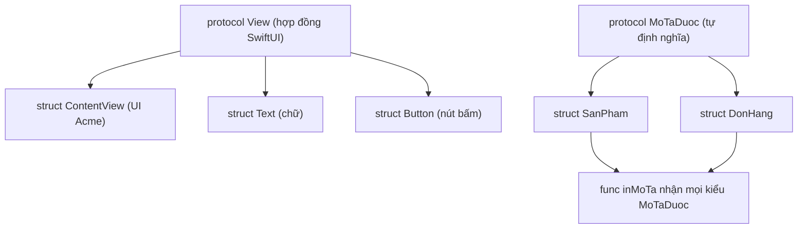

# Swift cơ bản — Optionals, struct/class, protocol

> **Tác giả:** Mr.Rom\
> **Phiên bản:** v1.0.0\
> **Tạo lúc:** 13/06/2026\
> **Cập nhật:** 13/06/2026\
> **Level:** Basic\
> **Tags:** swift, ios, optionals, struct, class, protocol, enum, closure, async-await, swiftui\
> **Yêu cầu trước:** [Lập trình iOS là gì](00_what-is-ios-development.md)

> 🎯 *Bạn vừa biết iOS native viết bằng **Swift** + dựng UI bằng **SwiftUI** trong **Xcode**. Nhưng mở file `.swift` đầu tiên là gặp ngay một loạt cú pháp lạ: dấu `?` sau tên kiểu, `if let`, `struct` thay vì `class`, `protocol`... Bài này dạy đúng phần Swift bạn cần để bắt đầu SwiftUI — không học hết ngôn ngữ, chỉ 8 thứ cốt lõi: `let`/`var`, **optionals** (đặc sản an toàn nil của Swift), kiểu + collection, hàm + closure, **struct vs class**, enum, protocol, error handling và async/await. Cuối bài bạn đọc và viết được Swift cho mọi màn hình Acme Shop cơ bản.*

## 🎯 Sau bài này bạn sẽ

- [ ] Khai báo biến `let`/`var` với **type inference**, hiểu vì sao SwiftUI thích `let`
- [ ] Dùng thành thạo **optionals**: `?`, `if let`, `guard let`, `??`, và tránh force-unwrap `!` gây crash
- [ ] Dùng kiểu cơ bản + collection (`Array`, `Dictionary`, `Set`), hàm và **closure** (trailing closure)
- [ ] Phân biệt **struct (value) vs class (reference)** và biết vì sao SwiftUI thiên về `struct`
- [ ] Viết **enum** có associated value và **protocol** + extension
- [ ] Xử lý lỗi bằng `do`/`try`/`catch` và gọi hàm bất đồng bộ bằng `async`/`await`

---

## Tình huống — biết lập trình rồi mà mở file Swift vẫn thấy lạ

Bạn đã quyết định viết app Acme Shop bằng iOS native: Swift + SwiftUI. Bạn từng viết JavaScript, Python hoặc Java nên tự tin học nhanh. Bạn mở Xcode, tạo project mới, và thấy ngay một đoạn như thế này trong file mẫu:

```swift
struct ContentView: View {
    @State private var soLuong = 0

    var body: some View {
        Text("Giỏ: \(soLuong) sản phẩm")
    }
}
```

Một loạt thứ lạ xuất hiện cùng lúc:

- `struct ContentView: View` — sao UI lại là một **struct**, không phải `class` như các framework khác?
- `var body: some View` — `some View` là kiểu gì? Sao không ghi rõ kiểu trả về?
- `\(soLuong)` — cú pháp nhúng biến vào chuỗi (string interpolation).
- Và khi đọc tiếp code thật, bạn sẽ gặp `String?`, `if let`, `guard let`, `??`, `protocol`, `enum`... khắp nơi.

> [!NOTE]
> Để code Swift, bạn cần một máy **Mac** và phần mềm **Xcode** (tải miễn phí trên Mac App Store). Mọi đoạn code trong bài đều chạy đúng với **Swift 6** — phiên bản đi kèm Xcode hiện hành. Bạn có thể gõ thử nhanh trong **Playground** của Xcode (File → New → Playground) mà chưa cần dựng cả app.

Để hết bối rối, ta cần đúng một thứ: **đủ Swift để đọc cú pháp này**. Bài này đi qua 8 mục cốt lõi theo thứ tự, mỗi mục gắn với một mảnh code Acme Shop thật. Học xong, bạn quay lại đoạn trên sẽ thấy mọi ký tự đều có nghĩa.

---

## 1️⃣ `let` / `var` và type inference

Swift là ngôn ngữ **kiểu tĩnh** (static typing) — mỗi biến có một kiểu xác định lúc biên dịch, giống Java/TypeScript. Nhưng Swift hiếm khi bắt bạn ghi kiểu ra: nó **tự suy ra** (type inference) từ giá trị bên phải.

Điểm đầu tiên phải nhớ: Swift phân biệt rạch ròi giữa **hằng** và **biến**.

- `let` — khai báo **hằng** (constant): gán một lần, sau đó **không đổi** được.
- `var` — khai báo **biến** (variable): gán lại bao nhiêu lần cũng được.

```swift
// 1. let = hằng, gán 1 lần rồi khoá
let tenCuaHang = "Acme Shop"   // Swift tự suy ra kiểu String
// tenCuaHang = "Khac"         // ❌ Lỗi biên dịch — không gán lại được let

// 2. var = biến, đổi tuỳ thích
var soLuong = 3                // Swift tự suy ra kiểu Int
soLuong = 5                    // OK

// 3. Ghi kiểu tường minh khi cần rõ ràng (kiểu : sau tên)
let giaSanPham: Double = 25_000_000   // dấu _ chỉ để dễ đọc, không ảnh hưởng giá trị
let conHang: Bool = true
```

Có một thói quen quan trọng trong Swift mà bạn nên hình thành ngay: **mặc định luôn dùng `let`, chỉ đổi sang `var` khi thật sự cần thay đổi giá trị.** Trình biên dịch còn chủ động cảnh báo "biến này không bao giờ đổi, nên dùng `let`". Lý do sâu xa liên quan đến cách SwiftUI hoạt động — ta sẽ thấy ở mục struct/class — nhưng nguyên tắc thì đơn giản: ít thứ thay đổi được thì ít chỗ sinh bug.

🪞 **Ẩn dụ**: `let` như **mực in trên giấy** — viết xong là cố định, muốn đổi phải in tờ mới. `var` như **bảng phấn** — xoá viết lại thoải mái. Swift khuyến khích dùng "mực in" nhiều nhất có thể, vì thứ gì không đổi được thì không thể bị ai đó vô tình bôi xoá sai.

So với thứ bạn đã biết: `let` của Swift ≈ `const` của JS, `var` của Swift ≈ `let` của JS. Đừng nhầm `var` Swift với `var` JS — `var` Swift vẫn khoá kiểu, gán `soLuong = "abc"` sẽ lỗi biên dịch ngay.

> 📖 *Khai báo biến thì dễ. Nhưng điểm khác biệt lớn nhất giữa Swift và phần lớn ngôn ngữ bạn từng biết nằm ở chỗ tiếp theo: cách Swift xử lý giá trị "rỗng" (nil). Đây là phần phải nắm thật chắc.*

---

## 2️⃣ Optionals — đặc sản an toàn nil của Swift

Đây là khái niệm Swift khác các ngôn ngữ khác nhiều nhất, và cũng là thứ làm người mới bối rối nhất. Hãy bắt đầu bằng một vấn đề bạn chắc chắn từng gặp.

Trong nhiều ngôn ngữ, biến nào cũng có thể là `null`/`nil` bất cứ lúc nào. Bạn lấy ghi chú đơn hàng từ server, server không trả gì, biến thành `null`, bạn quên kiểm tra, gọi `.length` lên nó — **crash**. Đó là lỗi kinh điển `NullPointerException` (Java) hay `Cannot read property 'x' of undefined` (JS). Tony Hoare — người phát minh ra `null` — gọi nó là "sai lầm tỉ đô" của mình.

Swift chặn lỗi này từ gốc bằng **optionals**. Quy tắc cốt lõi: một biến **không được phép** mang giá trị `nil`, **trừ khi** bạn nói rõ "biến này có thể nil" bằng dấu `?` sau tên kiểu.

```swift
// Mặc định: KHÔNG được nil
var ten: String = "Acme"
// ten = nil   // ❌ Lỗi biên dịch — String thường không nhận nil

// Thêm ? → kiểu "optional" (có thể chứa giá trị, hoặc nil)
var ghiChu: String?          // mặc định là nil
ghiChu = "Giao buổi sáng"    // gán giá trị: OK
ghiChu = nil                 // gán nil: cũng OK
```

🪞 **Ẩn dụ**: Optional giống một **chiếc hộp quà**. `String?` nghĩa là "hộp này **có thể** chứa một chuỗi, hoặc **rỗng** (nil)". Bạn không được dùng món đồ bên trong ngay — phải **mở hộp ra kiểm tra** trước. Nếu cứ thò tay vào hộp mà không nhìn (force-unwrap), gặp hộp rỗng là bị "đứt tay" (crash). Toàn bộ phần này dạy 4 cách mở hộp an toàn.

### Cách 1 — `if let` (mở hộp tạm thời trong một khối)

`if let` thử mở optional: nếu **có giá trị**, nó gán vào một hằng mới và chạy khối trong `{ }`; nếu **nil** thì bỏ qua. Trong khối đó, biến đã được "mở hộp" thành kiểu thường (không còn `?`).

```swift
var ghiChu: String? = "Giao buổi sáng"

// if let: chỉ chạy khối nếu ghiChu KHÁC nil
if let noiDung = ghiChu {
    // Trong đây noiDung là String thường (đã mở hộp), dùng thẳng
    print("Ghi chú: \(noiDung)")   // in: Ghi chú: Giao buổi sáng
} else {
    print("Không có ghi chú")
}

// Từ Swift 5.7 có thể viết gọn nếu trùng tên (shorthand)
if let ghiChu {
    print("Ghi chú: \(ghiChu)")    // ghiChu trong đây là String thường
}
```

### Cách 2 — `guard let` (mở hộp rồi đi tiếp, nil thì thoát sớm)

`guard let` cũng mở optional, nhưng tư duy ngược lại: "nếu nil thì **thoát ngay**, còn có giá trị thì cho biến **sống tiếp** đến hết hàm". Đây là kiểu rất hay dùng trong Swift để tránh lồng `if` nhiều tầng.

```swift
func guiDonHang(ghiChu: String?) {
    // guard: nil thì thoát hàm luôn; có giá trị thì noiDung sống tiếp
    guard let noiDung = ghiChu else {
        print("Đơn không có ghi chú — bỏ qua")
        return   // bắt buộc phải thoát (return/throw/break) trong else
    }

    // Tới đây noiDung chắc chắn KHÁC nil, dùng thoải mái đến cuối hàm
    print("Xử lý ghi chú: \(noiDung)")
}

guiDonHang(ghiChu: "Gọi trước khi giao")   // in: Xử lý ghi chú: Gọi trước khi giao
guiDonHang(ghiChu: nil)                    // in: Đơn không có ghi chú — bỏ qua
```

Khác biệt giữa `if let` và `guard let` rất thực dụng: `if let` mở hộp dùng **trong** khối `{ }`; `guard let` mở hộp dùng **từ đó đến hết hàm**. Khi viết hàm có nhiều điều kiện đầu vào cần kiểm tra, `guard` giúp code phẳng và dễ đọc hơn nhiều so với lồng `if`.

### Cách 3 — `??` (giá trị mặc định khi nil)

Toán tử `??` (nil-coalescing) trả về giá trị bên trái nếu nó khác nil, ngược lại lấy giá trị bên phải làm mặc định. Đây là cách gọn nhất để "có một giá trị an toàn".

```swift
var ghiChu: String? = nil

// Nếu ghiChu nil → dùng chuỗi mặc định
let hienThi = ghiChu ?? "Không có ghi chú"
print(hienThi)   // in: Không có ghi chú

ghiChu = "Giao nhanh"
print(ghiChu ?? "Không có ghi chú")   // in: Giao nhanh
```

### Cách 4 — `?.` (optional chaining: gọi an toàn)

Khi optional là một object và bạn muốn gọi thuộc tính/method của nó, dùng `?.` (optional chaining): nếu object khác nil thì gọi bình thường, nếu nil thì cả biểu thức trả về nil mà **không crash**.

```swift
var ghiChu: String? = "Giao nhanh"

// ?. : nếu ghiChu khác nil thì lấy .count, nếu nil thì doDai = nil
let doDai: Int? = ghiChu?.count
print(doDai ?? 0)   // in: 10  (số ký tự của "Giao nhanh")

ghiChu = nil
print(ghiChu?.count ?? 0)   // in: 0  (ghiChu nil → cả biểu thức nil → ?? cho 0)
```

### Cạm bẫy lớn nhất: force-unwrap `!`

Còn một cách mở hộp nữa: dấu `!` (force-unwrap). Nó nói với trình biên dịch "tôi **chắc chắn** hộp này có đồ, mở luôn đi". Nhưng nếu bạn sai — hộp rỗng — app **crash ngay lập tức**.

```swift
var ghiChu: String? = nil

// ! ép mở hộp — nếu ghiChu thật sự nil thì CRASH
let noiDung = ghiChu!   // 💥 crash: "Unexpectedly found nil while unwrapping an Optional value"
print(noiDung)
```

> [!WARNING]
> Force-unwrap `!` là nguyên nhân crash phổ biến nhất của người mới học Swift. Nó biến chính cơ chế an toàn của Swift thành quả bom hẹn giờ: code biên dịch qua, chạy ngon trong lúc test (vì lúc đó có dữ liệu), rồi crash trên máy người dùng đúng lúc gặp nil. Quy tắc vàng: **gần như không bao giờ dùng `!`**. Cần giá trị an toàn thì `??`, cần kiểm tra rồi mới dùng thì `if let`/`guard let`.

Để chốt lại 4 cách an toàn, đây là bảng tổng hợp — đọc theo từng dòng để biết khi nào dùng cái nào:

| Cách | Cú pháp | Khi nào dùng |
|---|---|---|
| `if let` | `if let x = optional { ... }` | Chỉ cần giá trị trong một khối ngắn |
| `guard let` | `guard let x = optional else { return }` | Cần giá trị từ đó đến hết hàm, nil thì thoát sớm |
| `??` | `optional ?? mặcĐịnh` | Muốn một giá trị thay thế khi nil |
| `?.` | `optional?.thuộcTính` | Gọi thuộc tính/method an toàn trên object có thể nil |
| `!` | `optional!` | ❌ Tránh — chỉ khi chắc chắn 100% (hiếm) |

> 📖 *Nắm được optionals là qua phần khó nhất của Swift cơ bản. Giờ ta lướt nhanh qua các kiểu dữ liệu và collection — phần này quen thuộc với mọi ngôn ngữ.*

---

## 3️⃣ Kiểu cơ bản và collection

Swift có các kiểu cơ bản giống mọi ngôn ngữ, chỉ khác tên đôi chút. Bạn không cần học thuộc — chỉ cần nhận mặt khi đọc code.

| Kiểu | Dùng cho | Ví dụ |
|---|---|---|
| `Int` | Số nguyên | `let soLuong = 3` |
| `Double` | Số thực (mặc định cho số lẻ) | `let gia = 25.5` |
| `Bool` | Đúng/sai | `let conHang = true` |
| `String` | Chuỗi | `let ten = "iPhone"` |
| `Character` | Một ký tự | `let chu: Character = "A"` |

Chuỗi Swift có một tính năng dùng cực nhiều: **string interpolation** (nội suy chuỗi) — nhúng biến vào chuỗi bằng `\(...)`. Bạn đã thấy nó trong code SwiftUI ở đầu bài.

```swift
let ten = "iPhone 15"
let gia = 25_000_000

// Nhúng biến vào chuỗi bằng \( )
let mota = "\(ten) giá \(gia) đ"
print(mota)   // in: iPhone 15 giá 25000000 đ
```

Về collection, Swift có 3 loại chính. Mỗi loại giải một bài toán khác nhau, nên hiểu vai trò rồi hẵng dùng:

- **`Array`** — danh sách **có thứ tự**, cho phép phần tử trùng. Dùng khi thứ tự quan trọng (danh sách sản phẩm hiển thị).
- **`Dictionary`** — cặp **khoá–giá trị** (key–value), tra cứu nhanh theo khoá. Dùng khi cần tìm nhanh theo một định danh (mã sản phẩm → số lượng).
- **`Set`** — tập hợp **không trùng lặp**, không quan tâm thứ tự. Dùng khi cần đảm bảo không có phần tử lặp (tập các thẻ tag).

```swift
// 1. Array — danh sách có thứ tự
var sanPham: [String] = ["iPhone", "AirPods", "MacBook"]
sanPham.append("iPad")            // thêm phần tử cuối
print(sanPham.count)              // in: 4  (số phần tử)
print(sanPham[0])                 // in: iPhone  (truy cập theo chỉ số)

// 2. Dictionary — cặp khoá : giá trị
var tonKho: [String: Int] = ["iPhone": 12, "AirPods": 30]
tonKho["MacBook"] = 5             // thêm/đổi giá trị theo khoá
// Tra cứu trả về OPTIONAL (vì khoá có thể không tồn tại)
let soLuong = tonKho["iPhone"] ?? 0
print(soLuong)                    // in: 12

// 3. Set — tập hợp không trùng
var tags: Set<String> = ["sale", "hot", "sale"]   // "sale" lặp sẽ bị gộp
print(tags.count)                 // in: 2  (chỉ còn "sale", "hot")
```

Một chi tiết Swift đặc trưng đáng nhớ: tra cứu `Dictionary` theo khoá **luôn trả về optional** (`Int?` ở trên), vì khoá có thể không tồn tại. Đây chính là optionals từ mục 2 quay lại — và vì thế ta dùng `?? 0` để có giá trị an toàn.

> 📖 *Có dữ liệu rồi thì cần hàm để xử lý. Phần hàm của Swift khá quen, nhưng có một thứ rất quan trọng cho SwiftUI: closure.*

---

## 4️⃣ Hàm và closure

Hàm Swift khai báo bằng từ khoá `func`, ghi kiểu trả về sau dấu `->`. Một đặc điểm Swift rất riêng: **mỗi tham số có một "argument label"** — tên bạn phải ghi khi gọi hàm, giúp lời gọi đọc như câu tiếng Anh tự nhiên.

```swift
// func tên(nhãn tên: Kiểu) -> KiểuTrảVề
func taoLabel(ten: String, soLuong: Int) -> String {
    return "\(ten) x\(soLuong)"
}

// Gọi hàm: PHẢI ghi nhãn tham số (ten:, soLuong:)
let label = taoLabel(ten: "iPhone", soLuong: 2)
print(label)   // in: iPhone x2

// Tham số có giá trị mặc định → khi gọi được phép bỏ
func chao(ten: String = "khách") -> String {
    return "Xin chào \(ten)"
}
print(chao())               // in: Xin chào khách
print(chao(ten: "Acme"))    // in: Xin chào Acme
```

Argument label (`ten:`, `soLuong:`) chính là kiểu bạn thấy khắp SwiftUI: `Text("hi")`, `padding(16)`, `frame(width: 100, height: 100)`. Nó làm code dễ đọc nhưng cũng là lý do người từ JS/Python hay bỡ ngỡ lúc đầu.

### Closure — hàm không tên, truyền đi như giá trị

Phần quan trọng nhất của mục này là **closure**. Closure là một **khối code không tên** mà bạn có thể gán vào biến, hoặc truyền vào hàm như một tham số. Nếu bạn biết JS, closure Swift ≈ **arrow function** (`() => {}`); biết Python thì ≈ **lambda**.

```swift
// Closure gán vào biến — { (tham số) -> kiểuTrảVề in  thân }
let nhanDoi: (Int) -> Int = { (x: Int) -> Int in
    return x * 2
}
print(nhanDoi(10))   // in: 20

// Swift suy ra được kiểu nên thường viết gọn lại:
let nhanDoiGon: (Int) -> Int = { x in x * 2 }
print(nhanDoiGon(5)) // in: 10
```

Closure quan trọng vì rất nhiều hàm Swift **nhận một closure làm tham số**. Ví dụ kinh điển: `map` (biến đổi từng phần tử), `filter` (lọc), `sorted` (sắp xếp).

```swift
let gia = [25, 10, 40, 5]

// map: nhân mỗi giá lên 1000 → trả về mảng mới
let giaDayDu = gia.map { x in x * 1000 }
print(giaDayDu)   // in: [25000, 10000, 40000, 5000]

// filter: chỉ giữ giá > 20
let giaCao = gia.filter { x in x > 20 }
print(giaCao)     // in: [25, 40]

// sorted: sắp xếp tăng dần
print(gia.sorted())   // in: [5, 10, 25, 40]
```

### Trailing closure — viết gọn closure cuối cùng

Để ý ở trên ta viết `gia.map { x in x * 1000 }` chứ không phải `gia.map({ x in x * 1000 })`. Đó là **trailing closure**: khi closure là **tham số cuối cùng** của hàm, Swift cho phép kéo nó ra **ngoài** dấu `()` để code gọn và dễ đọc hơn.

```swift
// Cả 2 dòng dưới TƯƠNG ĐƯƠNG nhau — chỉ khác cách viết:

// 1. Truyền closure bên trong dấu ()
let a = gia.map({ x in x * 1000 })

// 2. Trailing closure — kéo ra ngoài (), bỏ luôn () nếu không còn tham số nào khác
let b = gia.map { x in x * 1000 }
```

> [!IMPORTANT]
> Trailing closure không phải mẹo làm đẹp tuỳ thích — nó là **nền tảng cú pháp của SwiftUI**. Khi bạn viết `Button("Mua") { muaHang() }`, phần `{ muaHang() }` chính là trailing closure (hành động khi bấm nút). Hiểu trailing closure là điều kiện để đọc được mọi code SwiftUI ở bài sau.

→ Closure và trailing closure xuất hiện ở gần như mọi dòng SwiftUI. Giờ ta tới phần quyết định nhất với SwiftUI: chọn `struct` hay `class`.

---

## 5️⃣ struct vs class — value type vs reference type

Đây là quyết định nền tảng nhất khi viết Swift, và là chỗ người từ ngôn ngữ khác (Java, C#, Python — nơi gần như mọi thứ là class) hay nhầm nhất. Swift có **cả hai**, và chúng hành xử **khác nhau ở một điểm sống còn**: cách sao chép giá trị.

- **`struct`** là **value type** (kiểu giá trị): khi gán hoặc truyền đi, nó được **sao chép** — bản mới hoàn toàn độc lập với bản gốc.
- **`class`** là **reference type** (kiểu tham chiếu): khi gán hoặc truyền đi, chỉ **tham chiếu** (địa chỉ) được sao, cả hai cùng trỏ tới **một** object — sửa bên này, bên kia đổi theo.

🪞 **Ẩn dụ**: `struct` giống **một tờ giấy** — bạn đưa cho bạn mình thì thực ra đưa một **bản photocopy**. Họ viết bậy lên bản của họ, tờ của bạn vẫn nguyên. `class` giống **một tài liệu Google Docs chia sẻ link** — bạn gửi link, cả hai mở **cùng một file**, ai sửa thì người kia thấy ngay.

Code dưới minh hoạ chính xác sự khác biệt này — đọc kỹ vì nó là gốc rễ của rất nhiều bug:

```swift
// struct = VALUE TYPE (sao chép)
struct SanPhamStruct {
    var ten: String
    var gia: Int
}

var sp1 = SanPhamStruct(ten: "iPhone", gia: 25)
var sp2 = sp1            // sp2 là BẢN SAO độc lập của sp1
sp2.gia = 30            // sửa sp2...
print(sp1.gia)          // in: 25  ← sp1 KHÔNG đổi (bản sao riêng)
print(sp2.gia)          // in: 30


// class = REFERENCE TYPE (chia sẻ)
class SanPhamClass {
    var ten: String
    var gia: Int
    init(ten: String, gia: Int) {   // class phải tự viết init
        self.ten = ten
        self.gia = gia
    }
}

let c1 = SanPhamClass(ten: "iPhone", gia: 25)
let c2 = c1             // c2 trỏ tới CÙNG object với c1
c2.gia = 30            // sửa qua c2...
print(c1.gia)          // in: 30  ← c1 ĐỔI THEO (cùng một object)
print(c2.gia)          // in: 30
```

Để bạn không phải nhớ máy móc, đây là bảng so sánh đầy đủ các khác biệt thực dụng giữa hai loại:

| Tiêu chí | `struct` (value type) | `class` (reference type) |
|---|---|---|
| Khi gán/truyền đi | **Sao chép** — bản độc lập | **Chia sẻ** — cùng một object |
| Kế thừa (inheritance) | Không | Có (`class B: A`) |
| Cần viết `init`? | Không (Swift tự tạo memberwise init) | Có (phải tự viết) |
| Đếm tham chiếu (ARC) | Không cần | Có (Swift quản lý bộ nhớ) |
| Hằng `let` của nó | Không sửa được thuộc tính | Vẫn sửa được thuộc tính (vì là tham chiếu) |
| Mặc định nên dùng | ✅ Đây là lựa chọn mặc định | Khi cần chia sẻ hoặc kế thừa |

Một chi tiết hay gây ngạc nhiên ở dòng cuối bảng: với `class`, dù bạn khai báo `let c1`, bạn **vẫn sửa được** `c1.gia = 30` — vì `let` chỉ khoá "c1 trỏ tới object nào", không khoá nội dung object. Với `struct`, `let sp1` thì sửa `sp1.gia` sẽ lỗi biên dịch. Đây là lý do `struct` an toàn hơn cho dữ liệu hiển thị.

### Vì sao SwiftUI thiên về struct?

Bạn nhớ ở đầu bài, `ContentView` là `struct ContentView: View` chứ không phải class? Đó không phải ngẫu nhiên. SwiftUI dựng giao diện bằng **struct** vì:

1. **Value type an toàn hơn** — mỗi View là một mô tả độc lập, không bị code chỗ khác vô tình sửa qua tham chiếu chung.
2. **Nhẹ và nhanh** — SwiftUI tạo lại (recreate) View liên tục khi state đổi; struct nhẹ hơn class (không cần đếm tham chiếu ARC).
3. **Dễ suy luận** — UI là "hàm của state": cùng state cho ra cùng UI, không có hiệu ứng phụ ẩn từ object chia sẻ.

> [!IMPORTANT]
> Quy tắc thực dụng cho cả Swift nói chung và SwiftUI: **mặc định dùng `struct`**. Chỉ chuyển sang `class` khi bạn có nhu cầu rõ ràng — cần **chia sẻ cùng một dữ liệu** giữa nhiều nơi, cần **kế thừa**, hoặc làm việc với API cũ (Objective-C) yêu cầu class. Đây ngược với thói quen từ Java/C# nơi mọi thứ là class.

→ Hiểu value vs reference là cái khoá để hiểu vì sao SwiftUI hoạt động như nó hoạt động. Giờ ta sang hai công cụ mô hình hoá dữ liệu cực mạnh của Swift: enum và protocol.

---

## 6️⃣ enum — mạnh hơn bạn nghĩ

Trong nhiều ngôn ngữ, `enum` chỉ là "danh sách hằng số có tên" (đỏ, xanh, vàng). `enum` của Swift mạnh hơn nhiều: mỗi case có thể **mang theo dữ liệu** (associated value), và Swift bắt bạn xử lý **mọi case** khi dùng `switch` — không bỏ sót.

Bắt đầu với enum cơ bản — mô tả trạng thái một đơn hàng Acme Shop:

```swift
enum TrangThaiDon {
    case dangXuLy
    case dangGiao
    case daGiao
    case daHuy
}

let trangThai = TrangThaiDon.dangGiao

// switch trên enum: Swift BẮT bạn xử lý hết mọi case
switch trangThai {
case .dangXuLy:
    print("Đơn đang được chuẩn bị")
case .dangGiao:
    print("Đơn đang trên đường giao")   // ← case này khớp, in dòng này
case .daGiao:
    print("Đơn đã giao xong")
case .daHuy:
    print("Đơn đã bị huỷ")
}
```

Một điểm an toàn rất hay: nếu bạn quên một case trong `switch`, trình biên dịch **báo lỗi ngay** ("Switch must be exhaustive"). Sau này thêm một case mới (vd `.danHoanTien`), compiler sẽ chỉ thẳng mọi chỗ `switch` cần cập nhật — không sót như chuỗi `if-else`.

### Associated value — mỗi case mang theo dữ liệu

Đây là siêu năng lực của enum Swift. Mỗi case có thể gắn thêm dữ liệu riêng. Ví dụ: trạng thái "đang giao" cần biết **mã vận đơn**, còn "đã huỷ" cần biết **lý do**.

```swift
enum TrangThaiDon {
    case dangXuLy
    case dangGiao(maVanDon: String)    // case này mang theo mã vận đơn
    case daGiao(ngay: String)          // case này mang ngày giao
    case daHuy(lyDo: String)           // case này mang lý do huỷ
}

let trangThai = TrangThaiDon.dangGiao(maVanDon: "VN123456")

// switch + let để lấy dữ liệu đi kèm ra dùng
switch trangThai {
case .dangXuLy:
    print("Đang chuẩn bị")
case .dangGiao(let ma):
    print("Đang giao, mã vận đơn: \(ma)")   // in: Đang giao, mã vận đơn: VN123456
case .daGiao(let ngay):
    print("Đã giao ngày \(ngay)")
case .daHuy(let lyDo):
    print("Huỷ vì: \(lyDo)")
}
```

🪞 **Ẩn dụ**: enum thường giống **các nút bấm cứng trên máy giặt** (Cotton / Wool / Quick) — mỗi nút một chế độ, chọn đúng một. enum có associated value giống **nút bấm kèm ô nhập** — chọn "Hẹn giờ" rồi *điền thêm* số phút. Cùng là "trạng thái", nhưng mỗi trạng thái mang theo thông tin riêng phù hợp với nó.

Associated value cực hữu ích để mô hình hoá dữ liệu "hoặc cái này, hoặc cái kia, mỗi loại kèm thông tin khác nhau" một cách an toàn — bạn sẽ gặp lại nó khi xử lý kết quả gọi API (thành công kèm dữ liệu / thất bại kèm lỗi) ở các bài sau.

> 📖 *enum mô tả "một thứ ở một trong vài trạng thái". Còn khi cần định nghĩa "những kiểu khác nhau cùng làm được một việc giống nhau", ta dùng protocol.*

---

## 7️⃣ protocol và extension

`protocol` là khái niệm trung tâm của Swift — Apple gọi Swift là ngôn ngữ "protocol-oriented". Bạn đã gặp một protocol ngay từ đầu bài mà không để ý: `View` trong `struct ContentView: View` chính là một protocol.

**protocol** là một **bản hợp đồng** (contract): nó liệt kê những thuộc tính và method mà một kiểu **phải có**, nhưng không nói **cách làm**. Bất kỳ struct/class/enum nào "ký vào hợp đồng" (conform) đều phải cung cấp đầy đủ những thứ hợp đồng yêu cầu. Nếu bạn biết Java/C#, protocol ≈ `interface`.

🪞 **Ẩn dụ**: protocol giống **bằng lái xe**. Tấm bằng không quan tâm bạn lái Toyota hay Honda — nó chỉ chứng nhận "người này **biết các kỹ năng lái xe cần thiết**". Tương tự, protocol `MoTaDuoc` không quan tâm bạn là `SanPham` hay `DonHang` — chỉ yêu cầu "kiểu này phải có một thuộc tính `moTa`". Hàm nào cần "thứ mô tả được" thì nhận bất kỳ kiểu nào có bằng đó.

```swift
// 1. Định nghĩa protocol — bản hợp đồng: "phải có thuộc tính moTa"
protocol MoTaDuoc {
    var moTa: String { get }   // { get } = phải đọc được (read-only)
}

// 2. struct SanPham "ký hợp đồng" MoTaDuoc → phải cung cấp moTa
struct SanPham: MoTaDuoc {
    let ten: String
    let gia: Int
    var moTa: String {          // bắt buộc có vì đã conform MoTaDuoc
        return "\(ten) - \(gia)đ"
    }
}

// 3. DonHang cũng ký hợp đồng đó, nhưng moTa khác
struct DonHang: MoTaDuoc {
    let maDon: String
    var moTa: String {
        return "Đơn #\(maDon)"
    }
}

// 4. Hàm nhận BẤT KỲ kiểu nào conform MoTaDuoc
func inMoTa(_ item: MoTaDuoc) {
    print(item.moTa)
}

inMoTa(SanPham(ten: "iPhone", gia: 25))   // in: iPhone - 25đ
inMoTa(DonHang(maDon: "ACME-001"))        // in: Đơn #ACME-001
```

Sức mạnh ở bước 4: hàm `inMoTa` không cần biết kiểu cụ thể, chỉ cần "thứ gì đó có bằng `MoTaDuoc`". Đây là cách Swift cho phép code linh hoạt mà vẫn an toàn kiểu — và là lý do SwiftUI cho phép bạn nhét đủ loại View vào cùng một chỗ (vì tất cả đều conform protocol `View`).

### extension — thêm năng lực cho kiểu có sẵn

`extension` (phần mở rộng) cho phép **thêm method/thuộc tính vào một kiểu đã tồn tại** — kể cả kiểu của Swift như `String`, `Int` mà bạn không sở hữu code gốc. Đây là công cụ cực kỳ hay dùng để code gọn gàng.

```swift
// Thêm một thuộc tính tính toán mới vào kiểu Int có sẵn
extension Int {
    // Định dạng số tiền: 25000000 -> "25000000đ"
    var dinhDangTien: String {
        return "\(self)đ"
    }
}

let gia = 25_000_000
print(gia.dinhDangTien)   // in: 25000000đ
```

extension còn dùng để cung cấp **cách làm mặc định** cho method của protocol (protocol extension) — nhưng phần đó thuộc mức nâng cao hơn, bạn chỉ cần biết extension tồn tại và rất phổ biến trong code Swift thật.

Để hình dung quan hệ giữa các khái niệm vừa học — đây là phần trừu tượng nhất của bài — sơ đồ dưới mô tả cách protocol đóng vai "hợp đồng chung" mà nhiều kiểu khác nhau cùng tuân theo, kể cả struct của SwiftUI:



→ Điểm cốt lõi từ sơ đồ: protocol là "ổ cắm chung", còn struct là "phích cắm" vừa với ổ đó. Hàm/SwiftUI làm việc với ổ cắm (protocol), nên nhận được mọi phích cắm hợp lệ (struct conform protocol) — linh hoạt mà vẫn kiểm tra kiểu chặt chẽ lúc biên dịch.

---

## 8️⃣ Error handling và async/await

Hai mục cuối là thứ bạn cần khi app làm việc thật: xử lý lỗi và gọi mạng. Code Acme Shop nào cũng phải gọi API lấy danh sách sản phẩm — và việc đó **có thể thất bại** (mất mạng, server lỗi) và **mất thời gian**. Swift có cú pháp riêng cho cả hai.

### Error handling — `do` / `try` / `catch`

Swift mô hình hoá lỗi rõ ràng: một hàm **có thể ném lỗi** được đánh dấu `throws`, và khi gọi nó bạn phải dùng `try` trong khối `do`/`catch`. Lỗi thường là một `enum` conform protocol `Error`.

```swift
// 1. Định nghĩa các loại lỗi có thể xảy ra (enum conform Error)
enum LoiTaiSanPham: Error {
    case khongCoMang
    case maKhongTonTai(ma: String)
}

// 2. Hàm có thể ném lỗi → đánh dấu throws
func timSanPham(ma: String) throws -> String {
    guard ma == "SP001" else {
        throw LoiTaiSanPham.maKhongTonTai(ma: ma)   // ném lỗi
    }
    return "iPhone 15"
}

// 3. Gọi hàm có thể lỗi: try trong do/catch
do {
    let ten = try timSanPham(ma: "SP001")
    print("Tìm thấy: \(ten)")              // in: Tìm thấy: iPhone 15
} catch LoiTaiSanPham.maKhongTonTai(let ma) {
    print("Không có sản phẩm mã \(ma)")
} catch {
    print("Lỗi khác: \(error)")            // error là biến mặc định trong catch
}
```

So với `try/catch` của các ngôn ngữ khác, điểm khác biệt là Swift bắt bạn **ghi rõ `try`** trước mỗi lời gọi có thể lỗi — nhìn vào code là biết ngay dòng nào có rủi ro, không bị "lỗi ẩn".

### async / await — gọi việc mất thời gian mà không treo app

Gọi API mất vài trăm mili-giây đến vài giây. Nếu chờ kiểu đồng bộ, app **đơ** (treo giao diện). Giải pháp là **async/await** — gần như giống hệt JS. Hàm bất đồng bộ đánh dấu `async`, và khi gọi nó bạn dùng `await` để "chờ kết quả mà không treo luồng giao diện".

```swift
// Hàm async: có thể vừa async vừa throws (gọi mạng dễ lỗi)
func taiDanhSachSanPham() async throws -> [String] {
    // Giả lập gọi mạng mất 1 giây (1 tỉ nano-giây)
    try await Task.sleep(nanoseconds: 1_000_000_000)
    return ["iPhone 15", "AirPods Pro", "MacBook Air"]
}

// Gọi hàm async: dùng await, và vì nó throws nên kèm try
func hienThiSanPham() async {
    do {
        let ds = try await taiDanhSachSanPham()   // chờ 1 giây rồi có kết quả
        print("Tải được \(ds.count) sản phẩm")    // in: Tải được 3 sản phẩm
    } catch {
        print("Tải thất bại: \(error)")
    }
}
```

🪞 **Ẩn dụ**: `await` giống **gọi món ở quán rồi lấy số chờ** — bạn không đứng chôn chân ở quầy chặn cả hàng người sau (treo app), mà ngồi xuống làm việc khác, có món thì hệ thống gọi số bạn (kết quả về thì code chạy tiếp). `async` đánh dấu "món này cần thời gian chuẩn bị", `await` là "chỗ tôi cần chờ món đó xong mới đi tiếp".

> [!NOTE]
> Nếu bạn từng viết `async`/`await` trong JavaScript, Swift gần như giống hệt: `async` đánh dấu hàm bất đồng bộ, `await` chờ kết quả. Khác biệt nhỏ: Swift kết hợp được `async throws` (vừa bất đồng bộ vừa có thể lỗi), nên khi gọi thường viết `try await`. SwiftUI có sẵn modifier `.task { }` để chạy code async lúc màn hình hiện ra — bạn sẽ dùng nó ở bài về data và networking.

→ Vậy là đủ 8 mảnh Swift cốt lõi. Quay lại đoạn `struct ContentView: View` ở đầu bài: giờ bạn biết `struct` là value type SwiftUI ưa dùng, `View` là một protocol (hợp đồng), `\(soLuong)` là string interpolation, và phần `{ }` trong các View là trailing closure. Không còn ký tự nào lạ nữa.

---

## 💡 Cạm bẫy thường gặp & Best practice

### ❌ Cạm bẫy: Force-unwrap `!` gây crash

- **Triệu chứng**: App biên dịch qua, chạy ngon lúc test, rồi **crash đột ngột** trên máy người dùng với lỗi `Fatal error: Unexpectedly found nil while unwrapping an Optional value`.
- **Nguyên nhân**: Dùng `!` để ép mở một optional đang là `nil`. Phổ biến nhất là khi lấy dữ liệu từ server/Dictionary rồi `!` ngay mà không kiểm tra — lúc test có dữ liệu nên không sao, lúc thật gặp nil thì nổ.
- **Cách tránh**: Gần như không bao giờ dùng `!`. Cần giá trị thay thế thì `??` (vd `tonKho["x"] ?? 0`); cần kiểm tra rồi mới dùng thì `if let`/`guard let`. Chỉ chấp nhận `!` trong vài trường hợp hằng số bạn chắc chắn 100% (vd `URL(string: "https://acme.io")!` với chuỗi tĩnh hợp lệ).

### ❌ Cạm bẫy: Nhầm struct với class (value vs reference)

- **Triệu chứng**: Hoặc (a) sửa một bản sao struct rồi ngạc nhiên vì bản gốc không đổi; hoặc (b) sửa qua một biến class rồi bất ngờ vì một biến khác cũng đổi theo "không rõ tại sao".
- **Nguyên nhân**: Không phân biệt được struct **sao chép** (value type) còn class **chia sẻ** (reference type). Người từ Java/Python quen "mọi thứ là object chia sẻ" nên hay giả định sai khi gặp struct.
- **Cách tránh**: Nhớ một câu: *"struct là bản photocopy, class là link chia sẻ."* Khi gán/truyền: struct cho bản độc lập, class cho cùng một object. Mặc định dùng `struct`; chỉ chuyển sang `class` khi thật sự cần chia sẻ chung dữ liệu hoặc cần kế thừa.

### ✅ Best practice: Mặc định `let` và `struct`, chỉ "nâng cấp" khi cần

- **Vì sao**: Càng nhiều thứ bất biến (`let`) và độc lập (`struct`) thì càng ít chỗ trạng thái bị thay đổi ngoài ý muốn — ít bug khó tìm. SwiftUI được thiết kế quanh đúng nguyên tắc này (View là struct, dữ liệu hiển thị nên là value).
- **Cách áp dụng**: Viết `let` trước, đổi thành `var` chỉ khi trình biên dịch hoặc logic bắt buộc. Khai báo kiểu mới bằng `struct` trước, đổi thành `class` chỉ khi cần chia sẻ instance hoặc kế thừa. Đây là default đảo ngược với thói quen từ Java/C#.

### ✅ Best practice: Dùng `guard let` để thoát sớm, giữ code phẳng

- **Vì sao**: Lồng nhiều `if let` làm code thụt sâu ("kim tự tháp"), khó đọc. `guard let` kiểm tra điều kiện đầu vào và thoát sớm nếu sai, giữ phần thân hàm phẳng và rõ ý "đường đi chính".
- **Cách áp dụng**: Đầu hàm, dùng `guard let x = optional else { return }` cho mọi điều kiện bắt buộc. Sau các `guard`, code còn lại là "luồng hạnh phúc" (happy path) sạch sẽ, mọi biến đã được mở hộp an toàn.

---

## 🧠 Tự kiểm tra (Self-check)

**Q1.** `String` và `String?` khác nhau thế nào? Vì sao Swift bắt phải "mở hộp" một optional trước khi dùng?

<details>
<summary>💡 Đáp án</summary>

`String` là kiểu **không-nil**: không bao giờ được gán `nil` (gán sẽ lỗi biên dịch). `String?` là **optional**: có thể chứa một chuỗi, hoặc là `nil`.

Swift bắt mở hộp (qua `if let`/`guard let`/`??`/`?.`) trước khi dùng để **chặn lỗi nil ngay lúc biên dịch** thay vì để app crash lúc chạy. Nếu cho phép dùng thẳng giá trị có thể nil, ta quay lại đúng lỗi `NullPointerException` mà optionals sinh ra để ngăn.

</details>

**Q2.** Dòng nào sau đây nguy hiểm và vì sao: `let x = tonKho["iPhone"] ?? 0` hay `let x = tonKho["iPhone"]!`?

<details>
<summary>💡 Đáp án</summary>

Dòng `tonKho["iPhone"]!` nguy hiểm. Tra cứu `Dictionary` luôn trả về **optional** (khoá có thể không tồn tại). Dùng `!` ép mở: nếu khoá `"iPhone"` không có trong `tonKho`, app **crash** ngay.

Dòng `tonKho["iPhone"] ?? 0` an toàn: nếu khoá tồn tại thì lấy giá trị, nếu không thì dùng `0` làm mặc định — không bao giờ crash.

</details>

**Q3.** Cho đoạn code: `var a = SanPhamStruct(...)`; `var b = a`; `b.gia = 99`. Sau đó `a.gia` có đổi không? Câu trả lời khác gì nếu `SanPhamStruct` là một `class`?

<details>
<summary>💡 Đáp án</summary>

Nếu là **struct** (value type): `b = a` tạo **bản sao độc lập**, nên `b.gia = 99` **không** ảnh hưởng `a`. `a.gia` giữ nguyên.

Nếu là **class** (reference type): `b = a` khiến `b` và `a` trỏ tới **cùng một object**, nên `b.gia = 99` làm `a.gia` **cũng thành 99**.

Đây chính là khác biệt value vs reference — gốc rễ của nhiều bug khi nhầm hai loại.

</details>

**Q4.** Vì sao SwiftUI dùng `struct` cho View thay vì `class`? Nêu ít nhất 2 lý do.

<details>
<summary>💡 Đáp án</summary>

Các lý do chính:

1. **An toàn (value type)**: mỗi View là mô tả độc lập, không bị code nơi khác sửa qua tham chiếu chung.
2. **Nhẹ và nhanh**: SwiftUI tạo lại View liên tục khi state đổi; struct nhẹ hơn class (không cần đếm tham chiếu ARC).
3. **Dễ suy luận**: UI là "hàm của state" — cùng state cho cùng UI, không có hiệu ứng phụ ẩn từ object chia sẻ.

</details>

**Q5.** `enum` của Swift mạnh hơn enum thường ở điểm nào? Cho ví dụ một case có associated value hợp lý cho trạng thái đơn hàng.

<details>
<summary>💡 Đáp án</summary>

Điểm mạnh: (1) mỗi case có thể **mang theo dữ liệu** (associated value); (2) `switch` trên enum bị **bắt phải xử lý hết mọi case** (exhaustive) — quên case nào compiler báo lỗi ngay.

Ví dụ associated value: `case dangGiao(maVanDon: String)` — trạng thái "đang giao" mang theo mã vận đơn; hoặc `case daHuy(lyDo: String)` — trạng thái "đã huỷ" mang theo lý do. Mỗi trạng thái kèm đúng thông tin phù hợp với nó.

</details>

**Q6.** `protocol` dùng để làm gì? Hàm `func inMoTa(_ item: MoTaDuoc)` nhận được những kiểu nào?

<details>
<summary>💡 Đáp án</summary>

`protocol` là một **bản hợp đồng**: liệt kê các thuộc tính/method mà một kiểu phải có, không nói cách làm. Kiểu nào "ký hợp đồng" (conform) thì phải cung cấp đầy đủ. Tương đương `interface` trong Java/C#.

`func inMoTa(_ item: MoTaDuoc)` nhận **bất kỳ kiểu nào conform protocol `MoTaDuoc`** — struct, class hay enum đều được, miễn nó có thuộc tính `moTa` theo hợp đồng. Trong ví dụ: cả `SanPham` lẫn `DonHang`.

</details>

---

## ⚡ Tra cứu nhanh (Cheatsheet)

| Mục đích | Cú pháp Swift |
|---|---|
| Hằng (không đổi) | `let x = 5` |
| Biến (đổi được) | `var x = 5` |
| Optional (có thể nil) | `var x: String?` |
| Mở hộp trong khối | `if let x = optional { ... }` |
| Mở hộp, thoát sớm nếu nil | `guard let x = optional else { return }` |
| Giá trị mặc định khi nil | `optional ?? "default"` |
| Gọi an toàn trên object có thể nil | `optional?.count` |
| Force-unwrap (❌ tránh) | `optional!` |
| Mảng | `var a: [Int] = [1, 2, 3]` |
| Từ điển | `var d: [String: Int] = ["a": 1]` |
| Tập hợp | `var s: Set<String> = ["a", "b"]` |
| Nội suy chuỗi | `"\(ten) giá \(gia)"` |
| Hàm | `func f(ten: String) -> Int { ... }` |
| Closure | `let c: (Int) -> Int = { x in x * 2 }` |
| Trailing closure | `arr.map { x in x * 2 }` |
| Struct (value type) | `struct S { var x: Int }` |
| Class (reference type) | `class C { init(...) { ... } }` |
| Enum + associated value | `case dangGiao(ma: String)` |
| Protocol | `protocol P { var x: Int { get } }` |
| Conform protocol | `struct S: P { ... }` |
| Extension | `extension Int { var f: String { ... } }` |
| Ném lỗi | `throws` + `throw LoiX.case` |
| Bắt lỗi | `do { try f() } catch { ... }` |
| Hàm bất đồng bộ | `func f() async -> T { ... }` |
| Gọi async | `await f()` (hoặc `try await f()`) |

---

## 📚 Từ Điển Thuật Ngữ (Glossary)

| EN | VN | Giải thích |
|---|---|---|
| Swift | Swift | Ngôn ngữ Apple dùng viết app iOS/macOS; kiểu tĩnh, an toàn nil |
| Type inference | Suy ra kiểu | Swift tự đoán kiểu biến từ giá trị, không cần ghi rõ |
| Constant (`let`) | Hằng | Giá trị gán một lần rồi khoá, không đổi được |
| Variable (`var`) | Biến | Giá trị gán lại được nhiều lần |
| Optional | Optional | Kiểu có thể chứa giá trị hoặc nil, đánh dấu bằng `?` |
| `nil` | nil | Giá trị "rỗng / không có gì" trong Swift |
| Force-unwrap (`!`) | Ép mở hộp | Mở optional bất chấp; crash nếu đang là nil |
| Optional binding | Mở hộp an toàn | Dùng `if let`/`guard let` để lấy giá trị nếu khác nil |
| Nil-coalescing (`??`) | Toán tử mặc định | Lấy giá trị bên trái nếu khác nil, không thì lấy bên phải |
| Optional chaining (`?.`) | Gọi an toàn | Gọi thuộc tính/method, nil thì cả biểu thức là nil |
| Array | Mảng | Danh sách có thứ tự, cho phép trùng |
| Dictionary | Từ điển | Cặp khoá–giá trị, tra cứu nhanh theo khoá |
| Set | Tập hợp | Tập không trùng lặp, không thứ tự |
| String interpolation | Nội suy chuỗi | Nhúng biến vào chuỗi bằng `\(...)` |
| Closure | Closure | Khối code không tên, gán/truyền đi như giá trị |
| Trailing closure | Trailing closure | Kéo closure cuối ra ngoài `()` cho gọn |
| Struct | Struct | Kiểu giá trị (value type) — sao chép khi gán |
| Class | Class | Kiểu tham chiếu (reference type) — chia sẻ khi gán |
| Value type | Kiểu giá trị | Khi gán/truyền thì sao chép thành bản độc lập |
| Reference type | Kiểu tham chiếu | Khi gán/truyền thì cùng trỏ tới một object |
| ARC | Đếm tham chiếu tự động | Cơ chế Swift tự quản lý bộ nhớ cho class |
| Enum | Enum | Kiểu liệt kê các trạng thái; case có thể mang dữ liệu |
| Associated value | Giá trị đi kèm | Dữ liệu gắn vào một case của enum |
| Protocol | Protocol | Bản hợp đồng liệt kê thuộc tính/method kiểu phải có (≈ interface) |
| Conform | Tuân theo | Một kiểu cung cấp đủ thứ một protocol yêu cầu |
| Extension | Phần mở rộng | Thêm method/thuộc tính vào kiểu đã tồn tại |
| `throws` / `try` / `catch` | Ném/thử/bắt lỗi | Cơ chế xử lý lỗi tường minh của Swift |
| async / await | Bất đồng bộ / chờ | Gọi việc mất thời gian (mạng) mà không treo giao diện |
| Xcode | Xcode | Phần mềm của Apple để viết, build và chạy app iOS |

---

## 🔗 Liên kết & Tài nguyên

⬅️ **Bài trước:** [Lập trình iOS là gì? — Swift, Xcode, SwiftUI](00_what-is-ios-development.md)\
➡️ **Bài tiếp theo:** [SwiftUI cơ bản — View, modifier, @State](02_swiftui-fundamentals.md)\
↑ **Về cụm:** [iOS & Swift cơ bản](../../README.md)

### 🧭 Định hướng lộ trình học

- [Lập trình iOS là gì? — Swift, Xcode, SwiftUI](00_what-is-ios-development.md) — nền tảng trước khi vào cú pháp Swift
- [SwiftUI cơ bản — View, modifier, @State](02_swiftui-fundamentals.md) — bài kế: dùng Swift vừa học để dựng giao diện
- [Data, State & Navigation — @Observable, networking, SwiftData](03_data-state-and-navigation.md) — đào sâu state, gọi API (async/await) và lưu dữ liệu

### 🧩 Các chủ đề có thể bạn quan tâm

- [Dart & Widgets — Mọi thứ là widget](../../../flutter/lessons/01_basic/01_dart-and-widgets.md) — đối chiếu Dart (Flutter) với Swift: cả hai đều kiểu tĩnh + null/nil-safety
- [React Native là gì? — Viết app native bằng React](../../../react-native/lessons/01_basic/00_what-is-react-native.md) — góc nhìn khác để làm app iOS nếu bạn đã biết React

### 🌐 Tài nguyên tham khảo khác

- [The Swift Programming Language (sách chính thức)](https://docs.swift.org/swift-book/) — tài liệu ngôn ngữ Swift đầy đủ, miễn phí
- [Swift docs — Optionals](https://docs.swift.org/swift-book/documentation/the-swift-programming-language/thebasics/#Optionals) — chi tiết về optionals
- [Swift docs — Concurrency (async/await)](https://docs.swift.org/swift-book/documentation/the-swift-programming-language/concurrency/) — async/await và concurrency
- [Hacking with Swift — 100 Days of SwiftUI](https://www.hackingwithswift.com/100/swiftui) — khoá tự học Swift + SwiftUI từ đầu

---

> 🎯 *Bạn vừa nắm 8 mảnh Swift cốt lõi: `let`/`var`, optionals, collection, closure, struct vs class, enum, protocol và async/await — đủ để đọc và viết Swift cho mọi màn hình cơ bản. Bài kế tiếp dùng đúng nền này để dựng **SwiftUI**: View và modifier, bố cục, và `@State` để giao diện phản ứng với dữ liệu.*

---

## 📌 Nhật ký thay đổi (Changelog)

- **v1.0.0 (13/06/2026)** — Bản đầu tiên. Cụm `ios-swift/` lesson 1/5 (basic). Cover: `let`/`var` + type inference; optionals (`?`, `if let`, `guard let`, `??`, `?.`, cạm bẫy force-unwrap `!`); kiểu cơ bản + collection (Array/Dictionary/Set) + string interpolation; hàm + argument label + closure + trailing closure (nền tảng cú pháp SwiftUI); struct vs class (value vs reference type, vì sao SwiftUI thiên struct); enum + associated value + switch exhaustive; protocol (≈ interface) + extension; error handling `do`/`try`/`catch`; async/await. 1 sơ đồ mermaid (protocol như ổ cắm chung). Tình huống Acme Shop xuyên suốt, code Swift 6 chạy đúng. Cạm bẫy: force-unwrap `!` gây crash, nhầm struct/class.
