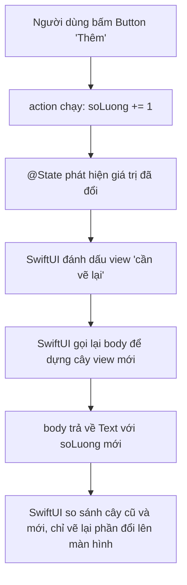

# SwiftUI cơ bản — View, modifier, @State

> **Tác giả:** Mr.Rom\
> **Phiên bản:** v1.0.0\
> **Tạo lúc:** 13/06/2026\
> **Cập nhật:** 13/06/2026\
> **Level:** Basic\
> **Tags:** ios, swift, swiftui, view, modifier, state, binding, navigationstack, preview, declarative, mobile\
> **Yêu cầu trước:** [Swift cơ bản](01_swift-basics.md)

> 🎯 *Bạn vừa nắm đủ Swift để đọc code (optionals, struct, protocol). Giờ mở Xcode ra dựng giao diện thì gặp ngay một thế giới lạ: **SwiftUI** — framework UI khai báo của Apple. Bài này dạy đủ để bạn dựng được một màn hình thật: `View` là gì và vì sao nó là `struct`, các view nền tảng (`Text`/`Image`/`Button`/`VStack`/`HStack`/`ZStack`/`List`/`ScrollView`), **modifier** và vì sao thứ tự gọi lại quan trọng, **`@State`** + **`@Binding`** để quản lý dữ liệu thay đổi, `#Preview` để xem ngay không cần build cả app, và `NavigationStack` để chuyển màn hình. Cuối bài bạn ráp được một màn hình Acme Shop chạy thật trên simulator.*

## 🎯 Sau bài này bạn sẽ

- [ ] Hiểu **SwiftUI khai báo** (declarative) là gì và vì sao một `View` lại là `struct` chứ không phải class
- [ ] Dùng được bộ view nền tảng: `Text`, `Image`, `Button`, `VStack`, `HStack`, `ZStack`, `List`, `ScrollView`
- [ ] Hiểu **modifier**, cách chaining (nối chuỗi), và vì sao **thứ tự gọi modifier thay đổi kết quả**
- [ ] Quản lý dữ liệu thay đổi với **`@State`** và truyền hai chiều với **`@Binding`**
- [ ] Dùng `#Preview` để xem giao diện trực tiếp trong Xcode mà không cần build cả app
- [ ] Chuyển màn hình sơ khởi bằng `NavigationStack` + `NavigationLink`
- [ ] Ráp được màn hình `ProductDetailView` của Acme Shop có nút tăng/giảm số lượng

---

## Cần gì để theo bài này

Trước khi đi tiếp, một điều bắt buộc phải nói rõ: lập trình iOS native bằng Swift + SwiftUI **chỉ chạy trên máy Mac**. Apple yêu cầu **Xcode** — bộ công cụ phát triển chính thức — và Xcode chỉ có trên macOS. Bạn cần:

- Một máy **Mac** (macOS đủ mới để cài Xcode bản hiện hành).
- **Xcode** cài từ Mac App Store (miễn phí). Xcode kèm sẵn **iOS Simulator** (giả lập iPhone/iPad ngay trên máy) — bạn không cần iPhone thật để học.

Toàn bộ code trong bài viết theo **Swift 6** và **SwiftUI** phiên bản hiện hành. Cách chạy: tạo một dự án Xcode mới (`File → New → Project → iOS → App`, chọn Interface là **SwiftUI**), rồi dán code vào file `.swift` tương ứng. Mục `#Preview` ở cuối bài cho phép bạn xem giao diện **ngay trong Xcode** mà không phải build cả app — ta sẽ dùng nó liên tục.

---

## Tình huống — biết Swift rồi mà nhìn `ContentView.swift` vẫn thấy lạ

Bạn đã quyết định viết app iOS native cho Acme Shop bằng Swift + SwiftUI. Bạn `File → New → Project`, chọn template App với Interface = SwiftUI, và Xcode sinh ra sẵn file `ContentView.swift` như sau:

```swift
import SwiftUI

struct ContentView: View {
    var body: some View {
        VStack {
            Image(systemName: "globe")
                .imageScale(.large)
                .foregroundStyle(.tint)
            Text("Hello, world!")
        }
        .padding()
    }
}

#Preview {
    ContentView()
}
```

Một loạt thứ lạ hiện ra cùng lúc, dù bạn đã biết Swift:

- `struct ContentView: View` — sao giao diện lại là một **struct** tuân theo *protocol* `View`? Bạn vừa học struct ở bài trước, nhưng struct để làm UI thì lạ.
- `var body: some View` — `body` này là gì? `some View` (kiểu trả về mờ — opaque type) nghĩa là sao?
- `Image(...).imageScale(.large).foregroundStyle(.tint)` — chuỗi dấu chấm nối nhau này là gì, và **thứ tự** của chúng có quan trọng không?
- `#Preview { ... }` — cái macro này làm gì mà chạy được giao diện ngay không cần bấm Run?

Để hết bối rối, ta cần hiểu một tư duy mới: **declarative UI** (UI khai báo). Bài này đi đúng vào đó — từ `View` và `body`, qua các view nền tảng, modifier, đến `@State`/`@Binding` và điều hướng.

---

## 1️⃣ SwiftUI khai báo (declarative) là gì?

Nếu bạn từng nghe đến **UIKit** — framework UI cũ của Apple (ra đời 2008, dùng cho iPhone đời đầu) — thì cách viết UI ở đó là **mệnh lệnh** (imperative): bạn tạo từng đối tượng, rồi *ra lệnh từng bước* "thêm label này vào view kia", "khi dữ liệu đổi thì tự tay đi tìm label và set lại text". Bạn phải tự đồng bộ giao diện với dữ liệu — quên một chỗ là UI hiện sai.

SwiftUI (ra mắt 2019) lật ngược tư duy đó. Bạn **không ra lệnh từng bước**. Bạn **khai báo** (declare): "với trạng thái hiện tại, giao diện *nên* trông như thế này". Khi dữ liệu đổi, SwiftUI **tự** so sánh và vẽ lại đúng phần cần đổi. Đây gọi là **declarative UI** (UI khai báo).

🪞 **Ẩn dụ**: UIKit giống **tự lái xe số sàn** — bạn phải tự đạp côn, sang số, canh ga ở từng khúc cua. SwiftUI giống **xe tự lái có điều hướng**: bạn chỉ khai báo điểm đến ("tôi muốn màn hình hiện giỏ hàng có 3 món"), xe tự lo đường đi và tự điều chỉnh khi tình huống đổi. Bạn mô tả *kết quả mong muốn*, framework lo *cách đạt được*.

### Vì sao `View` là `struct`, không phải class?

Trong SwiftUI, mọi mảnh giao diện đều là một **`View`** — và `View` là một *protocol* (giao thức, bạn đã học ở bài trước). Khi viết `struct ContentView: View`, bạn đang nói "`ContentView` là một struct **tuân theo** protocol `View`".

Điểm khiến người mới bất ngờ: view là **struct** (value type — kiểu giá trị), không phải class (reference type). Lý do sâu xa: view trong SwiftUI là **bản mô tả nhẹ, bất biến** của giao diện tại một thời điểm — không phải đối tượng nặng sống lâu như trong UIKit. SwiftUI tạo mới và vứt bỏ view liên tục (rẻ vì là struct), rồi tự quyết định cái gì cần vẽ lại thật lên màn hình.

Protocol `View` yêu cầu đúng **một** thứ: một thuộc tính tính toán tên `body` trả về `some View`.

```swift
struct ContentView: View {
    // body: bắt buộc — mô tả view này trông như thế nào.
    // some View = "trả về MỘT kiểu View cụ thể nào đó" (opaque type).
    var body: some View {
        Text("Xin chào Acme")
    }
}
```

`some View` là **opaque type** (kiểu mờ): bạn nói với trình biên dịch "`body` trả về *một* kiểu `View` cụ thể, nhưng tôi không muốn viết ra cái tên dài dòng của nó". Kiểu thật của `body` ở trên là `Text`, nhưng nếu bọc thêm `VStack`, `padding`... thì kiểu thật trở nên cực dài và rối — `some View` cho phép bạn khỏi quan tâm tới nó.

> 📖 *Hiểu `View` là struct khai báo rồi, giờ ta xem những viên gạch cụ thể để dựng giao diện — bộ view nền tảng mà màn hình nào cũng dùng.*

---

## 2️⃣ Bộ view nền tảng — những viên gạch dựng UI

SwiftUI dựng UI bằng cách **lồng view vào view** — y như xếp hộp. Có hai nhóm: view **nội dung** (hiện ra cái gì đó) và view **bố cục** (sắp xếp các view khác). Ta điểm qua bộ phải biết.

### View nội dung: `Text`, `Image`, `Button`

`Text` hiển thị chữ, `Image` hiển thị ảnh (hay dùng nhất là **SF Symbols** — bộ icon vector Apple cung cấp sẵn, gọi qua `systemName`), `Button` là nút bấm. Đây là 3 view nội dung gặp ở gần như mọi màn hình:

```swift
// Text — hiển thị chữ
Text("Acme Shop")

// Image dùng SF Symbol (icon hệ thống có sẵn, không cần thêm file ảnh)
Image(systemName: "cart.fill")

// Image từ file trong asset catalog của project
Image("logo_acme")

// Button — tham số đầu là việc làm khi bấm (action), sau là nhãn (label)
Button("Mua ngay") {
    print("Đã bấm Mua ngay")
}
```

`Button("Mua ngay") { ... }` đọc là: nhãn nút là "Mua ngay", và closure `{ ... }` (đoạn code trong ngoặc nhọn) là việc chạy khi người dùng bấm. Cú pháp closure này bạn đã thấy ở bài Swift cơ bản.

### View bố cục: `VStack`, `HStack`, `ZStack`

Ba "stack" này là xương sống của bố cục SwiftUI. Tên gọi cho biết chúng xếp các view con theo trục nào: V = vertical (dọc), H = horizontal (ngang), Z = theo chiều sâu (chồng lên nhau).

🪞 **Ẩn dụ**: 3 stack như 3 cách xếp một chồng giấy. `VStack` xếp các tờ **chồng dọc từ trên xuống** (như xếp giấy thành cột). `HStack` đặt các tờ **cạnh nhau theo hàng ngang** (như bày giấy trên bàn từ trái sang phải). `ZStack` **đè các tờ lên nhau** (như chồng ảnh — tờ sau đè lên tờ trước, dùng để đặt chữ lên trên ảnh nền).

```swift
// VStack — xếp dọc, từ trên xuống
VStack {
    Text("iPhone 15 Pro")
    Text("28.000.000đ")
}

// HStack — xếp ngang, từ trái sang phải. spacing = khoảng cách giữa các con
HStack(spacing: 12) {
    Image(systemName: "star.fill")
    Text("4.8")
}

// ZStack — chồng lên nhau theo chiều sâu (con sau đè lên con trước)
ZStack {
    Image("banner_acme")           // ảnh nền (dưới cùng)
    Text("Sale 50%")               // chữ đè lên trên ảnh
}
```

`VStack` và `HStack` nhận hai tham số hay dùng: `alignment` (canh lề các con) và `spacing` (khoảng cách giữa các con).

### View danh sách: `List` và `ScrollView`

Khi cần hiển thị nhiều phần tử (danh sách sản phẩm, danh sách đơn hàng), có hai lựa chọn. `List` cho ra giao diện danh sách kiểu iOS chuẩn (có đường kẻ ngăn, hỗ trợ kéo-xoá sẵn). `ScrollView` chỉ đơn thuần làm vùng nội dung cuộn được — bạn tự sắp xếp bên trong (thường bọc một `VStack`).

`List` lặp qua một mảng dữ liệu để sinh ra từng dòng. Vì SwiftUI cần phân biệt từng dòng để biết cái nào đổi, mỗi phần tử phải có **`id`** ổn định — ở đây dùng `id: \.self` cho mảng `String` đơn giản:

```swift
// List — danh sách kiểu iOS chuẩn, tự lặp qua mảng
List(["iPhone", "iPad", "MacBook"], id: \.self) { tenSanPham in
    Text(tenSanPham)
}
```

`ScrollView` thì khác — nó chỉ là một khung cuộn, nội dung bên trong do bạn dựng:

```swift
// ScrollView — vùng cuộn dọc, bên trong là VStack nội dung tự do
ScrollView {
    VStack(spacing: 16) {
        Text("Giới thiệu sản phẩm")
        Text("Mô tả dài...")
        Image("anh_san_pham")
    }
}
```

→ Quy tắc chọn: dữ liệu **dạng danh sách đồng nhất** (nhiều dòng giống nhau) → dùng `List`. Nội dung **bố cục tự do cần cuộn** (trang chi tiết dài, trộn ảnh + chữ + nút) → dùng `ScrollView` + `VStack`. Bảng dưới tóm tắt cả 8 view nền tảng để bạn tra nhanh:

| View | Vai trò | Tương đương web (gần đúng) |
|---|---|---|
| `Text` | Hiển thị chữ | `<p>` / `<span>` |
| `Image` | Hiển thị ảnh (asset hoặc SF Symbol) | `` |
| `Button` | Nút bấm có hành động | `<button>` |
| `VStack` | Xếp các view con theo chiều dọc | `flex-direction: column` |
| `HStack` | Xếp các view con theo chiều ngang | `flex-direction: row` |
| `ZStack` | Chồng các view con lên nhau | `position: absolute` xếp lớp |
| `List` | Danh sách kiểu iOS, tự lặp + có kẻ dòng | `<ul>` cuộn được |
| `ScrollView` | Vùng nội dung cuộn được tự do | `overflow: scroll` |

> 📖 *Có viên gạch rồi, nhưng làm sao chỉnh màu, cỡ chữ, đệm, viền? Đó là việc của **modifier** — và đây là phần có một cạm bẫy rất dễ vấp về thứ tự.*

---

## 3️⃣ Modifier — chỉnh sửa view bằng cách nối chuỗi

Một `Text("Acme")` trần thì chỉ là chữ đen mặc định. Muốn nó to hơn, đậm hơn, có màu, có đệm, có nền? Bạn dùng **modifier** (bộ chỉnh sửa) — các hàm gọi nối sau view bằng dấu chấm, mỗi cái thêm/đổi một thuộc tính.

Điểm cốt lõi phải hiểu ngay: mỗi modifier **không sửa view cũ tại chỗ**, mà **trả về một view MỚI** đã được bọc thêm thuộc tính. Vì trả về view, bạn có thể gọi tiếp modifier khác lên nó — đó là **chaining** (nối chuỗi):

```swift
Text("Acme Shop")
    .font(.title)                 // cỡ chữ tiêu đề
    .fontWeight(.bold)            // in đậm
    .foregroundStyle(.indigo)     // màu chữ
    .padding()                    // thêm đệm xung quanh
```

Đọc từ trên xuống: bắt đầu là `Text`, rồi mỗi dòng `.something(...)` bọc thêm một lớp. Vì mỗi modifier trả về view mới, chuỗi này thực chất là "view bọc view bọc view".

### Vì sao thứ tự modifier lại quan trọng

Đây là chỗ người mới hay vấp nhất, nên đọc kỹ. Vì mỗi modifier **bọc** view trước nó thành một view mới, **đổi thứ tự = đổi cái gì bọc cái gì = ra kết quả khác**.

Lấy ví dụ kinh điển: `padding` (đệm) và `background` (nền). Hãy so sánh hai chuỗi sau:

```swift
// CÁCH A: padding TRƯỚC, background SAU
Text("Mua ngay")
    .padding()                    // 1. thêm đệm quanh chữ
    .background(.indigo)          // 2. tô nền — nền phủ CẢ phần đệm

// CÁCH B: background TRƯỚC, padding SAU
Text("Mua ngay")
    .background(.indigo)          // 1. tô nền — chỉ phủ sát chữ
    .padding()                    // 2. thêm đệm — đệm nằm NGOÀI nền (trong suốt)
```

Kết quả khác hẳn nhau:

- **Cách A**: nền màu chàm phủ cả vùng đệm → ra một **nút đẹp** có khoảng thở quanh chữ. Đây là cái bạn muốn 99% trường hợp.
- **Cách B**: nền chỉ bám sát chữ, phần đệm nằm *ngoài* nền nên trong suốt → ra một khối màu bé tí với khoảng trống thừa xung quanh. Trông sai.

🪞 **Ẩn dụ**: hình dung modifier như **các lớp bọc một món quà**. `padding` là lớp xốp đệm quanh món đồ; `background` là lớp giấy gói màu. Nếu bạn cho xốp vào *trước* rồi mới gói giấy → giấy bọc cả phần xốp (đẹp). Nếu gói giấy *trước* rồi mới quấn xốp ra ngoài → giấy chỉ ôm sát món đồ, xốp lòi ra ngoài (xấu). Thứ tự quấn quyết định kết quả.

> [!WARNING]
> Đây là cạm bẫy modifier phổ biến nhất: **đặt nhầm thứ tự `padding` và `background` (hoặc `frame`, `cornerRadius`...)**. Quy tắc nhớ nhanh: modifier gọi **trước** áp dụng cho view ở **trong**, modifier gọi **sau** bọc ra **ngoài**. Muốn nền ôm cả phần đệm → `.padding()` trước, `.background(...)` sau.

→ Tóm lại: chaining modifier đọc tự nhiên từ trên xuống, nhưng **không phải mọi modifier đều giao hoán** (đổi chỗ cho nhau được). Với những cặp ảnh hưởng tới layout/hình khối như `padding`/`background`/`frame`/`cornerRadius`, thứ tự là *load-bearing* — đổi chỗ là đổi kết quả.

---

## 4️⃣ `@State` — quản lý dữ liệu thay đổi trong một view

Tới giờ mọi view ta viết đều **tĩnh** — hiện ra rồi đứng yên. Nhưng giao diện thật phải *động*: số lượng trong giỏ tăng khi bấm nút, công tắc bật/tắt, ô nhập đổi chữ. Những dữ liệu "sống" thay đổi theo tương tác này gọi là **state** (trạng thái).

Nhớ lại: view là `struct` — mà struct trong Swift là **bất biến** sau khi tạo, các thuộc tính của nó không tự đổi được (bạn đã học ở bài trước). Vậy làm sao một view giữ được dữ liệu thay đổi? SwiftUI giải bằng **`@State`** — một *property wrapper* (bộ bọc thuộc tính) đánh dấu "biến này là state nội bộ của view; khi nó đổi, hãy vẽ lại view".

```swift
struct BoDemView: View {
    // @State: biến trạng thái nội bộ. SwiftUI lưu giữ giá trị NGOÀI struct view,
    // nên dù view bị tạo lại liên tục, giá trị soLuong vẫn được nhớ.
    @State private var soLuong = 0

    var body: some View {
        VStack(spacing: 16) {
            Text("Giỏ: \(soLuong) sản phẩm")
                .font(.title2)

            Button("Thêm") {
                // Gán thẳng vào biến @State — KHÔNG cần setState như framework khác.
                // Chỉ cần đổi giá trị, SwiftUI tự phát hiện và vẽ lại.
                soLuong += 1
            }
        }
    }
}
```

Điểm khiến SwiftUI gọn hơn nhiều framework khác: bạn **chỉ cần gán** `soLuong += 1`. Không cần gọi hàm "báo vẽ lại" thủ công. `@State` theo dõi biến này; biến đổi → SwiftUI tự gọi lại `body` để dựng giao diện mới với giá trị mới.

🪞 **Ẩn dụ**: `@State` giống **bảng đèn LED điện tử** trước cửa hàng. Bản thân cái bảng (struct view) cố định, nhưng nội dung số hiển thị (state) đổi được. Bạn chỉ cần đổi *con số trong bộ nhớ của bảng* — bảng tự sáng lại để hiện số mới, bạn không phải tự đi vẽ lại từng bóng đèn.

Một điểm hay quên: `@State` luôn nên là **`private`**. Vì nó là trạng thái *riêng* của view đó — không ai bên ngoài được chọc vào. Đây cũng là khuyến nghị chính thức của Apple.

> 📖 *Khái niệm "state đổi → view tự vẽ lại" là thứ trừu tượng nhất ở đây. Trước khi đi tiếp, hãy nhìn sơ đồ vòng đời một lần đổi state để hình dung rõ.*

Sơ đồ dưới mô tả chuyện gì xảy ra từ lúc người dùng bấm nút "Thêm" cho tới khi con số trên màn hình đổi. Tâm điểm là: bạn chỉ làm một việc (đổi state), phần còn lại SwiftUI lo.



→ Điểm cốt lõi từ sơ đồ: đây là tư duy **declarative**. Bạn không đi tìm `Text` rồi ra lệnh "đổi chữ thành 1". Bạn đổi *dữ liệu*, và khai báo "`body` luôn hiển thị `soLuong` hiện tại". SwiftUI lo việc đồng bộ giao diện với dữ liệu — và nó **thông minh chỉ vẽ lại phần thật sự đổi**, không vẽ lại cả màn hình.

---

## 5️⃣ `@Binding` — chia sẻ state hai chiều giữa các view

`@State` giải quyết state *trong một view*. Nhưng thường bạn tách giao diện thành nhiều view con — và một view con cần **đọc và sửa** state nằm ở view cha. Ví dụ: view cha giữ số lượng giỏ hàng, một view con là "bộ đếm" (nút `-` và `+`) cần sửa chính con số đó.

Nếu chỉ truyền giá trị thường xuống con, con sửa được bản sao của nó nhưng **không động được** tới state gốc ở cha (vì struct truyền theo *giá trị* — bản sao). Cần một cách để con "trỏ ngược" về state của cha. Đó là **`@Binding`** — một *tham chiếu hai chiều* (two-way) tới một state ở nơi khác.

🪞 **Ẩn dụ**: `@State` là **cuốn sổ gốc** (cha giữ). `@Binding` là **bút viết chung lên cuốn sổ đó** đưa cho con cầm. Con không có sổ riêng — nó viết thẳng lên sổ của cha. Cha sửa, con thấy ngay; con sửa, cha cũng đổi ngay. Cùng một dữ liệu, hai bên dùng chung.

Đây là cặp cha–con đầy đủ. View con `BoDemSoLuong` nhận một `@Binding` tới số lượng; view cha sở hữu `@State` thật và **truyền binding xuống bằng cú pháp `$`**:

```swift
import SwiftUI

// VIEW CON: nhận @Binding — không sở hữu dữ liệu, chỉ "mượn bút" để sửa state của cha
struct BoDemSoLuong: View {
    @Binding var soLuong: Int

    var body: some View {
        HStack(spacing: 20) {
            Button("−") {
                if soLuong > 0 { soLuong -= 1 }   // sửa thẳng — cha sẽ thấy ngay
            }
            Text("\(soLuong)")
                .font(.title2)
                .frame(minWidth: 40)
            Button("+") {
                soLuong += 1
            }
        }
    }
}

// VIEW CHA: sở hữu @State thật, truyền xuống con bằng $soLuong
struct GioHangView: View {
    @State private var soLuong = 1

    var body: some View {
        VStack(spacing: 24) {
            Text("Tổng trong giỏ: \(soLuong)")
                .font(.headline)

            // $soLuong = "binding tới biến soLuong" — KHÔNG phải giá trị,
            // mà là tham chiếu hai chiều để con sửa được.
            BoDemSoLuong(soLuong: $soLuong)
        }
        .padding()
    }
}
```

Hai điểm phải nhớ về cú pháp `$`:

- Trong view cha, `soLuong` (không có `$`) là **giá trị** hiện tại (đọc ra để hiển thị). `$soLuong` (có `$`) là **binding** — "tham chiếu hai chiều tới biến này".
- Khi tham số con khai báo là `@Binding`, bạn *bắt buộc* truyền vào bằng `$` (binding), không phải giá trị thường.

→ Quy tắc thực dụng: dữ liệu **thuộc về** view nào thì view đó giữ `@State`. View con cần **sửa ngược** dữ liệu của cha thì nhận `@Binding`. Còn nếu con chỉ cần **đọc** (không sửa) thì truyền giá trị thường là đủ — không cần binding.

| Cách truyền dữ liệu xuống view con | Khi nào dùng | Cú pháp truyền |
|---|---|---|
| Giá trị thường (`let`/`var`) | Con chỉ **đọc** để hiển thị | `SubView(ten: ten)` |
| `@Binding` | Con cần **đọc và sửa** state của cha | `SubView(soLuong: $soLuong)` |

---

## 6️⃣ `#Preview` — xem giao diện ngay, không cần build cả app

Nãy giờ ta viết view nhưng chưa "chạy" cái nào. Tin vui: với SwiftUI bạn **không cần build và chạy cả app** (vốn chậm) chỉ để xem một view trông thế nào. Xcode có **Preview Canvas** — một khung xem trực tiếp ở cạnh phải editor, cập nhật gần như tức thì mỗi khi bạn sửa code.

Để bật preview cho một view, thêm macro `#Preview` ở cuối file, bên trong tạo view bạn muốn xem:

```swift
#Preview {
    GioHangView()
}
```

`#Preview` là một **macro** (lệnh trình biên dịch sinh code) ra mắt cùng các phiên bản Xcode gần đây — gọn hơn nhiều so với cách viết `PreviewProvider` dài dòng kiểu cũ. Bạn có thể có **nhiều** `#Preview` trong một file để xem các trạng thái khác nhau, và đặt tên cho từng cái:

```swift
// Preview với state mặc định
#Preview("Giỏ trống") {
    GioHangView()
}

// Preview view con riêng lẻ, truyền sẵn một binding hằng để xem nhanh
#Preview("Bộ đếm = 5") {
    BoDemSoLuong(soLuong: .constant(5))
}
```

> [!TIP]
> `.constant(5)` tạo một binding "giả" có giá trị cố định — rất tiện để preview riêng một view con cần `@Binding` mà không phải dựng cả view cha. Nó chỉ dùng cho preview/test; nút `+`/`−` bấm trong preview này sẽ không đổi gì vì giá trị bị "đóng băng" ở 5.

→ Preview là vũ khí năng suất lớn nhất của SwiftUI: bạn dựng UI và thấy kết quả *ngay*, thử nhiều trạng thái cạnh nhau, không phải đợi build–chạy–bấm tới đúng màn hình mỗi lần sửa một chữ.

---

## 7️⃣ `NavigationStack` — chuyển sang màn hình khác

App thật có nhiều màn hình: từ danh sách sản phẩm bấm vào một món → mở màn hình chi tiết, có nút back để quay lại. Cơ chế điều hướng dạng "chồng màn hình" (đẩy vào, gỡ ra) này trong SwiftUI hiện hành dùng **`NavigationStack`**.

🪞 **Ẩn dụ**: `NavigationStack` như **chồng đĩa**. Mỗi màn hình là một cái đĩa. Bấm vào một mục → *đặt thêm đĩa mới lên trên* (đẩy màn hình chi tiết vào). Bấm back → *nhấc đĩa trên cùng ra* (quay về màn hình trước). Bạn luôn nhìn thấy cái đĩa trên cùng.

Cách dùng cơ bản: bọc nội dung trong `NavigationStack`, rồi dùng `NavigationLink` để tạo "lối bấm sang màn hình khác". `NavigationLink` nhận một nhãn (cái hiện ra để bấm) và một đích đến (`destination` — view sẽ mở ra):

```swift
import SwiftUI

struct DanhSachSanPhamView: View {
    let sanPham = ["iPhone 15", "iPad Air", "MacBook Pro"]

    var body: some View {
        // 1. Bọc toàn bộ trong NavigationStack để bật điều hướng
        NavigationStack {
            List(sanPham, id: \.self) { ten in
                // 2. NavigationLink: bấm vào dòng này → đẩy ChiTietView vào stack
                NavigationLink(ten) {
                    ChiTietView(tenSanPham: ten)
                }
            }
            // 3. Tiêu đề thanh điều hướng trên cùng
            .navigationTitle("Sản phẩm")
        }
    }
}

// Màn hình đích — nhận tên sản phẩm để hiển thị
struct ChiTietView: View {
    let tenSanPham: String

    var body: some View {
        Text("Chi tiết: \(tenSanPham)")
            .font(.title)
            .navigationTitle(tenSanPham)
    }
}
```

Chạy thử: bạn thấy danh sách 3 sản phẩm với thanh tiêu đề "Sản phẩm". Bấm vào "iPhone 15" → màn hình trượt sang trang chi tiết, và **nút back tự xuất hiện** ở góc trái mà bạn không phải viết gì thêm — `NavigationStack` lo việc đó. Đây mới là điều hướng sơ khởi; cụm tiếp theo sẽ đi sâu vào điều hướng nâng cao (truyền dữ liệu, điều hướng theo state).

> 📖 *Giờ bạn đã có đủ mảnh ghép: View + body, view nền tảng, modifier, @State, @Binding, preview, navigation. Đến lúc ráp tất cả thành một màn hình Acme Shop chạy thật.*

---

## 8️⃣ Ráp lại — màn hình chi tiết sản phẩm Acme Shop

Giờ ta dựng `ProductDetailView`: màn hình chi tiết một sản phẩm có ảnh (dùng SF Symbol cho gọn), tên, giá, mô tả, một bộ đếm số lượng (tách thành view con dùng `@Binding`), và một nút "Thêm vào giỏ" hiện tổng số đã thêm. Vì có **dữ liệu thay đổi** (số lượng, tổng giỏ), màn hình dùng `@State`. Đây là file `.swift` hoàn chỉnh — tạo dự án iOS App (Interface = SwiftUI) rồi dán vào là chạy được trên simulator.

```swift
import SwiftUI

// VIEW CON: bộ đếm số lượng, dùng @Binding để sửa ngược state của cha
struct BoDemSoLuong: View {
    @Binding var soLuong: Int

    var body: some View {
        HStack(spacing: 24) {
            Button {
                if soLuong > 1 { soLuong -= 1 }   // không cho xuống dưới 1
            } label: {
                Image(systemName: "minus.circle.fill")
                    .font(.title)
            }

            Text("\(soLuong)")
                .font(.title2)
                .fontWeight(.semibold)
                .frame(minWidth: 44)

            Button {
                soLuong += 1
            } label: {
                Image(systemName: "plus.circle.fill")
                    .font(.title)
            }
        }
        .foregroundStyle(.indigo)
    }
}

// VIEW CHÍNH: màn hình chi tiết sản phẩm
struct ProductDetailView: View {
    // STATE 1: số lượng đang chọn (mặc định 1)
    @State private var soLuongChon = 1
    // STATE 2: tổng số sản phẩm đã thêm vào giỏ
    @State private var tongTrongGio = 0

    let tenSanPham = "iPhone 15 Pro"
    let gia = 28_000_000

    var body: some View {
        NavigationStack {
            ScrollView {
                VStack(spacing: 20) {
                    // 1. Ảnh sản phẩm (dùng SF Symbol cho ví dụ, đặt trên nền bo góc)
                    Image(systemName: "iphone")
                        .font(.system(size: 120))
                        .foregroundStyle(.indigo)
                        .frame(maxWidth: .infinity)
                        .padding(.vertical, 32)
                        .background(.indigo.opacity(0.1))   // nền tô SAU padding → phủ cả đệm
                        .clipShape(RoundedRectangle(cornerRadius: 20))

                    // 2. Tên + giá
                    VStack(alignment: .leading, spacing: 8) {
                        Text(tenSanPham)
                            .font(.title)
                            .fontWeight(.bold)
                        Text("\(gia.formatted())đ")
                            .font(.title3)
                            .foregroundStyle(.secondary)
                    }
                    .frame(maxWidth: .infinity, alignment: .leading)

                    // 3. Mô tả
                    Text("Chip A17 Pro, khung titan, camera 48MP. Hàng chính hãng Acme, bảo hành 12 tháng.")
                        .font(.body)
                        .foregroundStyle(.secondary)

                    Divider()

                    // 4. Bộ đếm số lượng (view con, truyền binding bằng $)
                    HStack {
                        Text("Số lượng")
                            .font(.headline)
                        Spacer()                       // đẩy bộ đếm sang phải
                        BoDemSoLuong(soLuong: $soLuongChon)
                    }

                    // 5. Nút thêm vào giỏ — cộng số lượng đang chọn vào tổng giỏ
                    Button {
                        tongTrongGio += soLuongChon
                    } label: {
                        Text("Thêm \(soLuongChon) vào giỏ")
                            .font(.headline)
                            .frame(maxWidth: .infinity)
                            .padding()                  // đệm TRƯỚC
                            .background(.indigo)        // nền SAU → phủ cả đệm = nút đẹp
                            .foregroundStyle(.white)
                            .clipShape(RoundedRectangle(cornerRadius: 14))
                    }

                    // 6. Hiển thị tổng trong giỏ
                    if tongTrongGio > 0 {
                        Text("🛒 Giỏ hàng: \(tongTrongGio) sản phẩm")
                            .font(.subheadline)
                            .foregroundStyle(.green)
                    }
                }
                .padding()
            }
            .navigationTitle("Chi tiết")
            .navigationBarTitleDisplayMode(.inline)
        }
    }
}

#Preview {
    ProductDetailView()
}
```

Chạy preview (hoặc bấm Run để mở simulator): bạn thấy màn hình chi tiết iPhone 15 Pro. Bấm `+`/`−` thay đổi số lượng; bấm "Thêm vào giỏ" thì tổng giỏ tăng và dòng "🛒 Giỏ hàng" hiện ra. Vài điểm trong code đáng soi kỹ để thấy mọi khái niệm đã học gắn vào đâu:

- `@State private var soLuongChon` và `tongTrongGio` là hai mẩu **state** của màn hình — đổi là `body` tự vẽ lại. Đúng mục 4.
- `BoDemSoLuong(soLuong: $soLuongChon)` truyền **binding** xuống view con bằng `$`; con sửa `soLuong` thì `soLuongChon` ở cha đổi theo ngay. Đúng mục 5.
- Cái nút "Thêm vào giỏ": `.padding()` gọi **trước** `.background(.indigo)` → nền phủ cả phần đệm → ra nút đẹp. Đảo thứ tự hai dòng này, nút sẽ vỡ — đúng cạm bẫy ở mục 3.
- Cũng cái nút đó dùng cú pháp `Button { action } label: { ... }` — dạng đầy đủ cho phép nhãn là cả một view phức tạp (không chỉ một dòng chữ).
- `gia.formatted()` định dạng số `28000000` thành `28.000.000` theo locale — API chuẩn hiện hành, gọn hơn tự ghép chuỗi.
- `Spacer()` trong `HStack` là một view "co giãn" đẩy mọi thứ ra hai bên — kỹ thuật hay dùng để dồn nội dung về một phía.
- `if tongTrongGio > 0 { ... }` — bạn được viết `if` **thẳng trong `body`** để hiện/ẩn view theo điều kiện. Đây là sức mạnh của declarative: UI là *hàm của state*.

→ Toàn bộ màn hình chỉ là một cây view: `NavigationStack` → `ScrollView` → `VStack` → (ảnh + tên/giá + mô tả + bộ đếm + nút + dòng tổng). Đây là khung mẫu cho mọi màn hình SwiftUI: khai báo state với `@State`, mô tả `body` theo state đó, tách view con và chia sẻ state bằng `@Binding`, chỉnh diện mạo bằng modifier (chú ý thứ tự).

---

## So với UIKit — vì sao SwiftUI ít code hơn và reactive

Để thấy rõ SwiftUI tiết kiệm cỡ nào, đặt cạnh UIKit cho cùng một việc nhỏ: hiển thị một label và cập nhật khi bấm nút. UIKit (mệnh lệnh) phải tạo từng đối tượng, set thuộc tính từng dòng, và **tự tay** đi tìm label để cập nhật mỗi khi dữ liệu đổi:

```swift
// UIKit (rút gọn ý tưởng): tạo label, set frame, set text, rồi TỰ cập nhật
let label = UILabel()
label.text = "Giỏ: 0"
label.font = .systemFont(ofSize: 22, weight: .bold)
view.addSubview(label)
// ... khi bấm nút, phải tự đi tìm label và set lại:
func nutBamThem() {
    soLuong += 1
    label.text = "Giỏ: \(soLuong)"   // tự đồng bộ tay — quên là UI hiện sai
}
```

SwiftUI làm cùng việc đó **khai báo** — bạn nói "Text luôn hiện `soLuong` hiện tại", không bao giờ phải tự cập nhật label:

```swift
// SwiftUI: khai báo "body hiển thị soLuong" — đổi state là tự vẽ lại
@State private var soLuong = 0
var body: some View {
    VStack {
        Text("Giỏ: \(soLuong)")
            .font(.title2).bold()
        Button("Thêm") { soLuong += 1 }   // không cần tự set lại Text
    }
}
```

Khác biệt cốt lõi gói trong bảng dưới — đây là lý do Apple đẩy SwiftUI làm hướng đi chính cho UI mới:

| Tiêu chí | UIKit (mệnh lệnh) | SwiftUI (khai báo) |
|---|---|---|
| Ra đời | 2008 | 2019 |
| Cách viết UI | Tạo đối tượng + ra lệnh từng bước | Khai báo "UI nên trông thế nào theo state" |
| Đồng bộ UI với dữ liệu | Tự tay cập nhật (dễ quên, dễ sai) | Tự động — state đổi thì view vẽ lại |
| Lượng code cho việc tương tự | Nhiều, dài dòng | Ít hơn rõ rệt |
| Xem trước giao diện | Khó (thường phải build & chạy) | `#Preview` ngay trong editor |
| Khi nào vẫn cần | Codebase cũ, vài API rất chuyên sâu chưa có ở SwiftUI | Mặc định cho UI mới |

→ SwiftUI không xoá bỏ UIKit (hai cái còn lồng vào nhau được, và codebase cũ vẫn dùng UIKit), nhưng cho dự án **mới** thì SwiftUI là lựa chọn mặc định: ít code hơn, **reactive** (giao diện tự phản ứng theo dữ liệu), và xem trước cực nhanh.

---

## 💡 Cạm bẫy thường gặp & Best practice

### ❌ Cạm bẫy: Đặt sai thứ tự modifier (`padding` vs `background`/`frame`)

- **Triệu chứng**: Nút có nền chỉ ôm sát chữ với khoảng trống thừa xung quanh; hoặc viền/bo góc không bao đúng vùng mong muốn; UI "trông sai" dù từng modifier đều đúng.
- **Nguyên nhân**: Mỗi modifier **bọc** view trước nó thành view mới — gọi `.background(...)` *trước* `.padding()` thì nền chỉ phủ phần chữ, đệm nằm ngoài nền (trong suốt). Đảo lại mới đúng. Người mới tưởng modifier "cộng dồn thuộc tính" như CSS, nên đổi thứ tự thoải mái — sai.
- **Cách tránh**: Nhớ quy tắc "trước = trong, sau = ngoài". Muốn nền/viền/bo góc ôm cả phần đệm → gọi `.padding()` **trước**, rồi `.background(...)`/`.clipShape(...)` **sau**. Khi UI sai, thử đảo thứ tự hai modifier liên quan đến hình khối trước khi nghĩ tới nguyên nhân khác.

### ❌ Cạm bẫy: Quên `@State` khi cần biến thay đổi

- **Triệu chứng**: Khai báo `var soLuong = 0` trong view (không có `@State`), rồi viết `soLuong += 1` trong action của `Button` → trình biên dịch **báo lỗi** "Cannot assign to property: 'self' is immutable" (không gán được vì view là struct bất biến). Hoặc nếu lỡ làm nó chạy được bằng cách khác, UI không cập nhật.
- **Nguyên nhân**: View là `struct` — thuộc tính thường của struct **không sửa được** trong các method (như closure của Button) vì struct bất biến. `@State` mới cho phép biến đổi giá trị *và* báo SwiftUI vẽ lại. Quên `@State` = vừa lỗi biên dịch, vừa không có cơ chế vẽ lại.
- **Cách tránh**: Hỏi đúng một câu — *"Biến này có đổi theo tương tác và cần view vẽ lại không?"* Có → đánh dấu `@State private var`. Không (chỉ là dữ liệu truyền vào, không đổi) → để `let`/`var` thường. Và nhớ: `@State` luôn nên là `private`.

### ✅ Best practice: Tách view con thành struct riêng thay vì một `body` khổng lồ

- **Vì sao**: `body` dài cả trăm dòng lồng chục tầng view thì khó đọc, khó sửa, và trình biên dịch SwiftUI dễ chậm/báo lỗi mơ hồ ("unable to type-check in reasonable time"). Tách phần con có ý nghĩa độc lập (một thẻ sản phẩm, một bộ đếm) thành `struct ...: View` riêng vừa dễ đọc vừa preview riêng được.
- **Cách áp dụng**: Khi thấy một nhánh view tự thành một khối logic (như `BoDemSoLuong` ở bài), tách ra struct riêng, nhận dữ liệu qua thuộc tính (`let`) hoặc `@Binding` nếu cần sửa ngược. Mỗi view con có thể có `#Preview` riêng để dựng nhanh.

### ✅ Best practice: Dùng `#Preview` liên tục, thử nhiều trạng thái cạnh nhau

- **Vì sao**: Build & chạy cả app để xem một thay đổi nhỏ rất chậm. Preview cập nhật gần như tức thì, và bạn có thể đặt nhiều `#Preview` để xem các state khác nhau (giỏ trống / giỏ có hàng) cùng lúc — bắt lỗi layout sớm.
- **Cách áp dụng**: Mỗi file view nên có ít nhất một `#Preview`. Với view con cần `@Binding`, dùng `.constant(...)` để truyền giá trị cố định cho preview. Đặt tên preview (`#Preview("Giỏ trống")`) khi có nhiều cái để dễ phân biệt.

---

## 🧠 Tự kiểm tra (Self-check)

**Q1.** Vì sao một `View` trong SwiftUI là `struct` (kiểu giá trị) chứ không phải class? `some View` nghĩa là gì?

<details>
<summary>💡 Xem giải thích</summary>

View là **bản mô tả nhẹ, bất biến** của giao diện tại một thời điểm — không phải đối tượng nặng sống lâu. SwiftUI tạo mới và vứt bỏ view liên tục để quyết định cái gì cần vẽ lại; dùng `struct` (value type) khiến việc tạo/huỷ này rẻ và an toàn (không chia sẻ tham chiếu lẫn lộn).

`some View` là **opaque type** (kiểu mờ): nói với trình biên dịch "`body` trả về *một* kiểu `View` cụ thể nào đó, nhưng tôi không cần viết ra cái tên kiểu dài dòng của nó". Kiểu thật do trình biên dịch suy ra.

</details>

**Q2.** Hai chuỗi modifier sau cho kết quả khác nhau như thế nào, và vì sao?
`Text("A").padding().background(.blue)` so với `Text("A").background(.blue).padding()`

<details>
<summary>💡 Xem giải thích</summary>

Mỗi modifier **bọc** view trước nó thành một view mới, nên thứ tự = thứ tự bọc.

- `.padding().background(.blue)`: thêm đệm *trước*, rồi tô nền *sau* → nền xanh **phủ cả vùng đệm** → ra một khối xanh có khoảng thở quanh chữ (nút đẹp).
- `.background(.blue).padding()`: tô nền *trước* (chỉ bám sát chữ), rồi thêm đệm *sau* → đệm nằm **ngoài** nền nên trong suốt → khối xanh bé sát chữ, có khoảng trống thừa xung quanh.

Quy tắc nhớ: modifier gọi **trước** áp cho phần **trong**, gọi **sau** bọc ra **ngoài**.

</details>

**Q3.** Khi nào dùng `@State`, khi nào dùng `@Binding`? Một view con chỉ hiển thị tên sản phẩm nhận từ cha (không sửa) thì cần loại nào?

<details>
<summary>💡 Xem giải thích</summary>

`@State`: dùng cho **dữ liệu nội bộ của chính view đó** thay đổi theo thời gian (số lượng, công tắc...). View **sở hữu** dữ liệu này. Luôn nên `private`.

`@Binding`: dùng khi view con cần **đọc và sửa** một state nằm ở view khác (thường là cha). Con không sở hữu dữ liệu — nó "mượn" tham chiếu hai chiều. Cha truyền xuống bằng cú pháp `$`.

View con chỉ **hiển thị** tên sản phẩm (không sửa) → **không cần gì cả**, chỉ một thuộc tính thường (`let ten: String`) là đủ. Chỉ cần `@Binding` khi con phải *sửa ngược* dữ liệu của cha.

</details>

**Q4.** Bạn viết `var soLuong = 0` (không có `@State`) trong view rồi `soLuong += 1` trong action của Button. Chuyện gì xảy ra và cách sửa?

<details>
<summary>💡 Xem giải thích</summary>

Trình biên dịch **báo lỗi**: "Cannot assign to property: 'self' is immutable". Lý do: view là `struct` (bất biến), thuộc tính thường của nó không sửa được trong closure như action của Button.

Sửa: đánh dấu biến bằng `@State`:

```swift
@State private var soLuong = 0
```

`@State` lưu giá trị *ngoài* struct view, cho phép sửa và đồng thời báo SwiftUI vẽ lại `body` khi giá trị đổi.

</details>

**Q5.** `#Preview` dùng để làm gì? Vì sao nó là điểm cộng năng suất lớn của SwiftUI so với UIKit? Làm sao preview một view con cần `@Binding`?

<details>
<summary>💡 Xem giải thích</summary>

`#Preview` cho phép xem giao diện một view **ngay trong Xcode** (Preview Canvas) mà **không cần build & chạy cả app** — cập nhật gần như tức thì khi sửa code. So với UIKit (thường phải build → chạy → bấm tới đúng màn hình mới thấy thay đổi), đây là vòng lặp phản hồi nhanh hơn nhiều.

Preview một view con cần `@Binding`: dùng `.constant(...)` để tạo binding giả có giá trị cố định, ví dụ `BoDemSoLuong(soLuong: .constant(5))`. Không cần dựng cả view cha.

</details>

---

## ⚡ Tra cứu nhanh (Cheatsheet)

| Mục đích | Cú pháp SwiftUI |
|---|---|
| Khai báo một view | `struct MyView: View { var body: some View { ... } }` |
| Chữ | `Text("Acme")` |
| Icon hệ thống (SF Symbol) | `Image(systemName: "cart.fill")` |
| Ảnh từ asset | `Image("logo_acme")` |
| Nút (gọn) | `Button("Mua") { action }` |
| Nút (nhãn phức tạp) | `Button { action } label: { ... }` |
| Xếp dọc | `VStack(spacing: 12) { ... }` |
| Xếp ngang | `HStack { ... }` |
| Chồng lớp | `ZStack { ... }` |
| Danh sách kiểu iOS | `List(items, id: \.self) { item in ... }` |
| Vùng cuộn tự do | `ScrollView { VStack { ... } }` |
| Cỡ chữ / đậm | `.font(.title)` / `.fontWeight(.bold)` |
| Màu chữ | `.foregroundStyle(.indigo)` |
| Đệm | `.padding()` / `.padding(.vertical, 16)` |
| Nền (gọi SAU padding) | `.background(.indigo)` |
| Bo góc | `.clipShape(RoundedRectangle(cornerRadius: 14))` |
| Kích thước | `.frame(maxWidth: .infinity)` |
| State nội bộ | `@State private var soLuong = 0` |
| Binding hai chiều | `@Binding var soLuong: Int` |
| Truyền binding xuống con | `SubView(soLuong: $soLuong)` |
| Binding giả cho preview | `.constant(5)` |
| Xem trước | `#Preview { MyView() }` |
| Điều hướng | `NavigationStack { ... .navigationTitle("...") }` |
| Lối bấm sang màn khác | `NavigationLink(label) { DestView() }` |
| View co giãn đẩy chỗ | `Spacer()` |
| Hiện view theo điều kiện | `if dieuKien { SomeView() }` trong `body` |

---

## 📚 Từ Điển Thuật Ngữ (Glossary)

| EN | VN | Giải thích |
|---|---|---|
| SwiftUI | SwiftUI | Framework UI khai báo của Apple (2019), viết bằng Swift |
| UIKit | UIKit | Framework UI mệnh lệnh cũ của Apple (2008), vẫn dùng cho code cũ |
| Declarative UI | UI khai báo | Mô tả "UI nên trông thế nào theo state", framework tự lo cập nhật |
| Imperative UI | UI mệnh lệnh | Ra lệnh từng bước tạo và cập nhật UI thủ công (UIKit) |
| View | View | Protocol mô tả một mảnh giao diện; mọi UI SwiftUI là một View |
| body | body | Thuộc tính bắt buộc của View, trả về cây view mô tả giao diện |
| some View | Kiểu View mờ | Opaque type — "trả về một kiểu View cụ thể không cần nêu tên" |
| Modifier | Bộ chỉnh sửa | Hàm nối sau view bằng dấu chấm, trả về view mới đã chỉnh |
| Chaining | Nối chuỗi | Gọi nhiều modifier liên tiếp; thứ tự ảnh hưởng kết quả |
| @State | @State | Property wrapper đánh dấu state nội bộ; đổi là view vẽ lại |
| @Binding | @Binding | Tham chiếu hai chiều tới state ở view khác (thường là cha) |
| Property wrapper | Bộ bọc thuộc tính | Cú pháp `@...` thêm hành vi cho một thuộc tính (vd lưu state) |
| Two-way binding | Liên kết hai chiều | Cha–con dùng chung một dữ liệu; bên nào sửa bên kia thấy ngay |
| SF Symbols | SF Symbols | Bộ icon vector Apple cung cấp sẵn, gọi qua `Image(systemName:)` |
| #Preview | #Preview | Macro hiển thị view ngay trong Xcode, không cần build cả app |
| Preview Canvas | Khung xem trước | Vùng trong Xcode hiện kết quả `#Preview`, cập nhật tức thì |
| NavigationStack | NavigationStack | View bật điều hướng dạng chồng màn hình (đẩy vào / gỡ ra) |
| NavigationLink | NavigationLink | Lối bấm để đẩy một màn hình mới vào NavigationStack |
| Spacer | Spacer | View co giãn đẩy các view khác ra hai phía trong stack |

---

## 🔗 Liên kết & Tài nguyên

⬅️ **Bài trước:** [Swift cơ bản — Optionals, struct/class, protocol](01_swift-basics.md)\
➡️ **Bài tiếp theo:** [Data, State & Navigation — @Observable, networking, SwiftData](03_data-state-and-navigation.md)\
↑ **Về cụm:** [iOS với Swift — README cụm](../../README.md)

### 🧭 Định hướng lộ trình học

- [Swift cơ bản — Optionals, struct/class, protocol](01_swift-basics.md) — nền tảng Swift, yêu cầu trước của bài này
- [Data, State & Navigation — @Observable, networking, SwiftData](03_data-state-and-navigation.md) — bài kế: quản lý state lớn hơn `@State` (Observation `@Observable`), gọi API async/await, lưu trữ với SwiftData
- [Lập trình iOS là gì? — Swift, Xcode, SwiftUI](00_what-is-ios-development.md) — bức tranh tổng nếu cần xem lại bối cảnh

### 🧩 Các chủ đề có thể bạn quan tâm

- [Dart & Widgets — Mọi thứ là widget](../../../flutter/lessons/01_basic/01_dart-and-widgets.md) — đối chiếu cách Flutter dựng UI khai báo (so sánh `@State` với `setState`)
- [React Native là gì? — Viết app native bằng React](../../../react-native/lessons/01_basic/00_what-is-react-native.md) — một hướng đa nền tảng khác cho cùng bài toán app mobile

### 🌐 Tài nguyên tham khảo khác

- [Apple — SwiftUI documentation](https://developer.apple.com/documentation/swiftui) — tài liệu chính thức, đầy đủ mọi view và modifier
- [Apple — SwiftUI Tutorials](https://developer.apple.com/tutorials/swiftui) — hướng dẫn từng bước có hình ảnh, rất hợp người mới
- [Apple — SF Symbols](https://developer.apple.com/sf-symbols/) — tra cứu tên icon hệ thống dùng cho `Image(systemName:)`
- [Hacking with Swift — 100 Days of SwiftUI](https://www.hackingwithswift.com/100/swiftui) — khoá học SwiftUI miễn phí nổi tiếng

---

> 🎯 *Sau bài này bạn đã dựng được màn hình SwiftUI thật: View khai báo, modifier (đúng thứ tự), `@State`/`@Binding`, preview và điều hướng sơ khởi. Bài kế tiếp nâng tầm: quản lý state ở quy mô app bằng **Observation (`@Observable`)**, gọi API thật với **async/await**, và lưu dữ liệu lâu dài bằng **SwiftData**.*

---

## 📌 Nhật ký thay đổi (Changelog)

- **v1.0.0 (13/06/2026)** — Bản đầu tiên. Cụm `ios-swift/` lesson 2/5 (basic). Cover: SwiftUI khai báo (declarative) là gì + vì sao `View` là `struct` và `body: some View` (opaque type) + bộ view nền tảng (`Text`/`Image`/`Button`/`VStack`/`HStack`/`ZStack`/`List`/`ScrollView`) + modifier và chaining (nhấn mạnh thứ tự `padding` vs `background` quan trọng) + `@State` quản lý state nội bộ + `@Binding` chia sẻ hai chiều cha–con (cú pháp `$`) + `#Preview` xem trực tiếp trong Xcode (kèm `.constant(...)`) + `NavigationStack`/`NavigationLink` điều hướng sơ khởi + so sánh SwiftUI vs UIKit (ít code, reactive). Code Swift 6/SwiftUI hiện hành; màn hình `ProductDetailView` của Acme Shop hoàn chỉnh (state đếm số lượng + view con `BoDemSoLuong` dùng `@Binding`). 1 sơ đồ mermaid (state → view re-render). Cạm bẫy: thứ tự modifier, quên `@State` khi cần mutate.
