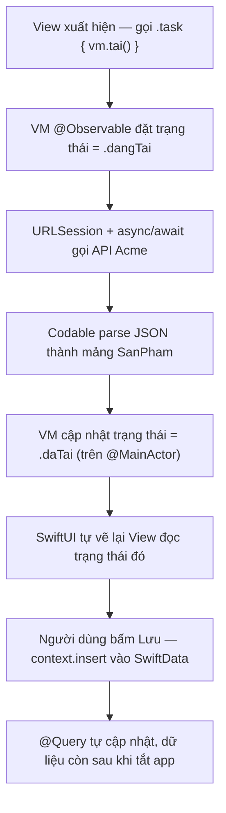

# Data, State & Navigation — @Observable, networking, SwiftData

> **Tác giả:** Mr.Rom\
> **Phiên bản:** v1.0.0\
> **Tạo lúc:** 13/06/2026\
> **Cập nhật:** 13/06/2026\
> **Level:** Basic\
> **Tags:** ios, swift, swiftui, observation, observable, navigationstack, urlsession, async-await, codable, swiftdata, userdefaults, mobile\
> **Yêu cầu trước:** [SwiftUI cơ bản](02_swiftui-fundamentals.md)

> 🎯 *Bài trước bạn đã dựng được view tĩnh với `@State` cho dữ liệu nhỏ trong một màn hình. Nhưng app thật cần nhiều hơn: dữ liệu phải **chia sẻ giữa nhiều view**, phải **tải về từ server**, phải **chuyển màn hình**, và phải **lưu lại** khi tắt app. Bài này dạy đủ 4 mảnh đó cho app Acme Shop: state nâng cao với **Observation framework** (`@Observable`, `@Bindable`, `@Environment`), điều hướng với **NavigationStack**, networking bằng **URLSession + async/await + Codable**, và lưu trữ với **UserDefaults** (cài đặt nhỏ) + **SwiftData** (dữ liệu). Cuối bài bạn có một app tải danh sách sản phẩm Acme thật, hiển thị loading/error đàng hoàng.*

## 🎯 Sau bài này bạn sẽ

- [ ] Hiểu vì sao `@State` không đủ khi dữ liệu chia sẻ nhiều view, và dùng `@Observable` (Observation framework, iOS 17+) thay cho `ObservableObject` cũ
- [ ] Phân biệt rõ `@State` / `@Bindable` / `@Environment` — dùng cái nào lúc nào
- [ ] Điều hướng nhiều màn hình bằng `NavigationStack`, `NavigationLink`, và navigation **value-based** với `path`
- [ ] Gọi API bằng `URLSession` + `async`/`await` + parse JSON với `Codable`
- [ ] Quản lý trạng thái **loading / loaded / error** cho một màn hình tải dữ liệu
- [ ] Lưu cài đặt nhỏ bằng `UserDefaults` và dữ liệu app bằng **SwiftData** (`@Model`, `@Query`)
- [ ] Tránh được cạm bẫy chặn main thread và nhầm `@State` với `@Observable`

> ⚙️ Cả bài cần **máy Mac + Xcode 16** (chứa Swift 6, SwiftUI, Observation, SwiftData). Tạo project mới: mở Xcode → **File → New → Project → iOS → App**, đặt tên `AcmeShop`, Interface chọn **SwiftUI**, Language **Swift**. Tối thiểu **iOS 17** (Observation/SwiftData cần iOS 17 trở lên).

---

## Tình huống — `@State` hết đủ dùng

Ở bài SwiftUI cơ bản, bạn đếm số sản phẩm trong giỏ bằng `@State` ngay trong một view:

```swift
struct GioHangView: View {
    @State private var soLuong = 0

    var body: some View {
        Button("Thêm (\(soLuong))") { soLuong += 1 }
    }
}
```

Chạy ngon. Nhưng giờ app Acme Shop lớn lên, bạn gặp loạt yêu cầu mới mà `@State` không kham nổi:

- 🛒 Giỏ hàng phải hiện **cả ở màn hình danh sách lẫn màn hình chi tiết** — `@State` chỉ sống trong **một** view, không chia sẻ được.
- 🌐 Danh sách sản phẩm phải **tải từ API** `https://api.acmeshop.dev` — `@State` không biết gọi mạng.
- ➡️ Bấm vào một sản phẩm phải **mở màn hình chi tiết** — cần điều hướng.
- 💾 Tắt app rồi mở lại, giỏ hàng và sản phẩm đã xem phải **còn nguyên** — cần lưu trữ.

Bốn nhu cầu này là xương sống của mọi app thật. Lần lượt: ta cần **một nơi giữ dữ liệu chia sẻ** (Observation), **cách chuyển màn hình** (NavigationStack), **cách lấy dữ liệu về** (URLSession), và **cách cất dữ liệu lại** (UserDefaults + SwiftData). Bài này đi đúng 4 việc đó.

> 📖 *Bắt đầu từ mảnh nền tảng nhất: làm sao có một "kho dữ liệu" mà nhiều view cùng nhìn vào và tự cập nhật khi nó đổi.*

---

## 1️⃣ Observation framework — `@Observable` thay cho `ObservableObject`

`@State` hợp với dữ liệu **riêng tư, nhỏ, sống trong một view**. Khi dữ liệu cần **chia sẻ giữa nhiều view** (giỏ hàng, user đăng nhập, danh sách sản phẩm tải về), bạn cần một **class** giữ state đó và để các view "quan sát" nó.

Trước iOS 17, Apple dùng `ObservableObject` + `@Published` + `@StateObject`/`@ObservedObject` — nhiều annotation, dễ rối, và view bị vẽ lại cả khi property nó **không dùng** thay đổi. Từ iOS 17, Apple ra **Observation framework** với macro `@Observable`: gọn hơn, nhanh hơn (view chỉ vẽ lại khi property nó **thật sự đọc** đổi).

🪞 **Ẩn dụ**: Một class `@Observable` giống **bảng thông báo điện tử ở sảnh chung cư**. Nhiều cư dân (các view) cùng nhìn lên bảng. Khi ban quản lý sửa một dòng (đổi property), chỉ những ai đang đọc đúng dòng đó mới ngẩng lên xem lại — người đang đọc dòng khác không bị làm phiền. `@State` thì như **tờ giấy nhớ dán trên bàn riêng của bạn** — chỉ mình bạn thấy.

### Viết một class `@Observable`

Ta tạo `GioHang` (giỏ hàng) — một class giữ danh sách sản phẩm đã thêm, dùng chung cho cả app. Chỉ cần đánh dấu `@Observable` trước class là xong, không cần `@Published` cho từng property nữa.

```swift
import Observation

// @Observable: mọi property của class tự động được "theo dõi".
// View nào đọc property nào → tự vẽ lại khi đúng property đó đổi.
@Observable
final class GioHang {
    var sanPhams: [SanPham] = []   // danh sách sản phẩm trong giỏ

    var tongSoLuong: Int {          // computed property — cũng được theo dõi
        sanPhams.count
    }

    func them(_ sp: SanPham) {
        sanPhams.append(sp)
    }

    func xoa(_ sp: SanPham) {
        sanPhams.removeAll { $0.id == sp.id }
    }
}
```

So với cách cũ: không còn `class GioHang: ObservableObject` và không còn `@Published var sanPhams`. Macro `@Observable` lo hết — kể cả `tongSoLuong` (computed) cũng tự cập nhật khi `sanPhams` đổi.

### Tạo và chia sẻ instance: `@State` ở chủ sở hữu, `@Environment` ở nơi dùng

Đây là điểm hay nhầm, nên đi chậm. Một view phải **sở hữu** (tạo và giữ vòng đời) instance `GioHang`; các view khác **dùng nhờ** nó. Quy tắc với Observation:

- View **sở hữu** dùng `@State` để giữ instance (nghe lạ, nhưng `@State` với class `@Observable` chính là cách giữ instance sống đúng vòng đời view).
- Bơm instance đó xuống cây view bằng `.environment(...)`.
- View **dùng nhờ** lấy ra bằng `@Environment(GioHang.self)`.

```swift
import SwiftUI

@main
struct AcmeShopApp: App {
    // 1. View gốc SỞ HỮU giỏ hàng — dùng @State để giữ instance sống
    @State private var gioHang = GioHang()

    var body: some Scene {
        WindowGroup {
            DanhSachView()
                // 2. Bơm gioHang xuống toàn bộ cây view con
                .environment(gioHang)
        }
    }
}

struct DanhSachView: View {
    // 3. View con DÙNG NHỜ — lấy ra từ environment, không tự tạo
    @Environment(GioHang.self) private var gioHang

    var body: some View {
        Text("Giỏ hàng: \(gioHang.tongSoLuong) sản phẩm")
    }
}
```

Khi `gioHang.them(...)` được gọi từ bất kỳ đâu, mọi view đang đọc `tongSoLuong` (kể cả `DanhSachView` lẫn màn hình chi tiết) tự cập nhật — vì cả hai cùng nhìn vào **một** instance qua environment.

### `@Bindable` — khi cần `Binding` hai chiều tới property của `@Observable`

`@Environment` cho bạn **đọc** dữ liệu. Nhưng khi cần một `Binding` hai chiều — ví dụ một `TextField` hay `Toggle` chỉnh thẳng property của object `@Observable` — bạn dùng `@Bindable`. Nó tạo cầu nối để dùng cú pháp `$object.property`.

```swift
import SwiftUI

@Observable
final class CaiDat {
    var hienGiaGom: Bool = true   // có hiển thị giá đã gồm VAT không
}

struct CaiDatView: View {
    @Bindable var caiDat: CaiDat   // @Bindable → dùng được $caiDat.property

    var body: some View {
        // Toggle cần Binding<Bool> → $caiDat.hienGiaGom
        Toggle("Hiện giá đã gồm VAT", isOn: $caiDat.hienGiaGom)
    }
}
```

Ba từ khoá này dễ lẫn, nên đây là bảng chốt. Đọc theo "tôi đang ở vai trò nào với dữ liệu" để chọn đúng:

| Property wrapper | Dùng cho | Khi nào dùng |
|---|---|---|
| `@State` | Dữ liệu riêng của view (giá trị nhỏ), HOẶC giữ instance `@Observable` mà view sở hữu | View tự sinh và sở hữu state |
| `@Bindable` | Object `@Observable` cần `Binding` hai chiều (`$obj.field`) | Có `TextField`/`Toggle`/`Slider` sửa thẳng property object |
| `@Environment` | Object `@Observable` được bơm từ view cha qua `.environment(...)` | View con dùng nhờ state chia sẻ, chỉ cần đọc/gọi method |

> [!IMPORTANT]
> Quy tắc vàng: **một** view sở hữu instance bằng `@State private var x = MyModel()`, các view khác lấy nhờ qua `@Environment` (chia sẻ toàn cây) hoặc nhận qua tham số rồi đánh dấu `@Bindable` (khi cần `$binding`). Đừng để **nhiều** view cùng `@State = MyModel()` cho cùng một dữ liệu — mỗi cái sẽ là một instance riêng, không đồng bộ với nhau.

> 📖 *Có nơi giữ dữ liệu chia sẻ rồi. Giờ ta cần cách đưa người dùng đi giữa các màn hình — đó là việc của NavigationStack.*

---

## 2️⃣ Điều hướng — NavigationStack + value-based navigation

App Acme Shop có nhiều màn hình: danh sách → chi tiết sản phẩm → giỏ hàng. Người dùng bấm một sản phẩm, màn hình mới trượt vào; bấm back, trượt ra. Cơ chế "chồng màn hình" này trong SwiftUI hiện đại là **`NavigationStack`**.

🪞 **Ẩn dụ**: `NavigationStack` như **chồng đĩa trong tiệm ăn**. Mỗi màn hình là một cái đĩa. Mở màn hình mới = **đặt thêm đĩa lên trên** (push). Bấm back = **lấy đĩa trên cùng ra** (pop). Bạn luôn nhìn thấy đĩa trên cùng — màn hình hiện tại.

### Cách 1: `NavigationLink` đơn giản — đi tới một view cụ thể

Cách dễ nhất: bọc nội dung trong `NavigationStack`, rồi đặt `NavigationLink` chỉ thẳng tới view đích. Hợp khi đích là cố định, biết trước.

```swift
import SwiftUI

struct DanhSachDonGianView: View {
    var body: some View {
        // NavigationStack: gốc của một "chồng màn hình"
        NavigationStack {
            List {
                // NavigationLink(destination:) — bấm vào đẩy thẳng view đích lên stack
                NavigationLink("iPhone 16 Pro") {
                    Text("Chi tiết iPhone 16 Pro")
                }
                NavigationLink("MacBook Air M4") {
                    Text("Chi tiết MacBook Air M4")
                }
            }
            .navigationTitle("Sản phẩm")   // tiêu đề trên thanh điều hướng
        }
    }
}
```

Cách này gọn cho vài link cứng. Nhưng với danh sách **động** tải từ API (chưa biết trước có bao nhiêu sản phẩm), ta cần cách linh hoạt hơn: **value-based navigation**.

### Cách 2: Value-based navigation — đẩy theo *giá trị*, không theo view

Ý tưởng: thay vì nói "bấm vào thì mở view này", ta nói "bấm vào thì đẩy **giá trị** này lên stack", rồi khai báo riêng "khi gặp giá trị kiểu `SanPham` thì dựng màn hình chi tiết". Tách dữ liệu khỏi view giúp code gọn và dễ điều hướng bằng lập trình (vd: deep link, nút "về trang chủ").

```swift
import SwiftUI

struct DanhSachView2: View {
    let sanPhams: [SanPham]

    var body: some View {
        NavigationStack {
            List(sanPhams) { sp in
                // 1. NavigationLink(value:) — đẩy GIÁ TRỊ sp lên stack khi bấm
                NavigationLink(value: sp) {
                    Text(sp.ten)
                }
            }
            .navigationTitle("Sản phẩm")
            // 2. Khai báo: gặp giá trị kiểu SanPham thì dựng view nào
            .navigationDestination(for: SanPham.self) { sp in
                ChiTietView(sanPham: sp)
            }
        }
    }
}
```

Để `NavigationLink(value:)` hoạt động, kiểu giá trị (`SanPham`) phải tuân `Hashable` — SwiftUI cần băm giá trị để quản lý stack. Ta sẽ cho `SanPham` tuân `Hashable` ở mục networking.

### Điều khiển stack bằng `path` — điều hướng bằng lập trình

Đôi khi bạn cần **chủ động** điều hướng từ code: sau khi đặt hàng xong thì tự về màn hình gốc, hoặc mở thẳng tới một sản phẩm từ thông báo. Khi đó gắn `NavigationStack` với một mảng `path` (kiểu `@State`). Đẩy phần tử vào mảng = push; xoá hết = về gốc.

```swift
import SwiftUI

struct DanhSachCoPathView: View {
    let sanPhams: [SanPham]
    // path là "danh sách màn hình đang chồng lên nhau" — ta điều khiển được
    @State private var path: [SanPham] = []

    var body: some View {
        NavigationStack(path: $path) {
            List(sanPhams) { sp in
                NavigationLink(value: sp) { Text(sp.ten) }
            }
            .navigationTitle("Sản phẩm")
            .navigationDestination(for: SanPham.self) { sp in
                ChiTietView(sanPham: sp)
                    // Nút trong màn hình con xoá sạch path → về gốc
                    .toolbar {
                        Button("Về đầu") { path.removeAll() }
                    }
            }
        }
    }
}
```

> 📖 *Có khung điều hướng rồi, nhưng danh sách vẫn rỗng. Đến lúc lấy dữ liệu thật về từ server — phần networking.*

---

## 3️⃣ Networking — URLSession + async/await + Codable

Danh sách sản phẩm Acme nằm trên server, trả về JSON khi gọi `GET https://api.acmeshop.dev/products`. Ba mảnh ghép để lấy nó về và biến thành object Swift:

- **`URLSession`** — công cụ gọi mạng có sẵn trong Foundation (không cần thư viện ngoài cho việc cơ bản).
- **`async`/`await`** — chờ phản hồi mạng mà không chặn giao diện (giống async của JS/Dart).
- **`Codable`** — giao thức cho phép Swift tự chuyển JSON ↔ struct.

🪞 **Ẩn dụ**: Gọi API như **gọi điện đặt hàng**. `URLSession` là chiếc điện thoại. `await` là *"alô, chờ máy một lát nhé"* — bạn không đứng đơ ra mà vẫn làm việc khác. `Codable` là **nhân viên dịch** đơn hàng từ "tiếng tổng đài" (JSON) sang "tiếng nhà mình" (struct Swift).

### Bước 1: Định nghĩa model `Codable`

Giả sử server trả về JSON như sau (đây là mẫu, không phải lệnh chạy):

```json
[
  { "id": 1, "name": "iPhone 16 Pro", "price": 28990000 },
  { "id": 2, "name": "MacBook Air M4", "price": 27990000 }
]
```

Ta định nghĩa struct khớp với JSON. Cho nó tuân `Codable` (parse được) và `Identifiable` + `Hashable` (để dùng trong `List` và value-based navigation). Lưu ý JSON dùng `name`/`price` (tiếng Anh) nên ta dùng `CodingKeys` để ánh xạ `name`→`ten`, `price`→`gia` (đổi sang tên tiếng Việt cho nhất quán với phần còn lại của bài):

```swift
import Foundation

// Codable = Encodable + Decodable → tự parse JSON.
// Identifiable → dùng trực tiếp trong List/ForEach (cần property `id`).
// Hashable → dùng cho NavigationLink(value:) ở mục 2.
struct SanPham: Codable, Identifiable, Hashable {
    let id: Int
    let ten: String
    let gia: Int

    // Ánh xạ tên field JSON (name/price) sang tên Swift (ten/gia)
    enum CodingKeys: String, CodingKey {
        case id
        case ten = "name"
        case gia = "price"
    }
}
```

`CodingKeys` là chỗ khai báo "field JSON tên `name` thì đổ vào property `ten`". Nếu tên JSON trùng tên Swift thì không cần khai (như `id`).

### Bước 2: Hàm gọi API bằng `async`/`await`

Hàm `taiSanPhams()` gọi mạng và trả về `[SanPham]`. Vì gọi mạng có thể lỗi (mất mạng, server trả 500) nên hàm `throws`, và vì phải chờ nên nó `async`:

```swift
import Foundation

enum LoiMang: Error {
    case urlSai
    case phanHoiKhongHopLe(Int)   // kèm mã HTTP để biết lỗi gì
}

func taiSanPhams() async throws -> [SanPham] {
    // 1. Dựng URL
    guard let url = URL(string: "https://api.acmeshop.dev/products") else {
        throw LoiMang.urlSai
    }

    // 2. Gọi mạng — await tạm dừng tại đây tới khi có phản hồi, KHÔNG chặn UI
    let (data, response) = try await URLSession.shared.data(from: url)

    // 3. Kiểm tra mã HTTP phải là 2xx (200-299) mới coi là thành công
    guard let http = response as? HTTPURLResponse,
          (200...299).contains(http.statusCode) else {
        let ma = (response as? HTTPURLResponse)?.statusCode ?? -1
        throw LoiMang.phanHoiKhongHopLe(ma)
    }

    // 4. Parse data (JSON) thành [SanPham] nhờ Codable
    let sanPhams = try JSONDecoder().decode([SanPham].self, from: data)
    return sanPhams
}
```

Điểm cốt lõi: `try await URLSession.shared.data(from:)` chạy trên một luồng nền của hệ thống. `await` "nhả" luồng hiện tại trong lúc chờ mạng, nên giao diện **không đơ**. Đây chính là cách tránh cạm bẫy chặn main thread mà ta sẽ nói kỹ ở cuối bài.

### Bước 3: Gắn networking vào `@Observable` với loading/error state

Tải dữ liệu không chỉ là "lấy về" — người dùng cần thấy **đang tải** (spinner), thấy **lỗi** (kèm nút thử lại), hoặc thấy **danh sách**. Ta mô hình hoá 3 trạng thái đó bằng một `enum`, để trong một class `@Observable` quản lý màn hình:

```swift
import Foundation
import Observation

// 3 trạng thái rõ ràng của một màn hình tải dữ liệu
enum TrangThaiTai {
    case dangTai                  // đang chờ mạng → hiện spinner
    case daTai([SanPham])         // có dữ liệu → hiện danh sách
    case loi(String)              // lỗi → hiện thông báo + nút thử lại
}

@Observable
final class DanhSachVM {
    // private(set): bên ngoài đọc được nhưng chỉ VM tự đổi
    private(set) var trangThai: TrangThaiTai = .dangTai

    // @MainActor đảm bảo cập nhật state chạy trên main thread (an toàn cho UI)
    @MainActor
    func tai() async {
        trangThai = .dangTai
        do {
            let sps = try await taiSanPhams()
            trangThai = .daTai(sps)
        } catch {
            trangThai = .loi("Không tải được sản phẩm: \(error.localizedDescription)")
        }
    }
}
```

`@MainActor` trên hàm `tai()` đảm bảo việc **gán state** (thứ kéo theo vẽ lại UI) luôn xảy ra trên main thread — bắt buộc, vì cập nhật UI ngoài main thread là lỗi. Còn phần chờ mạng bên trong `taiSanPhams()` vẫn chạy nền nhờ `await`.

### Bước 4: View hiển thị theo trạng thái, gọi tải khi xuất hiện

View đọc `vm.trangThai` và vẽ giao diện tương ứng. Quan trọng: gọi `vm.tai()` trong `.task { }` — modifier này tự chạy code `async` khi view xuất hiện và tự huỷ khi view biến mất.

```swift
import SwiftUI

struct DanhSachSanPhamView: View {
    // View này SỞ HỮU view-model → @State giữ instance
    @State private var vm = DanhSachVM()

    var body: some View {
        NavigationStack {
            // switch theo trạng thái → mỗi trạng thái một giao diện
            Group {
                switch vm.trangThai {
                case .dangTai:
                    ProgressView("Đang tải sản phẩm…")   // spinner xoay
                case .daTai(let sanPhams):
                    List(sanPhams) { sp in
                        NavigationLink(value: sp) {
                            HStack {
                                Text(sp.ten)
                                Spacer()
                                Text("\(sp.gia) đ").foregroundStyle(.secondary)
                            }
                        }
                    }
                    .navigationDestination(for: SanPham.self) { sp in
                        ChiTietView(sanPham: sp)
                    }
                case .loi(let thongBao):
                    VStack(spacing: 12) {
                        Text(thongBao).multilineTextAlignment(.center)
                        Button("Thử lại") {
                            Task { await vm.tai() }   // bấm là tải lại
                        }
                    }
                    .padding()
                }
            }
            .navigationTitle("Acme Shop")
        }
        // .task chạy code async khi view xuất hiện, tự huỷ khi biến mất
        .task {
            await vm.tai()
        }
    }
}
```

Mẫu `enum` 3 trạng thái + `switch` trong `body` là khuôn chuẩn cho **mọi** màn hình tải dữ liệu. Người dùng luôn thấy đúng một trong ba: spinner, danh sách, hoặc lỗi-có-nút-thử-lại — không bao giờ thấy màn hình trắng bí ẩn.

> 📖 *Dữ liệu đã về và hiển thị được. Còn một mảnh: tắt app rồi mở lại thì sao? Cần lưu trữ — bắt đầu từ thứ nhỏ nhất là UserDefaults.*

---

## 4️⃣ Lưu trữ — UserDefaults (nhỏ) và SwiftData (dữ liệu)

Có hai mức lưu trữ rất khác nhau, chọn sai là khổ:

- **`UserDefaults`** — lưu **cài đặt nhỏ**: bật/tắt dark mode, đơn vị tiền tệ, đã xem onboarding chưa. Dữ liệu kiểu key-value đơn giản, nhỏ (vài KB).
- **SwiftData** — lưu **dữ liệu app thật sự**: danh sách sản phẩm đã lưu, lịch sử đơn hàng, giỏ hàng. Đây là framework lưu trữ hiện đại (iOS 17+) **thay cho Core Data** cũ.

🪞 **Ẩn dụ**: `UserDefaults` là **ngăn kéo nhỏ cạnh giường** — để vài thứ lặt vặt (chìa khoá, kính), lấy ra cất vào nhanh. SwiftData là **cả cái tủ hồ sơ có ngăn, có nhãn** — để hàng trăm tài liệu (đơn hàng, sản phẩm) tra cứu, lọc, sắp xếp được.

### UserDefaults — cài đặt nhỏ với `@AppStorage`

SwiftUI cho bạn property wrapper `@AppStorage` đọc/ghi thẳng vào `UserDefaults`, lại tự cập nhật UI khi giá trị đổi. Nó hợp cho mọi "công tắc cài đặt".

```swift
import SwiftUI

struct CaiDatView: View {
    // @AppStorage("key") đọc/ghi UserDefaults, key là "hienGiaGomVAT"
    @AppStorage("hienGiaGomVAT") private var hienGiaGom = true
    @AppStorage("daXemHuongDan") private var daXemHuongDan = false

    var body: some View {
        Form {
            Toggle("Hiện giá đã gồm VAT", isOn: $hienGiaGom)
            Toggle("Đã xem hướng dẫn", isOn: $daXemHuongDan)
        }
    }
}
```

Bật `Toggle`, tắt app, mở lại → trạng thái vẫn còn, vì `@AppStorage` đã ghi vào `UserDefaults`. Đừng dùng nó cho dữ liệu lớn (danh sách hàng trăm sản phẩm) — đó là việc của SwiftData.

> [!WARNING]
> `UserDefaults` không phải nơi cất dữ liệu lớn hay nhạy cảm. Nó load toàn bộ vào RAM khi app khởi động — nhét mảng nghìn phần tử vào sẽ làm app khởi động chậm. Mật khẩu/token thì dùng **Keychain**, không phải `UserDefaults`. Quy tắc: `UserDefaults` chỉ cho cài đặt nhỏ (Bool, Int, String ngắn).

### SwiftData — lưu dữ liệu app

SwiftData là cách lưu trữ hiện hành của Apple. Bạn chỉ cần đánh dấu class model bằng `@Model`, khai báo container ở cấp App, rồi dùng `@Query` để đọc và `modelContext` để ghi. Nó tự lo phần database bên dưới.

#### Bước 1: Định nghĩa model với `@Model`

Ta lưu các sản phẩm người dùng đã "lưu để xem sau". Đổi `SanPham` networking (struct) thành một class `@Model` riêng cho việc lưu trữ — gọi là `SanPhamLuu` để tách bạch dữ liệu mạng và dữ liệu lưu:

```swift
import Foundation
import SwiftData

// @Model biến class này thành một thực thể lưu được trong SwiftData
@Model
final class SanPhamLuu {
    var ten: String
    var gia: Int
    var ngayLuu: Date

    init(ten: String, gia: Int, ngayLuu: Date = .now) {
        self.ten = ten
        self.gia = gia
        self.ngayLuu = ngayLuu
    }
}
```

#### Bước 2: Khai báo container ở cấp App

Báo cho app biết "hãy chuẩn bị kho lưu trữ cho `SanPhamLuu`" bằng modifier `.modelContainer(for:)` ở view gốc. Một dòng là đủ để SwiftData dựng database:

```swift
import SwiftUI
import SwiftData

@main
struct AcmeShopApp: App {
    var body: some Scene {
        WindowGroup {
            SanPhamLuuView()
        }
        // Tạo kho lưu trữ cho model SanPhamLuu — SwiftData lo phần còn lại
        .modelContainer(for: SanPhamLuu.self)
    }
}
```

#### Bước 3: Đọc bằng `@Query`, ghi/xoá bằng `modelContext`

`@Query` tự đọc dữ liệu từ kho và **tự cập nhật view** khi dữ liệu đổi (thêm/xoá). Việc ghi đi qua `modelContext` lấy từ environment. Đây là view hoàn chỉnh cho phép thêm và xoá sản phẩm đã lưu:

```swift
import SwiftUI
import SwiftData

struct SanPhamLuuView: View {
    // 1. @Query đọc TẤT CẢ SanPhamLuu, sắp xếp theo ngày lưu mới nhất
    @Query(sort: \SanPhamLuu.ngayLuu, order: .reverse)
    private var danhSach: [SanPhamLuu]

    // 2. modelContext là "tay ghi" vào kho — lấy từ environment
    @Environment(\.modelContext) private var context

    var body: some View {
        NavigationStack {
            List {
                ForEach(danhSach) { sp in
                    VStack(alignment: .leading) {
                        Text(sp.ten)
                        Text("\(sp.gia) đ").font(.caption).foregroundStyle(.secondary)
                    }
                }
                .onDelete(perform: xoa)   // vuốt để xoá
            }
            .navigationTitle("Đã lưu (\(danhSach.count))")
            .toolbar {
                Button("Thêm mẫu") { themMau() }
            }
        }
    }

    // 3. Ghi: tạo object rồi insert vào context
    func themMau() {
        let moi = SanPhamLuu(ten: "iPhone 16 Pro", gia: 28990000)
        context.insert(moi)
        // SwiftData tự lưu (autosave) — không cần gọi save() thủ công cho trường hợp cơ bản
    }

    // 4. Xoá: gọi context.delete cho từng phần tử
    func xoa(_ indexSet: IndexSet) {
        for i in indexSet {
            context.delete(danhSach[i])
        }
    }
}
```

Sau khi `context.insert(...)`, danh sách trên màn hình **tự dài thêm** mà không cần bạn báo gì — vì `@Query` luôn theo dõi kho. Tắt app, mở lại, các sản phẩm vẫn còn. Đó là điểm khác lớn so với `@State` (mất khi tắt app) và so với việc tự nhét JSON vào `UserDefaults` (thủ công, không query/sort được).

So sánh nhanh để chọn đúng nơi lưu. Đọc theo cột "Khi chọn" là ra quyết định ngay:

| Cách lưu | Loại dữ liệu | Truy vấn/lọc/sắp xếp | Khi chọn |
|---|---|---|---|
| `@State` | Tạm thời trong một view | Không | Dữ liệu mất khi tắt app cũng không sao |
| `UserDefaults` (`@AppStorage`) | Cài đặt nhỏ (Bool/Int/String) | Không | Vài công tắc cấu hình, cờ trạng thái |
| SwiftData (`@Model`/`@Query`) | Dữ liệu app (danh sách, lịch sử) | Có (`sort`, `filter`) | Cần lưu nhiều bản ghi, truy vấn được |

> 📖 *Bốn mảnh đã đủ: state chia sẻ, điều hướng, networking, lưu trữ. Trước khi đóng bài, ta nhìn lại bức tranh tổng và hai cạm bẫy chết người của người mới.*

---

## 5️⃣ Bức tranh tổng — dữ liệu chảy qua app thế nào

Bốn mảnh ở trên không rời rạc mà nối thành một vòng dữ liệu. Sơ đồ dưới mô tả luồng dữ liệu trong một màn hình Acme Shop điển hình: từ lúc view xuất hiện, gọi API, cập nhật state, vẽ lại UI, tới lúc lưu xuống SwiftData.



→ Điểm mấu chốt từ sơ đồ: bạn **không bao giờ tự ra lệnh vẽ UI**. Bạn chỉ đổi **state** (trong VM `@Observable`) — SwiftUI tự so sánh và vẽ lại đúng phần đổi. Networking và lưu trữ chỉ là hai nguồn làm state đổi: một cái kéo dữ liệu từ ngoài về, một cái cất dữ liệu xuống đĩa. Đây là tư duy **khai báo** (declarative) xuyên suốt iOS hiện đại.

---

## 💡 Cạm bẫy thường gặp & Best practice

### ❌ Cạm bẫy: Chặn main thread (UI đơ vài giây)

- **Triệu chứng**: Khi tải dữ liệu, cả giao diện **đơ cứng** — không cuộn được, nút bấm không phản hồi, vài giây sau mới hiện danh sách. Trên thiết bị thật người dùng tưởng app treo.
- **Nguyên nhân**: Làm việc nặng (gọi mạng, parse file lớn, vòng lặp khổng lồ) **đồng bộ ngay trên main thread** — luồng mà SwiftUI dùng để vẽ giao diện và bắt thao tác. Ví dụ kinh điển: dùng `Data(contentsOf: url)` (đồng bộ, chặn) để tải mạng thay vì `URLSession.shared.data(from:)` (`async`, không chặn).
- **Cách tránh**: Mọi việc nặng phải **bất đồng bộ**. Tải mạng dùng `try await URLSession.shared.data(from:)` trong hàm `async`, gọi qua `.task { }`. Main thread chỉ làm đúng việc của nó: vẽ UI và nhận thao tác. Cập nhật state cuối cùng đặt trên `@MainActor` (an toàn), còn phần chờ để `await` lo chạy nền.

```swift
// ❌ Chặn main thread — UI đơ tới khi tải xong
let data = try Data(contentsOf: url)            // đồng bộ, dừng cả app

// ✅ Không chặn — await nhả luồng trong lúc chờ mạng
let (data, _) = try await URLSession.shared.data(from: url)
```

### ❌ Cạm bẫy: Nhầm `@State` với `@Observable` (mỗi view một instance riêng)

- **Triệu chứng**: Thêm sản phẩm ở màn hình A, nhưng giỏ hàng ở màn hình B **không đổi**. Hai màn hình như "hai app khác nhau" dù tưởng dùng chung dữ liệu.
- **Nguyên nhân**: Mỗi view tự viết `@State private var gioHang = GioHang()` cho **cùng** một dữ liệu. `@State` tạo một instance **riêng cho mỗi view** — A và B đang sửa hai object khác nhau, không liên quan.
- **Cách tránh**: Chỉ **một** nơi sở hữu instance (`@State` ở view gốc hoặc cấp App), rồi bơm xuống bằng `.environment(gioHang)`. Các view khác lấy nhờ bằng `@Environment(GioHang.self)`. Lúc này A và B cùng nhìn **một** instance — sửa ở đâu cũng đồng bộ.

```swift
// ❌ Mỗi view một GioHang riêng → không đồng bộ
struct A: View { @State private var gioHang = GioHang() /* ... */ }
struct B: View { @State private var gioHang = GioHang() /* instance KHÁC */ }

// ✅ Một nơi sở hữu + bơm environment, nơi khác lấy nhờ
// App:    .environment(gioHang)
// A, B:   @Environment(GioHang.self) private var gioHang   // CÙNG instance
```

### ✅ Best practice: Tách view-model `@Observable` cho mỗi màn hình tải dữ liệu

- **Vì sao**: Nhồi networking + 3 trạng thái loading/error vào thẳng `body` của view khiến view phình to, khó test, khó tái dùng. Một class `@Observable` (view-model) gom logic tải + trạng thái lại một chỗ; view chỉ còn việc `switch` theo trạng thái để vẽ.
- **Cách áp dụng**: Mỗi màn hình tải dữ liệu có một VM `@Observable` giữ `enum TrangThaiTai` (`.dangTai` / `.daTai` / `.loi`) và một hàm `tai() async`. View `@State` sở hữu VM, gọi `.task { await vm.tai() }`, rồi `switch vm.trangThai` để hiển thị. Đây là khuôn dùng lại cho mọi màn hình.

### ✅ Best practice: Luôn xử lý đủ 3 trạng thái loading / loaded / error

- **Vì sao**: Mạng có thể chậm, có thể lỗi. Nếu chỉ code "tải xong thì hiện danh sách", người dùng gặp màn hình trắng khi đang tải, và màn hình trắng vĩnh viễn khi lỗi — tưởng app hỏng.
- **Cách áp dụng**: Dùng `enum` 3 nhánh và đảm bảo `body` vẽ cho **cả ba**: `.dangTai` → `ProgressView`; `.daTai` → danh sách; `.loi` → thông báo kèm nút **Thử lại** gọi `vm.tai()`. Người dùng luôn biết app đang ở trạng thái nào.

---

## 🧠 Tự kiểm tra (Self-check)

**Q1.** Vì sao `@State` không đủ khi giỏ hàng cần hiển thị ở nhiều màn hình? Dùng gì thay thế?

<details>
<summary>💡 Xem giải thích</summary>

`@State` tạo dữ liệu **riêng cho một view** — không chia sẻ được sang view khác. Mỗi view tự `@State = GioHang()` sẽ là instance độc lập, sửa ở view này không ảnh hưởng view kia.

Thay thế: tạo một class `@Observable` (vd `GioHang`), cho **một** nơi sở hữu instance (`@State private var gioHang = GioHang()` ở App/view gốc), bơm xuống cây view bằng `.environment(gioHang)`, các view khác lấy nhờ bằng `@Environment(GioHang.self)`. Khi đó mọi view cùng nhìn **một** instance, sửa ở đâu cũng đồng bộ.

</details>

**Q2.** Phân biệt `@State`, `@Bindable`, `@Environment` khi làm việc với object `@Observable`.

<details>
<summary>💡 Xem giải thích</summary>

- `@State`: dùng ở view **sở hữu** instance — `@State private var vm = MyVM()`. View này tạo và giữ vòng đời object.
- `@Bindable`: dùng khi cần `Binding` **hai chiều** tới property của object `@Observable` (vd `TextField`/`Toggle`/`Slider` sửa thẳng `$obj.field`).
- `@Environment(MyVM.self)`: dùng ở view **dùng nhờ** — lấy object đã được view cha bơm xuống bằng `.environment(...)`. Chỉ đọc/gọi method, không sở hữu.

</details>

**Q3.** `NavigationLink(value:)` khác `NavigationLink(destination:)` thế nào? Vì sao value-based hợp với danh sách động tải từ API?

<details>
<summary>💡 Xem giải thích</summary>

`NavigationLink(destination:)` chỉ thẳng tới một **view đích cố định** — hợp khi đích biết trước, ít link.

`NavigationLink(value:)` chỉ đẩy một **giá trị** (vd một `SanPham`) lên stack; việc "giá trị đó dựng thành view gì" khai báo riêng một lần bằng `.navigationDestination(for: SanPham.self) { ... }`. Cách này tách dữ liệu khỏi view, hợp với danh sách **động** (chưa biết trước bao nhiêu phần tử) và cho phép điều hướng bằng lập trình qua `path`. Lưu ý kiểu giá trị phải tuân `Hashable`.

</details>

**Q4.** Ba mảnh `URLSession`, `async/await`, `Codable` mỗi cái lo việc gì trong một lần gọi API?

<details>
<summary>💡 Xem giải thích</summary>

- `URLSession` — công cụ **gọi mạng** thật sự (`URLSession.shared.data(from:)` lấy về `data` + `response`).
- `async/await` — **chờ phản hồi mà không chặn UI**. `await` nhả luồng trong lúc chờ mạng, giao diện vẫn mượt.
- `Codable` — **chuyển JSON ↔ struct Swift**. `JSONDecoder().decode([SanPham].self, from: data)` biến chuỗi JSON thành mảng object Swift.

</details>

**Q5.** Khi nào dùng `UserDefaults`, khi nào dùng SwiftData? Lưu danh sách 500 đơn hàng nên dùng cái nào?

<details>
<summary>💡 Xem giải thích</summary>

`UserDefaults` (qua `@AppStorage`): cho **cài đặt nhỏ** kiểu key-value (Bool/Int/String ngắn) — dark mode, cờ "đã xem hướng dẫn". Nó load hết vào RAM lúc khởi động nên không hợp dữ liệu lớn.

SwiftData (`@Model` + `@Query`): cho **dữ liệu app thật sự** cần nhiều bản ghi, truy vấn/lọc/sắp xếp — danh sách sản phẩm, lịch sử đơn hàng.

500 đơn hàng → **SwiftData**. Nhét vào `UserDefaults` sẽ làm app khởi động chậm và không query/sort được.

</details>

**Q6.** Vì sao tải dữ liệu bằng `Data(contentsOf: url)` là sai lầm, dù nó "vẫn chạy được"?

<details>
<summary>💡 Xem giải thích</summary>

`Data(contentsOf: url)` là lời gọi **đồng bộ** — nó **chặn** luồng đang chạy tới khi tải xong. Nếu gọi trên main thread (luồng vẽ UI), cả giao diện **đơ** trong lúc chờ mạng: không cuộn được, nút không bấm được. Người dùng tưởng app treo.

Đúng: dùng `try await URLSession.shared.data(from:)` — `async`, `await` nhả luồng trong lúc chờ, UI vẫn mượt. Việc nặng phải bất đồng bộ, main thread chỉ lo vẽ UI và nhận thao tác.

</details>

---

## ⚡ Tra cứu nhanh (Cheatsheet)

| Mục đích | Cú pháp Swift / SwiftUI |
|---|---|
| Class state chia sẻ | `@Observable final class GioHang { ... }` |
| Sở hữu instance | `@State private var vm = MyVM()` |
| Bơm xuống cây view | `.environment(gioHang)` |
| Lấy nhờ từ environment | `@Environment(GioHang.self) private var gioHang` |
| Binding hai chiều tới `@Observable` | `@Bindable var caiDat: CaiDat` → `$caiDat.field` |
| Khung điều hướng | `NavigationStack { ... }` |
| Link tới view cố định | `NavigationLink("Tên") { ViewDich() }` |
| Link theo giá trị | `NavigationLink(value: sp) { ... }` |
| Khai báo đích cho giá trị | `.navigationDestination(for: SanPham.self) { sp in ... }` |
| Điều hướng bằng path | `NavigationStack(path: $path) { ... }` |
| Model parse JSON | `struct X: Codable, Identifiable, Hashable` |
| Ánh xạ tên field JSON | `enum CodingKeys: String, CodingKey { case ten = "name" }` |
| Gọi mạng async | `let (data, resp) = try await URLSession.shared.data(from: url)` |
| Parse JSON | `try JSONDecoder().decode([SanPham].self, from: data)` |
| Chạy async khi view hiện | `.task { await vm.tai() }` |
| Cập nhật state trên main | `@MainActor func tai() async { ... }` |
| Cài đặt nhỏ | `@AppStorage("key") private var x = false` |
| Model lưu trữ | `@Model final class SanPhamLuu { ... }` |
| Khai báo kho lưu | `.modelContainer(for: SanPhamLuu.self)` |
| Đọc dữ liệu lưu | `@Query(sort: \SanPhamLuu.ngayLuu) private var ds: [SanPhamLuu]` |
| Ghi vào kho | `@Environment(\.modelContext) private var context` + `context.insert(x)` |
| Xoá khỏi kho | `context.delete(x)` |

---

## 📚 Từ Điển Thuật Ngữ (Glossary)

| EN | VN | Giải thích |
|---|---|---|
| Observation framework | Framework quan sát | Cơ chế theo dõi state mới (iOS 17+), thay `ObservableObject` cũ |
| `@Observable` | Macro quan sát | Đánh dấu class để mọi property tự được view theo dõi |
| `@State` | State cục bộ | Dữ liệu riêng của một view, hoặc giữ instance object view sở hữu |
| `@Bindable` | Bindable | Tạo `Binding` hai chiều (`$obj.field`) tới object `@Observable` |
| `@Environment` | Environment | Lấy object/giá trị được bơm từ view cha xuống cây view |
| `.environment(...)` | Bơm environment | Modifier đưa object xuống cho mọi view con dùng chung |
| NavigationStack | Ngăn xếp điều hướng | Khung quản lý "chồng màn hình" push/pop trong SwiftUI |
| NavigationLink | Link điều hướng | Phần tử bấm vào để đẩy màn hình mới lên stack |
| Value-based navigation | Điều hướng theo giá trị | Đẩy *giá trị* lên stack, khai báo riêng cách dựng view từ giá trị |
| `path` | Đường dẫn stack | Mảng `@State` biểu diễn các màn hình đang chồng, điều khiển bằng code |
| URLSession | URLSession | Công cụ gọi mạng có sẵn trong Foundation |
| `async`/`await` | Bất đồng bộ | Chờ kết quả (mạng/file) mà không chặn luồng đang chạy |
| Codable | Codable | Giao thức cho phép tự chuyển JSON ↔ struct Swift |
| CodingKeys | Khoá mã hoá | Khai báo ánh xạ tên field JSON sang tên property Swift |
| JSONDecoder | Bộ giải mã JSON | Đối tượng parse chuỗi JSON thành object Swift |
| `@MainActor` | Main actor | Đảm bảo code chạy trên main thread (an toàn cập nhật UI) |
| Main thread | Luồng chính | Luồng SwiftUI dùng để vẽ UI và nhận thao tác — không được chặn |
| `.task` | Task modifier | Chạy code `async` khi view xuất hiện, tự huỷ khi biến mất |
| Loading state | Trạng thái tải | Mô hình hoá `.dangTai`/`.daTai`/`.loi` cho màn hình tải dữ liệu |
| UserDefaults | UserDefaults | Kho key-value cho cài đặt nhỏ (Bool/Int/String) |
| `@AppStorage` | AppStorage | Property wrapper đọc/ghi thẳng `UserDefaults`, tự cập nhật UI |
| SwiftData | SwiftData | Framework lưu trữ dữ liệu hiện đại (iOS 17+), thay Core Data |
| `@Model` | Model | Đánh dấu class thành thực thể lưu được trong SwiftData |
| `@Query` | Query | Đọc dữ liệu từ kho SwiftData, tự cập nhật view khi dữ liệu đổi |
| modelContext | Ngữ cảnh model | "Tay ghi/xoá" vào kho SwiftData (`insert`/`delete`) |
| modelContainer | Kho lưu trữ | Database SwiftData, khai báo ở cấp App bằng `.modelContainer(for:)` |
| Keychain | Keychain | Kho mã hoá của hệ thống cho dữ liệu nhạy cảm (mật khẩu/token) |

---

## 🔗 Liên kết & Tài nguyên

⬅️ **Bài trước:** [SwiftUI cơ bản — View, modifier, @State](02_swiftui-fundamentals.md)\
➡️ **Bài tiếp theo:** [Xcode, Build & App Store — Từ project đến TestFlight](04_xcode-build-and-app-store.md)\
↑ **Về cụm:** [iOS & Swift cơ bản](../../README.md)

### 🧭 Định hướng lộ trình học

- [SwiftUI cơ bản — View, modifier, @State](02_swiftui-fundamentals.md) — nền tảng view & `@State`, yêu cầu trước của bài này
- [Xcode, Build & App Store — Từ project đến TestFlight](04_xcode-build-and-app-store.md) — bài kế: build và đưa app lên store
- [Swift cơ bản — Optionals, struct/class, protocol](01_swift-basics.md) — ôn lại struct/class/protocol nếu phần Codable/Observable còn lạ

### 🧩 Các chủ đề có thể bạn quan tâm

- [Lập trình iOS là gì? — Swift, Xcode, SwiftUI](00_what-is-ios-development.md) — bức tranh tổng về nền tảng iOS
- [Data, State & Navigation — @Observable, networking, SwiftData (Flutter đối chiếu)](../../../flutter/lessons/01_basic/01_dart-and-widgets.md) — đối chiếu cách Flutter quản lý state & widget
- [Navigation & State — React Navigation, quản lý dữ liệu (React Native đối chiếu)](../../../react-native/lessons/01_basic/00_what-is-react-native.md) — đối chiếu cách React Native điều hướng & quản lý dữ liệu

### 🌐 Tài nguyên tham khảo khác

- [Apple — Managing model data in your app (Observation)](https://developer.apple.com/documentation/swiftui/managing-model-data-in-your-app) — tài liệu chính thức về `@Observable` trong SwiftUI
- [Apple — Migrating from the Observable Object protocol to the Observable macro](https://developer.apple.com/documentation/swiftui/migrating-from-the-observable-object-protocol-to-the-observable-macro) — chuyển từ `ObservableObject` sang `@Observable`
- [Apple — SwiftData documentation](https://developer.apple.com/documentation/swiftdata) — `@Model`, `@Query`, modelContainer
- [Apple — Fetching website data into memory (URLSession)](https://developer.apple.com/documentation/foundation/url-loading-system) — gọi mạng với URLSession
- [Hacking with Swift — Observation & SwiftData](https://www.hackingwithswift.com/quick-start/swiftdata) — hướng dẫn cộng đồng dễ đọc cho người mới

---

> 🎯 *Sau bài này bạn đã ghép được một app Acme Shop tải sản phẩm thật, chia sẻ state nhiều màn hình, điều hướng và lưu trữ. Bài cuối cụm dạy đóng gói tất cả lại: dùng **Xcode** để build, ký app, và đưa lên **TestFlight** rồi **App Store**.*

---

## 📌 Nhật ký thay đổi (Changelog)

- **v1.0.0 (13/06/2026)** — Bản đầu tiên. Cụm `ios-swift/` lesson 3/5 (basic). Cover: Observation framework với `@Observable` (thay `ObservableObject`) + phân biệt `@State`/`@Bindable`/`@Environment` + chia sẻ instance qua `.environment(...)`; NavigationStack với `NavigationLink(destination:)`, value-based `NavigationLink(value:)` + `.navigationDestination(for:)`, điều khiển bằng `path`; networking URLSession + async/await + Codable (model `SanPham`, hàm `taiSanPhams()`, kiểm tra HTTP status); loading/loaded/error state qua `enum` + view-model `@Observable` + `@MainActor` + `.task`; lưu trữ UserDefaults (`@AppStorage`) và SwiftData (`@Model`/`@Query`/`modelContext`/`.modelContainer`). 1 sơ đồ mermaid (luồng dữ liệu view → API → state → UI → SwiftData). Cạm bẫy: chặn main thread (`Data(contentsOf:)` vs `URLSession.data(from:)`), nhầm `@State` với `@Observable` (mỗi view một instance riêng).
