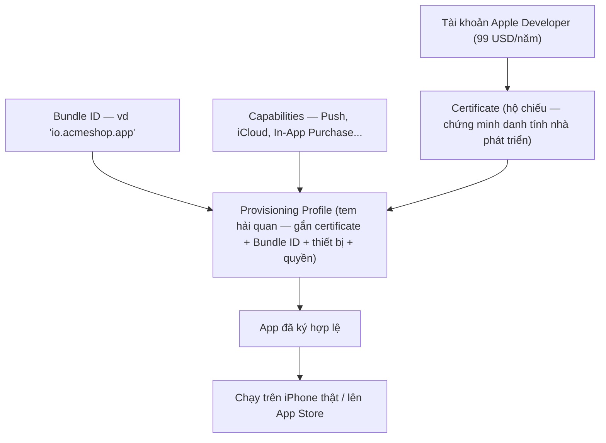
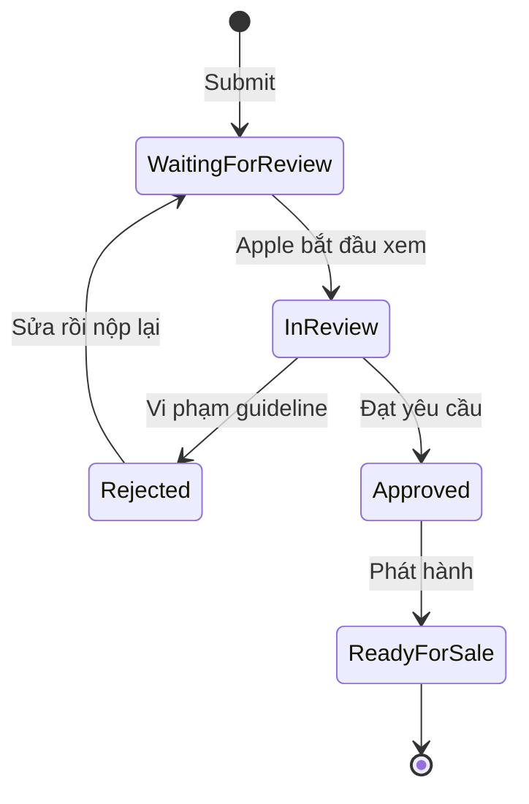

# Xcode, Build & App Store — Từ project đến TestFlight

> **Tác giả:** Mr.Rom\
> **Phiên bản:** v1.0.0\
> **Tạo lúc:** 13/06/2026\
> **Cập nhật:** 13/06/2026\
> **Level:** Basic\
> **Tags:** ios, swift, swiftui, xcode, xcodebuild, signing, provisioning, testflight, app-store-connect, mobile\
> **Yêu cầu trước:** [Data, State & Navigation](03_data-state-and-navigation.md)

> 🎯 *Bạn đã viết xong app Acme Shop bằng SwiftUI — chạy ngon trên Simulator, có dữ liệu thật, có điều hướng. Nhưng "chạy trên máy mình" và "ở trên App Store cho hàng nghìn người tải" là hai thế giới khác nhau. Bài này dắt bạn qua đúng cây cầu đó: hiểu **Xcode** (cấu trúc project, Simulator vs thiết bị thật, debug, thêm thư viện bằng **Swift Package Manager**), giải mã **signing & provisioning** (cái gây khóc nhiều nhất cho người mới iOS), **build + archive** bằng UI lẫn `xcodebuild`, rồi đẩy lên **TestFlight** cho beta test và **App Store Connect** để submit — kèm cách qua được vòng review khét tiếng khắt khe của Apple.*

> [!NOTE]
> Mọi thứ trong bài này cần một máy **Mac** (macOS) và **Xcode** cài từ Mac App Store. Khác với Android (build được trên Windows/Linux), Apple chỉ cho build + ký + submit app iOS từ macOS. Không có Mac thì dùng dịch vụ CI cloud (Codemagic, GitHub Actions macOS runner, Xcode Cloud) — nhưng để học, một chiếc Mac là điều kiện cần.

## 🎯 Sau bài này bạn sẽ

- [ ] Đọc được **cấu trúc một project Xcode** (`.xcodeproj`, target, scheme, build configuration) và chạy app trên **Simulator** lẫn **thiết bị thật**
- [ ] Debug app bằng **breakpoint**, **console (LLDB)** và **View Hierarchy** (xem cây UI 3D khi giao diện vẽ sai)
- [ ] Thêm thư viện ngoài bằng **Swift Package Manager** (SPM)
- [ ] Hiểu **signing & provisioning**: Apple Developer account, certificate, Bundle ID, provisioning profile, capabilities — và vì sao chúng tồn tại
- [ ] **Build** + **Archive** app bằng cả Xcode UI lẫn lệnh `xcodebuild`
- [ ] Đẩy app lên **TestFlight** cho người test beta, rồi submit lên **App Store Connect** qua được vòng review của Apple
- [ ] Đánh **version** + **build number** đúng quy ước, tránh các cạm bẫy review hay làm app bị từ chối (privacy, guideline)

---

## Tình huống — "app chạy trên máy em rồi mà, sao chưa lên store được?"

Bạn báo sếp Acme Shop: *"App xong rồi, chạy mượt trên máy em."* Sếp mở điện thoại của sếp ra: *"Cài cho anh xem."* Và bạn khựng lại — vì app mới chỉ chạy trên **Simulator** trong Xcode của bạn. Để nó chạy trên iPhone thật của sếp, rồi xa hơn là trên App Store cho khách tải, bạn phải đi qua một loạt cửa ải mà từ trước tới giờ ba bài đầu chưa hề đụng tới:

- 😵 Cắm iPhone vào, Xcode báo đỏ: *"Signing for 'AcmeShop' requires a development team."* — "team" là gì, sao phải ký?
- 😵 Muốn gửi app cho 5 đồng nghiệp test thử trước khi public — gửi kiểu gì? Không lẽ ai cũng phải cắm máy vào Xcode của bạn?
- 😵 Nghe đồn Apple review **rất gắt** — app bị từ chối là chuyện thường. Lý do bị từ chối là gì, tránh sao?
- 😵 Mỗi lần sửa rồi nộp lại phải đổi "version" — version với build number khác nhau ra sao?

Ba bài trước dạy bạn **viết** app. Bài này dạy bạn **giao** app — quy trình từ một project trong Xcode tới một icon trên App Store. Ta đi theo đúng thứ tự một app phải trải qua: hiểu công cụ (Xcode) → ký tên hợp lệ (signing) → đóng gói (archive) → phát hành thử (TestFlight) → phát hành thật (App Store).

---

## 1️⃣ Xcode — xưởng lắp ráp app iOS

**Xcode** là *IDE* (Integrated Development Environment — môi trường phát triển tích hợp) chính thức của Apple: nó vừa là trình soạn code, vừa là trình build, debugger, trình giả lập thiết bị, và là cổng để nộp app. Khác với web (bạn ghép VS Code + trình duyệt + terminal tuỳ thích), làm iOS gần như **bắt buộc** dùng Xcode vì chỉ nó có bộ toolchain ký + đóng gói app hợp lệ của Apple.

🪞 **Ẩn dụ**: Xcode giống một **xưởng lắp ráp ô tô khép kín** của hãng. Trong xưởng đó có đủ mọi trạm: trạm hàn khung (compiler), trạm sơn (UI preview), trạm chạy thử trong đường hầm gió (Simulator), trạm kiểm định an toàn (debugger), và trạm dán tem đăng kiểm hợp lệ (signing) trước khi xe được phép ra đường (App Store). Bạn không mang khung xe sang xưởng khác dán tem được — tem chỉ dán hợp lệ trong xưởng của hãng.

### Cấu trúc một project Xcode

Khi tạo project mới (`File ▸ New ▸ Project ▸ App`), Xcode sinh ra một thư mục với vài thành phần. Trước khi xem code, cần biết mỗi mảnh là gì để không hoảng khi nhìn cây file. Đây là layout rút gọn của project `AcmeShop`:

```text
AcmeShop/
├── AcmeShop.xcodeproj/        # "bản thiết kế" project — Xcode đọc file này
├── AcmeShop/                  # mã nguồn app
│   ├── AcmeShopApp.swift      # điểm vào @main (struct App của SwiftUI)
│   ├── ContentView.swift      # view gốc
│   ├── Models/                # model dữ liệu (SwiftData @Model...)
│   ├── Views/                 # các màn hình SwiftUI
│   ├── Assets.xcassets        # ảnh, icon, màu — kho asset
│   └── Info.plist             # cấu hình app (key/value) — rất quan trọng
└── AcmeShopTests/             # unit test
```

Bốn khái niệm cấu hình bạn sẽ nghe suốt, nên định nghĩa rõ một lần. Bảng dưới gom chúng lại — phân biệt được 4 cái này là hiểu 80% cơ chế build của Xcode:

| Khái niệm | Là gì | Ví dụ trong Acme Shop |
|---|---|---|
| **Target** | Một "sản phẩm" mà project tạo ra (app, test bundle, widget...) | Target `AcmeShop` (app chính) + `AcmeShopTests` |
| **Scheme** | Tập cấu hình "build cái gì + chạy thế nào" khi bạn bấm Run | Scheme `AcmeShop` → build target app, chạy ở chế độ Debug |
| **Build configuration** | Bộ cờ biên dịch — `Debug` (có log, không tối ưu) vs `Release` (tối ưu, dùng để phát hành) | Run dùng `Debug`, Archive dùng `Release` |
| **Bundle ID** | Định danh duy nhất toàn cầu của app, dạng tên miền ngược | `io.acmeshop.app` |

Mối quan hệ giữa chúng dễ nhầm, nên nói rõ: một **scheme** trỏ tới một (hoặc nhiều) **target**, và quy định mỗi hành động (Run / Test / Archive) dùng **build configuration** nào. Mặc định Xcode dựng sẵn scheme `AcmeShop` với Run→`Debug`, Archive→`Release`. Người mới gần như không phải tạo scheme mới — chỉ cần biết khi log "biến mất" lúc archive là vì bản `Release` đã gỡ log debug, hoàn toàn bình thường.

> 📖 *Hiểu được cấu trúc rồi, việc đầu tiên ai cũng làm là bấm nút chạy. Nhưng "chạy" ở đâu — máy giả lập hay máy thật — lại là một lựa chọn có ý nghĩa, nên ta tách rõ.*

### Simulator vs thiết bị thật

Trên thanh trên cùng Xcode có một ô chọn **đích chạy** (run destination). Bạn chạy app trên một trong hai nơi, mỗi nơi có lý do riêng:

- **Simulator** — máy iPhone/iPad **giả lập** chạy ngay trên Mac. Khởi động nhanh, không cần cắm cáp, không cần ký phức tạp. Tuyệt cho làm UI hằng ngày. Nhưng nó **không có phần cứng thật**: không camera thật, không cảm biến vân tay/Face ID thật, hiệu năng không phản ánh máy thật, và một số API (vd push notification thật) không chạy.
- **Thiết bị thật** — iPhone/iPad cắm qua cáp (hoặc qua Wi-Fi sau khi pair). Phản ánh đúng hiệu năng, camera, cảm biến, và **bắt buộc** nếu muốn test push notification, In-App Purchase, hay đơn giản là "cầm máy thật bấm thử". Đổi lại, chạy trên máy thật **bắt đầu cần signing** (mục 2).

🪞 **Ẩn dụ**: Simulator như **lái thử xe trong game đua** — nhanh, an toàn, lặp lại bao nhiêu lần cũng được, nhưng không cảm nhận được mặt đường thật. Thiết bị thật là **lái ra đường thật** — phải có bằng lái (certificate) và biển số hợp lệ (provisioning profile) mới được ra.

> [!IMPORTANT]
> UI trông hoàn hảo trên Simulator **không đảm bảo** hoàn hảo trên máy thật: notch/Dynamic Island, vùng an toàn (safe area), tốc độ cuộn list dài, hay ảnh tải qua mạng đều khác. Trước khi phát hành, luôn chạy thử trên **ít nhất một máy thật**.

Lần đầu chạy trên thiết bị thật, các bước thường gặp (chỉ làm một lần cho mỗi máy):

1. Cắm iPhone vào Mac bằng cáp, mở khoá máy, bấm **Trust** (Tin cậy) khi iPhone hỏi.
2. Trong Xcode, ô run destination chọn iPhone của bạn (hiện tên máy thay vì tên Simulator).
3. Lần đầu Xcode báo cần ký — vào `Signing & Capabilities`, chọn **Team** (mục 2). Với Apple ID miễn phí, app vẫn cài được nhưng hết hạn sau 7 ngày.
4. Bấm Run. Lần đầu, iPhone báo *"Untrusted Developer"* — vào `Settings ▸ General ▸ VPN & Device Management`, tin cậy chứng chỉ nhà phát triển của bạn. Chạy lại là xong.

### Debug — breakpoint, console, View Hierarchy

App chạy nhưng cư xử sai là chuyện thường. Xcode cho ba công cụ debug bạn sẽ dùng mỗi ngày, đi từ logic tới giao diện.

**Breakpoint** — đặt một điểm dừng bằng cách bấm vào lề trái (gutter) cạnh số dòng. Khi chạy tới đó, app **đóng băng** và bạn xem được giá trị mọi biến tại thời điểm đó. Đây là cách tìm bug đúng đắn — thay vì rải `print()` khắp nơi rồi đoán.

**Console (LLDB)** — ô cửa sổ dưới cùng Xcode, hiện log app in ra. Quan trọng hơn: khi app dừng ở breakpoint, bạn gõ lệnh **LLDB** (debugger của Apple) để soi sâu. Lệnh hay dùng nhất là `po` (print object) — in ra giá trị một biến:

```text
(lldb) po gioHang.tongTien
1250000

(lldb) po sanPham.ten
"iPhone 15 Pro"
```

Hai dòng `(lldb)` là bạn gõ vào console; dòng dưới mỗi lệnh là kết quả Xcode in ra. `po gioHang.tongTien` đọc giá trị thuộc tính `tongTien` ngay lúc app đang dừng — không cần thêm `print` rồi build lại. Đây là sức mạnh lớn nhất của breakpoint: soi mọi thứ tại đúng thời điểm.

**View Hierarchy** — khi giao diện vẽ sai (chữ bị che, view chồng lên nhau, nút không bấm được vì bị lớp khác phủ), bấm nút **Debug View Hierarchy** (biểu tượng 3 lớp chồng trên thanh debug). Xcode "nổ tung" màn hình thành mô hình **3D xoay được**, cho thấy view nào nằm trên view nào, view nào kích thước 0, view nào nằm ngoài màn hình. Đây là cứu tinh cho mọi bug layout SwiftUI.

🪞 **Ẩn dụ**: View Hierarchy như **chụp X-quang** giao diện — thay vì nhìn bề mặt phẳng, bạn thấy được "bộ xương" các lớp view xếp chồng theo chiều sâu, biết ngay lớp nào đang đè lên lớp nào.

Để thấy rõ "đặt breakpoint rồi soi gì", đây là một đoạn `View` của Acme Shop có lỗi logic — tính sai tổng tiền giỏ hàng. Bạn đặt breakpoint ở dòng tính `tong` để kiểm tra:

```swift
import SwiftUI

struct GioHangView: View {
    let sanPhams: [SanPham]

    var body: some View {
        let tong = tinhTongTien()   // ← đặt breakpoint ở dòng gọi này
        return VStack {
            ForEach(sanPhams) { sp in
                Text("\(sp.ten): \(sp.gia) đ")
            }
            Text("Tổng: \(tong) đ")
        }
    }

    func tinhTongTien() -> Int {
        // 1. Cộng dồn giá từng sản phẩm
        var tong = 0
        for sp in sanPhams {
            tong += sp.gia * sp.soLuong   // ← breakpoint phụ ở đây để soi từng vòng lặp
        }
        return tong
    }
}
```

Khi app dừng ở breakpoint trong `tinhTongTien()`, gõ trong console để soi giá trị từng biến tại đúng vòng lặp đang chạy:

```text
(lldb) po sp.ten
"iPhone 15 Pro"

(lldb) po sp.gia
28000000

(lldb) po sp.soLuong
2

(lldb) po tong
0
```

Nhìn `tong` vẫn `0` ở vòng lặp đầu (trước khi cộng) là bình thường; tiếp tục chạy (`⌃⌘Y` hoặc nút Continue) và gõ lại `po tong` để xem nó cộng dồn đúng chưa. Đây là cách tìm bug logic chính xác hơn nhiều so với đoán mò — bạn thấy *đúng* giá trị tại *đúng* thời điểm.

### Thêm thư viện bằng Swift Package Manager (SPM)

App thật hiếm khi viết tay 100% — bạn cần thư viện cho việc như networking, ảnh, phân tích. **Swift Package Manager** (SPM) là trình quản lý thư viện **chính thức**, tích hợp sẵn trong Xcode (không cần cài thêm như CocoaPods ngày xưa). Nó kéo mã nguồn thư viện từ một URL Git về, biên dịch cùng app.

Thêm package qua UI: menu `File ▸ Add Package Dependencies...`, dán URL repo, chọn quy tắc version. Ví dụ thêm thư viện `Alamofire` (networking phổ biến) — dán URL `https://github.com/Alamofire/Alamofire.git`. Sau khi thêm, dùng trong code như mọi module:

```swift
import SwiftUI
import Alamofire   // thư viện vừa thêm qua SPM

func taiDanhSachSanPham() {
    // 1. Gọi API lấy danh sách sản phẩm Acme Shop
    AF.request("https://api.acmeshop.io/products")
        .responseDecodable(of: [SanPham].self) { response in
            // 2. Xử lý kết quả trả về (đã decode sẵn thành mảng SanPham)
            switch response.result {
            case .success(let dsSanPham):
                print("Tải được \(dsSanPham.count) sản phẩm")
            case .failure(let loi):
                print("Lỗi mạng: \(loi.localizedDescription)")
            }
        }
}
```

> [!TIP]
> Khi chọn version cho package, ưu tiên quy tắc **"Up to Next Major Version"** (vd `from: 5.0.0`). Nó cho phép cập nhật bản vá lỗi và tính năng nhỏ tự động, nhưng **chặn** bản major mới (vd 6.0) có thể phá vỡ API — bạn tự kiểm soát khi nào nâng cấp lớn. Xcode lưu version đã khoá vào file `Package.resolved`, hãy commit file này để cả team dùng đúng version.

→ Vậy là đủ Xcode để làm việc: hiểu project, chạy app hai nơi, debug ba kiểu, thêm thư viện. Nhưng vừa cắm máy thật vào là bạn đụng ngay bức tường lớn nhất của iOS — **signing**. Ta gỡ nó ngay bây giờ.

---

## 2️⃣ Signing & provisioning — vì sao iOS bắt ký từng app

Đây là phần làm người mới iOS khóc nhiều nhất, nhưng một khi hiểu *vì sao* nó tồn tại thì mọi thứ sáng ra. Apple kiểm soát rất chặt: **chỉ app được Apple "đóng dấu" mới chạy được trên iPhone**. Mục tiêu là an toàn — người dùng tải app từ App Store yên tâm rằng app đến từ một nhà phát triển có danh tính thật, không phải mã độc giả mạo.

🪞 **Ẩn dụ — đi qua hải quan sân bay**: Để một kiện hàng (app) bay ra nước ngoài (lên iPhone người khác), bạn cần: (1) **hộ chiếu** chứng minh bạn là ai → đó là **certificate**; (2) **tem hải quan** dán lên kiện hàng cụ thể, ghi rõ kiện này của ai, đi tới đâu, được phép mang theo gì → đó là **provisioning profile**; (3) **số kiện hàng** đăng ký với hải quan → đó là **Bundle ID**; (4) khai báo "trong kiện có gì đặc biệt" (chất lỏng, pin...) → đó là **capabilities**. Thiếu bất kỳ cái nào, hải quan (iPhone) chặn lại.

Sơ đồ dưới gom cả bốn mảnh và cho thấy chúng kết hợp ra "chữ ký hợp lệ" như thế nào. Đây là phần trừu tượng nhất của bài, nên nhìn sơ đồ trước khi đọc giải thích từng mảnh:



→ Mấu chốt từ sơ đồ: **provisioning profile là nơi mọi thứ hội tụ** — nó cột certificate (ai ký) với Bundle ID (app nào) và capabilities (được phép làm gì). Tin tốt là từ Xcode 8 trở đi, có chế độ **Automatically manage signing**: bạn chỉ cần đăng nhập Apple ID và chọn "Team", Xcode tự tạo và làm mới mọi certificate + profile. Người mới gần như không phải đụng tay thủ công.

### Bốn mảnh ghép, giải nghĩa từng cái

Định nghĩa khô bốn thuật ngữ trên để khi Xcode báo lỗi bạn biết nó nói về cái gì:

- **Apple Developer account** — tài khoản nhà phát triển, **99 USD/năm**. Bắt buộc để phát hành lên App Store (và để dùng nhiều capability). Lưu ý: bạn vẫn chạy app trên máy thật của *chính mình* được với tài khoản Apple ID miễn phí (gọi là "free provisioning"), nhưng app hết hạn sau 7 ngày và không lên store được.
- **Certificate** — chứng chỉ số chứng minh "đoạn mã này do nhà phát triển X ký". Có loại *Development* (chạy lúc dev) và *Distribution* (để phát hành). Đây là "hộ chiếu" của bạn.
- **Bundle ID** — định danh app duy nhất toàn cầu, dạng tên miền ngược như `io.acmeshop.app`. Đăng ký một lần trên Apple Developer; mọi thứ (profile, App Store listing) đều móc vào nó. **Đổi Bundle ID = coi như app khác.**
- **Provisioning profile** — file gắn kết certificate + Bundle ID + danh sách thiết bị (với profile development) + capabilities thành một "giấy phép" để app chạy/phát hành.

### Capabilities — bật quyền đặc biệt

**Capabilities** là các năng lực hệ thống mà app phải **khai báo trước** mới dùng được: Push Notifications, Sign in with Apple, iCloud, In-App Purchase, HealthKit... Bật trong Xcode ở tab `Signing & Capabilities` của target (nút `+ Capability`). Khi bật, Xcode tự cập nhật profile và sinh ra file `.entitlements`.

Một số tính năng còn cần khai báo **mục đích sử dụng** trong `Info.plist` — và đây là chỗ cực kỳ quan trọng cho việc qua review (mục 6). Ví dụ app Acme Shop muốn dùng camera để quét mã sản phẩm, bạn **phải** thêm key mô tả lý do, nếu không app **crash ngay** khi mở camera:

```xml
<!-- Info.plist — mô tả lý do xin quyền (Apple BẮT BUỘC, hiện trong popup xin quyền) -->
<key>NSCameraUsageDescription</key>
<string>Acme Shop cần camera để quét mã vạch sản phẩm khi bạn mua hàng.</string>

<key>NSPhotoLibraryUsageDescription</key>
<string>Acme Shop cần truy cập ảnh để bạn tải ảnh đánh giá sản phẩm.</string>
```

> [!WARNING]
> Thiếu key `NSCameraUsageDescription` mà gọi camera → app **crash tức thì** với lỗi runtime (không phải lỗi biên dịch, nên dễ lọt qua lúc dev). Mô tả phải **rõ ràng, đúng sự thật** — Apple review sẽ đọc và từ chối nếu lý do mơ hồ kiểu *"App cần quyền này"*. Mỗi quyền nhạy cảm (camera, vị trí, micro, ảnh, danh bạ...) đều có một key `NS...UsageDescription` riêng.

→ Hiểu signing rồi, app đã ký được để chạy trên máy thật. Bước tiếp theo trên đường ra store là **đóng gói** app thành một sản phẩm phát hành — đó là build và archive.

---

## 3️⃣ Build & Archive — đóng gói app để phát hành

Cần phân biệt rõ hai động tác, vì người mới hay nhầm. **Build** là biên dịch để *chạy thử* (chế độ `Debug`) — nhanh, có log, không tối ưu. **Archive** là đóng gói bản *phát hành* (chế độ `Release`) — tối ưu hiệu năng, gỡ log debug, ký bằng certificate **Distribution**, và tạo ra một file `.xcarchive` để nộp lên store.

🪞 **Ẩn dụ**: Build như **nấu thử một món để nếm** trong bếp nhà — nhanh, nêm nếm thoải mái. Archive như **đóng hộp thành phẩm dán nhãn, niêm phong** để giao cho cửa hàng bán — phải sạch, đẹp, có tem (chữ ký Distribution), đúng quy cách.

### Cách 1 — Archive bằng Xcode UI

Quy trình chuẩn cho người mới, làm bằng chuột. Trước khi archive, chọn đích chạy là **Any iOS Device** (không phải Simulator — không archive bản Simulator để nộp store được). Rồi:

1. Menu `Product ▸ Archive` → Xcode build bản Release và tạo `.xcarchive`.
2. Cửa sổ **Organizer** tự mở, hiện archive vừa tạo.
3. Bấm **Distribute App** → chọn **App Store Connect** → Xcode ký bằng Distribution certificate, đóng gói, và **upload thẳng** lên App Store Connect.

Sau bước 3, archive xuất hiện trong App Store Connect dưới dạng một "build" sẵn sàng cho TestFlight hoặc submit (mục 4, 5).

### Cách 2 — Archive bằng `xcodebuild` (dòng lệnh)

Khi muốn tự động hoá (CI/CD, build trên server không có người ngồi bấm chuột), dùng công cụ dòng lệnh `xcodebuild`. Quy trình hai bước: **archive** rồi **export**. Đây là lệnh archive — chạy trong thư mục chứa project:

```bash
# 1. Archive bản Release thành file .xcarchive
xcodebuild archive \
  -scheme "AcmeShop" \
  -configuration Release \
  -destination "generic/platform=iOS" \
  -archivePath "build/AcmeShop.xcarchive"
```

Kết quả mong đợi ở cuối log (rút gọn):

```text
** ARCHIVE SUCCEEDED **
```

Dòng `** ARCHIVE SUCCEEDED **` báo Xcode đã build và tạo archive thành công vào `build/AcmeShop.xcarchive`. Nếu thấy `** ARCHIVE FAILED **` kèm thông báo đỏ về `Signing`, gần như chắc là vấn đề certificate/profile ở mục 2. Sau khi có archive, **export** nó thành file `.ipa` (gói cài đặt iOS) để upload:

```bash
# 2. Export archive thành .ipa theo cấu hình trong ExportOptions.plist
xcodebuild -exportArchive \
  -archivePath "build/AcmeShop.xcarchive" \
  -exportPath "build/export" \
  -exportOptionsPlist "ExportOptions.plist"
```

Lệnh export cần một file `ExportOptions.plist` mô tả "xuất kiểu gì". File tối giản để nộp App Store như sau — đây là một file plist (định dạng XML key/value của Apple) hợp lệ:

```xml
<?xml version="1.0" encoding="UTF-8"?>
<!DOCTYPE plist PUBLIC "-//Apple//DTD PLIST 1.0//EN"
  "http://www.apple.com/DTDs/PropertyList-1.0.dtd">
<plist version="1.0">
<dict>
    <key>method</key>
    <string>app-store-connect</string>
    <key>teamID</key>
    <string>ABCDE12345</string>
    <key>signingStyle</key>
    <string>automatic</string>
</dict>
</plist>
```

Trong file trên: `method` là `app-store-connect` (xuất để nộp store, khác với `release-testing` cho test nội bộ); `teamID` là mã đội ngũ Apple Developer của bạn (xem trong tài khoản); `signingStyle` đặt `automatic` để Xcode tự lo profile. Sau khi có file `.ipa`, upload bằng lệnh sau (cần đăng nhập App Store Connect qua API key hoặc Apple ID lưu trong Keychain):

```bash
# 3. Upload .ipa lên App Store Connect
xcrun altool --upload-app \
  --type ios \
  --file "build/export/AcmeShop.ipa" \
  --apiKey "XXXXXXXXXX" \
  --apiIssuer "yyyyyyyy-yyyy-yyyy-yyyy-yyyyyyyyyyyy"
```

> [!NOTE]
> Lệnh `xcrun altool --upload-app` vẫn dùng được, nhưng Apple khuyến nghị chuyển sang `xcrun notarytool` cho macOS và dùng API Key (thay vì mật khẩu Apple ID) cho mọi pipeline mới. Với người mới, **cách 1 (Xcode UI)** là đủ và ít sai sót nhất — chỉ học `xcodebuild` khi cần tự động hoá CI/CD.

→ App đã được đóng gói và đẩy lên App Store Connect. Nhưng đừng vội submit cho thế giới — bước khôn ngoan là cho một nhóm nhỏ test trước. Đó là việc của TestFlight.

---

## 4️⃣ TestFlight — phát hành beta trước khi ra mắt thật

**TestFlight** là dịch vụ của Apple để phân phối bản **beta** (thử nghiệm) tới người test, **trước** khi app lên App Store công khai. Người test cài app TestFlight (miễn phí trên store), bạn mời họ, họ nhận được bản app của bạn để dùng thử và gửi phản hồi. Đây là cách đúng để bắt bug trên máy thật của nhiều người trước khi cả thế giới thấy.

🪞 **Ẩn dụ**: TestFlight như **suất chiếu thử của một bộ phim** cho khán giả mời riêng — bạn xem phản ứng, sửa chỗ chưa ổn, rồi mới công chiếu rộng rãi. Tốt hơn nhiều so với ra rạp ngay rồi nhận một sao.

TestFlight chia hai kiểu người test, dùng cho hai mục đích khác nhau:

| Kiểu test | Số người | Cần Apple review? | Khi dùng |
|---|---|---|---|
| **Internal testing** (nội bộ) | Tối đa 100 người, phải có vai trò trong App Store Connect | Không | Test nhanh trong team — build hiện ra gần như tức thì |
| **External testing** (bên ngoài) | Tối đa 10.000 người, mời bằng email hoặc link công khai | Có (review nhẹ lần đầu mỗi build) | Beta rộng cho khách hàng, người ngoài team |

Quy trình đưa một build lên TestFlight, sau khi đã archive + upload (mục 3):

1. Vào **App Store Connect** (`appstoreconnect.apple.com`) → app Acme Shop → tab **TestFlight**.
2. Build vừa upload xuất hiện (trạng thái đầu là **Processing** — Apple đang xử lý, chờ vài phút).
3. Với external testing, điền **"What to Test"** (mô tả cần test gì) và thông tin tuân thủ xuất khẩu mã hoá (Export Compliance — thường chọn "không dùng mã hoá phi tiêu chuẩn").
4. Thêm người test (internal: chọn thành viên; external: nhập email hoặc bật **Public Link**).
5. Người test mở app **TestFlight** trên iPhone → thấy app của bạn → cài → dùng thử.

> [!TIP]
> Dùng **Public Link** của external testing là cách nhanh nhất để cho nhiều người test mà không cần thu thập từng email: bạn được một URL `testflight.apple.com/join/xxxx`, gửi cho ai cũng cài được (trong giới hạn 10.000 người). Rất tiện để gửi cho khách hàng hoặc đăng trong group nội bộ Acme Shop.

→ Beta chạy ổn, người test gật đầu. Giờ mới tới bước cuối và "đáng sợ" nhất với người mới: submit lên App Store và vượt qua vòng review.

---

## 5️⃣ App Store Connect — submit, metadata & vòng review

**App Store Connect** (ASC) là cổng web nơi bạn quản lý mọi thứ về app trên store: thông tin hiển thị (metadata), ảnh chụp màn hình, giá, và nộp app cho Apple review. Đây là "mặt tiền cửa hàng" của app — khách thấy gì trên App Store đều khai báo ở đây.

Trước khi submit, bạn phải điền đầy đủ **metadata** — và Apple kiểm tra kỹ từng phần. Bảng dưới liệt kê các phần bắt buộc; thiếu hoặc sai một phần là bị chặn submit hoặc bị từ chối:

| Phần metadata | Nội dung | Lưu ý dễ sai |
|---|---|---|
| **Tên app** (App Name) | Tên hiển thị trên store, tối đa 30 ký tự | Không chứa từ khoá spam, không trùng app khác |
| **Mô tả** (Description) | Giới thiệu app làm gì | Đúng sự thật, không hứa hẹn quá lố |
| **Ảnh chụp màn hình** (Screenshots) | Ảnh thật của app theo từng cỡ màn hình bắt buộc | Phải là UI thật, không phải mockup ghép |
| **Từ khoá** (Keywords) | Từ khoá tìm kiếm, 100 ký tự | Không nhồi tên đối thủ |
| **Phân loại tuổi** (Age Rating) | Trả lời bộ câu hỏi về nội dung | Khai sai → bị từ chối |
| **Nhãn quyền riêng tư** (Privacy Nutrition Label) | Khai báo app thu thập dữ liệu gì | **Bắt buộc** từ 2020 — khai thiếu là bị chặn |
| **URL chính sách quyền riêng tư** | Link tới trang Privacy Policy | Phải truy cập được, đúng nội dung app |

Sau khi metadata đầy đủ và đã gắn build (chọn build từ TestFlight/đã upload), bấm **Add for Review** → **Submit**. App chuyển sang trạng thái **Waiting for Review** rồi **In Review**.

> 📖 *Submit xong là tới phần khiến developer iOS căng thẳng nhất: con người thật ở Apple sẽ mở app của bạn ra dùng và soi từng điểm. Hiểu họ tìm gì giúp bạn qua ngay từ lần đầu.*

### Vòng review của Apple — vì sao khắt khe và họ tìm gì

Khác Google Play (review chủ yếu tự động, nhanh), Apple có **người thật** test app của bạn theo bộ **App Store Review Guidelines**. Họ nổi tiếng gắt vì Apple muốn giữ chất lượng và an toàn cho hệ sinh thái. App bị từ chối là **rất bình thường** — đừng nản, hãy đọc lý do (Apple ghi rõ trong Resolution Center) và sửa.

Sơ đồ trạng thái dưới mô tả vòng đời một lần submit — biết mình đang ở đâu giúp bớt lo khi app "đứng im" ở một trạng thái:



→ Điểm cần nhớ: từ `Rejected` bạn quay lại `WaitingForReview` sau khi sửa — không phải làm lại từ đầu, chỉ nộp lại build/metadata đã chỉnh. Vòng lặp này lặp tới khi `Approved`.

### Versioning — version vs build number

Mỗi lần nộp lại bạn phải hiểu hai con số trong `Info.plist`, vì nhầm chúng là lý do upload bị từ chối phổ biến:

- **Version** (`CFBundleShortVersionString`) — số phiên bản người dùng **thấy** trên App Store, dạng SemVer: `1.0.0`, `1.1.0`, `2.0.0`. Tăng khi phát hành tính năng/sửa lỗi cho người dùng.
- **Build number** (`CFBundleVersion`) — số **nội bộ** để phân biệt từng lần upload. Với cùng một version, **mỗi build upload lên ASC phải có build number tăng dần** (`1`, `2`, `3`...) — upload trùng số là bị từ chối ngay.

Ví dụ trong `Info.plist` cho bản phát hành đầu tiên của Acme Shop:

```xml
<!-- Info.plist — version người dùng thấy + build number nội bộ -->
<key>CFBundleShortVersionString</key>
<string>1.0.0</string>
<key>CFBundleVersion</key>
<string>3</string>
```

Ở đây version là `1.0.0` (khách thấy "phiên bản 1.0.0"), nhưng build number là `3` — nghĩa là đây là lần upload thứ ba của version đó lên ASC (hai lần trước có thể bị từ chối hoặc dùng để test TestFlight). Khi ra `1.0.1`, bạn reset build number về `1` cũng được, miễn không trùng trong cùng một version.

> [!IMPORTANT]
> Lỗi upload kinh điển: *"The bundle version must be higher than the previously uploaded version."* Nghĩa là **build number** chưa tăng so với lần upload trước. Sửa: tăng `CFBundleVersion` lên một đơn vị rồi archive lại. Đây không phải lỗi code — chỉ là quên tăng số.

---

## 6️⃣ Cạm bẫy review — vì sao app hay bị Apple từ chối

Vì review của Apple là cửa ải thật, gom riêng những lý do từ chối phổ biến nhất để bạn né trước. Đây là phần "khi nào / coi chừng" đáng giá nhất của bài:

- **Crash hoặc bug rõ ràng** — reviewer mở app thấy treo, trắng màn hình, nút không bấm được → từ chối ngay. Luôn test bản Release trên máy thật trước khi submit.
- **Thiếu hoặc sai privacy** — không có Privacy Policy URL, khai sai Privacy Nutrition Label, hoặc thiếu chuỗi `NS...UsageDescription` cho quyền đang dùng. Đây là nhóm bị từ chối **nhiều nhất** với app thương mại điện tử như Acme Shop (vì có login, có camera, có vị trí giao hàng).
- **App "rỗng" hoặc chỉ là website đóng gói** — guideline 4.2 yêu cầu app phải có giá trị native thật, không chỉ là một WebView bọc website. Acme Shop native bằng SwiftUI thì an toàn, nhưng đừng nhét toàn `WKWebView` trỏ về web.
- **Đăng nhập bắt buộc nhưng không cho dùng thử** — nếu bắt đăng nhập mới xem được gì, Apple thường yêu cầu cung cấp **tài khoản demo** trong phần "App Review Information" để reviewer đăng nhập test.
- **Mua bán ngoài hệ thống Apple** — bán hàng hoá/dịch vụ số (vd: mở khoá tính năng) **phải** dùng In-App Purchase, không được dẫn ra cổng thanh toán ngoài (guideline 3.1.1). Lưu ý: bán **hàng hoá vật lý** như Acme Shop bán điện thoại thật thì **được** dùng cổng thanh toán thường (Apple Pay/thẻ) — IAP chỉ áp cho hàng số.
- **Metadata không khớp app** — ảnh chụp màn hình không phải UI thật, mô tả hứa tính năng app không có.

## 💡 Cạm bẫy thường gặp & Best practice

### ❌ Cạm bẫy: Quên `NS...UsageDescription` khiến app crash khi xin quyền

- **Triệu chứng**: App chạy ngon trên Simulator lúc dev, nhưng khi người dùng (hoặc reviewer) bấm tính năng cần camera/vị trí/ảnh thì app **văng ra ngoài** ngay lập tức.
- **Nguyên nhân**: iOS bắt buộc mọi quyền nhạy cảm phải có chuỗi mô tả lý do trong `Info.plist` (`NSCameraUsageDescription`, `NSLocationWhenInUseUsageDescription`...). Thiếu chuỗi này, hệ thống không cho hiện popup xin quyền mà **kết liễu app** — và đây là lỗi runtime, không phải lỗi biên dịch nên dễ lọt.
- **Cách tránh**: Mỗi khi thêm một tính năng dùng quyền, thêm ngay key mô tả tương ứng vào `Info.plist` với lý do rõ ràng, đúng sự thật. Test trên **máy thật** (Simulator đôi khi không kích đúng luồng quyền).

### ❌ Cạm bẫy: Nhầm Build number với Version khi upload

- **Triệu chứng**: Upload build mới lên App Store Connect bị chặn với lỗi *"bundle version must be higher..."* dù bạn "thấy đã đổi version rồi".
- **Nguyên nhân**: Bạn đổi **version** (`CFBundleShortVersionString`) nhưng quên tăng **build number** (`CFBundleVersion`) — ASC phân biệt từng lần upload bằng build number, không phải version.
- **Cách tránh**: Mỗi lần archive để upload, **tăng `CFBundleVersion` lên một**. Có thể tự động hoá bằng script tăng build number trước khi archive trong CI.

### ✅ Best practice: Bật "Automatically manage signing" cho tới khi thật sự cần làm thủ công

- **Vì sao**: Quản lý certificate + provisioning profile bằng tay là nguồn lỗi vô tận cho người mới (profile hết hạn, certificate sai, thiết bị chưa đăng ký). Xcode tự lo những việc này chính xác trong đa số trường hợp.
- **Cách áp dụng**: Trong tab `Signing & Capabilities`, tick **Automatically manage signing** và chọn đúng Team. Chỉ chuyển sang manual signing khi vào CI/CD nhiều thành viên cần chia sẻ certificate (lúc đó dùng công cụ như `fastlane match`).

### ✅ Best practice: Luôn cho beta qua TestFlight trước khi submit App Store

- **Vì sao**: Bắt bug trên máy thật của nhiều người, nhiều cỡ màn hình, nhiều phiên bản iOS *trước* khi reviewer của Apple (và khách hàng) gặp chúng. Một bản crash bị Apple từ chối mất nhiều ngày chờ; bắt sớm ở TestFlight rẻ hơn nhiều.
- **Cách áp dụng**: Mỗi version mới, đưa lên **internal testing** cho team trước (gần như tức thì), rồi **external testing** cho một nhóm khách hàng. Chỉ submit App Store sau khi beta ổn định.

---

## 🧠 Tự kiểm tra (Self-check)

**Q1.** Khác biệt giữa **Build** và **Archive** là gì? Khi nào dùng cái nào?

<details>
<summary>💡 Xem giải thích</summary>

**Build** biên dịch app ở chế độ `Debug` để *chạy thử* — nhanh, có log, không tối ưu, ký bằng certificate Development. Dùng hằng ngày khi phát triển.

**Archive** đóng gói bản *phát hành* ở chế độ `Release` — tối ưu hiệu năng, gỡ log debug, ký bằng certificate **Distribution**, tạo file `.xcarchive` để nộp lên App Store Connect. Dùng khi chuẩn bị phát hành (TestFlight hoặc App Store). Trước khi archive phải chọn đích là "Any iOS Device", không archive bản Simulator.

</details>

**Q2.** Kể tên 4 mảnh ghép của signing iOS và vai trò mỗi cái (theo ẩn dụ hải quan).

<details>
<summary>💡 Xem giải thích</summary>

- **Certificate** = hộ chiếu — chứng minh danh tính nhà phát triển đã ký mã.
- **Bundle ID** = số kiện hàng đăng ký — định danh app duy nhất toàn cầu (vd `io.acmeshop.app`).
- **Capabilities** = khai báo "trong kiện có gì đặc biệt" — quyền hệ thống app dùng (Push, iCloud, IAP...).
- **Provisioning profile** = tem hải quan — gắn certificate + Bundle ID + thiết bị + capabilities thành giấy phép cho app chạy/phát hành.

Từ Xcode 8+, **Automatically manage signing** tự tạo và làm mới certificate + profile, người mới gần như không phải làm thủ công.

</details>

**Q3.** App chạy ngon trên Simulator nhưng mở camera thì crash trên máy thật. Nguyên nhân khả dĩ nhất và cách sửa?

<details>
<summary>💡 Xem giải thích</summary>

Khả năng cao là thiếu key **`NSCameraUsageDescription`** trong `Info.plist`. iOS bắt mọi quyền nhạy cảm phải có chuỗi mô tả lý do; thiếu nó hệ thống không hiện popup xin quyền mà **kết liễu app** ngay (lỗi runtime, không phải lỗi biên dịch).

Sửa: thêm vào `Info.plist`:

```xml
<key>NSCameraUsageDescription</key>
<string>Acme Shop cần camera để quét mã vạch sản phẩm.</string>
```

Mô tả phải rõ ràng, đúng sự thật — Apple review cũng đọc chuỗi này.

</details>

**Q4.** Phân biệt **internal testing** và **external testing** của TestFlight. Cái nào cần Apple review?

<details>
<summary>💡 Xem giải thích</summary>

**Internal testing**: tối đa 100 người có vai trò trong App Store Connect, **không cần** Apple review, build hiện gần như tức thì — dùng để test nhanh trong team.

**External testing**: tối đa 10.000 người mời bằng email hoặc Public Link, **cần** Apple review (nhẹ, lần đầu mỗi build) — dùng cho beta rộng với khách hàng/người ngoài team.

</details>

**Q5.** Upload build mới lên App Store Connect báo lỗi *"bundle version must be higher than the previously uploaded version"* dù bạn đã đổi sang version `1.1.0`. Vì sao và sửa thế nào?

<details>
<summary>💡 Xem giải thích</summary>

Lỗi nói về **build number** (`CFBundleVersion`), không phải version người dùng thấy (`CFBundleShortVersionString`). ASC phân biệt từng lần upload bằng build number, và nó phải **tăng dần** so với lần upload trước.

Sửa: tăng `CFBundleVersion` lên một đơn vị (vd từ `2` lên `3`) trong `Info.plist`, rồi archive lại. Đây không phải lỗi code.

</details>

**Q6.** Acme Shop bán điện thoại thật (hàng hoá vật lý) và có cả tính năng mở khoá "gói thành viên VIP" trong app. Cái nào phải dùng In-App Purchase, cái nào dùng được cổng thanh toán thường?

<details>
<summary>💡 Xem giải thích</summary>

- **Bán điện thoại thật** (hàng hoá vật lý giao tận tay): **được** dùng cổng thanh toán thường (thẻ, Apple Pay) — guideline không bắt IAP cho hàng vật lý.
- **Gói thành viên VIP** (dịch vụ/nội dung số mở khoá trong app): **phải** dùng **In-App Purchase** (guideline 3.1.1), không được dẫn ra cổng thanh toán ngoài.

Nhầm lẫn chỗ này (bán hàng số qua cổng ngoài) là lý do từ chối phổ biến.

</details>

---

## ⚡ Tra cứu nhanh (Cheatsheet)

| Mục đích | Lệnh / Thao tác |
|---|---|
| Chạy app (Run) | `⌘R` trong Xcode |
| Archive bản phát hành | `Product ▸ Archive` (chọn đích "Any iOS Device") |
| Debug View Hierarchy | Nút 3 lớp chồng trên thanh debug khi app đang chạy |
| In biến trong console | `(lldb) po tenBien` |
| Thêm thư viện SPM | `File ▸ Add Package Dependencies...` + URL Git |
| Archive bằng dòng lệnh | `xcodebuild archive -scheme "AcmeShop" -configuration Release -destination "generic/platform=iOS" -archivePath build/AcmeShop.xcarchive` |
| Export .ipa | `xcodebuild -exportArchive -archivePath ... -exportPath ... -exportOptionsPlist ExportOptions.plist` |
| Upload lên ASC | `xcrun altool --upload-app --type ios --file App.ipa --apiKey ... --apiIssuer ...` |
| Version người dùng thấy | `CFBundleShortVersionString` trong `Info.plist` (vd `1.0.0`) |
| Build number nội bộ | `CFBundleVersion` (tăng mỗi lần upload) |
| Mô tả quyền camera | Key `NSCameraUsageDescription` trong `Info.plist` |
| Mời người test beta | App Store Connect ▸ TestFlight ▸ thêm tester / bật Public Link |
| Submit App Store | App Store Connect ▸ điền metadata ▸ Add for Review ▸ Submit |

---

## 📚 Từ Điển Thuật Ngữ (Glossary)

| EN | VN | Giải thích |
|---|---|---|
| Xcode | Xcode | IDE chính thức của Apple để code, build, debug, ký và nộp app iOS |
| Simulator | Trình giả lập | iPhone/iPad ảo chạy trên Mac — nhanh nhưng không có phần cứng thật |
| Target | Target | Một sản phẩm project tạo ra (app, test bundle, widget...) |
| Scheme | Scheme | Cấu hình "build cái gì + chạy thế nào" khi bấm Run |
| Build configuration | Cấu hình build | Bộ cờ biên dịch — `Debug` (chạy thử) vs `Release` (phát hành) |
| Bundle ID | Định danh app | ID app duy nhất toàn cầu, dạng tên miền ngược (vd `io.acmeshop.app`) |
| Breakpoint | Điểm dừng | Điểm app đóng băng để xem giá trị biến lúc chạy |
| LLDB | LLDB | Debugger của Apple; lệnh `po` in giá trị object trong console |
| View Hierarchy | Cây view | Mô hình 3D các lớp view xếp chồng — dò bug layout |
| SPM (Swift Package Manager) | Trình quản lý gói Swift | Trình quản lý thư viện chính thức tích hợp sẵn Xcode |
| Apple Developer | Tài khoản nhà phát triển | Tài khoản 99 USD/năm để phát hành lên App Store |
| Certificate | Chứng chỉ | "Hộ chiếu" chứng minh nhà phát triển đã ký mã (Development/Distribution) |
| Provisioning profile | Hồ sơ cấp phép | File gắn certificate + Bundle ID + thiết bị + capabilities thành giấy phép |
| Capabilities | Năng lực | Quyền hệ thống app phải khai báo trước (Push, iCloud, IAP...) |
| Entitlements | Quyền hạn | File mô tả các capability app được cấp |
| Archive | Đóng gói phát hành | Bản Release đóng thành `.xcarchive` để nộp store |
| .ipa | Gói cài đặt iOS | File cài đặt app iOS xuất ra từ archive |
| TestFlight | TestFlight | Dịch vụ phân phối bản beta cho người test trước khi lên store |
| App Store Connect | App Store Connect | Cổng web quản lý metadata, build, submit app |
| Metadata | Siêu dữ liệu | Thông tin hiển thị app trên store (tên, mô tả, ảnh, từ khoá...) |
| Privacy Nutrition Label | Nhãn quyền riêng tư | Khai báo app thu thập dữ liệu gì — bắt buộc từ 2020 |
| In-App Purchase (IAP) | Mua trong ứng dụng | Cơ chế bắt buộc để bán hàng/dịch vụ số trong app |
| Version | Phiên bản | Số người dùng thấy (`CFBundleShortVersionString`), dạng SemVer |
| Build number | Số build | Số nội bộ phân biệt từng lần upload (`CFBundleVersion`), phải tăng dần |
| Review Guidelines | Hướng dẫn xét duyệt | Bộ quy tắc Apple dùng để duyệt app |

---

## 🔗 Liên kết & Tài nguyên

⬅️ **Bài trước:** [Data, State & Navigation — @Observable, networking, SwiftData](03_data-state-and-navigation.md)\
↑ **Về cụm:** [iOS & Swift cơ bản](../../README.md)

### 🧭 Định hướng lộ trình học

- [Lập trình iOS là gì? — Swift, Xcode, SwiftUI](00_what-is-ios-development.md) — nền tảng đầu cụm, đặt Xcode vào bức tranh lớn
- [Data, State & Navigation — @Observable, networking, SwiftData](03_data-state-and-navigation.md) — bài trước: hoàn thiện app trước khi đem đi phát hành

### 🧩 Các chủ đề có thể bạn quan tâm

- [Build, Debug & Publish — Từ Metro đến App Store/Play Store](../../../react-native/lessons/01_basic/04_build-debug-and-publish.md) — đối chiếu cách React Native đẩy app lên store (EAS thay cho Xcode archive)
- [Navigation, Build & Deploy — đưa app Flutter ra store](../../../flutter/lessons/01_basic/04_navigation-build-and-deploy.md) — quy trình tương đương bên Flutter
- [Khi nào chọn cross-platform vs native](../../../cross-platform-concepts/lessons/01_basic/04_when-cross-platform-vs-native.md) — cân nhắc đánh đổi giữa native iOS và đa nền tảng

### 🌐 Tài nguyên tham khảo khác

- [App Store Review Guidelines](https://developer.apple.com/app-store/review/guidelines/) — bộ quy tắc gốc Apple dùng để duyệt app, đọc trước khi submit
- [TestFlight — Apple Developer](https://developer.apple.com/testflight/) — tài liệu chính thức về phân phối beta
- [Distributing your app — Xcode docs](https://developer.apple.com/documentation/xcode/distributing-your-app-for-beta-testing-and-releases) — quy trình archive + distribute chính thức
- [Swift Package Manager](https://www.swift.org/package-manager/) — trang chính thức về SPM

---

> 🎯 *Đây là bài cuối cụm iOS & Swift cơ bản. Bạn đã đi trọn vòng: từ Swift, SwiftUI, dữ liệu & điều hướng, tới đóng gói và đưa app lên App Store. Acme Shop giờ không còn nằm trong Simulator — nó sẵn sàng ra với người dùng thật.*

---

## 📌 Nhật ký thay đổi (Changelog)

- **v1.0.0 (13/06/2026)** — Bản đầu tiên. Cụm `ios-swift/` lesson 5/5 (basic), đóng cụm. Cover: Xcode (cấu trúc project — target/scheme/build configuration/Bundle ID, Simulator vs thiết bị thật, debug bằng breakpoint + LLDB `po` + View Hierarchy, thêm thư viện qua Swift Package Manager) + signing & provisioning (Apple Developer 99 USD/năm, certificate, Bundle ID, provisioning profile, capabilities, `Automatically manage signing`, `NS...UsageDescription` trong Info.plist) + build vs archive (Xcode UI + `xcodebuild archive`/`-exportArchive` + ExportOptions.plist + `xcrun altool`) + TestFlight (internal vs external testing, Public Link) + App Store Connect (metadata, Privacy Nutrition Label, submit, vòng review) + versioning (`CFBundleShortVersionString` vs `CFBundleVersion`) + cạm bẫy review (privacy, guideline 4.2 WebView, 3.1.1 IAP, demo account, crash). 2 sơ đồ mermaid (kiến trúc signing, vòng đời trạng thái review). Cạm bẫy: thiếu NSUsageDescription, nhầm build number/version.
